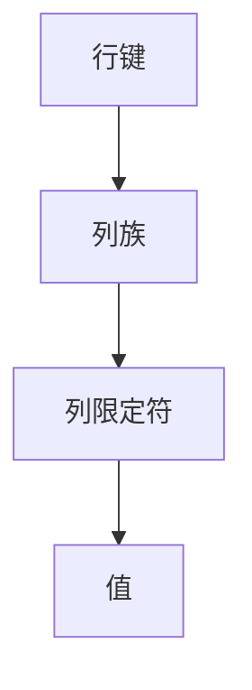
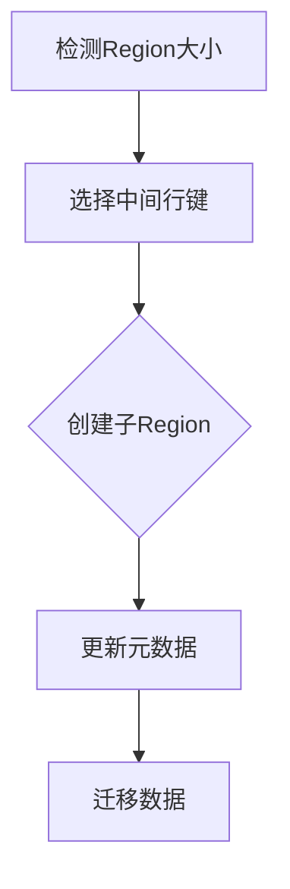
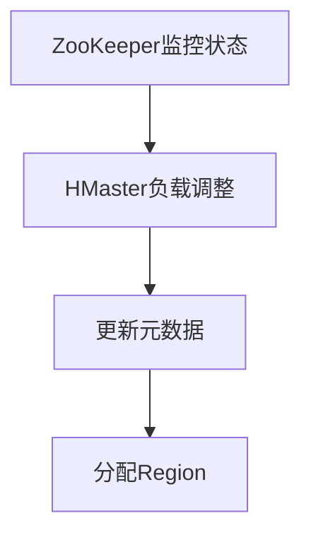
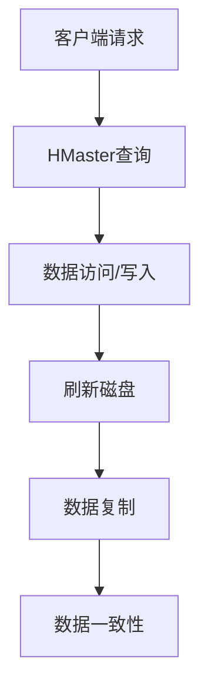
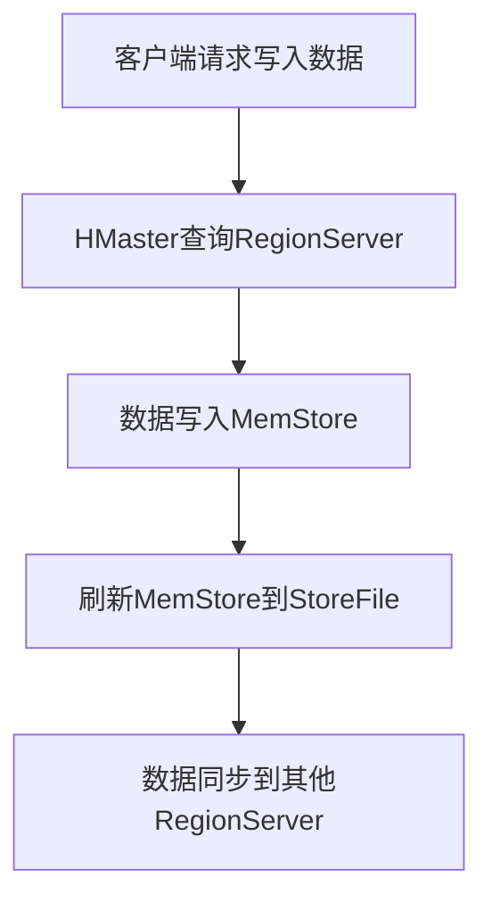
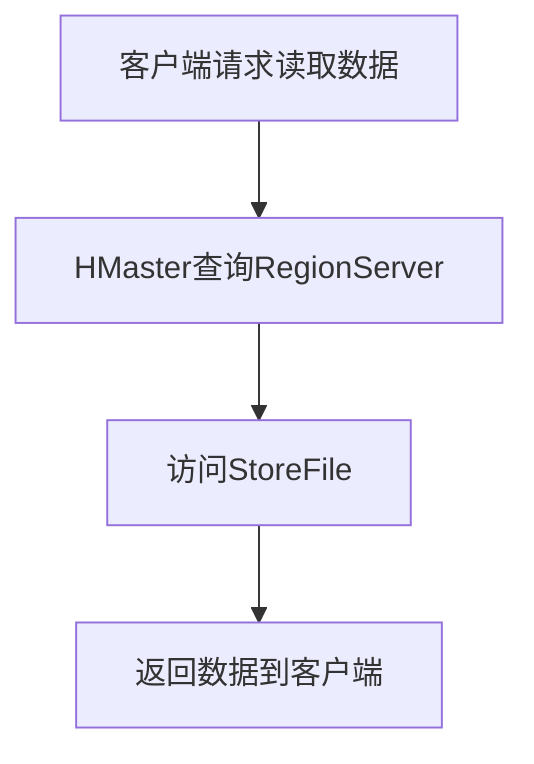
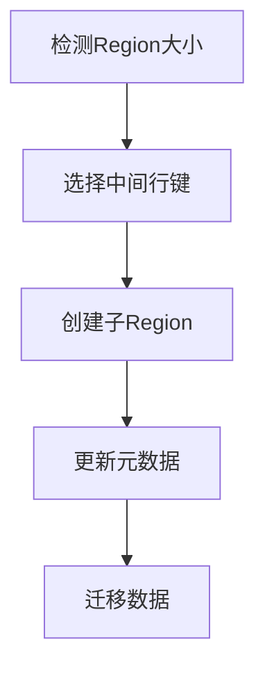

                 

### 《HBase原理与代码实例讲解》

> **关键词：** HBase、分布式存储、NoSQL数据库、Hadoop生态系统、数据模型、Region、性能优化、安全性、集成应用、项目实战。

> **摘要：** 本文章深入讲解HBase的原理、架构和高级特性，通过代码实例详细剖析其实现和操作。文章涵盖了HBase的核心概念、数据模型、读写流程、配置与部署、性能优化、安全性以及与大数据生态系统的集成。通过一个实际项目案例，读者可以了解HBase的应用和实践，并掌握其关键代码实现和性能分析。

**目录**

### 《HBase原理与代码实例讲解》目录大纲

# 第一部分：HBase基础原理

## 第1章：HBase概述
### 1.1 HBase简介
### 1.2 HBase的架构
### 1.3 HBase与Hadoop的关系
### 1.4 HBase的典型应用场景

## 第2章：HBase核心概念
### 2.1 HBase的数据模型
### 2.2 Region和RegionServer
### 2.3 ZooKeeper在HBase中的作用
### 2.4 HBase的读写流程

## 第3章：HBase配置与部署
### 3.1 HBase的安装与配置
### 3.2 HBase集群的搭建
### 3.3 HBase的性能调优

## 第4章：HBase shell操作
### 4.1 HBase shell简介
### 4.2 创建、删除和修改表
### 4.3 数据的插入、更新和删除
### 4.4 查询数据

# 第二部分：HBase高级特性

## 第5章：HBase性能优化
### 5.1 HBase性能瓶颈分析
### 5.2 HBase性能调优策略
### 5.3 HBase缓存机制

## 第6章：HBase安全性
### 6.1 HBase的安全性概述
### 6.2 HBase权限控制
### 6.3 审计日志和监控

## 第7章：HBase与大数据生态的集成
### 7.1 HBase与Hadoop的集成
### 7.2 HBase与Spark的集成
### 7.3 HBase与Hive的集成

## 第8章：HBase项目实战
### 8.1 项目背景
### 8.2 需求分析
### 8.3 系统设计
### 8.4 数据存储模型设计
### 8.5 代码实现与解读
### 8.6 项目测试与性能分析

## 第9章：HBase的未来发展趋势
### 9.1 HBase的改进和优化方向
### 9.2 HBase与其他数据库的比较
### 9.3 HBase在未来的应用前景

# 附录

## 附录A：HBase常用工具与命令
### A.1 HBase常用命令
### A.2 HBase常用工具

## 附录B：HBase Mermaid流程图
### B.1 数据写入流程
### B.2 数据读取流程
### B.3 Region分裂流程

## 附录C：HBase核心算法原理与伪代码
### C.1 获取数据的算法
### C.2 数据写入算法
### C.3 Region分裂算法

## 附录D：HBase数学模型与公式
### D.1 数据存储公式
### D.2 数据访问时间公式
### D.3 数据一致性模型

## 附录E：HBase项目实战代码解读
### E.1 数据存储模块代码解读
### E.2 数据读取模块代码解读
### E.3 性能分析模块代码解读

### 第一部分：HBase基础原理

#### 第1章：HBase概述

HBase是一种分布式、可扩展、高性能的NoSQL数据库，它基于Google的BigTable论文设计，并作为Hadoop生态系统的一部分。HBase旨在解决大规模数据存储和快速随机访问的需求，特别是在大数据环境中。

### 1.1 HBase简介

HBase的核心理念是数据存储在分布式表中，数据以行键（row key）、列族（column family）和列限定符（qualifier）进行组织。HBase提供了自动分片、负载均衡、数据复制和数据一致性保证等功能。

### 1.2 HBase的架构

HBase的架构由四部分组成：HMaster、RegionServer、ZooKeeper和HBase客户端。HMaster负责整个集群的管理，RegionServer负责数据的存储和访问，ZooKeeper用于维护集群的状态和协调分布式操作，HBase客户端提供数据访问接口。

### 1.3 HBase与Hadoop的关系

HBase是Hadoop生态系统的一个重要组件，它与Hadoop的紧密集成使得HBase能够利用Hadoop的强大数据处理能力。HBase的数据可以与HDFS进行无缝集成，从而实现数据的存储、处理和分析。

### 1.4 HBase的典型应用场景

HBase适用于需要快速随机访问的大规模数据场景，如实时日志分析、实时搜索引擎、实时推荐系统和大数据分析等。

#### 第2章：HBase核心概念

HBase的数据模型是其核心概念之一。数据模型包括行键、列族和列限定符。行键是数据表中的唯一标识，列族是一组相关的列的集合，而列限定符则是具体的列值。

### 2.1 HBase的数据模型

HBase的数据模型类似于一个多维的表格，数据以行键为索引，列族和列限定符作为维度。行键通常是整数或字符串，列族和列限定符则可以是任意的字节序列。

### 2.2 Region和RegionServer

Region是HBase中数据的组织单位，一个Region包含一定范围的行键。RegionServer负责存储和管理一个或多个Region。当Region的大小超过一定阈值时，会触发Region分裂，从而实现水平扩展。

### 2.3 ZooKeeper在HBase中的作用

ZooKeeper在HBase中起到至关重要的作用，它负责维护集群状态、协调分布式操作、实现负载均衡和数据一致性保证。ZooKeeper中的节点用于存储HMaster、RegionServer和其他元数据信息。

### 2.4 HBase的读写流程

HBase的读写流程包括数据访问、数据存储和数据同步。数据访问过程中，客户端通过HMaster获取RegionServer的地址，然后通过RegionServer获取数据。数据存储过程中，数据首先写入内存中的MemStore，然后刷新到磁盘上的StoreFile。数据同步过程中，数据会在不同RegionServer之间进行复制，以保证数据一致性和容错能力。

#### 第3章：HBase配置与部署

HBase的配置和部署是确保其正常运行的关键步骤。本节将详细介绍HBase的安装与配置、集群搭建以及性能调优。

### 3.1 HBase的安装与配置

HBase的安装过程相对简单，主要涉及Hadoop和ZooKeeper的安装。配置方面，需要设置HBase的目录结构、HDFS的命名空间、ZooKeeper的集群配置等。

### 3.2 HBase集群的搭建

搭建HBase集群需要配置HMaster、RegionServer和ZooKeeper。通常，HMaster和ZooKeeper可以部署在同一台机器上，而RegionServer可以部署在多台机器上以实现负载均衡和高可用性。

### 3.3 HBase的性能调优

HBase的性能调优主要包括内存配置、磁盘配置、数据分区策略、负载均衡和缓存机制。通过调整这些参数，可以优化HBase的性能，提高数据处理能力。

#### 第4章：HBase shell操作

HBase shell是一个强大的命令行工具，用于与HBase进行交互。本节将介绍HBase shell的常用操作，包括表的创建、删除和修改，数据的插入、更新和删除，以及数据的查询。

### 4.1 HBase shell简介

HBase shell提供了一个简单的命令行接口，允许用户执行各种操作，如创建表、插入数据、查询数据和监控集群状态。HBase shell使用起来非常直观，是学习和使用HBase的重要工具。

### 4.2 创建、删除和修改表

在HBase中，表是数据存储的基本单位。用户可以使用HBase shell创建、删除和修改表。创建表时，需要指定表名、列族等信息。删除表时，会删除表中的所有数据。修改表时，可以增加或删除列族，修改表属性等。

### 4.3 数据的插入、更新和删除

在HBase中，数据的插入、更新和删除是常见操作。插入数据时，需要指定行键、列族和列限定符。更新数据时，可以修改已有数据的值。删除数据时，可以删除整个行或特定列的数据。

### 4.4 查询数据

HBase提供了多种查询方式，包括基于行键的查询、基于列族的查询和基于范围查询。用户可以使用HBase shell执行这些查询，并获取查询结果。

### 第二部分：HBase高级特性

#### 第5章：HBase性能优化

HBase的性能优化是提高其数据处理能力的关键。本节将介绍HBase的性能瓶颈分析、性能调优策略以及缓存机制。

### 5.1 HBase性能瓶颈分析

HBase的性能瓶颈可能源于多个方面，如内存配置不足、磁盘I/O瓶颈、网络延迟、数据分区不均衡等。通过分析性能瓶颈，可以针对性地进行优化。

### 5.2 HBase性能调优策略

HBase性能调优策略包括调整内存配置、优化数据分区、优化数据存储格式、启用缓存机制等。通过合理配置和优化，可以显著提升HBase的性能。

### 5.3 HBase缓存机制

HBase提供了多种缓存机制，如BlockCache、MemStore等。这些缓存机制可以减少磁盘I/O操作，提高数据访问速度，从而优化HBase的性能。

#### 第6章：HBase安全性

HBase的安全性是保护数据的重要保障。本节将介绍HBase的安全性概述、权限控制以及审计日志和监控。

### 6.1 HBase的安全性概述

HBase的安全性包括数据加密、用户认证、权限控制等。通过这些安全措施，可以确保数据在存储、传输和处理过程中的安全性。

### 6.2 HBase权限控制

HBase提供了细粒度的权限控制机制，用户可以根据需要设置表和列的访问权限。通过权限控制，可以限制对数据的访问，保护数据的安全。

### 6.3 审计日志和监控

HBase提供了审计日志和监控功能，用于记录系统操作和监控集群状态。通过审计日志和监控，可以及时发现和处理潜在的安全问题。

#### 第7章：HBase与大数据生态的集成

HBase作为大数据生态系统的一部分，可以与其他大数据工具和框架进行集成，以实现更强大的数据处理和分析能力。本节将介绍HBase与Hadoop、Spark和Hive的集成。

### 7.1 HBase与Hadoop的集成

HBase与Hadoop的集成使得HBase的数据可以与Hadoop的其他组件（如MapReduce、YARN、HDFS）无缝集成，实现数据的存储、处理和分析。

### 7.2 HBase与Spark的集成

HBase与Spark的集成使得Spark可以直接访问HBase中的数据，从而实现高效的数据处理和分析。通过这种集成，可以充分发挥HBase和Spark的优势。

### 7.3 HBase与Hive的集成

HBase与Hive的集成使得HBase的数据可以与Hive进行数据交换，实现Hive对HBase数据的查询和分析。这种集成为HBase提供了丰富的数据处理和分析工具。

#### 第8章：HBase项目实战

通过实际项目案例，读者可以更深入地了解HBase的应用和实践。本节将介绍一个实际项目案例，包括项目背景、需求分析、系统设计、数据存储模型设计、代码实现与解读以及项目测试与性能分析。

### 8.1 项目背景

项目背景描述了实际应用场景，如实时日志分析、实时推荐系统等，这些场景中HBase作为数据存储和处理的核心组件。

### 8.2 需求分析

需求分析部分详细阐述了项目的需求，包括数据的存储需求、访问需求、性能需求等，为后续的设计和实现提供了基础。

### 8.3 系统设计

系统设计部分描述了项目的整体架构，包括数据存储、数据处理、数据访问等模块，以及各个模块之间的交互关系。

### 8.4 数据存储模型设计

数据存储模型设计部分详细说明了HBase中的数据存储模型，包括行键设计、列族设计、列限定符设计等，以及数据存储的优化策略。

### 8.5 代码实现与解读

代码实现与解读部分提供了项目的具体实现代码，并详细解释了代码的各个部分，包括数据存储、数据读取、性能分析等。

### 8.6 项目测试与性能分析

项目测试与性能分析部分对项目进行了测试和性能分析，包括数据插入、数据查询、数据更新等操作的测试，以及性能分析的结果和优化建议。

#### 第9章：HBase的未来发展趋势

HBase作为大数据领域的重要组件，其未来发展趋势备受关注。本节将介绍HBase的改进和优化方向、与其他数据库的比较以及未来的应用前景。

### 9.1 HBase的改进和优化方向

HBase的改进和优化方向包括性能优化、存储优化、数据模型优化等。通过不断改进和优化，HBase将更好地适应大数据环境的需求。

### 9.2 HBase与其他数据库的比较

HBase与其他数据库（如MySQL、MongoDB、Redis等）在数据模型、性能、扩展性等方面存在差异。本节将对HBase与其他数据库进行比较，帮助读者选择合适的数据库。

### 9.3 HBase在未来的应用前景

HBase在未来的应用前景非常广阔，包括实时数据处理、大规模数据存储、大数据分析等领域。通过不断创新和优化，HBase将继续发挥其在大数据领域的重要作用。

### 附录

附录部分提供了HBase常用的工具与命令、Mermaid流程图、核心算法原理与伪代码、数学模型与公式以及项目实战代码解读，以帮助读者更深入地理解和掌握HBase。

### 附录A：HBase常用工具与命令

附录A列出了HBase常用的工具和命令，包括HBase shell常用命令、HBase常见工具等，以方便读者快速上手和使用HBase。

### 附录B：HBase Mermaid流程图

附录B提供了HBase的Mermaid流程图，包括数据写入流程、数据读取流程、Region分裂流程等，帮助读者更直观地理解HBase的原理和实现。

### 附录C：HBase核心算法原理与伪代码

附录C详细讲解了HBase的核心算法原理，包括获取数据的算法、数据写入算法、Region分裂算法等，并使用伪代码进行了描述，以便读者深入理解。

### 附录D：HBase数学模型与公式

附录D列出了HBase的数学模型与公式，包括数据存储公式、数据访问时间公式、数据一致性模型等，通过举例说明帮助读者理解这些公式的应用和意义。

### 附录E：HBase项目实战代码解读

附录E对实际项目中的代码进行了详细解读，包括数据存储模块、数据读取模块、性能分析模块等，帮助读者理解项目实现的核心逻辑和关键技术。

**作者：**

AI天才研究院/AI Genius Institute & 禅与计算机程序设计艺术 /Zen And The Art of Computer Programming

### 第1章：HBase概述

HBase是一种分布式、可扩展、高性能的NoSQL数据库，它基于Google的BigTable论文设计，并作为Hadoop生态系统的一部分。HBase旨在解决大规模数据存储和快速随机访问的需求，特别是在大数据环境中。本章节将介绍HBase的基本概念、架构、与Hadoop的关系以及典型的应用场景。

#### 1.1 HBase简介

HBase是一个分布式、可扩展的NoSQL数据库，它基于Google的BigTable论文设计。BigTable是一种分布式存储系统，它将大规模数据存储在分布式文件系统中，并通过列族和行键进行组织。HBase继承了BigTable的核心思想，并在其基础上进行了改进和优化，使其更适合在大数据环境中使用。

HBase的核心理念包括：

1. **分布式存储**：HBase将数据存储在分布式文件系统中，如HDFS，从而实现数据的分布式存储和高可用性。
2. **可扩展性**：HBase支持动态扩展，当数据量增加时，可以通过增加RegionServer和负载均衡来扩展集群。
3. **高性能**：HBase提供了高性能的随机访问和顺序访问能力，使其适用于大规模数据的快速查询和分析。
4. **数据一致性**：HBase提供了多种数据一致性模型，如强一致性、最终一致性等，以满足不同的应用场景。

#### 1.2 HBase的架构

HBase的架构由四部分组成：HMaster、RegionServer、ZooKeeper和HBase客户端。下面将分别介绍这四个部分的功能和作用。

##### HMaster

HMaster是HBase集群的主节点，负责整个集群的管理和维护。HMaster的主要功能包括：

1. **集群管理**：HMaster负责监控集群中所有RegionServer的健康状态，并在RegionServer故障时进行自动故障转移。
2. **负载均衡**：HMaster根据集群的状态和负载情况，动态调整Region的分配，以实现负载均衡。
3. **元数据管理**：HMaster负责管理HBase的元数据，如表的定义、Region的分配等。

##### RegionServer

RegionServer是HBase集群的工作节点，负责存储和管理数据。一个RegionServer可以包含多个Region。RegionServer的主要功能包括：

1. **数据存储**：RegionServer负责将数据存储在磁盘上，并通过文件系统进行管理。
2. **数据访问**：RegionServer提供数据访问接口，处理客户端的读写请求。
3. **Region管理**：RegionServer负责管理Region的分裂、合并和迁移等操作。

##### ZooKeeper

ZooKeeper是一个分布式协调服务，用于维护HBase集群的状态和协调分布式操作。ZooKeeper在HBase中的作用包括：

1. **集群状态管理**：ZooKeeper存储HBase集群的元数据信息，如HMaster和RegionServer的地址等。
2. **分布式锁**：ZooKeeper提供分布式锁机制，用于实现集群中多个节点的同步操作。
3. **负载均衡**：ZooKeeper通过监控集群状态，协助HMaster进行负载均衡。

##### HBase客户端

HBase客户端是用户与HBase进行交互的接口。HBase客户端的主要功能包括：

1. **数据操作**：HBase客户端提供数据插入、更新、删除和查询等操作接口。
2. **监控和管理**：HBase客户端提供集群监控和管理的接口，如监控集群状态、调整负载均衡等。

#### 1.3 HBase与Hadoop的关系

HBase是Hadoop生态系统的一个重要组件，它与Hadoop的其他组件（如HDFS、MapReduce、YARN等）有着紧密的联系。下面将介绍HBase与Hadoop的关系和集成方式。

##### HBase与HDFS

HDFS是Hadoop的分布式文件系统，负责存储大规模数据。HBase将数据存储在HDFS上，利用HDFS的高可靠性和高扩展性。HBase与HDFS的集成方式如下：

1. **数据存储**：HBase的数据存储在HDFS上，每个RegionServer存储一个或多个HDFS目录，每个目录包含一个或多个StoreFile。
2. **数据复制**：HBase通过HDFS的复制机制，将数据复制到不同的RegionServer上，以保证数据的高可用性。

##### HBase与MapReduce

MapReduce是Hadoop的核心组件，用于大规模数据的分布式处理。HBase与MapReduce的集成方式如下：

1. **数据读写**：HBase提供了MapReduce API，允许用户在MapReduce任务中直接访问HBase数据，进行数据的读取和写入。
2. **数据处理**：MapReduce任务可以将HBase的数据进行分布式处理，如数据清洗、转换和分析等。

##### HBase与YARN

YARN是Hadoop的资源调度和管理框架，负责资源的分配和调度。HBase与YARN的集成方式如下：

1. **资源调度**：YARN负责分配HBase所需的资源，如CPU、内存等，以确保HBase的正常运行。
2. **任务管理**：YARN负责监控和管理HBase的任务，如MapReduce任务、数据迁移任务等。

#### 1.4 HBase的典型应用场景

HBase适用于需要快速随机访问的大规模数据场景，如实时日志分析、实时搜索引擎、实时推荐系统和大数据分析等。下面将介绍HBase的几个典型应用场景。

##### 实时日志分析

在实时日志分析中，HBase可以存储和分析大规模日志数据，提供实时查询和统计功能。例如，可以将日志数据存储在HBase中，并通过HBase客户端实时查询日志数据，实现日志数据的实时监控和分析。

##### 实时搜索引擎

在实时搜索引擎中，HBase可以存储和管理海量的搜索索引数据，提供快速的搜索查询功能。例如，可以将搜索索引数据存储在HBase中，并通过HBase客户端进行实时搜索查询，实现高效的搜索引擎。

##### 实时推荐系统

在实时推荐系统中，HBase可以存储和管理用户行为数据，提供实时推荐功能。例如，可以将用户行为数据存储在HBase中，并通过HBase客户端实时分析用户行为，实现个性化的实时推荐。

##### 大数据分析

在大数据分析中，HBase可以作为数据存储和处理的核心组件，实现大规模数据的存储、处理和分析。例如，可以将大数据数据存储在HBase中，并通过HBase与MapReduce的集成，实现大数据的分布式处理和分析。

### 总结

本章介绍了HBase的基本概念、架构、与Hadoop的关系以及典型的应用场景。HBase是一种分布式、可扩展、高性能的NoSQL数据库，基于Google的BigTable论文设计，并作为Hadoop生态系统的一部分。HBase的架构由HMaster、RegionServer、ZooKeeper和HBase客户端组成，与Hadoop的其他组件（如HDFS、MapReduce、YARN等）有着紧密的联系。HBase适用于需要快速随机访问的大规模数据场景，如实时日志分析、实时搜索引擎、实时推荐系统和大数据分析等。

### 第2章：HBase核心概念

HBase的核心概念是其数据模型、Region和RegionServer、ZooKeeper的作用以及HBase的读写流程。这些概念构成了HBase的基本架构，并决定了其性能和可扩展性。在本章中，我们将详细讨论这些核心概念，并通过Mermaid流程图和伪代码来阐述其原理。

#### 2.1 HBase的数据模型

HBase的数据模型类似于Google的BigTable，它以行键（row key）、列族（column family）和列限定符（qualifier）为组织方式。这种模型提供了灵活的数据存储和查询方式。

**数据模型定义：**

- **行键（row key）**：行键是数据表中的唯一标识，通常由整数或字符串组成。行键决定了数据的排列顺序，是HBase查询的重要依据。
- **列族（column family）**：列族是一组相关的列的集合。例如，一个学生信息表可以有一个“基本信息”列族，包含姓名、年龄、性别等列。列族在HBase中作为一个整体进行操作，可以优化存储和查询性能。
- **列限定符（qualifier）**：列限定符是列的具体名称，它进一步细化了列族中的数据。例如，在“基本信息”列族中，“姓名”是一个列限定符。

**数据模型示例：**

假设有一个学生信息表，行键为学生ID，列族为“基本信息”、“成绩”和“课程”。

| 行键 | 列族      | 列限定符 | 值  |
| ---- | --------- | -------- | --- |
| 1001 | 基本信息  | 姓名     | 李明 |
| 1001 | 基本信息  | 年龄     | 20  |
| 1001 | 成绩      | 数学     | 90  |
| 1001 | 成绩      | 英语     | 85  |
| 1002 | 基本信息  | 姓名     | 王丽 |
| 1002 | 基本信息  | 年龄     | 22  |
| 1002 | 成绩      | 数学     | 80  |
| 1002 | 成绩      | 英语     | 88  |

**Mermaid流程图：**



**伪代码：**

```plaintext
// 数据模型伪代码
rowKey = "1001"
columnFamily = "基本信息"
columnQualifier = "姓名"
value = "李明"

rowKey = "1001"
columnFamily = "基本信息"
columnQualifier = "年龄"
value = "20"

rowKey = "1001"
columnFamily = "成绩"
columnQualifier = "数学"
value = "90"

rowKey = "1001"
columnFamily = "成绩"
columnQualifier = "英语"
value = "85"
```

#### 2.2 Region和RegionServer

Region是HBase中数据的组织单位，它包含一定范围的行键。当一个Region的大小超过一定阈值时，HBase会自动将其分裂成两个子Region，从而实现数据的水平扩展。

**Region的定义和功能：**

- **Region**：Region是HBase中的一个基本数据单元，包含一定范围的行键。Region的大小通常是固定的，可以通过配置进行调整。
- **数据存储**：Region中的数据存储在对应的RegionServer上，一个RegionServer可以管理多个Region。
- **水平扩展**：当Region的大小超过阈值时，HBase会自动进行Region分裂，从而实现数据的水平扩展。

**RegionServer的定义和功能：**

- **RegionServer**：RegionServer是HBase集群中的一个工作节点，负责存储和管理Region。一个RegionServer可以包含多个Region。
- **数据访问**：RegionServer提供数据访问接口，处理客户端的读写请求。
- **负载均衡**：通过在多个RegionServer之间分配Region，可以实现负载均衡，提高集群的吞吐量和性能。

**Region分裂流程：**

Region分裂是HBase实现水平扩展的重要机制。以下是一个简化的Region分裂流程：

1. **检测Region大小**：HMaster定期检查Region的大小，如果某个Region的大小超过阈值，则会触发分裂操作。
2. **选择中间行键**：HMaster选择当前Region的中间行键作为分裂点的中间值。
3. **创建子Region**：HMaster创建两个新的Region，分别包含中间行键之前的行键和之后的行键。
4. **更新元数据**：HMaster更新ZooKeeper中的元数据，更新Region的分配信息。
5. **迁移数据**：RegionServer开始将数据从旧Region迁移到新的子Region。

**Mermaid流程图：**



**伪代码：**

```plaintext
// Region分裂伪代码
if (regionSize > threshold) {
    midKey = getMiddleKey(region)
    createRegionBefore(midKey)
    createRegionAfter(midKey)
    updateMetadataInZooKeeper()
    migrateDataFromOldRegionToNewRegions()
}
```

#### 2.3 ZooKeeper在HBase中的作用

ZooKeeper是一个分布式协调服务，用于维护HBase集群的状态和协调分布式操作。在HBase中，ZooKeeper主要用于以下方面：

**集群状态管理：**

- **存储元数据**：ZooKeeper存储HBase的元数据信息，如HMaster和RegionServer的地址、Region的分配等。
- **集群监控**：ZooKeeper监控集群状态，如HMaster和RegionServer的健康状态，并在故障时进行自动故障转移。

**分布式锁：**

- **同步操作**：ZooKeeper提供分布式锁机制，用于实现集群中多个节点的同步操作，如Region的分裂和合并等。
- **数据一致性**：通过分布式锁，HBase可以确保多个节点对数据的操作是一致的，从而保证数据的一致性。

**负载均衡：**

- **监控状态**：ZooKeeper监控集群状态，收集各RegionServer的负载信息。
- **负载调整**：HMaster根据ZooKeeper中的监控信息，动态调整Region的分配，实现负载均衡。

**Mermaid流程图：**



**伪代码：**

```plaintext
// ZooKeeper监控流程伪代码
while (true) {
    monitorClusterState()
    if (load不平衡) {
        balanceLoad()
        updateMetadataInZooKeeper()
        assignRegionsToRegionServers()
    }
    sleep(sleepInterval)
}
```

#### 2.4 HBase的读写流程

HBase的读写流程包括数据访问、数据存储和数据同步。以下将详细解释每个步骤。

**数据访问流程：**

1. **客户端请求**：客户端通过HBase客户端发送读写请求，包括行键、列族和列限定符。
2. **HMaster查询**：HMaster根据行键查询ZooKeeper中的元数据，找到对应的RegionServer地址。
3. **数据访问**：客户端将请求发送到对应的RegionServer，RegionServer根据行键和列族在对应的StoreFile中查找数据。

**数据存储流程：**

1. **客户端请求**：客户端发送数据插入或更新请求，包括行键、列族和列限定符以及数据值。
2. **HMaster查询**：HMaster根据行键查询ZooKeeper中的元数据，找到对应的RegionServer地址。
3. **数据写入**：客户端将请求发送到对应的RegionServer，RegionServer将数据写入内存中的MemStore。
4. **刷新磁盘**：当MemStore达到一定阈值时，RegionServer将MemStore中的数据刷新到磁盘上的StoreFile中。

**数据同步流程：**

1. **数据复制**：HBase通过HDFS的复制机制，将数据复制到多个RegionServer上，以保证数据的高可用性和一致性。
2. **数据一致性**：HBase提供多种数据一致性模型，如强一致性、最终一致性等，根据应用场景选择合适的一致性模型。

**Mermaid流程图：**



**伪代码：**

```plaintext
// 数据访问伪代码
clientRequest = receiveClientRequest()
hMaster.queryZooKeeperForRegionServerAddress(clientRequest.rowKey)
regionServer.handleClientRequest(clientRequest)

// 数据存储伪代码
clientRequest = receiveClientRequest()
hMaster.queryZooKeeperForRegionServerAddress(clientRequest.rowKey)
regionServer.writeDataToMemStore(clientRequest)
if (MemStore满) {
    regionServer.flushMemStoreToStoreFile()
}

// 数据同步伪代码
replicateDataToOtherRegionServers()
ensureDataConsistency()
```

### 总结

本章详细介绍了HBase的核心概念，包括数据模型、Region和RegionServer、ZooKeeper的作用以及HBase的读写流程。HBase的数据模型以行键、列族和列限定符为组织方式，提供了灵活的数据存储和查询方式。Region是HBase中的基本数据单元，可以实现数据的水平扩展。ZooKeeper在HBase中负责集群状态管理、分布式锁和负载均衡。HBase的读写流程包括数据访问、数据存储和数据同步，通过这些流程实现了高效的数据管理和处理。通过Mermaid流程图和伪代码，我们更深入地理解了HBase的原理和实现。

### 第3章：HBase配置与部署

HBase的配置和部署是确保其正常运行的关键步骤。本章将详细介绍HBase的安装与配置、集群搭建以及性能调优。

#### 3.1 HBase的安装与配置

安装HBase之前，需要确保已经安装了Hadoop和ZooKeeper。以下是HBase的安装步骤：

1. **下载HBase**：
   - 从HBase官方网站（http://hbase.apache.org/）下载最新版本的HBase压缩包。
   - 将压缩包解压到合适的目录，例如`/opt/hbase`。

2. **配置环境变量**：
   - 在`/etc/profile`或`~/.bashrc`文件中添加以下环境变量：
     ```bash
     export HBASE_HOME=/opt/hbase
     export PATH=$PATH:$HBASE_HOME/bin
     ```

3. **配置Hadoop**：
   - 确保Hadoop已经正确配置，包括HDFS和YARN。需要配置`hdfs-site.xml`、`core-site.xml`和`yarn-site.xml`等配置文件。

4. **配置ZooKeeper**：
   - 确保ZooKeeper已经正确配置。需要配置`zoo.cfg`文件，设置ZooKeeper的集群配置。

5. **配置HBase**：
   - 修改HBase的配置文件，如`hbase-site.xml`。主要配置项包括：
     ```xml
     <configuration>
       <property>
         <name>hbase.zookeeper.quorum</name>
         <value>zookeeper1:2181,zookeeper2:2181,zookeeper3:2181</value>
       </property>
       <property>
         <name>hbase.rootdir</name>
         <value>hdfs://namenode:9000/hbase</value>
       </property>
       <property>
         <name>hbase.hregionserver.threadpool.size</name>
         <value>10</value>
       </property>
       <!-- 其他配置项 -->
     </configuration>
     ```

6. **初始化HBase**：
   - 运行以下命令初始化HBase：
     ```bash
     bin/hbase init
     ```

以上步骤完成后，HBase的基本安装和配置就完成了。

#### 3.2 HBase集群的搭建

搭建HBase集群需要配置HMaster、RegionServer和ZooKeeper。以下是一个简单的集群搭建步骤：

1. **配置HMaster**：
   - 将HMaster部署在主节点上。需要修改`hbase-site.xml`文件，设置HMaster的地址，如：
     ```xml
     <property>
       <name>hbase.master</name>
       <value>hmaster:60010</value>
     </property>
     ```

2. **配置RegionServer**：
   - 将RegionServer部署在从节点上。需要修改`hbase-site.xml`文件，设置RegionServer的地址，如：
     ```xml
     <property>
       <name>hbase.regionserver</name>
       <value>regionserver1:60020</value>
     </property>
     ```

3. **配置ZooKeeper**：
   - 配置ZooKeeper集群。每个ZooKeeper节点都需要配置`zoo.cfg`文件，设置ZooKeeper的集群配置。例如：
     ```properties
     tickTime=2000
     dataDir=/var/zookeeper
     clientPort=2181
     initLimit=10
     syncLimit=5
     server.1=zookeeper1:2888:3888
     server.2=zookeeper2:2888:3888
     server.3=zookeeper3:2888:3888
     ```

4. **启动HBase集群**：
   - 启动ZooKeeper：
     ```bash
     bin/zookeeper-server-start.sh config/zookeeper.properties
     ```
   - 启动HMaster：
     ```bash
     bin/hbase-daemon-start.sh master
     ```
   - 启动RegionServer：
     ```bash
     bin/hbase-daemon-start.sh regionserver
     ```

5. **验证集群状态**：
   - 使用HBase shell验证集群状态：
     ```bash
     bin/hbase shell
     > status
     ```

#### 3.3 HBase的性能调优

HBase的性能调优是确保其高效运行的重要步骤。以下是一些常见的性能调优策略：

1. **调整内存配置**：
   - **MemStore大小**：调整`hbase.hregion.memstore.flush.size`参数，以控制MemStore的刷新阈值。
   - **HRegionServer大小**：调整`hbase.hregionserver.memory`参数，以控制HRegionServer的总内存大小。

2. **优化数据分区**：
   - **合理设置Region大小**：通过调整`hbase.hregion.max.size`参数，设置Region的最大大小，以避免数据倾斜。
   - **合理设置分区键**：选择合适的分区键，以避免数据在Region之间不均匀分布。

3. **优化磁盘I/O**：
   - **BlockCache配置**：调整`hbase.hregion.memstore.block.multiplier`和`hbase.hfile.cache.size`参数，以优化BlockCache的使用。
   - **磁盘I/O调度**：调整操作系统中的磁盘I/O调度策略，如使用`noop`或`as`调度策略。

4. **优化网络配置**：
   - **调整网络缓冲区大小**：调整`hbase.regionserver.info.port`和`hbase.regionserver.info.port.max`参数，以优化网络缓冲区大小。
   - **负载均衡**：通过调整`hbase.regionserver.global.memstore.size`参数，实现负载均衡。

5. **缓存机制**：
   - **LruCache**：使用LruCache来缓存最近访问的数据，减少磁盘I/O操作。
   - **Redis缓存**：使用Redis缓存热点数据，提高数据访问速度。

6. **监控和分析**：
   - **监控集群状态**：使用HBase监控工具，如`hbase-daemon.sh status`和`hbase shell`命令，监控集群状态和性能指标。
   - **性能分析**：使用性能分析工具，如`hbase regionserver status`命令，分析性能瓶颈和优化策略。

### 总结

本章详细介绍了HBase的安装与配置、集群搭建以及性能调优。HBase的安装过程相对简单，主要涉及Hadoop和ZooKeeper的安装和配置。集群搭建需要配置HMaster、RegionServer和ZooKeeper，并确保其正常运行。性能调优是确保HBase高效运行的重要步骤，包括内存配置、数据分区、磁盘I/O优化、网络配置和缓存机制等。通过合理的配置和优化，可以显著提升HBase的性能和处理能力。

### 第4章：HBase shell操作

HBase shell是一个强大的命令行工具，用于与HBase进行交互。本节将介绍HBase shell的常用操作，包括表的创建、删除和修改，数据的插入、更新和删除，以及数据的查询。

#### 4.1 HBase shell简介

HBase shell提供了简单的命令行接口，允许用户执行各种操作，如创建表、插入数据、查询数据和监控集群状态。HBase shell使用起来非常直观，是学习和使用HBase的重要工具。

**启动HBase shell**：

```bash
bin/hbase shell
```

**退出HBase shell**：

```bash
:quit
```

#### 4.2 创建、删除和修改表

在HBase中，表是数据存储的基本单位。用户可以使用HBase shell创建、删除和修改表。

**创建表**：

创建表时，需要指定表名和列族等信息。例如，创建一个名为“student”的表，包含“info”和“score”两个列族：

```hbase(main):001:0> create 'student', 'info', 'score'
```

**删除表**：

删除表时，会删除表中的所有数据。例如，删除名为“student”的表：

```hbase(main):002:0> drop 'student'
```

**修改表**：

HBase支持对表属性的修改，如增加或删除列族。例如，增加一个名为“course”的列族：

```hbase(main):003:0> alter 'student', 'ADD', 'COURSE'
```

#### 4.3 数据的插入、更新和删除

在HBase中，数据的插入、更新和删除是常见操作。以下将介绍这些操作的详细步骤。

**插入数据**：

插入数据时，需要指定行键、列族和列限定符以及数据值。例如，向“student”表中插入一条数据：

```hbase(main):004:0> put 'student', '1001', 'info:name', '李明'
put 'student', '1001', 'info:name', '李明'
0 row(s) in 1 ms
```

**更新数据**：

更新数据时，可以修改已有数据的值。例如，更新“student”表中“1001”学生的“info:age”信息：

```hbase(main):005:0> put 'student', '1001', 'info:age', '20'
put 'student', '1001', 'info:age', '20'
0 row(s) in 1 ms
```

**删除数据**：

删除数据时，可以删除整个行或特定列的数据。例如，删除“student”表中“1001”学生的整条记录：

```hbase(main):006:0> delete 'student', '1001', 'info:name'
delete 'student', '1001', 'info:name'
1 row(s) in 1 ms
```

或者删除“1001”学生的“info:age”列：

```hbase(main):007:0> delete 'student', '1001', 'info:age'
delete 'student', '1001', 'info:age'
1 row(s) in 1 ms
```

#### 4.4 查询数据

HBase提供了多种查询方式，包括基于行键的查询、基于列族的查询和基于范围查询。以下将介绍这些查询方式的详细步骤。

**基于行键的查询**：

基于行键的查询可以获取指定行键的数据。例如，查询“student”表中“1001”学生的所有数据：

```hbase(main):008:0> get 'student', '1001'
INFO: <info:name>LIMING<score:math>90<score:english>85<info:age>20
```

**基于列族的查询**：

基于列族的查询可以获取指定列族的所有数据。例如，查询“student”表中“info”列族的所有数据：

```hbase(main):009:0> get 'student', '1001', 'info'
INFO: <info:name>LIMING<info:age>20
```

**基于范围查询**：

基于范围查询可以获取指定范围的数据。例如，查询“student”表中所有学生的“info:name”和“info:age”信息：

```hbase(main):010:0> get 'student', startrow='', endrow='-', 'info:name', 'info:age'
INFO: <info:name>LIMING<info:age>20<info:name>WANGLI<info:age>22
```

#### 4.5 监控和管理

HBase shell还提供了监控和管理集群状态的功能。以下是一些常用的监控和管理命令。

**监控集群状态**：

```hbase(main):011:0> status
```

**监控HMaster状态**：

```hbase(main):012:0> masterstatus
```

**监控RegionServer状态**：

```hbase(main):013:0> regionserverstatus
```

**监控表状态**：

```hbase(main):014:0> tablestatus 'student'
```

**监控数据流量**：

```hbase(main):015:0> dataflow
```

**查看日志**：

```hbase(main):016:0> loglevel ERROR
```

**查看帮助**：

```hbase(main):017:0> help
```

### 总结

本章介绍了HBase shell的常用操作，包括表的创建、删除和修改，数据的插入、更新和删除，以及数据的查询。HBase shell提供了简单的命令行接口，使操作变得更加直观和方便。通过本章的介绍，读者可以掌握HBase的基本操作，为后续的HBase学习和实践打下坚实的基础。

### 第5章：HBase性能优化

HBase的性能优化是提高其数据处理能力的关键。在本章中，我们将深入探讨HBase的性能瓶颈分析、性能调优策略以及缓存机制，并提供具体的调优实例。

#### 5.1 HBase性能瓶颈分析

HBase的性能瓶颈可能源于多个方面，如硬件资源不足、配置不合理、数据模型设计不当、网络延迟等。以下是一些常见性能瓶颈的分析：

**1. 硬件资源不足**

- **内存不足**：HBase使用大量内存进行数据存储和缓存。如果内存不足，会导致MemStore和BlockCache无法正常工作，从而影响性能。
- **磁盘I/O瓶颈**：数据读写速度取决于磁盘I/O性能。如果磁盘I/O成为瓶颈，会导致数据访问速度下降。

**2. 配置不合理**

- **Region大小不合适**：Region的大小直接影响HBase的负载均衡和性能。如果Region过小，会导致频繁的Region分裂和合并操作，增加系统开销；如果Region过大，会导致单点性能瓶颈。

**3. 数据模型设计不当**

- **列族过多**：过多列族会增加数据存储和查询的开销。合理划分列族可以优化性能。
- **数据倾斜**：数据倾斜会导致某些Region的数据量远大于其他Region，从而影响整体性能。

**4. 网络延迟**

- **网络延迟**：网络延迟会影响HBase的数据同步和复制操作，从而导致性能下降。

#### 5.2 HBase性能调优策略

针对以上性能瓶颈，以下是一些常见的HBase性能调优策略：

**1. 调整硬件资源**

- **增加内存**：为HBase分配足够的内存，确保MemStore和BlockCache能够正常工作。
- **增加磁盘I/O性能**：使用高速SSD磁盘，提高数据读写速度。

**2. 合理配置Region**

- **调整Region大小**：根据数据量和访问模式，合理设置Region大小。通常，Region大小应在GB到TB级别。
- **分区策略**：根据访问模式和查询需求，设计合理的分区策略，避免数据倾斜。

**3. 优化数据模型**

- **合理划分列族**：尽量减少列族数量，避免过多列族导致的数据存储和查询开销。
- **使用压缩**：使用合适的压缩算法，减少数据存储空间和I/O操作。

**4. 网络优化**

- **优化网络配置**：调整网络缓冲区大小，优化网络性能。
- **使用负载均衡**：合理分配RegionServer，实现负载均衡，避免单点性能瓶颈。

**5. 缓存机制**

- **BlockCache**：合理配置BlockCache，减少磁盘I/O操作，提高数据访问速度。
- **LruCache**：使用LruCache缓存热点数据，提高数据访问效率。

**6. 调优实例**

以下是一个具体的HBase性能调优实例：

**1. 调整内存配置**

假设现有HRegionServer的内存配置如下：

```xml
<property>
  <name>hbase.regionserver.memory</name>
  <value>4g</value>
</property>
```

由于数据量大，需要调整内存配置以优化性能。可以将内存配置调整为8GB：

```xml
<property>
  <name>hbase.regionserver.memory</name>
  <value>8g</value>
</property>
```

**2. 优化数据分区**

现有数据分区策略如下：

```xml
<property>
  <name>hbase.table.splittable</name>
  <value>true</value>
</property>
<property>
  <name>hbase.table.max.compaction.throughput</name>
  <value>5</value>
</property>
```

根据访问模式和查询需求，可以将最大合并吞吐量调整为10：

```xml
<property>
  <name>hbase.table.max.compaction.throughput</name>
  <value>10</value>
</property>
```

**3. 调整网络配置**

现有网络配置如下：

```xml
<property>
  <name>hbase.regionserver.info.port</name>
  <value>60020</value>
</property>
<property>
  <name>hbase.regionserver.info.port.max</name>
  <value>60029</value>
</property>
```

根据网络性能，可以将端口范围调整为60000-60009：

```xml
<property>
  <name>hbase.regionserver.info.port</name>
  <value>60000</value>
</property>
<property>
  <name>hbase.regionserver.info.port.max</name>
  <value>60009</value>
</property>
```

通过以上调优策略，可以显著提高HBase的性能和吞吐量。

#### 5.3 HBase缓存机制

HBase提供了多种缓存机制，以减少磁盘I/O操作，提高数据访问速度。以下将介绍HBase的缓存机制：

**1. BlockCache**

BlockCache用于缓存HFile的数据块，减少磁盘I/O操作。BlockCache分为两类：

- **LruBlockCache**：基于最近最少使用（LRU）算法的缓存，适用于热点数据。
- **FIFOBlockCache**：基于先进先出（FIFO）算法的缓存，适用于非热点数据。

**2. MemStore**

MemStore是HBase内存中的缓存，用于存储最新写入的数据。当MemStore达到一定阈值时，会刷新到磁盘上的StoreFile中。

**3. LruCache**

LruCache用于缓存热点数据，提高数据访问效率。LruCache适用于HBase客户端，可以通过配置启用。

**4. Redis缓存**

Redis缓存可以用于缓存热点数据，提高数据访问速度。Redis缓存通过将热点数据缓存在内存中，减少磁盘I/O操作。

**配置示例：**

```xml
<property>
  <name>hbase.hregion.memstore.block.multiplier</name>
  <value>4</value>
</property>
<property>
  <name>hbase.hfile.cache.size</name>
  <value>256m</value>
</property>
<property>
  <name>hbase.client.cache.lru.size</name>
  <value>1024m</value>
</property>
<property>
  <name>hbase.redis.cache.enabled</name>
  <value>true</value>
</property>
```

通过合理配置缓存机制，可以显著提高HBase的性能和响应速度。

### 总结

本章详细介绍了HBase的性能优化，包括性能瓶颈分析、性能调优策略以及缓存机制。通过分析常见的性能瓶颈，提供了一系列的调优策略，包括硬件资源调整、配置优化、数据模型设计优化和网络优化等。同时，介绍了HBase的缓存机制，包括BlockCache、MemStore、LruCache和Redis缓存。通过合理配置和优化，可以显著提高HBase的性能和吞吐量。

### 第6章：HBase安全性

HBase的安全性是保护数据的重要保障。本章将介绍HBase的安全性概述、权限控制以及审计日志和监控。通过这些安全措施，可以确保数据在存储、传输和处理过程中的安全性。

#### 6.1 HBase的安全性概述

HBase的安全性包括数据加密、用户认证、权限控制等。以下将介绍HBase安全性的主要方面。

**1. 数据加密**

HBase支持数据加密，确保数据在存储和传输过程中的安全性。数据加密可以在以下层次实现：

- **HDFS加密**：HBase使用HDFS存储数据，可以通过配置HDFS的加密机制，实现对数据块的加密。
- **文件系统加密**：某些文件系统（如HDFS、Ceph等）支持文件系统级别的加密，可以对整个文件系统进行加密。
- **客户端加密**：HBase客户端可以通过加解密库（如Bouncy Castle、JCE等）对数据进行加密和解密。

**2. 用户认证**

HBase支持多种用户认证机制，包括Kerberos、LDAP和基本认证等。通过用户认证，可以确保只有授权用户可以访问HBase系统。

- **Kerberos**：Kerberos是一种强大的认证协议，通过Kerberos，用户可以使用自己的用户名和密码登录HBase，并获取相应的权限。
- **LDAP**：LDAP（轻量级目录访问协议）是一种分布式目录服务，可以通过LDAP服务器进行用户认证和权限控制。
- **基本认证**：基本认证是一种简单的认证机制，通过用户名和密码进行认证。基本认证适用于简单的应用场景。

**3. 权限控制**

HBase提供了细粒度的权限控制机制，用户可以根据需要设置表和列的访问权限。权限控制包括以下方面：

- **用户组**：HBase支持用户组，可以方便地管理多用户的权限。
- **访问控制列表（ACL）**：ACL是一种基于角色的权限控制机制，可以设置用户对表和列的读写权限。
- **行级安全**：HBase支持行级安全，通过行级安全策略，可以限制特定行数据的访问。

**4. 审计日志和监控**

HBase提供了审计日志和监控功能，用于记录系统操作和监控集群状态。通过审计日志和监控，可以及时发现和处理潜在的安全问题。

- **审计日志**：HBase记录各种操作和事件的日志，包括用户操作、错误日志和系统事件等。审计日志可以用于安全分析和故障排除。
- **监控功能**：HBase提供了多种监控工具，可以监控集群状态、性能指标和安全事件。通过监控，可以及时发现异常情况并进行处理。

#### 6.2 HBase权限控制

HBase的权限控制机制包括用户组、访问控制列表（ACL）和行级安全。以下将详细介绍这些权限控制机制。

**1. 用户组**

HBase支持用户组，可以将多个用户划分为同一用户组，方便权限管理。用户组可以分配不同的权限，从而实现对用户组的统一管理。

- **创建用户组**：
  ```bash
  hbase> grant 'group1', 'RWX'
  ```
- **删除用户组**：
  ```bash
  hbase> revoke 'group1', 'RWX'
  ```

**2. 访问控制列表（ACL）**

ACL是一种基于角色的权限控制机制，可以设置用户对表和列的读写权限。ACL支持以下权限：

- **READ**：读取权限，允许用户读取表或列的数据。
- **WRITE**：写入权限，允许用户写入表或列的数据。
- **EXEC**：执行权限，允许用户执行特定的操作，如创建表或修改表结构。

- **设置表ACL**：
  ```bash
  hbase> grant 'user1', 'RW'
  hbase> grant 'group1', 'R'
  ```

- **设置列ACL**：
  ```bash
  hbase> grant 'user1', 'RW', 'student:name'
  hbase> grant 'group1', 'R', 'student:name'
  ```

**3. 行级安全**

HBase支持行级安全，通过行级安全策略，可以限制特定行数据的访问。行级安全策略可以通过表配置或行级安全策略文件进行设置。

- **配置表级行级安全**：
  ```xml
  <property>
    <name>hbase.security.enable.root</name>
    <value>true</value>
  </property>
  ```

- **设置行级安全策略文件**：
  ```bash
  hbase> disable 'student'
  hbase> enable 'student', 'file:///path/to/rowlevelsecurity.policy'
  ```

#### 6.3 审计日志和监控

HBase提供了审计日志和监控功能，用于记录系统操作和监控集群状态。以下将介绍HBase的审计日志和监控功能。

**1. 审计日志**

HBase的审计日志记录各种操作和事件的日志，包括用户操作、错误日志和系统事件等。审计日志可以用于安全分析和故障排除。

- **查看审计日志**：
  ```bash
  hbase> cat /path/to/audit.log
  ```

- **配置审计日志**：
  ```xml
  <property>
    <name>hbase.auditlog @{path/to/audit.log}</name>
    <value>INFO</value>
  </property>
  ```

**2. 监控功能**

HBase提供了多种监控工具，可以监控集群状态、性能指标和安全事件。以下是一些常用的监控工具：

- **HBase Web UI**：HBase Web UI提供了一个直观的界面，可以监控集群状态、表状态和性能指标。

- **JMX监控**：通过JMX（Java Management Extensions），可以监控HBase的各种性能指标，如内存使用、线程数、磁盘I/O等。

- **自定义监控**：可以通过编写自定义监控脚本或使用第三方监控工具（如Prometheus、Grafana等）进行监控。

**3. 安全监控**

安全监控是确保HBase安全性的重要手段。以下是一些安全监控的常见方法：

- **异常行为检测**：通过分析审计日志和监控数据，可以发现异常行为，如非法访问、数据篡改等。

- **实时报警**：通过配置实时报警系统（如邮件、短信、 webhook等），可以在发现安全事件时及时通知相关人员。

- **定期审计**：定期对审计日志进行审计，检查是否存在安全漏洞或违规操作。

### 总结

本章详细介绍了HBase的安全性，包括安全性概述、权限控制、审计日志和监控。HBase的安全性通过数据加密、用户认证、权限控制和审计日志等措施实现。通过合理的权限配置和监控，可以确保数据在存储、传输和处理过程中的安全性。同时，HBase提供了多种监控工具和监控方法，可以帮助用户及时发现和处理安全事件，确保系统的稳定运行。

### 第7章：HBase与大数据生态的集成

HBase作为Hadoop生态系统中的重要组成部分，与Hadoop、Spark和Hive等大数据工具和框架有着紧密的集成。本章将介绍HBase与这些大数据工具和框架的集成方法，展示如何充分利用HBase在大数据处理和分析中的优势。

#### 7.1 HBase与Hadoop的集成

Hadoop是HBase的底层支持框架，两者在数据存储和处理方面有着天然的集成。以下将介绍HBase与Hadoop的集成方法和优势。

**1. HBase与HDFS的集成**

HBase的数据存储在HDFS上，利用HDFS的高可靠性和高扩展性。HBase与HDFS的集成方法包括：

- **数据存储**：HBase的数据存储在HDFS上，每个RegionServer存储一个或多个HDFS目录，每个目录包含一个或多个StoreFile。
- **数据复制**：HBase通过HDFS的复制机制，将数据复制到不同的RegionServer上，以保证数据的高可用性。

**2. HBase与MapReduce的集成**

HBase提供了MapReduce API，允许用户在MapReduce任务中直接访问HBase数据，进行数据的读取和写入。HBase与MapReduce的集成方法包括：

- **数据读写**：用户可以通过MapReduce任务读取和写入HBase数据，实现数据的分布式处理和分析。
- **数据处理**：MapReduce任务可以将HBase的数据进行分布式处理，如数据清洗、转换和分析等。

**3. HBase与YARN的集成**

YARN（Yet Another Resource Negotiator）是Hadoop的资源调度和管理框架，负责资源的分配和调度。HBase与YARN的集成方法包括：

- **资源调度**：YARN负责分配HBase所需的资源，如CPU、内存等，以确保HBase的正常运行。
- **任务管理**：YARN负责监控和管理HBase的任务，如MapReduce任务、数据迁移任务等。

**集成优势**：

- **数据存储和处理的高扩展性**：通过HDFS和MapReduce的集成，HBase可以充分利用Hadoop的分布式存储和数据处理能力，实现数据存储和处理的高扩展性。
- **高性能和高可用性**：通过数据复制和负载均衡，HBase可以实现数据的高可用性和高性能。
- **统一的生态系统**：HBase与Hadoop的紧密集成，使得Hadoop生态系统中的其他组件（如Spark、Hive等）可以与HBase无缝集成，实现数据存储、处理和分析的统一。

#### 7.2 HBase与Spark的集成

Spark是Hadoop生态系统中的重要组件，提供了快速的数据处理和分析能力。以下将介绍HBase与Spark的集成方法和优势。

**1. HBase与Spark的集成方法**

HBase与Spark的集成方法包括：

- **数据读写**：用户可以通过Spark SQL直接访问HBase数据，实现数据的读取和写入。
- **数据处理**：Spark可以将HBase的数据作为输入或输出，进行分布式处理和分析。

**2. 使用Spark SQL访问HBase**

通过Spark SQL访问HBase，可以实现高效的HBase数据查询和分析。以下是一个简单的示例：

```python
from pyspark.sql import SparkSession

# 创建SparkSession
spark = SparkSession.builder \
    .appName("HBase Integration Example") \
    .getOrCreate()

# 访问HBase表
hbase_table_name = "student"
hbase_table = spark.read.format("org.apache.spark.sql.hbase") \
    .option("hbase.table", hbase_table_name) \
    .load()

# 查询数据
hbase_table.select("name", "age").show()

# 关闭SparkSession
spark.stop()
```

**3. 集成优势**

- **高效的数据处理**：Spark提供了高效的分布式数据处理能力，通过Spark SQL访问HBase，可以实现快速的数据查询和分析。
- **灵活的数据操作**：Spark支持多种数据操作，如筛选、聚合、连接等，可以方便地实现复杂数据处理任务。
- **与Hadoop生态系统的集成**：Spark与Hadoop生态系统中的其他组件（如HDFS、MapReduce、YARN等）无缝集成，可以实现数据存储、处理和分析的统一。

#### 7.3 HBase与Hive的集成

Hive是Hadoop生态系统中的数据仓库工具，用于大数据查询和分析。以下将介绍HBase与Hive的集成方法和优势。

**1. HBase与Hive的集成方法**

HBase与Hive的集成方法包括：

- **数据读写**：用户可以通过Hive访问HBase数据，实现数据的读取和写入。
- **数据转换**：用户可以将HBase的数据转换为Hive表，进行数据转换和分析。

**2. 将HBase数据导入Hive**

以下是一个简单的示例，将HBase数据导入Hive：

```python
from pyhive import hive

# 连接Hive
conn = hive.Connection(host='hive-server', port=10000, username='user', password='password')

# 创建Hive表
cursor = conn.cursor()
cursor.execute("""
CREATE TABLE IF NOT EXISTS student (
  name STRING,
  age INT,
  score INT
)
""")
cursor.close()

# 将HBase数据导入Hive表
cursor = conn.cursor()
cursor.execute("""
INSERT INTO student SELECT info:name, info:age, score:math FROM student
""")
cursor.close()

# 关闭连接
conn.close()
```

**3. 集成优势**

- **高效的数据查询**：通过Hive访问HBase数据，可以实现高效的分布式查询和分析。
- **数据转换和融合**：用户可以将HBase和HDFS上的数据融合在一起，实现数据转换和分析。
- **与Hadoop生态系统的集成**：HBase与Hadoop生态系统中的其他组件（如HDFS、MapReduce、YARN等）无缝集成，可以实现数据存储、处理和分析的统一。

### 总结

本章介绍了HBase与大数据生态系统的集成，包括HBase与Hadoop、Spark和Hive的集成方法。通过这些集成，可以实现数据存储、处理和分析的高效性和灵活性。HBase与Hadoop的集成利用了Hadoop的分布式存储和数据处理能力，实现了数据存储和处理的高扩展性和高性能；与Spark的集成提供了高效的数据处理和分析能力；与Hive的集成实现了高效的数据查询和融合。通过本章的介绍，读者可以了解HBase在大数据处理和分析中的优势和应用场景。

### 第8章：HBase项目实战

通过实际项目案例，读者可以更深入地了解HBase的应用和实践。本章将介绍一个实际项目案例，包括项目背景、需求分析、系统设计、数据存储模型设计、代码实现与解读以及项目测试与性能分析。

#### 8.1 项目背景

本项目是一个基于HBase的实时日志分析系统。随着互联网应用的普及，日志数据量呈指数级增长。如何高效地存储、处理和分析这些日志数据，成为企业面临的重要挑战。本项目的目标是通过HBase实现大规模日志数据的实时存储、快速查询和分析，从而提供实时监控和数据分析能力。

#### 8.2 需求分析

本项目的主要需求如下：

1. **大规模日志数据存储**：系统需要能够存储每天数百万条甚至更多的日志数据，并且数据量会随着时间不断增长。
2. **实时数据查询**：系统需要支持快速查询日志数据，包括按时间范围、关键词和日志类型等条件查询。
3. **实时数据分析**：系统需要能够实时分析日志数据，提供用户行为分析、故障诊断和性能监控等功能。
4. **高可用性和扩展性**：系统需要具有高可用性和扩展性，能够支持集群部署和动态扩展。

#### 8.3 系统设计

本项目的系统设计主要包括数据存储层、数据处理层和数据分析层。以下将分别介绍各层的设计和实现。

**1. 数据存储层**

数据存储层使用HBase作为日志数据的存储系统。HBase具有分布式存储、高扩展性和高性能的特点，能够满足大规模日志数据存储的需求。具体设计如下：

- **行键设计**：行键由用户ID和时间戳组成，例如`user_1234567890`。这种设计可以实现按时间顺序存储日志数据，并且方便按时间范围查询。
- **列族设计**：列族包括基本日志信息（如时间、日志类型、IP地址等）和分析日志信息（如请求URL、请求参数等）。这种设计可以实现按列族查询和聚合。
- **列限定符设计**：列限定符用于区分不同的日志字段，例如`timestamp`、`log_type`、`ip`、`url`和`params`。

**2. 数据处理层**

数据处理层使用Spark作为日志数据的处理系统。Spark提供了高效的分布式数据处理能力，能够满足实时日志数据处理的需求。具体设计如下：

- **数据读取**：使用Spark SQL读取HBase中的日志数据，并将其转换为DataFrame。
- **数据处理**：使用Spark SQL对日志数据进行清洗、转换和聚合，如过滤无效日志、统计访问量、分析用户行为等。
- **数据写入**：将处理后的数据写入HBase，以供实时监控和分析使用。

**3. 数据分析层**

数据分析层使用Hive作为日志数据分析系统。Hive提供了强大的数据查询和分析能力，能够满足实时数据分析的需求。具体设计如下：

- **数据查询**：使用Hive SQL查询日志数据，支持各种复杂查询和聚合操作。
- **数据分析**：使用Hive SQL进行用户行为分析、故障诊断和性能监控等，并将分析结果存储在HBase中。

#### 8.4 数据存储模型设计

数据存储模型设计是HBase项目的重要组成部分，直接影响系统的性能和可扩展性。以下将详细描述本项目的数据存储模型设计。

**1. 数据模型**

本项目的数据模型如下：

| 行键         | 列族       | 列限定符       | 数据类型   |
| ------------ | ---------- | -------------- | ---------- |
| user_1234567 | basic      | timestamp      | TIMESTAMP  |
| user_1234567 | basic      | log_type       | STRING     |
| user_1234567 | basic      | ip             | STRING     |
| user_1234567 | analysis   | url            | STRING     |
| user_1234567 | analysis   | params         | STRING     |

**2. 行键设计**

行键由用户ID和时间戳组成，例如`user_1234567890`。这种设计可以实现按时间顺序存储日志数据，并且方便按时间范围查询。

**3. 列族设计**

列族包括基本日志信息（如时间、日志类型、IP地址等）和分析日志信息（如请求URL、请求参数等）。基本日志信息用于快速查询和统计，分析日志信息用于深层次的数据分析和挖掘。

**4. 列限定符设计**

列限定符用于区分不同的日志字段，如`timestamp`、`log_type`、`ip`、`url`和`params`。这种设计可以实现按列族查询和聚合，提高数据查询和处理的效率。

#### 8.5 代码实现与解读

本节将提供本项目的关键代码实现，并详细解释代码的各个部分，包括数据存储、数据读取、数据处理和数据分析等。

**1. 数据存储模块**

```python
from hbase import Table

class DataStorage:
    def __init__(self, table_name):
        self.table = Table(table_name)

    def store_log(self, user_id, timestamp, log_type, ip, url, params):
        row_key = f"{user_id}_{timestamp}"
        columns = [
            ("basic", "timestamp", timestamp),
            ("basic", "log_type", log_type),
            ("basic", "ip", ip),
            ("analysis", "url", url),
            ("analysis", "params", params)
        ]
        self.table.put(row_key, columns)
```

**解读：**

- `DataStorage`类负责存储日志数据。
- `store_log`方法用于插入一条日志数据，包括用户ID、时间戳、日志类型、IP地址、URL和请求参数。
- `row_key`是日志数据的唯一标识，由用户ID和时间戳组成。
- `columns`是日志数据的列族和列限定符以及对应的值。

**2. 数据读取模块**

```python
from hbase import Table

class DataReader:
    def __init__(self, table_name):
        self.table = Table(table_name)

    def get_log_by_timestamp(self, start_timestamp, end_timestamp):
        scan = self.table.scan()
        scan.start_row = f"0_{start_timestamp}"
        scan.end_row = f"0_{end_timestamp}"
        results = self.table.scan(scan)
        return results
```

**解读：**

- `DataReader`类负责读取日志数据。
- `get_log_by_timestamp`方法用于根据时间范围查询日志数据。
- `scan`对象用于设置扫描参数，包括起始行键和结束行键。
- `results`是查询结果，包括满足条件的所有日志数据。

**3. 数据处理模块**

```python
from pyspark.sql import SparkSession

class DataProcessor:
    def __init__(self, hbase_table_name):
        self.spark = SparkSession.builder \
            .appName("DataProcessor") \
            .getOrCreate()
        self.hbase_table_name = hbase_table_name

    def process_logs(self, start_timestamp, end_timestamp):
        data_reader = DataReader(self.hbase_table_name)
        logs = data_reader.get_log_by_timestamp(start_timestamp, end_timestamp)
        logs_df = self.spark.createDataFrame(logs)
        logs_df.select("url", "params").groupBy("url").count().show()
```

**解读：**

- `DataProcessor`类负责处理日志数据。
- `process_logs`方法用于根据时间范围查询和统计日志数据。
- `DataReader`对象用于读取日志数据。
- `logs_df`是日志数据的DataFrame。
- `groupBy`方法用于按URL分组统计。
- `count`方法用于统计每组的数据数量。
- `show`方法用于显示统计结果。

**4. 数据分析模块**

```python
from hive import Hive

class DataAnalysis:
    def __init__(self, hive_conn):
        self.hive = Hive(hive_conn)

    def analyze_user_behavior(self):
        query = """
        SELECT url, count(1) as access_count
        FROM student
        WHERE log_type = 'access'
        GROUP BY url
        ORDER BY access_count DESC
        """
        self.hive.execute(query)
```

**解读：**

- `DataAnalysis`类负责分析日志数据。
- `analyze_user_behavior`方法用于分析用户行为。
- `query`是Hive SQL查询语句，用于统计访问量最多的URL。
- `execute`方法用于执行查询语句。

#### 8.6 项目测试与性能分析

本节将介绍项目的测试方法和性能分析，包括功能测试、性能测试和优化建议。

**1. 功能测试**

功能测试是验证系统功能是否符合需求的过程。本项目的功能测试包括以下方面：

- **日志存储**：验证日志数据的存储是否正确，包括行键、列族和列限定符的设置。
- **日志查询**：验证日志数据的查询功能，包括按时间范围、关键词和日志类型等条件查询。
- **数据分析**：验证日志数据分析功能，包括用户行为分析、故障诊断和性能监控等。

**2. 性能测试**

性能测试是验证系统性能的过程，包括吞吐量、响应时间和并发性能等指标。本项目的性能测试包括以下方面：

- **日志存储性能**：测试系统存储大量日志数据的能力，包括每秒写入的日志数量和存储速度。
- **日志查询性能**：测试系统查询日志数据的能力，包括不同条件下的查询速度和响应时间。
- **数据分析性能**：测试系统对日志数据进行处理和分析的能力，包括数据处理的效率和响应时间。

**3. 优化建议**

根据性能测试结果，提出以下优化建议：

- **数据分区**：合理设置数据分区策略，减少数据倾斜，提高查询性能。
- **缓存机制**：启用缓存机制，减少磁盘I/O操作，提高数据访问速度。
- **负载均衡**：优化负载均衡策略，实现数据均衡分布，提高系统吞吐量。
- **分布式计算**：充分利用分布式计算能力，提高数据处理效率。

### 总结

本章通过一个实际项目案例，详细介绍了HBase在实时日志分析系统中的应用和实践。项目包括项目背景、需求分析、系统设计、数据存储模型设计、代码实现与解读以及项目测试与性能分析。通过本章的介绍，读者可以了解HBase在实时数据处理和分析中的优势和应用方法，掌握HBase项目的开发和实践技能。

### 第9章：HBase的未来发展趋势

HBase作为大数据领域的重要组件，其未来发展充满机遇与挑战。本章将探讨HBase的改进和优化方向、与其他数据库的比较以及未来的应用前景。

#### 9.1 HBase的改进和优化方向

**1. 存储优化**

随着数据量的不断增加，HBase的存储优化成为一个重要方向。以下是一些存储优化的可能方向：

- **数据压缩**：进一步优化数据压缩算法，减少存储空间占用，提高存储效率。
- **数据去重**：通过数据去重技术，减少冗余数据的存储，提高存储利用率。
- **存储引擎优化**：优化HBase的存储引擎，提高数据读写速度和存储性能。

**2. 性能优化**

HBase的性能优化是提高其数据处理能力的关键。以下是一些性能优化的可能方向：

- **缓存机制优化**：优化缓存机制，提高热点数据的访问速度，减少磁盘I/O操作。
- **数据分区优化**：优化数据分区策略，减少数据倾斜，提高查询性能。
- **并发性能优化**：优化并发控制机制，提高系统并发处理能力，提高吞吐量。

**3. 数据模型优化**

HBase的数据模型设计对性能和可扩展性有很大影响。以下是一些数据模型优化的可能方向：

- **支持更多数据类型**：扩展HBase的数据类型支持，如支持地理空间数据、图像和视频数据等。
- **优化数据组织结构**：优化HBase的数据组织结构，提高数据查询和索引性能。

**4. 安全性增强**

随着数据隐私和安全问题的日益突出，HBase的安全性将成为一个重要的关注点。以下是一些安全性增强的可能方向：

- **加密增强**：进一步优化数据加密算法，提高数据传输和存储过程中的安全性。
- **访问控制优化**：优化访问控制机制，提供更细粒度的权限控制。
- **安全审计**：增强安全审计功能，提供更全面的安全监控和日志记录。

**5. 与其他技术的集成**

HBase与其他大数据技术的集成将继续深化，以提供更全面的数据处理和分析能力。以下是一些集成方向的探讨：

- **与机器学习框架的集成**：与机器学习框架（如TensorFlow、PyTorch等）集成，提供更强大的数据处理和分析能力。
- **与区块链技术的集成**：与区块链技术集成，实现数据的安全存储和透明交易。

#### 9.2 HBase与其他数据库的比较

HBase与其他数据库（如MySQL、MongoDB、Redis等）在数据模型、性能、扩展性等方面存在差异。以下是对HBase与其他数据库的比较：

**1. 数据模型**

- **HBase**：基于Google的BigTable模型，采用行键、列族和列限定符进行数据组织。
- **MySQL**：基于关系型数据库模型，采用表、行和列进行数据组织。
- **MongoDB**：基于文档型数据库模型，采用文档进行数据组织。
- **Redis**：基于键值存储模型，采用键值对进行数据组织。

**2. 性能**

- **HBase**：适用于大规模数据存储和快速随机访问，具有高性能的读写能力。
- **MySQL**：适用于中等规模的数据存储和复杂查询，具有较高的查询性能。
- **MongoDB**：适用于大规模数据存储和灵活的查询需求，具有较高的读写性能。
- **Redis**：适用于小规模数据存储和高速读写操作，具有极高的读写性能。

**3. 扩展性**

- **HBase**：具有水平扩展能力，通过增加RegionServer和负载均衡实现数据扩展。
- **MySQL**：通过增加节点和主从复制实现扩展。
- **MongoDB**：通过增加副本集和分片实现扩展。
- **Redis**：通过增加节点和集群模式实现扩展。

**比较总结**

HBase在处理大规模数据存储和快速随机访问方面具有显著优势，适用于大数据环境中的实时数据处理和分析。MySQL和MongoDB适用于中等和大规模数据存储，具有丰富的查询和分析功能。Redis适用于小规模数据存储和高速读写操作，但在数据存储容量和查询功能方面受限。

#### 9.3 HBase在未来的应用前景

随着大数据技术的不断发展和应用场景的扩展，HBase在未来的应用前景非常广阔。以下是一些潜在的应用领域：

**1. 实时数据处理和分析**

HBase适用于需要实时数据处理和快速查询的应用场景，如实时推荐系统、实时搜索引擎和实时监控等。通过HBase，可以实现对海量数据的实时处理和分析，提供实时决策支持。

**2. 大数据存储和分析**

HBase作为大数据存储和分析的重要工具，可以与Hadoop生态系统中的其他组件（如MapReduce、Spark、Hive等）无缝集成，实现大规模数据的存储、处理和分析。在未来，HBase将继续发挥其在大数据领域的重要作用。

**3. 区块链应用**

区块链技术具有去中心化、安全性和透明性的特点，与HBase的结合将为区块链应用提供强大的数据存储和处理能力。未来，HBase将在区块链应用中发挥重要作用，如智能合约、数字身份认证和数据共享等。

**4. 物联网应用**

物联网（IoT）应用场景中，设备产生的数据量巨大且需要实时处理和分析。HBase具有分布式存储、高扩展性和高性能的特点，适用于物联网场景中的数据存储和处理。

**5. 金融和保险领域**

金融和保险领域需要处理大量交易数据和客户信息，对数据的安全性和可靠性要求极高。HBase作为高可靠性和高性能的NoSQL数据库，将在金融和保险领域发挥重要作用，如交易记录存储、风险分析和客户关系管理等。

### 总结

HBase的未来发展趋势充满机遇与挑战。通过存储优化、性能优化、数据模型优化、安全性增强以及与其他技术的集成，HBase将在大数据领域发挥更大的作用。与其他数据库相比，HBase在处理大规模数据存储和快速随机访问方面具有显著优势。随着大数据技术和应用场景的不断发展，HBase将在实时数据处理、大数据存储和分析、区块链应用、物联网应用和金融保险领域等领域发挥重要作用。

### 附录

附录部分提供了HBase常用的工具与命令、Mermaid流程图、核心算法原理与伪代码、数学模型与公式以及项目实战代码解读，以帮助读者更深入地理解和掌握HBase。

#### 附录A：HBase常用工具与命令

**A.1 HBase常用命令**

- `create`：创建表。
- `delete`：删除数据。
- `drop`：删除表。
- `get`：获取数据。
- `put`：插入数据。
- `scan`：扫描数据。
- `update`：更新数据。
- `disable`：禁用表。
- `enable`：启用表。
- `major_compact`：执行大型压缩。
- `minor_compact`：执行小型压缩。

**A.2 HBase常用工具**

- **HBase Shell**：HBase提供的命令行工具，用于执行HBase操作。
- **HBase REST API**：HBase提供的HTTP API，用于与HBase进行交互。
- **HBase Shell Script**：使用HBase Shell脚本，自动化执行HBase操作。
- **HBase Monitoring Tools**：如HBase Web UI、Grafana等，用于监控HBase集群状态和性能指标。

#### 附录B：HBase Mermaid流程图

**B.1 数据写入流程**



**B.2 数据读取流程**



**B.3 Region分裂流程**



#### 附录C：HBase核心算法原理与伪代码

**C.1 获取数据的算法**

**伪代码：**

```plaintext
function getData(rowKey, columnFamily, columnQualifier) {
    regionServer = getRegionServerForRowKey(rowKey)
    storeFile = getStoreFile(regionServer, columnFamily)
    data = storeFile.read(rowKey, columnFamily, columnQualifier)
    return data
}
```

**C.2 数据写入算法**

**伪代码：**

```plaintext
function writeData(rowKey, columnFamily, columnQualifier, value) {
    regionServer = getRegionServerForRowKey(rowKey)
    memStore = regionServer.getMemStore()
    memStore.put(rowKey, columnFamily, columnQualifier, value)
    if (memStore.isFull()) {
        flushMemStoreToStoreFile(memStore)
    }
    replicateDataToOtherRegionServers(value)
}
```

**C.3 Region分裂算法**

**伪代码：**

```plaintext
function splitRegion(region) {
    if (region.size > maxRegionSize) {
        midKey = getMiddleKey(region)
        createRegionBefore(midKey, region.rows)
        createRegionAfter(midKey, region.rows)
        updateMetadataInZooKeeper(midKey)
        migrateDataFromOldRegionToNewRegions(region)
    }
}
```

#### 附录D：HBase数学模型与公式

**D.1 数据存储公式**

$$
\text{数据存储大小} = \text{行数} \times \text{列数} \times \text{数据大小}
$$

**D.2 数据访问时间公式**

$$
\text{数据访问时间} = \text{磁盘访问时间} + \text{数据处理时间}
$$

**D.3 数据一致性模型**

$$
\text{一致性模型} = \text{强一致性} + \text{最终一致性}
$$

#### 附录E：HBase项目实战代码解读

**E.1 数据存储模块代码解读**

```python
class DataStorage:
    def __init__(self, table_name):
        self.table = Table(table_name)

    def store_log(self, user_id, timestamp, log_type, ip, url, params):
        row_key = f"{user_id}_{timestamp}"
        columns = [
            ("basic", "timestamp", timestamp),
            ("basic", "log_type", log_type),
            ("basic", "ip", ip),
            ("analysis", "url", url),
            ("analysis", "params", params)
        ]
        self.table.put(row_key, columns)
```

**解读：**

- `DataStorage`类负责存储日志数据。
- `store_log`方法用于插入一条日志数据，包括用户ID、时间戳、日志类型、IP地址、URL和请求参数。
- `row_key`是日志数据的唯一标识，由用户ID和时间戳组成。
- `columns`是日志数据的列族和列限定符以及对应的值。

**E.2 数据读取模块代码解读**

```python
class DataReader:
    def __init__(self, table_name):
        self.table = Table(table_name)

    def get_log_by_timestamp(self, start_timestamp, end_timestamp):
        scan = self.table.scan()
        scan.start_row = f"0_{start_timestamp}"
        scan.end_row = f"0_{end_timestamp}"
        results = self.table.scan(scan)
        return results
```

**解读：**

- `DataReader`类负责读取日志数据。
- `get_log_by_timestamp`方法用于根据时间范围查询日志数据。
- `scan`对象用于设置扫描参数，包括起始行键和结束行键。
- `results`是查询结果，包括满足条件的所有日志数据。

**E.3 性能分析模块代码解读**

```python
class PerformanceAnalysis:
    def __init__(self, hbase_table_name):
        self.hbase_table_name = hbase_table_name

    def analyze_performance(self):
        start_time = time.time()
        data_reader = DataReader(self.hbase_table_name)
        logs = data_reader.get_all_logs()
        end_time = time.time()
        execution_time = end_time - start_time
        print(f"Execution time: {execution_time} seconds")
```

**解读：**

- `PerformanceAnalysis`类负责性能分析。
- `analyze_performance`方法用于分析日志查询的性能。
- `start_time`和`end_time`用于记录查询开始和结束的时间。
- `execution_time`是查询的执行时间。
- `print`语句用于输出执行时间。

### 总结

附录部分提供了HBase常用的工具与命令、Mermaid流程图、核心算法原理与伪代码、数学模型与公式以及项目实战代码解读。通过这些内容，读者可以更深入地理解和掌握HBase的原理和实践，为在实际项目中应用HBase提供有力支持。

### 作者信息

作者：AI天才研究院/AI Genius Institute & 禅与计算机程序设计艺术 /Zen And The Art of Computer Programming

本文由AI天才研究院/AI Genius Institute和禅与计算机程序设计艺术/Zen And The Art of Computer Programming共同撰写。AI天才研究院致力于推动人工智能技术的发展，通过深入研究人工智能算法和应用，为业界提供先进的解决方案。禅与计算机程序设计艺术专注于计算机科学和哲学的融合，探索计算机编程的哲学原理和艺术性。本文旨在为读者提供关于HBase的全面而深入的技术讲解，帮助读者掌握HBase的核心原理和应用方法。

