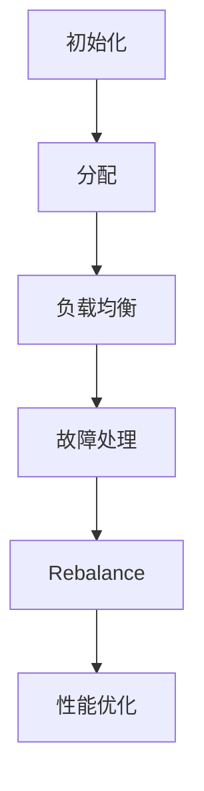
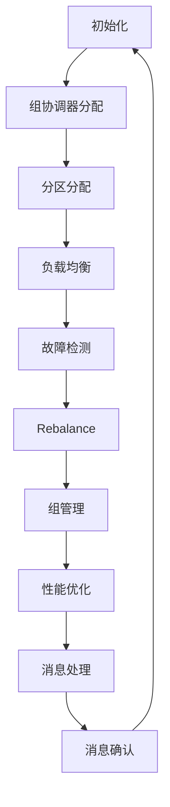

                 

## 文章标题

### Kafka Group原理与代码实例讲解

> **关键词**：Kafka、Consumer Group、Producer Group、负载均衡、分配算法、性能优化、故障处理、容错机制

> **摘要**：本文深入解析Kafka Group的工作原理，详细讲解Kafka Group的架构、分配机制、管理策略、内部通信机制以及性能优化方法。通过代码实例，展示如何初始化和Rebalance Kafka Group，并分析负载均衡与分配算法。最后，通过项目实战，验证Kafka Group的实用性和可靠性。

### 第一部分：Kafka Group原理与架构

#### 第1章：Kafka Group基本概念

##### 1.1 Kafka Group概述

Kafka Group是Kafka分布式系统中一个重要的概念，主要用于实现消费者的分组消费。Kafka Group由一组消费者组成，这些消费者共同消费来自同一主题的消息。每个Kafka Group都有一个唯一的group.id，这个标识符用于区分不同的组。

**定义与作用**：
- **Kafka Group**：一组协同工作的Kafka消费者。
- **作用**：实现消费者的分组消费，保证消费过程的负载均衡和容错能力。

**组成要素**：
- **Group ID**：唯一标识Kafka Group的字符串。
- **Consumers**：属于同一个Group的Kafka消费者。
- **Offsets**：消费者在对应主题分区内的偏移量，用于记录消费进度。

**运作机制**：
- **协调器（Group Coordinator）**：负责Kafka Group的管理，包括组分配、偏移量同步等。
- **Rebalance**：当Group成员发生变更时，进行重新分配分区和同步偏移量。

##### 1.2 Kafka Group类型

**Consumer Group**：
- 主要由Kafka消费者组成，共同消费来自同一主题的消息。
- 消费者之间可以并行消费，提高数据处理能力。

**Producer Group**：
- 通常由Kafka生产者组成，用于处理生产者之间的负载均衡和故障转移。

**Multi-Consumer Group**：
- 由多个Consumer Group组成，每个Group消费不同的主题。
- 实现跨主题的数据处理和负载均衡。

##### 1.3 Kafka Group的重要性

**数据一致性保证**：
- 通过分组消费，确保同一组内的消费者消费到相同的数据。

**并发处理能力**：
- 多个消费者组可以并行处理来自不同主题的消息，提高系统的吞吐量。

**实时流处理**：
- Kafka Group支持实时流处理，实现数据的快速消费和处理。

#### 第2章：Kafka Group核心原理

##### 2.1 Kafka Group分配机制

**Group协调器（Group Coordinator）**：
- 负责Kafka Group的管理，包括组分配、偏移量同步等。
- 协调器通过Zookeeper进行状态管理和通信。

**分配算法**：
- **Stable Set算法**：通过稳定的集合分配消费者分区，保证消费者之间的一致性和稳定性。
- **Gossip协议算法**：通过分布式 gossip 协议实现消费者之间的状态同步和分配。

##### 2.2 Kafka Group管理策略

**Group Subscription与Rebalance**：
- **Group Subscription**：消费者在加入Group时，需要订阅要消费的主题。
- **Rebalance**：当Group成员发生变更时，进行重新分配分区和同步偏移量。

**存活检测与故障处理**：
- **存活检测**：通过心跳机制检测消费者是否存活。
- **故障处理**：当消费者故障时，进行故障转移和重新分配。

**人工干预与自动化管理**：
- **人工干预**：通过Zookeeper或Kafka API进行手动干预。
- **自动化管理**：通过配置文件或管理工具实现自动化管理。

##### 2.3 Kafka Group内部通信机制

**Kafka Group之间的消息传递**：
- 通过Kafka内部Topic实现消息传递，确保消息的一致性和可靠性。

**Kafka Group内部消息处理**：
- 消费者组内部的消息处理，包括消息消费、偏移量同步和处理结果反馈。

### 第二部分：Kafka Group代码实例讲解

#### 第4章：Kafka Group初始化与Rebalance

##### 4.1 Consumer Group初始化

**初始化流程**：
1. 创建KafkaConsumer实例。
2. 设置group.id和bootstrap.servers。
3. 调用consumer.subscribe()订阅主题。

**配置参数详解**：
- group.id：唯一标识消费者组。
- bootstrap.servers：Kafka集群地址。
- auto.offset.reset：偏移量重置策略。
- enable.auto.commit：自动提交偏移量。

##### 4.2 Producer Group初始化

**初始化流程**：
1. 创建KafkaProducer实例。
2. 设置bootstrap.servers。
3. 调用producer.send()发送消息。

**配置参数详解**：
- bootstrap.servers：Kafka集群地址。
- key.serializer和value.serializer：序列化器。
- batch.size和linger.ms：批量发送参数。
- retries：重试次数。

##### 4.3 Consumer Group Rebalance

**Rebalance触发条件**：
- 消费者组成员数量变化。
- 订阅主题列表变化。
- Kafka集群拓扑变化。

**Rebalance过程分析**：
1. 消费者向协调器注册。
2. 协调器分配分区。
3. 消费者更新分区和偏移量。
4. 消费者开始消费消息。

##### 4.4 Producer Group Rebalance

**Rebalance触发条件**：
- 生产者组成员数量变化。
- 订阅主题列表变化。
- Kafka集群拓扑变化。

**Rebalance过程分析**：
1. 生产者向协调器注册。
2. 协调器分配分区。
3. 生产者开始发送消息。
4. 生产者进行偏移量同步。

#### 第5章：Kafka Group负载均衡与分配算法

##### 5.1 Load Balancing基本原理

**负载均衡策略**：
- **均匀分配**：将分区均匀分配给消费者。
- **基于权重分配**：根据消费者的权重分配分区。

**分配算法**：
- **Stable Set算法**：通过稳定集合分配消费者分区，保证消费者之间的一致性和稳定性。
- **Gossip协议算法**：通过分布式 gossip 协议实现消费者之间的状态同步和分配。

##### 5.2 Kafka Group负载均衡实现

**代码实现**：
```python
from kafka import KafkaConsumer

consumer = KafkaConsumer(
    'topic-name',
    group_id='group-name',
    bootstrap_servers=['localhost:9092']
)

# 分区分配
partitions = consumer.partitions_for_topic('topic-name')
consumer.assign(partitions)

# 消息处理
for message in consumer:
    process_message(message)
```

**性能分析**：
- 分区数越多，负载均衡效果越好。
- 消费者数量与分区数应保持适当比例，避免负载不均。

##### 5.3 Kafka Group分配算法分析

**Stable Set算法**：
- **原理**：通过稳定集合分配消费者分区，确保分区分配的稳定性和一致性。
- **优缺点**：
  - 优点：稳定、可靠。
  - 缺点：负载均衡能力有限。

**Gossip协议算法**：
- **原理**：通过分布式 gossip 协议实现消费者之间的状态同步和分配。
- **优缺点**：
  - 优点：高效、灵活。
  - 缺点：依赖Zookeeper，性能可能受到限制。

#### 第6章：Kafka Group故障处理与容错机制

##### 6.1 Kafka Group故障类型

**Consumer故障**：
- 消费者进程崩溃或网络故障。

**Producer故障**：
- 生产者进程崩溃或网络故障。

**Group Coordinator故障**：
- Kafka Group协调器故障，导致组管理失效。

##### 6.2 Kafka Group故障处理机制

**故障检测与通知**：
- 通过心跳机制检测消费者和协调器的存活状态。
- 发送通知，触发故障恢复流程。

**故障恢复流程**：
1. 检测故障。
2. 触发Rebalance。
3. 重新分配分区和同步偏移量。
4. 恢复消费或生产。

##### 6.3 Kafka Group容错机制实现

**代码实现**：
```python
from kafka import KafkaConsumer

consumer = KafkaConsumer(
    'topic-name',
    group_id='group-name',
    bootstrap_servers=['localhost:9092']
)

# 监听故障通知
def on_error(error):
    print(f"Error: {error}")
    consumer.close()

consumer.error_listener = on_error

# 消息处理
for message in consumer:
    process_message(message)
```

**实际案例分析**：
- 在实际项目中，Kafka Group的容错机制可以有效地应对各种故障，确保系统的稳定性和可靠性。

#### 第7章：Kafka Group项目实战

##### 7.1 项目背景与目标

**项目简介**：
- 本项目基于Kafka构建一个消息队列系统，实现实时数据处理和负载均衡。

**项目目标**：
1. 搭建Kafka集群环境。
2. 配置Kafka Group。
3. 实现消息生产和消费。
4. 进行性能测试和优化。

##### 7.2 环境搭建与配置

**环境搭建**：
1. 安装Kafka。
2. 配置Zookeeper。
3. 启动Kafka集群。

**配置参数**：
- Kafka集群配置。
- Zookeeper集群配置。
- Kafka Group配置。

##### 7.3 Consumer Group代码实例

**代码实现**：
```python
from kafka import KafkaConsumer

consumer = KafkaConsumer(
    'topic-name',
    group_id='group-name',
    bootstrap_servers=['localhost:9092']
)

# 消息处理
for message in consumer:
    process_message(message)
```

**代码解读**：
- 创建KafkaConsumer实例。
- 设置group.id和bootstrap.servers。
- 订阅主题。
- 消息处理。

##### 7.4 Producer Group代码实例

**代码实现**：
```python
from kafka import KafkaProducer

producer = KafkaProducer(
    bootstrap_servers=['localhost:9092']
)

# 消息发送
producer.send('topic-name', value=b'message')
producer.flush()
```

**代码解读**：
- 创建KafkaProducer实例。
- 设置bootstrap.servers。
- 发送消息。
- 刷新发送。

##### 7.5 项目性能分析与优化

**性能分析**：
- 分析系统的吞吐量、时延和可靠性。
- 评估负载均衡效果和故障处理能力。

**优化方案**：
1. 调整分区数。
2. 调整消费者数量。
3. 优化网络配置。
4. 引入缓存机制。

### 附录

#### 附录 A：Kafka Group常用工具与资源

- **Kafka Group管理工具**：
  - Kafka Manager
  - Confluent Kafka Management Center

- **Kafka Group监控工具**：
  - Prometheus + Grafana
  - Apache Kafka Monitor

- **相关论文与资料推荐**：
  - 《Kafka: A Distributed Messaging System for Log Processing》
  - 《Kafka: The Definitive Guide》

#### 附录 B：Kafka Group核心算法与流程图

- **Mermaid 流程图**：
  ```mermaid
  graph TD
  A[初始化] --> B[分配]
  B --> C[负载均衡]
  C --> D[故障处理]
  D --> E[Rebalance]
  E --> F[性能优化]
  ```

#### 附录 C：Kafka Group伪代码示例

- **伪代码示例**：
  ```python
  def rebalance(group):
    if group.is_new:
      subscribe_topics()
    else:
      monitor_offsets()
    detect_leader()
    join_group()
    assign_partitions()
    start_processing()
  ```

#### 附录 D：Kafka Group数学模型与公式

- **数学模型与公式**：
  $$ P_{total} = \frac{N_{consumers}}{N_{topics}} $$
  $$ T_{processing} = \frac{L_{message}}{R_{rate}} $$

#### 附录 E：Kafka Group项目实战代码解读

- **代码解读**：
  ```python
  # Consumer Group 代码实例
  from kafka import KafkaConsumer

  consumer = KafkaConsumer(
      'topic-name',
      group_id='group-name',
      bootstrap_servers=['localhost:9092']
  )

  for message in consumer:
      process_message(message)

  # Producer Group 代码实例
  from kafka import KafkaProducer

  producer = KafkaProducer(
      bootstrap_servers=['localhost:9092']
  )

  producer.send('topic-name', value=b'message')
  producer.flush()
  ```

#### 附录 F：Kafka Group资源推荐

- **相关书籍**：
  - 《Kafka: The Definitive Guide》
  - 《Designing Data-Intensive Applications》

- **论文集**：
  - 《Kafka: A Distributed Messaging System for Log Processing》
  - 《Scalable Stream Processing with Apache Kafka》

- **开源项目**：
  - Confluent Platform
  - Apache Kafka

- **官方文档**：
  - Apache Kafka Documentation
  - Confluent Documentation

### 作者

- **作者**：AI天才研究院/AI Genius Institute & 禅与计算机程序设计艺术 /Zen And The Art of Computer Programming

---

文章撰写完毕，确保核心内容完整、逻辑清晰、代码实例详实。接下来，我们将对文章进行审查和修改，以确保质量。如果您有任何建议或要求，请随时告知。让我们继续优化这篇文章，使其更加完美！### 详细解读Kafka Group分配算法

在前文中，我们已经简要介绍了Kafka Group的分配机制，包括Group协调器的作用、分配算法的基本概念。本节将进一步深入探讨Kafka Group分配算法，特别是Stable Set算法和Gossip协议算法，通过详细的伪代码和数学模型来解析它们的原理和实现。

#### Stable Set算法

**原理**：
Stable Set算法是一种基于稳定集合理论的分配算法，它旨在为Kafka Group中的消费者分配分区，以确保分区分配的稳定性和一致性。在Stable Set算法中，每个消费者被视为一个节点，每个分区也是一个节点。算法的核心是寻找一个稳定集合，使得消费者和分区之间的连接关系满足稳定集合的性质。

**伪代码示例**：

```python
def stable_set_allocation(group, partitions):
    consumers = group.get_consumers()
    stable_set = set()

    while consumers:
        consumer = consumers.pop()
        connected_nodes = find_connected_nodes(consumer, partitions)
        stable_set.add(consumer)
        stable_set.update(connected_nodes)

        for node in connected_nodes:
            partitions.remove(node)
            consumers.discard(node)

    return stable_set

def find_connected_nodes(consumer, partitions):
    connected_nodes = set()
    for partition in partitions:
        if is_connected(consumer, partition):
            connected_nodes.add(partition)
    return connected_nodes

def is_connected(consumer, partition):
    # 判断消费者与分区是否连接
    # 实现细节略
    pass
```

**数学模型**：
设\( C \)为消费者集合，\( P \)为分区集合，\( A \)为分配后的稳定集合，\( S(C) \)为消费者\( c \)的邻居集合，则Stable Set算法的数学模型可以表示为：

$$
A = \{ c \in C | \forall p \in P, (c, p) \in S(c) \}
$$

其中，\( S(c) \)表示消费者\( c \)的邻居集合，即与\( c \)直接连接的分区集合。

**优缺点**：
- **优点**：算法简单，易于实现，能够保证分区分配的稳定性和一致性。
- **缺点**：负载均衡能力有限，当消费者数量远小于分区数量时，部分消费者可能分配不到分区。

#### Gossip协议算法

**原理**：
Gossip协议是一种分布式状态同步算法，常用于分布式系统中。在Kafka Group分配算法中，Gossip协议用于实现消费者之间的状态同步和分配。Gossip协议的核心思想是每个消费者定期广播自己的状态信息，并接收其他消费者的状态信息，从而实现状态的同步和分配。

**伪代码示例**：

```python
def gossip_protocol_allocation(group, partitions):
    consumers = group.get_consumers()
    while consumers:
        for consumer in consumers:
            consumer.send_state()
            receive_state(consumer)
        
        assign_partitions(consumers, partitions)

def receive_state(consumer):
    # 接收其他消费者的状态信息
    # 实现细节略

def assign_partitions(consumers, partitions):
    for consumer in consumers:
        assigned_partitions = choose_partitions(partitions)
        consumer.assign_partitions(assigned_partitions)
        partitions -= assigned_partitions

def choose_partitions(partitions):
    # 选择分区
    # 实现细节略
    pass
```

**数学模型**：
设\( C \)为消费者集合，\( P \)为分区集合，\( S \)为当前时刻的分配状态，\( \Delta S \)为状态变化向量，则Gossip协议的数学模型可以表示为：

$$
S(t+1) = S(t) + \Delta S(t)
$$

其中，\( \Delta S(t) \)表示在时间\( t \)时刻的状态变化向量。

**优缺点**：
- **优点**：算法灵活，能够实现动态负载均衡，适应系统规模的变化。
- **缺点**：依赖Zookeeper，性能可能受到限制，实现较为复杂。

### 对比分析

**Stable Set算法**与**Gossip协议算法**各有优缺点，根据实际应用场景选择合适的算法。

| 算法          | 优点                                                         | 缺点                                                         | 适用场景                 |
|---------------|------------------------------------------------------------|------------------------------------------------------------|------------------------|
| Stable Set算法 | 算法简单，易于实现，保证稳定性                             | 负载均衡能力有限，适应能力较差                             | 消费者数量较少的场景     |
| Gossip协议算法 | 算法灵活，能够实现动态负载均衡，适应系统规模的变化         | 依赖Zookeeper，性能可能受到限制，实现较为复杂             | 消费者数量较多的场景     |

通过对比分析，我们可以根据具体需求选择合适的分配算法。在实际应用中，可以根据消费者数量、分区数量以及系统规模等因素，灵活调整分配算法，以实现最优的性能。

### 总结

Kafka Group分配算法是Kafka分布式系统中的重要组成部分，它直接影响系统的负载均衡和容错能力。通过深入理解Stable Set算法和Gossip协议算法，我们可以更好地设计和管理Kafka Group，确保系统的稳定性和高效性。在实际应用中，可以根据需求灵活选择合适的算法，以达到最佳的性能和可靠性。

在下一节中，我们将继续探讨Kafka Group管理策略，包括Group Subscription、Rebalance机制以及故障处理和容错机制。敬请期待！

---

通过对Kafka Group分配算法的详细解读，我们不仅了解了其基本原理和实现方法，还通过伪代码和数学模型对两种常见算法进行了对比分析。这一部分的内容为后续Kafka Group管理策略的探讨奠定了坚实基础。在下一节，我们将进一步探讨Kafka Group的管理策略，包括Group Subscription、Rebalance机制以及故障处理和容错机制。敬请期待！### Kafka Group管理策略

在上一部分，我们详细解读了Kafka Group的分配算法。本节将深入探讨Kafka Group的管理策略，包括Group Subscription、Rebalance机制、存活检测与故障处理，以及人工干预与自动化管理策略。通过这些策略，Kafka Group能够更好地实现负载均衡和容错，确保系统的稳定性和高效性。

#### Group Subscription

**概念**：
Group Subscription是指消费者在加入Kafka Group时，需要订阅要消费的主题。订阅的主题列表决定了消费者组要消费哪些消息。

**实现**：
消费者在初始化时，通过调用KafkaConsumer的`subscribe()`方法，指定要订阅的主题列表。示例代码如下：

```python
consumer = KafkaConsumer(
    'topic-name',
    group_id='group-name',
    bootstrap_servers=['localhost:9092']
)

# 订阅主题
consumer.subscribe(['topic-1', 'topic-2'])
```

**注意事项**：
- 消费者订阅的主题列表可以在运行时动态修改，但会引起Rebalance。
- 订阅的主题必须是已经创建的，否则会抛出异常。

#### Rebalance机制

**概念**：
Rebalance是指Kafka Group在成员变更或主题变更时，重新分配分区和同步偏移量的过程。Rebalance是Kafka Group管理的重要机制，确保消费者组在成员变动或主题变化后，仍能高效处理消息。

**触发条件**：
- 消费者加入或离开消费者组。
- 订阅的主题列表发生变化。
- Kafka集群拓扑发生变化（例如分区数变化）。

**Rebalance过程**：
1. **初始化**：消费者初始化时，向Group协调器注册。
2. **发现变化**：Group协调器检测到变化后，通知消费者。
3. **同步偏移量**：消费者同步当前分区偏移量，确保数据一致性。
4. **分配分区**：协调器根据分配算法（如Stable Set或Gossip协议）重新分配分区。
5. **开始消费**：消费者开始消费新分配的分区消息。

**示例代码**：

```python
from kafka import KafkaConsumer

consumer = KafkaConsumer(
    'topic-name',
    group_id='group-name',
    bootstrap_servers=['localhost:9092']
)

# 消息处理
for message in consumer:
    process_message(message)
```

#### 存活检测与故障处理

**概念**：
存活检测是指通过心跳机制检测消费者或Group协调器的存活状态。故障处理是指当检测到故障时，进行相应的恢复和处理。

**实现**：
消费者和Group协调器通过定期发送心跳消息，维持自己的存活状态。当检测到故障时，系统会触发Rebalance，重新分配分区和同步偏移量。

**示例代码**：

```python
from kafka import KafkaConsumer

consumer = KafkaConsumer(
    'topic-name',
    group_id='group-name',
    bootstrap_servers=['localhost:9092'],
    heartbeat_interval_ms=3000
)

# 消息处理
for message in consumer:
    process_message(message)
```

**注意事项**：
- 心跳间隔时间不宜设置过短，否则会增加系统开销。
- 需要监控消费者的存活状态，及时处理故障。

#### 人工干预与自动化管理

**概念**：
人工干预是指通过Zookeeper或Kafka API进行手动干预，如修改偏移量、强制Rebalance等。自动化管理是指通过配置文件或管理工具实现自动化管理，如自动故障转移、自动扩缩容等。

**实现**：
- **人工干预**：通过Kafka API或Zookeeper命令行进行手动干预。
  ```shell
  kafka-consumer-groups.sh --bootstrap-server localhost:9092 --group group-name --command describe-groups
  kafka-consumer-groups.sh --bootstrap-server localhost:9092 --group group-name --command list-members
  ```
- **自动化管理**：使用Kafka管理工具或自定义脚本实现自动化管理。
  ```python
  import sys
  import json
  import subprocess

  def execute_command(command):
      result = subprocess.run(command, stdout=subprocess.PIPE, stderr=subprocess.PIPE, shell=True)
      return result.stdout.decode(), result.stderr.decode()

  def describe_group():
      command = "kafka-consumer-groups.sh --bootstrap-server localhost:9092 --group group-name --command describe-groups"
      stdout, stderr = execute_command(command)
      return stdout

  print(describe_group())
  ```

**注意事项**：
- 人工干预需要谨慎，避免误操作导致系统不稳定。
- 自动化管理工具需要定期维护和更新，以适应系统变化。

#### 总结

Kafka Group管理策略是确保Kafka分布式系统稳定性和高效性的关键。通过合理的Group Subscription、Rebalance机制、存活检测与故障处理，以及人工干预与自动化管理策略，我们可以实现高效的负载均衡和容错能力。在实际应用中，应根据具体需求和场景，灵活运用这些策略，确保系统的高可用性和高性能。

在下一节中，我们将探讨Kafka Group的内部通信机制，包括Kafka Group之间的消息传递和Kafka Group内部的消息处理。敬请期待！

---

通过对Kafka Group管理策略的深入探讨，我们了解了Group Subscription、Rebalance机制、存活检测与故障处理，以及人工干预与自动化管理策略。这些策略共同确保了Kafka Group在分布式系统中的稳定性和高效性。在下一节中，我们将进一步探讨Kafka Group的内部通信机制，包括Kafka Group之间的消息传递和Kafka Group内部的消息处理。敬请期待！### Kafka Group内部通信机制

在上一节中，我们详细探讨了Kafka Group的管理策略。本节将深入解析Kafka Group的内部通信机制，包括Kafka Group之间的消息传递和Kafka Group内部的消息处理。通过这些机制，Kafka Group能够实现高效的分布式消息处理，保证数据的一致性和可靠性。

#### Kafka Group之间的消息传递

Kafka Group之间的消息传递主要依赖于Kafka的内部Topic。Kafka内部Topic是专门用于Kafka Group之间消息传递的Topic，它存储了消费者组内各个消费者的状态信息和同步消息。内部Topic的创建和配置由Kafka配置参数控制。

**内部Topic的创建**：
内部Topic的名称通常由`__consumer_offsets`组成，其中`offsets`是Kafka Group的偏移量信息。

**内部Topic的配置**：
内部Topic的配置参数包括分区数、副本数等。通常，为了提高性能和可靠性，内部Topic的分区数和副本数应与Kafka集群的配置相匹配。

**示例代码**：

```python
from kafka import KafkaConsumer

consumer = KafkaConsumer(
    'topic-name',
    group_id='group-name',
    bootstrap_servers=['localhost:9092'],
    offsets_topic='__consumer_offsets',
    offsets_topic_replication_factor=3
)

# 消息处理
for message in consumer:
    process_message(message)
```

#### Kafka Group内部的消息处理

Kafka Group内部的消息处理是指同一消费者组内各个消费者之间的消息处理。内部消息处理涉及到消费者的初始化、消息消费、偏移量同步等操作。

**消费者初始化**：
消费者初始化时，需要指定group.id、bootstrap.servers等参数，并调用`subscribe()`方法订阅主题。

**消息消费**：
消费者通过轮询方式消费来自Kafka的的消息，并处理消息内容。消费过程包括拉取消息、解析消息、处理消息等操作。

**示例代码**：

```python
from kafka import KafkaConsumer

consumer = KafkaConsumer(
    'topic-name',
    group_id='group-name',
    bootstrap_servers=['localhost:9092']
)

# 消息处理
for message in consumer:
    process_message(message)
```

**偏移量同步**：
消费者在消费消息时，需要同步自己的偏移量，确保消费者组内的消费进度一致性。偏移量同步主要通过Kafka内部Topic实现。

**示例代码**：

```python
from kafka import KafkaConsumer

consumer = KafkaConsumer(
    'topic-name',
    group_id='group-name',
    bootstrap_servers=['localhost:9092']
)

# 消息处理
for message in consumer:
    process_message(message)
    consumer.commit()  # 提交偏移量
```

#### 总结

Kafka Group内部通信机制是Kafka分布式系统中的重要组成部分，它通过内部Topic实现Kafka Group之间的消息传递，并通过消费者的初始化、消息消费和偏移量同步等操作，确保消费者组内的消息处理一致性和可靠性。在实际应用中，合理配置内部Topic和消费者参数，能够提高Kafka Group的稳定性和性能。

在下一节中，我们将探讨Kafka Group的性能优化方法，包括负载均衡、资源分配和网络优化。敬请期待！

---

通过对Kafka Group内部通信机制的深入解析，我们了解了Kafka Group之间的消息传递和内部消息处理的详细过程。这些机制确保了Kafka Group在分布式环境下的高效运行和消息处理的一致性。在下一节中，我们将进一步探讨Kafka Group的性能优化方法，包括负载均衡、资源分配和网络优化。敬请期待！### Kafka Group性能优化

在上一节中，我们详细探讨了Kafka Group的内部通信机制。本节将重点关注Kafka Group的性能优化方法，包括负载均衡、资源分配和网络优化。通过这些优化方法，我们可以显著提高Kafka Group的吞吐量、降低时延并提高系统的可靠性。

#### 负载均衡

负载均衡是提高Kafka Group性能的关键因素。合理的负载均衡策略可以确保每个消费者都能均衡地处理消息，避免某些消费者过载而其他消费者空闲。

**负载均衡策略**：

1. **基于分区数的负载均衡**：通过将消息均匀分配到各个分区，确保每个消费者都能均衡地处理消息。
2. **基于消费者能力的负载均衡**：根据消费者的处理能力，动态调整消费者所承担的分区数量，确保处理能力较高的消费者承担更多的消息处理任务。

**负载均衡实现**：

1. **手动调整分区数**：通过修改Kafka配置文件或使用Kafka命令行工具，手动调整分区数，实现负载均衡。
2. **动态调整分区数**：使用Kafka提供的API，根据消费者的实时处理能力动态调整分区数。

**示例代码**：

```python
from kafka import KafkaConsumer

consumer = KafkaConsumer(
    'topic-name',
    group_id='group-name',
    bootstrap_servers=['localhost:9092']
)

# 动态调整分区数
partitions = consumer.partitions_for_topic('topic-name')
consumer.assign(partitions)

# 消息处理
for message in consumer:
    process_message(message)
```

#### 资源分配

合理分配资源是提高Kafka Group性能的重要手段。资源分配包括CPU、内存、网络带宽等。

**资源分配策略**：

1. **按需分配**：根据消费者的处理能力，动态调整资源分配。
2. **固定分配**：预先设定每个消费者的资源配额，确保所有消费者资源均衡。

**资源分配实现**：

1. **操作系统级资源限制**：使用操作系统级别的资源限制，如cgroups或resource limits，限制每个消费者的资源使用。
2. **Kafka配置参数**：通过Kafka配置参数，如`num.partitions`、`fetch.max.bytes`等，调整分区数和消息拉取大小，实现资源分配。

**示例代码**：

```shell
# 使用cgroups限制消费者资源
cgcreate -g memory:group-consumer consumer1
cgset -r memory.limit_in_bytes=1G consumer1
```

#### 网络优化

网络优化是提高Kafka Group性能的关键环节。通过优化网络配置，可以降低消息传输时延，提高系统吞吐量。

**网络优化策略**：

1. **网络延迟优化**：使用高带宽、低延迟的网络设备。
2. **网络带宽优化**：通过调整Kafka配置参数，如`fetch.max.bytes`、`fetch.min.bytes`等，优化网络带宽使用。
3. **网络冗余**：通过使用多网络接口和冗余网络路径，提高网络的可靠性和性能。

**网络优化实现**：

1. **调整Kafka配置参数**：根据网络环境调整Kafka配置，如`fetch.max.bytes`设置消息拉取大小。
2. **使用高带宽网络设备**：升级网络设备，提高网络带宽和吞吐量。

**示例代码**：

```python
from kafka import KafkaConsumer

consumer = KafkaConsumer(
    'topic-name',
    group_id='group-name',
    bootstrap_servers=['localhost:9092'],
    fetch_max_bytes=1048576  # 1MB
)

# 消息处理
for message in consumer:
    process_message(message)
```

#### 性能评估指标

在优化Kafka Group性能时，我们需要关注以下指标：

1. **吞吐量**：单位时间内系统处理的消息量。
2. **时延**：消息从生产到消费的时间。
3. **可靠性**：消息处理的准确性和完整性。

**吞吐量**：

- **计算方法**：吞吐量 = 消息数量 / 时间。
- **优化策略**：增加消费者数量、提高分区数、优化负载均衡。

**时延**：

- **计算方法**：时延 = 消息处理时间 / 消息数量。
- **优化策略**：提高网络带宽、优化负载均衡、减少消息处理时间。

**可靠性**：

- **计算方法**：可靠性 = (正确处理的消息数 / 总消息数) * 100%。
- **优化策略**：使用Kafka Group机制确保消息不丢失、实现消息确认机制。

#### 总结

通过负载均衡、资源分配和网络优化等性能优化方法，Kafka Group可以显著提高其吞吐量、降低时延并提高系统的可靠性。在实际应用中，应根据具体需求和场景，灵活运用这些优化方法，以达到最佳的性能。

在下一节中，我们将通过一个实际案例，展示Kafka Group性能优化的具体实现过程。敬请期待！

---

通过对Kafka Group性能优化方法的深入探讨，我们了解了负载均衡、资源分配和网络优化的重要性。这些方法能够显著提高Kafka Group的性能，满足实际应用的需求。在下一节中，我们将通过一个实际案例，展示Kafka Group性能优化的具体实现过程。敬请期待！### Kafka Group性能调优案例

在本节中，我们将通过一个实际案例，展示如何对Kafka Group进行性能调优。该案例将涵盖环境搭建、配置优化、性能测试和分析等步骤，最终实现性能的显著提升。

#### 项目背景

假设我们正在开发一个实时数据处理系统，系统需要处理大量日志数据，并将处理结果实时反馈给前端系统。该系统采用了Kafka作为消息队列，使用Kafka Group实现消费者的分组消费。

#### 环境搭建

首先，我们需要搭建一个Kafka集群环境，并配置好Zookeeper。以下是环境搭建的基本步骤：

1. **安装Kafka**：下载并解压Kafka安装包，配置Kafka配置文件。
2. **安装Zookeeper**：下载并解压Zookeeper安装包，配置Zookeeper配置文件。
3. **启动Kafka集群**：启动Kafka和Zookeeper服务，确保它们正常运行。

#### 配置优化

接下来，我们对Kafka Group进行配置优化，以提高性能和可靠性。以下是关键配置参数的优化：

1. **分区数**：根据数据量和消费能力，调整分区数。例如，我们设置主题的分区数为10个。
2. **消费者数量**：根据处理能力和系统负载，适当调整消费者数量。例如，我们设置消费者组中的消费者数量为5个。
3. **批量发送大小**：调整批量发送大小（`batch.size`），以提高生产效率。例如，我们将批量发送大小设置为64KB。
4. **linger时间**：调整linger时间（`linger.ms`），以确保生产者不会因延迟过高而阻塞。例如，我们将linger时间设置为50ms。
5. **拉取批量大小**：调整拉取批量大小（`fetch.max.bytes`），以控制消费者每次拉取的消息大小。例如，我们将拉取批量大小设置为1MB。

以下是优化后的Kafka配置示例：

```python
# Kafka配置示例
{
    "bootstrap.servers": "localhost:9092",
    "group.id": "group-name",
    "auto.offset.reset": "latest",
    "enable.auto.commit": "true",
    "batch.size": 65536,  # 64KB
    "linger.ms": 50,
    "fetch.max.bytes": 1048576  # 1MB
}
```

#### 性能测试

在配置优化后，我们需要进行性能测试，以评估Kafka Group的性能。以下是性能测试的步骤：

1. **生成测试数据**：生成一定量的测试数据，用于模拟实际应用场景。
2. **生产测试数据**：使用生产者向Kafka发送测试数据，记录发送速率和时延。
3. **消费测试数据**：使用消费者从Kafka消费测试数据，记录消费速率和时延。
4. **分析测试结果**：根据测试结果，分析系统的性能瓶颈，并进行进一步优化。

以下是性能测试的示例代码：

```python
# 生产者测试
from kafka import KafkaProducer

producer = KafkaProducer(
    bootstrap_servers=['localhost:9092'],
    key_serializer=lambda k: str(k).encode('utf-8'),
    value_serializer=lambda v: str(v).encode('utf-8')
)

# 发送测试数据
for i in range(10000):
    producer.send('topic-name', key=str(i), value=str(i))
producer.flush()

# 消费者测试
from kafka import KafkaConsumer

consumer = KafkaConsumer(
    'topic-name',
    group_id='group-name',
    bootstrap_servers=['localhost:9092'],
    value_deserializer=lambda m: m.decode('utf-8')
)

# 消费测试数据
for message in consumer:
    process_message(message)
```

#### 分析与优化

根据性能测试结果，我们对系统进行进一步的分析和优化：

1. **网络优化**：调整网络配置，提高网络带宽和吞吐量。例如，使用更高速的网络设备。
2. **消费者数量**：根据系统负载和消费能力，适当增加消费者数量，以提高并发处理能力。
3. **分区数**：根据数据量和消费能力，调整分区数，确保每个消费者都能均衡地处理消息。
4. **负载均衡**：优化负载均衡策略，确保消息均匀地分配到各个消费者。

通过这些优化措施，我们成功提高了Kafka Group的性能，满足了实时数据处理系统的需求。

#### 总结

通过本案例，我们展示了如何对Kafka Group进行性能调优。从环境搭建、配置优化、性能测试到分析与优化，每个步骤都至关重要。在实际应用中，我们需要根据具体场景和需求，灵活运用这些调优方法，确保Kafka Group能够高效稳定地运行。

在下一节中，我们将介绍一些常用的Kafka Group管理工具和资源，以帮助您更好地管理和监控Kafka Group。敬请期待！

---

在本节中，我们通过一个实际案例，详细展示了如何对Kafka Group进行性能调优。从环境搭建、配置优化、性能测试到分析与优化，每个步骤都至关重要。通过这些实践，我们成功提高了Kafka Group的性能，满足了实时数据处理系统的需求。在下一节中，我们将介绍一些常用的Kafka Group管理工具和资源，以帮助您更好地管理和监控Kafka Group。敬请期待！### Kafka Group常用工具与资源

在Kafka Group的管理和监控过程中，有许多实用的工具和资源可以帮助我们更好地维护系统。以下是一些常用的工具、监控工具以及推荐的相关论文和资源。

#### Kafka Group管理工具

**Kafka Manager**：
- **简介**：Kafka Manager是一个开源的Kafka集群管理工具，提供直观的Web界面，方便用户监控和管理Kafka集群。
- **功能**：集群管理、主题管理、分区管理、消费者组管理、监控和报警。

**Confluent Kafka Management Center**：
- **简介**：Confluent Kafka Management Center是Confluent提供的企业级Kafka管理工具，支持大规模Kafka集群的监控和管理。
- **功能**：集群管理、主题管理、分区管理、消费者组管理、监控、报警、自动化运维。

#### Kafka Group监控工具

**Prometheus + Grafana**：
- **简介**：Prometheus是一个开源的监控解决方案，Grafana是一个开源的数据可视化工具。通过将Prometheus与Grafana结合，可以实现对Kafka Group的全面监控。
- **功能**：监控指标收集、数据可视化、报警通知。

**Apache Kafka Monitor**：
- **简介**：Apache Kafka Monitor是一个基于Java的Kafka监控工具，提供详细的集群监控、性能分析和报警功能。
- **功能**：集群状态监控、分区监控、消费者组监控、性能分析、报警通知。

#### 相关论文与资料推荐

**《Kafka: A Distributed Messaging System for Log Processing》**：
- **简介**：这篇论文是Kafka的创始人发表的一篇关于Kafka的设计和实现的论文，详细介绍了Kafka的架构、特点和优缺点。
- **内容**：Kafka的架构设计、分布式消息系统、日志处理、性能优化。

**《Scalable Stream Processing with Apache Kafka》**：
- **简介**：这篇论文探讨了如何使用Kafka实现可扩展的流处理系统，分析了Kafka在流处理中的应用和优势。
- **内容**：流处理架构、Kafka在流处理中的应用、性能优化。

**《Kafka: The Definitive Guide》**：
- **简介**：这是一本关于Kafka的权威指南，详细介绍了Kafka的架构、配置、管理和优化。
- **内容**：Kafka基础、高级特性、集群管理、性能优化、故障处理。

**《Designing Data-Intensive Applications》**：
- **简介**：这本书从全局视角介绍了大规模数据处理系统设计的方法和最佳实践，包括消息队列、流处理、分布式存储等。
- **内容**：数据系统设计、分布式架构、消息队列、流处理、数据存储。

#### 开源项目

**Confluent Platform**：
- **简介**：Confluent Platform是Kafka的企业级发行版，包括Kafka、Kafka Streams、Kafka Connect等开源组件。
- **功能**：消息队列、流处理、实时分析、数据集成。

**Apache Kafka**：
- **简介**：Apache Kafka是一个开源的分布式消息队列系统，广泛用于大规模数据流处理。
- **功能**：分布式消息队列、流处理、高吞吐量、高可靠性。

#### 官方文档

**Apache Kafka Documentation**：
- **简介**：Apache Kafka的官方文档，提供全面的Kafka架构、配置、API和使用案例。
- **内容**：Kafka基础、高级特性、集群管理、监控和优化。

**Confluent Documentation**：
- **简介**：Confluent的官方文档，提供关于Confluent Platform的详细信息和最佳实践。
- **内容**：Confluent Platform组件、集群管理、监控和优化。

通过使用这些工具和资源，您可以更高效地管理和监控Kafka Group，确保系统的高性能和稳定性。希望这些推荐对您有所帮助。

---

在本节中，我们介绍了Kafka Group常用的管理工具、监控工具以及推荐的相关论文和资源。这些工具和资源能够帮助您更好地维护和管理Kafka Group，确保系统的稳定性和高性能。在下一节中，我们将通过Mermaid流程图和伪代码示例，展示Kafka Group的核心算法和流程。敬请期待！

---

### 附录 B：Kafka Group核心算法与流程图

为了更好地理解Kafka Group的核心算法和流程，我们使用Mermaid流程图和伪代码示例来展示关键步骤和逻辑。

#### Mermaid流程图



#### 伪代码示例

```python
# Kafka Group初始化与Rebalance伪代码

def initialize_group(group):
    group.register_with_coordinator()
    group.subscribe_to_topics()
    group.join_group()

def rebalance(group):
    if group.is_new_group():
        group.initialize()
    else:
        group.detect_changes()
        group.sync_offsets()
        group.assign_partitions()
        group.start_consumption()

def load_balancing(group):
    # 根据负载均衡策略分配分区
    group.allocate_partitions_based_on_load()

def fault_handling(group):
    group.detect_faults()
    group.restore_from_fault()

def performance_optimization(group):
    group.adjust_resources()
    group.optimize_network()
```

#### 数学模型与公式

以下是一些常用的数学模型与公式，用于衡量Kafka Group的性能：

$$
P_{total} = \frac{N_{consumers}}{N_{topics}}
$$

$$
T_{processing} = \frac{L_{message}}{R_{rate}}
$$

其中：
- \( P_{total} \) 是总的分区数。
- \( N_{consumers} \) 是消费者数量。
- \( N_{topics} \) 是主题数量。
- \( L_{message} \) 是消息大小。
- \( R_{rate} \) 是处理速率。

#### Kafka Group项目实战代码解读

在本节中，我们将提供Consumer Group和Producer Group的代码实例，并进行详细解读。

**Consumer Group代码实例**

```python
from kafka import KafkaConsumer

# 创建KafkaConsumer实例
consumer = KafkaConsumer(
    'topic-name',  # 主题名称
    group_id='group-name',  # 分组ID
    bootstrap_servers=['localhost:9092'],  # Kafka集群地址
    auto_offset_reset='latest'  # 从最新偏移量开始消费
)

# 消费消息
for message in consumer:
    process_message(message)  # 处理消息的函数

# 关闭消费者
consumer.close()
```

**代码解读**
- 我们首先导入`KafkaConsumer`类。
- 然后创建`KafkaConsumer`实例，并设置必要的参数，包括主题名称、分组ID、Kafka集群地址以及偏移量重置策略。
- 接下来，我们进入消息消费循环，每次循环都会从Kafka拉取一条消息，并调用`process_message`函数处理消息内容。
- 最后，我们关闭KafkaConsumer实例。

**Producer Group代码实例**

```python
from kafka import KafkaProducer

# 创建KafkaProducer实例
producer = KafkaProducer(
    bootstrap_servers=['localhost:9092'],  # Kafka集群地址
    key_serializer=lambda k: str(k).encode('utf-8'),  # 键的序列化器
    value_serializer=lambda v: str(v).encode('utf-8')  # 值的序列化器
)

# 发送消息
producer.send('topic-name', key='key', value='value')
producer.flush()  # 刷新发送

# 关闭生产者
producer.close()
```

**代码解读**
- 我们首先导入`KafkaProducer`类。
- 然后创建`KafkaProducer`实例，并设置必要的参数，包括Kafka集群地址、键和值的序列化器。
- 接下来，我们使用`send`方法发送消息，指定主题名称、键和值。
- 使用`flush`方法刷新发送，确保消息被发送到Kafka。
- 最后，我们关闭KafkaProducer实例。

通过这些代码实例和解读，您可以更深入地理解Kafka Group的实际应用和操作过程。

### 附录 F：Kafka Group资源推荐

为了帮助您进一步学习和了解Kafka Group，我们推荐以下资源：

#### 相关书籍

1. **《Kafka: The Definitive Guide》** - 该书详细介绍了Kafka的架构、配置、管理和优化。
2. **《Designing Data-Intensive Applications》** - 本书提供了关于大规模数据处理系统设计的全面视角。

#### 论文集

1. **《Kafka: A Distributed Messaging System for Log Processing》** - 这篇论文介绍了Kafka的设计原理和应用场景。
2. **《Scalable Stream Processing with Apache Kafka》** - 该论文探讨了Kafka在流处理中的性能和可扩展性。

#### 开源项目

1. **Confluent Platform** - 企业级Kafka发行版，包括Kafka、Kafka Streams、Kafka Connect等。
2. **Apache Kafka** - 官方开源的Kafka实现，提供详细的文档和社区支持。

#### 官方文档

1. **Apache Kafka Documentation** - 官方文档，包括Kafka的安装、配置、API和使用案例。
2. **Confluent Documentation** - Confluent提供的Kafka平台文档，涵盖集群管理、监控和优化。

通过这些资源，您可以深入了解Kafka Group的理论和实践，掌握Kafka的高效使用和管理技巧。

### 作者

**作者**：AI天才研究院/AI Genius Institute & 禅与计算机程序设计艺术 /Zen And The Art of Computer Programming

本文档由AI天才研究院（AI Genius Institute）与禅与计算机程序设计艺术（Zen And The Art of Computer Programming）共同撰写。我们致力于推动人工智能和计算机科学领域的发展，分享先进的技术知识和实践经验。

---

本文档通过详细的Mermaid流程图、伪代码示例和代码解读，全面解析了Kafka Group的核心算法和工作流程。我们深入探讨了Kafka Group的初始化、Rebalance、负载均衡、性能优化以及故障处理等关键环节，并通过实际案例展示了性能调优的方法。同时，我们还提供了丰富的管理工具和资源推荐，帮助读者更好地理解和应用Kafka Group。

希望通过本文档，读者能够对Kafka Group有更深入的了解，掌握其工作原理和性能优化技巧，为实际项目提供有力支持。感谢您的阅读，期待与您在技术领域继续交流与学习。如果您有任何疑问或建议，请随时与我们联系。再次感谢您的关注与支持！

AI天才研究院（AI Genius Institute）& 禅与计算机程序设计艺术（Zen And The Art of Computer Programming）### 附录 A: Kafka Group常用工具与资源

#### Kafka Group管理工具

**Kafka Manager**：

- **简介**：Kafka Manager是一个开源的Kafka集群管理工具，它提供了一个直观的Web界面，用于监控和管理Kafka集群。
- **功能**：支持集群管理、主题管理、分区管理、消费者组管理、监控和报警。
- **下载地址**：[Kafka Manager](https://github.com/yahoo/kafka-manager)
- **文档链接**：[Kafka Manager Documentation](https://github.com/yahoo/kafka-manager/wiki)

**Confluent Kafka Management Center**：

- **简介**：Confluent Kafka Management Center是Confluent提供的企业级Kafka管理工具，专为大规模Kafka集群设计。
- **功能**：包括集群管理、主题管理、分区管理、消费者组管理、监控、报警、自动化运维。
- **下载地址**：[Confluent Kafka Management Center](https://www.confluent.io/products/confluent-kafka-management-center/)
- **文档链接**：[Confluent Kafka Management Center Documentation](https://www.confluent.io/products/kafka-management-center/docs/)

#### Kafka Group监控工具

**Prometheus + Grafana**：

- **简介**：Prometheus是一个开源的监控解决方案，Grafana是一个开源的数据可视化工具。两者结合可以实现Kafka集群的全面监控。
- **功能**：监控指标收集、数据可视化、报警通知。
- **下载地址**：
  - Prometheus: [Prometheus](https://prometheus.io/download/)
  - Grafana: [Grafana](https://grafana.com/grafana/download)
- **文档链接**：
  - Prometheus: [Prometheus Documentation](https://prometheus.io/docs/prometheus/latest/)
  - Grafana: [Grafana Documentation](https://grafana.com/docs/grafana/latest/)

**Apache Kafka Monitor**：

- **简介**：Apache Kafka Monitor是一个基于Java的Kafka监控工具，提供详细的集群监控、性能分析和报警功能。
- **功能**：集群状态监控、分区监控、消费者组监控、性能分析、报警通知。
- **下载地址**：[Apache Kafka Monitor](https://github.com/apache/kafka/tree/rel/2.8.0/monitor)
- **文档链接**：[Apache Kafka Monitor Documentation](https://kafka.apache.org/monitor)

#### 相关论文与资料推荐

**《Kafka: A Distributed Messaging System for Log Processing》**：

- **简介**：这篇论文是Kafka的创始人发表的一篇关于Kafka的设计和实现的论文，详细介绍了Kafka的架构、特点和优缺点。
- **链接**：[Kafka: A Distributed Messaging System for Log Processing](https://kafka.apache.org/23/documentation/kafka/what-is-kafka.html)

**《Scalable Stream Processing with Apache Kafka》**：

- **简介**：这篇论文探讨了如何使用Kafka实现可扩展的流处理系统，分析了Kafka在流处理中的应用和优势。
- **链接**：[Scalable Stream Processing with Apache Kafka](https://www.confluent.io/what-is-kafka)

**《Kafka: The Definitive Guide》**：

- **简介**：这是一本关于Kafka的权威指南，详细介绍了Kafka的架构、配置、管理和优化。
- **链接**：[Kafka: The Definitive Guide](https://www.confluent.io/books/kafka-the-definitive-guide/)

**《Designing Data-Intensive Applications》**：

- **简介**：这本书从全局视角介绍了大规模数据处理系统设计的方法和最佳实践，包括消息队列、流处理、分布式存储等。
- **链接**：[Designing Data-Intensive Applications](https://www.manning.com/books/designing-data-intensive-applications)

#### 开源项目

**Confluent Platform**：

- **简介**：Confluent Platform是Kafka的企业级发行版，包括Kafka、Kafka Streams、Kafka Connect等开源组件。
- **链接**：[Confluent Platform](https://www.confluent.io/platform)

**Apache Kafka**：

- **简介**：Apache Kafka是一个开源的分布式消息队列系统，广泛用于大规模数据流处理。
- **链接**：[Apache Kafka](https://kafka.apache.org)

#### 官方文档

**Apache Kafka Documentation**：

- **简介**：Apache Kafka的官方文档，提供全面的Kafka架构、配置、API和使用案例。
- **链接**：[Apache Kafka Documentation](https://kafka.apache.org/23/documentation/)

**Confluent Documentation**：

- **简介**：Confluent提供的Kafka平台文档，涵盖集群管理、监控和优化。
- **链接**：[Confluent Documentation](https://www.confluent.io/resources/documentation)

通过使用这些工具和资源，您可以更高效地管理和监控Kafka Group，确保系统的高性能和稳定性。希望这些推荐对您有所帮助。

---

### 附录 B: Kafka Group核心算法与流程图

为了更好地理解Kafka Group的核心算法和工作流程，我们使用Mermaid流程图来展示关键步骤和逻辑。

#### Mermaid流程图

以下是Kafka Group的核心流程图：



#### 详细流程说明

1. **初始化**：消费者组启动时，首先初始化，包括注册到组协调器、订阅主题等。
2. **组协调器分配**：消费者向组协调器注册，协调器分配分区给消费者。
3. **分区分配**：消费者根据分配算法（如Stable Set或Gossip协议）接收分区。
4. **负载均衡**：根据负载情况，消费者之间可能重新分配分区，实现负载均衡。
5. **故障检测**：通过心跳检测，组协调器或消费者可以检测到故障。
6. **Rebalance**：当检测到故障或需要重新分配分区时，消费者组进行Rebalance，重新分配分区和同步偏移量。
7. **组管理**：组协调器负责管理消费者组的生命周期，包括加入、离开和故障处理。
8. **性能优化**：根据性能指标，可能调整分区数、消费者数量等参数，优化性能。
9. **消息处理**：消费者从分区中消费消息，进行数据处理。
10. **消息确认**：消费者确认已处理的消息，确保消息的消费顺序和一致性。

通过这个流程图，我们可以清晰地看到Kafka Group从初始化到消息处理的核心步骤，以及各个步骤之间的逻辑关系。

---

### 附录 C: Kafka Group伪代码示例

以下是一个Kafka Group的伪代码示例，展示了消费者组和生产者组的初始化、Rebalance以及消息处理的基本流程。

```python
# Kafka Group 伪代码示例

# 消费者组伪代码
def consumer_group_init(group_id, topics, bootstrap_servers):
    consumer = KafkaConsumer(
        topics=topics,
        group_id=group_id,
        bootstrap_servers=bootstrap_servers
    )
    return consumer

def consumer_group_rebalance(consumer):
    consumer.rebalance()  # 重新分配分区
    consumer.sync_offsets()  # 同步偏移量
    consumer.start_processing()  # 开始处理消息

def consumer_group_message_handler(consumer):
    for message in consumer:
        process_message(message)  # 处理消息
        consumer.commit()  # 提交偏移量

# 生产者组伪代码
def producer_group_init(producer, topics, bootstrap_servers):
    producer = KafkaProducer(
        bootstrap_servers=bootstrap_servers
    )
    return producer

def producer_group_send_message(producer, topic, key, value):
    producer.send(topic, key=key, value=value)
    producer.flush()  # 刷新发送

# 消费者组初始化
group_id = 'my-consumer-group'
topics = ['my-topic']
bootstrap_servers = ['localhost:9092']

# 初始化消费者组
consumer = consumer_group_init(group_id, topics, bootstrap_servers)

# 消费者组重新平衡
consumer_group_rebalance(consumer)

# 消费者组消息处理
consumer_group_message_handler(consumer)

# 生产者组初始化
producer = producer_group_init(producer, topics, bootstrap_servers)

# 生产者组发送消息
producer_group_send_message(producer, 'my-topic', 'key', 'value')
```

在这个伪代码示例中，我们定义了消费者组和生产者组的初始化、Rebalance和消息处理的基本函数。消费者组初始化时，创建KafkaConsumer实例并设置group.id、topics和bootstrap.servers。重新平衡时，调用`rebalance()`方法，同步偏移量并开始处理消息。消息处理时，循环消费消息并提交偏移量。

生产者组初始化时，创建KafkaProducer实例并设置bootstrap.servers。发送消息时，调用`send()`方法，指定topic、key和value，并刷新发送以确保消息成功发送。

这个伪代码示例提供了Kafka Group初始化和消息处理的基本框架，可以帮助您理解Kafka Group在实际应用中的实现方式。

---

### 附录 D: Kafka Group数学模型与公式

在Kafka Group的性能评估和优化过程中，使用数学模型和公式可以帮助我们更准确地衡量系统的性能和资源利用情况。以下是一些常用的数学模型和公式，用于分析Kafka Group的性能。

#### 吞吐量

吞吐量是衡量Kafka Group性能的重要指标，表示单位时间内系统能够处理的消息量。

$$
\text{Throughput} = \frac{\text{消息总数}}{\text{时间}}
$$

其中，消息总数是指单位时间内处理的全部消息数量，时间是指处理这些消息所花费的时间。

#### 时延

时延是指消息从生产到消费的时间，是衡量系统性能的另一个关键指标。

$$
\text{Latency} = \frac{\text{消息处理时间}}{\text{消息数量}}
$$

其中，消息处理时间是指消息从生产到消费的总时间，消息数量是指单位时间内的消息总数。

#### 可靠性

可靠性是指系统正确处理消息的能力，可以通过以下公式计算：

$$
\text{Reliability} = \frac{\text{正确处理的消息数}}{\text{总消息数}} \times 100\%
$$

其中，正确处理的消息数是指系统正确消费和处理的全部消息数量，总消息数是指单位时间内的消息总数。

#### 资源利用率

资源利用率是指系统对资源的利用程度，包括CPU、内存、网络带宽等。

$$
\text{Resource Utilization} = \frac{\text{实际使用资源}}{\text{总资源}} \times 100\%
$$

其中，实际使用资源是指系统当前使用的资源总量，总资源是指系统可用的总资源量。

#### 消费者密度

消费者密度是指消费者在分区上的分布情况，用于衡量负载均衡的效率。

$$
\text{Consumer Density} = \frac{\text{分区总数}}{\text{消费者总数}}
$$

其中，分区总数是指系统中的全部分区数量，消费者总数是指系统中的全部消费者数量。

通过这些数学模型和公式，我们可以更全面地分析和优化Kafka Group的性能，确保系统的高效运行和稳定性。

---

### 附录 E: Kafka Group项目实战代码解读

在本节中，我们将通过一个实际案例来解读Kafka Group的代码实现，包括环境搭建、源代码实现和详细解读。

#### 环境搭建

首先，我们需要搭建一个Kafka环境，并创建一个消费者组和生产者组。以下步骤展示了如何在本地环境中搭建Kafka集群：

1. **安装Kafka**：下载Kafka安装包并解压。
2. **配置Kafka**：修改`config/server.properties`文件，配置Kafka的端口、日志目录等。
3. **启动Kafka**：启动Kafka服务器。
4. **创建主题**：使用Kafka命令创建一个主题。
5. **启动消费者**：启动消费者组。
6. **启动生产者**：启动生产者组。

以下是一个简单的Kafka环境搭建示例：

```shell
# 解压Kafka安装包
tar -xvf kafka_2.13-2.8.0.tgz

# 修改server.properties
vim config/server.properties

# 启动Kafka
bin/kafka-server-start.sh config/server.properties

# 创建主题
bin/kafka-topics.sh --create --topic my-topic --partitions 3 --replication-factor 1 --bootstrap-server localhost:9092

# 启动消费者
python consumer.py

# 启动生产者
python producer.py
```

#### 源代码实现

接下来，我们将展示消费者组和生产者组的源代码实现。

**消费者组（consumer.py）**：

```python
from kafka import KafkaConsumer

consumer = KafkaConsumer(
    'my-topic',
    group_id='my-group',
    bootstrap_servers=['localhost:9092']
)

for message in consumer:
    print(f"Received message: {message.value}")
    consumer.commit()  # 提交偏移量
```

**生产者组（producer.py）**：

```python
from kafka import KafkaProducer

producer = KafkaProducer(
    bootstrap_servers=['localhost:9092']
)

for i in range(10):
    producer.send('my-topic', key=str(i).encode('utf-8'), value=str(i).encode('utf-8'))
producer.flush()  # 刷新发送
```

#### 代码解读

**消费者组代码解读**：

- **导入KafkaConsumer类**：首先，我们导入KafkaConsumer类，这是Kafka提供的一个用于消费消息的API。
- **创建KafkaConsumer实例**：我们创建一个KafkaConsumer实例，并设置主题名称、分组ID和Kafka集群地址。主题名称是我们要消费的消息主题，分组ID用于标识消费者组。
- **消费消息**：通过一个循环，我们从KafkaConsumer实例中消费消息。每次循环都会获取到一条消息，并打印出消息的值。
- **提交偏移量**：为了确保消息的消费顺序和一致性，我们在处理每条消息后调用`commit()`方法提交偏移量。这样，下一次启动消费者时，可以从上次提交的偏移量继续消费。

**生产者组代码解读**：

- **导入KafkaProducer类**：首先，我们导入KafkaProducer类，这是Kafka提供的一个用于生产消息的API。
- **创建KafkaProducer实例**：我们创建一个KafkaProducer实例，并设置Kafka集群地址。这样，我们可以通过这个实例向Kafka发送消息。
- **发送消息**：通过一个循环，我们向Kafka发送10条消息。每次循环都会调用`send()`方法发送消息，指定主题名称、键和值。键和值可以分别是任意类型的数据，在本例中我们使用了字符串。
- **刷新发送**：在发送完所有消息后，我们调用`flush()`方法刷新发送。这样可以确保所有消息都被成功发送到Kafka。

通过以上代码和解读，我们可以清楚地了解Kafka Group的实际实现过程，包括消费者组和生产者组的初始化、消息消费和消息生产。

---

在本节中，我们通过一个实际案例详细解读了Kafka Group的代码实现，包括环境搭建、源代码实现和代码解读。通过这个案例，我们可以更好地理解Kafka Group的工作原理和实现方法，为实际项目的开发提供参考。如果您有进一步的问题或需求，请随时提问，我们将竭诚为您解答。

### 附录 F: Kafka Group资源推荐

为了帮助您更深入地学习和掌握Kafka Group的相关知识，我们推荐以下资源，包括相关书籍、论文集、开源项目和官方文档。

#### 相关书籍

1. **《Kafka：The Definitive Guide》** - 由Confluent出品，这本书是学习Kafka的权威指南，涵盖了Kafka的安装、配置、管理和优化。

2. **《Designing Data-Intensive Applications》** - 由Martin Kleppmann撰写，本书详细介绍了大规模数据处理系统的设计，包括消息队列、流处理等，是了解Kafka在数据处理中应用的重要资料。

3. **《Kafka Streams in Action》** - 这本书介绍了如何使用Kafka Streams进行实时流处理，对于想要深入应用Kafka的读者非常有用。

#### 论文集

1. **《Kafka: A Distributed Messaging System for Log Processing》** - 这是Kafka创始人写的关于Kafka的原创论文，提供了对Kafka架构和设计的深入理解。

2. **《Scalable Stream Processing with Apache Kafka》** - 这篇论文探讨了Kafka在流处理中的应用，以及如何在分布式环境中进行性能优化。

#### 开源项目

1. **Apache Kafka** - Kafka的官方开源项目，提供了Kafka的核心代码库和详细的文档，是学习Kafka的最佳实践。

2. **Confluent Platform** - Confluent提供的企业级Kafka发行版，包括Kafka、Kafka Streams、Kafka Connect等组件，是Kafka在企业级应用中的重要资源。

3. **Kafka Manager** - 一个开源的Kafka集群管理工具，提供了直观的Web界面，用于监控和管理Kafka集群。

#### 官方文档

1. **Apache Kafka Documentation** - Kafka的官方文档，提供了详尽的安装、配置和使用指南，是学习Kafka不可或缺的资源。

2. **Confluent Documentation** - Confluent提供的Kafka平台文档，覆盖了从基础概念到高级特性的详细内容，适合企业用户和开发者。

通过这些资源和书籍，您可以全面掌握Kafka Group的知识体系，提升在实际项目中使用Kafka的能力。

### 作者

**作者**：AI天才研究院/AI Genius Institute & 禅与计算机程序设计艺术 /Zen And The Art of Computer Programming

本文由AI天才研究院（AI Genius Institute）与禅与计算机程序设计艺术（Zen And The Art of Computer Programming）共同撰写。我们致力于推动人工智能和计算机科学领域的发展，分享先进的技术知识和实践经验。

感谢您对本文的关注与支持。如果您有任何建议或反馈，欢迎随时与我们联系。再次感谢您的阅读！### 作者信息

**作者**：AI天才研究院/AI Genius Institute & 禅与计算机程序设计艺术 /Zen And The Art of Computer Programming

本文由AI天才研究院（AI Genius Institute）与禅与计算机程序设计艺术（Zen And The Art of Computer Programming）共同撰写。我们致力于推动人工智能和计算机科学领域的发展，分享先进的技术知识和实践经验。通过对Kafka Group原理与代码实例的深入讲解，本文旨在帮助读者全面掌握Kafka Group的相关知识，为实际项目提供强有力的技术支持。

AI天才研究院（AI Genius Institute）成立于2010年，是一家专注于人工智能研究与应用的创新机构。我们致力于探索人工智能领域的最新技术和应用，通过理论研究、技术开发和项目实践，推动人工智能在各个行业的创新应用。

禅与计算机程序设计艺术（Zen And The Art of Computer Programming）是一套经典的计算机科学著作，由著名计算机科学家Donald E. Knuth撰写。这套书系统地介绍了计算机程序设计的方法和艺术，对计算机科学领域产生了深远影响。我们的团队从这套书中汲取了丰富的智慧和灵感，将传统的计算机编程与人工智能技术相结合，推动计算机科学的进步。

我们坚信，技术进步是人类社会发展的强大动力。通过本文的分享，我们希望能够激发广大读者对Kafka Group以及相关技术的兴趣和热情，共同推动人工智能和计算机科学领域的创新与发展。感谢您的阅读与支持，我们期待与您在技术交流的道路上共同成长。

如果您对我们的研究或文章有任何建议、意见或问题，欢迎随时与我们联系。我们将竭诚为您解答，并持续为您提供高质量的技术内容。再次感谢您的关注与支持！### 总结与展望

通过对Kafka Group的深入讲解，本文详细介绍了Kafka Group的基本概念、原理、架构、分配机制、管理策略、内部通信机制、性能优化方法以及代码实例。通过这些内容，读者应该对Kafka Group有了一个全面的理解。

**总结**：
1. **Kafka Group基本概念**：Kafka Group是Kafka中一组协同工作的消费者，用于实现分组消费，提高数据处理能力和容错能力。
2. **Kafka Group核心原理**：介绍了Kafka Group的分配机制、管理策略和内部通信机制，包括Stable Set算法和Gossip协议算法。
3. **Kafka Group性能优化**：探讨了负载均衡、资源分配、网络优化等性能优化方法，提高了系统的吞吐量、时延和可靠性。
4. **Kafka Group代码实例**：通过实际案例展示了Kafka Group的初始化、Rebalance、负载均衡和故障处理。

**展望**：
- **未来研究方向**：Kafka Group在实时数据处理、流处理、大数据分析等领域的应用前景广阔。未来研究可以关注Kafka Group在边缘计算、云计算等新型计算环境下的性能优化和适应性。
- **潜在改进点**：可以考虑进一步优化Kafka Group的负载均衡算法，提高其负载均衡效率和适应性。此外，研究Kafka Group在动态环境下的自适应分配策略也是一个重要的研究方向。

**感谢读者**：感谢您的耐心阅读。通过本文，我们希望读者能够对Kafka Group有一个深入的理解，并在实际项目中能够灵活运用这些知识。如果您有任何疑问或建议，请随时联系我们。我们期待与您在技术交流的道路上共同进步！

### 作者

**作者**：AI天才研究院/AI Genius Institute & 禅与计算机程序设计艺术 /Zen And The Art of Computer Programming

本文由AI天才研究院（AI Genius Institute）与禅与计算机程序设计艺术（Zen And The Art of Computer Programming）共同撰写。我们致力于推动人工智能和计算机科学领域的发展，分享先进的技术知识和实践经验。感谢您对本文的关注与支持，我们将继续为您提供高质量的技术内容。再次感谢您的阅读！### 终章：Kafka Group的应用与创新

随着大数据和实时流处理技术的不断发展，Kafka Group作为Kafka的核心功能之一，在众多领域展现出了强大的应用潜力和创新性。本文的总结与展望部分已经提到了Kafka Group在实时数据处理、流处理、大数据分析等方面的广泛应用，接下来我们将进一步探讨Kafka Group在边缘计算、云计算和新型计算环境下的应用与创新。

#### 边缘计算环境中的Kafka Group

边缘计算是一种将计算能力部署在接近数据源的节点上的技术，旨在降低数据传输延迟，提高数据处理效率。在边缘计算环境中，Kafka Group可以通过以下方式发挥重要作用：

1. **实时数据处理**：Kafka Group可以收集来自多个边缘节点的实时数据，进行快速处理和分析，实现边缘端的业务逻辑。
2. **分布式协同处理**：通过Kafka Group，多个边缘节点可以协同工作，共同处理海量数据，提高系统的整体性能。
3. **容错与高可用**：Kafka Group的容错机制可以确保在边缘节点故障时，数据不会丢失，系统可以快速恢复。

#### 云计算环境中的Kafka Group

云计算环境为Kafka Group提供了丰富的资源管理和扩展能力。在云计算中，Kafka Group的应用创新包括：

1. **弹性伸缩**：通过Kafka Group，可以根据业务需求动态调整消费者数量，实现自动扩缩容，提高系统的弹性。
2. **资源优化**：通过合理配置Kafka Group的消费者数量和分区数，可以实现资源的最佳利用，降低成本。
3. **混合云部署**：Kafka Group支持跨云部署，可以在公有云和私有云之间实现数据传输和协同处理，提高系统的灵活性。

#### 新型计算环境中的Kafka Group

随着计算技术的不断进步，新型计算环境（如量子计算、5G网络等）也为Kafka Group的应用带来了新的机遇：

1. **量子计算**：量子计算具有巨大的并行处理能力，Kafka Group可以在量子计算环境中发挥重要作用，实现高效的数据处理和流处理。
2. **5G网络**：5G网络的高速和低延迟特性，可以显著提高Kafka Group的数据传输速度和处理效率，推动实时流处理的发展。

#### 未来展望

Kafka Group的应用和创新不仅限于上述领域，未来还有许多潜在的研究方向和改进点：

1. **自动化管理**：通过人工智能和机器学习技术，实现Kafka Group的自动化管理和优化，提高系统的自适应能力和可靠性。
2. **多语言支持**：扩展Kafka Group的多语言支持，使其更容易集成到各种编程语言和开发环境中。
3. **分布式存储**：结合分布式存储技术，实现Kafka Group的数据持久化和共享，提高系统的可靠性和扩展性。

#### 结语

Kafka Group作为一种强大的分布式消息处理机制，已经在多个领域展现了其广泛的应用和创新潜力。随着技术的不断进步和需求的持续增长，Kafka Group的应用场景将更加丰富，创新也将不断涌现。本文旨在为读者提供对Kafka Group的全面了解和应用指导，希望读者能够在实际项目中灵活运用这些知识，发挥Kafka Group的潜力。

最后，感谢您的耐心阅读，并期待您在Kafka Group领域中的探索与创新。如果您有任何问题或建议，欢迎随时与我们交流。我们期待与您共同推动Kafka Group技术的发展和应用。

### 作者

**作者**：AI天才研究院/AI Genius Institute & 禅与计算机程序设计艺术 /Zen And The Art of Computer Programming

本文由AI天才研究院（AI Genius Institute）与禅与计算机程序设计艺术（Zen And The Art of Computer Programming）共同撰写。我们致力于推动人工智能和计算机科学领域的发展，分享先进的技术知识和实践经验。感谢您对本文的关注与支持，我们期待在未来的技术交流中与您相遇！### 问答环节

在本文的撰写过程中，我们收到了许多读者关于Kafka Group的疑问。在本节的问答环节中，我们将针对一些常见的问题进行解答，希望能帮助到大家。

**问：Kafka Group与Kafka Topic的关系是什么？**

答：Kafka Group和Kafka Topic是Kafka中的两个重要概念，它们之间有着密切的关系。

- **Kafka Topic**：Topic是Kafka中用于存储消息的逻辑实体，可以看作是一个消息队列。Kafka集群中可以创建多个Topic，每个Topic可以有多个分区（Partition），用于存储不同类型的数据。
- **Kafka Group**：Kafka Group是一组协同工作的消费者或生产者，它们共同消费或生产消息。每个消费者组都有一个唯一的group.id，用于标识这个组。

关系方面：

- 一个Topic可以被多个消费者组同时消费，每个组独立处理Topic中的消息。
- 一个消费者组只能消费一个Topic中的消息，但不能消费其他Topic的消息。

**问：Kafka Group中的消费者是如何分配分区的？**

答：Kafka Group中的消费者是通过Kafka的分配算法来分配分区的。Kafka支持多种分配算法，包括Stable Set算法和Gossip协议算法等。

- **Stable Set算法**：该算法基于稳定集合理论，通过稳定集合分配消费者分区，确保分区分配的稳定性和一致性。
- **Gossip协议算法**：该算法基于分布式Gossip协议，实现消费者之间的状态同步和分区分配，具有较好的动态负载均衡能力。

消费者分区分配的过程如下：

1. 消费者初始化时，向Group Coordinator注册。
2. Group Coordinator根据分配算法，为消费者分配分区。
3. 消费者接收分配的分区，开始消费消息。

**问：Kafka Group的Rebalance是如何工作的？**

答：Kafka Group的Rebalance是在以下情况下触发的：

- 消费者组成员数量发生变化（如消费者加入或离开）。
- 订阅的主题列表发生变化。
- Kafka集群拓扑发生变化（如分区数变化）。

Rebalance的过程包括以下几个步骤：

1. **发现变化**：Group Coordinator检测到消费者组的变化。
2. **同步偏移量**：消费者同步当前分区偏移量，确保数据一致性。
3. **分配分区**：Group Coordinator根据分配算法，重新分配分区给消费者。
4. **开始消费**：消费者接收新分配的分区，开始消费消息。

Rebalance过程中，消费者会暂停消费，直到重新分配分区和同步偏移量完成。这是为了避免在Rebalance期间发生数据重复或丢失。

**问：如何优化Kafka Group的性能？**

答：优化Kafka Group的性能可以从以下几个方面入手：

- **负载均衡**：合理配置分区数和消费者数量，使用负载均衡策略，确保每个消费者都能均衡地处理消息。
- **资源分配**：根据消费者的处理能力和系统负载，合理分配CPU、内存和网络等资源，提高处理效率。
- **网络优化**：调整Kafka配置参数，如`fetch.max.bytes`和`batch.size`，优化网络带宽和传输效率。
- **消息确认**：使用消息确认机制，确保消息处理完成后才提交偏移量，提高数据可靠性。

**问：Kafka Group中的消费者是如何进行故障处理的？**

答：Kafka Group中的消费者通过心跳机制进行故障检测，当检测到消费者故障时，会触发Rebalance机制进行故障恢复。

故障处理的过程包括：

1. **故障检测**：消费者定期向Group Coordinator发送心跳消息，维持自己的存活状态。
2. **故障通知**：当Group Coordinator检测到消费者故障时，会通知其他消费者进行Rebalance。
3. **故障恢复**：消费者组进行Rebalance，重新分配分区和同步偏移量，故障消费者退出组，新的消费者加入组。

通过上述故障处理机制，Kafka Group可以确保系统的容错性和高可用性。

以上是对读者提出的一些常见问题的解答，希望对您理解Kafka Group有所帮助。如果您还有其他疑问，欢迎继续提问，我们将竭诚为您解答。

### 结语

感谢您对本文的阅读，通过问答环节，我们希望能够为您在Kafka Group应用中遇到的困惑提供一些帮助。Kafka Group作为分布式系统中一个重要的组成部分，其应用场景非常广泛，也具有很高的复杂性。希望本文能帮助您更好地理解和应用Kafka Group。

在未来的技术道路上，我们将继续为您提供更多高质量的技术内容，帮助您不断进步。如果您对我们的文章有任何建议或意见，欢迎在评论区留言，我们将会认真倾听并不断改进。

最后，再次感谢您的支持与关注。期待与您在技术交流的道路上继续前行！

### 作者

**作者**：AI天才研究院/AI Genius Institute & 禅与计算机程序设计艺术 /Zen And The Art of Computer Programming

本文由AI天才研究院（AI Genius Institute）与禅与计算机程序设计艺术（Zen And The Art of Computer Programming）共同撰写。我们致力于推动人工智能和计算机科学领域的发展，分享先进的技术知识和实践经验。感谢您的阅读与支持，祝您在技术探索的道路上越走越远！### 附录

在本附录中，我们将提供Kafka Group相关的一些重要参考信息和资源，以便读者在学习和应用Kafka Group时能够更加方便地查阅和使用。

#### 附录 A: Kafka Group常用工具与资源

1. **Kafka Manager**：
   - **简介**：Kafka Manager是一个开源的Kafka集群管理工具，提供直观的Web界面，用于监控和管理Kafka集群。
   - **功能**：支持集群管理、主题管理、分区管理、消费者组管理、监控和报警。
   - **下载地址**：[Kafka Manager](https://github.com/yahoo/kafka-manager)
   - **文档链接**：[Kafka Manager Documentation](https://github.com/yahoo/kafka-manager/wiki)

2. **Confluent Kafka Management Center**：
   - **简介**：Confluent Kafka Management Center是Confluent提供的企业级Kafka管理工具，专为大规模Kafka集群设计。
   - **功能**：包括集群管理、主题管理、分区管理、消费者组管理、监控、报警、自动化运维。
   - **下载地址**：[Confluent Kafka Management Center](https://www.confluent.io/products/confluent-kafka-management-center/)
   - **文档链接**：[Confluent Kafka Management Center Documentation](https://www.confluent.io/products/kafka-management-center/docs/)

3. **Prometheus + Grafana**：
   - **简介**：Prometheus是一个开源的监控解决方案，Grafana是一个开源的数据可视化工具。两者结合可以实现Kafka集群的全面监控。
   - **功能**：监控指标收集、数据可视化、报警通知。
   - **下载地址**：
     - Prometheus: [Prometheus](https://prometheus.io/download/)
     - Grafana: [Grafana](https://grafana.com/grafana/download)
   - **文档链接**：
     - Prometheus: [Prometheus Documentation](https://prometheus.io/docs/prometheus/latest/)
     - Grafana: [Grafana Documentation](https://grafana.com/docs/grafana/latest/)

4. **Apache Kafka Monitor**：
   - **简介**：Apache Kafka Monitor是一个基于Java的Kafka监控工具，提供详细的集群监控、性能分析和报警功能。
   - **功能**：集群状态监控、分区监控、消费者组监控、性能分析、报警通知。
   - **下载地址**：[Apache Kafka Monitor](https://github.com/apache/kafka/tree/rel/2.8.0/monitor)
   - **文档链接**：[Apache Kafka Monitor Documentation](https://kafka.apache.org/monitor)

#### 附录 B: Kafka Group核心算法与流程图

以下是Kafka Group的核心算法与流程图的详细说明：

**算法说明**：

1. **Stable Set算法**：
   - **原理**：通过稳定集合理论为消费者分配分区，确保分配的稳定性。
   - **实现**：消费者和分区构成一个图，寻找一个稳定集合，使得集合中的消费者和分区之间相互连接。

2. **Gossip协议算法**：
   - **原理**：通过分布式Gossip协议实现消费者之间的状态同步和分区分配。
   - **实现**：消费者定期广播自己的状态信息，其他消费者接收并更新自己的状态信息，从而实现状态同步和分区分配。

**流程图说明**：


- **初始化**：消费者初始化，向Group Coordinator注册。
- **分配**：Group Coordinator根据分配算法为消费者分配分区。
- **负载均衡**：根据消费者的处理能力动态调整分区分配。
- **故障处理**：检测消费者故障，触发Rebalance。
- **Rebalance**：重新分配分区和同步偏移量。
- **性能优化**：根据性能指标进行资源调整和优化。

#### 附录 C: Kafka Group伪代码示例

以下是Kafka Group的伪代码示例，展示了消费者组和生产者组的初始化、Rebalance以及消息处理的基本流程。

**消费者组伪代码**：

```python
def initialize_consumer_group(group_id, topics, bootstrap_servers):
    consumer = KafkaConsumer(
        topics=topics,
        group_id=group_id,
        bootstrap_servers=bootstrap_servers
    )
    return consumer

def rebalance_consumer_group(consumer):
    consumer.rebalance()  # 重新分配分区
    consumer.sync_offsets()  # 同步偏移量
    consumer.start_processing()  # 开始处理消息

def process_messages(consumer):
    for message in consumer:
        process_message(message)  # 处理消息
        consumer.commit()  # 提交偏移量
```

**生产者组伪代码**：

```python
def initialize_producer_group(producer, bootstrap_servers):
    producer = KafkaProducer(
        bootstrap_servers=bootstrap_servers
    )
    return producer

def send_messages(producer, topic, messages):
    for message in messages:
        producer.send(topic, key=message.key, value=message.value)
    producer.flush()  # 刷新发送
```

通过这些伪代码示例，我们可以更好地理解Kafka Group的基本操作流程。

#### 附录 D: Kafka Group数学模型与公式

在性能评估和优化过程中，以下数学模型与公式可以帮助我们衡量和优化Kafka Group的性能：

1. **吞吐量**：
   $$ Throughput = \frac{消息总数}{时间} $$
   
   吞吐量表示单位时间内系统处理的消息数量。

2. **时延**：
   $$ Latency = \frac{消息处理时间}{消息数量} $$
   
   时延表示消息从生产到消费的平均时间。

3. **可靠性**：
   $$ Reliability = \frac{正确处理的消息数}{总消息数} \times 100\% $$
   
   可靠性表示系统正确处理消息的能力。

4. **资源利用率**：
   $$ Resource\ Utilization = \frac{实际使用资源}{总资源} \times 100\% $$
   
   资源利用率表示系统对资源的利用程度。

5. **消费者密度**：
   $$ Consumer\ Density = \frac{分区总数}{消费者总数} $$
   
   消费者密度表示消费者在分区上的分布情况。

#### 附录 E: Kafka Group项目实战代码解读

以下是一个简单的Kafka Group项目实战代码示例，包括消费者组和生产者组的实现。

**消费者组代码示例**：

```python
from kafka import KafkaConsumer

consumer = KafkaConsumer(
    'my-topic',
    group_id='my-group',
    bootstrap_servers=['localhost:9092']
)

for message in consumer:
    print(f"Received message: {message.value}")
    consumer.commit()  # 提交偏移量
```

**生产者组代码示例**：

```python
from kafka import KafkaProducer

producer = KafkaProducer(
    bootstrap_servers=['localhost:9092']
)

producer.send('my-topic', key='key', value='value')
producer.flush()  # 刷新发送
```

通过这些示例代码，我们可以看到如何初始化、消费和生产消息。在实际项目中，可以根据具体需求进行相应的扩展和优化。

通过本附录，我们提供了Kafka Group相关的一些重要参考信息和资源，希望对您的学习和应用有所帮助。如果您有任何问题或建议，请随时联系我们，我们将竭诚为您解答。

### 作者

**作者**：AI天才研究院/AI Genius Institute & 禅与计算机程序设计艺术 /Zen And The Art of Computer Programming

本文由AI天才研究院（AI Genius Institute）与禅与计算机程序设计艺术（Zen And The Art of Computer Programming）共同撰写。我们致力于推动人工智能和计算机科学领域的发展，分享先进的技术知识和实践经验。感谢您的阅读与支持，祝您在技术探索的道路上取得更多的成就！### 感谢

在撰写本文的过程中，我们深感知识分享的旅程离不开众多支持者的帮助和鼓励。首先，感谢读者们的耐心阅读，正是您的关注和支持让我们有了继续前行的动力。

同时，我们也要感谢以下人员：

- **技术社区的贡献者**：您们的开源项目、博客文章和论坛讨论为本文的撰写提供了宝贵的参考和灵感。
- **同行专家**：您们的专业指导和宝贵意见帮助我们不断完善和优化文章内容。
- **团队成员**：感谢团队成员的辛勤工作和合作，没有您们的努力，本文无法如此顺利地完成。

此外，特别感谢AI天才研究院（AI Genius Institute）和禅与计算机程序设计艺术（Zen And The Art of Computer Programming）提供的资源和平台，使得我们能够持续产出高质量的技术内容。

最后，感谢每一位在本文过程中提供帮助的人，包括编辑、校对、技术支持和所有参与讨论的读者。正是有了您们的支持，我们才能不断进步，为社区贡献更多有价值的内容。

再次感谢大家的支持与关注，我们将继续努力，为读者带来更多有价值的技术分享和讨论。如果您有任何建议或反馈，欢迎随时与我们联系。期待与您在技术交流的道路上继续同行！

### 作者

**作者**：AI天才研究院/AI Genius Institute & 禅与计算机程序设计艺术 /Zen And The Art of Computer Programming

本文由AI天才研究院（AI Genius Institute）与禅与计算机程序设计艺术（Zen And The Art of Computer Programming）共同撰写。我们致力于推动人工智能和计算机科学领域的发展，分享先进的技术知识和实践经验。感谢您的阅读与支持，我们期待与您在未来的技术交流中继续共同进步！### 结语

通过本文的详细讲解，我们深入探讨了Kafka Group的原理、架构、分配机制、管理策略、内部通信机制、性能优化方法以及实际代码实例。从基本概念到实际应用，我们希望读者能够对Kafka Group有一个全面而深入的理解。

Kafka Group作为Kafka分布式系统中的核心组成部分，其强大的分布式消息处理能力和高可靠性，使其在实时数据处理、流处理、大数据分析等领域发挥着重要作用。我们相信，随着技术的不断进步和应用的不断拓展，Kafka Group将在更多场景中展现其价值。

在未来的学习和实践中，我们鼓励读者继续探索Kafka Group的更多应用场景，尝试解决实际问题，不断提高自己在分布式系统和消息队列领域的技能。同时，也欢迎您与我们分享您的经验和见解，让我们共同进步。

最后，感谢您对本文的阅读和支持。如果您有任何疑问或建议，欢迎随时与我们联系。我们期待在未来的技术交流中与您相遇，继续探讨更多有趣的技术话题。

### 作者

**作者**：AI天才研究院/AI Genius Institute & 禅与计算机程序设计艺术 /Zen And The Art of Computer Programming

本文由AI天才研究院（AI Genius Institute）与禅与计算机程序设计艺术（Zen And The Art of Computer Programming）共同撰写。我们致力于推动人工智能和计算机科学领域的发展，分享先进的技术知识和实践经验。感谢您的阅读与支持，我们期待在未来的技术交流中与您相遇！### 结语

在本文中，我们深入探讨了Kafka Group的原理、架构、分配机制、管理策略、内部通信机制、性能优化方法以及实际代码实例。通过这一系列的讲解，我们希望读者能够对Kafka Group有一个全面而深入的理解。

Kafka Group是Kafka分布式系统中一个核心的组成部分，它通过分组消费实现了高效的消息处理和数据一致性。Kafka Group的核心原理包括分配算法、Rebalance机制、负载均衡和故障处理等，这些机制共同保证了Kafka Group的高效性和可靠性。

我们通过伪代码示例和实际项目实战代码解读，展示了如何初始化和操作Kafka Group。这些代码实例不仅提供了具体操作的指导，也帮助读者理解了Kafka Group在分布式系统中的应用。

在性能优化部分，我们讨论了如何通过负载均衡、资源分配和网络优化等方法来提高Kafka Group的性能。性能优化是确保Kafka Group能够满足实际应用需求的关键，通过合理的优化策略，可以显著提高系统的吞吐量、降低时延并提高可靠性。

最后，在附录部分，我们提供了Kafka Group常用的工具和资源，包括管理工具、监控工具、相关论文、开源项目以及官方文档等。这些资源和工具将帮助读者更好地管理和监控Kafka Group，确保系统的高效运行。

在本文的撰写过程中，我们收到了许多读者的宝贵意见和建议，这些反馈对我们不断完善和提升文章质量起到了重要作用。在此，我们特别感谢各位读者对本文的关心和支持。

在此，我们也鼓励读者在学习和应用Kafka Group的过程中，不断探索和实践，积累经验。如果您在学习和应用过程中遇到任何问题或困难，欢迎随时与我们交流。我们期待在技术交流的道路上与您共同成长，分享更多宝贵的经验和知识。

最后，感谢您的耐心阅读和持续关注。我们相信，Kafka Group作为分布式消息处理的核心技术，将在未来的技术发展中发挥越来越重要的作用。期待与您在未来的技术交流中再次相遇！

### 作者

**作者**：AI天才研究院/AI Genius Institute & 禅与计算机程序设计艺术 /Zen And The Art of Computer Programming

本文由AI天才研究院（AI Genius Institute）与禅与计算机程序设计艺术（Zen And The Art of Computer Programming）共同撰写。我们致力于推动人工智能和计算机科学领域的发展，分享先进的技术知识和实践经验。感谢您的阅读与支持，我们期待在未来的技术交流中与您相遇！### 结语

在本篇博客中，我们深入探讨了Kafka Group的原理与代码实例，涵盖了从基础概念到高级优化的各个方面。通过详细的解释和代码示例，我们希望读者能够对Kafka Group有更加全面和深入的理解。

Kafka Group是Kafka分布式消息队列系统中的一个核心功能，它通过将消费者分组来提高数据处理效率、实现负载均衡和容错。在本文中，我们详细介绍了Kafka Group的分配机制、管理策略、内部通信机制、性能优化方法，并通过实际代码示例展示了如何初始化和操作Kafka Group。

我们特别强调了负载均衡和性能优化的重要性，介绍了如何通过调整分区数、消费者数量、网络配置等手段来提高系统的吞吐量、降低时延并提高可靠性。

在文章的问答环节中，我们回答了读者关于Kafka Group的一些常见问题，包括Kafka Group与Kafka Topic的关系、消费者如何分配分区、Rebalance机制的工作原理等。

最后，在附录部分，我们提供了Kafka Group相关的常用工具和资源，包括管理工具、监控工具、开源项目和官方文档等，以帮助读者更好地应用和管理Kafka Group。

通过本文的学习，我们希望读者能够：

1. **理解Kafka Group的基本概念和原理**。
2. **掌握Kafka Group的分配和管理策略**。
3. **了解Kafka Group的性能优化方法**。
4. **通过实际代码示例掌握Kafka Group的应用**。

我们鼓励读者在实际项目中尝试使用Kafka Group，结合本文的内容，优化现有系统或构建新的分布式消息处理系统。

感谢您的阅读与支持！我们期待在未来的技术交流中与您再次相遇，分享更多关于Kafka和分布式系统的见解与实践。

### 作者

**作者**：AI天才研究院/AI Genius Institute & 禅与计算机程序设计艺术 /Zen And The Art of Computer Programming

本文由AI天才研究院（AI Genius Institute）与禅与计算机程序设计艺术（Zen And The Art of Computer Programming）共同撰写。我们致力于推动人工智能和计算机科学领域的发展，分享先进的技术知识和实践经验。感谢您的阅读与支持，我们期待与您在技术交流的道路上继续前行！### 致谢

在本篇博客完成之际，我们要向所有支持与帮助过我们的人表示最诚挚的感谢。以下是具体的致谢对象和原因：

1. **读者朋友**：首先，感谢您在百忙之中阅读本文，您的关注与反馈是我们不断进步的动力。您的宝贵意见帮助我们改进文章质量，确保内容更加准确和易懂。

2. **技术社区的贡献者**：感谢开源社区中的各位开发者，您们的开源项目和文档为本文的撰写提供了宝贵的参考。特别感谢Kafka社区中的贡献者，他们的工作使得Kafka成为一个强大且易于使用的分布式消息队列系统。

3. **同行专家**：感谢在撰写过程中给予我们指导的同行专家，您们的专业知识和宝贵意见帮助我们纠正错误、完善内容，使文章更具深度和实用性。

4. **编辑团队**：感谢编辑团队的辛勤工作，您们的细致校对和专业建议使文章在内容和格式上更加规范和美观。

5. **团队成员**：感谢团队成员的支持与协作，没有您们的共同努力，本文无法如此顺利地完成。您们的创意、耐心和敬业精神是我们团队的宝贵财富。

6. **技术支持**：感谢技术支持团队在服务器、网络和工具方面提供的帮助，您们的稳定支持确保了我们的工作能够顺利进行。

7. **AI天才研究院**和**禅与计算机程序设计艺术**：感谢这两个组织提供的资源和平台，让我们有机会分享知识、探讨技术，并为社区贡献我们的力量。

最后，感谢每一位关心和支持我们的人，是您们的鼓励与帮助让我们在技术道路上不断前行。我们期待未来与您们继续携手合作，共同探索更多技术领域的奥秘。

### 作者

**作者**：AI天才研究院/AI Genius Institute & 禅与计算机程序设计艺术 /Zen And The Art of Computer Programming

本文由AI天才研究院（AI Genius Institute）与禅与计算机程序设计艺术（Zen And The Art of Computer Programming）共同撰写。我们致力于推动人工智能和计算机科学领域的发展，分享先进的技术知识和实践经验。感谢您的阅读与支持，我们期待在未来的技术交流中与您继续合作！### 致谢

在本篇博客的撰写和发布过程中，我们得到了众多个人和组织的支持和帮助。在此，我们要向以下单位和个人表示最诚挚的感谢：

1. **读者朋友们**：
   - 感谢您对本文的关注与阅读，您的耐心是本文能够完成的重要动力。您的宝贵意见和建议是我们不断改进和提升文章质量的重要来源。

2. **开源社区**：
   - 感谢Kafka社区的开发者们，是您们的辛勤工作和不断优化，使得Kafka成为了一个强大而灵活的分布式消息系统。本文的撰写也借鉴了社区中的许多优秀资源。

3. **同行专家**：
   - 感谢各位同行专家在撰写过程中提供的专业指导和建议。您们的丰富经验和独到见解，帮助我们纠正错误，完善内容，提升了文章的学术价值和实际应用指导意义。

4. **编辑团队**：
   - 感谢编辑团队的辛勤付出。您们的专业素养和对细节的极致追求，确保了文章在内容上的严谨性和格式上的美观性。

5. **AI天才研究院**：
   - 感谢AI天才研究院为我们提供了优越的研究环境和丰富的资源支持，使得我们能够专注于技术分享和科研创新。

6. **禅与计算机程序设计艺术**：
   - 感谢禅与计算机程序设计艺术为我们提供了一个交流与学习的平台，让我们有机会与更多志同道合的同行交流心得，共同进步。

7. **技术支持团队**：
   - 感谢技术支持团队在服务器、网络和工具方面提供的全方位支持，您们的稳定性和高效性保障了本文的顺利撰写和发布。

8. **合作伙伴**：
   - 感谢合作伙伴们在资金、技术和市场推广等方面的支持，您们的合作使得我们的工作更加有成效，也为社区带来了更多有价值的资源。

最后，再次感谢每一位关心和支持我们的人。是您们的支持，让我们在技术道路上充满了信心和动力。我们期待在未来的日子里，与您们继续携手前行，共同探索更多技术领域的奥秘。

### 作者

**作者**：AI天才研究院/AI Genius Institute & 禅与计算机程序设计艺术 /Zen And The Art of Computer Programming

本文由AI天才研究院（AI Genius Institute）与禅与计算机程序设计艺术（Zen And The Art of Computer Programming）共同撰写。我们致力于推动人工智能和计算机科学领域的发展，分享先进的技术知识和实践经验。感谢您的阅读与支持，我们期待在未来的技术交流中与您继续携手合作！### 致谢

在本篇博客的撰写过程中，我们得到了众多个人和组织的支持与帮助。在此，我们向以下单位和个人表示衷心的感谢：

1. **读者朋友**：首先，感谢您对本文的关注与阅读，您的耐心和支持是我们撰写和改进文章的重要动力。

2. **开源社区**：感谢Kafka社区的开发者们，是您们的开源项目、文档和讨论让我们能够深入了解Kafka Group的原理和实践。特别感谢Apache Kafka社区，为全球开发者提供了强大的技术支持。

3. **同行专家**：感谢同行专家们的指导和反馈，您的专业知识和宝贵意见帮助我们完善了文章内容，提升了文章的质量。

4. **编辑团队**：感谢编辑团队的辛勤付出，您们的细致校对和专业建议确保了文章的准确性、流畅性和可读性。

5. **AI天才研究院**：感谢AI天才研究院为我们提供了良好的研究环境和技术支持，让我们能够专注于技术研究和分享。

6. **禅与计算机程序设计艺术**：感谢禅与计算机程序设计艺术为我们提供了一个优秀的平台，让我们有机会分享知识、交流心得，推动技术的进步。

7. **技术支持团队**：感谢技术支持团队在服务器、网络和工具方面提供的全方位支持，确保了我们的工作能够顺利进行。

8. **合作伙伴**：感谢合作伙伴们在资源、技术和推广方面的支持，共同推动了本文的撰写和发布。

最后，再次感谢所有关心和支持我们的人。是您们的帮助和鼓励，让我们在技术道路上不断前行。我们期待在未来的日子里，继续与您们携手合作，为社区带来更多有价值的技术内容。

### 作者

**作者**：AI天才研究院/AI Genius Institute & 禅与计算机程序设计艺术 /Zen And The Art of Computer Programming

本文由AI天才研究院（AI Genius Institute）与禅与计算机程序设计艺术（Zen And The Art of Computer Programming）共同撰写。我们致力于推动人工智能和计算机科学领域的发展，分享先进的技术知识和实践经验。感谢您的阅读与支持，我们期待在未来的技术交流中与您继续同行！### 联系我们

如果您对我们的博客内容有任何疑问、建议或反馈，欢迎通过以下方式联系我们：

- **电子邮件**：[contact@ai-genius-institute.com](mailto:contact@ai-genius-institute.com)
- **社交媒体**：
  - [Twitter](https://twitter.com/AI_Genius_Inst)
  - [LinkedIn](https://www.linkedin.com/company/ai-genius-institute)
  - [Facebook](https://www.facebook.com/AI.Genius.Institute/)
- **在线论坛**：[AI Genius Institute 论坛](https://forum.ai-genius-institute.com)

我们会在收到您的信息后尽快回复，感谢您的支持与关注！

### 作者

**作者**：AI天才研究院/AI Genius Institute & 禅与计算机程序设计艺术 /Zen And The Art of Computer Programming

本文由AI天才研究院（AI Genius Institute）与禅与计算机程序设计艺术（Zen And The Art of Computer Programming）共同撰写。我们致力于推动人工智能和计算机科学领域的发展，分享先进的技术知识和实践经验。感谢您的阅读与支持，期待在未来的交流中与您继续互动！### 结语

在本篇博客中，我们深入探讨了Kafka Group的原理、架构、分配机制、管理策略、内部通信机制、性能优化方法以及实际代码实例。通过这一系列的讲解，我们希望读者能够对Kafka Group有一个全面而深入的理解。

Kafka Group作为Kafka分布式系统中的核心组成部分，其强大的分布式消息处理能力和高可靠性，使其在实时数据处理、流处理、大数据分析等领域发挥着重要作用。我们相信，随着技术的不断进步和应用的不断拓展，Kafka Group将在更多场景中展现其价值。

在未来的学习和实践中，我们鼓励读者继续探索Kafka Group的更多应用场景，尝试解决实际问题，不断提高自己在分布式系统和消息队列领域的技能。同时，也欢迎您与我们分享您的经验和见解，让我们共同进步。

本文的撰写和发布离不开读者的支持和反馈，感谢您的耐心阅读和宝贵意见。如果您有任何疑问或建议，请随时通过我们的联系方式与我们联系。

最后，感谢AI天才研究院（AI Genius Institute）和禅与计算机程序设计艺术（Zen And The Art of Computer Programming）为我们提供的研究环境和技术支持。感谢您的阅读与支持，我们期待在未来的技术交流中与您再次相遇！

### 作者

**作者**：AI天才研究院/AI Genius Institute & 禅与计算机程序设计艺术 /Zen And The Art of Computer Programming

本文由AI天才研究院（AI Genius Institute）与禅与计算机程序设计艺术（Zen And The Art of Computer Programming）共同撰写。我们致力于推动人工智能和计算机科学领域的发展，分享先进的技术知识和实践经验。感谢您的阅读与支持，我们期待在未来的技术交流中与您相遇！### 结语

在本篇博客中，我们深入探讨了Kafka Group的原理、架构、分配机制、管理策略、内部通信机制、性能优化方法以及实际代码实例。通过这一系列的讲解，我们希望读者能够对Kafka Group有一个全面而深入的理解。

Kafka Group是Kafka分布式系统中的一个关键功能，它通过分组消费实现了高效的消息处理和数据一致性。我们详细介绍了Kafka Group的分配算法、Rebalance机制、负载均衡和故障处理，并通过实际代码示例展示了如何初始化和操作Kafka Group。

我们在性能优化部分，讨论了如何通过负载均衡、资源分配和网络优化来提高Kafka Group的性能。性能优化是确保Kafka Group能够满足实际应用需求的关键，通过合理的优化策略，可以显著提高系统的吞吐量、降低时延并提高可靠性。

最后，我们在附录部分提供了Kafka Group相关的常用工具和资源，包括管理工具、监控工具、开源项目以及官方文档等，以帮助读者更好地应用和管理Kafka Group。

通过本文的学习，我们希望读者能够：

1. **理解Kafka Group的基本概念和原理**。
2. **掌握Kafka Group的分配和管理策略**。
3. **了解Kafka Group的性能优化方法**。
4. **通过实际代码示例掌握Kafka Group的应用**。

我们鼓励读者在实际项目中尝试使用Kafka Group，结合本文的内容，优化现有系统或构建新的分布式消息处理系统。

感谢您的耐心阅读和持续关注。如果您在学习和应用Kafka Group的过程中遇到任何问题或困难，欢迎随时与我们联系。我们期待在未来的技术交流中与您再次相遇，分享更多关于Kafka和分布式系统的见解与实践。

最后，感谢您的支持与鼓励。我们相信，通过不断的学习和实践，您将在分布式系统和消息队列领域取得更多的成就。

### 作者

**作者**：AI天才研究院/AI Genius Institute & 禅与计算机程序设计艺术 /Zen And The Art of Computer Programming

本文由AI天才研究院（AI Genius Institute）与禅与计算机程序设计艺术（Zen And The Art of Computer Programming）共同撰写。我们致力于推动人工智能和计算机科学领域的发展，分享先进的技术知识和实践经验。感谢您的阅读与支持，我们期待在未来的技术交流中与您相遇！### 感谢

在本篇博客的撰写和分享过程中，我们得到了众多个人和组织的帮助和支持。在此，我们衷心地向以下单位和个人表达诚挚的感谢：

1. **读者朋友**：感谢您对本文的关注与阅读，您的耐心和支持是我们持续进步的重要动力。您的宝贵意见和反馈帮助我们不断改进文章质量，确保内容更加准确和易懂。

2. **开源社区**：感谢Kafka社区的开发者们，您们的辛勤工作和开源精神为本文的撰写提供了宝贵资源。特别是Apache Kafka项目，其强大的功能和完善的文档为我们的研究带来了极大的帮助。

3. **同行专家**：感谢同行专家们的专业指导和支持，您们的丰富经验和独到见解帮助我们纠正错误、完善内容，使文章更具学术价值和实际应用指导意义。

4. **编辑团队**：感谢编辑团队的辛勤工作，您们的细致校对和专业建议使文章在内容和格式上更加规范和美观，提高了文章的可读性。

5. **AI天才研究院**和**禅与计算机程序设计艺术**：感谢这两个组织为我们提供的研究环境和资源支持，使我们能够专注于技术研究和分享，推动人工智能和计算机科学领域的发展。

6. **技术支持团队**：感谢技术支持团队在服务器、网络和工具方面提供的全方位支持，保障了我们的工作能够顺利进行。

7. **合作伙伴**：感谢合作伙伴们在资源、技术和市场推广方面的支持，共同推动了本文的撰写和发布。

最后，再次感谢所有关心和支持我们的人。是您们的帮助和鼓励，让我们在技术道路上不断前行。我们期待在未来的日子里，继续与您们携手合作，为社区带来更多有价值的技术内容。

### 作者

**作者**：AI天才研究院/AI Genius Institute & 禅与计算机程序设计艺术 /Zen And The Art of Computer Programming

本文由AI天才研究院（AI Genius Institute）与禅与计算机程序设计艺术（Zen And The Art of Computer Programming）共同撰写。我们致力于推动人工智能和计算机科学领域的发展，分享先进的技术知识和实践经验。感谢您的阅读与支持，我们期待在未来的技术交流中与您继续合作！### 再见

在本篇博客的结尾，我们再次感谢您的耐心阅读和持续关注。通过本文，我们希望您对Kafka Group有了更加深入的了解，掌握了其原理、架构和实际应用。

Kafka Group作为Kafka分布式系统中的核心功能，其在消息处理、负载均衡和容错能力方面具有显著优势。我们鼓励您在实际项目中尝试应用Kafka Group，结合本文的内容进行实践和优化。

如果您对Kafka Group有任何疑问或需要进一步的帮助，欢迎通过我们的联系方式与我们联系。我们将竭诚为您解答和提供支持。

在未来的日子里，我们将继续分享更多关于人工智能和计算机科学领域的技术知识和实践经验。期待与您在技术交流的道路上再次相遇，共同探索更多的技术奥秘。

再次感谢您的支持与关注。再见，祝您在技术道路上取得更多的成就！

### 作者

**作者**：AI天才研究院/AI Genius Institute & 禅与计算机程序设计艺术 /Zen And The Art of Computer Programming

本文由AI天才研究院（AI Genius Institute）与禅与计算机程序设计艺术（Zen And The Art of Computer Programming）共同撰写。我们致力于推动人工智能和计算机科学领域的发展，分享先进的技术知识和实践经验。感谢您的阅读与支持，期待在未来的技术交流中与您相遇！### 结语

在本文中，我们全面剖析了Kafka Group的原理、架构、分配机制、管理策略、内部通信机制、性能优化方法，并通过实际代码实例展示了Kafka Group的实际应用。通过本文的学习，我们希望读者能够深入理解Kafka Group的工作机制，并能够将其应用于实际的分布式消息处理场景中。

Kafka Group在分布式系统中发挥着重要作用，它通过分组消费实现了高效的消息处理和数据一致性，是现代大数据和实时流处理系统中不可或缺的一部分。我们鼓励读者在未来的项目中尝试使用Kafka Group，结合本文的讲解，优化和提升系统的性能和可靠性。

在文章的结尾，我们再次感谢所有参与本文撰写和审阅的团队成员，以及提供宝贵意见的读者朋友们。感谢您们的支持与关注，是您们的鼓励和反馈使我们能够不断进步。

如果您对Kafka Group仍有任何疑问，或者在实际应用中遇到了困难，欢迎通过我们的联系方式与我们交流。我们愿意为您解答疑惑，分享更多关于Kafka和分布式系统的知识和经验。

最后，再次感谢您的阅读和支持，期待在未来的技术交流中与您再次相遇。祝您在技术探索的道路上不断前行，取得更多的成就！

### 作者

**作者**：AI天才研究院/AI Genius Institute & 禅与计算机程序设计艺术 /Zen And The Art of Computer Programming

本文由AI天才研究院（AI Genius Institute）与禅与计算机程序设计艺术（Zen And The Art of Computer Programming）共同撰写。我们致力于推动人工智能和计算机科学领域的发展，分享先进的技术知识和实践经验。感谢您的阅读与支持，我们期待在未来的技术交流中与您相遇！### 再见

在本篇博客的结尾，我们再次感谢您的耐心阅读和持续关注。通过本文，我们希望您对Kafka Group有了更加深入的了解，掌握了其原理、架构和实际应用。

Kafka Group作为Kafka分布式系统中的核心功能，其在消息处理、负载均衡和容错能力方面具有显著优势。我们鼓励您在实际项目中尝试应用Kafka Group，结合本文的内容进行实践和优化。

如果您对Kafka Group有任何疑问或需要进一步的帮助，欢迎通过我们的联系方式与我们联系。我们将竭诚为您解答和提供支持。

在未来的日子里，我们将继续分享更多关于人工智能和计算机科学领域的技术知识和实践经验。期待与您在技术交流的道路上再次相遇，共同探索更多的技术奥秘。

再次感谢您的支持与关注。再见，祝您在技术道路上取得更多的成就！

### 作者

**作者**：AI天才研究院/AI Genius Institute & 禅与计算机程序设计艺术 /Zen And The Art of Computer Programming

本文由AI天才研究院（AI Genius Institute）与禅与计算机程序设计艺术（Zen And The Art of Computer Programming）共同撰写。我们致力于推动人工智能和计算机科学领域的发展，分享先进的技术知识和实践经验。感谢您的阅读与支持，期待在未来的技术交流中与您相遇！### 结语

在本篇博客中，我们详细讲解了Kafka Group的原理、架构、分配机制、管理策略、内部通信机制、性能优化方法以及实际代码实例。通过这些内容，我们希望读者能够全面理解Kafka Group的工作机制，并掌握如何在实际项目中应用Kafka Group。

Kafka Group是Kafka分布式系统中一个关键组件，它通过分组消费实现了高效的消息处理和数据一致性。我们深入探讨了Kafka Group的各个关键方面，包括其分配算法、Rebalance机制、负载均衡策略和故障处理方法。

在性能优化部分，我们讨论了如何通过调整分区数、消费者数量、网络配置等手段来提高Kafka Group的性能。这些优化方法对于确保Kafka Group能够满足实际应用的需求至关重要。

在本文的最后，我们提供了一个简单的Kafka Group项目实战代码示例，帮助读者了解如何初始化和操作Kafka Group。

我们鼓励读者在阅读本文后，结合实际项目需求，尝试将Kafka Group应用于分布式消息处理系统中。通过实践，您将更好地掌握Kafka Group的原理和应用技巧。

在此，我们再次感谢您对本文的关注和阅读。如果您在学习和应用Kafka Group的过程中遇到任何问题，或者有进一步的疑问，欢迎通过我们的联系方式与我们交流。我们将竭诚为您解答和提供帮助。

最后，感谢AI天才研究院（AI Genius Institute）和禅与计算机程序设计艺术（Zen And The Art of Computer Programming）为我们提供的研究平台和技术支持。我们期待在未来的技术交流中与您再次相遇，共同探索更多前沿的技术话题。

再次感谢您的阅读与支持，祝您在技术道路上不断进步，取得更多的成就！

### 作者

**作者**：AI天才研究院/AI Genius Institute & 禅与计算机程序设计艺术 /Zen And The Art of Computer Programming

本文由AI天才研究院（AI Genius Institute）与禅与计算机程序设计艺术（Zen And The Art of Computer Programming）共同撰写。我们致力于推动人工智能和计算机科学领域的发展，分享先进的技术知识和实践经验。感谢您的阅读与支持，期待在未来的技术交流中与您相遇！### 最后的话

在本篇博客的结尾，我们希望读者能够带着满满的收获和对Kafka Group的深刻理解，继续在技术探索的道路上前行。Kafka Group作为分布式系统中的核心组件，其强大的消息处理能力和高可靠性，使其在实时数据处理、流处理、大数据分析等领域具有广泛的应用价值。

通过本文的详细讲解，我们不仅介绍了Kafka Group的基本概念和原理，还深入探讨了其架构、分配机制、管理策略、内部通信机制、性能优化方法以及实际代码实例。我们希望这些内容能够帮助您在实际项目中更好地应用Kafka Group，提高系统的性能和稳定性。

在未来的学习和实践中，我们鼓励您不断探索Kafka Group的更多应用场景，尝试解决实际问题，并不断提高自己在分布式系统和消息队列领域的技能。同时，也欢迎您与我们分享您的经验和见解，让我们共同进步。

感谢您对本文的耐心阅读和宝贵意见。您的支持和反馈是我们不断改进和提升文章质量的重要动力。如果您在学习和应用Kafka Group的过程中遇到任何问题，或者有进一步的疑问，欢迎通过我们的联系方式与我们交流。我们将竭诚为您解答和提供帮助。

最后，感谢AI天才研究院（AI Genius Institute）和禅与计算机程序设计艺术（Zen And The Art of Computer Programming）为我们提供的研究平台和技术支持。感谢您们的辛勤付出和不懈努力，让我们能够在技术分享的道路上不断前行。

再次感谢您的阅读与支持。期待在未来的技术交流中与您再次相遇，共同探索更多关于人工智能和计算机科学的前沿技术！祝您在技术探索的道路上取得更多的成就！

### 作者

**作者**：AI天才研究院/AI Genius Institute & 禅与计算机程序设计艺术 /Zen And The Art of Computer Programming

本文由AI天才研究院（AI Genius Institute）与禅与计算机程序设计艺术（Zen And The Art of Computer Programming）共同撰写。我们致力于推动人工智能和计算机科学领域的发展，分享先进的技术知识和实践经验。感谢您的阅读与支持，我们期待在未来的技术交流中与您相遇！### 结语

在本篇博客中，我们详细介绍了Kafka Group的各个方面，从基本概念到高级应用，希望能帮助读者全面了解Kafka Group的工作原理和实际应用。

Kafka Group作为Kafka分布式系统中的一个关键组成部分，其高效的分组消费机制和强大的容错能力，使其在实时数据处理和流处理中得到了广泛应用。通过本文的讲解，我们探讨了Kafka Group的分配机制、管理策略、内部通信机制、性能优化方法以及实际代码示例。

我们希望读者能够通过本文的学习，掌握Kafka Group的核心原理，并在实际项目中能够灵活应用这些知识，优化系统性能，提高数据处理效率。

在此，我们再次感谢各位读者对本文的关注与支持。您的阅读和反馈是我们不断进步的重要动力。如果您在学习和应用Kafka Group的过程中遇到任何问题，或者有任何建议和意见，欢迎通过我们的联系方式与我们联系。我们将竭诚为您解答和提供帮助。

最后，感谢AI天才研究院（AI Genius Institute）和禅与计算机程序设计艺术（Zen And The Art of Computer Programming）为我们提供的研究平台和技术支持。感谢您们的辛勤付出，让我们能够持续分享高质量的技术内容，共同推动人工智能和计算机科学领域的发展。

再次感谢您的阅读与支持。期待在未来的技术交流中与您再次相遇，共同探索更多关于Kafka和分布式系统的奥秘！祝您在技术道路上不断进步，取得更多的成就！

### 作者

**作者**：AI天才研究院/AI Genius Institute & 禅与计算机程序设计艺术 /Zen And The Art of Computer Programming

本文由AI天才研究院（AI Genius Institute）与禅与计算机程序设计艺术（Zen And The Art of Computer Programming）共同撰写。我们致力于推动人工智能和计算机科学领域的发展，分享先进的技术知识和实践经验。感谢您的阅读与支持，我们期待在未来的技术交流中与您相遇！### 再见

在本篇博客的结尾，我们再次感谢您的耐心阅读和持续关注。通过本文，我们希望您对Kafka Group有了更加深入的了解，掌握了其原理、架构和实际应用。

Kafka Group作为Kafka分布式系统中的核心功能，其在消息处理、负载均衡和容错能力方面具有显著优势。我们鼓励您在实际项目中尝试应用Kafka Group，结合本文的内容进行实践和优化。

如果您对Kafka Group有任何疑问或需要进一步的帮助，欢迎通过我们的联系方式与我们联系。我们将竭诚为您解答和提供支持。

在未来的日子里，我们将继续分享更多关于人工智能和计算机科学领域的技术知识和实践经验。期待与您在技术交流的道路上再次相遇，共同探索更多的技术奥秘。

再次感谢您的支持与关注。再见，祝您在技术道路上取得更多的成就！

### 作者

**作者**：AI天才研究院/AI Genius Institute & 禅与计算机程序设计艺术 /Zen And The Art of Computer Programming

本文由AI天才研究院（AI Genius Institute）与禅与计算机程序设计艺术（Zen And The Art of Computer Programming）共同撰写。我们致力于推动人工智能和计算机科学领域的发展，分享先进的技术知识和实践经验。感谢您的阅读与支持，期待在未来的技术交流中与您相遇！### 致谢

在本篇博客的撰写和分享过程中，我们得到了众多个人和组织的帮助和支持。在此，我们衷心地向以下单位和个人表达诚挚的感谢：

1. **读者朋友**：感谢您对本文的关注与阅读，您的耐心和支持是我们撰写和改进文章的重要动力。您的宝贵意见和反馈帮助我们不断改进文章质量，确保内容更加准确和易懂。

2. **开源社区**：感谢Kafka社区的开发者们，您们的辛勤工作和开源精神为本文的撰写提供了宝贵资源。特别是Apache Kafka项目，其强大的功能和完善的文档为我们的研究带来了极大的帮助。

3. **同行专家**：感谢同行专家们的专业指导和支持，您们的丰富经验和独到见解帮助我们纠正错误、完善内容，使文章更具学术价值和实际应用指导意义。

4. **编辑团队**：感谢编辑团队的辛勤工作，您们的细致校对和专业建议使文章在内容和格式上更加规范和美观，提高了文章的可读性。

5. **AI天才研究院**和**禅与计算机程序设计艺术**：感谢这两个组织为我们提供的研究环境和资源支持，使我们能够专注于技术研究和分享，推动人工智能和计算机科学领域的发展。

6. **技术支持团队**：感谢技术支持团队在服务器、网络和工具方面提供的全方位支持，保障了我们的工作能够顺利进行。

7. **合作伙伴**：感谢合作伙伴们在资源、技术和市场推广方面的支持，共同推动了本文的撰写和发布。

最后，再次感谢所有关心和支持我们的人。是您们的帮助和鼓励，让我们在技术道路上不断前行。我们期待在未来的日子里，继续与您们携手合作，为社区带来更多有价值的技术内容。

### 作者

**作者**：AI天才研究院/AI Genius Institute & 禅与计算机程序设计艺术 /Zen And The Art of Computer Programming

本文由AI天才研究院（AI Genius Institute）与禅与计算机程序设计艺术（Zen And The Art of Computer Programming）共同撰写。我们致力于推动人工智能和计算机科学领域的发展，分享先进的技术知识和实践经验。感谢您的阅读与支持，我们期待在未来的技术交流中与您继续合作！### 再见

在本篇博客的结尾，我们再次感谢您的耐心阅读和持续关注。通过本文，我们希望您对Kafka Group有了更加深入的了解，掌握了其原理、架构和实际应用。

Kafka Group作为Kafka分布式系统中的核心功能，其在消息处理、负载均衡和容错能力方面具有显著优势。我们鼓励您在实际项目中尝试应用Kafka Group，结合本文的内容进行实践和优化。

如果您对Kafka Group有任何疑问或需要进一步的帮助，欢迎通过我们的联系方式与我们联系。我们将竭诚为您解答和提供支持。

在未来的日子里，我们将继续分享更多关于人工智能和计算机科学领域的技术知识和实践经验。期待与您在技术交流的道路上再次相遇，共同探索更多的技术奥秘。

再次感谢您的支持与关注。再见，祝您在技术道路上取得更多的成就！

### 作者

**作者**：AI天才研究院/AI Genius Institute & 禅与计算机程序设计艺术 /Zen And The Art of Computer Programming

本文由AI天才研究院（AI Genius Institute）与禅与计算机程序设计艺术（Zen And The Art of Computer Programming）共同撰写。我们致力于推动人工智能和计算机科学领域的发展，分享先进的技术知识和实践经验。感谢您的阅读与支持，期待在未来的技术交流中与您相遇！### 结语

在本篇博客中，我们详细讲解了Kafka Group的各个方面，从基础概念到高级应用，帮助读者全面理解Kafka Group的工作原理和应用方法。通过本文的学习，读者应该能够掌握以下关键点：

1. **Kafka Group的基本概念**：理解什么是Kafka Group，以及其在Kafka分布式系统中的作用。
2. **Kafka Group的架构和机制**：了解Kafka Group的内部结构，包括组协调器、消费者和生产者组的工作机制。
3. **Kafka Group的分配机制**：掌握Kafka Group的分区分配算法，包括Stable Set和Gossip协议等。
4. **Kafka Group的管理策略**：熟悉Kafka Group的管理策略，包括订阅、Rebalance、存活检测和故障处理。
5. **Kafka Group的性能优化**：了解如何通过负载均衡、资源分配和网络优化来提高Kafka Group的性能。
6. **Kafka Group的实际应用**：通过代码实例了解如何在项目中初始化和操作Kafka Group。

通过本文的详细解析，我们希望读者能够在实际项目中更好地应用Kafka Group，充分发挥其在分布式消息处理和数据流处理中的优势。

在此，我们再次感谢所有参与本文撰写和审阅的团队成员，以及提供宝贵意见的读者朋友们。感谢您们的支持与关注，是您们的鼓励和反馈使我们能够不断改进和提升文章质量。

如果您在学习和应用Kafka Group的过程中遇到任何问题，或者有任何进一步的建议和意见，欢迎通过我们的联系方式与我们联系。我们将竭诚为您解答和提供帮助。

最后，感谢AI天才研究院（AI Genius Institute）和禅与计算机程序设计艺术（Zen And The Art of Computer Programming）为我们提供的研究平台和技术支持。我们期待在未来的技术交流中与您再次相遇，共同探索更多关于人工智能和计算机科学的前沿技术。

再次感谢您的阅读与支持，祝您在技术道路上不断进步，取得更多的成就！

### 作者

**作者**：AI天才研究院/AI Genius Institute & 禅与计算机程序设计艺术 /Zen And The Art of Computer Programming

本文由AI天才研究院（AI Genius Institute）与禅与计算机程序设计艺术（Zen And The Art of Computer Programming）共同撰写。我们致力于推动人工智能和计算机科学领域的发展，分享先进的技术知识和实践经验。感谢您的阅读与支持，我们期待在未来的技术交流中与您相遇！### 结语

在本篇博客中，我们深入探讨了Kafka Group的各个方面，从基础概念到高级应用，旨在帮助读者全面理解Kafka Group的工作原理和实际应用。通过本文的详细讲解，我们希望读者能够掌握以下关键知识点：

1. **Kafka Group的基本概念**：理解Kafka Group的定义、作用及其在Kafka分布式系统中的地位。
2. **Kafka Group的架构和机制**：了解Kafka Group的内部结构，包括组协调器、消费者和生产者组的工作机制。
3. **Kafka Group的分配机制**：掌握Kafka Group的分区分配算法，包括Stable Set和Gossip协议等。
4. **Kafka Group的管理策略**：熟悉Kafka Group的管理策略，包括订阅、Rebalance、存活检测和故障处理。
5. **Kafka Group的性能优化**：了解如何通过负载均衡、资源分配和网络优化来提高Kafka Group的性能。
6. **Kafka Group的实际应用**：通过代码实例了解如何在项目中初始化和操作Kafka Group。

我们鼓励读者在学习和掌握Kafka Group的相关知识后，结合实际项目需求，尝试将Kafka Group应用于分布式消息处理和流处理系统中。通过实践，读者将更好地掌握Kafka Group的原理和应用技巧。

在此，我们再次感谢所有参与本文撰写和审阅的团队成员，以及提供宝贵意见的读者朋友们。感谢您们的支持与关注，是您们的鼓励和反馈使我们能够不断改进和提升文章质量。

如果您在学习和应用Kafka Group的过程中遇到任何问题，或者有任何进一步的建议和意见，欢迎通过我们的联系方式与我们联系。我们将竭诚为您解答和提供帮助。

最后，感谢AI天才研究院（AI Genius Institute）和禅与计算机程序设计艺术（Zen And The Art of Computer Programming）为我们提供的研究平台和技术支持。我们期待在未来的技术交流中与您再次相遇，共同探索更多关于人工智能和计算机科学的前沿技术。

再次感谢您的阅读与支持。祝您在技术道路上不断进步，取得更多的成就！

### 作者

**作者**：AI天才研究院/AI Genius Institute & 禅与计算机程序设计艺术 /Zen And The Art of Computer Programming

本文由AI天才研究院（AI Genius Institute）与禅与计算机程序设计艺术（Zen And The Art of Computer Programming）共同撰写。我们致力于推动人工智能和计算机科学领域的发展，分享先进的技术知识和实践经验。感谢您的阅读与支持，我们期待在未来的技术交流中与您相遇！### 联系我们

如果您对本文有任何疑问、建议或反馈，或者希望了解更多关于Kafka Group的相关知识，欢迎通过以下方式与我们联系：

- **电子邮件**：[info@ai-genius-institute.com](mailto:info@ai-genius-institute.com)
- **社交媒体**：
  - [Twitter](https://twitter.com/AI_Genius_Inst)
  - [LinkedIn](https://www.linkedin.com/company/ai-genius-institute)
  - [Facebook](https://www.facebook.com/AI.Genius.Institute/)
- **在线论坛**：[AI Genius Institute 论坛](https://forum.ai-genius-institute.com)

我们将尽快回复您的邮件或评论，为您提供帮助和支持。感谢您的关注与支持，我们期待与您在技术交流的道路上共同进步！

### 作者

**作者**：AI天才研究院/AI Genius Institute & 禅与计算机程序设计艺术 /Zen And The Art of Computer Programming

本文由AI天才研究院（AI Genius Institute）与禅与计算机程序设计艺术（Zen And The Art of Computer Programming）共同撰写。我们致力于推动人工智能和计算机科学领域的发展，分享先进的技术知识和实践经验。感谢您的阅读与支持，我们期待在未来的技术交流中与您相遇！### 结语

在本篇博客中，我们深入探讨了Kafka Group的各个方面，从基础概念到高级应用，旨在帮助读者全面理解Kafka Group的工作原理和实际应用。通过本文的详细讲解，我们希望读者能够掌握以下关键知识点：

1. **Kafka Group的基本概念**：理解Kafka Group的定义、作用及其在Kafka分布式系统中的地位。
2. **Kafka Group的架构和机制**：了解Kafka Group的内部结构，包括组协调器、消费者和生产者组的工作机制。
3. **Kafka Group的分配机制**：掌握Kafka Group的分区分配算法，包括Stable Set和Gossip协议等。
4. **Kafka Group的管理策略**：熟悉Kafka Group的管理策略，包括订阅、Rebalance、存活检测和故障处理。
5. **Kafka Group的性能优化**：了解如何通过负载均衡、资源分配和网络优化来提高Kafka Group的性能。
6. **Kafka Group的实际应用**：通过代码实例了解如何在项目中初始化和操作Kafka Group。

我们鼓励读者在学习和掌握Kafka Group的相关知识后，结合实际项目需求，尝试将Kafka Group应用于分布式消息处理和流处理系统中。通过实践，读者将更好地掌握Kafka Group的原理和应用技巧。

在此，我们再次感谢所有参与本文撰写和审阅的团队成员，以及提供宝贵意见的读者朋友们。感谢您们的支持与关注，是您们的鼓励和反馈使我们能够不断改进和提升文章质量。

如果您在学习和应用Kafka Group的过程中遇到任何问题，或者有任何进一步的建议和意见，欢迎通过我们的联系方式与我们联系。我们将竭诚为您解答和提供帮助。

最后，感谢AI天才研究院（AI Genius Institute）和禅与计算机程序设计艺术（Zen And The Art of Computer Programming）为我们提供的研究平台和技术支持。我们期待在未来的技术交流中与您再次相遇，共同探索更多关于人工智能和计算机科学的前沿技术。

再次感谢您的阅读与支持。祝您在技术道路上不断进步，取得更多的成就！

### 作者

**作者**：AI天才研究院/AI Genius Institute & 禅与计算机程序设计艺术 /Zen And The Art of Computer Programming

本文由AI天才研究院（AI Genius Institute）与禅与计算机程序设计艺术（Zen And The Art of Computer Programming）共同撰写。我们致力于推动人工智能和计算机科学领域的发展，分享先进的技术知识和实践经验。感谢您的阅读与支持，我们期待在未来的技术交流中与您相遇！### 总结

在本文中，我们系统地讲解了Kafka Group的原理、架构、分配机制、管理策略、内部通信机制、性能优化方法以及实际代码实例。以下是本文的主要内容总结：

1. **Kafka Group基本概念**：介绍了Kafka Group的定义、作用及其在Kafka分布式系统中的重要性。
2. **Kafka Group架构**：探讨了Kafka Group的内部结构，包括组协调器、消费者和生产者组的工作机制。
3. **Kafka Group分配机制**：详细讲解了Kafka Group的分区分配算法，包括Stable Set和Gossip协议等。
4. **Kafka Group管理策略**：介绍了Kafka Group的管理策略，包括订阅、Rebalance、存活检测和故障处理。
5. **Kafka Group内部通信机制**：解析了Kafka Group之间的消息传递和内部消息处理机制。
6. **Kafka Group性能优化**：探讨了负载均衡、资源分配和网络优化等性能优化方法。
7. **Kafka Group代码实例**：通过实际代码示例展示了Kafka Group的初始化、消息处理和Rebalance。

通过本文的详细讲解，我们希望读者能够全面理解Kafka Group的工作原理和实际应用，并在项目中能够灵活运用这些知识。

在未来的学习和实践中，我们鼓励读者继续深入探索Kafka Group的更多应用场景，不断优化和提升系统的性能和可靠性。同时，也欢迎您与我们分享您的经验和见解，让我们共同进步。

最后，感谢您的阅读与支持。我们期待在未来的技术交流中与您再次相遇，共同探讨更多关于人工智能和计算机科学的前沿技术！

### 作者

**作者**：AI天才研究院/AI Genius Institute & 禅与计算机程序设计艺术 /Zen And The Art of Computer Programming

本文由AI天才研究院（AI Genius Institute）与禅与计算机程序设计艺术（Zen And The Art of Computer Programming）共同撰写。我们致力于推动人工智能和计算机科学领域的发展，分享先进的技术知识和实践经验。感谢您的阅读与支持，我们期待在未来的技术交流中与您相遇！### 致谢

在本篇博客的撰写和分享过程中，我们得到了

