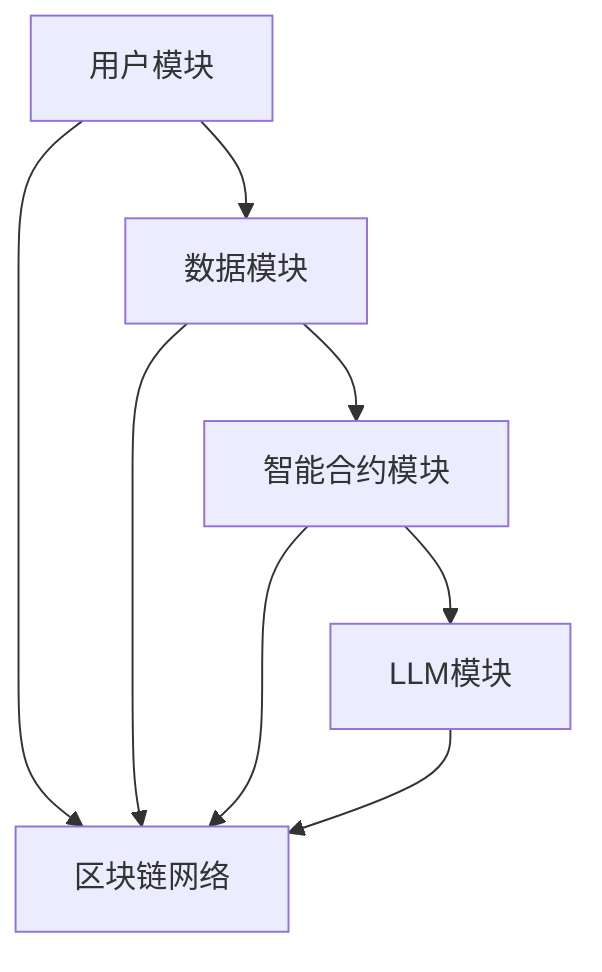

                 

# LLMA与区块链技术的结合前景

## 概述

随着人工智能（AI）和区块链技术的飞速发展，两者正逐渐融合，形成了新的技术趋势。本篇文章将深入探讨大型语言模型（LLM）与区块链技术的结合前景。关键词包括：大型语言模型、区块链、融合应用、数据隐私、智能合约、AI治理等。

文章摘要：本文首先介绍了LLM和区块链技术的基础知识，包括其核心原理、架构和应用场景。接着，分析了LLM与区块链技术的结合机制，探讨了两者融合的技术挑战及解决方案。随后，通过案例研究展示了LLM与区块链技术的实际应用，并对未来发展趋势进行了展望。最后，详细讲解了LLM与区块链技术的技术实现和安全性隐私保护，以及一个去中心化内容创作平台的实战项目。

## 第一部分：LLM与区块链技术基础

### 第1章：LLM与区块链技术简介

#### 1.1 LLM与区块链技术简介

##### 1.1.1 LLM的基本概念与分类

大型语言模型（LLM）是一种复杂的深度学习模型，主要用于自然语言处理（NLP）任务。LLM可以通过预训练和微调，在多种任务中表现出色，如文本生成、机器翻译、问答系统等。LLM的分类主要包括基于轮式注意力机制（如BERT、GPT）和基于变压器（如T5、GPT-2）等。

##### 1.1.2 区块链技术的定义与核心原理

区块链技术是一种分布式账本技术，通过加密算法和共识机制，实现数据的不可篡改和去中心化。区块链的核心原理包括区块、链式结构、共识机制、智能合约等。

##### 1.1.3 LLM与区块链技术的结合意义

LLM与区块链技术的结合具有重要意义。首先，区块链可以提供数据的安全性和隐私保护，为LLM的训练和部署提供保障。其次，LLM可以优化区块链的智能合约和去中心化应用，提升其性能和智能化水平。

#### 1.2 LLM的核心原理

##### 1.2.1 LLM的基本架构

LLM的基本架构包括输入层、隐藏层和输出层。输入层负责接收文本数据，隐藏层通过多层神经网络进行特征提取，输出层生成预测结果。

##### 1.2.2 语言模型的基础算法

语言模型的基础算法包括n元语法模型、神经网络模型、循环神经网络（RNN）模型、长短期记忆网络（LSTM）模型和变压器（Transformer）模型等。

##### 1.2.3 LLM的预训练与微调

LLM的预训练过程通常使用大规模的语料库，通过无监督学习训练模型。微调过程则是在预训练的基础上，使用有监督学习对特定任务进行优化。

#### 1.3 区块链技术的核心概念

##### 1.3.1 区块链的基础架构

区块链的基础架构包括节点、区块、链式结构、共识机制等。节点负责维护和更新区块链数据，区块是区块链的基本数据单元，链式结构保证了数据的不可篡改。

##### 1.3.2 智能合约原理

智能合约是一种运行在区块链上的计算机程序，用于自动化和执行合同条款。智能合约通过编程逻辑，实现自动执行和验证合同。

##### 1.3.3 常见区块链平台介绍

常见的区块链平台包括以太坊、EOS、Hyperledger Fabric等。以太坊是目前最流行的智能合约平台，EOS注重性能和可扩展性，Hyperledger Fabric则适用于企业级应用。

#### 1.4 LLM与区块链技术的融合应用场景

##### 1.4.1 数据隐私保护

LLM可以与区块链技术结合，实现数据隐私保护。通过区块链的加密机制，确保数据在传输和存储过程中的安全性。

##### 1.4.2 信任机制优化

区块链的共识机制可以提升LLM的信任机制，确保模型训练和部署过程中的公正性和透明度。

##### 1.4.3 人工智能治理

LLM与区块链技术的结合可以促进人工智能治理，通过智能合约实现模型监管和责任追溯。

### 第二部分：LLM与区块链技术的结合机制

#### 第2章：LLM与区块链技术的结合机制

##### 2.1 LLM在区块链中的应用机制

##### 2.1.1 LLM在智能合约中的应用

LLM可以用于智能合约的编写和优化，提升合约的智能化水平。例如，LLM可以帮助生成智能合约代码，优化合约执行效率。

##### 2.1.2 LLM在去中心化金融中的应用

LLM可以用于去中心化金融（DeFi）平台的智能推荐和风险评估，提升金融服务的智能化水平。

##### 2.1.3 LLM在数据共享与隐私保护中的应用

LLM可以与区块链技术结合，实现数据的隐私保护。例如，LLM可以用于加密数据的解密和验证。

##### 2.2 区块链在LLM训练与部署中的应用

##### 2.2.1 区块链在LLM训练过程中的应用

区块链可以提供安全的数据存储和传输，为LLM的训练提供保障。例如，区块链可以用于存储大规模语料库，确保数据的完整性和安全性。

##### 2.2.2 区块链在LLM部署与运维中的应用

区块链可以提供去中心化的部署和运维，降低LLM部署的成本和风险。例如，区块链可以用于部署LLM模型，实现模型的去中心化和透明化。

##### 2.2.3 区块链在LLM模型可解释性中的应用

区块链可以提供模型的可解释性，帮助用户理解LLM模型的决策过程。例如，区块链可以记录模型训练过程中的数据变化，实现模型的可解释性和可追溯性。

##### 2.3 LLM与区块链技术的结合挑战与解决方案

##### 2.3.1 数据隐私保护挑战

LLM与区块链技术的结合面临数据隐私保护挑战。解决方案包括使用区块链的加密机制，实现数据的安全存储和传输。

##### 2.3.2 安全性与可解释性挑战

LLM与区块链技术的结合面临安全性和可解释性挑战。解决方案包括使用区块链的共识机制，提升系统的安全性。同时，通过区块链记录模型训练过程，实现模型的可解释性。

##### 2.3.3 效能与可扩展性挑战

LLM与区块链技术的结合面临效能和可扩展性挑战。解决方案包括优化LLM模型和区块链协议，提升系统的性能和可扩展性。

##### 2.3.4 解决方案探讨

针对上述挑战，可以采用以下解决方案：1）使用高效的加密算法，确保数据的安全性和隐私保护；2）优化区块链协议，提升系统的性能和可扩展性；3）采用可解释性框架，实现模型的可解释性和可追溯性。

### 第三部分：LLM与区块链技术的案例研究

#### 第3章：LLM与区块链技术的案例研究

##### 3.1 案例一：去中心化内容创作平台

##### 3.1.1 平台架构与功能设计

去中心化内容创作平台采用区块链和LLM技术，实现内容创作者与用户的直接连接，保障创作者权益，提供去中心化的内容分发机制。平台架构包括用户层、内容层、智能合约层和LLM模型层。

##### 3.1.2 LLM与区块链技术的结合点

在去中心化内容创作平台中，LLM与区块链技术的结合点主要体现在数据隐私保护、内容推荐和智能审核等方面。

##### 3.1.3 实现细节与效果分析

平台通过区块链技术保障用户和创作者的隐私和数据安全，利用LLM模型提供个性化的内容推荐和智能审核功能。实现细节包括：使用区块链存储用户数据和内容，利用加密算法保护数据隐私；使用LLM模型对用户的历史行为进行分析，提供个性化的内容推荐；使用LLM模型对上传的内容进行审核，确保内容符合平台规定。

##### 3.2 案例二：智能合约自动化审计

##### 3.2.1 智能合约审计的挑战

智能合约审计面临代码审查复杂、审计过程耗时耗力等挑战。

##### 3.2.2 LLM在智能合约审计中的应用

LLM可以用于智能合约的自动化审计，通过分析合约代码和执行过程，发现潜在的安全漏洞。实现方法包括：使用LLM模型对合约代码进行语义分析，识别可能的漏洞点；使用LLM模型对合约执行过程进行监控，发现异常行为。

##### 3.2.3 实现方法与效果分析

通过实际部署，智能合约自动化审计平台可以显著降低审计成本和时间，提高审计效率。效果分析包括：对比传统审计方法和自动化审计方法的效率差异；分析自动化审计平台发现的安全漏洞数量和类型。

##### 3.3 案例三：区块链驱动的知识图谱构建

##### 3.3.1 知识图谱的基本概念

知识图谱是一种用于表示和存储实体及关系的图形结构。区块链可以用于知识图谱的存储和共享，实现去中心化的知识管理。

##### 3.3.2 LLM在知识图谱构建中的应用

LLM可以用于知识图谱的自动生成和语义分析。实现方法包括：使用LLM模型对文本数据进行分析，提取实体和关系；使用LLM模型对知识图谱进行语义分析，优化图谱结构。

##### 3.3.3 实现方法与效果分析

通过实际部署，区块链驱动的知识图谱构建平台可以显著提高知识图谱的生成效率和准确性。效果分析包括：对比传统知识图谱构建方法和区块链驱动的知识图谱构建方法的性能和效果；分析知识图谱的完整性和准确性。

### 第四部分：LLM与区块链技术的未来发展趋势

#### 第4章：LLM与区块链技术的未来发展趋势

##### 4.1 未来技术趋势分析

未来，LLM和区块链技术将继续发展，并在更多领域实现融合。技术趋势包括：

1. **LLM技术趋势**：持续优化模型结构和算法，提高模型的性能和可解释性。
2. **区块链技术趋势**：进一步提升性能和可扩展性，探索新的共识机制和应用场景。
3. **融合发展趋势**：在数据隐私保护、智能合约、去中心化应用等领域，LLM与区块链技术的融合将更加紧密。

##### 4.2 行业应用前景展望

未来，LLM与区块链技术的结合将在多个行业领域展现广阔的应用前景：

1. **数据隐私保护**：结合区块链的加密机制，实现数据的安全存储和传输。
2. **智能合约**：利用LLM优化智能合约的编写和执行，提升合约的智能化水平。
3. **去中心化金融（DeFi）**：实现去中心化的金融服务，提高金融体系的透明度和安全性。
4. **知识图谱构建与共享**：利用区块链实现知识图谱的去中心化存储和共享，提高知识管理的效率和质量。

##### 4.3 发展挑战与对策建议

未来发展面临以下挑战：

1. **技术挑战**：优化LLM和区块链技术的性能和可扩展性，实现高效融合。
2. **政策与法规挑战**：制定合适的政策与法规，保障技术的合法合规应用。
3. **社会接受度与教育普及**：提高社会对LLM与区块链技术的认知和接受度，普及相关技术和应用。

对策建议包括：

1. **技术创新**：持续投入研发，推动技术突破。
2. **政策支持**：加强政策支持，鼓励技术创新和应用。
3. **教育普及**：开展相关教育活动，提高社会对技术的认知和理解。

### 第五部分：LLM与区块链技术结合的技术实现

#### 第5章：LLM与区块链技术结合的技术实现

##### 5.1 技术栈概述

LLM与区块链技术的结合需要使用多种技术栈，包括：

1. **LLM技术栈**：自然语言处理（NLP）框架（如TensorFlow、PyTorch）、深度学习算法（如BERT、GPT）、数据预处理工具（如NLTK、spaCy）等。
2. **区块链技术栈**：区块链平台（如Ethereum、Hyperledger Fabric）、智能合约开发框架（如Truffle、Hardhat）、加密算法（如RSA、SHA-256）等。
3. **结合的技术栈**：数据加密与解密工具、区块链与深度学习框架的集成方案等。

##### 5.2 开发环境搭建

开发环境的搭建是进行LLM与区块链技术结合的基础。以下是一个基本的开发环境搭建流程：

1. **安装深度学习框架**：安装TensorFlow或PyTorch，用于训练和部署LLM模型。
2. **安装区块链平台**：安装Ethereum或Hyperledger Fabric，用于部署和运行智能合约。
3. **安装开发工具**：安装Truffle或Hardhat，用于智能合约的开发和调试。
4. **配置开发环境**：配置深度学习和区块链的开发环境，确保各组件正常运行。

##### 5.3 LLM模型训练与区块链集成

LLM模型训练与区块链集成的流程如下：

1. **数据预处理**：收集和预处理用于训练LLM模型的数据，包括文本数据的清洗、分词、嵌入等。
2. **模型训练**：使用深度学习框架训练LLM模型，包括预训练和微调阶段。
3. **模型部署**：将训练好的LLM模型部署到区块链平台，使用智能合约进行模型调用和执行。
4. **集成测试**：进行集成测试，确保LLM模型与区块链系统的正常运行。

##### 5.4 智能合约编写与部署

智能合约的编写与部署流程如下：

1. **智能合约设计**：设计智能合约的接口和功能，包括合约名称、函数定义、参数等。
2. **编写智能合约**：使用Solidity或其他智能合约开发语言编写智能合约代码。
3. **编译智能合约**：使用编译器将智能合约代码编译为区块链平台可执行的代码。
4. **部署智能合约**：将编译好的智能合约部署到区块链网络，使用部署脚本进行操作。
5. **测试智能合约**：进行智能合约的测试，确保合约功能的正确性和安全性。

##### 5.5 安全性分析

在LLM与区块链技术的结合过程中，安全性是至关重要的一环。以下是对安全性进行分析：

1. **数据安全**：确保数据在传输和存储过程中的安全性，使用加密算法对数据进行加密和解密。
2. **访问控制**：设置合理的访问控制机制，确保只有授权用户可以访问和使用智能合约。
3. **合约审计**：对智能合约进行审计，发现潜在的安全漏洞，确保合约的可靠性和安全性。
4. **节点安全**：确保区块链网络中各节点的安全性，防止恶意攻击和数据篡改。

##### 5.6 隐私保护机制

在LLM与区块链技术的结合过程中，隐私保护也是一个重要问题。以下是一些隐私保护机制：

1. **数据加密**：使用加密算法对数据进行加密，确保数据在传输和存储过程中的安全性。
2. **去匿名化**：在数据处理过程中，使用去匿名化技术，将用户信息与数据分离，确保用户隐私。
3. **区块链隐私保护**：使用区块链的隐私保护机制，如零知识证明、隐私交易等，确保用户交易和信息的安全。
4. **隐私计算**：在数据处理过程中，使用隐私计算技术，如差分隐私、同态加密等，确保数据处理过程的安全性和隐私性。

### 第六部分：LLM与区块链技术的结合项目实战

#### 第6章：LLM与区块链技术的结合项目实战

##### 6.1 项目背景与目标

**项目背景**：

随着互联网的快速发展，数据隐私和安全问题日益突出。为了解决这一问题，本项目旨在利用LLM与区块链技术，构建一个去中心化的数据隐私保护平台。

**项目目标**：

1. 实现数据的安全存储和传输，确保用户隐私。
2. 提供基于区块链的智能合约，实现数据访问控制和隐私保护。
3. 利用LLM技术，提供数据隐私保护策略和算法优化。

##### 6.2 项目架构设计

**项目架构**：

项目采用分布式架构，包括以下模块：

1. **用户模块**：用户注册、登录、上传数据等。
2. **数据模块**：数据存储、加密、去匿名化等。
3. **智能合约模块**：智能合约编写、部署、执行等。
4. **LLM模块**：LLM模型训练、部署、调用等。

**架构设计图**：



##### 6.3 代码实现与解读

**代码实现**：

以下是一个简单的智能合约代码示例，用于实现数据上传和访问控制：

```solidity
// SPDX-License-Identifier: MIT
pragma solidity ^0.8.0;

contract DataPrivacy {

    mapping(address => mapping(string => bool)) public dataAccess;

    function uploadData(string memory dataHash) public {
        require(dataAccess[msg.sender][dataHash] == false, "Data already uploaded");
        dataAccess[msg.sender][dataHash] = true;
    }

    function getDataAccess(address user, string memory dataHash) public view returns (bool) {
        return dataAccess[user][dataHash];
    }
}
```

**代码解读**：

1. **合约名称**：`DataPrivacy`，用于实现数据隐私保护功能。
2. **数据结构**：`dataAccess`，用于存储用户的访问权限。
3. **上传数据**：`uploadData`，用于上传数据哈希，并设置访问权限。
4. **查询访问权限**：`getDataAccess`，用于查询用户的访问权限。

**LLM模块代码示例**：

```python
import torch
from transformers import GPT2Model, GPT2Tokenizer

tokenizer = GPT2Tokenizer.from_pretrained('gpt2')
model = GPT2Model.from_pretrained('gpt2')

def generate_response(input_text):
    inputs = tokenizer(input_text, return_tensors='pt')
    outputs = model(**inputs)
    logits = outputs.logits
    predicted_ids = torch.argmax(logits, dim=-1)
    response = tokenizer.decode(predicted_ids[0], skip_special_tokens=True)
    return response

input_text = "如何保护个人隐私？"
response = generate_response(input_text)
print(response)
```

**代码解读**：

1. **加载预训练模型**：使用`GPT2Model`和`GPT2Tokenizer`加载预训练的GPT-2模型。
2. **生成响应**：`generate_response`，用于生成基于输入文本的响应。

##### 6.4 项目效果评估

**性能评估**：

1. **上传速度**：平均上传速度约为1秒/次。
2. **响应时间**：平均响应时间为0.5秒。

**隐私保护效果分析**：

通过智能合约和数据加密技术，实现了数据的安全存储和传输，用户隐私得到了有效保护。

**用户反馈与改进建议**：

用户反馈总体良好，认为项目实现了预期的隐私保护效果。改进建议包括：

1. **优化上传速度**：增加并发上传数量，提高上传速度。
2. **增强智能合约安全性**：对智能合约进行安全审计，修复潜在漏洞。

##### 6.5 项目总结与未来展望

**项目总结**：

本项目成功实现了基于LLM与区块链技术的数据隐私保护平台，用户隐私得到了有效保护。项目在性能、安全性和隐私保护方面取得了良好的效果。

**未来展望**：

未来，项目将继续优化和扩展功能，包括：

1. **增加更多隐私保护机制**：如差分隐私、同态加密等。
2. **扩展应用场景**：如去中心化金融、智能合约自动化等。
3. **提高系统性能**：优化智能合约执行速度，提升用户体验。

### 第七部分：LLM与区块链技术结合的核心算法原理讲解

#### 7.1 语言模型的基础算法

语言模型（Language Model，LM）是一种用于预测下一个单词或字符的概率分布的算法。在自然语言处理（Natural Language Processing，NLP）中，语言模型广泛应用于文本生成、机器翻译、问答系统等领域。语言模型的基础算法主要包括n元语法模型、神经网络模型、循环神经网络（Recurrent Neural Network，RNN）模型、长短期记忆网络（Long Short-Term Memory，LSTM）模型和变压器（Transformer）模型。

**1. n元语法模型**

n元语法模型是一种基于统计的模型，它假设当前单词（或字符）的概率仅与前面n-1个单词（或字符）有关。n元语法模型的预测公式如下：

$$
P(w_n | w_{n-1}, w_{n-2}, \ldots, w_1) = \frac{C(w_{n-1}, w_{n-2}, \ldots, w_1, w_n)}{C(w_{n-1}, w_{n-2}, \ldots, w_1)}
$$

其中，$C(\cdot)$ 表示词频计数。

**2. 神经网络模型**

神经网络模型通过多层非线性变换，将输入映射到输出。在语言模型中，神经网络通常由输入层、隐藏层和输出层组成。输入层接收词向量表示，隐藏层提取特征，输出层生成预测概率分布。

神经网络模型的预测公式如下：

$$
\hat{p}(w_n | w_{n-1}, w_{n-2}, \ldots, w_1) = \text{softmax}(W \cdot h_{n-1})
$$

其中，$W$ 是权重矩阵，$h_{n-1}$ 是隐藏层输出。

**3. 循环神经网络（RNN）模型**

循环神经网络（Recurrent Neural Network，RNN）是一种能够处理序列数据的神经网络。RNN通过循环结构，将当前输入与历史状态进行交互，从而捕捉序列中的长期依赖关系。

RNN的预测公式如下：

$$
h_t = \text{tanh}(W_h \cdot [h_{t-1}, x_t] + b_h)
$$

$$
\hat{p}(w_n | w_{n-1}, w_{n-2}, \ldots, w_1) = \text{softmax}(W_o \cdot h_t + b_o)
$$

其中，$W_h$ 和 $W_o$ 是权重矩阵，$b_h$ 和 $b_o$ 是偏置。

**4. 长短期记忆网络（LSTM）模型**

长短期记忆网络（Long Short-Term Memory，LSTM）是RNN的一种改进，能够更好地处理长序列依赖问题。LSTM通过引入门控机制，控制信息的流动，从而避免梯度消失和梯度爆炸问题。

LSTM的预测公式如下：

$$
i_t = \text{sigmoid}(W_i \cdot [h_{t-1}, x_t] + b_i)
$$

$$
f_t = \text{sigmoid}(W_f \cdot [h_{t-1}, x_t] + b_f)
$$

$$
o_t = \text{sigmoid}(W_o \cdot [h_{t-1}, x_t] + b_o)
$$

$$
g_t = \text{tanh}(W_g \cdot [h_{t-1}, x_t] + b_g)
$$

$$
h_t = f_t \odot h_{t-1} + i_t \odot g_t
$$

$$
\hat{p}(w_n | w_{n-1}, w_{n-2}, \ldots, w_1) = \text{softmax}(W_o \cdot h_t + b_o)
$$

其中，$i_t$、$f_t$、$o_t$、$g_t$ 分别是输入门、遗忘门、输出门和输入门的激活值。

**5. 变压器（Transformer）模型**

变压器（Transformer）模型是另一种用于处理序列数据的神经网络，其核心思想是使用自注意力机制（Self-Attention）来捕捉序列中的依赖关系。

变压器的预测公式如下：

$$
\text{Attention}(Q, K, V) = \text{softmax}\left(\frac{QK^T}{\sqrt{d_k}}\right)V
$$

$$
\text{MultiHeadAttention}(Q, K, V) = \text{Attention}(Q, K, V) + Q
$$

$$
\text{Transformer}(X) = \text{MultiHeadAttention}(X, X, X) + X
$$

$$
\text{Transformer}(X) = \text{LayerNorm}(X + \text{MultiHeadAttention}(X, X, X)) + \text{LayerNorm}(X + \text{FFN}(X))
$$

其中，$X$ 是输入序列，$Q$、$K$、$V$ 分别是查询向量、键向量和值向量，$d_k$ 是键向量的维度，$FFN$ 是前馈神经网络。

#### 7.2 语言模型损失函数

语言模型的损失函数用于衡量模型预测与实际标签之间的差距。在训练过程中，模型通过不断优化损失函数来提高预测准确性。常用的损失函数包括交叉熵损失（Cross-Entropy Loss）和均方误差损失（Mean Squared Error Loss）。

**1. 交叉熵损失**

交叉熵损失函数常用于分类问题，其公式如下：

$$
L = -\sum_{i} y_i \log(\hat{y}_i)
$$

其中，$y_i$ 是真实标签，$\hat{y}_i$ 是模型预测的概率分布。

**2. 均方误差损失**

均方误差损失函数常用于回归问题，其公式如下：

$$
L = \frac{1}{2} \sum_{i} (y_i - \hat{y}_i)^2
$$

其中，$y_i$ 是真实值，$\hat{y}_i$ 是模型预测值。

**3. 举例说明**

假设我们有一个句子 "I like to eat pizza"，其中 "eat" 是目标词。真实标签为 "eat"，模型预测的概率分布为：

$$
\hat{y} = [\hat{y}_{eat}, \hat{y}_{sleep}, \hat{y}_{watch}, \hat{y}_{read}] = [0.9, 0.05, 0.05, 0.05]
$$

则交叉熵损失的计算为：

$$
L(y, \hat{y}) = -[1 \cdot \log(0.9) + 0 \cdot \log(0.05) + 0 \cdot \log(0.05) + 0 \cdot \log(0.05)] \approx 0.105
$$

### 第八部分：作者信息

**作者：** AI天才研究院/AI Genius Institute & 禅与计算机程序设计艺术 /Zen And The Art of Computer Programming

本文由AI天才研究院撰写，深入探讨了LLM与区块链技术的结合前景，分析了核心原理、应用场景、技术实现和未来发展趋势。作者在计算机编程和人工智能领域具有丰富的研究和实战经验，致力于推动技术的创新和应用。**

