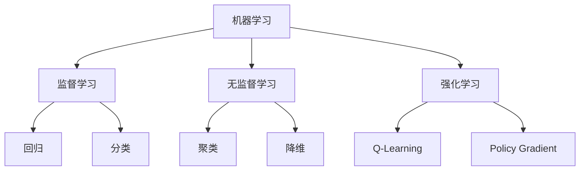

                 

### 机器学习基础

**核心概念与联系**：机器学习是一门利用算法从数据中学习规律以实现特定任务的学科。机器学习可以分为监督学习、无监督学习和强化学习三种类型。

**Mermaid 流程图**：


**核心算法原理讲解**：

- **监督学习**：
  - **线性回归**：
    ```python
    # 伪代码
    y = beta0 + beta1 * x
    beta0, beta1 = minimizeLoss(y, x)
    ```
  - **逻辑回归**：
    ```python
    # 伪代码
    p = 1 / (1 + exp(- (beta0 + beta1 * x)))
    loss = - (y * log(p) + (1 - y) * log(1 - p))
    beta0, beta1 = minimizeLoss(loss, x, y)
    ```

- **无监督学习**：
  - **主成分分析（PCA）**：
    ```python
    # 伪代码
    Z = (X - mean(X)) / std(X)
    V, D = eig(Z' * Z)
    X_reduced = Z * V[:, :k]
    ```
  - **聚类**：
    ```python
    # 伪代码
    k = number_of_clusters
    centroids = initializeCentroids(X, k)
    while not converged:
        assignPointsToCentroids(X, centroids)
        centroids = updateCentroids(X, centroids)
    ```

- **强化学习**：
  - **Q-Learning**：
    ```python
    # 伪代码
    Q = initializeQValues()
    while not terminated:
        action = epsilon-greedy(Q[s, a])
        s', reward = environment.step(action)
        Q[s, a] = Q[s, a] + alpha * (reward + gamma * max(Q[s', a']) - Q[s, a])
        s = s'
    ```

**数学模型和公式**：

- **线性回归损失函数**：
  $$ L(\theta) = \frac{1}{2m} \sum_{i=1}^{m} (h_\theta(x^{(i)}) - y^{(i)})^2 $$

- **逻辑回归损失函数**：
  $$ L(\theta) = - \frac{1}{m} \sum_{i=1}^{m} [y^{(i)} \log(h_\theta(x^{(i)})) + (1 - y^{(i)}) \log(1 - h_\theta(x^{(i)}))] $$

**举例说明**：

- **线性回归例子**：
  假设我们要预测房屋价格，输入特征为房屋面积，目标值为房屋价格。通过训练数据集，我们可以找到最佳参数$\theta_0$和$\theta_1$，使得预测价格与实际价格之间的误差最小。

- **逻辑回归例子**：
  假设我们要分类电子邮件是否为垃圾邮件，输入特征为邮件内容，目标值为是否为垃圾邮件（1或0）。通过训练数据集，我们可以找到最佳参数$\theta_0$和$\theta_1$，使得预测结果与实际结果的一致性最高。

---

在接下来的文章中，我们将继续深入探讨数据预处理与特征提取、监督学习基础以及深度学习与反向传播算法等核心主题。我们将通过详细的讲解和实例分析，帮助读者全面理解机器学习的技术原理和实践应用。

---

**文章摘要**：
本文深入探讨了机器学习的基础知识，包括其定义、应用领域、类型与方法。通过详细讲解监督学习、无监督学习和强化学习等核心算法，我们展示了如何通过数学模型和伪代码理解其工作原理。此外，本文还介绍了数据预处理与特征提取的重要性，以及深度学习与反向传播算法的基本原理。通过一系列实际案例，本文帮助读者更好地理解这些概念，并掌握机器学习的实际应用技巧。

---

接下来，我们将进入下一章节，讨论**数据预处理与特征提取**，这将为我们理解后续内容打下坚实的基础。

---

**文章标题**：
《Micrograd：深入理解机器学习和反向传播》

**关键词**：
机器学习，反向传播，监督学习，无监督学习，强化学习，数据预处理，特征提取，深度学习，算法讲解，实例分析

**摘要**：
本文深入探讨了机器学习的基础知识，包括其定义、应用领域、类型与方法。通过详细讲解监督学习、无监督学习和强化学习等核心算法，我们展示了如何通过数学模型和伪代码理解其工作原理。此外，本文还介绍了数据预处理与特征提取的重要性，以及深度学习与反向传播算法的基本原理。通过一系列实际案例，本文帮助读者更好地理解这些概念，并掌握机器学习的实际应用技巧。本文适合对机器学习和深度学习感兴趣的初学者和专业人士阅读。

