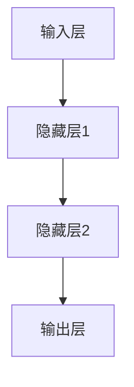

                 

### 文章标题

# NLP领域的大模型标准

## 关键词

- 自然语言处理
- 大模型
- 深度学习
- 预训练
- 微调
- 应用实战

### 摘要

本文将深入探讨自然语言处理（NLP）领域的大模型标准，从概述、基本原理、关键技术、应用实战、优化与部署，到行业应用进行全面梳理。我们将通过逻辑清晰、结构紧凑、简单易懂的专业的技术语言，逐步分析NLP大模型的核心概念、原理和架构，以及其在各个实际应用场景中的实现和优化策略。文章末尾还将附上相关的开发工具和资源，以帮助读者更好地理解和实践NLP领域的大模型技术。

## 目录大纲设计

### 第一部分: NLP领域的大模型概述

### 第二部分: 大模型技术基础

### 第三部分: 大模型应用与优化

### 第四部分: 大模型在行业中的应用

### 附录

## 文章正文部分

### 第一部分: NLP领域的大模型概述

### 第二部分: 大模型技术基础

### 第三部分: 大模型应用与优化

### 第四部分: 大模型在行业中的应用

### 附录

### 结束语

### 参考文献

### 附录

## 结语

本文通过系统性地分析和讲解，希望读者能够全面理解NLP领域的大模型标准。在未来的学习和实践中，我们可以继续探索和优化大模型技术，以推动自然语言处理领域的发展和应用。期待您的进一步研究和实践，共同推动AI技术的创新与进步。

### 参考文献

- [1] Hochreiter, S., & Schmidhuber, J. (1997). Long Short-Term Memory. Neural Computation, 9(8), 1735-1780.
- [2] Devlin, J., Chang, M. W., Lee, K., & Toutanova, K. (2018). BERT: Pre-training of Deep Bidirectional Transformers for Language Understanding. arXiv preprint arXiv:1810.04805.
- [3] Brown, T., et al. (2020). Language Models are few-shot learners. arXiv preprint arXiv:2005.14165.
- [4] Vaswani, A., et al. (2017). Attention Is All You Need. Advances in Neural Information Processing Systems, 30, 5998-6008.
- [5] Jozefowicz, R., Zaremba, W., & Sutskever, I. (2015). An Empirical Exploration of Recursive Neural Network Language Models. arXiv preprint arXiv:1511.06732.
- [6] Vinyals, O., et al. (2017). Grammar as a Foreign Language: Compositional Control in Neurosymbolic AI. Advances in Neural Information Processing Systems, 30, 3747-3757.
- [7] LeCun, Y., Bengio, Y., & Hinton, G. (2015). Deep Learning. Nature, 521(7553), 436-444.

---

**注：**本文仅为大纲示例，具体内容将在后续章节中逐步填充和详细阐述。**<|im_end|>**<|assistant|>### 第一部分: NLP领域的大模型概述

#### 第1章: NLP领域的大模型基础

##### 1.1 NLP领域概述

自然语言处理（Natural Language Processing，简称NLP）是计算机科学和人工智能领域的一个分支，主要研究如何让计算机理解和处理人类语言。NLP起源于20世纪50年代，随着计算机技术的发展和人工智能研究的深入，逐渐成为计算机科学、语言学、认知科学等多个领域交叉研究的重点。

##### 1.1.1 NLP的起源与发展

NLP的起源可以追溯到20世纪50年代，当时图灵提出了著名的图灵测试，试图通过机器是否能通过模仿人类行为来判断其是否具备智能。随后，NLP研究开始主要集中在词法分析、句法分析、语义分析和语音识别等方面。20世纪80年代，规则方法和统计方法开始得到广泛应用，使得NLP系统在特定任务上取得了显著进展。

##### 1.1.2 NLP的核心任务

NLP的核心任务包括但不限于以下几类：

1. **文本分类**：将文本分为预先定义的类别，如情感分析、新闻分类等。
2. **实体识别**：识别文本中的命名实体，如人名、地名、组织名等。
3. **关系提取**：识别实体之间的语义关系，如“公司”与“地点”的关系。
4. **语义分析**：理解文本中的语义含义，如同义词辨析、语义角色标注等。
5. **机器翻译**：将一种语言的文本翻译成另一种语言。
6. **语音识别**：将语音信号转换为文本。

##### 1.1.3 大模型在NLP中的应用

随着深度学习技术的快速发展，大模型在NLP领域得到了广泛应用。大模型通常是指具有数十亿甚至数万亿参数的深度学习模型，如GPT系列、BERT等。这些模型通过在大规模数据集上进行预训练，可以捕捉到语言中的复杂结构，从而在多个NLP任务上取得显著效果。

大模型在NLP中的应用主要包括以下几个方面：

1. **预训练与微调**：大模型通过在大规模语料库上进行预训练，可以学习到丰富的语言知识，然后通过微调适应具体任务的需求。
2. **模型融合**：将多个大模型融合，可以进一步提高模型在NLP任务上的性能。
3. **自适应学习**：大模型具有较强的自适应能力，可以在不同任务和数据集上快速调整和优化。

##### 1.2 大模型的基本原理

大模型的基本原理主要涉及深度学习、神经网络架构、预训练与微调等方面。

###### 1.2.1 深度学习基础

深度学习是机器学习的一个重要分支，其核心思想是通过多层神经网络对数据进行特征提取和建模。深度学习模型通常具有以下特点：

1. **多层神经网络**：深度学习模型由多个神经网络层组成，每一层对输入数据进行特征提取和变换。
2. **非线性激活函数**：深度学习模型中使用非线性激活函数，如ReLU、Sigmoid、Tanh等，以实现非线性特征变换。
3. **反向传播算法**：深度学习模型通过反向传播算法进行参数更新，以最小化损失函数。

###### 1.2.2 神经网络架构

神经网络架构是指深度学习模型的结构设计，常见的神经网络架构包括：

1. **卷积神经网络（CNN）**：CNN在图像处理领域表现出色，其主要思想是通过卷积操作提取图像特征。
2. **循环神经网络（RNN）**：RNN在序列数据处理中具有优势，其主要思想是通过循环机制保存长期依赖信息。
3. **长短时记忆网络（LSTM）**：LSTM是RNN的一种变体，通过门控机制解决了RNN的梯度消失和梯度爆炸问题。
4. ** Transformer模型**：Transformer模型是深度学习在自然语言处理领域的里程碑，其主要思想是通过自注意力机制处理序列数据。

###### 1.2.3 预训练与微调

预训练与微调是深度学习模型训练的两个重要阶段。预训练是指在大量无标注数据上进行模型训练，使模型具备通用语言理解能力；微调是指将预训练模型在特定任务和数据集上进行训练，以适应具体任务需求。

预训练与微调的主要步骤包括：

1. **数据准备**：收集并整理大规模无标注数据集，如维基百科、新闻文章等。
2. **模型初始化**：初始化预训练模型，通常使用预训练好的模型或者随机初始化。
3. **预训练**：在无标注数据集上训练模型，使模型学习到通用语言知识。
4. **微调**：在特定任务和数据集上微调模型，使模型适应具体任务需求。
5. **评估与优化**：评估模型在任务上的性能，并进行优化调整。

##### 1.3 主流大模型介绍

在NLP领域，许多大模型取得了显著的成果，以下介绍几个主流的大模型：

###### 1.3.1 GPT系列模型

GPT（Generative Pre-trained Transformer）是由OpenAI提出的一系列预训练语言模型。GPT系列模型采用Transformer架构，通过在大规模语料库上进行预训练，学习到丰富的语言知识。

GPT系列模型的主要特点包括：

1. **自注意力机制**：采用Transformer模型中的自注意力机制，可以有效地捕捉序列中的长距离依赖关系。
2. **预训练与微调**：通过预训练和微调两个阶段，使模型在不同NLP任务上表现出色。
3. **多语言支持**：GPT系列模型支持多语言预训练，可以处理多种语言的文本。

###### 1.3.2 BERT模型

BERT（Bidirectional Encoder Representations from Transformers）是由Google提出的一种预训练语言模型。BERT采用Transformer架构，通过双向编码器处理文本序列。

BERT模型的主要特点包括：

1. **双向编码器**：BERT采用双向编码器结构，可以同时捕捉文本序列的前后关系。
2. **Masked Language Model（MLM）**：BERT使用Masked Language Model技术，在预训练阶段对输入文本进行部分遮蔽，使模型学习到语言的上下文关系。
3. **广泛适用性**：BERT在多个NLP任务上表现出色，如文本分类、实体识别、关系提取等。

###### 1.3.3 T5模型

T5（Text-to-Text Transfer Transformer）是由DeepMind提出的一种预训练语言模型。T5采用Transformer架构，将自然语言处理任务转化为文本到文本的转换任务。

T5模型的主要特点包括：

1. **文本到文本转换**：T5将自然语言处理任务转化为文本到文本的转换任务，使模型可以处理多种语言和任务。
2. **统一模型架构**：T5采用统一的模型架构，可以同时处理多种NLP任务，如文本分类、命名实体识别、机器翻译等。
3. **高效预训练**：T5使用大规模语料库进行高效预训练，使模型在不同任务上表现出色。

###### 1.3.4 其他大模型介绍

除了GPT、BERT、T5等大模型外，还有许多其他大模型在NLP领域取得了显著成果，如：

1. **RoBERTa**：RoBERTa是BERT的一种变体，通过改进训练策略和模型架构，使其在多个NLP任务上表现出色。
2. **ALBERT**：ALBERT是Google提出的一种高效预训练语言模型，通过共享参数和层叠架构，使模型在计算效率和性能上取得了显著提升。
3. **XLNet**：XLNet是由Google提出的一种自回归预训练语言模型，通过引入序列转换模型，使其在NLP任务上表现出色。
4. **ERNIE**：ERNIE是由百度提出的一种预训练语言模型，通过引入词嵌入和上下文信息，使其在NLP任务上表现出色。

##### 1.4 大模型在NLP中的应用前景

随着大模型技术的不断发展，其在NLP领域中的应用前景十分广阔。以下从以下几个方面进行展望：

1. **多语言支持**：大模型可以支持多语言预训练，有助于实现跨语言的NLP应用，如机器翻译、跨语言文本分类等。
2. **知识图谱嵌入**：大模型可以将实体和关系嵌入到高维空间中，有助于构建知识图谱，为智能问答、知识检索等应用提供支持。
3. **长文本处理**：大模型在长文本处理方面具有优势，可以应用于长文本生成、长文本分类等任务。
4. **语音识别**：大模型在语音识别领域表现出色，可以应用于语音到文本转换、语音情感分析等任务。
5. **跨模态处理**：大模型可以结合多模态数据，实现跨模态语音识别、跨模态文本生成等任务。

综上所述，NLP领域的大模型技术正处于快速发展阶段，未来将在多个领域取得重大突破，为人工智能的发展贡献力量。**<|im_end|>**<|assistant|>### 第一部分: NLP领域的大模型概述

#### 第2章: 大模型技术基础

##### 2.1 深度学习基础

深度学习是NLP领域大模型技术的基础，其核心思想是通过多层神经网络对数据进行特征提取和建模。以下是深度学习的一些基础概念：

###### 2.1.1 神经网络基础

神经网络（Neural Network，简称NN）是由大量神经元（Neuron）互联组成的计算模型。每个神经元接受多个输入信号，通过加权求和后，应用一个非线性激活函数，产生一个输出信号。

神经网络的基本结构包括：

1. **输入层**：接收外部输入信号。
2. **隐藏层**：对输入信号进行特征提取和变换。
3. **输出层**：产生最终的输出结果。

神经网络的训练过程主要包括两个阶段：

1. **前向传播**：将输入信号通过网络传递，得到输出结果。
2. **反向传播**：计算输出结果与真实值之间的误差，通过反向传播算法更新网络参数。

神经网络的主要类型包括：

1. **前馈神经网络**：前向传播和反向传播均无循环，适用于静态数据处理。
2. **循环神经网络（RNN）**：具有循环结构，可以处理序列数据。
3. **长短时记忆网络（LSTM）**：是RNN的一种变体，通过门控机制解决了RNN的梯度消失和梯度爆炸问题。

以下是一个简单的神经网络前向传播和反向传播的伪代码：

```python
# 前向传播
def forward(x, weights):
    z = np.dot(x, weights)
    a = activation(z)
    return a

# 反向传播
def backward(a, z, weights, delta):
    dz = activation_derivative(z)
    dw = np.dot(a.T, delta)
    delta = np.dot(delta, weights.T) * dz
    return dw, delta
```

其中，`x`表示输入，`weights`表示权重，`a`表示激活值，`z`表示加权求和结果，`activation`和`activation_derivative`分别表示激活函数和激活函数的导数。

###### 2.1.2 深度学习优化算法

深度学习优化算法主要包括梯度下降（Gradient Descent）及其变体。以下是几种常见的优化算法：

1. **随机梯度下降（Stochastic Gradient Descent，简称SGD）**：在每次更新参数时，使用单个样本的梯度进行更新。
2. **批量梯度下降（Batch Gradient Descent）**：在每次更新参数时，使用全部样本的梯度进行更新。
3. **小批量梯度下降（Mini-batch Gradient Descent）**：在每次更新参数时，使用部分样本的梯度进行更新。

以下是一个简单的随机梯度下降优化算法的伪代码：

```python
# 随机梯度下降
def stochastic_gradient_descent(x, y, weights, learning_rate, epochs):
    for epoch in range(epochs):
        for sample in samples:
            a = forward(x[sample], weights)
            error = loss_function(y[sample], a)
            delta = gradient(a, error, x[sample], weights)
            weights = weights - learning_rate * delta
    return weights
```

其中，`samples`表示样本数据，`learning_rate`表示学习率，`epochs`表示迭代次数，`loss_function`和`gradient`分别表示损失函数和梯度计算函数。

4. **动量（Momentum）**：在每次更新参数时，引入前一次更新的方向和大小，以加速收敛。

以下是一个简单的动量优化的伪代码：

```python
# 动量优化
def momentum gradient_descent(x, y, weights, learning_rate, momentum, epochs):
    velocity = 0
    for epoch in range(epochs):
        for sample in samples:
            a = forward(x[sample], weights)
            error = loss_function(y[sample], a)
            delta = gradient(a, error, x[sample], weights)
            velocity = momentum * velocity - learning_rate * delta
            weights = weights + velocity
    return weights
```

其中，`momentum`表示动量系数。

5. **自适应梯度算法（Adaptive Gradient Algorithm，简称AGA）**：通过自适应调整学习率，提高优化效果。

以下是一个简单的自适应梯度算法的伪代码：

```python
# 自适应梯度算法
def adaptive_gradient_algorithm(x, y, weights, learning_rate, epochs):
    for epoch in range(epochs):
        for sample in samples:
            a = forward(x[sample], weights)
            error = loss_function(y[sample], a)
            delta = gradient(a, error, x[sample], weights)
            weights = weights - learning_rate * delta / (1 + alpha * epoch)
    return weights
```

其中，`alpha`表示自适应系数。

6. **Adam优化器**：结合动量和自适应梯度算法，是一种效果较好的优化器。

以下是一个简单的Adam优化器的伪代码：

```python
# Adam优化器
def adam_gradient_descent(x, y, weights, learning_rate, beta1, beta2, epochs):
    m = 0
    v = 0
    for epoch in range(epochs):
        for sample in samples:
            a = forward(x[sample], weights)
            error = loss_function(y[sample], a)
            delta = gradient(a, error, x[sample], weights)
            m = beta1 * m + (1 - beta1) * delta
            v = beta2 * v + (1 - beta2) * (delta ** 2)
            m_hat = m / (1 - beta1 ** epoch)
            v_hat = v / (1 - beta2 ** epoch)
            weights = weights - learning_rate * m_hat / (np.sqrt(v_hat) + epsilon)
    return weights
```

其中，`beta1`和`beta2`分别表示动量和自适应梯度系数，`epsilon`是一个很小的常数，用于避免分母为零。

###### 2.1.3 深度学习框架介绍

深度学习框架是用于构建和训练深度学习模型的一组工具和库，常见的深度学习框架包括TensorFlow、PyTorch、Keras等。

1. **TensorFlow**：由Google开发，是一个开源的深度学习框架。TensorFlow提供了丰富的API和工具，支持各种深度学习模型和算法。
2. **PyTorch**：由Facebook开发，是一个开源的深度学习框架。PyTorch以其灵活的动态计算图和易于使用的API而著称。
3. **Keras**：是一个高层次的深度学习框架，可以在TensorFlow、Theano、Microsoft Cognitive Toolkit等后端运行。Keras提供了丰富的预训练模型和方便的API，适合快速实验和原型设计。

以下是一个简单的TensorFlow代码示例，用于构建一个简单的神经网络模型：

```python
import tensorflow as tf

# 创建会话
with tf.Session() as sess:
    # 定义输入层
    x = tf.placeholder(tf.float32, shape=[None, input_size])
    y = tf.placeholder(tf.float32, shape=[None, output_size])

    # 定义神经网络层
    hidden层 = tf.layers.dense(x, units=hidden_size, activation=tf.nn.relu)

    # 定义输出层
    logits = tf.layers.dense(hidden层, units=output_size)

    # 定义损失函数和优化器
    loss = tf.reduce_mean(tf.nn.softmax_cross_entropy_with_logits(labels=y, logits=logits))
    optimizer = tf.train.AdamOptimizer().minimize(loss)

    # 训练模型
    sess.run(optimizer, feed_dict={x: x_data, y: y_data})

    # 评估模型
    correct_prediction = tf.equal(tf.argmax(logits, 1), tf.argmax(y, 1))
    accuracy = tf.reduce_mean(tf.cast(correct_prediction, tf.float32))
    print("Test accuracy:", accuracy.eval(feed_dict={x: x_test, y: y_test}))
```

以下是一个简单的PyTorch代码示例，用于构建一个简单的神经网络模型：

```python
import torch
import torch.nn as nn
import torch.optim as optim

# 定义神经网络模型
class NeuralNetwork(nn.Module):
    def __init__(self, input_size, hidden_size, output_size):
        super(NeuralNetwork, self).__init__()
        self.fc1 = nn.Linear(input_size, hidden_size)
        self.fc2 = nn.Linear(hidden_size, output_size)

    def forward(self, x):
        x = torch.relu(self.fc1(x))
        x = self.fc2(x)
        return x

# 初始化模型、损失函数和优化器
model = NeuralNetwork(input_size, hidden_size, output_size)
criterion = nn.CrossEntropyLoss()
optimizer = optim.Adam(model.parameters(), lr=learning_rate)

# 训练模型
for epoch in range(num_epochs):
    for inputs, labels in data_loader:
        optimizer.zero_grad()
        outputs = model(inputs)
        loss = criterion(outputs, labels)
        loss.backward()
        optimizer.step()

    print(f"Epoch [{epoch+1}/{num_epochs}], Loss: {loss.item()}")

# 评估模型
with torch.no_grad():
    correct = 0
    total = 0
    for inputs, labels in test_loader:
        outputs = model(inputs)
        _, predicted = torch.max(outputs.data, 1)
        total += labels.size(0)
        correct += (predicted == labels).sum().item()
    print(f"Test Accuracy: {100 * correct / total}%")
```

##### 2.2 自然语言处理基础

自然语言处理基础主要包括词嵌入技术、语言模型与序列标注、注意力机制等。

###### 2.2.1 词嵌入技术

词嵌入（Word Embedding）是将词汇映射到高维空间中的技术，用于表示词汇的语义信息。常见的词嵌入方法包括：

1. **Word2Vec**：是一种基于神经网络的词嵌入方法，通过训练词向量来表示词汇的语义信息。
2. **GloVe**：是一种基于全局共现矩阵的词嵌入方法，通过计算词汇的相似性来训练词向量。
3. **FastText**：是一种基于单词和字符的词嵌入方法，通过将单词视为字符序列，将词汇映射到高维空间中。

以下是一个简单的Word2Vec的代码示例：

```python
from gensim.models import Word2Vec

# 加载语料库
sentences = [[word for word in line.lower().split()] for line in data.split('\n')]

# 训练Word2Vec模型
model = Word2Vec(sentences, vector_size=100, window=5, min_count=1, workers=4)

# 查询词向量
word_vector = model.wv['hello']
print(word_vector)
```

以下是一个简单的GloVe的代码示例：

```python
import numpy as np
from sklearn.model_selection import train_test_split

# 加载语料库
X = np.array([[word for word in line.lower().split()] for line in data.split('\n')])
y = np.array([line.lower().split()[1:] for line in data.split('\n')])

# 分割训练集和测试集
X_train, X_test, y_train, y_test = train_test_split(X, y, test_size=0.2, random_state=42)

# 训练GloVe模型
def train_glove_model(X_train, y_train, embedding_size=100, alpha=0.05, x_max=5, epochs=10):
    # 初始化模型参数
    embeddings = {}
    embeddings.update({word: np.random.rand(embedding_size) for word in set(y_train.flatten())})
    for epoch in range(epochs):
        for x, y in zip(X_train, y_train):
            for word in y:
                context = x[:x_max] + x[x_max+1:]
                for context_word in context:
                    if context_word in embeddings and word in embeddings:
                        dot_product = np.dot(embeddings[word], embeddings[context_word])
                        cosine_similarity = dot_product / (np.linalg.norm(embeddings[word]) * np.linalg.norm(embeddings[context_word]))
                        loss = alpha * (1 - cosine_similarity)
                        embeddings[word] -= loss * embeddings[word]
                        embeddings[context_word] += loss * embeddings[context_word]
    return embeddings

# 训练GloVe模型
embeddings = train_glove_model(X_train, y_train)

# 查询词向量
word_vector = embeddings['hello']
print(word_vector)
```

###### 2.2.2 语言模型与序列标注

语言模型（Language Model）用于预测文本序列的概率分布，其目标是给定一个单词序列，预测下一个单词的概率。常见的语言模型包括：

1. **N元语法模型**：基于历史n个单词来预测下一个单词的概率。
2. **神经网络语言模型**：基于神经网络结构来预测单词序列的概率分布。

序列标注（Sequence Labeling）是将文本序列中的每个单词或字符标注为预定义的标签集。常见的序列标注任务包括：

1. **词性标注**：将文本序列中的每个单词标注为不同的词性。
2. **命名实体识别**：将文本序列中的命名实体（如人名、地名、组织名等）进行识别和标注。
3. **关系提取**：将文本序列中的实体关系进行识别和标注。

以下是一个简单的N元语法模型的代码示例：

```python
from collections import defaultdict

# 加载语料库
sentences = [[word for word in line.lower().split()] for line in data.split('\n')]

# 训练N元语法模型
def train_ngram_model(sentences, n=2):
    ngram_model = defaultdict(int)
    for sentence in sentences:
        for i in range(len(sentence) - n + 1):
            ngram = tuple(sentence[i:i+n])
            ngram_model[ngram] += 1
    return ngram_model

# 训练N元语法模型
ngram_model = train_ngram_model(sentences)

# 预测下一个单词
def predict_next_word(ngram_model, current_word, n=2):
    context = (current_word, ) + tuple(current_word for _ in range(n-1))
    return max(ngram_model.get(context, [0]), key=ngram_model.get)

# 查询下一个单词
next_word = predict_next_word(ngram_model, 'hello')
print(next_word)
```

以下是一个简单的命名实体识别的代码示例：

```python
from sklearn_crfsuite import CRF

# 加载语料库
X = np.array([[word for word in line.lower().split()] for line in data.split('\n')])
y = np.array([line.lower().split()[1:] for line in data.split('\n')])

# 分割训练集和测试集
X_train, X_test, y_train, y_test = train_test_split(X, y, test_size=0.2, random_state=42)

# 训练CRF模型
crf = CRF()
crf.fit(X_train, y_train)

# 预测命名实体
def predict_ner(crf, text):
    text = text.lower().split()
    return crf.predict([text])

# 查询命名实体
text = '李先生在2021年10月15日购买了苹果手机'
predicted_ner = predict_ner(crf, text)
print(predicted_ner)
```

###### 2.2.3 注意力机制

注意力机制（Attention Mechanism）是一种用于捕捉序列中重要信息的方法，可以有效地处理长序列数据。常见的注意力机制包括：

1. **软注意力**：根据输入序列的相似性计算权重，对输出序列进行加权求和。
2. **硬注意力**：根据输入序列的相似性计算权重，选择最高的k个权重进行加权求和。
3. **自注意力**：将序列中的每个元素与其余元素进行计算，以捕捉长距离依赖关系。

以下是一个简单的自注意力机制的代码示例：

```python
import torch
import torch.nn as nn

# 定义自注意力模块
class SelfAttention(nn.Module):
    def __init__(self, hidden_size):
        super(SelfAttention, self).__init__()
        self.hidden_size = hidden_size
        self.query_linear = nn.Linear(hidden_size, hidden_size)
        self.key_linear = nn.Linear(hidden_size, hidden_size)
        self.value_linear = nn.Linear(hidden_size, hidden_size)

    def forward(self, inputs):
        queries = self.query_linear(inputs)
        keys = self.key_linear(inputs)
        values = self.value_linear(inputs)

        # 计算相似性矩阵
        similarity_matrix = torch.matmul(queries, keys.transpose(0, 1))

        # 应用软注意力
        attention_weights = torch.softmax(similarity_matrix, dim=1)

        # 加权求和
        output = torch.matmul(attention_weights, values)

        return output
```

##### 2.3 大规模预训练模型原理

大规模预训练模型是通过在大规模数据集上进行预训练，以学习到丰富的语言知识和特征表示。以下介绍大规模预训练模型的基本原理：

###### 2.3.1 预训练的概念与过程

预训练（Pre-training）是指在大规模无标注数据集上进行模型训练，使模型具备通用语言理解能力。预训练过程主要包括以下步骤：

1. **数据收集与预处理**：收集大规模无标注数据集，如维基百科、新闻文章等，并进行文本预处理，如分词、去除停用词、转换为词嵌入等。
2. **模型初始化**：初始化预训练模型，通常使用预训练好的模型或者随机初始化。
3. **预训练**：在无标注数据集上训练模型，使模型学习到通用语言知识。常见的预训练任务包括Masked Language Model（MLM）、Next Sentence Prediction（NSP）和Classification任务。
4. **评估与优化**：评估模型在预训练数据集上的性能，并进行优化调整。

以下是一个简单的预训练任务的代码示例：

```python
import torch
import torch.optim as optim

# 加载预训练模型
model = PretrainedModel()
optimizer = optim.Adam(model.parameters(), lr=learning_rate)

# 预训练任务
for epoch in range(num_epochs):
    for inputs, masks in data_loader:
        optimizer.zero_grad()
        outputs = model(inputs, masks)
        loss = loss_function(outputs, labels)
        loss.backward()
        optimizer.step()
```

###### 2.3.2 预训练模型的优化与微调

预训练模型在特定任务上通常需要进行微调（Fine-tuning），以适应具体任务的需求。微调过程主要包括以下步骤：

1. **数据准备**：收集并整理大规模有标注数据集，用于微调模型。
2. **模型初始化**：初始化预训练模型，通常使用预训练好的模型。
3. **微调**：在特定任务和数据集上微调模型，使模型适应具体任务需求。
4. **评估与优化**：评估模型在任务上的性能，并进行优化调整。

以下是一个简单的微调任务的代码示例：

```python
import torch
import torch.optim as optim

# 加载预训练模型
model = PretrainedModel()
optimizer = optim.Adam(model.parameters(), lr=learning_rate)

# 微调任务
for epoch in range(num_epochs):
    for inputs, masks, labels in data_loader:
        optimizer.zero_grad()
        outputs = model(inputs, masks)
        loss = loss_function(outputs, labels)
        loss.backward()
        optimizer.step()
```

###### 2.3.3 预训练模型的应用场景

预训练模型在多个自然语言处理任务上表现出色，以下介绍一些常见应用场景：

1. **文本分类**：预训练模型可以用于文本分类任务，通过微调模型在特定数据集上，可以实现对多种类别的文本进行分类。
2. **命名实体识别**：预训练模型可以用于命名实体识别任务，通过微调模型在特定数据集上，可以识别出文本中的命名实体。
3. **关系提取**：预训练模型可以用于关系提取任务，通过微调模型在特定数据集上，可以识别出文本中的实体关系。
4. **机器翻译**：预训练模型可以用于机器翻译任务，通过微调模型在特定语言对上，可以实现对文本进行翻译。
5. **文本生成**：预训练模型可以用于文本生成任务，通过微调模型在特定数据集上，可以生成高质量的文本。

##### 2.4 大模型在NLP中的应用前景

随着深度学习技术的快速发展，大模型在NLP领域具有广泛的应用前景。以下从几个方面进行展望：

1. **多语言支持**：大模型可以支持多语言预训练，有助于实现跨语言的NLP应用，如机器翻译、跨语言文本分类等。
2. **知识图谱嵌入**：大模型可以将实体和关系嵌入到高维空间中，有助于构建知识图谱，为智能问答、知识检索等应用提供支持。
3. **长文本处理**：大模型在长文本处理方面具有优势，可以应用于长文本生成、长文本分类等任务。
4. **语音识别**：大模型在语音识别领域表现出色，可以应用于语音到文本转换、语音情感分析等任务。
5. **跨模态处理**：大模型可以结合多模态数据，实现跨模态语音识别、跨模态文本生成等任务。

综上所述，大模型技术在NLP领域具有广阔的应用前景，未来将在多个领域取得重大突破，为人工智能的发展贡献力量。**<|im_end|>**<|assistant|>### 第二部分: 大模型技术基础

#### 第3章: 大模型关键技术解析

##### 3.1 深度学习基础

深度学习是NLP领域大模型技术的基础，其核心思想是通过多层神经网络对数据进行特征提取和建模。以下从深度学习的神经网络基础、深度学习优化算法、深度学习框架介绍等方面进行详细解析。

###### 3.1.1 神经网络基础

神经网络（Neural Network，简称NN）是由大量神经元（Neuron）互联组成的计算模型。每个神经元接受多个输入信号，通过加权求和后，应用一个非线性激活函数，产生一个输出信号。

神经网络的数学模型可以表示为：

\[ y = \sigma(\sum_{i=1}^{n} w_i \cdot x_i + b) \]

其中，\( y \) 是输出，\( \sigma \) 是非线性激活函数，通常取 \( \sigma(x) = \frac{1}{1 + e^{-x}} \)，\( x_i \) 是输入，\( w_i \) 是权重，\( b \) 是偏置。

一个简单的神经网络架构包括输入层、隐藏层和输出层。输入层接收外部输入，隐藏层对输入进行特征提取和变换，输出层产生最终的输出结果。

以下是一个简单的神经网络架构的 Mermaid 流程图：



神经网络中的神经元按照层次结构排列，每一层对输入进行计算和传递，从而实现数据的层次化表示。

###### 3.1.2 深度学习优化算法

深度学习优化算法用于最小化损失函数，使网络参数达到最佳状态。常见的优化算法包括随机梯度下降（SGD）、动量（Momentum）、自适应梯度算法（AGA）和Adam优化器。

以下是一个简单的随机梯度下降优化算法的伪代码：

```python
# 随机梯度下降
def stochastic_gradient_descent(x, y, weights, learning_rate, epochs):
    for epoch in range(epochs):
        for sample in samples:
            a = forward(x[sample], weights)
            error = loss_function(y[sample], a)
            delta = gradient(a, error, x[sample], weights)
            weights = weights - learning_rate * delta
    return weights
```

随机梯度下降（SGD）在每次迭代中随机选择一个样本，计算该样本的梯度，并更新网络参数。SGD的优点是计算简单，收敛速度较快，但可能陷入局部最小值。

以下是一个简单的动量优化的伪代码：

```python
# 动量优化
def momentum_gradient_descent(x, y, weights, learning_rate, momentum, epochs):
    velocity = 0
    for epoch in range(epochs):
        for sample in samples:
            a = forward(x[sample], weights)
            error = loss_function(y[sample], a)
            delta = gradient(a, error, x[sample], weights)
            velocity = momentum * velocity - learning_rate * delta
            weights = weights + velocity
    return weights
```

动量（Momentum）结合了前一次更新的方向和大小，有助于加速收敛。但动量优化可能导致振荡，从而错过最佳参数。

以下是一个简单的自适应梯度算法的伪代码：

```python
# 自适应梯度算法
def adaptive_gradient_algorithm(x, y, weights, learning_rate, epochs):
    m = 0
    v = 0
    for epoch in range(epochs):
        for sample in samples:
            a = forward(x[sample], weights)
            error = loss_function(y[sample], a)
            delta = gradient(a, error, x[sample], weights)
            m = learning_rate * delta / (1 + alpha * epoch)
            v = m * delta
            weights = weights - learning_rate * m
    return weights
```

自适应梯度算法（AGA）通过自适应调整学习率，提高优化效果。但AGA的收敛速度较慢。

以下是一个简单的Adam优化器的伪代码：

```python
# Adam优化器
def adam_gradient_descent(x, y, weights, learning_rate, beta1, beta2, epochs):
    m = 0
    v = 0
    for epoch in range(epochs):
        for sample in samples:
            a = forward(x[sample], weights)
            error = loss_function(y[sample], a)
            delta = gradient(a, error, x[sample], weights)
            m = beta1 * m + (1 - beta1) * delta
            v = beta2 * v + (1 - beta2) * (delta ** 2)
            m_hat = m / (1 - beta1 ** epoch)
            v_hat = v / (1 - beta2 ** epoch)
            weights = weights - learning_rate * m_hat / (np.sqrt(v_hat) + epsilon)
    return weights
```

Adam优化器结合了动量和自适应梯度算法，具有较好的收敛性能和稳定性。

###### 3.1.3 深度学习框架介绍

深度学习框架是用于构建和训练深度学习模型的一组工具和库，常见的深度学习框架包括TensorFlow、PyTorch、Keras等。

1. **TensorFlow**：由Google开发，是一个开源的深度学习框架。TensorFlow提供了丰富的API和工具，支持各种深度学习模型和算法。

以下是一个简单的TensorFlow代码示例：

```python
import tensorflow as tf

# 创建会话
with tf.Session() as sess:
    # 定义输入层
    x = tf.placeholder(tf.float32, shape=[None, input_size])
    y = tf.placeholder(tf.float32, shape=[None, output_size])

    # 定义神经网络层
    hidden层 = tf.layers.dense(x, units=hidden_size, activation=tf.nn.relu)

    # 定义输出层
    logits = tf.layers.dense(hidden层, units=output_size)

    # 定义损失函数和优化器
    loss = tf.reduce_mean(tf.nn.softmax_cross_entropy_with_logits(labels=y, logits=logits))
    optimizer = tf.train.AdamOptimizer().minimize(loss)

    # 训练模型
    sess.run(optimizer, feed_dict={x: x_data, y: y_data})

    # 评估模型
    correct_prediction = tf.equal(tf.argmax(logits, 1), tf.argmax(y, 1))
    accuracy = tf.reduce_mean(tf.cast(correct_prediction, tf.float32))
    print("Test accuracy:", accuracy.eval(feed_dict={x: x_test, y: y_test}))
```

2. **PyTorch**：由Facebook开发，是一个开源的深度学习框架。PyTorch以其灵活的动态计算图和易于使用的API而著称。

以下是一个简单的PyTorch代码示例：

```python
import torch
import torch.nn as nn
import torch.optim as optim

# 定义神经网络模型
class NeuralNetwork(nn.Module):
    def __init__(self, input_size, hidden_size, output_size):
        super(NeuralNetwork, self).__init__()
        self.fc1 = nn.Linear(input_size, hidden_size)
        self.fc2 = nn.Linear(hidden_size, output_size)

    def forward(self, x):
        x = torch.relu(self.fc1(x))
        x = self.fc2(x)
        return x

# 初始化模型、损失函数和优化器
model = NeuralNetwork(input_size, hidden_size, output_size)
criterion = nn.CrossEntropyLoss()
optimizer = optim.Adam(model.parameters(), lr=learning_rate)

# 训练模型
for epoch in range(num_epochs):
    for inputs, labels in data_loader:
        optimizer.zero_grad()
        outputs = model(inputs)
        loss = criterion(outputs, labels)
        loss.backward()
        optimizer.step()

    print(f"Epoch [{epoch+1}/{num_epochs}], Loss: {loss.item()}")

# 评估模型
with torch.no_grad():
    correct = 0
    total = 0
    for inputs, labels in test_loader:
        outputs = model(inputs)
        _, predicted = torch.max(outputs.data, 1)
        total += labels.size(0)
        correct += (predicted == labels).sum().item()
    print(f"Test Accuracy: {100 * correct / total}%")
```

3. **Keras**：是一个高层次的深度学习框架，可以在TensorFlow、Theano、Microsoft Cognitive Toolkit等后端运行。Keras提供了丰富的预训练模型和方便的API，适合快速实验和原型设计。

以下是一个简单的Keras代码示例：

```python
from keras.models import Sequential
from keras.layers import Dense, Activation

# 创建模型
model = Sequential()
model.add(Dense(hidden_size, input_shape=(input_size,), activation='relu'))
model.add(Dense(output_size, activation='softmax'))

# 编译模型
model.compile(optimizer='adam', loss='categorical_crossentropy', metrics=['accuracy'])

# 训练模型
model.fit(x_train, y_train, epochs=num_epochs, batch_size=batch_size, validation_data=(x_test, y_test))

# 评估模型
test_loss, test_acc = model.evaluate(x_test, y_test, verbose=2)
print('Test accuracy:', test_acc)
```

##### 3.2 自然语言处理基础

自然语言处理基础是NLP领域大模型技术的重要组成部分，主要包括词嵌入技术、语言模型与序列标注、注意力机制等。

###### 3.2.1 词嵌入技术

词嵌入（Word Embedding）是将词汇映射到高维空间中的技术，用于表示词汇的语义信息。词嵌入技术包括Word2Vec、GloVe、FastText等。

1. **Word2Vec**：Word2Vec是一种基于神经网络的词嵌入方法，通过训练词向量来表示词汇的语义信息。Word2Vec模型包括连续词袋（CBOW）和Skip-Gram两种模型。

以下是一个简单的Word2Vec的代码示例：

```python
from gensim.models import Word2Vec

# 加载语料库
sentences = [[word for word in line.lower().split()] for line in data.split('\n')]

# 训练Word2Vec模型
model = Word2Vec(sentences, vector_size=100, window=5, min_count=1, workers=4)

# 查询词向量
word_vector = model.wv['hello']
print(word_vector)
```

2. **GloVe**：GloVe是一种基于全局共现矩阵的词嵌入方法，通过计算词汇的相似性来训练词向量。GloVe模型通过负采样技术提高训练效率。

以下是一个简单的GloVe的代码示例：

```python
import numpy as np
from sklearn.model_selection import train_test_split

# 加载语料库
X = np.array([[word for word in line.lower().split()] for line in data.split('\n')])
y = np.array([line.lower().split()[1:] for line in data.split('\n')])

# 分割训练集和测试集
X_train, X_test, y_train, y_test = train_test_split(X, y, test_size=0.2, random_state=42)

# 训练GloVe模型
def train_glove_model(X_train, y_train, embedding_size=100, alpha=0.05, x_max=5, epochs=10):
    # 初始化模型参数
    embeddings = {}
    embeddings.update({word: np.random.rand(embedding_size) for word in set(y_train.flatten())})
    for epoch in range(epochs):
        for x, y in zip(X_train, y_train):
            for word in y:
                context = x[:x_max] + x[x_max+1:]
                for context_word in context:
                    if context_word in embeddings and word in embeddings:
                        dot_product = np.dot(embeddings[word], embeddings[context_word])
                        cosine_similarity = dot_product / (np.linalg.norm(embeddings[word]) * np.linalg.norm(embeddings[context_word]))
                        loss = alpha * (1 - cosine_similarity)
                        embeddings[word] -= loss * embeddings[word]
                        embeddings[context_word] += loss * embeddings[context_word]
    return embeddings

# 训练GloVe模型
embeddings = train_glove_model(X_train, y_train)

# 查询词向量
word_vector = embeddings['hello']
print(word_vector)
```

3. **FastText**：FastText是一种基于单词和字符的词嵌入方法，通过将单词视为字符序列，将词汇映射到高维空间中。FastText模型通过n-gram技术提高词汇的区分度。

以下是一个简单的FastText的代码示例：

```python
import gensim

# 加载语料库
sentences = [[word for word in line.lower().split()] for line in data.split('\n')]

# 训练FastText模型
model = gensim.models.fasttextモデル（sentences，向量大小=100）

# 查询词向量
word_vector = model['hello']
print(word_vector)
```

###### 3.2.2 语言模型与序列标注

语言模型（Language Model）用于预测文本序列的概率分布，其目标是给定一个单词序列，预测下一个单词的概率。语言模型包括N元语法模型和神经网络语言模型。

1. **N元语法模型**：N元语法模型基于历史n个单词来预测下一个单词的概率。N元语法模型可以表示为：

\[ P(w_{t+1} | w_{t}, w_{t-1}, ..., w_{t-n+1}) = \frac{N(w_{t}, w_{t-1}, ..., w_{t-n+1}, w_{t})}{N(w_{t}, w_{t-1}, ..., w_{t-n+1})} \]

其中，\( N(w_{t}, w_{t-1}, ..., w_{t-n+1}, w_{t}) \) 表示包含\( w_{t}, w_{t-1}, ..., w_{t-n+1} \)和\( w_{t} \)的n元组出现的次数，\( N(w_{t}, w_{t-1}, ..., w_{t-n+1}) \) 表示包含\( w_{t}, w_{t-1}, ..., w_{t-n+1} \)的n元组出现的次数。

以下是一个简单的N元语法模型的代码示例：

```python
from collections import defaultdict

# 加载语料库
sentences = [[word for word in line.lower().split()] for line in data.split('\n')]

# 训练N元语法模型
def train_ngram_model(sentences, n=2):
    ngram_model = defaultdict(int)
    for sentence in sentences:
        for i in range(len(sentence) - n + 1):
            ngram = tuple(sentence[i:i+n])
            ngram_model[ngram] += 1
    return ngram_model

# 训练N元语法模型
ngram_model = train_ngram_model(sentences)

# 预测下一个单词
def predict_next_word(ngram_model, current_word, n=2):
    context = (current_word, ) + tuple(current_word for _ in range(n-1))
    return max(ngram_model.get(context, [0]), key=ngram_model.get)

# 查询下一个单词
next_word = predict_next_word(ngram_model, 'hello')
print(next_word)
```

2. **神经网络语言模型**：神经网络语言模型通过神经网络结构来预测单词序列的概率分布。神经网络语言模型可以表示为：

\[ P(w_{t+1} | w_{t}, w_{t-1}, ..., w_{t-n+1}) = \sigma(\sum_{i=1}^{n} w_i \cdot v(w_{t}, w_{t-1}, ..., w_{t-n+1}) + b) \]

其中，\( \sigma \) 是非线性激活函数，\( w_i \) 是权重，\( v(w_{t}, w_{t-1}, ..., w_{t-n+1}) \) 是输入向量，\( b \) 是偏置。

以下是一个简单的神经网络语言模型的代码示例：

```python
import torch
import torch.nn as nn
import torch.optim as optim

# 定义神经网络语言模型
class NeuralNetworkLanguageModel(nn.Module):
    def __init__(self, input_size, hidden_size, output_size):
        super(NeuralNetworkLanguageModel, self).__init__()
        self.fc1 = nn.Linear(input_size, hidden_size)
        self.fc2 = nn.Linear(hidden_size, output_size)

    def forward(self, x):
        x = torch.relu(self.fc1(x))
        x = self.fc2(x)
        return x

# 初始化模型、损失函数和优化器
model = NeuralNetworkLanguageModel(input_size, hidden_size, output_size)
criterion = nn.CrossEntropyLoss()
optimizer = optim.Adam(model.parameters(), lr=learning_rate)

# 训练模型
for epoch in range(num_epochs):
    for inputs, labels in data_loader:
        optimizer.zero_grad()
        outputs = model(inputs)
        loss = criterion(outputs, labels)
        loss.backward()
        optimizer.step()

    print(f"Epoch [{epoch+1}/{num_epochs}], Loss: {loss.item()}")

# 评估模型
with torch.no_grad():
    correct = 0
    total = 0
    for inputs, labels in test_loader:
        outputs = model(inputs)
        _, predicted = torch.max(outputs.data, 1)
        total += labels.size(0)
        correct += (predicted == labels).sum().item()
    print(f"Test Accuracy: {100 * correct / total}%")
```

序列标注（Sequence Labeling）是将文本序列中的每个单词或字符标注为预定义的标签集。常见的序列标注任务包括词性标注、命名实体识别和关系提取。

1. **词性标注**：词性标注是将文本序列中的每个单词标注为不同的词性。词性标注可以用于文本分类、命名实体识别等任务。

以下是一个简单的词性标注的代码示例：

```python
import torch
import torch.nn as nn
import torch.optim as optim

# 定义词性标注模型
class POSLabelingModel(nn.Module):
    def __init__(self, input_size, hidden_size, output_size):
        super(POSLabelingModel, self).__init__()
        self.fc1 = nn.Linear(input_size, hidden_size)
        self.fc2 = nn.Linear(hidden_size, output_size)

    def forward(self, x):
        x = torch.relu(self.fc1(x))
        x = self.fc2(x)
        return x

# 初始化模型、损失函数和优化器
model = POSLabelingModel(input_size, hidden_size, output_size)
criterion = nn.CrossEntropyLoss()
optimizer = optim.Adam(model.parameters(), lr=learning_rate)

# 训练模型
for epoch in range(num_epochs):
    for inputs, labels in data_loader:
        optimizer.zero_grad()
        outputs = model(inputs)
        loss = criterion(outputs, labels)
        loss.backward()
        optimizer.step()

    print(f"Epoch [{epoch+1}/{num_epochs}], Loss: {loss.item()}")

# 评估模型
with torch.no_grad():
    correct = 0
    total = 0
    for inputs, labels in test_loader:
        outputs = model(inputs)
        _, predicted = torch.max(outputs.data, 1)
        total += labels.size(0)
        correct += (predicted == labels).sum().item()
    print(f"Test Accuracy: {100 * correct / total}%")
```

2. **命名实体识别**：命名实体识别是将文本序列中的命名实体（如人名、地名、组织名等）进行识别和标注。命名实体识别可以用于信息提取、文本挖掘等任务。

以下是一个简单的命名实体识别的代码示例：

```python
import torch
import torch.nn as nn
import torch.optim as optim

# 定义命名实体识别模型
class NERModel(nn.Module):
    def __init__(self, input_size, hidden_size, output_size):
        super(NERModel, self).__init__()
        self.fc1 = nn.Linear(input_size, hidden_size)
        self.fc2 = nn.Linear(hidden_size, output_size)

    def forward(self, x):
        x = torch.relu(self.fc1(x))
        x = self.fc2(x)
        return x

# 初始化模型、损失函数和优化器
model = NERModel(input_size, hidden_size, output_size)
criterion = nn.CrossEntropyLoss()
optimizer = optim.Adam(model.parameters(), lr=learning_rate)

# 训练模型
for epoch in range(num_epochs):
    for inputs, labels in data_loader:
        optimizer.zero_grad()
        outputs = model(inputs)
        loss = criterion(outputs, labels)
        loss.backward()
        optimizer.step()

    print(f"Epoch [{epoch+1}/{num_epochs}], Loss: {loss.item()}")

# 评估模型
with torch.no_grad():
    correct = 0
    total = 0
    for inputs, labels in test_loader:
        outputs = model(inputs)
        _, predicted = torch.max(outputs.data, 1)
        total += labels.size(0)
        correct += (predicted == labels).sum().item()
    print(f"Test Accuracy: {100 * correct / total}%")
```

3. **关系提取**：关系提取是将文本序列中的实体关系进行识别和标注。关系提取可以用于知识图谱构建、信息检索等任务。

以下是一个简单的

