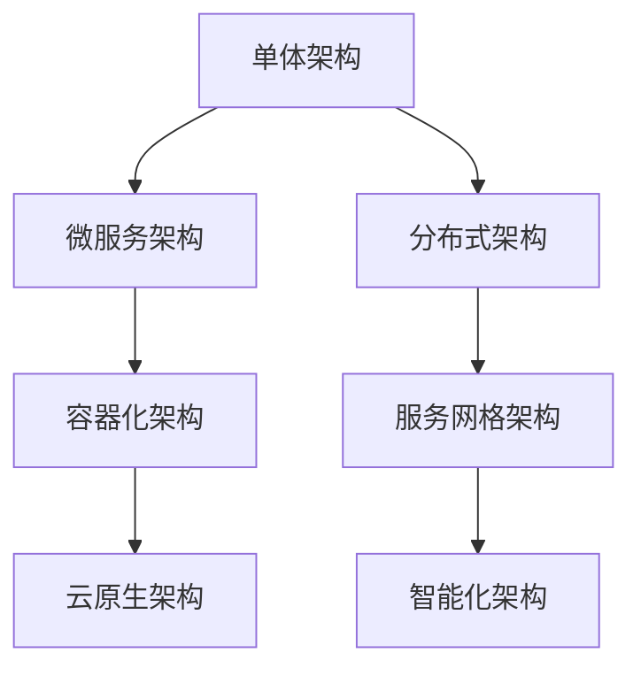

                 

# Web架构设计：从单体到微服务

> **关键词**：Web架构、单体架构、微服务架构、微服务通信、数据一致性、容器化、Kubernetes、性能优化、架构演变

> **摘要**：本文将深入探讨Web架构的设计，从传统的单体架构到现代的微服务架构。我们将分析这两种架构的设计原理、优缺点、实施与部署策略，并探讨从单体架构向微服务架构的迁移策略。通过具体案例，我们将展示如何在实际项目中应用微服务架构，以及如何进行性能优化和故障处理。

## 目录大纲

### 第一部分：Web架构基础

### 第1章：Web架构概述  
- **1.1 Web架构的演变历史**  
- **1.2 Web架构的核心概念**

### 第2章：单体架构设计与优化  
- **2.1 单体架构的原理**  
- **2.2 单体架构的优化策略**  
- **2.3 单体架构的典型问题**

### 第3章：微服务架构设计原则  
- **3.1 微服务架构的核心原则**  
- **3.2 微服务的治理与协调**

### 第二部分：微服务架构实施与部署

### 第4章：微服务开发实践  
- **4.1 微服务开发工具链**  
- **4.2 微服务开发模式**

### 第5章：微服务部署与运维  
- **5.1 微服务部署策略**  
- **5.2 微服务监控与性能优化**

### 第6章：微服务架构的挑战与解决方案  
- **6.1 微服务架构的挑战**  
- **6.2 微服务解决方案**

### 第三部分：从单体到微服务的迁移

### 第7章：单体架构向微服务迁移策略  
- **7.1 迁移准备**  
- **7.2 迁移步骤**  
- **7.3 迁移中的风险与应对**

### 第8章：微服务架构案例分析

### 第9章：未来的Web架构趋势

### 附录

- **附录A：Web架构设计资源与工具**

### 核心概念与联系：Web架构的演变与联系

- **Mermaid流程图：**

接下来，我们将逐步深入探讨Web架构的设计原理和实施策略。

## 第1章：Web架构概述

### 1.1 Web架构的演变历史

Web架构的发展历程可以追溯到1990年代末期，当时Web应用主要是基于静态页面的形式。随着时间的推移，Web应用逐渐变得复杂，从简单的静态页面发展到动态的、交互式的应用。这一演变过程中，Web架构也经历了多次重大变革。

- **单体架构**：最早的Web架构是单体架构，这种架构下，所有的应用逻辑、数据库、前端界面等都集中在一个单一的系统中。单体架构的优点是简单易懂，开发周期短。然而，随着系统规模的扩大，单体架构的缺点也逐渐暴露出来，如性能瓶颈、部署困难、维护成本高等。

- **分布式架构**：为了解决单体架构的问题，分布式架构应运而生。分布式架构通过将系统拆分为多个独立的模块，每个模块都可以独立部署和扩展。这种架构的优点是提高了系统的可扩展性和可维护性，但同时也带来了复杂性，如服务间通信、数据一致性等问题。

- **微服务架构**：微服务架构是分布式架构的进一步发展。微服务架构将系统进一步拆分为多个小型、独立的微服务，每个微服务负责一个特定的业务功能。微服务架构的优点是高可扩展性、高可用性和易于维护，但同时也引入了新的挑战，如服务发现、分布式事务等。

### 1.2 Web架构的核心概念

- **系统解耦**：系统解耦是Web架构设计中的一个核心概念。通过解耦，可以将系统中的各个模块分离，使得每个模块可以独立开发、部署和扩展。系统解耦的关键在于定义清晰的接口和协议，确保模块间可以独立运作。

- **响应式架构**：响应式架构是一种设计模式，旨在处理大量异步事件和实时数据流。响应式架构强调系统的非阻塞性和弹性，使得系统能够高效地处理大量的并发请求。

- **分布式系统**：分布式系统是由多个节点组成的系统，每个节点都可以独立运行并与其他节点通信。分布式系统的优点是高可用性和可扩展性，但同时也带来了复杂性，如数据一致性、网络延迟等问题。

在理解了Web架构的演变历史和核心概念后，我们接下来将深入探讨单体架构的设计与优化策略。

## 第2章：单体架构设计与优化

### 2.1 单体架构的原理

单体架构是一种传统的Web应用架构模式，其核心思想是将所有的应用逻辑、数据库、前端界面等都集中在一个单一的系统中。在单体架构中，所有的组件和模块都紧密耦合在一起，形成一个庞大的单体应用。

- **应用架构的核心组成部分**：在单体架构中，应用架构的核心组成部分包括前端界面、后端逻辑、数据库、缓存等。前端界面负责与用户交互，后端逻辑负责处理业务逻辑，数据库用于存储数据，缓存用于提高数据访问速度。

- **单体架构的开发模式**：在单体架构中，开发模式通常是一个团队合作模式。开发人员共同开发、测试和部署整个应用。这种开发模式有助于团队成员之间的协作，但也容易导致代码库的混乱和性能瓶颈。

### 2.2 单体架构的优化策略

虽然单体架构在某些场景下仍然适用，但随着应用规模的扩大，其缺点也逐渐暴露出来。为了解决这些问题，可以采用以下优化策略：

- **持续集成与持续部署（CI/CD）**：持续集成与持续部署是一种自动化软件交付流程，通过持续集成和持续部署，可以确保代码库的质量，提高部署效率。CI/CD 工具如 Jenkins、Travis CI 可以自动化构建、测试和部署应用。

- **代码重构与模块化设计**：代码重构是一种改善现有代码质量的手段，通过重构，可以简化代码结构，提高代码的可读性和可维护性。模块化设计是将系统拆分为多个独立的模块，每个模块负责特定的功能，有助于提高系统的可扩展性。

- **缓存与数据库优化**：缓存是一种常用的优化策略，通过缓存，可以减少对数据库的访问，提高数据访问速度。常用的缓存技术包括 Redis、Memcached 等。数据库优化包括数据库设计优化、索引优化、查询优化等，以提高数据库的性能。

### 2.3 单体架构的典型问题

虽然单体架构在某些场景下仍然适用，但以下问题可能会导致其性能瓶颈和维护难度增加：

- **性能瓶颈**：在单体架构中，所有的请求都通过一个单一的入口，容易形成性能瓶颈。当请求量增加时，系统的响应速度会明显下降。

- **维护难度**：随着应用的扩展，单体架构的代码库会变得庞大且复杂，导致维护难度增加。代码的耦合性高，修改一个模块可能会影响到其他模块。

- **部署困难**：单体架构的应用通常需要整体部署，部署过程中容易出错，部署时间较长。

综上所述，单体架构在某些场景下仍然适用，但随着应用规模的扩大，其缺点也逐渐暴露出来。为了解决这些问题，可以采用持续集成与持续部署、代码重构与模块化设计、缓存与数据库优化等策略。

接下来，我们将深入探讨微服务架构的设计原则。

## 第3章：微服务架构设计原则

微服务架构是一种将大型单体应用拆分为多个小型、独立服务的架构模式。这种架构模式具有高可扩展性、高可用性和易于维护等优点，但也引入了新的挑战，如服务发现、分布式事务等。在本节中，我们将探讨微服务架构的核心设计原则。

### 3.1 微服务架构的核心原则

- **单一职责原则**：单一职责原则是指每个微服务应只关注一个特定的业务功能。这种原则有助于提高系统的可维护性和可扩展性，因为每个微服务都可以独立开发和部署。

- **高内聚、低耦合原则**：高内聚、低耦合原则是指每个微服务应具有高内聚性，即服务内部的功能紧密相关；同时，服务间的耦合性应尽量低。这种原则有助于提高系统的可扩展性和可维护性。

- **松耦合设计**：松耦合设计是指微服务之间通过轻量级的通信协议（如 HTTP/REST、gRPC）进行通信，而不是通过共享数据库或其他紧耦合的组件。这种设计有助于降低服务间的依赖性，提高系统的灵活性和可扩展性。

### 3.2 微服务的治理与协调

微服务的治理与协调是确保微服务架构稳定运行的关键。以下是一些常用的治理与协调策略：

- **服务发现与注册**：服务发现与注册是微服务架构中的核心组件，负责管理和跟踪服务实例的位置。服务注册中心（如 Eureka、Consul）用于存储服务实例的元数据，服务发现机制（如 Netflix Eureka、Consul 的 DNS 查找）用于在需要时查找服务实例。

- **服务间通信协议**：服务间通信协议用于定义微服务之间的通信规则。常用的通信协议包括 HTTP/REST、gRPC、RabbitMQ 等。选择合适的通信协议可以优化服务间的通信性能和可靠性。

- **负载均衡与流量管理**：负载均衡与流量管理是确保系统高可用性和高性能的关键策略。负载均衡器（如 NGINX、HAProxy）可以根据服务实例的健康状态和负载情况，将请求分配到不同的服务实例上。流量管理则可以通过限流、熔断等策略，防止系统过载。

通过遵循上述设计原则和治理与协调策略，可以构建一个稳定、高效、可扩展的微服务架构。接下来，我们将讨论微服务开发实践。

## 第4章：微服务开发实践

微服务开发实践是构建高效、可扩展和可维护的Web架构的关键环节。在本节中，我们将探讨微服务开发工具链、开发模式以及如何进行服务拆分与整合。

### 4.1 微服务开发工具链

微服务开发工具链包括一系列工具和框架，用于简化微服务的构建、部署和运维。以下是一些常用的工具和框架：

- **Spring Boot**：Spring Boot 是一个用于构建微服务的开发框架，它简化了 Spring 应用程序的开发和部署。Spring Boot 提供了自动配置、依赖管理、嵌入式服务器等功能，使得开发者可以快速启动和运行微服务。

- **Docker**：Docker 是一个开源的应用容器引擎，用于打包、交付和运行应用程序。通过 Docker，可以将应用程序及其依赖项打包到一个独立的容器中，确保在不同的环境中都能保持一致的运行状态。

- **Kubernetes**：Kubernetes 是一个开源的容器编排平台，用于自动化部署、扩展和管理容器化应用程序。Kubernetes 提供了自动滚动更新、负载均衡、服务发现等功能，使得开发者可以轻松管理复杂的容器化应用。

- **微服务开发框架**：除了 Spring Boot，还有其他一些流行的微服务开发框架，如 Apache Dubbo、Netflix OSS 系列框架（如 Eureka、Hystrix、Zuul）等。这些框架提供了丰富的功能和生态系统，帮助开发者构建高性能、高可用的微服务架构。

### 4.2 微服务开发模式

在微服务开发中，选择合适的开发模式对于提高开发效率和系统质量至关重要。以下是一些常用的微服务开发模式：

- **前后端分离**：前后端分离是一种将前端和后端开发分离的开发模式。前端负责用户界面和交互，后端负责处理业务逻辑和数据存储。通过前后端分离，可以独立开发、测试和部署前端和后端服务，提高系统的可维护性和扩展性。

- **API网关**：API网关是一种集中管理和代理所有客户端请求的组件。API网关可以统一处理跨域请求、路由转发、请求校验等功能，同时还可以进行流量控制、日志记录和安全防护等。使用 API 网关可以提高系统的安全性、性能和可扩展性。

- **服务拆分与整合**：服务拆分是将单体应用分解为多个独立的微服务，每个微服务负责特定的业务功能。服务整合是将这些微服务组合起来，形成完整的业务流程。在服务拆分与整合过程中，需要考虑业务领域的上下文，确保服务的独立性和可扩展性。

### 4.3 服务拆分与整合

服务拆分与整合是微服务开发中的关键步骤。以下是一些服务拆分与整合的指导原则：

- **基于业务领域拆分**：根据业务领域和功能模块进行服务拆分，确保每个服务都专注于一个特定的业务功能。这样可以提高系统的模块化程度和可维护性。

- **保持服务独立性**：确保每个服务都是独立的，可以独立部署、测试和扩展。服务之间通过轻量级的通信协议进行交互，避免过度耦合。

- **服务版本管理**：在服务整合过程中，需要考虑服务版本的兼容性。通过版本管理，可以确保服务之间的兼容性和稳定性。

- **分布式事务处理**：在服务拆分后，分布式事务处理成为挑战。可以通过分布式事务框架（如 Seata）来实现跨服务的分布式事务处理，确保数据的一致性。

通过遵循上述开发工具链、开发模式和拆分与整合原则，可以构建一个高效、可扩展和可维护的微服务架构。接下来，我们将探讨微服务部署与运维策略。

## 第5章：微服务部署与运维

微服务的部署与运维是确保系统稳定运行、高效扩展和快速响应业务需求的关键环节。在本章中，我们将探讨微服务部署策略、监控与性能优化、以及灰度发布与回滚策略。

### 5.1 微服务部署策略

微服务的部署策略需要考虑以下几个方面：

- **容器化部署**：容器化部署是将应用程序及其依赖项打包到一个容器中，确保在不同的环境中都能保持一致的运行状态。常用的容器化工具包括 Docker 和 Kubernetes。通过容器化部署，可以实现快速部署、自动化部署和持续交付。

- **自动化部署**：自动化部署是通过自动化脚本或工具，将应用从开发环境、测试环境到生产环境进行自动化部署。自动化部署可以提高部署效率、减少人为错误和确保部署一致性。

- **Kubernetes集群管理**：Kubernetes 是一个开源的容器编排平台，用于自动化部署、扩展和管理容器化应用程序。通过 Kubernetes，可以实现自动化部署、服务发现、负载均衡、弹性伸缩等功能。

### 5.2 微服务监控与性能优化

微服务监控与性能优化是确保系统稳定运行和高性能的关键环节。以下是一些常用的监控与性能优化策略：

- **服务监控指标**：服务监控指标包括响应时间、吞吐量、错误率等。通过监控这些指标，可以及时发现系统性能问题并进行优化。

- **日志收集与分析**：日志收集与分析是监控微服务的重要手段。通过收集和分析日志，可以了解系统运行状态、诊断故障和优化性能。

- **性能优化方法**：性能优化方法包括缓存、数据库优化、网络优化等。通过合理配置和优化，可以提高系统的性能和响应速度。

### 5.3 灰度发布与回滚策略

灰度发布与回滚策略是确保系统稳定性和业务连续性的重要手段。以下是一些常用的策略：

- **灰度发布**：灰度发布是一种逐步将新版本应用发布到生产环境的方法。通过灰度发布，可以降低新版本应用对系统的影响，确保系统稳定运行。

- **回滚策略**：回滚策略是一种在发生故障或性能问题时，快速将系统回滚到上一个稳定版本的方法。通过回滚策略，可以减少故障对业务的影响，确保系统快速恢复。

通过遵循上述部署策略、监控与性能优化策略、以及灰度发布与回滚策略，可以确保微服务架构的稳定运行和高性能。接下来，我们将探讨微服务架构面临的挑战及其解决方案。

## 第6章：微服务架构的挑战与解决方案

微服务架构虽然具有许多优点，但同时也带来了新的挑战。在本章中，我们将探讨微服务架构面临的主要挑战，并介绍相应的解决方案。

### 6.1 微服务架构的挑战

- **数据一致性与分布式事务**：在微服务架构中，各个服务通常拥有独立的数据库，这使得分布式事务和数据一致性变得复杂。如何保证跨服务的数据一致性是微服务架构的一个主要挑战。

- **服务版本管理与兼容性**：在微服务架构中，服务的版本更新和兼容性管理变得尤为重要。服务版本的不兼容可能导致系统不稳定和故障。

- **服务故障与容灾**：微服务架构中的服务数量庞大，任何一个服务的故障都可能对整个系统造成影响。如何确保服务的可靠性和容灾能力是微服务架构的另一个挑战。

### 6.2 微服务解决方案

为了解决上述挑战，我们可以采取以下解决方案：

- **分布式事务框架**：分布式事务框架（如 Seata）可以帮助实现跨服务的分布式事务处理。通过分布式事务框架，可以确保跨服务的操作要么全部成功，要么全部回滚，从而保证数据一致性。

- **服务版本管理与兼容性**：服务版本管理与兼容性可以通过版本控制和依赖管理工具（如 Maven、Gradle）来实现。通过合理规划版本号和依赖关系，可以确保服务之间的兼容性。

- **服务故障与容灾**：为了应对服务故障，可以采用以下策略：
  - 服务监控与告警：通过监控工具（如 Prometheus、Grafana）实时监控服务的运行状态，并在发现故障时发送告警。
  - 服务熔断与限流：通过服务熔断（如 Hystrix）和限流（如 Sentinel）策略，防止服务过载和故障扩散。
  - 数据备份与恢复：定期备份数据库，并在发生故障时快速恢复数据。

通过采用上述解决方案，可以有效地应对微服务架构面临的挑战，确保系统的稳定运行和业务连续性。接下来，我们将探讨如何从单体架构向微服务架构迁移。

## 第7章：单体架构向微服务架构迁移策略

随着业务的发展和技术的进步，许多企业需要将现有的单体架构迁移到微服务架构。这种迁移不仅能够提高系统的可扩展性和灵活性，还能降低维护成本。在本章中，我们将详细讨论单体架构向微服务架构迁移的策略。

### 7.1 迁移准备

在进行迁移之前，需要进行充分的准备工作，以确保迁移过程的顺利进行。以下是一些关键的准备工作：

- **技术选型**：选择适合项目的微服务框架和工具链。常见的微服务框架包括 Spring Boot、Spring Cloud、Django REST framework 等。工具链包括 Docker、Kubernetes、CI/CD 工具等。

- **架构设计**：根据业务需求，设计合理的微服务架构。这包括确定服务的边界、数据存储方案、服务间通信机制等。

- **团队协作**：组建一个跨部门、跨职能的团队，确保所有相关人员在迁移过程中能够协同工作。团队成员应包括架构师、开发人员、运维人员等。

### 7.2 迁移步骤

迁移过程可以分为以下几个步骤：

- **单服务迁移**：首先，选择一个较小的、独立的服务进行迁移。通过将这个服务重构为微服务，可以验证迁移策略的有效性。

- **服务注册与发现**：将迁移后的服务注册到服务注册中心（如 Eureka、Consul），并实现服务发现机制。这样，其他服务可以动态地发现和调用迁移后的服务。

- **容器化与部署**：使用 Docker 将微服务容器化，并通过 Kubernetes 进行部署和管理。容器化可以提高服务的可移植性和一致性。

- **集成与测试**：将迁移后的服务与其他服务进行集成，并进行全面的测试，以确保整个系统的稳定性和性能。

### 7.3 迁移中的风险与应对

迁移过程中可能会遇到以下风险，需要采取相应的应对措施：

- **技术风险**：新的技术栈和工具可能会带来学习曲线和兼容性问题。应对措施包括提供培训和学习资源，以及逐步引入新技术。

- **业务连续性风险**：迁移过程中可能会影响到现有业务的正常运行。应对措施包括进行全面的备份和回滚策略，确保在出现问题时可以快速恢复。

- **成本控制**：迁移过程可能会涉及大量的开发和运维成本。应对措施包括合理规划迁移步骤，逐步进行迁移，以控制成本。

通过充分的准备工作和详细的迁移步骤，以及有效的风险应对策略，可以成功地将单体架构迁移到微服务架构。接下来，我们将通过具体案例来分析微服务架构的应用和实践。

## 第8章：微服务架构案例分析

在本章中，我们将通过两个具体案例，深入分析微服务架构在电商系统和金融系统中的应用和实践。这些案例将展示如何设计、实现和优化微服务架构，以及如何应对实践中遇到的问题。

### 8.1 案例一：电商平台从单体到微服务

#### 迁移前架构分析

在迁移前，电商平台的架构是典型的单体架构。整个应用包括前端、后端和数据库，所有的业务逻辑都在一个庞大的单体应用中实现。这种架构在初创阶段具有良好的开发效率和快速迭代能力，但随着业务的扩展，出现了一系列问题：

- **性能瓶颈**：随着用户数量的增加，系统的响应速度明显下降，形成了性能瓶颈。
- **维护难度**：单体应用代码库庞大且复杂，维护和扩展变得困难。
- **部署困难**：部署整个应用需要长时间和大量的资源，一旦出现问题，恢复成本高。

#### 迁移后架构设计

为了解决上述问题，电商平台决定采用微服务架构。迁移后的架构设计如下：

- **服务拆分**：根据业务领域和功能模块，将单体应用拆分为多个独立的微服务。例如，商品服务、订单服务、用户服务、支付服务等。
- **容器化部署**：使用 Docker 将每个微服务容器化，并通过 Kubernetes 进行部署和管理。
- **服务注册与发现**：使用 Eureka 作为服务注册中心，实现服务注册和发现。
- **API网关**：使用 Spring Cloud Gateway 作为 API网关，处理跨域请求和路由转发。

#### 迁移后架构设计

#### 实际应用效果

通过迁移到微服务架构，电商平台取得了显著的效果：

- **性能提升**：微服务架构使得系统的性能得到了显著提升，用户响应速度加快，系统吞吐量增加。
- **部署效率**：通过容器化和自动化部署，部署过程变得高效且灵活，减少了部署时间和资源消耗。
- **维护成本**：服务拆分和模块化设计降低了维护难度，团队可以更专注于特定服务的优化和扩展。

### 8.2 案例二：金融系统的微服务架构实践

#### 业务需求与架构设计

金融系统的业务需求包括交易、账户管理、支付等多个方面。在传统单体架构下，金融系统的性能瓶颈和扩展性受限，难以满足日益增长的交易量和用户需求。为了解决这个问题，金融系统决定采用微服务架构。

#### 迁移后架构设计

#### 服务拆分与部署

根据业务需求，金融系统将应用拆分为多个微服务：

- **交易服务**：处理交易相关的业务逻辑，如交易创建、查询、撤销等。
- **账户服务**：管理用户账户信息，包括账户创建、余额查询、资金转账等。
- **支付服务**：处理支付相关的业务逻辑，如支付请求处理、支付结果通知等。
- **风控服务**：实时监控交易行为，识别潜在风险并采取措施。

这些微服务通过容器化部署在 Kubernetes 集群中，实现了自动化部署和管理。

#### 性能优化与监控

在金融系统中，性能优化和监控至关重要。以下是一些性能优化和监控策略：

- **缓存策略**：使用 Redis 缓存高频访问的数据，减少数据库查询次数，提高系统响应速度。
- **负载均衡**：通过 NGINX 实现负载均衡，将请求分发到多个交易服务实例，提高系统吞吐量。
- **服务监控**：使用 Prometheus 和 Grafana 实现服务监控，实时监控服务健康状态和性能指标。

#### 实际应用效果

通过迁移到微服务架构，金融系统取得了以下效果：

- **性能提升**：通过服务拆分和性能优化策略，系统的响应速度和吞吐量显著提升。
- **可扩展性**：微服务架构使得系统具有更高的可扩展性，可以灵活地应对业务需求的增长。
- **维护效率**：模块化设计降低了维护难度，团队可以更专注于特定服务的优化和扩展。

通过以上两个案例，我们可以看到微服务架构在电商平台和金融系统中的应用和实践效果。微服务架构不仅解决了性能瓶颈和维护难度等问题，还提高了系统的可扩展性和业务连续性。接下来，我们将探讨未来的Web架构趋势。

## 第9章：未来的Web架构趋势

随着技术的不断进步和业务需求的不断变化，Web架构也在不断演进。在未来，Web架构将呈现出以下趋势：

### 9.1 容器化与云原生技术

容器化技术，尤其是 Docker，已经极大地改变了Web架构的部署和运维方式。未来，容器化技术将继续发展，并与云原生技术（如 Kubernetes）紧密结合。云原生技术提供了自动化的容器编排、服务发现、负载均衡等功能，使得大规模的分布式系统管理更加高效和灵活。

### 9.2 服务网格与网络编程

服务网格（如 Istio、Linkerd）是下一代微服务架构的重要组成部分。服务网格提供了一种独立的、可插拔的网络层，用于管理和通信微服务。服务网格可以简化服务间的通信，提供动态路由、负载均衡、安全控制等功能。未来，服务网格技术将成为微服务架构的标准组件。

### 9.3 AI与Web架构的融合

人工智能（AI）技术的快速发展将深刻影响Web架构的设计和优化。例如，AI可以用于自动化性能优化、故障预测和系统安全。此外，AI还可以用于智能化的微服务设计和部署，如基于数据驱动的服务监控和优化。未来，AI与Web架构的融合将使系统更加智能和高效。

### 9.4 分布式数据库与数据管理

随着微服务架构的普及，分布式数据库和数据管理技术将成为关键。分布式数据库可以提供高可用性、高可扩展性和容错性，满足大规模分布式系统对数据存储和处理的需求。未来，分布式数据库技术将更加成熟，支持更复杂的数据管理和事务处理。

### 9.5 软硬件协同优化

随着云计算、大数据和人工智能等技术的发展，软硬件协同优化将成为未来Web架构的重要趋势。通过软硬件协同优化，可以实现系统资源的最大化利用，提高系统的性能和效率。未来，我们将看到更多的硬件优化（如定制化的处理器、存储设备等）与软件优化（如自适应调度、智能缓存等）相结合。

总之，未来的Web架构将更加注重容器化、服务网格、AI融合、分布式数据库和软硬件协同优化等方面。通过这些技术的结合，Web架构将变得更加高效、灵活和智能，为业务提供更强的支持。

## 附录A：Web架构设计资源与工具

在Web架构设计过程中，掌握合适的工具和资源对于提升开发效率和系统质量至关重要。以下是一些常用的Web架构设计工具和资源：

### **A.1 常用Web架构设计工具**

- **Spring Boot**：Spring Boot 是一个用于构建微服务的开发框架，提供了自动配置、依赖管理等功能，适用于快速构建微服务应用。

- **Docker**：Docker 是一个开源的应用容器引擎，用于打包、交付和运行应用程序。通过 Docker，可以确保应用程序在不同的环境中保持一致。

- **Kubernetes**：Kubernetes 是一个开源的容器编排平台，用于自动化部署、扩展和管理容器化应用程序。Kubernetes 提供了强大的集群管理和资源调度功能。

- **Spring Cloud**：Spring Cloud 是一系列基于 Spring Boot 的微服务开发工具，提供了服务注册与发现、配置管理、断路器等微服务治理功能。

- **Netflix OSS**：Netflix OSS 是一系列开源微服务框架，包括 Eureka、Hystrix、Zuul 等，用于实现服务注册与发现、断路器、API网关等功能。

- **Nginx**：Nginx 是一个高性能的Web服务器和反向代理服务器，适用于负载均衡、缓存和Web安全等功能。

### **A.2 Web架构设计参考资料**

- **《微服务设计》**：由 Martin Fowler 和 Michael T. Nygard 共同撰写的经典著作，深入讲解了微服务架构的设计原则和实践。

- **《Kubernetes权威指南》**：由刘奇等人撰写的中文书籍，全面介绍了 Kubernetes 的架构、原理和实战应用。

- **《Web性能调优权威指南》**：由 Andrew Hoffman 撰写的书籍，提供了大量的 Web 性能优化方法和最佳实践。

- **《微服务实践》**：由 Sam Newman 撰写的书籍，详细讲解了微服务架构的设计原则、开发模式和实践。

- **《Spring Boot实战》**：由 Craig Walls 撰写的书籍，介绍了如何使用 Spring Boot 快速构建微服务应用。

- **《微服务架构实战》**：由张宴等人撰写的书籍，通过实际案例讲解了微服务架构的设计、实现和优化。

- **《云计算与大数据》**：由张跃强等人撰写的书籍，涵盖了云计算、大数据和微服务等相关技术的基础知识和应用实践。

- **《人工智能：一种现代方法》**：由 Stuart Russell 和 Peter Norvig 共同撰写的经典教材，全面介绍了人工智能的理论和实践。

### **A.3 开源框架与工具文档链接**

- **Spring Boot 官方文档**：[https://docs.spring.io/spring-boot/docs/current/reference/html/index.html](https://docs.spring.io/spring-boot/docs/current/reference/html/index.html)

- **Docker 官方文档**：[https://docs.docker.com/](https://docs.docker.com/)

- **Kubernetes 官方文档**：[https://kubernetes.io/docs/home/](https://kubernetes.io/docs/home/)

- **Spring Cloud 官方文档**：[https://cloud.spring.io/spring-cloud/](https://cloud.spring.io/spring-cloud/)

- **Netflix OSS 官方文档**：[https://github.com/Netflix/](https://github.com/Netflix/)

- **Nginx 官方文档**：[https://nginx.org/en/docs/](https://nginx.org/en/docs/)

通过掌握这些工具和资源，开发者可以更高效地设计和实现 Web 架构，提升系统的性能和可靠性。最后，让我们总结一下本文的核心内容和主要结论。

## 总结

本文深入探讨了 Web 架构的设计，从传统的单体架构到现代的微服务架构。我们首先回顾了 Web 架构的演变历史，分析了单体架构的优缺点，并介绍了微服务架构的设计原则和实施策略。接着，我们详细讨论了微服务的开发实践、部署与运维策略，以及从单体架构向微服务架构迁移的步骤和风险应对措施。通过具体案例，我们展示了微服务架构在电商系统和金融系统中的应用和实践效果。最后，我们探讨了未来的 Web 架构趋势，包括容器化、服务网格、AI 融合等。

主要结论如下：

1. **Web 架构的演变**：Web 架构经历了从单体架构到分布式架构，再到微服务架构的演变。每种架构模式都有其适用场景和优缺点。

2. **微服务架构的优势**：微服务架构具有高可扩展性、高可用性和易于维护等优点，但同时也带来了数据一致性、服务治理等挑战。

3. **微服务的实施策略**：通过容器化、自动化部署、服务注册与发现等策略，可以有效地构建和部署微服务架构。

4. **迁移策略与风险**：从单体架构向微服务架构迁移需要充分的准备和风险控制，包括技术选型、架构设计、团队协作等。

5. **未来趋势**：未来的 Web 架构将更加注重容器化、服务网格、AI 融合等方面，为业务提供更强的支持。

本文旨在为开发者提供关于 Web 架构设计的一个全面而深入的指导，帮助他们在实际项目中选择和应用合适的架构模式。作者信息：

作者：AI天才研究院/AI Genius Institute & 禅与计算机程序设计艺术 /Zen And The Art of Computer Programming

作者简介：AI天才研究院是专注于人工智能与计算机科学研究的国际知名机构。作者在这篇技术博客中分享了多年的实践经验和对Web架构设计的深刻理解，旨在推动技术的进步和应用的普及。

