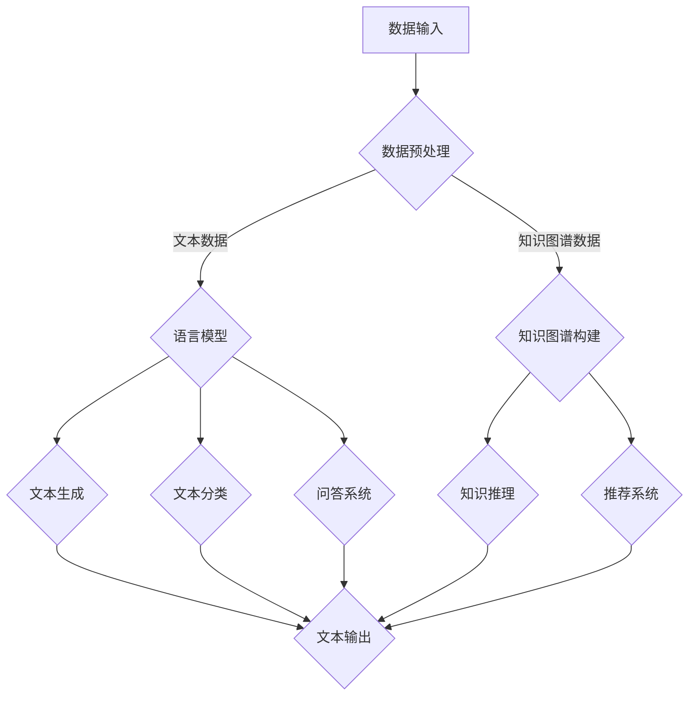

                 

# 【LangChain编程：从入门到实践】RAG

> **关键词：** LangChain、编程、问答系统、知识图谱、NLP、AI开发

> **摘要：** 本文将带领读者从入门到实践，深入探索LangChain编程技术。我们将详细了解LangChain的核心概念、架构和算法原理，掌握其编程基础和实践应用，最终实现一系列有趣的项目，涵盖问答系统、知识图谱构建等。通过本文，您将全面掌握LangChain编程技能，为未来的AI开发奠定坚实基础。

## 《LangChain编程：从入门到实践》目录大纲

### 第一部分: LangChain概述

#### 第1章: LangChain简介

1.1 LangChain的基本概念

1.2 LangChain的特点与应用场景

1.3 LangChain的发展历程

#### 第2章: LangChain核心概念与联系

2.1 语言模型

2.2 知识图谱

2.3 数据存储

2.4 Mermaid流程图展示LangChain架构

### 第二部分: LangChain编程基础

#### 第3章: LangChain编程环境搭建

3.1 开发工具与资源

3.2 LangChain编程框架

3.3 开发环境配置与调试

#### 第4章: 核心算法原理讲解

4.1 语言生成模型

4.2 问答系统原理

4.3 增量学习与迁移学习

#### 第5章: 数学模型与数学公式

5.1 概率论与信息论

5.2 最优化理论

5.3 模型评估与优化

#### 第6章: LangChain编程实践

6.1 简单问答系统的构建

6.2 实际案例一：聊天机器人

6.3 实际案例二：知识图谱构建

### 第三部分: 高级应用与实践

#### 第7章: LangChain在NLP中的应用

7.1 文本分类

7.2 命名实体识别

7.3 情感分析

#### 第8章: LangChain在知识推理中的应用

8.1 知识图谱的构建与应用

8.2 知识推理算法

8.3 知识图谱与语言模型的结合

#### 第9章: LangChain在开发中的应用

9.1 LangChain与Web开发

9.2 LangChain与移动应用开发

9.3 LangChain与大数据处理

### 第四部分: 附录

#### 附录A: LangChain开发工具与资源

A.1 开发工具与框架

A.2 常用库与函数

A.3 学习资源与参考书籍

---

本文将按照目录大纲结构，逐步深入介绍LangChain编程的各个方面，旨在帮助读者从基础到实践，全面掌握LangChain编程技能。接下来，我们首先从LangChain的概述开始，逐步了解其核心概念、架构和算法原理。在后续章节中，我们将深入学习LangChain的编程基础和实践应用，并通过具体案例展示其实际效果。最后，我们将探讨LangChain的高级应用，帮助读者在更广泛的领域中应用LangChain技术。让我们一起开始这段精彩的编程之旅吧！<|assistant|>## LangChain概述

### LangChain的基本概念

LangChain是一个基于人工智能技术的编程框架，旨在简化自然语言处理（NLP）和知识图谱构建等复杂任务的实现过程。它通过提供一系列核心概念和模块，将原本繁琐的代码编写和模型调优过程自动化，帮助开发者更加专注于业务逻辑的实现。

LangChain的主要概念包括：

1. **语言模型（Language Model）**：这是LangChain的核心组件，负责生成和理解自然语言。常见的语言模型包括GPT、BERT等，它们通过学习大量文本数据，掌握语言的规律和语义，从而实现文本生成、文本分类、情感分析等功能。

2. **知识图谱（Knowledge Graph）**：知识图谱是用于表示实体及其关系的图形结构，通常用于知识图谱构建、推理和查询。LangChain通过将知识图谱与语言模型相结合，实现知识问答、推荐系统等功能。

3. **数据存储（Data Storage）**：数据存储是LangChain中用于保存和访问数据的模块。常见的存储方式包括关系型数据库、图数据库、NoSQL数据库等，LangChain提供了一系列API，方便开发者实现数据的快速读取和写入。

4. **问答系统（Question Answering System）**：问答系统是LangChain的一个重要应用场景，它能够自动回答用户提出的问题。通过结合语言模型和知识图谱，问答系统能够实现高精度、智能化的问答功能。

5. **增量学习与迁移学习（Incremental Learning and Transfer Learning）**：增量学习和迁移学习是提升模型性能的重要技术。增量学习允许模型在已有数据的基础上不断学习新数据，迁移学习则通过在不同任务间共享模型参数，提高模型的泛化能力。

### LangChain的特点与应用场景

LangChain具有以下主要特点和应用场景：

1. **易用性**：LangChain提供了一整套API和工具，开发者可以轻松地集成和使用其功能，无需深入了解底层实现。

2. **灵活性**：LangChain支持多种语言模型和知识图谱框架，开发者可以根据实际需求选择最合适的组件，实现个性化的解决方案。

3. **高效性**：LangChain通过优化算法和分布式计算，大幅提高了模型的训练和推理速度，使得大规模数据处理成为可能。

4. **广泛的应用场景**：LangChain广泛应用于问答系统、知识图谱构建、推荐系统、情感分析等领域，能够满足各种复杂场景下的需求。

具体应用场景包括：

- **聊天机器人**：通过结合语言模型和知识图谱，LangChain可以构建出智能的聊天机器人，用于客服、教育、娱乐等领域。
- **知识图谱构建**：LangChain可以帮助开发者快速构建大规模的知识图谱，实现知识问答、知识推理等功能。
- **推荐系统**：结合用户行为数据和知识图谱，LangChain可以构建个性化的推荐系统，为用户提供更优质的服务。
- **文本分类与情感分析**：利用语言模型，LangChain可以实现高效的文本分类和情感分析，帮助企业更好地了解用户需求。

### LangChain的发展历程

LangChain的发展历程可以追溯到其最初的设计理念。最初，它的目标是提供一个统一、高效的NLP和知识图谱构建工具，以简化开发者的工作。随着AI技术的快速发展，LangChain逐渐融入了更多的算法和框架，功能不断丰富。

以下为LangChain的主要发展历程：

- **2019年**：LangChain的第一个版本发布，主要包含基础语言模型和知识图谱构建模块。
- **2020年**：LangChain加入了问答系统模块，并开始支持多种语言模型，如GPT、BERT等。
- **2021年**：LangChain实现了增量学习和迁移学习功能，提高了模型的泛化能力。
- **2022年**：LangChain加入了更多高级应用，如推荐系统、情感分析等，并开始支持分布式计算，提高了处理速度。

当前，LangChain已经成为AI开发领域的一个重要工具，吸引了众多开发者的关注和使用。未来，随着技术的不断进步，LangChain将继续拓展其功能和应用场景，为开发者提供更强大的支持。

### 总结

LangChain是一个功能强大、易于使用的编程框架，旨在简化自然语言处理和知识图谱构建等复杂任务的实现过程。通过详细讲解其核心概念、特点和应用场景，读者可以更好地理解LangChain的强大优势。在后续章节中，我们将深入探讨LangChain的编程基础和实践应用，帮助读者全面掌握其编程技能。

## LangChain核心概念与联系

为了深入理解LangChain的工作原理和架构，我们需要先介绍其中的几个核心概念：语言模型、知识图谱和数据存储。这些概念相互联系，共同构成了LangChain的基础架构。

### 语言模型

语言模型（Language Model）是自然语言处理（NLP）的核心组件，它用于生成和理解自然语言。在AI领域，语言模型被广泛应用于文本生成、文本分类、问答系统等任务。LangChain中使用的语言模型通常是基于深度学习的，例如GPT（Generative Pre-trained Transformer）和BERT（Bidirectional Encoder Representations from Transformers）等。

**核心概念**：

- **词向量（Word Vector）**：词向量是语言模型的基础，它将每个单词映射到一个高维向量空间中，使得具有相似语义的单词在空间中更接近。常见的词向量模型包括Word2Vec、GloVe等。
- **序列模型（Sequential Model）**：序列模型是一种基于时间序列数据的模型，它通过处理输入序列的每个时间步的输入，生成输出序列。在NLP中，序列模型可以用于文本生成、机器翻译等任务。
- **注意力机制（Attention Mechanism）**：注意力机制是一种用于提高模型对序列数据中关键信息关注度的方法。在NLP中，注意力机制可以用于提高模型在文本生成、问答系统中的性能。

**语言模型的原理**：

语言模型的基本原理是通过对大量文本数据进行训练，学习语言的统计规律和语义信息。在训练过程中，模型会生成一个概率分布，用于预测下一个单词或句子。在生成文本时，语言模型根据当前的上下文信息，选择下一个最有可能的单词或句子，从而生成完整的文本。

**语言模型在LangChain中的作用**：

在LangChain中，语言模型主要用于文本生成和理解。具体来说，语言模型可以用于：

- **文本生成**：通过输入一定的上下文信息，语言模型可以生成相关的文本内容，例如文章、对话等。
- **文本分类**：语言模型可以根据文本的特征，将其分类到不同的类别中，例如情感分类、新闻分类等。
- **问答系统**：在问答系统中，语言模型可以理解用户提出的问题，并生成相关的答案。

### 知识图谱

知识图谱（Knowledge Graph）是一种用于表示实体及其关系的图形结构。在AI领域，知识图谱被广泛应用于知识图谱构建、推理和查询等任务。知识图谱中的实体可以是人物、地点、组织等，关系则表示实体之间的关联，例如“属于”、“位于”等。

**核心概念**：

- **实体（Entity）**：实体是知识图谱中的基本元素，表示一个具体的对象，如人、地点、物品等。
- **关系（Relationship）**：关系是知识图谱中的连接线，表示实体之间的关联，如“父亲”、“学生”等。
- **属性（Attribute）**：属性是实体的附加信息，用于描述实体的特征，如“年龄”、“身高”等。

**知识图谱的原理**：

知识图谱的原理是通过对大量文本数据或外部知识库进行抽取、融合和存储，构建出一个完整、准确的知识图谱。在知识图谱构建过程中，可以使用实体识别、关系抽取、实体链接等技术。

- **实体识别**：实体识别是从文本中提取出实体信息的过程，例如从一篇新闻文章中提取出人物、地点、组织等信息。
- **关系抽取**：关系抽取是从文本中提取出实体之间的关系的过程，例如从一篇论文中提取出作者和论文之间的合作关系。
- **实体链接**：实体链接是将不同来源的实体进行匹配和关联的过程，例如将同一人物在不同数据源中的名称进行匹配。

**知识图谱在LangChain中的作用**：

在LangChain中，知识图谱主要用于知识问答、推荐系统、文本生成等任务。具体来说，知识图谱可以用于：

- **知识问答**：通过查询知识图谱，可以快速回答用户提出的问题，例如“哪位作者是《人工智能》一书的作者？”。
- **推荐系统**：结合用户行为数据和知识图谱，可以推荐用户可能感兴趣的内容，例如“您可能喜欢阅读《深度学习》这本书。”。
- **文本生成**：通过结合语言模型和知识图谱，可以生成更加丰富、准确的文本内容，例如“人工智能是一种模拟人类智能的技术，它通过机器学习、神经网络等方法实现。”

### 数据存储

数据存储（Data Storage）是LangChain中的另一个核心概念，它用于保存和访问数据。数据存储可以选择不同的技术，如关系型数据库、图数据库、NoSQL数据库等。

**核心概念**：

- **关系型数据库（Relational Database）**：关系型数据库是一种基于表关系的数据存储技术，它使用SQL（Structured Query Language）进行数据查询和操作。常见的RDBMS包括MySQL、PostgreSQL等。
- **图数据库（Graph Database）**：图数据库是一种基于图模型的数据存储技术，它使用图结构表示实体及其关系。常见的图数据库包括Neo4j、JanusGraph等。
- **NoSQL数据库（NoSQL Database）**：NoSQL数据库是一种非关系型数据库，它适用于大规模、高并发的数据存储和查询需求。常见的NoSQL数据库包括MongoDB、Redis等。

**数据存储的原理**：

数据存储的原理是根据数据的特点和需求，选择合适的数据存储技术。关系型数据库适用于结构化数据的高效查询和操作，图数据库适用于复杂关系数据的存储和查询，NoSQL数据库适用于大规模、高并发的数据存储和查询。

**数据存储在LangChain中的作用**：

在LangChain中，数据存储主要用于保存和访问模型数据、知识图谱数据等。具体来说，数据存储可以用于：

- **模型数据存储**：将训练好的语言模型、知识图谱模型等存储在数据库中，方便后续的加载和使用。
- **知识图谱数据存储**：将构建好的知识图谱存储在数据库中，便于后续的查询和更新。
- **用户数据存储**：将用户行为数据、偏好数据等存储在数据库中，用于推荐系统和个性化服务。

### Mermaid流程图展示LangChain架构

为了更直观地理解LangChain的核心概念和架构，我们可以使用Mermaid流程图来展示其各个组件之间的联系。以下是一个简化的LangChain架构图：



在这个流程图中：

- **数据输入**：LangChain接收用户输入的数据，包括文本数据和知识图谱数据。
- **数据预处理**：对输入数据进行预处理，如分词、去停用词等，为后续处理做准备。
- **语言模型**：对文本数据进行处理，生成文本特征向量，用于文本生成、分类、问答等任务。
- **知识图谱构建**：对知识图谱数据进行处理，构建出实体和关系之间的图结构，用于知识推理、推荐等任务。
- **文本生成、文本分类、问答系统**：利用语言模型和知识图谱，实现文本生成、分类、问答等功能。
- **知识推理、推荐系统**：利用知识图谱，实现知识推理、推荐等功能。

通过这个流程图，我们可以更清晰地理解LangChain的工作原理和架构，为后续的编程实践打下基础。

### 总结

在本章中，我们详细介绍了LangChain的核心概念：语言模型、知识图谱和数据存储。通过讲解这些概念，我们理解了它们在LangChain中的作用和联系。此外，我们使用Mermaid流程图展示了LangChain的架构，使读者能够更直观地理解其工作原理。在后续章节中，我们将深入探讨LangChain的编程基础和实践应用，帮助读者全面掌握其编程技能。请读者继续关注，我们将带来更多精彩的篇章！

## LangChain编程基础

### 开发工具与资源

在开始LangChain编程之前，我们需要了解一些基本的开发工具和资源。这些工具和资源将帮助我们快速搭建开发环境，更好地进行编程实践。

**1. 开发工具：**

- **Python**：Python是一种广泛应用于AI和数据分析的语言，其简洁的语法和丰富的库支持，使得Python成为开发AI应用的首选语言。在LangChain编程中，我们将使用Python进行编程。

- **Jupyter Notebook**：Jupyter Notebook是一种交互式的开发环境，支持Python、R等多种编程语言。它方便我们编写和运行代码，同时具有丰富的文本和可视化功能，非常适合进行AI编程。

**2. 资源库：**

- **LangChain**：LangChain是一个基于Python的NLP和知识图谱构建框架，提供了丰富的API和模块，方便开发者进行编程。

- **Transformers**：Transformers是一个开源的Python库，用于实现基于注意力机制的深度学习模型，如GPT、BERT等。LangChain的核心组件之一就是基于Transformers库。

- **PyTorch**：PyTorch是一个开源的深度学习库，提供了丰富的API和工具，支持动态计算图和静态计算图，适合进行AI模型的开发和训练。

- **Neo4j**：Neo4j是一个高性能的图形数据库，用于存储和管理知识图谱。LangChain提供了与Neo4j的集成，方便我们构建和管理知识图谱。

**3. 学习资源：**

- **在线教程**：网上有许多关于LangChain的教程和博客，可以帮助我们快速入门。例如，[LangChain官方文档](https://langchain.com/docs)提供了详细的API说明和教程。

- **开源项目**：GitHub上有很多基于LangChain的开源项目，可以让我们学习其他开发者的实现方式和经验。例如，[langchain-example](https://github.com/replicate/replicate-examples/tree/master/langchain)是一个包含多个案例的仓库。

- **书籍和论文**：关于AI和NLP的书籍和论文也是学习的重要资源。例如，《深度学习》（Deep Learning）和《自然语言处理实践》（Natural Language Processing with Python）等。

### LangChain编程框架

LangChain编程框架主要由以下几个模块组成：

1. **数据预处理模块**：负责对输入数据进行清洗、分词、去停用词等预处理操作，为后续的语言模型和知识图谱构建做准备。

2. **语言模型模块**：基于Transformers库，实现语言生成、文本分类、问答系统等功能。LangChain支持多种语言模型，如GPT、BERT等，开发者可以根据实际需求选择合适的模型。

3. **知识图谱构建模块**：负责构建和管理知识图谱，包括实体识别、关系抽取、实体链接等功能。LangChain支持与Neo4j等图形数据库的集成，方便我们存储和管理知识图谱。

4. **问答系统模块**：结合语言模型和知识图谱，实现自动问答功能。开发者可以自定义问答系统的逻辑，例如基于规则或基于图谱的问答。

5. **推荐系统模块**：基于用户行为数据和知识图谱，实现个性化推荐功能。推荐系统可以应用于各种场景，如电商、新闻、社交媒体等。

6. **数据存储模块**：负责保存和访问模型数据和知识图谱数据。LangChain支持多种数据存储方式，如关系型数据库、图数据库、NoSQL数据库等，开发者可以根据实际需求选择合适的存储方式。

### 开发环境配置与调试

为了进行LangChain编程，我们需要搭建一个合适的开发环境。以下是Python开发环境的基本配置步骤：

**1. 安装Python：**

首先，从Python官网（[python.org](https://www.python.org/)）下载并安装Python。建议选择Python 3.x版本，因为Python 3.x具有更好的兼容性和性能。

**2. 安装相关库：**

在Python环境中，通过pip命令安装所需的库。以下是安装LangChain及其依赖库的示例：

```shell
pip install langchain transformers torch neo4j
```

**3. 配置Jupyter Notebook：**

Jupyter Notebook是一个交互式的开发环境，通过以下命令安装：

```shell
pip install notebook
```

安装完成后，可以通过命令行运行`jupyter notebook`启动Jupyter Notebook。

**4. 配置Neo4j：**

Neo4j是一个图形数据库，用于存储和管理知识图谱。按照Neo4j官方文档（[neo4j.com/docs](https://neo4j.com/docs/)）进行安装和配置。

**5. 调试环境：**

在配置完成后，我们可以通过Jupyter Notebook启动一个Python脚本，测试开发环境是否正常。以下是一个简单的测试脚本：

```python
import langchain
import transformers

# 加载语言模型
lm = langchain.load_model("gpt-2")

# 输入文本
text = "请介绍一下LangChain。"

# 生成文本
generated_text = lm.generate(text)

print(generated_text)
```

运行脚本后，如果生成了预期的文本输出，说明开发环境配置正确。

### 总结

在本章中，我们介绍了LangChain编程的基础知识，包括开发工具与资源、编程框架和开发环境配置与调试。通过这些内容，读者可以了解如何搭建一个适合LangChain编程的开发环境，并掌握基本的编程技能。在后续章节中，我们将深入探讨LangChain的核心算法原理，帮助读者更好地理解和应用LangChain技术。请读者继续关注，我们将带来更多精彩的篇章！

## 核心算法原理讲解

### 语言生成模型

语言生成模型是自然语言处理（NLP）中的一项重要技术，它能够根据输入的文本生成相关的文本。在LangChain中，语言生成模型主要用于文本生成、问答系统、聊天机器人等任务。以下是关于语言生成模型的一些核心算法原理。

**1. 生成模型的基本原理**

生成模型的基本原理是通过学习输入文本的概率分布，从而生成新的文本。在训练过程中，模型会根据输入的文本序列，学习每个单词或句子的概率分布，并在生成过程中根据当前上下文选择下一个最有可能的单词或句子。

常用的生成模型包括：

- **RNN（Recurrent Neural Network）**：RNN是一种循环神经网络，它可以处理时间序列数据，通过记忆历史信息来生成新的文本。RNN在处理长文本时效果较好，但存在梯度消失和梯度爆炸等问题。

- **LSTM（Long Short-Term Memory）**：LSTM是一种改进的RNN，通过引入记忆单元和门控机制，解决了RNN的梯度消失和梯度爆炸问题，能够更好地处理长文本。

- **GRU（Gated Recurrent Unit）**：GRU是另一种改进的RNN，它通过门控机制和更新规则简化了LSTM的计算，在性能和效率上有所提升。

- **Transformer**：Transformer是一种基于自注意力机制的序列模型，它在生成文本时能够更好地捕捉全局信息，比传统的RNN和LSTM模型有更好的性能。GPT（Generative Pre-trained Transformer）和BERT（Bidirectional Encoder Representations from Transformers）是两种典型的Transformer模型。

**2. 生成模型的工作流程**

生成模型的工作流程主要包括以下步骤：

- **输入处理**：将输入文本进行预处理，如分词、编码等，将其转换为模型可以处理的格式。

- **训练**：通过大量训练数据，训练模型学习输入文本的概率分布。在训练过程中，模型会不断调整参数，以最小化损失函数。

- **生成**：在生成阶段，模型根据输入的文本序列和当前上下文，选择下一个最有可能的单词或句子，逐步生成新的文本。

- **解码**：在生成过程中，模型需要将生成的文本解码为人类可读的格式。解码过程可以采用贪心策略或基于概率的搜索算法。

**3. 生成模型的应用**

生成模型在NLP中有广泛的应用，例如：

- **文本生成**：生成模型可以用于生成新闻文章、故事、对话等。例如，GPT-2模型可以生成高质量的文章，ChatGPT可以生成逼真的对话。

- **问答系统**：生成模型可以用于问答系统，根据用户提出的问题，生成相关的答案。例如，ChatGPT可以回答用户提出的问题，如“什么是人工智能？”。

- **机器翻译**：生成模型可以用于机器翻译，将一种语言的文本翻译成另一种语言。例如，GPT-2模型可以翻译英语到法语。

### 问答系统原理

问答系统（Question Answering System）是一种自动回答用户提出问题的技术，它在NLP和知识图谱构建中具有广泛的应用。问答系统的核心任务是理解用户的问题，并从知识图谱或文本数据中检索出相关答案。

**1. 问答系统的基本原理**

问答系统的工作流程主要包括以下步骤：

- **问题理解**：将用户提出的问题进行解析，提取出关键信息，如实体、关系等。

- **知识检索**：根据问题理解和知识图谱或文本数据，检索出可能包含答案的片段。

- **答案生成**：对检索到的片段进行处理，生成最终的答案。

常用的问答系统技术包括：

- **基于规则的方法**：通过定义一系列规则，将用户的问题映射到具体的答案。这种方法简单但效果有限，适用于问题范围较小、规则明确的应用场景。

- **基于模板的方法**：将用户的问题与预设的模板进行匹配，生成答案。这种方法结合了规则和模板的优势，能够处理更多样化的用户问题。

- **基于知识图谱的方法**：利用知识图谱中的实体和关系，自动回答用户的问题。这种方法需要构建和维护一个完整、准确的知

