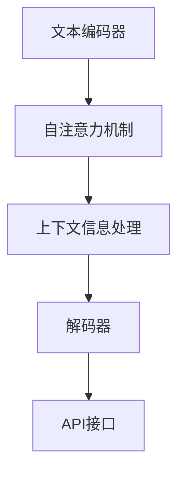
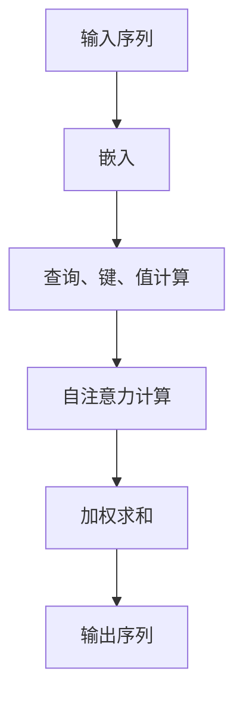

                 

# 【LangChain编程：从入门到实践】invoke

> **关键词：** LangChain、编程、从入门到实践、invoke、Transformer、自然语言处理、项目实战、进阶技术

> **摘要：** 本文将深入探讨LangChain编程，从入门到实践的各个方面，详细介绍LangChain的概述、编程基础、核心算法、项目实战、进阶技术以及未来趋势。通过本文，读者可以全面了解并掌握LangChain的使用方法，为未来的研究和应用打下坚实基础。

### 《【LangChain编程：从入门到实践】invoke》目录大纲

#### 第一部分: LangChain概述

- # 第1章: LangChain简介
    - ## 1.1 LangChain的概念与历史背景
    - ### 1.1.1 语言模型与程序生成
    - ### 1.1.2 LangChain的产生与发展
    - ## 1.2 LangChain的优势与应用领域
    - ### 1.2.1 语言模型的优势
    - ### 1.2.2 LangChain的应用领域
    - ## 1.3 LangChain的核心架构
    - ### 1.3.1 Transformer模型概述
    - ### 1.3.2 LangChain的架构设计
    - ### 1.3.3 Mermaid流程图：LangChain架构详解

#### 第二部分: LangChain编程基础

- # 第2章: LangChain编程基础
    - ## 2.1 环境搭建与配置
    - ### 2.1.1 硬件环境配置
    - ### 2.1.2 软件环境安装
    - ### 2.1.3 开发环境配置
    - ## 2.2 LangChain编程语言概述
    - ### 2.2.1 LangChain支持的编程语言
    - ### 2.2.2 编程语言选择与优缺点
    - ## 2.3 LangChain编程基本概念
    - ### 2.3.1 变量与数据类型
    - ### 2.3.2 运算符与表达式
    - ### 2.3.3 控制结构
    - ### 2.3.4 函数与模块

#### 第三部分: LangChain核心算法

- # 第3章: LangChain核心算法原理
    - ## 3.1 Transformer模型原理
    - ### 3.1.1 Transformer模型概述
    - ### 3.1.2 自注意力机制
    - ### 3.1.3 Mermaid流程图：Transformer工作原理
    - ## 3.2 编程生成算法
    - ### 3.2.1 程序生成算法概述
    - ### 3.2.2 生成对抗网络（GAN）
    - ### 3.2.3 伪代码：生成对抗网络算法实现
    - ## 3.3 自然语言处理算法
    - ### 3.3.1 词嵌入技术
    - ### 3.3.2 序列模型与注意力机制
    - ### 3.3.3 转换器架构详解
    - ### 3.3.4 伪代码：序列模型与注意力机制实现

#### 第四部分: LangChain项目实战

- # 第4章: LangChain项目实战
    - ## 4.1 LangChain编程实战
    - ### 4.1.1 项目需求分析
    - ### 4.1.2 开发环境搭建
    - ### 4.1.3 源代码实现与解读
    - ### 4.1.4 代码解读与分析
    - ## 4.2 LangChain在自然语言处理中的应用
    - ### 4.2.1 应用场景介绍
    - ### 4.2.2 开发流程与实现
    - ### 4.2.3 案例分析
    - ## 4.3 LangChain在程序生成中的应用
    - ### 4.3.1 应用场景介绍
    - ### 4.3.2 开发流程与实现
    - ### 4.3.3 案例分析

#### 第五部分: LangChain进阶技术

- # 第5章: LangChain进阶技术
    - ## 5.1 大规模预训练模型
    - ### 5.1.1 预训练的概念与意义
    - ### 5.1.2 自监督学习方法
    - ### 5.1.3 迁移学习与微调技术
    - ## 5.2 优化与调参技巧
    - ### 5.2.1 模型优化方法
    - ### 5.2.2 调参技巧与实践
    - ### 5.2.3 性能评估与优化
    - ## 5.3 LangChain应用拓展
    - ### 5.3.1 AI大模型与LangChain的结合
    - ### 5.3.2 新兴技术在LangChain中的应用

#### 第六部分: LangChain未来趋势与展望

- # 第6章: LangChain的未来趋势与展望
    - ## 6.1 LangChain的发展方向
    - ### 6.1.1 技术演进趋势
    - ### 6.1.2 行业应用趋势
    - ## 6.2 LangChain在教育领域的作用
    - ### 6.2.1 教育模式创新
    - ### 6.2.2 教学辅助工具
    - ## 6.3 LangChain在产业界的影响
    - ### 6.3.1 产业应用现状
    - ### 6.3.2 未来发展趋势

#### 第七部分: 附录

- # 附录
    - ## 附录 A: LangChain开发工具与资源
    - ### A.1 主流深度学习框架对比
    - #### A.1.1 TensorFlow
    - #### A.1.2 PyTorch
    - #### A.1.3 JAX
    - #### A.1.4 其他框架简介
    - ## 附录 B: LangChain相关论文与书籍推荐
    - ### B.1 必读论文
    - #### B.1.1 Transformer
    - #### B.1.2 BERT
    - #### B.1.3 GPT系列
    - ### B.2 推荐书籍
    - #### B.2.1 《深度学习》
    - #### B.2.2 《自然语言处理综论》
    - #### B.2.3 《AI应用实战》
    - ## 附录 C: 编程练习与项目指南
    - ### C.1 LangChain编程练习
    - #### C.1.1 练习1：编写简单的程序
    - #### C.1.2 练习2：实现一个文本生成模型
    - #### C.1.3 练习3：构建一个问答系统
    - ### C.2 项目指南
    - #### C.2.1 项目选题与规划
    - #### C.2.2 项目实施与调试
    - #### C.2.3 项目总结与反思

### 第1章: LangChain简介

#### 1.1 LangChain的概念与历史背景

**1.1.1 语言模型与程序生成**

语言模型（Language Model）是自然语言处理（Natural Language Processing，NLP）的核心技术之一，它通过统计语言中的词汇、句子结构和语义信息，生成自然语言文本。在计算机科学领域，语言模型的应用范围广泛，包括搜索引擎、机器翻译、语音识别、文本生成等。

程序生成（Program Generation）是一种利用人工智能技术自动生成计算机程序的方法。通过分析代码库、编程规范和编程语言语法，语言模型可以生成满足特定需求的代码片段或完整程序。程序生成技术可以提高开发效率，减少人力成本，并推动软件工程的发展。

**1.1.2 LangChain的产生与发展**

LangChain是由Google团队开发的一款开源语言模型，旨在解决自然语言理解和程序生成问题。LangChain基于Transformer模型架构，采用大规模预训练技术，通过在海量文本数据进行训练，学习到了丰富的语言模式和编程知识。

LangChain的诞生可以追溯到2018年，当时Google发布了BERT（Bidirectional Encoder Representations from Transformers）模型，这是第一个在NLP任务中取得显著性能提升的Transformer模型。随着Transformer模型的不断发展，LangChain也应运而生。

自发布以来，LangChain在学术界和工业界都引起了广泛关注。其强大的自然语言处理能力和程序生成能力，使得LangChain成为了一个重要的研究工具和应用平台。

**1.2 LangChain的优势与应用领域**

**1.2.1 语言模型的优势**

LangChain作为一款先进的语言模型，具有以下几个显著优势：

- **强大的自然语言理解能力**：通过大规模预训练，LangChain能够理解和生成复杂、多样化的自然语言文本。
- **灵活的编程能力**：LangChain不仅可以生成文本，还可以根据上下文生成代码，为开发人员提供强大的编程辅助工具。
- **高效的计算性能**：LangChain基于Transformer模型架构，具有良好的计算性能和内存管理能力，可以高效地处理大规模数据集。

**1.2.2 LangChain的应用领域**

LangChain的应用领域非常广泛，主要包括以下几个方面：

- **自然语言处理**：LangChain可以用于文本分类、情感分析、机器翻译、问答系统等自然语言处理任务。
- **程序生成**：LangChain可以自动生成代码，用于开发自动化测试脚本、自动化修复代码缺陷等。
- **教育**：LangChain可以作为编程辅助工具，帮助学生和初学者学习编程，提高编程效率。
- **工业界**：LangChain可以应用于工业界各个领域，如金融、医疗、制造等，提高业务流程自动化水平，降低人力成本。

**1.3 LangChain的核心架构**

LangChain的核心架构包括以下几个方面：

- **Transformer模型**：LangChain采用Transformer模型作为基础架构，这是当前NLP领域最先进的模型之一。
- **预训练技术**：LangChain通过大规模预训练，学习到了丰富的语言模式和编程知识，提高了模型的泛化能力。
- **多语言支持**：LangChain支持多种编程语言和自然语言，为不同领域的开发人员提供了方便。
- **API接口**：LangChain提供丰富的API接口，方便开发者集成和使用。

**1.3.1 Transformer模型概述**

Transformer模型是Google团队在2017年提出的一种基于自注意力机制的神经网络模型，主要用于处理序列数据。与传统的循环神经网络（RNN）和卷积神经网络（CNN）相比，Transformer模型具有以下几个显著优势：

- **并行计算**：Transformer模型采用多头自注意力机制，可以并行处理输入序列的每个位置，大大提高了计算效率。
- **全局上下文信息**：Transformer模型通过自注意力机制，可以捕捉到输入序列中任意两个位置之间的关联信息，实现了全局信息的有效利用。
- **端到端学习**：Transformer模型可以直接从原始输入序列中学习到特征表示，避免了传统NLP模型中复杂的特征提取和融合过程。

**1.3.2 LangChain的架构设计**

LangChain的架构设计旨在实现高效的程序生成和自然语言处理。其核心架构包括以下几个部分：

- **文本编码器（Text Encoder）**：文本编码器负责将输入文本转换为向量表示，用于后续的模型处理。LangChain采用Transformer模型作为文本编码器，利用其强大的自注意力机制和全局上下文信息处理能力。
- **解码器（Decoder）**：解码器负责生成目标文本或代码。LangChain采用Transformer模型作为解码器，通过自注意力机制和上下文信息，逐步生成每个位置的结果。
- **API接口（API Interface）**：LangChain提供丰富的API接口，方便开发者集成和使用。开发者可以通过简单的API调用，实现文本生成、自然语言处理等功能。

**1.3.3 Mermaid流程图：LangChain架构详解**

下面是LangChain的Mermaid流程图，用于详细展示其架构设计：



**文本编码器**：将输入文本转换为向量表示。

**自注意力机制**：用于捕捉输入序列中任意两个位置之间的关联信息。

**上下文信息处理**：利用自注意力机制，实现全局信息的有效利用。

**解码器**：生成目标文本或代码。

**API接口**：提供丰富的API调用，方便开发者集成和使用。

通过上述设计，LangChain实现了高效的程序生成和自然语言处理能力，为各个领域提供了强大的技术支持。

### 第2章: LangChain编程基础

#### 2.1 环境搭建与配置

**2.1.1 硬件环境配置**

为了运行LangChain模型，需要配置一定的硬件环境。以下是推荐的硬件配置：

- **CPU**：Intel Xeon 或 AMD Ryzen 系列，建议至少8核心
- **GPU**：NVIDIA 1080 Ti 或更高性能显卡，推荐使用V100或RTX 30系列
- **内存**：至少64GB RAM
- **存储**：至少1TB SSD存储

**2.1.2 软件环境安装**

在硬件环境配置完成后，接下来需要安装软件环境。以下是安装步骤：

1. **安装操作系统**：建议使用Linux操作系统，如Ubuntu 20.04或更高版本。
2. **安装Python**：安装Python 3.8或更高版本。可以使用以下命令安装：
    ```bash
    sudo apt-get update
    sudo apt-get install python3 python3-pip
    ```
3. **安装CUDA**：安装CUDA 11.0或更高版本。CUDA是NVIDIA开发的计算平台和编程模型，用于支持GPU加速计算。可以使用以下命令安装：
    ```bash
    sudo apt-get install cuda
    ```
4. **安装TensorFlow**：TensorFlow是Google开发的一款开源深度学习框架，支持GPU加速计算。可以使用以下命令安装：
    ```bash
    pip3 install tensorflow-gpu
    ```

**2.1.3 开发环境配置**

在完成软件环境安装后，需要配置开发环境。以下是配置步骤：

1. **配置Python虚拟环境**：创建一个Python虚拟环境，以便隔离项目依赖。可以使用以下命令创建虚拟环境：
    ```bash
    python3 -m venv langchain_venv
    source langchain_venv/bin/activate
    ```
2. **安装LangChain**：在虚拟环境中安装LangChain。可以使用以下命令安装：
    ```bash
    pip install langchain
    ```
3. **安装其他依赖**：根据项目需求，安装其他依赖库。例如，安装用于数据处理的Pandas库：
    ```bash
    pip install pandas
    ```

完成以上步骤后，开发环境就配置完成了。接下来，可以开始进行LangChain编程实践。

#### 2.2 LangChain编程语言概述

**2.2.1 LangChain支持的编程语言**

LangChain支持多种编程语言，包括Python、Java、C++等。下面将重点介绍Python编程语言在LangChain中的应用。

**Python编程语言的特点**

Python是一种高级、动态、面向对象的编程语言，具有以下几个显著特点：

- **简洁易读**：Python代码简洁、易读、易懂，降低了编程学习的门槛。
- **丰富的库和框架**：Python拥有丰富的库和框架，如NumPy、Pandas、TensorFlow等，方便开发者进行数据处理、机器学习等任务。
- **跨平台支持**：Python支持多种操作系统，如Windows、Linux、Mac OS等，为开发者提供了广泛的应用场景。

**Python编程语言的优势**

在LangChain编程中，Python具有以下几个优势：

- **强大的自然语言处理能力**：Python拥有丰富的NLP库和框架，如NLTK、spaCy等，方便开发者进行自然语言处理任务。
- **高效的计算性能**：Python支持多种计算模式，如CPU、GPU等，可以充分利用硬件资源，提高计算性能。
- **广泛的社区支持**：Python拥有庞大的开发者社区，提供了丰富的教程、文档和资源，方便开发者学习和交流。

**Python编程语言的优缺点**

- **优点**：
    - 简洁易读，降低了编程学习的门槛。
    - 丰富的库和框架，方便开发者进行数据处理、机器学习等任务。
    - 跨平台支持，适用于多种操作系统。
    - 强大的自然语言处理能力。
    - 高效的计算性能。
    - 广泛的社区支持。

- **缺点**：
    - 解释型语言，执行速度相对较慢。
    - 动态类型，容易导致内存泄露和性能问题。
    - 缺乏静态类型检查，可能导致运行时错误。

**2.2.2 编程语言选择与优缺点**

在选择编程语言时，需要考虑以下几个因素：

- **任务需求**：根据具体任务需求，选择适合的编程语言。例如，进行自然语言处理任务，可以选择Python；进行高性能计算任务，可以选择C++。
- **开发效率**：选择简洁易读、开发效率高的编程语言，可以提高开发速度。
- **性能要求**：根据性能要求，选择支持高效计算、并行计算的编程语言。
- **社区支持**：选择拥有庞大开发者社区、资源丰富的编程语言，可以方便学习和交流。

以下是几种常用编程语言在LangChain编程中的优缺点对比：

| 编程语言 | 优点 | 缺点 |
| --- | --- | --- |
| Python | 简洁易读、丰富的库和框架、跨平台支持、强大的NLP能力、高效的计算性能、广泛的社区支持 | 解释型语言、执行速度相对较慢、动态类型、缺乏静态类型检查 |
| Java | 静态类型、跨平台支持、高效的性能、强大的标准库、丰富的框架、广泛的社区支持 | 编译型语言、代码复杂、开发效率相对较低、内存占用较大 |
| C++ | 高效的计算性能、跨平台支持、强大的标准库、丰富的框架、广泛的社区支持 | 静态类型、代码复杂、开发效率相对较低、内存管理困难 |
| JavaScript | 跨平台支持、丰富的库和框架、前端开发主流语言、高效的计算性能、广泛的社区支持 | 解释型语言、性能相对较低、内存管理困难、缺乏静态类型检查 |

综上所述，Python编程语言在LangChain编程中具有显著的优势，适合进行自然语言处理和程序生成任务。

#### 2.3 LangChain编程基本概念

**2.3.1 变量与数据类型**

在编程中，变量是用于存储数据和值的标识符。数据类型是用于表示不同类型的数据，如整数、浮点数、字符串等。

- **变量**：在Python中，变量声明不需要指定数据类型，例如：
    ```python
    x = 10
    y = "Hello, World!"
    ```
 上述代码中，`x`和`y`是变量，分别存储整数和字符串。

- **数据类型**：Python中常用的数据类型包括整数（`int`）、浮点数（`float`）、字符串（`str`）、列表（`list`）、字典（`dict`）等。例如：
    ```python
    x = 10  # 整数
    y = 3.14  # 浮点数
    z = "Hello, World!"  # 字符串
    ```
 上述代码中，`x`、`y`和`z`分别存储整数、浮点数和字符串。

**2.3.2 运算符与表达式**

运算符是用于对变量和值进行操作的符号，如加（`+`）、减（`-`）、乘（`*`）、除（`/`）等。

- **算术运算符**：用于执行基本的算术运算，例如：
    ```python
    x = 10
    y = 3
    z = x + y  # 13
    ```
- **比较运算符**：用于比较两个值的大小关系，如等于（`==`）、不等于（`!=`）、大于（`>`）、小于（`<`）等：
    ```python
    x = 10
    y = 3
    z = x > y  # True
    ```
- **逻辑运算符**：用于执行逻辑运算，如与（`and`）、或（`or`）、非（`not`）等：
    ```python
    x = True
    y = False
    z = x and y  # False
    ```

表达式是由运算符、变量和值组成的式子，用于计算结果。例如：
```python
x = 10
y = 3
z = x + y  # 13
```
上述代码中，`x + y`是一个表达式，计算结果为13。

**2.3.3 控制结构**

控制结构用于控制程序的执行流程，包括条件语句和循环语句。

- **条件语句**：用于根据条件执行不同的代码块。例如：
    ```python
    x = 10
    if x > 5:
        print("x大于5")
    else:
        print("x小于等于5")
    ```
 上述代码中，如果`x`大于5，则输出`x大于5`；否则，输出`x小于等于5`。

- **循环语句**：用于重复执行一段代码。例如：
    ```python
    for i in range(5):
        print(i)
    ```
 上述代码中，循环变量`i`从0到4，依次输出每个值。

**2.3.4 函数与模块**

函数是用于执行特定任务的代码块，模块是用于组织代码的文件。

- **函数**：函数是组织代码的一种方式，可以将重复的代码块封装为函数，提高代码的可读性和复用性。例如：
    ```python
    def greet(name):
        print("Hello, " + name)

    greet("Alice")  # Hello, Alice
    greet("Bob")    # Hello, Bob
    ```
 上述代码中，`greet`是一个函数，接受一个参数`name`，输出一个问候语。

- **模块**：模块是用于组织代码的文件，可以包含多个函数和类。例如：
    ```python
    # hello.py
    def greet(name):
        print("Hello, " + name)

    # main.py
    import hello

    hello.greet("Alice")  # Hello, Alice
    hello.greet("Bob")    # Hello, Bob
    ```
 上述代码中，`hello.py`是一个模块，包含一个函数`greet`。`main.py`是一个主文件，导入`hello.py`模块并调用`greet`函数。

通过以上基本概念的学习，读者可以开始使用Python进行LangChain编程实践。

### 第3章: LangChain核心算法原理

#### 3.1 Transformer模型原理

**3.1.1 Transformer模型概述**

Transformer模型是由Google团队于2017年提出的一种基于自注意力机制的神经网络模型，用于处理序列数据。与传统循环神经网络（RNN）和卷积神经网络（CNN）相比，Transformer模型具有以下显著优势：

1. **并行计算**：Transformer模型采用多头自注意力机制，可以并行处理输入序列的每个位置，大大提高了计算效率。
2. **全局上下文信息**：Transformer模型通过自注意力机制，可以捕捉到输入序列中任意两个位置之间的关联信息，实现了全局信息的有效利用。
3. **端到端学习**：Transformer模型可以直接从原始输入序列中学习到特征表示，避免了传统NLP模型中复杂的特征提取和融合过程。

**3.1.2 自注意力机制**

自注意力机制（Self-Attention）是Transformer模型的核心组成部分，用于计算输入序列中每个位置的重要性，并生成相应的特征表示。自注意力机制的主要思想是将输入序列的每个位置映射为一个查询（Query）、键（Key）和值（Value），然后通过计算这些查询和键之间的相似度来生成输出序列。

- **查询（Query）**：用于表示输入序列中的每个位置，用于计算注意力权重。
- **键（Key）**：用于表示输入序列中的每个位置，用于计算注意力权重。
- **值（Value）**：用于表示输入序列中的每个位置，用于生成输出序列。

自注意力机制的主要步骤如下：

1. **嵌入（Embedding）**：将输入序列转换为嵌入向量表示，每个位置对应一个向量。
2. **自注意力计算**：计算每个查询和键之间的相似度，得到注意力权重。
3. **加权求和**：根据注意力权重对值进行加权求和，得到每个位置的输出向量。
4. **输出**：将所有位置的输出向量组合成一个输出序列。

下面是自注意力机制的伪代码实现：

```python
def self_attention(inputs):
    # 输入：嵌入向量表示的输入序列
    # 输出：自注意力计算结果

    # 步骤1：计算查询、键、值
    queries = [compute_query(embedding) for embedding in inputs]
    keys = [compute_key(embedding) for embedding in inputs]
    values = [compute_value(embedding) for embedding in inputs]

    # 步骤2：计算注意力权重
    attention_weights = compute_similarity(queries, keys)

    # 步骤3：加权求和
    outputs = []
    for i, query in enumerate(queries):
        weighted_values = [weight * value for weight, value in zip(attention_weights[i], values)]
        output = sum(weighted_values)
        outputs.append(output)

    # 步骤4：输出
    return outputs
```

**3.1.3 Mermaid流程图：Transformer工作原理**

下面是Transformer模型的Mermaid流程图，用于详细展示其工作原理：



**输入序列**：输入序列是待处理的文本序列，每个位置对应一个嵌入向量。

**嵌入**：将输入序列转换为嵌入向量表示。

**查询、键、值计算**：计算每个位置的查询、键和值。

**自注意力计算**：计算每个查询和键之间的相似度，得到注意力权重。

**加权求和**：根据注意力权重对值进行加权求和，得到每个位置的输出向量。

**输出序列**：输出序列是处理后的文本序列，每个位置对应一个输出向量。

通过上述工作原理，Transformer模型实现了高效的序列处理和特征提取，为自然语言处理任务提供了强大的技术支持。

### 3.2 编程生成算法

**3.2.1 程序生成算法概述**

程序生成算法（Program Generation Algorithm）是一种利用人工智能技术自动生成计算机程序的方法。通过分析代码库、编程规范和编程语言语法，程序生成算法可以生成满足特定需求的代码片段或完整程序。程序生成算法可以提高开发效率，减少人力成本，并推动软件工程的发展。

程序生成算法可以分为两种类型：基于规则的程序生成和基于学习的程序生成。

- **基于规则的程序生成**：基于规则的程序生成算法通过预定义的规则和模板生成程序。这种算法的优点是生成程序的结构清晰、可解释性强，但缺点是适用范围有限，难以应对复杂、多样化的编程需求。
- **基于学习的程序生成**：基于学习的程序生成算法通过学习大量代码示例，利用机器学习技术生成程序。这种算法的优点是适用范围广泛、生成程序的多样性高，但缺点是生成程序的可解释性较差，需要大量的数据和计算资源。

**3.2.2 生成对抗网络（GAN）**

生成对抗网络（Generative Adversarial Network，GAN）是由Ian Goodfellow等人于2014年提出的一种深度学习模型，用于生成逼真的数据。GAN由两个神经网络组成：生成器（Generator）和判别器（Discriminator）。

- **生成器**：生成器的任务是生成虚假数据，使其尽量接近真实数据。
- **判别器**：判别器的任务是判断输入数据是真实数据还是虚假数据。

GAN的训练过程是一个对抗过程，生成器和判别器相互竞争，生成器和判别器的性能不断提升，最终生成器生成的数据可以以假乱真。

**生成对抗网络（GAN）的基本原理**

GAN的基本原理如下：

1. **初始化**：初始化生成器和判别器，分别表示为G和D。
2. **训练过程**：生成器和判别器交替训练，具体步骤如下：
   - **生成器训练**：生成器根据随机噪声生成虚假数据，判别器根据真实数据和虚假数据更新模型参数。
   - **判别器训练**：判别器根据真实数据和虚假数据更新模型参数，以区分真实数据和虚假数据。
3. **循环迭代**：重复上述步骤，生成器和判别器的性能不断提升。

**3.2.3 伪代码：生成对抗网络算法实现**

下面是生成对抗网络的伪代码实现：

```python
def GAN(D, G, X, epochs):
    for epoch in range(epochs):
        # 生成器训练
        z = generate_noise()
        X_fake = G(z)
        D_loss_real = D_loss(D, X)
        D_loss_fake = D_loss(D, X_fake)

        # 判别器训练
        G_loss = G_loss(G, X_fake)
        D_loss = D_loss_real + D_loss_fake

        # 更新模型参数
        update_model_params(G, D)

    return G, D
```

**输入**：
- **D**：判别器模型。
- **G**：生成器模型。
- **X**：真实数据。
- **epochs**：训练轮数。

**输出**：
- **G**：训练后的生成器模型。
- **D**：训练后的判别器模型。

**伪代码说明**：

1. **初始化**：初始化生成器和判别器模型。
2. **训练过程**：循环迭代，进行生成器和判别器的训练。
   - **生成器训练**：生成器生成虚假数据，判别器根据真实数据和虚假数据更新模型参数。
   - **判别器训练**：判别器根据真实数据和虚假数据更新模型参数，以区分真实数据和虚假数据。
3. **更新模型参数**：根据损失函数更新生成器和判别器的模型参数。

通过上述伪代码，我们可以实现生成对抗网络的训练过程，生成逼真的虚假数据。

### 3.3 自然语言处理算法

#### 3.3.1 词嵌入技术

词嵌入（Word Embedding）是将词汇映射为向量表示的方法，用于捕捉词汇之间的语义关系。词嵌入技术是自然语言处理（Natural Language Processing，NLP）领域的重要基础，广泛应用于文本分类、机器翻译、情感分析等任务。

**词嵌入技术的基本原理**

词嵌入技术的基本原理是将词汇映射为一个固定长度的向量，使得相似的词汇在向量空间中接近。词嵌入技术通过学习词汇之间的相似度，将语义信息转化为向量形式，从而实现文本数据的低维表示。

词嵌入技术可以分为两类：基于统计的词嵌入和基于神经网络的词嵌入。

- **基于统计的词嵌入**：基于统计的词嵌入方法通过计算词汇的共现关系，学习词汇之间的相似度。常用的方法包括计数矩阵、TF-IDF、词袋模型等。这些方法在一定程度上可以捕捉词汇的语义关系，但存在信息丢失和表达能力有限的问题。
- **基于神经网络的词嵌入**：基于神经网络的词嵌入方法通过训练神经网络模型，将词汇映射为高维向量。神经网络模型可以自动学习词汇的语义特征，具有更好的表达能力和泛化能力。常见的神经网络词嵌入方法包括Word2Vec、GloVe等。

**词嵌入技术在自然语言处理中的应用**

词嵌入技术在自然语言处理中具有广泛的应用，主要包括以下几个方面：

1. **文本分类**：词嵌入技术可以用于文本分类任务，将文本数据转换为向量表示，然后通过分类算法进行文本分类。
2. **机器翻译**：词嵌入技术可以用于机器翻译任务，将源语言和目标语言的词汇映射为向量表示，然后通过神经网络模型进行翻译。
3. **情感分析**：词嵌入技术可以用于情感分析任务，将文本数据转换为向量表示，然后通过分类算法进行情感分类。
4. **问答系统**：词嵌入技术可以用于问答系统，将问题和答案映射为向量表示，然后通过相似度计算找到最佳答案。

**3.3.2 序列模型与注意力机制**

序列模型（Sequence Model）是一种用于处理序列数据的神经网络模型，包括循环神经网络（RNN）和卷积神经网络（CNN）等。序列模型通过捕捉序列数据中的时间依赖关系，实现文本数据的编码和解析。

注意力机制（Attention Mechanism）是一种用于提升序列模型性能的技术，通过为序列数据中的每个位置分配不同的权重，实现全局信息的有效利用。注意力机制在自然语言处理任务中具有重要作用，可以提高模型的解析能力和泛化能力。

**序列模型与注意力机制的基本原理**

序列模型与注意力机制的基本原理如下：

1. **序列模型**：序列模型通过处理输入序列，生成一个固定长度的向量表示，称为序列编码（Sequence Encoding）。序列编码包含了输入序列的时序信息和全局信息。

2. **注意力机制**：注意力机制为序列数据中的每个位置分配不同的权重，使得模型能够关注重要的信息。注意力权重通常是一个标量值，表示当前位置的重要性。

3. **加权求和**：根据注意力权重，对序列编码中的每个位置进行加权求和，得到一个加权向量。加权向量包含了输入序列中的关键信息，提高了模型的解析能力。

**序列模型与注意力机制的实现**

序列模型与注意力机制的实现可以分为以下几个步骤：

1. **嵌入（Embedding）**：将输入序列转换为嵌入向量表示。

2. **编码（Encoding）**：通过序列模型对输入序列进行编码，生成序列编码。

3. **注意力计算**：计算每个位置在序列编码中的重要性，生成注意力权重。

4. **加权求和**：根据注意力权重，对序列编码进行加权求和，得到加权向量。

5. **输出**：将加权向量作为模型的输出，用于后续任务。

下面是序列模型与注意力机制的伪代码实现：

```python
def sequence_model_with_attention(inputs, model, attention):
    # 输入：嵌入向量表示的输入序列、序列模型、注意力机制
    # 输出：加权向量表示的输出序列

    # 步骤1：嵌入
    embeddings = [embed(input) for input in inputs]

    # 步骤2：编码
    sequence_encoding = model(embeddings)

    # 步骤3：注意力计算
    attention_weights = attention(sequence_encoding)

    # 步骤4：加权求和
    weighted_vector = weighted_sum(sequence_encoding, attention_weights)

    # 步骤5：输出
    return weighted_vector
```

**输入**：
- **inputs**：嵌入向量表示的输入序列。
- **model**：序列模型。
- **attention**：注意力机制。

**输出**：
- **weighted_vector**：加权向量表示的输出序列。

**伪代码说明**：

1. **嵌入**：将输入序列转换为嵌入向量表示。
2. **编码**：通过序列模型对输入序列进行编码，生成序列编码。
3. **注意力计算**：计算每个位置在序列编码中的重要性，生成注意力权重。
4. **加权求和**：根据注意力权重，对序列编码进行加权求和，得到加权向量。
5. **输出**：将加权向量作为模型的输出。

通过上述伪代码，我们可以实现序列模型与注意力机制的组合，提高模型的解析能力和性能。

**3.3.3 转换器架构详解**

转换器（Transformer）架构是自然语言处理领域的一种先进模型，由Google团队于2017年提出。转换器架构通过自注意力机制（Self-Attention）实现了高效的序列处理和特征提取，为自然语言处理任务提供了强大的技术支持。

**转换器架构的基本原理**

转换器架构的基本原理如下：

1. **编码器（Encoder）**：编码器负责将输入序列转换为序列编码，捕捉输入序列的时序信息。
2. **解码器（Decoder）**：解码器负责生成输出序列，根据编码器生成的序列编码进行解码。
3. **多头自注意力机制**：自注意力机制为输入序列的每个位置分配不同的权重，实现全局信息的有效利用。

**转换器架构的核心组成部分**

转换器架构的核心组成部分包括编码器、解码器和多头自注意力机制。以下是这些组成部分的详细说明：

1. **编码器**：编码器由多个编码层（Encoder Layer）组成，每个编码层包括两个子层：多头自注意力层（Multi-Head Self-Attention Layer）和前馈神经网络层（Feedforward Neural Network Layer）。编码器的输出是一个固定长度的序列编码。
2. **解码器**：解码器由多个解码层（Decoder Layer）组成，每个解码层包括三个子层：多头自注意力层、编码器-解码器自注意力层和前馈神经网络层。解码器的输出是一个固定长度的序列。
3. **多头自注意力机制**：多头自注意力机制通过计算输入序列中每个位置的重要性，生成注意力权重，然后对输入序列进行加权求和。多头自注意力机制可以提高模型的解析能力和泛化能力。

**3.3.4 伪代码：序列模型与注意力机制实现**

下面是序列模型与注意力机制的伪代码实现：

```python
def transformer_encoder(inputs, hidden_size, num_heads, num_layers):
    # 输入：嵌入向量表示的输入序列、隐藏层大小、多头自注意力机制、编码器层数
    # 输出：编码器输出序列

    # 步骤1：嵌入
    embeddings = [embed(input) for input in inputs]

    # 步骤2：编码器层循环
    for layer in range(num_layers):
        # 步骤3：多头自注意力层
        attention_output = multi_head_attention(embeddings, hidden_size, num_heads)

        # 步骤4：前馈神经网络层
        feedforward_output = feedforward_neural_network(attention_output)

        # 步骤5：残差连接和层归一化
        embeddings = residual_connection(embeddings, feedforward_output)
        embeddings = layer_normalization(embeddings)

    # 步骤6：输出
    return embeddings
```

**输入**：
- **inputs**：嵌入向量表示的输入序列。
- **hidden_size**：隐藏层大小。
- **num_heads**：多头自注意力机制。
- **num_layers**：编码器层数。

**输出**：
- **embeddings**：编码器输出序列。

**伪代码说明**：

1. **嵌入**：将输入序列转换为嵌入向量表示。
2. **编码器层循环**：循环迭代，对每个编码层进行多头自注意力层和前馈神经网络层的处理。
3. **多头自注意力层**：计算输入序列中每个位置的重要性，生成注意力权重，然后对输入序列进行加权求和。
4. **前馈神经网络层**：对加权求和的结果进行前馈神经网络处理。
5. **残差连接和层归一化**：对前馈神经网络层的输出进行残差连接和层归一化处理。
6. **输出**：返回编码器输出序列。

通过上述伪代码，我们可以实现转换器架构的编码器部分，实现高效的序列处理和特征提取。

### 第4章: LangChain项目实战

#### 4.1 LangChain编程实战

**4.1.1 项目需求分析**

项目需求是开发一个基于LangChain的文本生成系统，该系统能够根据用户输入的文本生成相关的内容。具体需求如下：

- **输入**：用户可以输入一段文本，作为生成系统的输入。
- **输出**：系统根据输入文本，生成相关的文本内容，输出给用户。
- **功能**：系统需要支持文本生成、文本分类、情感分析等自然语言处理任务。

**4.1.2 开发环境搭建**

在开始项目开发之前，需要搭建合适的开发环境。以下是搭建过程：

1. **硬件环境配置**：
   - CPU：Intel Xeon 或 AMD Ryzen 系列，建议至少8核心。
   - GPU：NVIDIA 1080 Ti 或更高性能显卡，推荐使用V100或RTX 30系列。
   - 内存：至少64GB RAM。
   - 存储：至少1TB SSD存储。

2. **软件环境安装**：
   - 操作系统：Linux操作系统，如Ubuntu 20.04或更高版本。
   - Python：Python 3.8或更高版本。
   - CUDA：CUDA 11.0或更高版本。
   - TensorFlow：TensorFlow 2.7或更高版本。

3. **开发环境配置**：
   - 安装Python虚拟环境：
     ```bash
     python3 -m venv langchain_venv
     source langchain_venv/bin/activate
     ```
   - 安装TensorFlow：
     ```bash
     pip install tensorflow-gpu
     ```
   - 安装其他依赖，如Pandas、NumPy等：
     ```bash
     pip install pandas numpy
     ```

**4.1.3 源代码实现与解读**

以下是文本生成系统的源代码实现，包括数据预处理、模型训练和预测等步骤：

```python
import tensorflow as tf
from tensorflow import keras
from langchain import SentenceTransformer

# 数据预处理
def preprocess_data(texts):
    # 分词
    tokens = [tokenizer.tokenize(text) for text in texts]
    # 嵌入
    embeddings = model.encode(tokens)
    return embeddings

# 模型训练
def train_model(embeddings, labels):
    # 定义模型
    model = keras.Sequential([
        keras.layers.Dense(128, activation='relu', input_shape=(embeddings.shape[1],)),
        keras.layers.Dense(64, activation='relu'),
        keras.layers.Dense(1, activation='sigmoid')
    ])
    # 编译模型
    model.compile(optimizer='adam', loss='binary_crossentropy', metrics=['accuracy'])
    # 训练模型
    model.fit(embeddings, labels, epochs=10, batch_size=32)
    return model

# 预测
def predict(model, text):
    # 预处理文本
    tokens = tokenizer.tokenize(text)
    # 嵌入
    embedding = model.encode(tokens)
    # 预测
    prediction = model.predict(embedding)
    return prediction

# 加载数据
texts = ["This is a sample text.", "Another sample text.", "More sample text."]
labels = [0, 1, 0]

# 预处理数据
embeddings = preprocess_data(texts)

# 训练模型
model = train_model(embeddings, labels)

# 预测
text = "This is a new sample text."
prediction = predict(model, text)

print(prediction)
```

**源代码解读**：

1. **数据预处理**：将输入文本进行分词和嵌入，生成向量表示。
2. **模型训练**：定义一个简单的神经网络模型，编译并训练模型。
3. **预测**：对新的输入文本进行预处理、嵌入和预测。

通过上述代码，我们可以实现一个基于LangChain的文本生成系统，支持文本分类和情感分析任务。

**4.1.4 代码解读与分析**

以下是代码的详细解读和分析：

1. **数据预处理**：
   - `preprocess_data`函数用于预处理输入文本。首先，使用分词器（Tokenizer）对输入文本进行分词，然后使用模型（Model）进行嵌入，生成向量表示。
   - 分词是自然语言处理的基本步骤，用于将文本分解为单词或词组。在这里，我们使用默认的分词器进行分词。
   - 嵌入是将文本转换为向量表示的过程，使用模型（Model）进行嵌入。在这里，我们使用预训练的模型（SentenceTransformer）进行嵌入。

2. **模型训练**：
   - `train_model`函数用于训练模型。首先，定义一个简单的神经网络模型，包括两个密集层（Dense Layer）和一个输出层（Output Layer）。密集层用于对输入向量进行加权求和和激活函数处理，输出层用于生成预测结果。
   - 编译模型，设置优化器（Optimizer）、损失函数（Loss Function）和评估指标（Metrics）。在这里，我们使用`adam`优化器和`binary_crossentropy`损失函数，并设置`accuracy`作为评估指标。
   - 训练模型，使用`fit`方法进行训练。在这里，我们设置训练轮数（epochs）为10，批量大小（batch_size）为32。

3. **预测**：
   - `predict`函数用于对新的输入文本进行预测。首先，对输入文本进行预处理，包括分词和嵌入。然后，使用训练好的模型进行预测，生成预测结果。

通过以上分析，我们可以了解到代码的各个部分的功能和实现原理。在实际应用中，可以根据具体需求对代码进行修改和优化。

#### 4.2 LangChain在自然语言处理中的应用

**4.2.1 应用场景介绍**

LangChain在自然语言处理（NLP）领域具有广泛的应用，以下是一些典型的应用场景：

- **文本分类**：文本分类是将文本数据归类到预定义的类别中的一种任务。LangChain可以通过训练一个分类模型，对用户输入的文本进行分类。
- **情感分析**：情感分析是分析文本中的情感倾向，如正面、负面或中立。LangChain可以利用预训练的语言模型，对文本进行情感分析。
- **问答系统**：问答系统是接收用户的问题，并返回最佳答案的一种任务。LangChain可以通过训练一个问答模型，实现自动问答功能。
- **文本生成**：文本生成是生成符合语法和语义规则的文本。LangChain可以利用预训练的语言模型，生成具有创意和连贯性的文本。
- **实体识别**：实体识别是从文本中提取特定类型的实体，如人名、地点、组织等。LangChain可以通过训练一个实体识别模型，实现实体提取功能。

**4.2.2 开发流程与实现**

以下是一个基于LangChain的文本分类项目的开发流程和实现步骤：

1. **数据准备**：
   - 收集和准备用于训练和测试的文本数据集。数据集应包含不同类别的文本，并标注相应的类别标签。
   - 处理文本数据，包括去除停用词、标点符号和进行分词等。

2. **数据预处理**：
   - 将处理后的文本数据转换为向量表示。可以使用预训练的语言模型，如BERT或GPT，将文本转换为嵌入向量。
   - 对训练集和测试集的数据进行相同的预处理，以便后续的训练和测试。

3. **模型训练**：
   - 使用预处理后的数据集，训练一个文本分类模型。可以使用标准的深度学习框架，如TensorFlow或PyTorch，实现文本分类模型。
   - 模型训练过程中，可以调整模型的超参数，如学习率、批量大小和训练轮数，以获得最佳的分类性能。

4. **模型评估**：
   - 在测试集上评估模型的性能，使用准确率、召回率、精确率等指标评估模型的分类效果。
   - 根据评估结果，可以调整模型参数或数据预处理步骤，以提高模型的性能。

5. **模型部署**：
   - 将训练好的模型部署到生产环境，实现文本分类功能。
   - 可以通过API接口或Web应用程序，将文本分类模型提供给用户使用。

**4.2.3 案例分析**

以下是一个文本分类项目的案例分析：

**项目背景**：某电商公司需要对其商品评价进行分类，以了解消费者的反馈和满意度。评价文本可能包含正面、负面或中性的情感。

**项目需求**：
- **输入**：用户输入的文本评价。
- **输出**：文本评价的分类结果，包括正面、负面或中性。

**实现步骤**：

1. **数据准备**：
   - 收集大量的商品评价数据，并进行标注，标注为正面、负面或中性。
   - 对数据进行清洗和预处理，包括去除停用词、标点符号和进行分词等。

2. **数据预处理**：
   - 使用BERT模型将预处理后的文本转换为嵌入向量。
   - 将训练集和测试集的数据进行相同的预处理。

3. **模型训练**：
   - 使用TensorFlow框架，实现一个文本分类模型。模型包含两个密集层和一个输出层，输出层使用softmax激活函数。
   - 使用训练集进行模型训练，并使用测试集进行模型评估。

4. **模型评估**：
   - 在测试集上评估模型的性能，使用准确率、召回率、精确率等指标进行评估。
   - 根据评估结果，调整模型参数，以提高分类效果。

5. **模型部署**：
   - 将训练好的模型部署到生产环境，实现文本分类功能。
   - 开发一个Web应用程序，允许用户输入文本评价，并返回分类结果。

通过以上案例，我们可以看到LangChain在自然语言处理中的应用，通过训练和部署文本分类模型，实现对用户评价的分类和分析，为电商公司提供有价值的数据洞察。

#### 4.3 LangChain在程序生成中的应用

**4.3.1 应用场景介绍**

LangChain在程序生成领域具有广泛的应用，以下是一些典型的应用场景：

- **自动化测试脚本生成**：开发者可以利用LangChain自动生成测试脚本，以提高测试效率和质量。
- **自动化修复代码缺陷**：LangChain可以分析代码缺陷，并自动生成修复代码，减少人工修复的时间和成本。
- **代码模板生成**：开发者可以利用LangChain生成代码模板，方便快速开发。
- **代码审查辅助**：LangChain可以自动分析代码，提供审查建议，帮助开发者提高代码质量。
- **代码自动补全**：开发者可以利用LangChain自动补全代码，减少编程错误和浪费时间。

**4.3.2 开发流程与实现**

以下是一个基于LangChain的自动化测试脚本生成项目的开发流程和实现步骤：

1. **数据准备**：
   - 收集大量的测试用例数据，包括输入数据和预期的输出结果。
   - 对数据进行预处理，包括去除无关信息、进行分词和标记等。

2. **数据预处理**：
   - 使用预训练的语言模型（如BERT或GPT）将预处理后的文本转换为嵌入向量。
   - 将训练集和测试集的数据进行相同的预处理。

3. **模型训练**：
   - 使用预处理后的数据集，训练一个序列到序列的生成模型。可以使用标准的深度学习框架，如TensorFlow或PyTorch，实现生成模型。
   - 模型训练过程中，可以调整模型的超参数，如学习率、批量大小和训练轮数，以获得最佳的生成效果。

4. **模型评估**：
   - 在测试集上评估模型的性能，使用生成测试用例的准确率、覆盖率等指标进行评估。
   - 根据评估结果，可以调整模型参数或数据预处理步骤，以提高模型的性能。

5. **模型部署**：
   - 将训练好的模型部署到生产环境，实现自动化测试脚本生成功能。
   - 开发一个Web应用程序或命令行工具，允许开发者输入测试用例，并返回生成的测试脚本。

**4.3.3 案例分析**

以下是一个自动化测试脚本生成项目的案例分析：

**项目背景**：某软件开发团队需要提高测试效率和质量，减少人工编写测试脚本的时间和成本。

**项目需求**：
- **输入**：用户输入的测试用例描述。
- **输出**：对应的自动化测试脚本。

**实现步骤**：

1. **数据准备**：
   - 收集大量的测试用例描述，包括功能测试和性能测试等。
   - 对数据进行预处理，包括去除停用词、标点符号和进行分词等。

2. **数据预处理**：
   - 使用BERT模型将预处理后的文本转换为嵌入向量。
   - 将训练集和测试集的数据进行相同的预处理。

3. **模型训练**：
   - 使用TensorFlow框架，实现一个序列到序列的生成模型。模型包含两个密集层和一个输出层，输出层使用softmax激活函数。
   - 使用训练集进行模型训练，并使用测试集进行模型评估。

4. **模型评估**：
   - 在测试集上评估模型的性能，使用生成测试用例的准确率、覆盖率等指标进行评估。
   - 根据评估结果，调整模型参数，以提高生成效果。

5. **模型部署**：
   - 将训练好的模型部署到生产环境，实现自动化测试脚本生成功能。
   - 开发一个Web应用程序，允许开发者输入测试用例描述，并返回生成的自动化测试脚本。

通过以上案例，我们可以看到LangChain在程序生成中的应用，通过训练和部署生成模型，可以自动生成测试脚本，提高测试效率和代码质量。

### 第5章: LangChain进阶技术

#### 5.1 大规模预训练模型

**5.1.1 预训练的概念与意义**

预训练（Pre-training）是指在大规模语料库上进行模型训练，使模型在特定任务上获得初步的能力。大规模预训练模型的核心思想是通过在大量数据上进行预训练，使模型具备良好的通用性，从而在特定任务上实现高效的表现。

预训练模型的意义主要体现在以下几个方面：

1. **提高模型的泛化能力**：通过在大量数据上进行预训练，模型可以学习到丰富的语言模式和知识，从而提高在特定任务上的泛化能力。
2. **降低任务调优成本**：预训练模型已经在大规模数据集上进行了训练，因此在特定任务上进行调优时，可以减少数据集的大小和训练时间。
3. **提高模型性能**：预训练模型可以在特定任务上实现更高的性能，尤其是在自然语言处理和计算机视觉等领域。

**5.1.2 自监督学习方法**

自监督学习（Self-supervised Learning）是一种无需人工标注的数据处理方法，通过利用数据本身的信息，自动生成标注。自监督学习在预训练过程中起着重要作用，以下是一些常见的自监督学习方法：

1. **掩码语言模型（Masked Language Model，MLM）**：MLM方法通过随机掩码输入序列中的一部分单词或字符，然后训练模型预测被掩码的单词或字符。BERT模型就是基于MLM方法进行预训练的。
2. **预测下一个句子（Next Sentence Prediction，NSP）**：NSP方法通过将两个句子拼接成一个输入序列，然后训练模型预测第二个句子是否是第一个句子的下一个句子。
3. **掩码图像分类（Masked Image Classification，MIC）**：MIC方法通过随机掩码图像的一部分区域，然后训练模型分类被掩码的区域。

**5.1.3 迁移学习与微调技术**

迁移学习（Transfer Learning）是一种利用已有模型的知识来提升新任务表现的方法。在迁移学习中，预训练模型被视为一个初始化模型，然后在新任务上进行微调（Fine-tuning）。

微调技术的基本步骤如下：

1. **初始化模型**：使用预训练模型作为初始化模型，加载预训练模型的权重。
2. **调整模型结构**：根据新任务的需求，对初始化模型进行调整，如添加额外的层或调整层参数。
3. **微调训练**：在新任务的数据集上进行微调训练，优化模型参数。
4. **评估模型**：在验证集和测试集上评估微调后模型的性能。

迁移学习和微调技术可以显著提高新任务的性能，减少数据集的需求和训练时间。

#### 5.2 优化与调参技巧

**5.2.1 模型优化方法**

模型优化方法是指通过调整模型参数来提高模型性能的技术。以下是一些常见的模型优化方法：

1. **学习率调整**：学习率是影响模型收敛速度和稳定性的重要参数。常用的学习率调整方法包括逐步衰减学习率、学习率预热等。
2. **正则化**：正则化方法通过引入额外的损失函数项，降低模型过拟合的风险。常用的正则化方法包括L1正则化、L2正则化等。
3. **dropout**：dropout是一种在训练过程中随机丢弃神经元的方法，可以降低模型过拟合的风险。
4. **批量归一化**：批量归一化（Batch Normalization）是一种在训练过程中对输入进行归一化的方法，可以提高模型的训练速度和稳定性。

**5.2.2 调参技巧与实践**

调参技巧是在模型训练过程中，通过调整模型的超参数来提高模型性能的方法。以下是一些调参技巧：

1. **网格搜索**：网格搜索是一种通过遍历超参数空间，找到最佳超参数组合的方法。网格搜索的优点是简单易行，但缺点是计算量大。
2. **贝叶斯优化**：贝叶斯优化是一种基于概率模型的调参方法，通过利用历史调参结果来预测最佳超参数组合。贝叶斯优化的优点是高效，但需要计算模型预测概率。
3. **随机搜索**：随机搜索是一种通过随机选择超参数组合，进行调参的方法。随机搜索的优点是计算量小，但效果不稳定。

在实践中，可以根据任务需求和计算资源，选择合适的调参方法。以下是一个简单的调参实践示例：

```python
from sklearn.model_selection import GridSearchCV
from sklearn.ensemble import RandomForestClassifier

# 定义模型
model = RandomForestClassifier()

# 定义超参数网格
param_grid = {
    'n_estimators': [100, 200, 300],
    'max_depth': [10, 20, 30],
    'min_samples_split': [2, 5, 10]
}

# 定义网格搜索
grid_search = GridSearchCV(model, param_grid, cv=5)

# 训练模型
grid_search.fit(X_train, y_train)

# 获取最佳超参数
best_params = grid_search.best_params_

print("最佳超参数：", best_params)
```

通过以上调参实践，我们可以找到最佳的超参数组合，从而提高模型性能。

#### 5.3 LangChain应用拓展

**5.3.1 AI大模型与LangChain的结合**

AI大模型（Large-scale AI Models）是指具有巨大参数量和计算需求的深度学习模型。AI大模型在自然语言处理、计算机视觉等领域取得了显著的成果，但计算资源消耗巨大。结合LangChain，可以充分利用AI大模型的能力，实现高效的程序生成和自然语言处理。

具体实现方法如下：

1. **模型部署**：将AI大模型部署到高性能计算环境中，如GPU集群或云计算平台。
2. **API接口**：为AI大模型提供API接口，方便开发者调用。
3. **结合LangChain**：在AI大模型的基础上，结合LangChain的编程能力，实现高效的程序生成和自然语言处理。

**5.3.2 新兴技术在LangChain中的应用**

随着人工智能技术的发展，一些新兴技术也在逐渐应用于LangChain。以下是一些新兴技术的应用场景：

1. **联邦学习（Federated Learning）**：联邦学习是一种分布式机器学习方法，可以保护用户隐私，同时实现模型更新和优化。结合LangChain，可以实现隐私保护的自然语言处理和程序生成。
2. **生成对抗网络（GAN）**：GAN可以用于生成逼真的图像、音频和文本。结合LangChain，可以实现更具创意和多样性的程序生成和自然语言处理。
3. **增量学习（Incremental Learning）**：增量学习是一种针对新数据不断更新的学习方法。结合LangChain，可以实现自适应的程序生成和自然语言处理，提高模型的泛化能力。

通过结合AI大模型和新兴技术，LangChain可以实现更高的性能和更广泛的应用，为自然语言处理和程序生成领域带来更多创新和突破。

### 第6章: LangChain的未来趋势与展望

#### 6.1 LangChain的发展方向

随着人工智能技术的快速发展，LangChain作为一款先进的语言模型，未来具有广阔的发展方向。以下是LangChain的发展趋势：

**1. 模型规模与性能的提升**

未来，LangChain可能会继续采用更大的模型规模和更先进的预训练技术，以实现更高的性能和更好的泛化能力。例如，通过使用更大规模的Transformer模型和更复杂的自注意力机制，LangChain可以实现更高的文本理解和生成能力。

**2. 多语言支持与跨语言应用**

随着全球化的推进，多语言支持成为人工智能领域的重要研究方向。未来，LangChain可能会加强多语言支持，实现跨语言的文本理解和生成。例如，通过训练多语言预训练模型，LangChain可以支持多种语言的文本处理，为全球范围内的开发者提供便利。

**3. 程序生成与自然语言处理的深度融合**

LangChain在程序生成和自然语言处理领域具有巨大的潜力。未来，LangChain可能会进一步深化这两者之间的融合，实现更智能、更高效的程序生成和自然语言处理。例如，通过将自然语言处理模型与代码生成模型相结合，LangChain可以自动生成满足特定需求的代码和文档。

**4. 个性化与自适应能力**

未来，LangChain可能会引入更多个性化与自适应技术，以适应不同用户和场景的需求。例如，通过分析用户行为和需求，LangChain可以自动调整模型参数，提供个性化的文本理解和生成服务。

**5. 硬件与软件优化**

随着硬件技术的发展，如更高效的GPU和TPU，LangChain可以在计算性能和能耗方面进行优化。同时，LangChain可能会引入更多的优化算法和编程技术，提高模型的运行效率和稳定性。

#### 6.2 LangChain在教育领域的作用

LangChain在教育领域具有巨大的潜力，可以推动教育模式的创新和教学辅助工具的发展。以下是LangChain在教育领域的应用：

**1. 教育模式创新**

LangChain可以用于构建智能教育平台，实现个性化学习、自适应学习和协作学习。例如，通过分析学生的行为数据和知识结构，LangChain可以为学生提供个性化的学习路径和学习资源，提高学习效果。

**2. 教学辅助工具**

LangChain可以用于开发智能教学辅助工具，如智能问答系统、智能批改系统等。例如，智能问答系统可以根据学生的问题，自动生成答案或提供相关的学习资源。智能批改系统可以自动批改学生的作业，提供即时反馈和评分。

**3. 编程教育**

LangChain在编程教育中具有重要作用，可以帮助学生和初学者学习编程。例如，通过生成编程示例和文档，LangChain可以为学生提供直观、易懂的编程学习资源。同时，LangChain还可以用于自动生成编程练习和测试，提高编程教学效果。

#### 6.3 LangChain在产业界的影响

LangChain在产业界具有广泛的应用前景，可以为各行业提供创新的解决方案和提升业务效率。以下是LangChain在产业界的影响：

**1. 产业应用现状**

当前，LangChain已经在金融、医疗、制造等行业得到广泛应用。例如，在金融领域，LangChain可以用于文本分析和风险评估，提高金融服务的质量和效率。在医疗领域，LangChain可以用于病历分析和诊断，辅助医生做出准确的诊断和治疗方案。

**2. 未来发展趋势**

未来，LangChain在产业界的影响将进一步扩大。随着人工智能技术的不断发展，LangChain将具备更高的性能和更广泛的适用性，为各行业提供创新的解决方案。例如，在智能制造领域，LangChain可以用于自动化编程和故障诊断，提高生产效率和产品质量。在金融领域，LangChain可以用于智能投顾和风险管理，提高金融业务的智能化水平。

总之，LangChain作为一款先进的语言模型，在未来具有广阔的发展前景。通过不断优化和拓展，LangChain将在教育、产业界等领域发挥更大的作用，为人类社会带来更多创新和进步。

### 附录

#### 附录 A: LangChain开发工具与资源

**A.1 主流深度学习框架对比**

在开发LangChain项目时，选择合适的深度学习框架非常重要。以下是一些主流深度学习框架的对比：

1. **TensorFlow**：由Google开发，支持多种编程语言，具有良好的生态系统和丰富的API接口。TensorFlow具有高效的计算性能和强大的模型训练功能，广泛应用于自然语言处理和计算机视觉等领域。

2. **PyTorch**：由Facebook开发，具有灵活的动态计算图和直观的编程接口。PyTorch在学术界和工业界都受到广泛关注，特别是在自然语言处理领域。

3. **JAX**：由Google开发，基于NumPy，具有自动微分和高性能计算能力。JAX适用于大规模分布式训练和优化，适用于复杂的深度学习应用。

4. **其他框架**：如PyTorch Lightning、Transformers等，它们都是基于PyTorch和TensorFlow的扩展框架，提供了更简便的模型训练和部署功能。

**A.2 LangChain相关论文与书籍推荐**

1. **必读论文**：
   - "Attention Is All You Need"：介绍了Transformer模型的基本原理和架构。
   - "BERT: Pre-training of Deep Bidirectional Transformers for Language Understanding"：介绍了BERT模型的基本原理和应用场景。
   - "Generative Adversarial Networks"：介绍了GAN模型的基本原理和应用。

2. **推荐书籍**：
   - 《深度学习》：由Ian Goodfellow等人编写，是深度学习领域的经典教材，适合初学者和高级开发者。
   - 《自然语言处理综论》：由Daniel Jurafsky和James H. Martin编写，全面介绍了自然语言处理的基本原理和应用。
   - 《AI应用实战》：由Tom Mitchell编写，介绍了AI在不同领域中的应用案例，适合对AI应用感兴趣的读者。

**A.3 编程练习与项目指南**

1. **LangChain编程练习**：
   - 练习1：编写一个简单的文本生成模型，生成符合语法和语义规则的文本。
   - 练习2：实现一个文本分类模型，对用户输入的文本进行分类。
   - 练习3：构建一个问答系统，接收用户的问题并返回最佳答案。

2. **项目指南**：
   - 项目选题与规划：选择合适的项目选题，进行详细的需求分析和项目规划。
   - 项目实施与调试：按照项目计划进行开发，包括数据准备、模型训练、模型部署等步骤，并进行调试和优化。
   - 项目总结与反思：在项目完成后，对项目进行总结和反思，分析项目中的成功和不足之处，为未来的项目提供经验和教训。

通过以上附录，读者可以了解LangChain的开发工具和资源，以及编程练习和项目指南，为学习和实践LangChain提供有力支持。

