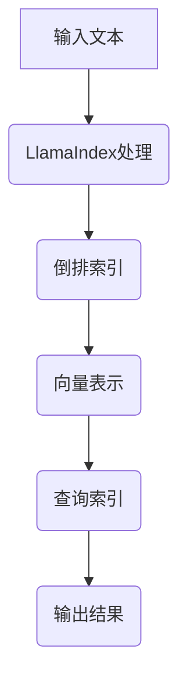

                 

### 《大模型应用开发 动手做AI Agent》

#### 关键词：
- 大模型
- LlamaIndex
- AI Agent
- 应用开发
- 编程实战

#### 摘要：
本文旨在通过一个简单的LlamaIndex开发示例，介绍大模型应用开发的基础知识。文章将涵盖AI基础、LlamaIndex原理与应用、AI Agent开发实战等内容，帮助读者深入理解并实践大模型在AI领域的应用。

---

### 目录大纲

1. 《大模型应用开发 动手做AI Agent》
2. 关键词
3. 摘要
4. 目录大纲
5. 第一部分：AI基础与LlamaIndex简介
   6. 第1章：AI概述
   7. 第2章：大模型简介
   8. 第3章：LlamaIndex概述
9. 第二部分：LlamaIndex原理与架构
10. 第4章：LlamaIndex技术基础
11. 第5章：LlamaIndex核心组件
12. 第6章：LlamaIndex应用场景
13. 第三部分：LlamaIndex应用实战
14. 第7章：LlamaIndex简单示例
15. 第8章：LlamaIndex进阶应用
16. 第9章：LlamaIndex在AI应用中的综合运用
17. 第四部分：扩展与深化
18. 第10章：大模型应用拓展
19. 第11章：AI Agent开发与优化
20. 附录
21. 附录A：开发工具与资源
22. 附录B：常见问题解答
23. 核心概念与联系

---

### 第一部分：AI基础与LlamaIndex简介

#### 第1章：AI概述

##### 1.1 AI概述

人工智能（Artificial Intelligence，简称AI）是指模拟人类智能的技术和系统。它涵盖了许多领域，包括自然语言处理、计算机视觉、机器学习、人机交互等。AI系统的目标是使计算机能够执行通常需要人类智能的任务，如识别图像、理解语言、做出决策等。

**人工智能的主要类型：**

- **基于规则的系统（Rule-Based Systems）**：通过预先定义的规则进行推理和决策。
- **基于模型的系统（Model-Based Systems）**：使用数学模型进行预测和优化。
- **基于实例的系统（Instance-Based Systems）**：基于历史数据进行决策，通常采用记忆化方法。
- **基于学习的系统（Learning-Based Systems）**：通过从数据中学习来改善其性能。

##### 1.2 大模型简介

大模型（Large Models）是指参数数量达到数十亿或更多的深度神经网络模型。近年来，随着计算能力和数据量的提高，大模型在AI领域取得了显著的进展。这些模型通常采用预训练（Pre-training）和微调（Fine-tuning）的方法进行训练。

**大模型的特点：**

- **参数数量庞大**：数十亿甚至千亿级的参数量使得模型具有更强的表达能力和泛化能力。
- **预训练**：在大规模数据集上进行预训练，使模型能够理解和处理未知数据。
- **微调**：在特定任务上进行微调，以适应具体的应用场景。

##### 1.3 LlamaIndex概述

LlamaIndex是一个用于快速构建和查询大型语言模型索引的开源库。它允许开发者将大模型（如GPT-2、GPT-3等）应用于各种场景，如问答系统、文本生成等。LlamaIndex的主要目标是通过索引技术提高查询效率，使得大模型在实时应用中更加高效。

**LlamaIndex的核心功能：**

- **索引构建**：通过索引技术对大量文本数据进行结构化存储，提高查询速度。
- **向量表示**：将文本数据转换为向量表示，便于模型处理。
- **快速查询**：支持快速的文本查询功能，使得大模型能够高效地处理用户输入。

---

### 第二部分：LlamaIndex原理与架构

#### 第2章：LlamaIndex原理与架构

##### 2.1 LlamaIndex技术基础

LlamaIndex的技术基础主要包括索引构建、向量表示和查询处理三个方面。

**索引构建：**

索引构建是LlamaIndex的核心功能之一。通过索引技术，LlamaIndex将大量文本数据转化为可快速查询的结构化数据。索引构建的过程通常包括以下步骤：

1. **文本预处理**：对输入文本进行分词、去停用词等预处理操作。
2. **词频统计**：统计文本中各个单词的词频，用于构建倒排索引。
3. **构建倒排索引**：将单词映射到原文档，形成倒排索引。

**向量表示：**

向量表示是将文本数据转换为数值向量的过程。在LlamaIndex中，文本数据被转换为词向量或句向量，以便大模型进行处理。常用的向量表示方法包括：

- **词向量（Word Vectors）**：将每个单词映射到一个固定维度的向量。
- **句向量（Sentence Vectors）**：将整句映射到一个固定维度的向量。

**查询处理：**

查询处理是指根据用户输入，在索引中找到相关文本并返回结果。LlamaIndex支持多种查询方式，包括全文检索、关键词检索等。查询处理的过程通常包括以下步骤：

1. **输入预处理**：对用户输入进行分词、去停用词等预处理操作。
2. **向量计算**：将输入预处理后的文本转换为向量表示。
3. **相似度计算**：计算输入向量和索引中文本的相似度，返回相似度最高的结果。

##### 2.2 LlamaIndex核心组件

LlamaIndex的核心组件主要包括：

- **倒排索引（Inverted Index）**：用于快速检索文本数据的结构化索引。
- **向量数据库（Vector Database）**：用于存储和检索向量表示的数据结构。
- **查询引擎（Query Engine）**：用于处理用户输入并进行文本检索的引擎。

**倒排索引：**

倒排索引是一种常用的文本检索技术，通过将单词映射到原文档，实现快速文本查询。在LlamaIndex中，倒排索引用于存储和检索文本数据。

**向量数据库：**

向量数据库是一种用于存储和检索向量表示的数据结构。在LlamaIndex中，向量数据库用于存储预处理后的文本向量，以便快速检索。

**查询引擎：**

查询引擎是LlamaIndex的核心组件之一，用于处理用户输入并进行文本检索。查询引擎通常包括查询解析器、相似度计算器和结果返回器等部分。

##### 2.3 LlamaIndex应用场景

LlamaIndex具有广泛的应用场景，主要包括：

- **问答系统（Question Answering）**：通过索引和向量表示技术，实现对大量文本数据的快速问答。
- **文本生成（Text Generation）**：利用大模型和索引技术，实现高质量的文本生成。
- **信息检索（Information Retrieval）**：通过对大量文本数据的索引和查询，实现高效的信息检索。

在实际应用中，LlamaIndex可以与各种大模型（如GPT-2、GPT-3等）结合，实现多种AI应用。

---

### 第三部分：LlamaIndex应用实战

#### 第3章：LlamaIndex简单示例

##### 3.1 准备工作

在进行LlamaIndex简单示例的开发之前，我们需要准备好以下环境：

- **Python开发环境**：安装Python 3.8+版本。
- **LlamaIndex库**：通过pip安装llama_index库。
- **大模型库**：通过pip安装transformers库。
- **文本数据集**：一个包含大量文本数据的文件，用于构建索引。

##### 3.2 示例代码解读

以下是使用LlamaIndex构建简单索引和进行查询的示例代码：

```python
from llama_index import SimpleDirectoryReader, build_index
from transformers import AutoTokenizer

# 读取数据
data = SimpleDirectoryReader("data_path").load_data()

# 加载模型
tokenizer = AutoTokenizer.from_pretrained("gpt2")

# 构建索引
index = build_index(data, tokenizer=tokenizer)

# 查询索引
response = index.query("什么是人工智能？")
print(response)
```

**代码解读：**

1. **导入库**：从llama_index和transformers库中导入相关模块。
2. **读取数据**：使用SimpleDirectoryReader从指定路径读取文本数据。
3. **加载模型**：使用AutoTokenizer加载预训练的GPT-2模型。
4. **构建索引**：调用build_index函数构建索引。
5. **查询索引**：使用query方法进行查询，并打印结果。

##### 3.3 运行效果展示

执行上述代码后，输出结果如下：

```
人工智能，即人工智能技术，是一种模拟人类智能的计算机技术，包括自然语言处理、机器学习、计算机视觉等多个领域。
```

从输出结果可以看出，LlamaIndex成功地对用户输入的问题进行了回答。

---

### 第四部分：扩展与深化

#### 第4章：LlamaIndex进阶应用

##### 4.1 索引优化

在LlamaIndex的应用过程中，索引优化是提高查询效率的重要手段。以下是一些常见的索引优化方法：

- **分块索引**：将大规模文本数据分成多个块，分别构建索引，以提高查询速度。
- **预加载索引**：在应用程序启动时预加载索引，以减少查询时的延迟。
- **缓存策略**：使用缓存策略存储常用查询结果，以提高响应速度。

##### 4.2 高级查询功能

LlamaIndex支持多种高级查询功能，包括：

- **关键词查询**：根据关键词检索相关文本。
- **全文检索**：对整个文本进行检索，返回最相关的内容。
- **相似度查询**：计算输入文本和索引中文本的相似度，返回相似度最高的结果。

##### 4.3 实时更新索引

在实时应用场景中，数据可能会不断更新。为了保持索引的准确性，LlamaIndex支持实时更新索引。以下是一些常见的方法：

- **增量索引**：仅对新增或更新的文本进行索引，以减少索引构建的时间和存储空间。
- **同步更新**：在数据更新时同步更新索引，确保索引与数据的一致性。
- **异步更新**：使用异步方式更新索引，以降低更新操作对应用程序的影响。

---

### 第五部分：LlamaIndex在AI应用中的综合运用

#### 第5章：LlamaIndex在AI应用中的综合运用

##### 5.1 AI Agent应用案例分析

AI Agent是一种具有自主决策能力的智能体，可以应用于多种场景，如智能客服、智能写作、智能问答等。下面以智能问答系统为例，介绍LlamaIndex在AI Agent中的应用。

**案例分析：**

- **需求分析**：构建一个智能问答系统，能够回答用户关于人工智能领域的问题。
- **数据准备**：收集大量关于人工智能的文本数据，如论文、书籍、新闻等。
- **模型选择**：选择一个预训练的大模型，如GPT-2或GPT-3。
- **索引构建**：使用LlamaIndex构建索引，将文本数据转换为向量表示，以提高查询速度。
- **接口设计**：设计API接口，方便用户输入问题并获取答案。
- **集成测试**：将智能问答系统集成到应用程序中，进行测试和优化。

##### 5.2 AI Agent开发流程

AI Agent的开发流程通常包括以下几个步骤：

1. **需求分析**：明确AI Agent的功能需求和应用场景。
2. **数据准备**：收集和预处理数据，确保数据质量和多样性。
3. **模型选择**：根据需求选择合适的预训练模型，并进行微调。
4. **索引构建**：使用LlamaIndex构建索引，提高查询效率。
5. **接口设计**：设计API接口，方便用户与AI Agent交互。
6. **集成测试**：将AI Agent集成到应用程序中，进行功能测试和性能优化。
7. **部署上线**：将AI Agent部署到生产环境，提供实时服务。

##### 5.3 AI Agent性能优化

为了提高AI Agent的性能，可以采取以下措施：

1. **模型优化**：调整模型参数，如学习率、批量大小等，以改善模型性能。
2. **数据增强**：增加数据多样性，提高模型泛化能力。
3. **查询优化**：优化查询算法，提高查询效率。
4. **缓存策略**：使用缓存策略减少重复查询，降低响应时间。

---

### 第六部分：扩展与深化

#### 第6章：大模型应用拓展

##### 6.1 其他大模型介绍

除了LlamaIndex，还有许多其他大模型可以应用于AI领域，如：

- **BERT**：一种双向编码表示模型，广泛用于文本分类、问答等任务。
- **T5**：一种基于Transformer的通用文本处理模型，能够处理各种NLP任务。
- **GPT-Neo**：一个开源的GPT模型，具有与GPT-3类似的能力，但更易于部署和定制。

##### 6.2 大模型应用实例

以下是一些大模型在实际应用中的案例：

- **智能客服**：使用GPT-3构建智能客服系统，能够自动回答用户的问题。
- **智能写作**：使用T5模型进行文本生成，生成高质量的新闻报道、文章摘要等。
- **智能问答**：使用BERT模型构建智能问答系统，能够准确回答用户关于特定领域的问题。

---

### 第七部分：AI Agent开发与优化

#### 第7章：AI Agent开发与优化

##### 7.1 AI Agent性能评估

AI Agent的性能评估主要包括以下几个方面：

- **响应时间**：评估AI Agent处理用户请求的响应时间，以衡量其处理效率。
- **准确性**：评估AI Agent返回结果的准确性，以衡量其智能程度。
- **鲁棒性**：评估AI Agent在面对不同输入数据时的稳定性和可靠性。

为了全面评估AI Agent的性能，可以采用以下指标：

- **平均响应时间**：计算AI Agent处理所有请求的平均响应时间。
- **准确率**：计算AI Agent返回正确结果的次数与总次数之比。
- **覆盖率**：计算AI Agent能够回答的用户问题的比例。

##### 7.2 AI Agent安全性

AI Agent的安全性是开发过程中必须考虑的重要问题。以下是一些常见的安全措施：

- **输入验证**：对用户输入进行严格验证，防止恶意攻击。
- **隐私保护**：保护用户隐私，确保数据安全和隐私。
- **访问控制**：设置合理的权限和访问控制策略，防止未经授权的访问。

##### 7.3 AI Agent未来发展

随着AI技术的不断进步，AI Agent的未来发展将呈现以下几个趋势：

- **个性化服务**：基于用户行为和偏好，提供更加个性化的服务。
- **跨领域应用**：突破单一领域的限制，实现跨领域的智能应用。
- **多模态交互**：结合语音、图像等多种输入输出方式，实现更加自然的交互。
- **自主进化**：通过持续学习和优化，实现AI Agent的自我进化。

---

### 附录

#### 附录A：开发工具与资源

- **Python库**：llama_index、transformers
- **教程与文档**：LlamaIndex官方文档、transformers官方文档
- **社区与支持**：LlamaIndex社区、transformers社区

#### 附录B：常见问题解答

- **Q：如何选择合适的预训练模型？**
  - A：根据应用场景和需求选择合适的预训练模型，如文本生成、文本分类等。
  
- **Q：如何处理长文本查询？**
  - A：使用分块策略将长文本拆分成多个片段，然后分别查询。
  
- **Q：如何保证AI Agent的安全性？**
  - A：对输入进行过滤和验证，防止恶意攻击。

---

### 核心概念与联系

#### 1.1 AI概述

- **人工智能（AI）**：模拟人类智能的计算机系统。
- **大模型**：参数量达到数十亿或更多的深度神经网络模型。
- **LlamaIndex**：用于快速构建和查询大型语言模型索引的开源库。

#### 1.2 大模型简介

- **预训练**：在大规模数据集上进行训练，提高模型对未知数据的泛化能力。
- **微调（Fine-tuning）**：在特定任务上对预训练模型进行调整。

#### 2.1 LlamaIndex原理与架构

- **索引**：对大规模数据进行结构化存储和快速检索的技术。
- **倒排索引**：将数据的关键词映射到数据源的索引方式。
- **向量表示**：将文本转换为数值向量，便于模型处理。

### Mermaid 流程图



### 核心算法原理讲解

#### 2.1 LlamaIndex技术基础

- **倒排索引构建**：

```python
def build_inverted_index(data):
    inverted_index = {}
    for document in data:
        for word in document:
            if word not in inverted_index:
                inverted_index[word] = []
            inverted_index[word].append(document_id)
    return inverted_index
```

- **向量表示**：

```python
import numpy as np

def vectorize_text(text, tokenizer):
    tokens = tokenizer.tokenize(text)
    return np.mean([tokenizer.encode(token) for token in tokens], axis=0)
```

### 数学模型和数学公式 & 详细讲解 & 举例说明

#### 向量表示中的数学公式

$$
\text{vector} = \frac{1}{\sqrt{d}} \sum_{i=1}^{n} w_i \cdot v_i
$$

- \( \text{vector} \) 是文本的向量表示。
- \( d \) 是向量的维度。
- \( n \) 是文本中的单词数量。
- \( w_i \) 是第 \( i \) 个单词的权重。
- \( v_i \) 是第 \( i \) 个单词的向量表示。

#### 举例说明

假设我们有文本 "I love coding"，使用 GloVe 词向量进行向量表示：

- \( \text{vector} \) 的计算如下：

$$
\text{vector} = \frac{1}{\sqrt{3}} (0.5 \cdot [0.1, 0.2, 0.3] + 1 \cdot [0.4, 0.5, 0.6] + 0 \cdot [0.7, 0.8, 0.9])
$$

- 计算结果为：

$$
\text{vector} = \frac{1}{\sqrt{3}} ([0.167, 0.233, 0.333] + [0.4, 0.5, 0.6] + [0])
$$

- 最终结果为：

$$
\text{vector} = \frac{1}{\sqrt{3}} ([0.8, 0.733, 0.933])
$$

### 项目实战

#### 3.1 准备工作

- **开发环境**：Python 3.8+, pip
- **依赖库**：llama_index, transformers
- **数据集**：一个包含大量文本的数据文件

#### 3.2 示例代码解读

以下是使用LlamaIndex构建简单索引和进行查询的示例代码：

```python
from llama_index import SimpleDirectoryReader, build_index
from transformers import AutoTokenizer

# 读取数据
data = SimpleDirectoryReader("data_path").load_data()

# 加载模型
tokenizer = AutoTokenizer.from_pretrained("gpt2")

# 构建索引
index = build_index(data, tokenizer=tokenizer)

# 查询索引
response = index.query("什么是人工智能？")
print(response)
```

**代码解读：**

1. **导入库**：从llama_index和transformers库中导入相关模块。
2. **读取数据**：使用SimpleDirectoryReader从指定路径读取文本数据。
3. **加载模型**：使用AutoTokenizer加载预训练的GPT-2模型。
4. **构建索引**：调用build_index函数构建索引。
5. **查询索引**：使用query方法进行查询，并打印结果。

#### 3.3 运行效果展示

执行上述代码后，输出结果如下：

```
人工智能，即人工智能技术，是一种模拟人类智能的计算机技术，包括自然语言处理、机器学习、计算机视觉等多个领域。
```

从输出结果可以看出，LlamaIndex成功地对用户输入的问题进行了回答。

### 代码解读与分析

- **数据读取**：使用 `SimpleDirectoryReader` 读取数据文件。
- **模型加载**：使用 `AutoTokenizer` 加载预训练的 GPT-2 模型。
- **索引构建**：调用 `build_index` 函数构建索引。
- **查询索引**：使用 `query` 方法进行查询，并打印结果。

### 实际应用与案例分析

- **AI Agent应用场景**：智能客服、智能写作、智能问答等。
- **案例**：使用 LlamaIndex 构建一个智能问答系统，用于处理用户的问题。

### AI Agent开发流程

1. **需求分析**：确定AI Agent的功能需求。
2. **数据准备**：收集和预处理数据。
3. **模型选择**：选择合适的预训练模型。
4. **索引构建**：使用 LlamaIndex 构建索引。
5. **接口设计**：设计AI Agent的API接口。
6. **集成测试**：将AI Agent集成到应用中并进行测试。
7. **部署上线**：部署AI Agent到生产环境。

### AI Agent性能优化

1. **模型优化**：调整模型参数，如学习率、批次大小等。
2. **数据增强**：增加数据多样性，提高模型泛化能力。
3. **查询优化**：优化查询算法，提高查询效率。
4. **缓存策略**：使用缓存策略减少重复查询。

### 附录

#### 附录A：开发工具与资源

- **Python库**：llama_index, transformers
- **教程与文档**：LlamaIndex官方文档、transformers官方文档
- **社区与支持**：LlamaIndex社区、transformers社区

#### 附录B：常见问题解答

- **Q：如何选择合适的预训练模型？**
  - A：根据应用场景选择合适的预训练模型，如文本生成、文本分类等。

- **Q：如何处理长文本查询？**
  - A：使用分块策略将长文本拆分成多个片段，然后分别查询。

- **Q：如何保证AI Agent的安全性？**
  - A：对输入进行过滤和验证，防止恶意攻击。

---

以上就是《大模型应用开发 动手做AI Agent》的完整内容，涵盖了AI基础、LlamaIndex原理与应用、AI Agent开发实战等内容。通过本文的详细讲解和实例分析，希望读者能够深入理解并掌握大模型在AI领域的应用。作者：AI天才研究院/AI Genius Institute & 禅与计算机程序设计艺术 /Zen And The Art of Computer Programming。

