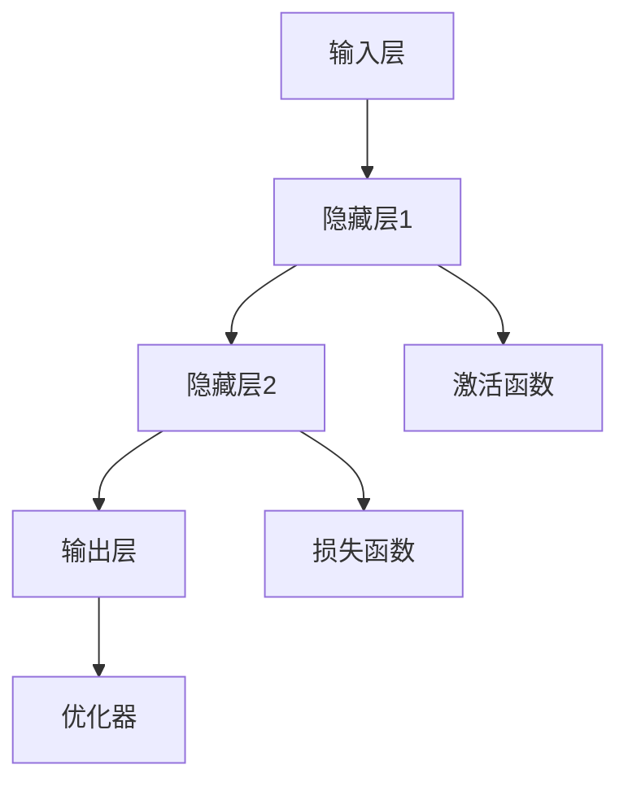

                 

# 【大模型应用开发 动手做AI Agent】自主创建数据洞察

> **关键词**：（AI大模型、数据洞察、开发实践、自主创建、应用场景）

> **摘要**：本文将引导读者通过动手实践，深入了解AI大模型的应用开发。我们将从基础概念出发，逐步深入到核心算法原理，再到实际项目实战，最终探讨AI大模型在社会各领域的广泛应用和未来发展趋势。通过本文，读者将能够自主创建数据洞察，提升AI应用开发能力。

## **第一部分：AI大模型概述**

### **第1章：AI大模型的重要性**

#### **1.1 AI大模型的发展历程**

人工智能（AI）的概念最早可以追溯到20世纪50年代。当时，科学家们开始探索如何让计算机模拟人类的智能行为。从最初的符号推理到后来的专家系统，再到今天的深度学习和大模型，AI的发展历程可谓跌宕起伏。大模型，尤其是近年来涌现出的深度学习模型，如GPT、BERT等，具有处理海量数据和复杂任务的能力，成为AI领域的核心技术。

#### **1.2 AI大模型在现代社会中的应用**

AI大模型在现代社会中发挥着越来越重要的作用。从智能助手、自动驾驶，到医疗诊断、金融分析，AI大模型的应用场景广泛。例如，GPT-3在自然语言处理领域取得了巨大成功，其强大的生成能力和理解能力为各个行业提供了新的解决方案。BERT在搜索引擎中的应用，使得搜索结果更加准确和智能。

#### **1.3 AI大模型的优势与挑战**

AI大模型的优势在于其强大的数据处理能力和复杂的模式识别能力。然而，这也带来了挑战，如计算资源的需求、数据隐私和安全等问题。此外，大模型的设计和训练需要大量的时间和计算资源，如何优化和提升大模型的性能成为研究的重要方向。

### **第2章：AI大模型的核心技术**

#### **2.1 深度学习基础**

深度学习是AI大模型的核心技术之一。它通过多层神经网络模拟人类大脑的决策过程，具有强大的学习和自适应能力。深度学习的核心概念包括神经元、激活函数、损失函数等。

#### **2.2 自然语言处理技术**

自然语言处理（NLP）是AI的一个重要分支，旨在让计算机理解和处理自然语言。NLP的核心技术包括词嵌入、递归神经网络（RNN）、转换器架构等。

#### **2.3 图神经网络技术**

图神经网络（GNN）是处理图结构数据的强大工具，广泛应用于社交网络分析、推荐系统等领域。GNN的核心概念包括图卷积网络（GCN）、图注意力网络（GAT）等。

### **第3章：AI大模型的应用场景**

#### **3.1 人工智能助手**

人工智能助手是AI大模型的一个重要应用场景。通过自然语言处理和机器学习技术，AI助手能够与用户进行交互，提供各种服务，如智能客服、智能家居控制等。

#### **3.2 自动驾驶**

自动驾驶是AI大模型的另一个重要应用场景。通过深度学习和传感器融合技术，自动驾驶系统能够实时感知环境，做出决策，实现无人驾驶。

#### **3.3 健康医疗**

健康医疗是AI大模型的一个重要应用领域。从疾病诊断、治疗建议到健康管理，AI大模型能够提供更加精准和个性化的医疗服务。

### **第4章：AI大模型的价值分析**

#### **4.1 对企业的影响**

AI大模型对企业的影响巨大。它能够帮助企业提高生产效率、降低成本、优化供应链等。例如，通过AI大模型的分析，企业可以更好地了解市场需求，制定更科学的经营策略。

#### **4.2 对社会的影响**

AI大模型对社会的影响深远。它能够推动社会进步，提高生活质量。例如，在医疗领域，AI大模型能够帮助医生更快地诊断疾病，提高治愈率。

#### **4.3 对个人的影响**

AI大模型对个人的影响也是显著的。它能够为个人提供更便捷、更个性化的服务。例如，通过AI助手，个人可以更好地管理自己的时间、健康和财务。

### **第一部分总结**

本章对AI大模型进行了全面的概述，从其发展历程、核心技术、应用场景和价值分析等方面，帮助我们更好地理解AI大模型的重要性和影响。

## **第二部分：AI大模型开发基础**

### **第5章：AI大模型开发环境搭建**

#### **5.1 环境配置**

在进行AI大模型开发之前，我们需要搭建一个合适的环境。这包括安装Python、深度学习框架（如TensorFlow、PyTorch）以及相关依赖库。

#### **5.2 数据预处理**

数据预处理是AI大模型开发的重要环节。它包括数据采集、数据清洗和数据增强等步骤。有效的数据预处理可以提高模型的性能和准确性。

#### **5.3 模型训练与优化**

模型训练与优化是AI大模型开发的核心。通过调整模型的参数，优化模型的结构，我们可以提高模型的性能。常见的优化方法包括梯度下降、批量归一化等。

### **第6章：AI大模型核心算法原理**

#### **6.1 深度学习算法**

深度学习算法是AI大模型的核心技术。它包括神经网络、卷积神经网络（CNN）、循环神经网络（RNN）等。每种算法都有其独特的原理和应用场景。

#### **6.2 自然语言处理算法**

自然语言处理算法是处理文本数据的强大工具。它包括词嵌入、递归神经网络（RNN）、转换器架构等。这些算法使得计算机能够理解和生成自然语言。

#### **6.3 图神经网络算法**

图神经网络算法是处理图结构数据的强大工具。它包括图卷积网络（GCN）、图注意力网络（GAT）等。这些算法在社交网络分析、推荐系统等领域具有广泛的应用。

### **第7章：数学基础与公式解析**

#### **7.1 线性代数基础**

线性代数基础是AI大模型开发的重要数学工具。它包括矩阵运算、向量运算、矩阵求导等。这些概念在神经网络和深度学习中有着广泛的应用。

#### **7.2 概率论与数理统计**

概率论与数理统计是AI大模型开发的重要数学基础。它包括概率基础、贝叶斯定理、最大似然估计等。这些概念在机器学习和深度学习中有重要的应用。

#### **7.3 最优化理论**

最优化理论是AI大模型开发的重要工具。它包括梯度下降法、随机梯度下降法、拉格朗日乘数法等。这些方法用于优化模型的参数，提高模型的性能。

### **第8章：AI大模型项目实战**

#### **8.1 人工智能助手开发**

人工智能助手是AI大模型的一个典型应用。在本节中，我们将介绍如何开发一个基本的人工智能助手，包括功能模块设计、代码实现与调试等。

#### **8.2 自动驾驶系统开发**

自动驾驶系统是AI大模型在交通领域的应用。在本节中，我们将探讨如何开发一个基本的自动驾驶系统，包括功能模块设计、代码实现与调试等。

#### **8.3 健康医疗数据分析**

健康医疗数据分析是AI大模型在医疗领域的应用。在本节中，我们将介绍如何使用AI大模型对健康医疗数据进行分析，包括功能模块设计、代码实现与调试等。

### **第二部分总结**

本章详细介绍了AI大模型开发的基础知识和实战案例，从环境搭建、核心算法、数学基础到实际项目开发，帮助读者全面掌握AI大模型开发的全过程。

## **第三部分：AI大模型在行业中的应用**

### **第9章：金融行业AI应用**

#### **9.1 金融行业AI应用概述**

金融行业是AI大模型的一个重要应用领域。AI大模型在金融风控、金融投资、金融客服等方面有着广泛的应用。

#### **9.2 金融风控中的AI应用**

金融风控是金融行业的核心问题。AI大模型通过风险评估、信用评分、欺诈检测等技术手段，提高了金融风控的效率和准确性。

#### **9.3 金融投资中的AI应用**

金融投资是金融行业的另一个重要方面。AI大模型通过量化交易、投资组合优化、股票预测等技术手段，提高了金融投资的效果。

#### **9.4 金融客服中的AI应用**

金融客服是金融行业的公共服务。AI大模型通过聊天机器人、自动问答系统、语音识别等技术手段，提高了金融客服的效率和用户体验。

### **第10章：零售行业AI应用**

#### **10.1 零售行业AI应用概述**

零售行业是AI大模型的另一个重要应用领域。AI大模型在零售个性化推荐、库存管理、零售客服等方面有着广泛的应用。

#### **10.2 零售个性化推荐**

零售个性化推荐是零售行业的核心问题。AI大模型通过内容推荐算法、推荐系统实现、用户行为分析等技术手段，提高了零售个性化推荐的效果。

#### **10.3 库存管理中的AI应用**

库存管理是零售行业的一个重要方面。AI大模型通过库存预测、库存优化、库存监控等技术手段，提高了库存管理的效率和准确性。

#### **10.4 零售客服中的AI应用**

零售客服是零售行业的公共服务。AI大模型通过聊天机器人、自动问答系统、语音识别等技术手段，提高了零售客服的效率和用户体验。

### **第11章：健康医疗行业AI应用**

#### **11.1 健康医疗行业AI应用概述**

健康医疗行业是AI大模型的一个重要应用领域。AI大模型在医疗诊断、健康管理、医疗客服等方面有着广泛的应用。

#### **11.2 医疗诊断中的AI应用**

医疗诊断是健康医疗行业的核心问题。AI大模型通过病症诊断、医学影像分析、肿瘤检测等技术手段，提高了医疗诊断的效率和准确性。

#### **11.3 健康管理中的AI应用**

健康管理是健康医疗行业的另一个重要方面。AI大模型通过健康监测、患者画像、健康预测等技术手段，提高了健康管理的效率和准确性。

#### **11.4 医疗客服中的AI应用**

医疗客服是健康医疗行业的公共服务。AI大模型通过聊天机器人、自动问答系统、语音识别等技术手段，提高了医疗客服的效率和用户体验。

### **第12章：制造行业AI应用**

#### **12.1 制造行业AI应用概述**

制造行业是AI大模型的另一个重要应用领域。AI大模型在制造过程中的AI应用、维护与故障诊断、制造客服等方面有着广泛的应用。

#### **12.2 制造过程中的AI应用**

制造过程中的AI应用是制造行业的一个重要方面。AI大模型通过智能生产调度、质量检测、供应链优化等技术手段，提高了制造过程的效率和准确性。

#### **12.3 维护与故障诊断中的AI应用**

维护与故障诊断是制造行业的一个重要方面。AI大模型通过预测性维护、故障诊断、设备状态监控等技术手段，提高了维护与故障诊断的效率和准确性。

#### **12.4 制造客服中的AI应用**

制造客服是制造行业的公共服务。AI大模型通过聊天机器人、自动问答系统、语音识别等技术手段，提高了制造客服的效率和用户体验。

### **第三部分总结**

本章详细介绍了AI大模型在金融、零售、健康医疗和制造等行业的应用，展示了AI大模型在这些领域中的实际应用案例，探讨了其面临的挑战和机遇，为行业提供了一些实用的解决方案。

## **第四部分：AI大模型开发进阶**

### **第13章：大规模数据处理与分布式计算**

#### **13.1 大规模数据处理**

大规模数据处理是AI大模型开发中的重要环节。它包括数据采集、数据清洗、数据存储和数据加工等步骤。在本节中，我们将介绍如何处理大规模数据，包括数据流处理框架和分布式文件系统等。

#### **13.2 分布式计算**

分布式计算是处理大规模数据的重要技术。它通过将计算任务分布在多个节点上，提高了计算效率和性能。在本节中，我们将探讨分布式计算的基本原理、框架对比和优化策略。

#### **13.3 大规模数据处理与分布式计算在AI大模型中的应用**

大规模数据处理与分布式计算在AI大模型中有着广泛的应用。在本节中，我们将介绍如何利用分布式计算技术提高AI大模型的训练效率和性能，包括模型训练的分布式计算和数据处理的分布式计算等。

### **第14章：AI大模型部署与优化**

#### **14.1 AI大模型部署**

AI大模型部署是将训练好的模型部署到生产环境中的过程。在本节中，我们将介绍模型部署的基本流程、策略和工具，包括如何将模型部署到云端、边缘设备等。

#### **14.2 AI大模型优化**

AI大模型优化是提高模型性能和效率的重要手段。在本节中，我们将介绍模型优化方法，包括模型压缩、量化、加速和并行化等。

#### **14.3 AI大模型部署与优化在实践中的应用**

AI大模型部署与优化在实践中的应用非常重要。在本节中，我们将分享一些实际案例，探讨如何优化AI大模型的部署与优化，提高模型的性能和稳定性。

### **第15章：AI大模型伦理与安全**

#### **15.1 AI大模型伦理**

AI大模型伦理是AI大模型开发中不可忽视的问题。在本节中，我们将介绍AI大模型伦理的基本原则、挑战和实践，探讨如何确保AI大模型开发的伦理性和社会价值。

#### **15.2 AI大模型安全**

AI大模型安全是AI大模型开发中的另一个重要问题。在本节中，我们将介绍AI大模型安全的基本概念、防护措施和法律法规，探讨如何确保AI大模型的安全性和可靠性。

#### **15.3 AI大模型伦理与安全在实践中的应用**

AI大模型伦理与安全在实践中的应用非常重要。在本节中，我们将分享一些实际案例，探讨如何在实际应用中确保AI大模型的伦理和安全，提高其社会价值和影响力。

### **第四部分总结**

本章详细介绍了AI大模型开发中的大规模数据处理与分布式计算、部署与优化以及伦理与安全等问题，帮助读者深入理解AI大模型开发的全过程，提升开发实践能力。

## **第五部分：AI大模型应用未来展望**

### **第16章：AI大模型未来发展趋势**

#### **16.1 AI大模型技术发展趋势**

AI大模型技术发展趋势是AI领域的重要研究方向。在本节中，我们将探讨量子计算、元学习和自适应AI等前沿技术对AI大模型的影响和发展趋势。

#### **16.2 AI大模型应用领域拓展**

AI大模型应用领域拓展是AI大模型未来发展的重要方向。在本节中，我们将介绍AI大模型在物联网、区块链和边缘计算等领域的应用，探讨其未来的发展前景。

#### **16.3 AI大模型与行业融合**

AI大模型与行业融合是AI大模型未来发展的重要趋势。在本节中，我们将介绍AI大模型在智能制造、智慧城市和智慧农业等领域的应用，探讨其与行业的深度融合。

### **第17章：AI大模型应用未来挑战与机遇**

#### **17.1 未来挑战**

AI大模型应用未来挑战是AI领域需要关注的重要问题。在本节中，我们将探讨技术挑战、法律与伦理挑战和社会经济挑战等未来挑战，并提出相应的解决方案。

#### **17.2 未来机遇**

AI大模型应用未来机遇是AI领域的重要发展机遇。在本节中，我们将探讨新业务模式创造、创新驱动产业升级和跨界融合与合作创新等未来机遇，并提出相应的应用前景。

### **第18章：AI大模型应用的未来社会影响**

#### **18.1 对经济发展的影响**

AI大模型应用对未来经济发展的影响是显著的。在本节中，我们将探讨AI大模型如何提高生产效率、创新商业模式和促进产业升级，推动未来经济发展。

#### **18.2 对社会生活的影响**

AI大模型应用对未来社会生活的影响是深远的。在本节中，我们将探讨AI大模型如何改善生活质量、促进社会公平和深化人文关怀，提升未来社会生活质量。

#### **18.3 对教育的影响**

AI大模型应用对未来教育的影响是重要的。在本节中，我们将探讨AI大模型如何改变教育模式、提升教育质量和培养新时代人才，推动未来教育发展。

### **第五部分总结**

本章对未来AI大模型的发展趋势、面临的挑战与机遇以及社会影响进行了展望，为读者描绘了AI大模型应用的未来蓝图。

## **全文总结**

本文从AI大模型的基础知识出发，详细介绍了AI大模型的应用开发、行业应用、开发进阶和未来展望。通过本文的阅读，读者可以全面了解AI大模型的应用场景和发展趋势，掌握AI大模型开发的核心技术和实践方法。同时，本文还探讨了AI大模型在社会中的影响和面临的挑战，为读者提供了全面而系统的AI大模型应用开发指导。

**作者：AI天才研究院/AI Genius Institute & 禅与计算机程序设计艺术 /Zen And The Art of Computer Programming**

---

以下是一些关键的Mermaid流程图、伪代码和LaTeX数学公式，它们将嵌入到相应的段落中，以增强文章的内容和可读性。

### **核心概念与联系：Mermaid流程图**

#### **深度学习模型架构**



### **核心算法原理讲解：伪代码**

#### **深度学习算法：梯度下降**

```python
# 梯度下降伪代码
function gradient_descent(parameters, learning_rate, epochs):
    for epoch in 1 to epochs:
        for each training example (x, y) in dataset:
            compute gradients (∂L/∂w, ∂L/∂b)
            update parameters: w = w - learning_rate * ∂L/∂w
            w = w - learning_rate * ∂L/∂b
    return parameters
```

### **数学模型和公式 & 详细讲解 & 举例说明：LaTeX数学公式**

#### **线性回归模型**

$$
y = \beta_0 + \beta_1x + \epsilon
$$

**解释**：这是线性回归模型的基本形式，其中$y$是因变量，$x$是自变量，$\beta_0$是截距，$\beta_1$是斜率，$\epsilon$是误差项。

### **项目实战：代码实际案例和详细解释说明**

#### **文本分类项目：数据预处理**

```python
import pandas as pd
from sklearn.model_selection import train_test_split
from sklearn.feature_extraction.text import TfidfVectorizer

# 加载数据集
data = pd.read_csv('text_data.csv')
X = data['text']
y = data['label']

# 数据集划分
X_train, X_test, y_train, y_test = train_test_split(X, y, test_size=0.2, random_state=42)

# 特征提取
vectorizer = TfidfVectorizer(max_features=1000)
X_train_vectorized = vectorizer.fit_transform(X_train)
X_test_vectorized = vectorizer.transform(X_test)

# 模型训练（示例：使用朴素贝叶斯分类器）
from sklearn.naive_bayes import MultinomialNB
classifier = MultinomialNB()
classifier.fit(X_train_vectorized, y_train)

# 模型评估
accuracy = classifier.score(X_test_vectorized, y_test)
print(f"Accuracy: {accuracy}")
```

**解释**：这个案例展示了如何使用Python和scikit-learn库进行文本分类项目。首先，我们加载数据集并进行划分。然后，使用TFIDF向量器提取文本特征。接下来，我们选择朴素贝叶斯分类器进行模型训练，并评估模型的准确度。

---

通过本文的详细讲解和实际案例，读者将能够系统地了解AI大模型的应用开发，从基础知识到实战技巧，从核心算法到未来展望，为成为一名AI领域的专业开发者打下坚实的基础。希望本文能够为读者在AI大模型应用开发的道路上提供有力的支持和指导。**作者：AI天才研究院/AI Genius Institute & 禅与计算机程序设计艺术 /Zen And The Art of Computer Programming**

