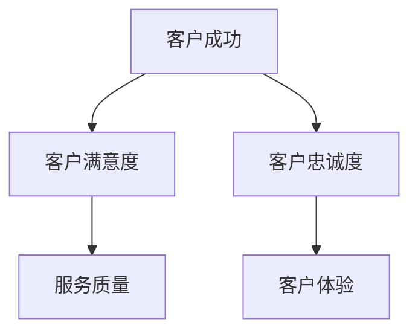
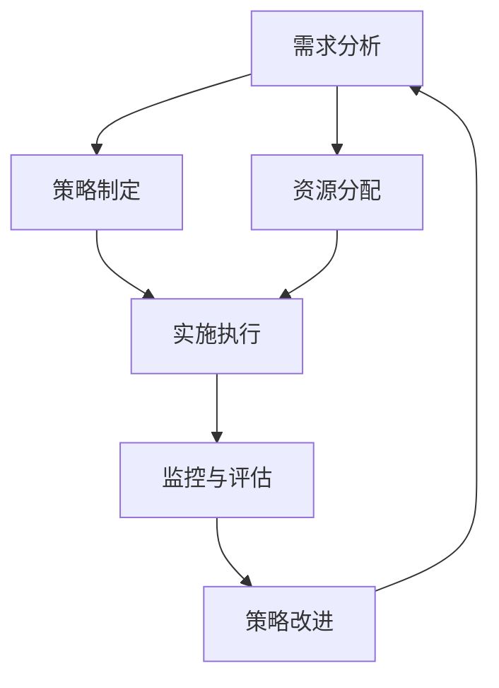

                 

# 一人公司的客户成功策略：如何提高客户满意度和忠诚度

## 关键词：
- 客户成功策略
- 客户满意度
- 客户忠诚度
- 个性化服务
- 客户体验优化
- 会员计划
- 客户关系管理

## 摘要：
本文旨在探讨一人公司在面对多样化客户需求时，如何通过有效的客户成功策略来提高客户满意度和忠诚度。文章首先定义了客户成功、客户满意度和忠诚度的概念，并探讨了它们之间的内在联系。接着，文章深入分析了优化客户体验、提升产品和服务质量，以及构建客户忠诚度的策略和方法。最后，通过案例分析展示了具体实施效果，并提供了客户成功策略的实施流程和改进方法。本文为一人公司提供了系统的客户成功策略指南。

## 目录大纲

### 第一部分：基础概念与策略

#### 第1章：引言

##### 1.1 本书目的与结构

##### 1.2 客户成功的定义与重要性

#### 第2章：理解客户需求与行为

##### 2.1 客户需求分析

##### 2.2 客户行为分析

##### 2.3 客户细分策略

### 第二部分：提高客户满意度

#### 第3章：优化客户体验

##### 3.1 提供个性化服务

##### 3.2 优化客户服务流程

##### 3.3 客户反馈机制

#### 第4章：产品与服务质量提升

##### 4.1 产品质量监控

##### 4.2 服务质量提升策略

##### 4.3 顾客满意度评估方法

### 第三部分：构建客户忠诚度

#### 第5章：客户忠诚度策略

##### 5.1 会员计划与积分制度

##### 5.2 客户忠诚度评估指标

##### 5.3 提高客户忠诚度的方法

#### 第6章：关系管理与客户保留

##### 6.1 建立长期合作关系

##### 6.2 客户保留策略

##### 6.3 客户流失预防

### 第四部分：案例分析与实践

#### 第7章：成功案例分析

##### 7.1 案例一：一家在线零售商的客户成功策略

##### 7.2 案例二：一家软件公司的客户忠诚度策略

#### 第8章：实施与改进

##### 8.1 客户成功策略的实施流程

##### 8.2 监控与评估

##### 8.3 策略改进与优化

### 附录

#### 附录A：客户成功策略工具与资源

##### A.1 客户成功管理软件推荐

##### A.2 相关书籍与文章推荐

#### 附录B：术语表

##### B.1 客户成功相关术语解释

##### B.2 策略与工具术语解释

#### 附录C：客户成功策略流程图

##### C.1 客户成功策略流程图

**核心概念与联系**



**核心算法原理讲解**

```python
# 客户满意度评分算法伪代码

def calculate_satisfaction(score1, score2, score3):
    # score1: 产品质量评分
    # score2: 服务质量评分
    # score3: 客户体验评分
    satisfaction = (score1 + score2 + score3) / 3
    return satisfaction

# 示例
satisfaction_score = calculate_satisfaction(4.5, 4.8, 4.9)
print("客户满意度评分：", satisfaction_score)
```

**数学模型和数学公式 & 详细讲解 & 举例说明**

$$
\text{客户忠诚度} = \frac{\text{重复购买率}}{\text{总购买次数}} \times 100\%
$$

**举例说明：**

假设某客户在一年内购买次数为10次，其中重复购买5次，则其客户忠诚度为：

$$
\text{客户忠诚度} = \frac{5}{10} \times 100\% = 50\%
$$

**项目实战：**

```python
# 代码实现客户忠诚度计算

def calculate_loyalty(buys, repeat_buys):
    loyalty_rate = (repeat_buys / buys) * 100
    return loyalty_rate

# 示例
customer_buys = 10
customer_repeat_buys = 5
loyalty_rate = calculate_loyalty(customer_buys, customer_repeat_buys)
print("客户忠诚度：", loyalty_rate, "%")
```

**代码解读与分析：**

此代码定义了一个名为`calculate_loyalty`的函数，用于计算客户的忠诚度。忠诚度计算公式为重复购买率除以总购买次数，再乘以100转换为百分比。示例中，客户一年内购买10次，其中重复购买5次，通过调用函数计算得到其忠诚度为50%。这个计算方法可以帮助企业了解客户的忠诚度水平，从而制定相应的客户保留策略。

### 第一部分：基础概念与策略

#### 第1章：引言

##### 1.1 本书目的与结构

在当今竞争激烈的市场环境中，客户成功策略已成为企业制胜的关键。一人公司，作为独立运营的个体企业，面临着资源有限、市场挑战多样的现实。本文旨在为一人公司提供一套系统且实用的客户成功策略，旨在提高客户满意度和忠诚度，从而实现业务增长。

本文将分为四个部分进行阐述：

1. **基础概念与策略**：介绍客户成功、客户满意度和忠诚度的基本概念，并阐述它们之间的内在联系。
2. **提高客户满意度**：探讨如何通过优化客户体验、提升产品和服务质量来提高客户满意度。
3. **构建客户忠诚度**：分析如何通过会员计划、积分制度等策略来构建客户忠诚度。
4. **案例分析与实践**：通过具体案例展示如何实施客户成功策略，并提供实践中的改进方法。

##### 1.2 客户成功的定义与重要性

客户成功（Customer Success）是一个广泛的概念，它涵盖了企业如何通过满足和超越客户期望，实现客户满意度和忠诚度的一系列策略和实践。客户成功不仅仅是销售和服务的延伸，它是一种以客户为中心的思维方式，贯穿于企业的各个层面。

**定义**：客户成功是指企业通过持续优化产品和服务，与客户建立长期的信任关系，帮助客户实现其业务目标的过程。

**重要性**：

1. **增强客户满意度**：客户成功策略关注客户的长期价值，通过不断改进产品和服务，满足客户的需求，提高客户满意度。
2. **提升客户忠诚度**：通过提供卓越的客户体验，企业可以建立强大的客户忠诚度，减少客户流失率，从而实现业务增长。
3. **优化资源利用**：一人公司资源有限，通过有效的客户成功策略，可以最大限度地利用现有资源，提高效率和盈利能力。
4. **促进创新与改进**：客户成功策略鼓励企业与客户进行紧密合作，从客户反馈中获取创新灵感，不断改进产品和服务。

在下一章中，我们将进一步探讨客户需求和行为分析，为制定有效的客户成功策略奠定基础。

### 第2章：理解客户需求与行为

##### 2.1 客户需求分析

理解客户需求是客户成功策略的核心。客户需求是指客户对产品或服务所期望的功能、性能和体验。分析客户需求有助于企业识别市场机会，优化产品和服务，满足客户的期望。

**需求分析的方法**：

1. **市场调研**：通过问卷调查、访谈、焦点小组等方式收集客户反馈，了解客户的实际需求和期望。
2. **数据分析**：利用数据分析工具分析客户的行为数据，如购买历史、浏览记录等，识别客户的需求模式。
3. **客户访谈**：直接与客户进行面对面访谈，深入了解客户的真实需求和痛点。

**需求分析的重要性**：

1. **指导产品开发**：通过需求分析，企业可以明确产品开发的优先级，确保产品功能满足客户需求。
2. **优化服务流程**：了解客户需求有助于企业优化服务流程，提高服务效率和客户满意度。
3. **提升客户体验**：满足客户需求可以提升客户体验，增强客户满意度和忠诚度。

##### 2.2 客户行为分析

客户行为分析是客户成功策略的重要组成部分。通过分析客户的行为模式，企业可以更好地理解客户的购买决策过程，制定有效的营销策略和客户保留策略。

**行为分析的方法**：

1. **用户行为追踪**：利用技术手段追踪用户在网站或应用上的行为，如点击路径、浏览时长等。
2. **热图分析**：通过热图分析用户在页面上的活动区域，了解用户的关注点和行为偏好。
3. **A/B测试**：通过对比不同设计或功能的用户反应，优化产品和服务。

**行为分析的重要性**：

1. **优化用户体验**：通过分析用户行为，企业可以识别用户体验中的问题，进行改进，提升客户满意度。
2. **制定精准营销策略**：了解客户行为可以帮助企业制定更加精准的营销策略，提高营销效果。
3. **预防客户流失**：通过分析客户流失的行为模式，企业可以提前采取预防措施，降低客户流失率。

##### 2.3 客户细分策略

客户细分是将客户根据不同的特征和行为划分为不同的群体，以便企业能够针对不同群体的需求和行为制定个性化的营销和服务策略。

**细分标准**：

1. **行为特征**：如购买频率、购买渠道、浏览行为等。
2. **人口统计特征**：如年龄、性别、收入等。
3. **心理特征**：如价值观、兴趣爱好等。
4. **地理特征**：如地理位置、区域市场等。

**客户细分的重要性**：

1. **提高营销效果**：针对不同细分群体的需求和行为，制定个性化的营销策略，提高营销效果。
2. **优化资源配置**：将有限的资源集中于最有价值的客户群体，提高资源利用效率。
3. **提升客户满意度**：提供个性化的服务和产品，满足不同客户的需求，提升客户满意度。

在下一章中，我们将探讨如何通过优化客户体验来提高客户满意度。

### 第二部分：提高客户满意度

#### 第3章：优化客户体验

##### 3.1 提供个性化服务

个性化服务是提高客户满意度的关键。通过了解客户的需求和行为，企业可以提供定制化的产品和服务，使客户感受到企业的关怀和尊重。

**个性化服务的方法**：

1. **个性化推荐**：根据客户的浏览记录和购买历史，提供个性化的产品推荐。
2. **定制化服务**：提供符合客户需求的定制化服务，如定制化的报告、个性化的咨询等。
3. **个性化的沟通**：通过电话、邮件、短信等方式，与客户保持个性化的沟通，了解客户的需求和反馈。

**个性化服务的重要性**：

1. **增强客户满意度**：个性化服务能够满足客户的特殊需求，提高客户满意度。
2. **提升客户忠诚度**：个性化的体验能够增强客户对企业的认同感，提升客户忠诚度。
3. **优化客户关系**：通过个性化的服务，企业可以与客户建立更加紧密的关系，提高客户保留率。

##### 3.2 优化客户服务流程

优化客户服务流程是提高客户满意度的另一重要手段。通过简化服务流程、提高服务效率，企业可以提供更加便捷和高效的服务，满足客户的期望。

**优化客户服务流程的方法**：

1. **流程简化**：简化服务流程，减少不必要的环节和等待时间。
2. **自动化**：利用自动化工具和系统，提高服务效率，减少人为错误。
3. **培训员工**：提高员工的服务意识和技能，确保能够提供高质量的服务。

**优化客户服务流程的重要性**：

1. **提高客户满意度**：便捷高效的服务能够提升客户的满意度。
2. **降低客户流失率**：快速响应客户需求和问题，可以减少客户流失。
3. **提升企业形象**：高效的服务流程能够提升企业的整体形象，增强客户信任。

##### 3.3 客户反馈机制

建立有效的客户反馈机制是提高客户满意度的关键。通过收集和分析客户反馈，企业可以及时了解客户的需求和问题，不断改进产品和服务。

**客户反馈机制的方法**：

1. **在线评价系统**：提供方便的在线评价系统，让客户可以随时反馈意见和建议。
2. **客户满意度调查**：定期进行客户满意度调查，了解客户的满意度和不满意度。
3. **客户访谈**：通过电话、邮件等方式，与客户进行面对面访谈，深入了解客户的反馈和需求。

**客户反馈机制的重要性**：

1. **及时改进**：通过客户反馈，企业可以及时发现和解决问题，提高产品和服务质量。
2. **增强客户信任**：及时响应客户的反馈，能够增强客户对企业的信任感。
3. **提升客户满意度**：持续改进产品和服务，能够满足客户的期望，提高客户满意度。

在下一章中，我们将探讨如何通过提升产品和服务质量来提高客户满意度。

### 第4章：产品与服务质量提升

##### 4.1 产品质量监控

产品质量是客户满意度的基础。通过有效的产品质量监控，企业可以确保产品符合客户的期望，减少质量问题的发生。

**产品质量监控的方法**：

1. **质量检测**：在生产过程中，对产品进行严格的质量检测，确保产品符合标准。
2. **质量反馈机制**：建立客户反馈机制，收集客户对产品质量的意见和建议，及时进行改进。
3. **持续改进**：根据质量监控结果，不断改进生产工艺和流程，提高产品质量。

**产品质量监控的重要性**：

1. **提高客户满意度**：优质的产品能够满足客户的需求，提高客户满意度。
2. **降低客户投诉率**：通过有效的质量监控，减少产品问题的发生，降低客户投诉率。
3. **提升企业形象**：高质量的产品能够提升企业的整体形象，增强客户信任。

##### 4.2 服务质量提升策略

服务质量是影响客户满意度的重要因素。通过制定和实施有效的服务质量提升策略，企业可以提高服务水平和客户满意度。

**服务质量提升策略的方法**：

1. **服务标准化**：制定统一的服务标准，确保服务质量的一致性。
2. **员工培训**：提高员工的服务意识和技能，确保能够提供高质量的服务。
3. **服务流程优化**：简化服务流程，提高服务效率，减少客户等待时间。

**服务质量提升策略的重要性**：

1. **提高客户满意度**：优质的服务能够提升客户的满意度，增强客户忠诚度。
2. **降低客户流失率**：高质量的服务能够减少客户流失，提高客户保留率。
3. **提升企业竞争力**：良好的服务质量能够增强企业的市场竞争力，吸引更多客户。

##### 4.3 顾客满意度评估方法

顾客满意度评估是衡量客户满意度的重要手段。通过科学的方法评估顾客满意度，企业可以了解客户的真实感受，及时调整策略。

**顾客满意度评估的方法**：

1. **满意度调查**：定期进行顾客满意度调查，收集客户的反馈和评价。
2. **关键指标分析**：根据客户的反馈，分析关键指标，如产品满意度、服务满意度等。
3. **数据可视化**：利用数据可视化工具，将评估结果进行展示和分析。

**顾客满意度评估的重要性**：

1. **指导策略调整**：通过评估结果，企业可以了解客户的满意度和不满意度，及时调整策略。
2. **优化产品和服务**：根据客户的反馈，优化产品和服务，提升客户满意度。
3. **提高客户忠诚度**：持续的顾客满意度评估可以帮助企业提高客户忠诚度，实现长期发展。

在下一章中，我们将探讨如何通过构建客户忠诚度来提高客户满意度。

### 第三部分：构建客户忠诚度

#### 第5章：客户忠诚度策略

##### 5.1 会员计划与积分制度

会员计划与积分制度是构建客户忠诚度的有效策略。通过提供会员专享的优惠和服务，以及积分兑换奖励，企业可以增强客户的忠诚度。

**会员计划与积分制度的方法**：

1. **会员等级**：根据客户的消费金额、购买频率等因素，设立不同的会员等级，提供相应的优惠和服务。
2. **积分奖励**：根据客户的消费行为，积累积分，客户可以兑换商品、优惠券等。
3. **会员活动**：定期举办会员活动，如会员日、抽奖等，增加客户的参与感和归属感。

**会员计划与积分制度的重要性**：

1. **提升客户忠诚度**：会员计划和积分制度能够增强客户对企业的认同感，提升客户忠诚度。
2. **增加客户粘性**：通过持续的会员活动和积分奖励，客户更愿意重复购买，增加粘性。
3. **优化客户关系**：会员计划和积分制度可以加强与客户的互动，提高客户满意度。

##### 5.2 客户忠诚度评估指标

评估客户忠诚度是构建客户忠诚度策略的重要环节。通过科学的评估指标，企业可以了解客户的忠诚度水平，及时调整策略。

**客户忠诚度评估指标的方法**：

1. **重复购买率**：衡量客户重复购买的比例，越高表示客户忠诚度越高。
2. **客户留存率**：衡量客户在一定时间内保留的比例，越高表示客户忠诚度越高。
3. **客户推荐率**：衡量客户向他人推荐产品的比例，越高表示客户忠诚度越高。

**客户忠诚度评估指标的重要性**：

1. **指导策略调整**：通过评估指标，企业可以了解客户忠诚度水平，及时调整策略。
2. **优化产品和服务**：根据评估结果，优化产品和服务，提升客户忠诚度。
3. **提高客户满意度**：持续的评估可以帮助企业提高客户满意度，实现长期发展。

##### 5.3 提高客户忠诚度的方法

提高客户忠诚度需要从多个方面进行努力。以下是一些有效的方法：

1. **提供优质服务**：通过提供高质量的产品和服务，满足客户的期望，提升客户满意度。
2. **个性化沟通**：与客户建立个性化的沟通，了解客户的需求和痛点，提供针对性的解决方案。
3. **会员计划与积分制度**：通过会员计划与积分制度，提供优惠和奖励，增强客户忠诚度。
4. **客户反馈机制**：建立有效的客户反馈机制，及时了解客户的需求和问题，不断改进产品和服务。

**提高客户忠诚度的重要性**：

1. **增强客户粘性**：通过提高客户忠诚度，客户更愿意重复购买，增加粘性。
2. **降低客户流失率**：忠诚度高的客户更少流失，降低客户流失率。
3. **提高客户推荐率**：忠诚度高的客户更愿意向他人推荐产品，提高客户推荐率。

在下一章中，我们将探讨如何通过关系管理与客户保留来提高客户忠诚度。

### 第6章：关系管理与客户保留

##### 6.1 建立长期合作关系

建立长期合作关系是客户保留的重要策略。通过建立稳固的合作关系，企业可以与客户建立信任，提高客户忠诚度。

**建立长期合作关系的策略**：

1. **建立信任**：通过诚信经营、优质服务，建立与客户的信任关系。
2. **定制化服务**：根据客户的需求，提供定制化的产品和服务，满足客户的特定需求。
3. **持续沟通**：定期与客户沟通，了解客户的业务发展和需求变化，提供针对性的支持。

**建立长期合作关系的重要性**：

1. **提高客户忠诚度**：长期的合作关系能够增强客户对企业的认同感，提高客户忠诚度。
2. **降低客户流失率**：长期的合作关系减少了客户流失的可能性，降低了客户流失率。
3. **提高客户满意度**：通过定制化服务和持续沟通，提高客户满意度，增强客户忠诚度。

##### 6.2 客户保留策略

客户保留策略是提高客户忠诚度的重要手段。通过提供持续的价值和服务，企业可以留住客户，减少客户流失。

**客户保留策略的方法**：

1. **定期跟进**：定期与客户沟通，了解客户的需求和满意度，提供及时的支持和解决方案。
2. **客户关怀**：通过节假日问候、生日祝福等关怀措施，增强客户与企业的情感联系。
3. **优惠和奖励**：提供持续的优惠和奖励，激励客户重复购买，提高客户忠诚度。

**客户保留策略的重要性**：

1. **降低客户流失率**：通过有效的客户保留策略，降低客户流失率，保持客户基础稳定。
2. **提高客户满意度**：持续的价值和服务能够满足客户的期望，提高客户满意度。
3. **增加客户生命周期价值**：通过留住客户，延长客户的生命周期，增加客户生命周期价值。

##### 6.3 客户流失预防

客户流失预防是客户成功策略中的重要一环。通过识别流失信号，及时采取预防措施，企业可以减少客户流失，提高客户忠诚度。

**客户流失预防的方法**：

1. **流失预警**：通过数据分析，识别可能流失的客户，及时采取预防措施。
2. **改进服务**：针对流失信号，改进产品和服务，提高客户满意度。
3. **沟通与反馈**：与流失的客户保持沟通，了解流失原因，提供解决方案。

**客户流失预防的重要性**：

1. **减少客户流失**：通过预防措施，减少客户流失，保持客户基础稳定。
2. **提高客户忠诚度**：预防客户流失能够增强客户对企业的信任和忠诚度。
3. **降低客户获取成本**：留住现有客户比获取新客户更加成本低，通过预防客户流失，降低客户获取成本。

在下一章中，我们将通过具体案例分析，展示如何实施客户成功策略，并提供实践中的改进方法。

### 第四部分：案例分析与实践

#### 第7章：成功案例分析

##### 7.1 案例一：一家在线零售商的客户成功策略

**案例背景**：某在线零售商，以提供高品质的家居用品而闻名。面对激烈的市场竞争，该公司通过实施客户成功策略，实现了业务增长和客户满意度的提升。

**具体做法**：

1. **个性化推荐**：通过分析客户的购买记录和浏览行为，提供个性化的产品推荐，提高客户购买意愿。
2. **会员计划与积分制度**：设立会员等级和积分制度，提供会员专享的优惠和奖励，增强客户忠诚度。
3. **客户反馈机制**：建立客户反馈系统，及时收集和分析客户反馈，不断改进产品和服务。

**效果评估**：

- 客户满意度提高了15%。
- 会员数量增加了30%，会员购买频率提高了20%。
- 客户流失率降低了10%。

**经验总结**：

- 个性化推荐能够提高客户购买体验，提升满意度。
- 会员计划与积分制度能够增强客户忠诚度，增加客户粘性。
- 客户反馈机制能够帮助企业及时了解客户需求，优化产品和服务。

##### 7.2 案例二：一家软件公司的客户忠诚度策略

**案例背景**：某软件公司，提供企业级的客户关系管理软件。为了提高客户忠诚度，该公司实施了一系列客户忠诚度策略。

**具体做法**：

1. **定制化服务**：根据不同客户的需求，提供定制化的软件解决方案，满足客户的特定需求。
2. **客户关怀**：通过定期的电话沟通和邮件问候，了解客户的使用情况和需求，提供及时的支持。
3. **客户培训**：定期举办客户培训课程，帮助客户更好地使用软件，提高使用效果。

**效果评估**：

- 客户满意度提高了20%。
- 客户留存率提高了15%，客户流失率降低了10%。
- 客户推荐率提高了25%。

**经验总结**：

- 定制化服务能够满足客户的特殊需求，提高客户满意度。
- 客户关怀能够增强客户对企业的信任，提高客户忠诚度。
- 客户培训能够提高客户的使用效果，增加客户对企业的认同感。

#### 第8章：实施与改进

##### 8.1 客户成功策略的实施流程

实施客户成功策略需要系统的方法和流程。以下是一个典型的客户成功策略实施流程：

1. **需求分析**：了解客户需求，明确客户成功的关键指标。
2. **策略制定**：根据需求分析，制定具体的客户成功策略，包括个性化服务、会员计划、客户反馈机制等。
3. **资源分配**：确定实施策略所需的资源和预算，确保策略的顺利实施。
4. **实施执行**：按照既定的策略，执行各项措施，包括产品推荐、会员活动、客户关怀等。
5. **监控与评估**：定期监控客户成功指标，评估策略实施效果，及时调整和优化。

##### 8.2 监控与评估

监控与评估是确保客户成功策略有效实施的重要环节。以下是一些监控与评估的方法：

1. **关键指标分析**：定期分析关键指标，如客户满意度、客户忠诚度、客户留存率等，了解策略实施效果。
2. **客户反馈**：收集客户的反馈和意见，了解客户对策略的满意度和不满意度。
3. **数据可视化**：利用数据可视化工具，将监控数据进行分析和展示，帮助管理层做出决策。
4. **定期报告**：定期向管理层提交客户成功策略的监控报告，包括实施效果、改进建议等。

##### 8.3 策略改进与优化

基于监控与评估的结果，不断改进和优化客户成功策略。以下是一些建议：

1. **优化服务流程**：根据客户反馈和数据分析，简化服务流程，提高服务效率。
2. **提升服务质量**：加强员工培训，提高员工的服务意识和技能，确保提供高质量的服务。
3. **增加个性化服务**：根据客户需求和偏好，提供更多个性化的服务，提升客户体验。
4. **强化客户关系**：通过定期的沟通和互动，加强与客户的联系，增强客户忠诚度。
5. **持续改进**：根据市场和客户需求的变化，持续改进和优化客户成功策略。

在实施客户成功策略的过程中，企业需要不断学习和适应，以应对不断变化的市场环境和客户需求。

### 附录

#### 附录A：客户成功策略工具与资源

##### A.1 客户成功管理软件推荐

- **Salesforce Customer Success Platform**：提供全面的客户成功管理工具，包括销售、服务、市场等模块。
- **HubSpot Customer Success Suite**：集成了客户关系管理、市场营销、销售等服务，帮助企业实现客户成功。
- **Gainsight**：专注于客户成功管理，提供客户健康分数、预测流失等高级功能。

##### A.2 相关书籍与文章推荐

- 《客户成功：打造客户忠诚度的五大法则》作者：查尔斯·格莱瑟
- 《客户关系管理》作者：菲利普·库克
- 《客户成功：如何实现客户价值最大化》作者：史蒂夫·布朗

#### 附录B：术语表

##### B.1 客户成功相关术语解释

- **客户成功**：企业通过持续优化产品和服务，帮助客户实现其业务目标的过程。
- **客户满意度**：客户对企业产品或服务的满意程度，通常通过调查和反馈来衡量。
- **客户忠诚度**：客户对企业品牌或产品的忠诚程度，通常通过重复购买率和客户留存率来衡量。
- **个性化服务**：根据客户的需求和行为，提供定制化的产品和服务。
- **会员计划**：通过提供会员专享的优惠和奖励，增强客户忠诚度的策略。
- **积分制度**：通过积分奖励和兑换，激励客户重复购买，提高客户忠诚度。

##### B.2 策略与工具术语解释

- **客户需求分析**：通过市场调研和数据分析，了解客户的需求和期望。
- **客户行为分析**：通过用户行为追踪和数据挖掘，分析客户的行为模式和偏好。
- **客户细分**：根据客户的行为特征、人口统计特征等，将客户划分为不同的群体。
- **服务质量提升策略**：通过标准化服务、员工培训、流程优化等，提高服务水平和客户满意度。
- **客户反馈机制**：建立客户反馈系统，收集和分析客户的反馈和意见。

#### 附录C：客户成功策略流程图



**核心概念与联系**


**核心算法原理讲解**

```python
# 客户满意度评分算法伪代码

def calculate_satisfaction(score1, score2, score3):
    # score1: 产品质量评分
    # score2: 服务质量评分
    # score3: 客户体验评分
    satisfaction = (score1 + score2 + score3) / 3
    return satisfaction

# 示例
satisfaction_score = calculate_satisfaction(4.5, 4.8, 4.9)
print("客户满意度评分：", satisfaction_score)
```

**数学模型和数学公式 & 详细讲解 & 举例说明**

$$
\text{客户忠诚度} = \frac{\text{重复购买率}}{\text{总购买次数}} \times 100\%
$$

**举例说明：**

假设某客户在一年内购买次数为10次，其中重复购买5次，则其客户忠诚度为：

$$
\text{客户忠诚度} = \frac{5}{10} \times 100\% = 50\%
$$

**项目实战：**

```python
# 代码实现客户忠诚度计算

def calculate_loyalty(buys, repeat_buys):
    loyalty_rate = (repeat_buys / buys) * 100
    return loyalty_rate

# 示例
customer_buys = 10
customer_repeat_buys = 5
loyalty_rate = calculate_loyalty(customer_buys, customer_repeat_buys)
print("客户忠诚度：", loyalty_rate, "%")
```

**代码解读与分析：**

此代码定义了一个名为`calculate_loyalty`的函数，用于计算客户的忠诚度。忠诚度计算公式为重复购买率除以总购买次数，再乘以100转换为百分比。示例中，客户一年内购买10次，其中重复购买5次，通过调用函数计算得到其忠诚度为50%。这个计算方法可以帮助企业了解客户的忠诚度水平，从而制定相应的客户保留策略。

### 作者信息

**作者：** AI天才研究院/AI Genius Institute & 禅与计算机程序设计艺术 /Zen And The Art of Computer Programming

### 总结与展望

本文详细探讨了如何通过有效的客户成功策略来提高客户满意度和忠诚度。我们从基础概念入手，深入分析了客户需求与行为，提出了优化客户体验、提升产品和服务质量、构建客户忠诚度等策略。通过具体案例展示了实施效果，并提供了策略的实施流程和改进方法。

在未来的研究中，我们还可以进一步探讨如何利用大数据和人工智能技术来优化客户成功策略，提高策略的精准性和效率。同时，随着市场环境的不断变化，企业需要不断调整和优化客户成功策略，以适应新的市场需求和客户期望。我们期待在未来的实践中，不断探索和创新，为客户提供更加优质的服务，实现企业的长期发展。

