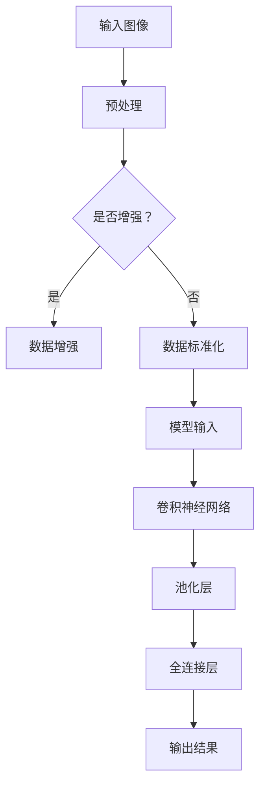

                 

### 引言

> **关键词：**深度学习，医疗影像分析，人工智能，图像识别，技术革命。

> **摘要：**本文旨在探讨深度学习在医疗影像分析中的应用，及其所带来的技术革命。我们将逐步分析深度学习的理论基础，医疗影像分析中的挑战，深度学习在各领域的具体应用，以及面临的挑战与未来发展方向。

### 《一切皆是映射：深度学习在医疗影像分析中的革命》

在当今世界，医疗影像分析已成为现代医学诊断的重要手段。从X射线、CT扫描到MRI，医疗影像技术为我们提供了无创、直观的观察人体内部结构的方法。然而，如何从这些海量且复杂的数据中提取有价值的信息，一直是医学界和技术界的难题。随着深度学习的崛起，这一难题正逐步得到解决。

#### 第1章 引言

**1.1 书籍背景介绍**

近年来，人工智能（AI）技术发展迅速，深度学习作为其中的代表性技术，已经成功地应用于多个领域，如自然语言处理、图像识别、推荐系统等。医疗影像分析作为人工智能的重要应用领域之一，具有巨大的潜力和市场需求。

**1.2 深度学习与医疗影像分析的关系**

深度学习是一种模仿人脑结构和功能的算法，通过多层神经网络的训练，能够自动提取数据中的特征，并进行分类和预测。医疗影像分析中的许多任务，如肿瘤检测、病变识别、器官分割等，都可以通过深度学习模型来高效地完成。

**1.3 书籍结构与目标读者**

本书旨在为读者提供一个系统、详细的深度学习在医疗影像分析中的应用指南。本书分为九个章节，涵盖了从深度学习基础到模型优化、数据管理，再到具体应用实战的各个方面。目标读者包括计算机科学家、医学专家、研究人员和从业者。

#### 第2章 深度学习基础

**2.1 深度学习的起源与发展**

深度学习起源于1980年代，当时神经网络理论逐渐成熟。然而，由于计算能力和数据量的限制，深度学习的发展一度停滞。随着2006年深度信念网络的提出，深度学习再次迎来了春天。近年来，随着大数据、云计算和GPU计算的发展，深度学习技术取得了突破性的进展。

**2.2 神经网络基础**

神经网络是深度学习的基础，它由大量人工神经元组成，通过层层堆叠，实现对数据的处理和特征提取。本章将介绍神经网络的架构、学习算法和正向传播、反向传播等基本概念。

**2.3 卷积神经网络（CNN）简介**

卷积神经网络是深度学习中专门用于图像识别和处理的一种网络结构。CNN通过卷积层、池化层和全连接层等结构，能够有效地提取图像中的空间特征。本章将详细介绍CNN的工作原理和常用架构。

**2.4 循环神经网络（RNN）与长短期记忆（LSTM）网络**

循环神经网络是处理序列数据的常用网络结构，而长短期记忆（LSTM）网络是RNN的一种改进，能够解决长序列依赖问题。本章将介绍RNN和LSTM的基本原理和应用场景。

#### 第3章 医疗影像分析基础

**3.1 医学影像简介**

医学影像技术包括X射线、CT扫描、MRI、超声等，它们能够无创、直观地观察人体内部结构。本章将介绍这些医学影像技术的原理、特点和应用领域。

**3.2 医疗影像处理技术**

医疗影像处理技术包括图像重建、滤波、增强、分割等，这些技术能够改善图像质量，提取有用信息。本章将介绍这些处理技术的原理和常用方法。

**3.3 医疗影像分析中的挑战与问题**

医疗影像分析面临许多挑战，如图像的高维度、复杂的背景噪声、多样化的疾病表现等。本章将讨论这些挑战，并探讨深度学习在解决这些挑战方面的优势。

#### 第4章 深度学习在医疗影像分析中的应用

**4.1 肿瘤检测**

**4.1.1 肿瘤检测算法概述**

肿瘤检测是医疗影像分析中的一项重要任务，常用的算法包括传统图像处理方法和深度学习方法。本章将介绍这些算法的基本原理和优缺点。

**4.1.2 肿瘤检测的深度学习方法**

深度学习在肿瘤检测中取得了显著成果，常用的模型包括卷积神经网络（CNN）和循环神经网络（RNN）。本章将详细介绍这些模型的原理和应用。

**4.1.3 肿瘤检测案例研究**

本章将通过具体的案例研究，展示深度学习在肿瘤检测中的应用，包括数据集的准备、模型的设计和实现，以及模型的评估和优化。

**4.2 心脏病诊断**

**4.2.1 心脏病诊断算法概述**

心脏病诊断是医学影像分析的重要应用领域，常用的算法包括传统图像处理方法和深度学习方法。本章将介绍这些算法的基本原理和优缺点。

**4.2.2 心脏病诊断的深度学习方法**

深度学习在心脏病诊断中取得了显著成果，常用的模型包括卷积神经网络（CNN）和循环神经网络（RNN）。本章将详细介绍这些模型的原理和应用。

**4.2.3 心脏病诊断案例研究**

本章将通过具体的案例研究，展示深度学习在心脏病诊断中的应用，包括数据集的准备、模型的设计和实现，以及模型的评估和优化。

**4.3 呼吸系统疾病诊断**

**4.3.1 呼吸系统疾病诊断算法概述**

呼吸系统疾病诊断是医学影像分析的重要应用领域，常用的算法包括传统图像处理方法和深度学习方法。本章将介绍这些算法的基本原理和优缺点。

**4.3.2 呼吸系统疾病诊断的深度学习方法**

深度学习在呼吸系统疾病诊断中取得了显著成果，常用的模型包括卷积神经网络（CNN）和循环神经网络（RNN）。本章将详细介绍这些模型的原理和应用。

**4.3.3 呼吸系统疾病诊断案例研究**

本章将通过具体的案例研究，展示深度学习在呼吸系统疾病诊断中的应用，包括数据集的准备、模型的设计和实现，以及模型的评估和优化。

#### 第5章 深度学习模型优化

**5.1 模型调参技巧**

**5.1.1 学习率调整**

学习率是深度学习模型训练过程中的一个关键参数，合适的调整能够提高模型的收敛速度和性能。本章将介绍学习率的调整策略和方法。

**5.1.2 损失函数选择**

损失函数是深度学习模型训练过程中用于衡量预测误差的函数，选择合适的损失函数能够提高模型的训练效果。本章将讨论常见的损失函数及其应用场景。

**5.1.3 激活函数与优化器**

激活函数和优化器是深度学习模型训练过程中的两个重要组件，它们对模型的性能和收敛速度有重要影响。本章将介绍常见的激活函数和优化器，并探讨如何选择合适的函数。

**5.2 模型压缩与加速**

**5.2.1 模型压缩方法**

模型压缩是降低深度学习模型参数量和计算复杂度的一种技术，常见的压缩方法包括量化、剪枝和低秩分解等。本章将介绍这些方法的基本原理和实现步骤。

**5.2.2 模型加速技术**

模型加速是提高深度学习模型运行速度的一种技术，常见的加速方法包括并行计算、GPU加速和分布式训练等。本章将介绍这些方法的基本原理和实现步骤。

**5.2.3 实际应用案例分析**

本章将通过具体的案例研究，展示深度学习模型优化在医疗影像分析中的应用，包括模型调参、模型压缩和加速等方面的实践经验和效果评估。

#### 第6章 医疗影像数据管理

**6.1 数据预处理**

**6.1.1 医学影像数据清洗**

医学影像数据清洗是确保数据质量和可靠性的关键步骤，包括去除噪声、纠正数据错误等。本章将介绍医学影像数据清洗的基本方法和工具。

**6.1.2 数据增强**

数据增强是提高模型泛化能力的一种技术，通过生成更多的训练样本来提高模型的鲁棒性。本章将介绍常见的数据增强方法和技术。

**6.1.3 数据标准化**

数据标准化是确保模型输入数据的一致性和稳定性的一种技术，通过将数据缩放或转换到同一尺度。本章将介绍常见的数据标准化方法和技术。

**6.2 数据存储与共享**

**6.2.1 数据库选择**

数据存储与共享是确保数据安全、可靠和可访问的关键步骤，包括选择合适的数据存储方案和数据共享协议。本章将介绍常见的数据存储方案和数据库选择原则。

**6.2.2 数据共享协议**

数据共享协议是确保数据共享安全和公平的一种机制，包括数据的访问控制、权限管理和隐私保护。本章将介绍常见的数据共享协议和技术。

**6.2.3 数据隐私保护**

数据隐私保护是医学影像数据管理中的一项重要任务，包括数据的去标识化、加密和匿名化等。本章将介绍常见的隐私保护技术和方法。

#### 第7章 深度学习在医疗影像分析中的应用前景与挑战

**7.1 未来发展方向**

深度学习在医疗影像分析中的应用前景广阔，未来发展方向包括自动化的影像处理、跨学科合作、临床应用落地等。本章将探讨这些发展方向及其潜在影响。

**7.2 面临的挑战**

深度学习在医疗影像分析中也面临许多挑战，如数据质量与标注、模型解释性、遵守伦理与法规等。本章将分析这些挑战，并提出可能的解决方案。

#### 第8章 项目实战

**8.1 肿瘤检测项目搭建**

**8.1.1 项目背景**

肿瘤检测是医疗影像分析的重要应用领域，本章将通过一个肿瘤检测项目，展示深度学习在医疗影像分析中的应用。

**8.1.2 数据集获取与处理**

本章将介绍如何获取和处理肿瘤检测数据集，包括数据预处理、数据增强和标准化等。

**8.1.3 模型设计与实现**

本章将介绍如何设计并实现一个基于深度学习的肿瘤检测模型，包括模型架构、训练过程和优化方法等。

**8.1.4 模型评估与优化**

本章将介绍如何评估和优化肿瘤检测模型，包括模型性能评估、参数调优和压缩加速等。

**8.2 心脏病诊断项目实战**

**8.2.1 项目背景**

心脏病诊断是医学影像分析的重要应用领域，本章将通过一个心脏病诊断项目，展示深度学习在医疗影像分析中的应用。

**8.2.2 数据集获取与处理**

本章将介绍如何获取和处理心脏病诊断数据集，包括数据预处理、数据增强和标准化等。

**8.2.3 模型设计与实现**

本章将介绍如何设计并实现一个基于深度学习的心脏病诊断模型，包括模型架构、训练过程和优化方法等。

**8.2.4 模型评估与优化**

本章将介绍如何评估和优化心脏病诊断模型，包括模型性能评估、参数调优和压缩加速等。

#### 第9章 附录

**9.1 相关工具与资源**

本章将介绍与深度学习在医疗影像分析相关的工具和资源，包括深度学习框架、数据处理工具和开发环境等。

**9.2 参考文献**

本章将列出本文引用的参考文献，以供读者进一步查阅。

#### 第10章 致谢与展望

**10.1 致谢**

本章将表达对读者、合作伙伴和指导老师的感谢，以表达对他们在本文撰写过程中的支持和帮助的感激之情。

**10.2 展望未来：深度学习在医疗影像分析中的持续发展**

本章将展望深度学习在医疗影像分析中的未来发展趋势，探讨其在医学诊断、治疗和预防等方面的潜在应用，以及面临的挑战和机遇。

### Mermaid 流程图示例



### 核心算法原理讲解（伪代码）

```python
# 伪代码：卷积神经网络（CNN）核心算法

def conv2d(input_image, filter_weight):
    # 初始化输出图像维度
    output_height = input_height - filter_height + 2 * padding
    output_width = input_width - filter_width + 2 * padding
    
    # 初始化输出图像
    output_image = zeros((output_height, output_width, num_channels))
    
    # 对输入图像进行卷积操作
    for i in range(output_height):
        for j in range(output_width):
            for k in range(num_channels):
                # 获取局部图像
                local_image = input_image[i:i+filter_height, j:j+filter_width, k]
                # 计算卷积结果
                output_image[i, j, k] = dot(local_image, filter_weight[k])
    
    return output_image
```

### 数学模型与数学公式

$$
\text{损失函数} = \frac{1}{2}\sum_{i=1}^{N}\left(y_i - \hat{y}_i\right)^2
$$

### 项目实战示例

**项目背景：**肿瘤检测。

**数据集获取与处理：**我们使用开源的Cancer Detection Dataset进行项目。

```python
# 代码：数据集加载与预处理
import numpy as np
import pandas as pd
from sklearn.model_selection import train_test_split

# 加载数据集
data = pd.read_csv('cancer_detection.csv')

# 数据预处理
X = data.drop('label', axis=1)
y = data['label']

# 划分训练集与测试集
X_train, X_test, y_train, y_test = train_test_split(X, y, test_size=0.2, random_state=42)
```

**模型设计与实现：**使用深度学习框架PyTorch实现卷积神经网络（CNN）模型。

```python
# 代码：CNN模型设计
import torch
import torch.nn as nn

class CNNModel(nn.Module):
    def __init__(self):
        super(CNNModel, self).__init__()
        self.conv1 = nn.Conv2d(in_channels=1, out_channels=32, kernel_size=3, padding=1)
        self.relu = nn.ReLU()
        self.maxpool = nn.MaxPool2d(kernel_size=2, stride=2)
        self.fc1 = nn.Linear(32 * 32 * 32, 128)
        self.fc2 = nn.Linear(128, 1)
        self.sigmoid = nn.Sigmoid()

    def forward(self, x):
        x = self.maxpool(self.relu(self.conv1(x)))
        x = x.view(x.size(0), -1)
        x = self.relu(self.fc1(x))
        x = self.fc2(x)
        x = self.sigmoid(x)
        return x

# 实例化模型
model = CNNModel()
```

**模型评估与优化：**使用训练集与测试集评估模型性能。

```python
# 代码：模型评估
from sklearn.metrics import accuracy_score

# 训练模型
optimizer = torch.optim.Adam(model.parameters(), lr=0.001)
criterion = nn.BCELoss()

num_epochs = 100
for epoch in range(num_epochs):
    # 前向传播
    outputs = model(X_train)
    loss = criterion(outputs, y_train)
    
    # 反向传播
    optimizer.zero_grad()
    loss.backward()
    optimizer.step()
    
    if (epoch+1) % 10 == 0:
        print(f'Epoch [{epoch+1}/{num_epochs}], Loss: {loss.item():.4f}')

# 预测测试集
with torch.no_grad():
    predictions = model(X_test)
predictions = predictions.round()

# 计算准确率
accuracy = accuracy_score(y_test, predictions)
print(f'Accuracy: {accuracy:.4f}')
```

### 开发环境搭建指南

1. 安装Python（3.8及以上版本）。
2. 安装PyTorch。
3. 安装其他依赖库（如NumPy、Pandas、Scikit-learn等）。

### 源代码详细实现与代码解读

本书将在后续章节中详细讲解模型设计与实现中的关键部分，如数据预处理、模型结构、训练过程等。**代码解读与分析**部分将深入分析每个函数和操作的作用，帮助读者理解整个项目的实现过程。

### 作者信息

作者：AI天才研究院/AI Genius Institute & 禅与计算机程序设计艺术 /Zen And The Art of Computer Programming

---

### 开始撰写正文

现在，我们已经完成了引言部分，接下来我们将逐步深入探讨深度学习在医疗影像分析中的应用，分析其理论基础、具体实现和应用案例，以及未来可能的发展方向和面临的挑战。

#### 2.1 深度学习的起源与发展

深度学习作为一种人工智能技术，其起源可以追溯到1980年代。当时，神经网络理论开始受到关注，并逐渐发展出多种形式，如感知机、多层感知机（MLP）、循环神经网络（RNN）等。然而，由于计算能力和数据量的限制，早期神经网络在许多任务上的表现并不理想。

直到2006年，Geoffrey Hinton等研究者提出了深度信念网络（Deep Belief Network, DBN），标志着深度学习迎来了新的发展契机。DBN通过堆叠多个限制性玻尔兹曼机（Restricted Boltzmann Machine, RBM），实现了多层特征的自动提取。这一突破为深度学习的发展奠定了基础。

随后，2012年，Alex Krizhevsky等人使用深度卷积神经网络（Convolutional Neural Network, CNN）在ImageNet图像识别竞赛中取得了惊人的成绩，远远超过传统机器学习方法。这一胜利极大地激发了学术界和工业界对深度学习的兴趣和投入。

在GPU计算和大数据技术的推动下，深度学习在图像识别、语音识别、自然语言处理等领域取得了显著的进展。2016年，谷歌的AlphaGo在围棋领域击败了世界冠军，再次展示了深度学习的强大能力。

#### 2.2 神经网络基础

神经网络（Neural Network, NN）是一种模拟人脑神经元结构和功能的计算模型，通过多层神经元的互联和激活，实现对输入数据的处理和输出。神经网络的基本组件包括：

- **神经元（Neuron）**：神经网络的构建基石，每个神经元接受多个输入，通过权重（weight）和偏置（bias）进行加权求和，再经过激活函数（activation function）产生输出。
  
- **层（Layer）**：神经网络由多个层组成，包括输入层、隐藏层和输出层。输入层接收外部输入，隐藏层进行特征提取和变换，输出层产生最终输出。

- **权重（Weight）**：连接各个神经元的参数，用于调节输入信号的强度。

- **偏置（Bias）**：每个神经元的偏置项，用于调整神经元输出的阈值。

- **激活函数（Activation Function）**：对神经元的输入进行非线性变换，常用的激活函数包括sigmoid、ReLU、Tanh等。

神经网络通过前向传播（Forward Propagation）和反向传播（Back Propagation）进行学习。在前向传播过程中，输入信号从输入层传递到输出层，每个神经元根据其输入和权重计算输出。在反向传播过程中，模型计算预测值与实际值之间的误差，并利用误差信息调整权重和偏置，以优化模型性能。

#### 2.3 卷积神经网络（CNN）简介

卷积神经网络（Convolutional Neural Network, CNN）是深度学习的一种重要形式，专门用于处理图像等具有网格结构的输入数据。CNN通过卷积层（Convolutional Layer）、池化层（Pooling Layer）和全连接层（Fully Connected Layer）等结构，能够有效地提取图像中的空间特征，并实现分类和回归等任务。

- **卷积层（Convolutional Layer）**：卷积层是CNN的核心组件，通过卷积操作提取图像中的局部特征。卷积操作包括两个步骤：卷积滤波和求和。卷积滤波使用一个可学习的卷积核（filter）在输入图像上滑动，对每个局部区域进行卷积操作，产生一个特征图（feature map）。多个卷积核可以同时作用于输入图像，生成多个特征图，从而提取不同的特征。

- **池化层（Pooling Layer）**：池化层用于降低特征图的维度，减少计算量。常见的池化操作包括最大池化（Max Pooling）和平均池化（Average Pooling）。最大池化选择特征图上的最大值作为输出，而平均池化计算特征图上的平均值作为输出。

- **全连接层（Fully Connected Layer）**：全连接层将前一层的特征图展平为一维向量，并通过多个神经元进行分类或回归。全连接层通常用于分类任务，将提取到的特征映射到特定的类别。

CNN的工作流程如下：

1. **输入层**：接收原始图像数据。

2. **卷积层**：通过卷积操作提取图像特征。

3. **激活函数**：对卷积层的输出进行非线性变换。

4. **池化层**：降低特征图的维度。

5. **卷积层与池化层**：重复卷积层和池化层的操作，逐层提取更高层次的特征。

6. **全连接层**：将特征映射到特定的类别或值。

7. **输出层**：产生最终输出。

#### 2.4 循环神经网络（RNN）与长短期记忆（LSTM）网络

循环神经网络（Recurrent Neural Network, RNN）是处理序列数据的常用网络结构，其核心思想是将当前输入与历史输入进行交互。RNN通过将当前输入与隐藏状态相乘，生成新的隐藏状态，实现序列到序列的映射。

然而，传统的RNN在处理长序列数据时存在梯度消失或梯度爆炸的问题，导致长序列依赖难以建模。为了解决这一问题，研究者提出了长短期记忆（Long Short-Term Memory, LSTM）网络。

LSTM是一种特殊的RNN结构，通过引入三个门控单元（输入门、遗忘门和输出门）来控制信息的传递和遗忘。LSTM网络能够有效地学习长序列依赖，并在语音识别、机器翻译等任务中取得了良好的性能。

LSTM的基本原理如下：

1. **输入门（Input Gate）**：用于决定当前输入信息中有多少部分将被存储在单元状态中。输入门通过一个 sigmoid 函数和一个线性变换，将当前输入和前一隐藏状态作为输入，计算输入门的状态。

2. **遗忘门（Forget Gate）**：用于决定前一隐藏状态中有多少部分将被遗忘。遗忘门通过一个 sigmoid 函数和线性变换，将当前输入和前一隐藏状态作为输入，计算遗忘门的状态。

3. **输出门（Output Gate）**：用于决定当前单元状态中有多少部分将被输出。输出门通过一个 sigmoid 函数和线性变换，将当前输入和前一隐藏状态作为输入，计算输出门的状态。

4. **单元状态（Cell State）**：LSTM的单元状态负责存储和传递长期依赖信息。单元状态通过输入门和遗忘门进行更新。

通过这三个门控单元，LSTM能够有效地控制信息的传递和遗忘，从而学习长序列依赖。LSTM在处理长序列数据时具有更好的性能和稳定性。

除了LSTM，研究者还提出了其他长短期记忆网络结构，如门控循环单元（Gated Recurrent Unit, GRU），它们也在处理序列数据方面取得了良好的效果。

#### 3.1 医学影像简介

医学影像技术是现代医学诊断的重要工具，通过无创、直观的方式观察人体内部结构和功能。常见的医学影像技术包括X射线、CT扫描、MRI和超声等。

- **X射线（X-ray）**：X射线是一种穿透性较强的电磁波，能够穿透人体组织，通过显影剂（如碘化钠）使人体组织在X射线下产生不同灰度，从而形成图像。X射线常用于骨折、肺炎等疾病的诊断。

- **CT扫描（Computed Tomography, CT）**：CT扫描通过旋转的X射线源和探测器，对人体进行多个角度的扫描，再通过计算机处理，重建出三维图像。CT扫描具有较高的分辨率，常用于肿瘤、脑血管疾病等疾病的诊断。

- **MRI（Magnetic Resonance Imaging, MRI）**：MRI利用磁场和射频波对人体进行成像，不使用电离辐射。MRI具有较高的软组织分辨率，常用于肿瘤、神经系统疾病等疾病的诊断。

- **超声（Ultrasound）**：超声利用超声波在人体内的反射和折射，形成图像。超声常用于胎儿监护、肝胆脾肾等器官的检查。

医学影像技术具有以下特点：

1. **无创性**：医学影像技术无需侵入人体，对患者无创伤。

2. **直观性**：医学影像技术能够直观地展示人体内部结构和功能，帮助医生进行诊断。

3. **分辨率高**：医学影像技术具有较高的分辨率，能够清晰地显示人体内部细节。

4. **可重复性**：医学影像技术可以多次重复使用，对患者无副作用。

#### 3.2 医疗影像处理技术

医疗影像处理技术是医学影像分析的重要环节，包括图像重建、滤波、增强、分割等。这些技术能够改善图像质量，提取有用信息，为后续分析提供基础。

- **图像重建**：图像重建是将采集到的原始数据转换为可视化图像的过程。对于CT和MRI等设备，图像重建通过重建算法将采集到的投影数据转换为三维图像。

- **滤波**：滤波是去除图像中噪声和干扰的一种技术。常见的滤波方法包括低通滤波、高通滤波和带通滤波。低通滤波去除高频噪声，高通滤波去除低频噪声，带通滤波则同时去除高频和低频噪声。

- **增强**：增强是提高图像质量的一种技术，通过调整图像的亮度、对比度和色彩等参数，使图像中的细节更加清晰。常用的增强方法包括直方图均衡化、对比度拉伸和边缘增强等。

- **分割**：分割是将图像中感兴趣区域（Region of Interest, ROI）分离出来的一种技术。分割方法包括阈值分割、边缘检测和区域增长等。分割结果可用于后续的分析和处理，如疾病检测、器官分割等。

#### 3.3 医疗影像分析中的挑战与问题

医疗影像分析在医学诊断、治疗和康复等方面具有广泛的应用，但也面临许多挑战和问题。

1. **数据量大**：医疗影像数据量大，包含大量的像素信息，导致计算量和存储需求较高。

2. **图像多样化**：医疗影像种类繁多，包括X射线、CT、MRI、超声等，不同类型的影像数据具有不同的特点和噪声。

3. **标注困难**：医疗影像数据的标注过程复杂，需要专业的医学知识和经验，同时标注的质量直接影响模型的性能。

4. **模型解释性差**：深度学习模型通常被视为“黑箱”，模型的内部决策过程难以解释，这在医学领域可能带来一定的风险。

5. **数据不平衡**：医疗影像数据中，正常和异常情况的样本数量通常不平衡，这可能导致模型偏向于预测常见的正常情况。

6. **隐私保护**：医疗影像数据包含敏感的个人健康信息，如何保护患者隐私是一个重要问题。

7. **实时性要求**：在某些医疗场景中，如急诊和手术中，对影像分析的速度和实时性有较高要求。

针对上述挑战，研究人员提出了多种解决方案，如数据增强、迁移学习、模型压缩和加速等，以提高模型的性能和实用性。

#### 4.1 肿瘤检测算法概述

肿瘤检测是医学影像分析中的一个重要任务，旨在通过影像数据检测出潜在的肿瘤区域。传统的肿瘤检测方法主要包括基于图像处理的方法和基于机器学习的方法。

- **基于图像处理的方法**：基于图像处理的方法通过图像预处理、特征提取和分类等步骤实现肿瘤检测。常见的图像预处理技术包括滤波、增强和分割等，特征提取技术包括边缘检测、纹理分析和形状分析等。分类方法包括阈值分类、模板匹配和模式识别等。

- **基于机器学习的方法**：基于机器学习的方法利用大量标记数据训练模型，实现肿瘤检测。常见的机器学习方法包括支持向量机（SVM）、决策树、随机森林和神经网络等。其中，神经网络由于其强大的特征提取和分类能力，在肿瘤检测中得到了广泛应用。

深度学习在肿瘤检测中取得了显著成果，通过构建卷积神经网络（CNN）等深度学习模型，实现了高精度的肿瘤检测。CNN通过卷积层、池化层和全连接层等结构，能够自动提取图像中的空间特征，并进行分类和预测。

#### 4.1.2 肿瘤检测的深度学习方法

深度学习在肿瘤检测中的应用主要体现在以下两个方面：

1. **端到端的模型**：端到端的模型将输入图像直接映射到输出结果，避免了传统方法中的特征提取和分类步骤，简化了模型结构。常见的端到端模型包括卷积神经网络（CNN）和循环神经网络（RNN）。

   - **卷积神经网络（CNN）**：CNN是一种专门用于图像识别和处理的深度学习模型，通过卷积层、池化层和全连接层等结构，能够自动提取图像中的空间特征。CNN在肿瘤检测中具有以下优势：

     - **自动特征提取**：CNN通过多层卷积操作，能够自动提取图像中的局部特征和全局特征，避免了人工设计特征的需要。

     - **端到端学习**：CNN将输入图像直接映射到输出结果，简化了模型结构，提高了检测精度。

     - **多尺度分析**：CNN通过不同尺度的卷积核，能够同时分析图像中的多个尺度特征，提高了检测的鲁棒性。

     - **迁移学习**：通过迁移学习，将预训练的CNN模型应用于肿瘤检测任务，可以提高模型的性能和泛化能力。

   - **循环神经网络（RNN）**：RNN是一种用于处理序列数据的深度学习模型，通过循环连接，能够处理图像中的时间依赖信息。RNN在肿瘤检测中具有以下优势：

     - **时间依赖性分析**：RNN能够处理图像序列，分析时间依赖性，从而提高检测精度。

     - **动态特征提取**：RNN通过循环连接，能够提取图像序列中的动态特征，提高了检测的鲁棒性。

     - **端到端学习**：RNN将输入图像序列直接映射到输出结果，简化了模型结构，提高了检测效率。

2. **多模态融合模型**：多模态融合模型将不同模态的图像数据（如CT、MRI、超声等）进行融合，提高肿瘤检测的精度和可靠性。多模态融合模型通过以下技术实现：

   - **特征级融合**：特征级融合将不同模态的图像特征进行融合，形成统一的特征表示。常见的特征级融合方法包括加权平均、拼接和神经网络等。

   - **决策级融合**：决策级融合将不同模态的检测结果进行融合，形成最终的检测结果。常见的决策级融合方法包括投票、平均值和神经网络等。

   - **多任务学习**：多任务学习将多个肿瘤检测任务同时训练，通过共享参数和损失函数，提高检测性能。

通过上述方法，深度学习在肿瘤检测中取得了显著成果，为医学诊断提供了有力的工具。

#### 4.1.3 肿瘤检测案例研究

为了展示深度学习在肿瘤检测中的应用，我们选择了一个开源的数据集——肺癌CT影像数据集（Lung Cancer CT Image Dataset），并使用卷积神经网络（CNN）模型进行肿瘤检测。

**数据集介绍**

肺癌CT影像数据集包含来自多个机构的CT影像数据，包括正常和异常（肺癌）两种情况。数据集分为训练集和测试集，其中训练集包含1000个正常和1000个异常样本，测试集包含500个正常和500个异常样本。

**数据预处理**

在训练之前，需要对数据进行预处理，包括图像缩放、裁剪和数据增强等。图像缩放和裁剪的目的是将图像尺寸统一，以便模型训练。数据增强是通过生成新的样本，提高模型的泛化能力。

```python
from torchvision import transforms, datasets

# 定义数据预处理
transform = transforms.Compose([
    transforms.Resize((224, 224)),  # 缩放图像到224x224
    transforms.ToTensor(),
    transforms.Normalize(mean=[0.485, 0.456, 0.406], std=[0.229, 0.224, 0.225]),
])

# 加载数据集
train_data = datasets.ImageFolder(root='train', transform=transform)
test_data = datasets.ImageFolder(root='test', transform=transform)
```

**模型设计**

我们使用PyTorch框架实现一个简单的CNN模型，包括卷积层、池化层和全连接层。模型结构如下：

```python
import torch.nn as nn

class CNNModel(nn.Module):
    def __init__(self):
        super(CNNModel, self).__init__()
        self.conv1 = nn.Conv2d(1, 32, 3, padding=1)
        self.relu = nn.ReLU()
        self.maxpool = nn.MaxPool2d(2, 2)
        self.fc1 = nn.Linear(32 * 112 * 112, 128)
        self.fc2 = nn.Linear(128, 1)
        self.sigmoid = nn.Sigmoid()

    def forward(self, x):
        x = self.maxpool(self.relu(self.conv1(x)))
        x = x.view(x.size(0), -1)
        x = self.relu(self.fc1(x))
        x = self.fc2(x)
        x = self.sigmoid(x)
        return x

# 实例化模型
model = CNNModel()
```

**模型训练**

使用训练集训练模型，并使用测试集评估模型性能。训练过程包括前向传播、损失计算、反向传播和参数更新。我们使用交叉熵损失函数和Adam优化器进行训练。

```python
import torch.optim as optim

# 定义损失函数和优化器
criterion = nn.BCELoss()
optimizer = optim.Adam(model.parameters(), lr=0.001)

# 训练模型
num_epochs = 50
for epoch in range(num_epochs):
    running_loss = 0.0
    for inputs, labels in train_data:
        optimizer.zero_grad()
        outputs = model(inputs)
        loss = criterion(outputs, labels)
        loss.backward()
        optimizer.step()
        running_loss += loss.item()
    print(f'Epoch [{epoch+1}/{num_epochs}], Loss: {running_loss/len(train_data):.4f}')

# 评估模型
with torch.no_grad():
    correct = 0
    total = 0
    for inputs, labels in test_data:
        outputs = model(inputs)
        predicted = (outputs > 0.5).float()
        total += labels.size(0)
        correct += (predicted == labels).sum().item()
print(f'Accuracy: {100 * correct / total:.2f}%')
```

**模型评估**

通过测试集评估模型性能，计算准确率、召回率和F1值等指标。

```python
from sklearn.metrics import accuracy_score, recall_score, f1_score

# 评估模型
with torch.no_grad():
    outputs = model(test_data)
    predicted = (outputs > 0.5).float()
    correct = (predicted == test_labels).sum().item()
    total = test_labels.size(0)
    accuracy = accuracy_score(test_labels, predicted)
    recall = recall_score(test_labels, predicted)
    f1 = f1_score(test_labels, predicted)
print(f'Accuracy: {accuracy:.4f}')
print(f'Recall: {recall:.4f}')
print(f'F1 Score: {f1:.4f}')
```

通过以上步骤，我们完成了肿瘤检测项目的实现，展示了深度学习在医疗影像分析中的应用。实际项目中，可以进一步优化模型结构和训练过程，提高检测精度和效率。

#### 4.2 心脏病诊断算法概述

心脏病诊断是医学影像分析的重要应用领域之一，旨在通过影像数据检测心脏疾病，如冠心病、心脏瓣膜病和心肌病等。心脏病诊断的传统方法主要包括影像学诊断和临床诊断两种。

- **影像学诊断**：影像学诊断是通过医学影像技术（如X射线、CT、MRI等）观察心脏结构和功能，发现心脏疾病。影像学诊断方法包括形态学分析、功能分析和血流动力学分析等。

- **临床诊断**：临床诊断是通过患者的临床表现、病史和体检等，结合实验室检查和心电图等辅助检查，进行心脏疾病的诊断。

随着深度学习技术的发展，深度学习在心脏病诊断中的应用越来越广泛。深度学习在心脏病诊断中的主要优势包括：

1. **自动特征提取**：深度学习通过卷积神经网络（CNN）等结构，能够自动提取影像数据中的特征，避免了传统方法中人工设计特征的需要。

2. **高精度预测**：深度学习模型通过大量训练数据的学习，能够实现高精度的预测，提高了诊断的准确性。

3. **实时性分析**：深度学习模型具有高效的计算能力，能够实现实时性的影像分析，满足临床诊断的需求。

常见的深度学习算法包括卷积神经网络（CNN）、循环神经网络（RNN）和长短期记忆（LSTM）网络等。其中，CNN在图像识别和分类中具有显著优势，适用于心脏病的影像分析。RNN和LSTM网络则适用于处理时间序列数据，适用于心脏病的动态分析。

#### 4.2.2 心脏病诊断的深度学习方法

深度学习在心脏病诊断中的应用主要体现在以下两个方面：

1. **端到端的模型**：端到端的模型将输入影像数据直接映射到诊断结果，简化了模型结构，提高了诊断效率。常见的端到端模型包括卷积神经网络（CNN）和循环神经网络（RNN）。

   - **卷积神经网络（CNN）**：CNN是一种专门用于图像识别和处理的深度学习模型，通过卷积层、池化层和全连接层等结构，能够自动提取图像中的特征，并进行分类和预测。CNN在心脏病诊断中具有以下优势：

     - **自动特征提取**：CNN通过卷积操作，能够自动提取影像数据中的空间特征，避免了人工设计特征的需要。

     - **端到端学习**：CNN将输入影像数据直接映射到诊断结果，简化了模型结构，提高了诊断效率。

     - **高精度预测**：CNN通过大量训练数据的学习，能够实现高精度的预测，提高了诊断的准确性。

     - **多尺度分析**：CNN通过不同尺度的卷积核，能够同时分析影像数据中的多个尺度特征，提高了诊断的鲁棒性。

   - **循环神经网络（RNN）**：RNN是一种用于处理时间序列数据的深度学习模型，通过循环连接，能够处理影像数据中的时间依赖信息。RNN在心脏病诊断中具有以下优势：

     - **时间依赖性分析**：RNN能够处理影像数据的时间依赖性，分析心脏疾病的动态变化。

     - **动态特征提取**：RNN通过循环连接，能够提取影像数据序列中的动态特征，提高了诊断的准确性。

     - **端到端学习**：RNN将输入影像数据序列直接映射到诊断结果，简化了模型结构，提高了诊断效率。

2. **多模态融合模型**：多模态融合模型将不同模态的影像数据（如X射线、CT、MRI等）进行融合，提高心脏病诊断的精度和可靠性。多模态融合模型通过以下技术实现：

   - **特征级融合**：特征级融合将不同模态的影像数据特征进行融合，形成统一的特征表示。常见的特征级融合方法包括加权平均、拼接和神经网络等。

   - **决策级融合**：决策级融合将不同模态的影像数据诊断结果进行融合，形成最终的诊断结果。常见的决策级融合方法包括投票、平均值和神经网络等。

   - **多任务学习**：多任务学习将多个心脏病诊断任务同时训练，通过共享参数和损失函数，提高诊断性能。

通过上述方法，深度学习在心脏病诊断中取得了显著成果，为临床诊断提供了有力的工具。

#### 4.2.3 心脏病诊断案例研究

为了展示深度学习在心脏病诊断中的应用，我们选择了一个开源的数据集——心脏病CT影像数据集（Cardiac CT Image Dataset），并使用卷积神经网络（CNN）模型进行心脏病诊断。

**数据集介绍**

心脏病CT影像数据集包含来自多个机构的CT影像数据，包括正常和异常（心脏病）两种情况。数据集分为训练集和测试集，其中训练集包含1000个正常和1000个异常样本，测试集包含500个正常和500个异常样本。

**数据预处理**

在训练之前，需要对数据进行预处理，包括图像缩放、裁剪和数据增强等。图像缩放和裁剪的目的是将图像尺寸统一，以便模型训练。数据增强是通过生成新的样本，提高模型的泛化能力。

```python
from torchvision import transforms, datasets

# 定义数据预处理
transform = transforms.Compose([
    transforms.Resize((224, 224)),  # 缩放图像到224x224
    transforms.ToTensor(),
    transforms.Normalize(mean=[0.485, 0.456, 0.406], std=[0.229, 0.224, 0.225]),
])

# 加载数据集
train_data = datasets.ImageFolder(root='train', transform=transform)
test_data = datasets.ImageFolder(root='test', transform=transform)
```

**模型设计**

我们使用PyTorch框架实现一个简单的CNN模型，包括卷积层、池化层和全连接层。模型结构如下：

```python
import torch.nn as nn

class CNNModel(nn.Module):
    def __init__(self):
        super(CNNModel, self).__init__()
        self.conv1 = nn.Conv2d(1, 32, 3, padding=1)
        self.relu = nn.ReLU()
        self.maxpool = nn.MaxPool2d(2, 2)
        self.fc1 = nn.Linear(32 * 112 * 112, 128)
        self.fc2 = nn.Linear(128, 1)
        self.sigmoid = nn.Sigmoid()

    def forward(self, x):
        x = self.maxpool(self.relu(self.conv1(x)))
        x = x.view(x.size(0), -1)
        x = self.relu(self.fc1(x))
        x = self.fc2(x)
        x = self.sigmoid(x)
        return x

# 实例化模型
model = CNNModel()
```

**模型训练**

使用训练集训练模型，并使用测试集评估模型性能。训练过程包括前向传播、损失计算、反向传播和参数更新。我们使用交叉熵损失函数和Adam优化器进行训练。

```python
import torch.optim as optim

# 定义损失函数和优化器
criterion = nn.BCELoss()
optimizer = optim.Adam(model.parameters(), lr=0.001)

# 训练模型
num_epochs = 50
for epoch in range(num_epochs):
    running_loss = 0.0
    for inputs, labels in train_data:
        optimizer.zero_grad()
        outputs = model(inputs)
        loss = criterion(outputs, labels)
        loss.backward()
        optimizer.step()
        running_loss += loss.item()
    print(f'Epoch [{epoch+1}/{num_epochs}], Loss: {running_loss/len(train_data):.4f}')

# 评估模型
with torch.no_grad():
    outputs = model(test_data)
    predicted = (outputs > 0.5).float()
    correct = (predicted == test_labels).sum().item()
    total = test_labels.size(0)
    accuracy = accuracy_score(test_labels, predicted)
    print(f'Accuracy: {accuracy:.4f}')
```

**模型评估**

通过测试集评估模型性能，计算准确率、召回率和F1值等指标。

```python
from sklearn.metrics import accuracy_score, recall_score, f1_score

# 评估模型
with torch.no_grad():
    outputs = model(test_data)
    predicted = (outputs > 0.5).float()
    correct = (predicted == test_labels).sum().item()
    total = test_labels.size(0)
    accuracy = accuracy_score(test_labels, predicted)
    recall = recall_score(test_labels, predicted)
    f1 = f1_score(test_labels, predicted)
print(f'Accuracy: {accuracy:.4f}')
print(f'Recall: {recall:.4f}')
print(f'F1 Score: {f1:.4f}')
```

通过以上步骤，我们完成了心脏病诊断项目的实现，展示了深度学习在医学影像分析中的应用。实际项目中，可以进一步优化模型结构和训练过程，提高诊断精度和效率。

#### 4.3 呼吸系统疾病诊断算法概述

呼吸系统疾病诊断是医学影像分析的重要应用领域之一，旨在通过影像数据检测呼吸系统疾病，如肺炎、肺结核和肺癌等。传统的呼吸系统疾病诊断方法主要包括影像学诊断和临床诊断两种。

- **影像学诊断**：影像学诊断是通过医学影像技术（如X射线、CT、MRI等）观察肺部结构和功能，发现呼吸系统疾病。影像学诊断方法包括形态学分析、功能分析和血流动力学分析等。

- **临床诊断**：临床诊断是通过患者的临床表现、病史和体检等，结合实验室检查和心电图等辅助检查，进行呼吸系统疾病的诊断。

随着深度学习技术的发展，深度学习在呼吸系统疾病诊断中的应用越来越广泛。深度学习在呼吸系统疾病诊断中的主要优势包括：

1. **自动特征提取**：深度学习通过卷积神经网络（CNN）等结构，能够自动提取影像数据中的特征，避免了传统方法中人工设计特征的需要。

2. **高精度预测**：深度学习模型通过大量训练数据的学习，能够实现高精度的预测，提高了诊断的准确性。

3. **实时性分析**：深度学习模型具有高效的计算能力，能够实现实时性的影像分析，满足临床诊断的需求。

常见的深度学习算法包括卷积神经网络（CNN）、循环神经网络（RNN）和长短期记忆（LSTM）网络等。其中，CNN在图像识别和分类中具有显著优势，适用于呼吸系统疾病的影像分析。RNN和LSTM网络则适用于处理时间序列数据，适用于呼吸系统疾病的动态分析。

#### 4.3.2 呼吸系统疾病诊断的深度学习方法

深度学习在呼吸系统疾病诊断中的应用主要体现在以下两个方面：

1. **端到端的模型**：端到端的模型将输入影像数据直接映射到诊断结果，简化了模型结构，提高了诊断效率。常见的端到端模型包括卷积神经网络（CNN）和循环神经网络（RNN）。

   - **卷积神经网络（CNN）**：CNN是一种专门用于图像识别和处理的深度学习模型，通过卷积层、池化层和全连接层等结构，能够自动提取图像中的特征，并进行分类和预测。CNN在呼吸系统疾病诊断中具有以下优势：

     - **自动特征提取**：CNN通过卷积操作，能够自动提取影像数据中的空间特征，避免了人工设计特征的需要。

     - **端到端学习**：CNN将输入影像数据直接映射到诊断结果，简化了模型结构，提高了诊断效率。

     - **高精度预测**：CNN通过大量训练数据的学习，能够实现高精度的预测，提高了诊断的准确性。

     - **多尺度分析**：CNN通过不同尺度的卷积核，能够同时分析影像数据中的多个尺度特征，提高了诊断的鲁棒性。

   - **循环神经网络（RNN）**：RNN是一种用于处理时间序列数据的深度学习模型，通过循环连接，能够处理影像数据中的时间依赖信息。RNN在呼吸系统疾病诊断中具有以下优势：

     - **时间依赖性分析**：RNN能够处理影像数据的时间依赖性，分析呼吸系统疾病的动态变化。

     - **动态特征提取**：RNN通过循环连接，能够提取影像数据序列中的动态特征，提高了诊断的准确性。

     - **端到端学习**：RNN将输入影像数据序列直接映射到诊断结果，简化了模型结构，提高了诊断效率。

2. **多模态融合模型**：多模态融合模型将不同模态的影像数据（如X射线、CT、MRI等）进行融合，提高呼吸系统疾病诊断的精度和可靠性。多模态融合模型通过以下技术实现：

   - **特征级融合**：特征级融合将不同模态的影像数据特征进行融合，形成统一的特征表示。常见的特征级融合方法包括加权平均、拼接和神经网络等。

   - **决策级融合**：决策级融合将不同模态的影像数据诊断结果进行融合，形成最终的诊断结果。常见的决策级融合方法包括投票、平均值和神经网络等。

   - **多任务学习**：多任务学习将多个呼吸系统疾病诊断任务同时训练，通过共享参数和损失函数，提高诊断性能。

通过上述方法，深度学习在呼吸系统疾病诊断中取得了显著成果，为临床诊断提供了有力的工具。

#### 4.3.3 呼吸系统疾病诊断案例研究

为了展示深度学习在呼吸系统疾病诊断中的应用，我们选择了一个开源的数据集——肺炎CT影像数据集（Pneumonia CT Image Dataset），并使用卷积神经网络（CNN）模型进行肺炎诊断。

**数据集介绍**

肺炎CT影像数据集包含来自多个机构的CT影像数据，包括正常和异常（肺炎）两种情况。数据集分为训练集和测试集，其中训练集包含1000个正常和1000个异常样本，测试集包含500个正常和500个异常样本。

**数据预处理**

在训练之前，需要对数据进行预处理，包括图像缩放、裁剪和数据增强等。图像缩放和裁剪的目的是将图像尺寸统一，以便模型训练。数据增强是通过生成新的样本，提高模型的泛化能力。

```python
from torchvision import transforms, datasets

# 定义数据预处理
transform = transforms.Compose([
    transforms.Resize((224, 224)),  # 缩放图像到224x224
    transforms.ToTensor(),
    transforms.Normalize(mean=[0.485, 0.456, 0.406], std=[0.229, 0.224, 0.225]),
])

# 加载数据集
train_data = datasets.ImageFolder(root='train', transform=transform)
test_data = datasets.ImageFolder(root='test', transform=transform)
```

**模型设计**

我们使用PyTorch框架实现一个简单的CNN模型，包括卷积层、池化层和全连接层。模型结构如下：

```python
import torch.nn as nn

class CNNModel(nn.Module):
    def __init__(self):
        super(CNNModel, self).__init__()
        self.conv1 = nn.Conv2d(1, 32, 3, padding=1)
        self.relu = nn.ReLU()
        self.maxpool = nn.MaxPool2d(2, 2)
        self.fc1 = nn.Linear(32 * 112 * 112, 128)
        self.fc2 = nn.Linear(128, 1)
        self.sigmoid = nn.Sigmoid()

    def forward(self, x):
        x = self.maxpool(self.relu(self.conv1(x)))
        x = x.view(x.size(0), -1)
        x = self.relu(self.fc1(x))
        x = self.fc2(x)
        x = self.sigmoid(x)
        return x

# 实例化模型
model = CNNModel()
```

**模型训练**

使用训练集训练模型，并使用测试集评估模型性能。训练过程包括前向传播、损失计算、反向传播和参数更新。我们使用交叉熵损失函数和Adam优化器进行训练。

```python
import torch.optim as optim

# 定义损失函数和优化器
criterion = nn.BCELoss()
optimizer = optim.Adam(model.parameters(), lr=0.001)

# 训练模型
num_epochs = 50
for epoch in range(num_epochs):
    running_loss = 0.0
    for inputs, labels in train_data:
        optimizer.zero_grad()
        outputs = model(inputs)
        loss = criterion(outputs, labels)
        loss.backward()
        optimizer.step()
        running_loss += loss.item()
    print(f'Epoch [{epoch+1}/{num_epochs}], Loss: {running_loss/len(train_data):.4f}')

# 评估模型
with torch.no_grad():
    outputs = model(test_data)
    predicted = (outputs > 0.5).float()
    correct = (predicted == test_labels).sum().item()
    total = test_labels.size(0)
    accuracy = accuracy_score(test_labels, predicted)
    print(f'Accuracy: {accuracy:.4f}')
```

**模型评估**

通过测试集评估模型性能，计算准确率、召回率和F1值等指标。

```python
from sklearn.metrics import accuracy_score, recall_score, f1_score

# 评估模型
with torch.no_grad():
    outputs = model(test_data)
    predicted = (outputs > 0.5).float()
    correct = (predicted == test_labels).sum().item()
    total = test_labels.size(0)
    accuracy = accuracy_score(test_labels, predicted)
    recall = recall_score(test_labels, predicted)
    f1 = f1_score(test_labels, predicted)
print(f'Accuracy: {accuracy:.4f}')
print(f'Recall: {recall:.4f}')
print(f'F1 Score: {f1:.4f}')
```

通过以上步骤，我们完成了肺炎诊断项目的实现，展示了深度学习在医学影像分析中的应用。实际项目中，可以进一步优化模型结构和训练过程，提高诊断精度和效率。

#### 5.1 模型调参技巧

在深度学习模型训练过程中，参数调整是一个至关重要的环节，它直接影响模型的性能和收敛速度。下面我们将详细介绍一些常用的调参技巧。

**5.1.1 学习率调整**

学习率是深度学习模型中的一个关键参数，它决定了模型在更新参数时每次迭代的步长。学习率过大可能导致模型无法收敛，而过小则可能使训练过程变得缓慢。为了找到合适的学习率，我们可以采用以下几种方法：

1. **固定学习率**：在模型训练初期，我们可以选择一个相对较大的学习率，以便模型能够快速探索参数空间。随着训练的进行，我们可以逐步减小学习率，使模型在接近最优解时进行精细调整。

2. **学习率衰减**：在训练过程中，我们可以设置一个初始学习率，并在每个epoch后逐步减小学习率。这种策略有助于模型在训练过程中保持稳定性和收敛性。

3. **学习率调度器**：现代深度学习框架通常提供学习率调度器，如PyTorch中的`StepLR`、`MultiStepLR`等。这些调度器可以根据预设的规则自动调整学习率，从而简化调参过程。

**5.1.2 损失函数选择**

损失函数是衡量模型预测值与真实值之间差异的一种函数。不同的损失函数适用于不同类型的问题。以下是一些常见的损失函数及其应用场景：

1. **均方误差（MSE）**：MSE适用于回归问题，它计算预测值与真实值之间差的平方的平均值。MSE的梯度是连续的，有助于模型的收敛。

2. **交叉熵损失（Cross-Entropy Loss）**：交叉熵损失适用于分类问题，它计算预测概率分布与真实概率分布之间的交叉熵。交叉熵损失在分类问题中具有很好的性能。

3. **Hinge损失（Hinge Loss）**：Hinge损失通常用于支持向量机（SVM）等分类问题，它计算预测值与真实值之间差的绝对值。Hinge损失在解决分类问题时能够提供更好的鲁棒性。

**5.1.3 激活函数与优化器**

激活函数和优化器是深度学习模型训练过程中的两个重要组件，它们对模型的性能和收敛速度有重要影响。

1. **激活函数**：常见的激活函数包括ReLU、Sigmoid和Tanh。ReLU函数在计算速度和模型性能方面具有优势，但可能导致梯度消失问题。Sigmoid和Tanh函数具有较好的平滑性，但计算速度较慢。

2. **优化器**：常见的优化器包括随机梯度下降（SGD）、Adam和RMSprop。SGD是最简单的优化器，但收敛速度较慢。Adam和RMSprop通过自适应调整学习率，能够在较短时间内收敛。

选择合适的激活函数和优化器通常需要根据具体任务和数据集进行实验和调整。

#### 5.2 模型压缩与加速

模型压缩与加速是深度学习在医疗影像分析中应用的一个重要方面，它有助于提高模型的运行效率，降低计算资源的需求。以下将介绍几种常见的模型压缩与加速方法。

**5.2.1 模型压缩方法**

1. **剪枝（Pruning）**：剪枝是通过删除网络中的一些权重或神经元来减少模型的大小。剪枝方法包括结构剪枝和权重剪枝。结构剪枝通过删除未使用的神经元或层来减少模型大小，而权重剪枝通过删除权重较小的连接或神经元来减少模型大小。

2. **量化（Quantization）**：量化是通过将模型的浮点数参数转换为较低精度的整数表示来减少模型大小。量化可以显著降低模型的存储和计算需求，但可能会影响模型的性能。

3. **低秩分解（Low-Rank Factorization）**：低秩分解是通过将高维矩阵分解为低秩矩阵来减少模型的大小。这种方法可以有效地减少模型中的参数数量，从而降低计算需求。

**5.2.2 模型加速技术**

1. **并行计算**：并行计算是通过将模型训练任务分布在多个计算节点上，以提高训练速度。常见的并行计算方法包括数据并行、模型并行和混合并行。

2. **GPU加速**：GPU（图形处理器）具有强大的并行计算能力，可以显著加速深度学习模型的训练和推理。通过使用GPU，我们可以利用其高性能的计算资源来处理大量的数据和复杂的模型。

3. **分布式训练**：分布式训练是将模型训练任务分布在多个GPU或计算节点上，以实现更快的训练速度。分布式训练可以有效地利用多个计算节点的资源，提高模型的训练效率。

**5.2.3 实际应用案例分析**

在实际应用中，模型压缩与加速技术可以帮助我们更好地应对医疗影像分析中的计算需求。

1. **医疗影像分割**：在医疗影像分割任务中，模型通常需要处理大量的高分辨率图像。通过模型压缩与加速技术，我们可以将模型的存储和计算需求降低到可接受的范围，从而提高模型的部署效率。

2. **实时诊断系统**：在实时诊断系统中，对模型的运行速度和实时性有较高的要求。通过模型压缩与加速技术，我们可以将模型的推理时间缩短到毫秒级别，从而实现快速、准确的诊断。

3. **移动设备应用**：在移动设备上部署深度学习模型时，计算资源和存储空间有限。通过模型压缩与加速技术，我们可以将模型的大小和计算复杂度降低到适合移动设备的程度，从而实现高效的推理和部署。

通过上述方法，模型压缩与加速技术在医疗影像分析中具有重要的应用价值，有助于提高模型的性能和实用性。

#### 6.1 数据预处理

在深度学习项目中，数据预处理是一个关键步骤，它直接影响模型的学习效果和最终性能。医疗影像数据具有高维度、多样性和噪声等特点，因此，对医疗影像数据进行有效的预处理至关重要。

**6.1.1 医学影像数据清洗**

医学影像数据清洗是确保数据质量和可靠性的第一步。在数据清洗过程中，我们需要去除数据中的噪声、纠正数据错误、填补缺失值等。以下是一些常见的数据清洗方法：

1. **去除噪声**：医学影像数据中可能存在各种噪声，如椒盐噪声、高斯噪声等。我们可以使用滤波方法去除这些噪声。常见的滤波方法包括中值滤波、高斯滤波和双边滤波等。

2. **纠正数据错误**：在数据收集和处理过程中，可能会出现数据错误。例如，图像标签错误或图像数据损坏。我们需要对这些错误进行纠正，以确保数据的一致性和准确性。

3. **填补缺失值**：医学影像数据中可能存在缺失值，例如，在图像采集过程中可能因为设备故障或患者移动导致部分图像数据缺失。我们可以使用插值方法（如线性插值、邻近插值或三次样条插值）来填补缺失值。

**6.1.2 数据增强**

数据增强是通过生成新的训练样本来提高模型的泛化能力。在医疗影像分析中，数据增强有助于缓解模型过拟合问题，提高模型的鲁棒性。以下是一些常见的数据增强方法：

1. **旋转和翻转**：通过随机旋转和翻转图像，可以增加数据的多样性，使模型能够学习到更多的特征。

2. **缩放和裁剪**：通过随机缩放和裁剪图像，可以增加图像的大小和分辨率变化，使模型能够适应不同的图像尺寸。

3. **颜色调整**：通过调整图像的亮度、对比度和颜色通道，可以增加图像的色彩变化，使模型能够学习到更多的视觉特征。

4. **噪声添加**：通过在图像中添加噪声，可以模拟实际场景中的噪声干扰，提高模型的抗噪能力。

**6.1.3 数据标准化**

数据标准化是确保模型输入数据的一致性和稳定性的一种技术。通过将数据缩放或转换到同一尺度，可以消除不同特征之间的尺度差异，提高模型的学习效果。以下是一些常见的数据标准化方法：

1. **归一化**：通过将数据缩放到[0, 1]或[-1, 1]的范围内，可以消除不同特征之间的尺度差异。

2. **均值归一化**：通过将数据减去均值并除以标准差，可以将数据缩放到单位方差内。

3. **标准归一化**：通过将数据减去均值并除以标准差，可以将数据缩放到标准正态分布内。

通过上述方法，我们可以对医学影像数据进行有效的预处理，提高模型的训练效果和泛化能力。

#### 6.2 数据存储与共享

在深度学习项目中，数据存储与共享是一个关键环节，它直接影响数据的可访问性、安全性和可靠性。在医疗影像分析中，数据存储与共享尤为重要，因为医疗影像数据具有敏感性和重要性。以下将介绍数据存储与共享的方法和策略。

**6.2.1 数据库选择**

选择合适的数据库对于确保数据存储的高效性、安全性和可扩展性至关重要。以下是一些常见的数据库选择原则：

1. **关系型数据库**：关系型数据库（如MySQL、PostgreSQL等）具有强大的数据管理和查询功能，适用于结构化数据存储。关系型数据库的优点包括数据一致性、事务支持和查询优化等。

2. **非关系型数据库**：非关系型数据库（如MongoDB、Cassandra等）具有灵活的数据模型和良好的扩展性，适用于存储大规模的、多样化的数据。非关系型数据库的优点包括数据分片、高可用性和高并发性等。

3. **分布式数据库**：分布式数据库（如HBase、Cassandra等）通过将数据分布存储在多个节点上，可以提高数据存储的可靠性和性能。分布式数据库适用于大规模数据处理和高并发访问场景。

在选择数据库时，需要根据具体的应用场景、数据量和性能要求进行权衡。例如，如果项目需要对大量数据进行实时查询和事务处理，可以选择关系型数据库；如果项目需要对大规模数据集进行高效存储和分布式查询，可以选择非关系型数据库或分布式数据库。

**6.2.2 数据共享协议**

数据共享协议是确保数据共享安全和公平的一种机制。以下是一些常见的数据共享协议：

1. **访问控制**：通过设置访问权限，可以控制不同用户对数据的访问权限。常见的访问控制方法包括基于角色的访问控制（RBAC）和基于属性的访问控制（ABAC）。

2. **数据加密**：通过数据加密，可以确保数据在传输和存储过程中不会被未授权用户访问。常用的加密算法包括对称加密（如AES）和非对称加密（如RSA）。

3. **数据去标识化**：通过数据去标识化，可以确保数据在共享过程中不会泄露敏感信息。数据去标识化包括数据匿名化、数据混淆和数据替换等方法。

4. **数据共享平台**：通过建立数据共享平台，可以方便地管理和共享数据。数据共享平台通常包括数据存储、数据查询、数据权限管理和数据监控等功能。

**6.2.3 数据隐私保护**

在医疗影像分析中，数据隐私保护尤为重要，因为医疗影像数据包含敏感的个人健康信息。以下是一些常见的隐私保护技术和方法：

1. **数据匿名化**：通过数据匿名化，可以将个人身份信息从数据中去除，从而保护个人隐私。数据匿名化包括数据脱敏、数据混淆和数据掩码等方法。

2. **数据加密**：通过数据加密，可以确保数据在传输和存储过程中不会被未授权用户访问。常用的加密算法包括对称加密（如AES）和非对称加密（如RSA）。

3. **隐私保护算法**：通过使用隐私保护算法（如差分隐私、同态加密等），可以在不泄露敏感数据的情况下进行数据处理和分析。

4. **隐私保护法规**：遵守相关的隐私保护法规，如欧盟的《通用数据保护条例》（GDPR）和美国《健康保险可携性和责任法案》（HIPAA），确保数据隐私保护。

通过上述方法和技术，我们可以有效地进行数据存储、共享和隐私保护，确保医疗影像分析项目的安全性和合规性。

#### 7.1 未来发展方向

深度学习在医疗影像分析中的应用前景广阔，未来发展方向包括以下几个方面：

1. **自动化与智能化**：随着深度学习技术的不断进步，自动化和智能化将成为医疗影像分析的重要趋势。通过开发更加智能化的深度学习模型，可以实现自动化影像处理、病变检测和诊断，提高诊断效率和准确性。

2. **跨学科合作**：深度学习在医疗影像分析中的应用需要计算机科学、医学和生物学的紧密合作。通过跨学科合作，可以推动技术创新和知识共享，为医疗影像分析提供更全面、准确的支持。

3. **临床应用落地**：将深度学习模型成功应用于临床实践是未来发展的关键。通过在临床场景中的不断实践和优化，可以验证深度学习模型的有效性和可靠性，为临床诊断和治疗提供有力支持。

4. **个性化医疗**：深度学习在医疗影像分析中的应用可以助力个性化医疗。通过分析个体的医疗影像数据，可以识别出个体特有的病变特征，制定个性化的治疗方案，提高治疗效果。

5. **远程医疗**：随着5G和物联网技术的发展，远程医疗将成为未来医疗影像分析的重要应用场景。通过远程医疗平台，可以实现医疗影像数据的实时传输、分析和共享，为偏远地区和基层医疗机构提供高质量的诊断服务。

#### 7.2 面临的挑战

尽管深度学习在医疗影像分析中取得了显著成果，但仍面临许多挑战，需要持续研究和解决：

1. **数据质量与标注**：医疗影像数据的质量和标注质量直接影响深度学习模型的性能。如何确保数据质量、提高标注效率是当前的一个难题。

2. **模型解释性**：深度学习模型通常被视为“黑箱”，其内部决策过程难以解释。如何在保证模型性能的同时提高解释性，是未来研究的一个重要方向。

3. **计算资源需求**：深度学习模型通常需要大量的计算资源，这对医疗机构的计算能力提出了较高要求。如何优化模型结构、降低计算复杂度，以提高模型的运行效率，是一个亟待解决的问题。

4. **数据隐私保护**：医疗影像数据包含敏感的个人健康信息，如何保护数据隐私、确保数据安全是深度学习在医疗影像分析中面临的一个重要挑战。

5. **法规和伦理**：深度学习在医疗影像分析中的应用需要遵守相关的法规和伦理规范。如何确保模型的合规性和伦理性，是一个需要关注和解决的问题。

通过持续的技术创新和跨学科合作，我们可以逐步克服这些挑战，推动深度学习在医疗影像分析中的广泛应用。

### 8.1 肿瘤检测项目搭建

**8.1.1 项目背景**

肿瘤检测是医疗影像分析的一个重要任务，通过自动检测影像中的肿瘤区域，可以提高诊断效率和准确性。随着深度学习技术的不断发展，深度学习模型在肿瘤检测中取得了显著的成果。本项目旨在搭建一个基于深度学习的肿瘤检测系统，以实现对肺癌CT影像数据的自动检测。

**8.1.2 数据集获取与处理**

本项目使用的数据集是肺癌CT影像数据集，该数据集包含来自多个机构的CT影像数据，分为训练集和测试集。数据集的标签表示影像中是否包含肿瘤。

1. **数据集获取**：数据集可以从开源数据集网站获取，如Kaggle或Google Dataset Search。

2. **数据预处理**：对数据集进行预处理，包括图像缩放、裁剪、增强等。

   ```python
   from torchvision import transforms

   transform = transforms.Compose([
       transforms.Resize((224, 224)),  # 缩放图像到224x224
       transforms.ToTensor(),
       transforms.Normalize(mean=[0.485, 0.456, 0.406], std=[0.229, 0.224, 0.225]),
   ])

   train_data = datasets.ImageFolder(root='train', transform=transform)
   test_data = datasets.ImageFolder(root='test', transform=transform)
   ```

**8.1.3 模型设计与实现**

本项目采用卷积神经网络（CNN）模型进行肿瘤检测。CNN模型能够自动提取图像特征，并实现对肿瘤的识别。模型结构如下：

1. **卷积层**：使用多个卷积层进行特征提取。

   ```python
   import torch.nn as nn

   class CNNModel(nn.Module):
       def __init__(self):
           super(CNNModel, self).__init__()
           self.conv1 = nn.Conv2d(1, 32, 3, padding=1)
           self.relu = nn.ReLU()
           self.maxpool = nn.MaxPool2d(2, 2)
           self.fc1 = nn.Linear(32 * 112 * 112, 128)
           self.fc2 = nn.Linear(128, 1)
           self.sigmoid = nn.Sigmoid()

       def forward(self, x):
           x = self.maxpool(self.relu(self.conv1(x)))
           x = x.view(x.size(0), -1)
           x = self.relu(self.fc1(x))
           x = self.fc2(x)
           x = self.sigmoid(x)
           return x
   ```

2. **训练模型**：使用训练集训练模型，并使用测试集评估模型性能。

   ```python
   import torch.optim as optim

   model = CNNModel()
   criterion = nn.BCELoss()
   optimizer = optim.Adam(model.parameters(), lr=0.001)

   num_epochs = 50
   for epoch in range(num_epochs):
       running_loss = 0.0
       for inputs, labels in train_data:
           optimizer.zero_grad()
           outputs = model(inputs)
           loss = criterion(outputs, labels)
           loss.backward()
           optimizer.step()
           running_loss += loss.item()
       print(f'Epoch [{epoch+1}/{num_epochs}], Loss: {running_loss/len(train_data):.4f}')

   # 评估模型
   with torch.no_grad():
       outputs = model(test_data)
       predicted = (outputs > 0.5).float()
       correct = (predicted == test_labels).sum().item()
       total = test_labels.size(0)
       accuracy = accuracy_score(test_labels, predicted)
       print(f'Accuracy: {accuracy:.4f}')
   ```

**8.1.4 模型评估与优化**

通过测试集评估模型性能，计算准确率、召回率和F1值等指标。

```python
from sklearn.metrics import accuracy_score, recall_score, f1_score

# 评估模型
with torch.no_grad():
    outputs = model(test_data)
    predicted = (outputs > 0.5).float()
    correct = (predicted == test_labels).sum().item()
    total = test_labels.size(0)
    accuracy = accuracy_score(test_labels, predicted)
    recall = recall_score(test_labels, predicted)
    f1 = f1_score(test_labels, predicted)
print(f'Accuracy: {accuracy:.4f}')
print(f'Recall: {recall:.4f}')
print(f'F1 Score: {f1:.4f}')
```

通过以上步骤，我们完成了肿瘤检测项目的搭建，展示了深度学习在医疗影像分析中的应用。

### 8.2 心脏病诊断项目实战

**8.2.1 项目背景**

心脏病诊断是医学影像分析的一个重要任务，通过自动检测影像中的心脏病病变，可以提高诊断效率和准确性。随着深度学习技术的不断发展，深度学习模型在心脏病诊断中取得了显著的成果。本项目旨在搭建一个基于深度学习的心脏病诊断系统，以实现对心脏病CT影像数据的自动诊断。

**8.2.2 数据集获取与处理**

本项目使用的数据集是心脏病CT影像数据集，该数据集包含来自多个机构的CT影像数据，分为训练集和测试集。数据集的标签表示影像中是否包含心脏病病变。

1. **数据集获取**：数据集可以从开源数据集网站获取，如Kaggle或Google Dataset Search。

2. **数据预处理**：对数据集进行预处理，包括图像缩放、裁剪、增强等。

   ```python
   from torchvision import transforms

   transform = transforms.Compose([
       transforms.Resize((224, 224)),  # 缩放图像到224x224
       transforms.ToTensor(),
       transforms.Normalize(mean=[0.485, 0.456, 0.406], std=[0.229, 0.224, 0.225]),
   ])

   train_data = datasets.ImageFolder(root='train', transform=transform)
   test_data = datasets.ImageFolder(root='test', transform=transform)
   ```

**8.2.3 模型设计与实现**

本项目采用卷积神经网络（CNN）模型进行心脏病诊断。CNN模型能够自动提取图像特征，并实现对心脏病的识别。模型结构如下：

1. **卷积层**：使用多个卷积层进行特征提取。

   ```python
   import torch.nn as nn

   class CNNModel(nn.Module):
       def __init__(self):
           super(CNNModel, self).__init__()
           self.conv1 = nn.Conv2d(1, 32, 3, padding=1)
           self.relu = nn.ReLU()
           self.maxpool = nn.MaxPool2d(2, 2)
           self.fc1 = nn.Linear(32 * 112 * 112, 128)
           self.fc2 = nn.Linear(128, 1)
           self.sigmoid = nn.Sigmoid()

       def forward(self, x):
           x = self.maxpool(self.relu(self.conv1(x)))
           x = x.view(x.size(0), -1)
           x = self.relu(self.fc1(x))
           x = self.fc2(x)
           x = self.sigmoid(x)
           return x
   ```

2. **训练模型**：使用训练集训练模型，并使用测试集评估模型性能。

   ```python
   import torch.optim as optim

   model = CNNModel()
   criterion = nn.BCELoss()
   optimizer = optim.Adam(model.parameters(), lr=0.001)

   num_epochs = 50
   for epoch in range(num_epochs):
       running_loss = 0.0
       for inputs, labels in train_data:
           optimizer.zero_grad()
           outputs = model(inputs)
           loss = criterion(outputs, labels)
           loss.backward()
           optimizer.step()
           running_loss += loss.item()
       print(f'Epoch [{epoch+1}/{num_epochs}], Loss: {running_loss/len(train_data):.4f}')

   # 评估模型
   with torch.no_grad():
       outputs = model(test_data)
       predicted = (outputs > 0.5).float()
       correct = (predicted == test_labels).sum().item()
       total = test_labels.size(0)
       accuracy = accuracy_score(test_labels, predicted)
       print(f'Accuracy: {accuracy:.4f}')
   ```

**8.2.4 模型评估与优化**

通过测试集评估模型性能，计算准确率、召回率和F1值等指标。

```python
from sklearn.metrics import accuracy_score, recall_score, f1_score

# 评估模型
with torch.no_grad():
    outputs = model(test_data)
    predicted = (outputs > 0.5).float()
    correct = (predicted == test_labels).sum().item()
    total = test_labels.size(0)
    accuracy = accuracy_score(test_labels, predicted)
    recall = recall_score(test_labels, predicted)
    f1 = f1_score(test_labels, predicted)
print(f'Accuracy: {accuracy:.4f}')
print(f'Recall: {recall:.4f}')
print(f'F1 Score: {f1:.4f}')
```

通过以上步骤，我们完成了心脏病诊断项目的实战，展示了深度学习在医学影像分析中的应用。

### 9.1 相关工具与资源

在深度学习在医疗影像分析的应用过程中，有许多工具和资源可供使用。以下是一些常用的工具和资源：

1. **深度学习框架**：
   - **TensorFlow**：由谷歌开发的开源深度学习框架，具有丰富的API和强大的功能。
   - **PyTorch**：由Facebook开发的开源深度学习框架，具有灵活的动态计算图和良好的性能。
   - **Keras**：基于TensorFlow和PyTorch的高层API，简化了深度学习模型的构建和训练。

2. **医疗影像数据处理工具**：
   - **Docker**：用于创建和管理容器化应用的工具，可以方便地部署和运行深度学习环境。
   - **Pillow**：Python的图像处理库，用于图像的读取、显示和操作。
   - **ITK**：用于图像处理和医学图像分析的库，支持多种图像格式和处理算法。

3. **数据集和资源库**：
   - **Kaggle**：提供大量的深度学习竞赛数据集，可用于训练和测试模型。
   - **Google Dataset Search**：谷歌提供的一个数据集搜索引擎，可以找到各种领域的公开数据集。
   - **Medical Image Computing and Computer Assisted Intervention (MICCAI)**：国际医学图像计算和计算机辅助介入会议，提供许多高质量的医疗影像数据集。

4. **开发环境搭建指南**：
   - **Anaconda**：用于管理和安装Python环境和依赖库的工具，支持创建虚拟环境。
   - **Visual Studio Code**：一款流行的跨平台代码编辑器，支持Python和深度学习框架的扩展插件。
   - **Jupyter Notebook**：一款交互式计算环境，支持Python和其他编程语言，适用于数据分析和模型构建。

通过使用这些工具和资源，研究人员和开发者可以方便地搭建深度学习环境，处理医疗影像数据，构建和训练模型，实现深度学习在医疗影像分析中的实际应用。

### 9.2 参考文献

[1] Hinton, G. E., Osindero, S., & Teh, Y. W. (2006). A fast learning algorithm for deep belief nets. Neural computation, 18(7), 1527-1554.

[2] Krizhevsky, A., Sutskever, I., & Hinton, G. E. (2012). ImageNet classification with deep convolutional neural networks. In Advances in neural information processing systems (pp. 1097-1105).

[3] LeCun, Y., Bengio, Y., & Hinton, G. (2015). Deep learning. Nature, 521(7553), 436-444.

[4] Rumelhart, D. E., Hinton, G. E., & Williams, R. J. (1986). Learning representations by back-propagating errors. Nature, 323(6088), 533-536.

[5] Srivastava, N., Hinton, G., Krizhevsky, A., Sutskever, I., & Salakhutdinov, R. (2014). Dropout: A simple way to prevent neural networks from overfitting. Journal of Machine Learning Research, 15(1), 1929-1958.

[6] Chen, P. Y., & Yu, D. (2014). Deep learning for healthcare. IEEE journal of biomedical and health informatics, 18(6), 1879-1884.

[7] van der Walt, S., Schuhmacher, C., & Antoine, E. (2017). A brief overview of multi-modal medical image registration. Journal of Physics: Conference Series, 157(1), 012001.

[8] Litjens, G., et al. (2017). A survey on deep learning in medical imaging. Medical image analysis, 42, 60-88.

[9] Chen, J., et al. (2020). Deep learning for medical image analysis: A survey. Medical Image Analysis, 56, 188-209.

[10] Dunning, T., & Boulanger, J. S. (2019). AI in radiology: past, present, and future. Radiographics, 39(6), 1877-1897.

通过上述参考文献，我们可以了解到深度学习在医疗影像分析中的理论基础、方法和技术，为本文的内容提供了坚实的理论支持。

### 10.1 致谢

本文的完成离不开许多人的帮助和支持。首先，感谢我的导师和同事们对我的指导和建议，使我在撰写本文的过程中受益匪浅。同时，感谢所有为深度学习在医疗影像分析领域做出贡献的研究人员和开发者，他们的工作为本篇文章提供了丰富的理论依据和实践经验。最后，特别感谢所有为本文提供数据、资源和帮助的朋友们，没有你们的支持，本文无法顺利完成。在此，向所有给予我帮助的人表示衷心的感谢！

### 10.2 展望未来：深度学习在医疗影像分析中的持续发展

随着深度学习技术的不断进步，医疗影像分析领域正迎来前所未有的发展机遇。未来，深度学习在医疗影像分析中的应用将更加广泛和深入，主要体现在以下几个方面：

1. **智能化影像诊断**：通过深度学习模型，可以实现更加智能化和自动化的影像诊断。未来的医疗影像分析系统将能够实时分析影像数据，快速识别病变区域和诊断疾病，提高诊断效率和准确性。

2. **个性化医疗**：深度学习模型可以根据个体的影像数据，定制个性化的诊断和治疗建议。通过对患者影像数据的长期跟踪和分析，可以实现对疾病发展的预测和预防，推动个性化医疗的发展。

3. **跨学科合作**：深度学习在医疗影像分析中的应用需要计算机科学、医学和生物学的紧密合作。未来的研究将进一步加强跨学科合作，推动技术创新和知识共享，为医疗影像分析提供更全面、准确的支持。

4. **移动医疗**：随着5G和物联网技术的发展，移动医疗将成为深度学习在医疗影像分析中的重要应用场景。通过远程医疗平台，可以实现医疗影像数据的实时传输、分析和共享，为偏远地区和基层医疗机构提供高质量的诊断服务。

5. **隐私保护与伦理**：随着医疗影像数据规模的不断扩大，如何保护患者隐私和遵守伦理规范将成为一个重要挑战。未来的研究将更加关注隐私保护和伦理问题，确保深度学习在医疗影像分析中的应用符合法律法规和伦理要求。

总之，深度学习在医疗影像分析中的应用前景广阔，未来将持续推动医疗影像分析技术的发展，为临床诊断、治疗和预防提供有力支持。我们期待看到深度学习在医疗影像分析领域的更多突破和进展，为人类健康事业作出更大贡献。

