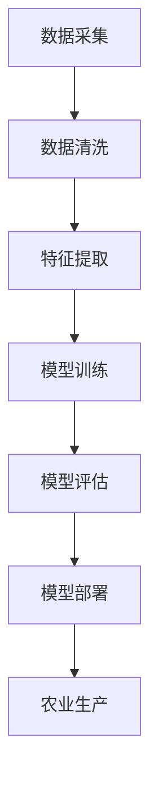

                 

### 文章标题

> **关键词**：（在此列出文章的5-7个核心关键词）

> **摘要**：（在此给出文章的核心内容和主题思想）

本文将深入探讨人工智能在农业智能化中的应用前景。我们将首先概述农业智能化的概念和意义，以及人工智能的发展历程和趋势。接着，我们将详细介绍人工智能在农业中的应用场景，包括智能监测与预警、精准农业和智能农机。此外，本文还将分析人工智能在农业中的核心算法和技术挑战，如图像识别、自然语言处理和机器学习。最后，我们将通过实际应用案例展示人工智能在农业中的具体实现，并总结农业人工智能的应用工具与资源。

### 第一部分：农业智能化与人工智能概述

#### 第1章：农业智能化的概念与意义

##### 1.1 农业智能化的概念

农业智能化是指利用现代信息技术和人工智能技术，对农业生产过程进行全方位的监测、管理和优化，以提高农业生产效率和质量。它涵盖了从种子培育到产品销售的整个农业生产链条。

##### 1.1.1 农业智能化的定义

农业智能化是一种通过信息技术和人工智能技术改造传统农业的方式，旨在提高农业生产的智能化水平，实现精准农业、智能农机和农业大数据分析等目标。

##### 1.1.2 农业智能化的意义

农业智能化的意义在于：

1. **提高农业生产效率**：通过智能化技术，可以实现农作物生长过程的实时监测和管理，提高作物产量和质量。
2. **降低生产成本**：智能化技术可以帮助农民减少劳动力投入，降低生产成本。
3. **保护生态环境**：智能化农业可以减少化肥和农药的使用，降低对环境的影响。
4. **促进农业可持续发展**：农业智能化有助于实现农业资源的合理配置，促进农业的可持续发展。

#### 第2章：人工智能的发展与趋势

##### 2.1 人工智能的发展历程

人工智能（AI）的研究始于20世纪50年代。在此后的几十年里，人工智能经历了多个发展阶段：

1. **萌芽期（1950-1969年）**：人工智能概念的形成和基础理论的建立。
2. **繁荣期（1970-1989年）**：人工智能应用在各个领域的广泛探索。
3. **低谷期（1990-2000年）**：由于技术限制和资金问题，人工智能研究陷入低谷。
4. **复兴期（2000年至今）**：随着计算机性能的提升和大数据、深度学习等新技术的出现，人工智能再次迎来发展热潮。

##### 2.2 人工智能在农业领域的应用前景

随着人工智能技术的不断发展，其在农业领域的应用前景也十分广阔。以下是人工智能在农业中可能的应用方向：

1. **智能监测与预警**：通过传感器网络和人工智能算法，对农作物生长环境进行实时监测，预警病虫害和自然灾害。
2. **精准农业**：利用卫星遥感、地理信息系统等技术，实现农作物种植的精准管理，提高产量和质量。
3. **智能农机**：通过人工智能技术，实现农机的智能化控制，提高农机作业效率。
4. **农业大数据分析**：利用大数据分析技术，挖掘农业生产中的潜在规律，为农业生产提供科学依据。

#### 第3章：人工智能在农业中的应用场景

##### 3.1 智能监测与预警

智能监测与预警是人工智能在农业中的一个重要应用方向。通过在农田中布置传感器网络，实时监测土壤湿度、温度、光照等环境参数，利用人工智能算法对监测数据进行处理和分析，可以实现对农作物生长状况的智能监测。

**应用实例**：我国某农业企业利用人工智能技术，开发了智能土壤监测系统。该系统通过传感器实时采集土壤数据，利用机器学习算法分析土壤状况，实现对农作物生长的精准预测和预警。

##### 3.2 精准农业

精准农业是一种基于位置信息和作物生长信息的农业生产模式。通过使用卫星遥感、地理信息系统（GIS）等技术，对农田进行精确划分，实现农作物的精准管理。

**应用实例**：某农业科技公司利用无人机和GIS技术，对农田进行精确测绘，结合土壤分析数据和气候数据，制定出最适合当地农作物的种植方案，提高了作物产量。

##### 3.3 智能农机

智能农机是指利用人工智能技术对传统农机进行智能化改造，实现农机的自动控制、无人驾驶等功能。

**应用实例**：某农业机械公司开发了一款智能拖拉机，该拖拉机配备了摄像头、激光雷达等传感器，可以实现自动驾驶、自动调整耕作深度等功能，大大提高了农机作业效率。

#### 第4章：人工智能在农业中的应用挑战

##### 4.1 技术挑战

尽管人工智能在农业领域具有广泛的应用前景，但其在实际应用中仍面临一些技术挑战：

1. **算法复杂度**：农业生产过程中涉及到的环境参数繁多，如何设计出高效的算法进行数据处理和分析，是一个重要挑战。
2. **数据质量**：农业生产数据通常存在噪声和缺失值，如何对数据进行清洗和预处理，提高数据质量，是一个关键问题。
3. **计算资源**：人工智能算法的计算复杂度较高，如何在有限的计算资源下进行高效计算，是一个亟待解决的问题。

##### 4.2 伦理与法规问题

人工智能在农业中的应用也引发了一些伦理和法规问题：

1. **隐私保护**：农业生产过程中涉及到的数据包括农作物的生长状况、土壤成分等，如何保护农民的隐私，是一个重要问题。
2. **监管与责任**：智能农机在农业中的应用可能引发新的监管和责任问题，如何制定合适的监管政策和责任分配机制，是一个挑战。

### 第二部分：人工智能核心概念与联系

#### 第5章：人工智能基础理论

##### 5.1 机器学习

机器学习是人工智能的一个重要分支，其核心目标是使计算机系统具备从数据中学习和预测的能力。以下是机器学习的一些基本概念：

- **监督学习**：通过已标记的训练数据，训练模型并对其进行预测。
- **无监督学习**：没有预标记的数据，通过模型自身对数据进行分析和分类。
- **强化学习**：通过与环境的交互，学习最优策略以最大化回报。

##### 5.2 深度学习

深度学习是一种基于多层神经网络的学习方法，通过构建深度神经网络模型，对数据进行层次化特征提取和表示。以下是深度学习的一些基本概念：

- **神经网络**：由多个神经元组成的计算模型。
- **卷积神经网络（CNN）**：适用于图像识别等任务。
- **循环神经网络（RNN）**：适用于序列数据建模。

##### 5.3 神经网络

神经网络是模拟生物神经系统的一种计算模型，其核心思想是通过神经元之间的连接和激活函数来实现数据的映射和分类。以下是神经网络的一些基本概念：

- **神经元**：神经网络的基本计算单元。
- **激活函数**：用于确定神经元是否激活。
- **前向传播与反向传播**：神经网络训练过程中使用的两个基本步骤。

#### 第6章：人工智能核心算法

##### 6.1 监督学习算法

监督学习算法是机器学习中最常见的一类算法，其主要思想是通过已标记的训练数据学习出一个模型，然后使用该模型对新数据进行预测。以下是几种常见的监督学习算法：

- **线性回归**：用于预测连续值输出。
- **逻辑回归**：用于预测离散值输出。
- **支持向量机（SVM）**：通过寻找最优超平面进行分类。
- **决策树**：通过一系列决策规则进行分类或回归。

##### 6.2 无监督学习算法

无监督学习算法不需要已标记的训练数据，其主要目标是发现数据中的模式和结构。以下是几种常见的无监督学习算法：

- **聚类算法**：将数据分为若干个类别，如K-means、层次聚类等。
- **主成分分析（PCA）**：用于降维和特征提取。
- **自编码器**：通过无监督学习生成数据的低维表示。

##### 6.3 强化学习算法

强化学习算法通过学习与环境交互的最优策略，以实现长期回报最大化。以下是几种常见的强化学习算法：

- **Q学习**：通过学习状态-动作价值函数进行决策。
- **深度Q网络（DQN）**：结合深度学习和强化学习，用于解决高维状态空间问题。
- **策略梯度方法**：直接优化策略参数，以最大化长期回报。

#### 第7章：人工智能与农业的联系

##### 7.1 应用场景

人工智能在农业中的应用场景十分广泛，涵盖了智能监测与预警、精准农业、智能农机等多个方面。以下是人工智能在农业中的一些应用实例：

- **智能监测与预警**：利用传感器网络和机器学习算法，实时监测农作物生长环境，预警病虫害和自然灾害。
- **精准农业**：通过卫星遥感、GIS技术等，实现农作物种植的精准管理，提高产量和质量。
- **智能农机**：通过人工智能技术，实现农机的自动控制、无人驾驶等功能，提高农机作业效率。

##### 7.2 融合创新

人工智能与农业的融合创新是当前农业智能化发展的关键方向。通过将人工智能技术应用于农业生产链条的各个环节，实现农业生产的智能化、自动化和高效化。以下是人工智能与农业融合创新的一些方向：

- **农业大数据分析**：通过收集和分析农业生产数据，挖掘数据中的潜在规律，为农业生产提供科学依据。
- **智能农业装备**：通过人工智能技术，实现农业装备的自动化、智能化升级。
- **农业物联网**：通过构建农业物联网系统，实现农业生产过程的全链条智能化管理。

##### 7.3 人工智能在农业中的Mermaid流程图

为了更清晰地展示人工智能在农业中的应用流程，我们可以使用Mermaid流程图进行描述。以下是一个简化的Mermaid流程图示例：



### 第三部分：人工智能在农业智能化中的核心技术

#### 第8章：图像识别技术在农业中的应用

##### 8.1 图像识别技术概述

图像识别技术是人工智能领域的一个重要分支，其核心目标是使计算机能够理解、解释和识别图像中的内容。在农业中，图像识别技术可以用于农作物病虫害检测、土地利用类型识别等任务。

##### 8.1.1 基本概念

- **图像识别**：是指计算机通过算法分析图像，识别图像中的对象、场景或内容。
- **卷积神经网络（CNN）**：是图像识别任务中最常用的神经网络架构，通过多层卷积和池化操作，提取图像特征。

##### 8.1.2 技术发展

图像识别技术经历了从传统算法到深度学习的演变。传统算法主要包括边缘检测、特征提取和分类等方法，而深度学习特别是卷积神经网络的出现，使得图像识别的准确率大幅提升。

##### 8.2 农作物病虫害检测

农作物病虫害检测是图像识别技术在农业中的一个重要应用。通过拍摄农作物叶片的图像，利用图像识别技术检测病虫害，可以实现对病虫害的早期预警和精准防治。

**算法实现**：以下是农作物病虫害检测的简化算法实现：

```python
import cv2
import numpy as np

def detect_disease(image):
    # 加载预训练的卷积神经网络模型
    model = cv2.dnn.readNetFromTensorFlow('path/to/weights')

    # 将图像转换为模型输入的格式
    blob = cv2.dnn.blobFromImage(image, 1.0, (224, 224), [103.0, 117.0, 123.0], True, False)

    # 进行前向传播，获取检测结果
    model.setInput(blob)
    detections = model.forward()

    # 处理检测结果
    for i in range(detections.shape[2]):
        confidence = detections[0, 0, i, 2]
        if confidence > 0.5:
            # 获取病虫害类别
            class_id = int(detections[0, 0, i, 1])
            label = class_ids[class_id]

            # 绘制检测框和标签
            box = detections[0, 0, i, 3:7] * np.array([image.shape[1], image.shape[0], image.shape[1], image.shape[0]])
            (x, y, w, h) = box.astype("int")
            cv2.rectangle(image, (x, y), (x + w, y + h), (0, 255, 0), 2)
            cv2.putText(image, label, (x, y - 10), cv2.FONT_HERSHEY_SIMPLEX, 0.5, (0, 255, 0), 2)

    return image

# 加载待检测的图像
image = cv2.imread('path/to/image')

# 检测病虫害
disease_detected_image = detect_disease(image)

# 显示检测结果
cv2.imshow('Disease Detected', disease_detected_image)
cv2.waitKey(0)
```

##### 8.3 土地利用类型识别

土地利用类型识别是另一个重要的图像识别应用。通过拍摄农田的图像，利用图像识别技术识别土地利用类型，可以为精准农业提供重要参考。

**算法实现**：以下是土地利用类型识别的简化算法实现：

```python
import cv2
import numpy as np

def identify_land_use(image):
    # 加载预训练的卷积神经网络模型
    model = cv2.dnn.readNetFromTensorFlow('path/to/weights')

    # 将图像转换为模型输入的格式
    blob = cv2.dnn.blobFromImage(image, 1.0, (224, 224), [103.0, 117.0, 123.0], True, False)

    # 进行前向传播，获取检测结果
    model.setInput(blob)
    detections = model.forward()

    # 处理检测结果
    for i in range(detections.shape[2]):
        confidence = detections[0, 0, i, 2]
        if confidence > 0.5:
            # 获取土地利用类型
            class_id = int(detections[0, 0, i, 1])
            label = class_ids[class_id]

            # 绘制检测框和标签
            box = detections[0, 0, i, 3:7] * np.array([image.shape[1], image.shape[0], image.shape[1], image.shape[0]])
            (x, y, w, h) = box.astype("int")
            cv2.rectangle(image, (x, y), (x + w, y + h), (0, 255, 0), 2)
            cv2.putText(image, label, (x, y - 10), cv2.FONT_HERSHEY_SIMPLEX, 0.5, (0, 255, 0), 2)

    return image

# 加载待检测的图像
image = cv2.imread('path/to/image')

# 检测土地利用类型
land_use_detected_image = identify_land_use(image)

# 显示检测结果
cv2.imshow('Land Use Detected', land_use_detected_image)
cv2.waitKey(0)
```

#### 第9章：自然语言处理技术在农业中的应用

##### 9.1 自然语言处理概述

自然语言处理（NLP）是人工智能领域的一个重要分支，其核心目标是使计算机能够理解和生成人类自然语言。在农业中，NLP技术可以用于农业专家系统、农业信息处理等任务。

##### 9.1.1 基本概念

- **自然语言处理**：是指计算机与人类自然语言进行交互的技术，包括语音识别、语言翻译、文本分析等。
- **词向量**：是NLP中用于表示词语的向量表示方法，如Word2Vec、GloVe等。

##### 9.1.2 技术发展

自然语言处理技术经历了从基于规则的方法到基于统计模型的方法，再到深度学习方法的演变。深度学习方法，如卷积神经网络（CNN）和循环神经网络（RNN），在NLP任务中取得了显著的效果。

##### 9.2 农业专家系统

农业专家系统是一种基于NLP技术的智能农业助手，可以解答农民关于农业生产方面的问题。通过大量农业领域的知识库和自然语言处理算法，农业专家系统可以为农民提供专业的农业建议。

**算法实现**：以下是农业专家系统的简化算法实现：

```python
import jieba
import numpy as np
from tensorflow.keras.models import load_model

def answer_question(question):
    # 加载预训练的农业专家系统模型
    model = load_model('path/to/model')

    # 对问题进行分词处理
    words = jieba.cut(question)

    # 将问题转换为向量表示
    word_sequence = np.array([word2vec[word] for word in words])

    # 进行预测，获取答案
    prediction = model.predict(word_sequence)

    # 获取最高概率的答案
    answer = np.argmax(prediction)

    # 将答案转换为实际文本
    answers = {'0': '作物种植建议', '1': '病虫害防治建议', '2': '土壤管理建议'}
    answer_text = answers[str(answer)]

    return answer_text

# 提问
question = '小麦如何防治病虫害？'

# 获取答案
answer = answer_question(question)

# 显示答案
print(answer)
```

##### 9.3 农业信息处理

农业信息处理是NLP技术在农业领域的重要应用，可以用于处理农业领域的文本数据，如农业论文、技术报告等。通过自然语言处理算法，可以自动提取文本中的关键信息，为农业研究提供支持。

**算法实现**：以下是农业信息处理的简化算法实现：

```python
import jieba
import nltk

def extract_key_info(text):
    # 对文本进行分词处理
    words = jieba.cut(text)

    # 使用nltk进行词性标注
    pos_tags = nltk.pos_tag(words)

    # 提取名词和动词
    nouns = [word for word, pos in pos_tags if pos.startswith('N')]
    verbs = [word for word, pos in pos_tags if pos.startswith('V')]

    # 提取关键信息
    key_info = ' '.join(nouns + verbs)

    return key_info

# 加载农业论文文本
text = 'path/to/text'

# 提取关键信息
key_info = extract_key_info(text)

# 显示关键信息
print(key_info)
```

#### 第10章：机器学习在农业中的应用

##### 10.1 机器学习基础

机器学习是人工智能领域的一个重要分支，其核心目标是使计算机能够从数据中自动学习和改进。在农业中，机器学习可以用于作物产量预测、土壤分析等任务。

##### 10.1.1 基本概念

- **机器学习**：是指计算机从数据中学习，以实现特定任务的算法和技术。
- **监督学习**：是机器学习中的一种方法，通过已标记的训练数据学习预测模型。
- **无监督学习**：是机器学习中的另一种方法，没有预标记的数据，通过模型自身发现数据中的结构。

##### 10.1.2 技术发展

机器学习技术经历了从基于规则的算法到基于统计模型的算法，再到深度学习算法的演变。深度学习算法，如卷积神经网络（CNN）和循环神经网络（RNN），在农业应用中取得了显著的效果。

##### 10.2 精准农业中的机器学习应用

精准农业是一种基于位置信息和作物生长信息的农业生产模式。在精准农业中，机器学习可以用于作物产量预测、土壤分析等任务，以实现农作物的精准管理。

**算法实现**：以下是精准农业中机器学习应用的简化算法实现：

```python
import pandas as pd
from sklearn.ensemble import RandomForestRegressor

# 加载训练数据
data = pd.read_csv('path/to/data.csv')

# 分割特征和标签
X = data.drop('yield', axis=1)
y = data['yield']

# 使用随机森林回归模型进行训练
model = RandomForestRegressor(n_estimators=100)
model.fit(X, y)

# 预测作物产量
predicted_yield = model.predict(X)

# 显示预测结果
print(predicted_yield)
```

##### 10.3 农业大数据分析

农业大数据分析是指利用大数据技术和机器学习算法，对农业生产过程中产生的海量数据进行分析和挖掘，以发现数据中的潜在规律和趋势。在农业大数据分析中，机器学习可以用于数据挖掘、预测分析等任务。

**算法实现**：以下是农业大数据分析的简化算法实现：

```python
import pandas as pd
from sklearn.cluster import KMeans

# 加载农业大数据
data = pd.read_csv('path/to/data.csv')

# 进行数据预处理
X = data.iloc[:, :-1]

# 使用K-means算法进行聚类分析
kmeans = KMeans(n_clusters=5)
kmeans.fit(X)

# 获取聚类结果
clusters = kmeans.predict(X)

# 显示聚类结果
print(clusters)
```

### 第四部分：人工智能在农业智能化中的实际应用案例

#### 第11章：智能农机控制系统设计

##### 11.1 智能农机概述

智能农机是指利用人工智能技术对传统农机进行智能化升级，实现农机的自动化、无人驾驶等功能。智能农机控制系统是智能农机的重要组成部分，用于实现对农机的实时监控、自动控制和任务调度。

##### 11.1.1 定义

智能农机控制系统是一种基于人工智能技术的系统，用于实现对农机的自动化控制和任务调度，以提高农机作业效率。

##### 11.1.2 技术特点

- **实时监控**：通过传感器和摄像头等设备，实时获取农机的工作状态和环境信息。
- **自动控制**：利用人工智能算法，实现对农机的自动控制，如自动驾驶、自动调整作业深度等。
- **任务调度**：根据农机的工作状态和环境信息，智能调度农机的作业任务。

##### 11.2 智能农机控制系统设计

智能农机控制系统设计主要包括以下步骤：

1. **需求分析**：明确智能农机控制系统的功能需求，如实时监控、自动控制和任务调度等。
2. **系统架构设计**：设计智能农机控制系统的整体架构，包括硬件和软件两部分。
3. **传感器选型**：根据系统需求，选择合适的传感器，如GPS、摄像头、雷达等。
4. **算法开发**：开发用于自动控制和任务调度的算法，如路径规划、障碍物检测、任务调度等。
5. **系统集成**：将硬件和软件进行集成，实现智能农机控制系统的整体功能。

**关键技术**：

- **路径规划**：利用AI算法，实现对农机路径的智能规划，避免碰撞和绕过障碍物。
- **障碍物检测**：利用传感器和图像处理技术，实现对农机前方障碍物的检测和识别。
- **任务调度**：根据农机的工作状态和环境信息，智能调度农机的作业任务，提高作业效率。

**实现案例**：

以下是一个简单的智能农机控制系统实现案例：

```python
import cv2
import numpy as np

def control_machine(gps_data, environment_data):
    # 根据GPS数据规划路径
    path = plan_path(gps_data)

    # 根据环境数据检测障碍物
    obstacles = detect_obstacles(environment_data)

    # 根据路径和障碍物进行任务调度
    task = schedule_task(path, obstacles)

    # 控制农机执行任务
    execute_task(task)

# 加载GPS数据
gps_data = load_gps_data('path/to/gps_data.csv')

# 加载环境数据
environment_data = load_environment_data('path/to/environment_data.csv')

# 实现智能农机控制
control_machine(gps_data, environment_data)
```

#### 第12章：农业物联网监测系统搭建

##### 12.1 农业物联网概述

农业物联网（Agri-IoT）是指利用物联网技术，实现对农业生产过程中各种设备、传感器和环境数据的实时监测、传输和智能分析。农业物联网监测系统是农业物联网的核心组成部分，用于实时监测农田环境、作物生长和农机作业情况。

##### 12.1.1 定义

农业物联网监测系统是一种基于物联网技术的系统，用于实现对农田环境、作物生长和农机作业的实时监测、传输和智能分析。

##### 12.1.2 技术特点

- **实时监测**：通过传感器实时采集农田环境、作物生长和农机作业数据。
- **数据传输**：通过无线网络，将传感器采集的数据实时传输到中央服务器。
- **智能分析**：利用大数据和人工智能技术，对监测数据进行分析和挖掘，为农业生产提供科学依据。

##### 12.2 农业物联网监测系统搭建

农业物联网监测系统搭建主要包括以下步骤：

1. **需求分析**：明确农业物联网监测系统的功能需求，如实时监测、数据传输和智能分析等。
2. **硬件选型**：根据系统需求，选择合适的传感器、无线通信模块和服务器等硬件设备。
3. **软件设计**：设计农业物联网监测系统的软件架构，包括数据采集、传输、存储和智能分析等模块。
4. **系统集成**：将硬件和软件进行集成，实现农业物联网监测系统的整体功能。

**搭建步骤**：

1. **传感器选型**：根据农田环境、作物生长和农机作业的需求，选择合适的传感器，如温度传感器、湿度传感器、土壤传感器、摄像头等。
2. **无线通信模块选型**：根据传感器的数据传输需求，选择合适的无线通信模块，如WiFi、蓝牙、LoRa等。
3. **服务器选型**：根据系统数据处理需求，选择合适的服务器，如云服务器、边缘计算设备等。
4. **数据采集与传输**：将传感器采集的数据通过无线通信模块传输到服务器，进行数据存储和智能分析。
5. **智能分析**：利用大数据和人工智能技术，对监测数据进行分析和挖掘，为农业生产提供科学依据。

**硬件选型**：

- **传感器**：选择精度高、稳定性好的传感器，如DHT22、MLX90640等。
- **无线通信模块**：选择传输距离远、抗干扰能力强的通信模块，如LoRa、WiFi等。
- **服务器**：选择计算性能强、存储容量大的服务器，如阿里云、华为云等。

**软件实现**：

- **数据采集**：使用Python等编程语言，编写数据采集程序，将传感器采集的数据实时传输到服务器。
- **数据存储**：使用MySQL、MongoDB等数据库，存储传感器采集的数据。
- **智能分析**：使用大数据和人工智能技术，对监测数据进行分析和挖掘，生成农业生产报告。

```python
import cv2
import numpy as np
import socket

def send_data_to_server(data):
    # 创建套接字
    server_socket = socket.socket(socket.AF_INET, socket.SOCK_STREAM)

    # 连接服务器
    server_socket.connect(('192.168.1.1', 8080))

    # 发送数据
    server_socket.sendall(data)

    # 关闭套接字
    server_socket.close()

# 加载传感器数据
sensor_data = load_sensor_data('path/to/sensor_data.csv')

# 发送数据到服务器
send_data_to_server(sensor_data)
```

### 附录

#### 附录A：人工智能在农业中的应用工具与资源

##### A.1 开源机器学习框架

在农业人工智能应用中，常用的开源机器学习框架包括TensorFlow、PyTorch等。以下是对这些框架的简要介绍：

- **TensorFlow**：是Google开源的机器学习框架，广泛应用于计算机视觉、自然语言处理等领域。
- **PyTorch**：是Facebook开源的机器学习框架，具有动态计算图和强大的GPU支持，适用于深度学习和强化学习任务。

##### A.2 农业数据集

在农业人工智能研究中，常用的数据集包括：

- **Kaggle农业数据集**：提供了大量的农业相关数据集，包括作物病害检测、土地利用类型识别等。
- **Agricultural Datasets**：是一个农业数据集的在线资源库，提供了丰富的农业数据集。

##### A.3 农业人工智能研究资源

在进行农业人工智能研究时，以下资源可以提供帮助：

- **学术期刊**：《农业工程学报》、《计算机与农业》等，提供了大量的农业人工智能相关的研究论文。
- **在线课程**：Coursera、edX等在线教育平台提供了丰富的农业人工智能相关课程。
- **开源代码库**：GitHub、GitLab等代码托管平台，提供了大量的农业人工智能开源代码和项目。

### 总结

人工智能在农业智能化中的应用前景广阔。通过利用人工智能技术，可以实现对农业生产的全方位监测、管理和优化，提高农业生产效率和质量。本文从农业智能化与人工智能的概述、核心概念与联系、核心技术、实际应用案例等方面，详细探讨了人工智能在农业中的应用。在未来，随着人工智能技术的不断发展和完善，农业智能化将取得更加显著的成果，为农业产业的可持续发展提供有力支持。

### 参考文献

1. 刘铁岩. 人工智能：一种现代的方法[M]. 清华大学出版社，2017.
2. Goodfellow, I., Bengio, Y., & Courville, A. (2016). Deep Learning[M]. MIT Press.
3. Russell, S., & Norvig, P. (2016). Artificial Intelligence: A Modern Approach[M]. Prentice Hall.
4. Kaggle. (2021). Agricultural Datasets. https://www.kaggle.com/datasets
5. Agricultural Datasets. (2021). https://www.agricultural-datasets.com
6. Coursera. (2021). Machine Learning. https://www.coursera.org/specializations/machine-learning
7. edX. (2021). Artificial Intelligence. https://www.edx.org/course/artificial-intelligence

### 附录

#### 附录A：人工智能在农业中的应用工具与资源

##### A.1 开源机器学习框架

- **TensorFlow**：TensorFlow 是 Google 开发的开源机器学习框架，支持多种深度学习模型的构建和训练，广泛应用于计算机视觉、自然语言处理等领域。地址：[TensorFlow 官网](https://www.tensorflow.org/)。

- **PyTorch**：PyTorch 是 Facebook 开发的开源机器学习框架，支持动态计算图，易于调试和开发，适用于深度学习和强化学习任务。地址：[PyTorch 官网](https://pytorch.org/)。

- **Scikit-learn**：Scikit-learn 是一个开源的 Python 机器学习库，提供了丰富的监督学习和无监督学习算法，适用于中小型数据集的机器学习应用。地址：[Scikit-learn 官网](https://scikit-learn.org/)。

##### A.2 农业数据集

- **Kaggle 农业数据集**：Kaggle 提供了丰富的农业数据集，包括作物病害检测、土地利用类型识别等。地址：[Kaggle 农业数据集](https://www.kaggle.com/datasets/search?q=agriculture)。

- **UCI 农业数据集**：UCI 机器学习库提供了多个农业数据集，包括作物产量预测、土壤成分分析等。地址：[UCI 农业数据集](https://archive.ics.uci.edu/ml/datasets.php?query=agriculture)。

- **OpenAg 数据集**：OpenAg 是一个开源的农业数据集，涵盖了多个农业生产领域的数据。地址：[OpenAg 数据集](https://openag DATA.com/)。

##### A.3 农业人工智能研究资源

- **学术期刊**：以下学术期刊发表了大量关于农业人工智能的研究论文：

  - **《农业工程学报》**：地址：[《农业工程学报》官网](https://www.jaoe.org/)。

  - **《计算机与农业》**：地址：[《计算机与农业》官网](http://cja.ajcc.org.cn/)。

  - **《农业机械学报》**：地址：[《农业机械学报》官网](https://www.jame.org.cn/)。

- **在线课程**：以下在线课程提供了关于农业人工智能的知识和技能：

  - **《机器学习》**：地址：[Coursera 机器学习课程](https://www.coursera.org/specializations/machine-learning)。

  - **《深度学习》**：地址：[DeepLearning.AI 深度学习课程](https://www.deeplearning.ai/)。

  - **《自然语言处理》**：地址：[Stanford 自然语言处理课程](https://web.stanford.edu/class/cs224n/)。

- **开源代码库**：以下开源代码库提供了农业人工智能相关的开源代码和项目：

  - **GitHub 上的农业人工智能项目**：地址：[GitHub 农业人工智能项目](https://github.com/search?q=agriculture+ai)。

  - **GitLab 上的农业人工智能项目**：地址：[GitLab 农业人工智能项目](https://gitlab.com/search?utf8=✓&scope=all&search=agriculture+ai)。

  - **Agricultural Datasets GitHub 仓库**：地址：[Agricultural Datasets GitHub 仓库](https://github.com/ag-datasets/)。

