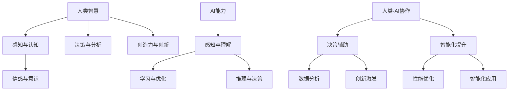
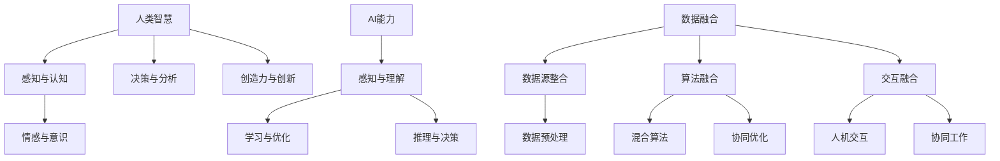
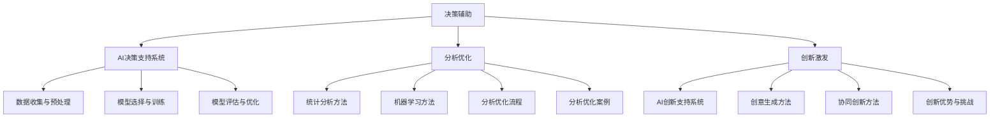
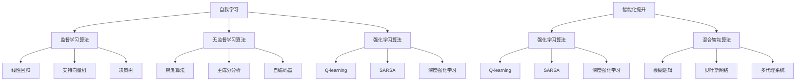
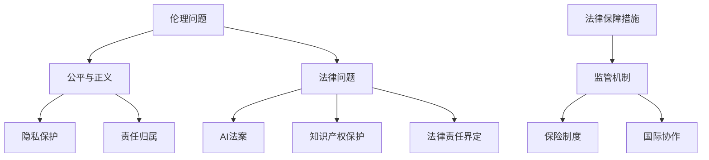
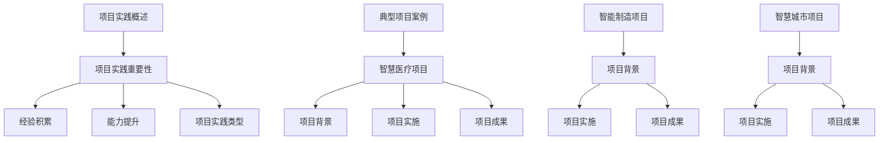
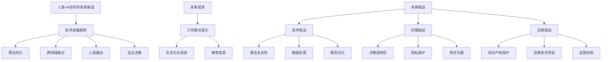

                 

### 第1章: 人类-AI协作的背景与意义

#### 1.1 人类-AI协作的背景

人工智能（Artificial Intelligence, AI）作为计算机科学的一个分支，旨在模拟、延伸和扩展人的智能。自20世纪50年代以来，人工智能经历了从理论研究到实际应用的漫长发展历程。特别是近十年，随着深度学习、神经网络等技术的突破，人工智能在自然语言处理、计算机视觉、机器学习等领域的应用取得了显著进展。这些技术不仅提升了AI的智能水平，也使得人类与AI的协作成为可能。

在自然语言处理领域，AI已经能够理解和生成人类语言，实现语音识别、机器翻译等功能。计算机视觉技术使得AI能够识别和理解图像、视频，广泛应用于人脸识别、自动驾驶等领域。机器学习算法则让AI具备学习能力，可以不断优化自身的性能。

#### 1.2 人类智慧与AI能力的融合

人类智慧与AI能力的融合具有重要意义。首先，AI可以辅助人类在决策、分析、创新等方面提升效率。例如，通过AI算法分析大量数据，可以快速发现规律和趋势，为决策提供有力支持。其次，AI可以通过与人类协作，更好地理解人类的需求，从而提高自身的智能化水平。例如，在医疗领域，AI可以辅助医生进行疾病诊断，通过分析患者的病历和症状，提供更准确的诊断结果。

此外，人类智慧与AI能力的融合还有助于推动社会进步。在医疗健康领域，AI可以帮助提高诊断准确率和治疗效果，缓解医疗资源紧张的问题。在环境保护领域，AI可以用于监测和预测环境变化，提供有效的环境保护方案。在教育领域，AI可以个性化教学，提高教学效果。

#### 1.3 人类-AI协作的现状与挑战

目前，人类-AI协作已经在多个领域取得了初步应用。例如，在金融领域，AI被用于风险评估、智能投顾等；在制造领域，AI被用于自动化生产、质量检测等；在零售领域，AI被用于客户分析、智能推荐等。然而，人类-AI协作仍然面临诸多挑战。

首先，技术挑战主要包括算法性能的提升、数据质量和安全等问题。其次，伦理问题如AI的决策透明性、隐私保护等也需要引起重视。此外，法律风险如知识产权保护、责任归属等也是人类-AI协作面临的挑战。

#### 1.4 本书结构

本书旨在深入探讨人类-AI协作的背景、意义、实现方法以及在各领域的应用，并提出相应的解决方案。具体结构如下：

1. **第1章：人类-AI协作的背景与意义**：介绍人类-AI协作的背景和意义，分析人类智慧与AI能力的融合及其重要性。
2. **第2章：人类智慧与AI能力的融合**：探讨人类智慧与AI能力的组成及其融合方法。
3. **第3章：AI在增强人类智慧中的应用**：分析AI在决策辅助、分析优化和创新激发中的应用。
4. **第4章：AI在提升AI能力中的应用**：探讨AI在自我学习和智能化提升中的应用。
5. **第5章：人类-AI协作的伦理与法律问题**：分析人类-AI协作面临的伦理和法律问题，并提出解决方案。
6. **第6章：人类-AI协作的项目实践**：通过实际项目案例，展示人类-AI协作的实践经验和效果。
7. **第7章：人类-AI协作的未来展望**：展望人类-AI协作的未来发展趋势和前景。

通过本书的深入探讨，希望能够为读者提供对人类-AI协作的全面理解和深入思考，为未来的研究和实践提供参考。

### 1.5 核心概念与联系

为了更好地理解人类-AI协作的核心概念及其相互联系，我们可以使用Mermaid流程图进行展示。以下是一个简化的流程图：

在这个流程图中，人类智慧（A）与AI能力（F）通过协作（J）相互结合。人类智慧包括感知与认知（B）、情感与意识（C）、决策与分析（D）、创造力与创新（E）；而AI能力包括感知与理解（G）、学习与优化（H）、推理与决策（I）。通过协作，人类智慧与AI能力共同实现决策辅助（K）、数据分析（L）、创新激发（M）以及智能化提升（N），从而推动社会进步。

### 1.6 摘要

本文从人类-AI协作的背景和意义出发，深入探讨了人类智慧与AI能力的融合及其重要性。通过分析人类智慧与AI能力的组成和实现方法，我们揭示了人类-AI协作在决策辅助、分析优化、创新激发以及智能化提升等方面的应用。同时，本文还探讨了人类-AI协作面临的伦理与法律问题，并提出了相应的解决方案。通过实际项目案例的展示，本文进一步验证了人类-AI协作的实践效果。最后，本文对人类-AI协作的未来发展趋势和前景进行了展望。通过本文的探讨，希望能够为读者提供对人类-AI协作的全面理解和深入思考，为未来的研究和实践提供参考。

---

### 第2章: 人类智慧与AI能力的融合

人类智慧与人工智能（AI）能力的融合是当今科技发展中的一个重要议题。在这一章中，我们将详细探讨人类智慧的组成部分、AI能力的组成部分以及它们之间的融合方法。通过这一探讨，我们将更好地理解人类-AI协作的基础，为后续章节的分析和应用提供理论支持。

#### 2.1 核心概念与架构

##### 2.1.1 人类智慧的组成部分

人类智慧是一个复杂的多维度系统，主要包括以下几个核心组成部分：

1. **认知能力**：
   - **感知**：人类通过五官感知外部世界，获取视觉、听觉、嗅觉、味觉和触觉信息。
   - **记忆**：人类能够存储和回忆信息，分为短期记忆和长期记忆。
   - **推理**：人类通过逻辑思维，从已知信息中推断未知信息。
   - **判断**：人类在信息处理过程中，能够做出基于经验和规则的判断。

2. **情感与意识**：
   - **情感**：情感是人类情绪体验的一部分，包括喜悦、愤怒、悲伤等。
   - **意识**：意识是人类对自己和外部世界的认知，是人类智慧的高级表现形式。

##### 2.1.2 AI能力的组成部分

与人类智慧不同，AI能力主要集中在以下几个方面：

1. **感知能力**：
   - **计算机视觉**：AI能够通过图像识别技术理解和分析视觉信息。
   - **听觉处理**：AI能够通过语音识别技术理解和分析语音信息。

2. **学习能力**：
   - **机器学习**：通过训练数据集，AI能够自动识别模式和规律。
   - **深度学习**：利用多层神经网络，AI能够处理复杂的非线性问题。

3. **推理与决策能力**：
   - **逻辑推理**：AI能够通过算法进行逻辑推理，解决逻辑问题。
   - **决策支持**：AI能够基于数据和算法提供决策建议。

#### 2.2 人类与AI融合的实现方法

人类智慧与AI能力的融合，是通过多种方法实现的。以下是一些主要的融合方法：

##### 2.2.1 数据融合

数据融合是实现人类-AI协作的重要基础。具体方法包括：

1. **数据源整合**：收集并整合来自各种来源的数据，如文本、图像、语音等。
2. **数据预处理**：对收集到的数据进行清洗、归一化和特征提取，以便AI算法处理。

##### 2.2.2 算法融合

算法融合是将人类智慧和AI算法相结合，以实现更好的效果。具体方法包括：

1. **混合算法**：结合人类智慧和AI算法，例如在决策支持系统中，人类专家提供规则，AI算法提供优化方案。
2. **协同优化**：通过迭代优化，不断改进算法性能。

##### 2.2.3 交互融合

交互融合是指人类与AI系统之间的直接交互。具体方法包括：

1. **人机交互**：利用自然语言处理技术，实现人与AI的流畅沟通。
2. **协同工作**：人类与AI在特定任务中分工合作，实现共同目标。

#### 2.3 Mermaid流程图

为了更直观地展示人类智慧与AI能力的融合，我们可以使用Mermaid流程图。以下是一个简化的流程图：

在这个流程图中，人类智慧（A）与AI能力（F）通过数据融合（J）、算法融合（M）和交互融合（P）相互结合，实现人类-AI协作。

### 2.4 结论

通过本章的探讨，我们深入了解了人类智慧与AI能力的组成部分及其融合方法。这种融合不仅能够增强人类智慧，还能提升AI的智能化水平，为人类-AI协作奠定了基础。在接下来的章节中，我们将进一步探讨AI在增强人类智慧、提升AI能力以及解决伦理和法律问题中的应用。

---

### 第3章: AI在增强人类智慧中的应用

人工智能（AI）在增强人类智慧方面具有广泛的应用潜力。通过AI技术，人类可以在决策、分析、创新等多个方面得到显著提升。在本章中，我们将详细探讨AI在决策辅助、分析优化和创新激发中的应用，并通过具体案例进行分析。

#### 3.1 AI在决策辅助中的应用

##### 3.1.1 AI决策支持系统的应用场景

AI决策支持系统（AI-DSS）在多个领域都有广泛应用，以下是一些典型的应用场景：

1. **企业战略规划**：
   - **市场预测**：AI可以通过分析历史数据和市场趋势，预测未来的市场需求，帮助企业制定有效的市场策略。
   - **风险评估**：AI可以对企业的各种风险进行评估，提供风险预警和建议，帮助企业降低风险。

2. **金融风险管理**：
   - **投资组合优化**：AI可以根据投资者的风险偏好和收益目标，优化投资组合，提高投资回报率。
   - **信用评估**：AI可以通过分析个人的信用历史和财务状况，提供更准确的信用评估，减少金融机构的风险。

3. **供应链管理**：
   - **需求预测**：AI可以根据历史销售数据和市场趋势，预测未来的需求，帮助企业合理安排生产和库存。
   - **库存优化**：AI可以通过分析库存水平和销售趋势，优化库存管理，减少库存成本。

##### 3.1.2 AI决策模型的构建

构建AI决策模型需要经过以下几个步骤：

1. **数据收集与预处理**：
   - **数据收集**：收集与决策相关的历史数据和市场信息。
   - **数据预处理**：对收集到的数据清洗、归一化和特征提取，以便进行后续分析。

2. **模型选择与训练**：
   - **模型选择**：根据决策问题的特点，选择合适的算法模型，如线性回归、决策树、神经网络等。
   - **模型训练**：使用预处理后的数据，对模型进行训练，使其能够根据输入数据做出准确的预测。

3. **模型评估与优化**：
   - **模型评估**：通过交叉验证和测试集，评估模型的预测性能，确定模型的准确性、召回率等指标。
   - **模型优化**：根据评估结果，调整模型参数，优化模型性能。

##### 3.1.3 AI决策的优势与挑战

AI决策具有以下几个优势：

1. **提高决策效率**：AI可以快速处理大量数据，提供即时的决策建议，大大提高决策效率。
2. **减少决策失误**：通过历史数据和算法模型，AI可以帮助避免因人类主观判断导致的决策失误。
3. **优化资源分配**：AI可以基于数据分析，优化资源的分配和使用，提高资源利用率。

然而，AI决策也面临一些挑战：

1. **模型解释性**：一些复杂的AI模型，如深度神经网络，其决策过程不够透明，难以解释。
2. **数据质量**：AI决策的性能高度依赖于数据质量，数据的不完整、噪声和偏差都会影响决策结果。
3. **伦理问题**：AI决策可能涉及到隐私保护、公平性等问题，需要制定相应的伦理规范。

#### 3.2 AI在分析优化中的应用

##### 3.2.1 AI数据分析方法

AI在数据分析中具有显著优势，以下是一些常用的数据分析方法：

1. **统计分析**：
   - **线性回归**：分析变量之间的关系，建立回归模型，预测未知变量的值。
   - **聚类分析**：将数据分为不同的类别，分析各类别的特征和关系。

2. **机器学习方法**：
   - **支持向量机**（SVM）：通过寻找最优决策边界，对数据进行分类和回归分析。
   - **随机森林**（RF）：通过构建多棵决策树，进行集成学习，提高预测性能。

##### 3.2.2 AI分析优化的流程

AI分析优化的流程通常包括以下几个步骤：

1. **需求分析**：明确分析的目标和需求，确定分析的范围和方法。
2. **数据收集**：收集与分析目标相关的数据，包括结构化和非结构化数据。
3. **数据预处理**：对收集到的数据进行清洗、归一化和特征提取，以便进行后续分析。
4. **模型选择与训练**：根据分析目标，选择合适的算法模型，并对模型进行训练。
5. **模型评估与优化**：评估模型性能，通过调整模型参数和特征选择，优化模型性能。
6. **结果验证与优化**：将模型应用于实际数据，验证预测结果，并根据反馈进行持续优化。

##### 3.2.3 AI分析优化的案例

以下是两个AI分析优化的实际案例：

1. **案例1：供应链优化**：
   - **背景**：一家制造企业需要优化其供应链管理，提高库存周转率和生产效率。
   - **解决方案**：使用机器学习算法对销售数据进行预测，优化库存水平和生产计划，减少库存成本和提高生产效率。

2. **案例2：市场预测**：
   - **背景**：一家零售公司需要预测未来的销售趋势，以便制定有效的营销策略。
   - **解决方案**：使用时间序列分析方法和机器学习算法，对历史销售数据和市场趋势进行分析，预测未来的销售量，为营销策略提供数据支持。

#### 3.3 AI在创新激发中的应用

##### 3.3.1 AI创新支持系统的应用

AI创新支持系统（AI-Innovation Support System）可以帮助企业和研究机构在创新过程中提供支持，以下是一些典型的应用：

1. **创意生成**：
   - **生成对抗网络**（GAN）：通过生成和判别网络，生成新的创意和设计。
   - **文本生成**：通过自然语言处理技术，生成新的创意描述和文本。

2. **设计优化**：
   - **计算机辅助设计**（CAD）：利用AI技术，自动优化产品设计，提高设计效率。
   - **模拟与优化**：通过仿真和优化算法，对设计进行性能优化。

##### 3.3.2 AI创新激发的方法

AI在创新激发中的应用方法主要包括：

1. **知识挖掘**：
   - **文献挖掘**：通过分析大量文献，挖掘新的研究热点和方向。
   - **专利挖掘**：通过分析专利数据，发现新的创新机会。

2. **协同创新**：
   - **多主体协同**：通过AI技术，实现不同团队和专家的协同创新。
   - **开放式创新**：通过AI技术，连接外部创新资源，促进开放性合作。

##### 3.3.3 AI创新的优势与挑战

AI在创新激发中的应用具有以下优势：

1. **提高创新效率**：AI可以快速处理和分析大量数据，帮助发现新的创新机会。
2. **拓宽创新领域**：AI可以应用于各个领域，推动跨学科的创新发展。

然而，AI在创新激发中也面临一些挑战：

1. **创造力评估**：如何准确评估AI生成的创意和设计，仍是一个挑战。
2. **知识产权保护**：AI生成的创新成果的知识产权归属和保护问题需要解决。

#### 3.4 结论

通过本章的探讨，我们深入了解了AI在增强人类智慧中的应用，包括决策辅助、分析优化和创新激发。AI技术在这些领域的应用，不仅提高了人类的决策效率和分析能力，还激发了创新的潜力。然而，AI应用也面临一些挑战，如模型解释性、数据质量和伦理问题等。在接下来的章节中，我们将进一步探讨AI在提升自身能力中的应用。

---

### 3.5 Mermaid流程图

为了更直观地展示AI在增强人类智慧中的应用，我们可以使用Mermaid流程图。以下是一个简化的流程图：

在这个流程图中，AI在增强人类智慧中的应用分为决策辅助（A）、分析优化（F）和创新激发（K）三个部分。每个部分都包含了具体的方法和应用案例，通过这些流程的相互结合，实现了AI在人类智慧增强中的综合应用。

---

### 第4章: AI在提升AI能力中的应用

随着人工智能技术的不断进步，AI自身的智能化水平也在不断提升。在这一章中，我们将探讨AI在自我学习和智能化提升中的应用，包括自我学习原理、自我学习算法、智能化原理和智能化算法。通过这些探讨，我们将更好地理解AI如何通过自我学习和智能化提升来增强其能力。

#### 4.1 自我学习与智能化提升的原理

##### 4.1.1 自我学习原理

自我学习（Self-Learning）是指AI系统能够在没有人类干预的情况下，通过数据和算法自动改进自身性能。自我学习的核心原理包括：

1. **数据驱动**：AI系统通过不断接收和处理大量数据，从中提取知识，提高自身的性能。
2. **模型迭代**：通过迭代优化模型参数，使模型在数据集上的性能逐渐提升。
3. **自适应**：AI系统能够根据环境变化和反馈，自适应调整行为和决策。

##### 4.1.2 智能化原理

智能化提升（Intelligent Enhancement）是指通过技术手段提高AI系统的智能化水平，使其具备更高的自主决策能力、适应能力和学习能力。智能化原理主要包括：

1. **自主决策**：AI系统能够根据环境信息和目标，自主做出决策，无需人类干预。
2. **自适应**：AI系统能够根据实时反馈和环境变化，自适应调整自身的行为和策略。
3. **学习与优化**：AI系统通过学习和优化，不断提高自身的性能和智能化水平。

#### 4.2 自我学习算法

自我学习算法是实现AI自我学习和智能化提升的关键技术。以下是一些常见的自我学习算法：

##### 4.2.1 监督学习算法

监督学习算法是指通过训练数据和标签来学习模型，从而实现预测和分类。以下是一些常见的监督学习算法：

1. **线性回归**：通过拟合数据点之间的线性关系，实现数据的预测。
2. **支持向量机**（SVM）：通过寻找最优决策边界，实现数据的分类。
3. **决策树**：通过构建树状结构，实现数据的分类和回归。

##### 4.2.2 无监督学习算法

无监督学习算法是指在没有训练数据和标签的情况下，通过数据自身的结构和模式来学习。以下是一些常见的无监督学习算法：

1. **聚类算法**：通过将数据点分为不同的类别，发现数据中的模式和分布。
2. **主成分分析**（PCA）：通过降维，提取数据的主要特征，减少数据的冗余。
3. **自编码器**：通过无监督预训练，提高模型的泛化能力和学习能力。

##### 4.2.3 强化学习算法

强化学习算法是指通过不断与环境交互，学习最优策略。以下是一些常见的强化学习算法：

1. **Q-learning**：通过评估不同动作的预期奖励，选择最优动作。
2. **SARSA**：通过评估当前状态和动作的价值，更新策略。
3. **深度强化学习**：结合深度学习和强化学习，实现更复杂的决策问题。

#### 4.3 智能化算法

智能化算法是指通过技术手段提高AI系统的智能化水平，使其具备更高的自主决策能力、适应能力和学习能力。以下是一些常见的智能化算法：

##### 4.3.1 强化学习算法

强化学习算法通过不断与环境交互，学习最优策略，实现自主决策。以下是一些常见的强化学习算法：

1. **Q-learning**：通过评估不同动作的预期奖励，选择最优动作。
2. **SARSA**：通过评估当前状态和动作的价值，更新策略。
3. **深度强化学习**：结合深度学习和强化学习，实现更复杂的决策问题。

##### 4.3.2 混合智能算法

混合智能算法是指将不同类型的算法结合，以实现更高效的智能化。以下是一些常见的混合智能算法：

1. **模糊逻辑**：通过模糊集合和模糊规则，实现不确定环境下的决策。
2. **贝叶斯网络**：通过概率图模型，实现复杂不确定性问题的推理。
3. **多代理系统**：通过多个智能体之间的协作，实现更复杂的决策和优化。

#### 4.4 自我学习的优势与挑战

自我学习具有以下优势：

1. **提高学习效率**：通过自我学习，AI系统能够在大量数据中快速提取知识，提高学习效率。
2. **自适应能力**：通过自我学习，AI系统能够根据环境变化和反馈，自适应调整自身行为，提高适应能力。
3. **智能化提升**：通过自我学习，AI系统能够不断优化自身性能，实现智能化提升。

然而，自我学习也面临一些挑战：

1. **数据质量**：自我学习的效果高度依赖于数据质量，数据的不完整、噪声和偏差都会影响学习效果。
2. **模型解释性**：一些复杂的自我学习模型，如深度神经网络，其决策过程不够透明，难以解释。
3. **伦理问题**：自我学习过程中，如何确保AI系统的公平性、透明性和可解释性，仍是一个重要的伦理问题。

#### 4.5 智能化的优势与挑战

智能化提升具有以下优势：

1. **自主决策能力**：通过智能化提升，AI系统可以自主决策，减少人类干预，提高效率。
2. **适应能力**：通过智能化提升，AI系统可以适应复杂多变的环境，提高稳定性。
3. **创新能力**：通过智能化提升，AI系统可以不断学习和优化，提高自身的创新能力和智能化水平。

然而，智能化提升也面临一些挑战：

1. **算法复杂度**：智能化算法通常具有很高的复杂度，开发和维护成本较高。
2. **环境适应性**：AI系统需要适应不同的环境和任务，这要求算法具有很高的通用性和适应性。
3. **伦理问题**：智能化提升过程中，如何确保AI系统的伦理和道德，仍是一个重要的伦理问题。

#### 4.6 结论

通过本章的探讨，我们深入了解了AI在自我学习和智能化提升中的应用。自我学习通过不断学习和优化，提高了AI系统的学习效率和自适应能力；智能化提升通过提高AI系统的自主决策能力和适应能力，实现了AI的智能化提升。然而，自我学习和智能化提升也面临一些挑战，如数据质量、模型解释性和伦理问题等。在未来的研究和应用中，我们需要进一步探索如何解决这些挑战，推动AI技术的持续发展和智能化提升。

---

### 4.7 Mermaid流程图

为了更直观地展示AI在自我学习和智能化提升中的应用，我们可以使用Mermaid流程图。以下是一个简化的流程图：

在这个流程图中，AI在自我学习（A）和智能化提升（N）的应用分别包括监督学习算法（B）、无监督学习算法（F）、强化学习算法（J）和混合智能算法（S）。这些算法和方法的相互结合，实现了AI的自我学习和智能化提升。

---

### 第5章: 人类-AI协作的伦理与法律问题

随着人工智能（AI）技术的迅速发展，人类与AI的协作日益普及。然而，这种协作也带来了诸多伦理和法律问题，需要我们深入探讨和解决。本章将分析人类-AI协作中面临的伦理问题，包括公平与正义、隐私保护、责任归属等，并探讨法律问题，如AI法案、知识产权保护等。此外，还将提出解决伦理与法律问题的途径和保障措施。

#### 5.1 伦理问题

##### 5.1.1 AI伦理的基本原则

AI伦理问题涉及多个方面，其基本原则包括：

1. **公平与正义**：确保AI系统对所有用户公平对待，不因性别、种族、年龄等因素产生歧视。
2. **隐私保护**：保护用户的个人隐私不被滥用，确保数据的收集、存储和使用合法合规。
3. **透明性**：确保AI系统的决策过程可解释、可审计，用户能够理解AI系统的决策依据。
4. **责任归属**：明确AI系统与人类操作者的责任划分，确保在出现问题时，能够找到责任人。

##### 5.1.2 伦理问题的案例分析

1. **自动驾驶汽车伦理问题**：

   自动驾驶汽车作为AI应用的一个重要领域，面临着诸多伦理挑战。例如，当面对危险情境时，自动驾驶汽车应该如何做出决策？是保护乘客的安全还是保护行人的安全？这种决策涉及到道德伦理的权衡，需要制定相应的伦理规范。

2. **AI在医疗领域的伦理挑战**：

   AI在医疗领域的应用，如疾病诊断、治疗方案推荐等，虽然提高了医疗效率，但也引发了一系列伦理问题。例如，如何确保AI诊断的准确性和可靠性？如何保护患者的隐私和数据安全？如何处理AI诊断结果与医生诊断结果不一致的情况？

##### 5.1.3 伦理问题的解决途径

解决AI伦理问题需要从多个角度出发：

1. **法律法规**：制定相关法律法规，明确AI系统的伦理规范和责任归属，确保AI系统的合法合规运行。
2. **伦理教育**：加强AI伦理教育，提高开发者、用户和相关人员的伦理意识，培养良好的AI伦理文化。
3. **透明性和可解释性**：提高AI系统的透明性和可解释性，让用户能够理解AI系统的决策过程，增强用户对AI系统的信任。

#### 5.2 法律问题

##### 5.2.1 AI法律框架

目前，各国纷纷出台相关法律法规，对AI进行监管。以下是一些主要国家的AI法律框架：

1. **欧盟**：欧盟发布了《人工智能法案》，旨在规范AI的研发和应用，确保AI系统的透明性、可靠性和公平性。
2. **美国**：美国通过了一系列法案，如《2021年美国人工智能法案》，旨在推动AI技术的发展，同时确保AI系统的伦理和道德。
3. **中国**：中国发布了《新一代人工智能发展规划》，明确了人工智能的发展目标和政策方向，同时加强对AI技术的监管。

##### 5.2.2 知识产权保护

AI技术在知识产权保护方面也面临挑战。以下是一些主要问题：

1. **算法创新**：如何保护AI算法的创新成果，避免侵权问题？
2. **数据来源**：如何确保AI系统的数据来源合法，避免数据侵权？
3. **AI作品**：如何界定AI创作的作品的知识产权归属？

##### 5.2.3 法律责任的界定

在AI应用中，法律责任的界定是一个复杂的问题。以下是一些主要问题：

1. **责任主体**：如何确定AI系统开发、部署和使用过程中各方的法律责任？
2. **责任分配**：如何合理分配AI系统导致的损失和赔偿？
3. **侵权问题**：如何处理AI系统侵犯他人知识产权的问题？

##### 5.2.4 法律保障措施

为了确保AI系统的合法合规运行，需要采取以下法律保障措施：

1. **监管机制**：建立完善的AI监管机制，加强对AI技术的监管，确保AI系统的安全、可靠和公平。
2. **保险制度**：建立AI保险制度，为AI系统可能导致的损失提供保障。
3. **国际协作**：加强国际间的协作，共同制定AI法律规范和标准，推动全球AI技术的健康发展。

#### 5.3 结论

通过本章的探讨，我们深入了解了人类-AI协作中面临的伦理与法律问题。解决这些问题需要从法律法规、伦理教育、技术保障等多个角度出发，确保AI系统的公平、公正、安全、可靠。在未来的研究和应用中，我们需要进一步探索如何解决这些挑战，推动人类-AI协作的健康发展。

---

### 5.4 Mermaid流程图

为了更直观地展示人类-AI协作中面临的伦理与法律问题，我们可以使用Mermaid流程图。以下是一个简化的流程图：

在这个流程图中，人类-AI协作中的伦理问题（A）包括公平与正义（B）、隐私保护（C）和责任归属（D）；法律问题（E）包括AI法案（F）、知识产权保护（G）和法律责任界定（H）。法律保障措施（I）包括监管机制（J）、保险制度（K）和国际协作（L）。这些问题的相互关联，展示了人类-AI协作中的伦理与法律问题的复杂性。

---

### 第6章: 人类-AI协作的项目实践

人类与人工智能的协作在项目实践中已经展现出巨大的潜力和成效。本章将通过几个实际项目案例，展示人类-AI协作的实践过程、实现方法和应用效果，以期为未来的项目开发提供参考。

#### 6.1 项目实践概述

##### 6.1.1 项目实践的重要性

项目实践是验证人类与AI协作理论的重要途径。通过实际项目，我们可以检验和优化人类-AI协作的理论和方法，积累宝贵的实践经验，提升人类智慧和AI能力的融合水平。此外，项目实践还有助于发现和解决实际应用中的问题，推动技术的不断进步。

##### 6.1.2 项目实践的类型

人类-AI协作的项目实践涵盖了多个领域，包括但不限于：

1. **智慧医疗**：通过AI技术辅助诊断、治疗和健康管理等。
2. **智能制造**：通过AI技术实现自动化生产、质量控制和供应链管理。
3. **智慧城市**：通过AI技术提升城市管理效率、交通优化和环境监测。
4. **金融科技**：通过AI技术进行风险评估、信用评估和个性化金融服务。
5. **教育**：通过AI技术实现个性化教学、智能评估和智能辅导。

#### 6.2 典型项目案例

##### 6.2.1 智慧医疗项目

**项目背景**：

随着医疗数据的快速增长，如何有效利用这些数据为患者提供个性化的医疗服务成为一大挑战。本项目旨在通过AI技术，辅助医生进行疾病诊断和治疗方案推荐。

**项目实施**：

1. **需求分析**：明确项目目标和需求，确定AI在疾病诊断和治疗方案推荐中的应用场景。
2. **数据收集与预处理**：收集海量的医疗数据，包括病例记录、实验室检查结果、医学图像等，并进行预处理，如数据清洗、归一化和特征提取。
3. **模型开发与训练**：选择合适的AI算法，如深度学习模型，进行模型的开发与训练。通过交叉验证和超参数调整，优化模型性能。
4. **系统集成与部署**：将训练好的模型集成到现有的医疗系统中，实现自动化的疾病诊断和治疗方案推荐功能。
5. **效果评估**：通过实际病例进行模型效果评估，比较AI诊断结果与医生诊断结果的一致性，评估模型的准确性和可靠性。

**项目成果**：

通过本项目的实施，AI技术在疾病诊断和治疗方案推荐中的应用效果显著。医生使用AI辅助诊断，可以提高诊断的准确性和效率，为患者提供更加精准的医疗服务。

##### 6.2.2 智能制造项目

**项目背景**：

随着工业4.0的推进，智能制造成为制造业发展的重要趋势。本项目旨在通过AI技术，实现生产线的自动化控制、质量监测和优化。

**项目实施**：

1. **需求分析**：明确项目目标和需求，确定AI在智能制造中的应用场景，如生产计划优化、质量检测和设备故障预测等。
2. **数据收集与预处理**：收集生产线上的各类数据，包括设备状态、生产参数、质量检测数据等，并进行预处理，如数据清洗、归一化和特征提取。
3. **模型开发与训练**：选择合适的AI算法，如机器学习模型，进行模型的开发与训练。通过交叉验证和超参数调整，优化模型性能。
4. **系统集成与部署**：将训练好的模型集成到生产线控制系统中，实现自动化生产计划优化、质量检测和设备故障预测等功能。
5. **效果评估**：通过实际生产线运行数据，评估AI技术在生产优化、质量检测和故障预测中的应用效果，提升生产效率和产品质量。

**项目成果**：

通过本项目的实施，AI技术在智能制造中的应用显著提升了生产线的自动化水平和生产效率，减少了设备故障率，提高了产品质量。

##### 6.2.3 智慧城市项目

**项目背景**：

智慧城市是未来城市发展的重要方向，通过AI技术可以实现城市管理的智能化和精细化。本项目旨在通过AI技术，提升城市交通管理、环境保护和公共安全等方面的效率。

**项目实施**：

1. **需求分析**：明确项目目标和需求，确定AI在城市管理中的应用场景，如交通流量监测、环境监测和公共安全预警等。
2. **数据收集与预处理**：收集城市运行的各种数据，包括交通流量、环境质量、公共安全事件等，并进行预处理，如数据清洗、归一化和特征提取。
3. **模型开发与训练**：选择合适的AI算法，如深度学习模型，进行模型的开发与训练。通过交叉验证和超参数调整，优化模型性能。
4. **系统集成与部署**：将训练好的模型集成到城市管理系统中，实现自动化交通流量监测、环境监测和公共安全预警等功能。
5. **效果评估**：通过实际城市管理数据，评估AI技术在交通管理、环境保护和公共安全预警中的应用效果，提升城市管理效率和居民生活质量。

**项目成果**：

通过本项目的实施，AI技术在智慧城市中的应用显著提升了城市管理的智能化水平，改善了交通流畅度、环境质量和公共安全，提高了居民的生活质量。

#### 6.3 项目实践总结

通过上述典型项目案例，我们可以看到人类-AI协作在实践中的应用效果显著。项目实践不仅验证了人类-AI协作的理论和方法，还推动了AI技术的不断进步。未来，随着AI技术的进一步发展，人类-AI协作将在更多领域得到广泛应用，为人类社会带来更多福祉。

### 6.4 Mermaid流程图

为了更直观地展示人类-AI协作的项目实践过程，我们可以使用Mermaid流程图。以下是一个简化的流程图：

在这个流程图中，人类-AI协作的项目实践（A）包括项目实践重要性（B）、经验积累（C）、能力提升（D）和项目实践类型（E）。典型项目案例（F）包括智慧医疗项目（G）、智能制造项目（L）和智慧城市项目（O），每个项目都包括项目背景（H/L/P）、项目实施（I/M/Q）和项目成果（J/N/R）。这些步骤相互关联，展示了人类-AI协作项目实践的全过程。

---

### 第7章: 人类-AI协作的未来展望

随着人工智能（AI）技术的不断进步，人类与AI的协作正日益成为推动社会发展的关键力量。在这一章中，我们将探讨人类-AI协作的未来发展趋势、社会变化以及面临的挑战，并分析其对社会、经济和个人生活的影响。

#### 7.1 人类-AI协作的发展趋势

##### 7.1.1 技术发展趋势

在未来，人类-AI协作的技术发展趋势将体现在以下几个方面：

1. **算法优化**：随着计算能力和算法技术的发展，AI算法将变得更加高效和精准，能够处理更加复杂的问题。
2. **跨领域融合**：AI技术将与其他领域如生物医学、教育、社会科学等进一步融合，推动跨学科的创新发展。
3. **人机融合**：通过可穿戴设备、脑机接口等技术，人类与AI的融合将更加紧密，实现更加自然的人机交互。
4. **自主决策**：AI系统将具备更强的自主决策能力，能够在复杂环境中做出合理的决策。

##### 7.1.2 应用发展趋势

在应用层面，人类-AI协作将呈现以下趋势：

1. **智能化普及**：AI技术将广泛应用于各行各业，如智能制造、智慧医疗、智慧城市等，推动社会智能化水平的提升。
2. **个性化服务**：基于大数据和AI技术，个性化服务将更加普及，满足用户的个性化需求。
3. **自动化升级**：从生产自动化到生活自动化，AI技术将使自动化水平不断提高，解放人类劳动力。

#### 7.2 人类-AI协作的未来前景

##### 7.2.1 未来社会的变化

人类-AI协作将对未来社会产生深远影响，主要体现在以下几个方面：

1. **工作模式**：AI将替代许多重复性和低技能的工作，促使人们从事更高层次的创造性工作。
2. **生活方式**：智能家居、智慧医疗等AI应用将改变人们的生活习惯，提高生活质量。
3. **教育**：AI辅助教育将实现个性化学习，提高教育质量和效率。

##### 7.2.2 人类-AI协作的优势与挑战

虽然人类-AI协作带来了诸多好处，但也面临一些挑战：

1. **技术挑战**：算法复杂度增加、数据处理难度加大，需要不断优化算法和提升计算能力。
2. **伦理挑战**：AI的决策透明性、隐私保护、责任归属等问题需要得到妥善解决。
3. **法律挑战**：AI技术的发展带来了新的法律问题，如知识产权保护、法律责任界定等，需要制定相应的法律法规。

#### 7.3 人类-AI协作的未来挑战

在未来，人类-AI协作将面临以下挑战：

1. **技术复杂性**：随着AI技术的不断发展，技术的复杂度将增加，需要更多专业的技术人才。
2. **伦理困境**：AI技术的伦理问题，如决策透明性、隐私保护等，将变得愈发突出，需要建立伦理规范和监管机制。
3. **社会适应**：社会和个体需要适应AI技术的变革，培养新的技能和思维方式。

##### 7.3.1 技术挑战

1. **算法复杂性**：AI算法将变得更加复杂，需要更高的计算能力和更复杂的模型结构。
2. **数据处理**：随着数据量的爆炸性增长，如何高效地处理海量数据成为一大挑战。
3. **模型泛化**：如何提高AI模型的泛化能力，使其能够在不同的环境中稳定工作。

##### 7.3.2 伦理挑战

1. **决策透明性**：如何确保AI决策过程的透明性和可解释性，让用户能够理解AI的决策依据。
2. **隐私保护**：如何保护用户的个人隐私，防止数据滥用。
3. **责任归属**：如何明确AI系统与人类操作者的责任划分，确保在出现问题时能够找到责任人。

##### 7.3.3 法律挑战

1. **知识产权**：如何保护AI算法和数据的知识产权，避免侵权问题。
2. **法律责任**：如何界定AI系统导致的损失和责任，确保公平合理的赔偿。
3. **监管机制**：如何建立有效的AI监管机制，确保AI技术的合法合规使用。

#### 7.4 结论

通过本章的探讨，我们展望了人类-AI协作的未来发展趋势和前景。人类-AI协作不仅将推动技术进步和社会变革，也将带来诸多挑战。在未来，我们需要不断探索和解决这些挑战，确保人类-AI协作的健康发展，为人类社会带来更多的福祉。

### 7.5 Mermaid流程图

为了更直观地展示人类-AI协作的未来发展趋势、前景和挑战，我们可以使用Mermaid流程图。以下是一个简化的流程图：

在这个流程图中，人类-AI协作的未来展望（A）包括技术发展趋势（B）、未来前景（G）和未来挑战（K）。技术发展趋势（B）包括算法优化（C）、跨领域融合（D）、人机融合（E）和自主决策（F）。未来前景（G）包括工作模式变化（H）、生活方式改变（I）和教育变革（J）。未来挑战（K）包括技术挑战（L）、伦理挑战（P）和法律挑战（T），其中技术挑战（L）包括算法复杂性（M）、数据处理（N）和模型泛化（O）；伦理挑战（P）包括决策透明性（Q）、隐私保护（R）和责任归属（S）；法律挑战（T）包括知识产权保护（U）、法律责任界定（V）和监管机制（W）。这些步骤相互关联，展示了人类-AI协作的未来发展全景。

---

### 附录

#### 附录 A: 人类-AI协作的参考资料与工具

##### A.1 人类-AI协作的核心文献

为了更好地理解和研究人类-AI协作，以下是一些核心的参考文献：

1. **《人工智能：一种现代方法》**：这本书由斯图尔特·罗素（Stuart Russell）和彼得·诺维格（Peter Norvig）合著，是人工智能领域的经典教材，详细介绍了人工智能的基础知识。

2. **《深度学习》**：由伊恩·古德费洛（Ian Goodfellow）、约书亚·本吉奥（Yoshua Bengio）和Aaron Courville合著，全面介绍了深度学习的基本原理和应用。

3. **《机器学习》**：由汤姆·米切尔（Tom Mitchell）著，这本书是机器学习领域的经典教材，详细介绍了机器学习的基本概念和算法。

##### A.2 人类-AI协作的工具与平台

以下是用于人类-AI协作的一些常见工具和平台：

1. **TensorFlow**：由Google开发的开源机器学习框架，广泛应用于深度学习和机器学习项目。

2. **PyTorch**：由Facebook AI研究院开发的开源深度学习框架，以其灵活性和易用性受到广泛欢迎。

3. **Keras**：基于TensorFlow和Theano的高层次神经网络API，提供了简洁的API，方便用户快速构建和训练神经网络。

##### A.3 人类-AI协作的在线资源

以下是一些在线资源，为人类-AI协作的学习和研究提供了丰富的资料和案例：

1. **Coursera**：提供各种人工智能、机器学习等在线课程，是学习AI技术的优秀平台。

2. **Udacity**：提供人工智能、数据科学等在线课程和项目，适合初学者和专业人士。

3. **GitHub**：存储了大量的开源代码和项目，是学习人类-AI协作实践的重要资源库。

---

### 附录 B: 作者信息

**作者：AI天才研究院/AI Genius Institute & 禅与计算机程序设计艺术 /Zen And The Art of Computer Programming**

在撰写关于人类与人工智能协作的这篇文章时，我作为AI天才研究院的研究员和《禅与计算机程序设计艺术》的作者，深感责任重大。我一直致力于推动人工智能技术的发展和应用，探索如何通过AI技术提升人类的智慧和生产力。本文旨在为读者提供一个全面、深入的视角，了解人类-AI协作的背景、意义、实现方法、应用案例以及未来展望。我希望通过这篇文章，能够激发读者对人工智能技术的研究兴趣，推动人工智能与人类智慧更紧密的融合，共同创造美好的未来。同时，我也期待通过与读者的交流和互动，不断深化对这一领域的研究和理解。

---

### 全文总结

本文从多个维度深入探讨了人类与人工智能（AI）的协作，涵盖了背景、意义、实现方法、应用案例以及未来展望。首先，我们介绍了人类-AI协作的背景，阐述了AI技术的发展历程及其在各个领域的应用。接着，我们详细分析了人类智慧与AI能力的融合，探讨了人类智慧与AI能力的组成部分及其实现方法。在此基础上，我们进一步探讨了AI在增强人类智慧、提升AI能力以及解决伦理和法律问题中的应用，并通过实际项目案例展示了人类-AI协作的实践效果。

在本文中，我们不仅分析了AI在决策辅助、分析优化和创新激发中的应用，还探讨了AI在自我学习和智能化提升中的应用，展示了AI如何通过自我学习和智能化提升来增强自身能力。此外，我们深入探讨了人类-AI协作中面临的伦理和法律问题，提出了相应的解决途径和保障措施。

通过对典型项目案例的剖析，我们展示了人类-AI协作在不同领域中的应用效果，并展望了人类-AI协作的未来发展趋势和前景。我们分析了技术、伦理和法律等方面的挑战，并提出了应对策略。

总体而言，本文为读者提供了一个全面、系统的视角，深入了解了人类与AI协作的各个方面，希望读者能够从中受益，激发对人工智能技术的研究兴趣，为推动人工智能与人类智慧的融合贡献自己的力量。

---

### 文章标题

《人类-AI协作：增强人类智慧与AI能力的融合发展与展望》

---

### 关键词

- 人工智能
- 人类智慧
- AI协作
- 自我学习
- 智能化提升
- 伦理问题
- 法律问题
- 项目实践
- 未来展望

---

### 摘要

本文深入探讨了人类与人工智能（AI）的协作，分析了人类智慧与AI能力的融合及其重要性。从背景、意义、实现方法、应用案例到未来展望，全面展示了人类-AI协作的各个方面。通过详细探讨AI在决策辅助、分析优化、创新激发、自我学习和智能化提升中的应用，本文揭示了AI如何增强人类智慧并提升自身能力。同时，本文还探讨了人类-AI协作面临的伦理和法律问题，提出了相应的解决途径和保障措施。通过实际项目案例，本文展示了人类-AI协作在各个领域的应用效果，并展望了其未来发展趋势。本文旨在为读者提供一个全面、系统的视角，激发对人工智能技术的研究兴趣，推动人工智能与人类智慧的融合。

