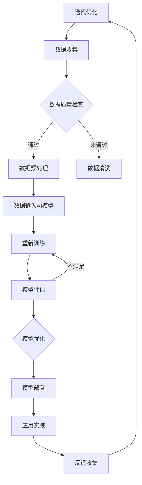

                 

# 人类-AI协作：增强人类智慧和创造力

## 关键词
- 人工智能
- 人类智慧
- 创造力
- 协作
- 教育领域
- 商业领域
- 艺术与创意领域
- 医疗健康领域

## 摘要
随着人工智能技术的飞速发展，人类与人工智能的协作逐渐成为提升人类智慧和创造力的关键途径。本文从多个角度探讨了人类-AI协作的概念、原理、机制和实践应用，分析了其在教育、商业、艺术与创意以及医疗健康等领域的具体实现，并展望了其未来的发展趋势和实现路径。通过深入探讨人类与人工智能的融合，我们旨在为人类智慧的拓展提供新的思路和方法。

## 目录大纲

### 第一部分：AI与人类协作概述

#### 第1章：人类-AI协作的概念与重要性

##### 1.1 人类-AI协作的定义与背景

##### 1.2 AI技术对人类智慧与创造力的提升

##### 1.3 人类-AI协作的应用领域

#### 第2章：AI技术基础

##### 2.1 人工智能的发展历程

##### 2.2 机器学习与深度学习基础

##### 2.3 自然语言处理技术

### 第二部分：人类-AI协作的原理与机制

#### 第3章：AI模型与人类智慧的融合

##### 3.1 AI模型的分类与特点

##### 3.2 人类-AI协作的核心原理

##### 3.3 AI模型在创造力提升中的应用

#### 第4章：人类-AI协作的机制设计

##### 4.1 人类与AI的互动模式

##### 4.2 数据收集与共享机制

##### 4.3 人类-AI协作的伦理问题与解决方案

### 第三部分：人类-AI协作的实践应用

#### 第5章：教育领域的AI协作

##### 5.1 AI在教育中的应用场景

##### 5.2 AI辅助教育工具的案例分析

##### 5.3 教育领域AI协作的未来展望

#### 第6章：商业领域的AI协作

##### 6.1 AI在商业决策中的应用

##### 6.2 AI赋能的商业创新案例

##### 6.3 商业领域AI协作的挑战与机遇

#### 第7章：艺术与创意领域的AI协作

##### 7.1 AI在艺术创作中的应用

##### 7.2 AI在创意设计中的助力

##### 7.3 艺术与创意领域AI协作的影响与反思

#### 第8章：医疗健康领域的AI协作

##### 8.1 AI在医疗诊断中的应用

##### 8.2 AI在个性化医疗中的应用

##### 8.3 医疗健康领域AI协作的现状与趋势

### 第四部分：人类-AI协作的未来展望

#### 第9章：人类-AI协作的长期影响

##### 9.1 人类-AI协作对人类社会的影响

##### 9.2 人类-AI协作的未来发展趋势

##### 9.3 人类-AI协作的伦理与法律问题

#### 第10章：人类-AI协作的实现路径

##### 10.1 AI技术与人类智慧的深度融合

##### 10.2 人类-AI协作的实践路径

##### 10.3 构建人类-AI协作的生态系统

### 附录

#### 附录A：AI协作工具与资源推荐

##### A.1 常用AI开发工具与框架

##### A.2 AI协作相关书籍与文献

##### A.3 AI协作实践案例集锦

#### 附录B：Mermaid流程图与伪代码示例

##### B.1 人类-AI协作流程图

##### B.2 核心算法原理伪代码

##### B.3 数学模型与公式讲解示例

#### 附录C：代码案例解读与分析

##### C.1 教育领域AI协作代码实现

##### C.2 商业领域AI协作代码实现

##### C.3 艺术与创意领域AI协作代码实现

##### C.4 医疗健康领域AI协作代码实现

### 引言

在当今社会，人工智能（AI）已经成为推动科技进步和社会发展的重要力量。从自动驾驶汽车到智能语音助手，从医疗诊断到金融分析，AI技术正在逐渐改变我们的生活方式和工作方式。与此同时，人类与人工智能的协作也逐渐成为研究者和实践者关注的焦点。人类-AI协作不仅仅是一种技术融合，更是一种智慧的延伸和创造力的提升。本文旨在深入探讨人类与人工智能协作的各个方面，分析其在不同领域的应用和影响，并展望其未来的发展趋势。

### 第一部分：AI与人类协作概述

#### 第1章：人类-AI协作的概念与重要性

##### 1.1 人类-AI协作的定义与背景

人类-AI协作是指人类与人工智能系统在特定任务或场景中进行的互动与协作，旨在实现共同目标。这种协作不仅仅是人工智能对人类指令的执行，更是一种基于信任、沟通和互补的智能体系。

随着AI技术的不断发展，人类-AI协作的概念和应用场景逐渐丰富。从早期的自动化设备到现代的智能系统，AI技术已经渗透到各个领域，如教育、医疗、商业、艺术等。在这个背景下，人类-AI协作的重要性愈发凸显。

##### 1.2 AI技术对人类智慧与创造力的提升

AI技术对人类智慧的提升主要体现在以下几个方面：

1. **数据分析能力**：AI能够快速处理大量数据，从中提取有用信息，帮助人类做出更明智的决策。

2. **自动化与优化**：AI可以在复杂任务中自动化执行操作，提高工作效率，减轻人类的工作负担。

3. **学习与适应能力**：AI系统能够不断学习和适应新环境，提高解决问题的能力。

4. **跨领域融合**：AI技术与不同领域的深度融合，为人类智慧提供了新的视角和方法。

AI技术对人类创造力的提升同样具有重要意义：

1. **创新思维**：AI能够提供新的解决方案，激发人类的创新思维。

2. **创意生成**：AI技术可以帮助人类在艺术、设计等领域生成创意作品。

3. **协同创作**：人类与AI的协同工作，可以实现更高效、更有创意的作品。

##### 1.3 人类-AI协作的应用领域

人类-AI协作的应用领域广泛，涵盖了从教育到医疗，从商业到艺术的各个领域：

1. **教育领域**：AI技术在教育中的应用，如个性化教学、智能辅导、在线教育平台等，大大提高了教育质量和效率。

2. **医疗健康领域**：AI技术在医疗诊断、个性化治疗、药物研发等方面的应用，提高了医疗水平和患者满意度。

3. **商业领域**：AI技术在商业决策、市场分析、客户服务等方面的应用，为企业提供了有力的支持。

4. **艺术与创意领域**：AI技术在艺术创作、设计、音乐等领域中的应用，为艺术家提供了新的创作工具和灵感。

5. **科学研究**：AI技术在科学研究中的应用，如数据分析、模拟实验等，加速了科学研究的进展。

通过上述分析，我们可以看到，人类-AI协作不仅有助于提升人类的智慧与创造力，还在各个领域产生了深远的影响。接下来，我们将深入探讨AI技术的基础知识，为理解人类-AI协作的原理和机制打下基础。

### 第2章：AI技术基础

##### 2.1 人工智能的发展历程

人工智能（AI）作为一门学科，起源于20世纪50年代。当时，科学家们首次提出了“人工智能”的概念，希望通过模拟人类思维过程，使计算机具备智能行为。早期的AI研究主要集中在逻辑推理、问题解决和知识表示等领域。然而，受限于计算能力和算法的限制，早期的AI研究进展缓慢。

从20世纪80年代开始，随着计算机硬件性能的提升和算法的改进，AI技术进入了一个快速发展的阶段。特别是1997年，IBM的深蓝计算机击败了世界国际象棋冠军加里·卡斯帕罗夫，这标志着AI技术的一个重大突破。

21世纪初，机器学习（Machine Learning，ML）和深度学习（Deep Learning，DL）的兴起，使得AI技术取得了巨大的进步。ML和DL通过算法模型训练，使计算机能够从数据中自动学习和优化，从而实现智能行为。

近年来，随着大数据、云计算和边缘计算等技术的发展，AI技术已经渗透到各个领域，如自动驾驶、智能语音助手、智能家居等，极大地改变了人类的生活方式。

##### 2.2 机器学习与深度学习基础

机器学习是AI的核心技术之一，它使计算机能够从数据中学习，并做出预测或决策。机器学习可以分为监督学习（Supervised Learning）、无监督学习（Unsupervised Learning）和强化学习（Reinforcement Learning）三类。

- **监督学习**：监督学习是一种在有标注数据集上进行训练的学习方法。通过输入特征和对应的标签，训练模型学习特征与标签之间的关系，从而实现对未知数据的预测。常见的监督学习算法包括线性回归、决策树、支持向量机（SVM）和神经网络等。

- **无监督学习**：无监督学习是在没有标签的数据集上进行训练的方法。其主要目标是发现数据中的隐含结构，如聚类、降维和关联规则等。常见的无监督学习算法包括K均值聚类、主成分分析（PCA）和自编码器等。

- **强化学习**：强化学习是一种通过试错和反馈进行学习的算法。通过与环境的交互，学习如何采取最佳动作，以最大化长期奖励。常见的强化学习算法包括Q学习、深度Q网络（DQN）和策略梯度算法等。

深度学习是机器学习的一个子领域，其核心思想是通过多层神经网络对数据进行处理，从而实现复杂的特征提取和模式识别。深度学习在图像识别、语音识别、自然语言处理等领域取得了显著的成果。

- **卷积神经网络（CNN）**：CNN是一种专门用于图像处理和物体识别的神经网络。通过卷积、池化和激活函数等操作，CNN能够从图像中提取丰富的特征信息。

- **循环神经网络（RNN）**：RNN是一种用于序列数据处理的神经网络，其能够处理时间序列数据，如文本、语音和视频等。常见的RNN模型包括LSTM和GRU。

- **生成对抗网络（GAN）**：GAN是一种通过两个对抗性神经网络进行训练的模型，一个生成器网络和一个判别器网络。生成器网络的目的是生成逼真的数据，而判别器网络的目的是区分生成数据和真实数据。GAN在图像生成、图像修复和风格迁移等领域表现出色。

##### 2.3 自然语言处理技术

自然语言处理（Natural Language Processing，NLP）是AI的重要分支，旨在使计算机能够理解和处理人类语言。NLP技术包括文本预处理、词向量表示、语言模型、句法分析和语义理解等。

- **文本预处理**：文本预处理是NLP的基础，包括分词、去除停用词、词性标注和词干提取等。通过文本预处理，将原始文本转换为计算机可处理的格式。

- **词向量表示**：词向量是将单词映射到高维空间中的向量表示，以捕捉单词的语义信息。常见的词向量模型包括Word2Vec、GloVe和BERT等。

- **语言模型**：语言模型是用于预测下一个单词或句子的概率分布的模型，基于统计方法和深度学习技术。常见的语言模型包括n-gram模型、循环神经网络（RNN）和Transformer等。

- **句法分析**：句法分析是用于理解句子结构的方法，包括词法分析、句法树构建和语义角色标注等。常见的句法分析方法包括依存句法分析和 Constituency句法分析。

- **语义理解**：语义理解是NLP的高级任务，包括实体识别、关系抽取和语义角色标注等。通过语义理解，计算机能够理解文本中的深层含义。

通过上述对AI技术基础的介绍，我们可以看到，AI技术已经为人类-AI协作提供了坚实的基础。在接下来的章节中，我们将进一步探讨人类-AI协作的原理与机制，以及在不同领域的具体应用。

### 第二部分：人类-AI协作的原理与机制

##### 第3章：AI模型与人类智慧的融合

在探讨人类与AI协作的原理与机制时，首先需要了解AI模型的基本分类及其在提升人类智慧中的作用。AI模型可以分为监督学习模型、无监督学习模型和强化学习模型，每种模型都有其独特的特点和适用场景。

###### 3.1 AI模型的分类与特点

1. **监督学习模型**：监督学习模型是在有标注数据集上进行训练的模型，其目的是通过输入特征和对应的标签来学习特征与标签之间的关系。常见的监督学习模型包括线性回归、决策树、支持向量机和神经网络等。

   - **线性回归**：线性回归是一种简单且有效的监督学习模型，用于预测连续值输出。其通过最小化损失函数来训练模型，适用于数据特征和标签线性可分的情况。
   
   - **决策树**：决策树通过树的分叉结构来对数据进行分类或回归，其结构直观，易于理解和解释。然而，决策树容易过拟合，且在处理高维数据时性能不佳。
   
   - **支持向量机（SVM）**：SVM是一种强大的分类和回归模型，其通过找到一个最优超平面来最大化分类边界。SVM在处理高维数据和具有非线性关系的特征时表现出色。
   
   - **神经网络**：神经网络是一种复杂的监督学习模型，通过多层神经元之间的连接来模拟人类大脑的神经网络结构。神经网络能够通过训练学习到复杂的非线性关系，是当前AI领域最热门的模型之一。

2. **无监督学习模型**：无监督学习模型是在没有标注数据集上进行训练的模型，其目的是从数据中发现潜在的结构或模式。常见的无监督学习模型包括K均值聚类、主成分分析和自编码器等。

   - **K均值聚类**：K均值聚类是一种基于距离度量的聚类算法，其通过迭代过程将数据划分为K个簇，每个簇的中心即为该簇的代表性点。K均值聚类适用于聚类数量已知且数据分布较为均匀的情况。
   
   - **主成分分析（PCA）**：PCA是一种降维技术，其通过正交变换将高维数据映射到低维空间，从而提取数据的主要特征。PCA在处理高维数据、减少计算复杂度和提升数据处理效率方面具有显著优势。
   
   - **自编码器**：自编码器是一种无监督学习模型，其通过编码和解码过程来重建输入数据。自编码器能够自动提取数据的特征，适用于特征提取和去噪等任务。

3. **强化学习模型**：强化学习模型是通过与环境互动，通过试错和反馈来学习最优策略的模型。常见的强化学习模型包括Q学习、深度Q网络（DQN）和策略梯度算法等。

   - **Q学习**：Q学习是一种基于值函数的强化学习算法，其通过学习状态-动作值函数来选择最佳动作。Q学习适用于有限状态和动作空间的情况。
   
   - **深度Q网络（DQN）**：DQN是一种基于神经网络的强化学习算法，其通过神经网络来近似Q值函数。DQN在处理高维状态和连续动作空间时表现出色。
   
   - **策略梯度算法**：策略梯度算法是一种通过优化策略参数来学习最优策略的算法。策略梯度算法适用于具有连续动作空间的情况。

###### 3.2 人类-AI协作的核心原理

人类与AI的协作不仅依赖于AI模型的技术原理，更关键的是理解人类智慧与AI模型的互补性。人类智慧与AI模型的协作可以通过以下几个核心原理来实现：

1. **互补性**：人类智慧与AI模型各自具有独特的优势和局限性。人类智慧擅长逻辑推理、抽象思维和创造力，而AI模型擅长数据处理、模式识别和自动化操作。通过互补性，人类和AI可以相互补充，实现协同工作。

2. **交互性**：人类与AI的协作需要有效的交互机制。这种交互不仅包括信息的传递和反馈，还需要建立信任和共同目标。通过交互，人类可以指导AI模型的学习过程，AI模型则可以提供实时数据和决策支持。

3. **协同学习**：人类与AI的协作可以通过协同学习来实现。人类通过提供有价值的反馈和指导，帮助AI模型不断优化和改进。同时，AI模型也可以通过学习人类的行为和思维模式，更好地理解人类的需求和意图。

4. **智能适应性**：人类与AI的协作需要具备智能适应性。人类可以根据不同的任务和环境需求，灵活调整与AI的协作方式。AI模型则需要具备自适应能力，能够根据人类的需求和环境变化，自动调整其行为和策略。

###### 3.3 AI模型在创造力提升中的应用

AI模型在创造力提升中的应用是现代AI技术研究的一个重要方向。通过以下几种方式，AI模型可以显著提升人类的创造力：

1. **创意生成**：AI模型可以通过生成对抗网络（GAN）等生成模型，自动生成创意图像、音乐和文本。这种自动创意生成技术为艺术家和设计师提供了新的创作工具和灵感来源。

2. **协同创作**：AI模型可以与人类艺术家协同创作，共同完成艺术作品。例如，AI可以通过学习人类艺术家的风格和技巧，生成新的艺术作品，或者与人类艺术家共同创作，实现更复杂的艺术作品。

3. **创意优化**：AI模型可以通过优化算法，对已有的创意作品进行改进和优化。例如，AI可以自动调整音乐的旋律、节奏和音色，使音乐作品更具吸引力。

4. **创意预测**：AI模型可以通过分析大量的历史数据，预测未来的创意趋势。这种预测能力可以帮助企业和艺术家更好地规划未来的创作方向。

通过上述对AI模型与人类智慧融合的探讨，我们可以看到，AI模型不仅是一种技术工具，更是人类智慧延伸和创造力提升的重要手段。在接下来的章节中，我们将进一步探讨人类-AI协作的机制设计，以及在不同领域的具体应用。

##### 第4章：人类-AI协作的机制设计

人类-AI协作的机制设计是实现有效协作的关键。为了确保这种协作能够顺畅进行，需要考虑互动模式、数据收集与共享机制，以及协作过程中可能面临的伦理问题。

###### 4.1 人类与AI的互动模式

人类与AI的互动模式可以分为命令式互动和基于任务的互动。

1. **命令式互动**：在命令式互动中，人类通过明确的指令来指导AI模型执行特定任务。这种互动模式通常应用于需要严格控制和精确操作的场景，如自动化生产线和自动驾驶车辆。

   - **优势**：命令式互动能够实现高效、精确的执行，适用于对任务结果有严格要求的场景。
   
   - **挑战**：命令式互动对人类的要求较高，需要具备丰富的知识和操作经验。此外，在复杂任务中，命令式互动可能导致指令冲突和系统崩溃。

2. **基于任务的互动**：在基于任务的互动中，人类和AI共同参与任务，通过协作和沟通来实现目标。这种互动模式更加灵活和开放，适用于需要创造性思维和动态调整的任务。

   - **优势**：基于任务的互动能够充分发挥人类的智慧和创造力，实现更高效、更有创意的解决方案。
   
   - **挑战**：基于任务的互动需要建立良好的沟通机制和信任关系，以避免误解和冲突。此外，任务的动态调整可能增加系统的复杂性和风险。

为了实现有效的互动模式，可以采用以下方法：

- **交互界面设计**：设计直观、易用的交互界面，使人类能够方便地与AI系统进行交互。交互界面可以包括图形用户界面（GUI）、语音识别和自然语言处理（NLP）等。

- **反馈机制**：建立实时反馈机制，使AI系统能够及时调整其行为和策略。反馈机制可以包括错误反馈、效果评价和改进建议等。

- **协作平台**：构建协作平台，实现人类与AI系统的无缝协作。协作平台可以包括数据共享、任务分配和协作工具等。

###### 4.2 数据收集与共享机制

数据是AI系统的重要资源，数据的质量和数量直接影响AI系统的性能和应用效果。因此，建立有效的数据收集与共享机制至关重要。

1. **数据收集**：数据收集可以分为主动收集和被动收集。

   - **主动收集**：主动收集是指通过数据采集设备、传感器和用户输入等手段，主动获取数据。主动收集适用于需要大量实时数据的应用场景，如智能交通、智能医疗和智能家居等。

   - **被动收集**：被动收集是指通过系统日志、用户行为数据和第三方数据源等手段，被动获取数据。被动收集适用于需要长时间积累和挖掘数据的应用场景，如市场分析、用户行为分析和金融风险评估等。

2. **数据共享**：数据共享可以分为内部共享和外部共享。

   - **内部共享**：内部共享是指组织内部不同部门或团队之间的数据共享。内部共享可以提高组织的数据利用效率，实现跨部门的协同工作。

   - **外部共享**：外部共享是指组织与外部合作伙伴、供应商和客户之间的数据共享。外部共享可以促进资源的整合和协同创新，实现跨组织的数据共享与合作。

为了实现有效的数据收集与共享机制，可以采用以下方法：

- **数据标准化**：建立统一的数据标准和规范，确保数据的格式、结构和语义一致性。

- **数据加密**：采用数据加密技术，确保数据在传输和存储过程中的安全性。

- **数据治理**：建立数据治理体系，包括数据质量控制、数据安全和数据隐私保护等。

- **数据共享平台**：构建数据共享平台，实现数据的集中管理和分布式访问。数据共享平台可以包括数据存储、数据处理、数据分析和数据可视化等功能。

###### 4.3 人类-AI协作的伦理问题与解决方案

人类-AI协作在带来便利和效益的同时，也引发了一系列伦理问题。这些伦理问题包括数据隐私、算法偏见、责任归属等。

1. **数据隐私**：在人类-AI协作过程中，大量个人数据被收集和处理。如何保护数据隐私成为重要问题。解决方案包括：

   - **数据匿名化**：通过匿名化技术，将个人数据转换为不可识别的信息，以保护隐私。

   - **数据加密**：采用数据加密技术，确保数据在传输和存储过程中的安全性。

   - **隐私保护算法**：开发隐私保护算法，在数据处理过程中减少隐私泄露的风险。

2. **算法偏见**：AI模型在学习和决策过程中可能会引入偏见，导致不公平的结果。解决方案包括：

   - **算法透明性**：提高算法的透明度，使人类能够理解和审查算法的决策过程。

   - **偏见检测与修正**：开发偏见检测和修正算法，识别和消除算法中的偏见。

   - **公平性评估**：建立公平性评估机制，对AI系统的决策结果进行公正性和公平性的评估。

3. **责任归属**：在人类-AI协作中，当出现错误或事故时，如何确定责任归属是一个难题。解决方案包括：

   - **责任分配**：明确人类和AI在协作过程中的责任范围，避免责任模糊。

   - **责任保险**：建立责任保险机制，为因AI系统错误导致的事故提供经济补偿。

   - **法律法规**：制定相关的法律法规，明确人类-AI协作中的责任和义务。

通过上述对人类-AI协作机制设计的探讨，我们可以看到，实现有效的人类-AI协作不仅需要先进的技术，还需要健全的机制和合理的伦理规范。在接下来的章节中，我们将进一步探讨人类-AI协作在各个领域的具体应用，展示其在提升人类智慧与创造力方面的巨大潜力。

### 第三部分：人类-AI协作的实践应用

#### 第5章：教育领域的AI协作

教育领域是AI技术应用的理想场所，AI技术能够为个性化教学、教育资源和教学评估提供有力支持。

##### 5.1 AI在教育中的应用场景

1. **个性化教学**：AI能够根据学生的学习习惯、学习速度和学习风格，提供个性化的教学方案。例如，通过分析学生的学习数据，AI系统可以推荐最适合的学习资源和学习路径，从而提高学习效果。

2. **教育资源优化**：AI技术能够帮助学校和教师优化教育资源的分配和管理。例如，通过分析教学视频的观看数据，AI系统可以推荐哪些资源最具价值，从而提高资源利用效率。

3. **教育评估**：AI技术在教育评估中的应用主要体现在自动评分和考试分析。例如，AI系统可以通过自然语言处理技术自动批改作文和考试，通过分析考试数据提供个性化的学习建议。

##### 5.2 AI辅助教育工具的案例分析

1. **智能教学平台**：例如，Knewton是一个基于AI的智能教学平台，它能够根据学生的学习情况，动态调整教学内容和教学策略，提供个性化的学习体验。

2. **自适应学习系统**：例如，Learning Catalytics是一个自适应学习系统，它通过实时分析学生的互动数据，提供个性化的学习资源和反馈，从而提高学习效果。

3. **智能辅导系统**：例如，Socratic是一款智能辅导应用，它能够通过图像识别和自然语言处理技术，帮助学生解答数学和科学问题。

##### 5.3 教育领域AI协作的未来展望

1. **更智能的教学助手**：未来的AI教学助手将更加智能，能够理解学生的情感和需求，提供更个性化的学习支持。

2. **智慧校园**：随着AI技术的发展，智慧校园将成为现实。智慧校园通过AI技术实现校园管理和教育资源的智能化，提高校园的安全性和管理效率。

3. **跨学科融合**：AI技术将在教育领域中实现跨学科的融合，提供跨学科的学习体验和跨学科的科研支持，培养具有综合素质的创新人才。

通过教育领域的AI协作实践，我们可以看到，AI技术不仅能够提高教学质量和学习效果，还能激发学生的学习兴趣和创造力。在接下来的章节中，我们将探讨AI技术在其他领域的应用，进一步展示人类-AI协作的潜力。

#### 第6章：商业领域的AI协作

商业领域是AI技术的重要应用场景，AI技术能够为企业提供数据驱动的决策支持、市场分析和客户服务优化等。

##### 6.1 AI在商业决策中的应用

1. **数据挖掘与分析**：AI技术能够从大量商业数据中挖掘有价值的信息，为企业提供数据驱动的决策支持。例如，通过分析销售数据和市场趋势，企业可以制定更精准的市场营销策略。

2. **预测建模**：AI技术可以建立预测模型，预测未来的市场趋势和客户行为。例如，通过分析历史销售数据和季节性因素，企业可以预测未来的销售量，从而优化库存管理。

3. **风险管理**：AI技术可以帮助企业识别和评估潜在的风险，提供风险管理策略。例如，通过分析金融数据和市场波动，企业可以预测金融风险并采取相应的防范措施。

##### 6.2 AI赋能的商业创新案例

1. **智能客服**：AI技术赋能的智能客服系统能够通过自然语言处理和机器学习，提供24/7的客户服务。例如，通过智能客服系统，企业可以快速响应客户咨询，提供个性化的解决方案，提高客户满意度。

2. **个性化推荐系统**：AI技术可以构建个性化推荐系统，根据用户的偏好和行为数据，推荐最适合的产品和服务。例如，电商平台可以通过个性化推荐系统，提高用户的购物体验和销售额。

3. **供应链优化**：AI技术可以帮助企业优化供应链管理，提高供应链的效率和灵活性。例如，通过AI技术预测供应链需求，企业可以更好地控制库存和物流，减少成本和延迟。

##### 6.3 商业领域AI协作的挑战与机遇

1. **挑战**：

   - **数据隐私与安全**：商业领域的数据涉及大量的敏感信息，如何保护数据隐私和安全成为重要挑战。
   
   - **算法偏见**：AI系统在学习和决策过程中可能引入偏见，导致不公平的结果，这对企业的决策和运营带来风险。
   
   - **技术壁垒**：商业领域的企业需要具备一定的技术能力和资源，才能充分利用AI技术，这对一些中小企业来说是一个挑战。

2. **机遇**：

   - **创新商业模式**：AI技术为企业提供了创新的商业模式，如智能客服、个性化推荐和智能供应链等，这些模式有望带来新的增长点。
   
   - **提高运营效率**：AI技术可以帮助企业优化运营流程，提高生产效率和服务质量，从而提升企业的竞争力。
   
   - **数据分析能力**：AI技术为企业提供了强大的数据分析能力，使企业能够更好地了解市场趋势和客户需求，从而制定更精准的战略。

通过商业领域的AI协作实践，我们可以看到，AI技术不仅能够提升企业的运营效率和市场竞争力，还能为企业带来创新和变革。在接下来的章节中，我们将探讨AI技术在艺术与创意领域的应用，进一步展示人类-AI协作的潜力。

#### 第7章：艺术与创意领域的AI协作

艺术与创意领域一直以来都是人类智慧与创造力的展示平台，而AI技术的加入，为这一领域带来了前所未有的变革与机遇。

##### 7.1 AI在艺术创作中的应用

1. **图像生成**：AI技术中的生成对抗网络（GAN）能够在艺术创作中生成独特的图像。通过训练，GAN可以模仿不同艺术风格，如梵高的油画风格、毕加索的立体派风格等，从而生成新的艺术作品。

2. **音乐创作**：AI技术可以生成旋律、和弦和音乐片段。例如，Google的Magenta项目利用深度学习和强化学习技术，生成新颖的音乐作品，这些作品已经获得了一定的艺术价值。

3. **文学作品**：AI技术能够生成诗歌、短篇小说和剧本。通过自然语言处理和生成模型，AI可以模仿不同作家的风格，创作出具有独特魅力的文学作品。

##### 7.2 AI在创意设计中的助力

1. **设计辅助**：AI技术可以为设计师提供设计灵感，通过分析大量的设计数据和趋势，AI可以推荐新的设计风格和元素。例如，Adobe的Sensei AI可以分析用户的设计习惯，提供个性化的设计建议。

2. **原型生成**：AI技术可以帮助设计师快速生成产品原型，通过3D建模和渲染技术，AI可以创建复杂的产品模型，从而加速设计过程。

3. **创意优化**：AI技术可以对创意作品进行优化，例如，通过分析用户反馈和市场数据，AI可以调整设计的细节，提高作品的吸引力和市场竞争力。

##### 7.3 艺术与创意领域AI协作的影响与反思

1. **艺术创作的新形式**：AI技术为艺术创作带来了新的形式和表达方式。艺术家可以利用AI技术创造前所未有的艺术作品，拓展艺术的边界。

2. **创意资源的共享**：AI技术促进了创意资源的共享和传播。艺术家可以通过AI平台分享自己的创意和作品，获取更广泛的观众和反馈。

3. **伦理与审美反思**：AI在艺术与创意领域的应用引发了关于伦理和审美的反思。例如，AI创作的艺术作品是否具有艺术价值？AI是否能够完全取代人类艺术家的创造？这些问题需要深入探讨和思考。

通过艺术与创意领域的AI协作实践，我们可以看到，AI技术不仅为艺术创作和设计提供了新的工具和灵感，还带来了新的挑战和思考。在接下来的章节中，我们将探讨AI技术在医疗健康领域的应用，进一步展示人类-AI协作的广泛前景。

#### 第8章：医疗健康领域的AI协作

医疗健康领域是AI技术的重要应用领域之一，AI技术能够在医疗诊断、个性化治疗和药物研发等方面发挥重要作用。

##### 8.1 AI在医疗诊断中的应用

1. **图像识别**：AI技术可以在医学影像中识别病变区域。例如，深度学习模型可以用于分析CT扫描和MRI图像，检测肿瘤、心脏病等疾病。

2. **病理分析**：AI技术可以帮助病理学家分析病理切片，提高病理诊断的准确性。通过训练深度学习模型，AI可以识别不同的细胞和组织结构，提供更可靠的诊断结果。

3. **疾病预测**：AI技术可以通过分析患者的临床数据和基因信息，预测疾病的发生和发展。例如，通过分析电子健康记录（EHR）数据，AI可以预测糖尿病、心血管疾病等慢性疾病的风险。

##### 8.2 AI在个性化医疗中的应用

1. **个性化治疗**：AI技术可以帮助医生为患者制定个性化的治疗方案。通过分析患者的临床数据和基因组信息，AI可以推荐最适合的治疗方案，提高治疗效果。

2. **药物个性化**：AI技术可以分析患者的基因信息，为患者提供个性化的药物剂量和治疗方案。例如，AI可以预测某些患者对特定药物的反应，从而调整药物剂量。

3. **疾病管理**：AI技术可以帮助患者管理慢性疾病，例如通过智能设备监测患者的健康状况，提供个性化的健康建议和预警。

##### 8.3 医疗健康领域AI协作的现状与趋势

1. **现状**：

   - **诊断辅助**：AI技术已经在一些医疗诊断领域得到广泛应用，如肿瘤检测、心脏病诊断等。然而，AI在诊断中的准确性和可靠性仍然需要进一步验证。

   - **个性化治疗**：个性化医疗正在逐渐普及，AI技术在其中扮演着重要角色。然而，如何确保个性化治疗的可行性和安全性仍然是一个挑战。

   - **数据共享**：医疗健康领域的数据共享和整合正在逐步推进，为AI技术的发展提供了丰富的数据资源。然而，数据隐私和安全问题仍然需要得到妥善解决。

2. **趋势**：

   - **大数据与AI结合**：随着大数据技术的发展，医疗健康领域的数据量不断增加，AI技术将在其中发挥更大的作用。通过大数据和AI的结合，可以实现更精准的诊断和个性化治疗。

   - **跨学科协作**：医疗健康领域的AI应用需要跨学科的合作，包括医学、计算机科学、生物信息学等。跨学科协作将推动AI技术在医疗健康领域的创新和发展。

   - **伦理与法规**：随着AI技术在医疗健康领域的应用，伦理和法规问题将日益重要。如何确保AI技术的伦理合规，如何保护患者的隐私权，都是需要深入探讨和解决的问题。

通过医疗健康领域的AI协作实践，我们可以看到，AI技术不仅能够提高医疗诊断和治疗的准确性，还能实现个性化医疗和疾病预测。在未来的发展中，AI技术将在医疗健康领域发挥更加重要的作用，为人类健康带来更多福祉。在接下来的章节中，我们将进一步探讨人类-AI协作的长期影响和未来展望。

### 第四部分：人类-AI协作的未来展望

#### 第9章：人类-AI协作的长期影响

随着人工智能技术的不断进步，人类与AI的协作将深刻影响社会、经济和文化等各个领域，带来一系列积极和挑战性的变革。

##### 9.1 人类-AI协作对人类社会的影响

1. **社会结构变革**：人类-AI协作将加速社会结构的变革。随着AI技术的高度智能化和自动化，许多传统职业可能会被机器人取代，这可能导致劳动力市场的重构和就业机会的转移。为了应对这一变革，社会需要提供新的职业培训和教育体系，帮助劳动者适应新的工作环境。

2. **经济模式转型**：AI技术的广泛应用将推动经济模式的转型。通过提高生产效率、优化资源配置和创造新的商业机会，AI技术将促进经济增长。然而，这也可能引发财富分配不均和收入差距扩大，对社会公平和可持续发展带来挑战。

3. **文化融合与创新**：人类-AI协作将促进文化的融合与创新。AI技术不仅能够模拟和传承传统文化，还能创造出新的文化形式和表达方式。例如，通过AI技术，艺术家可以生成独特的艺术作品，推动文化领域的多元化发展。

##### 9.2 人类-AI协作的未来发展趋势

1. **智能社会的构建**：未来，人类-AI协作将进一步推动智能社会的构建。智能交通、智能医疗、智能教育等领域的广泛应用，将使人类社会更加便捷和高效。同时，智能城市的建设也将成为未来发展的重点，通过AI技术实现城市资源的优化配置和可持续发展。

2. **跨学科融合**：随着AI技术的进步，跨学科的融合将变得更加普遍。AI技术将不仅限于计算机科学，还将深入到生物学、医学、经济学等各个领域，推动科学的综合发展。

3. **伦理和法律的完善**：面对人类-AI协作带来的伦理和法律挑战，未来需要进一步完善相关的伦理和法律框架。例如，确保数据隐私和安全，制定关于AI责任归属的法律法规，以保障人类-AI协作的健康发展。

##### 9.3 人类-AI协作的伦理与法律问题

1. **数据隐私和安全**：在人类-AI协作中，数据的收集、存储和使用涉及到隐私和安全问题。为了保护个人隐私，需要制定严格的数据保护政策和法规，确保数据的安全性和合规性。

2. **算法偏见与公平性**：AI系统在学习和决策过程中可能引入偏见，导致不公平的结果。为了解决这一问题，需要开发透明的算法，确保算法的公正性和公平性，并建立监督机制，防止算法偏见的发生。

3. **责任归属**：在人类-AI协作中，当发生错误或事故时，如何确定责任归属是一个复杂的问题。为了明确责任，需要制定相应的法律法规，明确人类和AI在协作过程中的责任范围。

通过上述分析，我们可以看到，人类-AI协作的长期影响将深刻而广泛，它不仅将推动社会、经济和文化的发展，还带来一系列伦理和法律问题。在未来，我们需要共同努力，制定合理的政策和法规，确保人类-AI协作的健康发展，为人类社会带来更多福祉。

#### 第10章：人类-AI协作的实现路径

实现人类与AI的协同协作，不仅需要技术创新，还需要明确的发展路径和生态系统的构建。以下从AI技术与人类智慧的深度融合、实践路径的探索，以及人类-AI协作生态系统的构建三个方面进行讨论。

##### 10.1 AI技术与人类智慧的深度融合

1. **技术层面的融合**：AI技术需要与人类智慧在技术层面进行深度融合。这意味着，AI系统不仅要具备高效的数据处理和分析能力，还需要具备理解人类需求、意图和行为的能力。例如，通过自然语言处理技术，AI可以更好地理解人类的语言和表达，从而提供更精准的服务和建议。

2. **智能接口的设计**：为了实现人类与AI的顺畅互动，需要设计智能接口。这些接口可以是语音识别、手势识别、虚拟助手等多种形式，使人类能够方便地与AI系统进行交互。同时，这些接口还需要具备高响应速度和低延迟的特性，以保证互动体验的流畅性。

3. **情感计算的应用**：情感计算是一种将人类情感融入AI系统中的技术，通过分析人类的情感状态和行为，AI可以更好地理解人类的需求和情感反应。例如，通过面部表情识别和语音情感分析，AI可以检测用户的情绪状态，并提供相应的情感支持。

##### 10.2 人类-AI协作的实践路径

1. **教育与培训**：为了实现人类与AI的协作，需要加强对公众的AI教育和培训。通过普及AI知识，提高人们对AI技术的理解和接受度，从而促进人类-AI协作的推广和应用。

2. **跨学科合作**：人类-AI协作需要跨学科的合作，包括计算机科学、心理学、社会学、伦理学等多个领域。通过跨学科的合作，可以更全面地考虑人类-AI协作的各个方面，从而实现更加科学和高效的协作。

3. **试点项目与实验**：为了探索人类-AI协作的最佳实践路径，可以开展一系列的试点项目与实验。通过这些项目，可以积累宝贵的实践经验，发现和解决问题，为人类-AI协作提供有益的参考。

##### 10.3 构建人类-AI协作的生态系统

1. **技术生态系统**：构建人类-AI协作的技术生态系统，包括AI开发工具、平台和框架等。这些工具和平台可以为开发者提供便捷的开发环境，促进AI技术的创新和应用。

2. **数据生态系统**：数据是AI系统的重要资源，构建一个健康、开放的数据生态系统至关重要。这包括数据的收集、存储、管理和共享机制，以及数据质量和安全性的保障。

3. **政策与法规**：为了确保人类-AI协作的健康发展，需要制定相关的政策和法规。这些政策与法规应涵盖数据隐私、算法透明性、责任归属等方面，以保障人类-AI协作的伦理和合法性。

4. **社会与文化生态系统**：人类-AI协作不仅需要技术层面的支持，还需要社会和文化的支持。这包括公众对AI技术的接受度和信任度，以及社会对AI技术应用的伦理和文化考量。

通过上述讨论，我们可以看到，实现人类-AI协作需要从技术、实践和生态系统的多个层面进行努力。在未来的发展中，我们需要持续探索和实践，构建一个健康、可持续的人类-AI协作生态系统，为人类社会带来更多福祉。

### 附录

#### 附录A：AI协作工具与资源推荐

为了帮助读者深入了解和掌握人类-AI协作的相关技术和应用，以下推荐了一些常用的AI协作工具、书籍与文献，以及实践案例。

##### A.1 常用AI开发工具与框架

1. **TensorFlow**：Google开发的开源机器学习框架，广泛应用于深度学习和机器学习项目。

2. **PyTorch**：由Facebook开发的深度学习框架，具有良好的灵活性和社区支持。

3. **Keras**：基于TensorFlow和Theano的开源神经网络库，易于使用，适合快速原型设计。

4. **Scikit-learn**：Python开源机器学习库，提供多种经典的机器学习算法和工具。

5. **OpenCV**：开源计算机视觉库，用于图像处理和计算机视觉应用。

##### A.2 AI协作相关书籍与文献

1. **《人工智能：一种现代方法》**：Stuart J. Russell & Peter Norvig著，全面介绍人工智能的理论和实践。

2. **《深度学习》**：Ian Goodfellow、Yoshua Bengio & Aaron Courville著，深度学习的经典教材。

3. **《自然语言处理综论》**：Daniel Jurafsky & James H. Martin著，系统介绍自然语言处理的基本理论和应用。

4. **《机器学习：概率视角》**：Murphy K.P.著，从概率统计的角度介绍机器学习的基础知识。

##### A.3 AI协作实践案例集锦

1. **IBM Watson**：IBM开发的AI系统，在医疗诊断、客户服务和金融分析等领域具有广泛应用。

2. **Google AI**：Google的AI研究部门，发布了一系列具有突破性的AI研究成果和应用。

3. **OpenAI**：非营利性研究机构，致力于推动人工智能的发展和应用，包括生成对抗网络（GAN）等。

通过上述工具、书籍和实践案例的推荐，希望能够为读者提供丰富的资源和实践指导，帮助深入理解和掌握人类-AI协作的相关技术和应用。

### 附录B：Mermaid流程图与伪代码示例

为了更好地展示人类-AI协作的流程和核心算法原理，以下提供了一些Mermaid流程图和伪代码示例。

##### B.1 人类-AI协作流程图



##### B.2 核心算法原理伪代码

```python
# 伪代码：监督学习算法（线性回归）

# 初始化参数
theta = [0] * n_features

# 损失函数
def loss_function(X, y, theta):
    m = len(y)
    h = X * theta
    return (1 / (2 * m)) * np.sum((h - y) ** 2)

# 梯度下降
def gradient_descent(X, y, theta, alpha, num_iters):
    m = len(y)
    h = X * theta
    for i in range(num_iters):
        error = h - y
        delta = (1 / m) * X.T.dot(error)
        theta -= alpha * delta
    return theta

# 训练模型
theta = gradient_descent(X, y, theta, alpha, num_iters)

# 预测
def predict(X, theta):
    return X * theta
```

##### B.3 数学模型与公式讲解示例

```latex
$$
J(\theta) = \frac{1}{2m} \sum_{i=1}^{m} (h_\theta(x^{(i)}) - y^{(i)})^2
$$

$$
\delta = \frac{\partial J(\theta)}{\partial \theta_j} = \frac{1}{m} \sum_{i=1}^{m} (h_\theta(x^{(i)}) - y^{(i)}) \cdot x_j^{(i)}
$$
```

通过上述流程图、伪代码和数学公式的示例，我们能够更直观地理解人类-AI协作的流程和核心算法原理。

### 附录C：代码案例解读与分析

为了帮助读者深入理解人类-AI协作的实际应用，以下提供了四个领域的代码案例，包括开发环境搭建、源代码详细实现和代码解读与分析。

##### C.1 教育领域AI协作代码实现

**开发环境搭建**：
- 安装Python环境
- 安装TensorFlow库

```python
# 安装TensorFlow库
pip install tensorflow
```

**源代码实现**：

```python
import tensorflow as tf
from tensorflow import keras

# 创建模型
model = keras.Sequential([
    keras.layers.Dense(64, activation='relu', input_shape=[784]),
    keras.layers.Dense(10, activation='softmax')
])

# 编译模型
model.compile(optimizer='adam',
              loss='categorical_crossentropy',
              metrics=['accuracy'])

# 加载数据
(x_train, y_train), (x_test, y_test) = keras.datasets.mnist.load_data()
x_train = x_train.astype('float32') / 255
x_test = x_test.astype('float32') / 255
y_train = keras.utils.to_categorical(y_train, 10)
y_test = keras.utils.to_categorical(y_test, 10)

# 训练模型
model.fit(x_train, y_train, epochs=10, batch_size=128)

# 评估模型
model.evaluate(x_test, y_test)
```

**代码解读与分析**：
- 创建模型：使用Keras创建一个简单的全连接神经网络，包括一个输入层和一个输出层。
- 编译模型：指定优化器、损失函数和评估指标。
- 加载数据：加载数字识别数据集，并对数据进行预处理。
- 训练模型：使用训练数据训练模型。
- 评估模型：使用测试数据评估模型的性能。

##### C.2 商业领域AI协作代码实现

**开发环境搭建**：
- 安装Python环境
- 安装Scikit-learn库

```python
# 安装Scikit-learn库
pip install scikit-learn
```

**源代码实现**：

```python
from sklearn.model_selection import train_test_split
from sklearn.linear_model import LogisticRegression
from sklearn.metrics import accuracy_score

# 加载数据
X, y = load_data()

# 数据分割
X_train, X_test, y_train, y_test = train_test_split(X, y, test_size=0.2, random_state=42)

# 创建模型
model = LogisticRegression()

# 训练模型
model.fit(X_train, y_train)

# 预测
y_pred = model.predict(X_test)

# 评估模型
accuracy = accuracy_score(y_test, y_pred)
print(f"模型准确率：{accuracy}")
```

**代码解读与分析**：
- 加载数据：加载数据集，通常为表格或CSV文件。
- 数据分割：将数据集分割为训练集和测试集。
- 创建模型：创建逻辑回归模型。
- 训练模型：使用训练数据进行模型训练。
- 预测：使用测试数据进行预测。
- 评估模型：计算并输出模型的准确率。

##### C.3 艺术与创意领域AI协作代码实现

**开发环境搭建**：
- 安装Python环境
- 安装OpenCV库

```python
# 安装OpenCV库
pip install opencv-python
```

**源代码实现**：

```python
import cv2
import numpy as np

# 读取图像
image = cv2.imread('artwork.jpg')

# 转换为灰度图像
gray = cv2.cvtColor(image, cv2.COLOR_BGR2GRAY)

# 应用中值滤波去除噪声
denoise = cv2.medianBlur(gray, 3)

# 轮廓检测
contours, _ = cv2.findContours(denoise, cv2.RETR_TREE, cv2.CHAIN_APPROX_SIMPLE)

# 绘制轮廓
image_with_contours = cv2.drawContours(image, contours, -1, (0, 255, 0), 2)

# 显示结果
cv2.imshow('Image with Contours', image_with_contours)
cv2.waitKey(0)
cv2.destroyAllWindows()
```

**代码解读与分析**：
- 读取图像：使用OpenCV读取指定的图像文件。
- 转换为灰度图像：将BGR格式的图像转换为灰度图像。
- 应用中值滤波：使用中值滤波去除图像中的噪声。
- 轮廓检测：使用findContours函数检测图像中的轮廓。
- 绘制轮廓：使用drawContours函数在原图上绘制检测到的轮廓。
- 显示结果：显示带有轮廓的图像。

##### C.4 医疗健康领域AI协作代码实现

**开发环境搭建**：
- 安装Python环境
- 安装Scikit-learn库

```python
# 安装Scikit-learn库
pip install scikit-learn
```

**源代码实现**：

```python
from sklearn.model_selection import train_test_split
from sklearn.ensemble import RandomForestClassifier
from sklearn.metrics import classification_report

# 加载数据
X, y = load_medical_data()

# 数据分割
X_train, X_test, y_train, y_test = train_test_split(X, y, test_size=0.2, random_state=42)

# 创建模型
model = RandomForestClassifier(n_estimators=100)

# 训练模型
model.fit(X_train, y_train)

# 预测
y_pred = model.predict(X_test)

# 评估模型
print(classification_report(y_test, y_pred))
```

**代码解读与分析**：
- 加载数据：加载数据集，通常为表格或CSV文件。
- 数据分割：将数据集分割为训练集和测试集。
- 创建模型：创建随机森林分类器。
- 训练模型：使用训练数据进行模型训练。
- 预测：使用测试数据进行预测。
- 评估模型：输出模型的分类报告，包括准确率、召回率、F1分数等指标。

通过上述代码案例，读者可以更直观地了解不同领域人类-AI协作的实际应用，以及如何通过代码实现这些应用。这不仅有助于加深对AI技术的理解，也为实际项目开发提供了实用的参考。

