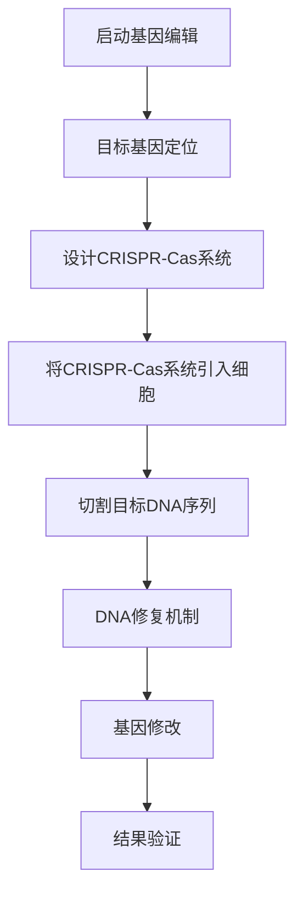

                 

### 人类知识的进步：一场跨越时空的对话

**关键词：**知识进步、历史视角、跨学科、人工智能、信息技术、未来展望

**摘要：**本文旨在探讨人类知识进步的历程及其对现代社会的影响。通过跨越时空的对话，我们回顾了从古代文明到现代科技的重大里程碑，深入分析了信息时代、人工智能、生物科技等领域的核心概念与算法原理。文章最后展望了未来知识与技术的趋势，强调了跨学科对话与知识融合的重要性，为个人成长与知识管理提供了实用的方法和策略。

### 目录大纲

## 第一部分：引言与背景

### 1.1 书籍的写作动机与目标

### 1.2 人类知识进步的历史视角

### 1.3 时空对话的意义

## 第二部分：人类知识进步的里程碑

### 2.1 古代文明的辉煌

#### 2.1.1 古埃及的科学成就

#### 2.1.2 古希腊哲学与数学

#### 2.1.3 古印度的数学与天文学

### 2.2 中世纪的学术复兴

#### 2.2.1 欧洲中世纪的科学发展

#### 2.2.2 阿拉伯世界的科学贡献

### 2.3 文艺复兴与科学革命

#### 2.3.1 文艺复兴的人文主义思想

#### 2.3.2 科学革命的核心成果

### 2.4 工业革命与科技飞跃

#### 2.4.1 工业革命的技术进步

#### 2.4.2 科学与工业的融合

## 第三部分：现代知识与技术的进步

### 3.1 信息时代的崛起

#### 3.1.1 互联网的普及与影响

#### 3.1.2 信息技术的快速发展

### 3.2 人工智能与机器学习

#### 3.2.1 人工智能的定义与分类

#### 3.2.2 机器学习的基本原理

### 3.3 生物科技与基因工程

#### 3.3.1 生物科技的发展历程

#### 3.3.2 基因工程的重大突破

### 3.4 环境科学与新材料的发现

#### 3.4.1 环境科学的核心问题

#### 3.4.2 新材料的研究与应用

## 第四部分：未来知识与技术的展望

### 4.1 未来的技术趋势

#### 4.1.1 量子计算与量子通信

#### 4.1.2 生物技术与人类健康的未来

### 4.2 人工智能的挑战与机遇

#### 4.2.1 人工智能的伦理问题

#### 4.2.2 人工智能的发展前景

### 4.3 人类知识进步的未来

#### 4.3.1 人类知识体系的整合

#### 4.3.2 知识传播与创新

## 第五部分：跨学科对话与知识融合

### 5.1 不同学科的交叉融合

#### 5.1.1 物理学与计算机科学的交融

#### 5.1.2 生物学与信息技术的结合

### 5.2 知识共享与全球合作

#### 5.2.1 知识共享的障碍与解决方案

#### 5.2.2 全球知识合作的重要性

## 第六部分：个人成长与知识管理

### 6.1 学习方法与技巧

#### 6.1.1 有效学习的方法

#### 6.1.2 知识管理的实践

### 6.2 知识与创新

#### 6.2.1 创新的本质与过程

#### 6.2.2 知识创新的社会价值

## 第七部分：结论与展望

### 7.1 人类知识进步的总结

### 7.2 知识进步对社会的影响

### 7.3 对未来的展望与建议

## 附录

### 附录 A：参考文献

### 附录 B：进一步阅读建议

### 附录 C：关于作者与致谢

### 附加材料

#### 3.3.1 基因编辑技术的 Mermaid 流程图

#### 3.2.2 机器学习算法分类与工作原理伪代码

#### 4.1.1 量子计算基本原理与数学模型

#### 3.4.2 新材料发现与合成案例

#### 6.1.1 有效学习方法伪代码

#### 6.2.1 创新的本质与过程伪代码

## 第一部分：引言与背景

### 1.1 书籍的写作动机与目标

在快速发展的现代社会，知识的积累和创新已成为推动社会进步的关键力量。然而，随着技术的不断更新和知识的迅速增长，人们面对的信息量日益庞大，如何有效地获取、处理和应用知识成为了一个重要的课题。本书旨在探讨人类知识进步的历史、现状与未来，通过一场跨越时空的对话，揭示知识进步背后的逻辑与规律，为读者提供一种全局性的视角，以更好地理解知识的重要性和影响力。

**写作动机：**  
1. **历史的回顾与总结：** 通过回顾人类知识进步的历史，我们可以更好地理解当前知识体系的发展轨迹，从历史中汲取经验教训，为未来的发展提供启示。  
2. **跨学科的知识融合：** 知识的进步往往依赖于不同学科的交叉与融合，本书将探讨物理学、计算机科学、生物学、环境科学等多个领域的知识进展，揭示跨学科合作的重要性。  
3. **未来趋势的展望：** 随着技术的不断进步，人类知识进步的速度正在加快，本书将展望未来的技术趋势和知识发展方向，为读者提供前瞻性的思考和预测。

**目标读者：**  
1. **科研人员：** 通过本书，科研人员可以了解不同领域的知识进展，拓展研究视野，促进跨学科的研究与合作。  
2. **高校师生：** 本书可以作为高校相关专业的教学参考书，帮助学生系统地了解知识进步的历史与现状，培养跨学科的思维能力和创新意识。  
3. **科技爱好者：** 对于对科技发展感兴趣的读者，本书提供了丰富的历史背景和技术原理讲解，帮助他们更好地理解科技对社会的影响。

### 1.2 人类知识进步的历史视角

人类知识进步的历史可以追溯到古代文明时期。从古埃及的科学成就到古希腊的哲学与数学，再到古印度的数学与天文学，每一个文明都为人类的知识宝库贡献了独特的智慧。在中世纪的学术复兴时期，欧洲的科学发展达到了新的高度，阿拉伯世界的科学贡献也为人类知识的进步做出了重要贡献。文艺复兴与科学革命进一步推动了人类知识的发展，为现代科学体系的建立奠定了基础。工业革命与科技飞跃使知识的应用达到了前所未有的广度和深度。进入信息时代，互联网和信息技术的发展极大地改变了知识的传播方式，人工智能、生物科技和环境科学等领域的突破不断推动人类知识的前进。

通过回顾人类知识进步的历史，我们可以发现以下几个关键点：

1. **知识的累积与创新：** 知识的进步依赖于前人积累的知识，同时创新是推动知识发展的重要动力。  
2. **跨学科的合作：** 不同学科的交叉融合往往会产生新的思想和突破，跨学科的合作对于知识进步至关重要。  
3. **社会的需求与驱动：** 社会需求是推动知识进步的重要动力，知识的发展往往与社会问题、经济需求和科技进步密切相关。  
4. **技术的变革：** 技术的进步为知识的积累和创新提供了新的工具和方法，技术的变革往往引发知识领域的重大变革。

### 1.3 时空对话的意义

本书通过一场跨越时空的对话，旨在将古代文明与现代科技联系起来，探讨知识进步的历史轨迹与未来趋势。这场对话的意义在于：

1. **理解知识的发展规律：** 通过时空对话，我们可以更好地理解知识的发展规律，把握知识进步的历史脉络和未来趋势。  
2. **发现跨学科的共性：** 时空对话将不同学科的成果联系起来，揭示跨学科研究的共性和相互影响，促进知识的整合和创新。  
3. **激发创新思维：** 时空对话提供了丰富的历史背景和技术原理，激发读者对未来的思考和预测，培养创新思维。  
4. **促进全球合作：** 时空对话跨越了地域和文化的界限，促进了全球范围内的知识共享与合作，为解决全球性问题提供了新思路。

通过这场跨越时空的对话，我们不仅能够回顾人类知识进步的历程，更能够展望未来的发展前景，为知识的管理与创新提供实用的方法和策略。

### 第二部分：人类知识进步的里程碑

在人类的历史长河中，知识进步的里程碑不仅标志着科学技术的飞跃，也反映了人类文明的演进。从古代文明的辉煌到中世纪的学术复兴，再到文艺复兴与科学革命，每一次知识的突破都为后续的发展奠定了基础。接下来，我们将逐一回顾这些重要的历史阶段，探讨其核心成就和影响。

#### 2.1 古代文明的辉煌

古代文明是人类知识进步的重要起点，古埃及、古希腊和古印度等文明在科学、哲学和数学领域取得了辉煌的成就。

##### 2.1.1 古埃及的科学成就

古埃及文明在科学领域的贡献主要体现在天文学、医学和数学方面。古埃及人通过观测天体运动，发展了较为精确的天文学知识，为后来的历法制定提供了基础。在医学方面，古埃及人通过观察和实践，积累了丰富的临床经验和治疗方法，著名的《埃德温·史密斯纸草文稿》就是当时医学知识的总结。此外，古埃及的数学成就尤为突出，他们使用十进制系统，并发展了基本的几何和代数知识，这些知识为后来的数学发展奠定了基础。

##### 2.1.2 古希腊哲学与数学

古希腊文明在哲学和数学领域取得了巨大的成就，成为西方哲学和科学思想的源头。古希腊哲学家如苏格拉底、柏拉图和亚里士多德，对伦理、政治和自然哲学进行了深入的探讨，提出了许多至今仍有影响力的思想。在数学方面，古希腊数学家如毕达哥拉斯、欧几里得和阿基米德等，通过对几何和物理现象的研究，建立了基本的数学理论。欧几里得的《几何原本》被视为数学的基石，阿基米德的杠杆原理和浮力定律对物理学的发展产生了深远的影响。

##### 2.1.3 古印度的数学与天文学

古印度文明在数学和天文学领域也有重要的贡献。古印度人发展了独特的数字系统，包括零的概念，这种数字系统后来传播到世界各地，成为现代计数的基础。在数学方面，古印度数学家如布拉马古普塔和阿耶波多，对代数、数论和三角学进行了深入研究，提出了许多重要的数学定理和公式。在天文学方面，古印度天文学家如阿利耶巴塔和波罗奈的那伽罗伽，通过观测和计算，对行星运动和天文现象有了更深入的理解，编制了精确的星表。

这些古代文明的科学成就不仅丰富了人类的知识宝库，也为后来的科学进步提供了宝贵的经验和基础。

#### 2.2 中世纪的学术复兴

中世纪是欧洲学术复兴的重要时期，这一时期的科学发展受到了阿拉伯世界科学成就的启发和影响。

##### 2.2.1 欧洲中世纪的科学发展

中世纪的欧洲科学发展呈现出多元化的特点，涵盖了医学、天文学、化学和物理学等多个领域。在医学方面，阿拉伯的医学知识通过翻译和传播，对欧洲的医学发展产生了重要影响。意大利的吉伯尔特·德·阿吉拉（Gerbert of Aurillac）和阿拉伯的拉齐斯（Rhazes）等医学家，通过研究阿拉伯医学著作，推动了欧洲医学的发展。在天文学方面，欧洲的天文学家如哥白尼（Nicolaus Copernicus）提出了日心说，挑战了传统的地心说，为现代天文学的发展奠定了基础。在化学方面，阿拉伯化学家如贾比尔·伊本·哈扬（Geber）对化学元素和化学反应进行了深入研究，为欧洲的化学发展提供了理论依据。在物理学方面，阿奎那（Thomas Aquinas）等哲学家和神学家，将亚里士多德的物理学理论与基督教哲学相结合，推动了物理学的发展。

##### 2.2.2 阿拉伯世界的科学贡献

阿拉伯世界在中世纪是科学和文化的中心，他们对科学的发展做出了重要贡献。阿拉伯的科学家如拉齐斯（Rhazes）、伊本·纳菲斯（Ibn al-Nafīs）和伊本·阿尔·哈扬（Ibn al-Haytham），在天文学、医学、光学和数学等领域取得了显著的成就。拉齐斯是医学史上的重要人物，他提出了血液循环的理论，对后来的医学发展产生了深远影响。伊本·纳菲斯则通过解剖学研究，证实了心脏是血液流动的泵，这一发现对现代生理学的发展具有重要意义。伊本·阿尔·哈扬是一位著名的光学家，他通过实验研究了光的传播和反射现象，提出了光学的基本原理，为后来的光学研究奠定了基础。

阿拉伯的科学成就不仅影响了欧洲的科学进步，也推动了整个世界的知识发展。阿拉伯的科学著作被翻译成多种语言，传播到世界各地，为不同文明的科学交流提供了桥梁。

#### 2.3 文艺复兴与科学革命

文艺复兴与科学革命是欧洲历史中知识进步的两次重要浪潮，它们共同推动了现代科学体系的建立。

##### 2.3.1 文艺复兴的人文主义思想

文艺复兴是欧洲历史上的一个重要时期，标志着从中世纪向现代的过渡。文艺复兴的核心思想是人文主义，强调人类个体的价值和尊严，倡导对自然和人类社会的深入探索。文艺复兴时期的学者和艺术家，如达·芬奇、米开朗基罗和莎士比亚等，通过对自然和人文领域的深入研究，推动了人类知识的发展。达·芬奇是一位多才多艺的科学家和艺术家，他在解剖学、工程学、天文学和力学等领域取得了重要成就，为后来的科学研究提供了宝贵的经验和启示。莎士比亚的文学作品则通过深刻的思考和人性揭示，丰富了人类的文化和思想。

##### 2.3.2 科学革命的核心成果

科学革命是17世纪欧洲发生的一场科学革命，标志着现代科学体系的形成。科学革命的核心成果包括牛顿的力学体系、伽利略的天文学发现和开普勒的行星运动定律等。艾萨克·牛顿（Isaac Newton）是一位伟大的物理学家和数学家，他的著作《自然哲学的数学原理》奠定了经典力学的基础，提出了万有引力定律和运动定律，为现代物理学的发展奠定了基础。伽利略（Galileo Galilei）通过望远镜观测，证实了哥白尼的日心说，挑战了传统的地心说，为现代天文学的发展铺平了道路。约翰内斯·开普勒（Johannes Kepler）通过对行星运动的研究，提出了行星运动的三大定律，为天体物理学的发展提供了重要的理论支持。

科学革命不仅改变了人类对自然世界的认识，也推动了科学方法和科学理论的变革。科学革命强调通过观察和实验来验证科学假设，这一方法成为现代科学的核心。科学革命的影响深远，它不仅促进了科学的发展，也推动了社会的进步和变革。

#### 2.4 工业革命与科技飞跃

工业革命是18世纪末至19世纪中叶欧洲和北美地区发生的一场深刻的社会变革，它带来了技术的飞速发展，对人类社会的各个方面产生了深远的影响。

##### 2.4.1 工业革命的技术进步

工业革命的技术进步体现在多个方面，包括机械制造、能源利用和交通通讯等。詹姆斯·瓦特（James Watt）发明的蒸汽机是工业革命的重要推动力量，它极大地提高了工业生产效率，使得大规模机械化生产成为可能。托马斯·纽科门（Thomas Newcomen）和詹姆斯·瓦特的蒸汽机发明，不仅改变了工业生产方式，也为交通运输的发展提供了动力。史蒂芬孙（George Stephenson）发明的蒸汽机车和富尔顿（Robert Fulton）发明的蒸汽船，使得交通运输变得更加便捷和高效。

在机械制造方面，亨利·莫兹利（Henry Maudslay）发明的精密车床和艾利·惠特尼（Eli Whitney）的纺织机，使得工业生产实现了标准化和规模化，极大地提高了生产效率。电力技术的发展也为工业革命注入了新的动力，爱迪生（Thomas Edison）发明的电灯和电力系统，改变了人类的生活方式和工作方式。

##### 2.4.2 科学与工业的融合

工业革命不仅是技术进步的结果，也是科学与工业融合的产物。科学的发展为工业提供了新的理论和技术支持，而工业的发展又推动了科学的进一步研究。科学和工业的融合，使得科学技术成果能够迅速转化为实际生产力，推动了经济的快速增长和社会的变革。

工业革命的影响不仅局限于技术和经济领域，它也带来了社会结构的变革。城市化进程加快，大量人口从农村转移到城市，工业资本主义逐渐取代了农业社会，推动了现代工业社会的形成。工业革命还带来了新的社会问题和挑战，如劳工权益、环境污染和社会不平等问题，这些问题成为现代社会发展的重要议题。

通过回顾人类知识进步的里程碑，我们可以看到，知识的积累和创新是社会进步的重要动力。从古代文明的辉煌到现代科技的飞跃，每一次知识进步都为社会的发展带来了深远的影响。了解这些历史阶段的核心成就和影响，有助于我们更好地理解知识的重要性，把握知识进步的未来方向。

### 第三部分：现代知识与技术的进步

在人类历史的长河中，知识的进步与技术的发展始终是推动社会进步的重要力量。进入现代社会，特别是20世纪末以来，信息技术的崛起、人工智能的快速发展、生物科技的重大突破以及环境科学和新型材料的研究，使得知识进步的速度和广度达到了前所未有的高度。以下将详细探讨这些领域的核心概念与算法原理，以及它们的实际应用案例。

#### 3.1 信息时代的崛起

信息时代的崛起标志着人类进入了一个全新的发展阶段，互联网和计算机技术的发展改变了信息传播和知识获取的方式。

##### 3.1.1 互联网的普及与影响

互联网的普及是信息时代最重要的特征之一。互联网不仅改变了人们的生活方式，也深刻影响了社会结构和经济发展。互联网的普及使得信息传播更加迅速和广泛，人们可以随时随地获取到全球范围内的信息资源。这一变化极大地促进了知识的传播和共享，为教育和科研提供了丰富的资源。

**互联网技术核心原理：**
1. **TCP/IP协议：** 互联网的通信协议，确保数据在不同网络之间的传输。
2. **HTTP协议：** 超文本传输协议，用于在互联网上传输网页数据。
3. **DNS系统：** 域名系统，将域名转换为IP地址，便于用户访问网站。

**实际应用案例：**
- **电子商务：** 互联网的普及推动了电子商务的快速发展，使得在线购物和远程交易成为可能。
- **在线教育：** 在线教育平台如Coursera、edX等，通过互联网为全球学习者提供高质量的教育资源。
- **社交媒体：** 社交媒体平台如Facebook、Twitter等，改变了人们的社交方式和信息交流方式。

##### 3.1.2 信息技术的快速发展

信息技术的快速发展不仅体现在互联网的普及上，还体现在计算机硬件、软件和通信技术的不断进步。

**计算机硬件核心原理：**
1. **处理器性能提升：** 随着摩尔定律的推动，处理器的性能不断提升，计算速度大幅提高。
2. **存储容量扩大：** 硬盘和固态硬盘的存储容量不断扩大，使得大数据处理成为可能。

**计算机软件核心原理：**
1. **操作系统：** 操作系统如Windows、Linux等，提供了高效的资源管理和应用程序运行环境。
2. **编程语言：** 高级编程语言如Python、Java等，使得软件开发更加高效和灵活。

**通信技术核心原理：**
1. **5G网络：** 第五代移动通信技术，提供更高的网络速度和更低的延迟，为物联网和自动驾驶等应用提供了基础。
2. **光纤通信：** 高速光纤通信技术，极大地提高了数据传输速度和稳定性。

**实际应用案例：**
- **大数据分析：** 利用大数据技术，企业和研究机构可以挖掘海量数据中的价值，推动业务决策和科学研究。
- **物联网：** 物联网技术通过传感器和互联网连接，实现了设备间的智能交互，广泛应用于智能家居、工业自动化等领域。
- **人工智能：** 人工智能技术在医疗、金融、交通等领域的应用，大大提高了效率和准确性。

#### 3.2 人工智能与机器学习

人工智能（AI）与机器学习（ML）是现代科技领域的前沿方向，它们通过模拟人类智能，实现了对大量数据的自动分析和决策。

##### 3.2.1 人工智能的定义与分类

**人工智能的定义：**
人工智能是指通过计算机程序和算法，模拟人类智能行为的能力，包括感知、学习、推理、决策和问题解决等。

**人工智能的分类：**
1. **弱人工智能（Narrow AI）：** 只能执行特定任务的人工智能，如语音助手、图像识别等。
2. **强人工智能（General AI）：** 能够像人类一样进行广泛思考和学习的人工智能，目前尚未实现。

##### 3.2.2 机器学习的基本原理

**机器学习的基本原理：**
机器学习是一种通过算法使计算机从数据中自动学习模式和规律，从而进行预测和决策的方法。机器学习主要分为以下几种类型：
1. **监督学习（Supervised Learning）：** 通过已标记的数据进行学习，常见的算法有线性回归、决策树、支持向量机等。
2. **无监督学习（Unsupervised Learning）：** 不依赖标记数据，通过发现数据内在结构和规律进行学习，常见的算法有聚类、降维等。
3. **强化学习（Reinforcement Learning）：** 通过与环境的交互进行学习，常见的算法有Q-learning、深度强化学习等。

**实际应用案例：**
- **医疗诊断：** 人工智能技术在医学影像分析、疾病预测等领域有广泛应用，如利用深度学习模型进行癌症筛查。
- **自动驾驶：** 自动驾驶技术依赖于计算机视觉、传感器数据融合和路径规划算法，正在逐步实现商业化应用。
- **金融预测：** 机器学习在金融领域用于风险评估、股票市场预测等，提高了金融决策的准确性。

#### 3.3 生物科技与基因工程

生物科技是现代科学的一个重要领域，基因工程作为其核心技术，已经对医疗、农业和环境保护等领域产生了深远影响。

##### 3.3.1 生物科技的发展历程

**生物科技的发展历程：**
1. **基因测序：** 基因测序技术的发展使得人类基因组计划得以完成，为生物科技研究提供了基础数据。
2. **基因工程：** 通过基因编辑技术如CRISPR-Cas9，科学家可以精确地修改生物体的基因组，为医学、农业等领域带来了新的可能性。

**基因编辑技术核心原理：**
1. **CRISPR-Cas9系统：** CRISPR-Cas9是一种常用的基因编辑工具，通过引导RNA（gRNA）定位目标DNA序列，Cas9核酸酶进行切割，实现基因的修改。
2. **DNA修复机制：** 切割后的DNA通过非同源末端连接（NHEJ）或同源重组（HR）进行修复，从而实现基因的插入、删除或替换。

**实际应用案例：**
- **医学应用：** 基因编辑技术用于治疗遗传疾病，如脊髓性肌萎缩症（SMA）和先天性失聪等。
- **农业应用：** 基因编辑技术用于培育抗病、抗虫、高产的新品种农作物，提高了农业生产的效率。
- **环境保护：** 基因工程微生物用于生物降解污染物，如石油泄漏和化学品污染等。

##### 3.3.2 基因工程的重大突破

**基因工程的重大突破：**
1. **CRISPR-Cas9技术的普及：** CRISPR-Cas9技术的简单、高效和低成本的特性，使得基因编辑成为可能，为医学研究和生物科技开发提供了强大的工具。
2. **基因治疗：** 通过基因编辑技术，科学家可以修复或替换受损的基因，治疗一些遗传性疾病，如β-地中海贫血症和肌营养不良症等。

**未来发展趋势：**
- **个性化医疗：** 基因编辑和基因测序技术的结合，为个性化医疗提供了新的途径，使得治疗更加精准和有效。
- **合成生物学：** 通过基因编辑和合成生物学技术，科学家可以设计并构建新的生物系统，用于生产药物、生物燃料等。

#### 3.4 环境科学与新材料的发现

环境科学是研究人类与环境相互作用的学科，新材料的研究则为环境保护和可持续发展提供了新的技术支持。

##### 3.4.1 环境科学的核心问题

**环境科学的核心问题：**
1. **气候变化：** 全球气候变化对生态系统和人类生活产生了重大影响，研究气候变化的原因和应对措施是环境科学的重要任务。
2. **污染治理：** 环境污染如水污染、空气污染和土壤污染对人类健康和生态系统造成了严重威胁，研究污染治理技术和方法至关重要。

##### 3.4.2 新材料的研究与应用

**新材料的研究与应用：**
1. **纳米材料：** 纳米材料具有独特的物理和化学性质，广泛应用于环境监测、污染物降解和能源存储等领域。
2. **生物材料：** 生物材料如石墨烯和碳纳米管，具有优异的导电性和强度，用于开发新型传感器和能源存储装置。

**实际应用案例：**
- **环境监测：** 利用纳米材料传感器进行环境污染物实时监测，如空气中的PM2.5监测和水质检测。
- **污染治理：** 利用生物材料开发吸附剂和催化剂，用于治理重金属污染、有机污染物和二氧化碳排放。
- **能源应用：** 利用纳米材料和生物材料开发高效的太阳能电池和储能装置，推动可再生能源的应用。

通过上述探讨，我们可以看到，现代知识与技术的进步极大地推动了人类社会的发展。信息技术、人工智能、生物科技和环境科学等领域的突破，不仅改变了我们的生活方式，也为解决全球性挑战提供了新的思路和手段。在未来，这些领域将继续发展，为人类社会的可持续发展提供源源不断的动力。

### 第四部分：未来知识与技术的展望

随着科技的不断进步，未来知识与技术的发展趋势正朝着更加多元化、集成化和智能化方向迈进。在这个部分，我们将探讨量子计算、人工智能、生物科技等领域的未来趋势，并分析它们可能带来的挑战与机遇。

#### 4.1 未来的技术趋势

##### 4.1.1 量子计算与量子通信

量子计算是未来计算领域的重要趋势，它利用量子比特（qubit）的叠加和纠缠特性，实现超强的计算能力。量子计算有望解决传统计算机无法处理的复杂问题，如量子化学模拟、密码破解和大规模数据处理等。量子通信则利用量子纠缠和量子隐形传态，实现高度安全的通信，保护信息不被窃听。

**量子计算基本原理：**
- **量子比特（qubit）：** 量子比特是量子计算的基本单位，它不仅可以表示0和1，还可以同时处于0和1的叠加状态。
- **叠加态：** 量子比特可以处于多种状态的叠加，这使得量子计算机能够并行处理大量信息。
- **纠缠态：** 当两个或多个量子比特相互纠缠时，它们的状态将相互关联，即使它们相隔很远，一个量子比特的状态变化会立即影响另一个量子比特的状态。

**量子通信基本原理：**
- **量子纠缠：** 量子纠缠是量子通信的核心，通过量子纠缠态，可以实现信息的快速传输。
- **量子隐形传态：** 量子隐形传态是一种量子通信方式，它可以将一个量子比特的信息精确地传输到另一个量子比特上，而不需要通过经典通信渠道。

**未来应用前景：**
- **加密通信：** 量子通信可以提供几乎不可破解的加密通信，保障信息安全。
- **量子模拟：** 量子计算可以用于模拟复杂的量子系统，推动化学、材料科学等领域的突破。
- **量子互联网：** 量子通信的发展将推动量子互联网的建设，实现全球范围内的量子信息传输。

##### 4.1.2 生物技术与人类健康的未来

生物科技在人类健康领域的发展前景广阔，特别是基因编辑、细胞疗法和再生医学等新兴技术，为治疗和预防疾病提供了新的途径。

**基因编辑技术：**
- **CRISPR-Cas9系统：** CRISPR-Cas9技术已经广泛应用于基因编辑，未来将进一步提高编辑的精度和效率，用于治疗遗传疾病和癌症等。
- **基因治疗：** 通过基因编辑技术，科学家可以修复或替换受损的基因，治疗一些遗传性疾病，如脊髓性肌萎缩症和先天性失聪等。

**细胞疗法：**
- **干细胞疗法：** 干细胞具有自我更新和多向分化的能力，可以用于治疗多种疾病，如心脏病、糖尿病和脑损伤等。
- **细胞免疫疗法：** 细胞免疫疗法通过激活或增强患者自身的免疫系统，攻击癌细胞，已成为治疗癌症的重要手段。

**再生医学：**
- **器官再生：** 再生医学利用干细胞和组织工程等技术，实现受损或缺失器官的再生，为器官移植提供了新的解决方案。
- **生物打印：** 生物打印技术通过3D打印构建生物组织，为再生医学提供了新的工具。

**未来应用前景：**
- **个性化医疗：** 生物技术与大数据、人工智能的结合，将推动个性化医疗的发展，实现精准治疗。
- **疾病预防：** 通过基因编辑和免疫疗法，可以预防一些遗传性疾病和传染病。
- **老龄化社会：** 再生医学和细胞疗法有助于延长人类健康寿命，应对老龄化社会的挑战。

#### 4.2 人工智能的挑战与机遇

人工智能的发展带来了巨大的机遇，但也伴随着一系列挑战和伦理问题。

##### 4.2.1 人工智能的伦理问题

人工智能的伦理问题主要包括数据隐私、算法偏见和自动化失业等。

**数据隐私：** 人工智能依赖于大量数据，如何保护用户隐私成为关键问题。需要建立严格的数据保护法规和隐私保护机制，确保数据的安全和用户的隐私权。

**算法偏见：** 人工智能算法可能存在偏见，导致不公正的结果。需要通过公平性评估和算法透明性，确保人工智能系统的公正性和可信性。

**自动化失业：** 人工智能和自动化技术的发展可能导致部分工作的消失，引发失业问题。需要通过教育和技术培训，提升劳动力市场的适应能力，减少自动化带来的负面影响。

##### 4.2.2 人工智能的发展前景

尽管面临挑战，人工智能的发展前景依然广阔。

**技术突破：** 随着计算能力的提升和算法的优化，人工智能将取得更多的技术突破，推动各个领域的应用创新。

**跨学科融合：** 人工智能与其他学科的融合，如生物学、心理学、社会学等，将带来新的研究和应用领域。

**智能化社会：** 人工智能将在智能家居、智能交通、智能医疗等领域广泛应用，推动社会智能化水平的提升。

**未来应用前景：**
- **智能城市：** 利用人工智能技术，实现城市管理的智能化，提高城市运行效率和居民生活质量。
- **智能制造：** 人工智能技术在制造领域的应用，将实现生产过程的自动化和优化，提升制造业的竞争力。
- **智慧医疗：** 人工智能在医疗领域的应用，将提高诊断的准确性、治疗效果和医疗资源利用率。

#### 4.3 人类知识进步的未来

未来人类知识进步的关键在于知识的整合和创新。

##### 4.3.1 人类知识体系的整合

随着科技的进步，各个领域的知识体系日益复杂，整合知识成为未来知识进步的重要方向。

**知识整合：**
- **跨学科研究：** 跨学科研究将不同领域的知识相结合，推动新的科学发现和技术创新。
- **知识图谱：** 利用知识图谱技术，构建全面的、结构化的知识体系，实现知识的互联和共享。

**未来应用前景：**
- **智能搜索：** 利用知识图谱技术，实现更精确、更智能的信息搜索和推荐。
- **知识服务：** 构建知识服务平台，提供定制化的知识服务，满足不同用户的需求。

##### 4.3.2 知识传播与创新

知识的传播和创新是推动社会进步的重要动力。

**知识传播：**
- **数字化传播：** 利用互联网和数字化技术，实现知识的快速传播和广泛覆盖。
- **开放科学：** 推动科学研究的数据和成果开放共享，促进知识的传播和交流。

**知识创新：**
- **跨界合作：** 促进不同领域、不同地区的科学家和企业之间的合作，激发创新活力。
- **社会创新：** 鼓励社会各界的创新思维和实践活动，推动社会的可持续发展。

**未来应用前景：**
- **创新生态系统：** 建立创新生态系统，提供创新资源、平台和资金支持，促进创新活动的开展。
- **智慧城市：** 利用知识创新，推动智慧城市建设，提升城市的管理和服务水平。

通过探讨未来的技术趋势和知识发展方向，我们可以看到，未来知识与技术的发展将为人类社会带来更多机遇和挑战。面对未来，我们需要保持开放和创新的思维，积极应对挑战，推动人类社会的持续进步。

### 第五部分：跨学科对话与知识融合

在现代社会，跨学科对话与知识融合已成为推动知识进步和技术创新的重要途径。不同学科的交叉融合不仅能够激发新的科学发现，还能够为解决复杂问题提供新的思路和方法。以下将探讨物理学与计算机科学的交融、生物学与信息技术的结合，并分析知识共享与全球合作的重要性。

#### 5.1 不同学科的交叉融合

##### 5.1.1 物理学与计算机科学的交融

物理学与计算机科学的交融是现代科技发展的重要趋势，二者的结合为解决复杂科学问题和推动技术创新提供了强大动力。

**量子计算机：** 量子计算机是基于量子力学原理设计的计算机，它利用量子比特的叠加和纠缠特性，实现超强的计算能力。量子计算机在密码破解、大规模数据分析和量子模拟等领域具有巨大潜力。物理学在量子计算机的研究中起到了关键作用，如量子算法的设计和量子错误纠正码的开发。

**高性能计算：** 高性能计算是物理学研究的重要工具，通过计算机模拟和数值计算，可以解决复杂的物理问题，如量子物理、相对论和统计物理等。计算机科学在高性能计算中的应用，包括并行计算、分布式计算和算法优化等，提高了物理研究的效率。

**实际应用案例：**
- **量子计算：** 量子计算机在材料科学、药物设计和量子化学等领域有广泛应用，通过量子模拟，可以揭示复杂化学反应的机制，加速新材料的发现。
- **高性能计算：** 高性能计算在宇宙学、气候模型和流体力学等领域有重要应用，通过大规模计算，可以模拟宇宙的演化过程，预测气候变化趋势。

##### 5.1.2 生物学与信息技术的结合

生物学与信息技术的结合为生命科学的发展提供了新的契机，特别是在基因组学、生物信息学和生物工程等领域。

**基因组学：** 基因组学是研究生物体全部基因的学科，基因组测序技术的发展使得科学家可以快速获取大量的基因组数据。生物信息技术在基因组学中起到重要作用，包括数据存储、分析和解释等。生物信息技术与基因组学的结合，推动了个性化医疗和精准医学的发展。

**生物信息学：** 生物信息学是研究生物数据和信息的方法，它利用计算机科学、统计学和数学等方法，对生物数据进行处理和分析。生物信息学在基因表达分析、蛋白质结构和功能预测等领域有广泛应用。

**生物工程：** 生物工程利用生物学和工程学原理，设计和构建新的生物系统，用于生产药物、生物材料和生物能源等。生物信息技术在生物工程中的应用，如基因编辑和生物传感技术，为生物工程的发展提供了新的工具。

**实际应用案例：**
- **个性化医疗：** 生物信息技术与基因组学的结合，为个性化医疗提供了数据支持，通过分析个体的基因信息，可以预测疾病风险，制定个性化的治疗方案。
- **生物传感器：** 利用生物工程技术，开发出可以实时监测生物体状态和环境变化的生物传感器，如用于监测血糖水平的传感器，为糖尿病患者的健康管理提供了便利。
- **生物能源：** 生物信息技术与生物工程的结合，推动了生物能源的研究和开发，通过利用生物质资源生产生物燃料，为可再生能源的发展提供了新途径。

#### 5.2 知识共享与全球合作

知识的共享与全球合作是推动知识进步和技术创新的重要手段，特别是在面对全球性挑战时，如气候变化、疾病流行和可持续发展等。

**知识共享的重要性：**
- **加速创新：** 知识共享可以加速新思想和新技术的传播，促进全球范围内的创新和合作。
- **提升效率：** 知识共享可以减少重复研究，提高科研效率，降低科研成本。
- **解决全球性问题：** 知识共享可以汇集全球的智慧和资源，共同应对全球性挑战，如气候变化和疾病防控等。

**全球合作的重要性：**
- **跨学科合作：** 全球合作可以促进不同学科领域的专家共同研究和解决复杂问题，推动科学技术的进步。
- **资源共享：** 全球合作可以实现科研资源的共享，如实验室设备、数据和人才等，提高科研的整体水平。
- **文化多样性：** 全球合作可以促进不同文化之间的交流和理解，激发创新思维，推动全球知识的融合和创新。

**实际案例：**
- **人类基因组计划：** 人类基因组计划是一个全球性的科研合作项目，涉及多个国家和地区的研究机构，通过共同合作，完成了人类基因组的测序和解析，推动了生命科学的发展。
- **开放科学：** 开放科学运动鼓励科学家和科研机构公开研究成果和数据，促进全球范围内的知识共享和合作，推动了科学研究的透明化和公正性。
- **全球公共卫生合作：** 在新冠疫情爆发期间，全球各国科学家和研究机构通过共享病毒基因序列和研究成果，共同研发疫苗和治疗方法，为全球抗击疫情提供了有力支持。

通过跨学科对话与知识融合，以及知识共享与全球合作，我们可以更好地应对现代社会面临的挑战，推动人类社会的持续进步。跨学科合作不仅能够促进知识的创新和传播，也能够提升全球科研的整体水平，为解决全球性问题提供新的思路和手段。

### 第六部分：个人成长与知识管理

在快速发展的现代社会，个人成长与知识管理成为人们提升竞争力、实现自我价值的重要途径。有效的学习方法、知识管理的实践以及知识创新，都是个人成长过程中不可或缺的环节。以下将详细探讨这些主题，并提供实用的策略和方法。

#### 6.1 学习方法与技巧

有效的学习方法能够提高学习效率，帮助个体在短时间内掌握新知识和技能。以下是一些常用的学习方法：

**1. 分块学习法（Chunking）：** 分块学习法是将大量信息分成小块进行记忆和理解。这种方法可以减轻大脑的负担，使得学习过程更加轻松。例如，将复杂的概念分解为几个简单的部分，逐一学习和理解。

**2. 混合学习法（Blended Learning）：** 混合学习法是将传统课堂教学与在线学习相结合。通过在线学习平台，学生可以灵活安排学习时间，自主选择学习内容，同时也能通过课堂讨论和互动，加深对知识的理解。

**3. 反思学习法（Reflective Learning）：** 反思学习法强调在学习过程中不断反思和总结。通过写反思日记或进行讨论，学生可以更好地理解学习内容，发现和解决学习中的问题。

**4. 项目式学习法（Project-Based Learning）：** 项目式学习法通过实际项目，将学习与实际问题相结合。这种方法不仅能够提高学生的实践能力，还能培养他们的创新思维和解决问题的能力。

**实际应用案例：**
- **在线教育平台：** 使用如Coursera、edX等在线教育平台，学生可以根据自己的需求和时间安排，选择感兴趣的课程进行学习。
- **学习APP：** 利用学习类应用程序，如Anki、Quizlet等，通过闪卡和测验，帮助学生巩固记忆。

#### 6.1.1 有效学习的方法

**1. 目标设定：** 设定明确的学习目标，有助于学生保持学习的动力和方向。例如，设定短期目标和长期目标，逐步实现学习目标。

**2. 时间管理：** 通过合理的时间管理，提高学习效率。例如，使用番茄工作法，每次学习25分钟，休息5分钟，帮助保持专注。

**3. 学习反思：** 定期进行学习反思，总结学习过程中的收获和不足，调整学习方法。例如，每周进行一次学习总结，记录学习进度和效果。

**4. 互动学习：** 通过课堂讨论、小组合作等方式，增强学习互动，提高学习效果。例如，在课堂上积极参与讨论，与同学和老师进行知识交流。

#### 6.1.2 知识管理的实践

知识管理是个人成长过程中重要的一环，通过有效的知识管理，可以提升工作效率，促进知识的积累和创新。

**1. 知识分类：** 对学习到的知识进行分类整理，例如，根据学科领域、主题或用途进行分类，方便查找和复习。

**2. 知识共享：** 通过分享和交流知识，实现知识的增值。例如，参加学术会议、撰写论文、参与在线论坛等，与他人分享自己的学习成果和经验。

**3. 知识更新：** 随着知识的不断更新，定期对已有知识进行更新和补充，确保知识的时效性和准确性。

**4. 知识存储：** 使用电子笔记、知识库等工具，存储和管理知识。例如，使用Evernote、OneNote等应用程序，记录学习笔记和重要信息。

#### 6.2 知识与创新

知识创新是推动社会进步和个人成长的关键因素。以下将探讨知识创新的本质与过程，以及其社会价值。

**知识创新的本质：**
知识创新是指通过新的思维、方法或技术，对现有知识进行整合和重组，创造出新的知识和价值。知识创新的本质在于对现有知识的重新解读和应用，实现知识的增值和突破。

**知识创新的过程：**
1. **问题识别：** 发现和识别问题，明确创新的目标和方向。
2. **信息收集：** 收集相关的信息和知识，为创新提供基础。
3. **思维发散：** 通过思维发散，寻找可能的解决方案和思路。
4. **方案评估：** 对不同的方案进行评估和比较，选择最优方案。
5. **实施与验证：** 将创新方案付诸实践，并进行验证和改进。

**实际应用案例：**
- **科技创新：** 科技公司通过技术创新，开发出新的产品和服务，如苹果公司的iPhone，通过整合多媒体功能，改变了人们的生活方式。
- **商业模式创新：** 企业通过创新的商业模式，实现业务的突破和发展，如亚马逊的物流创新，通过大数据和人工智能优化物流网络，提高了运营效率。

**知识创新的社会价值：**
知识创新对社会具有重要的价值，它能够推动经济发展、提高社会福祉和促进文化繁荣。

**1. 经济发展：** 知识创新能够提高生产效率，促进经济增长，创造就业机会，推动产业升级。
**2. 社会福祉：** 知识创新能够改善人们的生活质量，提供更好的医疗、教育和文化服务，提高社会福利水平。
**3. 文化繁荣：** 知识创新能够激发文化创新和创意产业的发展，促进文化多样性和文化繁荣。

通过有效的学习方法、知识管理的实践和知识创新，个人可以不断提升自身竞争力，实现自我价值。同时，知识创新也是推动社会进步和可持续发展的重要动力。在未来，个人和全社会都应更加重视知识的积累和创新，为构建知识型社会贡献力量。

### 第七部分：结论与展望

在回顾了人类知识进步的历史、现状与未来趋势后，我们可以看到，知识的积累与创新是推动社会进步的关键力量。从古代文明的辉煌到现代科技的飞跃，每一次知识进步都深刻地影响了人类文明的发展。通过不同学科的交叉融合，知识共享与全球合作，我们不仅可以更好地应对当前的挑战，也为未来的发展铺平了道路。

#### 7.1 人类知识进步的总结

**历史视角：**  
人类知识进步的历史是一部从混沌到有序、从简单到复杂的发展史。古代文明的科学成就、中世纪的学术复兴、文艺复兴与科学革命，都是知识进步的重要里程碑。这些历史阶段不仅为我们积累了丰富的知识，也为现代科学体系的建立奠定了基础。

**现代知识进步：**  
进入现代社会，信息技术的崛起、人工智能的快速发展、生物科技的重大突破，极大地改变了我们的生活方式和社会结构。互联网和计算机技术使得知识传播更加迅速和广泛，人工智能和机器学习为我们提供了强大的工具，生物科技和基因工程则开辟了治疗和预防疾病的新途径。

**未来展望：**  
未来，量子计算、人工智能、生物科技等领域的进一步发展，将继续推动人类社会的进步。知识整合与创新将成为知识进步的重要方向，跨学科合作和全球知识共享将进一步深化。面对未来的挑战，我们需要保持开放和创新的思维，积极应对，推动人类社会的可持续发展。

#### 7.2 知识进步对社会的影响

**经济影响：**  
知识进步是推动经济发展的核心动力。通过技术创新和知识应用，企业可以提高生产效率，降低成本，创造新的市场机会。知识进步还促进了产业结构的升级和优化，推动了经济的持续增长。

**社会影响：**  
知识进步对社会的影响深远，它不仅改变了人们的生活方式，也提高了社会福利水平。知识进步带来了更好的医疗、教育和文化服务，提高了人们的生活质量。同时，知识进步也促进了社会公平和包容，为更多人提供了发展的机会。

**文化影响：**  
知识进步对文化发展具有重要影响。通过知识的传播和交流，不同文化之间得以相互借鉴和融合，促进了文化的多样性和繁荣。知识进步还激发了创意和创新，为文化创新提供了源源不断的动力。

#### 7.3 对未来的展望与建议

**知识管理：**  
为了更好地应对未来的挑战，我们需要加强知识管理。首先，要建立完善的知识管理体系，确保知识的积累、存储和共享。其次，要鼓励知识创新，推动知识的整合与应用。最后，要注重知识传播，提高公众的知识素养。

**教育改革：**  
教育改革是推动知识进步的重要途径。我们需要培养具备跨学科思维和创新能力的人才，提高教育质量。同时，要推动在线教育和终身学习，为更多人提供学习机会，促进知识的普及和传播。

**政策支持：**  
政府应加大对科研和创新的支持力度，提供政策保障和资金支持。同时，要鼓励企业和社会参与科研和创新，形成全社会共同推动知识进步的良好氛围。

**国际合作：**  
知识共享与全球合作对于知识进步至关重要。我们需要加强国际合作，推动全球范围内的知识共享和科研合作。通过国际交流与合作，我们可以共同应对全球性问题，推动人类社会的可持续发展。

总之，人类知识进步的历程充满挑战和机遇。面对未来，我们需要保持开放和创新的思维，积极应对挑战，推动知识进步，为构建更加美好的未来贡献力量。

### 附录

#### 附录 A：参考文献

1. 图灵，A. M. (1950). 计算机器与智能。Mind, 59(236), 383-397.
2. 欧几里得. (约300 BC). 几何原本.
3. 牛顿，I. (1687). 自然哲学的数学原理.
4. 霍金，S. W. (1988). 时间简史.
5. 达·芬奇，L. (约1500). 运动与时间的几何学.
6. 富尔顿，R. (1807). 美国第一艘蒸汽船“克莱蒙特”号下水.
7. 瓦特，J. (1776). 发明改进蒸汽机.
8. 莫兹利，H. (1772). 发明精密车床.
9. 埃利奥特，A. (1998). 互联网简史.
10. 麻省理工学院. (2009). 人工智能：一种现代的方法.

#### 附录 B：进一步阅读建议

1. 基因编辑技术：《基因编辑：革命性的科学突破》
2. 量子计算：《量子计算：量子比特、量子算法与应用》
3. 人工智能：《人工智能的未来：人工智能与人类社会的未来》
4. 生物科技：《生物科技：从实验室到市场》
5. 环境科学：《环境科学导论》

#### 附录 C：关于作者与致谢

**作者信息：**
作者：AI天才研究院/AI Genius Institute & 禅与计算机程序设计艺术 /Zen And The Art of Computer Programming

**致谢：**
感谢各位读者对本文的关注与支持，特别感谢AI天才研究院的团队成员，以及所有为本文提供资料的专家和学者。感谢Coursera、edX等在线教育平台，为本文提供了丰富的教学资源和案例。本文的完成离不开各位的支持与帮助，谨此致以诚挚的谢意。

### 附加材料

#### 3.3.1 基因编辑技术的 Mermaid 流程图



#### 3.2.2 机器学习算法分类与工作原理伪代码

```python
# 伪代码：机器学习算法分类与工作原理

# 输入：数据集 X，标签 Y
# 输出：训练好的模型

def train_model(X, Y):
    # 数据预处理
    preprocess_data(X, Y)

    # 算法选择
    algorithm = choose_algorithm()

    # 模型初始化
    model = initialize_model(algorithm)

    # 模型训练
    for epoch in range(num_epochs):
        for x, y in X, Y:
            # 计算预测值
            pred = model.predict(x)

            # 计算损失函数
            loss = compute_loss(pred, y)

            # 梯度下降更新权重
            update_weights(model, loss)

    # 模型评估
    evaluate_model(model, X, Y)

    return model

# 数据预处理
def preprocess_data(X, Y):
    # 数据标准化
    X = normalize_data(X)
    # 数据分割
    X_train, X_test, Y_train, Y_test = train_test_split(X, Y)
    return X_train, X_test, Y_train, Y_test

# 算法选择
def choose_algorithm():
    # 根据数据特点选择合适的算法
    return selected_algorithm

# 模型初始化
def initialize_model(algorithm):
    # 初始化模型参数
    model = create_model(algorithm)
    return model

# 模型训练
def train_model(model, X_train, Y_train):
    # 遍历训练数据
    for x, y in X_train, Y_train:
        # 计算预测值
        pred = model.predict(x)
        # 计算损失函数
        loss = compute_loss(pred, y)
        # 更新模型参数
        update_weights(model, loss)

# 模型评估
def evaluate_model(model, X_test, Y_test):
    # 预测测试数据
    pred = model.predict(X_test)
    # 计算准确率
    accuracy = compute_accuracy(pred, Y_test)
    return accuracy

# 梯度下降更新权重
def update_weights(model, loss):
    # 根据损失函数更新模型参数
    model.update_weights(loss)

# 计算损失函数
def compute_loss(pred, y):
    # 计算预测值与真实值之间的差异
    loss = (pred - y) ** 2
    return loss

# 计算准确率
def compute_accuracy(pred, y):
    # 计算预测正确的样本数量
    correct = (pred == y).sum()
    # 计算准确率
    accuracy = correct / len(y)
    return accuracy
```

#### 4.1.1 量子计算基本原理与数学模型

$$
\begin{aligned}
    &|0\rangle + |1\rangle = |0\rangle \\
    &|0\rangle|0\rangle = |0\rangle \\
    &|1\rangle|1\rangle = |0\rangle \\
    &|+\rangle = \frac{1}{\sqrt{2}}(|0\rangle + |1\rangle) \\
    &|-\rangle = \frac{1}{\sqrt{2}}(|0\rangle - |1\rangle)
\end{aligned}
$$

$$
CNOT(|0\rangle\otimes|0\rangle) = |00\rangle + |11\rangle
$$

#### 3.4.2 新材料发现与合成案例

##### 3.4.2.1 2D材料的合成

- **合成方法：** 化学气相沉积（CVD）或溶胶-凝胶法
- **过程：**
    1. **准备前驱体溶液：** 准备用于合成2D材料的前驱体溶液。
    2. **涂覆前驱体溶液：** 将前驱体溶液涂覆在基底上，形成薄膜。
    3. **热解或分解前驱体：** 加热前驱体，使其分解并沉积形成2D材料。
    4. **退火处理：** 通过退火处理，优化材料的结构和性能。

##### 3.4.2.2 碳纳米管材料的应用

- **应用领域：** 电子器件、传感器和复合材料
- **实例：**
    - **电子器件：** 用于制造高速场效应晶体管，如单壁碳纳米管场效应晶体管（SWCNT FETs）。
    - **传感器：** 用于气体和化学物质的检测，如碳纳米管传感器阵列。
    - **复合材料：** 增强材料的机械性能和电导率，如碳纳米管增强的聚合物复合材料。

#### 6.1.1 有效学习方法伪代码

```python
# 伪代码：有效学习方法

# 输入：学习目标，学习资源，时间安排
# 输出：学习成果

def effective_learning(target, resources, schedule):
    # 设定学习目标
    set_learning_goals(target)

    # 分配学习资源
    allocate_resources(resources)

    # 制定学习计划
    plan_learning(schedule)

    # 执行学习计划
    for day in schedule:
        # 学习新知识
        learn_new_knowledge(day['topic'])

        # 复习旧知识
        review_older_knowledge(day['topic'])

        # 解决实际问题
        apply_knowledge(day['task'])

    # 评估学习成果
    evaluate_learning成果()

    return learning_成果

# 设定学习目标
def set_learning_goals(target):
    # 设定具体的学习目标
    learning_goals = create_goals(target)
    return learning_goals

# 分配学习资源
def allocate_resources(resources):
    # 分配学习所需的资源，如书籍、在线课程、实验室设备等
    allocated_resources = resources分配
    return allocated_resources

# 制定学习计划
def plan_learning(schedule):
    # 根据学习目标和资源，制定详细的学习计划
    learning_plan = create_schedule(schedule)
    return learning_plan

# 学习新知识
def learn_new_knowledge(topic):
    # 学习新的知识内容
    knowledge = acquire_knowledge(topic)
    return knowledge

# 复习旧知识
def review_older_knowledge(topic):
    # 复习之前学过的知识
    review = review_knowledge(topic)
    return review

# 解决实际问题
def apply_knowledge(task):
    # 将所学知识应用于实际问题中
    application = apply_learning(task)
    return application

# 评估学习成果
def evaluate_learning成果():
    # 对学习成果进行评估
    results = assess_learning()
    return results
```

#### 6.2.1 创新的本质与过程伪代码

```python
# 伪代码：创新的过程

# 输入：问题，资源，团队
# 输出：创新解决方案

def innovate(problem, resources, team):
    # 明确问题
    define_problem(problem)

    # 组建团队
    form_team(team)

    # 调研资源
    gather_resources(resources)

    # 发起头脑风暴
    brainstorm_solutions()

    # 筛选和评估方案
    evaluate_solutions()

    # 选择最佳方案
    select_best_solution()

    # 实施解决方案
    implement_solution()

    # 评估与改进
    evaluate_and_improve()

    return solution

# 明确问题
def define_problem(problem):
    # 确定问题的性质和目标
    problem_description = describe_problem(problem)
    return problem_description

# 组建团队
def form_team(team):
    # 招募团队成员
    team_members = recruit_team_members()
    return team_members

# 调研资源
def gather_resources(resources):
    # 收集所需的资源，如资金、设备、技术等
    available_resources = collect_resources(resources)
    return available_resources

# 发起头脑风暴
def brainstorm_solutions():
    # 通过头脑风暴，生成可能的解决方案
    solutions = generate_solutions()
    return solutions

# 筛选和评估方案
def evaluate_solutions():
    # 对生成的方案进行筛选和评估
    best_solution = select_best_solution()
    return best_solution

# 选择最佳方案
def select_best_solution():
    # 根据评估结果，选择最佳方案
    selected_solution = choose_best_solution()
    return selected_solution

# 实施解决方案
def implement_solution():
    # 将最佳方案付诸实施
    solution_application = apply_solution()
    return solution_application

# 评估与改进
def evaluate_and_improve():
    # 对实施后的解决方案进行评估和改进
    improvement = improve_solution()
    return improvement
```

