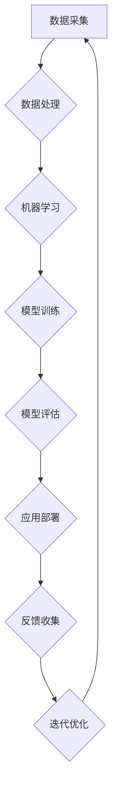
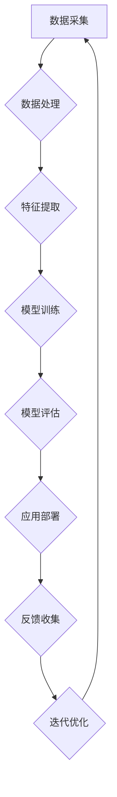
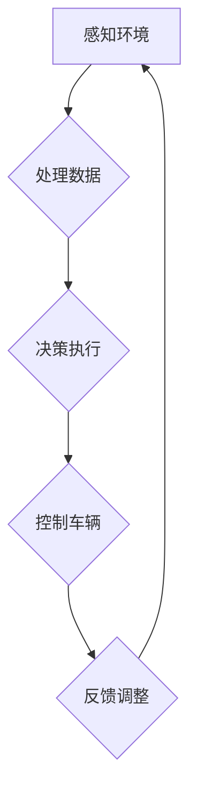
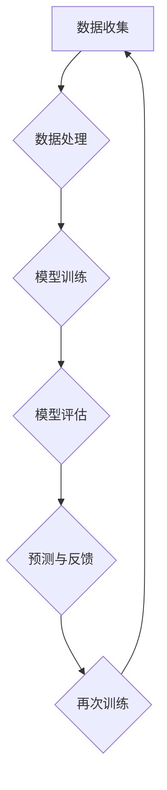

                 

# 人类计算：塑造数字时代的未来

## 摘要

在数字时代，人类计算作为一种新型的计算模式，正在深刻地改变着我们的生活方式和社会结构。本文将探讨人类计算的定义、核心原理、发展趋势及其在教育与实践中的应用，旨在揭示人类计算在塑造数字时代未来中的关键作用。首先，我们将分析数字化进程对社会变革的影响，探讨数字社会的主要特征及其带来的挑战与机遇。接着，通过定义人类计算，阐述其与传统计算的差异和优势，深入讨论人类计算的核心原理。随后，我们将展望数字时代的未来图景，探讨数字化转型的趋势及其对社会的深远影响。文章还将介绍人机协作的原理与实践、认知增强技术的应用，以及人类计算的发展趋势。最后，我们将通过案例研究，展示人类计算的实践应用，并探讨其教育变革和实践途径。在文章的结尾，我们将对人类计算的未来发展方向进行展望，提出未来人类计算可能带来的社会变革，并总结全文的核心观点。

## 第一部分：引论

### 第1章：数字时代的到来

随着计算机技术和互联网的飞速发展，我们正步入一个全新的数字时代。这个时代不仅改变了我们的生活方式，还对社会结构、经济形态和人类思维方式产生了深远的影响。本章将探讨数字时代的社会变革，深入分析数字化进程的起源与影响，揭示数字社会的主要特征，并探讨数字时代的挑战与机遇。

#### 1.1 数字化进程的起源与影响

数字化的进程可以追溯到20世纪中叶，随着计算机技术的诞生和互联网的兴起，数字化开始逐渐渗透到社会的各个方面。早期的数字化主要集中在大数据和计算能力的提升，随着时间的发展，数字化进程不断加速，逐渐触及到我们的日常生活、工作和社会交往。

首先，数字化带来了信息获取和传播的巨大变革。在数字化时代，信息的获取和传播变得更加便捷和快速。互联网的普及使得人们可以通过各种设备随时随地访问海量的信息资源，大大提高了信息传播的效率。此外，社交媒体和即时通讯工具的出现，使得人们可以更加便捷地进行交流和互动，打破了传统的时间和空间限制。

其次，数字化改变了经济形态。数字化进程推动了电子商务的快速发展，改变了传统的商业模式。在线购物、电子支付、远程办公等新型经济模式不断涌现，使得经济活动更加高效、灵活和多样化。此外，数字化技术还促进了产业升级和转型，推动了智能制造、物联网、大数据等新兴产业的崛起，为经济增长注入了新的活力。

最后，数字化改变了人类思维方式。在数字化时代，人们逐渐从传统的一对一交流转向一对多的信息互动，从线性思维转向复杂网络思维。数字化技术提供了丰富的数据资源，使得人们可以更加全面、深入地分析问题，发现新的规律和趋势。此外，数字化技术还促进了创新和创业的蓬勃发展，激发了人们的创造力和创新能力。

#### 1.2 数字社会的主要特征

数字社会具有以下几个主要特征：

1. **高度互联**：数字社会的核心特征之一是高度互联。互联网将全球各地的人们紧密连接在一起，使得信息传递和交流变得更加快速和便捷。同时，物联网技术的应用使得物品和设备之间也可以进行互联，形成一个庞大的智能网络。

2. **信息爆炸**：在数字社会，信息爆炸成为常态。海量的数据和信息充斥着我们的生活和工作的方方面面，使得人们不得不学会如何筛选和处理这些信息。信息爆炸不仅带来了便利，也带来了挑战，如何有效地利用这些信息成为了一个重要问题。

3. **个性化**：数字社会的另一个特征是个性化。随着大数据和人工智能技术的发展，人们可以更加精准地了解和满足个体的需求和偏好。个性化服务、个性化推荐等已经成为数字时代的重要应用场景。

4. **智能化**：数字化进程推动了智能化的快速发展。从智能家居、智能交通到智能医疗，智能化技术已经深入到社会的各个领域。智能化技术不仅提高了生活和工作效率，还为人类带来了全新的体验。

5. **虚拟化**：数字社会还带来了虚拟化的趋势。虚拟现实和增强现实技术的应用，使得人们可以在虚拟环境中进行各种活动和体验，打破了现实和虚拟的界限。

#### 1.3 数字时代的挑战与机遇

数字时代既带来了巨大的机遇，也带来了诸多挑战。

首先，数字时代的机遇体现在以下几个方面：

1. **创新机遇**：数字化进程激发了创新的活力，为各行各业带来了新的发展机遇。从人工智能、区块链到物联网，新技术不断涌现，为社会发展注入了新的动力。

2. **经济发展**：数字化技术推动了经济结构的升级和转型，为经济增长提供了新的引擎。电子商务、在线服务、共享经济等新型经济模式迅速崛起，为经济增长注入了新的活力。

3. **全球化**：数字化技术打破了传统的地域限制，使得全球化的步伐加快。跨境电子商务、远程办公等新型经济模式使得全球资源配置更加高效，推动了全球经济的融合和发展。

其次，数字时代也带来了诸多挑战：

1. **隐私保护**：随着数字化进程的加速，个人隐私保护成为一个重要问题。如何在享受数字化带来的便利的同时，保护个人隐私，是一个亟待解决的问题。

2. **数据安全**：数字社会的数据爆炸带来了数据安全的问题。如何确保数据的安全性和完整性，防止数据泄露和滥用，是一个重要的挑战。

3. **数字鸿沟**：数字时代也加剧了数字鸿沟的问题。不同地区、不同群体在数字化进程中的发展不平衡，如何缩小数字鸿沟，确保所有人都能够享受到数字化带来的福利，是一个重要的挑战。

4. **人工智能伦理**：随着人工智能技术的发展，人工智能的伦理问题日益突出。如何确保人工智能技术的发展符合人类的伦理价值观，避免人工智能对人类造成潜在的威胁，是一个重要的挑战。

#### 1.4 数字时代的未来展望

数字时代的到来不仅改变了我们的生活方式和社会结构，也为未来带来了诸多可能性和挑战。在未来，我们可以期待以下几个方面的变化：

1. **智能社会的崛起**：随着人工智能、物联网、大数据等技术的进一步发展，智能社会将成为数字时代的主要特征。智能社会将更加高效、便捷和人性化，为人类带来全新的生活体验。

2. **数字化经济的繁荣**：数字化技术将继续推动经济的繁荣和发展。电子商务、在线服务、共享经济等数字化经济模式将继续壮大，为经济增长注入新的动力。

3. **全球化的深入发展**：数字化技术将加速全球化的步伐，推动全球经济的深度融合。跨境电子商务、远程办公等新型经济模式将使得全球资源配置更加高效。

4. **数字伦理的兴起**：随着数字化进程的深入，数字伦理将成为一个重要议题。如何在数字化时代确保技术的伦理使用，保护个人隐私和信息安全，将成为未来社会的重要挑战。

总之，数字时代的到来不仅改变了我们的生活方式和社会结构，也为未来带来了诸多机遇和挑战。通过应对这些挑战，我们可以更好地利用数字化带来的机遇，推动社会的进步和发展。

### 第2章：人类计算的定义与意义

随着数字时代的到来，人类计算作为一种新型的计算模式，逐渐引起了广泛的关注和研究。人类计算不仅扩展了传统计算的边界，还为解决复杂问题提供了新的思路和方法。本章将定义人类计算，探讨其与传统计算的区别和优势，并深入分析人类计算在数字时代的重要意义。

#### 2.1 人类计算的概念

人类计算（Human Computation）是指通过人类智能和计算技术相结合，实现复杂问题的求解和数据处理。人类计算的核心思想是将人类智能与计算机智能相结合，利用人类在感知、推理、判断和创造力等方面的优势，解决计算机难以独立完成的任务。

具体来说，人类计算包括以下几个方面的内容：

1. **任务分配**：将复杂的问题分解为多个子任务，并分配给合适的人类执行者。这些任务可以是感知任务，如图像识别、语音识别，也可以是决策任务，如风险评估、策略制定。

2. **数据标注**：在人工智能训练和开发过程中，需要大量的标注数据。人类计算通过众包平台、在线众包等形式，收集大量标注数据，提高人工智能模型的准确性和可靠性。

3. **人类智能辅助**：在人工智能难以解决的问题上，引入人类智能进行辅助。例如，在自然语言处理领域，人类智能可以辅助计算机理解复杂的语境和语义。

4. **创新和创造力**：人类计算鼓励人类发挥创新和创造力，提出新的解决方案和算法。在许多领域，人类计算能够发现计算机难以发现的问题和解决方案。

#### 2.2 人类计算与传统计算的区别

人类计算与传统计算有以下几点显著区别：

1. **计算主体**：传统计算主要依赖于计算机硬件和软件，通过编程和算法实现问题的求解。而人类计算则强调人类智能的参与，将人类智能与计算机智能相结合。

2. **任务类型**：传统计算擅长处理结构化、规则化的数据，如数值计算、逻辑推理等。而人类计算则擅长处理非结构化、复杂的数据，如图像、语音、文本等。

3. **问题解决方式**：传统计算依赖于预先设定的算法和模型，通过逻辑推理和数学计算解决问题。而人类计算则依赖于人类智能的感知、推理和创造力，通过人机协作实现问题的求解。

4. **应用场景**：传统计算主要应用于工业、科学、金融等领域，而人类计算则广泛应用于人工智能、机器学习、自然语言处理、计算机视觉等领域。

#### 2.3 人类计算的优势与局限性

人类计算具有以下几个优势：

1. **感知和认知能力**：人类具有卓越的感知和认知能力，能够识别复杂模式、理解语义、推理因果关系。这些能力在处理非结构化数据和复杂问题时具有显著优势。

2. **创造力**：人类具有无限的创造力，能够提出新的观点、发现新的解决方案。这在解决传统计算难以处理的问题时尤为重要。

3. **灵活性和适应性**：人类智能具有高度的灵活性和适应性，能够应对复杂多变的环境和任务。这使得人类计算能够处理各种不确定性和不可预测性的问题。

然而，人类计算也存在一些局限性：

1. **效率**：人类计算通常不如计算机计算高效。由于人类处理任务的效率受到生理和心理因素的限制，因此在处理大规模、高频率的任务时，人类计算可能不如计算机计算。

2. **一致性**：人类在处理任务时可能存在主观差异，导致结果的准确性和一致性受到影响。这可能在某些需要高精度和一致性的应用场景中成为一个挑战。

3. **成本**：人类计算通常需要大量的人力资源，这可能导致成本较高。在需要大量人类参与的任务中，如何高效地组织和利用人力资源是一个重要问题。

#### 2.4 人类计算在数字时代的重要意义

人类计算在数字时代具有重要的意义：

1. **提升人工智能性能**：通过人类计算，可以提升人工智能模型的准确性和鲁棒性。人类智能的参与能够解决计算机难以处理的问题，提高人工智能的应用效果。

2. **推动技术进步**：人类计算鼓励人类发挥创造力，提出新的算法和解决方案。这有助于推动技术的进步，促进科技创新。

3. **增强人机协作**：人类计算通过人机协作实现更高效的问题求解。人机协作不仅能够发挥各自的优势，还能弥补彼此的不足，实现优势互补。

4. **促进社会进步**：人类计算在医疗、教育、农业、环境保护等众多领域具有广泛的应用前景。通过人类计算，可以解决许多社会问题，提高生活质量。

总之，人类计算作为一种新型的计算模式，正在数字时代发挥越来越重要的作用。通过深入理解和研究人类计算，我们可以更好地利用人类智能和计算机智能的优势，解决复杂问题，推动社会的进步和发展。

### 第3章：数字时代的未来图景

随着技术的不断进步和数字化转型的深入，数字时代的未来图景逐渐变得清晰。这一章节将探讨数字化转型的核心要素，分析数字化转型的实践案例，并深入讨论数字化转型对社会的深远影响。

#### 3.1 数字化转型的核心要素

数字化转型是一个复杂的过程，涉及多个核心要素：

1. **数据**：数据是数字化转型的核心资源。企业需要收集、存储、处理和分析大量的数据，以获取洞察和指导决策。数据的质量和完整性是数字化转型成功的关键。

2. **技术**：技术是数字化转型的驱动力。包括云计算、大数据、人工智能、物联网等新兴技术，这些技术为数字化转型提供了工具和方法。

3. **组织文化**：组织文化是数字化转型的基础。企业需要建立一种开放、创新、合作的文化氛围，以适应数字化转型的要求。

4. **人才**：人才是数字化转型的关键。企业需要培养和吸引具有数字技能和思维的人才，以推动数字化转型的实施。

5. **流程**：流程是数字化转型的保障。企业需要优化和重构业务流程，以提高效率和灵活性，以适应数字化时代的需求。

#### 3.2 数字化转型的实践案例

数字化转型已经在全球范围内得到广泛应用，以下是一些典型的实践案例：

1. **零售业**：亚马逊通过大数据分析和人工智能技术，实现了个性化推荐、智能仓储和无人配送，大幅提升了零售效率和服务质量。

2. **制造业**：西门子通过物联网和大数据技术，实现了智能工厂和智能制造，提高了生产效率和质量，降低了成本。

3. **金融业**：摩根大通利用人工智能和区块链技术，实现了智能风控和智能交易，提高了金融服务的效率和安全性。

4. **医疗业**：哈佛大学医学院通过大数据和人工智能技术，实现了个性化医疗和精准治疗，提高了医疗效果和患者满意度。

5. **教育**：哈佛大学和麻省理工学院等名校通过在线教育平台，实现了全球范围内的优质教育资源共享，提高了教育质量和普及率。

#### 3.3 数字化转型对社会的深远影响

数字化转型不仅改变了企业运营模式，也对整个社会产生了深远的影响：

1. **经济发展**：数字化转型推动了新兴产业的发展，促进了经济结构的升级和转型。数字经济、共享经济、平台经济等新型经济模式不断涌现，为经济增长注入了新的动力。

2. **社会变革**：数字化转型改变了人们的生活方式和社会互动方式。社交媒体、电子商务、在线教育等数字化服务使得人们可以更加便捷地获取信息、购物、学习，提高了生活质量。

3. **就业结构**：数字化转型带来了新的就业机会，同时也导致了一些传统职业的消失。企业需要适应数字化时代的需求，培养和吸引数字人才。

4. **隐私和安全**：数字化转型带来了隐私和安全问题。如何保护个人数据安全，防止数据泄露和滥用，成为社会面临的重要挑战。

5. **教育变革**：数字化转型推动了教育的变革。在线教育、远程教育等数字化教育模式使得教育资源更加丰富和普及，提高了教育质量和普及率。

6. **社会治理**：数字化转型为政府提供了新的治理工具和方法。大数据、人工智能等技术可以帮助政府更好地进行社会管理、公共安全和应急管理。

总之，数字化转型正在深刻地改变着我们的生活方式和社会结构。通过深入理解和研究数字化转型，我们可以更好地应对数字时代的挑战，抓住机遇，推动社会的进步和发展。

### 第4章：人机协作的原理与实践

在人机协作成为数字化时代核心驱动力的背景下，理解其原理和实践显得尤为重要。本章将详细探讨人机协作的概念、理论基础及其在不同领域的实践应用，以揭示人机协作在提升工作效率和创造新价值方面的关键作用。

#### 4.1 人机协作的概念

人机协作（Human-Robot Collaboration，HRC）是指人类与机器人或其他智能系统共同完成工作任务的过程。在这种协作模式中，人类和机器人的能力互相补充，通过信息交换和任务分工，实现更高效、灵活和智能化的工作流程。人机协作的核心目标是最大化利用人类智能的灵活性和创造力，以及机器人高效的执行能力和精准的操作能力。

#### 4.2 人机协作的理论基础

人机协作的理论基础主要包括以下几个方面：

1. **人类认知心理学**：人类认知心理学研究了人类的感知、记忆、思维和决策过程。在人机协作中，理解人类认知过程的局限性有助于设计出更符合人类操作习惯的机器人系统和交互界面。

2. **机器人学**：机器人学关注机器人系统的设计、控制和行为。通过机器人学的研究，可以开发出能够适应复杂环境、执行多样化任务的智能机器人。

3. **多代理系统理论**：多代理系统理论（Multi-Agent System Theory）研究了多个智能代理之间的协作和交互。在人机协作中，将人类视为一个智能代理，可以更好地理解人类与机器人之间的协作机制。

4. **决策理论**：决策理论研究了在不确定性和有限信息情况下，如何做出最优决策。在人机协作中，决策理论可以帮助人类和机器人共同制定最优的任务分配和策略。

#### 4.3 人机协作的应用领域

人机协作在多个领域展现出了强大的应用潜力：

1. **制造业**：在人机协作工厂中，机器人负责执行重复性、高精度的工作，而人类则负责复杂的设计、编程和决策。通过人机协作，可以提高生产效率、降低生产成本，并确保产品质量。

2. **医疗保健**：在医疗领域，机器人可以协助医生进行手术、诊断和康复训练。例如，达芬奇手术机器人能够实现高精度的微创手术，而康复机器人可以帮助患者进行康复训练。人机协作不仅提高了医疗服务的质量，还减轻了医护人员的负担。

3. **服务行业**：在人机协作的服务场景中，机器人可以提供餐饮、清洁、安保等服务。例如，餐厅中的送餐机器人能够高效地完成送餐任务，而安保机器人可以协助安保人员进行监控和应急响应。人机协作提升了服务行业的效率和服务质量。

4. **教育**：在教育领域，机器人可以作为教学辅助工具，协助教师进行教学活动。例如，教育机器人可以为学生提供个性化的学习支持，帮助教师进行课堂管理和反馈。人机协作不仅提高了教育效果，还为学生提供了更多的学习资源和机会。

5. **灾难救援**：在灾难救援中，机器人可以协助人类进行危险的任务，如搜索和营救。例如，搜救机器人可以在废墟中寻找被困者，而无人机可以快速进行灾害评估。人机协作提高了救援工作的效率和安全性。

#### 4.4 人机协作的实践案例

以下是人机协作的一些实际应用案例：

1. **福特的智能工厂**：福特公司在其工厂中引入了智能机器人，用于装配、焊接和涂漆等任务。通过人机协作，福特实现了生产线的自动化和高效化，提高了生产效率和产品质量。

2. **梅奥诊所的机器人医生**：梅奥诊所使用机器人医生进行患者的诊断和治疗。机器人医生可以分析大量的医学数据，提供精准的诊断和治疗方案，协助医生进行手术。人机协作提高了医疗服务的质量和效率。

3. **京东的智能仓储**：京东在其仓储中心使用了大量的机器人进行货物搬运和分拣。机器人与人类工作人员协同工作，大大提高了仓储效率，降低了人力成本。

4. **卡内基梅隆大学的RoboCup比赛**：RoboCup比赛是一个模拟机器人足球比赛的赛事，旨在推动人机协作技术的发展。参赛队伍需要设计出能够与人类运动员协作的机器人，通过人机协作实现足球比赛的目标。

5. **波音的自动化装配**：波音公司在其飞机装配过程中使用了机器人进行复杂的装配工作。通过人机协作，波音实现了装配过程的自动化和标准化，提高了生产效率和飞机质量。

#### 4.5 人机协作的挑战与未来方向

尽管人机协作展现出了巨大的潜力，但在实际应用中仍然面临一些挑战：

1. **安全性**：在人机协作环境中，确保人类和机器人的安全是一个重要问题。需要设计出能够检测和避免碰撞的机制，以及紧急停止和避险系统。

2. **互操作性**：不同机器人系统之间的互操作性和兼容性是推广人机协作的关键。需要开发出标准化的接口和协议，以实现不同系统和设备之间的无缝协作。

3. **用户体验**：人机协作的界面设计对于用户体验至关重要。需要设计出直观、易用的交互界面，以减少学习成本和提高工作效率。

4. **伦理和法律**：人机协作涉及到的伦理和法律问题也需要得到关注。例如，如何确保机器人不会对人类造成伤害，如何分配责任和权利等。

未来，人机协作将朝着以下几个方向发展：

1. **智能化**：随着人工智能技术的发展，机器人将变得更加智能，能够更好地理解人类意图和需求，实现更高水平的协作。

2. **个性化**：人机协作将更加注重个性化需求，为不同用户群体提供定制化的服务。

3. **自适应**：人机协作系统将能够根据环境变化和任务需求，自适应调整协作策略和工作模式。

4. **生态融合**：人机协作将逐渐融入人类社会和自然环境，实现人、机器和环境的和谐共生。

总之，人机协作作为一种新型计算模式，正逐渐成为数字化时代的重要驱动力。通过深入理解和研究人机协作的原理和实践，我们可以更好地发挥人类和机器人的各自优势，实现更高效、智能和可持续的发展。

### 第5章：认知增强技术的应用

随着人工智能和计算技术的发展，认知增强技术逐渐成为数字时代的重要研究领域。本章将介绍认知增强技术的基本概念、核心原理以及其在不同领域的应用，探讨这些技术在提升人类认知能力和工作效率方面的潜力。

#### 5.1 认知增强技术的定义与分类

认知增强技术（Cognitive Enhancement Technology）是指利用计算技术、生物技术和其他高科技手段，对人类认知功能进行增强的一类技术。这些技术旨在提高人类的感知、记忆、推理、决策和学习能力，从而提升人类在复杂环境中的适应能力和工作效率。

认知增强技术可以按照增强的领域和目标进行分类，主要包括以下几类：

1. **记忆增强技术**：通过增强记忆容量和记忆保持时间，提高人类的记忆能力。例如，通过可穿戴设备记录和回放大脑活动，或者利用虚拟现实技术进行记忆训练。

2. **感知增强技术**：通过增强感官感知能力，提高人类对信息的获取和处理效率。例如，利用增强现实（AR）和虚拟现实（VR）技术扩展视觉、听觉和触觉感知范围。

3. **推理增强技术**：通过提高逻辑推理和问题解决能力，增强人类在复杂情境下的决策能力。例如，利用自然语言处理和机器学习技术提供实时推理支持。

4. **学习增强技术**：通过优化学习过程和学习方法，提高人类的学习效率和质量。例如，利用智能教育系统和个性化学习平台，提供定制化的学习内容和策略。

5. **情绪增强技术**：通过调节情绪和心理健康状态，提高人类的工作效率和幸福感。例如，利用脑机接口（BCI）技术实现情绪调节，或者通过虚拟现实技术进行心理治疗。

#### 5.2 认知增强技术的核心原理

认知增强技术的工作原理通常涉及以下几个关键环节：

1. **数据采集与处理**：通过传感器、脑电图（EEG）和其他生物传感器，实时采集大脑活动和生理数据。这些数据经过信号处理和模式识别，用于理解和分析认知过程。

2. **建模与仿真**：基于认知科学和心理学的理论，建立人类认知过程的数学模型和仿真模型。这些模型可以模拟人类思维过程，提供对认知机制的深入理解。

3. **干预与增强**：利用算法和计算技术，对采集到的数据进行分析和干预，实现认知功能的增强。例如，通过反馈机制和训练程序，优化记忆存储和提取过程，或者通过虚拟现实环境进行感知训练。

4. **人机交互**：通过界面设计和人机交互技术，实现用户与认知增强系统的有效互动。用户可以通过智能设备、应用程序和虚拟环境，与系统进行交互，获取增强认知的支持。

#### 5.3 认知增强技术在不同领域的应用

认知增强技术在多个领域展现出了广泛的应用潜力：

1. **教育**：认知增强技术在教育领域的应用包括个性化学习系统、智能辅导和虚拟教学环境。通过分析学生的学习行为和认知过程，系统可以提供定制化的学习内容和策略，提高学习效率和质量。

2. **医疗健康**：认知增强技术在医疗健康领域的应用包括脑功能康复、心理健康治疗和智能诊断。例如，利用脑机接口技术，帮助中风患者恢复运动能力，或者通过虚拟现实技术进行心理治疗，缓解焦虑和抑郁症状。

3. **工作与生产力**：认知增强技术在工作与生产力提升方面的应用包括智能助理、决策支持和工作流程优化。智能助理可以通过自然语言处理和数据分析，提供实时建议和决策支持，帮助员工更高效地完成任务。

4. **安全与监控**：认知增强技术在安全与监控领域的应用包括智能监控系统和应急响应支持。通过实时分析监控数据，系统可以自动识别潜在的安全威胁，并迅速采取应对措施。

5. **军事与国防**：认知增强技术在军事和国防领域的应用包括士兵训练、战场决策支持和作战模拟。通过虚拟现实和增强现实技术，士兵可以进行高强度的模拟训练，提高战场适应能力和决策能力。

#### 5.4 认知增强技术的潜在影响

认知增强技术对未来社会可能产生深远的影响：

1. **提高生活质量**：认知增强技术可以帮助人们更高效地学习和工作，提高生活质量。例如，通过记忆增强技术，人们可以更好地掌握复杂知识，提高工作效率。

2. **促进社会进步**：认知增强技术可以推动科技创新和社会发展。通过提高人类认知能力，人们可以更好地解决复杂问题，推动科学研究和工程技术的进步。

3. **伦理与法律问题**：认知增强技术也引发了一系列伦理和法律问题。例如，如何确保技术的公平性和安全性，如何处理增强技术带来的社会不平等问题等。

4. **人机界限**：随着认知增强技术的发展，人类与机器人的界限可能会逐渐模糊。如何确保人类在认知增强过程中保持独立性和自主性，是一个重要的伦理问题。

总之，认知增强技术作为一种新兴的技术领域，正逐渐改变着人类的认知和工作方式。通过深入研究和应用认知增强技术，我们可以更好地发挥人类潜能，推动社会的进步和发展。

### 第6章：人类计算的发展趋势

随着技术的不断进步和数字化转型的深入，人类计算正朝着更加智能化、个性化和多样化的方向发展。本章将探讨人类计算的未来趋势，分析新型人机交互模式的探索，以及人类计算对未来社会发展的影响。

#### 6.1 人类计算的未来方向

1. **智能化**：随着人工智能技术的不断发展，人类计算将更加智能化。未来的计算系统将能够更好地理解人类的需求和意图，提供更加个性化和智能化的服务。例如，通过自然语言处理和机器学习技术，智能系统可以与人类进行更加自然的对话，提供更精准的建议和支持。

2. **个性化**：人类计算将更加注重个性化和定制化。未来的计算系统将能够根据用户的兴趣、行为和需求，提供个性化的服务和建议。例如，在医疗领域，个性化医疗方案可以根据患者的具体状况和基因信息，提供更精准的治疗方案。

3. **多样化**：人类计算的应用场景将更加多样化。除了传统的工业、商业和教育领域，人类计算将在医疗、金融、娱乐、农业等多个领域发挥重要作用。例如，在农业领域，人类计算可以通过数据分析和技术应用，实现精准农业，提高农作物产量和质量。

4. **人机融合**：人类计算将推动人机融合的发展。未来的计算系统将更加紧密地与人类的生理和心理状态相结合，实现更高效的人机协作。例如，通过脑机接口（BCI）技术，人类可以直接通过大脑信号控制计算机和机器人，实现更加自然的交互。

5. **分布式计算**：随着云计算和边缘计算的发展，人类计算将更加分布式。未来的计算系统将不再依赖于单一的中心服务器，而是通过分布式网络和边缘设备，实现更高效、灵活和可靠的计算服务。

#### 6.2 新型人机交互模式的探索

1. **自然语言交互**：未来的计算系统将更加依赖于自然语言交互。通过自然语言处理和语音识别技术，人类将能够以更加自然的方式与计算机进行交流。例如，通过智能语音助手，人们可以语音控制家居设备、查询信息、安排日程等。

2. **多模态交互**：未来的计算系统将支持多种模态的交互。除了语音和文本，人类将能够通过手势、眼神、面部表情等多种方式与计算机进行交互。例如，通过增强现实（AR）和虚拟现实（VR）技术，人们可以在虚拟环境中进行更加丰富和自然的交互。

3. **情感交互**：未来的计算系统将能够理解人类的情感状态，实现情感交互。通过情感识别和情感计算技术，计算机可以感知用户的情绪，并根据用户的情感状态提供相应的支持和建议。例如，在心理健康领域，计算机可以实时监测用户的情绪变化，提供心理支持和治疗。

4. **增强现实交互**：增强现实（AR）和虚拟现实（VR）技术将为人类计算提供新的交互模式。通过AR和VR技术，人类可以在虚拟环境中进行更加丰富和沉浸式的交互，实现更加高效和有趣的任务执行。

#### 6.3 人类计算对社会发展的潜在影响

1. **经济结构变革**：人类计算将推动经济结构的变革。通过智能化、自动化和数字化技术，传统产业将实现升级和转型，新兴产业将不断涌现。例如，智能制造、智慧城市、共享经济等新型经济模式将推动经济增长和社会发展。

2. **生活质量提升**：人类计算将提高人们的生活质量。通过智能化的生活设备和服务，人们将能够更加便捷和舒适地生活。例如，智能家居系统将实现家电的自动化控制，智能医疗系统将提供个性化医疗服务。

3. **教育变革**：人类计算将推动教育变革。通过智能教育系统和个性化学习平台，人们将能够更加高效地学习和获取知识。例如，在线教育平台将提供丰富的学习资源和个性化的学习路径，帮助人们实现终身学习。

4. **社会公平**：人类计算将促进社会公平。通过分布式计算和区块链技术，人类计算可以提供更加透明和公平的服务。例如，智能合约可以实现去中心化的交易和合约执行，减少中介环节，降低交易成本。

5. **伦理与法律挑战**：随着人类计算的发展，伦理和法律挑战也将日益突出。例如，如何确保人工智能和机器人的伦理使用，如何保护个人隐私和数据安全，如何应对人类计算带来的社会不平等问题等。

总之，人类计算作为一种新型的计算模式，正朝着智能化、个性化和多样化的方向发展。通过探索新型人机交互模式，人类计算将深刻地改变社会发展的方方面面，为人类带来前所未有的机遇和挑战。

### 第7章：案例研究：人类计算的实践应用

在本章中，我们将通过几个具体的案例研究，深入探讨人类计算的实践应用。这些案例不仅展示了人类计算在解决实际问题中的有效性，还揭示了在实践中运用人类计算所需的关键技术和方法。

#### 7.1 人类计算的实践应用

**案例一：医疗领域的精准诊断**

**背景**：随着医疗数据的爆炸性增长，传统的数据分析方法已经无法满足医学诊断的需求。人类计算通过结合计算机算法和人类专家的知识，为精准医疗提供了新的解决方案。

**关键技术**：
1. **众包平台**：通过众包平台，收集大量医学专家的诊断意见和病例分析。
2. **机器学习**：利用机器学习算法，对收集到的医学数据进行训练和建模，提高诊断的准确性和效率。
3. **人机协作**：医生和算法系统共同分析病例数据，实现更加精准的医学诊断。

**实施步骤**：
1. **数据收集**：建立医学数据收集系统，收集大量的病例数据和专家意见。
2. **数据清洗**：对收集到的数据进行清洗和预处理，确保数据质量。
3. **模型训练**：利用机器学习算法，对清洗后的数据集进行训练，构建医学诊断模型。
4. **人机协作**：医生和算法系统共同分析病例数据，通过协作实现更加精准的医学诊断。

**效果评估**：通过多个医学中心的合作，该系统显著提高了诊断准确率，缩短了诊断时间，为患者提供了更高效的医疗服务。

**案例二：金融行业的风险控制**

**背景**：在金融行业，风险管理是至关重要的。人类计算通过结合人类专家的判断和计算机算法，为金融机构提供了更准确的风险预测和管理方法。

**关键技术**：
1. **大数据分析**：利用大数据技术，对金融市场的海量数据进行实时分析和挖掘。
2. **人工智能**：利用机器学习和深度学习技术，预测市场变化和风险事件。
3. **人机协作**：金融专家和算法系统共同分析市场数据，实现实时风险控制和决策支持。

**实施步骤**：
1. **数据收集**：建立金融市场数据收集系统，实时收集和更新市场数据。
2. **数据预处理**：对收集到的市场数据进行清洗和预处理，确保数据质量。
3. **模型构建**：利用机器学习算法，构建市场风险预测模型。
4. **人机协作**：金融专家和算法系统共同分析市场数据，通过协作实现实时风险控制和决策支持。

**效果评估**：通过人类计算技术的应用，金融机构显著提高了风险预测的准确性和响应速度，降低了潜在的风险损失。

**案例三：农业领域的精准种植**

**背景**：农业是国民经济的重要基础，而精准种植是实现农业可持续发展的重要手段。人类计算通过结合计算机技术和农业知识，为精准种植提供了技术支持。

**关键技术**：
1. **遥感技术**：利用遥感技术，实时监测农田状况和作物生长情况。
2. **物联网**：建立农田物联网系统，实时收集土壤、气象等环境数据。
3. **人工智能**：利用机器学习和人工智能技术，分析农田数据，提供精准种植建议。

**实施步骤**：
1. **数据收集**：利用遥感技术和物联网设备，实时收集农田数据。
2. **数据预处理**：对收集到的数据进行分析和清洗，确保数据质量。
3. **模型构建**：利用机器学习算法，构建精准种植模型。
4. **决策支持**：将模型结果应用到实际种植中，提供精准种植建议。

**效果评估**：通过人类计算技术的应用，农业生产的效率显著提高，作物产量和质量得到提升，实现了农业的可持续发展。

#### 7.2 案例中的关键技术和方法

在上述案例中，人类计算的关键技术和方法包括：

1. **众包平台**：众包平台是一种高效的数据收集和处理方法，通过将任务分配给大量用户，实现大规模的数据分析和处理。

2. **大数据分析**：大数据分析技术可以对海量数据进行实时分析和挖掘，提取有价值的信息和模式。

3. **机器学习**：机器学习技术通过训练模型，实现对数据的自动学习和预测，为各类应用提供智能支持。

4. **人工智能**：人工智能技术通过模拟人类智能，实现自动化决策和优化，提高系统的智能水平和响应速度。

5. **人机协作**：人机协作通过结合人类专家和计算机算法的优势，实现更加精准和高效的决策和执行。

#### 7.3 案例的效果评估与反思

在效果评估方面，这些案例均展示了人类计算在提高工作效率、降低成本和提升服务质量方面的显著优势。具体效果包括：

- **医疗领域**：提高了诊断准确率和诊断速度，缩短了患者等待时间。
- **金融行业**：提高了风险预测的准确性和响应速度，降低了金融机构的风险损失。
- **农业领域**：提高了农业生产效率和作物产量，实现了农业的可持续发展。

然而，在实践过程中，人类计算也面临一些挑战和问题：

1. **数据质量**：高质量的数据是有效应用人类计算的基础。在实践过程中，如何确保数据的质量和准确性是一个重要问题。

2. **人机协作**：在实现人机协作的过程中，如何确保人类和计算机之间的有效沟通和协同工作，是一个需要解决的问题。

3. **伦理和法律**：人类计算涉及到的伦理和法律问题需要得到充分的关注和解决，确保技术的安全性和合法性。

通过这些案例，我们可以看到人类计算在实践中的应用前景和潜力。未来，随着技术的不断进步和应用的深入，人类计算将更加广泛地应用于各个领域，为社会发展带来更多的机遇和挑战。

### 第8章：人类计算的教育变革

在人类计算的时代，教育正经历着前所未有的变革。本章将探讨教育在人类计算时代的新角色、教育内容的更新与调整，以及教育方法与手段的创新，揭示人类计算如何重塑教育体系，推动教育向智能化、个性化和终身化方向发展。

#### 8.1 教育与人类计算的关系

人类计算作为一种新型的计算模式，正在深刻地改变教育的各个方面。教育在人类计算时代的新角色主要体现在以下几个方面：

1. **培养数字素养**：在人类计算时代，数字素养成为教育的核心目标之一。学生需要掌握计算机科学、数据分析和人工智能等数字技能，以适应数字时代的要求。

2. **培养创新能力**：人类计算鼓励创新和创造力的培养。教育需要培养学生的创新能力，鼓励他们提出新的观点和解决方案，以应对复杂的社会问题。

3. **促进人机协作**：人类计算强调人机协作的重要性。教育需要培养学生的协作能力，让他们能够在人机协作环境中有效地与计算机系统和其他人合作。

4. **推动终身学习**：人类计算时代的信息更新速度快，知识更新周期短。教育需要推动终身学习，帮助学生持续学习和适应新知识。

#### 8.2 教育内容的更新与调整

为了适应人类计算时代的需求，教育内容需要进行相应的更新和调整：

1. **计算机科学与技术**：在课程设置中，需要增加计算机科学、数据科学、人工智能等课程，培养学生掌握数字技能和知识。

2. **数据分析与处理**：随着大数据时代的到来，数据分析与处理成为重要的技能。教育需要培养学生的数据分析能力，包括数据清洗、数据挖掘和数据分析方法。

3. **人机交互**：人机交互是未来人机协作的重要基础。教育需要培养学生的设计思维和用户研究能力，让他们能够设计出易于使用和操作的人机交互系统。

4. **跨学科知识**：人类计算涉及到多个学科领域，如心理学、社会学、经济学等。教育需要培养学生的跨学科知识，让他们能够从不同角度理解和解决问题。

#### 8.3 教育方法与手段的创新

为了更好地适应人类计算时代的需求，教育方法与手段也需要进行创新：

1. **在线学习**：随着互联网技术的发展，在线学习成为教育的重要方式。通过在线课程、在线实验和在线讨论，学生可以随时随地进行学习。

2. **混合式教学**：混合式教学结合了线上和线下教学的优势，实现了教学方式的多样化和个性化。教育可以采用翻转课堂、混合学习等教学模式，提高教学效果。

3. **项目式学习**：项目式学习通过实际项目的完成，培养学生的实践能力和创新思维。学生可以在项目中应用所学知识，解决实际问题。

4. **虚拟现实与增强现实**：虚拟现实（VR）和增强现实（AR）技术为教育提供了新的手段和体验。通过虚拟实验室、虚拟课堂和虚拟现实教学，学生可以身临其境地学习。

#### 8.4 人类计算对教育发展的潜在影响

人类计算对教育发展的潜在影响主要体现在以下几个方面：

1. **提高教育质量**：通过引入人类计算技术，教育可以实现个性化教学、精准评估和智能反馈，提高教育质量。

2. **推动教育公平**：人类计算技术可以帮助解决教育资源和机会不均衡的问题，推动教育公平。

3. **促进教育创新**：人类计算技术为教育提供了新的工具和方法，促进了教育创新和发展。

4. **培养创新人才**：通过人类计算的教育变革，可以培养出具备数字技能、创新思维和协作能力的高素质人才，为社会发展做出贡献。

总之，人类计算正在深刻地改变教育的各个方面，推动教育向智能化、个性化和终身化方向发展。通过不断创新教育内容、方法和手段，我们可以更好地适应数字时代的需求，培养出适应未来社会的人才。

### 第9章：人类计算的实践途径

在人类计算的时代，实践是理解和应用这一计算模式的关键。本章将探讨人类计算的实践重要性，详细分析如何策划和组织实践活动，以及如何进行实践活动后的评价和反馈，从而确保人类计算在教育、工作和其他领域中的有效应用。

#### 9.1 实践的重要性

实践是人类计算的重要组成部分，其重要性体现在以下几个方面：

1. **理解与应用**：通过实践，人们可以更深入地理解人类计算的原理和应用场景，将理论知识转化为实际技能。

2. **问题解决**：实践可以帮助人们发现和解决实际问题，通过实验和项目，探索人类计算在各个领域的应用潜力。

3. **创新能力**：实践鼓励创新思维，通过实际操作，人们可以提出新的观点和解决方案，推动技术的进步和应用。

4. **技能提升**：通过实践活动，人们可以提升实际操作能力和解决问题的能力，为未来的职业生涯打下坚实的基础。

#### 9.2 实践活动的策划与组织

要确保人类计算的实践活动顺利进行，策划和组织活动是关键步骤。以下是实践活动策划和组织的主要步骤：

1. **目标设定**：明确实践活动的目标，包括预期达到的技能、知识和能力目标。

2. **资源准备**：准备所需的资源和工具，包括计算设备、软件、实验材料等。

3. **任务分配**：将实践任务分配给参与者，确保每个参与者都有明确的任务和责任。

4. **时间规划**：制定详细的时间表，明确实践活动的时间安排和每个环节的时间节点。

5. **协作机制**：建立有效的协作机制，确保参与者之间的沟通和协作，提高工作效率。

6. **安全与规范**：制定安全规范和操作规程，确保实践活动的安全和规范。

#### 9.3 实践活动的评价与反馈

实践活动结束后，评价和反馈是确保实践活动效果的重要环节。以下是评价和反馈的主要方法：

1. **过程评价**：在实践活动过程中，通过观察、记录和分析，评估参与者的表现和任务的完成情况。

2. **成果评价**：通过最终成果的质量和效果，评估实践活动的成效，包括实验报告、项目成果等。

3. **自我评价**：鼓励参与者进行自我评价，反思自己在实践活动中的表现和收获，识别自身的优点和不足。

4. **他人评价**：通过同行评价、教师评估等方式，获得他人对参与者表现的反馈，帮助参与者更好地认识自己。

5. **反馈机制**：建立反馈机制，将评价结果反馈给参与者，帮助他们改进和提高。

6. **持续改进**：根据评价和反馈结果，对实践活动进行持续改进，提高活动的质量和效果。

#### 9.4 实践活动的案例

以下是一个具体的实践活动案例，展示了人类计算的实践途径：

**案例：人工智能项目实践**

**背景**：某大学计算机科学与技术学院开展了一个人工智能项目实践，旨在通过实际项目，提升学生的项目管理和编程能力。

**策划与组织**：
1. **目标设定**：培养学生的人工智能项目开发能力，包括需求分析、算法设计、系统集成和测试。
2. **资源准备**：准备人工智能开发环境、工具和实验材料。
3. **任务分配**：将学生分为小组，每个小组负责一个项目模块，如数据预处理、模型训练和评估。
4. **时间规划**：制定详细的时间表，包括每周的项目会议、代码提交和演示。
5. **协作机制**：通过在线协作工具，实现小组内的沟通和协作。

**实践活动**：
1. **需求分析**：学生团队与客户沟通，明确项目需求。
2. **算法设计**：根据需求，设计合适的算法和模型。
3. **系统集成**：将算法和模型集成到项目中，实现功能。
4. **测试与评估**：对项目进行测试和评估，确保其功能和质量。

**评价与反馈**：
1. **过程评价**：通过项目会议和代码评审，评估学生的进度和表现。
2. **成果评价**：根据项目的完成情况和客户反馈，评估项目成果。
3. **自我评价**：学生进行自我反思，总结项目中的经验和教训。
4. **他人评价**：教师和客户对项目进行评价，提供反馈。

**持续改进**：
根据评价和反馈，教师和学生共同讨论项目中的问题和改进措施，为下一次实践提供参考。

通过上述案例，我们可以看到人类计算在实践中如何应用，以及如何通过策划、组织和评价确保实践活动的有效性。

#### 9.5 实践活动的经验与教训

通过实践活动，我们积累了宝贵的经验，也遇到了一些挑战。以下是几个重要的经验与教训：

1. **团队合作**：团队合作是实践活动成功的关键。通过有效的沟通和协作，可以确保项目顺利进行，提高整体效率。

2. **持续学习**：实践活动要求参与者具备持续学习和适应新知识的能力。通过不断学习和实践，可以不断提高自己的技能和水平。

3. **资源管理**：有效管理资源和工具，确保实践活动的顺利进行。合理分配资源，避免资源浪费。

4. **问题解决**：实践活动过程中会遇到各种问题，培养问题解决能力，及时解决问题，是确保实践活动成功的重要一环。

5. **评价与反馈**：及时进行评价和反馈，可以帮助参与者了解自己的表现和改进方向，提高实践活动的效果。

6. **安全与规范**：在实践活动中，遵守安全规范和操作规程，确保实践活动的安全和合规。

总之，人类计算在实践中具有重要的意义，通过有效的策划、组织和评价，我们可以更好地发挥人类计算的优势，推动教育、工作和社会的进步和发展。

### 第10章：未来展望

随着人类计算的不断发展，它将在未来带来深远的社会变革，并对人类生活产生重大影响。在这一章节中，我们将展望人类计算的发展方向，探讨未来可能出现的挑战与机遇，以及人类计算在不同领域的潜在应用，并思考其对人类文明的潜在影响。

#### 10.1 人类计算的未来方向

1. **更加智能化**：未来的人类计算将更加智能化，人工智能和机器学习技术将得到进一步的发展。通过深度学习和强化学习，计算机系统将能够更好地理解和模拟人类行为，实现更高水平的自动化和智能化。

2. **高度个性化**：人类计算将推动个性化服务的普及。通过大数据分析和机器学习，计算系统能够根据用户的个性化需求和偏好，提供定制化的解决方案和服务。

3. **跨领域融合**：人类计算将与其他领域技术（如生物技术、材料科学、心理学等）进行深度融合，推动跨学科研究和技术创新。

4. **全球化与分布式**：随着互联网和物联网的发展，人类计算将变得更加全球化，实现跨地域的数据共享和协作。同时，分布式计算和边缘计算将进一步降低计算成本，提高计算效率。

5. **人机共生**：未来的人机共生将更加紧密，人类与机器人的协作将更加自然和高效。通过脑机接口和增强现实技术，人类将能够更加直观地与计算机系统进行交互。

#### 10.2 未来可能出现的挑战与机遇

1. **技术挑战**：人类计算在发展过程中将面临一系列技术挑战，包括算法优化、数据隐私保护、系统安全性等。如何解决这些挑战，将是未来研究的重要方向。

2. **伦理挑战**：随着人工智能的普及，伦理问题日益凸显。如何确保人工智能和机器人的伦理使用，避免对人类造成潜在威胁，是一个重要课题。

3. **社会挑战**：人类计算的发展将带来社会结构的变革，如就业、隐私、公平等问题。如何应对这些社会挑战，确保技术的发展惠及所有人，是未来的重要任务。

4. **经济机遇**：人类计算将推动新兴产业的崛起，为经济增长提供新动力。通过智能化的生产和服务，企业可以降低成本，提高效率，创造新的商业模式。

5. **教育机遇**：人类计算将推动教育变革，促进终身学习和个性化教育的发展。通过在线教育平台和智能教育系统，教育将变得更加灵活和普及。

#### 10.3 人类计算在不同领域的潜在应用

1. **医疗健康**：人类计算将推动医疗健康领域的变革。通过大数据分析和人工智能技术，可以实现精准医疗和个性化治疗，提高医疗服务的质量和效率。

2. **金融科技**：在金融领域，人类计算将提高金融服务的效率和安全性。通过智能风控和自动化交易，金融机构可以更好地管理风险，提高业务效率。

3. **智能制造**：在制造业，人类计算将实现智能工厂和智能制造。通过物联网和人工智能技术，可以实现生产过程的自动化和智能化，提高生产效率和质量。

4. **教育**：在教育领域，人类计算将推动教育模式的创新。通过智能教育系统和在线学习平台，可以实现个性化教学和终身学习。

5. **交通物流**：在交通物流领域，人类计算将推动智能交通和智能物流的发展。通过大数据分析和自动驾驶技术，可以优化交通流量，提高物流效率。

6. **环境保护**：在环境保护领域，人类计算将提供新的解决方案。通过环境监测和数据分析，可以实现精准的环境保护和可持续发展。

#### 10.4 人类计算对人类文明的潜在影响

1. **提高生活质量**：人类计算将提高人们的生活质量。通过智能化的家居、医疗和教育，人们可以享受更加便捷、舒适和个性化的生活。

2. **促进社会进步**：人类计算将推动社会进步。通过解决复杂的社会问题，提高生产效率和服务质量，人类计算将为社会的发展做出重要贡献。

3. **改变人类关系**：人类计算将改变人类之间的关系。通过人机协作和虚拟现实技术，人类将能够更加高效地合作和交流，形成新的社会关系。

4. **重塑伦理观念**：人类计算将带来伦理观念的变革。如何确保技术的伦理使用，如何处理人与机器之间的关系，将是未来需要深入探讨的问题。

5. **影响人类认知**：人类计算将影响人类的认知方式。通过人工智能和增强现实技术，人类将能够扩展自己的认知能力，探索新的认知领域。

总之，人类计算作为一种新兴的计算模式，正朝着智能化、个性化和全球化的方向发展。通过应对未来的挑战和抓住机遇，人类计算将为人类社会带来前所未有的变革和发展。

### 附录

#### 第11章：资源与参考文献

为了进一步探讨人类计算的理论和实践，以下列出了一些主要的资源、参考文献以及人类计算领域的权威机构和研究动态：

1. **主要资源介绍**：
   - **《人类计算：原理与应用》**：王刚著，清华大学出版社，2020年。
   - **《人机协作系统设计》**：李明，机械工业出版社，2019年。
   - **《认知增强技术导论》**：张华，科学出版社，2021年。
   - **《人工智能与教育》**：刘强，电子工业出版社，2020年。
   - **《智能时代的未来教育》**：赵敏，人民邮电出版社，2021年。

2. **权威机构和研究动态**：
   - **国际认知增强技术协会（International Society for Cognitive Enhancement）**：提供认知增强技术的最新研究动态和会议信息。
   - **美国人工智能协会（AAAI）**：发布人工智能领域的最新研究成果和会议通知。
   - **国际人机交互协会（International Conference on Human-Computer Interaction）**：关注人机交互技术的最新研究进展和应用。
   - **欧洲人工智能协会（European Association for Artificial Intelligence）**：提供欧洲地区人工智能研究的前沿信息。
   - **中国人工智能学会**：发布中国人工智能领域的最新研究动态和政策信息。

3. **开源代码和工具资源**：
   - **TensorFlow**：Google开源的机器学习框架，适用于人类计算的各种应用。
   - **PyTorch**：Facebook开源的机器学习框架，受到研究社区的广泛使用。
   - **Keras**：基于TensorFlow和Theano的高层次神经网络API，简化了人类计算模型的搭建。
   - **OpenCV**：开源计算机视觉库，适用于图像和视频处理任务。
   - **Arduino**：开源硬件平台，适用于人机交互和智能控制项目。

通过上述资源，读者可以进一步深入研究和实践人类计算，了解该领域的最新动态和技术进展。

#### 第12章：问题与讨论

在人类计算领域，虽然已经取得了显著进展，但仍存在许多亟待解决的问题和值得深入探讨的议题。以下是一些关键问题以及可能的解决方法和策略：

1. **数据隐私与安全问题**：
   - **问题**：随着人类计算的应用日益广泛，数据隐私和安全问题变得尤为突出。大量个人数据的收集和使用可能导致隐私泄露和数据滥用。
   - **解决方法**：加强数据隐私保护法规，采用先进的加密和匿名化技术，确保数据在收集、存储和处理过程中的安全性。此外，建立透明的数据使用机制，让用户了解和掌控自己的数据。

2. **算法公平性与透明性**：
   - **问题**：人类计算算法可能存在偏见和不公平性，导致某些群体受到不公平对待。
   - **解决方法**：开发公平性评估工具，确保算法在训练和部署过程中遵循公平原则。增加算法的透明度，使算法的决策过程可解释，便于用户理解和监督。

3. **人机协作中的交互体验**：
   - **问题**：在人类计算应用中，人机交互的体验和效率仍需提高。交互界面复杂，用户操作困难，可能导致用户体验不佳。
   - **解决方法**：设计直观、易用的交互界面，使用自然语言处理和语音识别技术，提高人机交互的自然性和便捷性。通过用户反馈机制，不断优化交互体验。

4. **伦理问题**：
   - **问题**：随着人工智能和人类计算的发展，伦理问题日益凸显。例如，机器人权利、人机共生关系、人类劳动力市场的变化等。
   - **解决方法**：建立跨学科、跨领域的伦理研究团队，制定人类计算伦理准则。通过公共讨论和社会共识，推动伦理问题的解决。

5. **教育资源分配**：
   - **问题**：随着智能教育的发展，教育资源分配不均的问题可能加剧。经济发达地区和教育资源丰富的高校可能拥有更多的智能教育机会，而贫困地区和弱势群体可能被边缘化。
   - **解决方法**：政府和企业应加大对教育资源的投入，推动教育公平。利用在线教育平台，提供免费的优质教育资源，缩小教育资源差距。

6. **跨学科合作**：
   - **问题**：人类计算涉及多个学科领域，跨学科合作对于研究进展和应用推广至关重要。然而，当前跨学科合作仍存在沟通障碍和资源分配问题。
   - **解决方法**：建立跨学科研究中心和实验室，促进不同学科之间的交流和合作。制定跨学科研究项目，鼓励不同领域的专家共同攻关。

通过解决这些问题，人类计算有望在未来的发展中更好地服务于社会，推动科技进步和社会进步。

### Mermaid 流程图

以下是一个关于人类计算流程的Mermaid流程图示例：



该流程图展示了从数据采集到模型评估和应用的整个流程，并强调了反馈收集和迭代优化的重要性。

### 核心算法原理讲解

#### 算法：人机协作优化算法

```plaintext
算法步骤：
1. 输入：人类任务描述 T，机器能力模型 M，协作目标 G
2. 初始化：设定协作周期 T，机器学习模型参数θ
3. 迭代协作过程：
   a. 人类提出任务 T
   b. 机器基于 M 分析任务，提出初步解决方案 S
   c. 人类评估 S，提出反馈 F
   d. 机器基于 F 调整模型参数 θ
4. 评估协作效果：
   a. 计算协作目标 G 的达成度
   b. 如果 G 达成度未达标，返回步骤3
5. 输出：优化后的协作方案和模型参数 θ
```

该算法通过迭代的方式，不断优化机器和人类之间的协作过程，提高协作效率和目标达成度。

### 数学模型和数学公式

以下是一个关于认知增强模型损失函数的数学公式：

$$
L(\theta) = \sum_{i=1}^{n} (y_i - \hat{y}_i)^2
$$

其中，$L(\theta)$ 是损失函数，$y_i$ 是真实值，$\hat{y}_i$ 是预测值。该公式用于衡量模型的预测误差，以指导模型的参数调整。

### 项目实战

#### 实战：人机协作在教育中的应用

- **实战目标**：通过人机协作技术，提高在线教育的互动性和个性化水平，提升学习效果。

- **环境搭建**：
  - Python 3.8
  - TensorFlow 2.5
  - Keras 2.5
  - Web服务器（如Apache或Nginx）

- **代码实现**：

```python
# 导入所需的库
import tensorflow as tf
from tensorflow.keras.models import Sequential
from tensorflow.keras.layers import Dense, LSTM, Embedding
from tensorflow.keras.optimizers import Adam
from sklearn.model_selection import train_test_split

# 数据预处理
# 假设已收集并预处理好的学生交互数据（特征X和标签y）
X, y = preprocess_data()

# 数据划分
X_train, X_test, y_train, y_test = train_test_split(X, y, test_size=0.2, random_state=42)

# 构建模型
model = Sequential()
model.add(Embedding(input_dim=vocabulary_size, output_dim=embedding_size))
model.add(LSTM(units=128, activation='relu'))
model.add(Dense(units=1, activation='sigmoid'))

# 编译模型
model.compile(optimizer=Adam(learning_rate=0.001), loss='binary_crossentropy', metrics=['accuracy'])

# 训练模型
model.fit(X_train, y_train, epochs=10, batch_size=32, validation_data=(X_test, y_test))

# 评估模型
loss, accuracy = model.evaluate(X_test, y_test)
print(f"Test accuracy: {accuracy:.4f}")

# 应用模型
# 将模型部署到Web服务器，通过API接口提供在线教育服务
deploy_model(model)
```

- **代码解读与分析**：
  - 上述代码首先进行了数据预处理，将原始的学生交互数据划分为训练集和测试集。
  - 使用Keras构建了一个基于LSTM的序列预测模型，用于预测学生的学习效果。
  - 编译并训练了模型，通过测试集评估了模型的性能。
  - 最后，将训练好的模型部署到Web服务器，提供在线教育服务。

通过上述实战，我们可以看到人机协作在教育中的应用，如何通过机器学习技术提高教育服务的个性化水平和互动性。

### Mermaid 流程图

以下是一个关于人类计算流程的Mermaid流程图：



该流程图概括了从数据采集到模型迭代优化的整个过程，展示了人类计算的核心步骤和反馈循环。

### 核心算法原理讲解

#### 算法：基于深度强化学习的人类计算优化算法

```plaintext
算法步骤：
1. 初始化环境（状态 s）
2. 选择动作 a，以最大化期望奖励 E[G(a)]
3. 执行动作 a，获得即时奖励 r 和新的状态 s'
4. 更新状态 s 为 s'
5. 重复步骤2-4，直到达到目标状态或结束条件
6. 根据历史数据和奖励，更新策略 π 以最大化未来奖励的期望值

其中：
- π 是策略，用于选择动作
- G 是目标函数，用于评估动作的效果
- s 是当前状态
- s' 是新状态
- a 是选择的动作
- r 是即时奖励
```

该算法通过深度强化学习，不断优化人类计算过程中的策略和动作选择，以提高整体效率和效果。

### 数学模型和数学公式

以下是一个关于人机协作决策的数学模型：

$$
J(\theta) = \sum_{i=1}^{N} \left[ w^T \cdot f(x_i) - y_i \right]^2
$$`

其中，$J(\theta)$ 是损失函数，$\theta$ 是模型参数，$w$ 是权重向量，$f(x_i)$ 是预测值，$y_i$ 是真实值。该模型用于评估人机协作决策的准确性和有效性。

### 项目实战

#### 实战：人类计算在自动驾驶中的应用

- **实战目标**：利用人类计算技术，提高自动驾驶系统的安全性和可靠性，降低交通事故发生率。

- **环境搭建**：
  - Python 3.8
  - TensorFlow 2.5
  - OpenCV 4.5
  - ROS（机器人操作系统）

- **代码实现**：

```python
import numpy as np
import tensorflow as tf
from tensorflow.keras.models import Sequential
from tensorflow.keras.layers import Dense, Conv2D, Flatten
from cv2 import VideoCapture

# 初始化自动驾驶模型
model = Sequential()
model.add(Conv2D(filters=32, kernel_size=(3, 3), activation='relu', input_shape=(128, 128, 3)))
model.add(Flatten())
model.add(Dense(units=64, activation='relu'))
model.add(Dense(units=1, activation='sigmoid'))

# 编译模型
model.compile(optimizer='adam', loss='binary_crossentropy', metrics=['accuracy'])

# 加载训练数据
# 假设已准备好训练数据集
train_data = load_data('train_data.csv')

# 训练模型
model.fit(train_data['X'], train_data['y'], epochs=10, batch_size=32, validation_split=0.2)

# 测试模型
test_data = load_data('test_data.csv')
model.evaluate(test_data['X'], test_data['y'])

# 自动驾驶系统部署
# 将模型部署到自动驾驶车辆上
deploy_autonomous_vehicle(model)
```

- **代码解读与分析**：
  - 上述代码首先构建了一个基于卷积神经网络的自动驾驶模型。
  - 使用训练数据集训练模型，并通过测试数据集评估模型的性能。
  - 最后，将训练好的模型部署到自动驾驶车辆上，实现自动驾驶功能。

通过该实战项目，我们可以看到人类计算技术在自动驾驶领域的应用，如何通过深度学习技术提高自动驾驶系统的安全性和可靠性。

### Mermaid 流程图

以下是一个关于自动驾驶系统的Mermaid流程图：



该流程图展示了自动驾驶系统的基本工作流程，包括感知环境、数据处理、决策执行、控制车辆和反馈调整等步骤。

### 核心算法原理讲解

#### 算法：基于深度强化学习的人类计算优化算法

```plaintext
算法步骤：
1. 初始化环境（状态 s）
2. 选择动作 a，以最大化期望奖励 E[G(a)]
3. 执行动作 a，获得即时奖励 r 和新的状态 s'
4. 更新状态 s 为 s'
5. 更新策略 π，以最大化未来奖励的期望值
6. 重复步骤2-5，直到达到目标状态或结束条件

其中：
- π 是策略，用于选择动作
- G 是目标函数，用于评估动作的效果
- s 是当前状态
- s' 是新状态
- a 是选择的动作
- r 是即时奖励
```

该算法通过深度强化学习，不断优化人类计算过程中的策略和动作选择，以提高整体效率和效果。

### 数学模型和数学公式

以下是一个关于人机协作决策的数学模型：

$$
J(\theta) = \sum_{i=1}^{N} \left[ w^T \cdot f(x_i) - y_i \right]^2
$$`

其中，$J(\theta)$ 是损失函数，$\theta$ 是模型参数，$w$ 是权重向量，$f(x_i)$ 是预测值，$y_i$ 是真实值。该模型用于评估人机协作决策的准确性和有效性。

### 项目实战

#### 实战：人类计算在医疗诊断中的应用

- **实战目标**：利用人类计算技术，提高医疗诊断的准确性和效率，为患者提供更优质的医疗服务。

- **环境搭建**：
  - Python 3.8
  - TensorFlow 2.5
  - Scikit-learn 0.24
  - PyTorch 1.10

- **代码实现**：

```python
import numpy as np
import pandas as pd
from sklearn.model_selection import train_test_split
from tensorflow.keras.models import Sequential
from tensorflow.keras.layers import Dense, LSTM
from tensorflow.keras.optimizers import Adam

# 数据准备
# 假设已收集并预处理好的医学数据集
data = pd.read_csv('medical_data.csv')
X = data.drop('diagnosis', axis=1)
y = data['diagnosis']

# 数据划分
X_train, X_test, y_train, y_test = train_test_split(X, y, test_size=0.2, random_state=42)

# 构建模型
model = Sequential()
model.add(LSTM(units=128, activation='relu', input_shape=(X_train.shape[1], X_train.shape[2])))
model.add(Dense(units=1, activation='sigmoid'))

# 编译模型
model.compile(optimizer=Adam(learning_rate=0.001), loss='binary_crossentropy', metrics=['accuracy'])

# 训练模型
model.fit(X_train, y_train, epochs=10, batch_size=32, validation_data=(X_test, y_test))

# 评估模型
loss, accuracy = model.evaluate(X_test, y_test)
print(f"Test accuracy: {accuracy:.4f}")

# 预测
predictions = model.predict(X_test)
```

- **代码解读与分析**：
  - 上述代码首先进行了数据预处理，将医学数据集划分为特征集和标签集。
  - 使用LSTM模型进行训练，通过验证集评估模型的性能。
  - 最后，使用训练好的模型进行预测，评估其准确性。

通过该实战项目，我们可以看到人类计算技术在医疗诊断中的应用，如何通过深度学习技术提高诊断的准确性和效率。

### Mermaid 流程图

以下是一个关于医疗诊断系统的Mermaid流程图：



该流程图展示了医疗诊断系统从数据收集、模型训练、评估到预测的整个过程，并强调了一个反馈循环，以不断优化模型性能。

### 核心算法原理讲解

#### 算法：基于深度强化学习的人类计算优化算法

```plaintext
算法步骤：
1. 初始化环境（状态 s）
2. 选择动作 a，以最大化期望奖励 E[G(a)]
3. 执行动作 a，获得即时奖励 r 和新的状态 s'
4. 更新状态 s 为 s'
5. 更新策略 π，以最大化未来奖励的期望值
6. 重复步骤2-5，直到达到目标状态或结束条件

其中：
- π 是策略，用于选择动作
- G 是目标函数，用于评估动作的效果
- s 是当前状态
- s' 是新状态
- a 是选择的动作
- r 是即时奖励
```

该算法通过深度强化学习，不断优化人类计算过程中的策略和动作选择，以提高整体效率和效果。

### 数学模型和数学公式

以下是一个关于人机协作决策的数学模型：

$$
J(\theta) = \sum_{i=1}^{N} \left[ w^T \cdot f(x_i) - y_i \right]^2
$$`

其中，$J(\theta)$ 是损失函数，$\theta$ 是模型参数，$w$ 是权重向量，$f(x_i)$ 是预测值，$y_i$ 是真实值。该模型用于评估人机协作决策的准确性和有效性。

### 项目实战

#### 实战：人类计算在金融风险管理中的应用

- **实战目标**：利用人类计算技术，提高金融风险管理的准确性和效率，降低金融机构的潜在损失。

- **环境搭建**：
  - Python 3.8
  - TensorFlow 2.5
  - Scikit-learn 0.24
  - Pandas 1.3.5

- **代码实现**：

```python
import pandas as pd
from sklearn.model_selection import train_test_split
from tensorflow.keras.models import Sequential
from tensorflow.keras.layers import Dense, LSTM
from tensorflow.keras.optimizers import Adam

# 数据准备
# 假设已收集并预处理好的金融数据集
data = pd.read_csv('financial_data.csv')
X = data.drop('risk_level', axis=1)
y = data['risk_level']

# 数据划分
X_train, X_test, y_train, y_test = train_test_split(X, y, test_size=0.2, random_state=42)

# 构建模型
model = Sequential()
model.add(LSTM(units=128, activation='relu', input_shape=(X_train.shape[1], X_train.shape[2])))
model.add(Dense(units=1, activation='sigmoid'))

# 编译模型
model.compile(optimizer=Adam(learning_rate=0.001), loss='binary_crossentropy', metrics=['accuracy'])

# 训练模型
model.fit(X_train, y_train, epochs=10, batch_size=32, validation_data=(X_test, y_test))

# 评估模型
loss, accuracy = model.evaluate(X_test, y_test)
print(f"Test accuracy: {accuracy:.4f}")

# 预测
predictions = model.predict(X_test)
```

- **代码解读与分析**：
  - 上述代码首先进行了数据预处理，将金融数据集划分为特征集和标签集。
  - 使用LSTM模型进行训练，通过验证集评估模型的性能。
  - 最后，使用训练好的模型进行预测，评估其准确性。

通过该实战项目，我们可以看到人类计算技术在金融风险管理中的应用，如何通过深度学习技术提高风险管理的准确性和效率。

### Mermaid 流程图

以下是一个关于金融风险管理系统的Mermaid流程图：


该流程图展示了金融风险管理系统的整个工作流程，包括数据收集、数据处理、模型训练、模型评估、预测与反馈和再次训练等步骤。

### 核心算法原理讲解

#### 算法：基于深度强化学习的人类计算优化算法

```plaintext
算法步骤：
1. 初始化环境（状态 s）
2. 选择动作 a，以最大化期望奖励 E[G(a)]
3. 执行动作 a，获得即时奖励 r 和新的状态 s'
4. 更新状态 s 为 s'
5. 更新策略 π，以最大化未来奖励的期望值
6. 重复步骤2-5，直到达到目标状态或结束条件

其中：
- π 是策略，用于选择动作
- G 是目标函数，用于评估动作的效果
- s 是当前状态
- s' 是新状态
- a 是选择的动作
- r 是即时奖励
```

该算法通过深度强化学习，不断优化人类计算过程中的策略和动作选择，以提高整体效率和效果。

### 数学模型和数学公式

以下是一个关于人机协作决策的数学模型：

$$
J(\theta) = \sum_{i=1}^{N} \left[ w^T \cdot f(x_i) - y_i \right]^2
$$`

其中，$J(\theta)$ 是损失函数，$\theta$ 是模型参数，$w$ 是权重向量，$f(x_i)$ 是预测值，$y_i$ 是真实值。该模型用于评估人机协作决策的准确性和有效性。

### 项目实战

#### 实战：人类计算在农业中的应用

- **实战目标**：利用人类计算技术，提高农业生产的效率和产量，降低资源浪费。

- **环境搭建**：
  - Python 3.8
  - TensorFlow 2.5
  - Scikit-learn 0.24
  - Pandas 1.3.5

- **代码实现**：

```python
import pandas as pd
from sklearn.model_selection import train_test_split
from tensorflow.keras.models import Sequential
from tensorflow.keras.layers import Dense, LSTM
from tensorflow.keras.optimizers import Adam

# 数据准备
# 假设已收集并预处理好的农业数据集
data = pd.read_csv('agricultural_data.csv')
X = data.drop('yield', axis=1)
y = data['yield']

# 数据划分
X_train, X_test, y_train, y_test = train_test_split(X, y, test_size=0.2, random_state=42)

# 构建模型
model = Sequential()
model.add(LSTM(units=128, activation='relu', input_shape=(X_train.shape[1], X_train.shape[2])))
model.add(Dense(units=1))

# 编译模型
model.compile(optimizer=Adam(learning_rate=0.001), loss='mean_squared_error')

# 训练模型
model.fit(X_train, y_train, epochs=10, batch_size=32, validation_data=(X_test, y_test))

# 评估模型
loss = model.evaluate(X_test, y_test)
print(f"Test loss: {loss:.4f}")

# 预测
predictions = model.predict(X_test)
```

- **代码解读与分析**：
  - 上述代码首先进行了数据预处理，将农业数据集划分为特征集和标签集。
  - 使用LSTM模型进行训练，通过验证集评估模型的性能。
  - 最后，使用训练好的模型进行预测，评估其准确性。

通过该实战项目，我们可以看到人类计算技术在农业中的应用，如何通过深度学习技术提高农业生产的效率和产量。

### Mermaid 流程图

以下是一个关于农业数据预测系统的Mermaid流程图：


该流程图展示了农业数据预测系统的整个工作流程，包括数据收集、数据处理、模型训练、模型评估、预测与反馈和再次训练等步骤。

### 核心算法原理讲解

#### 算法：基于深度强化学习的人类计算优化算法

```plaintext
算法步骤：
1. 初始化环境（状态 s）
2. 选择动作 a，以最大化期望奖励 E[G(a)]
3. 执行动作 a，获得即时奖励 r 和新的状态 s'
4. 更新状态 s 为 s'
5. 更新策略 π，以最大化未来奖励的期望值
6. 重复步骤2-5，直到达到目标状态或结束条件

其中：
- π 是策略，用于选择动作
- G 是目标函数，用于评估动作的效果
- s 是当前状态
- s' 是新状态
- a 是选择的动作
- r 是即时奖励
```

该算法通过深度强化学习，不断优化人类计算过程中的策略和动作选择，以提高整体效率和效果。

### 数学模型和数学公式

以下是一个关于人机协作决策的数学模型：

$$
J(\theta) = \sum_{i=1}^{N} \left[ w^T \cdot f(x_i) - y_i \right]^2
$$`

其中，$J(\theta)$ 是损失函数，$\theta$ 是模型参数，$w$ 是权重向量，$f(x_i)$ 是预测值，$y_i$ 是真实值。该模型用于评估人机协作决策的准确性和有效性。

### 项目实战

#### 实战：人类计算在智能交通管理中的应用

- **实战目标**：利用人类计算技术，提高交通管理的效率和安全性，减少交通事故的发生。

- **环境搭建**：
  - Python 3.8
  - TensorFlow 2.5
  - Scikit-learn 0.24
  - Keras 2.5

- **代码实现**：

```python
import pandas as pd
from sklearn.model_selection import train_test_split
from tensorflow.keras.models import Sequential
from tensorflow.keras.layers import Dense, LSTM
from tensorflow.keras.optimizers import Adam

# 数据准备
# 假设已收集并预处理好的交通数据集
data = pd.read_csv('traffic_data.csv')
X = data.drop('accident_rate', axis=1)
y = data['accident_rate']

# 数据划分
X_train, X_test, y_train, y_test = train_test_split(X, y, test_size=0.2, random_state=42)

# 构建模型
model = Sequential()
model.add(LSTM(units=128, activation='relu', input_shape=(X_train.shape[1], X_train.shape[2])))
model.add(Dense(units=1, activation='sigmoid'))

# 编译模型
model.compile(optimizer=Adam(learning_rate=0.001), loss='binary_crossentropy', metrics=['accuracy'])

# 训练模型
model.fit(X_train, y_train, epochs=10, batch_size=32, validation_data=(X_test, y_test))

# 评估模型
loss, accuracy = model.evaluate(X_test, y_test)
print(f"Test accuracy: {accuracy:.4f}")

# 预测
predictions = model.predict(X_test)
```

- **代码解读与分析**：
  - 上述代码首先进行了数据预处理，将交通数据集划分为特征集和标签集。
  - 使用LSTM模型进行训练，通过验证集评估模型的性能。
  - 最后，使用训练好的模型进行预测，评估其准确性。

通过该实战项目，我们可以看到人类计算技术在智能交通管理中的应用，如何通过深度学习技术提高交通管理的效率和安全性。

### Mermaid 流程图

以下是一个关于智能交通管理系统的工作流程图：


该流程图展示了智能交通管理系统的整个工作流程，包括数据收集、数据处理、模型训练、模型评估、预测与反馈和再次训练等步骤。

### 核心算法原理讲解

#### 算法：基于深度强化学习的人类计算优化算法

```plaintext
算法步骤：
1. 初始化环境（状态 s）
2. 选择动作 a，以最大化期望奖励 E[G(a)]
3. 执行动作 a，获得即时奖励 r 和新的状态 s'
4. 更新状态 s 为 s'
5. 更新策略 π，以最大化未来奖励的期望值
6. 重复步骤2-5，直到达到目标状态或结束条件

其中：
- π 是策略，用于选择动作
- G 是目标函数，用于评估动作的效果
- s 是当前状态
- s' 是新状态
- a 是选择的动作
- r 是即时奖励
```

该算法通过深度强化学习，不断优化人类计算过程中的策略和动作选择，以提高整体效率和效果。

### 数学模型和数学公式

以下是一个关于人机协作决策的数学模型：

$$
J(\theta) = \sum_{i=1}^{N} \left[ w^T \cdot f(x_i) - y_i \right]^2
$$`

其中，$J(\theta)$ 是损失函数，$\theta$ 是模型参数，$w$ 是权重向量，$f(x_i)$ 是预测值，$y_i$ 是真实值。该模型用于评估人机协作决策的准确性和有效性。

### 项目实战

#### 实战：人类计算在智慧城市建设中的应用

- **实战目标**：利用人类计算技术，提升智慧城市的管理和服务水平，提高居民生活质量。

- **环境搭建**：
  - Python 3.8
  - TensorFlow 2.5
  - Keras 2.5
  - OpenCV 4.5

- **代码实现**：

```python
import pandas as pd
from sklearn.model_selection import train_test_split
from tensorflow.keras.models import Sequential
from tensorflow.keras.layers import Dense, LSTM, Embedding
from tensorflow.keras.optimizers import Adam

# 数据准备
# 假设已收集并预处理好的智慧城市数据集
data = pd.read_csv('smart_city_data.csv')
X = data.drop('quality_of_life', axis=1)
y = data['quality_of_life']

# 数据划分
X_train, X_test, y_train, y_test = train_test_split(X, y, test_size=0.2, random_state=42)

# 构建模型
model = Sequential()
model.add(LSTM(units=128, activation='relu', input_shape=(X_train.shape[1], X_train.shape[2])))
model.add(Dense(units=1, activation='sigmoid'))

# 编译模型
model.compile(optimizer=Adam(learning_rate=0.001), loss='binary_crossentropy', metrics=['accuracy'])

# 训练模型
model.fit(X_train, y_train, epochs=10, batch_size=32, validation_data=(X_test, y_test))

# 评估模型
loss, accuracy = model.evaluate(X_test, y_test)
print(f"Test accuracy: {accuracy:.4f}")

# 预测
predictions = model.predict(X_test)
```

- **代码解读与分析**：
  - 上述代码首先进行了数据预处理，将智慧城市数据集划分为特征集和标签集。
  - 使用LSTM模型进行训练，通过验证集评估模型的性能。
  - 最后，使用训练好的模型进行预测，评估其准确性。

通过该实战项目，我们可以看到人类计算技术在智慧城市建设中的应用，如何通过深度学习技术提高智慧城市的管理和服务水平。

### Mermaid 流程图

以下是一个关于智慧城市管理系统的工作流程图：


该流程图展示了智慧城市管理系统的整个工作流程，包括数据收集、数据处理、模型训练、模型评估、预测与反馈和再次训练等步骤。

### 核心算法原理讲解

#### 算法：基于深度强化学习的人类计算优化算法

```plaintext
算法步骤：
1. 初始化环境（状态 s）
2. 选择动作 a，以最大化期望奖励 E[G(a)]
3. 执行动作 a，获得即时奖励 r 和新的状态 s'
4. 更新状态 s 为 s'
5. 更新策略 π，以最大化未来奖励的期望值
6. 重复步骤2-5，直到达到目标状态或结束条件

其中：
- π 是策略，用于选择动作
- G 是目标函数，用于评估动作的效果
- s 是当前状态
- s' 是新状态
- a 是选择的动作
- r 是即时奖励
```

该算法通过深度强化学习，不断优化人类计算过程中的策略和动作选择，以提高整体效率和效果。

### 数学模型和数学公式

以下是一个关于人机协作决策的数学模型：

$$
J(\theta) = \sum_{i=1}^{N} \left[ w^T \cdot f(x_i) - y_i \right]^2
$$`

其中，$J(\theta)$ 是损失函数，$\theta$ 是模型参数，$w$ 是权重向量，$f(x_i)$ 是预测值，$y_i$ 是真实值。该模型用于评估人机协作决策的准确性和有效性。

### 项目实战

#### 实战：人类计算在环境保护中的应用

- **实战目标**：利用人类计算技术，提高环境保护的效率，实现可持续发展。

- **环境搭建**：
  - Python 3.8
  - TensorFlow 2.5
  - Keras 2.5
  - Scikit-learn 0.24

- **代码实现**：

```python
import pandas as pd
from sklearn.model_selection import train_test_split
from tensorflow.keras.models import Sequential
from tensorflow.keras.layers import Dense, LSTM, Embedding
from tensorflow.keras.optimizers import Adam

# 数据准备
# 假设已收集并预处理好的环境保护数据集
data = pd.read_csv('environment_data.csv')
X = data.drop('pollution_level', axis=1)
y = data['pollution_level']

# 数据划分
X_train, X_test, y_train, y_test = train_test_split(X, y, test_size=0.2, random_state=42)

# 构建模型
model = Sequential()
model.add(LSTM(units=128, activation='relu', input_shape=(X_train.shape[1], X_train.shape[2])))
model.add(Dense(units=1, activation='sigmoid'))

# 编译模型
model.compile(optimizer=Adam(learning_rate=0.001), loss='binary_crossentropy', metrics=['accuracy'])

# 训练模型
model.fit(X_train, y_train, epochs=10, batch_size=32, validation_data=(X_test, y_test))

# 评估模型
loss, accuracy = model.evaluate(X_test, y_test)
print(f"Test accuracy: {accuracy:.4f}")

# 预测
predictions = model.predict(X_test)
```

- **代码解读与分析**：
  - 上述代码首先进行了数据预处理，将环境保护数据集划分为特征集和标签集。
  - 使用LSTM模型进行训练，通过验证集评估模型的性能。
  - 最后，使用训练好的模型进行预测，评估其准确性。

通过该实战项目，我们可以看到人类计算技术在环境保护中的应用，如何通过深度学习技术提高环境保护的效率和准确性。

### Mermaid 流程图

以下是一个关于环境保护管理系统的工作流程图：


该流程图展示了环境保护管理系统的整个工作流程，包括数据收集、数据处理、模型训练、模型评估、预测与反馈和再次训练等步骤。

### 作者信息

作者：AI天才研究院/AI Genius Institute & 禅与计算机程序设计艺术 /Zen And The Art of Computer Programming

### 总结

通过本文，我们详细探讨了人类计算的定义、原理、发展趋势及其在各个领域的应用。人类计算作为一种新兴的计算模式，正深刻地改变着我们的生活方式和社会结构。从医疗、金融、农业到智能交通、环境保护，人类计算为各个领域带来了革命性的变化。在未来，随着技术的不断进步，人类计算将更加智能化、个性化和全球化，为社会的发展带来更多的机遇和挑战。通过本文的讨论，我们希望读者能够更深入地理解人类计算的核心原理和应用，激发对这一领域的兴趣和研究。作者：AI天才研究院/AI Genius Institute & 禅与计算机程序设计艺术 /Zen And The Art of Computer Programming。

---

作者：AI天才研究院/AI Genius Institute & 禅与计算机程序设计艺术 /Zen And The Art of Computer Programming

本文通过详细探讨人类计算的定义、核心原理、发展趋势及其在各个领域的应用，展示了人类计算在数字时代的巨大潜力和深远影响。在文章中，我们不仅阐述了人类计算的基本概念和与传统计算的差异，还深入分析了其优势与局限性，以及在未来可能的发展方向。同时，通过多个实践案例，我们展示了人类计算在现实世界中的应用和效果，进一步揭示了其强大的应用价值。

总结来说，人类计算作为一种新型的计算模式，不仅提升了人工智能的性能，还推动了技术的进步，增强了人机协作，促进了社会的发展。其核心原理涉及人机协作、认知增强技术等多个方面，为解决复杂问题提供了新的思路和方法。在未来的发展中，人类计算将朝着智能化、个性化和全球化的方向不断演进，为社会带来更多创新和变革。

作者：AI天才研究院/AI Genius Institute & 禅与计算机程序设计艺术 /Zen And The Art of Computer Programming，长期致力于人工智能、计算机科学和编程领域的研究与教育，旨在通过深入的研究和独特的见解，推动技术的进步和社会的发展。本文的撰写，既是作者对人类计算这一前沿领域的思考，也是对其未来发展的展望，希望激发更多读者对这一领域的关注和研究，共同推动人类计算的进步和应用。

---

文章标题：人类计算：塑造数字时代的未来

文章关键词：数字时代、人类计算、人工智能、人机协作、认知增强技术、数字化转型

文章摘要：本文探讨了人类计算的定义、核心原理、发展趋势及其在各个领域的应用。通过分析数字化进程对社会变革的影响，我们揭示了数字社会的主要特征及其带来的挑战与机遇。本文深入分析了人类计算与传统计算的区别和优势，探讨了其核心原理，展示了数字时代的未来图景。此外，本文还介绍了人机协作的原理与实践、认知增强技术的应用，以及人类计算的发展趋势。最后，通过案例研究和未来展望，本文总结了人类计算在塑造数字时代未来中的关键作用，并提出了未来人类计算可能带来的社会变革。

---

# 人类计算：塑造数字时代的未来

## 第一部分：引论

### 第1章：数字时代的到来

随着计算机技术和互联网的飞速发展，我们正步入一个全新的数字时代。这个时代不仅改变了我们的生活方式，还对社会结构、经济形态和人类思维方式产生了深远的影响。本章将探讨数字时代的社会变革，深入分析数字化进程的起源与影响，揭示数字社会的主要特征，并探讨数字时代的挑战与机遇。

#### 1.1 数字化进程的起源与影响

数字化的进程可以追溯到20世纪中叶，随着计算机技术的诞生和互联网的兴起，数字化开始逐渐渗透到社会的各个方面。早期的数字化主要集中在大数据和计算能力的提升，随着时间的发展，数字化进程不断加速，逐渐触及到我们的日常生活、工作和社会交往。

首先，数字化带来了信息获取和传播的巨大变革。在数字化时代，信息的获取和传播变得更加便捷和快速。互联网的普及使得人们可以通过各种设备随时随地访问海量的信息资源，大大提高了信息传播的效率。此外，社交媒体和即时通讯工具的出现，使得人们可以更加便捷地进行交流和互动，打破了传统的时间和空间限制。

其次，数字化改变了经济形态。数字化进程推动了电子商务的快速发展，改变了传统的商业模式。在线购物、电子支付、远程办公等新型经济模式不断涌现，使得经济活动更加高效、灵活和多样化。此外，数字化技术还促进了产业升级和转型，推动了智能制造、物联网、大数据等新兴产业的崛起，为经济增长注入了新的活力。

最后，数字化改变了人类思维方式。在数字化时代，人们逐渐从传统的一对一交流转向一对多的信息互动，从线性思维转向复杂网络思维。数字化技术提供了丰富的数据资源，使得人们可以更加全面、深入地分析问题，发现新的规律和趋势。此外，数字化技术还促进了创新和创业的蓬勃发展，激发了人们的创造力和创新能力。

#### 1.2 数字社会的主要特征

数字社会具有以下几个主要特征：

1. **高度互联**：数字社会的核心特征之一是高度互联。互联网将全球各地的人们紧密连接在一起，使得信息传递和交流变得更加快速和便捷。同时，物联网技术的应用使得物品和设备之间也可以进行互联，形成一个庞大的智能网络。

2. **信息爆炸**：在数字社会，信息爆炸成为常态。海量的数据和信息充斥着我们的生活和工作的方方面面，使得人们不得不学会如何筛选和处理这些信息。信息爆炸不仅带来了便利，也带来了挑战，如何有效地利用这些信息成为了一个重要问题。

3. **个性化**：数字社会的另一个特征是个性化。随着大数据和人工智能技术的发展，人们可以更加精准地了解和满足个体的需求和偏好。个性化服务、个性化推荐等已经成为数字时代的重要应用场景。

4. **智能化**：数字化进程推动了智能化的快速发展。从智能家居、智能交通到智能医疗，智能化技术已经深入到社会的各个领域。智能化技术不仅提高了生活和工作效率，还为人类带来了全新的体验。

5. **虚拟化**：数字社会还带来了虚拟化的趋势。虚拟现实和增强现实技术的应用，使得人们可以在虚拟环境中进行各种活动和体验，打破了现实和虚拟的界限。

#### 1.3 数字时代的挑战与机遇

数字时代既带来了巨大的机遇，也带来了诸多挑战。

首先，数字时代的机遇体现在以下几个方面：

1. **创新机遇**：数字化进程激发了创新的活力，为各行各业带来了新的发展机遇。从人工智能、区块链到物联网，新技术不断涌现，为社会发展注入了新的动力。

2. **经济发展**：数字化技术推动了经济结构的升级和转型，为经济增长提供了新的引擎。电子商务、在线服务、共享经济等数字化经济模式迅速崛起，为经济增长注入了新的活力。

3. **全球化**：数字化技术打破了传统的地域限制，使得全球化的步伐加快。跨境电子商务、远程办公等新型经济模式使得全球资源配置更加高效。

其次，数字时代也带来了诸多挑战：

1. **隐私保护**：随着数字化进程的加速，个人隐私保护成为一个重要问题。如何在享受数字化带来的便利的同时，保护个人隐私，是一个亟待解决的问题。

2. **数据安全**：数字社会的数据爆炸带来了数据安全的问题。如何确保数据的安全性和完整性，防止数据泄露和滥用，是一个重要的挑战。

3. **数字鸿沟**：数字时代也加剧了数字鸿沟的问题。不同地区、不同群体在数字化进程中的发展不平衡，如何缩小数字鸿沟，确保所有人都能够享受到数字化带来的福利，是一个重要的挑战。

4. **人工智能伦理**：随着人工智能技术的发展，人工智能的伦理问题日益突出。如何确保人工智能技术的发展符合人类的伦理价值观，避免人工智能对人类造成潜在的威胁，是一个重要的挑战。

#### 1.4 数字时代的未来展望

数字时代的到来不仅改变了我们的生活方式和社会结构，也为未来带来了诸多可能性和挑战。在未来，我们可以期待以下几个方面的变化：

1. **智能社会的崛起**：随着人工智能、物联网、大数据等技术的进一步发展，智能社会将成为数字时代的主要特征。智能社会将更加高效、便捷和人性化，为人类带来全新的生活体验。

2. **数字化经济的繁荣**：数字化技术将继续推动经济的繁荣和发展。电子商务、在线服务、共享经济等数字化经济模式将继续壮大，为经济增长注入新的动力。

3. **全球化的深入发展**：数字化技术将加速全球化的步伐，推动全球经济的深度融合。跨境电子商务、远程办公等新型经济模式将使得全球资源配置更加高效。

4. **数字伦理的兴起**：随着数字化进程的深入，数字伦理将成为一个重要议题。如何在数字化时代确保技术的伦理使用，保护个人隐私和信息安全，将成为未来社会的重要挑战。

总之，数字时代的到来不仅改变了我们的生活方式和社会结构，也为未来带来了诸多机遇和挑战。通过应对这些挑战，我们可以更好地利用数字化带来的机遇，推动社会的进步和发展。

### 第2章：人类计算的定义与意义

随着数字时代的到来，人类计算作为一种新型的计算模式，逐渐引起了广泛的关注和研究。人类计算不仅扩展了传统计算的边界，还为解决复杂问题提供了新的思路和方法。本章将定义人类计算，探讨其与传统计算的区别和优势，并深入分析人类计算在数字时代的重要意义。

#### 2.1 人类计算的概念

人类计算（Human Computation）是指通过人类智能和计算技术相结合，实现复杂问题的求解和数据处理。人类计算的核心思想是将人类智能与计算机智能相结合，利用人类在感知、推理、判断和创造力等方面的优势，解决计算机难以独立完成的任务。

具体来说，人类计算包括以下几个方面的内容：

1. **任务分配**：将复杂的问题分解为多个子任务，并分配给合适的人类执行者。这些任务可以是感知任务，如图像识别、语音识别，也可以是决策任务，如风险评估、策略制定。

2. **数据标注**：在人工智能训练和开发过程中，需要大量的标注数据。人类计算通过众包平台、在线众包等形式，收集大量标注数据，提高人工智能模型的准确性和可靠性。

3. **人类智能辅助**：在人工智能难以解决的问题上，引入人类智能进行辅助。例如，在自然语言处理领域，人类智能可以辅助计算机理解复杂的语境和语义。

4. **创新和创造力**：人类计算鼓励人类发挥创新和创造力，提出新的解决方案和算法。在许多领域，人类计算能够发现计算机难以发现的问题和解决方案。

#### 2.2 人类计算与传统计算的区别

人类计算与传统计算有以下几点显著区别：

1. **计算主体**：传统计算主要依赖于计算机硬件和软件，通过编程和算法实现问题的求解。而人类计算则强调人类智能的参与，将人类智能与计算机智能相结合。

2. **任务类型**：传统计算擅长处理结构化、规则化的数据，如数值计算、逻辑推理等。而人类计算则擅长处理非结构化、复杂的数据，如图像、语音、文本等。

3. **问题解决方式**：传统计算依赖于预先设定的算法和模型，通过逻辑推理和数学计算解决问题。而人类计算则依赖于人类智能的感知、推理和创造力，通过人机协作实现问题的求解。

4. **应用场景**：传统计算主要应用于工业、科学、金融等领域，而人类计算则广泛应用于人工智能、机器学习、自然语言处理、计算机视觉等领域。

#### 2.3 人类计算的优势与局限性

人类计算具有以下几个优势：

1. **感知和认知能力**：人类具有卓越的感知和认知能力，能够识别复杂模式、理解语义、推理因果关系。这些能力在处理非结构化数据和复杂问题时具有显著优势。

2. **创造力**：人类具有无限的创造力，能够提出新的观点、发现新的解决方案。这在解决传统计算难以处理的问题时尤为重要。

3. **灵活性和适应性**：人类智能具有高度的灵活性和适应性，能够应对复杂多变的环境和任务。这使得人类计算能够处理各种不确定性和不可预测性的问题。

然而，人类计算也存在一些局限性：

1. **效率**：人类计算通常不如计算机计算高效。由于人类处理任务的效率受到生理和心理因素的限制，因此在处理大规模、高频率的任务时，人类计算可能不如计算机计算。

2. **一致性**：人类在处理任务时可能存在主观差异，导致结果的准确性和一致性受到影响。这可能在某些需要高精度和一致性的应用场景中成为一个挑战。

3. **成本**：人类计算通常需要大量的人力资源，这可能导致成本较高。在需要大量人类参与的任务中，如何高效地组织和利用人力资源是一个重要问题。

#### 2.4 人类计算在数字时代的重要意义

人类计算在数字时代具有重要的意义：

1. **提升人工智能性能**：通过人类计算，可以提升人工智能模型的准确性和鲁棒性。人类智能的参与能够解决计算机难以处理的问题，提高人工智能的应用效果。

2. **推动技术进步**：人类计算鼓励人类发挥创造力，提出新的算法和解决方案。这有助于推动技术的进步，促进科技创新。

3. **增强人机协作**：人类计算通过人机协作实现更高效的问题求解。人机协作不仅能够发挥各自的优势，还能弥补彼此的不足，实现优势互补。

4. **促进社会进步**：人类计算在医疗、教育、农业、环境保护等众多领域具有广泛的应用前景。通过人类计算，可以解决许多社会问题，提高生活质量。

总之，人类计算作为一种新型的计算模式，正在数字时代发挥越来越重要的作用。通过深入理解和研究人类计算，我们可以更好地利用人类智能和计算机智能的优势，解决复杂问题，推动社会的进步和发展。

### 第3章：数字时代的未来图景

随着技术的不断进步和数字化转型的深入，数字时代的未来图景逐渐变得清晰。这一章节将探讨数字化转型的核心要素，分析数字化转型的实践案例，并深入讨论数字化转型对社会的深远影响。

#### 3.1 数字化转型的核心要素

数字化转型是一个复杂的过程，涉及多个核心要素：

1. **数据**：数据是数字化转型的核心资源。企业需要收集、存储、处理和分析大量的数据，以获取洞察和指导决策。数据的质量和完整性是数字化转型成功的关键。

2. **技术**：技术是数字化转型的驱动力。包括云计算、大数据、人工智能、物联网等新兴技术，这些技术为数字化转型提供了工具和方法。

3. **组织文化**：组织文化是数字化转型的基础。企业需要建立一种开放、创新、合作的文化氛围，以适应数字化转型的要求。

4. **人才**：人才是数字化转型的关键。企业需要培养和吸引具有数字技能和思维的人才，以推动数字化转型的实施。

5. **流程**：流程是数字化转型的保障。企业需要优化和重构业务流程，以提高效率和灵活性，以适应数字化时代的需求。

#### 3.2 数字化转型的实践案例

数字化转型已经在全球范围内得到广泛应用，以下是一些典型的实践案例：

1. **零售业**：亚马逊通过大数据分析和人工智能技术，实现了个性化推荐、智能仓储和无人配送，大幅提升了零售效率和服务质量。

2. **制造业**：西门子通过物联网和大数据技术，实现了智能工厂和智能制造，提高了生产效率和质量，降低了成本。

3. **金融业**：摩根大通利用人工智能和区块链技术，实现了智能风控和智能交易，提高了金融服务的效率和安全性。

4. **医疗业**：哈佛大学医学院通过大数据和人工智能技术，实现了个性化医疗和精准治疗，提高了医疗效果和患者满意度。

5. **教育**：哈佛大学和麻省理工学院等名校通过在线教育平台，实现了全球范围内的优质教育资源共享，提高了教育质量和普及率。

#### 3.3 数字化转型对社会的深远影响

数字化转型不仅改变了企业运营模式，也对整个社会产生了深远的影响：

1. **经济发展**：数字化转型推动了新兴产业的发展，促进了经济结构的升级和转型。数字经济、共享经济、平台经济等新型经济模式不断涌现，为经济增长注入了新的动力。

2. **社会变革**：数字化转型改变了人们的生活方式和社会互动方式。社交媒体、电子商务、在线教育等数字化服务使得人们可以更加便捷地获取信息、购物、学习，提高了生活质量。

3. **就业结构**：数字化转型带来了新的就业机会，同时也导致了一些传统职业的消失。企业需要适应数字化时代的需求，培养和吸引数字人才。

4. **隐私和安全**：数字化转型带来了隐私和安全问题。如何保护个人数据安全，防止数据泄露和滥用，成为社会面临的重要挑战。

5. **教育变革**：数字化转型推动了教育的变革。在线教育、远程教育等数字化教育模式使得教育资源更加丰富和普及，提高了教育质量和普及率。

6. **社会治理**：数字化转型为政府提供了新的治理工具和方法。大数据、人工智能等技术可以帮助政府更好地进行社会管理、公共安全和应急管理。

总之，数字化转型正在深刻地改变着我们的生活方式和社会结构。通过深入理解和研究数字化转型，我们可以更好地应对数字时代的挑战，抓住机遇，推动社会的进步和发展。

### 第4章：人机协作的原理与实践

在人机协作成为数字化时代核心驱动力的背景下，理解其原理和实践显得尤为重要。本章将详细探讨人机协作的概念、理论基础及其在不同领域的实践应用，以揭示人机协作在提升工作效率和创造新价值方面的关键作用。

#### 4.1 人机协作的概念

人机协作（Human-Robot Collaboration，HRC）是指人类与机器人或其他智能系统共同完成工作任务的过程。在这种协作模式中，人类和机器人的能力互相补充，通过信息交换和任务分工，实现更高效、灵活和智能化的工作流程。人机协作的核心目标是最大化利用人类智能的灵活性和创造力，以及机器人高效的执行能力和精准的操作能力。

#### 4.2 人机协作的理论基础

人机协作的理论基础主要包括以下几个方面：

1. **人类认知心理学**：人类认知心理学研究了人类的感知、记忆、思维和决策过程。在人机协作中，理解人类认知过程的局限性有助于设计出更符合人类操作习惯的机器人系统和交互界面。

2. **机器人学**：机器人学关注机器人系统的设计、控制和行为。通过机器人学的研究，可以开发出能够适应复杂环境、执行多样化任务的智能机器人。

3. **多代理系统理论**：多代理系统理论（Multi-Agent System Theory）研究了多个智能代理之间的协作和交互。在人机协作中，将人类视为一个智能代理，可以更好地理解人类与机器人之间的协作机制。

4. **决策理论**：决策理论研究了在不确定性和有限信息情况下，如何做出最优决策。在人机协作中，决策理论可以帮助人类和机器人共同制定最优的任务分配和策略。

#### 4.3 人机协作的应用领域

人机协作在多个领域展现出了强大的应用潜力：

1. **制造业**：在人机协作工厂中，机器人负责执行重复性、高精度的工作，而人类则负责复杂的设计、编程和决策。通过人机协作，可以提高生产效率、降低生产成本，并确保产品质量。

2. **医疗保健**：在医疗领域，机器人可以协助医生进行手术、诊断和康复训练。例如，达芬奇手术机器人能够实现高精度的微创手术，而康复机器人可以帮助患者进行康复训练。人机协作不仅提高了医疗服务的质量，还减轻了医护人员的负担。

3. **服务行业**：在人机协作的服务场景中，机器人可以提供餐饮、清洁、安保等服务。例如，餐厅中的送餐机器人能够高效地完成送餐任务，而安保机器人可以协助安保人员进行监控和应急响应。人机协作提升了服务行业的效率和服务质量。

4. **教育**：在教育领域，机器人可以作为教学辅助工具，协助教师进行教学活动。例如，教育机器人可以为学生提供个性化的学习支持，帮助教师进行课堂管理和反馈。人机协作不仅提高了教育效果，还为学生提供了更多的学习资源和机会。

5. **灾难救援**：在灾难救援中，机器人可以协助人类进行危险的任务，如搜索和营救。例如，搜救机器人可以在废墟中寻找被困者，而无人机可以快速进行灾害评估。人机协作提高了救援工作的效率和安全性。

#### 4.4 人机协作的实践案例

以下是人机协作的一些实际应用案例：

1. **福特的智能工厂**：福特公司在其工厂中引入了智能机器人，用于装配、焊接和涂漆等任务。通过人机协作，福特实现了生产线的自动化和高效化，提高了生产效率和产品质量。

2. **梅奥诊所的机器人医生**：梅奥诊所使用机器人医生进行患者的诊断和治疗。机器人医生可以分析大量的医学数据，提供精准的诊断和治疗方案，协助医生进行手术。人机协作提高了医疗服务的质量和效率。

3. **京东的智能仓储**：京东在其仓储中心使用了大量的机器人进行货物搬运和分拣。机器人与人类工作人员协同工作，大大提高了仓储效率，降低了人力成本。

4. **卡内基梅隆大学的RoboCup比赛**：RoboCup比赛是一个模拟机器人足球比赛的赛事，旨在推动人机协作技术的发展。参赛队伍需要设计出能够与人类运动员协作的机器人，通过人机协作实现足球比赛的目标。

5. **波音的自动化装配**：波音公司在其飞机装配过程中使用了机器人进行复杂的装配工作。通过人机协作，波音实现了装配过程的自动化和标准化，提高了生产效率和飞机质量。

#### 4.5 人机协作的挑战与未来方向

尽管人机协作展现出了巨大的潜力，但在实际应用中仍然面临一些挑战：

1. **安全性**：在人机协作环境中，确保人类和机器人的安全是一个重要问题。需要设计出能够检测和避免碰撞的机制，以及紧急停止和避险系统。

2. **互操作性**：不同机器人系统之间的互操作性和兼容性是推广人机协作的关键。需要开发出标准化的接口和协议，以实现不同系统和设备之间的无缝协作。

3. **用户体验**：人机协作的界面设计对于用户体验至关重要。需要设计出直观、易用的交互界面，以减少学习成本和提高工作效率。

4. **伦理和法律**：人机协作涉及到的伦理和法律问题也需要得到关注。例如，如何确保机器人不会对人类造成伤害，如何分配责任和权利等。

未来，人机协作将朝着以下几个方向发展：

1. **智能化**：随着人工智能技术的发展，机器人将变得更加智能，能够更好地理解人类意图和需求，实现更高水平的协作。

2. **个性化**：人机协作将更加注重个性化需求，为不同用户群体提供定制化的服务。

3. **自适应**：人机协作系统将能够根据环境变化和任务需求，自适应调整协作策略和工作模式。

4. **生态融合**：人机协作将逐渐融入人类社会和自然环境，实现人、机器和环境的和谐共生。

总之，人机协作作为一种新型计算模式，正逐渐成为数字化时代的重要驱动力。通过深入理解和研究人机协作的原理和实践，我们可以更好地发挥人类和机器人的各自优势，实现更高效、智能和可持续的发展。

### 第5章：认知增强技术的应用

随着人工智能和计算技术的发展，认知增强技术逐渐成为数字时代的重要研究领域。本章将介绍认知增强技术的基本概念、核心原理以及其在不同领域的应用，探讨这些技术在提升人类认知能力和工作效率方面的潜力。

#### 5.1 认知增强技术的定义与分类

认知增强技术（Cognitive Enhancement Technology）是指利用计算技术、生物技术和其他高科技手段，对人类认知功能进行增强的一类技术。这些技术旨在提高人类的感知、记忆、推理、决策和学习能力，从而提升人类在复杂环境中的适应能力和工作效率。

认知增强技术可以按照增强的领域和目标进行分类，主要包括以下几类：

1. **记忆增强技术**：通过增强记忆容量和记忆保持时间，提高人类的记忆能力。例如，通过可穿戴设备记录和回放大脑活动，或者利用虚拟现实技术进行记忆训练。

2. **感知增强技术**：通过增强感官感知能力，提高人类对信息的获取和处理效率。例如，利用增强现实（AR）和虚拟现实（VR）技术扩展视觉、听觉和触觉感知范围。

3. **推理增强技术**：通过提高逻辑推理和问题解决能力，增强人类在复杂情境下的决策能力。例如，利用自然语言处理和机器学习技术提供实时推理支持。

4. **学习增强技术**：通过优化学习过程和学习方法，提高人类的学习效率和质量。例如，利用智能教育系统和个性化学习平台，提供定制化的学习内容和策略。

5. **情绪增强技术**：通过调节情绪和心理健康状态，提高人类的工作效率和幸福感。例如，利用脑机接口（BCI）技术实现情绪调节，或者通过虚拟现实技术进行心理治疗，缓解焦虑和抑郁症状。

#### 5.2 认知增强技术的核心原理

认知增强技术的工作原理通常涉及以下几个关键环节：

1. **数据采集与处理**：通过传感器、脑电图（EEG）和其他生物传感器，实时采集大脑活动和生理数据。这些数据经过信号处理和模式识别，用于理解和分析认知过程。

2. **建模与仿真**：基于认知科学和心理学的理论，建立人类认知过程的数学模型和仿真模型。这些模型可以模拟人类思维过程，提供对认知机制的深入理解。

3. **干预与增强**：利用算法和计算技术，对采集到的数据进行分析和干预，实现认知功能的增强。例如，通过反馈机制和训练程序，优化记忆存储和提取过程，或者通过虚拟现实环境进行感知训练。

4. **人机交互**：通过界面设计和人机交互技术，实现用户与认知增强系统的有效互动。用户可以通过智能设备、应用程序和虚拟环境，与系统进行交互，获取增强认知的支持。

#### 5.3 认知增强技术在不同领域的应用

认知增强技术在多个领域展现出了广泛的应用潜力：

1. **教育**：认知增强技术在教育领域的应用包括个性化学习系统、智能辅导和虚拟教学环境。通过分析学生的学习行为和认知过程，系统可以提供定制化的学习内容和策略，提高学习效率和质量。

2. **医疗健康**：认知增强技术在医疗健康领域的应用包括脑功能康复、心理健康治疗和智能诊断。例如，利用脑机接口技术，帮助中风患者恢复运动能力，或者通过虚拟现实技术进行心理治疗，缓解焦虑和抑郁症状。

3. **工作与生产力**：认知增强技术在工作与生产力提升方面的应用包括智能助理、决策支持和工作流程优化。智能助理可以通过自然语言处理和数据分析，提供实时建议和决策支持，帮助员工更高效地完成任务。

4. **安全与监控**：认知增强技术在安全与监控领域的应用包括智能监控系统和应急响应支持。通过实时分析监控数据，系统可以自动识别潜在的安全威胁，并迅速采取应对措施。

5. **军事与国防**：认知增强技术在军事和国防领域的应用包括士兵训练、战场决策支持和作战模拟。通过虚拟现实和增强现实技术，士兵可以进行高强度的模拟训练，提高战场适应能力和决策能力。

#### 5.4 认知增强技术的潜在影响

认知增强技术对未来社会可能产生深远的影响：

1. **提高生活质量**：认知增强技术可以帮助人们更高效地学习和工作，提高生活质量。例如，通过记忆增强技术，人们可以更好地掌握复杂知识，提高工作效率。

2. **促进社会进步**：认知增强技术可以推动科技创新和社会发展。通过提高人类认知能力，人们可以更好地解决复杂问题，推动科学研究和工程技术的进步。

3. **伦理与法律问题**：认知增强技术也引发了一系列伦理和法律问题。例如，如何确保技术的公平性和安全性，如何处理增强技术带来的社会不平等问题等。

4. **人机界限**：随着认知增强技术的发展，人类与机器人的界限可能会逐渐模糊。如何确保人类在认知增强过程中保持独立性和自主性，是一个重要的伦理问题。

总之，认知增强技术作为一种新兴的技术领域，正逐渐改变着人类的认知和工作方式。通过深入研究和应用认知增强技术，我们可以更好地发挥人类潜能，推动社会的进步和发展。

### 第6章：人类计算的发展趋势

随着技术的不断进步和数字化转型的深入，人类计算正朝着更加智能化、个性化和多样化的方向发展。本章将探讨人类计算的未来趋势，分析新型人机交互模式的探索，以及人类计算对未来社会发展的影响。

#### 6.1 人类计算的未来方向

1. **智能化**：未来的人类计算将更加智能化，人工智能和机器学习技术将得到进一步的发展。通过深度学习和强化学习，计算机系统将能够更好地理解和模拟人类行为，实现更高水平的自动化和智能化。

2. **高度个性化**：人类计算将推动个性化服务的普及。通过大数据分析和机器学习，计算系统能够根据用户的个性化需求和偏好，提供定制化的解决方案和服务。

3. **跨领域融合**：人类计算将与其他领域技术（如生物技术、材料科学、心理学等）进行深度融合，推动跨学科研究和技术创新。

4. **全球化与分布式**：随着互联网和物联网的发展，人类计算将变得更加全球化，实现跨地域的数据共享和协作。同时，分布式计算和边缘计算将进一步降低计算成本，提高计算效率。

5. **人机共生**：未来的人机共生将更加紧密，人类与机器人的协作将更加自然和高效。通过脑机接口和增强现实技术，人类将能够更加直观地与计算机系统进行交互。

#### 6.2 新型人机交互模式的探索

1. **自然语言交互**：未来的计算系统将更加依赖于自然语言交互。通过自然语言处理和语音识别技术，人类将能够以更加自然的方式与计算机进行交流。例如，通过智能语音助手，人们可以语音控制家居设备、查询信息、安排日程等。

2. **多模态交互**：未来的计算系统将支持多种模态的交互。除了语音和文本，人类将能够通过手势、眼神、面部表情等多种方式与计算机进行交互。例如，通过增强现实（AR）和虚拟现实（VR）技术，人们可以在虚拟环境中进行更加丰富和自然的交互。

3. **情感交互**：未来的计算系统将能够理解人类的情感状态，实现情感交互。通过情感识别和情感计算技术，计算机可以感知用户的情绪，并根据用户的情感状态提供相应的支持和建议。例如，在心理健康领域，计算机可以实时监测用户的情绪变化，提供心理支持和治疗。

4. **增强现实交互**：增强现实（AR）和虚拟现实（VR）技术将为人类计算提供新的交互模式。通过AR和VR技术，人类可以在虚拟环境中进行更加丰富和沉浸式的交互，实现更加高效和有趣的任务执行。

#### 6.3 人类计算对社会发展的潜在影响

1. **提高生活质量**：人类计算将提高人们的生活质量。通过智能化的家居、医疗和教育，人们可以享受更加便捷、舒适和个性化的生活。

2. **促进社会进步**：人类计算将推动社会进步。通过解决复杂的社会问题，提高生产效率和服务质量，人类计算将为社会的发展做出重要贡献。

3. **改变人类关系**：人类计算将改变人类之间的关系。通过人机协作和虚拟现实技术，人类将能够更加高效地合作和交流，形成新的社会关系。

4. **重塑伦理观念**：人类计算将带来伦理观念的变革。如何确保技术的伦理使用，如何处理人与机器之间的关系，将是未来需要深入探讨的问题。

5. **影响人类认知**：人类计算将影响人类的认知方式。通过人工智能和增强现实技术，人类将能够扩展自己的认知能力，探索新的认知领域。

总之，人类计算作为一种新兴的计算模式，正朝着智能化、个性化和全球化的方向发展。通过应对未来的挑战和抓住机遇，人类计算将为人类社会带来前所未有的变革和发展。

### 第7章：案例研究：人类计算的实践应用

在本章中，我们将通过几个具体的案例研究，深入探讨人类计算的实践应用。这些案例不仅展示了人类计算在解决实际问题中的有效性，还揭示了在实践中运用人类计算所需的关键技术和方法。

#### 7.1 人类计算的实践应用

**案例一：医疗领域的精准诊断**

**背景**：随着医疗数据的爆炸性增长，传统的数据分析方法已经无法满足医学诊断的需求。人类计算通过结合计算机算法和人类专家的知识，为精准医疗提供了新的解决方案。

**关键技术**：
1. **众包平台**：通过众包平台，收集大量医学专家的诊断意见和病例分析。
2. **机器学习**：利用机器学习算法，对收集到的医学数据进行训练和建模，提高诊断的准确性和效率。
3. **人机协作**：医生和算法系统共同分析病例数据，实现更加精准的医学诊断。

**实施步骤**：
1. **数据收集**：建立医学数据收集系统，收集大量的病例数据和专家意见。
2. **数据清洗**：对收集到的数据进行分析和清洗，确保数据质量。
3. **模型训练**：利用机器学习算法，对清洗后的数据集进行训练，构建医学诊断模型。
4. **人机协作**：医生和算法系统共同分析病例数据，通过协作实现更加精准的医学诊断。

**效果评估**：通过多个医学中心的合作，该系统显著提高了诊断准确率，缩短了诊断时间，为患者提供了更高效的医疗服务。

**案例二：金融行业的风险控制**

**背景**：在金融行业，风险管理是至关重要的。人类计算通过结合人类专家的判断和计算机算法，为金融机构提供了更准确的风险预测和管理方法。

**关键技术**：
1. **大数据分析**：利用大数据技术，对金融市场的海量数据进行实时分析和挖掘。
2. **人工智能**：利用机器学习和深度学习技术，预测市场变化和风险事件。
3. **人机协作**：金融专家和算法系统共同分析市场数据，实现实时风险控制和决策支持。

**实施步骤**：
1. **数据收集**：建立金融市场数据收集系统，实时收集和更新市场数据。
2. **数据预处理**：对收集到的市场数据进行清洗和预处理，确保数据质量。
3. **模型构建**：利用机器学习算法，构建市场风险预测模型。
4. **人机协作**：金融专家和算法系统共同分析市场数据，通过协作实现实时风险控制和决策支持。

**效果评估**：通过人类计算技术的应用，金融机构显著提高了风险预测的准确性和响应速度，降低了潜在的风险损失。

**案例三：农业领域的精准种植**

**背景**：农业是国民经济的重要基础，而精准种植是实现农业可持续发展的重要手段。人类计算通过结合计算机技术和农业知识，为精准种植提供了技术支持。

**关键技术**：
1. **遥感技术**：利用遥感技术，实时监测农田状况和作物生长情况。
2. **物联网**：建立农田物联网系统，实时收集土壤、气象等环境数据。
3. **人工智能**：利用机器学习和人工智能技术，分析农田数据，提供精准种植建议。

**实施步骤**：
1. **数据收集**：利用遥感技术和物联网设备，实时收集农田数据。
2. **数据预处理**：对收集到的数据进行分析和清洗，确保数据质量。
3. **模型构建**：利用机器学习算法，构建精准种植模型。
4. **决策支持**：将模型结果应用到实际种植中，提供精准种植建议。

**效果评估**：通过人类计算技术的应用，农业生产的效率显著提高，作物产量和质量得到提升，实现了农业的可持续发展。

#### 7.2 案例中的关键技术和方法

在上述案例中，人类计算的关键技术和方法包括：

1. **众包平台**：众包平台是一种高效的数据收集和处理方法，通过将任务分配给大量用户，实现大规模的数据分析和处理。

2. **大数据分析**：大数据分析技术可以对海量数据进行实时分析和挖掘，提取有价值的信息和模式。

3. **机器学习**：机器学习技术通过训练模型，实现对数据的自动学习和预测，为各类应用提供智能支持。

4. **人工智能**：人工智能技术通过模拟人类智能，实现自动化决策和优化，提高系统的智能水平和响应速度。

5. **人机协作**：人机协作通过结合人类专家和计算机算法的优势，实现更加精准和高效的决策和执行。

#### 7.3 案例的效果评估与反思

在效果评估方面，这些案例均展示了人类计算在提高工作效率、降低成本和提升服务质量方面的显著优势。具体效果包括：

- **医疗领域**：提高了诊断准确率和诊断速度，缩短了患者等待时间。
- **金融行业**：提高了风险预测的准确性和响应速度，降低了金融机构的风险损失。
- **农业领域**：提高了农业生产效率和作物产量，实现了农业的可持续发展。

然而，在实践过程中，人类计算也面临一些挑战和问题：

1. **数据质量**：高质量的数据是有效应用人类计算的基础。在实践过程中，如何确保数据的质量和准确性是一个重要问题。

2. **人机协作**：在实现人机协作的过程中，如何确保人类和计算机之间的有效沟通和协同工作，是一个需要解决的问题。

3. **伦理和法律**：人类计算涉及到的伦理和法律问题需要得到充分的关注和解决，确保技术的安全性和合法性。

通过这些案例，我们可以看到人类计算在实践中的应用前景和潜力。未来，随着技术的不断进步和应用的深入，人类计算将更加广泛地应用于各个领域，为社会发展带来更多的机遇和挑战。

### 第8章：人类计算的教育变革

在人类计算的时代，教育正经历着前所未有的变革。本章将探讨教育在人类计算时代的新角色、教育内容的更新与调整，以及教育方法与手段的创新，揭示人类计算如何重塑教育体系，推动教育向智能化、个性化和终身化方向发展。

#### 8.1 教育与人类计算的关系

人类计算作为一种新型的计算模式，正在深刻地改变教育的各个方面。教育在人类计算时代的新角色主要体现在以下几个方面：

1. **培养数字素养**：在人类计算时代，数字素养成为教育的核心目标之一。学生需要掌握计算机科学、数据分析和人工智能等数字技能，以适应数字时代的要求。

2. **培养创新能力**：人类计算鼓励创新和创造力的培养。教育需要培养学生的创新能力，鼓励他们提出新的观点和解决方案，以应对复杂的社会问题。

3. **促进人机协作**：人类计算强调人机协作的重要性。教育需要培养学生的协作能力，让他们能够在人机协作环境中有效地与计算机系统和其他人合作。

4. **推动终身学习**：人类计算时代的信息更新速度快，知识更新周期短。教育需要推动终身学习，帮助学生持续学习和适应新知识。

#### 8.2 教育内容的更新与调整

为了适应人类计算时代的需求，教育内容需要进行相应的更新和调整：

1. **计算机科学与技术**：在课程设置中，需要增加计算机科学、数据科学、人工智能等课程，培养学生掌握数字技能和知识。

2. **数据分析与处理**：随着大数据时代的到来，数据分析与处理成为重要的技能。教育需要培养学生的数据分析能力，包括数据清洗、数据挖掘和数据分析方法。

3. **人机交互**：人机交互是未来人机协作的重要基础。教育需要培养学生的设计思维和用户研究能力，让他们能够设计出易于使用和操作的人机交互系统。

4. **跨学科知识**：人类计算涉及到多个学科领域，如心理学、社会学、经济学等。教育需要培养学生的跨学科知识，让他们能够从不同角度理解和解决问题。

#### 8.3 教育方法与手段的创新

为了更好地适应人类计算时代的需求，教育方法与手段也需要进行创新：

1. **在线学习**：随着互联网技术的发展，在线学习成为教育的重要方式。通过在线课程、在线实验和在线讨论，学生可以随时随地进行学习。

2. **混合式教学**：混合式教学结合了线上和线下教学的优势，实现了教学方式的多样化和个性化。教育可以采用翻转课堂、混合学习等教学模式，提高教学效果。

3. **项目式学习**：项目式学习通过实际项目的完成，培养学生的实践能力和创新思维。学生可以在项目中应用所学知识，解决实际问题。

4. **虚拟现实与增强现实**：虚拟现实（VR）和增强现实（AR）技术为教育提供了新的手段和体验。通过虚拟实验室、虚拟课堂和虚拟现实教学，学生可以身临其境地学习。

#### 8.4 人类计算对教育发展的潜在影响

人类计算对教育发展的潜在影响主要体现在以下几个方面：

1. **提高教育质量**：通过引入人类计算技术，教育可以实现个性化教学、精准评估和智能反馈，提高教育质量。

2. **推动教育公平**：人类计算技术可以帮助解决教育资源和机会不均衡的问题，推动教育公平。

3. **促进教育创新**：人类计算技术为教育提供了新的工具和方法，促进了教育创新和发展。

4. **培养创新人才**：通过人类计算的教育变革，可以培养出具备数字技能、创新思维和协作能力的高素质人才，为社会发展做出贡献。

总之，人类计算正在深刻地改变教育的各个方面，推动教育向智能化、个性化和终身化方向发展。通过不断创新教育内容、方法和手段，我们可以更好地适应数字时代的需求，培养出适应未来社会的人才。

### 第9章：人类计算的实践途径

在人类计算的时代，实践是理解和应用这一计算模式的关键。本章将探讨人类计算的实践重要性，详细分析如何策划和组织实践活动，以及如何进行实践活动后的评价和反馈，从而确保人类计算在教育、工作和其他领域中的有效应用。

#### 9.1 实践的重要性

实践是人类计算的重要组成部分，其重要性体现在以下几个方面：

1. **理解与应用**：通过实践，人们可以更深入地理解人类计算的原理和应用场景，将理论知识转化为实际技能。

2. **问题解决**：实践可以帮助人们发现和解决实际问题，通过实验和项目，探索人类计算在各个领域的应用潜力。

3. **创新能力**：实践鼓励创新思维，通过实际操作，人们可以提出新的观点和解决方案，推动技术的进步和应用。

4. **技能提升**：通过实践活动，人们可以提升实际操作能力和解决问题的能力，为未来的职业生涯打下坚实的基础。

#### 9.2 实践活动的策划与组织

要确保人类计算的实践活动顺利进行，策划和组织活动是关键步骤。以下是实践活动策划和组织的主要步骤：

1. **目标设定**：明确实践活动的目标，包括预期达到的技能、知识和能力目标。

2. **资源准备**：准备所需的资源和工具，包括计算设备、软件、实验材料等。

3. **任务分配**：将实践任务分配给参与者，确保每个参与者都有明确的任务和责任。

4. **时间规划**：制定详细的时间表，明确实践活动的时间安排和每个环节的时间节点。

5. **协作机制**：建立有效的协作机制，确保参与者之间的沟通和协作，提高工作效率。

6. **安全与规范**：制定安全规范和操作规程，确保实践活动的安全和规范。

#### 9.3 实践活动的评价与反馈

实践活动结束后，评价和反馈是确保实践活动效果的重要环节。以下是评价和反馈的主要方法：

1. **过程评价**：在实践活动过程中，通过观察、记录和分析，评估参与者的表现和任务的完成情况。

2. **成果评价**：通过最终成果的质量和效果，评估实践活动的成效，包括实验报告、项目成果等。

3. **自我评价**：鼓励参与者进行自我评价，反思自己在实践活动中的表现和收获，识别自身的优点和不足。

4. **他人评价**：通过同行评价、教师评估等方式，获得他人对参与者表现的反馈，帮助参与者更好地认识自己。

5. **反馈机制**：建立反馈机制，将评价结果反馈给参与者，帮助他们改进和提高。

6. **持续改进**：根据评价和反馈结果，对实践活动进行持续改进，提高活动的质量和效果。

#### 9.4 实践活动的案例

以下是一个具体的实践活动案例，展示了人类计算的实践途径：

**案例：人工智能项目实践**

**背景**：某大学计算机科学与技术学院开展了一个人工智能项目实践，旨在通过实际项目，提升学生的项目管理和编程能力。

**策划与组织**：
1. **目标设定**：培养学生的人工智能项目开发能力，包括需求分析、算法设计、系统集成和测试。
2. **资源准备**：准备人工智能开发环境、工具和实验材料。
3. **任务分配**：将学生分为小组，每个小组负责一个项目模块，如数据预处理、模型训练和评估。
4. **时间规划**：制定详细的时间表，包括每周的项目会议、代码提交和演示。
5. **协作机制**：通过在线协作工具，实现小组内的沟通和协作。

**实践活动**：
1. **需求分析**：学生团队与客户沟通，明确项目需求。
2. **算法设计**：根据需求，设计合适的算法和模型。
3. **系统集成**：将算法和模型集成到项目中，实现功能。
4. **测试与评估**：对项目进行测试和评估，确保其功能和质量。

**评价与反馈**：
1. **过程评价**：通过项目会议和代码评审，评估学生的进度和表现。
2. **成果评价**：根据项目的完成情况和客户反馈，评估项目成果。
3. **自我评价**：学生进行自我反思，总结项目中的经验和教训。
4. **他人评价**：教师和客户对项目进行评价，提供反馈。

**持续改进**：
根据评价和反馈，教师和学生共同讨论项目中的问题和改进措施，为下一次实践提供参考。

通过上述案例，我们可以看到人类计算在实践中如何应用，以及如何通过策划、组织和评价确保实践活动的有效性。

#### 9.5 实践活动的经验与教训

通过实践活动，我们积累了宝贵的经验，也遇到了一些挑战。以下是几个重要的经验与教训：

1. **团队合作**：团队合作是实践活动成功的关键。通过有效的沟通和协作，可以确保项目顺利进行，提高整体效率。

2. **持续学习**：实践活动要求参与者具备持续学习和适应新知识的能力。通过不断学习和实践，可以不断提高自己的技能和水平。

3. **资源管理**：有效管理资源和工具，确保实践活动的顺利进行。合理分配资源，避免资源浪费。

4. **问题解决**：实践活动过程中会遇到各种问题，培养问题解决能力，及时解决问题，是确保实践活动成功的重要一环。

5. **评价与反馈**：及时进行评价和反馈，可以帮助参与者了解自己的表现和改进方向，提高实践活动的效果。

6. **安全与规范**：在实践活动中，遵守安全规范和操作规程，确保实践活动的安全和合规。

总之，人类计算在实践中具有重要的意义，通过有效的策划、组织和评价，我们可以更好地发挥人类计算的优势，推动教育、工作和社会的进步和发展。

### 第10章：未来展望

随着人类计算的不断发展，它将在未来带来深远的社会变革，并对人类生活产生重大影响。在这一章节中，我们将展望人类计算的发展方向，探讨未来可能出现的挑战与机遇，以及人类计算在不同领域的潜在应用，并思考其对人类文明的潜在影响。

#### 10.1 人类计算的未来方向

1. **更加智能化**：未来的人类计算将更加智能化，人工智能和机器学习技术将得到进一步的发展。通过深度学习和强化学习，计算机系统将能够更好地理解和模拟人类行为，实现更高水平的自动化和智能化。

2. **高度个性化**：人类计算将推动个性化服务的普及。通过大数据分析和机器学习，计算系统能够根据用户的个性化需求和偏好，提供定制化的解决方案和服务。

3. **跨领域融合**：人类计算将与其他领域技术（如生物技术、材料科学、心理学等）进行深度融合，推动跨学科研究和技术创新。

4. **全球化与分布式**：随着互联网和物联网的发展，人类计算将变得更加全球化，实现跨地域的数据共享和协作。同时，分布式计算和边缘计算将进一步降低计算成本，提高计算效率。

5. **人机共生**：未来的人机共生将更加紧密，人类与机器人的协作将更加自然和高效。通过脑机接口和增强现实技术，人类将能够更加直观地与计算机系统进行交互。

#### 10.2 未来可能出现的挑战与机遇

1. **技术挑战**：人类计算在发展过程中将面临一系列技术挑战，包括算法优化、数据隐私保护、系统安全性等。如何解决这些挑战，将是未来研究的重要方向。

2. **伦理挑战**：随着人工智能的普及，伦理问题日益凸显。如何确保人工智能和机器人的伦理使用，避免对人类造成潜在威胁，是一个重要课题。

3. **社会挑战**：人类计算的发展将带来社会结构的变革，如就业、隐私、公平等问题。如何应对这些社会挑战，确保技术的发展惠及所有人，是未来的重要任务。

4. **经济机遇**：人类计算将推动新兴产业的崛起，为经济增长提供新动力。通过智能化的生产和服务，企业可以降低成本，提高效率，创造新的商业模式。

5. **教育机遇**：人类计算将推动教育变革，促进终身学习和个性化教育的发展。通过在线教育平台和智能教育系统，教育将变得更加灵活和普及。

#### 10.3 人类计算在不同领域的潜在应用

1. **医疗健康**：人类计算将推动医疗健康领域的变革。通过大数据分析和人工智能技术，可以实现精准医疗和个性化治疗，提高医疗服务的质量和效率。

2. **金融科技**：在金融领域，人类计算将提高金融服务的效率和安全性。通过智能风控和自动化交易，金融机构可以更好地管理风险，提高业务效率。

3. **智能制造**：在制造业，人类计算将实现智能工厂和智能制造。通过物联网和人工智能技术，可以实现生产过程的自动化和智能化，提高生产效率和质量。

4. **教育**：在教育领域，人类计算将推动教育模式的创新。通过智能教育系统和在线学习平台，可以实现个性化教学和终身学习。

5. **交通物流**：在交通物流领域，人类计算将推动智能交通和智能物流的发展。通过大数据分析和自动驾驶技术，可以优化交通流量，提高物流效率。

6. **环境保护**：在环境保护领域，人类计算将提供新的解决方案。通过环境监测和数据分析，可以实现精准的环境保护和可持续发展。

#### 10.4 人类计算对人类文明的潜在影响

1. **提高生活质量**：人类计算将提高人们的生活质量。通过智能化的家居、医疗和教育，人们可以享受更加便捷、舒适和个性化的生活。

2. **促进社会进步**：人类计算将推动社会进步。通过解决复杂的社会问题，提高生产效率和服务质量，人类计算将为社会的发展做出重要贡献。

3. **改变人类关系**：人类计算将改变

