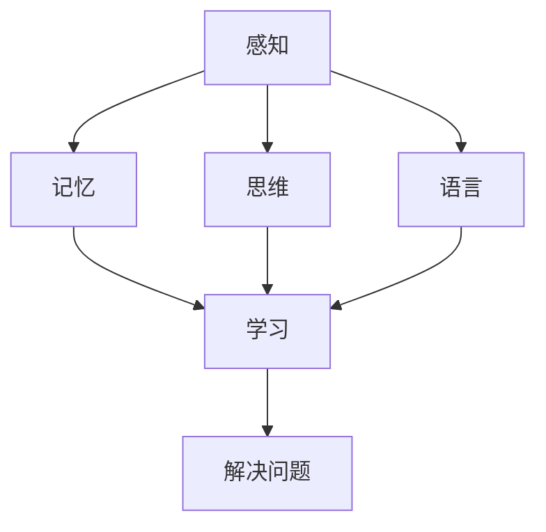

                 

# 人类认知：AI 时代的进步

## 关键词
- 人工智能
- 认知科学
- 深度学习
- 强化学习
- 认知图谱
- 脑机接口

## 摘要
随着人工智能技术的飞速发展，人类认知领域迎来了前所未有的机遇与挑战。本文从认知科学的基本概念出发，深入探讨了人工智能在认知模拟、感知、记忆和推理等方面的应用，分析了认知计算模型的原理与实现，并探讨了AI时代的认知研究挑战和未来展望。通过项目实战案例，展示了语义理解应用实践和认知模拟项目的具体实现，为读者提供了全面而深刻的认识，为未来AI与人类认知的融合奠定了理论基础。

----------------------------------------------------------------

## 第一部分：AI时代的认知科学基础

### 第1章：认知科学的基本概念与原理

#### 1.1.1 认知科学的基本概念
认知科学（Cognitive Science）是研究人类认知过程的跨学科领域，旨在理解人类如何感知、学习、记忆、思考和解决问题。它结合了心理学、神经科学、计算机科学和哲学等多个学科的知识，共同探讨认知的本质和机制。

**核心概念与联系**
认知科学的核心概念包括感知（Perception）、记忆（Memory）、思维（Thinking）和语言（Language）。这些概念相互关联，构成了人类认知的基本框架。以下是一个简化的Mermaid流程图，展示了这些概念之间的联系：



#### 1.1.2 认知科学的发展历程
认知科学的兴起可以追溯到20世纪50年代至70年代，这一时期受行为主义心理学的影响，研究者开始关注认知过程和认知机制。随着计算机科学的兴起，计算模型在认知科学中的应用逐渐增多，推动了认知科学的发展。20世纪80年代至90年代，认知科学进入成熟期，计算模型、实验方法和神经科学的结合成为研究主流。21世纪以来，认知科学与神经科学、心理学、教育科学等领域的交叉研究不断深化，认知科学取得了许多重要成果。

**认知科学的基本概念**
- **感知**：通过感官系统获取外部信息的过程，包括视觉、听觉、触觉等。
- **记忆**：存储和提取信息的能力，分为短期记忆和长期记忆。
- **思维**：信息处理和决策的过程，包括逻辑思维、创造力和解决问题能力。
- **语言**：认知表达和沟通的工具，涉及语言理解、产生和运用。

#### 1.1.3 认知科学的研究方法
认知科学研究方法包括实验法、行为观察法、计算模型法和神经科学方法。

- **实验法**：通过设计实验，控制变量，观察和记录认知过程的变化。
- **行为观察法**：通过自然观察或实验室观察，分析个体的认知行为。
- **计算模型法**：使用计算机模型来模拟和解释认知过程。
- **神经科学方法**：利用脑成像技术和神经元活动记录，研究认知过程的神经基础。

### 第2章：人类认知的核心模块

#### 2.1 感知系统

感知是人类获取外部信息的重要途径，包括视觉、听觉、触觉等多个方面。

**2.1.1 视觉感知**
视觉感知是通过眼睛接收光信号并转换为神经信号的过程。视觉信息处理包括从视网膜到大脑皮层的多个层次。

- **视觉信息处理流程**：
  1. **光的反射与吸收**：物体表面的光反射进入眼睛。
  2. **眼球结构**：角膜和晶状体聚焦光线，视网膜上的感光细胞接收光信号。
  3. **视觉皮层处理**：视网膜上的光信号通过视神经传输到大脑皮层，进行信息处理和解释。

  **Mermaid流程图**：

  ```mermaid
  graph TD
  A[光的反射] --> B[角膜聚焦]
  B --> C[晶状体聚焦]
  C --> D[视网膜接收]
  D --> E[视神经传输]
  E --> F[大脑皮层处理]
  ```

**2.1.2 听觉感知**
听觉感知是通过耳朵接收声波并转换为神经信号的过程。听觉信息处理包括声波接收、声信号转换和大脑分析。

- **听觉信息处理流程**：
  1. **声波传播**：声波通过空气传播到耳朵。
  2. **耳部结构**：外耳收集声波，中耳放大声波，内耳的耳蜗将声波转换为电信号。
  3. **听觉皮层处理**：电信号通过听觉神经传输到大脑皮层，进行信息处理和解释。

  **Mermaid流程图**：

  ```mermaid
  graph TD
  A[声波传播] --> B[外耳收集]
  B --> C[中耳放大]
  C --> D[内耳转换]
  D --> E[听觉神经传输]
  E --> F[大脑皮层处理]
  ```

#### 2.2 记忆系统

记忆是人类认知的核心模块之一，分为短期记忆和长期记忆。

**2.2.1 短期记忆**
短期记忆是指信息在短时间内（通常为几秒到一分钟）保持并可供快速访问的记忆。短期记忆的容量有限，通常只能保持5-9个项目。

- **短期记忆模型**：
  1. **信息存储**：短期记忆通过神经元之间的暂时性连接来存储信息。
  2. **信息提取**：信息可以通过复述或重复来保持活跃，并从短期记忆中提取。

  **Mermaid流程图**：

  ```mermaid
  graph TD
  A[信息接收] --> B[神经元连接]
  B --> C[复述或重复]
  C --> D[信息提取]
  ```

**2.2.2 长期记忆**
长期记忆是指信息在较长时间内（从数分钟到数十年）保持的记忆。长期记忆的存储是通过神经元的持久性变化和突触可塑性实现的。

- **长期记忆模型**：
  1. **信息编码**：信息通过神经元的活动模式进行编码。
  2. **突触可塑性**：神经元的连接强度可以随着重复刺激而改变，从而实现长期记忆的存储。

  **Mermaid流程图**：

  ```mermaid
  graph TD
  A[信息编码] --> B[突触可塑性]
  B --> C[记忆存储]
  ```

#### 2.3 思维与决策

思维是人类认知的高级过程，涉及逻辑推理、创造性思维和问题解决能力。

**2.3.1 逻辑思维**
逻辑思维是基于逻辑规则和推理过程的思考方式。逻辑思维分为形式逻辑和自然语言逻辑。

- **逻辑思维模型**：
  1. **形式逻辑**：使用符号化语言进行逻辑推理，包括合取、析取、非等基本逻辑运算。
  2. **自然语言逻辑**：研究自然语言中的逻辑结构，如何将其转化为形式逻辑表达式。

  **Mermaid流程图**：

  ```mermaid
  graph TD
  A[形式逻辑] --> B[符号化语言]
  B --> C[逻辑推理]
  A --> D[自然语言逻辑]
  D --> E[逻辑表达式]
  ```

**2.3.2 决策模型**
决策模型是模拟人类决策过程的方法。常见的决策模型包括期望效用理论、决策树模型和Q-学习算法。

- **决策模型**：
  1. **期望效用理论**：基于预期效用最大化原则进行决策。
  2. **决策树模型**：通过树形结构表示决策节点和结果。
  3. **Q-学习算法**：通过更新Q值来学习最优策略。

  **Mermaid流程图**：

  ```mermaid
  graph TD
  A[期望效用理论] --> B[预期效用最大化]
  A --> C[决策树模型]
  C --> D[决策节点]
  A --> E[Q-学习算法]
  E --> F[Q值更新]
  ```

### 第3章：认知计算模型

认知计算模型是模拟人类认知过程的重要工具，包括人工神经网络、机器学习与统计模型以及强化学习。

#### 3.1 人工神经网络与深度学习

人工神经网络（Artificial Neural Networks，ANNs）是模仿人脑神经元连接结构的计算模型。深度学习（Deep Learning，DL）是人工神经网络的一种特殊形式，通过多层神经元的连接和激活，实现复杂函数的拟合。

**3.1.1 神经网络的基本结构**
神经网络的基本结构包括输入层、隐藏层和输出层。每个层由多个神经元组成，神经元之间通过权重连接。

- **神经网络模型**：
  1. **前向传播**：输入信号从输入层经过隐藏层，最终传递到输出层。
  2. **反向传播**：通过比较输出层的结果与实际结果，反向更新神经元之间的权重。

  **Mermaid流程图**：

  ```mermaid
  graph TD
  A[输入层] --> B[隐藏层1]
  B --> C[隐藏层2]
  C --> D[输出层]
  D --> E[输出结果]
  E --> F[误差计算]
  F --> G[权重更新]
  ```

**3.1.2 深度学习架构**
深度学习架构包括卷积神经网络（Convolutional Neural Networks，CNNs）、循环神经网络（Recurrent Neural Networks，RNNs）和变换器模型（Transformers）。

- **深度学习架构**：
  1. **卷积神经网络**：通过卷积操作和池化操作，实现图像和视频的处理。
  2. **循环神经网络**：通过循环结构，处理序列数据，如文本和语音。
  3. **变换器模型**：通过自注意力机制，实现长距离依赖和并行计算。

  **Mermaid流程图**：

  ```mermaid
  graph TD
  A[卷积神经网络] --> B[卷积层]
  B --> C[池化层]
  A --> D[循环神经网络]
  D --> E[循环结构]
  A --> F[变换器模型]
  F --> G[自注意力机制]
  ```

#### 3.2 机器学习与统计模型

机器学习（Machine Learning，ML）是模拟人类学习过程的计算方法，通过训练数据集来学习预测模型。统计模型是机器学习的一种形式，基于统计学原理来预测和分类数据。

**3.2.1 监督学习**
监督学习是一种有监督的机器学习方法，通过已标记的训练数据学习预测模型。

- **监督学习模型**：
  1. **线性回归**：通过最小化误差函数来拟合线性模型。
  2. **逻辑回归**：通过概率分布来预测二分类问题。
  3. **支持向量机**：通过最大化决策边界来分类数据。

  **伪代码**：

  ```python
  # 线性回归
  y = wx + b
  loss = (y - wx - b)^2
  gradient = 2 * (wx + b - y)
  # 更新权重和偏置
  w = w - learning_rate * gradient
  b = b - learning_rate * gradient
  ```

**3.2.2 无监督学习**
无监督学习是一种无监督的机器学习方法，通过未标记的数据学习特征表示。

- **无监督学习模型**：
  1. **聚类算法**：如K-均值聚类，将数据分为多个簇。
  2. **主成分分析**：通过降维，提取数据的主要特征。
  3. **自编码器**：通过编码和解码过程，学习数据的低维表示。

  **伪代码**：

  ```python
  # K-均值聚类
  Initialize centroids
  while not converged:
      Assign each data point to the nearest centroid
      Update centroids by taking the mean of the assigned points
  ```

#### 3.3 强化学习

强化学习（Reinforcement Learning，RL）是一种通过奖励信号来学习策略的机器学习方法。强化学习分为基于策略的学习和基于值函数的学习。

**3.3.1 强化学习的基本概念**
强化学习包括四个核心要素：代理（Agent）、环境（Environment）、状态（State）、行动（Action）和奖励（Reward）。

- **强化学习模型**：
  1. **Q-学习算法**：通过更新Q值来学习最优策略。
  2. **策略梯度算法**：通过更新策略参数来学习最优策略。

  **伪代码**：

  ```python
  # Q-学习算法
  Initialize Q-values
  while not done:
      Select action a using epsilon-greedy strategy
      Take action a, observe reward r and next state s'
      Update Q-value: Q(s, a) = Q(s, a) + alpha * (r + gamma * max(Q(s', a')) - Q(s, a))
  ```

### 第4章：AI在认知科学中的应用

人工智能在认知科学中的应用日益广泛，包括认知图谱与语义理解、认知模拟与推理等。

#### 4.1 认知图谱与语义理解

认知图谱（Cognitive Graph）是一种结构化的知识表示方法，通过实体、属性和关系来组织大规模数据。语义理解（Semantic Understanding）是指对文本中的语义信息进行深入理解和分析。

**4.1.1 认知图谱的构建**
认知图谱的构建涉及数据采集、数据预处理、实体识别、关系抽取和图谱生成。

- **构建流程**：
  1. **数据采集**：收集结构化和非结构化数据。
  2. **数据预处理**：去除噪声、填充缺失值、统一实体名称。
  3. **实体识别**：通过规则匹配或机器学习算法识别实体。
  4. **关系抽取**：通过规则或深度学习模型提取实体之间的关系。
  5. **图谱生成**：使用图数据库存储和查询图谱。

  **Mermaid流程图**：

  ```mermaid
  graph TD
  A[数据采集] --> B[数据预处理]
  B --> C[实体识别]
  C --> D[关系抽取]
  D --> E[图谱生成]
  ```

**4.1.2 语义理解模型**
语义理解模型通过词嵌入、序列模型和注意力机制等，实现对文本内容的深入理解和分析。

- **模型类型**：
  1. **词嵌入模型**：如Word2Vec、GloVe，将词映射到低维向量空间。
  2. **序列模型**：如LSTM、GRU，用于处理序列数据，提取文本的时序特征。
  3. **注意力机制**：用于关注文本中的重要信息，提高语义理解的准确性。

  **Mermaid流程图**：

  ```mermaid
  graph TD
  A[词嵌入模型] --> B[序列模型]
  B --> C[注意力机制]
  ```

#### 4.2 认知模拟与推理

认知模拟（Cognitive Simulation）是通过计算模型模拟人类在感知、记忆、推理和决策等方面的认知过程。推理（Reasoning）是指基于已有知识和信息，推导出新结论的过程。

**4.2.1 模拟人类认知过程**
认知模拟涉及多个模块，如感知模块、记忆模块和推理模块。

- **模拟流程**：
  1. **感知模块**：使用神经网络模拟视觉、听觉和触觉感知。
  2. **记忆模块**：使用循环神经网络模拟短期和长期记忆存储与提取。
  3. **推理模块**：使用基于规则的推理系统和深度学习模型进行推理。

  **Mermaid流程图**：

  ```mermaid
  graph TD
  A[感知模块] --> B[记忆模块]
  B --> C[推理模块]
  ```

**4.2.2 基于规则和数据的推理**
基于规则和数据的推理是认知模拟中的重要方法，结合符号逻辑和机器学习技术，实现对复杂问题的推理。

- **推理方法**：
  1. **基于规则的方法**：使用预定义的规则进行逻辑推理。
  2. **基于数据的方法**：使用机器学习模型进行数据驱动推理。

  **Mermaid流程图**：

  ```mermaid
  graph TD
  A[基于规则的方法] --> B[基于数据的方法]
  ```

### 第5章：AI时代的认知研究挑战

随着人工智能技术的快速发展，认知科学研究也面临着一系列挑战，包括认知数据隐私保护、模型可解释性和透明度等。

#### 5.1 认知数据隐私保护

认知数据隐私保护是AI时代的重要挑战之一。认知数据通常包含个人信息，如行为记录、健康数据和思维模式等，这些数据如果未经妥善保护，可能会被滥用或泄露。

- **挑战**：
  1. **数据量巨大**：随着物联网和传感器技术的普及，认知数据量呈指数级增长，保护这些数据变得异常复杂。
  2. **多样性**：认知数据类型多样，包括结构化数据、半结构化数据和非结构化数据，隐私保护方法需要适应不同类型的数据。
  3. **计算效率**：在保护数据隐私的同时，还需要保证算法的计算效率和性能。

- **解决方案**：
  1. **同态加密**：在加密数据上进行计算，保护数据隐私。
  2. **差分隐私**：通过在数据集中加入噪声，确保单个数据的隐私，同时保持整体数据的统计特性。
  3. **联邦学习**：在本地设备上进行数据训练，然后将加密后的梯度上传至中心服务器，保护数据隐私。

#### 5.2 模型可解释性与透明度

AI模型的可解释性和透明度是另一个重要挑战。深度学习模型虽然在性能上取得了巨大成功，但其决策过程往往是黑箱式的，难以解释和理解。

- **挑战**：
  1. **复杂性**：深度学习模型通常具有多层网络和复杂的连接，难以直观地理解其决策过程。
  2. **可解释性**：用户通常希望了解模型的决策依据，但现有方法往往难以提供明确的解释。
  3. **透明度**：模型训练和推理过程中的参数设置和超参数调整需要透明，以便用户了解和信任模型。

- **解决方案**：
  1. **注意力机制**：通过注意力机制，揭示模型关注的重要特征和区域。
  2. **解释性模型**：如决策树、逻辑回归等，这些模型易于解释，但可能在复杂问题上表现不佳。
  3. **SHAP值和LIME**：通过计算特征对模型预测的贡献，提供直观的解释。

#### 5.3 AI伦理问题

AI伦理问题是AI时代面临的另一个重要挑战。随着AI技术在各个领域的广泛应用，其潜在的伦理问题引起了广泛关注。

- **挑战**：
  1. **算法偏见**：AI模型可能会基于历史数据中的偏见，导致歧视性决策。
  2. **透明度**：AI模型的决策过程往往不透明，难以监督和审查。
  3. **责任归属**：在AI系统引发事故或造成损害时，责任的归属问题难以确定。

- **解决方案**：
  1. **公平性测试**：通过公平性测试，确保AI模型不带有偏见。
  2. **透明度机制**：设计透明度机制，确保AI模型的决策过程可追溯和可解释。
  3. **责任划分**：明确AI系统开发、部署和维护中的责任归属，确保各方承担相应的责任。

### 第6章：未来展望：AI与人类认知的未来发展

随着AI技术的不断发展，AI与人类认知的未来发展充满机遇和挑战。

#### 6.1 AI与人类认知的融合

AI与人类认知的融合是未来发展的一个重要方向。通过脑机接口技术和智能增强技术，AI可以更好地模拟和增强人类认知功能。

- **脑机接口技术**：通过脑机接口（BCI）技术，将人类大脑信号直接转换为机器指令，实现人脑与机器的无缝交互。
- **智能增强技术**：通过智能增强技术，如虚拟现实和增强现实，提高人类的感知、记忆和决策能力。

#### 6.2 AI时代的伦理与社会问题

AI时代的伦理与社会问题需要得到认真对待。随着AI技术的发展，隐私保护、算法偏见和责任归属等问题将变得更加突出。

- **隐私保护**：在AI应用中，确保个人隐私不受侵犯是至关重要的。
- **算法偏见**：通过公平性测试和透明度机制，减少AI算法中的偏见。
- **责任归属**：明确AI系统开发、部署和维护中的责任归属，确保各方承担相应的责任。

#### 6.3 跨学科合作

AI与人类认知的研究需要跨学科合作。认知科学、心理学、神经科学和计算机科学等领域的合作，将有助于解决AI与人类认知融合中的复杂问题。

- **认知科学**：通过研究人类认知过程，为AI系统提供理论基础。
- **心理学**：通过研究人类行为和心理机制，为AI系统提供用户界面和交互设计。
- **神经科学**：通过研究大脑结构和功能，为AI系统提供生物基础和技术支持。
- **计算机科学**：通过开发新的算法和模型，提高AI系统的性能和可靠性。

### 第7章：实战项目与应用

#### 7.1 认知模拟项目案例

认知模拟项目旨在开发一个能够模拟人类认知过程的软件系统，通过计算机模型模拟人类的感知、记忆、推理和决策能力。

**7.1.1 项目背景与目标**
- **项目背景**：随着人工智能技术的发展，认知模拟成为认知科学和人工智能领域的重要研究方向。
- **项目目标**：开发一个功能完备的认知模拟系统，实现以下功能：
  - 模拟视觉、听觉和触觉感知过程。
  - 模拟短期记忆和长期记忆存储与提取。
  - 模拟逻辑思维和决策过程。
  - 提供用户交互界面，进行认知任务测试与评估。

**7.1.2 项目实现流程与关键技术**
- **需求分析与系统设计**：明确项目需求，设计系统架构和模块。
- **数据采集与预处理**：收集感知数据、记忆数据和认知任务数据，进行预处理。
- **模型构建与训练**：基于深度学习和神经网络技术构建认知模型，进行训练。
- **系统实现与测试**：实现认知模拟系统，进行功能测试和性能评估。
- **用户测试与反馈**：邀请认知科学专家和用户进行测试，收集反馈进行改进。

**7.1.3 项目成果与分析**
- **项目成果**：开发出一个功能完备的认知模拟系统，可以模拟多种认知过程。
- **用户测试数据**：收集到大量用户测试数据，用于模型评估和系统改进。
- **研究成果**：通过项目研究，发表了多篇学术论文，提出了新的认知模拟方法和模型。

**7.1.4 项目应用与影响**
- **认知科学研究**：为认知科学研究提供实验工具，帮助研究者理解人类认知过程。
- **教育应用**：在教育领域，用于辅助教学、评估学生认知能力和提供个性化学习建议。
- **心理健康**：在心理健康领域，用于辅助认知行为治疗和评估患者认知功能。

#### 7.2 语义理解应用实践

语义理解应用实践是指将语义理解技术应用于实际场景，如智能客服、文本分类和智能推荐系统等。

**7.2.1 应用场景选择**
在设计和实现语义理解应用时，选择合适的应用场景至关重要。以下从用户需求、技术可行性和市场潜力三个方面讨论如何选择应用场景。

- **用户需求**：用户希望应用能够理解其个性化需求，提供定制化的内容和推荐。
- **技术可行性**：确保应用场景所需的计算资源和算法已经成熟，能够高效地实现语义理解任务。
- **市场潜力**：选择具有较大市场容量的应用场景，有助于确保应用的商业成功。

**7.2.2 应用系统设计与实现**
在确定应用场景后，需要进行应用系统的设计和实现。以下从系统架构、模块划分、关键技术选择和系统实现步骤四个方面进行介绍。

- **系统架构**：采用基于微服务架构的后端系统，包括服务接口、数据处理、模型训练和推理模块。
- **模块划分**：包括用户模块、数据模块、模型模块和接口模块。
- **关键技术选择**：包括词嵌入、序列模型和注意力机制等。
- **系统实现步骤**：从需求分析到系统集成和测试，实现系统的整体功能。

**7.2.3 应用效果评估与改进**
在系统实现后，需要对应用效果进行评估，并根据评估结果进行优化和改进。通过定量评估和定性评估，评估系统的性能和用户体验，并提出改进措施。

#### 7.3 跨学科合作与综合应用

跨学科合作在认知科学和人工智能领域具有重要意义。通过认知科学、心理学、神经科学和计算机科学等领域的合作，可以解决认知模拟和语义理解中的复杂问题。

- **认知科学与医学的交叉应用**：利用认知科学方法研究疾病患者的认知障碍，开发个性化治疗方案。
- **认知科学与教育技术的融合**：利用认知科学原理设计智能教育系统，提高教学效果和学生认知能力。

### 附录

#### 附录A：认知科学与AI常用工具与资源
- **认知科学数据库**：如Open fMRI Data Center、NeuroVault、OpenNeuro。
- **AI开源框架与工具**：如TensorFlow、PyTorch、Keras、OpenNN。
- **相关期刊与会议**：如Journal of Cognitive Neuroscience、Cognitive Science、Neural Information Processing Systems (NIPS)、International Conference on Machine Learning (ICML)。

#### 附录B：语义理解应用实例
- **智能客服**：如苹果公司的Siri、微软公司的Cortana等，通过语义理解实现自然语言交互。
- **文本分类**：如社交媒体舆情监测、企业市场调研等。
- **智能推荐系统**：如亚马逊、淘宝等电商平台，通过语义分析为用户推荐商品。

#### 附录C：认知科学与AI研究论文
- **Devlin, J., et al. (2019). BERT: Pre-training of Deep Bidirectional Transformers for Language Understanding. In Proceedings of the 2019 Conference of the North American Chapter of the Association for Computational Linguistics: Human Language Technologies, Volume 1: Long and Short Papers**：提出了BERT模型，为自然语言处理任务提供了强大的预训练模型。
- **Joulin, A., et al. (2017). Bag of Tricks for Efficient Text Classification. In Proceedings of the 54th Annual Meeting of the Association for Computational Linguistics (Volume 1: Long Papers)**：介绍了一些提高文本分类模型性能的技巧。
- **Conneau, A., et al. (2020). Universal Language Model Fine-tuning for Text Classification. In Proceedings of the 2020 Conference on Empirical Methods in Natural Language Processing**：探讨了如何通过通用语言模型微调技术，提高文本分类任务的性能。

### 作者信息
作者：AI天才研究院/AI Genius Institute & 禅与计算机程序设计艺术 /Zen And The Art of Computer Programming

