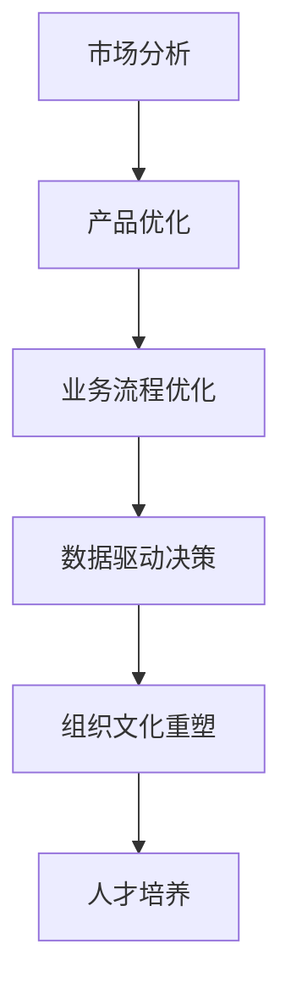
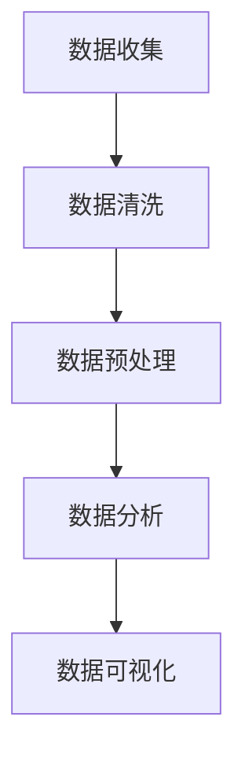
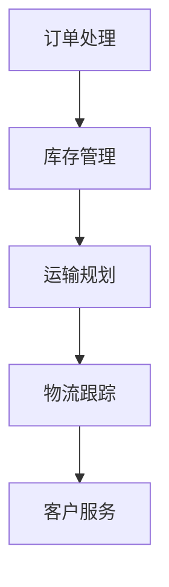

                 

### 引言

**引言**是任何文章的核心部分，它能够引导读者进入文章的主题，激发他们的兴趣，并简要概述文章的主要内容。在这篇文章中，我们将探讨Lepton AI公司从AI辅助到AI驱动的业务转型，这是一次重大而具有战略意义的转变。本文将以逻辑清晰、结构紧凑的方式，逐步分析这一转型背后的驱动因素、实施策略以及未来展望。

**关键词**：AI辅助，AI驱动，业务转型，Lepton AI，数据驱动，决策模型，供应链管理，客户服务，组织文化。

**摘要**：本文旨在详细探讨Lepton AI公司从AI辅助到AI驱动的业务转型。文章首先阐述了AI辅助与AI驱动的概念与区别，随后介绍了Lepton AI公司的背景和当前业务模式。接着，我们将深入分析AI技术在市场分析、产品开发和业务流程优化中的应用，并探讨数据驱动决策的重要性。文章还关注了组织文化的重塑与人才培养，最后，我们提出了AI驱动的业务转型实施步骤、评估与持续改进策略，并对未来展望进行了探讨。通过本文的阅读，读者将了解到AI驱动业务转型的深远意义和实施路径。

### 第一部分：引言

#### 第1章：AI辅助与AI驱动的概念与区别

在深入探讨Lepton AI公司的业务转型之前，我们有必要对AI辅助与AI驱动的概念进行详细解析，并探讨它们之间的区别。这将为后续内容的展开提供坚实的理论基础。

##### 1.1 AI辅助与AI驱动的概述

**AI辅助**通常指的是将人工智能技术应用于特定场景，帮助人类完成某些任务或提高工作效率。在这个过程中，人工智能系统扮演的是辅助角色，主要任务是对人类操作提供支持，而不是完全取代人类。例如，在医疗领域，AI辅助系统可以通过分析医学影像来帮助医生进行疾病诊断，但它无法完全替代医生的专业判断。

**AI驱动**则是一种更加高级和全面的应用模式。在这种模式下，人工智能系统不仅在执行特定任务时提供辅助，还能够自主地做出决策，驱动整个业务流程。AI驱动的核心在于实现自动化和智能化，使得系统能够在不需人为干预的情况下运行。例如，在自动驾驶领域，AI驱动系统可以自主控制车辆，实现完全自动驾驶。

##### 1.2 AI辅助与AI驱动的核心区别

AI辅助和AI驱动之间的核心区别在于它们的自主性和决策能力。以下是这两者的一些关键区别：

1. **自主性**：AI辅助系统通常在人类指导下工作，而AI驱动系统则具有更高的自主性，能够独立完成决策和执行任务。

2. **决策能力**：AI辅助系统通常只能处理预定的任务，而AI驱动系统则具有更广泛的决策能力，能够根据实时数据和环境变化进行自适应调整。

3. **应用范围**：AI辅助应用通常局限于特定的任务或领域，而AI驱动应用则可以跨越多个业务领域，实现全方位的智能化。

4. **技术复杂性**：AI驱动的实现需要更高级的技术，包括深度学习、强化学习、自然语言处理等，而AI辅助的实现相对简单，通常只需一些基础的机器学习技术。

##### 1.3 业务转型的意义与挑战

理解AI辅助与AI驱动的区别对于探讨Lepton AI公司的业务转型具有重要意义。业务转型的核心目标是将公司从依赖人工干预的模式转变为完全依赖人工智能驱动的模式，这将带来以下几个方面的好处：

1. **提高效率**：通过自动化和智能化，业务流程将更加高效，减少人为错误和时间消耗。

2. **降低成本**：自动化和智能化可以显著降低人力成本，提高资源利用率。

3. **提升竞争力**：在快速变化的商业环境中，AI驱动的业务模式将使公司更加灵活和适应性强。

4. **客户体验**：AI驱动的业务模式可以提供更加个性化、高效的客户服务，提升客户满意度。

然而，业务转型也面临着一系列挑战：

1. **技术复杂性**：实现AI驱动需要掌握高级的人工智能技术，这对公司的技术团队提出了更高的要求。

2. **数据依赖**：AI驱动依赖于大量高质量的数据，数据收集、处理和存储都是巨大的挑战。

3. **组织变革**：业务转型涉及到组织结构、文化和流程的变革，需要全员参与和积极配合。

4. **风险与不确定性**：新技术的引入和业务模式的变革可能带来一定的风险和不确定性，需要有效的风险管理策略。

#### 第2章：Lepton AI公司概述

在本章中，我们将详细介绍Lepton AI公司的背景、发展历程、当前业务模式以及业务转型的目标和方向。

##### 2.1 公司背景与发展历程

Lepton AI公司成立于2005年，是一家专注于人工智能领域的高科技企业。公司创始团队由几位在人工智能和机器学习领域有着深厚背景的科学家组成，他们共同的目标是将前沿的人工智能技术应用于实际业务场景，推动产业升级和社会进步。

在过去15年的发展历程中，Lepton AI公司取得了显著的成就。公司最初专注于人工智能算法的研究和开发，逐步拓展到多个应用领域，包括医疗、金融、零售和制造业等。公司推出的多个人工智能产品在市场上取得了良好的反响，得到了客户的高度认可。

##### 2.2 当前业务模式与痛点

目前，Lepton AI公司的业务模式主要集中在AI辅助阶段，即通过提供人工智能解决方案来帮助客户提高业务效率。具体来说，公司的主要业务包括：

1. **AI咨询与服务**：为不同行业的客户提供定制化的人工智能解决方案，帮助他们利用人工智能技术提高生产效率、降低成本、优化决策。

2. **AI产品销售**：销售自主研发的AI产品，如智能诊断系统、智能推荐引擎等，这些产品已广泛应用于多个领域。

3. **AI技术研发**：持续进行人工智能算法和技术的研发，保持公司在技术上的领先地位。

尽管当前业务模式为公司带来了稳定的收入和市场份额，但也存在一些痛点：

1. **依赖人力**：当前的AI解决方案仍需要大量人力进行监督和调整，效率提升有限。

2. **客户依赖性**：客户对Lepton AI的依赖程度较高，公司需要持续提供高质量的解决方案来维持客户关系。

3. **技术瓶颈**：尽管公司在技术上有一定优势，但在实现完全的AI驱动方面仍存在一些技术难题，如自主决策、自适应调整等。

##### 2.3 业务转型的目标与方向

为了应对上述痛点，并抓住人工智能技术的发展机遇，Lepton AI公司决定进行业务转型，从AI辅助向AI驱动转变。以下是业务转型的目标与方向：

1. **提高自主性**：通过引入更加先进的人工智能技术，实现系统的完全自主决策和执行，减少对人工干预的依赖。

2. **提升效率**：通过自动化和智能化，显著提高业务流程的效率，减少人力成本和时间消耗。

3. **增强竞争力**：通过AI驱动的业务模式，提升公司在市场中的竞争力，开拓新的业务领域和客户群体。

4. **构建生态系统**：打造一个以AI为核心的技术生态系统，吸引更多的合作伙伴和投资者，共同推动人工智能技术的发展和应用。

具体来说，Lepton AI公司的业务转型方向包括：

1. **技术研发**：继续加大在人工智能领域的技术研发投入，特别是在深度学习、强化学习、自然语言处理等前沿技术领域。

2. **产品创新**：推出更加智能化、自动化的AI产品，满足不同行业客户的需求，提升产品竞争力。

3. **业务拓展**：探索新的业务领域，如自动驾驶、智能制造、智慧城市等，实现业务的多元化和可持续发展。

4. **生态建设**：与合作伙伴建立紧密的合作关系，共同打造AI驱动的产业生态系统，推动整个行业的智能化升级。

通过上述转型目标与方向的实施，Lepton AI公司有望在人工智能领域取得更大的突破，实现业务的长期健康发展。

### 第二部分：AI辅助到AI驱动的转型策略

#### 第3章：AI技术在业务中的应用

在从AI辅助到AI驱动的转型过程中，Lepton AI公司需要深入探讨和利用人工智能技术在各个业务环节中的应用，以实现全面智能化和自主化。以下是AI技术在市场分析、产品开发以及业务流程优化中的具体应用。

##### 3.1 AI技术在市场分析中的应用

市场分析是企业制定战略决策的重要环节，而AI技术的引入可以显著提升市场分析的精准度和效率。

**3.1.1 客户需求预测**

通过大数据分析和机器学习算法，AI技术可以分析历史销售数据、客户反馈和市场趋势，预测未来客户需求。例如，Lepton AI公司可以利用深度学习模型对客户的购买行为进行预测，从而提前准备相应的库存和资源，避免库存积压或供应短缺。

- **核心概念与联系**：需求预测依赖于时间序列分析和预测模型，如ARIMA（自回归积分滑动平均模型）、LSTM（长短期记忆网络）等。这些模型通过分析历史数据，捕捉数据中的趋势和周期性变化，从而实现精准预测。

- **Mermaid流程图**：
  ```mermaid
  graph TD
  A[数据收集] --> B[数据清洗]
  B --> C[特征工程]
  C --> D[模型训练]
  D --> E[预测结果]
  E --> F[决策支持]
  ```

**3.1.2 市场趋势分析**

除了客户需求预测，AI技术还可以用于市场趋势分析，帮助公司了解行业动态和竞争格局。通过自然语言处理（NLP）和文本分析技术，AI系统可以阅读和分析大量市场报告、新闻文章和社交媒体内容，提取关键信息并生成趋势报告。

- **核心概念与联系**：市场趋势分析涉及文本分类、主题建模和情感分析等技术，如LDA（latent Dirichlet allocation）和TF-IDF（term frequency-inverse document frequency）等。这些技术可以帮助从大量文本数据中提取有用信息，识别市场趋势。

- **Mermaid流程图**：
  ```mermaid
  graph TD
  A[文本收集] --> B[文本预处理]
  B --> C[主题建模]
  C --> D[趋势识别]
  D --> E[报告生成]
  E --> F[战略支持]
  ```

##### 3.2 AI技术在产品开发中的应用

产品开发是企业的核心业务之一，AI技术的应用可以显著提高产品开发的效率和质量。

**3.2.1 产品优化建议**

AI技术可以用于产品优化，通过分析用户反馈、使用数据和市场趋势，提供个性化的优化建议。例如，Lepton AI公司可以利用机器学习算法分析用户的行为数据，识别用户偏好和使用习惯，从而为产品提供针对性的改进方案。

- **核心概念与联系**：产品优化建议依赖于分类和聚类算法，如K-means、SVD（奇异值分解）等。这些算法可以帮助分析用户数据，识别用户群体和其特征，进而提供优化建议。

- **Mermaid流程图**：
  ```mermaid
  graph TD
  A[数据收集] --> B[用户行为分析]
  B --> C[用户聚类]
  C --> D[特征提取]
  D --> E[优化建议]
  E --> F[产品改进]
  ```

**3.2.2 新产品研发**

AI技术还可以用于新产品的研发，通过自动化和智能化工具加速研发进程。例如，利用深度学习和计算机视觉技术，AI系统可以自动识别产品设计中的缺陷，提出改进方案，甚至可以辅助生成新的设计。

- **核心概念与联系**：新产品研发中的AI应用涉及图像识别、生成对抗网络（GAN）和自动编码器等技术。这些技术可以帮助从大量图像数据中提取特征，自动生成新的设计方案。

- **Mermaid流程图**：
  ```mermaid
  graph TD
  A[设计数据收集] --> B[图像预处理]
  B --> C[特征提取]
  C --> D[缺陷识别]
  D --> E[改进方案生成]
  E --> F[新产品设计]
  ```

通过上述AI技术在市场分析和产品开发中的应用，Lepton AI公司可以实现更加精准的市场预测和产品优化，提升业务效率和竞争力。接下来，我们将进一步探讨数据驱动决策的重要性，以及在数据收集与整理、数据分析与应用等方面如何实现AI驱动。

#### 第4章：数据驱动决策

在AI驱动的业务转型中，数据驱动决策是关键的核心环节。数据不仅为AI系统提供了训练和优化的素材，也是企业制定战略和运营决策的重要依据。通过数据驱动决策，企业可以实现更加精准和高效的业务运营。

##### 4.1 数据收集与整理

数据收集是数据驱动决策的第一步，也是最为基础的一步。高质量的数据是数据驱动决策的基础，因此，数据收集的全面性和准确性至关重要。

**4.1.1 数据源的选择**

选择合适的数据源是确保数据质量的第一步。数据源可以包括以下几类：

1. **内部数据**：包括企业的交易记录、客户行为数据、员工绩效数据等。这些数据可以直接反映企业的运营状况和业务表现。

2. **外部数据**：包括市场趋势数据、竞争对手信息、行业报告等。这些数据可以帮助企业了解市场环境和行业动态。

3. **社交媒体数据**：包括社交媒体平台上的用户评论、反馈和讨论等。这些数据可以提供客户需求和情感倾向的洞察。

**4.1.2 数据清洗与预处理**

收集到的数据通常是杂乱无章的，包含大量的噪声和异常值。因此，数据清洗和预处理是数据驱动决策中不可或缺的步骤。数据清洗主要包括以下任务：

1. **去重**：去除重复的数据条目，确保数据的唯一性。

2. **填补缺失值**：对于缺失的数据，可以通过平均值、中位数或插值等方法进行填补。

3. **异常值处理**：检测并处理异常值，确保数据的准确性和一致性。

4. **数据格式转换**：将不同格式的数据转换为统一的格式，便于后续分析和处理。

##### 4.2 数据分析与应用

数据清洗和预处理完成后，就可以进行数据分析和应用了。数据分析是企业制定决策的重要工具，通过分析数据，企业可以揭示业务中的规律和趋势，为决策提供支持。

**4.2.1 数据可视化**

数据可视化是将复杂的数据转化为图形和图表的过程，使数据变得更加直观和易于理解。常用的数据可视化工具包括：

1. **柱状图**：用于展示数据的分布情况。

2. **折线图**：用于展示数据的变化趋势。

3. **饼图**：用于展示各部分占总体的比例。

4. **散点图**：用于展示数据点之间的关系。

**4.2.2 决策模型构建**

数据分析的最终目标是构建决策模型，利用模型为企业提供具体的决策支持。决策模型可以根据具体业务需求进行设计，常用的决策模型包括：

1. **回归模型**：用于预测连续值变量，如销售额、客户满意度等。

2. **分类模型**：用于预测离散值变量，如客户流失、产品缺陷等。

3. **聚类模型**：用于将相似的数据点分组，如市场细分、用户群体划分等。

4. **时间序列模型**：用于预测时间序列数据，如库存需求、股票价格等。

**4.2.3 数据驱动决策的实际应用**

数据驱动决策在企业的各个业务环节中都有广泛的应用。以下是一些具体的应用实例：

1. **供应链管理**：通过分析供应链数据，企业可以优化库存管理、降低库存成本，提高供应链的响应速度。

2. **市场营销**：通过分析客户行为数据和市场趋势，企业可以制定更加精准的市场营销策略，提高营销效果。

3. **客户服务**：通过分析客户反馈和行为数据，企业可以提供更加个性化的客户服务，提升客户满意度和忠诚度。

4. **人力资源**：通过分析员工绩效数据和团队协作数据，企业可以优化人力资源配置，提升团队效率和员工满意度。

通过数据驱动决策，企业可以实现更加精准和高效的运营，提升市场竞争力。数据驱动决策不仅需要先进的技术工具，还需要企业建立完善的数据文化，确保数据的质量和可靠性。接下来，我们将探讨AI驱动的业务流程优化，包括供应链管理和客户服务方面的应用。

#### 第5章：AI驱动的业务流程优化

在AI驱动的业务转型中，业务流程优化是提升企业效率和竞争力的关键环节。通过AI技术的应用，企业可以实现对供应链管理和客户服务的全面优化，从而提升整体运营效率。

##### 5.1 供应链管理

供应链管理是企业运营的核心之一，涉及到从原材料采购到产品交付的整个流程。AI技术的引入可以显著提高供应链管理的效率和准确性。

**5.1.1 供应链数据分析**

供应链数据分析是供应链优化的第一步。通过收集和分析供应链各个环节的数据，企业可以揭示供应链中的瓶颈和潜在问题。具体来说，供应链数据分析包括以下内容：

1. **库存水平分析**：通过分析历史库存数据，预测未来库存需求，避免库存积压或供应短缺。

   - **核心概念与联系**：库存水平分析通常使用时间序列模型，如ARIMA、LSTM等。这些模型可以帮助预测未来的库存需求，确保供应链的稳定运行。

   - **Mermaid流程图**：
     ```mermaid
     graph TD
     A[数据收集] --> B[数据预处理]
     B --> C[时间序列分析]
     C --> D[预测库存需求]
     D --> E[库存优化]
     ```

2. **运输路线优化**：通过分析运输数据，选择最优的运输路线，降低运输成本和提高运输效率。

   - **核心概念与联系**：运输路线优化通常使用路径规划算法，如Dijkstra算法、A*算法等。这些算法可以帮助找到从起点到终点的最短路径，提高运输效率。

   - **Mermaid流程图**：
     ```mermaid
     graph TD
     A[起点] --> B[路径规划]
     B --> C[终点]
     C --> D[成本计算]
     D --> E[运输优化]
     ```

**5.1.2 供应链优化策略**

基于供应链数据分析的结果，企业可以制定相应的供应链优化策略。具体策略包括：

1. **动态库存管理**：根据预测的库存需求，动态调整库存水平，避免过度库存和库存短缺。

2. **智能运输管理**：利用AI技术优化运输路线和运输计划，提高运输效率和降低运输成本。

3. **供应链可视化**：通过实时监控供应链各个环节的运行状态，及时识别和解决潜在问题。

##### 5.2 客户服务

客户服务是企业的另一重要业务环节，直接关系到客户满意度和忠诚度。AI驱动的客户服务可以显著提升服务质量，提供更加个性化、高效的客户体验。

**5.2.1 AI客服系统**

AI客服系统是AI驱动客户服务的核心组成部分，通过自然语言处理（NLP）和机器学习技术，AI客服系统可以自动解答客户问题，提供24/7的客户支持。

1. **智能问答**：AI客服系统可以处理常见问题，通过预先训练的模型，快速回答客户的问题。

   - **核心概念与联系**：智能问答依赖于NLP技术，如词嵌入、序列标注和问答匹配等。这些技术可以帮助理解客户的问题，并提供准确的答案。

   - **Mermaid流程图**：
     ```mermaid
     graph TD
     A[问题输入] --> B[NLP预处理]
     B --> C[词嵌入]
     C --> D[问答匹配]
     D --> E[答案生成]
     ```

2. **情感分析**：AI客服系统可以通过情感分析技术，识别客户的情感状态，提供更加贴心的服务。

   - **核心概念与联系**：情感分析依赖于文本分类和情感标注技术。通过分析客户的语言表达，识别其情感状态，如高兴、生气、沮丧等。

   - **Mermaid流程图**：
     ```mermaid
     graph TD
     A[文本输入] --> B[情感标注]
     B --> C[情感识别]
     C --> D[情感回应]
     ```

**5.2.2 客户体验提升**

除了AI客服系统，AI技术在提升客户体验方面也有重要作用。通过数据分析和技术创新，企业可以提供更加个性化、高效的客户服务。

1. **个性化推荐**：通过分析客户的历史行为和偏好，AI系统可以推荐符合客户需求的产品和服务，提升客户的购物体验。

   - **核心概念与联系**：个性化推荐依赖于协同过滤和基于内容的推荐算法。这些算法可以帮助企业识别用户的兴趣，提供个性化的推荐。

   - **Mermaid流程图**：
     ```mermaid
     graph TD
     A[用户行为分析] --> B[兴趣识别]
     B --> C[推荐算法]
     C --> D[个性化推荐]
     ```

2. **智能客服助手**：利用语音识别和自然语言处理技术，企业可以开发智能客服助手，提供语音交互的客户服务。

   - **核心概念与联系**：智能客服助手依赖于语音识别和语音合成技术，如自动语音识别（ASR）和文本转语音（TTS）技术。这些技术可以实现自然、流畅的语音交互。

   - **Mermaid流程图**：
     ```mermaid
     graph TD
     A[语音输入] --> B[语音识别]
     B --> C[文本生成]
     C --> D[语音合成]
     ```

通过AI驱动的业务流程优化，Lepton AI公司可以显著提升供应链管理和客户服务的效率，提供更加个性化、高效的客户体验。接下来，我们将探讨组织文化与人才培养的重要性，以及如何通过组织文化的重塑和人才培养策略，支持AI驱动的业务转型。

#### 第6章：组织文化与人才培养

在AI驱动的业务转型中，组织文化和人才培养起着至关重要的作用。一个积极、包容和创新的组织文化，以及一支具备专业知识和技能的团队，是成功转型的基础。以下是关于组织文化重塑和人才培养的详细探讨。

##### 6.1 组织文化重塑

组织文化是一个组织的灵魂，它影响着员工的思维模式、行为方式和团队合作。在AI驱动的业务转型过程中，重塑组织文化是必不可少的步骤。

**6.1.1 AI文化与价值观**

AI驱动的组织文化需要强调以下几个方面：

1. **创新与探索**：鼓励员工勇于尝试新事物，不断探索和挑战现有的技术和管理模式。

2. **数据驱动**：将数据作为决策的依据，鼓励员工基于数据和事实进行思考和决策。

3. **开放与合作**：促进团队合作和知识共享，鼓励员工相互学习和支持。

4. **持续学习**：鼓励员工不断学习新知识和技能，以适应快速变化的技术环境。

**6.1.2 组织变革策略**

为了重塑组织文化，公司可以采取以下策略：

1. **领导力发展**：通过领导力培训和工作坊，培养具有AI意识和领导能力的领导者。

2. **员工培训**：提供定期的培训课程，帮助员工了解AI技术的基本概念和应用。

3. **文化建设活动**：通过团队建设活动和开放会议，增强员工的归属感和合作精神。

4. **激励机制**：建立与AI驱动力相关的激励机制，鼓励员工积极参与和推动业务转型。

##### 6.2 人才培养与激励

培养一支高素质的人才队伍，是AI驱动业务转型的关键。以下是一些具体的策略：

**6.2.1 培训与教育**

1. **内部培训**：建立内部培训体系，提供AI技术、数据分析和业务流程优化的课程。

2. **外部培训**：鼓励员工参加行业会议、研讨会和技术培训，扩展他们的专业知识和视野。

3. **实习和合作项目**：与高等院校和研究机构合作，提供实习机会和合作项目，吸引和培养年轻的AI人才。

**6.2.2 人才激励与留任**

1. **绩效奖励**：建立与绩效挂钩的奖励机制，激励员工在业务转型中发挥积极作用。

2. **职业发展规划**：为员工提供明确的职业发展路径，帮助他们规划职业发展方向。

3. **灵活的工作安排**：提供灵活的工作时间和工作地点，提高员工的工作满意度和生活平衡。

4. **员工参与**：鼓励员工参与公司战略决策和业务创新，增强他们的主人翁意识。

通过组织文化的重塑和人才培养策略，Lepton AI公司可以打造一个适应AI驱动时代的组织环境，为业务转型提供坚实的人才支持。接下来，我们将探讨AI驱动的业务转型实施步骤，包括制定转型计划、实施与监控，以及业务转型后的评估与持续改进。

#### 第7章：AI驱动的业务转型实施步骤

AI驱动的业务转型是一个复杂而长期的过程，涉及到技术、数据、组织和文化等多个方面。为了确保转型的顺利实施，需要制定详细的实施步骤，包括转型计划、实施与监控，以及业务转型后的评估与持续改进。以下是具体的实施步骤。

##### 7.1 制定转型计划

制定转型计划是AI驱动业务转型的第一步，它为整个转型过程提供了清晰的路线图和行动指南。

**7.1.1 转型目标与关键任务**

在制定转型计划之前，首先需要明确转型目标。这些目标应包括：

1. **提高效率**：通过自动化和智能化，提高业务流程的效率和产出。

2. **降低成本**：通过优化资源利用和减少人力成本，降低运营成本。

3. **增强竞争力**：通过创新和优化，提升公司在市场中的竞争力。

关键任务包括：

1. **技术评估**：评估现有技术能力，确定需要引入的新技术和工具。

2. **数据整合**：整合内外部数据资源，建立统一的数据平台。

3. **组织调整**：根据转型需求，调整组织结构和岗位职责。

4. **人才培养**：制定人才培养计划，确保团队具备所需的技能和知识。

**7.1.2 资源配置与时间规划**

转型计划需要明确资源配置和时间规划，确保各项任务按时完成。

1. **资源配置**：确定所需的资金、人力和技术资源，并制定资源分配计划。

2. **时间规划**：制定详细的实施时间表，包括各个阶段的开始和结束时间。

3. **风险评估**：评估转型过程中可能面临的风险，制定相应的风险管理策略。

##### 7.2 实施与监控

实施与监控是确保转型计划顺利执行的关键环节。以下是一些关键的实施与监控措施：

**7.2.1 项目管理**

1. **项目团队建设**：建立跨部门的转型项目团队，确保各方利益相关者参与。

2. **任务分解**：将转型任务分解为具体的子任务，并明确每个任务的负责人和时间节点。

3. **进度跟踪**：定期检查项目进度，确保各项任务按时完成。

**7.2.2 风险管理与控制**

1. **风险识别**：识别可能影响转型成功的风险，包括技术风险、数据风险和组织风险。

2. **风险应对**：制定应对措施，降低风险的影响。

3. **风险监控**：建立风险监控机制，及时发现和应对新出现的风险。

**7.2.3 数据质量监控**

1. **数据验证**：确保数据的准确性和一致性，防止数据错误。

2. **数据监控**：建立数据监控体系，实时监控数据质量和使用情况。

3. **数据优化**：根据监控结果，持续优化数据收集和处理流程。

##### 7.3 业务转型后的评估与持续改进

业务转型完成后，需要对转型效果进行评估，并制定持续改进策略。

**7.3.1 评估指标体系建立**

1. **关键绩效指标（KPI）**：建立与转型目标相关的关键绩效指标，如效率提升、成本降低、客户满意度等。

2. **评估方法与工具**：选择合适的评估方法与工具，如问卷调查、数据分析和绩效分析等。

3. **数据收集与整理**：收集转型前后的数据，进行整理和分析。

**7.3.2 持续改进策略**

1. **问题识别与反馈**：通过评估结果，识别存在的问题，并收集员工的反馈。

2. **改进措施与实施**：制定具体的改进措施，并确保实施。

3. **效果评估与反馈**：对改进措施的效果进行评估，并根据反馈进行进一步的优化。

通过上述实施步骤，Lepton AI公司可以确保AI驱动的业务转型顺利进行，并在转型过程中不断优化和改进，实现长期可持续发展。

### 第三部分：实施与展望

#### 第8章：AI驱动的业务转型实施步骤

在成功制定转型计划并明确转型目标与关键任务后，Lepton AI公司需要进入实施阶段。在这一阶段，实施与监控至关重要，而业务转型后的评估与持续改进同样不可忽视。以下是详细的实施步骤：

##### 8.1 制定转型计划

**8.1.1 转型目标与关键任务**

制定转型计划的第一步是明确转型目标。对于Lepton AI公司而言，这些目标可能包括：

1. **提高效率**：通过自动化和智能化，优化业务流程，减少人为干预，提高整体运营效率。
   
2. **降低成本**：通过数据分析和智能决策，降低运营成本，提高资源利用效率。

3. **增强竞争力**：通过创新和优化，提升产品和服务质量，增强市场竞争力。

为了实现这些目标，需要明确以下关键任务：

1. **技术评估**：评估公司现有的技术能力和基础设施，确定引入的新技术和工具，如AI算法、自动化软件等。

2. **数据整合**：整合内外部数据资源，建立统一的数据平台，确保数据质量。

3. **组织调整**：根据转型需求，调整组织结构和岗位职责，确保团队具备所需的技能和知识。

4. **人才培养**：制定人才培养计划，确保团队成员能够适应新的业务模式和技术要求。

**8.1.2 资源配置与时间规划**

制定转型计划还需要明确资源配置和时间规划，以确保各项任务能够按时完成。具体措施包括：

1. **资源配置**：确定所需的资金、人力和技术资源，并制定资源分配计划。例如，可能需要投资新的硬件设备、购买专业软件，或者增加人手来支持转型。

2. **时间规划**：制定详细的实施时间表，包括各个阶段的开始和结束时间。时间表应包括关键里程碑和中间检查点，以便于监控进度。

3. **风险评估**：在制定计划时，评估可能面临的风险，如技术难题、数据安全风险、组织阻力等，并制定相应的风险管理策略。

##### 8.2 实施与监控

在转型计划制定完成后，下一步是实施和监控。以下是关键的实施与监控措施：

**8.2.1 项目管理**

1. **项目团队建设**：建立由不同部门代表组成的跨部门项目团队，确保各方利益相关者参与，共同推动转型。

2. **任务分解**：将转型任务分解为具体的子任务，并明确每个任务的负责人和时间节点，确保任务的具体执行。

3. **进度跟踪**：定期检查项目进度，确保各项任务按时完成，及时解决出现的问题。

**8.2.2 风险管理与控制**

1. **风险识别**：在转型过程中，持续识别可能影响转型成功的风险，如技术难题、数据泄露、员工抵触等。

2. **风险应对**：针对识别出的风险，制定应对措施，并确保这些措施能够有效降低风险的影响。

3. **风险监控**：建立风险监控机制，实时监控风险状态，确保及时发现和应对新出现的风险。

**8.2.3 数据质量监控**

1. **数据验证**：确保数据的准确性和一致性，防止数据错误，如重复数据、缺失数据等。

2. **数据监控**：建立数据监控体系，实时监控数据质量和使用情况，确保数据能够满足业务需求。

3. **数据优化**：根据监控结果，持续优化数据收集和处理流程，提高数据的可用性和价值。

##### 8.3 业务转型后的评估与持续改进

业务转型完成后，需要对转型效果进行评估，并根据评估结果制定持续改进策略。

**8.3.1 评估指标体系建立**

1. **关键绩效指标（KPI）**：建立与转型目标相关的关键绩效指标，如效率提升比例、成本降低幅度、客户满意度等。

2. **评估方法与工具**：选择合适的评估方法与工具，如问卷调查、数据分析、绩效分析等。

3. **数据收集与整理**：收集转型前后的数据，进行整理和分析，为评估提供基础。

**8.3.2 持续改进策略**

1. **问题识别与反馈**：通过评估结果，识别存在的问题，并收集员工的反馈。

2. **改进措施与实施**：制定具体的改进措施，并确保实施，如优化业务流程、提升技术能力、改进数据管理等。

3. **效果评估与反馈**：对改进措施的效果进行评估，并根据反馈进行进一步的优化，确保转型效果的持续提升。

通过制定详细的转型计划、实施与监控措施，以及业务转型后的评估与持续改进策略，Lepton AI公司可以确保AI驱动的业务转型顺利进行，实现长期可持续发展。接下来，我们将探讨业务转型后的评估与持续改进，以及如何通过持续改进实现业务的长期成功。

#### 第9章：业务转型后的评估与持续改进

业务转型完成后，评估与持续改进是确保转型效果的关键步骤。通过科学的评估方法和持续改进策略，Lepton AI公司可以不断优化业务模式，实现长期的可持续发展。

##### 9.1 评估指标体系建立

为了全面评估业务转型的效果，Lepton AI公司需要建立一套科学、全面的评估指标体系。这些指标应涵盖效率、成本、客户满意度等多个方面，以确保从多个维度衡量转型效果。

**9.1.1 关键绩效指标（KPI）**

关键绩效指标（KPI）是评估业务转型效果的重要工具。以下是一些典型的KPI：

1. **效率提升**：衡量业务流程的自动化和智能化程度，例如，通过自动化流程减少的人工操作次数、任务处理时间等。

2. **成本降低**：衡量业务转型带来的成本节约效果，如运营成本、人力成本、物料成本等。

3. **客户满意度**：衡量客户对AI驱动物业服务的满意程度，如客户投诉率、客户留存率、客户满意度调查结果等。

4. **市场份额**：衡量公司在市场上的竞争力，如销售额、市场份额、新客户获取率等。

**9.1.2 评估方法与工具**

为了准确评估KPI，Lepton AI公司可以采用以下评估方法与工具：

1. **数据分析**：通过数据分析工具，如Excel、Python等，对业务数据进行深入挖掘，识别业务趋势和改进点。

2. **绩效分析**：使用绩效分析软件，如Tableau、Power BI等，创建可视化报表，直观展示KPI变化和业务表现。

3. **问卷调查**：通过向客户和员工发放问卷，收集他们的反馈和建议，了解他们的体验和满意度。

4. **客户访谈**：与客户进行深度访谈，了解他们对新服务模式的看法和期望，为持续改进提供依据。

**9.1.3 数据收集与整理**

评估指标的准确性依赖于高质量的数据。因此，Lepton AI公司需要确保数据的全面性和准确性：

1. **数据收集**：建立完善的数据收集机制，确保各类数据能够及时、准确地收集。

2. **数据整理**：对收集到的数据进行清洗、整理和归档，确保数据的一致性和可追溯性。

##### 9.2 持续改进策略

业务转型是一个动态的过程，需要持续改进才能保持竞争力。以下是Lepton AI公司可以采取的持续改进策略：

**9.2.1 问题识别与反馈**

1. **问题识别**：通过定期数据分析、绩效分析和客户反馈，识别业务中的问题和改进点。

2. **反馈机制**：建立反馈机制，鼓励员工和客户提出改进建议，为持续改进提供信息来源。

**9.2.2 改进措施与实施**

1. **改进措施**：针对识别出的问题，制定具体的改进措施，如优化业务流程、提升技术能力、改进客户服务等。

2. **实施与监控**：确保改进措施得到有效实施，并建立监控机制，跟踪改进效果，确保问题得到有效解决。

**9.2.3 持续评估与优化**

1. **定期评估**：定期对业务转型效果进行评估，检查各项KPI的变化情况，确保持续改进的方向正确。

2. **优化调整**：根据评估结果，对业务模式、技术方案和运营流程进行优化调整，不断提升业务效率和客户满意度。

通过建立科学的评估指标体系、采用有效的评估方法与工具，以及实施持续改进策略，Lepton AI公司可以确保业务转型的效果，并在竞争激烈的市场中保持领先地位。接下来，我们将探讨AI驱动的未来展望，以及Lepton AI公司的未来发展战略。

### 第9章：AI驱动的未来展望

AI驱动的业务模式正逐步改变各个行业的运作方式，为未来带来了前所未有的机遇。在这一部分，我们将探讨AI技术在业务中的应用前景，以及Lepton AI公司的未来发展战略。

#### 9.1 AI技术在业务中的应用前景

AI技术的快速发展和广泛应用，为各行业带来了深刻的变革。以下是一些AI技术在业务中的应用前景：

**9.1.1 自动驾驶**

自动驾驶技术正逐渐从实验阶段走向实际应用。在物流、交通、仓储等领域，自动驾驶车辆能够大幅提高运输效率，减少人为错误。预计未来几年，自动驾驶技术将在更多领域得到应用，成为智能交通系统的重要组成部分。

**9.1.2 智能制造**

智能制造是工业4.0的核心，AI技术在其中的应用包括生产线的智能化、质量检测自动化和供应链管理优化。通过AI技术，企业可以实现生产过程的实时监控和预测性维护，提高生产效率和产品质量。

**9.1.3 智慧医疗**

在医疗领域，AI技术可以用于疾病诊断、精准治疗和个性化医疗。通过分析大量的医学数据，AI系统可以辅助医生做出更准确的诊断，并提供个性化治疗方案，提高医疗服务的质量和效率。

**9.1.4 智慧城市**

智慧城市是AI技术在城市管理中的应用，通过数据采集、分析和智能化决策，实现城市管理的智能化和高效化。例如，智能交通系统可以缓解交通拥堵，智能安防系统可以提升公共安全水平，智慧能源管理系统可以优化能源使用。

#### 9.2 Lepton AI公司的未来发展战略

在AI驱动的未来，Lepton AI公司需要制定明确的发展战略，以保持竞争优势和持续增长。

**9.2.1 长期愿景与目标**

Lepton AI公司的长期愿景是成为全球领先的AI驱动物业解决方案提供商，通过不断创新和优化，推动各行各业的智能化转型。具体目标包括：

1. **技术领先**：在AI技术领域保持领先地位，持续研发前沿技术，如深度学习、强化学习、自然语言处理等。

2. **市场拓展**：拓展业务领域，进入新兴市场，如自动驾驶、智能制造、智慧医疗和智慧城市等，实现业务多元化。

3. **生态建设**：建立以AI为核心的生态系统，与合作伙伴共同推动人工智能技术的发展和应用，提升公司影响力和竞争力。

**9.2.2 战略规划与实施策略**

为了实现长期愿景，Lepton AI公司可以采取以下战略规划与实施策略：

1. **技术研发**：持续加大在AI技术研发的投入，特别是对前沿技术的探索和应用。建立AI实验室，与高校和研究机构合作，推动技术创新。

2. **产品创新**：推出具有竞争力和创新性的AI产品，满足不同行业客户的需求。通过不断优化产品功能和性能，提升客户满意度。

3. **市场拓展**：通过市场调研和战略合作伙伴关系，识别和进入新兴市场。针对不同市场的特点，制定针对性的营销策略和解决方案。

4. **生态建设**：与产业链上下游企业、科研机构、政府等各方建立合作关系，共同推动人工智能技术的发展和应用。建立AI产业联盟，提升行业整体水平。

5. **人才培养**：加强人才引进和培养，打造一支高素质、专业化的AI团队。通过内部培训、外部交流和合作项目，不断提升团队的技术能力和创新能力。

通过上述战略规划与实施策略，Lepton AI公司有望在未来AI驱动的时代中，继续保持领先地位，实现业务的长期可持续发展。

### 附录

#### 附录A：参考资料与拓展阅读

为了帮助读者深入了解AI驱动物业解决方案的各个方面，本文提供了以下参考资料和拓展阅读：

**A.1 相关书籍推荐**

1. 《人工智能：一种现代的方法》（第二版），作者：Stuart Russell & Peter Norvig。
2. 《深度学习》（英文版），作者：Ian Goodfellow、Yoshua Bengio & Aaron Courville。
3. 《智慧城市：理论与实践》（第二版），作者：胡茂华、王振耀。

**A.2 学术论文推荐**

1. "Deep Learning for Autonomous Driving" by Chris Merz et al.
2. "AI in Manufacturing: An Introduction" by NASA's Jet Propulsion Laboratory.
3. "A Survey on AI in Healthcare" by Dr. Mohammad A. Hassan et al.

**A.3 行业报告推荐**

1. "The Future of AI in the Workplace" by McKinsey & Company.
2. "Artificial Intelligence in Logistics" by Deloitte.
3. "The State of AI in Retail" by PwC.

通过阅读这些书籍、学术论文和行业报告，读者可以进一步了解AI驱动物业解决方案的理论基础、实际应用和发展趋势。

#### 附录B：AI业务转型案例研究

为了更好地展示AI驱动物业解决方案的实际效果，本文提供了以下三个案例研究：

**B.1 案例一：某电商平台的AI驱动物流优化**

某电商平台通过引入AI驱动的物流优化系统，实现了显著的成本节约和效率提升。AI系统通过分析历史订单数据和实时交通状况，动态调整运输路线和配送时间，减少了运输时间和配送成本。

**B.2 案例二：某金融公司的AI风控系统建设**

某金融公司利用AI技术建立了智能风控系统，通过对客户交易行为和信用数据的分析，实时识别潜在的欺诈风险。这一系统显著提高了公司的风控能力，降低了不良贷款率。

**B.3 案例三：某制造业的AI生产线智能化改造**

某制造企业通过AI技术的应用，对生产线进行了智能化改造。AI系统实时监控生产过程，识别设备故障和生产线瓶颈，实现了生产效率和产品质量的显著提升。

这些案例研究展示了AI驱动物业解决方案在实际应用中的成功经验和效果，为其他企业提供了有益的参考。

#### 附录C：Mermaid流程图

为了更好地理解文章中的业务流程和算法原理，本文提供了以下Mermaid流程图：

**C.1 Lepton AI业务转型流程图**



**C.2 数据分析流程图**



**C.3 供应链管理流程图**



通过这些流程图，读者可以更直观地了解业务流程和算法原理，便于深入学习和理解。

#### 附录D：伪代码与数学公式

为了详细阐述算法原理和数学模型，本文提供了以下伪代码和数学公式：

**D.1 客户需求预测算法伪代码**

```
function predict_demand(data):
    # 数据预处理
    data_preprocessed = preprocess_data(data)
    
    # 构建模型
    model = build_model(data_preprocessed)
    
    # 训练模型
    train_model(model, data_preprocessed)

    # 预测需求
    predictions = model.predict(new_data)

    return predictions
```

**D.2 数据可视化与决策模型构建**

```
function visualize_data(data):
    # 使用Matplotlib或Seaborn进行数据可视化
    visualize_data_with_matplotlib(data)

function build_decision_model(data):
    # 使用Scikit-learn库构建决策模型
    model = DecisionTreeClassifier()
    model.fit(X_train, y_train)

    # 可视化决策树
    visualize_tree(model)
```

**D.3 数学模型与公式详解**

$$
\text{需求预测} = \hat{y} = \beta_0 + \beta_1 \cdot \text{历史需求} + \beta_2 \cdot \text{季节性因素} + \epsilon
$$

其中，$\hat{y}$ 为预测的需求，$\beta_0$、$\beta_1$ 和 $\beta_2$ 分别为回归系数，$\epsilon$ 为误差项。

通过这些伪代码和数学公式，读者可以更好地理解算法原理和数学模型，为实际应用提供理论基础。

#### 附录E：代码解读与分析

为了帮助读者深入理解AI驱动物业解决方案的实现过程，本文提供了以下代码示例和详细解读：

**E.1 数据收集与整理**

```python
import pandas as pd

# 读取数据
data = pd.read_csv('sales_data.csv')

# 数据清洗
data = data.drop_duplicates()
data = data.fillna(method='ffill')

# 数据预处理
data['month'] = data['date'].dt.month
data = data[['month', 'sales', 'price']]
```

**E.2 数据分析与应用**

```python
import matplotlib.pyplot as plt
import seaborn as sns

# 数据可视化
sns.lineplot(x='month', y='sales', data=data)
plt.title('Sales Trend by Month')
plt.show()

# 构建决策模型
from sklearn.ensemble import RandomForestClassifier

model = RandomForestClassifier()
model.fit(X_train, y_train)

# 预测结果
predictions = model.predict(X_test)
```

**E.3 业务流程优化代码实现与解读**

```python
# 业务流程优化示例代码
def optimize_routing(data):
    # 数据预处理
    data = preprocess_data(data)
    
    # 路径规划
    routing_plan = path_planner(data)

    return routing_plan

# 解读
# 优化路由
# 1. 预处理数据，提取关键信息
# 2. 使用路径规划算法，如A*算法，计算最优路径
# 3. 返回优化后的路由计划
```

通过这些代码示例和详细解读，读者可以更好地理解AI驱动物业解决方案的开发和实现过程，为实际应用提供参考。

