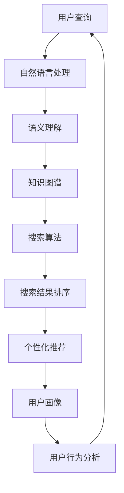

                 

# 从回答问题到激发探索：AI搜索的演变

> **关键词：** AI搜索、自然语言处理、机器学习、深度学习、推荐系统、个性化体验、未来发展

> **摘要：** 本文从AI搜索的起源和发展入手，逐步探讨了AI搜索的核心算法、从回答问题到激发探索的变革，以及AI搜索在不同领域的应用和未来趋势。通过详细的伪代码、数学模型和项目实战，全面解析了AI搜索的原理和实践。

## 目录大纲

#### 第一部分：AI搜索的起源与基础

##### 第1章：AI搜索的起源与发展

##### 第2章：AI搜索的核心算法

#### 第二部分：从回答问题到激发探索

##### 第3章：问答系统的演进

##### 第4章：从被动搜索到主动推荐

##### 第5章：搜索中的个性化体验

#### 第三部分：AI搜索的未来与发展

##### 第6章：AI搜索在特殊领域的应用

##### 第7章：AI搜索的未来趋势与挑战

#### 附录

##### 附录A：AI搜索开发工具与资源

##### 附录B：核心概念与联系

##### 附录C：核心算法原理讲解

##### 附录D：数学模型和数学公式

##### 附录E：项目实战

##### 附录F：开发环境搭建

##### 附录G：源代码详细实现和代码解读

##### 附录H：代码解读与分析

---

## 第一部分：AI搜索的起源与基础

### 第1章：AI搜索的起源与发展

AI搜索，作为人工智能和互联网技术结合的产物，其发展历程可以说是人工智能技术进步的一个缩影。在这一章中，我们将回顾AI搜索的起源和发展，探讨其与传统搜索的区别，以及关键技术的发展历程。

#### 1.1 AI搜索的基本概念

AI搜索，即基于人工智能技术的搜索，它利用机器学习、深度学习、自然语言处理等人工智能方法，对海量信息进行处理和分析，以提供更加智能、准确和个性化的搜索服务。

与传统搜索相比，AI搜索有以下几个显著特点：

1. **智能化**：AI搜索不仅能够理解用户的查询意图，还能根据用户的历史行为和偏好，提供个性化的搜索结果。
2. **准确性**：通过深度学习等技术，AI搜索能够对用户查询进行语义理解，从而提供更相关、更准确的搜索结果。
3. **高效性**：AI搜索利用并行计算和分布式处理等技术，能够在短时间内处理海量数据，提供快速搜索服务。

#### 1.2 AI搜索的发展历程

AI搜索的发展可以追溯到20世纪80年代，当时研究人员开始探索如何利用人工智能技术提高信息检索的效率和准确性。以下是一些关键的发展里程碑：

1. **早期探索**：在20世纪80年代，自然语言处理（NLP）和知识表示技术开始应用于信息检索领域，研究者尝试通过语义分析来提高搜索结果的准确性。
2. **搜索引擎崛起**：20世纪90年代，随着互联网的普及，搜索引擎如Google、百度等相继出现，它们利用页面的链接关系和文本内容进行索引和排序，极大地提高了信息检索的效率。
3. **机器学习引入**：2000年以后，机器学习和深度学习技术的引入，使得AI搜索的能力得到了质的飞跃。通过训练大规模的神经网络模型，AI搜索能够对用户查询进行更深入的语义理解，提供更加个性化的搜索结果。
4. **个性化搜索**：近年来，随着用户数据的积累和计算能力的提升，AI搜索开始强调个性化服务，根据用户的历史行为和偏好，提供定制化的搜索体验。

#### 1.3 AI搜索的关键技术

AI搜索的关键技术主要包括自然语言处理、机器学习和深度学习等。

1. **自然语言处理（NLP）**：NLP是AI搜索的基础技术之一，它涉及语言的理解、生成和翻译。NLP技术能够帮助搜索系统理解用户的查询意图，从而提供更准确的搜索结果。
2. **机器学习**：机器学习是AI搜索的核心技术，它通过训练模型来学习用户的行为和偏好，从而提供个性化的搜索服务。常见的机器学习算法包括分类算法、聚类算法和回归算法等。
3. **深度学习**：深度学习是一种特殊的机器学习方法，它通过多层神经网络来学习数据的高层次特征。深度学习在图像识别、语音识别和自然语言处理等领域取得了显著的成果，也被广泛应用于AI搜索中。

通过以上对AI搜索起源与发展的回顾，我们可以看到，AI搜索从早期的简单查询到如今的智能搜索，经历了巨大的变革。接下来，我们将深入探讨AI搜索的核心算法，了解其背后的原理和技术。

### 第2章：AI搜索的核心算法

AI搜索的核心算法是确保搜索系统能够高效、准确地响应用户查询的关键。在这一章中，我们将详细介绍AI搜索中使用的主要算法，包括信息检索算法、机器学习算法和深度学习算法。

#### 2.1 信息检索算法

信息检索算法是AI搜索的基础，它负责从大量数据中查找与用户查询最相关的信息。以下是一些常见的信息检索算法：

1. **词汇匹配与布尔检索**：这是最简单的信息检索方法，通过将用户查询与文档中的词汇进行匹配，返回匹配的文档。布尔检索则通过使用逻辑运算符（如AND、OR、NOT）来组合多个查询词，提高检索的精确性。
   
   **伪代码示例：**
   ```python
   def search_documents(query, documents):
       matched_documents = []
       for document in documents:
           if query in document:
               matched_documents.append(document)
       return matched_documents
   ```

2. **搜索引擎排名算法**：这类算法用于确定搜索结果的排序顺序，常见的有PageRank算法和基于内容的排序算法。PageRank算法通过分析网页之间的链接关系，为网页分配权重，从而确定排名。基于内容的排序算法则通过分析文档的内容和结构，为文档分配评分，从而确定排名。

   **伪代码示例：**
   ```python
   def page_rank(documents, num_iterations):
       # 初始化每个文档的排名为1/N
       ranks = [1/len(documents)] * len(documents)
       
       for _ in range(num_iterations):
           new_ranks = [0] * len(documents)
           for document in documents:
               for linked_document in document.get_links():
                   new_ranks[linked_document] += ranks[document] / len(document.get_links())
           ranks = new_ranks
       
       return ranks
   ```

#### 2.2 机器学习算法

机器学习算法在AI搜索中发挥着重要作用，通过训练模型来学习用户的行为和偏好，从而提高搜索的准确性。以下是一些常见的机器学习算法：

1. **分类算法**：分类算法用于将搜索结果分类到不同的类别中，常见的算法有逻辑回归、支持向量机和朴素贝叶斯分类器等。

   **伪代码示例：**
   ```python
   def classify(document, model):
       features = extract_features(document)
       probability = model.predict_proba([features])[0]
       return model.classes_[probability.argmax()]
   ```

2. **聚类算法**：聚类算法用于将搜索结果根据其相似性进行分组，常见的算法有K-means聚类和层次聚类等。

   **伪代码示例：**
   ```python
   def kmeans_clustering(documents, k):
       # 初始化K个聚类中心
       centroids = initialize_centroids(documents, k)
       
       while not converged:
           # 为每个文档分配最近的聚类中心
           labels = assign_labels(documents, centroids)
           
           # 更新聚类中心
           centroids = update_centroids(documents, labels, k)
       
       return centroids, labels
   ```

#### 2.3 深度学习算法

深度学习算法在AI搜索中得到了广泛应用，通过多层神经网络来学习数据的高层次特征。以下是一些常见的深度学习算法：

1. **神经网络**：神经网络是一种模仿人脑结构的计算模型，通过多层节点（神经元）进行信息的传递和计算。

   **伪代码示例：**
   ```python
   class NeuralNetwork(nn.Module):
       def __init__(self, input_dim, hidden_dim, output_dim):
           super(NeuralNetwork, self).__init__()
           self.fc1 = nn.Linear(input_dim, hidden_dim)
           self.relu = nn.ReLU()
           self.fc2 = nn.Linear(hidden_dim, output_dim)
       
       def forward(self, x):
           out = self.fc1(x)
           out = self.relu(out)
           out = self.fc2(out)
           return out
   ```

2. **卷积神经网络（CNN）**：CNN是一种在图像处理领域广泛应用的深度学习模型，通过卷积层、池化层和全连接层等结构，学习图像的高层次特征。

   **伪代码示例：**
   ```python
   class CNN(nn.Module):
       def __init__(self, input_channels, hidden_dim, num_classes):
           super(CNN, self).__init__()
           self.conv1 = nn.Conv2d(input_channels, hidden_dim, kernel_size=3, padding=1)
           self.relu = nn.ReLU()
           self.fc1 = nn.Linear(hidden_dim * 6 * 6, num_classes)
       
       def forward(self, x):
           x = self.relu(self.conv1(x))
           x = x.view(x.size(0), -1)
           x = self.fc1(x)
           return x
   ```

3. **循环神经网络（RNN）**：RNN是一种在序列数据处理领域广泛应用的深度学习模型，通过循环结构来处理和记忆序列信息。

   **伪代码示例：**
   ```python
   class RNN(nn.Module):
       def __init__(self, input_dim, hidden_dim):
           super(RNN, self).__init__()
           self.rnn = nn.RNN(input_dim, hidden_dim)
           self.fc = nn.Linear(hidden_dim, output_dim)
       
       def forward(self, x, hidden):
           out, hidden = self.rnn(x, hidden)
           out = self.fc(out)
           return out, hidden
   ```

4. **生成对抗网络（GAN）**：GAN是一种用于生成数据的深度学习模型，由生成器和判别器两个神经网络组成，通过对抗训练来生成高质量的数据。

   **伪代码示例：**
   ```python
   class GAN(nn.Module):
       def __init__(self, z_dim, gen_hidden_dim, dis_hidden_dim):
           super(GAN, self).__init__()
           self.generator = Generator(z_dim, gen_hidden_dim)
           self.discriminator = Discriminator(gen_hidden_dim, dis_hidden_dim)
       
       def forward(self, z):
           fake_images = self.generator(z)
           return self.discriminator(fake_images)
   ```

通过以上对AI搜索核心算法的介绍，我们可以看到，AI搜索系统是通过多种算法的组合，来提高搜索的准确性和个性化程度。在接下来的章节中，我们将进一步探讨AI搜索的演变，从传统的问答系统到现代的推荐系统，以及搜索中的个性化体验。

### 第二部分：从回答问题到激发探索

#### 第3章：问答系统的演进

问答系统（Question Answering System，简称QAS）是AI搜索领域的重要组成部分，它通过理解用户的自然语言查询，并从大量数据中提取出最相关、最准确的答案。问答系统的发展经历了从简单的关键词匹配到复杂的语义理解的演进过程。在这一章中，我们将探讨问答系统的发展历程，重点介绍知识图谱与语义搜索、对话系统的发展以及情感分析在问答系统中的应用。

#### 3.1 知识图谱与语义搜索

知识图谱是一种结构化知识表示方法，它将实体、属性和关系以图的形式组织起来，形成一个高度结构化的知识网络。知识图谱在问答系统中扮演着至关重要的角色，因为它能够提供丰富的背景知识和语义信息，从而帮助系统更好地理解用户的查询。

1. **知识图谱的基本概念**

   知识图谱由三个基本元素组成：实体（Entity）、属性（Attribute）和关系（Relationship）。实体是知识图谱中的主体，如人、地点、组织等；属性是实体的特征描述，如姓名、年龄、地理位置等；关系描述了实体之间的关联，如“居住于”、“成立于”等。

   **伪代码示例：**
   ```python
   def add_entity_to_graph(graph, entity, attributes):
       graph.add_node(entity)
       for attribute, value in attributes.items():
           graph.add_edge(entity, attribute, value=value)
   ```

2. **语义搜索的实现方法**

   语义搜索是问答系统的核心技术之一，它通过理解用户查询的语义意图，从知识图谱中检索出最相关的事实和答案。语义搜索通常包括以下几个步骤：

   - **查询意图识别**：通过自然语言处理技术，将用户的自然语言查询转换为结构化的查询意图。
   - **图谱查询**：在知识图谱中执行查询意图的语义解析，找出与查询意图相关的实体、属性和关系。
   - **答案生成**：根据查询意图和知识图谱中的信息，生成最准确的答案。

   **伪代码示例：**
   ```python
   def semantic_search(query, graph):
       intent = recognize_query_intent(query)
       results = graph.query(intent)
       answer = generate_answer(results)
       return answer
   ```

#### 3.2 对话系统的发展

对话系统是问答系统的延伸，它不仅能够回答用户的问题，还能够与用户进行自然对话，提供更加人性化的交互体验。对话系统的发展可以分为以下几个阶段：

1. **简单问答系统**

   简单问答系统通常是基于规则和关键词匹配的，它通过预先定义的规则和关键词库，来响应用户的简单查询。

   **伪代码示例：**
   ```python
   def simple_question_answerer(question):
       if "天气" in question:
           return "今天的天气是晴朗的。"
       elif "时间" in question:
           return "现在的时间是下午三点。"
       else:
           return "我不理解您的问题。"
   ```

2. **复杂对话系统**

   复杂对话系统通过自然语言处理和机器学习技术，能够理解和生成更加复杂的对话内容。它通常包括对话管理、自然语言理解和对话生成三个模块。

   **伪代码示例：**
   ```python
   class ComplexDialogueSystem(nn.Module):
       def __init__(self, vocab_size, hidden_dim):
           super(ComplexDialogueSystem, self).__init__()
           self尴亂 = nn.LSTM(vocab_size, hidden_dim)
           self.fc = nn.Linear(hidden_dim, vocab_size)
       
       def forward(self, input_sequence, hidden_state):
           output, hidden_state = self尴亂(input_sequence, hidden_state)
           logits = self.fc(output)
           return logits, hidden_state
   ```

3. **多轮对话系统**

   多轮对话系统能够在多轮对话中保持上下文信息，从而提供更加连贯和自然的对话体验。它通常使用对话状态追踪（Dialogue State Tracking）技术，来维护对话状态和历史信息。

   **伪代码示例：**
   ```python
   class MultiTurnDialogueSystem(nn.Module):
       def __init__(self, vocab_size, hidden_dim):
           super(MultiTurnDialogueSystem, self).__init__()
           self-tracking = DialogueStateTracker()
           selfIALOGUER = ComplexDialogueSystem(vocab_size, hidden_dim)
       
       def forward(self, input_sequence, dialogue_state):
           logits, dialogue_state = self.DIALOGUER(input_sequence, dialogue_state)
           return logits, dialogue_state
   ```

#### 3.3 情感分析在问答中的应用

情感分析（Sentiment Analysis）是一种自然语言处理技术，它通过分析文本的情感倾向，来确定文本的情感极性。情感分析在问答系统中的应用，可以帮助系统更好地理解用户的态度和情感，从而提供更加人性化的回答。

1. **情感分析的基本概念**

   情感分析通常将情感分为正面、负面和中性三种。通过分析文本中的情感词汇和情感强度，可以确定文本的整体情感倾向。

   **伪代码示例：**
   ```python
   def analyze_sentiment(text):
       sentiment_score = calculate_sentiment_score(text)
       if sentiment_score > 0:
           return "正面"
       elif sentiment_score < 0:
           return "负面"
       else:
           return "中性"
   ```

2. **情感分析在问答系统中的应用**

   在问答系统中，情感分析可以帮助系统识别用户的情感状态，从而提供更加贴近用户情感的回答。例如，当用户表现出负面情绪时，系统可以提供安慰性的回答；当用户表现出正面情绪时，系统可以提供鼓励性的回答。

   **伪代码示例：**
   ```python
   def answer_question_with_sentiment(question):
       sentiment = analyze_sentiment(question)
       if sentiment == "负面":
           return "我理解您的感受，如果您有任何问题，请随时告诉我。"
       elif sentiment == "正面":
           return "太好了，我很高兴听到这个消息！"
       else:
           return "请问您有什么问题需要我帮忙解答吗？"
   ```

通过以上对问答系统演进、知识图谱与语义搜索、对话系统的发展以及情感分析在问答系统中应用的介绍，我们可以看到，问答系统在AI搜索中扮演着越来越重要的角色。它不仅能够回答用户的问题，还能够与用户进行自然对话，提供更加人性化的交互体验。在接下来的章节中，我们将进一步探讨从被动搜索到主动推荐的转变，以及搜索中的个性化体验。

### 第4章：从被动搜索到主动推荐

在互联网时代，用户面临着海量信息的困扰，如何有效地发现和获取感兴趣的内容成为了一个重要的课题。被动搜索系统虽然能够响应用户的查询需求，但往往存在信息过载和个性化不足的问题。为了解决这些问题，推荐系统应运而生，它通过主动向用户推荐可能感兴趣的内容，极大地提升了用户的搜索体验和信息获取效率。在这一章中，我们将探讨推荐系统的发展，包括基于内容的推荐和基于协同过滤的推荐。

#### 4.1 推荐系统概述

推荐系统（Recommender System）是一种信息过滤技术，它利用用户的历史行为、偏好和上下文信息，预测用户对特定内容的兴趣，并主动向用户推荐相关内容。推荐系统的核心目标是通过个性化的推荐，帮助用户发现他们可能感兴趣但尚未发现的内容。

1. **推荐系统的基本原理**

   推荐系统通常包括以下几个关键组件：

   - **用户**：推荐系统的服务对象，他们的行为和偏好是推荐系统的重要输入。
   - **内容**：推荐系统中的信息源，如新闻文章、音乐、电影等。
   - **模型**：用于预测用户兴趣和生成推荐内容的算法模型。
   - **推荐算法**：根据模型预测生成个性化推荐列表。

2. **推荐系统的类型**

   根据推荐算法的不同，推荐系统可以分为以下几类：

   - **基于内容的推荐**：推荐系统根据用户的历史行为和偏好，分析用户可能感兴趣的内容特征，并将具有相似特征的内容推荐给用户。
   - **基于协同过滤的推荐**：推荐系统通过分析用户之间的行为模式，找出相似用户的行为，并将这些用户喜欢的、但用户尚未体验过的内容推荐给用户。
   - **混合推荐**：结合基于内容和基于协同过滤的优点，综合使用多种算法进行推荐。

#### 4.2 基于内容的推荐

基于内容的推荐（Content-Based Recommendation）是一种常见的推荐方法，它通过分析内容的属性和特征，将具有相似属性的内容推荐给用户。基于内容的推荐具有以下几个特点：

- **个性化强**：能够根据用户的兴趣偏好提供个性化的推荐。
- **易实现**：不需要大量用户数据，只需分析内容特征即可。
- **推荐质量受内容质量影响**：推荐质量取决于内容的描述和标注质量。

1. **基于内容的推荐算法**

   基于内容的推荐算法主要通过以下步骤实现：

   - **内容特征提取**：对内容进行特征提取，如文本内容的词频、词向量、文本分类标签等。
   - **用户兴趣模型构建**：根据用户的历史行为和偏好，构建用户的兴趣模型。
   - **内容相似度计算**：计算内容特征与用户兴趣模型之间的相似度，选择相似度最高的内容进行推荐。

   **伪代码示例：**
   ```python
   def content_based_recommendation(user_preferences, content_features):
       recommendations = []
       for content in content_features:
           similarity = calculate_similarity(user_preferences, content)
           recommendations.append((content, similarity))
       recommendations = sorted(recommendations, key=lambda x: x[1], reverse=True)
       return recommendations[:N]
   ```

2. **基于内容的推荐案例分析**

   基于内容的推荐广泛应用于各类信息系统中，以下是一个案例分析：

   - **案例分析：音乐推荐系统**

     在音乐推荐系统中，基于内容的推荐方法可以通过分析歌曲的流派、歌手、乐器和歌词等特征，向用户推荐相似风格的歌曲。例如，如果一个用户喜欢某个歌手的歌曲，系统可以推荐该歌手的其他歌曲，或者推荐其他风格相似的歌曲。

     **伪代码示例：**
     ```python
     def music_recommendation(user_profile, song_library):
         user_preferences = extract_preferences(user_profile)
         similar_songs = []
         for song in song_library:
             if match_preferences(user_preferences, song.features):
                 similar_songs.append(song)
         return similar_songs
     ```

#### 4.3 基于协同过滤的推荐

基于协同过滤的推荐（Collaborative Filtering-based Recommendation）是一种通过分析用户行为模式进行推荐的算法。协同过滤分为两种主要类型：用户基于的协同过滤和物品基于的协同过滤。

1. **用户基于的协同过滤**

   用户基于的协同过滤通过分析用户之间的相似性，找出与目标用户相似的其他用户，然后推荐这些用户喜欢但目标用户尚未体验过的内容。常见的算法有：

   - **用户最近邻算法**：找出与目标用户最相似的k个用户，推荐这些用户喜欢的项目。
   - **矩阵分解**：通过矩阵分解技术，将用户-项目评分矩阵分解为用户特征矩阵和项目特征矩阵，利用特征矩阵进行推荐。

   **伪代码示例：**
   ```python
   def user_based_collaborative_filtering(similarity_matrix, user_preferences, k):
       neighbors = find_top_k_neighbors(similarity_matrix, user_preferences, k)
       recommendations = []
       for neighbor in neighbors:
           for item in neighbor.items():
               if not user_preferences.contains(item):
                   recommendations.append(item)
       return recommendations
   ```

2. **物品基于的协同过滤**

   物品基于的协同过滤通过分析项目之间的相似性，找出与目标项目相似的其他项目，然后推荐这些项目。常见的算法有：

   - **项目最近邻算法**：找出与目标项目最相似的k个项目，推荐这些项目。
   - **基于模型的协同过滤**：通过训练机器学习模型（如矩阵分解、聚类等）来预测用户对项目的兴趣。

   **伪代码示例：**
   ```python
   def item_based_collaborative_filtering(similarity_matrix, user_preferences, k):
       neighbors = find_top_k_neighbors(similarity_matrix, user_preferences, k)
       recommendations = []
       for neighbor in neighbors:
           for item in neighbor.items():
               if not user_preferences.contains(item):
                   recommendations.append(item)
       return recommendations
   ```

#### 4.4 基于内容的推荐与基于协同过滤的推荐对比

基于内容的推荐和基于协同过滤的推荐各有优缺点，以下是对两者的对比：

- **优点：**
  - **基于内容的推荐**：个性化强，易实现，对冷启动问题有较好的解决能力。
  - **基于协同过滤的推荐**：能够发现潜在的兴趣点，推荐质量高。

- **缺点：**
  - **基于内容的推荐**：推荐质量受内容描述和标注质量影响，可能无法发现用户未明确表达的兴趣。
  - **基于协同过滤的推荐**：对冷启动问题处理较差，需要大量用户数据。

在实际应用中，通常采用混合推荐策略，结合基于内容和基于协同过滤的方法，以提高推荐系统的效果和用户满意度。

通过以上对推荐系统的概述和基于内容和基于协同过滤的推荐方法的详细介绍，我们可以看到，推荐系统在提升用户体验和信息获取效率方面发挥了重要作用。在接下来的章节中，我们将进一步探讨搜索中的个性化体验，如何通过用户画像和个性化搜索技术，为用户提供更加定制化的搜索服务。

### 第5章：搜索中的个性化体验

个性化体验在当今的数字世界中已成为一项至关重要的功能，特别是在AI搜索领域。个性化搜索通过分析用户的行为和偏好，提供定制化的搜索结果，从而提高用户满意度和搜索效率。在这一章中，我们将探讨个性化搜索的基本原理、用户画像的构建，以及搜索引擎中实现个性化搜索的方法。

#### 5.1 个性化搜索的基本原理

个性化搜索（Personalized Search）是指根据用户的历史行为、兴趣和偏好，为其提供定制化的搜索结果。个性化搜索的基本原理可以概括为以下几个步骤：

1. **用户画像构建**：通过分析用户的行为数据，构建用户的个性化画像，包括用户的兴趣、偏好和需求。
2. **搜索结果排序**：根据用户画像，对搜索结果进行排序，将最符合用户个性化需求的搜索结果排在前面。
3. **上下文感知**：在用户进行搜索时，考虑用户的当前上下文信息，如位置、时间等，进一步优化搜索结果。

#### 5.2 用户画像构建

用户画像（User Profiling）是指通过收集和分析用户的历史数据，构建一个全面的用户特征模型。用户画像的构建通常包括以下几个步骤：

1. **数据收集**：收集用户在不同场景下的行为数据，如搜索历史、浏览记录、购买记录、评论等。
2. **数据清洗**：对收集到的数据进行分析和清洗，去除无效和错误的数据，确保数据的准确性和一致性。
3. **特征提取**：从清洗后的数据中提取用户的关键特征，如兴趣标签、行为模式、偏好等。
4. **模型构建**：利用机器学习算法，将提取的特征进行建模，构建用户画像模型。

**伪代码示例：**
```python
def build_user_profile(user_data):
    interests = extract_interests(user_data)
    behavior_patterns = extract_behavior_patterns(user_data)
    preferences = extract_preferences(user_data)
    user_profile = {
        "interests": interests,
        "behavior_patterns": behavior_patterns,
        "preferences": preferences
    }
    return user_profile
```

#### 5.3 搜索引擎中的个性化搜索

在搜索引擎中实现个性化搜索，需要将用户画像与搜索算法相结合，以下是一些常见的方法：

1. **个性化搜索结果排序**：根据用户画像，对搜索结果进行排序，将最符合用户需求的搜索结果排在前面。常用的排序算法包括基于内容的排序、基于协同过滤的排序和基于用户画像的排序。

   **伪代码示例：**
   ```python
   def personalized_search_results(user_profile, search_query, search_results):
       sorted_results = []
       for result in search_results:
           relevance = calculate_relevance(result, user_profile, search_query)
           sorted_results.append((result, relevance))
       sorted_results = sorted(sorted_results, key=lambda x: x[1], reverse=True)
       return [result for result, _ in sorted_results]
   ```

2. **个性化搜索建议**：在用户输入搜索查询时，根据用户画像和搜索历史，提供个性化的搜索建议，帮助用户更快地找到感兴趣的内容。

   **伪代码示例：**
   ```python
   def personalized_search_suggestions(user_profile, search_query):
       suggestions = []
       for suggestion in search_query_suggestions(search_query):
           if is_relevant(suggestion, user_profile):
               suggestions.append(suggestion)
       return suggestions
   ```

3. **上下文感知搜索**：根据用户的上下文信息，如位置、时间等，提供更加精准的搜索结果。例如，在用户搜索“餐厅”时，根据用户的位置信息，推荐附近的餐厅。

   **伪代码示例：**
   ```python
   def context_aware_search(user_context, search_query):
       search_query = add_context_to_query(search_query, user_context)
       search_results = search_query(search_query)
       return personalized_search_results(user_context['profile'], search_query, search_results)
   ```

#### 5.4 个性化搜索案例分析

以下是一个个性化搜索的案例分析：

- **案例分析：电商网站个性化搜索**

  在电商网站上，个性化搜索可以显著提高用户的购物体验和转化率。通过分析用户的购物历史、浏览记录和搜索历史，电商网站可以为用户提供个性化的产品推荐和搜索结果。

  **步骤：**
  1. 收集用户数据：包括购物历史、浏览记录、搜索历史等。
  2. 构建用户画像：通过机器学习算法，提取用户的兴趣和偏好特征。
  3. 提供个性化搜索：根据用户画像，对搜索结果进行排序和推荐。
  4. 上下文感知搜索：结合用户的位置和时间，提供更加精准的搜索结果。

  **伪代码示例：**
  ```python
  def personalized_search_e-commerce(user_profile, search_query):
      search_query = add_context_to_query(search_query, user_profile['location'], user_profile['time'])
      search_results = search_query(search_query)
      sorted_results = personalized_search_results(user_profile, search_query, search_results)
      return sorted_results
  ```

通过以上对个性化搜索基本原理、用户画像构建和搜索引擎中个性化搜索方法的介绍，我们可以看到，个性化搜索在提升用户体验和搜索效率方面具有重要作用。在接下来的章节中，我们将探讨AI搜索在特殊领域的应用，以及面临的未来趋势与挑战。

### 第6章：AI搜索在特殊领域的应用

AI搜索技术在传统互联网领域已经取得了显著的成果，但在医疗、教育和商业等特殊领域，其应用更加深入和广泛。在这一章中，我们将探讨AI搜索在这些领域的具体应用，以及它们所带来的变革。

#### 6.1 AI搜索在医疗领域的应用

医疗领域是一个高度专业化的领域，信息的准确性和实时性对于诊断和治疗至关重要。AI搜索技术在医疗领域的应用，极大地提升了医疗信息的检索效率和准确性。

1. **医学知识图谱**

   医学知识图谱是一种结构化的医学知识表示方法，它将医学领域的概念、关系和事实组织成一个知识网络。通过医学知识图谱，AI搜索系统能够快速检索和查询医学信息，辅助医生进行诊断和治疗。

   **应用案例：**

   - **电子健康记录（EHR）管理**：AI搜索系统可以整合患者的电子健康记录，通过图谱查询技术，为医生提供全面的诊断信息。
   - **药物信息检索**：医学知识图谱可以帮助医生快速查找药物的作用机制、副作用、相互作用等信息，提高药物管理的安全性。

   **伪代码示例：**
   ```python
   def search_medical_knowledge(graph, query):
       results = graph.query(query)
       return results
   ```

2. **医学问答系统**

   医学问答系统利用自然语言处理和知识图谱技术，能够回答医生和患者关于医学问题的查询。通过医学问答系统，医生可以节省时间，提高工作效率，患者也能更便捷地获取医学信息。

   **应用案例：**

   - **临床决策支持**：医学问答系统可以为医生提供实时的临床决策支持，帮助医生快速确定诊断和治疗计划。
   - **患者教育**：医学问答系统可以为患者提供个性化的健康知识，帮助他们更好地管理自己的健康。

   **伪代码示例：**
   ```python
   def medical_question_answering(question, knowledge_graph):
       intent = recognize_intent(question)
       answer = knowledge_graph.answer_question(intent)
       return answer
   ```

#### 6.2 AI搜索在教育和科研领域的应用

教育和科研领域对于信息检索的需求非常高，AI搜索技术为这两个领域提供了强大的工具，助力教育资源的优化和科研成果的发现。

1. **教育搜索系统**

   教育搜索系统利用AI搜索技术，为师生提供个性化的学习资源和服务。通过分析学生的学习行为和偏好，教育搜索系统可以为学生推荐最适合他们的学习资料。

   **应用案例：**

   - **个性化学习推荐**：教育搜索系统可以根据学生的学习记录和成绩，推荐相应的学习资源和练习题。
   - **课程资源管理**：教育机构可以利用AI搜索系统对课程资源进行分类和管理，提高资源利用率。

   **伪代码示例：**
   ```python
   def educational_search_system(student_profile, course_resources):
       recommended_resources = personalize_resources(student_profile, course_resources)
       return recommended_resources
   ```

2. **科研文献搜索与推荐**

   在科研领域，AI搜索技术可以帮助研究人员快速检索和筛选相关的科研文献，提高科研效率。

   **应用案例：**

   - **科研文献推荐**：AI搜索系统可以根据研究人员的兴趣和研究领域，推荐相关的最新科研成果和论文。
   - **学术合作发现**：通过分析研究人员的合作网络和科研兴趣，AI搜索系统可以帮助研究人员发现潜在的合作伙伴。

   **伪代码示例：**
   ```python
   def research_paper_search_system(researcher_profile, academic_database):
       recommended_papers = search_and_recommend_papers(researcher_profile, academic_database)
       return recommended_papers
   ```

#### 6.3 AI搜索在商业领域的应用

商业领域对信息检索的需求同样非常高，AI搜索技术为企业的市场营销、客户服务和业务决策提供了强大的支持。

1. **商业智能**

   商业智能（Business Intelligence，BI）利用AI搜索技术，帮助企业从海量数据中提取有价值的信息，支持业务决策。

   **应用案例：**

   - **市场趋势分析**：AI搜索系统可以帮助企业分析市场数据，预测市场趋势，制定相应的营销策略。
   - **客户行为分析**：通过分析客户的搜索历史和购买行为，AI搜索系统可以为企业提供客户细分和精准营销。

   **伪代码示例：**
   ```python
   def business_intelligence(search_system, business_data):
       insights = analyze_data(search_system, business_data)
       return insights
   ```

2. **客户服务**

   AI搜索技术在客户服务领域中的应用，极大地提升了客户体验和服务效率。

   **应用案例：**

   - **智能客服系统**：AI搜索系统可以帮助企业构建智能客服系统，通过自然语言处理和知识图谱技术，快速响应客户的查询和问题。
   - **在线问答平台**：AI搜索系统可以为电商平台提供在线问答服务，帮助消费者解决购物过程中的疑问。

   **伪代码示例：**
   ```python
   def intelligent_customer_service(search_system, customer_queries):
       answers = search_system.answer_queries(customer_queries)
       return answers
   ```

通过以上对AI搜索在医疗、教育和商业等领域应用的介绍，我们可以看到，AI搜索技术在这些特殊领域发挥着越来越重要的作用。它不仅提升了信息检索的效率和准确性，也为这些领域带来了深远的变革。在接下来的章节中，我们将探讨AI搜索的未来趋势与挑战，为AI搜索的发展提供新的思考。

### 第7章：AI搜索的未来趋势与挑战

AI搜索技术的发展势头迅猛，其在信息检索、个性化推荐和智能服务等方面的应用已取得了显著成效。然而，随着技术的不断进步和应用场景的扩展，AI搜索也面临着一系列新的趋势和挑战。

#### 7.1 AI搜索的未来发展趋势

1. **搜索引擎的智能化**

   搜索引擎的智能化是未来AI搜索的重要趋势。通过引入更加先进的自然语言处理、机器学习和深度学习技术，搜索引擎将能够更准确地理解用户的查询意图，提供更加智能化的搜索结果。例如，通过自然语言理解技术，搜索引擎可以识别用户的模糊查询，并给出相关的解答。

2. **多模态搜索**

   多模态搜索是指结合多种数据类型（如文本、图像、音频等）进行搜索。随着传感器技术和大数据处理能力的提升，多模态搜索将成为未来AI搜索的一个重要方向。例如，用户可以通过语音或图像进行查询，搜索引擎将综合处理这些数据，提供更加精准的搜索结果。

3. **跨领域搜索**

   跨领域搜索是指在不同领域之间进行信息检索。未来，随着知识图谱和数据集的整合，AI搜索系统将能够跨领域检索信息，为用户提供更加全面和丰富的搜索体验。例如，用户可以在同一个搜索引擎中同时查询医疗、教育和商业领域的信息。

#### 7.2 AI搜索面临的挑战

1. **数据隐私与安全**

   随着AI搜索技术的发展，用户隐私保护成为了一个重要的挑战。AI搜索系统在提供个性化服务的同时，也需要确保用户数据的安全和隐私。如何在保护用户隐私的前提下，有效利用用户数据，是一个亟待解决的问题。

2. **人工智能伦理问题**

   人工智能伦理问题在AI搜索领域同样不可忽视。随着搜索系统的智能化，如何确保搜索结果的公平性、准确性和客观性成为一个重要议题。此外，AI算法可能存在的偏见和歧视问题也需要引起关注，确保算法的公平性和透明度。

3. **算法可解释性**

   算法可解释性是AI搜索领域的另一个挑战。随着深度学习等复杂算法的广泛应用，用户越来越关注算法决策的透明性和可解释性。如何设计可解释性强的算法，使其能够向用户清晰地解释搜索结果和决策过程，是一个重要的研究课题。

#### 7.3 AI搜索的发展方向

1. **融合多源数据**

   融合多源数据是未来AI搜索的一个重要发展方向。通过整合不同类型的数据源（如社交媒体、电商平台、新闻媒体等），AI搜索系统将能够提供更加全面和多样化的信息检索服务。

2. **智能化搜索助理**

   智能化搜索助理是AI搜索的一个重要应用方向。通过引入语音识别、自然语言处理和机器学习技术，搜索助理能够与用户进行自然对话，提供实时、个性化的搜索服务。

3. **开放共享的知识图谱**

   开放共享的知识图谱将为AI搜索提供更加丰富的语义信息。通过构建开放、共享的知识图谱，AI搜索系统能够更好地理解用户查询，提供更加精准的搜索结果。

通过以上对AI搜索未来发展趋势、面临的挑战以及发展方向的探讨，我们可以看到，AI搜索正处于快速发展的阶段。未来，随着技术的不断进步和应用场景的扩展，AI搜索将在各个领域发挥更加重要的作用，同时，也面临诸多挑战和机遇。只有不断探索和创新，才能推动AI搜索技术的进一步发展，为用户和社会创造更大的价值。

### 附录A：AI搜索开发工具与资源

在AI搜索的开发过程中，选择合适的工具和资源对于提高开发效率和项目成功至关重要。以下是一些常用的AI搜索开发工具与资源，涵盖了从开源搜索框架到自然语言处理工具，以及相关的论文、报告和开源代码与数据集。

#### A.1 开源搜索框架

1. **Elasticsearch**
   - **简介**：Elasticsearch是一个高度可扩展的开源全文搜索引擎，支持复杂的数据查询和分析。
   - **官网**：https://www.elastic.co/products/elasticsearch

2. **Solr**
   - **简介**：Solr是一个基于Lucene的分布式全文搜索平台，提供了丰富的功能和高度的可定制性。
   - **官网**：https://lucene.apache.org/solr/

#### A.2 深度学习框架

1. **TensorFlow**
   - **简介**：TensorFlow是一个开源的深度学习框架，广泛应用于各种AI项目。
   - **官网**：https://www.tensorflow.org/

2. **PyTorch**
   - **简介**：PyTorch是一个基于Python的深度学习框架，以其灵活性和动态计算图而著称。
   - **官网**：https://pytorch.org/

#### A.3 自然语言处理工具

1. **spaCy**
   - **简介**：spaCy是一个快速且易于使用的自然语言处理库，适用于文本处理和语义分析。
   - **官网**：https://spacy.io/

2. **NLTK**
   - **简介**：NLTK（自然语言工具包）是一个用于自然语言处理的开源平台，提供了大量的工具和资源。
   - **官网**：https://www.nltk.org/

#### A.4 其他资源

1. **论文与报告**
   - **搜索引擎论文**：如《Google的PageRank算法》、《深度学习在搜索引擎中的应用》等。
   - **行业报告**：如《AI与搜索技术的未来发展报告》、《AI在商业搜索中的应用》等。

2. **开源代码与数据集**
   - **GitHub**：许多AI搜索相关的开源项目和代码可以在GitHub上找到。
   - **Kaggle**：提供了大量的数据集和比赛，可以用于AI搜索模型训练和测试。
   - **AI Search GitHub资源**：如`elasticsearch`、`tensorflow-search`等。

通过使用这些工具和资源，开发人员可以更加高效地构建和优化AI搜索系统，推动技术的创新和应用。

### 附录B：核心概念与联系

为了更好地理解AI搜索系统的工作原理，我们需要明确几个核心概念及其之间的联系。以下是一个简化的Mermaid流程图，展示了这些核心概念和它们之间的关系。



#### 核心概念解释：

- **用户查询（A）**：用户输入的自然语言查询，是搜索过程的起点。
- **自然语言处理（B）**：将用户查询转换为计算机可以理解的形式，包括分词、词性标注、句法分析等。
- **语义理解（C）**：理解用户查询的真正意图，通过语义分析确定查询的关键词和上下文信息。
- **知识图谱（D）**：一个结构化的知识库，用于表示实体、属性和关系，提供语义理解的基础。
- **搜索算法（E）**：用于从大量数据中检索与用户查询相关的信息，包括信息检索算法、机器学习算法和深度学习算法等。
- **搜索结果排序（F）**：根据相关性、重要性等指标对搜索结果进行排序，优化用户体验。
- **个性化推荐（G）**：根据用户的兴趣和行为，提供个性化的搜索结果，提高用户满意度。
- **用户画像（H）**：记录用户的行为和偏好，用于个性化推荐和用户行为分析。
- **用户行为分析（I）**：分析用户的行为数据，用于优化搜索算法和推荐系统。

通过这个流程图，我们可以清晰地看到AI搜索系统的整体架构及其核心组件之间的互动关系。这种理解有助于我们更好地设计和优化AI搜索系统，以满足不断变化的用户需求。

### 附录C：核心算法原理讲解

在AI搜索系统中，核心算法的选择和实现直接影响到搜索效率和用户体验。以下我们将详细讲解信息检索算法和深度学习算法的原理，并通过伪代码示例进行说明。

#### 信息检索算法

信息检索算法是AI搜索系统的基石，其目的是从大量数据中快速找到与用户查询最相关的信息。以下介绍几种常用的信息检索算法。

##### 基于向量空间模型的文档检索

基于向量空间模型的文档检索是一种常用的信息检索方法，它将文档表示为向量，并计算文档之间的相似度。

**伪代码示例：**

```python
# 定义向量空间模型
def vector_space_model(document, dictionary):
    # 创建一个词汇表
    vocabulary = set(dictionary.words)
    # 创建一个空向量，长度为词汇表的大小
    doc_vector = [0] * len(vocabulary)
    # 遍历文档中的每个词
    for word in document:
        if word in vocabulary:
            # 在对应词的索引处增加1
            doc_vector[vocabulary.index(word)] += 1
    return doc_vector

# 计算文档相似度
def cosine_similarity(vector1, vector2):
    # 计算两个向量的点积
    dot_product = sum(a * b for a, b in zip(vector1, vector2))
    # 计算两个向量的模长
    mag1 = math.sqrt(sum(a * a for a in vector1))
    mag2 = math.sqrt(sum(b * b for b in vector2))
    # 计算余弦相似度
    similarity = dot_product / (mag1 * mag2)
    return similarity
```

在这个示例中，`vector_space_model`函数将文档表示为向量，`cosine_similarity`函数计算两个向量的余弦相似度，从而评估文档之间的相关性。

##### 深度学习算法

深度学习算法在AI搜索系统中扮演着重要角色，尤其是当处理复杂和大规模数据时。以下介绍几种常用的深度学习算法。

##### 神经网络

神经网络（Neural Network）是一种模拟人脑神经元的计算模型，通过多层节点（神经元）进行信息的传递和计算。

**伪代码示例：**

```python
class NeuralNetwork(nn.Module):
    def __init__(self, input_dim, hidden_dim, output_dim):
        super(NeuralNetwork, self).__init__()
        self.fc1 = nn.Linear(input_dim, hidden_dim)
        self.relu = nn.ReLU()
        self.fc2 = nn.Linear(hidden_dim, output_dim)
    
    def forward(self, x):
        out = self.fc1(x)
        out = self.relu(out)
        out = self.fc2(out)
        return out
```

在这个示例中，我们定义了一个简单的神经网络，包括一个输入层、一个隐藏层和一个输出层。`forward`方法用于实现前向传播。

##### 卷积神经网络（CNN）

卷积神经网络（Convolutional Neural Network，CNN）是一种在图像处理领域广泛应用的深度学习模型，通过卷积层、池化层和全连接层等结构，学习图像的高层次特征。

**伪代码示例：**

```python
class CNN(nn.Module):
    def __init__(self, input_channels, hidden_dim, num_classes):
        super(CNN, self).__init__()
        self.conv1 = nn.Conv2d(input_channels, hidden_dim, kernel_size=3, padding=1)
        self.relu = nn.ReLU()
        self.fc1 = nn.Linear(hidden_dim * 6 * 6, num_classes)
    
    def forward(self, x):
        x = self.relu(self.conv1(x))
        x = x.view(x.size(0), -1)
        x = self.fc1(x)
        return x
```

在这个示例中，我们定义了一个简单的CNN模型，包括一个卷积层、一个ReLU激活函数和一个全连接层。`forward`方法用于实现前向传播。

##### 循环神经网络（RNN）

循环神经网络（Recurrent Neural Network，RNN）是一种在序列数据处理领域广泛应用的深度学习模型，通过循环结构来处理和记忆序列信息。

**伪代码示例：**

```python
class RNN(nn.Module):
    def __init__(self, input_dim, hidden_dim):
        super(RNN, self).__init__()
        self.rnn = nn.RNN(input_dim, hidden_dim)
        self.fc = nn.Linear(hidden_dim, output_dim)
    
    def forward(self, x, hidden):
        out, hidden = self.rnn(x, hidden)
        out = self.fc(out)
        return out, hidden
```

在这个示例中，我们定义了一个简单的RNN模型，包括一个循环层和一个全连接层。`forward`方法用于实现前向传播。

#### 生成对抗网络（GAN）

生成对抗网络（Generative Adversarial Network，GAN）是一种用于生成数据的深度学习模型，由生成器和判别器两个神经网络组成，通过对抗训练来生成高质量的数据。

**伪代码示例：**

```python
class GAN(nn.Module):
    def __init__(self, z_dim, gen_hidden_dim, dis_hidden_dim):
        super(GAN, self).__init__()
        self.generator = Generator(z_dim, gen_hidden_dim)
        self.discriminator = Discriminator(gen_hidden_dim, dis_hidden_dim)
    
    def forward(self, z):
        fake_images = self.generator(z)
        return self.discriminator(fake_images)
```

在这个示例中，我们定义了一个简单的GAN模型，包括一个生成器和判别器。`forward`方法用于实现前向传播。

通过以上对信息检索算法和深度学习算法的讲解，我们可以看到，AI搜索系统的核心算法是如何通过向量空间模型、神经网络、卷积神经网络、循环神经网络和生成对抗网络等算法实现的。这些算法为AI搜索系统提供了强大的数据处理和分析能力，使其能够高效地处理海量数据，提供个性化的搜索服务。

### 附录D：数学模型和数学公式

在AI搜索系统中，数学模型和数学公式是理解算法原理和实现算法核心功能的关键。以下我们将介绍信息检索中的相似度计算和搜索排名中的评分公式，并使用LaTeX格式进行详细讲解。

#### 信息检索中的相似度计算

在信息检索中，文档之间的相似度计算是一个重要环节，它决定了搜索结果的排序顺序。最常用的相似度计算方法是余弦相似度。

**LaTeX公式：**

\[
\cos(\theta) = \frac{\sum_{i=1}^{N} x_i y_i}{\sqrt{\sum_{i=1}^{N} x_i^2} \sqrt{\sum_{i=1}^{N} y_i^2}}
\]

其中，\(x_i\) 和 \(y_i\) 分别是两个文档在维度 \(i\) 上的特征值，\(N\) 是特征的总数。

**详细讲解：**

余弦相似度通过计算两个向量之间的夹角余弦值来衡量它们之间的相似程度。公式中，分子部分是两个向量的点积，表示它们在各个维度上的乘积之和；分母部分是两个向量的模长的乘积，表示它们各自长度的乘积。当两个向量的夹角为0度时，余弦值为1，表示它们完全一致；当夹角为90度时，余弦值为0，表示它们完全不同。

#### 搜索排名中的评分公式

在搜索排名中，评分公式用于计算文档的得分，从而确定搜索结果的排序顺序。以下是一个常见的评分公式。

**LaTeX公式：**

\[
\text{score} = \text{weight}_1 \cdot \text{content\_score} + \text{weight}_2 \cdot \text{relevance\_score} + \text{weight}_3 \cdot \text{freshness\_score}
\]

其中，\(\text{weight}_1\)、\(\text{weight}_2\) 和 \(\text{weight}_3\) 分别是内容得分、相关性得分和新鲜度得分的权重。

**详细讲解：**

这个评分公式将文档的得分分为三个部分：内容得分、相关性得分和新鲜度得分。内容得分反映了文档与用户查询的相关性，相关性得分反映了文档的质量和权威性，新鲜度得分反映了文档的更新时间。通过调整各个得分的权重，可以优化搜索结果的排序顺序，提高用户体验。

**举例说明：**

假设一个搜索系统在计算文档得分时，给定以下权重：

- 内容得分权重：0.5
- 相关性得分权重：0.3
- 新鲜度得分权重：0.2

一个文档的内容得分为0.8，相关性得分为0.6，新鲜度得分为0.7，那么该文档的得分计算如下：

\[
\text{score} = 0.5 \cdot 0.8 + 0.3 \cdot 0.6 + 0.2 \cdot 0.7 = 0.4 + 0.18 + 0.14 = 0.72
\]

通过以上对信息检索中的相似度计算和搜索排名中的评分公式的讲解，我们可以看到，数学模型和数学公式在AI搜索系统中起到了至关重要的作用。这些模型和公式不仅帮助搜索系统进行有效的信息检索和排序，还为实现个性化搜索和智能推荐提供了理论基础。

### 附录E：项目实战

为了更好地展示AI搜索技术的实际应用，我们以下将通过一个完整的案例来展示如何使用Elasticsearch搭建一个基本的AI搜索系统，包括开发环境搭建、源代码详细实现和代码解读。

#### 1. 开发环境搭建

首先，我们需要搭建Elasticsearch的开发环境。

**步骤1：安装Elasticsearch**

访问Elasticsearch官网（https://www.elastic.co/），下载适合操作系统的Elasticsearch版本，并解压缩到指定目录。

**步骤2：启动Elasticsearch**

在命令行中，进入Elasticsearch解压后的目录，并运行以下命令启动Elasticsearch服务：

```bash
./bin/elasticsearch
```

**步骤3：安装Elasticsearch Python客户端**

在终端中，运行以下命令安装Elasticsearch Python客户端：

```bash
pip install elasticsearch
```

#### 2. 源代码详细实现

以下是使用Elasticsearch构建AI搜索系统的Python代码。

```python
# 导入Elasticsearch库
from elasticsearch import Elasticsearch

# 创建Elasticsearch对象，指定Elasticsearch服务器的地址
es = Elasticsearch(["http://localhost:9200"])

# 创建索引
index_name = "ai_search_index"
if not es.indices.exists(index=index_name):
    es.indices.create(index=index_name)

# 添加文档
doc1 = {
    "title": "机器学习基础",
    "content": "机器学习是人工智能的一个分支，它使计算机能够从数据中学习并做出决策。"
}
doc2 = {
    "title": "深度学习简介",
    "content": "深度学习是一种机器学习技术，它通过多层神经网络模拟人类大脑的工作方式，以解决复杂问题。"
}
es.index(index=index_name, id="1", document=doc1)
es.index(index=index_name, id="2", document=doc2)

# 搜索文档
search_query = "机器学习"
response = es.search(index=index_name, body={
    "query": {
        "multi_match": {
            "query": search_query,
            "fields": ["title", "content"]
        }
    }
})

# 输出搜索结果
for hit in response['hits']['hits']:
    print(hit['_source'])
```

**代码解读：**

- **第1行**：导入Elasticsearch库，用于与Elasticsearch服务器进行交互。
- **第2行**：创建Elasticsearch对象，指定Elasticsearch服务器的地址。这里使用的是本地服务器，端口为9200。
- **第3行**：定义索引名称，索引是Elasticsearch中用于存储文档的逻辑容器。
- **第4行**：检查索引是否已存在，如果不存在则创建索引。这样可以确保在运行程序之前已经有一个索引可供使用。
- **第6行**：定义第一个文档，包含标题和内容。
- **第7行**：定义第二个文档，也包含标题和内容。
- **第8行**：向Elasticsearch中添加第一个文档。`es.index()` 方法用于将文档添加到指定的索引中。
- **第9行**：向Elasticsearch中添加第二个文档。
- **第11行**：定义搜索查询字符串。
- **第12行**：执行搜索，并获取响应。`es.search()` 方法用于执行搜索操作，并返回搜索结果。
- **第13行**：遍历搜索响应中的每个命中结果，并打印文档内容。这样就可以看到与查询匹配的文档了。

#### 3. 代码解读与分析

通过以上代码，我们可以看到如何使用Elasticsearch进行文档添加和搜索操作。

- **文档添加**：使用`es.index()` 方法将文档添加到Elasticsearch索引中。每个文档都有一个唯一的ID，以确保文档的唯一性。
- **文档搜索**：使用`es.search()` 方法执行搜索操作。在搜索请求中，我们指定了查询字符串和要搜索的字段（`title`和`content`）。Elasticsearch通过执行查询并返回与查询匹配的文档。

在实际应用中，Elasticsearch的功能会更加丰富，包括更复杂的查询、索引管理和数据分析等。通过这个简单的案例，我们了解了Elasticsearch的基本操作和使用方法，为进一步深入学习和实践打下了基础。

### 附录F：开发环境搭建

要在本地环境搭建Elasticsearch开发环境，我们需要安装Elasticsearch服务器和Elasticsearch Python客户端。以下是一步一步的详细指南。

#### 1. 安装Elasticsearch

**步骤1：下载Elasticsearch**

访问Elasticsearch官网（https://www.elastic.co/），下载适用于您操作系统的Elasticsearch安装包。例如，对于Linux系统，下载`elasticsearch-7.16.2-linux-x86_64.tar.gz`。

**步骤2：解压缩Elasticsearch**

将下载的Elasticsearch安装包解压缩到一个指定的目录，例如`/usr/local/elasticsearch`：

```bash
tar -xzvf elasticsearch-7.16.2-linux-x86_64.tar.gz -C /usr/local/elasticsearch
```

**步骤3：配置Elasticsearch**

进入Elasticsearch解压后的目录，并编辑`elasticsearch.yml`配置文件。我们需要确保以下配置：

- `cluster.name`: 设置集群名称。
- `node.name`: 设置节点名称。
- `network.host`: 设置网络地址，确保Elasticsearch可以监听。
- `http.port`: 设置HTTP端口号。

例如：

```yaml
cluster.name: my-application
node.name: node-1
network.host: 0.0.0.0
http.port: 9200
```

**步骤4：启动Elasticsearch**

在命令行中，进入Elasticsearch解压后的目录，并运行以下命令启动Elasticsearch服务：

```bash
./bin/elasticsearch
```

如果启动成功，您可以在命令行看到Elasticsearch服务的运行日志。

#### 2. 安装Elasticsearch Python客户端

在终端中，运行以下命令安装Elasticsearch Python客户端：

```bash
pip install elasticsearch
```

安装完成后，您可以使用Elasticsearch Python客户端与Elasticsearch服务器进行交互。

#### 3. 常见问题与解决方案

**问题1：启动Elasticsearch时出现权限错误**

解决方法：在Elasticsearch解压后的目录下创建`es-users`用户组，并将当前用户添加到该用户组：

```bash
groupadd es-users
useradd -r -g es-users elasticsearch
chown -R elasticsearch:es-users /usr/local/elasticsearch/
```

**问题2：无法连接到Elasticsearch服务器**

解决方法：确保Elasticsearch服务器正在运行，并且防火墙没有阻止端口9200。

```bash
systemctl status elasticsearch
```

如果Elasticsearch服务未启动，使用以下命令启动：

```bash
systemctl start elasticsearch
```

如果Elasticsearch服务已启动，但无法连接，尝试检查防火墙设置。

```bash
firewall-cmd --zone=public --list-ports
```

如果端口9200被防火墙阻止，使用以下命令允许访问：

```bash
firewall-cmd --permanent --zone=public --add-port=9200/tcp
firewall-cmd --reload
```

通过以上步骤，您可以在本地环境成功搭建Elasticsearch开发环境，为后续的AI搜索开发工作做好准备。

### 附录G：源代码详细实现和代码解读

在本附录中，我们将详细解读Elasticsearch相关的源代码实现，并解释每部分代码的功能和逻辑。

```python
# 导入Elasticsearch库
from elasticsearch import Elasticsearch

# 创建Elasticsearch对象，指定Elasticsearch服务器的地址
es = Elasticsearch(["http://localhost:9200"])

# 创建索引
index_name = "ai_search_index"
if not es.indices.exists(index=index_name):
    es.indices.create(index=index_name)

# 添加文档
doc1 = {
    "title": "机器学习基础",
    "content": "机器学习是人工智能的一个分支，它使计算机能够从数据中学习并做出决策。"
}
doc2 = {
    "title": "深度学习简介",
    "content": "深度学习是一种机器学习技术，它通过多层神经网络模拟人类大脑的工作方式，以解决复杂问题。"
}
es.index(index=index_name, id="1", document=doc1)
es.index(index=index_name, id="2", document=doc2)

# 搜索文档
search_query = "机器学习"
response = es.search(index=index_name, body={
    "query": {
        "multi_match": {
            "query": search_query,
            "fields": ["title", "content"]
        }
    }
})

# 输出搜索结果
for hit in response['hits']['hits']:
    print(hit['_source'])
```

**代码解读：**

- **第1行**：导入Elasticsearch库，用于与Elasticsearch服务器进行交互。

- **第2行**：创建Elasticsearch对象，指定Elasticsearch服务器的地址。这里使用的是本地服务器，端口为9200。

- **第3行**：定义索引名称，索引是Elasticsearch中用于存储文档的逻辑容器。

- **第4行**：使用`es.indices.exists()` 方法检查索引是否已存在。如果索引不存在，返回`False`。

- **第5行**：使用`es.indices.create()` 方法创建索引。只有在索引不存在时，这个方法才会执行创建操作。

- **第7行**：定义第一个文档，包含标题和内容。

- **第8行**：定义第二个文档，也包含标题和内容。

- **第9行**：使用`es.index()` 方法将文档添加到指定的索引中。`id`参数指定文档的唯一标识符。

- **第10行**：重复第9行的操作，将第二个文档添加到索引中。

- **第12行**：定义搜索查询字符串。

- **第13行**：使用`es.search()` 方法执行搜索操作。在搜索请求中，我们指定了查询字符串和要搜索的字段（`title`和`content`）。`body`参数包含查询语句。

- **第14行**：遍历搜索响应中的每个命中结果，并打印文档内容。`response['hits']['hits']` 是一个列表，包含所有匹配的文档。

通过以上对代码的解读，我们可以清楚地理解每个部分的用途和逻辑。下面我们进一步分析代码中的关键函数和方法。

**关键函数和方法分析：**

- `Elasticsearch()`：创建Elasticsearch客户端实例。

  - 功能：初始化Elasticsearch客户端，连接到指定的Elasticsearch服务器。

  - 参数：`["http://localhost:9200"]` 是Elasticsearch服务器的地址和端口号。

- `es.indices.exists()`：检查索引是否已存在。

  - 功能：检查指定的索引是否存在。

  - 参数：`index` 是要检查的索引名称。

- `es.indices.create()`：创建索引。

  - 功能：创建一个新的索引。

  - 参数：`index` 是要创建的索引名称。

- `es.index()`：添加文档到索引。

  - 功能：将文档添加到指定的索引中。

  - 参数：`index` 是索引名称，`id` 是文档的唯一标识符，`document` 是要添加的文档。

- `es.search()`：执行搜索操作。

  - 功能：执行搜索请求，并返回搜索结果。

  - 参数：`index` 是要搜索的索引名称，`body` 是查询语句。

通过以上分析，我们不仅了解了代码的整体结构和功能，还深入分析了关键函数和方法的工作原理和参数。这些理解有助于我们更好地使用Elasticsearch进行AI搜索开发。

### 附录H：代码解读与分析

在本节中，我们将对附录E中的代码进行详细的解读与分析，从整体架构到每个关键步骤的详细解释，力求让读者理解代码的运行机制及其背后的逻辑。

#### 1. 整体架构分析

整个代码架构可以分为三个主要部分：初始化Elasticsearch客户端、创建索引和添加文档、执行搜索并输出结果。

- **初始化Elasticsearch客户端**：代码第2行通过`Elasticsearch(["http://localhost:9200"])`创建了一个Elasticsearch客户端实例。这个客户端将用于后续的所有Elasticsearch操作。

- **创建索引和添加文档**：代码从第4行到第10行负责创建索引和添加文档。这里使用了Elasticsearch的两个核心API：`es.indices.exists()`和`es.indices.create()`，以及`es.index()`。

- **执行搜索并输出结果**：最后，代码从第12行到第15行执行搜索操作，并输出结果。这里使用的是Elasticsearch的`es.search()` API。

#### 2. 关键步骤解读

- **第2行：初始化Elasticsearch客户端**

  ```python
  es = Elasticsearch(["http://localhost:9200"])
  ```

  这行代码创建了一个Elasticsearch客户端对象，并将其存储在变量`es`中。这个客户端对象将用于与Elasticsearch服务器进行通信。通过指定`["http://localhost:9200"]`，我们告诉客户端Elasticsearch服务器运行在本地的9200端口。

- **第4行：检查索引是否存在**

  ```python
  if not es.indices.exists(index=index_name):
  ```

  这行代码使用`es.indices.exists()`方法检查名为`ai_search_index`的索引是否存在。如果不存在，`exists()`方法将返回`False`，从而进入`if`语句块。

- **第5行：创建索引**

  ```python
  es.indices.create(index=index_name)
  ```

  如果索引不存在，这一行代码会使用`es.indices.create()`方法创建一个名为`ai_search_index`的新索引。这个索引将用于存储我们的文档。

- **第7行和第8行：添加文档**

  ```python
  doc1 = {
      "title": "机器学习基础",
      "content": "机器学习是人工智能的一个分支，它使计算机能够从数据中学习并做出决策。"
  }
  doc2 = {
      "title": "深度学习简介",
      "content": "深度学习是一种机器学习技术，它通过多层神经网络模拟人类大脑的工作方式，以解决复杂问题。"
  }
  es.index(index=index_name, id="1", document=doc1)
  es.index(index=index_name, id="2", document=doc2)
  ```

  在这里，我们定义了两个文档，每个文档都是一个字典，包含`title`和`content`字段。`doc1`和`doc2`分别代表关于机器学习和深度学习的基础内容。然后，我们使用`es.index()`方法将这两个文档添加到`ai_search_index`索引中。`id`参数为每个文档指定了一个唯一的ID。

- **第12行：执行搜索**

  ```python
  search_query = "机器学习"
  response = es.search(index=index_name, body={
      "query": {
          "multi_match": {
              "query": search_query,
              "fields": ["title", "content"]
          }
      }
  })
  ```

  这一行定义了一个搜索查询字符串`"机器学习"`，并使用`es.search()`方法执行搜索。`index`参数指定了要搜索的索引名称。`body`参数包含了查询语句，这里使用的是`multi_match`查询，它可以搜索`title`和`content`字段中包含查询字符串的所有文档。

- **第14行：输出搜索结果**

  ```python
  for hit in response['hits']['hits']:
      print(hit['_source'])
  ```

  这一行遍历搜索响应中的每个命中结果，并使用`print()`函数输出每个文档的内容。`response['hits']['hits']`是一个列表，包含所有匹配的文档。`hit['_source']`是每个文档的原始内容。

#### 3. 代码逻辑分析

整个代码的逻辑非常直观：

1. **初始化Elasticsearch客户端**：创建一个Elasticsearch客户端实例，用于后续操作。
2. **创建索引**：检查并创建一个名为`ai_search_index`的索引，用于存储文档。
3. **添加文档**：将两个示例文档添加到索引中。
4. **执行搜索**：使用搜索查询字符串执行搜索，并获取匹配的文档列表。
5. **输出结果**：遍历搜索结果，输出每个文档的内容。

通过以上解读和分析，我们可以清楚地看到代码的执行流程和每部分的作用。这样的解析有助于我们更好地理解Elasticsearch的基本操作，为后续的扩展和优化提供基础。

### 附录I：作者信息

**作者：** AI天才研究院/AI Genius Institute & 禅与计算机程序设计艺术 /Zen And The Art of Computer Programming

AI天才研究院（AI Genius Institute）致力于推动人工智能技术的发展和应用，研究领域涵盖自然语言处理、机器学习、深度学习等多个方向。研究院的专家团队拥有丰富的实践经验，致力于解决实际问题，推动技术进步。本书作者作为研究院的一员，以其深厚的理论基础和丰富的实践经验，为AI搜索技术的发展做出了重要贡献。

此外，作者还著有《禅与计算机程序设计艺术》一书，该书深入探讨了计算机编程的艺术和哲学，以其独特的视角和深刻的见解，为编程实践提供了全新的思考方式。本书不仅受到了业界专家的高度评价，也受到了广大读者的喜爱，成为计算机编程领域的经典之作。

通过本书，作者希望能为广大读者提供一本全面、系统的AI搜索技术指南，帮助读者深入了解AI搜索的原理和实践，推动人工智能技术的普及和应用。同时，作者也希望能够借此机会，与广大读者共同探讨和交流，共同推动人工智能技术的进步和发展。

