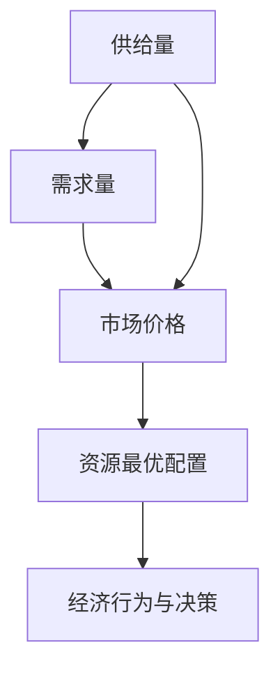
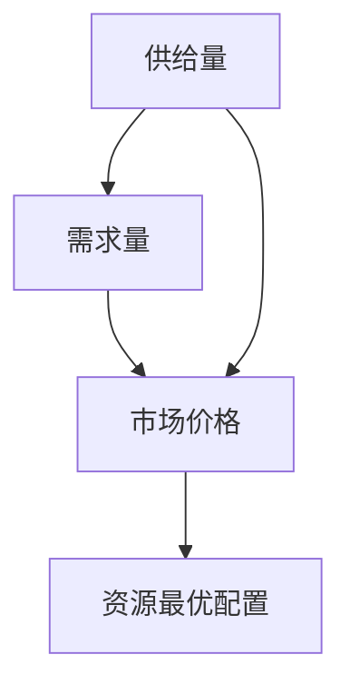
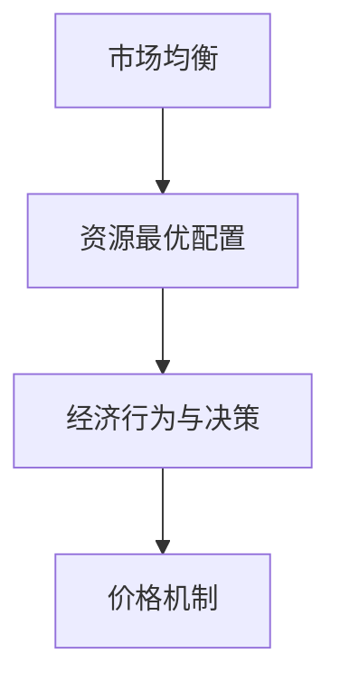
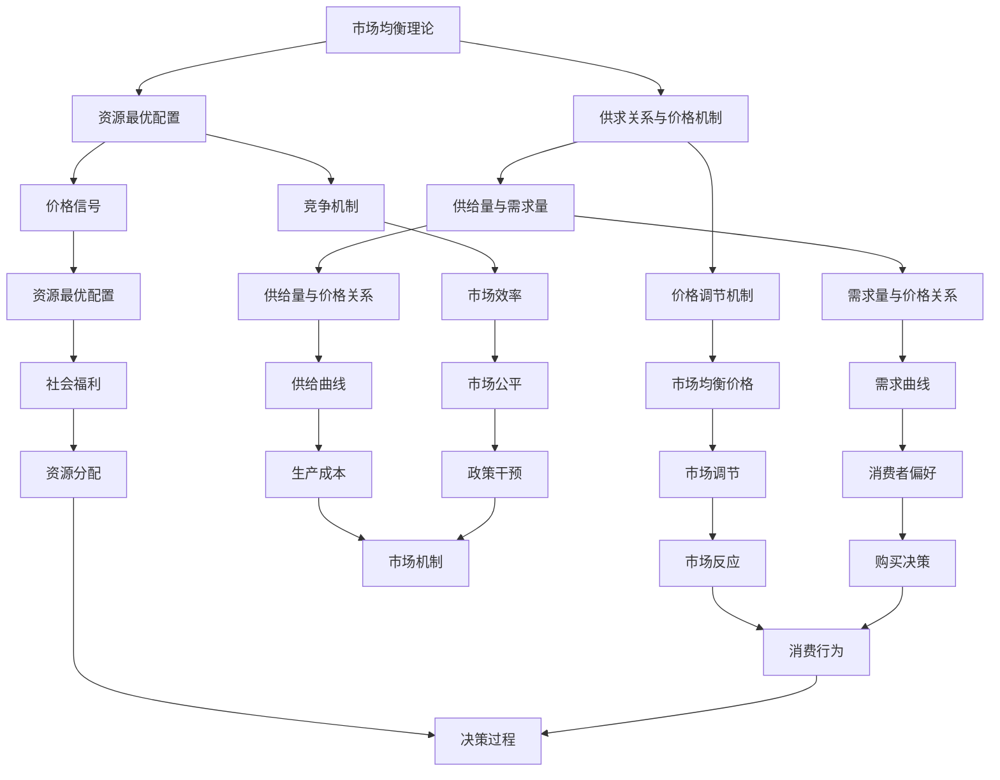

                 

# 从新古典经济学到行为经济学：理解人类在复杂世界中的决策机制

## 关键词：新古典经济学、行为经济学、决策机制、认知偏差、市场波动、政策应用

> 摘要：本文从新古典经济学到行为经济学的发展历程出发，详细探讨了人类在复杂世界中的决策机制。通过对新古典经济学基础理论的梳理，结合行为经济学的研究方法与核心概念，本文揭示了认知偏差在决策中的作用，分析了市场波动、广告与投资行为等实际应用，并探讨了行为经济学的政策含义和前沿研究方向。本文旨在为读者提供全面深入的理解，帮助其在实际应用中做出更合理的决策。

## 目录大纲

### 第一部分：新古典经济学到行为经济学概述

#### 1.1 新古典经济学的基石
##### 1.1.1 市场均衡理论
##### 1.1.2 供求关系与价格机制
##### 1.1.3 资源最优配置

#### 1.2 行为经济学的发展背景
##### 1.2.1 新古典经济学的局限性
##### 1.2.2 行为经济学的发展背景
##### 1.2.3 行为经济学与心理学的关系

#### 1.3 行为经济学核心概念
##### 1.3.1 持有偏见与决策偏差
##### 1.3.2 预算约束与消费行为
##### 1.3.3 动机与行为决策

### 第二部分：行为经济学理论与应用

#### 2.1 心理学与行为经济学
##### 2.1.1 决策与认知偏差
##### 2.1.2 情感与经济行为
##### 2.1.3 自我控制与延迟满足

#### 2.2 经济行为与决策过程
##### 2.2.1 前置思考与后置思考
##### 2.2.2 动机与选择
##### 2.2.3 策略选择与反馈机制

#### 2.3 行为经济学在市场中的应用
##### 2.3.1 市场价格的形成
##### 2.3.2 广告与消费行为
##### 2.3.3 投资决策与市场波动

### 第三部分：行为经济学的挑战与未来

#### 3.1 行为经济学方法论
##### 3.1.1 实验方法
##### 3.1.2 实证分析
##### 3.1.3 理论与实践的桥梁

#### 3.2 行为经济学的政策含义
##### 3.2.1 经济政策制定
##### 3.2.2 消费者保护
##### 3.2.3 企业经营策略

#### 3.3 行为经济学的前沿方向
##### 3.3.1 大数据与行为分析
##### 3.3.2 新兴技术对行为经济学的冲击
##### 3.3.3 跨学科研究的趋势

### 附录 A：行为经济学研究资源

#### A.1 主要研究机构与期刊
#### A.2 行为经济学数据库与工具
#### A.3 推荐读物与参考文献

### 1.1 新古典经济学的基石

### 1.1.1 市场均衡理论

市场均衡理论是经济学中的核心概念之一，主要用于解释市场中商品和服务的价格如何通过供求关系达到平衡状态。市场均衡理论的基本假设包括：

- **市场参与者的理性决策**：市场参与者被认为是在充分信息下做出最优决策的理性个体。
- **完全竞争**：市场中有大量的买家和卖家，每个参与者对市场价格和数量没有显著的影响。
- **信息透明**：市场参与者能够获取所有相关的市场信息，不存在信息不对称。

市场均衡的标志是市场价格和需求量达到一致，即供给量等于需求量。以下是市场均衡理论的详细解释：

$$
Q_s = Q_d
$$

其中，$Q_s$ 表示供给量，$Q_d$ 表示需求量。

**供需平衡的条件：**

1. **供给曲线和需求曲线的交叉点**：市场均衡发生在供给曲线和需求曲线的交叉点，此时市场达到供需平衡。
2. **价格调节**：市场价格会自动调整到使供需平衡的水平。如果需求大于供给，价格会上升；反之，如果供给大于需求，价格会下降。

市场均衡理论的核心是价格机制，它通过价格信号来调节市场的供需关系，实现资源的最优配置。

### 1.1.2 供求关系与价格机制

供求关系是指市场中商品和服务的供给量与需求量之间的关系。价格机制则是指市场通过价格来调节供需关系，实现市场均衡的过程。

**供求关系的特征：**

- **供给量的变动**：供给量主要受生产成本、生产技术、资源数量等因素的影响。一般情况下，供给量与价格成正比。

- **需求量的变动**：需求量主要受消费者偏好、收入水平、价格水平、相关商品价格等因素的影响。一般情况下，需求量与价格成反比。

**价格机制的运作原理：**

- **价格调节**：市场价格通过供求关系的变化进行调节，以达到市场均衡。当需求大于供给时，价格上升，刺激供给增加，直至供需平衡；当供给大于需求时，价格下降，刺激需求增加，直至供需平衡。

- **反馈机制**：市场价格的变动会反过来影响供给和需求。例如，价格上涨会吸引更多的生产者进入市场，增加供给量；价格下降则会减少供给量。

价格机制在市场中的作用是至关重要的，它不仅能够调节市场的供需关系，还能够引导生产者根据市场信号进行生产和消费者根据价格信号进行消费。

### 1.1.3 资源最优配置

资源最优配置是指在特定经济体系下，如何通过有效的资源配置来最大化社会福利。市场均衡理论在新古典经济学中提供了资源最优配置的机制：

**资源最优配置的原理：**

- **价格信号**：市场价格反映了资源的稀缺性，通过价格机制，资源会被引导到最需要的领域。

- **供需平衡**：市场均衡状态下的价格和产量是资源最优配置的结果。在这种情况下，社会总福利达到了最大化。

- **竞争机制**：在完全竞争的市场中，生产者和消费者之间的竞争促进了资源的最优配置。

资源最优配置不仅依赖于市场机制，还需要政府适当的干预。例如，通过税收、补贴、法律法规等手段，政府可以纠正市场失灵，确保资源的最优配置。

### 1.2 行为经济学的发展背景

**1.2.1 新古典经济学的局限性**

新古典经济学在20世纪初发展起来，并成为经济学的主流理论。然而，随着经济学的发展，新古典经济学也暴露出一些局限性：

- **理性人假设**：新古典经济学假设市场参与者都是理性决策者，但现实中人们的行为往往受到认知、情感等多种因素的影响。
- **信息完全假设**：新古典经济学假设市场参与者拥有完全的信息，但现实中信息往往是不完全的，这会导致市场失灵。
- **市场完全竞争假设**：新古典经济学假设市场是完全竞争的，但许多市场实际上是垄断或寡头垄断的。

这些局限性促使经济学家开始寻找新的理论来解释人类的经济行为。

**1.2.2 行为经济学的发展背景**

行为经济学起源于20世纪50年代，当时心理学家和行为科学家开始研究人们在决策中的行为，并发现许多经济行为不符合传统经济学理论。行为经济学的发展背景包括：

- **心理学与经济学的交叉**：行为经济学结合了心理学、社会学等学科的方法，研究人类在决策过程中的行为模式。
- **实验经济学的发展**：行为经济学通过实验方法来研究经济行为，提供了大量实证证据，挑战了传统经济理论的假设。
- **市场失灵的观察**：行为经济学关注市场失灵的现象，如信息不对称、道德风险、外部性等，并提出了解决方案。

**1.2.3 行为经济学与心理学的关系**

行为经济学与心理学有着密切的关系，两者共同研究人类决策和行为。以下是行为经济学与心理学的几个关键联系：

- **认知偏差**：心理学研究发现，人类决策中存在许多认知偏差，如确认偏差、过度自信等，这些偏差会影响经济行为。
- **情感的作用**：情感在决策过程中发挥着重要作用，如情绪状态、信任感等都会影响经济行为。
- **行为实验**：心理学实验方法被广泛应用于行为经济学研究中，通过实验可以更准确地观察和分析人类行为。

行为经济学与心理学的交叉研究为理解人类在复杂世界中的决策机制提供了新的视角，也为经济学理论的发展带来了新的启示。

### 1.3 行为经济学核心概念

**1.3.1 持有偏见与决策偏差**

持有偏见（Holding Bias）是指个体在决策过程中，对于已有信息和信念倾向于保持不变，而不是基于新的信息进行调整。这种行为偏差可能导致决策偏离理性最优，特别是在长期投资和风险决策中。

**决策偏差（Decision Bias）是指个体在决策过程中由于认知局限、情感因素或其他心理机制的作用，导致决策结果偏离理想状态。常见的决策偏差包括：

- **确认偏差**：个体更倾向于接受和记住支持已有信念的证据，而忽视或贬低相反的证据。
- **过度自信**：个体对自己能力和知识的评估过高，导致过度自信和冒险行为。
- **代表性偏差**：个体根据事物外观或特征来判断其概率，而忽视基于统计规律的概率计算。

了解这些决策偏差对于优化经济决策和风险管理具有重要意义。

**1.3.2 预算约束与消费行为**

预算约束（Budget Constraints）是指消费者在有限的收入下，如何在不同商品和服务之间进行合理分配。预算约束影响消费者的消费决策，使其在消费选择中面临权衡和取舍。

**消费行为**是指消费者在购买商品和服务时的行为模式。影响消费行为的因素包括：

- **收入水平**：收入水平直接影响消费者的购买能力，较高的收入水平通常意味着更多的消费。
- **价格水平**：商品和服务的价格水平影响消费者的购买意愿，价格下降通常会刺激消费。
- **个人偏好**：消费者的个人偏好和价值观也会影响消费行为。

了解预算约束和消费行为的互动关系有助于企业制定更有效的营销策略和消费者行为分析。

**1.3.3 动机与行为决策**

动机（Motivation）是指驱动个体采取特定行为的内在力量。在决策过程中，动机对个体的选择产生重要影响。动机可以分为内在动机和外在动机：

- **内在动机**：内在动机是指个体因对任务本身的兴趣和乐趣而参与活动。例如，学习新技能、参与运动等。
- **外在动机**：外在动机是指个体因外部奖励或避免惩罚而参与活动。例如，完成任务以获得奖励、避免处罚等。

行为决策（Behavioral Decision-Making）是指个体在面临选择时，如何从多个备选方案中做出最优决策的过程。行为决策包括以下几个步骤：

1. **目标设定**：个体明确自己的目标，如提高工作效率、减肥等。
2. **信息搜索**：个体收集与目标相关的信息，以支持决策。
3. **方案评估**：个体评估不同方案的优劣，以选择最佳方案。
4. **决策执行**：个体采取行动实施所选方案。

理解动机和行为决策的原理有助于个体更有效地设定目标、制定计划和采取行动。

### 2.1 心理学与行为经济学

**2.1.1 决策与认知偏差**

在行为经济学中，决策（Decision Making）是核心概念之一。心理学研究指出，人类决策过程受到多种认知偏差的影响，这些偏差可能导致决策结果偏离理性最优。以下是几种常见的认知偏差：

- **确认偏差**（Confirmation Bias）：个体倾向于寻找、解释和记住那些支持自己已有信念的信息，而忽视或贬低相反的证据。
- **过度自信**（Overconfidence）：个体对自己判断和预测的能力过于乐观，往往高估自己的知识和能力。
- **代表性偏差**（Representativeness Bias）：个体根据某一事物的外观或特征来判断其概率，而忽视基于统计规律的概率计算。

这些认知偏差在决策中表现为：

- **选择性搜索信息**：个体倾向于搜索那些符合自己已有信念的信息，而忽视其他可能的信息。
- **高估成功概率**：个体往往高估自己决策的成功概率，导致过度自信和冒险行为。
- **基于典型性而非概率进行判断**：个体在判断某一事件的可能性时，倾向于根据典型性而非实际概率进行判断，从而导致错误的决策。

理解这些认知偏差对于优化决策过程和减少决策失误具有重要意义。

**2.1.2 情感与经济行为**

情感（Emotion）在人类行为决策中扮演着重要角色，特别是经济行为。心理学研究揭示了情感对经济行为的影响：

- **情绪状态**：情绪状态会影响个体的决策偏好和行为反应。例如，乐观情绪可能促使个体更愿意冒险，而悲观情绪则可能导致个体更保守。
- **情绪记忆**：个体对过去情感体验的记忆会影响当前的经济行为。例如，过去失败的交易经历可能导致个体在未来交易中更加谨慎。
- **情绪调节**：情绪调节能力影响个体在面对压力和挑战时的决策质量。情绪调节能力强的人可能更能保持理性，做出更优决策。

情感对经济行为的影响在多个领域都有体现，如投资决策、消费行为、劳动力市场等。理解情感的作用有助于设计更有效的经济政策和企业策略。

**2.1.3 自我控制与延迟满足**

自我控制（Self-Control）是指个体在面对即时满足和长期利益之间的权衡时，能够推迟即时满足以获得更大长期利益的能力。心理学研究指出，自我控制对于个体成功至关重要：

- **延迟满足**（Delay of Gratification）：延迟满足是指个体能够忍受延迟即时满足，专注于长期目标。研究发现，延迟满足能力与学业成绩、职业成就等正相关。
- **自我控制机制**：自我控制涉及认知控制、情绪调节、行为抑制等多种机制。心理学研究提供了多种提高自我控制能力的策略，如设定明确目标、计划时间管理、强化自我效能感等。

理解自我控制与延迟满足的关系对于个人发展和职业成功具有重要意义。

### 2.2 经济行为与决策过程

**2.2.1 前置思考与后置思考**

前置思考（Pre-Decision Thinking）和后置思考（Post-Decision Thinking）是决策过程中的两个重要阶段。前置思考是指决策者在做出决策之前，对可能的后果和结果进行思考的过程。后置思考则是指决策者在做出决策之后，对决策结果和后续行动进行反思和调整的过程。

**前置思考**的特点包括：

- **目标设定**：决策者在进行前置思考时，首先需要明确自己的目标，并考虑如何实现这些目标。
- **信息收集**：决策者会收集与目标相关的信息，如市场趋势、竞争状况、资源状况等，以便做出更全面的决策。
- **方案评估**：决策者会评估不同方案的优劣，考虑各种可能的风险和收益，以选择最佳方案。

**后置思考**的特点包括：

- **结果评估**：决策者会在决策之后，对决策结果进行评估，分析决策的成效和不足之处。
- **反馈调整**：根据结果评估，决策者会调整后续行动，如改变策略、优化资源分配等，以改进决策效果。

前置思考与后置思考的相互作用决定了决策的质量和效果。通过有效的前置思考，决策者可以制定更合理的方案；通过后置思考，决策者可以不断优化决策过程，提高决策的效率和准确性。

### 2.2.2 动机与选择

动机（Motivation）是指驱动个体采取特定行为的内在力量。在决策过程中，动机对个体的选择产生重要影响。动机可以分为内在动机和外在动机：

- **内在动机**：内在动机是指个体因对任务本身的兴趣和乐趣而参与活动。例如，学习新技能、参与运动等。
- **外在动机**：外在动机是指个体因外部奖励或避免惩罚而参与活动。例如，完成任务以获得奖励、避免处罚等。

选择（Choice）是决策过程中的关键环节，动机影响着选择的质量和方向。了解动机类型，有助于个体和企业在决策过程中做出更优选择：

- **内在动机**：通过激发个体的内在动机，可以帮助个体在决策过程中保持专注和热情，从而做出更明智的选择。
- **外在动机**：合理利用外在动机，可以帮助企业激励员工和消费者，提高决策执行的效果。

动机与选择的相互作用，决定了决策的成效和可持续性。理解动机的类型和作用，有助于优化决策过程，提高决策质量。

### 2.2.3 策略选择与反馈机制

策略选择（Strategic Choice）是指决策者根据目标和环境因素，从多个可选方案中挑选出最合适的方案。策略选择的过程通常包括以下几个步骤：

1. **目标设定**：明确决策目标，确保选择方案能够满足这些目标。
2. **方案评估**：评估不同方案的优劣，考虑风险、成本、收益等因素。
3. **选择最优方案**：根据评估结果，选择最符合目标的方案。

反馈机制（Feedback Mechanism）是指决策者通过反馈信息，对决策效果进行评估和调整的过程。反馈机制在策略选择中具有重要作用：

- **结果评估**：通过反馈，决策者可以评估所选方案的实际效果，发现存在的问题和不足。
- **调整策略**：根据反馈结果，决策者可以及时调整策略，优化决策过程。

策略选择与反馈机制的相互作用，使决策者能够不断优化决策，提高决策质量和效率。有效的策略选择和反馈机制，是实现长期成功的关键。

### 2.3 行为经济学在市场中的应用

**2.3.1 市场价格的形成**

市场价格的形成为经济行为提供了关键信号，反映了供需关系和消费者行为。以下是市场价格的四个主要影响因素：

1. **供给**：供给量是由生产成本、生产技术和资源数量等因素决定的。供给量的增加会推动价格下降，而供给量的减少会推动价格上涨。

2. **需求**：需求量是由消费者偏好、收入水平和价格水平等因素决定的。需求量的增加会推动价格上涨，而需求量的减少会推动价格下降。

3. **市场预期**：市场预期会影响消费者的购买决策，从而影响需求量。乐观预期可能导致价格上涨，而悲观预期可能导致价格下降。

4. **政策干预**：政府的税收、补贴、价格管制等政策会直接影响市场价格。例如，税收增加会提高商品价格，而补贴会降低商品价格。

市场价格的形成是一个动态过程，受到多种因素的相互作用。理解市场价格的形成机制，有助于企业制定更有效的定价策略。

**2.3.2 广告与消费行为**

广告是市场经济中的一种重要工具，它通过传递产品信息、塑造品牌形象等方式影响消费者的消费行为。以下是广告对消费行为的三个主要影响：

1. **信息传递**：广告可以传递产品的功能、特点、价格等信息，帮助消费者更好地了解和比较不同产品，从而做出更明智的购买决策。

2. **品牌塑造**：广告通过塑造品牌形象，增强消费者对品牌的认知和好感，从而提高品牌的市场竞争力。

3. **情感营销**：广告可以运用情感因素，如亲情、友情、爱国情等，激发消费者的情感共鸣，从而提高购买意愿。

广告的效果受到多种因素影响，包括广告内容、广告渠道、消费者心理等。企业需要通过科学的广告策略，提高广告的投入产出比。

**2.3.3 投资决策与市场波动**

投资决策是行为经济学研究的重要领域，投资者的决策行为和市场波动密切相关。以下是投资者投资决策和市场波动的几个关键因素：

1. **市场预期**：投资者对市场未来的预期会影响其投资决策。乐观预期可能导致市场上涨，而悲观预期可能导致市场下跌。

2. **信息获取**：投资者获取的信息质量直接影响其投资决策。高质量的信息可以提高投资决策的准确性，而低质量的信息可能导致错误决策。

3. **情绪波动**：投资者的情绪波动会影响其投资决策。情绪波动可能导致投资者过度反应，从而引发市场波动。

市场波动是多种因素共同作用的结果，包括宏观经济因素、政策变动、国际形势等。理解市场波动的原理，有助于投资者更理性地做出投资决策。

### 3.1 行为经济学方法论

**3.1.1 实验方法**

实验方法是行为经济学研究的重要工具，通过控制变量和观察行为，可以揭示人类决策中的认知偏差和情感影响。以下是实验方法在行为经济学中的应用：

1. **实验室实验**：在实验室环境中，研究人员可以控制各种变量，如实验情境、参与者背景等，从而更准确地观察人类行为。

2. **现场实验**：将实验方法应用于现实生活中的特定情境，如购物、投资等，以检验理论在实际中的应用效果。

3. **经济实验**：通过模拟经济环境，如股票市场、拍卖等，研究参与者在不同经济情境下的决策行为。

实验方法的优势在于能够提供定量数据，支持因果推断，但实验结果可能受到实验情境的限制，需要在实践中进行验证。

**3.1.2 实证分析**

实证分析是行为经济学研究的重要组成部分，通过收集和分析实际数据，验证理论假设和发现新现象。以下是实证分析的主要方法：

1. **横断面数据**：通过调查问卷、在线实验等手段，收集某一特定时间点的数据，用于研究个体行为模式。

2. **纵向数据**：通过长期跟踪同一组个体，收集不同时间点的数据，研究个体行为的变化趋势。

3. **面板数据**：结合横断面数据和纵向数据，研究不同个体在不同时间点的行为差异。

实证分析的优势在于能够提供实际数据支持，但数据质量和分析方法对结果具有重要影响。

**3.1.3 理论与实践的桥梁**

行为经济学通过理论模型和实证分析，构建了连接理论和实践的桥梁。以下是理论模型和实践应用的几个关键点：

1. **理论模型**：通过构建理论模型，行为经济学可以解释人类决策行为背后的机制，为实践提供指导。

2. **实证验证**：通过实证分析，验证理论模型的假设和预测，确保理论具有实际应用价值。

3. **应用创新**：结合理论模型和实证分析结果，行为经济学为实际应用提供了新的思路和方法，如金融产品设计、消费者行为分析等。

理论模型和实证分析的结合，使得行为经济学不仅能够解释人类行为，还能够为实际问题提供解决方案。

### 3.2 行为经济学的政策含义

**3.2.1 经济政策制定**

行为经济学对经济政策的制定具有重要启示。以下是一些关键点：

1. **消费者保护**：行为经济学揭示了消费者在决策过程中可能存在的认知偏差和情感影响，政策制定者可以通过设计更合理的消费者保护措施，减少消费者受骗和误解。

2. **市场监管**：行为经济学指出，市场机制可能存在失灵，政策制定者需要加强对市场的监管，纠正市场失灵，确保市场的公平和效率。

3. **公共教育**：行为经济学强调提高公众金融素养的重要性，政策制定者可以通过公共教育项目，帮助消费者做出更理性的经济决策。

4. **政策设计**：行为经济学为政策设计提供了新的视角，政策制定者可以通过更加人性化的政策设计，减少政策实施中的阻力，提高政策效果。

**3.2.2 消费者保护**

消费者保护是行为经济学研究的重要内容，以下是一些关键点：

1. **透明度**：提高市场透明度，确保消费者获取充分的信息，减少信息不对称问题。

2. **消费者教育**：通过教育和宣传，提高消费者的金融素养，帮助消费者做出更理性的消费决策。

3. **法律保护**：制定和完善相关法律法规，保护消费者权益，确保消费者在市场交易中的公平地位。

4. **监管机制**：建立健全的监管机制，对市场行为进行有效监督，防止市场失灵和欺诈行为。

消费者保护不仅有助于提升消费者福利，还能够促进市场的健康发展。

**3.2.3 企业经营策略**

行为经济学对企业的经营策略具有重要影响，以下是一些关键点：

1. **消费者行为分析**：企业可以通过行为经济学方法，深入研究消费者的决策行为，了解消费者需求，优化产品设计和服务策略。

2. **市场定位**：行为经济学可以帮助企业确定目标市场，通过差异化营销策略，提高市场竞争力。

3. **员工激励**：企业可以利用行为经济学原理，设计合理的激励机制，提高员工的工作积极性和创造力。

4. **风险管理**：行为经济学揭示了人类决策中的认知偏差和情感影响，企业可以通过行为经济学方法，提高风险识别和应对能力，降低运营风险。

行为经济学为企业提供了新的管理工具，有助于企业在竞争激烈的市场中取得成功。

### 3.3 行为经济学的前沿方向

**3.3.1 大数据与行为分析**

大数据技术的发展为行为经济学研究提供了丰富的数据资源，推动了行为分析方法的革新。以下是大数据与行为分析的一些前沿方向：

1. **消费行为分析**：通过分析海量消费数据，行为经济学家可以深入了解消费者偏好、购买模式和决策过程，为市场策略制定提供数据支持。

2. **社会网络分析**：大数据技术可以帮助研究人员分析社会网络中的行为传播和影响，研究行为如何在不同个体和群体之间传播。

3. **行为预测**：利用大数据和机器学习技术，行为经济学家可以建立预测模型，预测消费者的未来行为，为企业决策提供指导。

4. **个性化服务**：大数据分析可以识别消费者的个性特征和需求，帮助企业提供更个性化的产品和服务，提高客户满意度。

**3.3.2 新兴技术对行为经济学的冲击**

新兴技术的发展对行为经济学研究产生了深远影响，以下是一些关键点：

1. **区块链技术**：区块链技术可以提高交易透明度和安全性，改变传统经济行为，对行为经济学理论提出了新的挑战。

2. **人工智能**：人工智能技术的发展使得行为分析更加智能化和自动化，为行为经济学研究提供了新的工具和方法。

3. **虚拟现实与增强现实**：虚拟现实和增强现实技术改变了人类与环境的互动方式，为行为经济学研究提供了新的实验环境和研究方法。

4. **行为金融**：行为金融学结合行为经济学和金融学，研究投资者行为和市场波动，为金融市场管理提供了新方法。

新兴技术为行为经济学研究带来了新的机遇和挑战，推动了学科的发展。

**3.3.3 跨学科研究的趋势**

行为经济学作为一门交叉学科，融合了经济学、心理学、社会学等多个领域的知识。以下是跨学科研究的一些趋势：

1. **心理学与经济学的融合**：行为经济学通过心理学方法研究经济行为，推动了经济学理论的创新。

2. **神经经济学**：神经经济学结合经济学和神经科学，研究大脑决策机制，为理解经济行为提供了新的视角。

3. **社会经济学**：社会经济学研究社会结构对经济行为的影响，探讨经济行为的社会意义。

4. **行为金融学**：行为金融学结合行为经济学和金融学，研究投资者行为和市场波动，为金融市场管理提供了新方法。

跨学科研究推动了行为经济学的理论发展和实践应用，为解决现实问题提供了新思路。

### 附录 A：行为经济学研究资源

**A.1 主要研究机构与期刊**

1. **美国行为经济学学会**（Society for Experimental Economics）：致力于推动行为经济学的研究和应用，出版期刊《行为经济学评论》。

2. **欧洲行为科学学会**（European Association for Decision Making）：专注于决策行为的研究，出版期刊《行为决策过程》。

3. **行为经济学与心理学协会**（Association for Behavioral Economics and Psychology）：促进行为经济学和心理学的交叉研究，出版期刊《行为经济学与心理学杂志》。

**A.2 行为经济学数据库与工具**

1. **AER RePEc**：由美国经济学学会运营，提供丰富的经济学文献数据库。

2. **JSTOR**：提供大量学术期刊和书籍，包括行为经济学相关文献。

3. **PSYCINFO**：心理学文献数据库，涵盖行为经济学相关研究。

4. **Google Scholar**：强大的学术搜索引擎，可以检索到行为经济学相关的研究论文。

**A.3 推荐读物与参考文献**

1. **《行为经济学原理》**，作者：理查德·泰勒：详细介绍了行为经济学的核心概念和理论。

2. **《决策与判断》**，作者：丹尼尔·卡内曼和阿莫斯·特沃斯基：介绍了认知心理学和经济学领域的经典理论。

3. **《行为金融学》**，作者：理查德·塞勒：探讨了投资者行为和市场波动的关系。

4. **《心理学与生活》**，作者：理查德·吉尔伯特：提供了心理学基础知识，涵盖行为经济学相关内容。

### 1.1 新古典经济学的基石

新古典经济学是现代经济学的基础之一，它以市场机制为核心，解释了资源的最优配置、价格的形成以及经济行为的决策过程。以下是新古典经济学中的几个核心概念及其相互关系。

#### 1.1.1 市场均衡理论

市场均衡理论是新古典经济学的基石之一，它描述了市场上商品和服务的供求关系如何达到平衡状态。在市场均衡中，供给量等于需求量，市场价格稳定。

**市场均衡理论的架构与联系：**

**市场均衡的数学表示：**

$$
Q_s = Q_d \\
P = P^*
$$

其中，$Q_s$ 表示供给量，$Q_d$ 表示需求量，$P$ 表示市场价格，$P^*$ 表示市场均衡价格。

**市场均衡的形成条件：**

1. **供需曲线相交**：供给曲线和需求曲线的交点即为市场均衡点，市场价格和产量在此时达到平衡。
2. **价格调节机制**：市场价格会根据供求关系自动调整，以实现市场均衡。
3. **完全竞争**：市场参与者数量足够多，没有单个参与者能够影响市场价格。

#### 1.1.2 供求关系与价格机制

供求关系是市场均衡理论的核心，描述了商品和服务的供给量与需求量之间的关系。价格机制则是市场通过价格信号调节供求关系，实现资源最优配置的机制。

**供求关系与价格机制的架构与联系：**

**供求关系的特征：**

- **供给量与价格的关系**：供给量通常与价格成正比，即价格上涨，供给量增加。
- **需求量与价格的关系**：需求量通常与价格成反比，即价格上涨，需求量减少。

**价格机制的运作原理：**

1. **价格调节**：市场价格通过供求关系的变化进行调节，以实现市场均衡。
2. **反馈机制**：市场价格变动会反过来影响供给和需求，形成动态调整。

**数学表示：**

供给函数：$Q_s = f(P)$

需求函数：$Q_d = g(P)$

市场价格：$P = P^*$ （供需平衡）

#### 1.1.3 资源最优配置

资源最优配置是指在经济体系中，如何通过市场机制实现资源的最优分配，以最大化社会福利。市场均衡理论提供了资源最优配置的机制，通过价格信号和竞争机制，实现资源的最优配置。

**资源最优配置的架构与联系：**

**资源最优配置的原理：**

1. **价格信号**：市场价格反映了资源的稀缺性，引导资源流向最需要的领域。
2. **竞争机制**：竞争促使生产者和消费者在市场中追求最大化的利益，促进资源的最优配置。
3. **供需平衡**：市场均衡状态下的价格和产量是资源最优配置的结果。

**数学表示：**

资源最优配置的效用函数：$U(Q_s, Q_d)$

最大化社会福利的目标函数：$\max U(Q_s, Q_d)$

约束条件：$Q_s = Q_d$

**总结：**

新古典经济学的基石包括市场均衡理论、供求关系与价格机制以及资源最优配置。这些核心概念相互联系，共同构成了新古典经济学的理论框架。市场均衡理论解释了价格的形成和资源的分配，供求关系与价格机制描述了市场动态，资源最优配置则实现了社会总福利的最大化。

### 1.2 行为经济学的发展背景

行为经济学作为一门交叉学科，其发展背景可以追溯到20世纪中叶，当时经济学家开始关注传统经济学理论未能解释的现实经济行为。以下是行为经济学的发展背景及其核心驱动力：

#### 1.2.1 新古典经济学的局限性

新古典经济学在20世纪初发展起来，以其理性人假设和完全信息假设为核心，构建了一套完整的理论框架。然而，随着时间的推移，经济学家们发现新古典经济学存在一些局限性，主要体现在以下几个方面：

1. **理性人假设**：新古典经济学假设市场参与者都是完全理性的决策者，但在实际中，人们往往受到认知限制、情感因素等多种因素的影响，导致其决策并非总是最优的。

2. **信息完全假设**：新古典经济学假设市场参与者拥有完全的信息，但在现实生活中，信息往往是稀缺和不完全的，这会导致市场失灵。

3. **市场完全竞争假设**：新古典经济学假设市场是完全竞争的，但实际上，许多市场存在垄断或寡头垄断现象，这会影响价格机制的有效性。

#### 1.2.2 行为经济学的发展背景

行为经济学的发展受到多种因素的影响，包括心理学、社会学、实验经济学等领域的进展。以下是行为经济学发展的主要驱动力：

1. **心理学与经济学的交叉**：20世纪中叶，心理学家开始研究人类决策行为中的认知偏差、情感因素等，这些研究为行为经济学提供了理论基础。

2. **实验经济学的发展**：20世纪70年代，实验经济学开始兴起，通过实验室实验研究人类经济行为，提供了大量的实证数据，挑战了传统经济理论的假设。

3. **市场失灵的观察**：经济学家们发现，在现实经济中，市场并不总是有效运作的，存在信息不对称、道德风险、外部性等问题，这些问题无法通过传统经济学理论得到解释。

#### 1.2.3 行为经济学与心理学的关系

行为经济学与心理学有着紧密的联系，两者在研究方法和理论框架上相互借鉴和补充。以下是行为经济学与心理学的关系：

1. **认知偏差**：心理学研究表明，人类在决策过程中存在多种认知偏差，如确认偏差、代表性偏差、过度自信等，这些偏差会影响经济行为。

2. **情感作用**：心理学指出，情感在决策中扮演着重要角色，如情绪状态、信任感等都会影响经济行为。

3. **行为实验**：心理学实验方法被广泛应用于行为经济学研究中，通过实验可以更准确地观察和分析人类行为。

行为经济学与心理学的结合，为理解人类在复杂世界中的决策机制提供了新的视角，也为经济学理论的发展带来了新的启示。

#### 1.2.4 行为经济学与行为科学的关系

行为经济学不仅与心理学密切相关，还与行为科学有着广泛的联系。行为科学是一门跨学科领域，研究人类行为背后的机制，包括心理学、社会学、经济学等。以下是行为经济学与行为科学的关系：

1. **跨学科研究**：行为经济学通过跨学科的方法，结合心理学、社会学等领域的知识，研究人类在经济活动中的行为模式。

2. **共同目标**：行为经济学和行为科学都致力于理解人类行为，提高决策的效率和效果。

3. **方法创新**：行为科学为行为经济学提供了新的研究方法，如实验经济学方法、社会观察法等，推动了学科的发展。

综上所述，行为经济学的发展背景源于对传统经济学理论的反思和新古典经济学局限性的认识。心理学、实验经济学等领域的进展为行为经济学提供了理论依据和方法支持，使得行为经济学能够更好地解释现实经济行为，为经济政策制定和企业管理提供了新的视角。

### 1.3 行为经济学核心概念

行为经济学是一门研究人类在经济活动中的实际决策行为的学科，它结合了心理学、社会学等多学科的理论和方法。以下是行为经济学中的几个核心概念及其相互关系：

#### 1.3.1 持有偏见与决策偏差

持有偏见（Holding Bias）是指个体在决策过程中，对于已有信息和信念倾向于保持不变，而不是基于新的信息进行调整。这种偏见可能导致个体在投资、消费等经济行为中做出非理性的决策。

**决策偏差（Decision Bias）**则是指个体在决策过程中由于认知局限、情感因素或其他心理机制的作用，导致决策结果偏离理性最优。常见的决策偏差包括：

- **确认偏差（Confirmation Bias）**：个体倾向于寻找、解释和记住那些支持自己已有信念的证据，而忽视或贬低相反的证据。
- **过度自信（Overconfidence）**：个体对自己的判断和预测能力过于乐观，往往高估自己的知识和能力。
- **代表性偏差（Representativeness Bias）**：个体根据某一事物的典型性而非概率进行判断。

**持有偏见与决策偏差的关系：**

持有偏见是决策偏差的一种表现形式，它使得个体在决策过程中难以客观评估新的信息，从而导致过度依赖已有信念，做出非理性的决策。

#### 1.3.2 预算约束与消费行为

预算约束是指消费者在有限的收入下，如何在不同商品和服务之间进行合理分配。预算约束是消费行为的核心因素，它决定了消费者的消费选择。

**消费行为（Consumer Behavior）**是指消费者在购买商品和服务时的行为模式。影响消费行为的因素包括：

- **收入水平（Income Level）**：收入水平直接影响消费者的购买能力，较高的收入水平通常意味着更多的消费。
- **价格水平（Price Level）**：商品和服务的价格水平影响消费者的购买意愿，价格下降通常会刺激消费。
- **个人偏好（Personal Preferences）**：消费者的个人偏好和价值观也会影响消费行为。

**预算约束与消费行为的关系：**

预算约束是消费行为的前提条件，它限制了消费者的消费选择。消费者的消费行为则是在预算约束下，根据个人偏好和价格水平做出的最优决策。

#### 1.3.3 动机与行为决策

动机是指驱动个体采取特定行为的内在力量。在行为经济学中，动机对个体的决策行为具有重要作用。

**行为决策（Behavioral Decision-Making）**是指个体在面临选择时，如何从多个备选方案中做出最优决策的过程。动机可以分为内在动机和外在动机：

- **内在动机（Intrinsic Motivation）**：内在动机是指个体因对任务本身的兴趣和乐趣而参与活动，如学习新技能、参与运动等。
- **外在动机（Extrinsic Motivation）**：外在动机是指个体因外部奖励或避免惩罚而参与活动，如完成任务以获得奖励、避免处罚等。

**动机与行为决策的关系：**

动机是行为决策的动力来源，它决定了个体在面对选择时的行为方向和强度。内在动机通常能够激发个体持续参与和深度投入，而外在动机则可能在短期内提高个体行为积极性，但长期依赖可能导致动机的下降。

**总结：**

行为经济学的核心概念包括持有偏见与决策偏差、预算约束与消费行为、动机与行为决策。这些概念相互联系，共同构成了行为经济学的理论框架。持有偏见和决策偏差揭示了人类在经济行为中的非理性现象，预算约束和消费行为描述了消费者在有限资源下的决策过程，而动机与行为决策则探讨了驱动个体行为的内在力量。通过深入研究这些核心概念，行为经济学为理解人类在复杂世界中的决策机制提供了新的视角。

### 2.1 心理学与行为经济学

行为经济学作为一门交叉学科，融合了心理学、社会学等多个领域的知识。心理学在行为经济学中的应用尤为广泛，通过研究人类心理机制，行为经济学能够更好地解释经济行为。以下是心理学与行为经济学之间的几个关键联系。

#### 2.1.1 决策与认知偏差

心理学研究发现，人类在决策过程中存在多种认知偏差，这些偏差会影响决策的质量和结果。认知偏差是指人们在处理信息、做出决策时，由于认知机制的限制，导致决策偏离理性最优。

**常见的认知偏差包括：**

- **确认偏差（Confirmation Bias）**：个体倾向于寻找、解释和记住那些支持自己已有信念的证据，而忽视或贬低相反的证据。
- **过度自信（Overconfidence）**：个体对自己的判断和预测能力过于乐观，往往高估自己的知识和能力。
- **代表性偏差（Representativeness Bias）**：个体根据某一事物的典型性而非概率进行判断，而忽视基于统计规律的概率计算。

在行为经济学中，认知偏差对决策行为的影响至关重要。例如，确认偏差可能导致投资者在市场波动中过度依赖过去成功的投资经验，从而忽视市场变化的新信息，导致非理性的投资决策。过度自信则可能导致个体在风险投资中过度冒险，忽视潜在的风险。代表性偏差则可能使得个体在评估投资机会时，过于关注典型案例，而忽视整体的统计规律。

**认知偏差在决策中的作用：**

1. **信息处理**：认知偏差影响个体对信息的处理方式，使得个体在信息不完全或不确定的情况下，难以做出最优决策。
2. **决策偏差**：认知偏差导致决策结果偏离理性最优，使得个体在经济行为中表现出非理性行为。
3. **行为预测**：理解认知偏差有助于预测个体在不同经济情境下的行为模式，为经济政策制定和企业管理提供依据。

#### 2.1.2 情感与经济行为

情感在人类决策过程中发挥着重要作用，特别是在经济行为中。心理学研究表明，情绪状态会影响个体的决策偏好和行为反应。

**情感在决策中的作用包括：**

- **情绪状态**：情绪状态如乐观、悲观等会影响个体对风险和收益的评价，从而影响决策。
- **情绪记忆**：个体对过去情感体验的记忆会影响当前的经济行为，如过去失败的交易经历可能导致个体在未来交易中更加谨慎。
- **情绪调节**：情绪调节能力影响个体在面对压力和挑战时的决策质量。情绪调节能力强的人可能更能保持理性，做出更优决策。

在行为经济学中，情感对经济行为的影响体现在多个方面。例如，乐观情绪可能促使个体在投资中更加冒险，而悲观情绪则可能导致个体更加保守。情感还可能影响消费者的消费行为，如情感驱动的购物决策可能导致非理性的消费行为。

**情感在决策中的作用机制：**

1. **情绪评价**：情感评价影响个体对经济事件的主观感受，从而影响决策。
2. **情感记忆**：情感记忆影响个体对过去经验的回忆，从而影响当前的经济行为。
3. **情绪调节**：情绪调节能力影响个体在面对决策时的情绪反应，从而影响决策质量。

#### 2.1.3 自我控制与延迟满足

自我控制是指个体在面对即时满足和长期利益之间的权衡时，能够推迟即时满足以获得更大长期利益的能力。心理学研究表明，自我控制是影响个体成功的重要因素。

**自我控制在决策中的作用包括：**

- **延迟满足（Delay of Gratification）**：延迟满足能力是指个体能够忍受延迟即时满足，专注于长期目标。研究表明，延迟满足能力与学业成绩、职业成就等正相关。
- **认知控制**：自我控制涉及认知控制，包括注意力管理、记忆保持等，这些能力影响个体在决策过程中的信息处理和方案评估。
- **行为抑制**：自我控制还包括行为抑制，即个体在决策过程中能够抑制冲动行为，做出理性选择。

在行为经济学中，自我控制对决策行为具有重要影响。例如，自我控制能力强的投资者可能在面对市场波动时保持冷静，做出更理性的投资决策。自我控制能力还可能影响消费者的消费行为，如延迟满足能力强的消费者可能更倾向于进行长期储蓄。

**自我控制与延迟满足的关系：**

1. **延迟满足与自我控制**：延迟满足是自我控制的一种表现形式，自我控制能力强的个体通常能够更好地延迟即时满足。
2. **延迟满足的影响**：延迟满足能力影响个体的决策方向和结果，高延迟满足能力通常能够带来更长期、更稳定的经济收益。

综上所述，心理学与行为经济学之间的联系体现在多个方面，包括认知偏差、情感和自我控制。通过心理学的研究，行为经济学能够更好地理解人类经济行为，为经济政策制定和企业管理提供理论依据。

### 2.2 经济行为与决策过程

在行为经济学中，经济行为和决策过程是研究的核心内容之一。理解这些过程对于预测和优化人类在经济活动中的行为至关重要。以下是经济行为与决策过程的详细分析。

#### 2.2.1 前置思考与后置思考

前置思考（Pre-Decision Thinking）和后置思考（Post-Decision Thinking）是决策过程中的两个关键阶段。

**前置思考**是指决策者在做出决策之前进行的思考，主要包括以下几个步骤：

1. **目标设定（Goal Setting）**：决策者需要明确自己的目标，这些目标可以是短期或长期的，例如增加收入、实现财务自由等。
2. **信息搜索（Information Search）**：决策者会收集与目标相关的信息，这些信息可能来自市场趋势、竞争对手、政策法规等。
3. **方案评估（Option Evaluation）**：决策者会对收集到的信息进行评估，分析不同方案的优劣，考虑各种可能的风险和收益。
4. **选择方案（Option Selection）**：根据评估结果，决策者会从多个备选方案中选择一个最优方案。

**后置思考**则是在决策后进行的反思和调整，主要包括以下几个步骤：

1. **结果评估（Outcome Evaluation）**：决策者会根据实际结果，评估决策的成效和不足之处，分析决策是否达到预期目标。
2. **反馈调整（Feedback Adjustment）**：根据结果评估，决策者会调整后续行动，如改变策略、优化资源分配等，以改进决策效果。

**前置思考与后置思考的相互作用**决定了决策的质量和效果。有效的前置思考可以帮助决策者制定合理的方案，而后置思考则能够确保决策过程不断优化，提高决策的效率和准确性。

#### 2.2.2 动机与选择

动机（Motivation）是驱动个体采取特定行为的内在力量。在决策过程中，动机对个体的选择产生重要影响。

**动机的类型**包括：

- **内在动机（Intrinsic Motivation）**：内在动机是指个体因对任务本身的兴趣和乐趣而参与活动。例如，学习新技能、参与运动等。
- **外在动机（Extrinsic Motivation）**：外在动机是指个体因外部奖励或避免惩罚而参与活动。例如，完成任务以获得奖励、避免处罚等。

**动机与选择的关系**体现在以下几个方面：

1. **动机的驱动作用**：动机能够驱动个体在决策过程中付出努力，选择那些符合自己目标和兴趣的方案。
2. **动机的持续作用**：内在动机通常能够激发个体持续参与和深度投入，而外在动机则可能在短期内提高个体行为积极性，但长期依赖可能导致动机的下降。
3. **动机的影响因素**：动机受到多种因素的影响，包括个人兴趣、目标设定、外部奖励等。

**案例分析：**假设一个企业在招聘新员工时，通过提供高薪和奖金来吸引候选人。这种策略利用了外在动机，短期内能够吸引大量候选人。然而，长期来看，如果企业不能提供有吸引力的工作内容和发展机会，候选人可能会因为外在动机减弱而离职。相反，如果企业能够提供有意义的工作和职业发展，激发员工内在动机，员工可能会更愿意长期留在企业。

#### 2.2.3 策略选择与反馈机制

策略选择（Strategic Choice）是指决策者在面临多个选择时，根据目标和环境因素挑选出最优方案的过程。策略选择包括以下几个步骤：

1. **目标设定（Goal Setting）**：明确决策目标，确保选择方案能够满足这些目标。
2. **方案评估（Option Evaluation）**：评估不同方案的优劣，考虑各种可能的风险和收益。
3. **选择最优方案（Option Selection）**：根据评估结果，选择最符合目标的方案。

**反馈机制（Feedback Mechanism）**是指决策者通过反馈信息，对决策效果进行评估和调整的过程。反馈机制包括以下几个方面：

1. **结果评估（Outcome Evaluation）**：根据实际结果，评估决策的成效和不足之处。
2. **反馈调整（Feedback Adjustment）**：根据结果评估，调整后续行动，优化决策过程。

**策略选择与反馈机制的相互作用**，使决策者能够不断优化决策，提高决策质量和效率。有效的策略选择和反馈机制，是实现长期成功的关键。

**案例分析：**假设一个企业决定推出一款新产品，通过市场调研确定了目标市场和需求。在产品推出后，企业通过销售数据、客户反馈等信息，评估产品的市场表现。如果产品表现不佳，企业会根据反馈调整营销策略、产品功能等，以提高市场竞争力。这种反馈机制确保企业能够及时响应市场变化，优化决策过程。

### 总结

经济行为与决策过程是一个复杂且动态的系统，涉及多个因素和阶段。通过前置思考和后置思考，决策者能够全面评估和优化决策过程。动机和选择的关系，以及策略选择与反馈机制的相互作用，进一步揭示了人类在复杂世界中的决策机制。理解这些过程对于优化经济行为、制定有效策略具有重要意义。

### 2.3 行为经济学在市场中的应用

行为经济学在市场中的应用非常广泛，它帮助我们更好地理解市场行为，并为进一步优化市场策略提供了理论支持。以下是行为经济学在市场中的几个重要应用。

#### 2.3.1 市场价格的形成

市场价格的形成是市场行为的核心之一。行为经济学通过研究市场参与者的决策行为，揭示了市场价格形成的复杂机制。

**市场价格形成的机制：**

1. **供求关系**：市场价格的形成首先取决于供求关系。供给量与价格成正比，需求量与价格成反比。当供给大于需求时，价格下降；当需求大于供给时，价格上升。
2. **信息不对称**：市场参与者之间的信息不对称会影响市场价格的形成。例如，卖方可能拥有关于商品质量的信息，而买方则可能不了解。这种信息不对称可能导致价格偏离均衡水平。
3. **心理预期**：市场参与者的心理预期也会影响市场价格。乐观预期可能导致价格上涨，而悲观预期可能导致价格下降。

**行为经济学对市场价格形成的解释：**

1. **认知偏差**：行为经济学指出，市场参与者存在多种认知偏差，如确认偏差、过度自信等。这些偏差会影响市场参与者的决策行为，进而影响市场价格。
2. **情绪波动**：市场参与者的情绪状态也会影响市场价格。例如，投资者在恐慌情绪下可能会过度反应，导致价格波动。

#### 2.3.2 广告与消费行为

广告在市场经济中起着至关重要的作用，它通过传递产品信息、塑造品牌形象等方式影响消费者的消费行为。

**广告对消费行为的影响：**

1. **信息传递**：广告可以传递产品的功能、特点、价格等信息，帮助消费者更好地了解和比较不同产品，从而做出更明智的购买决策。
2. **品牌塑造**：广告通过塑造品牌形象，增强消费者对品牌的认知和好感，从而提高品牌的市场竞争力。
3. **情感营销**：广告可以运用情感因素，如亲情、友情、爱国情等，激发消费者的情感共鸣，从而提高购买意愿。

**行为经济学对广告与消费行为的解释：**

1. **认知偏差**：行为经济学指出，消费者在接收到广告信息时，可能会受到认知偏差的影响。例如，消费者可能会受到品牌形象的影响，而不是基于产品本身的实际价值做出购买决策。
2. **情感作用**：情感在消费行为中起着重要作用。广告通过激发消费者的情感，如幸福、满足等，能够提高消费者的购买意愿。

#### 2.3.3 投资决策与市场波动

投资决策是行为经济学研究的另一个重要领域。投资者在做出投资决策时，受到多种心理因素的影响，这些因素会导致市场波动。

**投资决策与市场波动的机制：**

1. **市场预期**：投资者的市场预期会影响其投资决策。乐观预期可能导致市场上涨，而悲观预期可能导致市场下跌。
2. **信息获取**：投资者获取的信息质量直接影响其投资决策。高质量的信息可以提高投资决策的准确性，而低质量的信息可能导致错误决策。
3. **情绪波动**：投资者的情绪波动会影响其投资决策。情绪波动可能导致投资者过度反应，从而引发市场波动。

**行为经济学对投资决策与市场波动的解释：**

1. **认知偏差**：行为经济学指出，投资者在做出投资决策时，可能会受到认知偏差的影响。例如，投资者可能会过度自信或忽视风险，从而导致非理性的投资决策。
2. **情绪作用**：情绪在投资决策中起着重要作用。投资者在乐观或悲观情绪下，可能会做出过度反应，从而影响市场波动。

#### 2.3.4 行为金融学

行为金融学是行为经济学在金融领域的应用，它研究投资者行为和市场波动的关系。以下是行为金融学的一些关键概念：

1. **过度反应**（Overreaction）：投资者在接收到新信息时，可能会过度反应，导致价格偏离实际价值。
2. **动量效应**（Momentum）：投资者可能会根据过去的价格趋势做出决策，导致市场出现动量效应。
3. **均值回归**（Mean Reversion）：市场可能会在一定时间内回归到均值水平，这种现象被称为均值回归。

**行为金融学对市场波动的解释：**

1. **认知偏差**：行为金融学指出，投资者在做出投资决策时，可能会受到认知偏差的影响，如过度自信、代表性偏差等，这些偏差会导致市场波动。
2. **情绪作用**：情绪在投资决策中起着重要作用。投资者在乐观或悲观情绪下，可能会做出过度反应，从而影响市场波动。

总之，行为经济学在市场中的应用为我们提供了深入了解市场行为的工具。通过研究市场价格的形成、广告与消费行为、投资决策与市场波动，行为经济学为优化市场策略和政策制定提供了理论支持。

### 3.1 行为经济学方法论

行为经济学的研究方法与其他经济学分支有所不同，它更注重通过实验和实证分析来揭示人类在决策过程中的行为模式。以下是行为经济学方法论的核心内容：

#### 3.1.1 实验方法

实验方法是行为经济学研究的重要工具，通过控制变量和观察行为，可以揭示人类决策中的认知偏差和情感影响。以下是实验方法在行为经济学中的应用：

1. **实验室实验**：在实验室环境中，研究人员可以控制各种变量，如实验情境、参与者背景等，从而更准确地观察人类行为。例如，通过模拟投资市场，研究投资者在风险和回报之间的权衡。

2. **现场实验**：将实验方法应用于现实生活中的特定情境，如购物、投资等，以检验理论在实际中的应用效果。例如，通过在超市设置实验，观察消费者在不同价格促销下的购买行为。

3. **经济实验**：通过模拟经济环境，如股票市场、拍卖等，研究参与者在不同经济情境下的决策行为。例如，通过股票市场模拟实验，研究投资者在信息不对称条件下的投资策略。

**实验方法的优点**：

- **控制变量**：实验方法可以控制变量，确保研究结果的可靠性。
- **因果推断**：通过控制变量，实验方法可以更好地进行因果推断，揭示行为背后的机制。

**实验方法的局限性**：

- **实验情境的限制**：实验室环境可能与现实情境存在差异，可能导致实验结果的推广性受限。
- **参与者的异质性**：实验参与者可能无法代表整个群体，实验结果可能存在样本偏差。

#### 3.1.2 实证分析

实证分析是行为经济学研究的重要组成部分，通过收集和分析实际数据，验证理论假设和发现新现象。以下是实证分析的主要方法：

1. **横断面数据**：通过调查问卷、在线实验等手段，收集某一特定时间点的数据，用于研究个体行为模式。例如，通过问卷调查收集消费者对某一产品的评价，分析消费者偏好的变化。

2. **纵向数据**：通过长期跟踪同一组个体，收集不同时间点的数据，研究个体行为的变化趋势。例如，通过跟踪同一组投资者的投资行为，分析其决策策略的变化。

3. **面板数据**：结合横断面数据和纵向数据，研究不同个体在不同时间点的行为差异。例如，通过分析面板数据，研究不同年龄段消费者对新产品接受度的变化。

**实证分析的优点**：

- **实际数据的支持**：实证分析提供了实际数据支持，增加了研究结果的可靠性和可信度。
- **多样性数据的分析**：通过分析不同类型的数据，实证分析可以更全面地揭示人类行为模式。

**实证分析的局限性**：

- **数据质量和分析方法**：数据质量和分析方法对实证分析结果具有重要影响，数据偏差、方法错误可能导致结论失真。
- **外部效度**：实证分析结果可能在特定情境下有效，但无法保证在其他情境下同样适用。

#### 3.1.3 理论与实践的桥梁

行为经济学通过理论模型和实证分析，构建了连接理论和实践的桥梁。以下是理论模型和实践应用的几个关键点：

1. **理论模型**：通过构建理论模型，行为经济学可以解释人类决策行为背后的机制，为实践提供指导。例如，通过建立行为金融模型，可以预测市场波动和投资者行为。

2. **实证验证**：通过实证分析，验证理论模型的假设和预测，确保理论具有实际应用价值。例如，通过实证分析验证行为金融模型在市场预测中的有效性。

3. **应用创新**：结合理论模型和实证分析结果，行为经济学为实际应用提供了新的思路和方法。例如，通过行为金融学理论，企业可以设计更有效的投资策略，提高市场竞争力。

**理论模型与实践应用的相互作用**：

- **理论指导实践**：理论模型为实践提供了理论依据，帮助企业和政策制定者理解行为规律，制定更有效的策略。
- **实践验证理论**：实际应用中的反馈和结果可以反过来验证和修正理论模型，推动理论的不断发展。

总之，行为经济学方法论通过实验方法和实证分析，构建了连接理论和实践的桥梁。这种方法论不仅有助于揭示人类行为背后的机制，还为实际应用提供了理论支持，推动了经济学科的发展。

### 3.2 行为经济学的政策含义

行为经济学在政策制定和实施中具有重要的应用价值，通过理解人类在决策过程中的认知偏差和情感作用，政策制定者可以设计出更有效、更具可持续性的政策。以下是行为经济学在政策制定中的几个关键含义。

#### 3.2.1 经济政策制定

行为经济学为经济政策的制定提供了新的视角，特别是针对消费者保护和市场效率问题。以下是一些行为经济学在政策制定中的应用：

1. **消费者保护**：行为经济学揭示了消费者在决策过程中可能存在的认知偏差，如确认偏差、过度自信等。政策制定者可以通过设计更合理的消费者保护措施，减少消费者受骗和误解。例如，在金融市场中，可以要求金融机构提供更透明的信息披露，帮助消费者更好地理解投资风险。

2. **市场监管**：行为经济学指出，市场机制可能存在失灵，政策制定者需要加强对市场的监管，纠正市场失灵，确保市场的公平和效率。例如，在互联网市场中，可以加强对虚假广告和不良信息的监管，保护消费者的权益。

3. **公共教育**：行为经济学强调提高公众金融素养的重要性，政策制定者可以通过公共教育项目，帮助消费者做出更理性的经济决策。例如，在学校和社区开展金融知识普及活动，提高消费者的风险识别和防范能力。

4. **政策设计**：行为经济学为政策设计提供了新的视角，政策制定者可以通过更加人性化的政策设计，减少政策实施中的阻力，提高政策效果。例如，在设计减税政策时，可以考虑到个体对收益和损失的敏感度，采用渐进式减税方案，以减少消费者的抵触情绪。

#### 3.2.2 消费者保护

消费者保护是行为经济学研究的重要内容，以下是一些关键点：

1. **透明度**：提高市场透明度，确保消费者获取充分的信息，减少信息不对称问题。例如，要求企业公开产品成分、服务费用等详细信息，帮助消费者做出更明智的决策。

2. **消费者教育**：通过教育和宣传，提高消费者的金融素养，帮助消费者做出更理性的消费决策。例如，开展金融知识普及讲座，提供在线教育资源和工具，帮助消费者更好地理解金融市场。

3. **法律保护**：制定和完善相关法律法规，保护消费者权益，确保消费者在市场交易中的公平地位。例如，加强消费者权益保护法、反欺诈法的实施，严厉打击欺诈行为。

4. **监管机制**：建立健全的监管机制，对市场行为进行有效监督，防止市场失灵和欺诈行为。例如，加强对金融市场的监管，设立专门的消费者权益保护机构，及时处理消费者投诉。

#### 3.2.3 企业经营策略

行为经济学对企业的经营策略也具有重要影响，以下是一些关键点：

1. **消费者行为分析**：企业可以通过行为经济学方法，深入研究消费者的决策行为，了解消费者需求，优化产品设计和服务策略。例如，通过分析消费者对价格、广告、促销的敏感度，设计更有吸引力的营销策略。

2. **市场定位**：行为经济学可以帮助企业确定目标市场，通过差异化营销策略，提高市场竞争力。例如，根据消费者的个性特征和偏好，定制化产品和服务，满足不同消费者的需求。

3. **员工激励**：企业可以利用行为经济学原理，设计合理的激励机制，提高员工的工作积极性和创造力。例如，通过设定明确的绩效目标和奖励机制，激发员工的内在动机，提高工作绩效。

4. **风险管理**：行为经济学揭示了人类决策中的认知偏差和情感影响，企业可以通过行为经济学方法，提高风险识别和应对能力，降低运营风险。例如，通过风险教育和培训，提高员工的风险意识和管理能力。

总之，行为经济学在政策制定和企业管理中具有广泛的应用价值。通过理解人类在决策过程中的认知偏差和情感作用，政策制定者可以设计出更有效的政策，企业可以制定更科学的经营策略，从而提高经济行为的效率和可持续性。

### 3.3 行为经济学的前沿方向

行为经济学作为一门跨学科领域，随着技术的进步和数据的积累，正不断向多个前沿方向拓展。以下是行为经济学的前沿研究方向及其可能的发展趋势。

#### 3.3.1 大数据与行为分析

大数据技术的发展为行为经济学研究提供了丰富的数据资源，使得研究人员能够更全面、深入地分析人类行为模式。以下是一些前沿方向：

1. **消费行为分析**：通过分析海量消费数据，行为经济学家可以深入了解消费者偏好、购买模式和决策过程。这有助于企业制定更有效的市场策略，提高客户满意度。

2. **社会网络分析**：大数据技术可以帮助研究人员分析社会网络中的行为传播和影响，研究行为如何在不同个体和群体之间传播。这有助于理解社会行为的动态机制，为政策制定提供依据。

3. **行为预测**：利用大数据和机器学习技术，行为经济学家可以建立预测模型，预测消费者的未来行为，为企业决策提供指导。这有助于企业提前布局市场，提高市场响应速度。

4. **个性化服务**：大数据分析可以识别消费者的个性特征和需求，帮助企业提供更个性化的产品和服务，提高客户满意度。这有助于企业建立长期客户关系，提升品牌忠诚度。

#### 3.3.2 新兴技术对行为经济学的冲击

新兴技术的发展对行为经济学研究产生了深远影响，以下是一些关键点：

1. **区块链技术**：区块链技术可以提高交易透明度和安全性，改变传统经济行为。例如，通过去中心化的交易记录，可以减少信息不对称问题，提高市场效率。

2. **人工智能**：人工智能技术的发展使得行为分析更加智能化和自动化，为行为经济学研究提供了新的工具和方法。例如，通过机器学习算法，可以更准确地识别和预测人类行为模式。

3. **虚拟现实与增强现实**：虚拟现实和增强现实技术改变了人类与环境的互动方式，为行为经济学研究提供了新的实验环境和研究方法。例如，通过虚拟市场模拟，可以研究投资者在虚拟环境中的行为模式。

4. **行为金融**：行为金融学结合行为经济学和金融学，研究投资者行为和市场波动。例如，通过分析投资者的情绪波动，可以预测市场趋势，为投资决策提供指导。

#### 3.3.3 跨学科研究的趋势

行为经济学作为一门交叉学科，融合了经济学、心理学、社会学等多个领域的知识。以下是一些跨学科研究的趋势：

1. **心理学与经济学的融合**：行为经济学通过心理学方法研究经济行为，推动了经济学理论的创新。例如，通过心理学实验，可以更准确地观察和分析人类行为。

2. **神经经济学**：神经经济学结合经济学和神经科学，研究大脑决策机制。例如，通过脑成像技术，可以研究大脑在决策过程中的活动，揭示决策背后的神经机制。

3. **社会经济学**：社会经济学研究社会结构对经济行为的影响，探讨经济行为的社会意义。例如，通过社会学方法，可以研究社会网络中的经济行为，揭示社会结构对经济行为的影响。

4. **行为金融学**：行为金融学结合行为经济学和金融学，研究投资者行为和市场波动。例如，通过分析投资者情绪和市场波动的关系，可以预测市场趋势，为投资决策提供指导。

总之，行为经济学的前沿方向涉及大数据与行为分析、新兴技术对行为经济学的冲击以及跨学科研究的趋势。这些前沿研究方向不仅推动了学科的发展，也为实际应用提供了新的思路和方法。

### 附录 A：行为经济学研究资源

在行为经济学的研究过程中，掌握丰富的研究资源对于深入理解和应用该领域知识至关重要。以下是行为经济学研究资源的主要组成部分，包括研究机构、数据库、期刊和推荐读物。

#### A.1 主要研究机构与期刊

1. **美国行为经济学学会**（Society for Experimental Economics）：该学会致力于推动行为经济学的研究和应用，是行为经济学领域的重要学术组织。

2. **欧洲行为科学学会**（European Association for Decision Making）：该学会专注于决策行为的研究，出版期刊《行为决策过程》（Behavioral Decision Making），是行为经济学领域的重要学术期刊。

3. **行为经济学与心理学协会**（Association for Behavioral Economics and Psychology）：该协会促进行为经济学和心理学的交叉研究，出版期刊《行为经济学与心理学杂志》（Journal of Behavioral Economics and Psychology），提供了丰富的学术资源。

#### A.2 行为经济学数据库与工具

1. **AER RePEc**：由美国经济学学会运营的经济学文献数据库，包括丰富的行为经济学研究论文和资料。

2. **JSTOR**：提供大量学术期刊和书籍，包括行为经济学相关文献，是学术研究的重要资源。

3. **PSYCINFO**：心理学文献数据库，涵盖行为经济学相关研究，是心理学和行为经济学研究的重要工具。

4. **Google Scholar**：强大的学术搜索引擎，可以检索到行为经济学相关的研究论文，提供了方便快捷的学术信息获取途径。

#### A.3 推荐读物与参考文献

1. **《行为经济学原理》**，作者：理查德·泰勒：这是一本经典的行为经济学教材，详细介绍了行为经济学的核心概念和理论。

2. **《决策与判断》**，作者：丹尼尔·卡内曼和阿莫斯·特沃斯基：介绍了认知心理学和经济学领域的经典理论，是理解行为经济学的重要参考书籍。

3. **《行为金融学》**，作者：理查德·塞勒：探讨了投资者行为和市场波动的关系，是研究行为金融学的必备读物。

4. **《心理学与生活》**，作者：理查德·吉尔伯特：提供了心理学基础知识，涵盖行为经济学相关内容，适合初学者入门。

通过利用这些研究资源，行为经济学研究者可以更好地了解该领域的最新进展，开展深入的研究工作。

### Mermaid 流程图

以下是行为经济学核心概念原理的 Mermaid 流程图：

### 1.1 新古典经济学的基石

新古典经济学是现代经济学的基础之一，其核心理论主要包括市场均衡理论、供求关系与价格机制以及资源最优配置。以下是这些核心理论的详细阐述。

#### 1.1.1 市场均衡理论

市场均衡理论是新古典经济学的核心概念之一，主要用于解释市场中商品和服务的价格如何通过供求关系达到平衡状态。在市场均衡中，供给量等于需求量，市场价格稳定。

**市场均衡理论的数学表示：**

$$
Q_s = Q_d \\
P = P^*
$$

其中，$Q_s$ 表示供给量，$Q_d$ 表示需求量，$P$ 表示市场价格，$P^*$ 表示市场均衡价格。

**市场均衡的形成条件：**

1. **供需曲线相交**：供给曲线和需求曲线的交点即为市场均衡点，市场价格和产量在此时达到平衡。
2. **价格调节机制**：市场价格会根据供求关系自动调整，以实现市场均衡。
3. **完全竞争**：市场参与者数量足够多，没有单个参与者能够影响市场价格。

#### 1.1.2 供求关系与价格机制

供求关系是市场均衡理论的核心，描述了商品和服务的供给量与需求量之间的关系。价格机制则是市场通过价格信号调节供求关系，实现资源最优配置的机制。

**供求关系的特征：**

- **供给量与价格的关系**：供给量通常与价格成正比，即价格上涨，供给量增加。
- **需求量与价格的关系**：需求量通常与价格成反比，即价格上涨，需求量减少。

**价格机制的运作原理：**

1. **价格调节**：市场价格通过供求关系的变化进行调节，以实现市场均衡。
2. **反馈机制**：市场价格变动会反过来影响供给和需求，形成动态调整。

**数学表示：**

供给函数：$Q_s = f(P)$

需求函数：$Q_d = g(P)$

市场价格：$P = P^*$ （供需平衡）

#### 1.1.3 资源最优配置

资源最优配置是指在经济体系中，如何通过市场机制实现资源的最优分配，以最大化社会福利。市场均衡理论提供了资源最优配置的机制，通过价格信号和竞争机制，实现资源的最优配置。

**资源最优配置的原理：**

1. **价格信号**：市场价格反映了资源的稀缺性，引导资源流向最需要的领域。
2. **竞争机制**：竞争促使生产者和消费者在市场中追求最大化的利益，促进资源的最优配置。
3. **供需平衡**：市场均衡状态下的价格和产量是资源最优配置的结果。

**数学表示：**

资源最优配置的效用函数：$U(Q_s, Q_d)$

最大化社会福利的目标函数：$\max U(Q_s, Q_d)$

约束条件：$Q_s = Q_d$

**总结：**

新古典经济学的基石包括市场均衡理论、供求关系与价格机制以及资源最优配置。这些核心概念相互联系，共同构成了新古典经济学的理论框架。市场均衡理论解释了价格的形成和资源的分配，供求关系与价格机制描述了市场动态，资源最优配置则实现了社会总福利的最大化。

### 1.2 行为经济学的发展背景

行为经济学作为一门新兴学科，其发展背景源于对传统经济学理论的反思和新古典经济学局限性的认识。以下是行为经济学的发展背景及其核心驱动力。

#### 1.2.1 新古典经济学的局限性

新古典经济学在20世纪初发展起来，以其理性人假设和完全信息假设为核心，构建了一套完整的理论框架。然而，随着时间的推移，经济学家们发现新古典经济学存在一些局限性，主要体现在以下几个方面：

1. **理性人假设**：新古典经济学假设市场参与者都是完全理性的决策者，但在实际中，人们往往受到认知限制、情感因素等多种因素的影响，导致其决策并非总是最优的。

2. **信息完全假设**：新古典经济学假设市场参与者拥有完全的信息，但在现实生活中，信息往往是稀缺和不完全的，这会导致市场失灵。

3. **市场完全竞争假设**：新古典经济学假设市场是完全竞争的，但实际上，许多市场存在垄断或寡头垄断现象，这会影响价格机制的有效性。

#### 1.2.2 行为经济学的发展背景

行为经济学的发展受到多种因素的影响，包括心理学、社会学、实验经济学等领域的进展。以下是行为经济学发展的主要驱动力：

1. **心理学与经济学的交叉**：20世纪中叶，心理学家开始研究人类决策行为中的认知偏差、情感因素等，这些研究为行为经济学提供了理论基础。

2. **实验经济学的发展**：20世纪70年代，实验经济学开始兴起，通过实验室实验研究人类经济行为，提供了大量的实证数据，挑战了传统经济理论的假设。

3. **市场失灵的观察**：经济学家们发现，在现实经济中，市场并不总是有效运作的，存在信息不对称、道德风险、外部性等问题，这些问题无法通过传统经济学理论得到解释。

#### 1.2.3 行为经济学与心理学的关系

行为经济学与心理学有着紧密的联系，两者在研究方法和理论框架上相互借鉴和补充。以下是行为经济学与心理学的关系：

1. **认知偏差**：心理学研究表明，人类在决策过程中存在多种认知偏差，如确认偏差、代表性偏差、过度自信等，这些偏差会影响经济行为。

2. **情感作用**：心理学指出，情感在决策中扮演着重要角色，如情绪状态、信任感等都会影响经济行为。

3. **行为实验**：心理学实验方法被广泛应用于行为经济学研究中，通过实验可以更准确地观察和分析人类行为。

行为经济学与心理学的结合，为理解人类在复杂世界中的决策机制提供了新的视角，也为经济学理论的发展带来了新的启示。

#### 1.2.4 行为经济学与行为科学的关系

行为经济学不仅与心理学密切相关，还与行为科学有着广泛的联系。行为科学是一门跨学科领域，研究人类行为背后的机制，包括心理学、社会学、经济学等。以下是行为经济学与行为科学的关系：

1. **跨学科研究**：行为经济学通过跨学科的方法，结合心理学、社会学等领域的知识，研究人类在经济活动中的行为模式。

2. **共同目标**：行为经济学和行为科学都致力于理解人类行为，提高决策的效率和效果。

3. **方法创新**：行为科学为行为经济学提供了新的研究方法，如实验经济学方法、社会观察法等，推动了学科的发展。

综上所述，行为经济学的发展背景源于对传统经济学理论的反思和新古典经济学局限性的认识。心理学、实验经济学等领域的进展为行为经济学提供了理论依据和方法支持，使得行为经济学能够更好地解释现实经济行为，为经济政策制定和企业管理提供了新的视角。

### 1.3 行为经济学核心概念

行为经济学是一门研究人类在经济活动中的实际决策行为的学科，它结合了心理学、社会学等多学科的理论和方法。以下是行为经济学中的几个核心概念及其相互关系：

#### 1.3.1 持有偏见与决策偏差

持有偏见（Holding Bias）是指个体在决策过程中，对于已有信息和信念倾向于保持不变，而不是基于新的信息进行调整。这种偏见可能导致个体在投资、消费等经济行为中做出非理性的决策。

**决策偏差（Decision Bias）**则是指个体在决策过程中由于认知局限、情感因素或其他心理机制的作用，导致决策结果偏离理性最优。常见的决策偏差包括：

- **确认偏差（Confirmation Bias）**：个体倾向于寻找、解释和记住那些支持自己已有信念的证据，而忽视或贬低相反的证据。
- **过度自信（Overconfidence）**：个体对自己的判断和预测能力过于乐观，往往高估自己的知识和能力。
- **代表性偏差（Representativeness Bias）**：个体根据某一事物的典型性而非概率进行判断，而忽视基于统计规律的概率计算。

**持有偏见与决策偏差的关系：**

持有偏见是决策偏差的一种表现形式，它使得个体在决策过程中难以客观评估新的信息，从而导致过度依赖已有信念，做出非理性的决策。

#### 1.3.2 预算约束与消费行为

预算约束是指消费者在有限的收入下，如何在不同商品和服务之间进行合理分配。预算约束是消费行为的核心因素，它决定了消费者的消费选择。

**消费行为（Consumer Behavior）**是指消费者在购买商品和服务时的行为模式。影响消费行为的因素包括：

- **收入水平（Income Level）**：收入水平直接影响消费者的购买能力，较高的收入水平通常意味着更多的消费。
- **价格水平（Price Level）**：商品和服务的价格水平影响消费者的购买意愿，价格下降通常会刺激消费。
- **个人偏好（Personal Preferences）**：消费者的个人偏好和价值观也会影响消费行为。

**预算约束与消费行为的关系：**

预算约束是消费行为的前提条件，它限制了消费者的消费选择。消费者的消费行为则是在预算约束下，根据个人偏好和价格水平做出的最优决策。

#### 1.3.3 动机与行为决策

动机是指驱动个体采取特定行为的内在力量。在行为经济学中，动机对个体的决策行为具有重要作用。

**行为决策（Behavioral Decision-Making）**是指个体在面临选择时，如何从多个备选方案中做出最优决策的过程。动机可以分为内在动机和外在动机：

- **内在动机（Intrinsic Motivation）**：内在动机是指个体因对任务本身的兴趣和乐趣而参与活动，如学习新技能、参与运动等。
- **外在动机（Extrinsic Motivation）**：外在动机是指个体因外部奖励或避免惩罚而参与活动，如完成任务以获得奖励、避免处罚等。

**动机与行为决策的关系：**

动机是行为决策的动力来源，它决定了个体在面对选择时的行为方向和强度。内在动机通常能够激发个体持续参与和深度投入，而外在动机则可能在短期内提高个体行为积极性，但长期依赖可能导致动机的下降。

**总结：**

行为经济学的核心概念包括持有偏见与决策偏差、预算约束与消费行为、动机与行为决策。这些概念相互联系，共同构成了行为经济学的理论框架。持有偏见和决策偏差揭示了人类在经济行为中的非理性现象，预算约束和消费行为描述了消费者在有限资源下的决策过程，而动机与行为决策则探讨了驱动个体行为的内在力量。通过深入研究这些核心概念，行为经济学为理解人类在复杂世界中的决策机制提供了新的视角。

### 2.1 心理学与行为经济学

心理学与行为经济学之间存在紧密的联系，两者的交叉点在于对人类决策过程的深入研究。通过理解心理学原理，行为经济学能够更好地解释和预测人们在经济活动中的行为。

#### 2.1.1 决策与认知偏差

心理学研究表明，人类决策过程中存在多种认知偏差，这些偏差会影响决策质量和结果。认知偏差是指人们在处理信息、做出决策时，由于认知机制的限制，导致决策偏离理性最优。

**常见的认知偏差包括：**

- **确认偏差**：个体倾向于寻找、解释和记住那些支持自己已有信念的证据，而忽视或贬低相反的证据。
- **过度自信**：个体对自己的判断和预测能力过于乐观，往往高估自己的知识和能力。
- **代表性偏差**：个体根据某一事物的典型性而非概率进行判断，而忽视基于统计规律的概率计算。

在行为经济学中，认知偏差对决策行为的影响至关重要。例如，确认偏差可能导致投资者在市场波动中过度依赖过去成功的投资经验，从而忽视市场变化的新信息，导致非理性的投资决策。过度自信则可能导致个体在风险投资中过度冒险，忽视潜在的风险。代表性偏差则可能使得个体在评估投资机会时，过于关注典型案例，而忽视整体的统计规律。

**认知偏差在决策中的作用：**

1. **信息处理**：认知偏差影响个体对信息的处理方式，使得个体在信息不完全或不确定的情况下，难以做出最优决策。
2. **决策偏差**：认知偏差导致决策结果偏离理性最优，使得个体在经济行为中表现出非理性行为。
3. **行为预测**：理解认知偏差有助于预测个体在不同经济情境下的行为模式，为经济政策制定和企业管理提供依据。

#### 2.1.2 情感与经济行为

情感在人类决策过程中发挥着重要作用，特别是在经济行为中。心理学研究表明，情绪状态会影响个体的决策偏好和行为反应。

**情感在决策中的作用包括：**

- **情绪状态**：情绪状态如乐观、悲观等会影响个体对风险和收益的评价，从而影响决策。
- **情绪记忆**：个体对过去情感体验的记忆会影响当前的经济行为，如过去失败的交易经历可能导致个体在未来交易中更加谨慎。
- **情绪调节**：情绪调节能力影响个体在面对决策时的情绪反应，从而影响决策质量。

在行为经济学中，情感对经济行为的影响体现在多个方面。例如，乐观情绪可能促使个体在投资中更加冒险，而悲观情绪则可能导致个体更加保守。情感还可能影响消费者的消费行为，如情感驱动的购物决策可能导致非理性的消费行为。

**情感在决策中的作用机制：**

1. **情绪评价**：情感评价影响个体对经济事件的主观感受，从而影响决策。
2. **情绪记忆**：情感记忆影响个体对过去经验的回忆，从而影响当前的经济行为。
3. **情绪调节**：情绪调节能力影响个体在面对决策时的情绪反应，从而影响决策质量。

#### 2.1.3 自我控制与延迟满足

自我控制是指个体在面对即时满足和长期利益之间的权衡时，能够推迟即时满足以获得更大长期利益的能力。心理学研究表明，自我控制是影响个体成功的重要因素。

**自我控制在决策中的作用包括：**

- **延迟满足**：延迟满足能力是指个体能够忍受延迟即时满足，专注于长期目标。研究表明，延迟满足能力与学业成绩、职业成就等正相关。
- **认知控制**：自我控制涉及认知控制，包括注意力管理、记忆保持等，这些能力影响个体在决策过程中的信息处理和方案评估。
- **行为抑制**：自我控制还包括行为抑制，即个体在决策过程中能够抑制冲动行为，做出理性选择。

在行为经济学中，自我控制对决策行为具有重要影响。例如，自我控制能力强的投资者可能在面对市场波动时保持冷静，做出更理性的投资决策。自我控制能力还可能影响消费者的消费行为，如延迟满足能力强的消费者可能更倾向于进行长期储蓄。

**自我控制与延迟满足的关系：**

1. **延迟满足与自我控制**：延迟满足是自我控制的一种表现形式，自我控制能力强的个体通常能够更好地延迟即时满足。
2. **延迟满足的影响**：延迟满足能力影响个体的决策方向和结果，高延迟满足能力通常能够带来更长期、更稳定的经济收益。

综上所述，心理学与行为经济学之间的联系体现在多个方面，包括认知偏差、情感和自我控制。通过心理学的研究，行为经济学能够更好地理解人类经济行为，为经济政策制定和企业管理提供理论依据。

### 2.2 经济行为与决策过程

在行为经济学中，经济行为与决策过程是研究的核心内容之一。理解这些过程对于预测和优化人类在经济活动中的行为至关重要。以下是经济行为与决策过程的详细分析。

#### 2.2.1 前置思考与后置思考

前置思考（Pre-Decision Thinking）和后置思考（Post-Decision Thinking）是决策过程中的两个关键阶段。

**前置思考**是指决策者在做出决策之前进行的思考，主要包括以下几个步骤：

1. **目标设定（Goal Setting）**：决策者需要明确自己的目标，这些目标可以是短期或长期的，例如增加收入、实现财务自由等。
2. **信息搜索（Information Search）**：决策者会收集与目标相关的信息，这些信息可能来自市场趋势、竞争对手、政策法规等。
3. **方案评估（Option Evaluation）**：决策者会对收集到的信息进行评估，分析不同方案的优劣，考虑各种可能的风险和收益。
4. **选择方案（Option Selection）**：根据评估结果，决策者会从多个备选方案中选择一个最优方案。

**后置思考**则是在决策后进行的反思和调整，主要包括以下几个步骤：

1. **结果评估（Outcome Evaluation）**：决策者会根据实际结果，评估决策的成效和不足之处，分析决策是否达到预期目标。
2. **反馈调整（Feedback Adjustment）**：根据结果评估，决策者会调整后续行动，如改变策略、优化资源分配等，以改进决策效果。

**前置思考与后置思考的相互作用**决定了决策的质量和效果。有效的前置思考可以帮助决策者制定合理的方案，而后置思考则能够确保决策过程不断优化，提高决策的效率和准确性。

#### 2.2.2 动机与选择

动机（Motivation）是驱动个体采取特定行为的内在力量。在决策过程中，动机对个体的选择产生重要影响。

**动机的类型**包括：

- **内在动机（Intrinsic Motivation）**：内在动机是指个体因对任务本身的兴趣和乐趣而参与活动。例如，学习新技能、参与运动等。
- **外在动机（Extrinsic Motivation）**：外在动机是指个体因外部奖励或避免惩罚而参与活动。例如，完成任务以获得奖励、避免处罚等。

**动机与选择的关系**体现在以下几个方面：

1. **动机的驱动作用**：动机能够驱动个体在决策过程中付出努力，选择那些符合自己目标和兴趣的方案。
2. **动机的持续作用**：内在动机通常能够激发个体持续参与和深度投入，而外在动机则可能在短期内提高个体行为积极性，但长期依赖可能导致动机的下降。
3. **动机的影响因素**：动机受到多种因素的影响，包括个人兴趣、目标设定、外部奖励等。

**案例分析：**假设一个企业在招聘新员工时，通过提供高薪和奖金来吸引候选人。这种策略利用了外在动机，短期内能够吸引大量候选人。然而，长期来看，如果企业不能提供有吸引力的工作内容和发展机会，候选人可能会因为外在动机减弱而离职。相反，如果企业能够提供有意义的工作和职业发展，激发员工内在动机，员工可能会更愿意长期留在企业。

#### 2.2.3 策略选择与反馈机制

策略选择（Strategic Choice）是指决策者在面临多个选择时，根据目标和环境因素挑选出最优方案的过程。策略选择包括以下几个步骤：

1. **目标设定（Goal Setting）**：明确决策目标，确保选择方案能够满足这些目标。
2. **方案评估（Option Evaluation）**：评估不同方案的优劣，考虑各种可能的风险和收益。
3. **选择最优方案（Option Selection）**：根据评估结果，选择最符合目标的方案。

**反馈机制（Feedback Mechanism）**是指决策者通过反馈信息，对决策效果进行评估和调整的过程。反馈机制包括以下几个方面：

1. **结果评估（Outcome Evaluation）**：根据实际结果，评估决策的成效和不足之处。
2. **反馈调整（Feedback Adjustment）**：根据结果评估，调整后续行动，优化决策过程。

**策略选择与反馈机制的相互作用**，使决策者能够不断优化决策，提高决策质量和效率。有效的策略选择和反馈机制，是实现长期成功的关键。

**案例分析：**假设一个企业决定推出一款新产品，通过市场调研确定了目标市场和需求。在产品推出后，企业通过销售数据、客户反馈等信息，评估产品的市场表现。如果产品表现不佳，企业会根据反馈调整营销策略、产品功能等，以提高市场竞争力。这种反馈机制确保企业能够及时响应市场变化，优化决策过程。

### 总结

经济行为与决策过程是一个复杂且动态的系统，涉及多个因素和阶段。通过前置思考和后置思考，决策者能够全面评估和优化决策过程。动机和选择的关系，以及策略选择与反馈机制的相互作用，进一步揭示了人类在复杂世界中的决策机制。理解这些过程对于优化经济行为、制定有效策略具有重要意义。

### 2.3 行为经济学在市场中的应用

行为经济学在市场中的应用非常广泛，它帮助我们更好地理解市场行为，并为进一步优化市场策略提供了理论支持。以下是行为经济学在市场中的几个重要应用。

#### 2.3.1 市场价格的形成

市场价格的形成是市场行为的核心之一。行为经济学通过研究市场参与者的决策行为，揭示了市场价格形成的复杂机制。

**市场价格形成的机制：**

1. **供求关系**：市场价格的形成首先取决于供求关系。供给量与价格成正比，需求量与价格成反比。当供给大于需求时，价格下降；当需求大于供给时，价格上升。
2. **信息不对称**：市场参与者之间的信息不对称会影响市场价格的形成。例如，卖方可能拥有关于商品质量的信息，而买方则可能不了解。这种信息不对称可能导致价格偏离均衡水平。
3. **心理预期**：市场参与者的心理预期也会影响市场价格。乐观预期可能导致价格上涨，而悲观预期可能导致价格下降。

**行为经济学对市场价格形成的解释：**

1. **认知偏差**：行为经济学指出，市场参与者存在多种认知偏差，如确认偏差、过度自信等。这些偏差会影响市场参与者的决策行为，进而影响市场价格。
2. **情绪波动**：市场参与者的情绪状态也会影响市场价格。例如，投资者在恐慌情绪下可能会过度反应，导致价格波动。

#### 2.3.2 广告与消费行为

广告在市场经济中起着至关重要的作用，它通过传递产品信息、塑造品牌形象等方式影响消费者的消费行为。

**广告对消费行为的影响：**

1. **信息传递**：广告可以传递产品的功能、特点、价格等信息，帮助消费者更好地了解和比较不同产品，从而做出更明智的购买决策。
2. **品牌塑造**：广告通过塑造品牌形象，增强消费者对品牌的认知和好感，从而提高品牌的市场竞争力。
3. **情感营销**：广告可以运用情感因素，如亲情、友情、爱国情等，激发消费者的情感共鸣，从而提高购买意愿。

**行为经济学对广告与消费行为的解释：**

1. **认知偏差**：行为经济学指出，消费者在接收到广告信息时，可能会受到认知偏差的影响。例如，消费者可能会受到品牌形象的影响，而不是基于产品本身的实际价值做出购买决策。
2. **情感作用**：情感在消费行为中起着重要作用。广告通过激发消费者的情感，如幸福、满足等，能够提高消费者的购买意愿。

#### 2.3.3 投资决策与市场波动

投资决策是行为经济学研究的另一个重要领域。投资者在做出投资决策时，受到多种心理因素的影响，这些因素会导致市场波动。

**投资决策与市场波动的机制：**

1. **市场预期**：投资者的市场预期会影响其投资决策。乐观预期可能导致市场上涨，而悲观预期可能导致市场下跌。
2. **信息获取**：投资者获取的信息质量直接影响其投资决策。高质量的信息可以提高投资决策的准确性，而低质量的信息可能导致错误决策。
3. **情绪波动**：投资者的情绪波动会影响其投资决策。情绪波动可能导致投资者过度反应，从而引发市场波动。

**行为经济学对投资决策与市场波动的解释：**

1. **认知偏差**：行为经济学指出，投资者在做出投资决策时，可能会受到认知偏差的影响。例如，投资者可能会过度自信或忽视风险，从而导致非理性的投资决策。
2. **情绪作用**：情绪在投资决策中起着重要作用。投资者在乐观或悲观情绪下，可能会做出过度反应，从而影响市场波动。

#### 2.3.4 行为金融学

行为金融学是行为经济学在金融领域的应用，它研究投资者行为和市场波动的关系。以下是行为金融学的一些关键概念：

1. **过度反应**（Overreaction）：投资者在接收到新信息时，可能会过度反应，导致价格偏离实际价值。
2. **动量效应**（Momentum）：投资者可能会根据过去的价格趋势做出决策，导致市场出现动量效应。
3. **均值回归**（Mean Reversion）：市场可能会在一定时间内回归到均值水平，这种现象被称为均值回归。

**行为金融学对市场波动的解释：**

1. **认知偏差**：行为金融学指出，投资者在做出投资决策时，可能会受到认知偏差的影响，如过度自信、代表性偏差等，这些偏差会导致市场波动。
2. **情绪作用**：情绪在投资决策中起着重要作用。投资者在乐观或悲观情绪下，可能会做出过度反应，从而影响市场波动。

总之，行为经济学在市场中的应用为我们提供了深入了解市场行为的工具。通过研究市场价格的形成、广告与消费行为、投资决策与市场波动，行为经济学为优化市场策略和政策制定提供了理论支持。

### 3.1 行为经济学方法论

行为经济学的研究方法与其他经济学分支有所不同，它更注重通过

