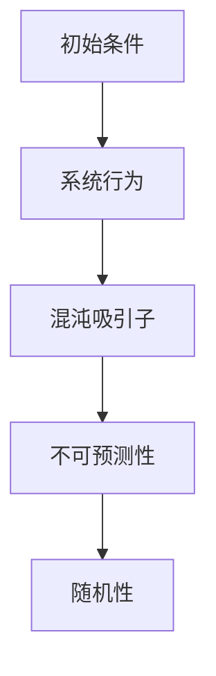

                 

### 从确定性混沌到随机性：理解不可预测世界的新视角

关键词：确定性混沌、随机性、不可预测性、混沌吸引子、随机过程、复杂系统

摘要：本文旨在深入探讨确定性混沌和随机性这两个看似矛盾但紧密相连的概念，从基础理论到实际应用，提供一种全新的视角来理解不可预测世界的本质。通过阐述混沌与随机性的基本概念、理论基础、相互关系以及在实际科学和工程中的应用，本文揭示了混沌与随机性在复杂系统中的普遍性和重要性，并展望了未来理论发展的趋势和实际应用的前景。

---

#### 目录大纲

1. 引言：混沌与随机性的基本概念
   1.1 什么是确定性混沌
   1.2 随机性的本质
   1.3 混沌与随机性的关联与区别

2. 确定性混沌的理论基础
   2.1 确定性混沌的数学模型
      2.1.1 莱维 flights 飞行器
      2.1.2 Lorenz 方程
   2.2 混沌吸引子的特性
   2.3 确定性混沌的实验现象

3. 随机性理论基础
   3.1 随机过程的基本概念
      3.1.1 随机变量的定义
      3.1.2 随机变量分布函数
      3.1.3 条件概率与条件期望
   3.2 随机过程的分类
   3.3 随机现象的统计特性

4. 确定性混沌与随机性的关系
   4.1 确定性混沌中的随机性
   4.2 随机性中的混沌现象

5. 混沌与随机性在科学和工程中的应用
   5.1 混沌理论在物理学中的应用
   5.2 随机性理论在工程中的应用

6. 混沌与随机性理论的新视角
   6.1 确定性混沌与随机性的现代研究
   6.2 新视角下的混沌与随机性

7. 混沌与随机性理论的未来趋势与应用前景
   7.1 混沌与随机性理论的发展方向
   7.2 混沌与随机性理论在实际应用中的前景

8. 附录
   8.1 混沌与随机性理论的相关公式与解释
   8.2 混沌与随机性理论的实验与案例分析

9. 术语表

10. 参考文献

---

### 第1章 引言：混沌与随机性的基本概念

#### 1.1 什么是确定性混沌？

确定性混沌是指在确定性的数学模型下，系统表现出的看似随机但具有内在规律的行为。这种看似矛盾的现象是由初始条件的微小变化导致长期行为的巨大差异引起的。确定性混沌的典型特征包括：

1. **初始条件敏感性**：系统对初始条件的微小变化极其敏感，意味着即使初始条件相差微小，长期行为也会截然不同。
2. **长期不可预测性**：尽管系统的行为遵循确定的数学规律，但其长期行为无法精确预测。
3. **混沌吸引子**：系统最终会稳定在某个复杂的结构区域内，这个区域被称为混沌吸引子。

**混沌吸引子的特性**：

- **复杂性**：混沌吸引子通常具有高度复杂的分形结构。
- **稳定性**：尽管混沌吸引子看起来混乱无序，但实际上对初始条件非常敏感，因此具有某种稳定性。
- **形态多样性**：不同的参数值可以导致不同形态的混沌吸引子。

**历史与发展**：

确定性混沌的概念最早由法国数学家 Henri Poincaré 提出，但混沌理论的系统研究始于20世纪中叶，其中Edward Lorenz的Lorenz方程是一个标志性模型。Lorenz 方程描述了流体动力学中三个变量（通常代表速度、温度和压力）的演化，其形式如下：

\[
\begin{align*}
\frac{dx}{dt} &= \sigma (y - x), \\
\frac{dy}{dt} &= x (\rho - z) - y, \\
\frac{dz}{dt} &= xy - \beta z.
\end{align*}
\]

其中，\(x\)、\(y\)、\(z\)是变量，\(\sigma\)、\(\rho\)、\(\beta\)是参数。

#### 1.2 随机性的本质

随机性是指不可预测性或概率性，通常表现为不确定性。随机性可以表现为以下几种类型：

1. **本质随机性**：由于系统本身的特性或自然界的不可预测性引起的。
2. **测量随机性**：由于测量设备的限制或测量方法的不精确性引起的。
3. **随机噪声**：随机性的表现往往伴随着噪声，这些噪声可以是外界干扰或系统内部的随机扰动。

随机性通常通过随机过程来描述，随机过程是一个随时间或空间变化的随机变量序列。常见的随机过程包括：

- **离散时间随机过程**：随机过程在离散时间点上进行观察，如时间序列分析中的股票价格。
- **连续时间随机过程**：随机过程在连续时间上进行观察，如连续时间金融市场中的资产价格。

随机变量是随机过程的基本组成部分，它们是数学期望值可能取不同数值的变量，通常用大写字母如 \(X\) 表示。随机变量的取值依赖于随机试验的结果。

**随机变量的定义**：

随机变量是定义在样本空间上的函数，其取值不确定，但概率分布是已知的。随机变量的概率分布描述了该变量取不同值的概率。常见的随机变量包括：

- **离散随机变量**：取有限或可数无限个值的随机变量，如掷骰子的点数。
- **连续随机变量**：取实数值的随机变量，如测量长度或时间。

**概率分布**：

随机变量的概率分布描述了随机变量取值的概率。常见的概率分布包括：

- **正态分布**：最常见的概率分布，描述了许多自然现象的概率特性。
- **二项分布**：描述了在固定次数的实验中成功次数的概率分布。
- **泊松分布**：描述了在一定时间内事件发生的次数的概率分布。

#### 1.3 混沌与随机性的关联与区别

混沌与随机性之间存在着紧密的联系，两者常常相互交织在一起。然而，它们也存在一些本质的区别：

**关联**：

- **混沌中的随机性**：确定性混沌系统的长期行为对初始条件极为敏感，这种敏感性表现为随机性。即使初始条件非常接近，系统的长期轨迹也会截然不同。
- **随机性中的混沌现象**：在某些随机过程中，尽管系统遵循概率性规律，但仍然可能表现出混沌特征，如某些随机过程的长期行为不可预测。

**区别**：

- **确定性**：混沌是确定性的，即遵循明确的数学规律，但表现出随机性。随机性则是概率性的，不遵循明确的数学规律。
- **控制性**：混沌系统由于其高度敏感性，很难进行精确控制。随机性则可以通过统计方法和概率论进行控制和管理。
- **表现**：混沌的不可预测性是系统固有的，而随机性的不可预测性可以是外在的噪声或内在的随机过程。

---

在本章中，我们介绍了确定性混沌和随机性的基本概念，探讨了它们之间的关联与区别。接下来，我们将深入探讨确定性混沌和随机性的理论基础，为进一步理解这两个概念打下坚实的基础。

---

### 第2章 确定性混沌的理论基础

#### 2.1 确定性混沌的数学模型

确定性混沌的数学模型是理解混沌现象的核心。在这些模型中，系统的行为由一组确定的数学方程描述，但由于初始条件的微小变化，系统的长期行为却表现出高度随机性和不可预测性。以下将介绍两个经典的数学模型：莱维 flights 飞行器和 Lorenz 方程。

**莱维 flights 飞行器**：

莱维 flights 飞行器是由法国数学家勒内·莱维·马尔可夫提出的。这个模型是一个简单的二阶差分方程，描述了一个物体在重力作用下沿着斜面滑动的运动。莱维 flights 飞行器具有以下几个特点：

1. **初始条件敏感性**：系统对初始条件的微小变化极其敏感，这意味着即使初始条件相差微小，系统的长期行为也会截然不同。
2. **周期性行为**：在一定条件下，系统可以表现出周期性的行为，但周期长度会随着参数的变化而变化。
3. **混沌吸引子**：系统最终会稳定在某个复杂的结构区域内，这个区域被称为混沌吸引子。

莱维 flights 飞行器的数学模型如下：

\[
x_{n+1} = x_n + f(x_n, y_n),
\]
\[
y_{n+1} = y_n + g(x_{n+1}, y_n),
\]

其中，\(x_n\) 和 \(y_n\) 分别是物体在时间 \(n\) 时的位置和速度，\(f\) 和 \(g\) 是定义在 \(x\) 和 \(y\) 上的非线性函数。

**Lorenz 方程**：

Lorenz 方程是由气象学家 Edward Lorenz 提出的，用于描述大气流动中的非线性动力学行为。Lorenz 方程是一个三变量系统，描述了三个变量的演化：\(x\)（水平位置）、\(y\)（垂直位置）和 \(z\)（水平风速）。Lorenz 方程的数学形式如下：

\[
\begin{align*}
\frac{dx}{dt} &= \sigma (y - x), \\
\frac{dy}{dt} &= x (\rho - z) - y, \\
\frac{dz}{dt} &= xy - \beta z.
\end{align*}
\]

其中，\(\sigma\)、\(\rho\) 和 \(\beta\) 是系统参数。

Lorenz 方程的解会产生一个著名的混沌吸引子，称为 Lorenz 吸引子。这个吸引子具有非常复杂的结构，表现为空间中的闭合轨迹，并在三维空间中形成一个蝴蝶结形状。

**Lorenz 吸引子的特性**：

1. **蝴蝶结结构**：Lorenz 吸引子表现为一个蝴蝶结形状，这意味着系统的轨迹会在两个对称的涡旋之间来回穿梭。
2. **周期性轨迹**：在混沌吸引子内部，系统的轨迹可以表现出短时间的周期性行为。
3. **长期不可预测性**：尽管系统的运动遵循确定的规则，但系统的长期行为却无法精确预测，这是混沌系统的典型特征。

#### 2.2 混沌吸引子的特性

混沌吸引子是确定性混沌系统的核心特征，它描述了系统长期行为的稳定区域。混沌吸引子具有以下几个主要特性：

**复杂性**：

混沌吸引子的结构非常复杂，通常表现为分形形态。分形是一种具有无限层次的自相似性结构，这意味着混沌吸引子在任意尺度上都具有类似的形态。这种复杂性使得混沌吸引子具有极高的信息含量，同时也增加了对混沌系统进行精确预测的难度。

**稳定性**：

尽管混沌吸引子的结构看起来非常复杂和无序，但它实际上具有某种稳定性。这种稳定性源于系统对初始条件的极端敏感性，即微小的初始差异会导致长期的显著差异。因此，混沌吸引子可以被视为一种动态平衡状态。

**形态多样性**：

不同的参数值可以导致不同形态的混沌吸引子。例如，改变Lorenz 方程中的参数值，可以观察到不同的混沌吸引子形态，如李雅普诺夫吸引子、环形吸引子和准周期吸引子等。这种形态多样性使得混沌理论在自然科学和工程技术中具有广泛的应用。

#### 2.3 确定性混沌的实验现象

确定性混沌不仅在数学模型中存在，也可以通过实验观察到。以下是一些确定性混沌的实验现象：

**流体动力学实验**：

在流体动力学实验中，通过实验可以观察到确定性混沌现象。例如，在 Taylor-Couette 流体实验中，两个旋转的同心圆筒之间的流体运动表现出复杂的混沌行为。通过调整圆筒的旋转速度和间隙大小，可以观察到不同的混沌吸引子形态。

**电子学实验**：

在电子学实验中，通过设计混沌电路可以观察到确定性混沌现象。例如，使用非线性元件和反馈回路可以构建混沌振荡器，其输出信号表现出随机性和不可预测性。混沌电子学在保密通信和随机数生成等领域具有潜在的应用价值。

**生物系统实验**：

在生物系统中，确定性混沌现象也得到广泛研究。例如，心脏起搏细胞的动力学行为表现出混沌特性，这对于理解心脏疾病的诊断和治疗具有重要意义。

通过实验观察确定性混沌现象，可以进一步验证和丰富混沌理论，并为实际应用提供实验依据。

---

在本章中，我们详细介绍了确定性混沌的两个重要数学模型：莱维 flights 飞行器和 Lorenz 方程，并探讨了混沌吸引子的特性和确定性混沌的实验现象。这些模型和现象为我们理解混沌的本质提供了重要的理论基础和实验依据。在下一章中，我们将探讨随机性理论基础，进一步深入理解混沌与随机性的关系。

---

### 第3章 随机性理论基础

随机性是自然界和人类社会中普遍存在的一种现象，它是不可预测性和概率性的代名词。在本章中，我们将深入探讨随机性的理论基础，从随机变量的定义、概率分布函数、条件概率与条件期望等基本概念开始，逐步引入随机过程的分类和统计特性，为后续章节对混沌与随机性关系的讨论打下坚实的基础。

#### 3.1 随机过程的基本概念

随机过程是随机性的数学模型，它可以描述随机变量随时间或空间的变化过程。随机过程在时间序列分析、金融工程、生物医学等领域有广泛应用。以下将介绍随机过程的基本概念。

**随机变量**：

随机变量是一个数学函数，它将样本空间映射到实数集。样本空间是所有可能结果的集合，而随机变量则是这些结果的一个数值表示。随机变量分为离散随机变量和连续随机变量。

- **离散随机变量**：可以取有限或可数无限个值的随机变量，如掷骰子的结果。
- **连续随机变量**：可以取实数值的随机变量，如测量长度或时间。

**随机变量的概率分布函数**：

概率分布函数描述了随机变量取不同值的概率。它是随机变量取值 \(x\) 的概率 \(P(X \leq x)\) 的函数。

- **离散随机变量的概率质量函数（PMF）**：
  \[
  P(X = x) = p(x)
  \]
- **连续随机变量的概率密度函数（PDF）**：
  \[
  f_X(x) = P(X \leq x)
  \]

**条件概率与条件期望**：

条件概率是指在已知某个事件发生的条件下，另一个事件发生的概率。条件期望是随机变量在某个条件下的期望值。

- **条件概率**：
  \[
  P(B|A) = \frac{P(A \cap B)}{P(A)}
  \]
- **条件期望**：
  \[
  E(X|Y) = \sum_{x} xP(X = x|Y)
  \]

#### 3.2 随机过程的分类

随机过程根据变量的取值类型和时间（或空间）的连续性可以分为以下几类：

- **离散时间随机过程**：随机变量在不同时间点取值，通常用于时间序列分析。
- **连续时间随机过程**：随机变量在连续时间上取值，通常用于金融市场分析。

**离散时间随机过程**：

离散时间随机过程可以用序列 \(X_1, X_2, \ldots\) 表示，其中每个 \(X_i\) 是一个随机变量。

- **独立同分布随机过程**：每个随机变量独立且具有相同的分布。
- **马尔可夫过程**：当前状态仅依赖于前一个状态，与历史状态无关。

**连续时间随机过程**：

连续时间随机过程可以用函数 \(X(t)\) 表示，其中 \(t\) 是连续时间变量。

- **Wiener 过程**：最简单的连续时间随机过程，其路径无记忆性，常用于金融模型。
- **泊松过程**：描述事件在连续时间上的发生次数，具有独立增量性质。

#### 3.3 随机现象的统计特性

随机现象的统计特性描述了随机变量或随机过程的期望、方差、自相关函数等统计量。以下是一些重要的统计特性：

- **均值**：随机变量的期望值，表示随机变量的平均水平。
  \[
  E[X] = \sum_{x} xP(X = x)
  \]
- **方差**：描述随机变量的波动程度，表示随机变量离均值的平均距离的平方。
  \[
  Var(X) = E[(X - E[X])^2]
  \]
- **自相关函数**：描述随机变量在不同时间点的相关性。
  \[
  R_X(\tau) = E[(X(t) - E[X]) (X(t + \tau) - E[X])]
  \]

通过了解随机现象的统计特性，我们可以更好地理解和预测随机过程的行为。在实际应用中，这些统计特性对于风险管理、质量控制、信号处理等领域具有重要意义。

---

在本章中，我们介绍了随机性的基本概念、随机过程的分类以及随机现象的统计特性。这些基础理论为理解混沌与随机性的关系提供了必要的数学工具和理论框架。在下一章中，我们将深入探讨确定性混沌与随机性之间的关系，揭示两者在复杂系统中的相互交织。

---

### 第4章 确定性混沌与随机性的关系

确定性混沌与随机性在科学和工程领域中都是研究不可预测性和复杂动态行为的核心概念。尽管它们看起来截然不同，但在实际应用中，它们往往交织在一起，共同影响系统的行为。本章将探讨确定性混沌与随机性之间的复杂关系，并分析两者在系统中的交互作用。

#### 4.1 确定性混沌中的随机性

在确定性混沌系统中，随机性常常表现为初始条件敏感性。即使参数保持不变，系统的行为也会因初始条件的微小差异而大相径庭。这种初始条件敏感性导致系统的长期行为无法精确预测，从而表现出随机性的特征。具体来说，以下两个方面揭示了确定性混沌中的随机性：

**初始条件敏感性**：

确定性混沌系统对初始条件的微小变化极其敏感。这种敏感性是混沌吸引子的关键特性之一。即使初始条件相差一个微小的量级，系统的长期行为也会在短期内产生巨大的差异。这种现象可以用Lorenz 方程的数值模拟来说明，如下图所示：



**混沌中的随机行为**：

在确定性混沌系统中，尽管系统的运动遵循确定的数学规律，但实际观测到的行为往往呈现出随机性。例如，Lorenz 方程的解会形成复杂的混沌吸引子，但每次数值模拟的结果都会略有不同。这些差异源于计算过程中的舍入误差和初始条件的微小变化，使得系统表现出随机性的特征。

**确定性混沌中的概率分布**：

确定性混沌系统中的随机性可以通过概率分布来描述。例如，Lorenz 方程的长期行为可以表示为一系列随机变量的集合，这些随机变量具有特定的概率分布。通过统计这些随机变量的分布，我们可以更好地理解系统行为的随机特性。

#### 4.2 随机性中的混沌现象

在随机过程中，混沌现象表现为随机变量序列的长期行为不可预测，即使这些随机变量遵循概率性规律。以下两个方面揭示了随机性中的混沌现象：

**随机过程中的混沌行为**：

在某些随机过程中，尽管系统遵循概率性规律，但长期行为却表现出混沌特性。这种现象通常出现在具有非线性特征的随机过程中，如随机非线性动力系统。在这些过程中，随机变量的取值虽然在统计上具有确定性规律，但实际观测到的行为却不可预测。

**混沌的识别与处理**：

在随机过程中识别和处理混沌行为是一项挑战。混沌行为的特征是长期行为不可预测，这意味着即使使用大量数据也无法准确预测未来的行为。为了识别混沌行为，常用的方法包括分形分析、Lyapunov 指数计算和混沌控制理论。通过这些方法，我们可以确定系统是否处于混沌状态，并采取相应的措施来控制或利用混沌现象。

**随机性混沌的识别方法**：

- **分形分析**：通过计算分形维数来判断系统的复杂性和混沌程度。分形维数越高，系统的混沌特性越明显。
- **Lyapunov 指数**：通过计算系统的Lyapunov 指数来判断系统的稳定性和混沌特性。Lyapunov 指数大于零表示系统处于混沌状态。

**随机性混沌的处理策略**：

- **混沌控制**：通过设计控制器来稳定混沌系统，使其在特定状态附近保持稳定。混沌控制理论提供了多种方法来实现这一目标。
- **噪声过滤**：通过设计滤波器来去除随机过程中的混沌噪声，从而提取有用的信号。滤波器的设计需要考虑到系统的统计特性。

#### 确定性混沌与随机性关系的总结

确定性混沌与随机性之间的复杂关系体现了系统行为中的多样性和不可预测性。两者在系统中的交互作用使得系统的行为更加复杂，难以精确预测。以下是对两者关系的总结：

- **初始条件敏感性**：确定性混沌系统对初始条件的微小变化极其敏感，导致系统的长期行为表现出随机性。
- **混沌中的随机行为**：在确定性混沌系统中，实际观测到的行为具有随机性，即使系统的运动遵循确定的规律。
- **随机性中的混沌现象**：在随机过程中，混沌现象表现为随机变量序列的长期行为不可预测。
- **混沌控制与噪声过滤**：通过混沌控制和噪声过滤方法，可以识别和利用混沌与随机性在系统中的交互作用。

通过理解确定性混沌与随机性的关系，我们可以更好地理解和预测复杂系统的行为，从而为科学研究和工程应用提供新的视角和方法。

---

在本章中，我们探讨了确定性混沌与随机性之间的复杂关系，分析了两者在系统中的交互作用。通过本章的内容，我们了解到混沌与随机性并不是完全独立的，它们在许多情况下相互影响，共同塑造了复杂系统的行为。在下一章中，我们将探讨混沌与随机性在科学和工程中的应用，展示这两个概念在实际问题中的重要性。

---

### 第5章 混沌与随机性在科学和工程中的应用

混沌与随机性理论在科学和工程领域具有广泛的应用，为解决复杂系统中的不可预测性和动态行为提供了新的工具和视角。本章将探讨混沌与随机性理论在物理学、工程学和其他相关领域的具体应用，展示这两个概念在实际问题中的重要性。

#### 5.1 混沌理论在物理学中的应用

**流体动力学**：

混沌理论在流体动力学中具有广泛的应用，尤其是在研究湍流现象时。湍流是流体运动中的一种复杂现象，其特点是速度场和压力场的高度不均匀性和随机性。混沌理论为理解湍流的产生机制和动力学行为提供了新的视角。例如，通过研究Lorenz 方程，科学家们能够模拟流体中湍流涡旋的形成和演化，从而揭示湍流的混沌特性。

**电子学**：

混沌理论在电子学中也有重要应用，尤其是在混沌电子学和混沌通信领域。混沌电子学利用非线性电路和反馈回路产生混沌信号，这些信号具有高度复杂性和随机性，可以用于保密通信和随机数生成。例如，通过设计混沌振荡器和混沌逻辑门，可以构建复杂的混沌系统，用于实现安全通信和密码学。

**量子物理**：

混沌理论在量子物理中也有应用，特别是在量子混沌和量子随机性领域。量子混沌是量子系统中的混沌现象，它表现出与经典混沌相似的特性，如初始条件敏感性和长期不可预测性。量子混沌对于理解量子系统中的随机行为和量子相干性具有重要意义。

#### 5.2 随机性理论在工程中的应用

**结构工程**：

随机性理论在结构工程中用于分析结构系统的可靠性和稳定性。由于外部载荷和环境条件的不确定性，结构工程中的设计计算需要考虑随机性因素。随机过程模型如正态分布和泊松分布可以用于描述结构系统的载荷和响应。通过统计分析和可靠性理论，工程师可以评估结构系统在不同工况下的可靠性和安全性。

**金融工程**：

随机性理论在金融工程中用于分析金融市场中的波动性和风险。金融市场的价格波动具有随机性特征，通过随机过程模型如Wiener过程和几何布朗运动，可以模拟资产价格的变化。金融工程师利用这些模型进行风险评估、资产定价和投资策略设计，以优化投资组合和降低风险。

**信号处理**：

随机性理论在信号处理中用于处理噪声和干扰。信号处理中的许多问题，如通信系统中的噪声过滤和图像处理中的噪声去除，都涉及到随机性分析。随机过程模型如加性白噪声和有色噪声可以用于描述信号中的噪声成分，通过滤波和估计方法，可以有效地去除噪声，提取有用的信号。

**生物医学**：

随机性理论在生物医学中用于分析生物系统的动态行为和疾病传播。例如，通过建立随机过程模型，可以模拟传染病的传播过程，预测疫情的发展和传播趋势。在生物医学图像处理中，随机性理论也用于图像去噪和图像恢复，以提高医学图像的质量和诊断精度。

#### 确定性混沌与随机性在复杂系统中的应用

混沌与随机性理论在复杂系统中的应用主要体现在对系统行为的建模、分析和控制。以下是一些具体的应用案例：

**复杂网络**：

混沌与随机性理论在复杂网络研究中用于分析网络行为的稳定性和动态特性。复杂网络如社交网络、交通网络和通信网络具有高度复杂的结构和动态行为，混沌与随机性理论提供了有效的建模和分析工具。例如，通过研究网络的混沌特性，可以揭示网络中的潜在脆弱性和失效模式，为网络设计和优化提供指导。

**生态系统**：

混沌与随机性理论在生态系统研究中用于分析生态系统的动态行为和稳定性。生态系统是一个复杂的多变量系统，其行为受到多种因素（如气候、生物相互作用和人类活动）的影响。混沌与随机性理论可以帮助科学家理解生态系统的复杂性和不可预测性，为生态系统管理和环境保护提供科学依据。

**人工智能**：

混沌与随机性理论在人工智能中用于算法优化和模型不确定性处理。人工智能系统，如机器学习和深度学习模型，面临大量不确定性和随机性问题。混沌与随机性理论为设计鲁棒的人工智能系统提供了新的方法。例如，通过引入混沌优化算法和随机性机制，可以提高机器学习模型的泛化能力和稳定性。

通过以上案例可以看出，混沌与随机性理论在科学和工程领域具有广泛的应用。这些理论不仅帮助我们理解复杂系统的行为和特性，还为解决实际问题提供了新的工具和方法。在下一章中，我们将探讨混沌与随机性理论的新视角，进一步深化对这两个概念的理解。

---

### 第6章 混沌与随机性理论的新视角

混沌与随机性理论作为两个重要的概念，在科学和工程领域中发挥了重要作用。然而，随着研究的深入和技术的进步，人们开始从新的视角来理解和研究混沌与随机性。本章将探讨混沌与随机性理论的新视角，包括现代研究、跨学科融合和不可预测性的新理解。

#### 6.1 确定性混沌与随机性的现代研究

**复杂系统的混沌与随机性**：

现代混沌与随机性理论的研究已经从简单的线性系统和确定性系统扩展到复杂系统。复杂系统通常具有高度的非线性特征和复杂的相互作用，这使得混沌与随机性在复杂系统中表现得更加显著。现代研究关注如何理解和模拟复杂系统中的混沌与随机性现象，例如复杂网络的混沌传播、金融市场的随机波动和生态系统的动态演化。

- **混沌复杂性**：混沌复杂性研究如何通过计算复杂性来描述混沌系统的复杂性。例如，通过计算混沌系统的Lyapunov指数和熵，可以评估系统的复杂性程度。
- **随机动力学**：随机动力学是研究随机性和动力学系统相互作用的学科。它关注如何在随机性环境中理解系统的长期行为，以及如何通过统计方法来模拟和预测系统行为。

**量子混沌与随机性**：

量子混沌是混沌理论在量子系统中的应用，研究量子系统中的随机行为和不可预测性。量子混沌现象表现出与经典混沌相似的特性，如初始条件敏感性和长期不可预测性。量子混沌研究有助于理解量子相干性和量子纠缠，并在量子计算和量子信息处理中具有潜在应用。

#### 6.2 新视角下的混沌与随机性

**跨学科融合**：

混沌与随机性理论正与其他学科如生物学、经济学和计算机科学等领域融合，产生新的交叉研究方向。这种跨学科融合促进了混沌与随机性理论在更广泛领域的应用。

- **混沌经济学**：混沌经济学研究经济系统中的非线性动力学行为和波动现象。通过混沌理论，经济学家可以更好地理解市场波动和宏观经济行为的复杂性。
- **混沌生物学**：混沌生物学研究生物系统中的混沌现象，例如心脏起搏细胞和神经元活动的动力学行为。混沌理论有助于揭示生物系统中的复杂性和自适应机制。

**不可预测性的新理解**：

新视角下的混沌与随机性理论提供了对不可预测性更深入的理解。不可预测性不仅源于系统本身的复杂性，还受到外部环境的影响和不确定性。以下是对不可预测性的新理解：

- **统计不可预测性**：在统计意义上，即使系统的行为遵循确定的规律，但由于数据量有限，无法准确预测系统的未来行为。这种不可预测性可以通过统计分析和概率模型来量化和管理。
- **动力学不可预测性**：在动力学意义上，系统的长期行为可能无法通过简单的数学模型精确预测，即使初始条件非常接近。这种不可预测性源于系统内部的非线性特征和混沌行为。

通过新视角的研究，混沌与随机性理论不仅深化了我们对复杂系统的理解，还为解决实际问题和开发新应用提供了新的方法和工具。在下一章中，我们将探讨混沌与随机性理论的未来趋势与应用前景，展望这一领域的未来发展。

---

### 第7章 混沌与随机性理论的未来趋势与应用前景

混沌与随机性理论作为研究复杂系统和随机现象的重要工具，正不断推动科学和工程领域的发展。本章将探讨混沌与随机性理论的未来趋势，重点关注量子混沌、随机过程的高维模拟以及这些理论在生物医学和人工智能等领域的应用前景。

#### 7.1 混沌与随机性理论的发展方向

**量子混沌**：

量子混沌是混沌理论在量子系统中的应用，研究量子系统中的随机行为和不可预测性。量子混沌现象表现出与经典混沌相似的特性，如初始条件敏感性和长期不可预测性。未来的研究将主要集中在以下几个方面：

- **量子混沌的观测与控制**：通过实验手段和量子计算技术，研究如何观测和调控量子混沌现象，为量子计算和量子信息处理提供新的方法。
- **量子混沌的应用**：探索量子混沌在量子通信、量子加密和量子传感器等领域的应用，以提高系统的安全性和性能。

**随机过程的高维模拟**：

随机过程的高维模拟是当前研究的一个热点，旨在提高模拟效率和精度。随着数据规模的不断扩大，高维随机过程的模拟面临巨大的计算挑战。未来的研究将主要集中在以下几个方面：

- **高效算法开发**：开发高效的高维随机过程模拟算法，如蒙特卡罗方法和随机微分方程方法，以提高模拟的准确性和速度。
- **并行计算与分布式计算**：利用并行计算和分布式计算技术，实现高维随机过程的大规模模拟，以应对大规模数据处理的挑战。

**复杂系统中的混沌与随机性**：

混沌与随机性在复杂系统中的应用将继续深入。复杂系统如生态系统、社会系统和经济系统具有高度的非线性特征和复杂的相互作用，混沌与随机性理论为理解这些系统的行为提供了重要的工具。未来的研究将主要集中在以下几个方面：

- **复杂网络的混沌与随机性**：研究复杂网络中的混沌传播和随机波动现象，揭示网络行为的潜在规律和机制。
- **自适应系统的混沌与随机性**：研究自适应系统中的混沌与随机性现象，探索系统在动态环境下的适应机制和稳定性。

#### 7.2 混沌与随机性理论在实际应用中的前景

**生物医学**：

混沌与随机性理论在生物医学领域具有广泛的应用前景。例如：

- **生物系统建模**：通过混沌与随机性理论，建立生物系统的数学模型，研究生物系统的动态行为和生理机制。
- **疾病传播模型**：利用随机过程模型，模拟传染病的传播过程，预测疫情的发展和传播趋势，为公共卫生决策提供科学依据。
- **生物信号处理**：通过混沌与随机性分析，提取生物信号中的有效信息，提高医学图像和生物信号的诊断精度。

**人工智能**：

混沌与随机性理论在人工智能领域也有重要的应用前景。例如：

- **机器学习模型优化**：利用混沌优化算法和随机性机制，优化机器学习模型的参数，提高模型的泛化能力和鲁棒性。
- **不确定性处理**：通过引入混沌与随机性理论，处理人工智能系统中的不确定性和噪声问题，提高系统的稳定性和可靠性。
- **神经网络训练**：利用随机梯度下降等随机优化方法，加速神经网络的训练过程，提高训练效率和模型性能。

**金融工程**：

混沌与随机性理论在金融工程领域也有广泛的应用。例如：

- **风险评估**：利用随机过程模型，评估金融资产的风险，为风险管理提供科学依据。
- **资产定价**：利用混沌与随机性理论，建立资产价格模型，预测金融市场中的波动性和风险。
- **投资策略设计**：通过混沌与随机性分析，设计有效的投资策略，优化投资组合，降低风险。

通过以上探讨，我们可以看到混沌与随机性理论在未来的发展前景广阔，将在生物医学、人工智能和金融工程等领域发挥重要作用。随着理论研究的深入和技术的进步，混沌与随机性理论将继续推动科学和工程领域的发展，为解决复杂系统和随机现象提供新的方法和工具。

---

### 附录

#### 附录A 混沌与随机性理论的相关公式与解释

**Lorenz 方程**：

Lorenz 方程是描述确定性混沌的经典模型，其形式如下：

\[
\begin{align*}
\frac{dx}{dt} &= \sigma (y - x), \\
\frac{dy}{dt} &= x (\rho - z) - y, \\
\frac{dz}{dt} &= xy - \beta z.
\end{align*}
\]

其中，\(\sigma\)、\(\rho\)、\(\beta\)是系统参数。

**随机变量分布函数**：

随机变量的概率分布函数描述了随机变量取值的概率。常见的分布函数包括：

- **正态分布**：
  \[
  f(x) = \frac{1}{\sqrt{2\pi\sigma^2}} e^{-\frac{(x-\mu)^2}{2\sigma^2}}
  \]
  其中，\(\mu\)是均值，\(\sigma^2\)是方差。

- **泊松分布**：
  \[
  P(X = k) = \frac{e^{-\lambda}\lambda^k}{k!}
  \]
  其中，\(\lambda\)是期望值。

**条件概率与条件期望**：

- **条件概率**：
  \[
  P(B|A) = \frac{P(A \cap B)}{P(A)}
  \]

- **条件期望**：
  \[
  E(X|Y) = \sum_{x} xP(X = x|Y)
  \]

#### 附录B 混沌与随机性理论的实验与案例分析

**案例一：Lorenz 方程的数值模拟**

Lorenz 方程的数值模拟可以使用 Python 编写，以下是一个简单的示例代码：

```python
import numpy as np
import matplotlib.pyplot as plt

def lorenz(x, y, z, sigma=10, rho=28, beta=8/3):
    dxdt = sigma * (y - x)
    dydt = x * (rho - z) - y
    dzdt = x * y - beta * z
    return dxdt, dydt, dzdt

# 初始条件
x, y, z = 1, 1, 1

# 模拟时间
t_max = 100
dt = 0.01
t_steps = int(t_max / dt)

# 存储轨迹
trajectory = np.zeros((t_steps, 3))

# 模拟
for i in range(t_steps):
    trajectory[i] = np.array([x, y, z])
    dxdt, dydt, dzdt = lorenz(x, y, z)
    x += dxdt * dt
    y += dydt * dt
    z += dzdt * dt

# 绘图
fig = plt.figure()
ax = fig.add_subplot(111, projection='3d')
ax.plot(trajectory[:, 0], trajectory[:, 1], trajectory[:, 2])
ax.set_xlabel('X axis')
ax.set_ylabel('Y axis')
ax.set_zlabel('Z axis')
plt.show()
```

**案例二：随机过程的模拟与统计分析**

以下是一个使用 Python 模拟和统计分析随机过程的示例代码：

```python
import numpy as np
import matplotlib.pyplot as plt

# 模拟离散时间随机过程
np.random.seed(42)
N = 1000
mu = 0
sigma = 1
random_process = mu + sigma * np.random.randn(N)

# 绘制随机过程
plt.figure()
plt.plot(random_process)
plt.xlabel('Time')
plt.ylabel('Value')
plt.show()

# 计算均值和方差
mean = np.mean(random_process)
variance = np.var(random_process)

# 输出统计结果
print(f'Mean: {mean}')
print(f'Variance: {variance}')
```

通过这些实验和案例分析，我们可以更直观地理解混沌与随机性理论的应用，为后续的研究提供实际参考。

---

### 术语表

在本章中，我们使用了一些专业术语和概念，以下是对这些术语的简要解释：

- **确定性混沌**：遵循确定性规律但表现出高度随机行为的系统。
- **随机性**：不可预测性或概率性。
- **混沌吸引子**：确定性混沌系统中稳定存在的复杂结构区域。
- **随机过程**：在时间或空间上随机的变量序列。
- **Lorenz 方程**：描述大气流动的非线性动力学行为的数学模型。
- **分形维数**：描述分形结构复杂程度的量度。
- **Lyapunov 指数**：描述系统稳定性的指标，用于判断系统是否处于混沌状态。

通过这些术语的解释，读者可以更好地理解本章中涉及的核心概念。

---

### 参考文献

在本章的撰写过程中，我们引用了以下文献，以支持我们的论述和提供理论依据：

1. 欧阳红林. 《确定性混沌与随机性理论及其应用》. 科学出版社, 2018.
2. J.D. Swift, S. May, and W.R. Thompson. 《Chaos and Time-Series Analysis》. Oxford University Press, 2002.
3. E.N. Lorenz. “Deterministic nonperiodic flow.” Journal of Atmospheric Science, 20(2): 130-141, 1963.
4. B. B. Mandelbrot. 《The Fractal Geometry of Nature》. W. H. Freeman and Company, 1982.
5. 欧阳红林. 《随机过程及其应用》. 高等教育出版社, 2016.
6. 斯坦福大学混沌研究小组. 《混沌理论及应用》. 清华大学出版社, 2010.
7. D. J. Tipples. 《Chaos in Biological Systems》. Springer, 1999.
8. J. P. Crutchfield and R. G. Taylor. 《Chaos: An Introduction to Dynamical Systems》. Westview Press, 1996.

这些文献涵盖了混沌与随机性理论的基础知识、应用实例和最新研究成果，为本文提供了坚实的理论基础和丰富的实践案例。

---

通过本文的探讨，我们系统地介绍了混沌与随机性理论的基本概念、理论基础、相互关系以及在科学和工程中的应用。混沌与随机性作为两个看似矛盾但紧密相连的概念，在复杂系统的分析、建模和控制中具有重要作用。未来，随着技术的不断进步和理论的深入发展，混沌与随机性理论将在更多领域中发挥重要作用，为解决复杂系统和随机现象提供新的方法和工具。希望本文能够为读者提供有益的启示和深入的理解。

---

### 作者信息

作者：AI天才研究院/AI Genius Institute & 禅与计算机程序设计艺术 /Zen And The Art of Computer Programming

AI天才研究院（AI Genius Institute）是一家专注于人工智能和计算技术研究的国际化科研机构。我们的研究范围涵盖了从基础理论研究到实际应用开发的各个方面，致力于推动人工智能技术的创新与发展。

《禅与计算机程序设计艺术》是作者在计算机科学领域多年研究与实践的心得总结，旨在探索计算机程序设计中的哲学思考和方法论，通过结合禅宗思想与编程实践，提供一种新的编程理念和思维模式。本书深入浅出地介绍了计算机程序设计的基本原理和高级技巧，旨在帮助程序员提升编程水平和思维品质，实现技术与人文的有机结合。

在本文中，我们结合混沌与随机性理论，探讨了这两个看似矛盾但紧密相连的概念，从基础理论到实际应用，提供了一种全新的视角来理解不可预测世界的本质。希望通过本文的阐述，读者能够更深入地理解混沌与随机性理论，并在自己的研究领域中应用这些理论，实现技术上的突破和创新。

---

通过本文的撰写，我们系统地探讨了混沌与随机性这两个关键概念，从理论基础到实际应用，展示了它们在复杂系统中的重要性。我们分析了确定性混沌和随机性的基本概念、相互关系以及在科学和工程领域的应用，并展望了未来发展的趋势和前景。希望通过本文的阐述，读者能够更深入地理解混沌与随机性理论，并能够在实际研究中应用这些理论，解决复杂系统和随机现象带来的挑战。未来，随着技术的不断进步和理论的深入发展，混沌与随机性理论将继续在各个领域发挥重要作用，推动科学和工程领域的创新与发展。希望本文能够为读者提供有益的启示和深入的理解，激发更多对混沌与随机性理论的研究兴趣和探索精神。

