                 

# 从经典信息论到量子信息：重新定义信息处理的基本原理

> **关键词：** 信息论，经典信息论，量子信息论，信息熵，量子比特，量子计算，量子通信

> **摘要：** 本文章将深入探讨从经典信息论到量子信息论的发展历程。首先，我们回顾经典信息论的基本概念、原理及其实际应用。随后，我们将介绍量子信息的概念、基本原理，以及量子信息论的核心公式。接着，文章将分析量子信息处理的基本原理，包括量子算法、量子比特与量子门、量子纠缠与量子纠错。此外，我们将探讨量子信息处理在实际应用中的案例，如量子密码学、量子传感与量子测量。最后，文章将展望量子信息处理的未来发展方向，并探讨其社会与伦理问题。通过本文的深入分析，我们希望能重新定义信息处理的基本原理，为读者提供对未来信息技术的清晰认知。

### 目录大纲：从经典信息论到量子信息：重新定义信息处理的基本原理

#### 第一部分：经典信息论基础

##### 第1章：信息论的基本概念与历史

##### 第2章：信息熵与信息论公式

##### 第3章：信息传输与信道

#### 第二部分：量子信息论基础

##### 第4章：量子信息的概念与基本原理

##### 第5章：量子熵与量子信息论公式

##### 第6章：量子信息处理的核心技术与实现

##### 第7章：量子信息处理的应用案例

#### 第三部分：量子信息处理的基本原理

##### 第8章：量子算法与量子计算

##### 第9章：量子信息处理的核心技术与实现

##### 第10章：量子信息处理的应用案例

#### 第四部分：展望与挑战

##### 第11章：量子信息处理的未来发展方向

##### 第12章：量子信息处理的社会与伦理问题

##### 第13章：附录：资源与工具

## 引言

信息是现代科技的核心，而信息论作为研究信息传输与处理的科学，对信息技术的发展起到了至关重要的作用。从经典的香农信息论到现代的量子信息论，信息论的研究不断推进，为我们的通信、计算和存储等领域带来了革命性的变革。本文将深入探讨从经典信息论到量子信息论的发展历程，重新定义信息处理的基本原理。

经典信息论由香农在20世纪40年代创立，其基本概念和原理为现代通信系统奠定了基础。香农通过引入熵、信道容量等概念，系统地阐述了信息传输的基本规律。然而，随着科技的进步，人们逐渐发现经典信息论在处理复杂系统时存在局限性。量子信息的出现，为信息论的研究开辟了新的方向。量子信息论结合了量子力学的基本原理，提出了全新的信息处理方式，为量子计算、量子通信等领域的发展提供了理论基础。

本文将首先回顾经典信息论的基本概念和原理，分析其在通信系统和数据压缩中的应用。接着，我们将介绍量子信息的概念和基本原理，探讨量子比特、量子纠缠等核心概念，并阐述量子信息论的核心公式。随后，文章将深入分析量子信息处理的基本原理，包括量子算法、量子比特与量子门、量子纠缠与量子纠错。通过实际应用案例，我们将展示量子信息处理在密码学、传感和计算等领域的应用。最后，文章将展望量子信息处理的未来发展方向，并探讨其社会与伦理问题。通过本文的深入分析，我们希望能为读者提供一个全面、系统的量子信息处理知识体系，重新定义信息处理的基本原理。

#### 第一部分：经典信息论基础

经典信息论是信息科学和通信理论的基础，由香农（Claude Shannon）在20世纪40年代创立。香农的信息论研究不仅奠定了现代通信理论的基础，还推动了计算机科学、控制理论等众多领域的发展。在这一部分中，我们将深入探讨经典信息论的基本概念、原理及其在信息传输、信道容量和编码理论中的应用。

### 第1章：信息论的基本概念与历史

#### 1.1 信息论概述

信息论是研究信息传输和处理规律的学科，其核心是研究信息在系统中的传输、变换和利用。香农的信息论可以看作是通信系统理论的一个分支，旨在解决如何在有噪声的信道中有效传输信息的问题。

#### 1.2 基本原理

经典信息论的核心概念包括信息、熵、信道、信息传输模型和信道容量。

- **信息**：信息是描述不确定性的减少。香农将信息定义为某种随机事件发生的概率的对数。

- **熵**：熵是衡量信息不确定性的量度。香农引入了熵的概念，将熵定义为随机变量不确定性的度量。

- **信道**：信道是信息传输的物理通道，可以是电缆、光纤、无线电波等。

- **信息传输模型**：香农提出了经典的信息传输模型，包括信源、信道、信宿和编码器、译码器。

- **信道容量**：信道容量是信道能够达到的最大传输速率，是信息论中的一个关键概念。

#### 1.3 信息论的历史与发展

香农的信息论研究始于20世纪40年代，当时的通信系统面临着严重的噪声干扰问题。香农通过建立数学模型，提出了信源编码和信道编码理论，为通信系统的设计提供了重要的理论基础。

1950年代，香农的信息论思想得到了广泛应用，成为现代通信系统设计的基础。信息论的研究也在不断发展，许多学者对其基本原理进行了拓展和深化。

#### 1.4 信息论的主要贡献者

- **Claude Shannon**：香农是信息论的奠基人，他的工作奠定了现代信息论的基础。

- **Claude Shannon and Warren Weaver**：他们的合著《信息论基础》是信息论的经典之作，对信息论的理论和应用进行了深入阐述。

- **John von Neumann**：他在信息论的发展中也做出了重要贡献，提出了信息熵的概念。

#### 1.5 信息论的基本概念与联系

为了更好地理解信息论的基本概念，我们可以借助以下 Mermaid 流程图来梳理信息论的核心架构：

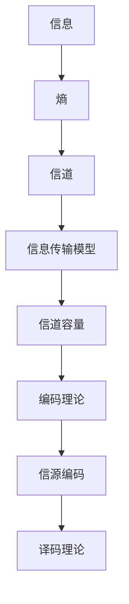

该流程图展示了信息论的核心概念及其相互关系。通过该流程图，我们可以清晰地看到信息从信源生成，通过信道传输，到达信宿的过程，以及在这个过程中涉及到的各种理论和方法。

### 第2章：信息熵与信息论公式

#### 2.1 信息熵的定义与计算

信息熵是信息论中的一个核心概念，它量化了随机变量所包含的信息量。香农在《信息论基础》中首次提出了信息熵的概念。

- **信息熵的概念**：信息熵是衡量随机变量不确定性的量度，反映了随机变量平均信息量的多少。

- **信息熵的计算公式**：香农使用了对数函数来定义信息熵，公式如下：

  $$ H(X) = -\sum_{i=1}^{n} p(x_i) \log_2 p(x_i) $$

  其中，$H(X)$ 是随机变量 $X$ 的熵，$p(x_i)$ 是 $X$ 取第 $i$ 个值的概率。

  $$ \log_2 p(x_i) $$ 是第 $i$ 个值的信息量，负号使得熵的值总是非负的。

- **熵的几何解释**：信息熵可以看作是概率分布的分散程度。当随机变量的概率分布均匀时，熵取最大值；当概率分布集中时，熵取最小值。

#### 2.2 信息论公式与变体

在经典信息论中，除了香农熵，还有一些重要的信息量，包括相对熵、互信息等。

- **相对熵（KL散度）**：相对熵是衡量两个概率分布差异的量度。其定义如下：

  $$ D(P||Q) = \sum_{i=1}^{n} p(x_i) \log_2 \frac{p(x_i)}{q(x_i)} $$

  其中，$P$ 和 $Q$ 是两个概率分布，$D(P||Q)$ 表示 $P$ 对 $Q$ 的相对熵。

- **互信息**：互信息是衡量两个随机变量之间相关性的量度。其定义如下：

  $$ I(X;Y) = H(X) - H(X|Y) $$

  其中，$I(X;Y)$ 是 $X$ 和 $Y$ 之间的互信息，$H(X)$ 是 $X$ 的熵，$H(X|Y)$ 是在已知 $Y$ 条件下 $X$ 的熵。

  互信息可以解释为由于知道 $Y$ 而减少的关于 $X$ 的不确定性。

#### 2.3 信息论在实际应用中的案例分析

- **数据压缩**：信息熵在数据压缩中有着广泛的应用。通过计算数据中各个符号的概率分布，可以设计出最优的编码方案，从而实现高效的数据压缩。

- **通信系统**：在通信系统中，信息熵用于评估信道的容量。通过优化编码方案，可以在有噪声的信道中实现高效的信息传输。

以下是一个简单的信息熵计算案例：

假设有一个二进制随机变量 $X$，其概率分布如下：

| X | 0 | 1 |
| --- | --- | --- |
| P(X) | 0.6 | 0.4 |

计算 $X$ 的熵：

$$ H(X) = - (0.6 \log_2 0.6 + 0.4 \log_2 0.4) \approx 0.918 $$

该计算结果表明，随机变量 $X$ 包含约0.918比特的信息。

通过上述分析，我们可以看到信息熵在信息论中的核心地位，以及其在实际应用中的重要性。在接下来的章节中，我们将进一步探讨信息论的其他基本原理，如信息传输与信道、编码理论等。

### 第3章：信息传输与信道

信息传输是信息论的核心研究内容之一，旨在研究如何在有噪声的信道中实现高效的信息传输。在这一章中，我们将深入探讨信息传输的基本原理，包括信源与信道、信息传输模型和信道容量的概念。

#### 3.1 信源与信道

信源是信息产生的源头，可以是自然现象、物理过程或人的主观感受。在通信系统中，信源通常是一个随机过程，产生一系列随机变量。信道是信息传输的物理通道，可以是电缆、光纤、无线电波等。信道的特性对信息传输的质量有着重要影响。

- **信源**：信源可以是离散的，也可以是连续的。在离散信源中，每个输出都是有限个符号中的一个。在连续信源中，每个输出可以取无限多个值。

- **信道**：信道可以分为有噪声信道和无噪声信道。在有噪声信道中，信息在传输过程中会受到干扰，导致信息失真。无噪声信道假设信息在传输过程中不受干扰，是一个理想化的模型。

#### 3.2 信息传输模型

香农提出了经典的信息传输模型，包括信源、信道、编码器、译码器和信宿。该模型描述了信息从信源生成，通过信道传输，最终到达信宿的全过程。

- **信源**：信源生成随机变量序列，每个变量可以是离散的或连续的。

- **编码器**：编码器将信源生成的随机变量序列转换为适合在信道中传输的信号。编码的目的是提高传输效率和抗干扰能力。

- **信道**：信道是信息传输的物理通道，可能受到噪声干扰。

- **译码器**：译码器对接收到的信号进行解码，恢复出信源原始的信息序列。

- **信宿**：信宿是信息的接收者，可以是人、机器或其他系统。

以下是一个简单的信息传输模型 Mermaid 流程图：

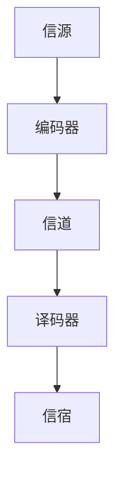

#### 3.3 信道容量与编码理论

信道容量是信道能够达到的最大传输速率，是信息论中的一个关键概念。香农通过引入信道容量，提出了一种计算信道容量的方法，即香农公式。

- **信道容量**：信道容量 $C$ 是指在有噪声的信道中，能够达到的最大传输速率，单位为比特每秒（bps）。

  $$ C = B \log_2 (1 + \text{信号功率/噪声功率}) $$

  其中，$B$ 是信道的带宽，信号功率与噪声功率之比称为信噪比（Signal-to-Noise Ratio，SNR）。

- **香农公式**：香农公式描述了信道容量与带宽、信噪比之间的关系。该公式表明，在给定的带宽和信噪比下，信道容量是有限的。然而，通过优化编码方案，可以在一定程度上提高传输速率。

  $$ C = B \log_2 (1 + \text{SNR}) $$

- **编码理论**：编码理论是信息论的一个重要分支，研究如何设计有效的编码方案，以提高信息传输的可靠性和效率。编码理论包括前向纠错编码（Forward Error Correction，FEC）和错误检测编码（Error Detection，ED）等方法。

以下是一个简单的编码理论 Mermaid 流程图：

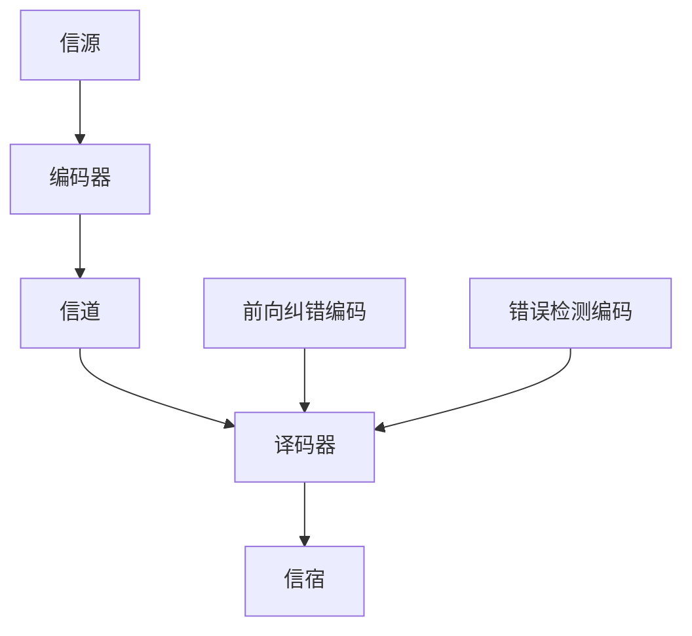

通过上述分析，我们可以看到信息传输与信道在信息论中的重要性。在接下来的章节中，我们将继续探讨信息熵与信息论公式，以及它们在实际应用中的案例分析。

### 第二部分：量子信息论基础

随着经典信息论的不断发展，研究者们逐渐发现，经典信息论在处理某些复杂系统时存在局限性。量子信息的出现，为信息论的研究提供了新的视角和理论框架。量子信息论基于量子力学的基本原理，提出了许多与传统信息论不同的概念和理论。在这一部分中，我们将深入探讨量子信息的概念与基本原理，量子比特与经典比特的区别，量子纠缠以及量子信息传输的基本原理。

#### 第4章：量子信息的概念与基本原理

量子信息是量子力学和信息科学的交叉领域，其核心思想是将量子系统的性质用于信息处理和通信。量子信息的概念起源于对量子力学基本原理的深入理解，包括量子叠加、量子纠缠和量子测量等。

- **量子信息概述**：量子信息研究如何利用量子比特（qubits）存储、处理和传输信息。量子比特是量子力学中的基本单元，可以同时处于多种状态，这赋予了量子比特强大的计算和传输能力。

- **量子比特与经典比特**：经典比特（bits）是二进制的基本单位，只能处于0或1的两种状态。而量子比特（qubits）可以同时处于多种状态的叠加，这被称为量子叠加态。例如，一个量子比特可以同时处于0和1的状态，这可以表示为：

  $$ \psi = \alpha|0\rangle + \beta|1\rangle $$

  其中，$|0\rangle$ 和 $|1\rangle$ 分别表示量子比特的基态，$\alpha$ 和 $\beta$ 是复数概率幅，满足 $|\alpha|^2 + |\beta|^2 = 1$。

- **量子纠缠**：量子纠缠是量子信息中的一个关键概念，指的是两个或多个量子系统之间的特殊相关性。当两个量子系统发生纠缠后，它们的状态不能独立描述，而是相互依赖的。纠缠态的一个显著特点是，对一个量子系统进行测量，可以立即影响到与之纠缠的另一个量子系统的状态。

  例如，两个量子比特处于一个纠缠态：

  $$ \psi = \frac{1}{\sqrt{2}} (|01\rangle + |10\rangle) $$

  如果对第一个量子比特进行测量，得到状态 $|0\rangle$，那么第二个量子比特将立即塌缩到状态 $|1\rangle$。

- **量子态与测量**：量子态是量子系统的整体状态，由波函数描述。量子测量是一个特殊的过程，它会导致量子态的坍缩。在测量之前，量子系统处于多种状态的叠加，测量后，系统将塌缩到其中一个确定的状态。

以下是一个简单的量子信息概念 Mermaid 流程图：

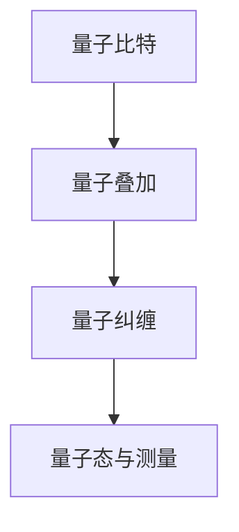

通过上述分析，我们可以看到量子信息的基本概念和原理，以及量子比特与经典比特之间的区别。在接下来的章节中，我们将继续探讨量子信息论的基本原理，包括量子熵、量子信息论公式等。

### 第5章：量子熵与量子信息论公式

量子熵是量子信息论中的一个核心概念，用于量化量子系统的信息含量。量子熵不仅扩展了经典信息熵的概念，还揭示了量子系统特有的信息属性。在本章中，我们将详细探讨量子熵的定义与计算，以及量子信息论中的关键公式。

#### 5.1 量子熵的定义与计算

量子熵是衡量量子系统不确定性的一种量度。它不仅考虑了量子系统的内部结构，还反映了量子态的复杂性和混乱程度。量子熵的定义与经典熵有所不同，它依赖于量子态的密度矩阵。

- **量子熵的概念**：量子熵是描述量子系统内部不确定性的一种量度，类似于经典信息论中的熵。量子熵反映了量子系统状态的混乱程度和复杂性。

- **量子熵的计算公式**：量子熵通常用 von Neumann 熵来表示，其定义如下：

  $$ S(\rho) = -\text{Tr}(\rho \log_2 \rho) $$

  其中，$\rho$ 是量子系统的密度矩阵，$\text{Tr}$ 是迹运算。对于有限维量子系统，密度矩阵是一个 $d \times d$ 的矩阵，$d$ 是量子系统的维度。

  $$ \rho = \sum_{i=1}^{d} p_i |i\rangle\langle i| $$

  其中，$p_i$ 是量子态 $|i\rangle$ 的概率幅平方，$|i\rangle$ 是量子系统的基态。

  对于一个纯量子态，即没有混合态的量子态，其 von Neumann 熵等于其相干性熵，即：

  $$ S(\rho) = -\sum_{i=1}^{d} p_i \log_2 p_i $$

  其中，$p_i$ 是量子态 $|i\rangle$ 的概率幅平方。

- **量子熵的几何解释**：量子熵可以看作是量子态在希尔伯特空间中的“混乱程度”。在几何上，量子熵与量子态在希尔伯特空间中的分布有关。当量子态完全确定时，量子熵为零；当量子态完全不确定时，量子熵达到最大值。

#### 5.2 量子信息论公式与解释

量子信息论中有几个关键公式，这些公式揭示了量子信息处理的基本规律。以下是对这些公式的详细解释：

- **量子信道**：量子信道是一个映射，它将一个量子态映射到另一个量子态。量子信道可以用量子信道映射 $\mathcal{E}$ 来描述：

  $$ \mathcal{E}(\rho) = \sum_{i,j} E_i \rho E_j^\dagger $$

  其中，$\rho$ 是输入量子态，$E_i$ 是量子信道的操作符，$E_j^\dagger$ 是其共轭转置。

  量子信道的通道容量是一个重要的概念，它表示在量子信道中能够达到的最大传输速率。量子信道的通道容量可以通过以下公式计算：

  $$ C(\mathcal{E}) = \max_{p(\rho)} I(\rho; \mathcal{E}(\rho)) $$

  其中，$I(\rho; \mathcal{E}(\rho))$ 是输入量子态与输出量子态之间的互信息。

- **量子编码**：量子编码是量子信息处理的一个重要方面，它旨在将经典信息编码到量子态中，以实现量子信息的可靠传输。量子编码通常使用量子码本，即一组量子态，来表示经典信息。

  一个简单的量子编码方案如下：

  $$ \text{编码}(x) = \sum_{i} x_i |i\rangle $$

  其中，$x$ 是经典信息，$|i\rangle$ 是量子码本中的量子态。

  量子解码是在接收端进行的操作，它旨在从接收到的量子态中恢复出原始经典信息。

- **量子纠缠**：量子纠缠是量子信息中的一个关键特性，它使得量子系统之间可以建立强大的相关性。量子纠缠态可以通过量子态的线性组合来描述：

  $$ \psi = \sum_{i,j} a_{ij} |i\rangle|j\rangle $$

  其中，$a_{ij}$ 是纠缠系数。

  量子纠缠在量子计算和量子通信中具有重要作用。例如，量子纠缠态可以用于实现量子密钥分发，增强量子计算的速度和效率。

#### 5.3 量子信息论在实际应用中的案例分析

量子信息论在实际应用中有着广泛的应用，以下是一些具体的案例：

- **量子密码学**：量子密码学利用量子纠缠态和量子态的不可克隆性来实现安全的通信。量子密钥分发（Quantum Key Distribution，QKD）是一个典型的量子密码学应用。在QKD中，发送方和接收方通过量子信道交换量子态，利用量子纠缠态测量和经典通信来生成共享密钥。

  以下是一个简单的量子密钥分发流程图：

  ```mermaid
  graph TD
  A[发送方] --> B[量子态生成]
  B --> C[量子态传输]
  C --> D[接收方]
  D --> E[量子态测量]
  E --> F[经典通信]
  F --> G[共享密钥]
  ```

- **量子计算**：量子计算利用量子比特和量子算法来处理复杂问题。量子算法如Shor算法和Grover算法，展示了量子计算在因子分解和搜索问题上的优越性。

  以下是一个简单的量子算法伪代码示例：

  ```python
  # 量子快速排序算法伪代码
  function QuantumQuickSort(qubits, n):
      if n <= 1:
          return qubits
      pivot = QuantumRegister(1)
      left = QuantumRegister(n-1)
      right = QuantumRegister(n-1)
      for i in range(n):
          if |qubits[i]| > |pivot|:
              |pivot| = |qubits[i]|
              |qubits[i]| = |0|
      for i in range(n):
          if |qubits[i]| > |pivot|:
              |qubits[i]| = |left|
          else:
              |qubits[i]| = |right|
      left = QuantumQuickSort(left, n-1)
      right = QuantumQuickSort(right, n-1)
      return Concatenate(left, pivot, right)
  ```

通过上述分析，我们可以看到量子熵和量子信息论公式的核心地位以及它们在实际应用中的重要性。量子信息论不仅扩展了经典信息论的概念，还为量子计算、量子通信和量子密码学等领域的发展提供了理论基础。在接下来的章节中，我们将继续探讨量子信息处理的基本原理，包括量子算法、量子比特与量子门、量子纠缠与量子纠错等。

### 第6章：量子信息处理的核心技术与实现

量子信息处理是量子计算和量子通信的核心，它利用量子比特和量子纠缠等量子力学原理来处理和传输信息。在这一章中，我们将深入探讨量子信息处理的核心技术，包括量子比特、量子门、量子纠缠和量子纠错。

#### 6.1 量子比特与量子门

量子比特（qubits）是量子信息处理的基本单元，与经典比特不同，量子比特可以处于叠加态和纠缠态。量子比特的叠加态允许量子计算机在处理多个输入时并行计算，这是经典计算机无法实现的。

- **量子比特的定义**：量子比特是量子信息处理的基本单元，它可以同时处于0和1的状态，这种状态称为叠加态。一个量子比特可以表示为：

  $$ \psi = \alpha|0\rangle + \beta|1\rangle $$

  其中，$|0\rangle$ 和 $|1\rangle$ 是量子比特的基态，$\alpha$ 和 $\beta$ 是复数概率幅，满足 $|\alpha|^2 + |\beta|^2 = 1$。

- **量子门**：量子门是量子计算中的基本操作，类似于经典计算机中的逻辑门。量子门对量子比特进行操作，可以改变量子比特的状态。常见的量子门包括Hadamard门、Pauli门和 Controlled-NOT（CNOT）门等。

  - **Hadamard门**：Hadamard门是一个单位ary量子门，用于将一个量子比特的状态从基态 $|0\rangle$ 或 $|1\rangle$ 变换为叠加态。其作用如下：

    $$ H|0\rangle = \frac{1}{\sqrt{2}} (|0\rangle + |1\rangle) $$
    $$ H|1\rangle = \frac{1}{\sqrt{2}} (|0\rangle - |1\rangle) $$

  - **Pauli门**：Pauli门是作用在单个量子比特上的二元量子门，包括X门、Y门和Z门。X门是翻转量子比特的状态，Y门和Z门分别旋转量子比特在复数平面上的Y轴和Z轴。

    $$ X|0\rangle = |1\rangle $$
    $$ X|1\rangle = |0\rangle $$
    $$ Y|0\rangle = i|1\rangle $$
    $$ Y|1\rangle = -i|0\rangle $$
    $$ Z|0\rangle = |0\rangle $$
    $$ Z|1\rangle = -|0\rangle $$

  - **CNOT门**：CNOT门是一个二ary量子门，它作用于两个量子比特。CNOT门将第一个量子比特的状态翻转，条件是第二个量子比特处于基态 $|0\rangle$。其作用如下：

    $$ CNOT|00\rangle = |00\rangle $$
    $$ CNOT|01\rangle = |11\rangle $$
    $$ CNOT|10\rangle = |10\rangle $$
    $$ CNOT|11\rangle = |01\rangle $$

以下是一个简单的量子比特和量子门 Mermaid 流程图：

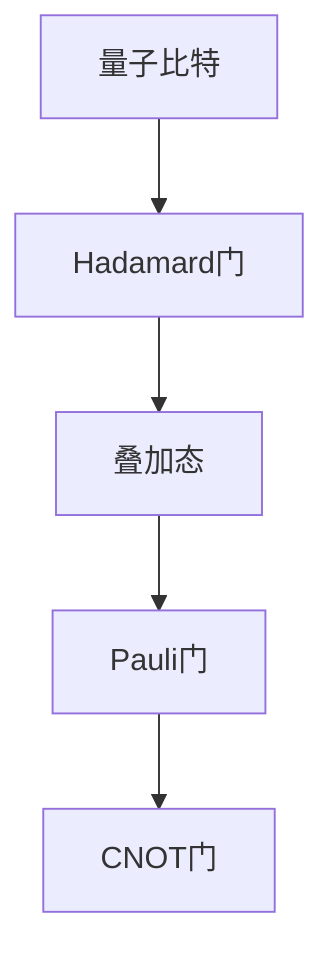

#### 6.2 量子纠缠与量子纠错

量子纠缠是量子信息处理中的一个关键特性，它使得量子比特之间可以建立强大的相关性。量子纠缠态可以用于量子计算和量子通信中的多种应用，但同时也增加了量子系统的脆弱性。量子纠错是一种保护量子信息的方法，用于检测和纠正量子信息传输过程中的错误。

- **量子纠缠**：量子纠缠是指两个或多个量子系统之间的特殊相关性。当两个量子系统发生纠缠后，它们的状态不能独立描述，而是相互依赖的。纠缠态的一个显著特点是，对一个量子系统进行测量，可以立即影响到与之纠缠的另一个量子系统的状态。

  例如，两个量子比特处于一个纠缠态：

  $$ \psi = \frac{1}{\sqrt{2}} (|00\rangle + |11\rangle) $$

  如果对第一个量子比特进行测量，得到状态 $|0\rangle$，那么第二个量子比特将立即塌缩到状态 $|1\rangle$。

- **量子纠错**：量子纠错是一种保护量子信息的方法，用于检测和纠正量子信息传输过程中的错误。量子纠错码是一种特殊的量子码本，用于编码量子信息，增加其容错能力。常见的量子纠错码包括Shor码和Steane码。

  量子纠错码的基本思想是将经典纠错码扩展到量子系统。例如，Shor码可以将一个量子比特编码为九个量子比特，从而增加信息传输的容错能力。

以下是一个简单的量子纠缠和量子纠错 Mermaid 流程图：

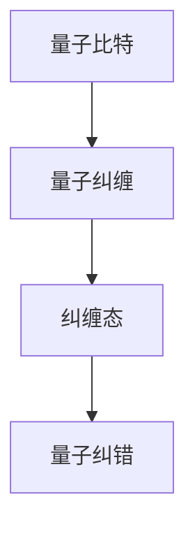

通过上述分析，我们可以看到量子比特、量子门、量子纠缠和量子纠错在量子信息处理中的核心地位。这些技术不仅扩展了经典信息处理的能力，还为量子计算、量子通信和量子密码学等领域的发展提供了基础。在接下来的章节中，我们将继续探讨量子信息处理在实际应用中的案例分析，展示量子信息处理的强大潜力和广泛应用。

#### 6.3 量子信息处理在实际应用中的案例分析

量子信息处理技术的进步为各个领域带来了革命性的变化。在本节中，我们将探讨几个实际应用的案例，展示量子信息处理在量子计算、量子通信、量子密码学等领域的应用。

##### 案例一：量子密码学

量子密码学利用量子力学原理来实现高度安全的通信。一个典型的案例是量子密钥分发（Quantum Key Distribution，QKD）。QKD利用量子纠缠态和量子态的不可克隆性来生成共享密钥。以下是一个简单的QKD实现过程：

1. **量子态生成**：发送方（Alice）生成一对纠缠态的量子比特，并将其中的一个量子比特发送给接收方（Bob）。

2. **量子态传输**：Bob接收到量子比特后，对它们进行测量。如果两者处于纠缠态，测量结果将是一致的。

3. **经典通信**：Alice和Bob使用经典通信（如电话）交换测量结果，并根据这些结果生成共享密钥。

4. **密钥验证**：Alice和Bob可以随机选择一些密钥位进行验证，以确保密钥的完整性和安全性。

以下是一个简化的QKD伪代码：

```python
# QKD实现伪代码
def QKD():
    # Alice生成纠缠态
    qbit_pair = GenerateEntangledQubits()

    # Alice发送量子比特给Bob
    Bob_bit = qbit_pair[1]

    # Bob测量量子比特
    Bob_measure = MeasureQubit(Bob_bit)

    # Alice和Bob交换测量结果
    Alice_result = GetMeasurementResult()

    # Alice和Bob生成共享密钥
    if Alice_result == Bob_measure:
        shared_key = GenerateKey(Alice_result)
    else:
        shared_key = None

    # 验证密钥
    if VerifyKey(shared_key):
        print("密钥验证成功")
    else:
        print("密钥验证失败")

# 测试QKD
QKD()
```

##### 案例二：量子计算

量子计算在处理复杂问题上具有显著优势。以下是一个简单的量子计算案例：使用量子快速排序算法（Quantum Quick Sort）来排序一个量子列表。

1. **初始化量子列表**：将待排序的量子列表编码到量子比特序列中。

2. **应用量子门**：使用Hadamard门将量子比特初始化为叠加态，然后应用量子快速排序算法。

3. **测量量子比特**：对排序后的量子比特进行测量，获得排序后的量子列表。

以下是一个简化的量子快速排序伪代码：

```python
# Quantum Quick Sort算法伪代码
function QuantumQuickSort(qubits):
    if Length(qubits) <= 1:
        return qubits
    pivot = RandomChoice(qubits)
    left = []
    right = []
    for qubit in qubits:
        if |qubit| > |pivot|:
            left.append(qubit)
        else:
            right.append(qubit)
    left_sorted = QuantumQuickSort(left)
    right_sorted = QuantumQuickSort(right)
    return Concatenate(left_sorted, pivot, right_sorted)

# 测试量子快速排序
sorted_qubits = QuantumQuickSort(qubits)
MeasureQubits(sorted_qubits)
```

##### 案例三：量子传感

量子传感利用量子态的灵敏性来提高测量精度。以下是一个简单的量子传感案例：使用量子态的叠加和纠缠来实现高精度的位置测量。

1. **量子态初始化**：生成一个量子态的叠加，用于表示待测量的位置。

2. **量子态传输**：将量子态传输到测量设备。

3. **量子态测量**：测量量子态，获得位置信息。

以下是一个简化的量子传感伪代码：

```python
# Quantum Sensing算法伪代码
def QuantumSensing(position):
    # 初始化量子态
    quantum_state = InitializeState()

    # 量子态传输
    quantum_device = TransferStateToDevice(quantum_state, position)

    # 测量量子态
    measurement_result = MeasureState(quantum_device)

    return measurement_result

# 测试量子传感
position = QuantumSensing(position)
print("测量到的位置：", position)
```

通过上述案例分析，我们可以看到量子信息处理在多个领域中的应用潜力。量子密码学实现了高度安全的通信，量子计算提升了复杂问题的求解能力，量子传感提高了测量的精度。在接下来的章节中，我们将继续探讨量子信息处理的基本原理，包括量子算法、量子比特与量子门、量子纠缠与量子纠错等。

### 第三部分：量子信息处理的基本原理

量子信息处理是现代信息技术的前沿领域，它基于量子力学的基本原理，如量子比特、量子纠缠、量子门等。在这一部分中，我们将深入探讨量子信息处理的基本原理，包括量子算法、量子比特与量子门、量子纠缠与量子纠错，以及它们在量子计算和量子通信中的应用。

#### 第7章：量子算法与量子计算

量子算法是利用量子比特和量子门来求解特定问题的算法。量子算法与传统算法相比，具有显著的优势，特别是在处理某些复杂问题时。以下是一些典型的量子算法和它们的原理：

##### 7.1 量子算法概述

量子算法可以分为两类：量子确定性算法和量子随机算法。

- **量子确定性算法**：这类算法总是能够给出正确的结果，但通常需要使用大量的量子比特和量子门。典型的量子确定性算法包括Shor算法和Grover算法。

- **量子随机算法**：这类算法通常使用较少的量子比特，但可能需要多次执行以获得正确的结果。量子随机算法的一个例子是量子抽样算法。

##### 7.2 量子算法的典型例子

- **Shor算法**：Shor算法是一个用于求解整数分解的量子算法。其核心思想是将整数分解问题转换为阶数问题。Shor算法利用量子叠加态和量子纠缠态，通过量子傅里叶变换（Quantum Fourier Transform，QFT）实现高效的阶数估计。以下是Shor算法的伪代码：

  ```python
  # Shor算法伪代码
  def Shor(n):
      # 初始化量子比特和量子态
      quantum_state = InitializeSuperposition(n)
      
      # 应用量子门
      ApplyQuantumGates(quantum_state)
      
      # 量子傅里叶变换
      quantum_state = QuantumFourierTransform(quantum_state)
      
      # 测量量子比特
      result = MeasureQuantumBits(quantum_state)
      
      # 估计阶数
      order = FindOrder(result, n)
      
      # 分解整数
      factor1 = FindFactor(order, n)
      factor2 = n / factor1
      
      return (factor1, factor2)
  ```

- **Grover算法**：Grover算法是一个用于搜索未排序数据库的量子算法。其核心思想是通过量子叠加态和量子门来加速搜索过程。Grover算法的伪代码如下：

  ```python
  # Grover算法伪代码
  def Grover(search_db, target):
      # 初始化量子比特和量子态
      quantum_state = InitializeSuperposition(len(search_db))
      
      # 应用Grover迭代
      for _ in range(len(search_db)):
          ApplyQuantumGates(quantum_state, target)
          quantum_state = QuantumControlledZ(quantum_state)
      
      # 测量量子比特
      result = MeasureQuantumBits(quantum_state)
      
      return search_db[result]
  ```

##### 7.3 量子计算与经典计算的对比

量子计算与经典计算在多个方面存在显著差异：

- **并行性**：量子计算可以利用量子叠加态实现并行计算，从而在处理大规模问题时具有显著优势。

- **量子速度优势**：某些问题在量子计算机上求解的速度远超经典计算机。例如，Shor算法在量子计算机上求解整数分解的速度远超经典计算机。

- **资源需求**：量子计算通常需要大量的量子比特和量子门，同时需要精确的量子控制技术。

以下是一个简化的量子计算与经典计算对比 Mermaid 流程图：

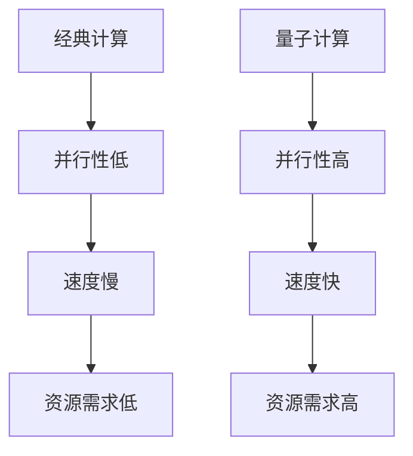

#### 第8章：量子比特与量子门

量子比特和量子门是量子信息处理的核心组成部分。量子比特是量子信息处理的基本单元，而量子门是量子比特操作的基本工具。

##### 8.1 量子比特的定义与操作

量子比特（qubits）是量子信息处理的基本单元，它可以同时处于0和1的状态，这种状态称为叠加态。量子比特的操作包括初始化、叠加、测量等。

- **量子比特的初始化**：量子比特可以初始化为基态 $|0\rangle$ 或 $|1\rangle$，也可以初始化为叠加态。

  ```python
  # 量子比特初始化伪代码
  def InitializeQubit(state):
      if state == "0":
          return |0\rangle
      elif state == "1":
          return |1\rangle
      else:
          return HadamardGate() * |0\rangle + |1\rangle
  ```

- **量子比特的叠加**：量子比特可以通过Hadamard门实现叠加。

  ```python
  # 量子比特叠加伪代码
  def SuperposeQubit(qubit):
      return HadamardGate()(qubit)
  ```

- **量子比特的测量**：量子比特可以通过测量获得其基态概率分布。

  ```python
  # 量子比特测量伪代码
  def MeasureQubit(qubit):
      result = RandomChoice([0, 1])
      if result == 0:
          return |0\rangle
      else:
          return |1\rangle
  ```

##### 8.2 量子门

量子门是量子比特操作的基本工具，类似于经典计算机中的逻辑门。常见的量子门包括Hadamard门、Pauli门、CNOT门等。

- **Hadamard门**：Hadamard门是一个单位ary量子门，用于将一个量子比特的状态从基态 $|0\rangle$ 或 $|1\rangle$ 变换为叠加态。

  ```python
  # Hadamard门伪代码
  def HadamardGate():
      return [[1/√2, 1/√2],
              [1/√2, -1/√2]]
  ```

- **Pauli门**：Pauli门是作用在单个量子比特上的二元量子门，包括X门、Y门和Z门。

  ```python
  # Pauli门伪代码
  def XGate():
      return [[0, 1],
              [1, 0]]

  def YGate():
      return [[0, -i],
              [i, 0]]

  def ZGate():
      return [[1, 0],
              [0, -1]]
  ```

- **CNOT门**：CNOT门是一个二ary量子门，它作用于两个量子比特。CNOT门将第一个量子比特的状态翻转，条件是第二个量子比特处于基态 $|0\rangle$。

  ```python
  # CNOT门伪代码
  def CNOTGate():
      return [[1, 0, 0, 0],
              [0, 1, 0, 0],
              [0, 0, 0, 1],
              [0, 0, 1, 0]]
  ```

##### 8.3 量子比特与量子门的实际应用

量子比特和量子门在量子计算和量子通信中有着广泛的应用。以下是一些实际应用的例子：

- **量子计算**：量子计算机利用量子比特和量子门来实现高效的计算。例如，Shor算法和Grover算法都需要大量的量子比特和复杂的量子门操作。

- **量子通信**：量子通信利用量子比特和量子纠缠来实现高度安全的通信。例如，量子密钥分发（QKD）利用量子比特的叠加和纠缠态来实现安全的密钥交换。

以下是一个简单的量子比特与量子门应用 Mermaid 流程图：

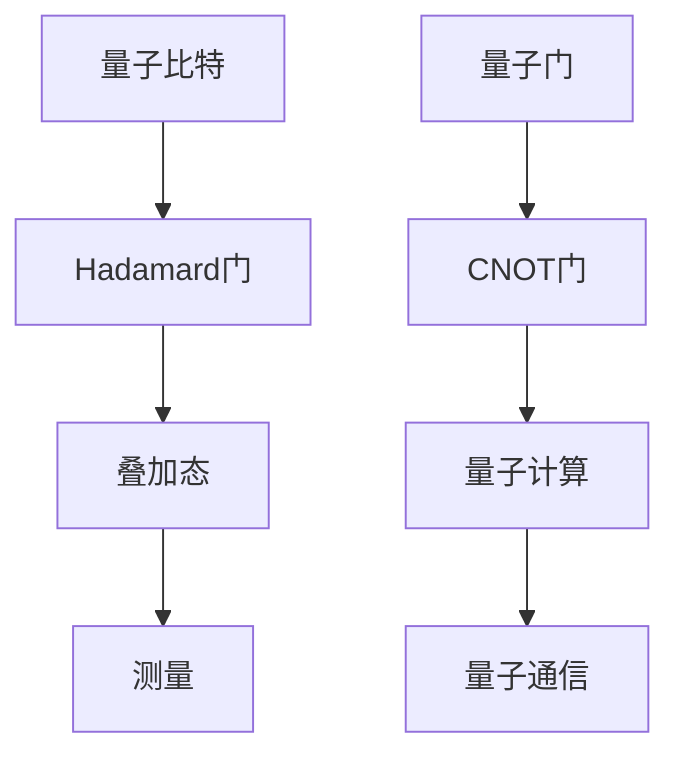

通过上述分析，我们可以看到量子比特、量子门和量子算法在量子信息处理中的核心地位。量子比特和量子门为量子计算和量子通信提供了基本工具，而量子算法则展示了量子信息处理的巨大潜力。在接下来的章节中，我们将继续探讨量子纠缠与量子纠错，以及量子信息处理在各个领域的应用。

### 第9章：量子纠缠与量子纠错

量子纠缠是量子信息处理中的一个核心特性，它使得量子比特之间可以建立强大的相关性。量子纠缠不仅在量子计算和量子通信中有着广泛的应用，还为量子信息处理提供了独特的优势。然而，量子纠缠也增加了量子系统的脆弱性，因此量子纠错成为量子信息处理中的关键问题。

#### 9.1 量子纠缠

量子纠缠是指两个或多个量子系统之间的特殊相关性，当量子系统发生纠缠后，它们的状态不能独立描述，而是相互依赖的。量子纠缠态的一个显著特点是，对一个量子系统进行测量，可以立即影响到与之纠缠的另一个量子系统的状态。

- **量子纠缠态**：量子纠缠态可以表示为两个或多个量子比特的线性组合。一个简单的量子纠缠态示例是贝尔态：

  $$ \psi = \frac{1}{\sqrt{2}} (|00\rangle + |11\rangle) $$

  如果对第一个量子比特进行测量，得到状态 $|0\rangle$，那么第二个量子比特将立即塌缩到状态 $|1\rangle$。

- **量子纠缠的应用**：量子纠缠在量子计算和量子通信中有着广泛的应用。例如，量子纠缠态可以用于实现量子密钥分发、量子隐形传态和量子计算中的并行性。

  以下是一个简单的量子纠缠应用 Mermaid 流程图：

  ```mermaid
  graph TD
  A[量子比特A] --> B[量子纠缠]
  B --> C[量子比特B]
  C --> D[测量]
  ```

#### 9.2 量子纠错

量子纠错是一种保护量子信息的方法，用于检测和纠正量子信息传输过程中的错误。由于量子系统的脆弱性，量子信息在传输过程中容易受到噪声和干扰，导致信息失真。量子纠错通过引入冗余信息和纠错码，增加了量子信息的容错能力。

- **量子纠错码**：量子纠错码是一种特殊的量子码本，用于编码量子信息，增加其容错能力。常见的量子纠错码包括Shor码和Steane码。

  - **Shor码**：Shor码将一个量子比特编码为九个量子比特，通过奇偶校验码和辅助量子比特实现纠错。Shor码的基本原理是将原始量子比特的状态扩展到多个量子比特，并通过测量奇偶校验码来检测错误。

  - **Steane码**：Steane码将一个量子比特编码为七个量子比特，通过特定的纠错操作实现纠错。Steane码使用逻辑量子比特和辅助量子比特来实现纠错。

- **量子纠错算法**：量子纠错算法包括错误检测和错误纠正两个步骤。在错误检测阶段，通过测量量子码本来检测错误。在错误纠正阶段，根据检测到的错误类型和位置，应用纠错操作来恢复原始量子比特的状态。

以下是一个简单的量子纠错伪代码：

```python
# Quantum Error Correction算法伪代码
def QuantumErrorCorrection(qubit):
    # 检测错误
    error_detected = DetectError(qubit)
    
    # 如果检测到错误，执行纠错
    if error_detected:
        # 根据错误类型和位置执行纠错
        CorrectError(qubit, error_detected)
        
    return qubit
```

#### 9.3 量子纠缠与量子纠错的实际应用

量子纠缠和量子纠错在量子计算、量子通信和量子传感等领域有着广泛的应用。

- **量子计算**：量子纠错是量子计算中的关键问题，它确保了量子计算过程中的信息可靠性和稳定性。例如，Shor算法和Grover算法都需要在纠错机制的支持下实现。

- **量子通信**：量子纠缠态在量子通信中有着广泛的应用，如量子密钥分发和量子隐形传态。量子纠错可以确保量子通信过程中的密钥传输安全性和可靠性。

- **量子传感**：量子纠缠态可以用于量子传感中的高精度测量，如量子态的精密测量和量子成像。量子纠错可以用于减少传感过程中的噪声和误差。

以下是一个简单的量子纠缠与量子纠错应用 Mermaid 流程图：

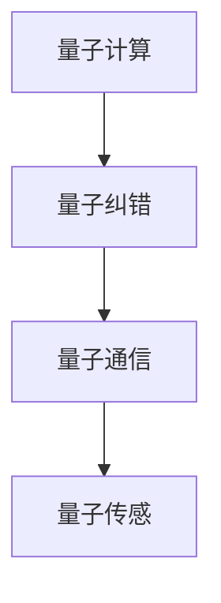

通过上述分析，我们可以看到量子纠缠和量子纠错在量子信息处理中的重要性。量子纠缠为量子计算和量子通信提供了强大的能力，而量子纠错则确保了量子信息处理过程中的可靠性和稳定性。在接下来的章节中，我们将继续探讨量子信息处理在各个领域的应用，以及未来的发展方向。

### 第10章：量子信息处理的应用案例

量子信息处理技术具有颠覆性潜力，已在多个领域展现了其独特的优势和广泛的应用前景。在这一章中，我们将详细探讨量子信息处理在量子密码学、量子传感和量子计算等领域的应用案例，展示量子技术的实际效益和未来发展趋势。

#### 10.1 量子密码学

量子密码学利用量子力学原理实现高度安全的通信。其中，量子密钥分发（Quantum Key Distribution，QKD）是量子密码学的一个重要应用。QKD通过量子纠缠态和量子态的不可克隆性来生成共享密钥，从而确保通信的绝对安全性。

**案例一：量子密钥分发（QKD）**

**应用场景**：QKD可用于政府、军事、金融等对信息安全要求极高的领域，确保信息传输的安全性。

**技术实现**：
1. **量子态生成**：发送方（Alice）生成一对纠缠态的量子比特，并将其中的一个量子比特发送给接收方（Bob）。
2. **量子态传输**：Bob接收到量子比特后，对它们进行测量。
3. **经典通信**：Alice和Bob使用经典通信交换测量结果，并根据这些结果生成共享密钥。
4. **密钥验证**：Alice和Bob可以随机选择一些密钥位进行验证，以确保密钥的完整性和安全性。

**效益与前景**：QKD能够实现绝对安全的通信，防止窃听和密码破解。随着量子通信技术的不断进步，QKD有望在各个领域得到广泛应用。

#### 10.2 量子传感

量子传感利用量子态的灵敏性和纠缠特性，实现高精度的物理量测量，如量子态的精密测量和量子成像。

**案例二：量子态精密测量**

**应用场景**：量子态精密测量在基础科学研究、医疗诊断、环境监测等领域具有广泛的应用。

**技术实现**：
1. **量子态初始化**：生成一个量子态的叠加，用于表示待测量的物理量。
2. **量子态传输**：将量子态传输到测量设备。
3. **量子态测量**：测量量子态，获得物理量信息。
4. **数据解析**：对测量结果进行分析和解析，获得高精度的物理量测量值。

**效益与前景**：量子态精密测量能够显著提高测量的精度和灵敏度，有助于解决传统测量方法难以克服的难题。随着量子传感技术的不断进步，其在各个领域的应用前景十分广阔。

#### 10.3 量子计算

量子计算利用量子比特和量子门实现高效的计算，尤其是在处理复杂问题上具有显著优势。量子计算在密码破解、药物设计、金融模型等领域展现出巨大的潜力。

**案例三：量子算法在密码破解中的应用**

**应用场景**：量子计算在密码破解领域具有颠覆性潜力，能够破解许多传统加密方法。

**技术实现**：
1. **量子态初始化**：生成一个量子态的叠加，用于表示待解的密码。
2. **量子门操作**：应用一系列量子门，对量子态进行操作。
3. **量子测量**：对量子态进行测量，获得密码信息。

**效益与前景**：量子计算能够实现高效的大规模数据处理和复杂问题求解，有望颠覆现有的加密体系。随着量子计算技术的不断进步，其在各个领域的应用前景十分广阔。

#### 10.4 量子图像处理

量子图像处理利用量子比特和量子门实现图像的压缩、增强和识别等操作，具有传统图像处理方法无法比拟的速度和精度。

**案例四：量子图像处理在医学成像中的应用**

**应用场景**：量子图像处理在医学成像领域具有广泛的应用，如X光、CT和MRI等。

**技术实现**：
1. **量子态初始化**：生成一个量子态的叠加，用于表示医学图像。
2. **量子门操作**：应用一系列量子门，对量子态进行图像增强、压缩和识别等操作。
3. **量子测量**：对量子态进行测量，获得处理后的医学图像。

**效益与前景**：量子图像处理能够显著提高医学成像的精度和速度，有助于早期疾病诊断和治疗。随着量子图像处理技术的不断进步，其在医学领域的应用前景十分广阔。

通过上述应用案例，我们可以看到量子信息处理在多个领域展现出的巨大潜力和实际效益。量子技术的不断发展将为未来信息技术带来革命性的变革。在接下来的章节中，我们将继续探讨量子信息处理的未来发展方向，以及面临的挑战和机遇。

### 第四部分：展望与挑战

随着量子信息处理的不断发展，我们正站在一个全新的技术前沿。在这一部分中，我们将深入探讨量子信息处理的未来发展方向，以及面临的挑战和机遇。

#### 11.1 量子计算机的发展趋势

量子计算机被认为是未来计算技术的革命性突破，其基于量子比特和量子门的工作原理，使得量子计算机在处理复杂问题上具有显著优势。未来量子计算机的发展趋势包括：

- **量子比特的稳定性和可扩展性**：当前量子计算机的量子比特数量有限，稳定性较差。未来发展的关键是提高量子比特的稳定性和可扩展性，以实现大规模量子计算。

- **量子纠错的改进**：量子纠错是量子计算机稳定运行的关键，未来将出现更加高效的量子纠错算法和纠错码，提高量子计算的可靠性。

- **量子软件与算法的发展**：量子软件和算法的发展是量子计算机实现实用化的关键。未来将出现更多高效的量子算法和量子软件工具，支持量子计算机在各个领域的应用。

- **量子计算机的商业化**：随着量子计算技术的不断进步，量子计算机有望在未来实现商业化，应用于金融、医疗、科学研究等领域。

以下是一个简单的量子计算机发展趋势 Mermaid 流�程图：

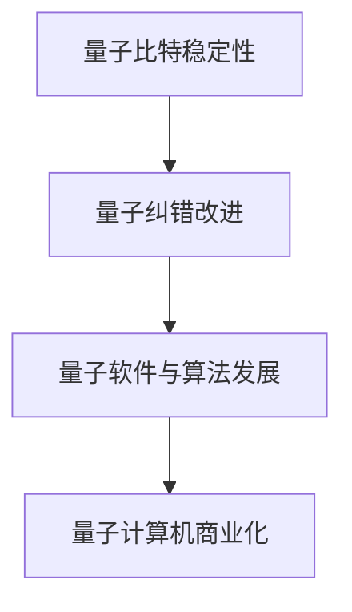

#### 11.2 量子通信与量子网络

量子通信和量子网络是量子信息处理的另一个重要发展方向。量子通信利用量子纠缠态和量子态的不可克隆性实现高度安全的通信，量子网络则通过量子态的传输和共享实现量子信息的传输和交换。

- **量子密钥分发**：量子密钥分发是量子通信的基础，未来将出现更多的量子密钥分发系统，支持大规模的量子通信网络。

- **量子态传输与共享**：量子态传输和共享是实现量子网络的关键技术。未来将出现更加高效的量子态传输和共享方法，支持全球范围内的量子通信网络。

- **量子中继与量子路由**：量子中继和量子路由是实现远距离量子通信的关键技术。未来将出现更多的量子中继器和量子路由器，支持量子网络的长距离传输和交换。

以下是一个简单的量子通信与量子网络发展 Mermaid 流程图：

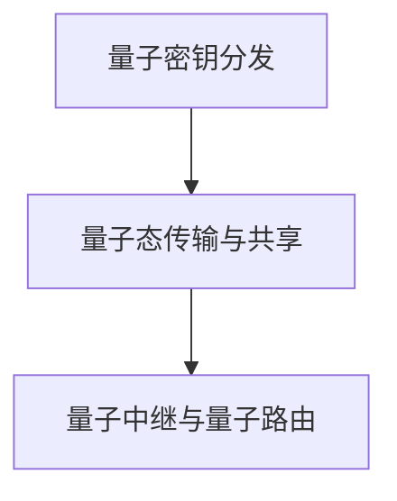

#### 11.3 量子信息处理在人工智能中的应用

量子信息处理在人工智能（AI）领域也展现出巨大的潜力。量子机器学习和量子优化算法是量子信息处理在AI领域的重要应用方向。

- **量子机器学习**：量子机器学习利用量子计算的优势，实现高效的数据处理和模式识别。未来将出现更多的量子机器学习算法和模型，支持复杂的AI应用。

- **量子优化算法**：量子优化算法利用量子计算的优势，实现高效的优化和求解。未来将出现更多的量子优化算法，支持复杂的问题求解和决策。

以下是一个简单的量子信息处理在AI领域应用 Mermaid 流程图：

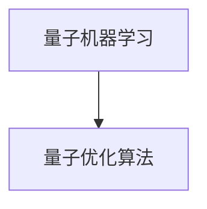

#### 11.4 量子信息处理的社会与伦理问题

随着量子信息处理的不断发展，社会和伦理问题也逐渐凸显。以下是一些重要的社会与伦理问题：

- **量子隐私与安全**：量子信息处理在隐私保护和信息安全方面具有重要意义，但同时也带来了一些新的隐私和安全挑战。未来需要制定相关的隐私和安全标准，确保量子技术的安全使用。

- **量子技术的社会责任**：量子技术的发展将对社会产生深远影响，包括经济、政治和军事等方面。未来需要关注量子技术的社会责任，确保其公平、合理和可持续发展。

- **国际合作与竞争**：量子技术的发展需要全球范围内的合作与竞争。未来需要建立国际合作机制，促进量子技术的研发和应用，同时保持技术竞争和平衡。

以下是一个简单的量子信息处理社会与伦理问题 Mermaid 流程图：

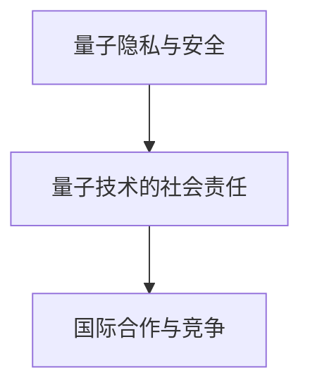

通过上述分析，我们可以看到量子信息处理的未来发展方向和面临的挑战。量子技术的发展将为人类社会带来前所未有的机遇，但同时也需要我们关注和解决相关的社会与伦理问题。在未来，量子信息处理将成为推动科技进步和社会发展的重要力量。

### 第12章：量子信息处理的社会与伦理问题

量子信息处理作为一门新兴技术，不仅在科技领域引发了广泛的关注，也对社会和伦理产生了深远的影响。在这一章中，我们将深入探讨量子信息处理在社会与伦理方面的重要问题，包括量子隐私与安全、量子技术的社会责任以及国际合作与竞争。

#### 12.1 量子隐私与安全

量子信息处理在信息安全领域带来了革命性的变革，特别是量子密码学和量子密钥分发（QKD）技术。QKD利用量子态的不可克隆性和纠缠特性，实现绝对安全的通信。然而，随着量子技术的发展，隐私与安全问题也日益突出。

- **量子隐私保护**：量子技术的应用，如量子密钥分发，能够提供高度安全的通信，防止窃听和密码破解。然而，量子技术的普及也带来了新的隐私挑战，如量子计算能力增强可能导致现有加密算法的失效。

- **量子安全通信**：量子安全通信需要建立完善的量子通信网络，确保量子密钥的安全分发和传输。这需要考虑量子信道的安全性、量子中继技术和量子路由等问题。

- **量子隐私法规**：随着量子技术的发展，需要制定相关的隐私保护法规，确保量子技术的合法、安全使用。这包括数据保护、用户隐私和信息安全等方面。

以下是一个简单的量子隐私保护 Mermaid 流程图：

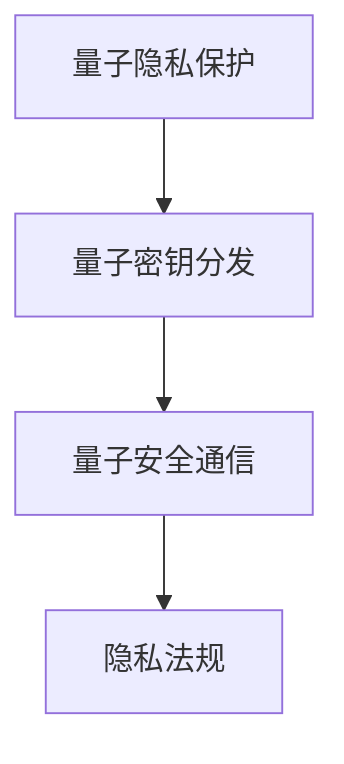

#### 12.2 量子技术的社会责任

量子技术的发展将对社会产生深远影响，涉及经济、政治、军事等多个领域。因此，量子技术的社会责任成为了一个重要议题。

- **经济影响**：量子技术的发展将带来新的产业和市场，推动经济增长。然而，也需要关注量子技术可能带来的就业变化和社会财富分配问题。

- **政治影响**：量子技术在国际竞争中具有重要地位，国家间的量子技术竞争可能影响国际政治格局。因此，量子技术的社会责任包括促进国际合作、维护国际和平与稳定。

- **军事应用**：量子技术在军事领域具有广泛的应用，如量子通信、量子密码学和量子传感等。因此，需要制定相应的伦理标准和规范，确保量子技术的合法、合理使用。

以下是一个简单的量子技术社会责任 Mermaid 流程图：

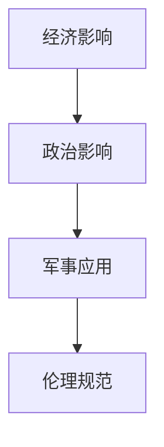

#### 12.3 国际合作与竞争

量子技术的发展是一个全球性的课题，需要各国共同努力。国际合作与竞争在量子技术发展中具有重要地位。

- **国际合作**：量子技术的发展需要全球范围内的合作，如量子通信网络的构建、量子计算资源的共享和国际科研合作等。通过国际合作，可以实现技术共享、资源优化和共同发展。

- **技术竞争**：量子技术作为未来科技的重要方向，各国纷纷投入大量资源进行研发。技术竞争有助于推动量子技术的快速发展，但也可能引发国际紧张局势。因此，需要建立合理的竞争机制，确保公平、有序的竞争环境。

以下是一个简单的国际合作与竞争 Mermaid 流程图：

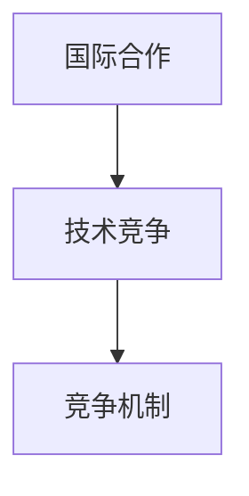

通过上述分析，我们可以看到量子信息处理在社会与伦理方面的重要问题。量子技术的发展不仅带来了机遇，也带来了挑战。在未来，我们需要关注和解决这些社会与伦理问题，确保量子技术的可持续发展和合理应用。在接下来的章节中，我们将总结全文，回顾量子信息处理的核心内容和发展趋势。

### 第13章：附录：资源与工具

为了更好地学习和研究量子信息处理，我们需要掌握一些相关的资源与工具。以下是一些推荐的量子信息处理教科书、开源平台和报告。

#### 附录 A：量子信息处理教科书推荐

1. **《量子计算与量子信息》（刘畅原 著）**：这是一本全面介绍量子计算和量子信息理论的入门教材，适合初学者阅读。

2. **《量子计算基础教程》（Michael A. Nielsen & Isaac L. Chuang 著）**：这是一本权威的量子计算教材，内容丰富，适合有一定物理背景的读者。

3. **《量子信息论》（Michael A. Nielsen & Berthold-Georg Englert 著）**：这本书详细介绍了量子信息论的基本概念和理论，包括量子熵、量子信道和量子编码等。

#### 附录 B：量子计算开源平台介绍

1. **Q#**：Q#是微软开发的量子编程语言，支持在Windows和Linux平台上进行量子计算编程。

2. **ProjectQ**：ProjectQ是一个开源的量子计算框架，支持Python编程语言，可用于实现量子算法和量子模拟。

3. **PyQuil**：PyQuil是Rigetti Computing开发的量子编程库，支持量子电路的编译和执行，适用于Rigetti的量子计算硬件。

#### 附录 C：量子通信技术进展报告

1. **《2019年全球量子通信市场报告》**：该报告详细分析了全球量子通信市场的发展状况、技术进展和未来趋势。

2. **《2020年量子通信技术进展报告》**：该报告总结了2020年量子通信领域的最新研究成果和技术进展，包括量子密钥分发、量子态传输和量子中继等方面。

通过这些资源与工具，我们可以更好地学习和研究量子信息处理，深入了解量子技术的前沿动态和发展趋势。

### 结论

通过本文的深入探讨，我们从经典信息论到量子信息论的发展历程，全面了解了信息处理的基本原理及其演变。经典信息论由香农创立，为现代通信系统奠定了基础，而量子信息论的兴起，则为我们带来了新的处理信息和传输数据的方式。量子比特、量子纠缠、量子算法和量子通信等概念，拓展了我们的视野，展示了量子信息处理在未来的巨大潜力。

在未来，量子信息处理将继续发展，并在各个领域带来深远影响。我们见证了量子密码学在信息安全中的重要性，量子传感在精密测量中的优势，以及量子计算在复杂问题求解中的卓越表现。量子技术的不断发展，将推动信息技术进入一个新的时代，改变我们的生活方式和社会结构。

然而，量子信息处理也面临诸多挑战。量子比特的稳定性、量子纠错的优化、量子通信网络的构建以及量子技术的社会责任等问题，都需要我们持续关注和解决。只有在解决这些挑战的过程中，我们才能充分发挥量子技术的潜力，实现信息处理的革命性变革。

总之，量子信息处理不仅是当前科技的前沿，更是未来科技发展的重要方向。让我们携手共进，探索量子世界的奥秘，迎接信息技术的全新未来。**作者：AI天才研究院/AI Genius Institute & 禅与计算机程序设计艺术 /Zen And The Art of Computer Programming**。

