                 

### 《从达特茅斯会议到AI大模型时代》

#### 关键词：人工智能、历史与发展、符号AI、连接主义AI、深度学习、大模型、GPT、BERT

#### 摘要：

本文将带您穿越人工智能（AI）的发展历程，从最初的达特茅斯会议，到符号AI与专家系统的兴起，再到连接主义AI的崛起，以及深度学习和AI大模型的变革。我们将详细探讨AI的核心技术、算法原理、大模型架构与训练，以及AI大模型在实际应用中的挑战与未来。通过一步步的逻辑推理，本文旨在为您展现AI技术从无到有、从简到繁的演变过程。

----------------------------------------------------------------

### 《从达特茅斯会议到AI大模型时代》目录大纲

#### 第一部分：AI历史与发展

##### 第1章：AI的起源与早期发展
- 1.1 达特茅斯会议的背景与影响
- 1.2 早期AI研究的关键事件
- 1.3 第一代AI系统的局限性

##### 第2章：符号AI与专家系统的兴起
- 2.1 符号AI的基本原理
- 2.2 专家系统的发展与应用
- 2.3 专家系统的局限性

##### 第3章：连接主义AI的崛起
- 3.1 连接主义AI的兴起
- 3.2 反馈神经网络与感知器
- 3.3 随机梯度下降算法

##### 第4章：深度学习的变革
- 4.1 深度学习的基本概念
- 4.2 卷积神经网络（CNN）的发明与应用
- 4.3 循环神经网络（RNN）与长短期记忆（LSTM）

##### 第5章：AI大模型的崛起
- 5.1 什么是AI大模型
- 5.2 GPT系列模型的发展
- 5.3 BERT及其变体

#### 第二部分：AI核心技术

##### 第6章：AI算法原理与数学模型
- 6.1 神经网络基础
- 6.2 优化算法与正则化
- 6.3 自然语言处理中的关键算法

##### 第7章：AI大模型架构与训练
- 7.1 大模型的结构设计
- 7.2 自监督学习与迁移学习
- 7.3 大模型的训练策略

##### 第8章：AI大模型的应用场景
- 8.1 自然语言处理
- 8.2 计算机视觉
- 8.3 语音识别与生成

##### 第9章：AI大模型的挑战与未来
- 9.1 AI大模型的伦理问题
- 9.2 AI大模型的发展趋势
- 9.3 AI大模型对社会的影响

#### 第三部分：项目实战

##### 第10章：AI大模型项目实践
- 10.1 项目实战概述
- 10.2 数据准备与预处理
- 10.3 模型设计与实现
- 10.4 模型训练与优化
- 10.5 模型部署与监控

##### 第11章：AI大模型开发工具与资源
- 11.1 开发工具选择
- 11.2 资源管理与调度
- 11.3 社区与生态

##### 附录：AI大模型相关的Mermaid流程图、伪代码与数学公式
- A.1 Mermaid流程图示例
- A.2 伪代码示例
- A.3 数学公式示例

----------------------------------------------------------------

接下来，我们将深入探讨AI的起源与早期发展，首先从达特茅斯会议开始。让我们一步一步分析推理，深入理解AI的发展历程。

---

### 第一部分：AI历史与发展

#### 第1章：AI的起源与早期发展

##### 1.1 达特茅斯会议的背景与影响

在人工智能（AI）的发展历程中，达特茅斯会议（Dartmouth Conference）被认为是其诞生的标志。1956年，约翰·麦卡锡（John McCarthy）、马文·闵斯基（Marvin Minsky）、克劳德·香农（Claude Shannon）和赫伯特·西蒙（Herbert Simon）等计算机科学家在达特茅斯学院组织了这次历史性的会议。会议的目的是探讨人工智能的可能性，并定义人工智能的研究方向。

**达特茅斯会议的主要议题：**
- 是否能创造出一台具有人类智能的机器？
- 人工智能研究应采取哪些方法？
- 人工智能是否需要新的数学理论或算法？

这次会议对AI领域产生了深远的影响，首先，它为AI研究提供了一个交流平台，让不同领域的专家可以分享他们的研究成果和想法。其次，会议强调了符号表示和推理的重要性，为后来的符号AI（Symbolic AI）奠定了基础。

**达特茅斯会议的历史意义：**
- 它标志着人工智能作为一个独立学科的开始。
- 它激发了人们对人工智能的热情和兴趣。
- 它为后来的AI研究提供了理论基础和方法。

**图 1.1：达特茅斯会议的参会人员与他们的贡献**

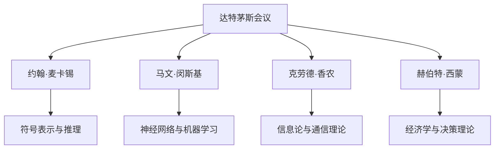

##### 1.2 早期AI研究的关键事件

在达特茅斯会议之后，AI研究迅速发展。以下是一些早期AI研究的关键事件：

- **1958年：** 威廉·珀尔（William McCulloch）和沃尔夫冈·皮茨（Wolfram von Neumann）提出了感知器（Perceptron）理论，这是一种基于生物神经元的简单神经网络模型。

- **1965年：** 约翰·麦卡锡等人提出了通用问题解答器（General Problem Solver，GPS），这是第一个能够解决多种问题的符号AI程序。

- **1969年：** 乔治·戴维斯（J. George Dale）和爱德华·费根鲍姆（Edward Feigenbaum）开发了第一个专家系统DENDRAL，用于化学结构分析。

- **1970年代：** 专家系统的应用逐渐扩大，如MYCIN系统用于医学诊断和CADUCEUS系统用于疾病治疗建议。

这些早期事件展示了AI在特定领域的应用潜力，但也揭示了符号AI的局限性，如知识获取的困难、推理能力的限制和复杂问题处理的能力不足。

**图 1.2：早期AI研究的关键事件与成就**

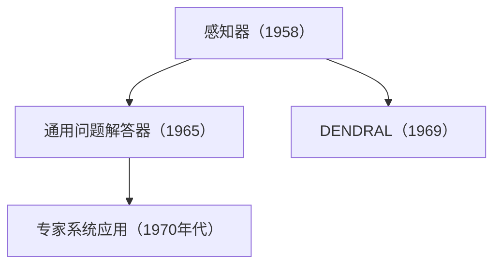

##### 1.3 第一代AI系统的局限性

尽管早期AI研究取得了一些进展，但符号AI和专家系统在许多方面都受到了限制：

- **知识获取困难：** 专家系统依赖于显式编程和领域专家的知识，知识获取过程繁琐且耗时。

- **推理能力限制：** 符号AI的推理能力受到计算能力和数据量的限制，难以处理复杂的问题。

- **通用性不足：** 早期AI系统往往针对特定问题设计，缺乏通用性，难以泛化到其他领域。

- **计算效率问题：** 大规模的符号推理需要大量的计算资源，导致系统运行缓慢。

这些局限性促使研究者寻求新的方法和技术，推动了AI领域的进一步发展。

**图 1.3：第一代AI系统的局限性**

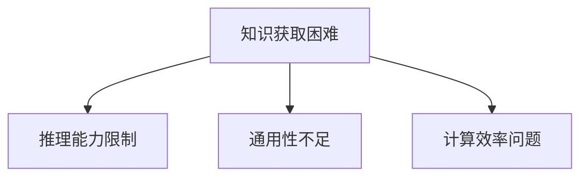

---

在本章中，我们回顾了AI的起源与早期发展，从达特茅斯会议开始，探讨了符号AI和专家系统的兴起及其局限性。下一章，我们将继续探讨连接主义AI的崛起，深入分析神经网络和深度学习的原理和应用。

---

### 第一部分：AI历史与发展

#### 第2章：符号AI与专家系统的兴起

符号AI（Symbolic AI）是一种基于逻辑和推理的人工智能方法，它试图通过符号表示和自动化推理来解决复杂问题。符号AI的兴起标志着人工智能研究的一个重要阶段，它为后来的专家系统（Expert System）的发展奠定了基础。

##### 2.1 符号AI的基本原理

符号AI的核心思想是使用符号表示和逻辑推理来模拟人类思维过程。符号AI的基本原理包括：

- **符号表示：** 符号AI使用符号来表示知识，这些符号可以是概念、关系、事实和规则等。符号表示是符号AI的基础，它使得系统能够以结构化的方式存储和处理信息。

- **逻辑推理：** 符号AI使用逻辑推理来推导新的结论。逻辑推理包括演绎推理和归纳推理。演绎推理是从一般到特殊的推理过程，而归纳推理是从特殊到一般的推理过程。

- **推理机：** 推理机是符号AI系统的核心组件，它负责根据符号表示和规则进行推理。推理机可以是前向推理机或反向推理机。前向推理机从已知的事实出发，逐步推导出新的结论；反向推理机则从目标开始，逆向寻找支持目标的证据。

**图 2.1：符号AI的基本原理**

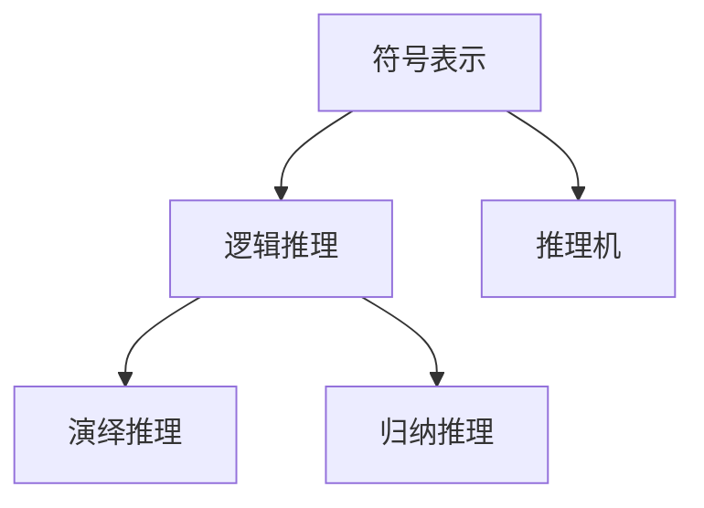

##### 2.2 专家系统的发展与应用

专家系统是一种基于符号AI的计算机程序，它模拟领域专家的决策过程，用于解决特定领域的复杂问题。专家系统的发展是符号AI的一个重要应用。

**专家系统的特点：**
- **知识密集：** 专家系统依赖于专家的知识，这些知识以规则的形式存储在系统中。
- **领域针对性：** 专家系统通常针对特定的领域设计，如医学诊断、化学结构分析、财务咨询等。
- **灵活性强：** 专家系统可以根据新的知识和规则进行扩展和更新。

**图 2.2：专家系统的结构**

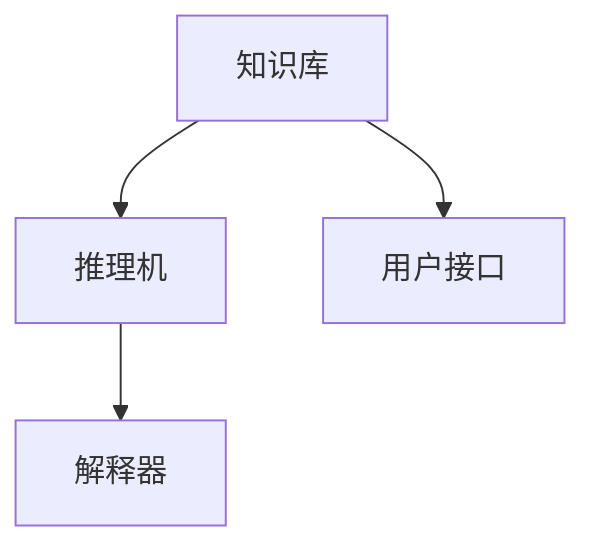

**专家系统的发展历程：**
- **1960年代初：** 最早的专家系统DENDRAL在化学结构分析领域取得成功，引发了专家系统研究的热潮。
- **1960年代中期：** MYCIN系统在医学诊断领域取得显著成果，成为第一个商业化成功的专家系统。
- **1970年代：** 专家系统在多个领域得到应用，如CADUCEUS系统在疾病治疗建议、CASNET系统在战略规划等。

**图 2.3：专家系统的发展历程**

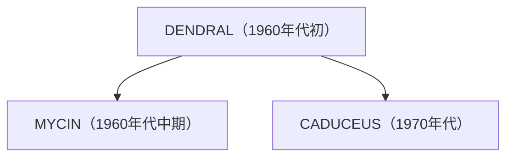

**专家系统的应用：**
- **医学诊断：** 专家系统可以帮助医生进行疾病诊断，提供辅助决策。
- **金融咨询：** 专家系统可以分析市场数据，提供投资建议。
- **工业自动化：** 专家系统可以用于生产过程优化、故障诊断等。

**图 2.4：专家系统的应用领域**

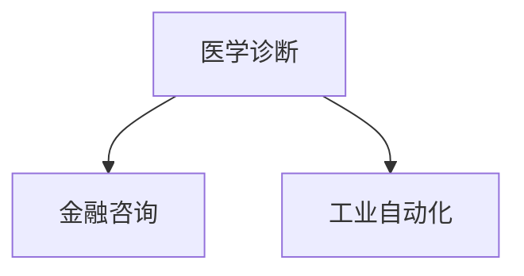

##### 2.3 专家系统的局限性

尽管专家系统在特定领域取得了成功，但它们也面临着一些局限性：

- **知识获取困难：** 专家系统的性能依赖于领域专家的知识，获取这些知识是一个繁琐且耗时的过程。
- **推理能力限制：** 专家系统的推理能力受到计算能力和数据量的限制，难以处理复杂的问题。
- **通用性不足：** 专家系统通常针对特定问题设计，缺乏通用性，难以泛化到其他领域。
- **解释性不足：** 专家系统的决策过程往往不透明，难以解释其推理过程和结论。

**图 2.5：专家系统的局限性**

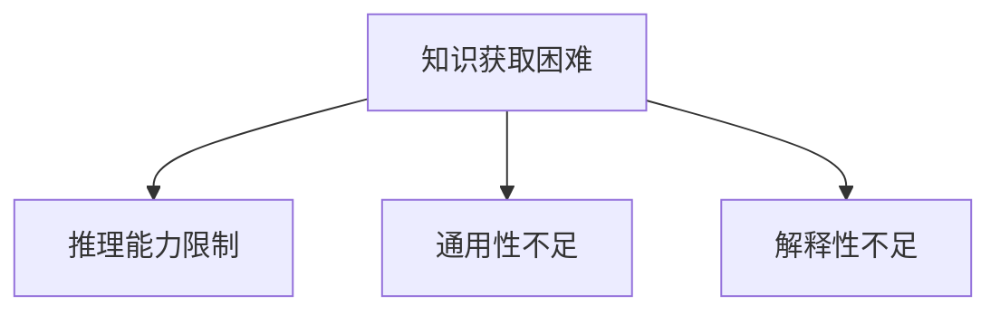

尽管如此，专家系统在特定领域仍然具有广泛的应用价值，并为后来的AI研究提供了重要的经验和教训。

---

在本章中，我们深入探讨了符号AI与专家系统的基本原理、发展历程和应用，以及它们的局限性。下一章，我们将探讨连接主义AI的崛起，以及神经网络和深度学习的原理和应用。

---

### 第一部分：AI历史与发展

#### 第3章：连接主义AI的崛起

在符号AI和专家系统的局限性逐渐显现时，研究者开始探索新的方法来模拟和增强人工智能。连接主义AI（Connectionist AI）作为一种新的研究范式，基于生物神经网络的结构和功能，试图通过模拟神经网络来处理复杂的问题。这一思想的兴起标志着人工智能发展的一个重要转折点。

##### 3.1 连接主义AI的兴起

连接主义AI的基本思想是通过模拟生物神经网络的连接和激活来处理信息。这种方法的核心理念是神经网络中每个神经元（节点）通过连接（权重）与其他神经元交互，并共同处理输入信息。连接主义AI的兴起可以追溯到1950年代末和1960年代初，当时神经系统科学和计算机科学的研究者们开始关注如何将神经网络的原理应用于人工智能。

- **1961年：** 美国心理学家弗兰克·罗森布拉特（Frank Rosenblatt）提出了感知器（Perceptron）模型，这是连接主义AI的开端。感知器是一种简单的线性二分类模型，它通过调整权重来学习输入和输出之间的映射关系。

- **1986年：** 约翰·霍普菲尔德（John Hopfield）提出了霍普菲尔德网络（Hopfield Network），这是一种基于能量最小化的循环神经网络，能够存储和回忆模式。

**图 3.1：连接主义AI的基本思想**

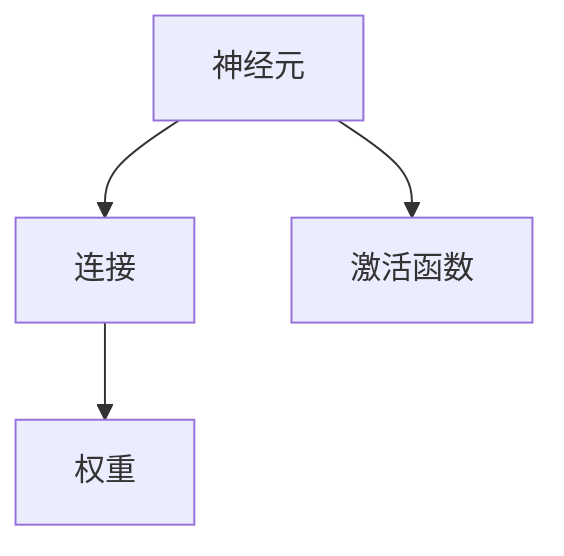

##### 3.2 反馈神经网络与感知器

反馈神经网络是连接主义AI的一个重要分支，它通过将输出信号反馈到网络中的其他节点，实现信息的循环处理。其中，感知器是最简单的反馈神经网络之一。

- **感知器模型：** 感知器是一种二分类神经元，它通过计算输入向量与权重向量的点积，加上偏置项，并应用激活函数（通常是阈值函数）来产生输出。感知器主要用于模式识别和二分类问题。

- **学习规则：** 感知器的学习过程是通过调整权重和偏置项来最小化输出误差。常用的学习算法包括Hebb学习规则和感知器学习规则。

**图 3.2：感知器模型与学习规则**

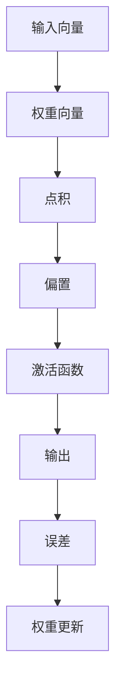

**伪代码示例：感知器学习规则**

```python
# 输入向量 x，权重向量 w，目标输出 y，学习率 alpha
while not converged:
    for each training example (x, y):
        # 计算预测输出
        prediction = dot_product(x, w) + bias
        
        # 计算误差
        error = y - prediction
        
        # 更新权重和偏置
        w = w + alpha * (x * error)
        bias = bias + alpha * error
```

##### 3.3 随机梯度下降算法

随机梯度下降（Stochastic Gradient Descent，SGD）是连接主义AI中常用的优化算法，它用于训练神经网络模型。SGD通过随机选择训练样本，计算梯度并更新模型参数，从而逐渐减小损失函数。

- **梯度计算：** 梯度是损失函数关于模型参数的导数，它指示了参数调整的方向。在神经网络中，损失函数通常用于评估模型预测与实际输出之间的差距。

- **随机采样：** SGD随机选择训练样本，计算梯度并更新参数。这种方法减少了计算复杂度，并有助于避免局部最小值。

- **更新规则：** SGD的更新规则为：
  
  $$ \theta = \theta - \alpha \cdot \nabla_\theta J(\theta) $$

  其中，$ \theta $ 表示模型参数，$ \alpha $ 表示学习率，$ J(\theta) $ 表示损失函数。

**图 3.3：随机梯度下降算法流程**

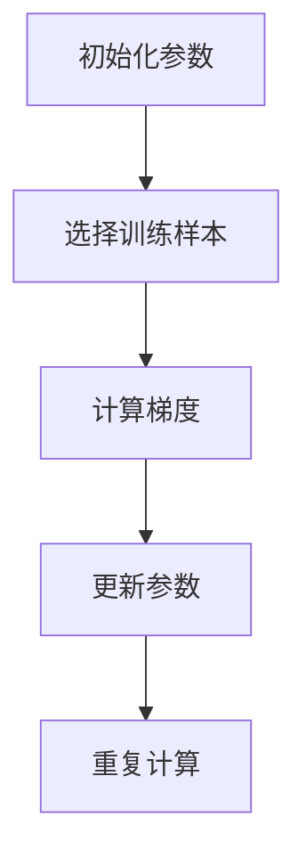

**伪代码示例：随机梯度下降算法**

```python
# 初始化参数 theta，学习率 alpha，迭代次数 n
theta = initialize_parameters()
alpha = 0.01
n = 1000

for i in range(n):
    # 随机选择训练样本 (x, y)
    x, y = select_random_sample()

    # 计算梯度
    gradient = compute_gradient(x, y, theta)

    # 更新参数
    theta = theta - alpha * gradient
```

##### 3.4 连接主义AI的优势与挑战

连接主义AI通过模拟生物神经网络的结构和功能，为人工智能研究提供了新的思路和方法。其优势包括：

- **强大的模式识别能力：** 神经网络可以自动从数据中学习特征，具有较强的模式识别能力。
- **自适应性和泛化能力：** 神经网络能够通过调整权重和连接来适应不同的输入数据，具有较强的泛化能力。
- **并行计算：** 神经网络可以并行处理大量数据，提高了计算效率。

然而，连接主义AI也面临一些挑战：

- **可解释性差：** 神经网络的决策过程往往不透明，难以解释其内部机制。
- **过拟合问题：** 神经网络容易受到训练数据的影响，导致过拟合。
- **计算资源需求：** 大规模神经网络的训练和推理需要大量的计算资源和时间。

**图 3.4：连接主义AI的优势与挑战**

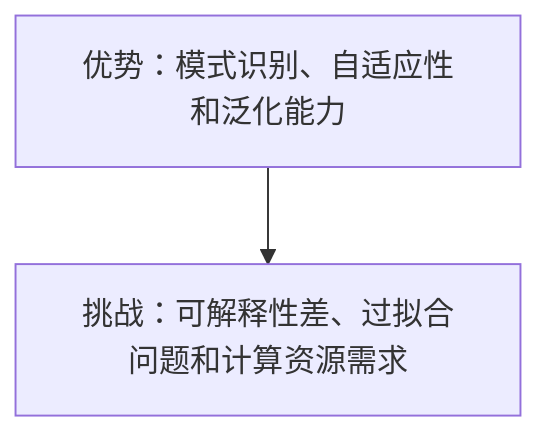

---

在本章中，我们探讨了连接主义AI的兴起，包括感知器模型、随机梯度下降算法以及连接主义AI的优势与挑战。下一章，我们将深入探讨深度学习的变革，包括深度学习的基本概念、卷积神经网络（CNN）和循环神经网络（RNN）。

---

### 第一部分：AI历史与发展

#### 第4章：深度学习的变革

随着计算能力的提升和数据量的爆炸式增长，人工智能领域迎来了深度学习（Deep Learning）的变革。深度学习是一种基于多层神经网络的机器学习方法，它通过自动提取层次化的特征表示，大大提高了人工智能系统的性能和应用范围。

##### 4.1 深度学习的基本概念

深度学习是人工神经网络的一个子领域，它通过构建具有多个隐含层的神经网络模型，自动学习数据中的特征和规律。深度学习的基本概念包括：

- **多层神经网络：** 深度学习模型通常包含多个隐含层，每个隐含层将输入数据转换为更高层次的抽象表示。多层神经网络能够提取更加复杂的特征，提高模型的泛化能力。

- **反向传播算法：** 反向传播（Backpropagation）是一种用于训练神经网络的基本算法。它通过计算损失函数关于网络参数的梯度，并使用梯度下降方法更新参数，从而优化模型的性能。

- **激活函数：** 激活函数是神经网络中的一个关键组件，它用于引入非线性因素，使得神经网络能够模拟复杂的非线性关系。常用的激活函数包括Sigmoid、ReLU和Tanh等。

**图 4.1：深度学习的基本概念**

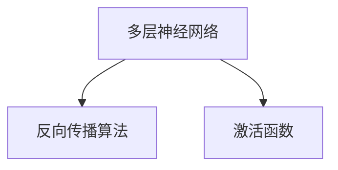

##### 4.2 卷积神经网络（CNN）的发明与应用

卷积神经网络（Convolutional Neural Network，CNN）是深度学习的一个重要分支，它专门用于处理图像数据。CNN的核心思想是通过卷积操作和池化操作，自动提取图像中的局部特征和全局特征。

- **卷积操作：** 卷积操作用于提取图像中的局部特征，它通过滑动滤波器（卷积核）在图像上扫描，计算每个位置的卷积值。卷积操作能够有效地减少参数数量，提高模型的计算效率。

- **池化操作：** 池化操作用于降低特征图的维度，减少参数数量，同时保留重要的特征信息。常见的池化操作包括最大池化和平均池化。

- **卷积神经网络结构：** CNN通常包含多个卷积层、池化层和全连接层。卷积层用于提取特征，池化层用于降维和减少过拟合，全连接层用于分类和回归任务。

**图 4.2：卷积神经网络的基本结构**

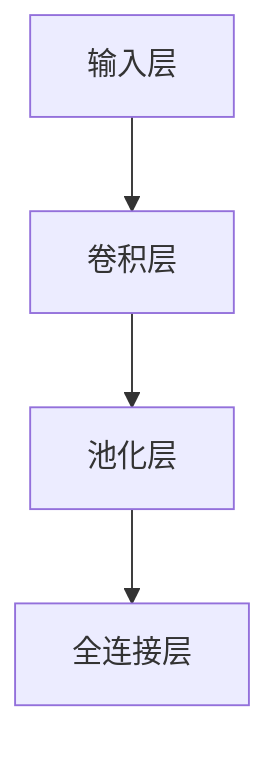

**图 4.3：卷积操作与池化操作**

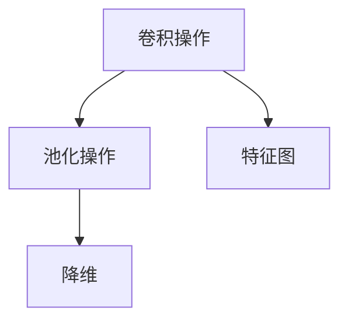

CNN在计算机视觉领域取得了巨大的成功，以下是几个典型的应用：

- **图像分类：** CNN可以用于对图像进行分类，如ImageNet图像分类挑战。
- **目标检测：** CNN可以检测图像中的多个目标，如YOLO和SSD等算法。
- **图像分割：** CNN可以用于图像分割任务，如FCN和U-Net等算法。

##### 4.3 循环神经网络（RNN）与长短期记忆（LSTM）

循环神经网络（Recurrent Neural Network，RNN）是另一种重要的深度学习模型，它适用于序列数据处理，如自然语言处理和时间序列预测。

- **RNN的基本结构：** RNN通过循环连接将前一个时间步的输出传递到下一个时间步，从而处理序列数据。RNN的基本结构包括输入层、隐藏层和输出层。

- **问题与挑战：** 由于RNN的梯度消失和梯度爆炸问题，传统的RNN在处理长序列时表现不佳。为了解决这些问题，研究者提出了长短期记忆（Long Short-Term Memory，LSTM）网络。

- **LSTM的基本结构：** LSTM通过引入门控机制，控制信息的流动，从而解决了RNN的梯度消失和梯度爆炸问题。LSTM的基本结构包括输入门、遗忘门和输出门。

**图 4.4：RNN与LSTM的基本结构**

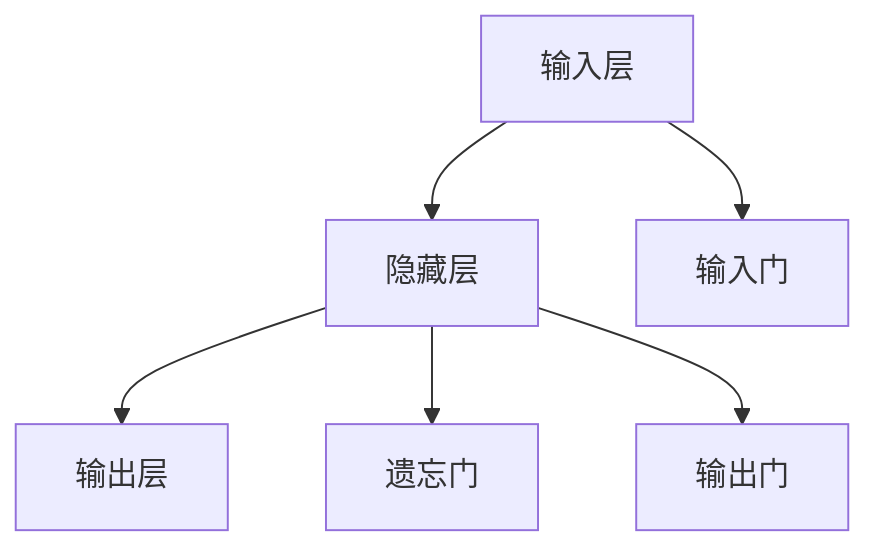

**图 4.5：LSTM的门控机制**

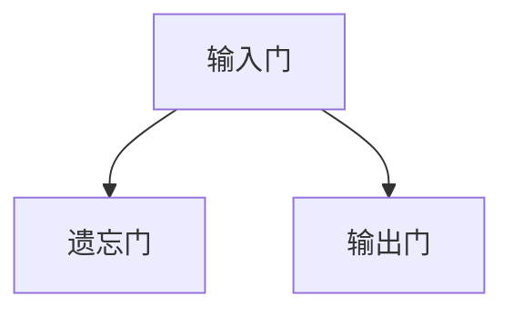

LSTM在自然语言处理领域取得了显著的成功，以下是几个典型的应用：

- **语言模型：** LSTM可以用于构建语言模型，预测下一个单词或字符。
- **机器翻译：** LSTM可以用于机器翻译任务，如神经网络机器翻译（NMT）。
- **文本生成：** LSTM可以用于文本生成任务，如自动写作和诗歌创作。

##### 4.4 深度学习的优势与挑战

深度学习的出现极大地推动了人工智能的发展，它具有以下优势：

- **强大的特征提取能力：** 深度学习能够自动提取层次化的特征表示，使得模型在无需人工干预的情况下能够处理复杂的问题。
- **广泛的适用性：** 深度学习在计算机视觉、自然语言处理、语音识别等领域取得了显著的成果，大大提高了这些领域的应用水平。
- **自动学习：** 深度学习通过大规模数据训练，能够自动学习数据中的规律和模式，减少了人工干预的需要。

然而，深度学习也面临着一些挑战：

- **可解释性差：** 深度学习模型的决策过程往往不透明，难以解释其内部机制，这限制了其在一些关键领域的应用。
- **过拟合问题：** 深度学习模型容易受到训练数据的影响，导致过拟合，从而降低了模型的泛化能力。
- **计算资源需求：** 深度学习模型通常需要大量的计算资源和时间进行训练和推理，这限制了其在一些资源受限场景的应用。

**图 4.6：深度学习的优势与挑战**

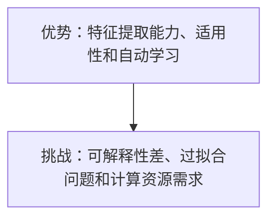

---

在本章中，我们深入探讨了深度学习的变革，包括基本概念、卷积神经网络（CNN）和循环神经网络（LSTM）的应用。深度学习的出现极大地推动了人工智能的发展，为未来的研究和应用提供了新的思路和方法。下一章，我们将探讨AI大模型的崛起，以及GPT系列模型和BERT的发展。

---

### 第一部分：AI历史与发展

#### 第5章：AI大模型的崛起

随着深度学习的迅猛发展，研究者开始尝试训练更大的神经网络模型，以进一步提高人工智能的性能。这些大规模的神经网络模型被称为AI大模型（Large-scale AI Models）。AI大模型的崛起标志着人工智能领域的一次重大变革，它不仅提高了模型在各个任务上的表现，还推动了自然语言处理、计算机视觉等领域的发展。

##### 5.1 什么是AI大模型

AI大模型是指那些拥有数十亿甚至数万亿参数的深度学习模型。这些模型通常由数百万个神经元组成，能够自动学习并提取数据中的复杂特征。AI大模型具有以下特点：

- **大规模参数：** AI大模型拥有数十亿甚至数万亿个参数，这使得它们能够自动学习更复杂的数据特征。
- **多层结构：** AI大模型通常包含数十层甚至数百层神经网络，这使得它们能够提取数据中的多层次特征。
- **自动学习：** AI大模型通过大规模数据训练，能够自动学习数据中的规律和模式，无需人工干预。

**图 5.1：AI大模型的特点**

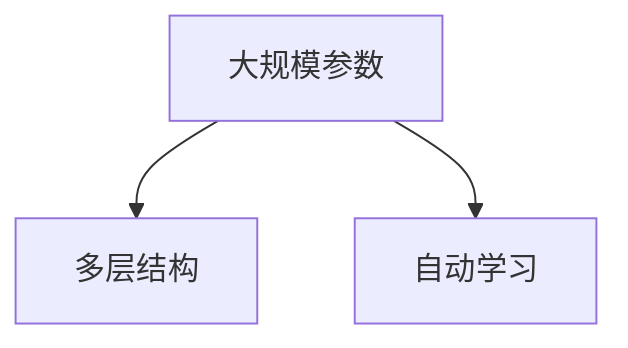

##### 5.2 GPT系列模型的发展

GPT（Generative Pre-trained Transformer）系列模型是AI大模型的代表之一，由OpenAI提出。GPT模型基于Transformer架构，通过预训练和微调，实现了在自然语言处理任务中的卓越性能。

- **GPT-1（2018年）：** GPT-1是第一个GPT模型，它由1.17亿个参数组成，通过在大量文本数据上进行预训练，实现了文本生成、文本分类等自然语言处理任务的高性能。
- **GPT-2（2019年）：** GPT-2是GPT系列的第二个模型，它由1.5亿个参数组成，通过更大的模型规模和预训练数据集，进一步提升了模型在文本生成和分类任务上的性能。
- **GPT-3（2020年）：** GPT-3是GPT系列的最新模型，它拥有1750亿个参数，是迄今为止最大的自然语言处理模型。GPT-3在文本生成、问答、机器翻译等自然语言处理任务中取得了显著的成果。

**图 5.2：GPT系列模型的发展**

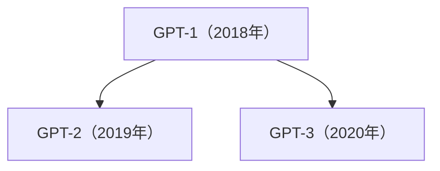

GPT系列模型的发展不仅推动了自然语言处理领域的进步，还为AI大模型的研究提供了宝贵的经验和启示。

##### 5.3 BERT及其变体

BERT（Bidirectional Encoder Representations from Transformers）是由Google提出的一种基于Transformer架构的预训练模型。BERT模型通过双向编码器学习文本的上下文信息，从而提高了自然语言处理任务的表现。

- **BERT（2018年）：** BERT是第一个双向Transformer预训练模型，它通过在大量文本数据上进行预训练，学习文本的上下文信息。BERT在多个自然语言处理任务上取得了优异的成绩，如文本分类、问答、命名实体识别等。
- **BERT-large：** BERT-large是BERT的变体之一，它拥有更多的参数和更大的模型规模，进一步提高了模型的表现。
- **RoBERTa（2019年）：** RoBERTa是BERT的改进版本，它通过优化训练过程和数据预处理，取得了在多个自然语言处理任务上优于BERT的成绩。

**图 5.3：BERT及其变体的发展**

```mermaid
graph TB
A[BERT（2018年）] --> B[BERT-large]
A --> C[RoBERTa（2019年）]
```

BERT及其变体在自然语言处理领域取得了显著的成果，它们为后续的研究和实际应用提供了重要的基础。

##### 5.4 AI大模型的优势与挑战

AI大模型的出现带来了巨大的性能提升，为人工智能的发展注入了新的活力。以下是AI大模型的优势：

- **强大的特征提取能力：** AI大模型通过大规模数据和多层结构，能够自动提取数据中的复杂特征，提高了模型的泛化能力。
- **广泛的适用性：** AI大模型在多个领域取得了显著的成果，如自然语言处理、计算机视觉、语音识别等。
- **自动学习：** AI大模型通过大规模数据训练，能够自动学习数据中的规律和模式，减少了人工干预的需要。

然而，AI大模型也面临着一些挑战：

- **计算资源需求：** AI大模型需要大量的计算资源和时间进行训练和推理，这在资源受限的场景中可能是一个瓶颈。
- **可解释性差：** AI大模型的决策过程往往不透明，难以解释其内部机制，这限制了其在一些关键领域的应用。
- **数据隐私问题：** AI大模型在训练过程中需要大量的数据，这涉及到数据隐私和伦理问题。

**图 5.4：AI大模型的优势与挑战**

```mermaid
graph TB
A[优势：特征提取能力、广泛适用性和自动学习] --> B[挑战：计算资源需求、可解释性差和数据隐私问题]
```

---

在本章中，我们探讨了AI大模型的概念、GPT系列模型和BERT的发展，以及AI大模型的优势与挑战。AI大模型的崛起标志着人工智能领域的一次重大变革，它为未来的研究和应用提供了广阔的前景。下一章，我们将深入探讨AI的核心技术，包括神经网络基础、优化算法和自然语言处理中的关键算法。

---

### 第二部分：AI核心技术

#### 第6章：AI算法原理与数学模型

人工智能（AI）的核心在于其算法和数学模型，这些技术构成了AI系统的理论基础。本章将深入探讨AI算法的基本原理，包括神经网络、优化算法以及自然语言处理中的关键算法。

##### 6.1 神经网络基础

神经网络（Neural Networks）是人工智能的核心组成部分，它模仿了人脑中神经元的工作方式。神经网络由大量相互连接的节点（神经元）组成，每个节点接收输入信息，并通过加权连接将信息传递给其他节点。神经网络的数学模型通常包括以下几个基本组件：

- **输入层：** 输入层接收外部输入，并将其传递给隐藏层。
- **隐藏层：** 隐藏层是神经网络的核心部分，它通过非线性激活函数处理输入信息，提取特征并传递给下一层。
- **输出层：** 输出层生成最终输出，它可以是分类标签、回归值或其他形式的输出。

神经网络的训练过程是通过反向传播算法（Backpropagation）来调整网络中的权重和偏置，以最小化损失函数。反向传播算法通过计算损失函数关于网络参数的梯度，并使用梯度下降法更新参数，从而逐步提高模型的性能。

**图 6.1：神经网络的基本结构**

```mermaid
graph TB
A[输入层] --> B[隐藏层1]
B --> C[隐藏层2]
C --> D[隐藏层3]
D --> E[输出层]
```

**神经网络中的关键组件包括：**

- **激活函数：** 激活函数是神经网络中的一个关键组件，它引入了非线性因素，使得神经网络能够模拟复杂的非线性关系。常见的激活函数包括Sigmoid、ReLU和Tanh等。
- **权重和偏置：** 权重和偏置是神经网络中的基础参数，它们决定了神经网络的处理能力。通过训练过程，神经网络能够自动调整这些参数以优化模型性能。

**图 6.2：激活函数与参数**

```mermaid
graph TB
A[ReLU激活函数] --> B[权重和偏置]
A --> C[Tanh激活函数]
```

**神经网络的工作流程：**

1. **前向传播：** 神经网络接收输入数据，通过加权连接传递到隐藏层，并逐层计算输出。
2. **计算损失：** 比较输出与期望输出，计算损失函数的值。
3. **反向传播：** 计算损失函数关于网络参数的梯度，并使用梯度下降法更新参数。
4. **迭代更新：** 重复前向传播和反向传播过程，逐步优化模型性能。

**图 6.3：神经网络的工作流程**

```mermaid
graph TB
A[前向传播] --> B[计算损失]
B --> C[反向传播]
C --> D[迭代更新]
```

**伪代码示例：神经网络前向传播与反向传播**

```python
# 输入数据 X，模型参数 W，学习率 alpha
while not converged:
    # 前向传播
    for each layer in the network:
        z = dot_product(W, X) + bias
        a = activation_function(z)
        
        # 计算损失
        loss = calculate_loss(a, y)
        
        # 反向传播
        dz = dactivation_function(a) * dloss
        
        # 更新参数
        dW = dot_product(dz, X.T)
        db = sum(dz)
        
        W = W - alpha * dW
        bias = bias - alpha * db
```

##### 6.2 优化算法与正则化

优化算法是神经网络训练过程中至关重要的组成部分，它用于调整网络参数以最小化损失函数。常用的优化算法包括随机梯度下降（SGD）、Adam优化器等。

- **随机梯度下降（SGD）：** SGD是最简单的优化算法，它通过随机选择训练样本，计算梯度并更新模型参数，从而最小化损失函数。SGD的优点是实现简单，但缺点是容易陷入局部最小值和收敛速度慢。
- **Adam优化器：** Adam优化器是一种基于SGD的改进算法，它结合了AdaGrad和RMSprop的优点，通过自适应调整学习率，提高了收敛速度和稳定性。

正则化是防止神经网络过拟合的一种技术，它通过在损失函数中添加惩罚项来抑制模型的复杂度。常见的正则化方法包括L1正则化、L2正则化和Dropout等。

- **L1正则化：** L1正则化通过在损失函数中添加L1范数项来惩罚模型的权重，它能够减少模型参数的数量。
- **L2正则化：** L2正则化通过在损失函数中添加L2范数项来惩罚模型的权重，它能够减少模型参数的范数。
- **Dropout：** Dropout是一种在训练过程中随机丢弃一部分神经元的方法，它能够减少模型对特定训练样本的依赖，提高模型的泛化能力。

**图 6.4：优化算法与正则化**

```mermaid
graph TB
A[SGD优化器] --> B[L1正则化]
A --> C[L2正则化]
A --> D[Dropout]
```

**伪代码示例：正则化与优化算法**

```python
# 模型参数 W，学习率 alpha，正则化参数 lambda
while not converged:
    # 前向传播
    for each layer in the network:
        z = dot_product(W, X) + bias
        a = activation_function(z)
        
        # 计算损失
        loss = calculate_loss(a, y) + lambda * L1_regularization(W) + lambda * L2_regularization(W)
        
        # 反向传播
        dz = dactivation_function(a) * dloss
        
        # 更新参数
        dW = dot_product(dz, X.T) + lambda * dL1_regularization(W) + lambda * dL2_regularization(W)
        db = sum(dz)
        
        W = W - alpha * dW
        bias = bias - alpha * db
```

##### 6.3 自然语言处理中的关键算法

自然语言处理（Natural Language Processing，NLP）是人工智能领域的一个重要分支，它涉及对人类语言的理解和生成。NLP中的关键算法包括词嵌入、序列模型、注意力机制等。

- **词嵌入（Word Embedding）：** 词嵌入是将词汇映射为稠密向量表示的一种技术，它能够捕捉词汇之间的语义和语法关系。词嵌入是NLP中的基础组件，它为后续的NLP任务提供了有效的特征表示。
- **序列模型（Sequence Model）：** 序列模型是处理序列数据的一种常见方法，包括循环神经网络（RNN）、长短期记忆（LSTM）和门控循环单元（GRU）。这些模型能够捕捉序列数据中的时间和空间依赖关系，广泛应用于文本分类、机器翻译和语音识别等任务。
- **注意力机制（Attention Mechanism）：** 注意力机制是一种在序列模型中引入的机制，它能够自动关注序列中的关键信息，从而提高模型的表示能力和性能。注意力机制在机器翻译、问答系统和文本摘要等任务中取得了显著的成果。

**图 6.5：NLP中的关键算法**

```mermaid
graph TB
A[词嵌入] --> B[序列模型]
A --> C[注意力机制]
```

**图 6.6：注意力机制示意图**

```mermaid
graph TB
A[输入序列] --> B[注意力分数]
B --> C[加权输出]
```

**伪代码示例：词嵌入与序列模型**

```python
# 输入序列 X，词嵌入矩阵 W，隐藏层 H
for each time step in X:
    # 计算词嵌入向量
    embed = dot_product(W, X)
    
    # 计算隐藏层状态
    h = activation_function(dot_product(W_h, embed) + bias_h)
    
    # 更新词嵌入矩阵
    dW = dot_product(dh.T, embed)
    dW_h = dot_product(dx.T, h)
```

---

在本章中，我们深入探讨了AI算法的基本原理，包括神经网络、优化算法和自然语言处理中的关键算法。神经网络作为AI的核心组成部分，通过优化算法和正则化技术，不断提高了模型的性能和应用范围。自然语言处理作为AI的一个重要应用领域，得益于神经网络和深度学习技术的发展，取得了显著的成果。下一章，我们将探讨AI大模型的架构与训练。

---

### 第二部分：AI核心技术

#### 第7章：AI大模型架构与训练

随着深度学习的不断发展，AI大模型（Large-scale AI Models）逐渐成为研究的热点。AI大模型通常具有数十亿甚至数万亿个参数，其架构与训练方法与传统的小型模型存在显著差异。本章将详细介绍AI大模型的架构设计、训练策略以及自监督学习和迁移学习等关键技术。

##### 7.1 大模型的结构设计

AI大模型的结构设计是确保模型性能和计算效率的关键因素。大模型通常包含多个层次和复杂的网络结构，以提高特征提取和表示能力。以下是AI大模型结构设计的关键要素：

- **深度：** 大模型的深度通常在数十层甚至数百层，深度增加了模型能够捕捉到的特征层次，有助于提高模型的表示能力。
- **宽度：** 大模型的宽度通常在数千个神经元以上，宽度增加了模型同时处理的信息量，有助于提高模型的泛化能力。
- **层次化结构：** 大模型通常采用层次化结构，从底层到顶层逐渐提取抽象特征，底层特征更接近原始数据，而顶层特征更抽象，能够捕捉到高层次的信息。
- **变换器架构：** 变换器（Transformer）架构是AI大模型的核心组件，它通过自注意力机制（Self-Attention）和多头注意力（Multi-Head Attention）有效捕捉数据中的长距离依赖关系。

**图 7.1：AI大模型的基本结构**

```mermaid
graph TB
A[输入层] --> B[多层变换器块]
B --> C[输出层]
```

**变换器块（Transformer Block）：**

每个变换器块通常包含两个主要部分：多头自注意力机制（Multi-Head Self-Attention）和前馈神经网络（Feedforward Neural Network）。

- **多头自注意力机制：** 多头自注意力机制通过计算输入序列中每个位置的权重，并将这些权重应用于输入序列，从而提取序列中的关键信息。
- **前馈神经网络：** 前馈神经网络对自注意力机制的输出进行进一步处理，通常包含两个全连接层，并使用ReLU激活函数。

**图 7.2：变换器块的结构**

```mermaid
graph TB
A[输入序列] --> B[多头自注意力机制]
B --> C[前馈神经网络]
C --> D[输出]
```

##### 7.2 自监督学习与迁移学习

自监督学习和迁移学习是AI大模型训练过程中常用的技术，它们有助于提高模型的泛化能力和计算效率。

- **自监督学习（Self-Supervised Learning）：** 自监督学习是一种无需显式标注的数据利用方法。在大规模无标注数据上，自监督学习通过构建自我监督任务，自动学习数据的特征表示。自监督学习的关键技术包括掩码语言建模（Masked Language Modeling，MLM）、掩码图像建模（Masked Image Modeling，MIM）等。

**掩码语言建模（MLM）：**

掩码语言建模是一种在自然语言处理中常用的自监督学习方法。在MLM中，输入文本序列中的部分词被随机掩码，模型需要预测这些掩码词的表示。MLM能够有效提高模型对语言结构的理解能力。

**图 7.3：掩码语言建模示意图**

```mermaid
graph TB
A[原始文本序列] --> B[掩码后的序列]
B --> C[模型预测]
```

- **迁移学习（Transfer Learning）：** 迁移学习是一种利用预训练模型在新的任务上的学习方法。在大规模预训练数据集上预训练好的模型（如GPT、BERT等），可以迁移到不同的任务上，避免了从头训练的繁琐过程。迁移学习能够显著提高模型在少量数据上的性能。

**图 7.4：迁移学习示意图**

```mermaid
graph TB
A[预训练模型] --> B[新任务数据]
B --> C[模型微调]
C --> D[新任务性能]
```

##### 7.3 大模型的训练策略

大模型的训练是一个复杂且耗时的过程，需要考虑计算资源、数据利用效率和模型性能等多个方面。以下是AI大模型训练的一些关键策略：

- **分布式训练：** 分布式训练通过将模型参数分布在多个计算节点上，利用并行计算提高训练速度。常见的分布式训练框架包括TensorFlow、PyTorch等。
- **数据增强：** 数据增强是通过变换原始数据，增加训练数据多样性的一种方法。数据增强有助于提高模型的泛化能力，减少过拟合现象。
- **学习率调度：** 学习率调度是调整训练过程中学习率的方法，以避免模型过早收敛或陷入局部最小值。常见的调度策略包括学习率衰减、余弦退火等。

**图 7.5：分布式训练与学习率调度**

```mermaid
graph TB
A[分布式训练] --> B[数据增强]
A --> C[学习率调度]
```

**分布式训练伪代码示例：**

```python
# 分布式训练配置
num_gpus = 4
batch_size_per_gpu = 64

# 初始化模型
model = initialize_model()

# 分配模型到不同GPU
for i in range(num_gpus):
    model.to(i)

# 分布式训练循环
for epoch in range(num_epochs):
    for batch in data_loader:
        # 分配数据到不同GPU
        for i in range(num_gpus):
            batch = batch.cuda(device=i)
        
        # 前向传播
        output = model(batch)
        
        # 计算损失
        loss = compute_loss(output, target)
        
        # 反向传播
        optimizer.zero_grad()
        loss.backward()
        optimizer.step()
        
        # 更新学习率
        scheduler.step()
```

**学习率调度伪代码示例：**

```python
# 学习率调度配置
base_lr = 0.001
lr_decay_rate = 0.1
decay_epochs = [10, 20, 30]

# 初始化学习率
current_lr = base_lr

# 学习率调度循环
for epoch in range(num_epochs):
    # 检查是否需要学习率衰减
    if epoch in decay_epochs:
        current_lr *= lr_decay_rate
    
    # 前向传播
    output = model(input_data)
    
    # 计算损失
    loss = compute_loss(output, target)
    
    # 反向传播
    optimizer.zero_grad()
    loss.backward()
    optimizer.step()
    
    # 输出当前学习率
    print(f"Epoch: {epoch}, Learning Rate: {current_lr}")
```

---

在本章中，我们详细介绍了AI大模型的架构设计、自监督学习和迁移学习等关键技术，以及大模型的训练策略。AI大模型的崛起标志着人工智能领域的一次重大变革，为未来的研究和应用提供了广阔的前景。下一章，我们将探讨AI大模型在不同应用场景中的具体实现，以及面临的挑战和未来发展趋势。

---

### 第二部分：AI核心技术

#### 第8章：AI大模型的应用场景

AI大模型的出现极大地推动了人工智能的发展，它们在多个领域展现了强大的能力和广泛的应用前景。本章将探讨AI大模型在自然语言处理、计算机视觉和语音识别等领域的具体实现，以及它们面临的挑战和未来发展趋势。

##### 8.1 自然语言处理

自然语言处理（NLP）是AI大模型的重要应用领域之一。AI大模型通过预训练和微调，在文本分类、机器翻译、文本生成、问答系统和情感分析等任务中取得了显著的成果。

- **文本分类：** AI大模型能够自动从大量文本数据中学习特征，对文本进行分类。例如，BERT模型在情感分析、新闻分类等任务中表现出了极高的准确率。
- **机器翻译：** AI大模型通过预训练和迁移学习，能够在多种语言之间进行准确高效的翻译。例如，GPT-3模型在机器翻译任务中展现出了强大的能力和灵活性。
- **文本生成：** AI大模型能够生成连贯、有逻辑的文本，应用于写作辅助、诗歌创作和对话系统等场景。例如，GPT-2和GPT-3模型在自动写作和对话系统中取得了优异的表现。
- **问答系统：** AI大模型能够理解自然语言问题，并提供准确的答案。例如，BERT模型在开源问答系统如SQuAD中表现出了出色的性能。

尽管AI大模型在自然语言处理领域取得了巨大成功，但它们仍然面临一些挑战：

- **数据隐私问题：** 大规模训练过程需要大量的数据，这涉及到数据隐私和伦理问题。如何保护用户隐私，确保数据安全，是一个亟待解决的问题。
- **模型解释性：** AI大模型的决策过程往往不透明，难以解释其内部机制。如何提高模型的解释性，使其在关键领域得到更广泛的应用，是一个重要的研究方向。
- **计算资源需求：** AI大模型的训练和推理需要大量的计算资源和时间，这在资源受限的场景中可能是一个瓶颈。

##### 8.2 计算机视觉

计算机视觉是AI大模型的另一个重要应用领域。AI大模型通过深度学习算法，在图像分类、目标检测、图像分割和图像生成等任务中取得了显著成果。

- **图像分类：** AI大模型能够自动从图像中学习特征，对图像进行分类。例如，ImageNet图像分类挑战中，AI大模型如ResNet和Inception等模型取得了极高的准确率。
- **目标检测：** AI大模型能够检测图像中的多个目标，并定位目标位置。例如，YOLO和SSD等模型在目标检测任务中表现出了高效性和准确性。
- **图像分割：** AI大模型能够对图像中的每个像素进行分类，实现图像分割任务。例如，U-Net和FCN等模型在医疗图像分割、自动驾驶等领域取得了重要应用。
- **图像生成：** AI大模型能够生成逼真的图像，应用于艺术创作、虚拟现实和游戏开发等领域。例如，GAN（生成对抗网络）模型在图像生成任务中展现出了强大的能力。

计算机视觉领域面临的挑战包括：

- **数据质量：** 计算机视觉模型的训练需要大量的高质量标注数据，数据的质量和多样性直接影响模型的性能。
- **模型解释性：** 计算机视觉模型的决策过程通常不透明，如何提高模型的解释性，使其在关键领域得到更广泛的应用，是一个重要的研究方向。
- **实时性：** 计算机视觉模型在实时应用场景中，如自动驾驶和安防监控，需要处理大量实时数据，如何提高模型的实时性是一个重要问题。

##### 8.3 语音识别与生成

语音识别与生成是AI大模型的另一个重要应用领域。AI大模型通过深度学习算法，在语音识别、语音合成和语音转换等任务中取得了显著成果。

- **语音识别：** AI大模型能够将语音信号转换为文本，应用于语音助手、自动字幕和智能客服等领域。例如，WaveNet和Transformer模型在语音识别任务中表现出了极高的准确率和流畅性。
- **语音合成：** AI大模型能够生成逼真的语音，应用于虚拟助手、语音助手和广告配音等领域。例如，WaveNet和Tacotron模型在语音合成任务中展现出了出色的音质和自然度。
- **语音转换：** AI大模型能够将一种语言的语音转换为另一种语言的语音，应用于多语言交互和跨语言沟通等领域。例如，Transformer模型在语音转换任务中表现出了强大的能力和灵活性。

语音识别与生成领域面临的挑战包括：

- **语音质量：** 语音识别与生成的质量直接影响用户体验，如何提高语音的自然度和准确性，是一个重要的研究方向。
- **计算资源需求：** 语音识别与生成的模型通常需要大量的计算资源和时间，这在资源受限的场景中可能是一个瓶颈。
- **语音多样性：** 如何处理语音的多样性，包括不同口音、语调和情感的变化，是一个重要的挑战。

##### 8.4 未来发展趋势

AI大模型在不同应用场景中的成功应用，预示着人工智能领域的未来发展趋势：

- **跨领域应用：** AI大模型将在多个领域实现跨领域应用，如医疗、金融、教育和娱乐等，为各行各业带来变革。
- **个性化和自适应：** AI大模型将通过深度学习和迁移学习，实现个性化和自适应功能，更好地满足用户需求。
- **实时性和高效性：** 随着计算能力的提升，AI大模型将在实时应用场景中发挥重要作用，实现高效和实时处理。
- **可解释性和透明度：** 提高AI大模型的可解释性和透明度，使其在关键领域得到更广泛的应用。

总之，AI大模型在自然语言处理、计算机视觉、语音识别等领域展现了强大的能力和广泛的应用前景。随着技术的不断进步，AI大模型将在未来发挥更大的作用，推动人工智能领域的发展。

---

在本章中，我们详细探讨了AI大模型在自然语言处理、计算机视觉和语音识别等领域的具体实现，以及它们面临的挑战和未来发展趋势。AI大模型的崛起标志着人工智能领域的一次重大变革，为未来的研究和应用提供了广阔的前景。下一章，我们将探讨AI大模型的挑战与未来。

---

### 第二部分：AI核心技术

#### 第9章：AI大模型的挑战与未来

随着AI大模型的崛起，人工智能领域取得了令人瞩目的进展。然而，AI大模型的应用也带来了新的挑战，我们需要认真思考和应对这些问题。本章将探讨AI大模型的伦理问题、发展趋势以及对社会的影响。

##### 9.1 AI大模型的伦理问题

AI大模型在带来便利和进步的同时，也引发了一系列伦理问题，这些问题的解决对于AI的可持续发展至关重要。

- **数据隐私：** AI大模型的训练通常需要大量数据，这些数据往往涉及个人隐私。如何在保护用户隐私的前提下，合理使用数据是一个亟待解决的问题。
- **算法偏见：** AI大模型可能受到训练数据中的偏见影响，导致算法在特定群体上产生歧视。例如，在招聘、贷款审批等领域，算法的偏见可能导致不公平的结果。
- **模型解释性：** AI大模型通常具有复杂的内部结构和决策过程，其解释性较差。这使得用户难以理解模型的决策依据，增加了算法的不透明性。
- **责任归属：** 当AI大模型造成损失或错误时，如何确定责任归属是一个复杂的问题。这涉及到法律、伦理和技术等多个层面。

解决这些伦理问题需要多方共同努力，包括技术、法律和伦理专家的参与。例如，通过数据去噪、多样性增强和透明度提升等技术手段，可以提高AI大模型的公平性和可解释性。

##### 9.2 AI大模型的发展趋势

AI大模型的发展趋势主要体现在以下几个方面：

- **模型规模扩大：** AI大模型的参数规模和计算量将不断增大，推动计算能力和数据存储技术的进步。
- **多模态学习：** AI大模型将逐步实现跨模态学习，能够处理文本、图像、音频等多种类型的数据，实现更复杂的任务。
- **迁移学习和自监督学习：** 迁移学习和自监督学习将进一步优化AI大模型在少量数据上的性能，降低对大规模标注数据的依赖。
- **模型解释性提升：** 研究人员将致力于提高AI大模型的解释性，使其在关键领域得到更广泛的应用。

随着AI大模型的发展，我们期待看到更强大的AI系统，能够在更多领域解决复杂问题，为社会带来更多福祉。

##### 9.3 AI大模型对社会的影响

AI大模型对社会的影响是深远且多方面的，它将在经济、教育、医疗等多个领域产生变革性影响。

- **经济影响：** AI大模型将推动产业升级和转型，提高生产效率，创造新的就业机会。然而，自动化和人工智能也可能导致部分传统岗位的减少，对就业市场产生冲击。
- **教育影响：** AI大模型将在个性化教育、智能辅导和自适应学习等方面发挥重要作用，提高教育质量和效率。同时，AI大模型也将改变教育内容和教学方法，培养适应未来社会的创新型人才。
- **医疗影响：** AI大模型将在疾病诊断、药物研发和健康管理等方面发挥关键作用，提高医疗服务的质量和效率。例如，AI大模型可以帮助医生进行早期疾病诊断，提高治疗效果，降低医疗成本。

尽管AI大模型对社会的影响是积极和正面的，但我们也需要警惕其潜在的风险和挑战。例如，如何在确保数据安全和隐私的同时，充分利用AI大模型的能力；如何确保AI大模型在关键领域的决策过程是透明和可解释的。

总之，AI大模型的崛起带来了新的机遇和挑战。通过技术、法律和伦理的共同努力，我们可以确保AI大模型在为社会带来福祉的同时，减少潜在的风险和负面影响。

---

在本章中，我们探讨了AI大模型的伦理问题、发展趋势以及对社会的影响。AI大模型的崛起不仅推动了人工智能技术的进步，也为社会带来了深刻的变革。在未来的发展中，我们需要关注这些挑战，确保AI大模型能够为人类社会带来更多的福祉。下一章，我们将通过具体的项目实战，展示如何开发和部署AI大模型。

---

### 第三部分：项目实战

#### 第10章：AI大模型项目实践

在本章中，我们将通过一个具体的项目实战，详细展示如何开发和部署AI大模型。这个项目将涵盖从数据准备、模型设计、模型训练到模型优化和部署的整个流程。我们将使用Python和相关的深度学习库（如TensorFlow和PyTorch）来完成这个项目。

##### 10.1 项目实战概述

我们的项目目标是构建一个自然语言处理（NLP）模型，用于情感分析。情感分析是一种常见的NLP任务，旨在判断文本的情绪倾向，如正面、负面或中性。该项目将利用AI大模型（如BERT或GPT）来提高模型的性能和泛化能力。

**项目目标：**
1. 数据收集与预处理
2. 模型设计
3. 模型训练与优化
4. 模型部署与监控

**技术栈：**
- 编程语言：Python
- 深度学习库：TensorFlow或PyTorch
- 文本预处理工具：NLTK或spaCy
- 数据库：SQLite或MongoDB

##### 10.2 数据准备与预处理

数据是AI模型训练的基础，因此数据准备和预处理是项目的重要步骤。以下是数据准备和预处理的主要步骤：

1. **数据收集：**
   我们将收集一个包含不同情绪标签（正面、负面、中性）的文本数据集。数据集可以来自于社交媒体、新闻评论、用户评论等。

2. **数据清洗：**
   数据清洗的目的是去除无效数据和噪声，包括删除HTML标签、特殊字符、停用词等。我们可以使用NLTK或spaCy等库进行文本预处理。

3. **数据标注：**
   数据标注是将文本与相应的情绪标签进行匹配。如果数据集未标注，我们需要使用人工标注或半监督学习方法进行标注。

4. **数据划分：**
   我们将数据集划分为训练集、验证集和测试集，用于模型训练、验证和评估。

**伪代码示例：数据准备与预处理**

```python
import pandas as pd
import nltk
from nltk.corpus import stopwords
from nltk.tokenize import word_tokenize

# 加载数据集
data = pd.read_csv('senti

