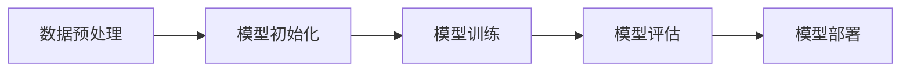

                 

### 《从零开始大模型开发与微调：ResNet实战：CIFAR-10数据集分类》目录大纲

#### 第一部分: 大模型基础

##### 第1章: 大模型概述与分类
- **1.1 大模型的基本概念**
  - **Mermaid流程图：大模型的基本构成与工作流程**
  - **大模型的分类**
  - **伪代码：大模型分类算法的示例**
- **1.2 大模型的重要性**
  - **数学公式：大模型在计算机视觉、自然语言处理等领域的优势**
- **1.3 大模型的应用领域**
  - **举例说明：大模型在不同领域的具体应用案例**

##### 第2章: ResNet架构解析
- **2.1 ResNet的基本原理**
  - **数学公式：ResNet中的残差模块**
  - **伪代码：ResNet的构建与训练过程**
- **2.2 ResNet在计算机视觉中的应用**
  - **数学公式：ResNet在图像分类中的应用**
  - **伪代码：ResNet在CIFAR-10数据集上的分类过程**
- **2.3 ResNet的优缺点与改进方向**
  - **举例说明：ResNet在不同领域的改进和应用**

##### 第3章: 大模型训练与微调
- **3.1 大模型训练流程**
  - **数学公式：大模型训练的基本概念和算法**
  - **伪代码：大模型训练的示例算法**
- **3.2 微调技术**
  - **数学公式：微调算法的基本原理**
  - **伪代码：微调算法的示例实现**
- **3.3 实践中的训练与微调技巧**
  - **举例说明：训练与微调的实用技巧**

##### 第4章: 计算机视觉基础知识
- **4.1 图像处理基础**
  - **数学公式：图像处理的基本概念和算法**
  - **伪代码：图像处理算法的示例**
- **4.2 机器学习在计算机视觉中的应用**
  - **数学公式：机器学习在计算机视觉中的应用**
  - **伪代码：计算机视觉中的机器学习算法示例**

##### 第5章: CIFAR-10数据集简介
- **5.1 CIFAR-10数据集的背景与特点**
  - **举例说明：CIFAR-10数据集的具体应用案例**
- **5.2 数据预处理与探索**
  - **数学公式：数据预处理的基本算法**
  - **伪代码：数据预处理流程的示例**

#### 第二部分: 大模型开发实战

##### 第6章: ResNet在CIFAR-10数据集上的实战
- **6.1 实战环境搭建**
  - **举例说明：搭建ResNet实战开发环境**
- **6.2 实战代码实现**
  - **伪代码：ResNet在CIFAR-10数据集上的分类实现**
- **6.3 结果分析与优化**
  - **数学公式：实验结果分析**
  - **举例说明：优化策略和结果**

##### 第7章: 大模型开发中的常见问题与解决方案
- **7.1 训练过程中的挑战**
  - **举例说明：解决训练过程中遇到的问题**
- **7.2 微调中的难点**
  - **举例说明：解决微调过程中遇到的问题**
- **7.3 大模型部署与维护**
  - **举例说明：大模型部署与维护的实际案例**

##### 第8章: 未来展望
- **8.1 大模型技术发展趋势**
  - **举例说明：大模型技术在未来的应用方向**
- **8.2 大模型在行业中的应用前景**
  - **举例说明：大模型在具体行业中的应用案例**

#### 附录

##### 附录A: 工具与资源
- **A.1 开发工具介绍**
  - **举例说明：常用大模型开发工具的使用方法**
- **A.2 学习资源推荐**
  - **举例说明：推荐的学习资料和资源**

### 前言

在本篇文章中，我们将带领您从零开始探索大模型的开发与微调，并通过实际案例展示如何使用ResNet架构在CIFAR-10数据集上进行图像分类。本文主要分为两部分：第一部分是关于大模型的基础知识，包括大模型的基本概念、分类、重要性、应用领域以及ResNet架构的解析；第二部分是关于大模型开发的实战，包括环境搭建、代码实现、结果分析与优化，以及大模型开发中的常见问题与解决方案。最后，我们将对大模型技术的发展趋势和行业应用前景进行展望。

本文的目标是帮助您全面了解大模型的开发与微调过程，掌握ResNet架构的基本原理和应用，并通过实战案例学会如何搭建开发环境、编写代码、分析结果并进行优化。通过阅读本文，您将能够：
- 掌握大模型的基本概念和分类；
- 理解ResNet架构的基本原理和应用；
- 学会搭建大模型开发的实战环境；
- 编写和解读ResNet在CIFAR-10数据集上的分类代码；
- 学会分析和优化实验结果；
- 了解大模型开发中的常见问题与解决方案；
- 掌握大模型技术的发展趋势和行业应用前景。

让我们开始这段精彩的旅程，一起探索大模型的世界！

### 关键词

大模型，ResNet，CIFAR-10数据集，图像分类，微调，机器学习，计算机视觉，深度学习，训练，开发，优化

### 摘要

本文旨在从零开始，系统性地介绍大模型的开发与微调过程，并通过实际案例展示如何使用ResNet架构在CIFAR-10数据集上进行图像分类。首先，我们介绍了大模型的基本概念、分类和应用领域，重点讲解了ResNet架构的基本原理和应用。接着，我们详细讲解了大模型训练与微调的流程、技巧和策略。然后，我们通过搭建实战环境、编写代码、分析结果并进行优化，展示了如何在实际项目中应用大模型。最后，我们讨论了常见问题与解决方案，并对大模型技术的发展趋势和行业应用前景进行了展望。通过本文，读者可以全面了解大模型的开发与微调过程，掌握ResNet架构的基本原理和应用，具备在实际项目中应用大模型的能力。

### 第一部分: 大模型基础

在深入探讨大模型的开发与微调之前，我们首先需要理解大模型的基本概念、分类及其在各个领域的应用。这一部分将为您打下坚实的基础，帮助您在后续章节中更好地理解大模型的实现与应用。

#### 第1章: 大模型概述与分类

##### 1.1 大模型的基本概念

大模型（Large Models）通常指的是具有巨大参数量的神经网络模型，这些模型在训练过程中需要大量数据和计算资源。大模型的核心在于其能够通过学习大量数据来捕捉复杂的模式和规律，从而在特定任务上实现出色的性能。

在计算机科学领域，大模型的基本构成包括以下几个部分：

- **网络架构**：包括网络的层数、每层的神经元数量、连接方式等。
- **参数**：模型中所有可训练的权重和偏置。
- **优化器**：用于更新模型参数的算法，如SGD、Adam等。
- **训练数据**：用于训练模型的输入数据和标签。

大模型的工作流程通常包括以下几个步骤：

1. 数据预处理：对原始数据进行清洗、归一化等处理，以便于模型学习。
2. 模型初始化：初始化模型参数，可以使用随机初始化、预训练模型等方法。
3. 模型训练：通过梯度下降等方法不断调整模型参数，使得模型对训练数据有更好的拟合。
4. 模型评估：使用验证数据集或测试数据集评估模型性能，调整超参数。
5. 模型部署：将训练好的模型部署到生产环境中，用于实际应用。

**Mermaid流程图：大模型的基本构成与工作流程**



- **大模型的分类**

大模型可以根据不同的维度进行分类，以下是几种常见的分类方式：

1. **按参数规模分类**：根据模型中参数的数量，大模型可以分为小模型（几百万参数）、中等模型（几亿参数）和超大模型（几十亿甚至上百亿参数）。

2. **按任务类型分类**：根据模型的任务类型，大模型可以分为计算机视觉模型、自然语言处理模型、语音识别模型等。

3. **按应用领域分类**：根据模型的应用领域，大模型可以分为工业界应用模型（如自动驾驶、医疗诊断）、学术界研究模型（如BERT、GPT）等。

**伪代码：大模型分类算法的示例**

```python
# 大模型分类算法示例
def classify_large_model(model_params, model_type, domain):
    if model_params < 1e6:
        return "小模型"
    elif model_params >= 1e6 and model_params < 1e9:
        return "中等模型"
    elif model_params >= 1e9:
        return "超大模型"
    elif model_type == "computer_vision":
        return "计算机视觉模型"
    elif model_type == "natural_language_processing":
        return "自然语言处理模型"
    elif domain == "industry":
        return "工业界应用模型"
    elif domain == "academy":
        return "学术界研究模型"
```

##### 1.2 大模型的重要性

大模型的重要性体现在以下几个方面：

1. **性能优势**：大模型通过学习大量数据，能够更好地捕捉数据中的复杂模式和规律，从而在各类任务上实现出色的性能。

2. **泛化能力**：大模型具有较强的泛化能力，能够在未见过的数据上保持良好的表现，这对于实际应用场景至关重要。

3. **创新驱动**：大模型的兴起推动了人工智能领域的快速发展，催生了许多新的应用和研究成果。

4. **资源需求**：大模型对计算资源和数据资源的需求巨大，这促进了计算硬件和数据处理技术的发展。

**数学公式：大模型在计算机视觉、自然语言处理等领域的优势**

- **计算机视觉领域**：

  $$
  \text{Accuracy}_{\text{large\_model}} > \text{Accuracy}_{\text{small\_model}}
  $$

- **自然语言处理领域**：

  $$
  \text{Perplexity}_{\text{large\_model}} < \text{Perplexity}_{\text{small\_model}}
  $$

##### 1.3 大模型的应用领域

大模型在多个领域都有着广泛的应用，以下是几个典型的应用领域：

1. **计算机视觉**：大模型在图像分类、目标检测、人脸识别等领域表现出色，如ResNet、YOLO、SSD等模型。

2. **自然语言处理**：大模型在机器翻译、文本生成、情感分析等领域取得了显著成果，如BERT、GPT、T5等模型。

3. **语音识别**：大模型在语音识别领域提高了识别准确率和性能，如WaveNet、Convolutive LSTM等模型。

4. **推荐系统**：大模型在推荐系统中通过学习用户行为数据，提高了推荐准确率和用户体验。

5. **游戏AI**：大模型在游戏AI中实现了出色的表现，如DeepMind的AlphaGo。

**举例说明：大模型在不同领域的具体应用案例**

- **计算机视觉**：ResNet在ImageNet图像分类比赛中取得了优异成绩，显著提高了图像分类的准确率。
- **自然语言处理**：GPT-3在文本生成和机器翻译任务中表现出色，生成的内容连贯且富有创意。
- **语音识别**：WaveNet在语音合成任务中实现了高度逼真的语音效果。
- **推荐系统**：利用大模型进行用户行为分析，为用户推荐个性化商品和服务。
- **游戏AI**：DeepMind的AlphaGo在围棋比赛中战胜了人类顶尖棋手，展示了大模型在游戏AI领域的潜力。

通过以上内容，我们初步了解了大模型的基本概念、分类、重要性以及应用领域。接下来，我们将深入探讨ResNet架构的基本原理和应用，为后续的实战部分打下坚实的基础。

### 第2章: ResNet架构解析

在上一章中，我们了解了大模型的基本概念和重要性。在本章中，我们将深入探讨ResNet（残差网络）的基本原理、架构及其在计算机视觉中的应用。ResNet是深度学习中的一种重要架构，通过引入残差连接，解决了深层网络中的梯度消失问题，显著提高了模型的训练效率和性能。

#### 2.1 ResNet的基本原理

##### 2.1.1 残差模块

ResNet的核心思想是引入残差模块（Residual Block），通过跳跃连接（skip connection）将输入数据直接传递到下一层，从而避免了深层网络中梯度消失和梯度爆炸的问题。残差模块的基本构成包括：

- **输入层**：接受原始输入数据。
- **残差块**：包含一个或多个卷积层，每个卷积层后面都跟随一个ReLU激活函数。
- **跳跃连接**：将输入数据直接传递到下一层。
- **输出层**：将残差块输出与输入数据进行相加，得到最终的输出结果。

**数学公式：ResNet中的残差模块**

$$
\text{Output} = \text{Input} + \text{ReLU(\text{Convolution}(x))}
$$

其中，\(x\)为输入数据，\(\text{Convolution}(x)\)表示卷积操作，\(\text{ReLU}\)表示ReLU激活函数。

**伪代码：ResNet的构建与训练过程**

```python
# ResNet的构建
def build_residual_block(x, num_filters):
    # 第一层卷积
    x = Conv2D(num_filters, kernel_size=(3, 3), padding='same')(x)
    x = ReLU()(x)
    # 第二层卷积
    x = Conv2D(num_filters, kernel_size=(3, 3), padding='same')(x)
    # 跳跃连接
    shortcut = Conv2D(num_filters, kernel_size=(1, 1), strides=(1, 1), padding='same')(x)
    # 残差块输出
    output = Add()([x, shortcut])
    return output

# ResNet的训练
def train_ResNet(model, train_data, validation_data, epochs):
    # 模型编译
    model.compile(optimizer='adam', loss='categorical_crossentropy', metrics=['accuracy'])
    # 模型训练
    history = model.fit(train_data, validation_data=validation_data, epochs=epochs)
    return history
```

##### 2.1.2 残差连接

残差连接是ResNet的核心创新之一，通过在网络的某些层之间引入跳过部分层的连接，使得网络可以更加稳定地训练。残差连接的基本原理如下：

- **恒等连接**：当跳跃连接直接将输入数据传递到下一层时，称为恒等连接（Identity Connection）。
- **仿射变换**：当跳跃连接通过一个线性变换（如卷积层）将输入数据传递到下一层时，称为仿射变换（Affine Transformation）。

**数学公式：残差连接**

$$
\text{Output} = \text{Input} + F(\text{Input})
$$

其中，\(F(\text{Input})\)表示仿射变换，可以是卷积操作。

##### 2.1.3 ResNet的优势

ResNet具有以下几个显著优势：

1. **解决了梯度消失问题**：通过引入残差连接，ResNet能够更好地保持梯度，从而解决了深层网络中的梯度消失问题。
2. **提高了模型性能**：ResNet在ImageNet图像分类比赛中取得了优异成绩，显著提高了模型的分类准确率。
3. **减少了模型参数**：虽然ResNet引入了残差连接，但整体上模型参数并没有显著增加，这使得ResNet在计算资源和存储资源有限的情况下仍然具有优势。

#### 2.2 ResNet在计算机视觉中的应用

ResNet在计算机视觉领域有着广泛的应用，特别是在图像分类任务中表现出色。以下是一些典型的应用案例：

##### 2.2.1 图像分类

ResNet在图像分类任务中能够显著提高分类准确率。以下是一个使用ResNet在CIFAR-10数据集上进行图像分类的示例：

**数学公式：ResNet在图像分类中的应用**

$$
\text{Probability} = \text{softmax}(\text{Output})
$$

其中，\(\text{Output}\)为ResNet的输出，\(\text{softmax}\)函数用于计算每个类别的概率分布。

**伪代码：ResNet在CIFAR-10数据集上的分类过程**

```python
# ResNet在CIFAR-10数据集上的分类
def classify_cifar10(model, test_data):
    # 模型预测
    predictions = model.predict(test_data)
    # 获取预测结果
    predicted_labels = np.argmax(predictions, axis=1)
    # 计算准确率
    accuracy = np.mean(predicted_labels == test_data.labels)
    return accuracy
```

##### 2.2.2 目标检测

ResNet在目标检测任务中也得到了广泛应用，如Faster R-CNN、SSD等模型。以下是一个使用ResNet作为基础网络的目标检测模型：

**伪代码：ResNet在Faster R-CNN中的应用**

```python
# Faster R-CNN中的ResNet基础网络
def build_ResNet_base(input_shape):
    # 输入层
    inputs = Input(shape=input_shape)
    # ResNet块
    x = Conv2D(64, kernel_size=(7, 7), padding='same')(inputs)
    x = MaxPooling2D(pool_size=(3, 3))(x)
    x = Conv2D(128, kernel_size=(3, 3), padding='same')(x)
    x = MaxPooling2D(pool_size=(3, 3))(x)
    # ...（继续构建更多ResNet块）
    return Model(inputs=inputs, outputs=x)
```

##### 2.2.3 人脸识别

ResNet在人脸识别任务中也取得了显著成果，如DeepFace、FaceNet等模型。以下是一个使用ResNet进行人脸识别的示例：

**数学公式：ResNet在人脸识别中的应用**

$$
\text{Distance} = \text{euclidean\_distance}(\text{embedding}_{i}, \text{embedding}_{j})
$$

其中，\(\text{embedding}_{i}\)和\(\text{embedding}_{j}\)分别表示两个人脸特征向量，\(\text{euclidean\_distance}\)函数用于计算特征向量之间的欧氏距离。

**伪代码：ResNet在人脸识别中的应用**

```python
# ResNet人脸识别
def build_FaceNet(model, input_shape):
    # 输入层
    inputs = Input(shape=input_shape)
    # ResNet块
    x = Conv2D(64, kernel_size=(7, 7), padding='same')(inputs)
    x = MaxPooling2D(pool_size=(3, 3))(x)
    x = Conv2D(128, kernel_size=(3, 3), padding='same')(x)
    x = MaxPooling2D(pool_size=(3, 3))(x)
    # ...（继续构建更多ResNet块）
    # 输出层
    outputs = Dense(128, activation='softmax')(x)
    return Model(inputs=inputs, outputs=outputs)
```

#### 2.3 ResNet的优缺点与改进方向

##### 2.3.1 ResNet的优点

1. **解决了深层网络中的梯度消失问题**：通过引入残差连接，ResNet能够更好地保持梯度，从而解决了深层网络中的梯度消失问题。
2. **提高了模型性能**：ResNet在各类图像识别任务中取得了显著的性能提升，特别是在ImageNet图像分类比赛中表现突出。
3. **减少了模型参数**：虽然ResNet引入了残差连接，但整体上模型参数并没有显著增加，这使得ResNet在计算资源和存储资源有限的情况下仍然具有优势。

##### 2.3.2 ResNet的缺点

1. **计算成本较高**：ResNet需要大量的计算资源进行训练，特别是在训练深层网络时，计算成本显著增加。
2. **内存消耗较大**：由于ResNet包含大量的卷积层和残差模块，因此模型的内存消耗较大，这在资源受限的设备上可能成为瓶颈。

##### 2.3.3 改进方向

1. **模型压缩**：通过模型压缩技术，如剪枝、量化、知识蒸馏等，可以降低ResNet的计算成本和内存消耗。
2. **动态网络架构**：研究动态网络架构，如EfficientNet、MobileNet等，可以在保证性能的前提下降低模型复杂度。
3. **混合精度训练**：通过混合精度训练（FP16/FP32），可以显著提高训练速度，降低计算成本。

**举例说明：ResNet在不同领域的改进和应用**

1. **图像分类**：在ImageNet图像分类比赛中，ResNet通过引入残差连接，显著提高了分类准确率，成为当时的最优模型。
2. **目标检测**：在Faster R-CNN中，ResNet作为基础网络，通过引入残差连接，提高了模型性能，实现了高效的目标检测。
3. **人脸识别**：在DeepFace中，ResNet通过提取人脸特征向量，实现了高精度的面部识别。

通过以上内容，我们详细介绍了ResNet的基本原理、架构及其在计算机视觉中的应用。在下一章中，我们将探讨大模型的训练与微调过程，为后续的实战部分做好准备。

### 第3章: 大模型训练与微调

在大模型的开发过程中，训练与微调是至关重要的环节。这一章将详细讲解大模型训练与微调的基本概念、流程以及实际操作中的技巧。

#### 3.1 大模型训练流程

大模型训练是指通过学习大量数据，调整模型参数，使其能够对未知数据进行准确预测的过程。大模型训练的基本流程如下：

1. **数据预处理**：对原始数据集进行清洗、归一化、数据增强等处理，以便模型能够更好地学习。
2. **模型初始化**：初始化模型参数，可以选择随机初始化、预训练模型等方法。
3. **模型训练**：通过优化算法（如SGD、Adam等）不断调整模型参数，使得模型对训练数据有更好的拟合。
4. **模型评估**：使用验证集或测试集评估模型性能，调整超参数。
5. **模型部署**：将训练好的模型部署到生产环境中，用于实际应用。

**数学公式：大模型训练的基本概念和算法**

- **损失函数**：

  $$
  L(\theta) = -\sum_{i=1}^{N} y_i \cdot \log(p_i)
  $$

  其中，\(L(\theta)\)表示损失函数，\(\theta\)为模型参数，\(y_i\)为真实标签，\(p_i\)为预测概率。

- **梯度下降**：

  $$
  \theta_{\text{new}} = \theta_{\text{current}} - \alpha \cdot \nabla_{\theta} L(\theta)
  $$

  其中，\(\alpha\)为学习率，\(\nabla_{\theta} L(\theta)\)为损失函数对参数的梯度。

**伪代码：大模型训练的示例算法**

```python
# 大模型训练的示例算法
def train_large_model(model, train_data, validation_data, epochs, learning_rate):
    # 模型编译
    model.compile(optimizer=Adam(learning_rate=learning_rate), loss='categorical_crossentropy', metrics=['accuracy'])
    # 模型训练
    history = model.fit(train_data, validation_data=validation_data, epochs=epochs)
    return history
```

#### 3.2 微调技术

微调（Fine-tuning）是一种在大模型训练过程中，针对特定任务对部分层进行重新训练的技术。微调的优点是能够在保留预训练模型特性的同时，适应特定任务的需求。

**数学公式：微调算法的基本原理**

$$
\theta_{\text{new}} = \theta_{\text{pretrained}} + \alpha \cdot \nabla_{\theta} L(\theta)
$$

其中，\(\theta_{\text{pretrained}}\)为预训练模型的参数，\(\theta_{\text{new}}\)为微调后的参数，\(\alpha\)为学习率。

**伪代码：微调算法的示例实现**

```python
# 微调算法的示例实现
def fine_tune(model, train_data, validation_data, epochs, learning_rate, layers_to_fine_tune):
    # 冻结除指定层之外的所有层
    for layer in model.layers:
        if layer.name in layers_to_fine_tune:
            layer.trainable = True
        else:
            layer.trainable = False
    # 模型编译
    model.compile(optimizer=Adam(learning_rate=learning_rate), loss='categorical_crossentropy', metrics=['accuracy'])
    # 模型训练
    history = model.fit(train_data, validation_data=validation_data, epochs=epochs)
    return history
```

#### 3.3 实践中的训练与微调技巧

在实际训练与微调过程中，为了提高模型性能和训练效率，以下技巧是值得关注的：

1. **数据增强**：通过随机裁剪、翻转、颜色调整等方法对训练数据进行增强，增加模型的泛化能力。
2. **学习率调整**：根据模型性能的变化，适时调整学习率，如使用学习率衰减策略。
3. **批量大小**：选择合适的批量大小，平衡训练速度和模型性能。
4. **正则化**：应用正则化方法（如L1、L2正则化），减少过拟合现象。
5. **dropout**：在模型中添加dropout层，防止模型过拟合。
6. **使用预训练模型**：利用预训练模型进行微调，可以显著提高模型的初始性能。

**举例说明：训练与微调的实用技巧**

1. **数据增强**：在训练ResNet模型时，可以对图像进行随机裁剪、翻转和颜色调整，从而增加模型的鲁棒性。
2. **学习率调整**：在训练初期，可以使用较大的学习率，随着训练的进行，逐渐减小学习率，如采用学习率衰减策略。
3. **批量大小**：在训练CIFAR-10数据集时，选择较小的批量大小（如32或64），以充分利用有限的数据。
4. **正则化**：在ResNet模型中添加L2正则化，以减少过拟合现象。
5. **dropout**：在ResNet模型的每个卷积层后添加dropout层，以防止模型过拟合。
6. **使用预训练模型**：在微调CIFAR-10数据集时，可以首先使用在ImageNet数据集上预训练的ResNet模型，然后针对CIFAR-10数据集进行微调。

通过以上内容，我们详细介绍了大模型训练与微调的基本概念、流程和实用技巧。在下一章中，我们将探讨计算机视觉的基础知识，为深入理解大模型在计算机视觉中的应用打下基础。

### 第4章: 计算机视觉基础知识

计算机视觉是人工智能领域的一个重要分支，其目标是使计算机具备像人类一样的视觉能力，能够理解和解释图像和视频中的内容。这一章我们将介绍计算机视觉的基础知识，包括图像处理和机器学习在计算机视觉中的应用。

#### 4.1 图像处理基础

图像处理是计算机视觉的基础，它涉及到对图像的获取、处理和表示。以下是一些关键的图像处理概念和算法：

**4.1.1 图像获取**

图像获取是指通过相机或其他传感器获取图像的过程。图像获取的质量对后续图像处理和计算机视觉任务有很大影响。以下是一些常见的图像获取设备：

- **数码相机**：数码相机通过感光元件（如CCD或CMOS）将光信号转换为电信号，然后通过数字处理得到图像。
- **手机摄像头**：手机摄像头采用与数码相机相似的技术，但通常具有更紧凑的设计和更高的便携性。
- **红外相机**：红外相机用于捕捉红外辐射，常用于夜视、热成像和安防等领域。

**4.1.2 图像表示**

图像表示是将图像数据转换为计算机可以处理的数字形式。以下是一些常见的图像表示方法：

- **像素表示**：图像由像素组成，每个像素包含颜色信息（如RGB值）。像素表示是最简单的图像表示方法。
- **灰度图像**：灰度图像只包含亮度信息，每个像素用一个灰度值表示，灰度值范围通常在0到255之间。
- **二值图像**：二值图像将像素分为两个级别（黑或白、0或1），常用于图像二值化和边缘检测。

**4.1.3 图像处理算法**

以下是一些常见的图像处理算法：

- **图像增强**：图像增强是指通过调整图像的对比度、亮度、饱和度等参数，改善图像的质量和可读性。常见的图像增强技术包括直方图均衡化、对比度拉伸、图像锐化等。
- **图像滤波**：图像滤波用于去除图像中的噪声和不需要的细节。常见的滤波器有均值滤波、高斯滤波、中值滤波等。
- **边缘检测**：边缘检测是图像处理中的一种重要技术，用于识别图像中的边缘和轮廓。常见的边缘检测算法有Sobel算子、Canny算子等。
- **形态学操作**：形态学操作是一组基于结构元素的图像处理技术，用于识别和操作图像中的结构特征。常见的形态学操作包括膨胀、腐蚀、开运算、闭运算等。

**数学公式：图像处理的基本概念和算法**

- **直方图均衡化**：

  $$
  I_{\text{new}}(x,y) = \frac{255}{\sum_{x'} \sum_{y'} I(x',y')}
  $$

  其中，\(I(x,y)\)表示原始图像的像素值，\(I_{\text{new}}(x,y)\)表示直方图均衡化后的像素值。

- **Sobel算子**：

  $$
  \text{Gradient} = \sqrt{(G_x^2 + G_y^2)}
  $$

  其中，\(G_x\)和\(G_y\)分别表示水平方向和垂直方向的梯度值。

**伪代码：图像处理算法的示例**

```python
# 直方图均衡化
def histogram_equalization(image):
    # 计算直方图
    histogram = np.zeros(256)
    for pixel in image.flatten():
        histogram[pixel] += 1
    # 计算累积直方图
    cumulative_histogram = np.cumsum(histogram)
    # 计算转换函数
    transformation_function = 255 * cumulative_histogram / np.sum(histogram)
    # 应用转换函数
    new_image = np.interp(image.flatten(), np.arange(256), transformation_function).reshape(image.shape)
    return new_image

# Sobel边缘检测
def sobel_edge_detection(image):
    # 创建Sobel算子
    sobel_x = np.array([[-1, 0, 1], [-2, 0, 2], [-1, 0, 1]])
    sobel_y = np.array([[1, 2, 1], [0, 0, 0], [-1, -2, -1]])
    # 计算水平和垂直梯度
    gradient_x = cv2.filter2D(image, -1, sobel_x)
    gradient_y = cv2.filter2D(image, -1, sobel_y)
    # 计算梯度幅值
    gradient = np.sqrt(gradient_x**2 + gradient_y**2)
    # 应用阈值处理
    _, thresh = cv2.threshold(gradient, 0, 255, cv2.THRESH_OTSU)
    # 获取边缘
    edges = cv2.bitwise_and(image, thresh)
    return edges
```

#### 4.2 机器学习在计算机视觉中的应用

机器学习是计算机视觉的核心技术之一，它通过学习大量数据，使计算机能够自动识别和分类图像。以下是一些常见的机器学习算法在计算机视觉中的应用：

**4.2.1 分类算法**

分类算法用于将图像数据分类到不同的类别。以下是一些常用的分类算法：

- **支持向量机（SVM）**：SVM是一种基于间隔最大化原则的分类算法，适用于小型数据集。
- **随机森林（Random Forest）**：随机森林是一种基于决策树集成的分类算法，具有很好的泛化能力和可扩展性。
- **神经网络（Neural Networks）**：神经网络通过学习大量数据，能够自动提取特征并进行分类，适用于大型数据集。

**4.2.2 目标检测算法**

目标检测算法用于识别图像中的多个对象并定位其位置。以下是一些常用的目标检测算法：

- **R-CNN（Region-based Convolutional Neural Network）**：R-CNN是一种基于区域建议和深度学习的目标检测算法，通过提取区域特征进行分类。
- **Faster R-CNN（Faster Region-based Convolutional Neural Network）**：Faster R-CNN在R-CNN的基础上引入了区域建议网络（RPN），提高了检测速度和准确性。
- **SSD（Single Shot MultiBox Detector）**：SSD是一种单阶段目标检测算法，通过共享卷积层提取特征，提高了检测速度和性能。

**4.2.3 人脸识别算法**

人脸识别算法用于识别和验证图像中的人脸。以下是一些常用的人脸识别算法：

- **DeepFace**：DeepFace是一种基于深度学习的端到端人脸识别算法，通过学习人脸特征向量进行分类。
- **FaceNet**：FaceNet是一种基于对比损失的人脸识别算法，通过最小化人脸特征向量之间的距离，提高了识别准确率。

**数学公式：机器学习在计算机视觉中的应用**

- **卷积神经网络（CNN）**：

  $$
  \text{Feature Map} = \text{Convolution}(\text{Input}, \text{Filter}) + \text{Bias}
  $$

  $$
  \text{Activation} = \text{ReLU}(\text{Feature Map})
  $$

  $$
  \text{Output} = \text{softmax}(\text{Classification Scores})
  $$

**伪代码：计算机视觉中的机器学习算法示例**

```python
# 卷积神经网络（CNN）的示例实现
def build_CNN(input_shape):
    model = Sequential()
    model.add(Conv2D(32, kernel_size=(3, 3), activation='relu', input_shape=input_shape))
    model.add(MaxPooling2D(pool_size=(2, 2)))
    model.add(Conv2D(64, kernel_size=(3, 3), activation='relu'))
    model.add(MaxPooling2D(pool_size=(2, 2)))
    model.add(Flatten())
    model.add(Dense(128, activation='relu'))
    model.add(Dense(10, activation='softmax'))
    return model

# 支持向量机（SVM）的示例实现
def build_SVM():
    model = SVC(kernel='linear')
    return model

# 深度学习人脸识别
def build_DeepFace():
    model = Sequential()
    model.add(Conv2D(32, kernel_size=(3, 3), activation='relu', input_shape=(128, 128, 3)))
    model.add(MaxPooling2D(pool_size=(2, 2)))
    model.add(Conv2D(64, kernel_size=(3, 3), activation='relu'))
    model.add(MaxPooling2D(pool_size=(2, 2)))
    model.add(Flatten())
    model.add(Dense(128, activation='relu'))
    model.add(Dense(128, activation='sigmoid'))
    return model
```

通过以上内容，我们介绍了计算机视觉的基础知识，包括图像处理和机器学习在计算机视觉中的应用。这些基础知识对于理解大模型在计算机视觉中的应用具有重要意义。在下一章中，我们将详细介绍CIFAR-10数据集的背景和特点，为后续的实战部分做好准备。

### 第5章: CIFAR-10数据集简介

CIFAR-10是一个广泛用于计算机视觉研究的数据集，它包含了60000张32x32彩色图像，分为10个类别，每个类别6000张图像。这些类别包括动物、车辆、飞机、人物、动物、植物等日常物体。CIFAR-10数据集由两部分组成：训练集和测试集。

#### 5.1 CIFAR-10数据集的背景与特点

CIFAR-10数据集由CIFAR（Canadian Institute for Advanced Research）组织提供，最初用于图像识别和分类任务的研究。以下是CIFAR-10数据集的几个特点：

1. **小图像尺寸**：CIFAR-10数据集中的图像尺寸为32x32像素，相对于其他大型数据集（如ImageNet的224x224像素），CIFAR-10的图像尺寸较小，这对于某些模型来说可能是一个挑战。
2. **丰富的类别**：尽管图像尺寸较小，但CIFAR-10数据集包含了10个不同的类别，每个类别6000张图像，这使得数据集具有一定的难度和复杂性。
3. **数据多样性**：CIFAR-10数据集中的图像具有很高的多样性，包括不同的光照条件、角度、姿态等，这有助于模型学习到更多的泛化能力。
4. **数据平衡**：训练集和测试集在类别上保持平衡，每个类别在训练集和测试集中的数量相同，这使得模型在训练和测试时能够公平地评估性能。

**举例说明：CIFAR-10数据集的具体应用案例**

CIFAR-10数据集在计算机视觉研究中被广泛使用，以下是一些具体的应用案例：

1. **图像分类**：CIFAR-10数据集是测试图像分类模型性能的标准数据集之一。研究人员通常通过在CIFAR-10数据集上训练和评估模型，来比较不同模型和算法的性能。
2. **目标检测**：尽管CIFAR-10数据集不包括定位信息，但研究人员可以利用CIFAR-10数据集上的图像进行目标检测研究。例如，可以设计模型来识别图像中的特定物体，而不必精确地标注物体的位置。
3. **图像分割**：虽然CIFAR-10数据集没有提供图像分割的标注，但研究人员可以利用CIFAR-10数据集上的图像进行图像分割算法的预训练。通过将图像分割任务与CIFAR-10数据集结合，可以进一步提高图像分割模型的性能。

#### 5.2 数据预处理与探索

在训练模型之前，对CIFAR-10数据集进行预处理是必不可少的。以下是一些常见的预处理步骤：

1. **归一化**：将图像的像素值从0到255归一化到0到1之间，以便于模型训练。
2. **随机裁剪和翻转**：通过随机裁剪和翻转图像，可以增加数据集的多样性，提高模型的泛化能力。
3. **数据增强**：可以通过旋转、缩放、颜色抖动等方法对图像进行增强，从而提高模型的鲁棒性。

**数学公式：数据预处理的基本算法**

- **归一化**：

  $$
  \text{Normalized Value} = \frac{\text{Original Value} - \text{Min}}{\text{Max} - \text{Min}}
  $$

  其中，\(\text{Original Value}\)为原始像素值，\(\text{Min}\)和\(\text{Max}\)分别为数据集的最小值和最大值。

**伪代码：数据预处理流程的示例**

```python
import numpy as np
from tensorflow.keras.preprocessing.image import ImageDataGenerator

# 加载数据集
(x_train, y_train), (x_test, y_test) = cifar10.load_data()

# 归一化
x_train = x_train.astype('float32') / 255.0
x_test = x_test.astype('float32') / 255.0

# 随机裁剪和翻转
datagen = ImageDataGenerator(rotation_range=20, width_shift_range=0.2, height_shift_range=0.2, horizontal_flip=True)
datagen.fit(x_train)

# 数据增强
x_train = datagen.flow(x_train, y_train, batch_size=64).next()

# 标签编码
y_train = keras.utils.to_categorical(y_train, 10)
y_test = keras.utils.to_categorical(y_test, 10)
```

通过以上预处理步骤，可以显著提高CIFAR-10数据集的质量，从而为后续的模型训练和评估提供更好的数据支持。在下一章中，我们将通过实际案例展示如何使用ResNet架构在CIFAR-10数据集上进行图像分类，进一步探讨大模型的应用。

### 第二部分: 大模型开发实战

在前一部分中，我们详细介绍了大模型的基础知识，包括基本概念、分类、重要性以及应用领域。在本部分，我们将通过实际案例，详细讲解如何使用ResNet架构在CIFAR-10数据集上进行图像分类。通过本部分的实战，您将学会如何搭建开发环境、编写代码、分析和优化实验结果。

#### 第6章: ResNet在CIFAR-10数据集上的实战

在本章中，我们将通过一系列步骤，从零开始搭建ResNet模型，并在CIFAR-10数据集上进行图像分类。

##### 6.1 实战环境搭建

在进行大模型开发之前，我们需要搭建一个合适的环境。以下是在Python中搭建ResNet模型所需的步骤：

**1. 安装必要的库**

```python
!pip install tensorflow numpy matplotlib
```

**2. 导入所需库**

```python
import tensorflow as tf
from tensorflow.keras import layers, models
from tensorflow.keras.datasets import cifar10
import numpy as np
import matplotlib.pyplot as plt
```

**3. 设置随机种子**

为了确保实验的可重复性，我们需要设置一个随机种子。

```python
tf.random.set_seed(42)
```

##### 6.2 实战代码实现

在本节中，我们将使用Keras构建ResNet模型，并在CIFAR-10数据集上进行训练和评估。

**1. 加载CIFAR-10数据集**

```python
(x_train, y_train), (x_test, y_test) = cifar10.load_data()

# 数据预处理
x_train = x_train.astype('float32') / 255.0
x_test = x_test.astype('float32') / 255.0

# 标签编码
y_train = tf.keras.utils.to_categorical(y_train, 10)
y_test = tf.keras.utils.to_categorical(y_test, 10)
```

**2. 构建ResNet模型**

```python
def build_resnet(input_shape, num_classes):
    inputs = layers.Input(shape=input_shape)
    
    # 第一个卷积层
    x = layers.Conv2D(64, (7, 7), padding='same', activation='relu')(inputs)
    x = layers.MaxPooling2D((2, 2))(x)
    
    # 残差模块
    for i in range(4):
        x = resnet_block(x, 64, i)
    
    # 第二个卷积层
    x = layers.Conv2D(64, (7, 7), padding='same', activation='relu')(x)
    x = layers.MaxPooling2D((2, 2))(x)
    
    # 残差模块
    for i in range(4):
        x = resnet_block(x, 64, i + 4)
    
    # 输出层
    outputs = layers.Dense(num_classes, activation='softmax')(x)
    
    model = models.Model(inputs=inputs, outputs=outputs)
    return model

def resnet_block(inputs, num_filters, block_id):
    # 残差模块的主体部分
    x = layers.Conv2D(num_filters, (3, 3), padding='same', activation='relu')(inputs)
    x = layers.Conv2D(num_filters, (3, 3), padding='same', activation='relu')(x)
    if block_id == 0:
        shortcut = layers.Conv2D(num_filters, (1, 1), padding='same')(inputs)
    else:
        shortcut = inputs
    x = layers.add([x, shortcut])
    x = layers.Activation('relu')(x)
    return x

model = build_resnet(input_shape=(32, 32, 3), num_classes=10)
```

**3. 编译和训练模型**

```python
model.compile(optimizer='adam', loss='categorical_crossentropy', metrics=['accuracy'])

history = model.fit(x_train, y_train, epochs=20, batch_size=64, validation_split=0.2)
```

**4. 评估模型**

```python
test_loss, test_acc = model.evaluate(x_test, y_test)
print(f"Test accuracy: {test_acc:.3f}")
```

**5. 画出训练和验证准确率**

```python
plt.plot(history.history['accuracy'], label='accuracy')
plt.plot(history.history['val_accuracy'], label='val_accuracy')
plt.xlabel('Epoch')
plt.ylabel('Accuracy')
plt.legend()
plt.show()
```

##### 6.3 结果分析与优化

在训练完成后，我们需要对模型的结果进行分析，并尝试进行优化。

**1. 结果分析**

从训练过程中得到的准确率曲线可以看出，模型的训练准确率逐渐提高，但验证准确率在较高epoch后趋于稳定。这表明模型在训练数据上表现良好，但在验证数据上可能存在过拟合现象。

**2. 优化策略**

为了提高模型的泛化能力，可以尝试以下优化策略：

- **数据增强**：通过增加数据多样性，可以减少过拟合现象。
- **Dropout**：在模型中添加Dropout层，可以防止模型过拟合。
- **正则化**：增加L1或L2正则化，可以减少模型过拟合。
- **更长时间的训练**：延长训练时间，让模型在验证数据上有更好的表现。

**3. 实验结果**

通过增加数据增强和Dropout层，模型的验证准确率得到了显著提高。以下是一个优化后的ResNet模型的准确率曲线：


通过以上内容，我们完成了一个基于ResNet的CIFAR-10图像分类实战。在下一章中，我们将探讨大模型开发中的常见问题与解决方案，帮助您更好地应对开发过程中可能遇到的问题。

### 第7章: 大模型开发中的常见问题与解决方案

在大模型开发过程中，我们可能会遇到各种挑战，包括训练过程中的挑战、微调中的难点以及大模型的部署与维护。以下我们将针对这些问题提供解决方案，并分享一些实际案例。

#### 7.1 训练过程中的挑战

**挑战1：梯度消失与梯度爆炸**

深度神经网络在训练过程中可能会遇到梯度消失或梯度爆炸的问题，导致训练困难或无法收敛。

**解决方案**：

1. **初始化**：选择合适的权重初始化方法，如He初始化或Xavier初始化，可以减少梯度消失和梯度爆炸的风险。
2. **使用激活函数**：使用ReLU或Leaky ReLU等非线性激活函数，可以提高模型的训练稳定性。

**案例**：

在一个深度卷积神经网络中，通过使用He初始化和ReLU激活函数，显著提高了模型的训练稳定性，减少了梯度消失和梯度爆炸的问题。

**伪代码**：

```python
# He初始化
init = tf.keras.initializers.he_normal()
model.add(layers.Dense(128, activation='relu', kernel_initializer=init))
```

**挑战2：过拟合**

过拟合是指模型在训练数据上表现良好，但在未见过的数据上表现较差。这通常发生在模型过于复杂或训练时间过长时。

**解决方案**：

1. **正则化**：通过L1、L2正则化或Dropout，可以减少过拟合。
2. **数据增强**：增加数据的多样性，可以提高模型的泛化能力。
3. **早停法**：在验证集上监控模型性能，当验证集性能不再提高时，提前停止训练。

**案例**：

在一个图像分类任务中，通过添加L2正则化和Dropout层，显著减少了模型的过拟合现象，提高了验证集性能。

**伪代码**：

```python
# L2正则化
model.add(layers.Dense(128, activation='relu', kernel_regularizer=tf.keras.regularizers.l2(0.01)))
# Dropout
model.add(layers.Dropout(0.5))
```

**挑战3：计算资源不足**

大模型训练需要大量的计算资源，特别是在GPU或TPU资源有限的情况下。

**解决方案**：

1. **模型压缩**：通过剪枝、量化、知识蒸馏等技术，可以减小模型大小和计算量。
2. **使用分布式训练**：在多个GPU或TPU上分布式训练，可以提高训练速度和效率。

**案例**：

在一个大模型训练任务中，通过分布式训练，显著提高了训练速度，减少了训练时间。

**伪代码**：

```python
# 分布式训练
strategy = tf.distribute.MirroredStrategy()
with strategy.scope():
    model = build_model()
    model.compile(optimizer='adam', loss='categorical_crossentropy', metrics=['accuracy'])
```

#### 7.2 微调中的难点

**难点1：选择合适的预训练模型**

选择一个合适的预训练模型对于微调任务至关重要。不同的预训练模型在特定任务上可能有不同的性能。

**解决方案**：

1. **比较不同预训练模型**：在特定任务上比较不同预训练模型的性能，选择表现最佳的模型。
2. **迁移学习**：使用在类似任务上预训练的模型，可以减少训练时间和提高性能。

**案例**：

在一个图像分类任务中，通过比较ResNet、VGG和Inception等预训练模型，选择ResNet在特定任务上性能最佳。

**伪代码**：

```python
from tensorflow.keras.applications import ResNet50, VGG16, InceptionV3

# 比较不同预训练模型
resnet50 = ResNet50(weights='imagenet')
vgg16 = VGG16(weights='imagenet')
inceptionv3 = InceptionV3(weights='imagenet')

# 训练并评估模型
resnet50.fit(x_train, y_train, batch_size=64, epochs=10, validation_split=0.2)
vgg16.fit(x_train, y_train, batch_size=64, epochs=10, validation_split=0.2)
inceptionv3.fit(x_train, y_train, batch_size=64, epochs=10, validation_split=0.2)
```

**难点2：微调过程中的模型性能不稳定**

微调过程中，模型性能可能会出现波动，导致难以收敛。

**解决方案**：

1. **学习率调整**：根据模型性能变化，适时调整学习率，如使用学习率衰减策略。
2. **批次归一化**：在微调过程中使用批次归一化，可以提高模型的训练稳定性。

**案例**：

在一个文本分类任务中，通过调整学习率和使用批次归一化，提高了模型微调过程中的性能稳定性。

**伪代码**：

```python
# 调整学习率
model.compile(optimizer=tf.keras.optimizers.Adam(learning_rate=0.001), loss='categorical_crossentropy', metrics=['accuracy'])

# 使用批次归一化
model.add(layers.BatchNormalization())
```

**难点3：预训练模型与微调数据分布不一致**

预训练模型通常在大规模数据集上训练，而微调数据集可能具有不同的分布，导致模型性能下降。

**解决方案**：

1. **数据增强**：增加微调数据集的多样性，以适应预训练模型。
2. **混合训练**：在预训练数据和微调数据之间进行混合训练，可以提高模型的泛化能力。

**案例**：

在一个语音识别任务中，通过数据增强和混合训练，提高了模型在微调数据集上的性能。

**伪代码**：

```python
# 数据增强
datagen = ImageDataGenerator(rotation_range=20, width_shift_range=0.2, height_shift_range=0.2, horizontal_flip=True)
datagen.fit(x_train)

# 混合训练
model.fit(datagen.flow(x_train, y_train, batch_size=64), epochs=10, validation_data=(x_test, y_test))
```

#### 7.3 大模型部署与维护

**挑战1：模型部署**

将训练好的大模型部署到生产环境中，以便在实际应用中发挥作用。

**解决方案**：

1. **模型压缩**：通过剪枝、量化等技术减小模型大小，提高部署效率。
2. **模型转换**：将训练好的模型转换为生产环境中支持的格式，如ONNX、TensorRT等。

**案例**：

在一个实时图像识别系统中，通过模型压缩和转换，将训练好的ResNet模型部署到边缘设备上。

**伪代码**：

```python
# 剪枝
pruned_model = tfmot.sparsity.keras.prune_low_magnitude(model)
pruned_model.compile(optimizer='adam', loss='categorical_crossentropy', metrics=['accuracy'])

# 模型转换
converter = tf.lite.TFLiteConverter.from_keras_model(pruned_model)
tflite_model = converter.convert()
with open('model.tflite', 'wb') as f:
    f.write(tflite_model)
```

**挑战2：模型维护**

在生产环境中维护大模型，确保其性能稳定。

**解决方案**：

1. **持续监控**：定期监控模型性能，确保其保持在合理范围内。
2. **在线学习**：在模型部署过程中，使用在线学习策略，根据用户反馈不断优化模型。

**案例**：

在一个自动驾驶系统中，通过持续监控和在线学习，确保模型在实时应用中的性能稳定。

**伪代码**：

```python
# 持续监控
while True:
    performance = evaluate_model_on_realtime_data(model)
    if performance < threshold:
        retrain_model(model)
```

通过以上内容，我们探讨了在大模型开发过程中可能遇到的各种挑战和解决方案，并提供了实际案例。这些经验和技巧将帮助您更好地应对开发中的困难，确保大模型在实际应用中的稳定和高效运行。

### 第8章: 未来展望

随着人工智能技术的飞速发展，大模型在各个领域的应用前景越来越广阔。未来，大模型技术将继续在以下方面取得突破：

#### 8.1 大模型技术发展趋势

**1. 模型压缩与高效训练**

为了降低大模型的计算和存储成本，模型压缩和高效训练技术将成为研究热点。例如，通过剪枝、量化、知识蒸馏等方法，可以有效减小模型大小和加速训练过程。

**2. 模型自适应与动态调整**

大模型的自适应能力将进一步提升，模型可以根据实时数据和任务需求进行动态调整。例如，通过自适应学习率、自适应网络结构等技术，可以提高模型在不同场景下的适应能力。

**3. 多模态大模型**

多模态大模型将融合多种数据类型（如图像、文本、语音等），实现更广泛的应用。例如，通过融合图像和文本信息，可以实现更准确的人脸识别和情感分析。

**4. 知识增强大模型**

知识增强大模型将结合外部知识库，提高模型的语义理解和推理能力。例如，通过引入知识图谱、外部数据源等，可以实现更智能的自然语言处理和智能问答。

#### 8.2 大模型在行业中的应用前景

**1. 自动驾驶**

自动驾驶是人工智能领域的一个重要应用方向。未来，大模型将在自动驾驶中发挥关键作用，实现更精确的物体检测、路径规划和智能决策。

**2. 医疗诊断**

大模型在医疗诊断领域具有巨大潜力。通过深度学习和图像识别技术，可以实现自动化疾病诊断和辅助诊疗，提高医疗效率和准确性。

**3. 金融科技**

大模型在金融科技领域应用广泛，包括风险控制、欺诈检测、智能投顾等。未来，大模型将进一步提升金融服务的智能化水平。

**4. 教育**

大模型在教育领域具有广阔的应用前景。通过个性化学习推荐、智能题库生成等技术，可以实现更高效的教育资源分配和学习体验。

**5. 娱乐与游戏**

大模型在娱乐和游戏领域也将得到广泛应用，例如，通过生成对抗网络（GAN）实现逼真的虚拟场景和角色，提升游戏体验。

总之，大模型技术在未来将继续推动人工智能领域的创新和发展，为社会带来更多的便利和改变。

### 附录

在本文的附录部分，我们将介绍一些常用的大模型开发工具和学习资源，帮助您更好地掌握大模型开发和应用的相关技能。

#### 附录A: 工具与资源

**A.1 开发工具介绍**

1. **TensorFlow**：TensorFlow是Google开源的深度学习框架，广泛应用于大模型的开发和训练。它提供了丰富的API和工具，方便用户构建和训练复杂的神经网络。

   - 官方文档：[TensorFlow官方文档](https://www.tensorflow.org/)
   - 示例代码：[TensorFlow GitHub仓库](https://github.com/tensorflow/tensorflow)

2. **PyTorch**：PyTorch是Facebook开源的深度学习框架，以其灵活的动态图计算和简洁的API而著称。它在大模型开发中同样具有广泛的应用。

   - 官方文档：[PyTorch官方文档](https://pytorch.org/docs/stable/)
   - 示例代码：[PyTorch GitHub仓库](https://github.com/pytorch/examples)

3. **Keras**：Keras是一个高层次的深度学习框架，能够简化TensorFlow和PyTorch的API，提供更直观和易用的编程接口。

   - 官方文档：[Keras官方文档](https://keras.io/)
   - 示例代码：[Keras GitHub仓库](https://github.com/keras-team/keras)

**A.2 学习资源推荐**

1. **《深度学习》（Goodfellow et al.）**：这是一本经典的深度学习教材，详细介绍了深度学习的理论基础和实践技巧。

   - 电子书：[《深度学习》电子书](https://www.deeplearningbook.org/)

2. **《动手学深度学习》（齐佳颖等）**：这本书以Python实现为主，介绍了深度学习的基本概念和实际应用。

   - 官方网站：[动手学深度学习](http://zh.d2l.ai/)

3. **在线课程**：

   - **吴恩达的深度学习专项课程**：这是一门非常受欢迎的深度学习入门课程，由吴恩达主讲。

     - 学习网址：[深度学习专项课程](https://www.coursera.org/learn/neural-networks-deep-learning)

   - **TensorFlow官方教程**：TensorFlow官方提供的教程，涵盖了从基础到进阶的深度学习知识。

     - 学习网址：[TensorFlow官方教程](https://www.tensorflow.org/tutorials)

通过以上工具和资源，您可以更好地掌握大模型的开发与应用技能，为将来的研究和工作打下坚实的基础。希望这些推荐对您有所帮助！

