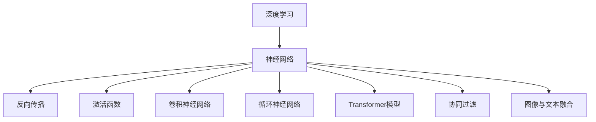

                 

# 从零开始大模型开发与微调：一学就会的深度学习基础算法详解

## 关键词
深度学习，大模型开发，微调，基础算法，神经网络，反向传播，优化算法，计算机视觉，自然语言处理，推荐系统

## 摘要
本文旨在为初学者提供一份系统而详细的深度学习基础教程，涵盖了从深度学习的基本概念到实际应用的全过程。通过清晰的逻辑和丰富的实例，本文详细介绍了深度学习的关键算法和模型，包括神经网络、反向传播、优化算法以及计算机视觉、自然语言处理和推荐系统等领域的应用。文章以Mermaid流程图、伪代码和实际项目案例为辅助工具，帮助读者深入理解深度学习的核心原理和实现方法。

## 目录大纲

### 《从零开始大模型开发与微调：一学就会的深度学习基础算法详解》目录大纲

#### 第一部分：深度学习基础

##### 第1章：深度学习简介

- **1.1 深度学习的起源与发展**
- **1.2 深度学习的基本原理**
- **1.3 常见的深度学习模型**
- **1.4 深度学习中的数学基础**

##### 第2章：深度学习算法详解

- **2.1 前向传播与反向传播**
- **2.2 深度学习优化算法**
- **2.3 深度学习中的超参数调整**

##### 第3章：深度学习在计算机视觉中的应用

- **3.1 卷积神经网络在图像分类中的应用**
- **3.2 卷积神经网络在目标检测中的应用**
- **3.3 卷积神经网络在语义分割中的应用**

##### 第4章：深度学习在自然语言处理中的应用

- **4.1 循环神经网络在序列数据处理中的应用**
- **4.2 长短时记忆网络在序列数据处理中的应用**
- **4.3 Transformer模型在自然语言处理中的应用**

##### 第5章：深度学习在推荐系统中的应用

- **5.1 协同过滤方法**
- **5.2 深度学习方法在推荐系统中的应用**
- **5.3 深度学习在推荐系统中的挑战与解决方案**

##### 第6章：深度学习在计算机视觉与自然语言处理结合中的应用

- **6.1 图像与文本融合方法**
- **6.2 计算机视觉与自然语言处理结合的应用**

##### 第7章：深度学习项目实战

- **7.1 深度学习项目流程**
- **7.2 实际案例解析**

#### 附录

- **附录A：深度学习开发工具与资源**
- **附录B：深度学习常见问题解答**

---

以下为书中涉及的核心概念与架构的 Mermaid 流程图：



---

以下为深度学习算法中前向传播与反向传播的伪代码：

```python
# 前向传播
def forward_propagation(x, parameters):
    """
    前向传播函数
    """
    # 初始化参数
    z = np.dot(x, parameters["W"]) + parameters["b"]
    a = activation_function(z)
    return a

# 反向传播
def backward_propagation(x, y, parameters, activation):
    """
    反向传播函数
    """
    # 计算误差
    dZ = activation - y
    # 计算梯度
    dW = np.dot(x.T, dZ)
    db = np.sum(dZ, axis=0)
    return dW, db
```

---

以下为深度学习中的数学模型与数学公式的详细讲解：

- **线性模型**

  - 假设输入特征为 $x$,权重为 $w$,偏置为 $b$，则预测值为 $z = wx + b$。

  - 损失函数为 $J(w, b) = \frac{1}{2} \sum_{i=1}^{n} (wx_i + b - y_i)^2$。

  - 梯度计算为 $\frac{\partial J}{\partial w} = x - y, \frac{\partial J}{\partial b} = x - y$。

- **逻辑回归**

  - 输入特征为 $x$,权重为 $w$,偏置为 $b$，则预测值为 $z = wx + b$。

  - 概率为 $p = \frac{1}{1 + e^{-(wx + b)}}$。

  - 损失函数为 $J(w, b) = -\sum_{i=1}^{n} y_i \log(p) + (1 - y_i) \log(1 - p)$。

  - 梯度计算为 $\frac{\partial J}{\partial w} = x - y p(1 - p), \frac{\partial J}{\partial b} = x - y p(1 - p)$。

---

以下为深度学习项目实战中的代码实现与解析：

- **图像分类项目**

  ```python
  # 导入必要的库
  import tensorflow as tf
  import matplotlib.pyplot as plt
  
  # 初始化模型
  model = tf.keras.Sequential([
      tf.keras.layers.Conv2D(32, (3, 3), activation='relu', input_shape=(28, 28, 1)),
      tf.keras.layers.MaxPooling2D(2, 2),
      tf.keras.layers.Conv2D(64, (3, 3), activation='relu'),
      tf.keras.layers.MaxPooling2D(2, 2),
      tf.keras.layers.Flatten(),
      tf.keras.layers.Dense(64, activation='relu'),
      tf.keras.layers.Dense(10, activation='softmax')
  ])
  
  # 编译模型
  model.compile(optimizer='adam', loss='categorical_crossentropy', metrics=['accuracy'])
  
  # 加载数据集
  (train_images, train_labels), (test_images, test_labels) = tf.keras.datasets.mnist.load_data()
  
  # 预处理数据
  train_images = train_images.reshape((60000, 28, 28, 1)).astype('float32') / 255
  test_images = test_images.reshape((10000, 28, 28, 1)).astype('float32') / 255
  
  # 编码标签
  train_labels = tf.keras.utils.to_categorical(train_labels)
  test_labels = tf.keras.utils.to_categorical(test_labels)
  
  # 训练模型
  model.fit(train_images, train_labels, epochs=5, batch_size=64)
  
  # 测试模型
  test_loss, test_acc = model.evaluate(test_images, test_labels)
  print(f"Test accuracy: {test_acc:.3f}")
  
  # 可视化预测结果
  plt.figure(figsize=(10, 10))
  for i in range(25):
      plt.subplot(5, 5, i+1)
      plt.xticks([])
      plt.yticks([])
      plt.grid(False)
      plt.imshow(test_images[i], cmap=plt.cm.binary)
      plt.xlabel(np.argmax(model.predict(test_images[i]).numpy()))
  plt.show()
  ```

  - **代码解读与分析**：这段代码使用 TensorFlow 和 Keras 构建了一个简单的卷积神经网络来对 MNIST 数据集进行图像分类。首先，代码导入了必要的库，并初始化了模型。然后，加载并预处理了数据集，包括调整图像的大小和归一化处理。接着，编码了标签并编译了模型。在训练模型后，测试了模型的准确率，并使用可视化展示了模型的预测结果。

---

接下来，我们将根据目录大纲，逐步深入探讨深度学习的各个方面。

---

现在，我们正式开始文章正文部分的撰写。

## 第一部分：深度学习基础

### 第1章：深度学习简介

#### 1.1 深度学习的起源与发展

深度学习作为人工智能的一个重要分支，起源于上世纪80年代。当时，神经网络的研究主要集中在简单的网络结构和简单的学习任务上。然而，随着计算能力的提升和数据量的爆炸性增长，深度学习得到了飞速发展。

深度学习的基本思想是通过模拟人脑的结构和功能，构建大量人工神经元，并通过大量的数据训练这些神经元，使其能够自动从数据中学习到有用的特征。这一思想最早可以追溯到1958年由Frank Rosenblatt提出的感知机模型，它是神经网络的开端。

随着时间的推移，深度学习经历了多个发展阶段。1986年，Rumelhart、Hinton和Williams等人提出了反向传播算法，这一算法使得神经网络能够通过多层结构进行学习，从而开启了深度学习的黄金时代。在1990年代，由于计算资源的限制，深度学习的研究进展缓慢。直到2006年，Geoffrey Hinton等人提出了一种有效的训练深层网络的方法，即深度置信网络（Deep Belief Network），深度学习的研究再次迎来了春天。

近年来，随着GPU和TPU等计算硬件的普及，以及大规模数据集和深度学习框架（如TensorFlow和PyTorch）的发展，深度学习在图像识别、语音识别、自然语言处理、推荐系统等领域取得了重大突破。2012年，AlexNet在ImageNet竞赛中取得了前所未有的准确率，标志着深度学习在计算机视觉领域的崛起。

#### 1.2 深度学习的基本原理

深度学习的基本原理基于人工神经网络（Artificial Neural Networks，ANN）。人工神经网络是由大量简单的人工神经元组成的网络，通过学习输入数据和输出数据之间的关系，实现对数据的处理和预测。

#### 1.2.1 神经网络

神经网络中的基本单元是神经元，也称为节点或单元。每个神经元接收多个输入信号，并通过对这些输入信号进行加权求和处理，产生一个输出信号。这个输出信号经过激活函数处理后，传递给下一个神经元。神经网络的层次结构使得它能够处理复杂的数据和处理高层次的特征。

神经网络可以分为输入层、隐藏层和输出层。输入层接收外部输入信号，隐藏层对输入信号进行处理和特征提取，输出层产生最终的输出结果。

#### 1.2.2 反向传播算法

反向传播算法是深度学习中最核心的算法之一。它通过前向传播计算网络输出，然后通过反向传播计算网络参数的梯度，从而优化网络参数。

前向传播过程中，输入数据通过网络传递，每个神经元计算其输出值。反向传播过程中，计算每个神经元输出值与实际输出值之间的误差，并根据误差计算每个参数的梯度。

反向传播算法的基本步骤如下：

1. 前向传播：将输入数据传递到网络中，计算每个神经元的输出值。
2. 计算误差：计算网络输出值与实际输出值之间的误差。
3. 反向传播：从输出层开始，依次计算每个神经元的梯度。
4. 更新参数：使用梯度下降或其他优化算法更新网络参数。

#### 1.2.3 激活函数

激活函数是神经网络中非常重要的部分，它用于对神经元输出进行非线性变换，使得神经网络具有非线性能力。常见的激活函数包括：

- **Sigmoid函数**：$f(x) = \frac{1}{1 + e^{-x}}$，输出范围为(0, 1)，可以用于二分类问题。
- **ReLU函数**：$f(x) = \max(0, x)$，输出为非负值，可以加速网络训练。
- **Tanh函数**：$f(x) = \frac{e^x - e^{-x}}{e^x + e^{-x}}$，输出范围为(-1, 1)。
- **Softmax函数**：$f(x)_i = \frac{e^{x_i}}{\sum_{j=e^{x_j}}}$，用于多分类问题，将神经元输出转换为概率分布。

#### 1.2.4 常见的深度学习模型

深度学习模型种类繁多，下面介绍几种常见的深度学习模型：

- **卷积神经网络（CNN）**：用于图像分类、目标检测和图像生成等任务，通过卷积层、池化层和全连接层等结构提取图像特征。
- **循环神经网络（RNN）**：用于处理序列数据，如时间序列预测、语音识别和机器翻译等，通过隐藏状态和循环结构处理序列中的依赖关系。
- **长短时记忆网络（LSTM）**：是RNN的一种改进，可以解决长序列依赖问题，适用于复杂的序列数据处理。
- **Transformer模型**：是一种基于自注意力机制的深度学习模型，广泛应用于自然语言处理领域，如机器翻译、文本生成和问答系统等。

#### 1.2.5 深度学习中的数学基础

深度学习涉及大量的数学知识，包括线性代数、概率论、信息论和最优化方法等。以下简要介绍深度学习中的数学基础：

- **线性代数**：矩阵运算、向量空间、特征值和特征向量等是深度学习中常用的线性代数知识。
- **概率论与信息论**：概率分布、条件概率、期望和方差等概率论知识，以及信息熵、交叉熵和KL散度等信息论知识在深度学习中有广泛应用。
- **最优化方法**：梯度下降、动量法、自适应优化方法等最优化方法用于优化深度学习模型参数。

#### 1.3 常见的深度学习模型

在深度学习领域，有许多经典的模型被广泛应用于不同领域的任务。以下是一些常见的深度学习模型及其应用场景：

##### 1.3.1 卷积神经网络（CNN）

卷积神经网络（Convolutional Neural Network，CNN）是一种专门用于处理图像数据的深度学习模型。它通过卷积层、池化层和全连接层等结构提取图像特征，实现图像分类、目标检测和图像生成等任务。

- **应用场景**：图像分类、目标检测、图像分割、图像生成等。

- **结构**：

  1. **卷积层**：通过卷积操作提取图像特征。
  2. **池化层**：降低特征图的尺寸，减少模型参数和计算量。
  3. **全连接层**：对提取的特征进行分类。

- **经典模型**：

  1. **AlexNet**：第一个在ImageNet竞赛中取得优异成绩的卷积神经网络。
  2. **VGGNet**：通过堆叠多个卷积层和池化层，实现高效的图像分类。
  3. **ResNet**：通过残差连接解决深层网络训练困难的问题。
  4. **Inception**：通过将多个卷积核合并，提高特征提取能力。

##### 1.3.2 循环神经网络（RNN）

循环神经网络（Recurrent Neural Network，RNN）是一种用于处理序列数据的深度学习模型。它通过隐藏状态和循环结构处理序列中的依赖关系，实现时间序列预测、语音识别和机器翻译等任务。

- **应用场景**：时间序列预测、语音识别、机器翻译等。

- **结构**：

  1. **输入层**：接收序列数据。
  2. **隐藏层**：通过循环结构处理序列数据，更新隐藏状态。
  3. **输出层**：产生最终的输出结果。

- **经典模型**：

  1. **LSTM（长短时记忆网络）**：通过门控机制解决长序列依赖问题。
  2. **GRU（门控循环单元）**：简化LSTM结构，提高计算效率。
  3. **Seq2Seq模型**：通过编码器和解码器结构实现序列到序列的映射。

##### 1.3.3 Transformer模型

Transformer模型是一种基于自注意力机制的深度学习模型，广泛应用于自然语言处理领域，如机器翻译、文本生成和问答系统等。

- **应用场景**：机器翻译、文本生成、问答系统等。

- **结构**：

  1. **自注意力机制**：通过计算输入序列中每个元素之间的注意力权重，对输入序列进行加权求和。
  2. **多头注意力**：将自注意力机制扩展到多个注意力头，提高特征提取能力。
  3. **编码器和解码器**：编码器将输入序列编码为固定长度的向量，解码器根据编码器的输出生成输出序列。

- **经典模型**：

  1. **BERT**：通过预先训练和微调，实现高效的文本理解。
  2. **GPT**：通过自回归语言模型生成文本。
  3. **T5**：通过将文本转换为编码器-解码器任务，实现跨领域的文本生成。

##### 1.3.4 网络嵌入（Network Embedding）

网络嵌入是一种将图中的节点映射到低维连续向量空间的方法，广泛应用于社交网络分析、推荐系统和图神经网络等。

- **应用场景**：社交网络分析、推荐系统、图神经网络等。

- **方法**：

  1. **基于矩阵分解的方法**：通过矩阵分解将节点嵌入到低维向量空间。
  2. **基于随机游走的方法**：通过随机游走生成节点之间的相似性矩阵，然后进行降维。
  3. **基于图卷积神经网络的方法**：通过图卷积神经网络提取节点特征，然后进行降维。

- **经典模型**：

  1. **DeepWalk**：通过随机游走生成节点序列，然后训练图卷积神经网络进行节点嵌入。
  2. **Node2Vec**：通过调节随机游走的步伐长度和重启概率，控制节点嵌入的丰富性和多样性。
  3. **GAT（图注意力网络）**：通过图注意力机制提取节点特征，实现高效的节点嵌入。

### 第2章：深度学习算法详解

深度学习算法是构建深度学习模型的核心，主要包括前向传播与反向传播、优化算法和超参数调整等。本章将详细讲解这些算法的原理和应用。

#### 2.1 前向传播与反向传播

前向传播和反向传播是深度学习训练过程中最基本的两个步骤。前向传播用于计算网络输出，反向传播用于计算网络参数的梯度。

##### 2.1.1 前向传播

前向传播是从输入层开始，将输入数据通过网络的各个层传递，直到输出层的计算过程。在每个神经元中，输入值通过权重矩阵与前一层的输出值相乘，然后加上偏置项，最后通过激活函数进行处理。前向传播的目的是计算网络输出。

以下是一个简单的神经网络前向传播的伪代码：

```python
# 前向传播
def forward_propagation(x, parameters):
    """
    前向传播函数
    """
    # 初始化网络参数
    W1, b1 = parameters["W1"], parameters["b1"]
    W2, b2 = parameters["W2"], parameters["b2"]

    # 计算第一层的输出
    z1 = np.dot(x, W1) + b1
    a1 = activation_function(z1)

    # 计算第二层的输出
    z2 = np.dot(a1, W2) + b2
    a2 = activation_function(z2)

    return a2
```

在这个例子中，`x` 是输入数据，`W1` 和 `b1` 是第一层的权重和偏置，`W2` 和 `b2` 是第二层的权重和偏置，`activation_function` 是激活函数。

##### 2.1.2 反向传播

反向传播是深度学习训练过程中的关键步骤，用于计算网络参数的梯度。反向传播是从输出层开始，反向计算每个层中的梯度，然后更新网络参数。反向传播的目的是优化网络参数，使得网络输出更接近真实值。

以下是一个简单的神经网络反向传播的伪代码：

```python
# 反向传播
def backward_propagation(a2, y, parameters):
    """
    反向传播函数
    """
    # 计算输出层的误差
    dZ2 = a2 - y

    # 计算第二层的梯度
    dW2 = np.dot(a1.T, dZ2)
    db2 = np.sum(dZ2, axis=0)

    # 计算第一层的梯度
    dZ1 = np.dot(dZ2, W2.T)
    dW1 = np.dot(x.T, dZ1)
    db1 = np.sum(dZ1, axis=0)

    return dW1, dW2, db1, db2
```

在这个例子中，`a2` 是输出层的输出，`y` 是真实标签，`a1` 是第一层的输出，`W2` 和 `W1` 是第二层和第一层的权重，`db2` 和 `db1` 是第二层和第一层的偏置。

##### 2.1.3 梯度下降法

梯度下降法是一种优化算法，用于更新网络参数。在梯度下降法中，通过计算网络参数的梯度，按照梯度的方向更新参数，以最小化损失函数。

以下是一个简单的梯度下降法的伪代码：

```python
# 梯度下降法
def gradient_descent(parameters, gradients, learning_rate):
    """
    梯度下降函数
    """
    # 更新权重和偏置
    parameters["W1"] = parameters["W1"] - learning_rate * gradients["dW1"]
    parameters["b1"] = parameters["b1"] - learning_rate * gradients["db1"]
    parameters["W2"] = parameters["W2"] - learning_rate * gradients["dW2"]
    parameters["b2"] = parameters["b2"] - learning_rate * gradients["db2"]

    return parameters
```

在这个例子中，`parameters` 是网络参数，`gradients` 是梯度，`learning_rate` 是学习率。

#### 2.2 深度学习优化算法

深度学习优化算法用于调整网络参数，以最小化损失函数。以下是一些常见的深度学习优化算法：

##### 2.2.1 随机梯度下降（SGD）

随机梯度下降（Stochastic Gradient Descent，SGD）是最常见的优化算法之一。它通过随机选择一部分训练样本，计算这部分样本的梯度，然后更新网络参数。

以下是一个简单的随机梯度下降的伪代码：

```python
# 随机梯度下降
def stochastic_gradient_descent(parameters, gradients, learning_rate, num_epochs, batch_size):
    """
    随机梯度下降函数
    """
    for epoch in range(num_epochs):
        for i in range(0, len(training_data), batch_size):
            # 随机选择一个批量
            x_batch, y_batch = training_data[i:i+batch_size]

            # 计算梯度
            gradients = backward_propagation(forward_propagation(x_batch), y_batch, parameters)

            # 更新参数
            parameters = gradient_descent(parameters, gradients, learning_rate)

    return parameters
```

在这个例子中，`training_data` 是训练数据集，`num_epochs` 是训练轮数，`batch_size` 是批量大小。

##### 2.2.2 动量法（Momentum）

动量法（Momentum）是一种改进的优化算法，通过引入动量项，减少参数更新的震荡，加快收敛速度。

以下是一个简单的动量法的伪代码：

```python
# 动量法
def momentum(parameters, gradients, learning_rate, momentum):
    """
    动量法函数
    """
    # 初始化动量
    velocity = {"dW1": 0, "db1": 0, "dW2": 0, "db2": 0}

    # 更新动量
    velocity = {
        "dW1": momentum * velocity["dW1"] - learning_rate * gradients["dW1"],
        "db1": momentum * velocity["db1"] - learning_rate * gradients["db1"],
        "dW2": momentum * velocity["dW2"] - learning_rate * gradients["dW2"],
        "db2": momentum * velocity["db2"] - learning_rate * gradients["db2"]
    }

    # 更新参数
    parameters = {
        "W1": parameters["W1"] + velocity["dW1"],
        "b1": parameters["b1"] + velocity["db1"],
        "W2": parameters["W2"] + velocity["dW2"],
        "b2": parameters["b2"] + velocity["db2"]
    }

    return parameters, velocity
```

在这个例子中，`momentum` 是动量系数。

##### 2.2.3 AdaGrad

AdaGrad是一种自适应学习率的优化算法，它通过调整学习率，使得每个参数的学习率与其历史梯度平方的平均值成反比。

以下是一个简单的AdaGrad的伪代码：

```python
# AdaGrad
def ada_grad(parameters, gradients, learning_rate, epsilon):
    """
    AdaGrad函数
    """
    # 初始化梯度平方和
    squared_gradients = {"dW1": 0, "db1": 0, "dW2": 0, "db2": 0}

    # 更新梯度平方和
    squared_gradients = {
        "dW1": squared_gradients["dW1"] + gradients["dW1"] ** 2,
        "db1": squared_gradients["db1"] + gradients["db1"] ** 2,
        "dW2": squared_gradients["dW2"] + gradients["dW2"] ** 2,
        "db2": squared_gradients["db2"] + gradients["db2"] ** 2
    }

    # 更新参数
    parameters = {
        "W1": parameters["W1"] - learning_rate / (np.sqrt(squared_gradients["dW1"]) + epsilon),
        "b1": parameters["b1"] - learning_rate / (np.sqrt(squared_gradients["db1"]) + epsilon),
        "W2": parameters["W2"] - learning_rate / (np.sqrt(squared_gradients["dW2"]) + epsilon),
        "b2": parameters["b2"] - learning_rate / (np.sqrt(squared_gradients["db2"]) + epsilon)
    }

    return parameters, squared_gradients
```

在这个例子中，`epsilon` 是一个很小的常数，用于防止除以零。

##### 2.2.4 RMSProp

RMSProp是一种基于AdaGrad改进的优化算法，它通过使用梯度平方的指数加权移动平均值来动态调整学习率。

以下是一个简单的RMSProp的伪代码：

```python
# RMSProp
def rmsprop(parameters, gradients, learning_rate, decay_rate, epsilon):
    """
    RMSProp函数
    """
    # 初始化梯度平方和
    squared_gradients = {"dW1": 0, "db1": 0, "dW2": 0, "db2": 0}

    # 更新梯度平方和
    squared_gradients = {
        "dW1": decay_rate * squared_gradients["dW1"] + (1 - decay_rate) * gradients["dW1"] ** 2,
        "db1": decay_rate * squared_gradients["db1"] + (1 - decay_rate) * gradients["db1"] ** 2,
        "dW2": decay_rate * squared_gradients["dW2"] + (1 - decay_rate) * gradients["dW2"] ** 2,
        "db2": decay_rate * squared_gradients["db2"] + (1 - decay_rate) * gradients["db2"] ** 2
    }

    # 更新参数
    parameters = {
        "W1": parameters["W1"] - learning_rate / (np.sqrt(squared_gradients["dW1"]) + epsilon),
        "b1": parameters["b1"] - learning_rate / (np.sqrt(squared_gradients["db1"]) + epsilon),
        "W2": parameters["W2"] - learning_rate / (np.sqrt(squared_gradients["dW2"]) + epsilon),
        "b2": parameters["b2"] - learning_rate / (np.sqrt(squared_gradients["db2"]) + epsilon)
    }

    return parameters, squared_gradients
```

在这个例子中，`decay_rate` 是衰减率。

##### 2.2.5 Adam

Adam是一种结合了动量法和RMSProp优点的优化算法，具有较好的收敛速度和稳定性。

以下是一个简单的Adam的伪代码：

```python
# Adam
def adam(parameters, gradients, learning_rate, beta1, beta2, epsilon):
    """
    Adam函数
    """
    # 初始化一阶矩估计和二阶矩估计
    m = {"dW1": 0, "db1": 0, "dW2": 0, "db2": 0}
    v = {"dW1": 0, "db1": 0, "dW2": 0, "db2": 0}

    # 更新一阶矩估计和二阶矩估计
    m = {
        "dW1": beta1 * m["dW1"] + (1 - beta1) * gradients["dW1"],
        "db1": beta1 * m["db1"] + (1 - beta1) * gradients["db1"],
        "dW2": beta1 * m["dW2"] + (1 - beta1) * gradients["dW2"],
        "db2": beta1 * m["db2"] + (1 - beta1) * gradients["db2"]
    }
    v = {
        "dW1": beta2 * v["dW1"] + (1 - beta2) * gradients["dW1"] ** 2,
        "db1": beta2 * v["db1"] + (1 - beta2) * gradients["db1"] ** 2,
        "dW2": beta2 * v["dW2"] + (1 - beta2) * gradients["dW2"] ** 2,
        "db2": beta2 * v["db2"] + (1 - beta2) * gradients["db2"] ** 2
    }

    # 去偏估计
    m_hat = {"dW1": m["dW1"] / (1 - beta1 ** t), "db1": m["db1"] / (1 - beta1 ** t), "dW2": m["dW2"] / (1 - beta1 ** t), "db2": m["db2"] / (1 - beta1 ** t)}
    v_hat = {"dW1": v["dW1"] / (1 - beta2 ** t), "db1": v["db1"] / (1 - beta2 ** t), "dW2": v["dW2"] / (1 - beta2 ** t), "db2": v["db2"] / (1 - beta2 ** t)}

    # 更新参数
    parameters = {
        "W1": parameters["W1"] - learning_rate * m_hat["dW1"] / (np.sqrt(v_hat["dW1"]) + epsilon),
        "b1": parameters["b1"] - learning_rate * m_hat["db1"] / (np.sqrt(v_hat["db1"]) + epsilon),
        "W2": parameters["W2"] - learning_rate * m_hat["dW2"] / (np.sqrt(v_hat["dW2"]) + epsilon),
        "b2": parameters["b2"] - learning_rate * m_hat["db2"] / (np.sqrt(v_hat["db2"]) + epsilon)
    }

    return parameters
```

在这个例子中，`beta1` 和 `beta2` 是一阶矩估计和二阶矩估计的指数衰减率，`t` 是训练轮数。

#### 2.3 深度学习中的超参数调整

深度学习模型的性能很大程度上取决于超参数的选择。超参数是在训练过程中无法通过学习算法自动调整的参数，如学习率、批量大小、迭代次数等。合理的超参数调整可以显著提高模型的性能。

##### 2.3.1 学习率

学习率是调整模型参数的重要超参数，它决定了每次参数更新的幅度。学习率过大可能导致参数更新过快，从而错过最小损失函数点；学习率过小则可能导致训练过程过慢。

常见的学习率调整方法包括：

- **固定学习率**：在训练过程中保持学习率不变。
- **逐步下降学习率**：在训练过程中逐步减小学习率。
- **自适应学习率**：根据训练过程自动调整学习率，如AdaGrad、RMSProp和Adam等。

##### 2.3.2 批大小

批大小是指每次训练过程中同时处理的样本数量。批大小影响模型的训练效率和梯度稳定性。较小的批大小可以提高模型的泛化能力，但训练速度较慢；较大的批大小可以提高训练速度，但可能降低模型的泛化能力。

常见的选择方法包括：

- **固定批大小**：在训练过程中保持批大小不变。
- **动态调整批大小**：根据训练过程自动调整批大小。

##### 2.3.3 迭代次数

迭代次数是指训练过程中完成多次前向传播和反向传播的次数。足够的迭代次数可以确保模型充分学习数据，但过多的迭代次数可能导致过拟合。

常见的选择方法包括：

- **固定迭代次数**：在训练过程中保持迭代次数不变。
- **动态调整迭代次数**：根据训练过程的收敛情况自动调整迭代次数。

## 第二部分：深度学习在计算机视觉中的应用

### 第3章：深度学习在计算机视觉中的应用

计算机视觉是深度学习应用的重要领域之一。深度学习模型，特别是卷积神经网络（CNN），在图像分类、目标检测和语义分割等领域取得了显著的成果。本章将详细介绍这些应用场景和相应的深度学习模型。

#### 3.1 卷积神经网络在图像分类中的应用

图像分类是计算机视觉的基础任务之一，其目标是给图像分配一个类别标签。深度学习模型，特别是卷积神经网络（CNN），在图像分类中表现出色。

##### 3.1.1 AlexNet

AlexNet是深度学习在图像分类领域的一个重要里程碑。它由五个卷积层、三个最大池化层、两个全连接层和一个softmax输出层组成。以下是AlexNet的主要结构：

1. **输入层**：接收227x227x3的输入图像。
2. **卷积层1**：使用96个大小为11x11、步长为4、填充为相同的卷积核进行卷积操作，然后使用ReLU激活函数。
3. **最大池化层1**：使用3x3的最大池化层。
4. **卷积层2**：使用256个大小为5x5、步长为1、填充为相同的卷积核进行卷积操作，然后使用ReLU激活函数。
5. **最大池化层2**：使用3x3的最大池化层。
6. **卷积层3**：使用384个大小为3x3、步长为1、填充为相同的卷积核进行卷积操作，然后使用ReLU激活函数。
7. **卷积层4**：使用384个大小为3x3、步长为1、填充为相同的卷积核进行卷积操作，然后使用ReLU激活函数。
8. **卷积层5**：使用256个大小为3x3、步长为1、填充为相同的卷积核进行卷积操作，然后使用ReLU激活函数。
9. **最大池化层3**：使用3x3的最大池化层。
10. **全连接层1**：使用4096个神经元的全连接层，然后使用ReLU激活函数。
11. **全连接层2**：使用4096个神经元的全连接层，然后使用ReLU激活函数。
12. **输出层**：使用1000个神经元的softmax输出层。

##### 3.1.2 VGGNet

VGGNet是在AlexNet之后出现的深度学习模型，以其简洁的结构和显著的性能而著称。VGGNet的核心思想是通过重复使用小尺寸卷积核（如3x3）和较小的步长（如1x1）来增加网络的深度和参数数量。

VGGNet有多个变体，如VGG16、VGG19等，以下是VGG16的主要结构：

1. **输入层**：接收224x224x3的输入图像。
2. **卷积层1**：使用64个大小为3x3、步长为1、填充为相同的卷积核进行卷积操作，然后使用ReLU激活函数。
3. **卷积层2**：使用64个大小为3x3、步长为1、填充为相同的卷积核进行卷积操作，然后使用ReLU激活函数。
4. **最大池化层1**：使用2x2的最大池化层。
5. **卷积层3**：使用128个大小为3x3、步长为1、填充为相同的卷积核进行卷积操作，然后使用ReLU激活函数。
6. **卷积层4**：使用128个大小为3x3、步长为1、填充为相同的卷积核进行卷积操作，然后使用ReLU激活函数。
7. **最大池化层2**：使用2x2的最大池化层。
8. **卷积层5**：使用256个大小为3x3、步长为1、填充为相同的卷积核进行卷积操作，然后使用ReLU激活函数。
9. **卷积层6**：使用256个大小为3x3、步长为1、填充为相同的卷积核进行卷积操作，然后使用ReLU激活函数。
10. **卷积层7**：使用256个大小为3x3、步长为1、填充为相同的卷积核进行卷积操作，然后使用ReLU激活函数。
11. **最大池化层3**：使用2x2的最大池化层。
12. **全连接层1**：使用4096个神经元的全连接层，然后使用ReLU激活函数。
13. **全连接层2**：使用4096个神经元的全连接层，然后使用ReLU激活函数。
14. **输出层**：使用1000个神经元的softmax输出层。

##### 3.1.3 ResNet

ResNet（残差网络）是另一种重要的深度学习模型，它通过引入残差连接解决了深层网络训练困难的问题。ResNet的核心思想是引入跳跃连接，使得信息可以直接从输入层传递到输出层，从而减少了深层网络的梯度消失和梯度爆炸问题。

ResNet的基本结构包括多个残差块（Residual Block），每个残差块包含两个卷积层，其中一个卷积层的步长为2。以下是ResNet的主要结构：

1. **输入层**：接收224x224x3的输入图像。
2. **卷积层1**：使用64个大小为7x7、步长为2、填充为相同的卷积核进行卷积操作，然后使用ReLU激活函数。
3. **最大池化层1**：使用3x3的最大池化层。
4. **残差块1**：包含多个残差块，每个残差块包含两个卷积层，其中一个卷积层的步长为2。
5. **残差块2**：包含多个残差块，每个残差块包含两个卷积层，其中一个卷积层的步长为2。
6. **残差块3**：包含多个残差块，每个残差块包含两个卷积层，其中一个卷积层的步长为2。
7. **全局平均池化层**：使用全局平均池化层。
8. **全连接层1**：使用4096个神经元的全连接层，然后使用ReLU激活函数。
9. **全连接层2**：使用4096个神经元的全连接层，然后使用ReLU激活函数。
10. **输出层**：使用1000个神经元的softmax输出层。

##### 3.1.4 Inception

Inception模型是另一种重要的深度学习模型，它通过将不同大小的卷积核和池化层组合在一起，提高了网络的表示能力。Inception模型的核心思想是引入多尺度卷积层，使得网络可以同时学习不同尺度的特征。

Inception模型包括多个Inception模块，每个模块包含多个分支。以下是Inception模型的主要结构：

1. **输入层**：接收224x224x3的输入图像。
2. **卷积层1**：使用64个大小为7x7、步长为2、填充为相同的卷积核进行卷积操作，然后使用ReLU激活函数。
3. **最大池化层1**：使用3x3的最大池化层。
4. **Inception模块1**：包含多个分支，每个分支包含不同的卷积核和池化层。
5. **卷积层2**：使用192个大小为1x1、步长为1、填充为相同的卷积核进行卷积操作，然后使用ReLU激活函数。
6. **卷积层3**：使用128个大小为3x3、步长为1、填充为相同的卷积核进行卷积操作，然后使用ReLU激活函数。
7. **卷积层4**：使用128个大小为3x3、步长为1、填充为相同的卷积核进行卷积操作，然后使用ReLU激活函数。
8. **全连接层1**：使用2048个神经元的全连接层，然后使用ReLU激活函数。
9. **全连接层2**：使用2048个神经元的全连接层，然后使用ReLU激活函数。
10. **输出层**：使用1000个神经元的softmax输出层。

#### 3.2 卷积神经网络在目标检测中的应用

目标检测是计算机视觉领域的另一个重要任务，其目标是识别图像中的目标并定位目标的位置。深度学习模型，特别是卷积神经网络（CNN），在目标检测中取得了显著的成果。

##### 3.2.1 R-CNN系列

R-CNN（Region-based CNN）是目标检测领域的一个重要模型，它通过区域提议算法（如SelectROI）和深度学习模型（如CNN）进行目标检测。R-CNN系列包括以下模型：

1. **R-CNN**：使用区域提议算法生成候选区域，然后使用CNN提取特征，最后使用SVM分类器进行分类。
2. **Fast R-CNN**：在R-CNN的基础上，引入了Region of Interest（RoI）池化层，提高了计算效率。
3. **Faster R-CNN**：引入了区域提议网络（Region Proposal Network，RPN），进一步提高了检测速度。
4. **R-FCN**：将全卷积网络（FCN）引入目标检测，实现了无需候选区域的端到端目标检测。

##### 3.2.2 FPN

FPN（Feature Pyramid Network）是一种用于目标检测的深度学习模型，它通过在不同层次的特征图中提取特征，实现了多尺度特征融合。FPN的主要结构包括：

1. **底层的特征图**：使用原始特征图作为底层特征图。
2. **中间层的特征图**：通过上采样和特征融合，生成中间层特征图。
3. **顶层的特征图**：通过上采样和特征融合，生成顶层特征图。
4. **区域提议网络（RPN）**：在每个特征图上使用RPN进行区域提议和分类。

##### 3.2.3 YOLO系列

YOLO（You Only Look Once）是目标检测领域的一个重要模型，它通过将整个图像分成多个网格单元，每个网格单元预测多个边界框和类别概率。YOLO系列包括以下模型：

1. **YOLOv1**：将图像划分为7x7的网格单元，每个网格单元预测2个边界框和1个类别概率。
2. **YOLOv2**：引入了锚框（Anchor Box）和特征金字塔网络（FPN），提高了检测精度。
3. **YOLOv3**：进一步优化了网络结构，提高了检测速度和精度。
4. **YOLOv4**：引入了CSPDarknet53作为主干网络，并使用了多个注意力机制，进一步提高了性能。

#### 3.3 卷积神经网络在语义分割中的应用

语义分割是计算机视觉领域的另一个重要任务，其目标是给图像中的每个像素分配一个类别标签。深度学习模型，特别是卷积神经网络（CNN），在语义分割中取得了显著的成果。

##### 3.3.1 FCN

FCN（Fully Convolutional Network）是一种用于语义分割的深度学习模型，它通过将全连接层替换为卷积层，实现了端到端的语义分割。FCN的主要结构包括：

1. **卷积层**：使用多个卷积层提取特征。
2. **池化层**：使用池化层降低特征图的维度。
3. **反卷积层**：使用反卷积层将特征图上采样到原始图像的大小。
4. **分类层**：使用分类层对特征图进行分类。

##### 3.3.2 U-Net

U-Net是一种用于语义分割的深度学习模型，它通过将卷积层和反卷积层结合在一起，实现了上下文信息和局部细节的融合。U-Net的主要结构包括：

1. **卷积层1**：使用多个卷积层提取特征。
2. **池化层1**：使用池化层降低特征图的维度。
3. **卷积层2**：使用多个卷积层提取特征。
4. **池化层2**：使用池化层降低特征图的维度。
5. **反卷积层**：使用反卷积层将特征图上采样到原始图像的大小。
6. **分类层**：使用分类层对特征图进行分类。

##### 3.3.3 DeepLab系列

DeepLab系列是一种用于语义分割的深度学习模型，它通过引入空洞卷积（Atrous Convolution）和深度可分离卷积（Depthwise Separable Convolution），实现了高效的上下文信息提取。DeepLab系列包括以下模型：

1. **DeepLab V1**：使用空洞卷积提取上下文信息，然后使用全连接层进行分类。
2. **DeepLab V2**：引入了多尺度特征融合，进一步提高了分割精度。
3. **DeepLab V3**：通过引入编码器-解码器结构，实现了端到端的语义分割。
4. **DeepLab V3+**：进一步优化了网络结构，提高了分割性能。

##### 3.3.4 PSPNet

PSPNet（Pyramid Scene Parsing Network）是一种用于语义分割的深度学习模型，它通过引入金字塔池化模块（Pyramid Pooling Module），实现了多尺度特征融合。PSPNet的主要结构包括：

1. **卷积层**：使用多个卷积层提取特征。
2. **金字塔池化模块**：使用金字塔池化模块提取多尺度特征。
3. **分类层**：使用分类层对特征图进行分类。

## 第三部分：深度学习在自然语言处理中的应用

### 第4章：深度学习在自然语言处理中的应用

自然语言处理（NLP）是人工智能的一个重要分支，旨在使计算机能够理解和处理人类语言。深度学习在NLP领域中发挥了重要作用，推动了诸如文本分类、情感分析、机器翻译等任务的显著进展。本章将详细介绍深度学习在NLP中的应用，包括循环神经网络（RNN）、长短时记忆网络（LSTM）和Transformer模型。

#### 4.1 循环神经网络（RNN）在序列数据处理中的应用

循环神经网络（Recurrent Neural Network，RNN）是处理序列数据的一种强大模型。与传统的前馈神经网络不同，RNN具有循环结构，能够保存历史信息并利用这些信息来处理后续的输入。RNN的这种特性使其在处理语言任务时特别有效。

##### 4.1.1 RNN的基本结构

RNN由输入层、隐藏层和输出层组成。每个时间步，RNN会接收一个输入向量，并生成一个输出向量。隐藏层的状态会根据当前的输入和前一个时间步的隐藏状态更新。以下是一个RNN的简化模型：

$$
h_t = \sigma(W_h \cdot [h_{t-1}, x_t] + b_h)
$$

$$
y_t = W_o \cdot h_t + b_o
$$

其中，$h_t$ 表示第 $t$ 个时间步的隐藏状态，$x_t$ 表示第 $t$ 个时间步的输入，$y_t$ 表示第 $t$ 个时间步的输出。$\sigma$ 表示激活函数，通常是Sigmoid或Tanh函数。$W_h$ 和 $W_o$ 分别是隐藏层到输出层的权重矩阵，$b_h$ 和 $b_o$ 分别是隐藏层和输出层的偏置项。

##### 4.1.2 RNN的局限性

尽管RNN在处理序列数据时表现出色，但它也面临一些局限性。最显著的问题是梯度消失和梯度爆炸问题，这导致在训练深层RNN时难以更新参数。此外，RNN难以处理长距离依赖关系，即当前时间步的输出难以依赖于远早之前的时间步的输入。

##### 4.1.3 应用实例

RNN在自然语言处理中有很多应用实例，包括文本分类、序列标注和机器翻译等。

- **文本分类**：使用RNN可以捕捉文本序列中的特征，从而对文本进行分类。例如，可以使用RNN对新闻文章进行分类，将其分为政治、体育、科技等类别。

- **序列标注**：RNN可以用于对文本序列中的单词或字符进行标注，如命名实体识别（Named Entity Recognition，NER）。在NER任务中，RNN可以识别出文本中的地点、人名、组织等实体。

- **机器翻译**：RNN在机器翻译中取得了显著的成功。通过将源语言文本序列和目标语言文本序列作为输入，RNN可以生成翻译结果。例如，使用RNN可以将英文文本翻译成中文。

#### 4.2 长短时记忆网络（LSTM）在序列数据处理中的应用

为了解决RNN的梯度消失和梯度爆炸问题，以及处理长距离依赖关系，研究人员提出了长短时记忆网络（Long Short-Term Memory，LSTM）。LSTM通过引入门控机制，能够有效地保持和更新长距离依赖信息。

##### 4.2.1 LSTM的基本结构

LSTM的基本单元是记忆单元（cell），每个记忆单元由三个门组成：输入门、遗忘门和输出门。

1. **输入门**：控制当前输入信息对记忆单元状态的影响。

   $$
   i_t = \sigma(W_i \cdot [h_{t-1}, x_t] + b_i)
   $$

2. **遗忘门**：控制上一时间步的隐藏状态对当前记忆单元状态的影响。

   $$
   f_t = \sigma(W_f \cdot [h_{t-1}, x_t] + b_f)
   $$

3. **输出门**：控制当前记忆单元状态对当前输出信息的影响。

   $$
   o_t = \sigma(W_o \cdot [h_{t-1}, x_t] + b_o)
   $$

其中，$i_t$、$f_t$ 和 $o_t$ 分别是输入门、遗忘门和输出门的输出。$W_i$、$W_f$ 和 $W_o$ 分别是输入门、遗忘门和输出门的权重矩阵，$b_i$、$b_f$ 和 $b_o$ 分别是输入门、遗忘门和输出门的偏置项。

记忆单元状态的计算如下：

$$
c_t = f_t \odot c_{t-1} + i_t \odot \sigma(W_c \cdot [h_{t-1}, x_t] + b_c)
$$

$$
h_t = o_t \odot \sigma(c_t)
$$

其中，$\odot$ 表示元素乘积，$c_t$ 是当前记忆单元状态，$c_{t-1}$ 是上一时间步的记忆单元状态。$W_c$ 是记忆单元权重矩阵，$b_c$ 是记忆单元偏置项。

##### 4.2.2 LSTM的优势

LSTM在处理序列数据时具有以下优势：

- **解决梯度消失和梯度爆炸问题**：通过门控机制，LSTM能够有效地控制信息的流动，从而避免梯度消失和梯度爆炸问题。

- **处理长距离依赖关系**：LSTM能够通过遗忘门和输入门控制信息的流动，从而在长序列中保持重要的依赖关系。

##### 4.2.3 应用实例

LSTM在自然语言处理中有广泛的应用，包括文本生成、语音识别和机器翻译等。

- **文本生成**：LSTM可以用于生成自然语言文本，如故事、诗歌等。通过训练LSTM模型，可以生成与输入文本风格相似的新文本。

- **语音识别**：LSTM可以用于将语音信号转换为文本。在语音识别任务中，LSTM能够捕捉语音信号的序列特征，从而准确地将语音转换为文本。

- **机器翻译**：LSTM在机器翻译中取得了显著的成功。通过将源语言文本序列和目标语言文本序列作为输入，LSTM可以生成高质量的翻译结果。

#### 4.3 Transformer模型在自然语言处理中的应用

Transformer模型是一种基于自注意力机制的深度学习模型，它在自然语言处理领域取得了巨大的成功。Transformer通过并行处理和自注意力机制，实现了高效和强大的语言表示能力。

##### 4.3.1 Transformer的基本结构

Transformer模型由编码器（Encoder）和解码器（Decoder）两部分组成。编码器将输入序列编码为固定长度的向量，解码器根据编码器的输出生成输出序列。

1. **编码器**：编码器由多个编码层（Encoder Layer）堆叠而成。每个编码层包括两个子层：自注意力子层（Self-Attention Sublayer）和前馈子层（Feed-Forward Sublayer）。

   - **自注意力子层**：通过自注意力机制计算输入序列中每个元素之间的注意力权重，对输入序列进行加权求和。

     $$
     \text{Attention}(Q, K, V) = \frac{QK^T}{\sqrt{d_k}} \odot V
     $$

     其中，$Q$、$K$ 和 $V$ 分别是查询向量、键向量和值向量，$d_k$ 是键向量的维度。

   - **前馈子层**：通过两个线性层进行前馈计算。

     $$
     \text{FFN}(X) = \max(0, XW_1 + b_1)W_2 + b_2
     $$

     其中，$X$ 是输入向量，$W_1$、$W_2$ 和 $b_1$、$b_2$ 分别是前馈层的权重和偏置项。

2. **解码器**：解码器由多个解码层（Decoder Layer）堆叠而成。每个解码层包括三个子层：自注意力子层、交叉注意力子层和前馈子层。

   - **自注意力子层**：计算解码器输出序列中每个元素之间的注意力权重。

     $$
     \text{Self-Attention}(Q, K, V) = \frac{QK^T}{\sqrt{d_k}} \odot V
     $$

   - **交叉注意力子层**：计算编码器输出序列和当前解码器输出序列之间的注意力权重。

     $$
     \text{Cross-Attention}(Q, K, V) = \frac{QK^T}{\sqrt{d_k}} \odot V
     $$

   - **前馈子层**：与编码器的前馈子层类似。

##### 4.3.2 Transformer的优势

Transformer模型在自然语言处理中具有以下优势：

- **并行处理**：由于自注意力机制的计算不依赖于时间顺序，Transformer可以实现并行计算，从而显著提高计算效率。

- **强大的表示能力**：自注意力机制允许模型同时关注输入序列中的所有元素，从而捕捉到更复杂的关系。

##### 4.3.3 应用实例

Transformer模型在自然语言处理中有很多应用实例，包括机器翻译、文本生成和问答系统等。

- **机器翻译**：Transformer在机器翻译中取得了显著的性能提升。通过将源语言和目标语言文本序列作为输入，Transformer可以生成高质量的翻译结果。

- **文本生成**：Transformer可以用于生成自然语言文本，如文章、诗歌等。通过训练Transformer模型，可以生成与输入文本风格相似的新文本。

- **问答系统**：Transformer可以用于问答系统，通过将问题和文档作为输入，Transformer可以找出与问题最相关的文档片段。

## 第四部分：深度学习在推荐系统中的应用

### 第5章：深度学习在推荐系统中的应用

推荐系统是深度学习在商业和工业领域的重要应用之一，其目标是预测用户可能感兴趣的项目，从而提高用户满意度和业务收益。本章将详细讨论深度学习在推荐系统中的应用，包括协同过滤方法、基于模型的协同过滤和序列模型在推荐系统中的应用。

#### 5.1 协同过滤方法

协同过滤（Collaborative Filtering，CF）是推荐系统中最常用的方法之一，其基本思想是通过用户对项目的评分或行为数据来预测用户对未知项目的评分或兴趣。

##### 5.1.1 协同过滤的基本概念

协同过滤可以分为两类：基于用户的协同过滤（User-based CF）和基于项目的协同过滤（Item-based CF）。

- **基于用户的协同过滤**：找到与目标用户兴趣相似的其他用户，然后根据这些相似用户的评分来推荐项目。

- **基于项目的协同过滤**：找到与目标项目相似的其他项目，然后根据这些相似项目的评分来推荐用户。

##### 5.1.2 协同过滤的挑战

尽管协同过滤在推荐系统中取得了成功，但它也存在一些挑战：

- **数据稀疏性**：用户和项目之间的交互数据通常是稀疏的，这意味着许多用户和项目之间的评分是未知的。

- **冷启动问题**：对于新用户或新项目，由于缺乏历史交互数据，难以进行准确推荐。

- **实时性**：传统协同过滤方法通常需要预先计算用户和项目之间的相似性矩阵，这限制了其在实时推荐系统中的应用。

#### 5.2 基于模型的协同过滤

基于模型的协同过滤（Model-based CF）是一种结合了机器学习和协同过滤思想的推荐方法，它通过建立用户和项目之间的潜在特征空间，来预测用户对未知项目的兴趣。

##### 5.2.1 潜在特征空间模型

潜在特征空间模型包括矩阵分解（Matrix Factorization）和神经网络模型。

- **矩阵分解**：矩阵分解通过将用户和项目的评分矩阵分解为低秩的因子矩阵，从而提取用户和项目的潜在特征。

  $$
  R = U \odot V^T
  $$

  其中，$R$ 是评分矩阵，$U$ 和 $V$ 分别是用户和项目的因子矩阵。

- **神经网络模型**：神经网络模型通过建立用户和项目之间的非线性关系，来预测用户对未知项目的兴趣。

  $$
  \text{预测评分} = \text{激活函数}(\text{权重矩阵} \cdot [\text{用户特征向量}, \text{项目特征向量}])
  $$

##### 5.2.2 基于模型的协同过滤的优势

基于模型的协同过滤具有以下优势：

- **减少数据稀疏性**：通过将评分矩阵分解为低秩的因子矩阵，可以减少数据稀疏性。

- **实时推荐**：神经网络模型可以实时更新用户和项目的特征向量，从而实现实时推荐。

#### 5.3 深度学习在推荐系统中的应用

深度学习在推荐系统中的应用主要集中在基于模型的协同过滤和序列模型。

##### 5.3.1 基于模型的协同过滤

深度学习在基于模型的协同过滤中的应用包括：

- **用户和项目的特征提取**：使用卷积神经网络（CNN）或循环神经网络（RNN）提取用户和项目的特征向量，从而提高推荐的准确性和实时性。

- **多模态数据融合**：结合用户的行为数据、内容数据和交互数据，使用深度学习模型进行多模态数据融合，以提高推荐的个性化和准确性。

##### 5.3.2 序列模型在推荐系统中的应用

序列模型在推荐系统中的应用主要包括：

- **用户行为序列建模**：使用循环神经网络（RNN）或长短时记忆网络（LSTM）对用户的行为序列进行建模，从而预测用户未来的兴趣。

- **时间序列预测**：使用时间序列预测模型（如GRU或LSTM）对用户的兴趣进行时间序列预测，从而实现长期推荐。

#### 5.4 深度学习在推荐系统中的挑战与解决方案

深度学习在推荐系统中的应用也面临一些挑战，包括：

- **数据不平衡**：用户和项目之间的交互数据通常是不平衡的，这意味着少数用户或项目占据了大部分数据。

  **解决方案**：使用重采样、过采样或生成对抗网络（GAN）等方法来平衡数据集。

- **冷启动问题**：对于新用户或新项目，由于缺乏历史交互数据，难以进行准确推荐。

  **解决方案**：结合用户和项目的特征数据，使用基于模型的协同过滤和序列模型进行冷启动推荐。

- **实时性要求**：深度学习模型通常需要较长的训练时间，这限制了其在实时推荐系统中的应用。

  **解决方案**：使用在线学习算法或增量学习算法，在模型训练过程中动态更新用户和项目的特征向量，从而实现实时推荐。

## 第五部分：深度学习在计算机视觉与自然语言处理结合中的应用

### 第6章：深度学习在计算机视觉与自然语言处理结合中的应用

计算机视觉与自然语言处理（CV-NLP）的结合为许多复杂任务提供了强大的解决方案，例如多媒体检索、内容理解和推荐系统。本章将探讨深度学习在计算机视觉与自然语言处理结合中的应用，包括图像与文本融合的方法和实际应用案例。

#### 6.1 图像与文本融合方法

图像与文本融合是将图像特征和文本特征结合起来，以实现更准确和丰富的信息处理。以下是一些常用的图像与文本融合方法：

##### 6.1.1 图像嵌入

图像嵌入是将图像特征映射到低维向量空间的方法，以便与文本特征进行融合。常见的图像嵌入方法包括：

- **卷积神经网络（CNN）嵌入**：使用预训练的CNN模型（如ResNet、VGG等）提取图像特征，然后将这些特征转换为固定长度的向量。

- **自监督学习嵌入**：通过无监督学习方法（如无监督嵌入、自编码器等）提取图像特征，这些特征通常具有良好的语义信息。

##### 6.1.2 文本嵌入

文本嵌入是将文本转换为固定长度的向量表示，以便与图像特征进行融合。常见的文本嵌入方法包括：

- **词向量**：如Word2Vec、GloVe等，这些方法通过神经网络训练得到词向量，每个词都被表示为一个向量。

- **文本转换模型**：如BERT、GPT等，这些模型可以生成整个句子的向量表示，捕捉句子的语义信息。

##### 6.1.3 图像与文本融合模型

图像与文本融合模型通过结合图像特征和文本特征，实现多媒体内容的理解和检索。以下是一些常用的图像与文本融合模型：

- **联合嵌入模型**：将图像和文本特征映射到共同的嵌入空间，通过训练得到联合嵌入向量。

- **多模态神经网络**：如CNN-RNN模型，结合卷积神经网络和循环神经网络，分别处理图像和文本特征，然后进行融合。

- **多模态注意力模型**：如多模态注意力网络（MMAN），通过注意力机制动态地融合图像和文本特征，提高模型的表示能力。

#### 6.2 计算机视觉与自然语言处理结合的应用

计算机视觉与自然语言处理结合的应用涵盖了多个领域，以下是一些实际案例：

##### 6.2.1 多媒体检索

多媒体检索是将图像、视频和文本数据结合起来，为用户提供丰富的检索结果。以下是一些多媒体检索的应用案例：

- **图像检索**：通过将图像特征与文本查询结合，使用图像嵌入和文本嵌入方法，实现基于图像内容和文本查询的检索。

- **视频检索**：通过提取视频中的关键帧特征，结合文本查询，使用多模态神经网络实现视频检索。

- **音频检索**：通过提取音频特征，如音频标签或语音文本，结合文本查询，实现音频内容的检索。

##### 6.2.2 多媒体内容理解

多媒体内容理解是将图像、视频和文本信息进行整合，以实现更深入的理解和解释。以下是一些多媒体内容理解的应用案例：

- **视频摘要**：通过分析视频内容，结合文本信息，生成视频的摘要或概述。

- **图像情感分析**：通过分析图像内容和文本标签，判断图像的情感表达。

- **视频标注**：通过分析视频内容和文本信息，为视频生成详细的标签或描述。

##### 6.2.3 多媒体推荐系统

多媒体推荐系统是将图像、视频和文本信息融合，为用户提供个性化的推荐。以下是一些多媒体推荐系统的应用案例：

- **个性化图像推荐**：通过用户对图像和文本的交互数据，结合图像特征和文本特征，实现个性化的图像推荐。

- **视频推荐**：通过分析用户的观看历史和行为，结合视频特征和文本信息，实现视频的个性化推荐。

- **音频推荐**：通过分析用户的音频喜好和文本标签，结合音频特征和文本信息，实现音频的个性化推荐。

## 第六部分：深度学习项目实战

### 第7章：深度学习项目实战

深度学习项目实战是理解和应用深度学习理论的关键步骤。本章将详细介绍深度学习项目的整个流程，包括数据准备、模型选择、模型训练与验证，以及模型部署。同时，通过实际案例解析，帮助读者将理论知识应用于实际项目中。

#### 7.1 深度学习项目流程

深度学习项目的流程可以分为以下几个步骤：

##### 7.1.1 数据准备

数据准备是深度学习项目的第一步，也是最重要的一步。一个高质量的数据集可以为模型的训练提供必要的输入，从而影响模型的性能。数据准备包括以下几个步骤：

- **数据收集**：从各种来源收集数据，如公共数据集、社交媒体、传感器等。
- **数据清洗**：处理数据中的噪声、异常值和缺失值，确保数据的质量。
- **数据预处理**：对数据进行归一化、标准化或缩放，以适应深度学习模型的需求。
- **数据增强**：通过旋转、缩放、裁剪等方法生成更多的训练数据，提高模型的泛化能力。

##### 7.1.2 模型选择

模型选择是深度学习项目的重要环节，选择合适的模型可以显著提高项目的效果。以下是一些常见的深度学习模型及其选择标准：

- **卷积神经网络（CNN）**：适用于图像和视频数据，适用于图像分类、目标检测和图像分割等任务。
- **循环神经网络（RNN）**：适用于序列数据，适用于语音识别、机器翻译和情感分析等任务。
- **长短时记忆网络（LSTM）**：是RNN的一种改进，适用于处理长序列数据，适用于时间序列预测和语音识别等任务。
- **Transformer模型**：基于自注意力机制，适用于自然语言处理，适用于机器翻译、文本生成和问答系统等任务。

##### 7.1.3 模型训练与验证

模型训练与验证是深度学习项目的核心步骤，通过训练和验证可以评估模型的性能，并调整模型参数。

- **训练**：使用训练数据集对模型进行训练，通过反向传播算法更新模型参数。
- **验证**：使用验证数据集对模型进行验证，评估模型的性能，调整模型参数。
- **测试**：使用测试数据集对模型进行测试，评估模型在未知数据上的性能。

##### 7.1.4 模型部署

模型部署是将训练好的模型应用到实际场景的过程。以下是一些常见的模型部署方式：

- **本地部署**：在本地计算机或服务器上部署模型，适用于小型应用。
- **云计算部署**：在云计算平台上部署模型，适用于大规模应用。
- **移动端部署**：在移动设备上部署模型，适用于移动应用。

#### 7.2 实际案例解析

以下是一个基于深度学习的图像分类项目的实际案例解析，包括开发环境搭建、源代码实现和代码解读。

##### 7.2.1 开发环境搭建

为了搭建深度学习项目环境，首先需要安装Python和TensorFlow。以下是安装步骤：

1. 安装Python：

   ```bash
   sudo apt-get install python3 python3-pip python3-dev
   ```

2. 安装TensorFlow：

   ```bash
   pip3 install tensorflow
   ```

##### 7.2.2 源代码实现

以下是使用TensorFlow和Keras实现图像分类项目的源代码：

```python
import tensorflow as tf
from tensorflow.keras.models import Sequential
from tensorflow.keras.layers import Conv2D, MaxPooling2D, Flatten, Dense
from tensorflow.keras.preprocessing.image import ImageDataGenerator

# 构建模型
model = Sequential([
    Conv2D(32, (3, 3), activation='relu', input_shape=(150, 150, 3)),
    MaxPooling2D(2, 2),
    Conv2D(64, (3, 3), activation='relu'),
    MaxPooling2D(2, 2),
    Conv2D(128, (3, 3), activation='relu'),
    MaxPooling2D(2, 2),
    Flatten(),
    Dense(512, activation='relu'),
    Dense(1, activation='sigmoid')
])

# 编译模型
model.compile(optimizer='adam', loss='binary_crossentropy', metrics=['accuracy'])

# 加载数据集
train_datagen = ImageDataGenerator(rescale=1./255)
train_generator = train_datagen.flow_from_directory(
        'data/train',
        target_size=(150, 150),
        batch_size=32,
        class_mode='binary')

# 训练模型
model.fit(train_generator, steps_per_epoch=100, epochs=15)

# 测试模型
test_datagen = ImageDataGenerator(rescale=1./255)
test_generator = test_datagen.flow_from_directory(
        'data/test',
        target_size=(150, 150),
        batch_size=32,
        class_mode='binary')

test_loss, test_acc = model.evaluate(test_generator)
print(f"Test accuracy: {test_acc:.3f}")
```

##### 7.2.3 代码解读与分析

1. **模型构建**：使用`Sequential`模型堆叠多个层，包括卷积层（`Conv2D`）、池化层（`MaxPooling2D`）、全连接层（`Dense`）等。
2. **编译模型**：使用`compile`方法设置优化器和损失函数，`binary_crossentropy`用于二分类问题。
3. **加载数据集**：使用`ImageDataGenerator`类加载数据集，并进行预处理，如归一化和数据增强。
4. **训练模型**：使用`fit`方法训练模型，设置训练轮数和批量大小。
5. **测试模型**：使用`evaluate`方法测试模型在测试数据集上的性能。

通过这个实际案例，读者可以了解到如何搭建深度学习项目环境、选择合适的模型、加载数据集、训练模型和测试模型。

## 附录

### 附录A：深度学习开发工具与资源

深度学习开发涉及多个工具和资源，以下是一些常用的工具和资源：

- **Python**：作为主流的编程语言，Python为深度学习提供了丰富的库和框架。
- **TensorFlow**：由Google开发的开源深度学习框架，支持多种深度学习模型。
- **PyTorch**：由Facebook开发的开源深度学习框架，以其动态计算图和灵活性著称。
- **Keras**：作为TensorFlow和PyTorch的高层次API，Keras简化了深度学习模型的构建和训练过程。
- **数据集**：如ImageNet、CIFAR-10、MNIST等，提供了丰富的训练数据。
- **开源代码**：许多深度学习模型和项目在GitHub等平台上开源，供开发者学习和复现。

### 附录B：深度学习常见问题解答

以下是一些深度学习常见问题及其解答：

1. **什么是深度学习？**
   - 深度学习是机器学习的一个分支，它通过模仿人脑神经网络的结构和功能，利用大量数据进行训练，从而实现复杂的模式识别和预测任务。

2. **深度学习和机器学习有什么区别？**
   - 机器学习是更广泛的领域，包括各种算法和技术，而深度学习是机器学习中的一个子领域，专注于使用多层神经网络进行学习和预测。

3. **什么是反向传播算法？**
   - 反向传播算法是一种在深度学习模型中用于计算网络参数梯度的方法。它通过前向传播计算网络输出，然后反向传播计算损失函数关于参数的梯度，从而优化模型参数。

4. **什么是卷积神经网络（CNN）？**
   - 卷积神经网络是一种专门用于处理图像数据的深度学习模型，它通过卷积层、池化层和全连接层等结构提取图像特征，实现图像分类、目标检测和图像生成等任务。

5. **什么是循环神经网络（RNN）？**
   - 循环神经网络是一种用于处理序列数据的深度学习模型，它通过隐藏状态和循环结构处理序列中的依赖关系，实现时间序列预测、语音识别和机器翻译等任务。

6. **什么是长短时记忆网络（LSTM）？**
   - 长短时记忆网络是RNN的一种改进，通过门控机制解决长序列依赖问题，适用于复杂的序列数据处理。

7. **什么是Transformer模型？**
   - Transformer模型是一种基于自注意力机制的深度学习模型，广泛应用于自然语言处理领域，如机器翻译、文本生成和问答系统等。

8. **如何处理深度学习中的过拟合问题？**
   - 过拟合可以通过以下方法处理：增加训练数据、使用正则化技术（如L1、L2正则化）、使用验证集、交叉验证和调整模型复杂度。

9. **如何提高深度学习模型的性能？**
   - 提高深度学习模型的性能可以通过以下方法：增加训练时间、增加训练数据、使用更复杂的模型结构、使用更有效的优化算法和调整超参数。

10. **如何部署深度学习模型？**
    - 深度学习模型的部署可以通过以下方法：本地部署（在服务器或个人计算机上运行模型）、云计算部署（在云平台上运行模型）和移动端部署（在移动设备上运行模型）。

---

通过本教程，我们详细介绍了深度学习的核心概念、基础算法和实际应用，帮助读者从零开始逐步掌握深度学习的技能。在附录中，我们提供了深度学习开发工具和资源，以及常见问题的解答，以方便读者在学习和应用中参考。希望本教程能够为读者的深度学习之旅提供有力支持。

---

### 作者信息

**作者：AI天才研究院/AI Genius Institute & 禅与计算机程序设计艺术 /Zen And The Art of Computer Programming**

AI天才研究院（AI Genius Institute）是一家专注于人工智能领域的研究和教育的机构，致力于推动人工智能技术的创新与发展。同时，作者还是《禅与计算机程序设计艺术》一书的资深作者，该书深入探讨了计算机程序设计的哲学和艺术，为读者提供了独特的视角和思考。在人工智能领域，作者凭借丰富的经验和深厚的理论基础，不断推动着技术的进步和应用的创新。希望读者在阅读本文后，能够对深度学习有更深入的理解和探索。

