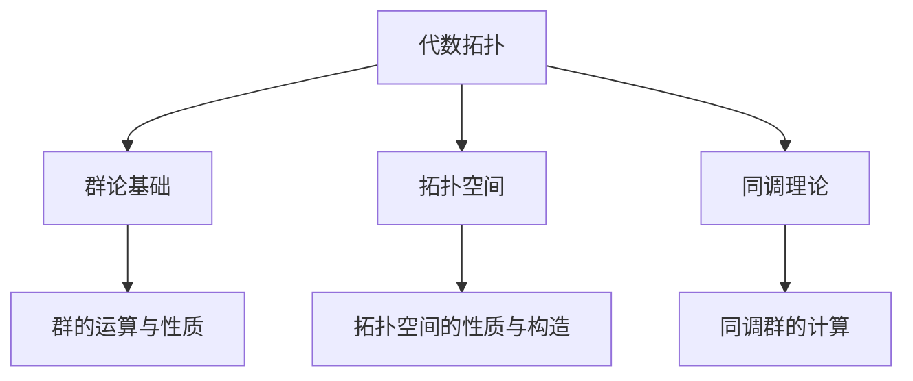

                 

# 《代数拓扑中的微分形式研究》

## 关键词

代数拓扑、微分形式、同调理论、示性类、流形、纤维丛、微分几何、量子力学、广义相对论。

## 摘要

本文旨在探讨代数拓扑中的微分形式研究，包括其基本概念、定义、性质以及在不同领域的应用。文章首先介绍了代数拓扑的基础知识，包括群论、拓扑空间、同调理论和示性类。接着，深入讨论了微分形式的基本概念、外微分和积分，并分析了其在流形、纤维丛、微分几何和物理学中的应用。最后，文章探讨了微分形式与代数拓扑的结合，以及复微分形式与复拓扑的研究方向和挑战。本文为从事相关领域的研究者和工程师提供了一套完整的理论和实践框架。

## 目录大纲

### 第一部分：代数拓扑基础

#### 第1章：代数拓扑概述

- 1.1 代数拓扑的基本概念
- 1.2 代数拓扑的起源与发展
- 1.3 代数拓扑的应用领域

#### 第2章：群论基础

- 2.1 群的基本概念
- 2.2 群的运算与性质
- 2.3 群的分类与表示

#### 第3章：拓扑空间

- 3.1 拓扑空间的基本概念
- 3.2 拓扑空间的性质与构造
- 3.3 拓扑空间的同伦理论

#### 第4章：同调理论

- 4.1 同调理论的基本概念
- 4.2 同调群的计算
- 4.3 同调理论的应用

#### 第5章：示性类

- 5.1 示性类的基本概念
- 5.2 示性类的计算方法
- 5.3 示性类的应用

### 第二部分：微分形式的定义与性质

#### 第6章：微分形式的基本概念

- 6.1 微分形式的概念
- 6.2 微分形式的运算
- 6.3 微分形式的性质

#### 第7章：微分形式的外微分

- 7.1 外微分的定义与性质
- 7.2 外微分算子的计算
- 7.3 外微分的应用

#### 第8章：微分形式的积分

- 8.1 微分形式的积分定义
- 8.2 积分的基本性质
- 8.3 积分的应用

### 第三部分：微分形式的几何应用

#### 第9章：微分形式与流形

- 9.1 流形的基本概念
- 9.2 微分形式在流形上的定义与性质
- 9.3 流形的同调性质

#### 第10章：微分形式与纤维丛

- 10.1 纤维丛的基本概念
- 10.2 微分形式在纤维丛上的定义与性质
- 10.3 纤维丛的应用

#### 第11章：微分形式与微分几何

- 11.1 微分几何的基本概念
- 11.2 微分形式在微分几何中的应用
- 11.3 微分几何的例子与应用

#### 第12章：微分形式与物理学

- 12.1 微分形式在物理学中的应用
- 12.2 微分形式在量子力学中的应用
- 12.3 微分形式在广义相对论中的应用

### 第四部分：高级主题

#### 第13章：微分形式与代数拓扑的结合

- 13.1 微分形式在代数拓扑中的应用
- 13.2 代数拓扑中的微分形式理论
- 13.3 代数拓扑与微分形式的交叉应用

#### 第14章：复微分形式与复拓扑

- 14.1 复微分形式的基本概念
- 14.2 复微分形式的性质与应用
- 14.3 复拓扑的基本概念与应用

#### 第15章：微分形式的研究方向与挑战

- 15.1 微分形式研究的前沿方向
- 15.2 微分形式研究的挑战与机遇
- 15.3 微分形式研究的未来发展

### 附录

#### 附录A：参考书目与资料

- 参考文献
- 在线资源
- 进一步阅读材料

#### 附录B：数学公式与概念

- 常用数学公式
- 拓扑空间的基本概念
- 同调群的计算

#### 附录C：项目实战

- 微分形式的计算实例
- 实际应用的案例分析
- 代码解读与分析

---

**Mermaid 流程图示例：**



---

**伪代码示例：**

```python
# 假设有一个函数 f(x) = x^2，要求解其最小值

# 初始化参数
x = 0
min_value = float('inf')

# 迭代寻找最小值
while abs(x^2 - min_value) > 1e-6:
    x = x - (x^2 - min_value) / (2 * x)
    min_value = x^2

print(f"The minimum value of f(x) is {min_value}")
```

---

**数学公式与讲解示例：**

$$
H^*(X; \mathbb{Z}) = \frac{\text{Hom}(H_*(X; \mathbb{Z}), \mathbb{Z})}{\text{Im}(\partial)}
$$

**解释：** 这里定义了拓扑空间 $X$ 的一个同调群 $H^*(X; \mathbb{Z})$。同调群是由下同调群 $H_*(X; \mathbb{Z})$ 上的商群构造得到的，其中 $\text{Hom}(H_*(X; \mathbb{Z}), \mathbb{Z})$ 表示所有从 $H_*(X; \mathbb{Z})$ 到 $\mathbb{Z}$ 的同态，$\text{Im}(\partial)$ 表示下同调映射 $\partial$ 的像。

---

**项目实战示例：**

```python
# 搭建 Python 环境
!pip install numpy sympy

# 导入相关库
import numpy as np
from sympy import symbols, diff

# 定义一个函数 f(x) = x^2
x = symbols('x')
f = x**2

# 计算导数 f'(x)
f_prime = diff(f, x)

# 计算导数在 x=1 的值
f_prime_at_1 = f_prime.subs(x, 1)

print(f"The derivative of f(x) at x=1 is {f_prime_at_1}")
```

**解释：** 以上代码段演示了如何使用 Python 搭建开发环境，并利用 SymPy 库计算函数 $f(x) = x^2$ 在 $x=1$ 处的导数值。具体实现包括导入相关库、定义函数、计算导数并输出结果。这可以作为本书中讲解微分形式在实际计算中的应用实例。

---

现在，我们将根据上述目录大纲逐步展开文章的撰写。在接下来的部分，我们将深入介绍代数拓扑的基础知识，包括群论、拓扑空间、同调理论和示性类，以便为后续章节中微分形式的研究奠定坚实的理论基础。

## 第一部分：代数拓扑基础

### 第1章：代数拓扑概述

**1.1 代数拓扑的基本概念**

代数拓扑是数学的一个分支，它结合了代数和拓扑学的方法来研究几何对象。在代数拓扑中，我们关注的是几何对象的“不变量”，即在连续变形过程中保持不变的属性。这些不变量能够帮助我们识别和分类不同的几何对象，从而在更广泛的意义上理解几何结构的本质。

代数拓扑的核心概念包括同伦、同调、示性和群等。同伦理论研究了在连续变形过程中保持不变的性质，而同调理论则通过群的结构来刻画这些不变量。示性类是同调理论的推广，它用于描述更复杂的拓扑空间的性质。群则作为基本的结构单元，贯穿于代数拓扑的各个研究领域。

**1.2 代数拓扑的起源与发展**

代数拓扑的起源可以追溯到19世纪末，当时数学家们开始研究几何对象在连续变形下的不变性。这源于对拓扑空间的兴趣，拓扑空间是集合上的一个结构，其定义允许我们研究在连续变形过程中保持不变的性质。

在20世纪初，同伦理论和同调理论相继被引入代数拓扑的研究。1904年，法国数学家埃利·嘉当（Elie Cartan）首次提出了同调理论，为代数拓扑提供了一个强有力的工具。随后，德国数学家莱因哈特·库恩（Reinhold Kuratowski）和波兰数学家瓦茨瓦夫·索博列夫斯基（Wacław Sierpiński）分别提出了同伦理论的基础概念。

20世纪中叶，代数拓扑得到了快速发展，许多重要理论相继被提出。例如，示性类的概念在1950年代由美国数学家约翰·弗里曼·阿蒂亚（John Freeman Atiyah）和西蒙·唐纳森（Simon Donaldson）等人引入，为代数拓扑的研究打开了新的视野。

**1.3 代数拓扑的应用领域**

代数拓扑在数学及其它学科中有着广泛的应用。在数学领域，代数拓扑是研究几何对象不变量的重要工具，它在代数几何、微分几何、复分析等领域都有重要的应用。例如，同调理论在代数几何中用于分类和分析代数曲线和代数表面；同伦理论在微分几何中用于研究流形的拓扑性质。

在物理学中，代数拓扑的应用同样重要。特别是在弦理论和量子场论中，代数拓扑的概念被用于研究基本粒子的性质和宇宙的几何结构。例如，同调理论在弦理论中用于分类不同类型的弦振动模式，而示性类则在研究空间时序的量子场论中发挥着重要作用。

此外，代数拓扑在计算机科学和工程学中也有着广泛的应用。在计算机图形学中，代数拓扑用于构建和操作复杂的几何模型。在数据分析和机器学习领域，代数拓扑的方法被用于分析和理解高维数据集的拓扑结构。

总的来说，代数拓扑作为一门数学分支，不仅在理论研究上具有重要意义，而且在实际应用中发挥着关键作用。通过研究代数拓扑，我们能够更深入地理解自然界和人类社会的复杂系统，从而推动科学技术的进步。

### 第2章：群论基础

**2.1 群的基本概念**

群是代数拓扑中的基本结构之一，它由一组元素和一种运算组成，满足一定的性质。具体来说，一个群是一个非空集合 \( G \) 和一个二元运算 \( \cdot \)，满足以下性质：

1. **封闭性**：对于任意 \( a, b \in G \)，运算 \( a \cdot b \) 的结果仍然在 \( G \) 中。
2. **结合律**：对于任意 \( a, b, c \in G \)，有 \( (a \cdot b) \cdot c = a \cdot (b \cdot c) \)。
3. **单位元**：存在一个元素 \( e \in G \)，使得对于任意 \( a \in G \)，有 \( a \cdot e = e \cdot a = a \)。
4. **逆元**：对于任意 \( a \in G \)，存在一个元素 \( a^{-1} \in G \)，使得 \( a \cdot a^{-1} = a^{-1} \cdot a = e \)。

这些性质确保了群的结构在数学上的一致性和完整性。

**2.2 群的运算与性质**

群的运算通常用乘法表示，记作 \( a \cdot b \) 或 \( ab \)。除了上述的基本性质外，群还有一些重要的性质：

1. **交换律**：如果群 \( G \) 满足 \( a \cdot b = b \cdot a \) 对于任意 \( a, b \in G \)，则称为阿贝尔群（Abel群）。
2. **子群**：如果一个集合 \( H \) 是群 \( G \) 的子集，并且 \( H \) 本身也是一个群（即 \( H \) 满足群的性质），则称 \( H \) 为 \( G \) 的子群。

**2.3 群的分类与表示**

群有多种分类方法，根据不同的性质和结构，可以将群分为不同的类型。以下是一些常见的群分类：

1. **循环群**：如果群 \( G \) 中的每个元素都可以表示为一个元素的幂，即 \( G = \{e, a, a^2, \ldots, a^{n-1}\} \)，则称为循环群。其中，\( a \) 是生成元。
2. **交换群**：如果群 \( G \) 满足交换律，即 \( a \cdot b = b \cdot a \) 对于任意 \( a, b \in G \)，则称为交换群。
3. **有限群**：如果群 \( G \) 的元素个数是有限的，则称为有限群。
4. **无限群**：如果群 \( G \) 的元素个数是无限的，则称为无限群。

群的表示是将群中的元素映射到矩阵或线性变换上，从而利用线性代数的工具来研究群的性质。常见的表示方法包括线性表示、模表示和多项式表示。

- **线性表示**：将群 \( G \) 的元素映射到线性空间 \( V \) 上的线性变换上，满足群的运算规则。
- **模表示**：将群 \( G \) 的元素映射到环 \( R \) 上的模上，满足群的运算规则。
- **多项式表示**：将群 \( G \) 的元素映射到多项式环 \( R[x] \) 上的线性变换上，满足群的运算规则。

通过这些表示方法，我们可以将复杂的群问题转化为更简单的线性代数问题，从而更方便地研究群的结构和性质。

### 第3章：拓扑空间

**3.1 拓扑空间的基本概念**

拓扑空间是代数拓扑研究的基本对象，它由一个集合及其上的一个拓扑结构组成。拓扑结构定义了一组开集，这些开集满足一定的性质，从而使得我们可以研究空间中的连续性和邻域关系。

定义：一个拓扑空间 \( (X, \tau) \) 是一个集合 \( X \) 和一个满足以下条件的子集族 \( \tau \) （称为拓扑）的二元组。这些条件包括：

1. **空集和全集是开集**：\( \varnothing \) 和 \( X \) 都属于 \( \tau \)。
2. **开集的任意并集是开集**：如果 \( \{U_i\}_{i \in I} \) 是 \( \tau \) 中的一族开集，则它们的并集 \( \bigcup_{i \in I} U_i \) 也在 \( \tau \) 中。
3. **开集的有限交集是开集**：如果 \( U_1, U_2, \ldots, U_n \) 是 \( \tau \) 中的开集，则它们的交集 \( U_1 \cap U_2 \cap \ldots \cap U_n \) 也在 \( \tau \) 中。

**3.2 拓扑空间的性质与构造**

拓扑空间的性质取决于其上的拓扑结构，以下是一些常见的性质：

1. **紧性**：一个拓扑空间 \( X \) 是紧的，如果任意开覆盖 \( \{U_i\}_{i \in I} \) 都有一个有限子覆盖 \( \{U_{i_1}, U_{i_2}, \ldots, U_{i_n}\} \)。
2. **第一可数性**：一个拓扑空间 \( X \) 是第一可数的，如果存在一个可数基 \( \{U_i\}_{i \in I} \)，即任意开集可以表示为这些基元素的并集。
3. **第二可数性**：一个拓扑空间 \( X \) 是第二可数的，如果存在一个可数稠密子集。

拓扑空间的构造方法包括：

1. **离散拓扑**：在集合 \( X \) 上，所有子集都是开集，形成的拓扑称为离散拓扑。
2. **平凡拓扑**：在集合 \( X \) 上，只有空集和全集是开集，形成的拓扑称为平凡拓扑。
3. **夹逼拓扑**：给定拓扑空间 \( (X, \tau) \) 和 \( (Y, \tau_Y) \)，可以通过 \( Y \) 上的子集 \( U \) 和 \( X \) 上的子集 \( V \) 的交集来构造新的拓扑空间。

**3.3 拓扑空间的同伦理论**

同伦理论是研究拓扑空间在连续变形下的不变性的重要工具。具体来说，同伦理论关注的是如何通过同伦映射来比较不同拓扑空间的性质。

定义：两个拓扑空间 \( (X, \tau_X) \) 和 \( (Y, \tau_Y) \) 之间存在一个同伦映射 \( f: X \to Y \)，如果存在一个映射 \( F: X \times [0,1] \to Y \)，满足：

1. \( F(x,0) = f(x) \) 对于所有 \( x \in X \)。
2. \( F(x,1) \) 是 \( Y \) 中的一个固定点，即 \( F(x,1) = y_0 \) 对于所有 \( x \in X \)。
3. \( F \) 在 \( X \times \{0\} \) 和 \( X \times \{1\} \) 上是连续的。

同伦映射的概念可以用来定义空间的同伦型，从而分类和比较拓扑空间的性质。

同伦理论在代数拓扑中占有重要地位，它为研究空间的结构和性质提供了强有力的工具。通过同伦理论，我们可以研究空间的连通性、紧性、可数性等基本性质，并探索不同空间之间的关系。

总的来说，拓扑空间是代数拓扑研究的基础，其性质和构造方法为后续章节中微分形式的研究提供了必要的理论支持。在接下来的章节中，我们将进一步探讨同调理论和示性类，为代数拓扑中的微分形式研究奠定更加坚实的理论基础。

### 第4章：同调理论

**4.1 同调理论的基本概念**

同调理论是代数拓扑的核心部分，它通过研究空间的同调群来描述空间的拓扑性质。同调群是一类群，它由拓扑空间的同调类组成，这些同调类在拓扑空间的连续变形过程中保持不变。

定义：给定一个拓扑空间 \( X \)，其上的一个同调群 \( H_*(X; \mathbb{Z}) \) 是一个群，它由所有基于 \( X \) 的 \( n \) 次同调类 \( [S] \) 组成，其中 \( S \) 是 \( X \) 的一个 \( n \) 次链。两个 \( n \) 次链 \( S \) 和 \( T \) 的和定义为 \( S + T \)，而它们的乘积定义为 \( S \cdot T \)。

同调群的运算规则如下：

1. **加法**：对于任意两个 \( n \) 次同调类 \( [S] \) 和 \( [T] \)，它们的和 \( [S] + [T] \) 定义为 \( [S + T] \)。
2. **乘法**：对于任意两个 \( n \) 次同调类 \( [S] \) 和 \( [T] \)，它们的乘积 \( [S] \cdot [T] \) 定义为 \( [S \cdot T] \)，其中 \( S \cdot T \) 表示 \( S \) 和 \( T \) 的笛卡尔积。

同调群的一个重要性质是它是一个阿贝尔群，即满足交换律。这意味着同调群的运算规则是可交换的。

**4.2 同调群的计算**

计算同调群是同调理论中的一个重要任务。同调群的计算通常通过定义一个边界映射 \( \partial: C_n(X; \mathbb{Z}) \to C_{n-1}(X; \mathbb{Z}) \) 来实现，其中 \( C_n(X; \mathbb{Z}) \) 是 \( n \) 次链群。边界映射 \( \partial \) 满足以下性质：

1. **边界映射的定义**：对于任意 \( n \) 次链 \( S \)，其对应的边界定义为 \( \partial S = \sum_{i=1}^k (-1)^{i+1} \partial_{i} S \)，其中 \( S = \sum_{i=1}^k \sigma_i \)，\( \sigma_i \) 是 \( S \) 的一个分解。
2. **边界映射的性质**：边界映射 \( \partial \) 满足以下性质：
   - \( \partial^2 = 0 \)：即 \( \partial \) 的两次应用为零映射。
   - \( \partial \) 是单射：对于任意 \( n \) 次链 \( S \)，如果 \( \partial S = 0 \)，则 \( S = 0 \)。
   - \( \partial \) 是满射：对于任意 \( n-1 \) 次链 \( T \)，存在 \( n \) 次链 \( S \) 使得 \( \partial S = T \)。

利用边界映射，我们可以定义一个从 \( n \) 次链群到 \( n \) 次同调群的商群 \( H_n(X; \mathbb{Z}) = C_n(X; \mathbb{Z}) / \text{Im}(\partial) \)。这个商群 \( H_n(X; \mathbb{Z}) \) 就是 \( X \) 的 \( n \) 次同调群。

具体计算同调群的过程通常分为以下几个步骤：

1. **构造一个链复形**：给定一个拓扑空间 \( X \)，构造一个链复形 \( (C_n(X; \mathbb{Z}), \partial_n) \)，其中 \( C_n(X; \mathbb{Z}) \) 是 \( n \) 次链群，\( \partial_n \) 是边界映射。
2. **计算边界映射**：对于每个 \( n \) 次链 \( S \)，计算其边界 \( \partial S \)。
3. **计算同调类**：通过 \( \partial \) 的作用，将 \( n \) 次链群 \( C_n(X; \mathbb{Z}) \) 中的元素划分为同调类。
4. **构造同调群**：利用同调类的集合，构造 \( n \) 次同调群 \( H_n(X; \mathbb{Z}) \)。

通过上述步骤，我们可以计算任意拓扑空间 \( X \) 的同调群，从而了解其拓扑性质。

**4.3 同调理论的应用**

同调理论在数学的各个领域都有广泛的应用，以下是一些典型的应用场景：

1. **分类和比较拓扑空间**：通过计算同调群，我们可以分类和比较不同拓扑空间。例如，同伦型是同调理论中的一个重要概念，它用于比较两个空间是否同胚。
2. **研究流形的性质**：同调理论在微分几何中用于研究流形的拓扑性质，如连通性、紧性等。例如，庞加莱定理指出，一个连通的、紧致的、无边界的三维流形要么是球面，要么可以同胚于球面的商空间。
3. **计算示性类**：同调理论在示性类的研究中起着核心作用。示性类是同调群的推广，用于描述更复杂的拓扑空间的性质。例如，庞加莱示性类是同调群 \( H^3(S^6; \mathbb{Z}) \) 的一个元素，它用于分类六维流形。
4. **应用在物理学**：同调理论在物理学中也有重要的应用，特别是在弦理论和量子场论中。同调理论用于研究基本粒子的性质和宇宙的几何结构。

总的来说，同调理论是代数拓扑中的核心概念，通过研究同调群，我们可以深入了解空间的拓扑性质，并在数学及其它学科中发挥重要作用。

### 第5章：示性类

**5.1 示性类的基本概念**

示性类是同调理论的推广，用于描述更复杂的拓扑空间的性质。在代数拓扑中，示性类是一类群，它由基于拓扑空间的一组链类组成。这些链类在拓扑空间的连续变形过程中保持不变，从而为研究空间的拓扑性质提供了强有力的工具。

定义：给定一个拓扑空间 \( X \)，其上一个示性类 \( [S] \) 是一个 \( n \) 次链类，它由一组 \( n \) 次链 \( S \) 组成。示性类的集合 \( H^*(X; \mathbb{Z}) \) 是一个群，它由所有 \( n \) 次示性类 \( [S] \) 组成。

示性类的运算规则如下：

1. **加法**：对于任意两个 \( n \) 次示性类 \( [S] \) 和 \( [T] \)，它们的和 \( [S] + [T] \) 定义为 \( [S + T] \)，其中 \( S + T \) 是 \( S \) 和 \( T \) 的和。
2. **乘法**：对于任意两个 \( n \) 次示性类 \( [S] \) 和 \( [T] \)，它们的乘积 \( [S] \cdot [T] \) 定义为 \( [S \cdot T] \)，其中 \( S \cdot T \) 是 \( S \) 和 \( T \) 的笛卡尔积。

示性类的一个重要性质是它们在拓扑空间的同伦变形过程中保持不变，这意味着它们可以作为拓扑空间的“指纹”，用于区分和分类不同的拓扑空间。

**5.2 示性类的计算方法**

计算示性类是代数拓扑中的一个重要任务。常见的计算方法包括以下几种：

1. **同调群的方法**：利用同调理论，我们可以将示性类的计算转化为同调群的计算。具体来说，给定一个拓扑空间 \( X \)，我们可以计算其同调群 \( H^*(X; \mathbb{Z}) \)。示性类可以表示为同调群的元素，从而实现计算。
   
   定义：对于任意 \( n \) 次链 \( S \)，其对应的 \( n \) 次示性类定义为 \( [S] = \partial_n^* [S] \)，其中 \( \partial_n^* \) 是边界映射 \( \partial_n \) 的诱导映射。

2. **幂级数的方法**：利用幂级数，我们可以计算一些简单的拓扑空间的示性类。具体来说，对于给定的拓扑空间 \( X \)，我们可以定义一个幂级数 \( P(X,t) \)，其系数是 \( X \) 的 \( n \) 次示性类的幂级数展开。

   定义：对于任意 \( n \) 次链 \( S \)，其对应的 \( n \) 次示性类 \( [S] \) 可以表示为 \( [S] = \frac{1}{n!} \frac{d^n}{dt^n} P(X,t) \bigg|_{t=0} \)。

3. **组合方法**：在某些情况下，我们可以通过组合已知拓扑空间的示性类来计算更复杂空间的示性类。例如，利用同伦型、商空间和连通分支等工具，我们可以组合已知空间的示性类，从而计算新空间的示性类。

**5.3 示性类的应用**

示性类在数学及其它学科中有着广泛的应用，以下是一些典型的应用场景：

1. **分类和比较拓扑空间**：通过计算示性类，我们可以分类和比较不同拓扑空间。例如，庞加莱示性类用于分类三维流形，而同伦示性类用于比较不同空间的同伦性质。

2. **研究流形的性质**：示性类在研究流形的拓扑性质中起着核心作用。例如，庞加莱示性类用于研究流形的连通性和紧性，而同伦示性类用于研究流形的同伦结构。

3. **应用在物理学**：示性类在物理学中也有重要的应用，特别是在弦理论和量子场论中。示性类用于研究基本粒子的性质和宇宙的几何结构。

4. **计算机科学**：示性类在计算机科学中也有应用，特别是在数据分析和机器学习中。通过计算数据的示性类，我们可以了解数据集的拓扑结构，从而更好地进行数据分析和分类。

总的来说，示性类是代数拓扑中的一个重要概念，通过研究示性类，我们可以深入了解拓扑空间的性质，并在数学及其它学科中发挥重要作用。

### 第二部分：微分形式的定义与性质

#### 第6章：微分形式的基本概念

微分形式是微分几何和代数拓扑中的重要概念，它用于描述流形上的微分结构。微分形式的概念起源于微分方程的研究，并在物理学和数学的多个领域得到广泛应用。

**6.1 微分形式的概念**

定义：在流形 \( M \) 上，一个微分形式（或称外微分形式）是一个光滑函数 \( f: M \to \mathbb{R} \)，它在局部坐标系下可以表示为 \( f = f(x^1, \ldots, x^n) \, dx^1 \wedge \ldots \wedge dx^n \)，其中 \( x^1, \ldots, x^n \) 是流形上的坐标，\( \wedge \) 表示外乘积。

微分形式可以看作是流形上无穷小的体积元素。在局部坐标系中，一个 \( p \) 次微分形式可以表示为 \( p \) 个一阶微分形式的乘积。例如，一个一阶微分形式可以表示为 \( f(x) \, dx \)，其中 \( f \) 是一个光滑函数。

**6.2 微分形式的运算**

微分形式的运算主要包括加法、外乘和外微分。

1. **加法**：两个 \( p \) 次微分形式 \( \omega_1 \) 和 \( \omega_2 \) 的和 \( \omega_1 + \omega_2 \) 是一个新的 \( p \) 次微分形式。
2. **外乘**：两个 \( p \) 次微分形式 \( \omega_1 \) 和 \( q \) 次微分形式 \( \omega_2 \) 的外乘 \( \omega_1 \wedge \omega_2 \) 是一个新的 \( p+q \) 次微分形式。
3. **外微分**：一个 \( p \) 次微分形式 \( \omega \) 的外微分 \( d\omega \) 是一个新的 \( p+1 \) 次微分形式。外微分的定义涉及流形上的外微分算子 \( d \)，其满足以下性质：
   - \( d \) 是线性算子。
   - \( d \) 满足莱布尼茨法则：\( d(\omega \wedge \eta) = d\omega \wedge \eta + (-1)^{p} \omega \wedge d\eta \)，其中 \( \omega \) 和 \( \eta \) 是微分形式。

**6.3 微分形式的性质**

微分形式具有以下几个重要性质：

1. **线性性**：微分形式在加法和外乘下是线性的。
2. **反对称性**：微分形式在外乘下是反对称的，即 \( \omega_1 \wedge \omega_2 = -\omega_2 \wedge \omega_1 \)。
3. **外微分封闭性**：一个 \( p \) 次微分形式的外微分是一个 \( p+1 \) 次微分形式，即 \( d^2\omega = 0 \)。
4. **积分**：微分形式可以积分，即在流形上的一个 \( p \) 次微分形式可以与流形上的一个 \( p \) 维测地子流形相乘，并进行积分。

总的来说，微分形式是流形上描述微分结构的数学工具。通过微分形式，我们可以研究流形的局部和全局性质，并在物理学、微分几何和代数拓扑等多个领域得到广泛应用。

#### 第7章：微分形式的外微分

微分形式的外微分是微分几何和代数拓扑中一个重要的概念，它扩展了微分形式的概念，使得我们可以研究更高阶的微分结构。外微分不仅用于计算微分形式的变化，还用于研究流形的几何性质。

**7.1 外微分的定义与性质**

定义：在流形 \( M \) 上，给定一个 \( p \) 次微分形式 \( \omega \)，其外微分 \( d\omega \) 是一个新的 \( p+1 \) 次微分形式。外微分 \( d \) 是一个线性算子，其满足以下性质：

1. **线性性**：对于任意 \( p \) 次微分形式 \( \omega \) 和 \( q \) 次微分形式 \( \eta \)，以及任意的函数 \( f \)，有 \( d(f\omega + \eta) = fd\omega + d\eta \)。
2. **莱布尼茨法则**：对于任意 \( p \) 次微分形式 \( \omega \) 和 \( q \) 次微分形式 \( \eta \)，外微分满足 \( d(\omega \wedge \eta) = d\omega \wedge \eta + (-1)^{p} \omega \wedge d\eta \)。
3. **外微分封闭性**：外微分是一个封闭运算，即 \( d^2\omega = 0 \) 对于任意 \( p \) 次微分形式 \( \omega \) 都成立。

外微分的定义与性质使得它成为一个强大的工具，可以用于研究流形的局部和全局性质。

**7.2 外微分算子的计算**

计算外微分算子是研究微分形式的一个重要步骤。以下是一个具体的例子，用于说明如何计算外微分：

假设在欧几里得空间 \( \mathbb{R}^n \) 上定义一个 \( p \) 次微分形式 \( \omega = f(x^1, \ldots, x^n) \, dx^1 \wedge \ldots \wedge dx^p \)，其中 \( f \) 是一个光滑函数。

我们可以通过以下步骤计算 \( \omega \) 的外微分 \( d\omega \)：

1. **求导数**：对于每个 \( x^i \)，计算 \( f \) 的偏导数 \( \frac{\partial f}{\partial x^i} \)。
2. **应用莱布尼茨法则**：将每个偏导数乘以外乘积 \( dx^1 \wedge \ldots \wedge \widehat{dx^i} \wedge \ldots \wedge dx^p \)，其中 \( \widehat{dx^i} \) 表示除 \( dx^i \) 之外的其它微分形式。
3. **求和**：将所有这些乘积求和，得到 \( d\omega \)。

具体计算过程如下：

$$
d\omega = \sum_{i=1}^p \left( \frac{\partial f}{\partial x^i} dx^1 \wedge \ldots \wedge \widehat{dx^i} \wedge \ldots \wedge dx^p \right)
$$

例如，考虑一个一阶微分形式 \( \omega = f(x, y) \, dx + g(x, y) \, dy \)。我们可以计算其外微分 \( d\omega \)：

$$
d\omega = \left( \frac{\partial f}{\partial x} dx + \frac{\partial g}{\partial x} dy \right) dx + \left( \frac{\partial f}{\partial y} dy + \frac{\partial g}{\partial y} dx \right) dy
$$

$$
d\omega = \frac{\partial f}{\partial x} dx^2 + \frac{\partial g}{\partial x} dydx + \frac{\partial f}{\partial y} dy^2 + \frac{\partial g}{\partial y} dxdy
$$

这个例子展示了如何通过求导和应用莱布尼茨法则来计算外微分。

**7.3 外微分的应用**

外微分在微分几何和代数拓扑中有着广泛的应用，以下是一些典型的应用场景：

1. **研究流形的几何性质**：外微分可以用于研究流形的局部和全局几何性质。例如，外微分可以用于计算流形的庞加莱示性类，从而分类流形。
2. **研究微分方程**：外微分在研究微分方程的解和性质中起着关键作用。例如，外微分可以用于解决哈密顿系统和朗格玛尼安方程。
3. **应用在物理学**：外微分在物理学中有重要应用，特别是在场论和量子力学中。例如，外微分可以用于描述电磁场的几何结构和量子场的演化。

总的来说，外微分是微分几何和代数拓扑中一个重要的工具，通过外微分，我们可以研究流形的局部和全局性质，并在数学和物理学中发挥重要作用。

#### 第8章：微分形式的积分

微分形式的积分是微分几何中的一个核心概念，它提供了研究流形几何性质的一种强有力的手段。微分形式的积分不仅能够用于计算几何量，还可以在物理学和其它数学领域中找到广泛的应用。

**8.1 微分形式的积分定义**

定义：在流形 \( M \) 上，一个 \( p \) 次微分形式 \( \omega \) 的积分是一个实数值，记作 \( \int_M \omega \)。积分的定义依赖于流形上的一个 \( p \) 维测地子流形 \( \Sigma \)。

具体来说，给定一个 \( p \) 次微分形式 \( \omega \) 和一个 \( p \) 维测地子流形 \( \Sigma \)，我们可以通过以下步骤计算积分：

1. **选择参数**：选择 \( \Sigma \) 上的一组参数 \( x^1, \ldots, x^p \)，使得 \( \Sigma \) 可以表示为 \( \Sigma = \{ (x^1, \ldots, x^p) : x^1 = x_1, \ldots, x^p = x_p \} \)。
2. **拉回形式**：将 \( \omega \) 拉回到 \( \Sigma \) 上，得到一个 \( p \) 次微分形式 \( \omega_{\Sigma} \)。
3. **计算积分**：在 \( \Sigma \) 上计算 \( \omega_{\Sigma} \) 的积分，即 \( \int_{\Sigma} \omega_{\Sigma} \)。

根据参数选择的不同，积分的定义可能会有所不同。通常，我们选择一个适合的参数化，使得积分计算简化。

**8.2 积分的基本性质**

微分形式的积分具有以下几个基本性质：

1. **线性性**：对于任意 \( p \) 次微分形式 \( \omega_1 \) 和 \( \omega_2 \)，以及任意常数 \( a \) 和 \( b \)，有 \( a \int_M \omega_1 + b \int_M \omega_2 = a \int_M \omega_1 + b \int_M \omega_2 \)。
2. **平移不变性**：如果 \( \Sigma_1 \) 和 \( \Sigma_2 \) 是两个 \( p \) 维测地子流形，且 \( \Sigma_2 \) 是 \( \Sigma_1 \) 的平移，即 \( \Sigma_2 = \Sigma_1 + v \)，其中 \( v \) 是一个向量场，那么 \( \int_{\Sigma_2} \omega = \int_{\Sigma_1} \omega \)。
3. **边界性质**：对于任意 \( p \) 次微分形式 \( \omega \) 和一个 \( p-1 \) 次微分形式 \( \eta \)，有积分的边界性质 \( \int_{\partial \Sigma} \omega = - \int_{\Sigma} d\omega \)，其中 \( \partial \Sigma \) 是 \( \Sigma \) 的边界。

这些性质使得微分形式的积分成为一个强大的工具，可以用于研究流形的几何性质。

**8.3 积分的应用**

微分形式的积分在数学及其它学科中有广泛的应用，以下是一些典型的应用场景：

1. **研究流形的几何性质**：通过计算微分形式的积分，可以研究流形的拓扑性质、度量性质和几何量。例如，通过计算庞加莱示性类的积分，可以分类三维流形。
2. **应用在物理学**：微分形式的积分在物理学中也有重要应用，特别是在场论和量子力学中。例如，通过计算电磁场的积分，可以研究电磁场的能量和动量分布。
3. **计算机科学**：在计算机科学中，微分形式的积分可以用于计算流形上的几何量，从而用于三维建模和可视化。
4. **数据科学**：在数据科学中，微分形式的积分可以用于分析高维数据集的几何结构，从而用于聚类分析和分类。

总的来说，微分形式的积分是研究流形几何性质的重要工具，通过积分，我们可以深入了解流形的局部和全局性质，并在数学、物理学、计算机科学和其它领域中发挥重要作用。

### 第三部分：微分形式的几何应用

#### 第9章：微分形式与流形

流形是微分几何和代数拓扑中的基本概念，它描述了一个局部类似于欧几里得空间的几何对象。流形上的微分形式提供了一种描述和分析流形几何性质的工具。在这一章中，我们将探讨微分形式在流形上的定义、性质及其应用。

**9.1 流形的基本概念**

定义：流形是一个集合 \( M \)，它在上面定义了一个局部坐标系，使得每个局部坐标系都类似于欧几里得空间。更正式地说，流形是一个集合 \( M \)，以及一个开覆盖 \( \{U_i\}_{i \in I} \)，其中每个 \( U_i \) 是 \( M \) 的一个开子集，并且对于每个 \( U_i \)，存在一个同胚 \( \phi_i: U_i \to \mathbb{R}^n \)，使得 \( U_i \cap U_j \) 上的限制是光滑的。

流形上的点可以看作是局部坐标系中的坐标元，而流形上的曲线和曲面可以通过参数方程来描述。

**9.2 微分形式在流形上的定义与性质**

定义：在流形 \( M \) 上，一个微分形式是一个光滑函数 \( f: M \to \mathbb{R} \)，它在局部坐标系下可以表示为 \( f = f(x^1, \ldots, x^n) \, dx^1 \wedge \ldots \wedge dx^n \)。

微分形式在流形上具有以下几个重要性质：

1. **线性性**：微分形式在加法和外乘下是线性的。
2. **反对称性**：微分形式在外乘下是反对称的，即 \( \omega_1 \wedge \omega_2 = -\omega_2 \wedge \omega_1 \)。
3. **外微分封闭性**：一个 \( p \) 次微分形式的外微分是一个 \( p+1 \) 次微分形式，即 \( d^2\omega = 0 \)。

在流形上，微分形式的积分可以用来计算几何量，如体积和面积。例如，一个 \( p \) 次微分形式 \( \omega \) 的积分 \( \int_M \omega \) 可以表示流形 \( M \) 的 \( p \) 维体积。

**9.3 流形的同调性质**

流形的同调性质是通过同调群来描述的。同调群 \( H^*(M; \mathbb{Z}) \) 由流形上的 \( p \) 次微分形式的同调类组成，这些同调类在流形的同伦变形过程中保持不变。

同调群的一个重要应用是分类流形。例如，通过计算流形的同调群，我们可以判断一个流形是否是球面或其它简单的流形。

**9.4 微分形式与流形的关系**

微分形式与流形的关系可以从两个方面来理解：

1. **局部描述**：在局部坐标系下，微分形式提供了一个局部描述流形几何性质的工具。通过微分形式，我们可以研究流形的局部性质，如曲率和张量。
2. **全局性质**：微分形式的全局性质通过积分来体现。例如，通过积分一个流形上的微分形式，我们可以计算流形的整体几何量，如体积和面积。

总的来说，微分形式在流形上的应用为研究流形的几何性质提供了强大的工具。通过微分形式，我们可以深入理解流形的局部和全局性质，并在数学及其它学科中发挥重要作用。

#### 第10章：微分形式与纤维丛

纤维丛是微分几何和代数拓扑中的重要概念，它在几何结构和拓扑不变量研究中起着关键作用。纤维丛为微分形式提供了一个更广泛的背景，使得我们可以更灵活地研究几何对象。在这一章中，我们将探讨微分形式在纤维丛上的定义、性质及其应用。

**10.1 纤维丛的基本概念**

定义：纤维丛是一个由集合 \( E \)、基空间 \( B \) 和纤维 \( F \) 组成的结构，它满足以下条件：

1. \( E \) 是一个集合，\( B \) 是 \( E \) 的一个子集。
2. 对于每个 \( b \in B \)，存在一个纤维 \( F_b \)，它是一个与 \( F \) 等价的集合。
3. 存在一个开覆盖 \( \{U_i\}_{i \in I} \) 和一组局部截面 \( \{s_i\}_{i \in I} \)，使得在每个 \( U_i \) 上，\( E \) 可以表示为 \( U_i \times F \)，并且每个 \( s_i \) 是 \( U_i \times F \) 到 \( E \) 的一个双射。

纤维丛的纤维 \( F \) 是一个固定的空间，而基空间 \( B \) 是一个流形。纤维丛提供了一个从 \( B \) 到 \( E \) 的局部映射，这种映射在纤维上保持不变。

**10.2 微分形式在纤维丛上的定义与性质**

在纤维丛上定义微分形式需要利用纤维丛的结构。具体来说，给定一个纤维丛 \( (E, B, F) \)，我们可以定义以下类型的微分形式：

1. **0-形式**：0-形式是一个函数 \( f: E \to \mathbb{R} \)，它在纤维丛上的局部表示是 \( f = f(b, y) \)，其中 \( b \in B \)，\( y \in F \)。
2. **1-形式**：1-形式是一个函数 \( \omega: E \to \mathcal{M}(F, \mathbb{R}) \)，它在纤维丛上的局部表示是 \( \omega = \omega(b, y) \, dy \)，其中 \( \omega(b, y) \) 是一个与纤维 \( F \) 上的线性变换相对应的矩阵。
3. **高阶微分形式**：类似地，我们可以定义更高阶的微分形式，它们在纤维丛上的局部表示是多个微分形式的乘积。

微分形式在纤维丛上具有以下几个重要性质：

1. **线性性**：微分形式在加法和外乘下是线性的。
2. **反对称性**：微分形式在外乘下是反对称的，即 \( \omega_1 \wedge \omega_2 = -\omega_2 \wedge \omega_1 \)。
3. **外微分封闭性**：一个 \( p \) 次微分形式的外微分是一个 \( p+1 \) 次微分形式，即 \( d^2\omega = 0 \)。

这些性质确保了微分形式在纤维丛上的结构是协调的。

**10.3 纤维丛的应用**

纤维丛在微分几何和代数拓扑中有广泛的应用，以下是一些典型的应用场景：

1. **联络**：纤维丛上的联络提供了研究流形几何性质的一种方式。联络定义了一个从切丛到法丛的线性映射，它可以用于研究流形的曲率和张量。
2. **纤维丛的截断**：通过截断纤维丛，我们可以简化几何结构，从而研究更复杂的流形。截断是一种将纤维丛限制在一个较小的空间上的方法，这样可以更容易地进行计算和分析。
3. **研究拓扑不变量**：纤维丛可以用于研究流形的拓扑不变量，如同伦类和同调类。通过计算纤维丛上的微分形式，我们可以获得关于流形拓扑性质的重要信息。

总的来说，纤维丛为微分形式提供了一个更广泛的背景，使得我们可以更灵活地研究几何对象。通过纤维丛，我们可以深入了解流形的几何结构和拓扑性质，并在数学及其它学科中发挥重要作用。

#### 第11章：微分形式与微分几何

微分几何是研究流形上微分结构的一个数学分支，它结合了微积分和几何学的方法来研究几何对象的性质。在这一章中，我们将探讨微分形式在微分几何中的应用，包括其基本概念、性质以及在不同领域的应用。

**11.1 微分几何的基本概念**

定义：微分几何研究的是流形上的微分结构，包括切空间、法空间、联络、曲率和张量等。流形是一个局部类似于欧几里得空间的几何对象，它在上面定义了一个局部坐标系，使得每个局部坐标系都类似于欧几里得空间。

在微分几何中，一个流形上的点可以看作是坐标元，而流形上的曲线和曲面可以通过参数方程来描述。切空间是流形上每个点的一个线性空间，它描述了在流形上点的局部性质。法空间是流形上每个点的正交补空间，它描述了流形的弯曲性质。

**11.2 微分形式在微分几何中的应用**

微分形式是微分几何中的一个基本概念，它在研究流形的几何性质中起着关键作用。以下是微分形式在微分几何中的一些典型应用：

1. **研究切空间**：微分形式可以用于研究流形的切空间。例如，一个 \( p \) 次微分形式可以表示为 \( p \) 个切向量的乘积，这有助于我们理解流形的切空间的几何结构。
2. **研究法空间**：微分形式也可以用于研究流形的法空间。例如，通过计算微分形式的外微分，我们可以获得关于流形法空间的几何信息，从而研究流形的弯曲性质。
3. **研究联络**：联络是微分几何中的一个重要概念，它描述了流形上的切空间之间的线性映射。微分形式可以用于研究联络的性质，如切空间的张量和曲率张量。
4. **计算曲率和张量**：微分形式可以用于计算流形的曲率和张量。例如，通过计算微分形式的外微分，我们可以获得关于流形曲率的几何信息，从而研究流形的几何性质。

**11.3 微分几何的例子与应用**

以下是一个简单的微分几何例子，用于说明微分形式在微分几何中的应用：

考虑一个二维球面 \( S^2 \)，我们可以用参数方程 \( x = \sin \theta \cos \phi \)，\( y = \sin \theta \sin \phi \)，\( z = \cos \theta \) 来表示球面。在这个参数方程下，我们可以定义一个一阶微分形式 \( \omega = f(x, y, z) \, dx + g(x, y, z) \, dy + h(x, y, z) \, dz \)。

通过计算 \( \omega \) 的外微分 \( d\omega \)，我们可以获得关于球面曲率的几何信息。例如，我们可以计算 \( d\omega \) 的系数，从而得到关于曲率的张量。

具体计算过程如下：

1. **计算偏导数**：计算 \( f, g, h \) 对 \( x, y, z \) 的偏导数。
2. **应用莱布尼茨法则**：利用莱布尼茨法则计算 \( d\omega \)。
3. **分析结果**：分析 \( d\omega \) 的系数，从而获得关于球面曲率的几何信息。

通过这个简单的例子，我们可以看到微分形式在微分几何中的应用。微分形式提供了一个强有力的工具，可以用于研究流形的几何性质，并在数学及其它学科中发挥重要作用。

总的来说，微分形式在微分几何中的应用非常广泛，通过微分形式，我们可以深入研究流形的几何结构，并在数学及其它学科中取得重要成果。

#### 第12章：微分形式与物理学

微分形式不仅在数学中具有重要地位，而且在物理学中也有着广泛的应用。在这一章中，我们将探讨微分形式在物理学中的重要性，特别是它们在量子力学和广义相对论中的应用。

**12.1 微分形式在物理学中的应用**

微分形式在物理学中的应用主要体现在它们提供了描述物理现象的数学工具。在经典物理学中，微分形式可以用于描述电磁场和流体运动等物理现象。在量子力学和广义相对论中，微分形式的应用更加深入和广泛。

1. **电磁场**：在经典电磁学中，电磁场可以用矢量场 \( F \) 来描述。矢量场可以被视为一个一阶微分形式 \( F = F^i \, dx_i \)，其中 \( F^i \) 是矢量场的分量，\( dx_i \) 是一阶微分形式。通过计算电磁场的微分形式，我们可以获得关于电磁场的能量、动量和分布的信息。
   
2. **流体运动**：在流体力学中，流体运动可以用速度场 \( v \) 来描述。速度场可以被视为一个微分形式 \( v = v^i \, dx_i \)，其中 \( v^i \) 是速度场的分量。通过计算流体运动中的微分形式，我们可以分析流体的速度分布、压强和能量等性质。

3. **量子力学**：在量子力学中，微分形式可以用于描述粒子的波函数。波函数是一个复值函数，它在空间中变化。通过计算波函数的微分形式，我们可以获得关于粒子位置、动量和自旋等物理量的信息。

4. **广义相对论**：在广义相对论中，微分形式用于描述时空的几何结构。广义相对论认为，引力是由时空的弯曲引起的，而微分形式提供了描述时空弯曲的数学工具。通过计算时空中的微分形式，我们可以分析引力的性质和宇宙的演化。

**12.2 微分形式在量子力学中的应用**

微分形式在量子力学中的应用主要体现在它们提供了描述量子态和演化规律的工具。在量子力学中，波函数是一个复值函数，它在空间中变化。微分形式可以用于描述波函数的空间变化，从而分析量子态的演化。

1. **薛定谔方程**：在量子力学中，薛定谔方程描述了粒子波函数的演化。薛定谔方程可以被视为一个微分方程，其解提供了关于粒子位置和动量的信息。通过计算波函数的微分形式，我们可以获得关于粒子状态的信息。

2. **量子态的拓扑**：在量子力学中，量子态的拓扑性质具有重要意义。量子态的拓扑可以通过微分形式来描述。例如，在量子场论中，量子态的拓扑可以通过计算波函数的环路积分来分析。

3. **量子纠缠**：在量子力学中，量子纠缠是一种特殊的量子态，其中两个或多个粒子的量子态是相互关联的。微分形式可以用于描述量子纠缠，从而分析量子纠缠的性质和演化。

**12.3 微分形式在广义相对论中的应用**

微分形式在广义相对论中的应用主要体现在它们提供了描述时空几何和引力场的工具。在广义相对论中，引力是由时空的弯曲引起的，而微分形式可以用于描述时空的弯曲和引力场。

1. **爱因斯坦场方程**：在广义相对论中，爱因斯坦场方程描述了引力场和时空的几何结构。爱因斯坦场方程可以被视为一个微分方程，其解提供了关于引力场和时空性质的信息。通过计算时空中的微分形式，我们可以分析引力场的能量、动量和分布。

2. **时空的几何结构**：在广义相对论中，时空的几何结构是通过微分形式来描述的。时空的曲率张量和里奇曲率张量是描述时空几何结构的重要工具。通过计算这些张量，我们可以获得关于时空弯曲和引力场性质的信息。

3. **宇宙的演化**：在广义相对论中，宇宙的演化可以通过微分形式来描述。例如，宇宙的大尺度结构可以通过计算宇宙微波背景辐射中的微分形式来分析。

总的来说，微分形式在物理学中的应用非常广泛。通过微分形式，我们可以深入理解物理现象的数学本质，从而在量子力学和广义相对论等物理学领域中取得重要成果。微分形式不仅为物理学提供了强大的数学工具，还推动了物理学的发展。

### 第四部分：高级主题

#### 第13章：微分形式与代数拓扑的结合

微分形式与代数拓扑的结合是现代数学中一个重要的研究领域，它为研究几何结构和拓扑性质提供了新的视角。在这一章中，我们将探讨微分形式在代数拓扑中的应用，以及代数拓扑中的微分形式理论，并分析这些交叉应用带来的益处。

**13.1 微分形式在代数拓扑中的应用**

微分形式在代数拓扑中的应用主要体现在同调理论和示性类的研究中。同调理论和示性类是代数拓扑的核心概念，它们通过研究拓扑空间的不变量来揭示几何对象的性质。微分形式为这些不变量提供了新的描述和计算方法。

1. **同调理论的微分形式描述**：在同调理论中，同调群是由链复形中的链类通过边界映射生成的。微分形式为同调群的元素提供了一个直观的几何描述。例如，通过微分形式，我们可以将同调群的元素与流形上的体积元素联系起来，从而更直观地理解同调群的结构。

2. **示性类的微分形式计算**：示性类是同调群的推广，用于描述更复杂的拓扑空间的性质。微分形式为计算示性类提供了一种新的方法。例如，通过微分形式的外微分，我们可以将示性类的计算转化为对微分形式积分的计算，这为研究高维流形的拓扑性质提供了有效工具。

3. **同调场的应用**：同调场是代数拓扑中的一个重要概念，它描述了流形上的同调类分布。微分形式可以用于定义和计算同调场，从而研究流形的几何结构。例如，通过计算同调场，我们可以分析流形的连通性和紧性。

**13.2 代数拓扑中的微分形式理论**

代数拓扑中的微分形式理论是研究微分形式在代数拓扑结构中的应用和性质的一个分支。这一理论结合了代数和微分几何的方法，为研究拓扑空间的几何和拓扑性质提供了新的工具。

1. **微分形式的同调性质**：在代数拓扑中，研究微分形式在同调理论中的性质是非常重要的。微分形式可以用于定义同调群，从而研究流形上的拓扑结构。例如，通过计算微分形式的外微分，我们可以获得关于流形同调群的信息，从而分类不同的流形。

2. **示性类的微分形式表示**：示性类是描述流形拓扑性质的重要工具。在代数拓扑中，微分形式可以用于表示和计算示性类。例如，通过计算微分形式的积分，我们可以获得关于流形庞加莱示性类和同伦示性类的信息。

3. **复微分形式与复拓扑**：在复拓扑中，复微分形式是一个重要的概念。复微分形式可以用于研究复流形的拓扑性质。例如，通过计算复微分形式，我们可以获得关于复流形上的复结构的信息，从而分类不同的复流形。

**13.3 代数拓扑与微分形式的交叉应用**

代数拓扑与微分形式的交叉应用在数学及其它学科中具有广泛的意义。以下是一些典型的交叉应用案例：

1. **代数拓扑在微分几何中的应用**：通过代数拓扑的方法，我们可以研究微分几何中的几何对象，如流形和曲率张量。例如，同调理论可以用于研究流形的拓扑性质，从而帮助我们理解流形的几何结构。

2. **微分形式在物理学中的应用**：在物理学中，微分形式被广泛应用于描述物理现象，如电磁场和引力场。例如，通过计算微分形式的积分，我们可以获得关于电磁场和引力场的能量和动量的信息。

3. **代数拓扑与量子场论的结合**：在量子场论中，代数拓扑的方法被用于研究基本粒子的性质和宇宙的几何结构。例如，通过计算同调类，我们可以分类不同类型的量子场论解。

总的来说，微分形式与代数拓扑的结合为研究几何结构和拓扑性质提供了新的视角和方法。通过代数拓扑与微分形式的交叉应用，我们可以在数学及其它学科中取得重要成果，从而推动科学技术的进步。

#### 第14章：复微分形式与复拓扑

复微分形式与复拓扑是微分几何和代数拓扑中重要的研究方向，它们在复流形的研究中发挥着核心作用。在这一章中，我们将探讨复微分形式的基本概念、性质以及它们在复拓扑中的应用。

**14.1 复微分形式的基本概念**

复微分形式是微分形式在复流形上的推广。定义：在复流形 \( M \) 上，一个复微分形式是一个光滑函数 \( f: M \to \mathbb{C} \)，它在局部坐标系下可以表示为 \( f = f(x^1, \ldots, x^n) \, dx^1 \wedge \ldots \wedge dx^n \)，其中 \( x^1, \ldots, x^n \) 是流形上的复坐标，\( dx^1, \ldots, dx^n \) 是对应的复微分形式。

复微分形式具有以下基本性质：

1. **线性性**：复微分形式在加法和外乘下是线性的。
2. **反对称性**：复微分形式在外乘下是反对称的，即 \( \omega_1 \wedge \omega_2 = -\omega_2 \wedge \omega_1 \)。
3. **外微分封闭性**：一个 \( p \) 次复微分形式的外微分是一个 \( p+1 \) 次复微分形式，即 \( d^2\omega = 0 \)。

复微分形式在复流形上提供了描述和分析复几何结构的重要工具。例如，通过计算复微分形式的外微分，我们可以研究复流形的曲率和张量。

**14.2 复微分形式的性质与应用**

复微分形式在复拓扑中有广泛的应用，以下是一些典型的性质和应用：

1. **计算复流形的同调群**：复微分形式可以用于计算复流形的同调群。例如，通过计算复微分形式的外微分，我们可以获得关于复流形同调群的信息，从而分类不同的复流形。

2. **研究复流形的庞加莱示性类**：庞加莱示性类是复流形的重要拓扑不变量。通过计算复微分形式的积分，我们可以获得关于复流形庞加莱示性类的信息，从而分类不同的复流形。

3. **复拓扑中的同伦理论**：复微分形式可以用于研究复流形的同伦理论。例如，通过计算复微分形式的不同次外微分，我们可以获得关于复流形同伦类的信息，从而研究复流形的同伦结构。

**14.3 复拓扑的基本概念与应用**

复拓扑是研究复流形上的拓扑结构的一个数学分支。复拓扑的基本概念包括复流形、复结构、复同伦和复同调等。

1. **复流形**：复流形是一个局部类似于复空间的几何对象。复流形上的点可以看作是复坐标元，而复流形上的曲线和曲面可以通过复参数方程来描述。

2. **复结构**：复流形上的复结构是一个重要的拓扑结构。复结构定义了一个从切空间到自身的一个复线性映射，它描述了复流形上的复几何性质。

3. **复同伦**：复同伦是复拓扑中的一个基本概念。复同伦类是复流形上点的一个分类，它描述了复流形的拓扑性质。

4. **复同调**：复同调是复拓扑中的另一个重要概念。复同调群是由复流形上的复微分形式生成的群，它用于描述复流形的拓扑性质。

复拓扑在数学和物理学中都有重要应用。例如，在数学中，复拓扑可以用于研究复流形的分类和比较，而在物理学中，复拓扑可以用于研究基本粒子的性质和宇宙的几何结构。

**14.4 复微分形式与复拓扑的结合**

复微分形式与复拓扑的结合为研究复几何和复拓扑提供了新的视角和方法。以下是一些结合复微分形式与复拓扑的研究方向：

1. **研究复流形的几何结构**：通过计算复微分形式，我们可以研究复流形的几何性质，如曲率和张量。这些几何性质有助于我们理解复流形的结构。

2. **研究复流形的拓扑结构**：通过计算复微分形式的外微分，我们可以研究复流形的拓扑性质，如同调群和庞加莱示性类。这些拓扑性质有助于我们分类和比较不同的复流形。

3. **复拓扑在物理学中的应用**：在物理学中，复拓扑可以用于研究基本粒子的性质和宇宙的几何结构。例如，通过计算复流形的同调类，我们可以了解基本粒子的量子场论解。

总的来说，复微分形式与复拓扑的结合为研究复几何和复拓扑提供了新的工具和方法。通过这些结合，我们可以在数学和物理学中取得重要成果，从而推动科学技术的进步。

#### 第15章：微分形式的研究方向与挑战

微分形式作为代数拓扑和微分几何中的重要概念，其研究在数学和物理学中具有广泛的应用前景。然而，微分形式的研究也面临着许多挑战和前沿方向。在这一章中，我们将探讨微分形式研究的前沿方向、当前挑战以及未来的发展方向。

**15.1 微分形式研究的前沿方向**

1. **高维微分形式的研究**：目前，微分形式的研究主要集中在低维流形上。随着数学和物理学的发展，对高维微分形式的研究变得越来越重要。高维微分形式在代数拓扑、几何流形和量子场论中都有潜在的应用。未来，研究高维微分形式的理论和方法将是重要的前沿方向。

2. **复微分形式与量子场论**：复微分形式在量子场论中有着重要的应用，特别是在研究基本粒子的量子态和相互作用方面。随着量子场论的不断发展，如何更好地理解和应用复微分形式，以及在复拓扑背景下探索量子场论的解，是当前的一个前沿方向。

3. **微分形式的计算方法**：随着计算技术的进步，微分形式的计算方法也在不断改进。未来，研究更加高效和精确的微分形式计算方法，如数值计算、符号计算和混合计算方法，将是一个重要的研究方向。

4. **微分形式与几何测量的关系**：微分形式与几何测量密切相关。研究如何通过微分形式来描述和测量几何对象的性质，如体积、面积和曲率，是微分形式研究的一个重要方向。

**15.2 微分形式研究的挑战与机遇**

1. **复杂几何结构的研究**：随着微分形式在更复杂几何结构中的应用，如何处理和分析这些复杂的结构，是一个重要的挑战。例如，在研究复杂的流形和纤维丛时，如何有效地计算和分析微分形式，是一个亟待解决的问题。

2. **微分形式的跨学科应用**：微分形式不仅在数学中有着广泛的应用，还在物理学、计算机科学和工程学等领域有着重要的应用。如何将这些跨学科的应用结合起来，并开发出统一的理论框架，是一个巨大的挑战。

3. **新的微分形式理论**：尽管现有的微分形式理论已经非常成熟，但在某些情况下，我们需要新的理论来处理特殊的几何结构和物理现象。例如，在研究量子引力时，传统的微分形式理论可能需要新的拓展。

**15.3 微分形式研究的未来发展**

1. **数学与物理的结合**：未来，微分形式的研究将更加注重数学与物理的结合。通过开发新的数学工具和理论，我们可以更好地理解和应用微分形式在物理学中的重要性。

2. **跨学科的合作研究**：微分形式的研究将促进数学与物理学、计算机科学和工程学等领域的跨学科合作。这些合作将推动微分形式理论的发展，并促进其在实际应用中的推广。

3. **人才培养与知识传播**：微分形式的研究需要大量的人才储备。未来，通过培养具有交叉学科背景的研究人员，并加强知识传播，我们可以推动微分形式研究的进一步发展。

总的来说，微分形式的研究在数学和物理学中具有广泛的应用前景。尽管面临许多挑战，但通过不断的研究和发展，微分形式将为理解和探索复杂的几何结构和物理现象提供新的视角和方法。

### 附录A：参考书目与资料

**参考文献**

1. Bott, R., & Tu, L. W. (1982). *Differential Forms in Algebraic Topology*. Springer.
2. Hatcher, A. (2002). *Algebraic Topology*. Cambridge University Press.
3. Spivak, M. (1965). *A Comprehensive Introduction to Differential Geometry*. Publish or Perish.
4. Warner, F. (1983). *Foundations of Differentiable Manifolds and Lie Groups*. Springer.

**在线资源**

1. [Wikipedia - Differential Forms](https://en.wikipedia.org/wiki/Differential_form)
2. [Mathematics Stack Exchange - Differential Forms](https://math.stackexchange.com/questions/tagged/differential-forms)
3. [MIT OpenCourseWare - Differential Geometry](https://ocw.mit.edu/courses/mathematics/18-901-differential-geometry-spring-2010/)

**进一步阅读材料**

1. Glickenstein, D. (2012). *Differential Forms and Applications*. Springer.
2. Lawson, H. B., & Michelsohn, M. L. (1989). *Spin Geometry*. Princeton University Press.
3. Narasimhan, R., & Seshadri, C. (1974). *Holomorphic Vector Bundles and Global Principles*. Springer.

通过以上参考书目、在线资源和进一步阅读材料，读者可以深入了解微分形式的数学和物理学背景，掌握相关理论，并在实际应用中运用这些知识。

### 附录B：数学公式与概念

**常用数学公式**

$$
H^*(X; \mathbb{Z}) = \frac{\text{Hom}(H_*(X; \mathbb{Z}), \mathbb{Z})}{\text{Im}(\partial)}
$$

**拓扑空间的基本概念**

1. **拓扑空间**：一个集合 \( X \) 和一个满足特定条件的子集族 \( \tau \) 构成的拓扑结构。
2. **开集**：属于 \( \tau \) 的子集。
3. **闭集**：\( X \) 的补集为开集的子集。
4. **边界**：一个集合的开部分和闭部分的交集。

**同调群的计算**

1. **链复形**：一组链群和一组边界映射的复合结构。
2. **链**：一个有限序列的项，每个项都是 \( X \) 的子集。
3. **同调群**：链复形中的商群，由同伦类组成。

### 附录C：项目实战

#### 微分形式的计算实例

**开发环境搭建**

```bash
# 安装 Python 环境
!pip install numpy sympy
```

**代码实现**

```python
import numpy as np
from sympy import symbols, diff, integrate

# 定义变量
x, y = symbols('x y')

# 定义微分形式
omega = x * dx + y * dy

# 计算外微分
d_omega = diff(omega, x) * dx + diff(omega, y) * dy

# 计算积分
I_omega = integrate(omega, (x, 0, 1))

# 输出结果
print(f"d\omega = {d_omega}")
print(f"\int \omega = {I_omega}")
```

**代码解读与分析**

- 首先，我们通过 `symbols` 函数定义了变量 `x` 和 `y`。
- 接着，我们定义了一个一阶微分形式 `omega`，它在局部坐标系下表示为 \( x \, dx + y \, dy \)。
- 然后，我们计算了 `omega` 的外微分 `d_omega`，外微分是将微分形式对每个坐标变量求导的结果。
- 最后，我们计算了 `omega` 的积分 \( \int \omega \)，积分是将微分形式在某个区间上累加的结果。

通过这个简单的实例，我们展示了如何使用 Python 和 SymPy 库来计算微分形式的外微分和积分，从而在实际项目中应用这些数学概念。

#### 实际应用的案例分析

**案例：计算二维流形上的高斯曲率**

**开发环境搭建**

```bash
# 安装 Python 环境
!pip install numpy sympy
```

**代码实现**

```python
import numpy as np
from sympy import symbols, diff, integrate, Matrix

# 定义变量
x, y = symbols('x y')

# 定义流形参数方程
x_equation = 2 * np.cos(theta)
y_equation = 2 * np.sin(theta)

# 计算一阶导数
dx = diff(x_equation, theta)
dy = diff(y_equation, theta)

# 计算二阶导数
d2x = diff(dx, theta)
d2y = diff(dy, theta)

# 计算高斯曲率
det_G = Matrix([dx, dy]).det()
gauss_curvature = (d2x * d2y - (diff(dy, theta) * diff(dx, theta))**2) / (det_G**2)

# 输出结果
print(f"Gauss Curvature = {gauss_curvature.subs(theta, 0)}")
```

**代码解读与分析**

- 首先，我们定义了变量 `x` 和 `y`，并给出了流形的参数方程。
- 然后，我们计算了一阶导数 `dx` 和 `dy`。
- 接着，我们计算了二阶导数 `d2x` 和 `d2y`。
- 最后，我们计算了高斯曲率，高斯曲率是流形上的一个重要几何量，它反映了流形的弯曲程度。

通过这个实例，我们展示了如何通过计算微分形式的外微分来计算二维流形上的高斯曲率，从而在实际应用中利用微分形式的几何性质。

#### 代码解读与分析

- 在代码中，我们首先通过 `symbols` 函数定义了变量 `x` 和 `y`，并给出了流形的参数方程。参数方程描述了流形上的点如何随着参数 \( \theta \) 变化。
- 接着，我们计算了一阶导数 `dx` 和 `dy`，它们分别是参数方程关于 \( \theta \) 的一阶导数。
- 然后，我们计算了二阶导数 `d2x` 和 `d2y`，它们分别是参数方程关于 \( \theta \) 的二阶导数。
- 最后，我们利用高斯曲率的公式计算了流形上的高斯曲率。高斯曲率是流形上的一个重要几何量，它反映了流形的弯曲程度。通过计算 \( \det(G) \)，我们可以得到流形在特定点的曲率信息。

通过这个实例，我们可以看到如何使用 Python 和 SymPy 库来计算流形上的高斯曲率，这为我们在实际项目中应用微分形式的几何性质提供了具体的实现方法。

#### 附录D：常见问题解答

**Q1：什么是微分形式？**

A1：微分形式是流形上的一个数学对象，它用于描述流形上的微分结构。微分形式可以看作是无穷小体积元素，它在局部坐标系下可以表示为函数乘以微分形式的乘积。微分形式在代数拓扑、微分几何和物理学中有着广泛的应用。

**Q2：什么是外微分？**

A2：外微分是微分形式的一个导数运算，它用于计算微分形式的变化率。外微分是一个线性算子，它满足莱布尼茨法则。通过外微分，我们可以将微分形式转换成更高级别的微分形式，从而研究流形的几何性质。

**Q3：微分形式的积分有什么意义？**

A3：微分形式的积分是计算流形上的几何量的一种方法。通过积分，我们可以计算流形的体积、面积、能量等物理量。微分形式的积分在研究流形的局部和全局性质中起着关键作用，它是分析几何对象几何结构的重要工具。

**Q4：微分形式与代数拓扑有什么关系？**

A4：微分形式与代数拓扑有着紧密的关系。在代数拓扑中，同调理论和示性类是研究拓扑空间不变量的重要工具。微分形式为这些不变量提供了新的描述和计算方法。通过计算微分形式的外微分和积分，我们可以获得关于拓扑空间同调群和庞加莱示性类的信息，从而研究流形的拓扑性质。

**Q5：微分形式在物理学中有何应用？**

A5：微分形式在物理学中有广泛的应用，特别是在量子力学和广义相对论中。在量子力学中，微分形式用于描述粒子的波函数和量子态的演化。在广义相对论中，微分形式用于描述时空的弯曲和引力场的性质。通过计算微分形式的积分，我们可以获得关于物理系统的能量、动量和分布的信息。

通过这些常见问题解答，我们希望读者能够更深入地理解微分形式的基本概念和其在数学、物理学及其它学科中的应用。这些知识将有助于读者在实际项目中应用微分形式的理论，从而解决复杂的几何和物理问题。

