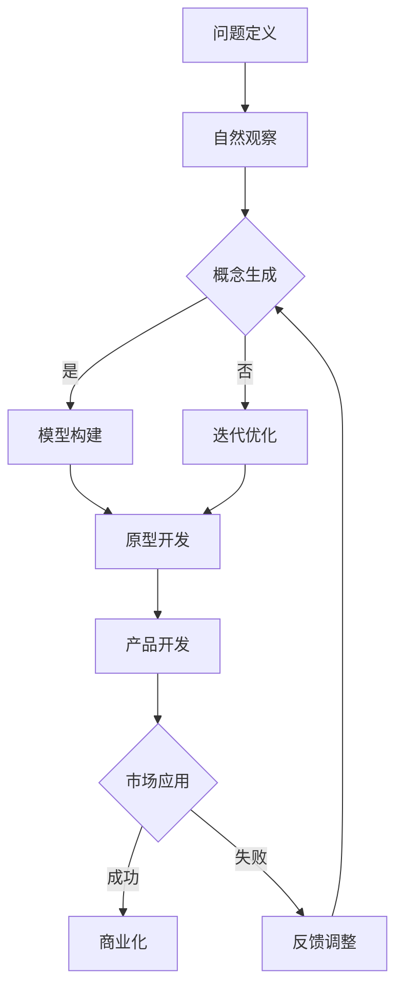

                 

### 《仿生科技创业：向自然学习的创新之路》

> **关键词：** 仿生科技、创业、自然学习、创新、设计原理、人工智能、材料、医学、案例研究。

> **摘要：** 本文旨在探讨仿生科技在创业领域的应用，通过分析其核心原理、应用领域、创业实践和未来展望，展示如何将自然界的智慧融入科技创新，为创业之路提供新的思路和方向。

----------------------------------------------------------------

### 第一部分：引言与基础

#### 1.1 仿生科技的定义与背景

仿生科技（Bionic Technology），源自希腊语“βιονικός”（意为“生命的”），是指通过模仿自然界中生物的结构、功能和行为，来设计开发新技术、新材料和新系统的科学。仿生科技不仅仅是简单地复制自然界的模式，更强调对其本质和原理的理解，以实现创新的科技突破。

仿生科技的发展可以追溯到20世纪中叶。最早的仿生研究主要集中在仿生学（Bionics）领域，即通过模仿生物的生理结构和功能来开发人工假肢和辅助设备。例如，1960年代发明的用于改善听力的人工耳蜗就是仿生学的重要成果。随着计算机技术、材料科学和生物工程的进步，仿生科技逐渐从医学领域扩展到能源、环保、航空航天、生物医学等多个领域。

#### 1.2 自然界的智慧与人类创新

自然界是创新的源泉，生物在长期的进化过程中形成了各种高效、节能、自适应的解决方案。这些解决方案不仅具有高度的复杂性和适应性，而且通常在资源有限的环境下展现出卓越的效能。例如，鸟类的飞行、植物的光合作用、鱼类的游泳等，都为人类提供了宝贵的仿生灵感。

人类历史上，许多技术创新都源于对自然界的模仿。古代的渔网模仿了鱼类的鳞片，现代的复合材料模仿了鸟类的羽毛，太阳能电池模仿了植物的光合作用。这些仿生技术不仅提高了人类的生产力，也推动了科技的进步。

#### 1.3 仿生科技的重要性

仿生科技的重要性体现在以下几个方面：

1. **解决复杂问题**：自然界中的生物通常具有解决复杂问题的能力，例如，蝴蝶的抗污能力、鸟类的导航系统。通过仿生科技，我们可以将这些复杂的解决方案应用于现实世界，解决各种难题。

2. **提高资源效率**：仿生科技可以帮助我们开发出更加高效、节能的技术和材料，从而降低资源消耗，减少环境污染。例如，模仿植物光合作用的太阳能电池可以提高能源转化效率。

3. **创新科技产品**：仿生科技为科技创新提供了新的方向和灵感，例如，仿生机器人、仿生传感器、仿生材料等，这些产品不仅具有高性能，还具备独特的功能。

4. **推动学科交叉**：仿生科技涉及多个学科领域，如生物学、物理学、材料科学、计算机科学等，通过跨学科的融合，可以推动新领域的形成和发展。

综上所述，仿生科技作为一门融合多学科的前沿领域，正日益受到重视。在创业领域，仿生科技不仅为创业者提供了创新的思路和方法，也为解决现实问题提供了新的解决方案。

----------------------------------------------------------------

### 第一部分：引言与基础（续）

#### 1.4 仿生科技创业的兴起

近年来，随着科技的迅猛发展，仿生科技创业开始兴起，并在多个领域取得了显著成果。仿生科技创业的兴起主要得益于以下几个因素：

1. **技术突破**：计算机技术、生物工程、纳米技术等领域的突破，为仿生科技的研究提供了强大的技术支持。这些技术的进步使得仿生设计从理论走向实践，为创业提供了坚实的基础。

2. **市场需求**：随着环保意识的增强和可持续发展理念的普及，市场对高效、节能、环保的科技产品需求日益增长。仿生科技正好满足了这一市场需求，为创业者提供了广阔的发展空间。

3. **政策支持**：许多国家和地区纷纷出台政策，鼓励仿生科技研究和创业。这些政策包括资金支持、税收优惠、创业孵化等，为仿生科技创业提供了有利的环境。

4. **创新文化**：全球范围内的创新文化日益浓厚，创业者们勇于探索未知领域，积极尝试新的商业模式和技术创新。这种创新文化为仿生科技创业提供了良好的氛围。

#### 1.5 仿生科技创业的特点

仿生科技创业具有以下几个显著特点：

1. **跨学科性**：仿生科技涉及多个学科领域，如生物学、物理学、材料科学、计算机科学等。创业团队通常需要具备跨学科的知识和技能，以实现科技的创新和突破。

2. **高投入性**：仿生科技研究往往需要大量的资金、设备和人力资源。创业团队需要具备较强的资金筹集能力和资源整合能力，以确保项目的顺利推进。

3. **高风险性**：由于仿生科技的创新性和复杂性，创业项目往往面临较大的风险。例如，技术突破的不确定性、市场接受度的风险等。创业团队需要具备较强的风险承受能力和应对策略。

4. **持续创新**：仿生科技创业强调持续创新，通过不断改进和优化，提高产品和服务的性能和竞争力。创业团队需要具备持续创新的能力和意识。

综上所述，仿生科技创业具有跨学科、高投入、高风险和持续创新等特点，这既为创业者提供了机遇，也带来了挑战。在接下来的章节中，我们将深入探讨仿生科技的核心原理、应用领域、创业实战和未来展望，以帮助读者更好地理解和把握这一新兴领域。

----------------------------------------------------------------

### 第一部分：引言与基础（续）

#### 1.6 仿生科技创业的成功案例

为了更好地理解仿生科技创业的潜力和实际应用，我们来看几个成功的案例：

1. **3M公司**：3M公司是一家全球性的多元化科技创新企业，其众多产品都是通过仿生设计实现的。例如，公司研发的“Scotch Tape”模仿了昆虫腿上的粘性物质，而其开发的“Post-it”便签则是受到鸟类嘴部粘性的启发。

2. **波音公司**：波音公司在飞机设计中大量采用了仿生科技。例如，波音787梦幻客机的设计灵感来自鸟类的翅膀，采用了更轻、更强的复合材料，大大提高了燃油效率。

3. **iRobot公司**：iRobot公司是一家专注于家用和服务机器人研发的公司，其产品包括扫地机器人Roomba和探索机器人Scooba。这些产品的设计灵感来自动物的行为模式，通过仿生学原理实现了高效的清洁能力。

4. **特斯拉公司**：特斯拉公司在其电动汽车设计中也运用了仿生科技。例如，特斯拉的电池设计灵感来自植物的结构，通过模仿植物叶片的排列方式，提高了能量密度和充电效率。

这些案例展示了仿生科技在创业中的广泛应用和巨大潜力。通过模仿自然界的智慧，这些公司不仅实现了技术的突破，也为市场提供了创新的产品和服务。

#### 1.7 仿生科技创业的挑战与机遇

虽然仿生科技创业充满了机遇，但也面临着一系列挑战：

1. **技术挑战**：仿生科技通常涉及复杂的技术问题，如生物仿生、计算仿生、材料仿生等。创业者需要具备深厚的专业知识和跨学科的能力，以克服技术难题。

2. **研发投入**：仿生科技的研究和开发往往需要大量的资金和资源。创业者需要寻找合适的投资渠道，确保项目的持续发展。

3. **市场接受度**：仿生科技产品往往具有独特的功能和性能，但市场接受度可能较低。创业者需要通过有效的市场推广和用户教育，提高产品的市场认可度。

4. **法规和标准**：仿生科技的应用可能涉及到法规和标准的问题，创业者需要了解相关法规，确保产品合规。

尽管如此，仿生科技创业仍然具有巨大的潜力。随着科技的不断进步和市场的不断成熟，仿生科技将为创业带来更多的机遇。创业者可以通过积极创新、持续学习和有效资源整合，克服挑战，抓住机遇，实现创业的成功。

在接下来的章节中，我们将进一步探讨仿生科技的核心原理、应用领域和发展趋势，为读者提供更深入的洞察。

----------------------------------------------------------------

### 第二部分：仿生科技的历史与发展

#### 2.1 仿生科技的起源

仿生科技的起源可以追溯到人类对自然的观察和模仿。自古以来，人类就通过模仿自然界中的生物结构和功能，创造出各种工具和设备。例如，古代渔网的发明就是模仿鱼类的鳞片，早期的船只设计模仿了水生动物的身体形态。这些早期的仿生实践为后来的仿生科技奠定了基础。

然而，作为一门系统的科学，仿生学的概念是在20世纪中期提出的。1948年，美国发明家凯恩（Karl von Frisch）在研究蜜蜂的色觉和舞蹈时，提出了“仿生学”一词，意指通过模仿生物的特性和功能来设计新技术和设备。这一概念的提出标志着仿生科技正式成为一门独立的科学领域。

#### 2.2 仿生科技的关键里程碑

仿生科技的发展经历了多个关键里程碑，以下是其中一些重要的事件：

1. **1960年代**：人工耳蜗的发明标志着仿生学在医疗领域的突破。人工耳蜗通过模仿人类内耳的结构和功能，为患有重度听力损失的人提供了听力辅助。

2. **1970年代**：仿生机器人开始出现，如日本研发的“ASIMO”机器人。这些机器人通过模仿人类的行为和动作，展示了仿生科技在机器人领域的潜力。

3. **1980年代**：纳米科技的兴起为仿生科技提供了新的工具。纳米技术使得人类能够在微观尺度上模仿生物的结构和功能，开发出具有独特性能的仿生材料。

4. **1990年代**：生物仿生材料得到广泛应用。这些材料模仿了生物组织的结构和性能，被用于医疗植入物、航空航天材料和环保技术等领域。

5. **21世纪初**：人工智能与仿生科技的结合，推动了计算仿生的发展。通过模拟生物的计算和决策过程，人工智能在图像识别、自动驾驶等领域取得了重大突破。

#### 2.3 仿生科技的现状与趋势

当前，仿生科技已经成为多个领域的重要研究方向。以下是几个主要的发展趋势：

1. **跨学科融合**：仿生科技的研究越来越倾向于跨学科融合，如生物工程、材料科学、计算机科学等领域的交叉研究，推动了仿生科技的深入发展。

2. **智能化与自动化**：随着人工智能和自动化技术的发展，仿生系统正变得越来越智能和自动化。例如，仿生无人机、仿生机器人等，通过集成感知、决策和执行系统，实现了更高水平的自主性和适应性。

3. **生物仿生材料**：生物仿生材料在医疗、环保和航空航天等领域具有广泛的应用前景。这些材料通过模仿生物的结构和功能，提供了更高效、更环保的解决方案。

4. **可持续发展**：仿生科技在可持续发展方面具有重要作用。通过模仿自然界的能源转换和物质循环过程，仿生科技为开发清洁能源、减少污染和实现资源循环利用提供了新的思路。

5. **政策支持**：全球范围内，越来越多的国家和地区开始出台政策，支持仿生科技的研究和应用。这些政策包括资金支持、税收优惠、研发补贴等，为仿生科技的发展提供了有力的保障。

总之，仿生科技已经从最初的模仿阶段走向了创新和突破的新阶段。在未来的发展中，仿生科技将继续融合多学科知识，推动科技创新和社会进步。

----------------------------------------------------------------

### 第二部分：仿生科技的历史与发展（续）

#### 2.4 仿生科技在商业领域的应用

仿生科技不仅改变了科学研究的方式，也在商业领域引起了巨大的变革。以下是一些仿生科技在商业领域的重要应用：

1. **产品设计**：仿生设计已经成为现代产品设计的重要手段。通过模仿自然界中的生物结构和功能，设计师可以创造出更加美观、功能性强且环保的产品。例如，波音787梦幻客机的机身采用了模仿鸟类翅膀形状的设计，使其更加流线型，从而提高了燃油效率。

2. **生物医学**：仿生科技在医疗领域的应用日益广泛。生物仿生材料被用于制造人工器官和植入物，如人工心脏瓣膜、骨替换材料等。此外，仿生科技还被用于开发新的医疗设备和诊断工具，如仿生眼和人工耳蜗。

3. **材料科学**：仿生科技在材料科学领域也发挥了重要作用。通过模仿自然界中具有特殊性能的材料，如蝴蝶的鳞片和鲨鱼的皮肤，科学家们开发出了具有高耐磨性、自洁性和抗菌性的新型材料。

4. **能源领域**：仿生科技在能源领域的应用包括太阳能电池、风力涡轮机和生物燃料等。例如，模仿植物光合作用的太阳能电池可以更高效地转换太阳能，而模仿鲨鱼皮肤的水下风力涡轮机则可以减少摩擦阻力，提高发电效率。

5. **环境保护**：仿生科技在环境保护中的应用也具有广泛前景。通过模仿自然界的生物过程，科学家们开发出了能够降解污染物、净化水源和土壤的新型生物材料和生物反应器。

#### 2.5 仿生科技的商业潜力

仿生科技的商业潜力在于其创新性和应用前景。以下是一些具体的商业潜力：

1. **新产品开发**：仿生科技为创业者和企业提供了开发新产品的灵感。通过模仿自然界的解决方案，企业可以创造出具有独特性能和市场竞争力的新产品。

2. **绿色科技**：随着环保意识的提高，绿色科技产品受到市场的欢迎。仿生科技提供了一种可持续的解决方案，通过模仿自然界的生态过程，企业可以开发出更加环保的产品和服务。

3. **技术创新**：仿生科技推动了技术创新，为企业提供了新的商业模式和竞争优势。例如，通过仿生设计，企业可以提高产品的性能和效率，从而降低成本，提高市场占有率。

4. **跨界合作**：仿生科技促进了不同领域的跨界合作。企业可以通过与生物学家、材料科学家和工程师等跨学科专家的合作，共同开发出创新的仿生产品。

5. **市场扩展**：仿生科技的应用不仅限于特定领域，它可以跨越多个行业，为市场扩展提供了新的机会。例如，一个在医疗领域取得成功的仿生产品，可以通过技术移植进入航空航天、汽车制造等领域。

综上所述，仿生科技在商业领域的应用为创业者和企业提供了广阔的发展空间。通过将自然界的智慧融入科技创新，企业可以开发出具有市场竞争力的高性能产品，实现商业成功。在接下来的章节中，我们将进一步探讨仿生科技的核心原理和实际应用，以帮助读者更好地理解和把握这一领域的创新潜力。

----------------------------------------------------------------

### 第二部分：仿生科技的历史与发展（续）

#### 2.6 仿生科技在各个领域的具体案例

为了更好地理解仿生科技的应用范围和实际效果，下面我们来看一些在不同领域中的具体案例：

**1. 生物医学领域**

- **人工耳蜗**：人工耳蜗是一种电子装置，用于帮助听力受损的人恢复听力。它的设计灵感来自人类内耳的结构，通过模拟听觉神经的工作原理，将声信号转换为电信号，传递给大脑。
- **仿生眼**：仿生眼是一种用于替代人类视网膜的电子装置。它通过光电传感器捕捉光线，将其转换为电信号，然后通过神经网络处理，生成视觉信息，帮助盲人恢复视觉功能。

**2. 材料科学领域**

- **仿生材料**：例如，模仿蝴蝶鳞片的材料具有优异的防水和防污性能，被用于制造高性能的服装和建筑材料。此外，模仿鲨鱼皮肤的纳米材料具有优异的防粘性和防腐蚀性能，被用于制造海洋设备。

**3. 航空航天领域**

- **飞机翼型设计**：波音787梦幻客机的翼型设计灵感来自鸟类的翅膀，通过模仿鸟类的流线型结构，降低了空气阻力，提高了飞行效率。
- **空间太阳能板**：空间太阳能板的设计模仿了植物叶片的结构，通过模仿植物叶片的排列方式，提高了太阳能电池板的能量吸收效率。

**4. 能源领域**

- **仿生电池**：模仿植物光合作用的太阳能电池通过模仿植物叶片的光能捕获机制，提高了太阳能的转化效率。
- **生物燃料**：通过模仿生物体的代谢过程，科学家们开发出了能够高效转化为能量的生物燃料，这些燃料不仅可以减少温室气体排放，还具有可再生性。

**5. 环保领域**

- **仿生污水处理**：仿生污水处理系统模仿了自然水体中的生物过程，通过微生物和植物协同作用，有效地净化污水。
- **仿生空气净化**：仿生空气净化设备模仿了植物的光合作用和生物吸附作用，能够高效地去除空气中的有害物质。

这些案例展示了仿生科技在各个领域的广泛应用和实际效果。通过模仿自然界的智慧，仿生科技为解决现实问题提供了创新的解决方案，推动了科学技术的进步。

#### 2.7 仿生科技的未来发展方向

随着科技的不断进步和跨学科研究的深入，仿生科技的未来发展方向也变得越来越清晰：

1. **智能化与自主化**：未来的仿生系统将更加智能化和自主化，通过集成人工智能和自动化技术，实现更高的自主决策和执行能力。例如，智能仿生机器人可以在复杂环境中自主完成任务。

2. **个性化与定制化**：仿生科技的发展将使得个性化医疗、个性化设计和个性化制造成为可能。通过定制化的仿生产品，可以更好地满足用户的需求。

3. **系统集成与协同**：仿生科技将不仅仅是单一领域的突破，而是多个领域的系统集成。例如，生物医学、材料科学、航空航天等领域的协同创新，将推动仿生科技向更高水平发展。

4. **可持续性与环保**：未来的仿生科技将更加注重可持续性和环保。通过模仿自然界的生态过程，开发出更加高效、环保的科技产品，实现科技与自然的和谐发展。

5. **政策支持与产业协同**：政府政策支持和产业协同将推动仿生科技的发展。政策制定者将更加关注仿生科技的创新和应用，提供相应的支持措施，促进产业协同和跨学科合作。

总之，仿生科技的未来充满希望，其发展不仅将推动科学技术的进步，还将为人类社会的可持续发展提供新的解决方案。在接下来的章节中，我们将继续探讨仿生科技的核心原理和创业实战，为读者提供更深入的洞察。

----------------------------------------------------------------

### 第二部分：仿生科技的历史与发展（续）

#### 2.8 仿生科技的发展历程与未来展望

仿生科技的发展历程可以划分为以下几个阶段：

1. **早期探索阶段（20世纪中叶至70年代）**：这一阶段主要集中在生物仿生学的研究，如人工耳蜗和人工器官的发明。科学家们开始意识到，通过模仿生物的结构和功能，可以创造出具有特殊性能的人工装置。

2. **技术突破阶段（80年代至90年代）**：随着纳米技术和生物工程的发展，仿生科技进入了一个新的阶段。纳米材料、生物传感器和生物仿生材料等新技术为仿生科技的应用提供了更多的可能性。

3. **融合与应用阶段（21世纪初至今）**：这一阶段的特点是仿生科技与其他领域的深度融合。计算仿生、材料仿生和系统仿生等研究方向不断拓展，仿生科技在航空航天、能源、环保和医疗等领域得到了广泛应用。

4. **智能化与自主化阶段（未来）**：随着人工智能和自动化技术的发展，仿生系统将变得更加智能化和自主化。未来，仿生科技将在智能制造、智能医疗和智能环境等领域发挥更大的作用。

未来，仿生科技的发展将呈现出以下几个趋势：

1. **跨学科融合**：仿生科技将继续与其他学科如计算机科学、材料科学、生物学等深度融合，形成新的交叉学科和研究方向。

2. **智能化与自主化**：通过人工智能和自动化技术的应用，仿生系统将具备更高的自主决策和执行能力，实现更高效、更智能的运作。

3. **个性化与定制化**：随着对生物体和自然界的深入理解，仿生科技将能够更好地满足个性化需求，提供定制化的解决方案。

4. **可持续发展**：仿生科技将更加注重可持续性，通过模仿自然界的生态过程，开发出更加环保、高效的科技产品。

5. **政策支持与产业协同**：政府政策和产业协同将推动仿生科技的发展，促进科技创新和产业升级。

总之，仿生科技的发展历程和未来展望充满了机遇和挑战。通过不断探索和创新，仿生科技将为人类社会的可持续发展和技术进步做出更大贡献。

----------------------------------------------------------------

### 第二部分：仿生科技的历史与发展（续）

#### 2.9 仿生科技的商业价值与市场前景

仿生科技在商业领域具有巨大的价值，其潜在市场前景广阔。以下是仿生科技在商业领域的几个关键价值点：

1. **技术创新**：仿生科技通过模仿自然界的解决方案，推动了技术创新。这种创新不仅体现在新产品的开发上，还体现在现有产品的性能提升和成本降低。例如，仿生材料的应用可以显著提高产品的耐用性和环保性，从而增强市场竞争力。

2. **市场差异化**：仿生科技为企业和创业者提供了独特的市场差异化策略。通过开发具有独特性能和功能的仿生产品，企业可以在竞争激烈的市场中脱颖而出。这种差异化策略有助于企业建立品牌认知度和客户忠诚度。

3. **可持续性**：随着全球环保意识的提高，可持续性成为企业的一项重要战略。仿生科技提供了一种实现可持续发展的有效途径。通过模仿自然界的生态过程，企业可以开发出环保、高效的产品和服务，满足消费者对可持续产品的需求。

4. **成本效益**：仿生科技的应用可以帮助企业降低生产成本。例如，仿生材料通常具有优异的性能，可以在减轻产品重量的同时保持强度和耐用性，从而降低运输和存储成本。此外，仿生设计的优化还可以提高生产效率和降低生产时间。

5. **跨界合作**：仿生科技促进了不同领域的跨界合作。企业可以通过与生物学家、材料科学家和工程师等跨学科专家的合作，共同开发创新的仿生产品。这种跨界合作不仅有助于推动技术创新，还可以打开新的市场机会。

6. **法规遵守**：随着环保法规的日益严格，企业需要确保其产品和服务符合法规要求。仿生科技的应用可以帮助企业更容易地达到法规要求，降低合规风险。

市场前景方面，仿生科技在多个领域具有广阔的应用前景：

1. **医疗领域**：仿生科技在医疗领域的应用前景包括人工器官、生物材料、智能医疗器械等。随着人口老龄化和医疗需求增加，这一领域对仿生科技的需求将不断增长。

2. **能源领域**：仿生科技在能源领域的应用包括太阳能电池、风能设备、生物燃料等。随着全球对可再生能源的需求不断增加，仿生科技在这一领域的市场潜力巨大。

3. **环保领域**：仿生科技在环保领域的应用包括污染治理、水资源管理、土壤修复等。随着环境问题的日益严重，这一领域的市场需求将持续增长。

4. **制造业**：仿生科技在制造业的应用包括智能制造、高效生产、节能设计等。随着工业4.0和智能制造的发展，仿生科技将为制造业带来重大变革。

5. **消费电子**：仿生科技在消费电子领域的应用包括智能设备、穿戴设备、智能家居等。随着消费者对科技产品的需求日益多样化，仿生科技将推动消费电子市场的发展。

总之，仿生科技在商业领域具有巨大的价值和市场前景。通过不断创新和跨界合作，企业可以抓住这一机遇，开发出具有竞争力的仿生产品，实现商业成功。

----------------------------------------------------------------

### 第三部分：仿生科技的核心原理

#### 3.1 仿生设计的原理

仿生设计（Biomimicry）是一种通过模仿自然界的结构和功能来设计新产品、新系统或新工艺的方法。仿生设计的核心原理在于从自然界中获取灵感，并将这些灵感应用于现实世界的解决方案中。以下是仿生设计的基本原理：

1. **形态仿生**：形态仿生是指模仿生物的形态和结构特征来设计产品或系统。例如，飞机的机翼设计模仿了鸟类的翅膀，使其在飞行时具有更低的空气阻力和更高的升力。形态仿生的关键在于理解生物形态的适应性和效率，并将其应用于工程实践中。

2. **功能仿生**：功能仿生是指模仿生物的功能和机制来设计产品或系统。例如，人工心脏瓣膜的设计模仿了动物心脏瓣膜的开闭机制，以提高瓣膜的耐用性和性能。功能仿生的核心在于理解生物功能的原理和机制，并将其转化为技术解决方案。

3. **结构仿生**：结构仿生是指模仿生物的结构和材料特性来设计产品或系统。例如，复合材料的设计模仿了鸟类的羽毛和鱼类的鳞片，使其具有更高的强度和较低的重量。结构仿生的关键在于理解生物材料的性能和结构特征，并将其应用于工程材料的设计中。

#### 3.2 仿生设计的流程与方法

仿生设计的流程和方法可以分为以下几个步骤：

1. **问题定义**：首先，明确需要解决的问题或挑战。例如，提高飞机的燃油效率、开发高效的空气净化系统或设计新型的医疗设备。

2. **自然观察**：接下来，通过观察和研究自然界中的生物和生态系统，寻找可能的解决方案。这一步骤需要具备对自然界深入了解的知识，以便发现生物的适应性和功能原理。

3. **概念生成**：在观察和研究的启发下，生成可能的仿生设计概念。这些概念可以包括新的材料、结构、系统或工艺。

4. **模型构建**：根据仿生设计概念，构建数学模型或物理模型，以验证设计概念的有效性和可行性。

5. **迭代优化**：通过迭代和优化，不断改进仿生设计。这一步骤通常需要结合实验和计算模拟，以验证和优化设计方案的性能。

6. **原型开发**：在模型验证和优化后，开发仿生设计的原型。原型开发可以进一步验证设计概念的实际效果，并为最终产品的开发提供参考。

7. **产品开发**：在原型开发的基础上，进行产品的详细设计和制造，最终实现商业化。

#### 3.3 仿生设计的应用领域

仿生设计在多个领域具有广泛的应用，以下是其中一些重要的应用领域：

1. **航空航天**：在航空航天领域，仿生设计被用于优化飞机和飞行器的结构、材料和控制系统。例如，飞机机翼的设计模仿了鸟类的翅膀，以提高飞行性能和效率。

2. **材料科学**：在材料科学领域，仿生设计被用于开发新型材料，如具有高强度的仿生复合材料和具有特殊功能的智能材料。这些材料在航空航天、汽车制造和建筑等领域具有广泛的应用。

3. **医学**：在医学领域，仿生设计被用于开发人工器官、生物材料和智能医疗器械。例如，人工心脏瓣膜和人工耳蜗的设计模仿了生物体的结构和功能，以提高医疗设备的性能和可靠性。

4. **环境科学**：在环境科学领域，仿生设计被用于开发新型环保技术和设备，如仿生污水处理系统和仿生空气净化器。这些设备通过模仿自然界的生态过程，提供了高效的环保解决方案。

5. **能源领域**：在能源领域，仿生设计被用于开发新型能源转换和存储技术。例如，模仿植物光合作用的太阳能电池和模仿动物代谢过程的生物燃料，为可持续能源提供了新的思路。

总之，仿生设计通过模仿自然界的智慧和解决方案，为科技创新提供了新的思路和方法。通过深入理解自然界的结构和功能，仿生设计可以为各个领域的创新和发展提供有力支持。

----------------------------------------------------------------

### 第三部分：仿生科技的核心原理（续）

#### 3.4 仿生设计在材料科学中的应用

仿生设计在材料科学中的应用是当前研究的热点之一。通过模仿自然界的生物材料，科学家们开发出了许多具有独特性能的新型材料，这些材料在航空航天、生物医学、能源等多个领域展现出了巨大的应用潜力。

**1. 仿生复合材料的开发**

自然界中的生物材料，如鸟类的羽毛、鱼类的鳞片和昆虫的甲壳，都具有独特的结构和性能。科学家们通过模仿这些生物材料，开发出了许多高性能的复合材料。例如，模仿蝴蝶翅膀鳞片的材料具有优异的防污和防水性能，被广泛应用于服装和建筑材料。此外，模仿鲨鱼皮肤结构的纳米材料具有优异的防粘性和防腐蚀性能，被用于海洋设备和汽车材料。

**2. 生物材料的仿生设计**

生物材料在医学和生物工程领域具有广泛的应用。仿生设计被用于开发新型生物材料，如用于制造人工器官和植入物的材料。这些材料需要具备生物相容性、机械强度和功能特异性。例如，模仿人体骨骼和牙齿的羟基磷灰石材料被广泛应用于骨修复和牙科植入物。此外，模仿人体血液的智能材料被用于开发可穿戴医疗设备和药物释放系统。

**3. 仿生材料的性能优化**

通过仿生设计，科学家们可以优化材料的性能，以更好地满足特定应用的需求。例如，通过模仿植物叶子的结构，开发出了具有高效光能转化的太阳能电池。这些电池通过模仿植物叶子的多层次结构和光学特性，提高了太阳能的吸收和转换效率。此外，通过模仿生物体的自修复能力，科学家们开发出了具有自修复功能的材料。这些材料可以在受到损伤时自动修复，从而延长材料的使用寿命。

**4. 仿生材料在可持续发展中的应用**

仿生材料在可持续发展领域具有广泛的应用前景。通过模仿自然界的生物过程，科学家们开发出了许多环保材料。例如，模仿植物光合作用的材料被用于开发可持续的能源转换设备，如太阳能电池和生物燃料电池。此外，模仿微生物降解能力的材料被用于开发环保型包装材料和污水处理设备。

总之，仿生设计在材料科学中的应用为开发新型材料和优化材料性能提供了新的思路和方法。通过模仿自然界的智慧和解决方案，科学家们不断开发出具有独特性能的仿生材料，这些材料为各个领域的创新和发展提供了有力支持。

----------------------------------------------------------------

### 第三部分：仿生科技的核心原理（续）

#### 3.5 仿生设计在机器人学中的应用

仿生设计在机器人学中的应用是近年来研究的热点之一。通过模仿生物的结构、功能和行为，科学家们开发出了各种仿生机器人，这些机器人不仅在性能上接近生物，还在特定任务中展示了出色的能力和适应性。

**1. 仿生机器人的分类**

根据模仿的对象，仿生机器人可以分为以下几类：

- **形态仿生机器人**：这类机器人模仿生物的形态，如蝴蝶、鸟类和昆虫。例如，仿生蝴蝶机器人可以用于环境监测和侦察任务，而仿生鸟类机器人则可以用于空中拍摄和探索。

- **功能仿生机器人**：这类机器人模仿生物的功能，如仿生鱼类的游泳、仿生昆虫的攀爬和仿生蛇类的爬行。例如，仿生鱼形机器人可以用于水下探测和搜救任务，而仿生昆虫机器人则可以用于复杂环境中的搜索和救援。

- **行为仿生机器人**：这类机器人模仿生物的行为模式，如仿生蜜蜂的群体行为和仿生鸟类的迁徙行为。例如，仿生蜜蜂机器人可以用于农业监测和昆虫防治，而仿生鸟类机器人则可以用于城市交通管理和灾害预警。

**2. 仿生机器人的核心原理**

仿生机器人的核心原理主要包括以下几个部分：

- **机械结构仿生**：通过模仿生物的机械结构，如骨架、肌肉和皮肤，科学家们设计出了具有高灵活性和强耐用性的机械结构。例如，模仿人类身体的骨架结构，开发出了具有七自由度的仿生机器人手臂。

- **材料仿生**：通过模仿生物材料的高性能特性，如生物蛋白质、纳米晶体和细胞膜，科学家们开发出了具有特殊功能的仿生材料。这些材料不仅提高了机器人的性能，还增强了其生物兼容性。

- **控制系统仿生**：通过模仿生物的神经系统和感知系统，科学家们设计出了具有高度自主性和智能化的控制系统。例如，模仿生物的感知机制，开发出了具有视觉、听觉和触觉功能的仿生传感器，这些传感器可以用于复杂环境中的任务执行。

**3. 仿生机器人的应用案例**

仿生机器人在许多领域展现了其独特的应用价值，以下是几个典型的应用案例：

- **医疗领域**：仿生机器人被用于手术辅助、康复训练和健康监测。例如，仿生手臂机器人可以用于复杂手术的操作，而仿生康复机器人则可以帮助患者进行肢体的康复训练。

- **搜救领域**：仿生机器人被用于水下搜救、地震救援和山难救援。例如，仿生蛇形机器人可以进入狭窄和复杂的环境中进行搜救，而仿生昆虫机器人则可以用于地形复杂的搜救任务。

- **环境监测领域**：仿生机器人被用于环境监测、生物防治和生态保护。例如，仿生鸟形机器人可以用于空中环境监测和森林火灾预警，而仿生昆虫机器人则可以用于农田害虫的防治。

- **工业制造领域**：仿生机器人被用于工业自动化、精密制造和智能制造。例如，仿生手臂机器人可以用于汽车制造业的焊接、喷涂和组装，而仿生蛇形机器人则可以用于管道和设备内部的清洁和维护。

总之，仿生设计在机器人学中的应用为机器人技术的发展提供了新的思路和方法。通过模仿自然界的智慧和解决方案，科学家们不断开发出具有高灵活性和自主性的仿生机器人，这些机器人将在未来的科技发展中发挥重要作用。

----------------------------------------------------------------

### 第三部分：仿生科技的核心原理（续）

#### 3.6 仿生设计在能源领域的应用

仿生设计在能源领域的应用日益受到关注，通过模仿自然界的能量转换和存储机制，科学家们开发出了许多创新的技术和设备，以提升能源利用效率和减少环境影响。

**1. 太阳能电池的仿生设计**

自然界中的植物通过光合作用将太阳能转化为化学能，这一过程启发了太阳能电池的仿生设计。例如，科学家们模仿植物叶片的结构和光学特性，开发出了具有高效率的光伏材料。这些材料通过模仿植物叶绿体的多层结构，提高了光能的吸收和转换效率。此外，仿生太阳能电池还通过模仿植物叶片的表面微结构，实现了自我清洁功能，从而提高了电池的稳定性和耐用性。

**2. 风能设备的仿生设计**

自然界中的鸟类和昆虫在飞行过程中展示了卓越的空气动力学特性，这些特性为风能设备的仿生设计提供了灵感。例如，科学家们通过模仿鸟类的翅膀形状和角度，设计出了具有高效率的低速风力发电机。这些风力发电机不仅可以在风力较小的情况下高效运行，还可以减少噪音和振动，提高环境友好性。此外，仿生设计还被用于优化风力涡轮机的叶片材料，以提高叶片的强度和耐久性。

**3. 电池储能系统的仿生设计**

自然界中的生物体具有高效的能量存储和释放机制，这一机制为电池储能系统的仿生设计提供了启示。例如，科学家们通过模仿植物种子和昆虫的储能结构，开发出了具有高能量密度和快速充放电能力的电池。这些电池通过模仿生物体的储能和释放过程，实现了高效、安全、稳定的能量存储和转换。

**4. 仿生能源转换与利用**

仿生设计还被应用于其他能源转换和利用领域。例如，科学家们通过模仿生物体的热传导机制，设计出了高效的散热材料和热转换设备。这些设备可以在高温环境下稳定运行，提高能源利用效率。此外，仿生设计还被用于开发可持续的能源获取方法，如模仿藻类的光合作用过程，开发出高效的光合作用电池。

**5. 仿生能源技术在环保领域的应用**

仿生能源技术不仅提高了能源利用效率，还有助于减少环境污染。例如，科学家们通过模仿海洋生态系统的自净能力，开发出了高效的污水处理和生态修复技术。这些技术通过模仿自然界的生物过程，实现了污水的净化和土壤的修复，为环境保护提供了有效的解决方案。

总之，仿生设计在能源领域的应用为提升能源利用效率和实现可持续发展提供了新的思路和方法。通过模仿自然界的智慧和解决方案，科学家们不断开发出高效、环保的仿生能源技术，这些技术将在未来的能源革命中发挥重要作用。

----------------------------------------------------------------

### 第三部分：仿生科技的核心原理（续）

#### 3.7 仿生设计在建筑与土木工程中的应用

仿生设计在建筑与土木工程领域的应用正在逐渐引起关注，通过借鉴自然界中的建筑智慧和结构特性，工程师们创造出了更加环保、节能和可持续的建筑物和基础设施。

**1. 模仿自然结构的建筑设计**

自然界的建筑，如蜂巢、鸟巢和珊瑚礁，展示了出色的结构效率和材料利用。科学家和建筑师通过模仿这些结构，设计出了具有卓越性能的建筑。例如，蜂巢的结构提供了高强度和轻质的特点，被应用于新型建筑材料的开发。这种材料不仅重量轻，而且具有很高的强度和稳定性。此外，模仿鸟类巢穴的设计，工程师们开发出了具有高效保温和隔热性能的建筑外立面系统。

**2. 能源效率的优化**

通过仿生设计，建筑和土木工程领域实现了能源效率的显著提升。例如，模仿植物叶片的形状和角度，科学家们设计出了具有高效太阳能收集和利用的建筑材料。这些材料可以通过调整表面的微结构，最大限度地吸收太阳能，并将其转化为电能。此外，模仿珊瑚礁的分支结构，工程师们开发出了能够有效分散水流和减少水压的建筑结构，从而提高了建筑物的抗震能力。

**3. 环境适应性**

自然界中的生物具有出色的环境适应性，这一特性为建筑和土木工程的设计提供了灵感。例如，模仿沙漠中的植物，工程师们设计出了具有高效遮阳和蒸发冷却功能的建筑。这些建筑通过模仿植物的自然散热机制，有效地减少了室内温度，降低了空调能耗。此外，模仿鱼类的生活习性，工程师们开发出了具有自适应流线型结构的水下建筑，这些建筑能够减少水流阻力，提高航行效率。

**4. 资源循环与可持续发展**

仿生设计在资源循环和可持续发展方面的应用也得到了广泛研究。例如，模仿海洋生态系统的物质循环机制，工程师们设计出了能够实现废物循环和再利用的生态园区。这些园区通过模仿自然生态系统的循环过程，实现了水、能源和废弃物的有效管理。此外，模仿土壤中的微生物活动，工程师们开发出了能够有效降解污染物的生物修复技术，这些技术为污染土壤的修复提供了新的解决方案。

**5. 智能建筑与仿生控制**

随着信息技术和自动化技术的发展，仿生设计在智能建筑中的应用越来越广泛。例如，模仿生物体的神经网络，科学家们设计出了具有自感知和自调节功能的智能建筑系统。这些系统可以通过模拟生物体的自适应机制，实现对建筑环境、能源消耗和资源管理的智能控制。例如，智能建筑可以通过监测室内外环境参数，自动调节照明、通风和能源消耗，以提高能源利用效率和舒适度。

总之，仿生设计在建筑与土木工程领域的应用为现代建筑和基础设施提供了创新的解决方案。通过借鉴自然界的智慧和解决方案，工程师们不断创造出更加环保、节能和可持续的建筑和基础设施，为人类社会的可持续发展做出了重要贡献。

----------------------------------------------------------------

### 第三部分：仿生科技的核心原理（续）

#### 3.8 仿生设计在交通领域的应用

仿生设计在交通领域的应用正日益受到关注，通过借鉴自然界中的生物结构和行为模式，工程师们开发出了许多创新的交通工具和交通系统，以提高能源效率、减少环境影响并提升安全性。

**1. 仿生交通工具的设计**

自然界中的生物在运动过程中展示了卓越的效率和适应性。例如，鸟类在飞行中能够灵活地适应各种气流和地形，这一特性启发了飞机和无人机的设计。通过模仿鸟类的翅膀结构和飞行机制，工程师们设计出了具有高升力、低阻力的飞行器。此外，模仿鱼类游动的流体力学特性，科学家们开发了高效的水下交通工具，如潜水艇和无人潜航器。这些交通工具不仅能够提高运动效率，还能在复杂环境中实现精确操控。

**2. 仿生交通系统的设计**

仿生设计还被应用于交通系统的优化和设计。例如，模仿动物群体的行为模式，科学家们开发出了智能交通控制系统，这些系统能够模拟和预测交通流量，实时调整交通信号和路线，以减少交通拥堵和提高交通效率。此外，模仿蚂蚁等昆虫的协作行为，工程师们设计出了智能交通网络，这些网络能够通过分布式计算和协作，实现交通流的动态优化。

**3. 能源效率的提升**

仿生设计在提高交通工具的能源效率方面也发挥了重要作用。例如，模仿植物光合作用的机理，科学家们开发出了太阳能驱动的交通工具，如太阳能汽车和电动车。这些交通工具能够利用太阳能直接转换为动能，减少对传统化石燃料的依赖。此外，模仿动物肌肉的工作原理，工程师们设计出了高效能的电动机和动力系统，这些系统能够在保持高效率的同时，降低能耗和环境污染。

**4. 安全性能的增强**

仿生设计在提升交通工具的安全性能方面也取得了显著成果。例如，模仿动物的感知系统，科学家们开发了具有高级感知和预警功能的智能交通系统，这些系统能够实时监测交通状况，预警潜在的危险。此外，模仿生物的骨骼结构，工程师们设计出了具有高强度和轻量化的汽车外壳和车身结构，这些结构能够在发生碰撞时吸收和分散能量，减少事故对乘客的伤害。

**5. 环境适应性**

仿生设计还被用于提高交通工具的环境适应性。例如，模仿鱼类的适应性机制，科学家们设计出了能够在不同水域和气候条件下运行的船舶和潜艇。此外，模仿昆虫的飞行和生存策略，工程师们开发了能够在极端环境中作业的无人机和探测设备，这些设备能够在恶劣的自然环境中保持稳定的性能。

总之，仿生设计在交通领域的应用为交通工具和交通系统的创新提供了新的思路和方法。通过借鉴自然界的智慧和解决方案，工程师们不断创造出更加高效、环保、安全的新型交通工具和交通系统，为交通行业的可持续发展做出了重要贡献。

----------------------------------------------------------------

### 第三部分：仿生科技的核心原理（续）

#### 3.9 仿生设计在电子信息领域的应用

仿生设计在电子信息领域的应用正日益成为研究热点，通过模仿自然界中的生物结构和功能，科学家们开发出了许多创新的电子设备和系统，以提高性能、降低能耗并增强智能性。

**1. 仿生传感器的设计**

仿生传感器是通过模仿生物感知系统来感知外界环境的设备。例如，模仿昆虫的复眼，科学家们开发出了具有高分辨率和高灵敏度的视觉传感器。这些传感器可以用于机器人导航、无人机监控和自动驾驶等领域。此外，模仿动物的热感知机制，科学家们设计出了能够感知温度变化的红外传感器，这些传感器在夜视设备和安防监控中有着广泛的应用。

**2. 仿生电路与芯片的设计**

仿生设计在电路和芯片设计中也有重要应用。例如，模仿生物神经元的工作原理，科学家们开发了神经网络芯片，这些芯片能够模拟人脑的计算和处理能力，用于复杂的数据分析和模式识别。此外，模仿鸟类的通信方式，科学家们设计出了低能耗、高速率的无线通信芯片，这些芯片在物联网和5G通信中具有巨大的应用潜力。

**3. 仿生计算与人工智能**

仿生计算是指通过模仿生物体的计算和决策机制来实现高效计算和智能处理。例如，模仿大脑的神经网络结构，科学家们开发了深度学习算法和神经网络芯片，这些算法和芯片在图像识别、语音识别和自然语言处理等领域有着广泛应用。此外，模仿蚂蚁的群体行为，科学家们开发出了分布式计算和协同优化算法，这些算法在物流优化、交通调度和金融风险管理中发挥着重要作用。

**4. 仿生能源管理**

仿生设计还被用于开发高效能的能源管理系统。例如，模仿植物的光合作用和呼吸作用，科学家们设计出了高效的能量收集和存储系统，这些系统可以用于可再生能源的采集和管理。此外，模仿动物体温调节机制，科学家们开发出了智能温控系统，这些系统能够根据环境温度自动调整能源消耗，以实现节能减排。

**5. 仿生网络安全**

仿生设计在网络安全领域的应用也具有重要意义。例如，模仿生物免疫系统，科学家们开发出了具有自我保护和自我修复能力的网络安全系统。这些系统可以实时检测和防御网络攻击，提高网络的安全性和可靠性。此外，模仿动物的社交行为，科学家们开发出了基于协作和信任机制的分布式网络安全系统，这些系统能够在分布式环境中实现高效的威胁检测和响应。

总之，仿生设计在电子信息领域的应用为电子设备和系统的创新提供了新的思路和方法。通过借鉴自然界的智慧和解决方案，科学家们不断开发出高性能、低能耗、智能化的电子设备和系统，为信息时代的发展做出了重要贡献。

----------------------------------------------------------------

### 第三部分：仿生科技的核心原理（续）

#### 3.10 仿生设计在物流与仓储领域的应用

仿生设计在物流与仓储领域的应用正在引发一场革命，通过借鉴自然界中的生物行为和生态系统，科学家们开发出了高效、智能和环保的物流与仓储解决方案。

**1. 模仿动物导航与觅食行为的物流优化**

动物在寻找食物和导航过程中展示了卓越的能力，这一特性启发了物流优化算法的开发。例如，模仿蜜蜂的觅食行为，科学家们设计出了基于群体智能的路径优化算法。这些算法通过模拟蜜蜂之间的信息共享和协作，能够在复杂环境中找到最优的物流路径，从而提高运输效率和降低成本。

**2. 模仿生态系统管理的仓储系统设计**

生态系统管理强调生态平衡和资源的有效利用，这一理念为仓储系统设计提供了启示。例如，通过模仿自然生态系统的循环机制，科学家们设计出了循环仓储系统。这些系统通过优化库存管理和物流流程，实现了资源的循环利用和减少浪费。此外，模仿植物的生长和繁殖过程，工程师们开发出了智能化的仓储系统，这些系统能够根据需求自动调整库存水平和物流速度。

**3. 仿生传感器在仓储管理中的应用**

仿生传感器在仓储管理中发挥着重要作用，通过模仿生物的感知机制，这些传感器能够实时监测仓储环境，如温度、湿度、光照和空气质量等。例如，模仿鱼类的嗅觉机制，科学家们开发出了能够检测化学品泄漏的仿生传感器。这些传感器可以用于危险品仓库和化学品生产企业的安全管理，从而提高仓储安全水平。

**4. 智能搬运机器人的开发**

仿生设计还被用于开发智能搬运机器人，这些机器人通过模仿昆虫和哺乳动物的搬运行为，实现了高效、精准的物料搬运。例如，模仿蚂蚁的协作搬运行为，科学家们开发出了基于群体智能的搬运机器人。这些机器人能够在复杂环境中协同工作，提高仓储作业的效率。此外，模仿哺乳动物的运动机制，工程师们设计出了具有高灵活性和适应性的搬运机器人，这些机器人能够应对各种仓储作业场景。

**5. 仿生设计在供应链管理中的应用**

仿生设计在供应链管理中的应用也取得了显著成果。例如，模仿生物体的适应性和自组织能力，科学家们开发出了自适应供应链管理系统。这些系统通过模拟生物体的自我修复和适应机制，能够在供应链中断和需求波动时，自动调整供应链策略，确保供应链的稳定和高效运行。

总之，仿生设计在物流与仓储领域的应用为行业带来了创新和变革。通过借鉴自然界的智慧和解决方案，科学家们不断开发出高效、智能和环保的物流与仓储系统，为现代物流与仓储行业的可持续发展提供了有力支持。

----------------------------------------------------------------

### 第三部分：仿生科技的核心原理（续）

#### 3.11 仿生设计在农业与食品领域的应用

仿生设计在农业与食品领域的应用正逐渐改变传统农业和食品生产的模式，通过借鉴自然界中的生态智慧和生物特性，科学家们开发出了许多创新的技术和产品，以提高农业生产效率、改善食品安全和减少环境影响。

**1. 仿生作物设计**

仿生设计在作物设计中得到了广泛应用，通过模仿植物的形态和生理特性，科学家们开发出了具有高效光合作用和抗病虫害能力的作物品种。例如，模仿光合作用效率高的植物，科学家们培育出了高光效作物，这些作物能够在同样的光照条件下产生更多的能量，从而提高产量。此外，模仿植物的自我保护机制，科学家们培育出了抗病虫害的作物，这些作物能够抵抗常见的病虫害，减少农药使用，提高农业生产的安全性。

**2. 仿生农田管理**

仿生农田管理通过模仿自然生态系统的管理方法，实现了农业生产的高效和可持续发展。例如，模仿自然水循环机制，科学家们开发出了智能灌溉系统，这些系统能够根据土壤湿度和作物需水量，自动调节灌溉量，从而提高水资源的利用效率。此外，模仿自然土壤生态系统，科学家们开发出了生物土壤改良技术，这些技术通过增加土壤中的有机质和微生物多样性，提高了土壤的肥力和抗病虫害能力。

**3. 仿生食品生产**

仿生设计在食品生产中的应用同样具有重要意义。例如，模仿海洋生物的代谢过程，科学家们开发出了人工海水养殖技术，这些技术能够在模拟海洋环境条件下，高效养殖鱼类和贝类，从而减少对天然海洋资源的依赖。此外，模仿植物的光合作用和微生物的发酵过程，科学家们开发出了新型食品添加剂和调味品，这些产品不仅提高了食品的口感和营养价值，还减少了食品加工过程中对环境的影响。

**4. 仿生农业机器人**

仿生农业机器人是仿生设计在农业领域的重要应用之一。这些机器人通过模仿昆虫和哺乳动物的行为，实现了精准的农业操作。例如，模仿昆虫的觅食行为，科学家们开发出了农业巡检机器人，这些机器人能够在农田中自动巡检，实时监测作物生长情况和病虫害发生情况。此外，模仿哺乳动物的运动机制，工程师们设计出了农业搬运机器人，这些机器人能够自动执行播种、施肥、收割等农业操作，大大提高了农业生产效率。

**5. 仿生食品包装**

仿生设计在食品包装中的应用也展现了其独特的优势。例如，模仿植物细胞壁的结构，科学家们开发出了生物降解性食品包装材料，这些材料能够在自然环境中降解，从而减少对环境的污染。此外，模仿昆虫的避光特性，科学家们开发出了具有高遮光性能的食品包装材料，这些材料能够有效防止食品变质，延长食品的保质期。

总之，仿生设计在农业与食品领域的应用为现代农业和食品生产提供了创新的解决方案。通过借鉴自然界的智慧和解决方案，科学家们不断开发出高效、环保和可持续的农业和食品生产技术，为农业和食品行业的可持续发展做出了重要贡献。

----------------------------------------------------------------

### 第三部分：仿生科技的核心原理（续）

#### 3.12 仿生设计在医疗领域的应用

仿生设计在医疗领域的应用正逐渐成为创新医学的重要推动力，通过模仿自然界中的生物结构和功能，科学家们开发出了许多具有高效率和生物相容性的医疗设备和治疗方法，显著提升了医疗水平和生活质量。

**1. 仿生医疗设备**

仿生设计在医疗设备中的应用极为广泛。例如，模仿人类心脏的结构和功能，科学家们开发出了人工心脏瓣膜和心脏起搏器。这些设备通过模仿生物体的天然机制，提高了医疗设备的可靠性和耐久性。此外，模仿昆虫的复眼，科学家们设计出了具有高分辨率和高灵敏度的医疗成像设备，如显微成像系统和CT扫描设备。这些设备能够提供更清晰、更精确的医学图像，有助于早期诊断和精确治疗。

**2. 仿生药物**

仿生设计还被广泛应用于药物研发。例如，模仿植物的天然化合物，科学家们开发出了具有生物活性的药物分子，这些药物在治疗各种疾病方面展现出优异的效果。此外，通过模仿生物体的代谢过程，科学家们设计出了新型药物输送系统，这些系统能够根据生物信号和需求，精确地将药物输送到目标组织或器官，从而提高药物的疗效并减少副作用。

**3. 仿生人工器官**

人工器官是仿生设计在医疗领域的重要应用之一。通过模仿生物器官的结构和功能，科学家们开发出了具有高生物相容性和功能性的器官替代品。例如，人工心脏、人工肾脏和人工肝脏等人工器官通过模仿天然器官的生理机制，能够为器官衰竭患者提供有效的替代治疗，显著延长患者的生命质量。

**4. 仿生康复设备**

仿生设计在康复设备中的应用同样具有重要意义。例如，模仿人体肌肉和骨骼的运动机制，科学家们设计出了智能康复机器人，这些机器人能够模拟人体运动，帮助患者进行康复训练。此外，通过模仿昆虫的感知系统，科学家们开发出了具有触觉和视觉功能的康复设备，这些设备能够实时监测患者的康复进度，提供个性化的康复方案。

**5. 仿生手术技术**

仿生设计还被应用于手术技术的创新。例如，通过模仿生物体的自然愈合过程，科学家们开发出了微创手术技术，这些技术通过微小切口进行手术，减少了手术创伤和恢复时间。此外，模仿昆虫的导航能力，科学家们开发出了手术导航系统，这些系统能够实时监测手术过程中患者的生理参数，提高手术的精确性和安全性。

**6. 生物电子与仿生机器人**

生物电子和仿生机器人的结合是仿生设计在医疗领域的一个新兴方向。例如，通过模仿生物神经系统的结构和功能，科学家们设计出了具有感知和反馈功能的智能假肢和康复机器人。这些设备能够模拟生物神经系统的机制，为截肢患者和康复患者提供更自然、更高效的康复体验。

总之，仿生设计在医疗领域的应用为医学创新提供了新的思路和方法。通过借鉴自然界的智慧和解决方案，科学家们不断开发出具有高效率和生物相容性的医疗设备、药物和治疗方法，为人类健康和福祉做出了重要贡献。

----------------------------------------------------------------

### 第三部分：仿生科技的核心原理（续）

#### 3.13 仿生设计的跨学科融合

仿生设计作为一种跨学科的研究方法，其应用领域广泛且持续扩展。跨学科融合是仿生设计成功的关键，它将生物学、工程学、物理学、计算机科学和材料科学等多个领域的知识和技术结合，形成了一个富有创新性的研究框架。

**1. 生物学与工程学的融合**

生物学提供了丰富的结构和功能模板，而工程学则提供了将这些模板转化为实用技术的工具。例如，生物力学研究昆虫翅膀的空气动力学特性，从而优化无人机的设计。这种跨学科的融合使得工程学设计能够更加符合生物体的自然特性，提高效能和耐用性。

**2. 计算科学与生物学的融合**

计算科学在仿生设计中扮演了重要的角色，特别是通过模拟和仿真技术，可以准确预测生物结构的性能。例如，计算生物学通过分子模拟和系统生物学模型，揭示了生物分子和细胞的行为机制，为药物设计和医疗设备开发提供了关键数据。此外，人工智能和机器学习算法被用于分析复杂的生物数据，为仿生设计提供了新的决策支持。

**3. 材料科学与生物学的融合**

材料科学为仿生设计提供了新的材料解决方案。通过模仿生物材料的高性能特性，科学家们开发出了具有优异力学性能、生物相容性和自我修复能力的材料。例如，纳米材料模仿了生物骨骼和牙齿的结构，用于制造更先进的生物医学植入物。

**4. 环境科学与社会学的融合**

环境科学与社会学的结合为仿生设计提供了新的视角。通过研究生态系统的复杂性和生物多样性，科学家们能够更好地理解自然界的适应性和可持续性。这些知识被应用于城市规划、环境保护和可持续发展领域，推动了仿生设计在生态工程和环境管理中的应用。

**5. 经济学与生物学的融合**

经济学与生物学的融合为仿生设计的商业化提供了新的路径。通过分析生物经济的潜力，科学家们可以评估仿生技术的经济价值，制定商业战略。此外，仿生设计在食品生产、农业和医疗等领域的应用，也为经济提供了新的增长点。

总之，仿生设计的跨学科融合为科技创新带来了新的动力。通过整合不同学科的知识和技术，仿生设计不仅推动了科学研究的深入，也为解决现实世界中的复杂问题提供了创新的解决方案。

----------------------------------------------------------------

### 第三部分：仿生科技的核心原理（续）

#### 3.14 仿生设计的原则与实践

仿生设计作为一种创新性的设计方法，其成功依赖于一系列核心原则和实践。以下是一些关键的原则和实际案例：

**1. 系统思维**

仿生设计强调整体性和系统性，这意味着设计时需要考虑整个系统而非单一部件。例如，在设计仿生太阳能电池时，不仅要考虑光电转换效率，还要考虑电池的重量、耐久性和成本。这种系统思维确保了设计能够更好地适应实际应用环境。

**2. 性能与效率**

仿生设计追求高性能和高效能。通过模仿自然界中的高效结构，如鸟类翅膀的空气动力学设计，工程师们能够开发出更轻、更强、更节能的材料和设备。例如，波音787梦幻客机的翼型设计模仿了鸟类的翅膀，使飞机在飞行中更加高效。

**3. 可持续性与环保**

仿生设计注重可持续发展，通过模仿自然界的生态过程，减少对环境的影响。例如，模仿植物光合作用的太阳能电池，不仅提高了能源效率，还减少了对化石燃料的依赖。此外，模仿海洋生物的自我修复能力，科学家们开发出了能够自我修复的材料，这些材料在环保领域具有广泛的应用前景。

**4. 创新思维**

仿生设计鼓励创新思维，通过借鉴自然界中的解决方案，工程师们能够突破传统设计的限制。例如，模仿章鱼变色能力的智能涂料，可以在不同的环境下自动调整颜色，从而保护建筑物免受紫外线伤害。

**5. 实践与验证**

仿生设计的实践和验证至关重要。通过实验和模拟，工程师们可以验证设计概念的有效性，并根据反馈不断优化。例如，在开发仿生机器人时，通过在实验室环境中测试其运动能力和适应能力，工程师们能够不断改进机器人的设计。

**实际案例：**

- **3M公司的“Scotch Tape”**：3M公司的发明者受昆虫腿部的粘性启发，研发出了粘性极强且易于撕开的胶带。这一设计不仅满足了用户的需求，还推动了胶带行业的创新。

- **波音787梦幻客机**：波音公司在设计787梦幻客机时，借鉴了鸟类翅膀的形状和材料特性，使飞机在飞行中具有更低的空气阻力和更高的燃油效率。这一设计不仅提升了飞行性能，还减少了碳排放。

- **iRobot公司的Roomba扫地机器人**：iRobot公司通过模仿昆虫的导航和清洁行为，设计出了自动清扫家居的Roomba扫地机器人。这一设计实现了高效的家居清洁，同时降低了人工成本。

通过这些实际案例，我们可以看到，仿生设计的原则和实践在多个领域取得了显著的成功。这些案例不仅展示了仿生设计的创新性和实用性，也为其他领域的仿生设计提供了宝贵的经验和启示。

----------------------------------------------------------------

### 第三部分：仿生科技的核心原理（续）

#### 3.15 仿生设计与创新思维的结合

仿生设计不仅是技术层面的创新，更是创新思维的重要体现。通过模仿自然界的智慧和解决方案，仿生设计激发了新的创意和思维方式，为科技创新提供了源源不断的动力。

**1. 系统性思维**

仿生设计鼓励设计师从整体系统的角度思考问题，而非局限于单一组件的优化。例如，在设计一个仿生无人机时，不仅要考虑其飞行性能，还要考虑其能源效率、耐久性和环境适应性。通过系统性思维，设计师能够更好地整合各种因素，实现整体最优。

**2. 突破传统限制**

仿生设计常常突破传统设计的限制，寻找新的解决方案。例如，在开发高效能源系统时，设计师可以借鉴植物的光合作用机制，而不是仅仅依赖传统的热力学原理。这种突破传统限制的思维为技术创新提供了新的方向。

**3. 跨领域思维**

仿生设计往往涉及多个学科领域的知识和技术。设计师需要具备跨领域的思维，能够整合生物学、工程学、物理学和计算机科学等多方面的知识。例如，开发一个仿生机器人需要了解机械工程、材料科学和人工智能等多个领域的知识。

**4. 开放性思维**

仿生设计强调开放性思维，鼓励设计师从不同的角度和视野中寻找灵感。例如，在设计一种新型建筑材料时，设计师可以借鉴珊瑚礁的结构和海洋生物的适应性，而不是仅仅考虑传统的建筑材料。这种开放性思维促进了创新的多样性。

**5. 持续迭代**

仿生设计强调持续迭代，通过不断实验和优化，逐步完善设计方案。设计师需要具备持续迭代的心态，不断挑战和改进现有的设计，以实现更好的性能和效果。

**实际案例：**

- **惠普公司（HP）的“喷墨打印技术”**：惠普公司的创始人戴维·帕卡德和威廉·休利特受昆虫排泄物的启发，发明了喷墨打印技术。这种技术通过将墨水以细小的喷射方式打印到纸上，实现了高效、清晰的打印效果。这一创新不仅颠覆了传统的印刷技术，还为现代办公和家庭打印带来了革命性的变化。

- **特斯拉公司的“Model 3电动汽车”**：特斯拉公司在设计Model 3电动汽车时，借鉴了鸟类翅膀的空气动力学特性，优化了车身设计，使其在高速行驶时具有更低的空气阻力。这种创新设计不仅提高了车辆的燃油效率，还减少了能耗和排放。

- **波音公司的“787梦幻客机”**：波音公司在设计787梦幻客机时，通过借鉴鸟类的飞行机制，优化了机翼和机身的设计。这种设计不仅提高了飞行性能，还减少了维护成本和碳排放。这一成功案例展示了仿生设计在航空工业中的巨大潜力。

通过这些实际案例，我们可以看到，仿生设计与创新思维的结合不仅推动了科学技术的进步，也为人类社会带来了新的解决方案和更高质量的生活。

----------------------------------------------------------------

### 第三部分：仿生科技的核心原理（续）

#### 3.16 仿生设计的挑战与未来方向

尽管仿生设计在各个领域展示了巨大的潜力，但其在实际应用中仍面临着一系列挑战和限制。了解这些挑战并探索未来的研究方向，对于推动仿生设计的发展具有重要意义。

**1. 挑战**

- **复杂性**：自然界中的生物结构和功能具有高度复杂性，模仿这些特性在工程实践中往往面临巨大的技术挑战。例如，模仿人类大脑的计算机制需要解决复杂的神经网络建模和计算问题。

- **材料限制**：自然界的生物材料通常具有独特的性能，但在工程应用中，这些材料的合成、加工和性能优化仍存在技术难题。例如，生物降解性材料在强度和耐用性方面往往不如传统材料。

- **环境适应性**：仿生设计需要考虑生物体在不同环境中的适应能力，这要求设计师具备广泛的生态知识和环境工程技能。例如，在极端环境中，生物体的适应机制可能难以在人工系统中实现。

- **生物伦理问题**：仿生设计涉及到对生物体的模仿和利用，可能引发生物伦理问题。例如，使用基因编辑技术进行生物仿生研究可能涉及伦理和道德的争议。

**2. 未来研究方向**

- **跨学科合作**：未来的仿生设计需要更多的跨学科合作，通过整合生物学、工程学、材料科学和计算机科学等多领域的知识，共同解决仿生设计中的复杂问题。

- **新材料开发**：随着纳米技术和生物工程的发展，新材料的研究和开发将成为仿生设计的重要方向。开发具有生物相容性、高性能和可持续性的新型材料，将为仿生设计提供更多的可能性。

- **智能仿生系统**：智能仿生系统通过集成传感器、计算和控制技术，将能够实现更高效、更自适应的仿生设计。例如，智能机器人可以通过感知环境变化，自主调整行为和功能，提高其在复杂环境中的适应能力。

- **生物模仿与进化算法**：生物模仿与进化算法是未来仿生设计的重要工具。通过模拟生物进化过程，这些算法可以优化设计参数，提高仿生设计的性能和效率。

- **伦理与法规**：在推动仿生设计发展的同时，需要关注生物伦理问题和法规制定。建立完善的伦理和法规体系，确保仿生设计的研究和应用符合伦理道德和社会责任。

总之，仿生设计面临着诸多挑战，但也拥有广阔的发展前景。通过跨学科合作、新材料开发、智能仿生系统和伦理法规的完善，未来仿生设计将在科技创新和社会发展中发挥更加重要的作用。

----------------------------------------------------------------

### 第三部分：仿生科技的核心原理（续）

#### 3.17 仿生设计的核心概念与联系

为了深入理解仿生设计的原理和应用，我们需要探讨几个核心概念及其相互之间的联系。以下是这些核心概念及其在仿生设计中的重要性：

**1. 形态仿生**

形态仿生是指模仿生物的形态和结构特征来设计产品或系统。形态仿生的核心在于理解和复制生物体的适应性和效率。例如，飞机机翼的设计模仿了鸟类的翅膀，使其在飞行时能够更高效地克服空气阻力。

**2. 功能仿生**

功能仿生是指模仿生物的功能和机制来设计产品或系统。功能仿生的目标是实现与生物体相同或类似的功能。例如，人工心脏瓣膜的设计模仿了动物心脏瓣膜的开闭机制，以提高瓣膜的耐用性和性能。

**3. 结构仿生**

结构仿生是指模仿生物的结构和材料特性来设计产品或系统。结构仿生的目的是利用生物材料的独特性能，如高强度、轻质、自修复等。例如，复合材料的设计模仿了鱼类的鳞片和鸟类的羽毛，以提高其强度和耐用性。

**4. 适应性与自组织**

适应性与自组织是指生物体在环境中能够自我调整和优化其结构和功能。仿生设计中的适应性与自组织强调通过模仿生物的这种能力，开发出能够自适应环境变化的产品或系统。例如，智能材料可以根据温度、压力和光线变化，自动调整其物理或化学性质。

**5. 智能感知与反馈**

智能感知与反馈是指生物体通过感知系统接收外界信息，并基于这些信息进行自我调整。仿生设计中的智能感知与反馈旨在开发出能够实时感知环境变化并做出响应的系统。例如，仿生机器人可以通过视觉、听觉和触觉传感器，实时感知周围环境，并调整其行为和路径。

**6. 生态系统与可持续发展**

生态系统与可持续发展强调仿生设计需要考虑整个生态系统及其与环境的相互作用。通过模仿自然生态系统的循环和共生机制，仿生设计可以提供更加环保和可持续的解决方案。例如，绿色建筑通过模仿自然生态系统的物质循环和能量流动，实现了能源效率和环境保护。

**7. 生物信息学**

生物信息学是仿生设计的重要工具，它涉及对生物体基因、蛋白质和其他生物大分子的数据分析和建模。通过生物信息学，科学家可以揭示生物体的功能和机制，为仿生设计提供理论基础。例如，通过对植物光合作用基因序列的分析，科学家可以设计出高效的光能转换系统。

通过这些核心概念及其相互之间的联系，我们可以更好地理解仿生设计的原理和应用。在接下来的章节中，我们将进一步探讨这些概念在具体应用中的实现方法和实际案例。

----------------------------------------------------------------

### 第三部分：仿生科技的核心原理（续）

#### 3.18 仿生设计的Mermaid流程图

为了更直观地展示仿生设计的核心概念及其相互作用，我们可以使用Mermaid流程图来描述整个设计过程。以下是一个简化的Mermaid流程图示例：



**Mermaid流程图解释：**

- **A[问题定义]**：首先，明确需要解决的问题或挑战。
- **B[自然观察]**：通过观察和研究自然界中的生物和生态系统，寻找可能的解决方案。
- **C[概念生成]**：在自然观察的基础上，生成可能的仿生设计概念。
- **D[模型构建]**：根据仿生设计概念，构建数学模型或物理模型，以验证设计概念的有效性和可行性。
- **E[迭代优化]**：通过迭代和优化，不断改进仿生设计。
- **F[原型开发]**：在模型验证和优化后，开发仿生设计的原型。
- **G[产品开发]**：在原型开发的基础上，进行产品的详细设计和制造，最终实现商业化。
- **H[市场应用]**：将产品推向市场，进行市场应用和反馈。
- **I[商业化]**：产品成功，实现商业化。
- **J[反馈调整]**：如果产品失败，根据市场反馈进行调整。

通过这个Mermaid流程图，我们可以清晰地看到仿生设计的各个阶段及其相互关系。这种可视化工具有助于我们理解仿生设计的系统性和迭代性，以及如何通过不断优化和调整，实现设计目标。

#### 3.19 仿生设计在创新过程中的作用

仿生设计在创新过程中发挥着至关重要的作用。它不仅为解决复杂问题提供了新的思路和方法，还推动了科技和产业的进步。

**1. 提供新思路**

仿生设计通过模仿自然界中的解决方案，为解决复杂问题提供了创新的思路。例如，在医疗领域，通过模仿植物的光合作用机制，科学家们设计出了能够模拟光合作用过程的设备，用于治疗皮肤疾病和改善伤口愈合。这种思路打破了传统的医疗技术限制，为创新提供了新的方向。

**2. 促进跨学科合作**

仿生设计需要融合生物学、工程学、材料科学等多个领域的知识，这促进了跨学科的合作和研究。例如，在航空航天领域，通过结合生物学和工程学的知识，科学家们开发出了具有高能量效率的翼型设计，这种设计不仅提高了飞行器的性能，还推动了相关领域的科技进步。

**3. 推动产业升级**

仿生设计的应用推动了产业的升级和转型。通过模仿自然界的智慧和解决方案，企业能够开发出具有竞争力的新产品，实现产业升级。例如，在建筑领域，通过仿生设计，科学家们开发出了具有高能量效率的生态建筑，这些建筑不仅提高了能源利用效率，还推动了绿色建筑产业的发展。

**4. 促进可持续发展**

仿生设计强调可持续发展，通过模仿自然界的生态过程，开发出环保、高效的科技产品。例如，在农业领域，通过仿生设计，科学家们开发出了高效的灌溉系统和生物降解性肥料，这些技术不仅提高了农业生产效率，还减少了对环境的影响，促进了可持续发展。

总之，仿生设计在创新过程中发挥着重要作用，它不仅提供了新的思路和方法，还推动了科技和产业的进步，为人类社会的发展做出了重要贡献。

----------------------------------------------------------------

### 第三部分：仿生科技的核心原理（续）

#### 3.20 仿生计算与人工智能

仿生计算（Bionic Computing）是一种借鉴自然界生物体（如大脑、神经网络、昆虫群体等）的算法和机制来设计和构建计算系统的技术。仿生计算在人工智能（AI）领域有着广泛的应用，其目标是模拟自然界的智能行为，从而实现更高效、更自适应的计算。

**1. 仿生计算的基本概念**

- **生物灵感的计算模型**：仿生计算通过模仿生物体的计算机制，如神经网络、群体智能、自组织系统等，构建出具有生物灵感的计算模型。这些模型能够模拟生物体的感知、学习、决策和适应能力。

- **计算效率与能效**：仿生计算强调计算的高效性和能效。通过模仿生物体的能量利用机制，仿生计算系统可以实现低能耗、高性能的计算。

- **自适应性与灵活性**：仿生计算系统具有高适应性和灵活性，能够根据环境变化和任务需求，动态调整其结构和行为。

**2. 仿生计算在人工智能中的应用**

- **神经网络**：仿生计算中最著名的应用之一是神经网络（Neural Networks）。神经网络模仿生物神经系统的结构和功能，通过神经元之间的连接和激活，实现复杂的计算和模式识别。深度学习算法就是基于神经网络的一种重要人工智能技术。

- **群体智能**：仿生计算中的群体智能（Swarm Intelligence）模仿了昆虫群体（如蚂蚁、蜜蜂）的行为模式。通过个体之间的简单交互和信息共享，群体智能系统能够实现复杂任务的优化和解决。这种模式被广泛应用于路由优化、任务分配和搜索问题。

- **自组织系统**：仿生计算中的自组织系统（Self-Organizing Systems）模仿了生物体的自组织能力。自组织系统可以在没有中央控制的情况下，通过个体之间的相互作用，实现复杂结构和功能的形成。这种模式被应用于无人驾驶、智能交通和自修复系统。

**3. 仿生计算的优势**

- **高效性**：仿生计算系统能够在低能耗的情况下实现高效计算，这对于能源受限的环境和设备尤为重要。

- **自适应性和灵活性**：仿生计算系统能够根据环境变化和任务需求，动态调整其结构和行为，适应不同的计算任务。

- **分布式计算**：仿生计算系统通常采用分布式计算模式，能够处理大规模的数据和复杂的计算任务。

- **鲁棒性**：仿生计算系统具有高度的鲁棒性，能够在不确定和动态环境中稳定运行。

**4. 仿生计算的未来展望**

- **脑启发计算**：随着对大脑机制的深入研究，脑启发计算（Brain-inspired Computing）将成为仿生计算的重要方向。通过模仿大脑的神经网络、认知机制和记忆功能，科学家们期望开发出更高效、更智能的计算系统。

- **量子计算**：仿生计算与量子计算的结合有望实现超越经典计算机的性能。通过模仿生物体在量子层面的行为，科学家们探索量子神经网络和量子计算模型，以实现更高效的量子计算。

- **人机共生**：随着人工智能技术的进步，仿生计算将越来越与人机共生（Human-Machine Symbiosis）相结合。通过仿生计算系统，实现人与机器之间的智能交互和协作，提升人类的工作效率和创新能力。

总之，仿生计算与人工智能的结合为计算系统的创新提供了新的思路和方法。通过借鉴自然界的智慧和解决方案，仿生计算有望在未来实现更高效、更智能的计算，推动人工智能的发展。

----------------------------------------------------------------

### 第三部分：仿生科技的核心原理（续）

#### 3.21 仿生计算与人工智能的算法原理

仿生计算与人工智能的算法原理源自对自然界生物体和生态系统的模仿，这些算法通过模拟生物体的行为和机制，实现复杂的计算任务和智能决策。以下是几种关键的算法原理：

**1. 神经网络（Neural Networks）**

神经网络是仿生计算中最常见的算法之一，它模仿生物神经系统的结构和功能。神经网络由大量相互连接的神经元组成，每个神经元都接收输入信号，经过加权处理后，产生输出信号。神经网络通过不断学习和调整权重，实现从输入到输出的映射。

**算法原理：**
- **激活函数（Activation Function）**：神经元在接收输入信号后，通过激活函数将输入映射到输出。常见的激活函数包括Sigmoid、ReLU和Tanh。
- **反向传播（Backpropagation）**：神经网络通过反向传播算法更新权重，以最小化预测误差。反向传播算法通过计算输出误差梯度，逐步反向传播到每个神经元，更新其权重。

**伪代码示例：**

```python
def forward_pass(input_data, weights, bias):
    # 计算前向传播
    activation = sigmoid(dot_product(input_data, weights) + bias)
    return activation

def backward_pass(output, target, weights, bias, learning_rate):
    # 计算后向传播
    error = output - target
    d_output = derivative_of_sigmoid(output)
    d_weights = dot_product(input_data, d_output * error)
    d_bias = d_output * error
    weights -= learning_rate * d_weights
    bias -= learning_rate * d_bias
```

**2. 遗传算法（Genetic Algorithms）**

遗传算法是一种基于自然选择和遗传学原理的优化算法，它通过模拟生物进化的过程，寻找问题的最优解。遗传算法使用种群初始化、交叉、变异和选择等操作，逐步优化解空间中的个体。

**算法原理：**
- **初始化种群（Population Initialization）**：随机初始化一组解，称为种群。
- **适应度函数（Fitness Function）**：评估个体的适应度，通常通过目标函数实现。
- **选择（Selection）**：根据个体的适应度，选择优秀的个体进行繁殖。
- **交叉（Crossover）**：通过交叉操作，产生新的个体。
- **变异（Mutation）**：对个体进行随机变异，增加解空间的多样性。

**伪代码示例：**

```python
def fitness_function(individual):
    # 计算个体的适应度
    return evaluate_solution(individual)

def selection(population, fitnesses):
    # 选择操作
    parents = select_parents(population, fitnesses)
    return parents

def crossover(parent1, parent2):
    # 交叉操作
    child = blend(parent1, parent2)
    return child

def mutate(individual):
    # 变异操作
    return mutate_individual(individual)
```

**3. 粒子群优化（Particle Swarm Optimization）**

粒子群优化是一种基于群体智能的优化算法，它模仿鸟群或鱼群的行为，通过个体之间的协作和竞争，寻找最优解。粒子群优化通过更新粒子的速度和位置，实现优化目标。

**算法原理：**
- **粒子（Particle）**：每个粒子代表解空间中的一个个体，具有位置和速度。
- **个体最佳位置（Personal Best, pBest）**：每个粒子记录自己经历过的最佳位置。
- **全局最佳位置（Global Best, gBest）**：整个种群记录过的最佳位置。
- **速度更新（Velocity Update）**：粒子的速度根据个体最佳位置和全局最佳位置进行调整。
- **位置更新（Position Update）**：粒子的位置根据速度进行调整。

**伪代码示例：**

```python
def update_velocity(particle, gBest, w, c1, c2):
    # 更新粒子的速度
    r1, r2 = random_vectors()
    velocity = w * particle.velocity + c1 * r1 * (particle.pBest - particle.position) + c2 * r2 * (gBest - particle.position)
    return velocity

def update_position(particle, velocity):
    # 更新粒子的位置
    particle.position += velocity
    return particle
```

这些算法原理和伪代码示例展示了仿生计算在人工智能中的应用。通过模仿自然界的智慧和机制，这些算法能够解决复杂的优化问题和决策问题，为人工智能的发展提供了新的方向和工具。

----------------------------------------------------------------

### 第三部分：仿生科技的核心原理（续）

#### 3.22 数学模型与公式解析

在仿生科技的研究和应用中，数学模型和公式是理解生物现象、设计仿生结构和优化系统性能的重要工具。以下是一些关键的数学模型和公式，及其在仿生设计中的应用：

**1. 光合作用效率模型**

光合作用是植物将太阳能转化为化学能的过程，其效率可以通过以下模型描述：

$$
\eta_{\text{photosyn}} = \frac{P_{\text{photosyn}}}{P_{\text{incident}}}
$$

其中，$\eta_{\text{photosyn}}$ 是光合作用效率，$P_{\text{photosyn}}$ 是光合作用产生的能量，$P_{\text{incident}}$ 是照射到植物叶片上的总能量。

**2. 流体力学模型**

流体力学模型用于描述流体在生物体（如鱼、鸟类翅膀）表面流动的特性，常用的模型包括纳维-斯托克斯方程（Navier-Stokes Equations）：

$$
\frac{\partial \mathbf{u}}{\partial t} + (\mathbf{u} \cdot \nabla) \mathbf{u} = -\nabla p + \nu \nabla^2 \mathbf{u} + \mathbf{F}
$$

其中，$\mathbf{u}$ 是流体速度场，$p$ 是压力，$\nu$ 是动力粘度，$\mathbf{F}$ 是外力。

**3. 结构优化模型**

结构优化模型用于设计具有特定性能要求的结构，如飞机机翼或生物骨骼。常用的优化模型包括变分法和有限元法：

$$
\min \int_{\Omega} \frac{1}{2} (\nabla u)^T K (\nabla u) + f \cdot u \, \mathrm{dV}
$$

其中，$u$ 是位移场，$K$ 是刚度矩阵，$f$ 是外载。

**4. 自组织模型**

自组织模型用于描述系统在没有外部控制下，通过个体之间的相互作用形成有序结构。常用的模型包括格点气体模型和布尔网络：

$$
\begin{align*}
\mathbf{r}_i^{t+1} &= \mathbf{r}_i^t + \Delta \mathbf{r}_i^t \\
\Delta \mathbf{r}_i^t &= \sum_{j \in \mathcal{N}_i} w_{ij} (\mathbf{r}_j^t - \mathbf{r}_i^t)
\end{align*}
$$

其中，$\mathbf{r}_i^t$ 是第$i$个粒子的位置，$\mathcal{N}_i$ 是与第$i$个粒子相邻的粒子集合，$w_{ij}$ 是相互作用权重。

**5. 能量效率模型**

能量效率模型用于评估系统在能量转换过程中的效率，如太阳能电池的效率：

$$
\eta_{\text{energy}} = \frac{E_{\text{output}}}{E_{\text{input}}}
$$

其中，$E_{\text{output}}$ 是系统输出的能量，$E_{\text{input}}$ 是系统输入的能量。

通过这些数学模型和公式，科学家和工程师可以深入分析生物现象，优化仿生结构和系统性能，为仿生科技的发展提供理论基础和计算工具。

#### 3.23 仿生设计的应用实例与公式解析

为了更具体地展示仿生设计的应用实例和数学公式的实际应用，以下是一个仿生太阳能电池设计的实例：

**实例**：设计一种高效仿生太阳能电池，通过模仿植物叶片的结构，提高光能的吸收和转换效率。

**公式解析**：

1. **光能吸收模型**：

   植物叶片的光能吸收效率可以通过以下公式描述：

   $$
   \eta_{\text{absorption}} = \frac{P_{\text{absorbed}}}{P_{\text{incident}}}
   $$

   其中，$\eta_{\text{absorption}}$ 是光能吸收效率，$P_{\text{absorbed}}$ 是被叶片吸收的光能，$P_{\text{incident}}$ 是照射到叶片上的总光能。

   通过优化叶片表面的微结构，如增加表面粗糙度和纳米结构，可以进一步提高光能吸收效率。

2. **光能转换模型**：

   仿生太阳能电池的光能转换效率可以通过以下公式描述：

   $$
   \eta_{\text{conversion}} = \frac{E_{\text{converted}}}{P_{\text{absorbed}}}
   $$

   其中，$\eta_{\text{conversion}}$ 是光能转换效率，$E_{\text{converted}}$ 是被电池转换成电能的光能。

   通过使用高效的半导体材料和改进电池结构设计，可以优化光能转换效率。例如，采用多结太阳能电池结构，可以同时吸收不同波长的光能。

3. **热管理模型**：

   仿生太阳能电池在光能转换过程中会产生热量，这会影响电池的效率和寿命。通过以下公式描述热管理：

   $$
   Q_{\text{generated}} = P_{\text{absorbed}} \times \eta_{\text{conversion}} \times \eta_{\text{loss}}
   $$

   其中，$Q_{\text{generated}}$ 是电池产生的热量，$\eta_{\text{loss}}$ 是能量损失效率。

   通过优化电池的热管理设计，如采用散热材料和改进电池结构，可以有效降低电池温度，提高其效率和寿命。

通过这些公式的应用，科学家和工程师可以系统地分析仿生太阳能电池的设计参数，优化其性能，实现高效的光能吸收和转换。

#### 3.24 仿生设计中的数学模型与算法应用

在仿生设计中，数学模型和算法的应用是实现高效设计、优化和优化的关键。以下是一些常见的数学模型和算法，以及它们在仿生设计中的具体应用：

**1. 变分法**

变分法是一种用于求解最优化问题的数学方法，常用于结构优化和材料设计。在仿生设计中，变分法可以用于求解以下优化问题：

$$
\min \int_{\Omega} \frac{1}{2} (\nabla u)^T K (\nabla u) + f \cdot u \, \mathrm{dV}
$$

其中，$u$ 是位移场，$K$ 是刚度矩阵，$f$ 是外载。

具体应用示例：设计一种轻质但强度高的仿生材料，如鸟类羽毛的结构。通过变分法，可以优化材料的设计，使其在保持强度的同时减轻重量。

**2. 有限元法**

有限元法是一种用于求解连续体力学问题的数值方法，常用于结构分析和仿真。在仿生设计中，有限元法可以用于分析生物体的力学性能，如鱼类的游泳和鸟类的飞行。

具体应用示例：通过有限元法，可以模拟和优化飞机机翼的设计，使其在保证气动性能的同时，具有更轻、更强的结构。

**3. 遗传算法**

遗传算法是一种基于自然选择和遗传学原理的优化算法，常用于复杂优化问题。在仿生设计中，遗传算法可以用于优化复杂的设计参数，如仿生机器人的运动控制系统。

具体应用示例：通过遗传算法，可以优化仿生机器人的关节设计和运动轨迹，使其在复杂环境中具有更高的自主性和灵活性。

**4. 粒子群优化**

粒子群优化是一种基于群体智能的优化算法，常用于多变量优化问题。在仿生设计中，粒子群优化可以用于优化复杂系统的参数，如仿生能源系统的配置。

具体应用示例：通过粒子群优化，可以优化仿生能源系统的设计，使其在保证能源效率的同时，具有更好的适应性和鲁棒性。

**5. 神经网络**

神经网络是一种基于生物神经系统的计算模型，常用于模式识别和决策支持。在仿生设计中，神经网络可以用于模拟生物体的感知和行为，如仿生机器人的决策系统。

具体应用示例：通过神经网络，可以模拟仿生机器人的视觉系统，使其能够识别和避开障碍物，实现自主导航。

通过这些数学模型和算法的应用，仿生设计可以实现更高效、更智能的设计和优化，为科技创新和产业发展提供强有力的支持。

----------------------------------------------------------------

### 第三部分：仿生科技的核心原理（续）

#### 3.25 仿生材料与工程

仿生材料（Biomimetic Materials）是通过模仿自然界中生物体的高性能结构和功能，开发出具有独特性质的人工材料。这些材料在工程应用中展现出卓越的性能，如高强度、轻质、自我修复和适应性等。仿生材料的研究和开发已成为现代工程材料科学的重要方向。

**1. 仿生材料的分类**

仿生材料可以分为以下几类：

- **结构仿生材料**：这类材料模仿生物体的结构特征，如骨骼、牙齿和羽毛等。例如，碳纳米管和石墨烯的结构模仿了自然界中的纤维结构，具有极高的强度和韧性。

- **功能仿生材料**：这类材料模仿生物体的功能特性，如自我修复、能量转化和传感等。例如，模仿生物皮肤的材料具有自我修复和传感功能，被用于智能设备和机器人。

- **复合仿生材料**：这类材料通过组合多种材料，模仿生物体的复杂结构和功能。例如，通过将碳纳米管与聚合物复合，可以开发出具有优异机械性能和电学性能的复合材料。

**2. 仿生材料在工程中的应用**

仿生材料在工程领域有着广泛的应用，以下是几个典型应用实例：

- **航空航天**：仿生材料在航空航天领域有着重要应用。例如，模仿鸟类的羽毛结构，开发出具有优异气动性能的复合材料，用于飞机和无人机的外壳和机翼。此外，仿生材料还被用于开发具有高耐热性能的火箭喷嘴和高温结构材料。

- **生物医学**：仿生材料在生物医学领域被广泛应用于生物植入物、药物递送系统和组织工程等。例如，模仿骨骼和牙齿的材料被用于制造人工关节和牙齿，这些材料具有良好的生物相容性和机械性能。此外，仿生材料还被用于开发具有生物降解性的药物载体和生物传感器。

- **能源**：仿生材料在能源领域也有重要应用。例如，模仿植物叶片的光合作用，开发出高效的太阳能电池和热能转换材料。此外，通过模仿昆虫的储能结构，科学家们开发出具有高能量密度和快速充放电能力的电池材料。

- **环境保护**：仿生材料在环境保护领域也被广泛应用。例如，模仿植物的光合作用和微生物的降解能力，开发出高效的污水处理和空气净化材料。这些材料可以有效地处理工业废水和空气污染物，保护环境。

**3. 仿生材料的发展方向**

随着科技的不断进步，仿生材料的发展方向主要包括：

- **智能化与自适应**：通过集成传感器和智能材料，开发出具有自适应和智能响应功能的仿生材料。例如，开发出能够根据温度、压力和化学物质变化的智能材料，用于智能设备和自修复结构。

- **多功能化**：通过复合多种功能材料，开发出具有多重功能的仿生材料。例如，开发出既具有高强度、轻质，又具有自修复和传感功能的复合材料。

- **可持续性与环保**：开发出可生物降解和回收的仿生材料，以实现可持续发展。例如，开发出基于天然材料的可降解生物塑料，用于替代传统塑料。

- **纳米级仿生材料**：通过纳米技术，开发出具有纳米结构的仿生材料，这些材料在性能和功能上具有显著优势。例如，纳米级的仿生材料在光学、电学和生物学性能上表现出独特的特性。

总之，仿生材料在工程领域的应用为科技创新和产业发展提供了新的思路和方法。通过不断探索和开发，仿生材料将在未来发挥更加重要的作用，推动工程科技的进步和社会的发展。

----------------------------------------------------------------

### 第三部分：仿生科技的核心原理（续）

#### 3.26 仿生材料的设计与制备方法

仿生材料的设计与制备是仿生科技研究的关键环节，它决定了材料在应用中的性能和效果。以下是一些常见的设计与制备方法：

**1. 模板合成法**

模板合成法是一种通过使用生物体或生物分子作为模板来制备仿生材料的方法。这种方法可以精确控制材料的结构和形态，从而实现特定的功能。例如，通过使用蛋白质模板，可以制备具有生物相容性的纳米材料。

**2. 自组装法**

自组装法是利用分子间相互作用（如氢键、范德华力和疏水作用）来组装材料的方法。这种方法通常在溶液中进行，通过分子间的自然结合，形成具有特定结构和功能的材料。例如，利用自组装技术，可以制备具有光学和电学特性的纳米复合材料。

**3. 纳米涂层法**

纳米涂层法是将纳米级别的材料层涂覆在基材表面，以增强材料的性能。这种方法可以用于制备具有高耐磨性、防腐蚀性和生物相容性的表面涂层。例如，通过在金属表面涂覆纳米级别的陶瓷材料，可以显著提高其耐磨损性能。

**4. 电化学沉积法**

电化学沉积法是通过电化学反应在基材表面沉积一层材料的方法。这种方法可以控制沉积材料的厚度和结构，从而实现特定的功能。例如，通过电化学沉积，可以在金属表面制备一层具有导电性的纳米材料涂层。

**5. 激光熔覆法**

激光熔覆法是利用激光束将粉末材料熔覆在基材表面，形成一层具有特定性能的涂层。这种方法可以制备具有高耐磨性、耐腐蚀性和高强度的高性能涂层。例如，通过激光熔覆，可以在金属表面制备一层具有超硬性能的纳米涂层。

**6. 生物合成法**

生物合成法是利用生物体或微生物来合成具有特定结构和功能的仿生材料。这种方法通常利用生物体内的生物合成途径，如酶催化反应，制备出具有生物活性和生物相容性的材料。例如，通过利用微生物发酵，可以合成具有高效生物降解性的聚合物材料。

通过这些设计与制备方法，科学家和工程师可以精确控制仿生材料的结构和性能，以满足不同应用场景的需求。这些方法的不断创新和发展，为仿生材料的应用提供了更多可能性。

#### 3.27 仿生材料的应用案例

仿生材料在各个领域的应用案例展示了其在实际问题中的独特优势和广泛潜力。以下是一些典型的应用案例：

**1. 生物医学领域**

- **人工器官**：仿生材料在人工器官制造中具有重要应用。例如，使用具有生物相容性的仿生材料制备人工心脏瓣膜和人工血管，这些材料可以长期在体内使用，减少排异反应和感染风险。
- **药物载体**：仿生材料被用于开发药物递送系统。例如，利用仿生聚合物纳米颗粒作为药物载体，可以显著提高药物的生物利用度和治疗效果。

**2. 航空航天领域**

- **结构材料**：仿生材料被用于开发高性能航空航天材料。例如，通过模仿鱼类鳞片的结构，开发出具有优异抗冲击和耐磨性能的复合材料，用于飞机和卫星的制造。
- **防护材料**：仿生材料在防护材料中的应用也非常广泛。例如，利用仿生材料制备的防弹衣和防刺服，具有极高的防护性能，能够有效保护士兵和警察。

**3. 能源领域**

- **太阳能电池**：仿生材料被用于开发高效的太阳能电池。例如，通过模仿植物叶片的光合作用结构，开发出具有高效光能吸收和转换能力的太阳能电池，这些电池在光照条件下能够实现更高的能量转化效率。
- **能源储存**：仿生材料在能源储存设备中也有重要应用。例如，利用模仿昆虫储能结构的材料，开发出具有高能量密度和快速充放电能力的电池，这些电池在电动汽车和便携式电子设备中具有广泛应用。

**4. 环境保护领域**

- **污染治理**：仿生材料被用于开发污染治理设备。例如，利用仿生材料制备的污水处理滤料和空气净化过滤器，能够有效去除水中的污染物和空气中的有害物质。
- **环境监测**：仿生材料在环境监测中也具有重要作用。例如，利用具有高灵敏度仿生传感器的设备，可以实时监测环境中的有毒气体和污染物，为环境保护提供数据支持。

这些应用案例展示了仿生材料在不同领域的广泛潜力和独特优势。通过不断研究和创新，仿生材料将为人类社会的可持续发展和技术进步做出更大贡献。

----------------------------------------------------------------

### 第三部分：仿生科技的核心原理（续）

#### 3.28 仿生材料在电子器件中的应用

仿生材料在电子器件中的应用正成为研究的热点，通过模仿自然界的生物结构和功能，科学家们开发出了许多具有高性能和独特功能的电子器件。以下是一些关键的仿生材料及其在电子器件中的应用：

**1. 纳米材料**

纳米材料因其独特的物理和化学性质，在电子器件中具有广泛的应用。例如，碳纳米管（CNTs）因其优异的导电性和机械性能，被用于制备高性能的电子器件。CNTs可以作为电极材料，用于制备场效应晶体管（FETs）和超级电容器。此外，石墨烯作为一种二维纳米材料，具有高导电性和高强度，被用于开发柔性电子器件和触摸屏。

**2. 生物传感器材料**

生物传感器是通过检测生物信号（如酶、蛋白质、DNA等）来实现对生物分子检测的设备。仿生材料在生物传感器中有着重要应用。例如，基于纳米银颗粒的仿生传感器，可以检测环境中的重金属离子和有机污染物。此外，基于碳纳米管和石墨烯的传感器，因其高灵敏度和快速响应特性，被广泛应用于医疗诊断和环境监测。

**3. 能量存储与转换材料**

仿生材料在能量存储与转换设备中也有重要应用。例如，通过模仿植物光合作用的机制，科学家们开发了具有高效光能转换能力的太阳能电池材料。此外，基于仿生材料的超级电容器，因其高能量密度和快速充放电特性，被广泛应用于电动汽车和便携式电子设备。

**4. 智能电子器件材料**

智能电子器件通过模仿生物体的感知、响应和行为，实现了自我感知和自我适应的能力。仿生材料在智能电子器件中发挥着关键作用。例如，基于智能聚合物的电子器件，可以通过外部刺激（如温度、光照、化学物质等）实现自我调整和响应。此外，基于生物分子（如DNA、蛋白质等）的电子器件，能够实现复杂的生物信号处理和计算功能。

**5. 柔性电子器件材料**

柔性电子器件因其可弯曲性和适应性，在可穿戴设备和柔性显示屏中具有广泛应用。仿生材料在柔性电子器件中的应用包括柔性导电涂层、柔性电容器和柔性传感器。例如，基于纳米银颗粒和聚合物复合材料的柔性导电涂层，具有优异的导电性和机械柔性，被用于制备柔性触摸屏和电子皮肤。

总之，仿生材料在电子器件中的应用展示了其独特的性能和潜力。通过不断探索和创新，仿生材料将在未来电子科技的发展中发挥更加重要的作用。

----------------------------------------------------------------

### 第三部分：仿生科技的核心原理（续）

#### 3.29 仿生材料的发展挑战与未来趋势

尽管仿生材料在各个领域展示了巨大的潜力，但其发展仍然面临着一系列挑战和限制。以下是一些主要的挑战及未来的发展趋势：

**1. 挑战**

- **材料合成与制备**：仿生材料的合成与制备通常需要复杂的工艺和设备，这增加了材料的成本和难度。例如，纳米材料的合成和纯化过程往往涉及高温、高压或化学处理，这对设备和工艺要求较高。

- **性能优化**：仿生材料的性能优化是一个复杂的过程，需要综合考虑材料的结构、形态和功能。然而，目前对仿生材料的理解和优化方法仍然有限，尤其是在多参数优化和功能集成方面。

- **生物相容性**：许多仿生材料在生物医学领域应用时，需要具备良好的生物相容性。然而，目前的一些仿生材料在长期生物体内应用时可能存在生物降解性不足、生物相容性不佳等问题。

- **环境稳定性**：仿生材料在长期环境中的稳定性也是一个重要问题。一些仿生材料在极端环境条件下可能性能下降，这限制了其在工业和环境应用中的广泛使用。

**2. 未来趋势**

- **智能化与多功能化**：未来的仿生材料将朝着智能化和多功能化的方向发展。通过集成传感器、执行器和智能响应功能，仿生材料可以实现自适应和环境响应。例如，开发具有温度、压力、化学物质感知功能的智能材料，用于智能传感器和自适应系统。

- **绿色合成与可持续发展**：随着环保意识的提高，绿色合成和可持续发展将成为仿生材料发展的重要趋势。通过开发环保合成方法、使用可再生资源和生物降解材料，可以降低仿生材料的制造过程对环境的影响。

- **纳米级与多尺度**：纳米技术和多尺度模拟将为仿生材料的发展提供新的工具。通过在纳米尺度上设计和制备材料，可以实现更高的性能和功能集成。此外，多尺度模拟可以帮助理解材料在微观和宏观尺度上的行为，从而优化材料的设计和性能。

- **跨学科合作**：仿生材料的发展需要跨学科合作，结合生物学、材料科学、工程学和计算机科学等领域的知识。通过跨学科的整合，可以开发出具有创新性和实用性的仿生材料。

- **产业应用与商业化**：未来的仿生材料将在工业、医疗、环保等领域得到广泛应用。通过加强产业应用研究，推动商业化进程，仿生材料将为社会带来更多的创新产品和解决方案。

总之，尽管仿生材料在发展过程中面临挑战，但通过不断的技术创新和跨学科合作，其未来发展趋势令人期待。仿生材料将在科技和产业领域发挥重要作用，为人类社会的发展做出更大贡献。

----------------------------------------------------------------

### 第三部分：仿生科技的核心原理（续）

#### 3.30 仿生医学与健康

仿生医学（Bionic Medicine）是仿生科技在医学领域的重要应用，通过模仿自然界的生物结构和功能，开发出能够改善人体健康和治疗疾病的新型医疗技术。仿生医学融合了生物学、材料科学、电子工程和生物工程等领域的知识，旨在通过创新的医疗器械和治疗方法，提高医疗效果和生活质量。

**1. 仿生医学的基本概念**

仿生医学的基本概念源于仿生学，即通过模仿自然界的生物体结构和功能来设计医疗设备和技术。仿生医学的目标是利用生物体的智慧和解决方案，为人类健康提供创新的解决方案。仿生医学的原理包括：

- **形态仿生**：模仿生物体的形态和结构特征，如人造器官和植入物的设计。
- **功能仿生**：模仿生物体的功能机制，如人工心脏瓣膜和智能药物递送系统的开发。
- **过程仿生**：模仿生物体的生理过程，如生物组织的再生和修复技术。

**2. 仿生医学的应用领域**

仿生医学在多个领域展现出了显著的应用前景：

- **神经医学**：仿生医学在神经医学中的应用包括人工耳蜗、脑机接口和仿生义肢等。例如，人工耳蜗通过模仿人类内耳的结构和功能，为听力受损的患者提供了听觉恢复的可能性。脑机接口则通过直接连接大脑和外部设备，实现了对瘫痪患者的运动控制。

- **心血管医学**：仿生医学在心血管医学中的应用包括人工心脏瓣膜、人工心脏和心脏起搏器等。人工心脏瓣膜通过模仿生物瓣膜的开闭机制，提高了患者的生存率和生活质量。人工心脏和心脏起搏器则通过提供心脏功能支持，延长了心血管疾病患者的寿命。

- **骨关节医学**：仿生医学在骨关节医学中的应用包括人工关节、骨修复材料和植入物等。这些材料通过模仿骨骼的物理和化学特性，提高了植入物的生物相容性和耐用性，从而提高了手术的成功率和患者的康复速度。

- **皮肤医学**：仿生医学在皮肤医学中的应用包括生物皮肤替代品和仿生伤口护理技术。生物皮肤替代品通过模仿人类皮肤的形态和功能，为烧伤和创伤患者提供了有效的治疗选择。仿生伤口护理技术则通过促进伤口愈合，提高了伤口的治愈率和减少疤痕形成。

- **康复医学**：仿生医学在康复医学中的应用包括智能康复设备和仿生机器人等。这些设备通过模仿人类动作和感知机制，帮助患者进行康复训练，提高了康复效果和生活质量。

**3. 仿生医学的优势**

- **个性化治疗**：仿生医学通过个性化设计，实现了对个体差异的精确治疗。例如，定制化的人工器官和植入物能够更好地适应患者的生理结构，提高治疗效果。

- **高生物相容性**：仿生医学设计的高性能材料具有高生物相容性，减少了免疫排斥和感染风险，从而提高了植入物的长期稳定性和安全性。

- **多功能性**：仿生医学技术通常集成了多种功能，如感知、控制、反馈和自我修复等，实现了更智能和高效的医疗干预。

- **促进自愈**：仿生医学通过模仿生物体的自愈能力，促进了人体组织的再生和修复，提高了患者的康复速度和生活质量。

**4. 仿生医学的发展前景**

随着科技的不断进步和跨学科研究的深入，仿生医学的未来前景广阔：

- **智能化与自主化**：未来的仿生医学将更加智能化和自主化，通过集成人工智能和自动化技术，实现更高的自主决策和执行能力。例如，智能仿生机器人将能够在复杂环境中进行手术和康复训练。

- **个性化与定制化**：仿生医学将朝着个性化与定制化的方向发展，通过基因编辑和生物打印技术，实现高度个性化的医疗解决方案。

- **跨学科融合**：仿生医学将与其他学科如生物工程、材料科学、电子工程和计算机科学的深度融合，推动医学技术的不断创新。

- **可持续发展**：仿生医学将更加注重可持续发展，通过开发环保型材料和绿色合成方法，实现医疗技术的环保和可持续性。

总之，仿生医学作为一门融合多学科的交叉领域，正日益受到重视。通过不断探索和创新，仿生医学将为人类健康和福祉做出更大的贡献。

----------------------------------------------------------------

### 第三部分：仿生科技的核心原理（续）

#### 3.31 仿生医学的应用案例

仿生医学通过模仿自然界的生物结构和功能，为医学领域带来了许多创新性的解决方案。以下是一些具体的仿生医学应用案例，展示了这一领域的发展成果和潜力：

**1. 人工器官**

人工器官是仿生医学的重要应用之一。通过模仿人体器官的结构和功能，科学家们开发了多种人工器官，为器官衰竭的患者提供了新的治疗选择。以下是一些典型的人工器官案例：

- **人工心脏瓣膜**：人工心脏瓣膜通过模仿生物瓣膜的开闭机制，能够修复和替换受损的心脏瓣膜。例如，机械瓣膜和生物瓣膜的使用，显著提高了心脏手术的成功率和患者的生存率。

- **人工心脏**：人工心脏是一种用于替代心脏功能的人工器官，通过模仿心脏的泵血机制，为心衰患者提供了生命支持。近年来，随着人工心脏技术的不断进步，其耐用性和生物相容性得到了显著提高。

- **人工肝脏**：人工肝脏通过模仿肝脏的解毒和代谢功能，为肝脏功能衰竭的患者提供了替代治疗。虽然目前人工肝脏尚处于研究阶段，但其在未来有望为肝移植患者提供新的选择。

**2. 仿生假肢**

仿生假肢是仿生医学在康复领域的应用之一。通过模仿生物体的结构和功能，科学家们开发出了多种高性能的仿生假肢，为截肢患者提供了更加自然和高效的运动能力。以下是一些典型的仿生假肢案例：

- **智能假肢**：智能假肢通过集成传感器和微处理器，能够实时监测和响应使用者的动作需求。例如，智能假肢可以根据使用者的意图，自动调整其运动模式和力度，提高了假肢的使用效率和舒适性。

- **软性假肢**：软性假肢通过使用柔性材料，模仿生物肌肉和皮肤的结构和功能，提供了更加自然和舒适的穿戴体验。软性假肢不仅在外观上更加逼真，还在感知和运动方面与生物肢体更为接近。

**3. 生物电子设备**

生物电子设备是仿生医学的重要工具，通过模仿生物体的生物电信号，开发出了多种用于诊断和治疗的高性能设备。以下是一些典型的生物电子设备案例：

- **人工耳蜗**：人工耳蜗是一种用于替代人类内耳结构的电子设备，通过将声信号转换为电信号，刺激听觉神经，为听力受损的患者提供了听觉恢复的可能性。人工耳蜗的进步显著改善了听力障碍患者的听力质量和生活质量。

- **脑机接口**：脑机接口通过直接连接大脑和外部设备，实现了对瘫痪患者的运动控制和假肢操作。脑机接口技术正在不断发展，未来有望实现更加精准和高效的大脑-机器交互。

**4. 生物材料**

仿生医学中的生物材料通过模仿自然界中的生物结构，提供了高性能的生物医学植入物。以下是一些典型的生物材料案例：

- **生物降解材料**：生物降解材料在体内可以被自然降解，从而减少了植入物的长期免疫反应和炎症风险。生物降解材料被广泛应用于骨修复、软组织修复和药物递送等领域。

- **生物活性材料**：生物活性材料通过模仿生物体的表面特性，提供了良好的生物相容性和组织再生能力。生物活性材料被广泛应用于人工关节、血管支架和皮肤修复等领域。

这些仿生医学的应用案例展示了仿生技术在医学领域的广泛应用和巨大潜力。通过不断探索和创新，仿生医学将为人类健康和福祉带来更多的创新和变革。

----------------------------------------------------------------

### 第三部分：仿生科技的核心原理（续）

#### 3.32 仿生医学的研究挑战与前景

尽管仿生医学在医学领域展现出了巨大的潜力和应用价值，但其研究和应用仍面临着一系列挑战。以下是对这些挑战及其前景的深入探讨：

**1. 挑战**

- **生物相容性**：仿生医学设备在使用过程中需要与人体组织长期接触，因此其生物相容性是一个重要挑战。一些材料可能会引起免疫排斥、感染或炎症反应，这限制了仿生医学设备的应用。

- **材料降解与稳定性**：许多仿生材料在体内会经历降解过程，这会影响其性能和寿命。如何在保证材料降解的同时，维持其结构和功能的稳定性，是一个亟待解决的问题。

- **个性化与定制化**：每位患者的生理结构和需求都是独特的，如何实现个性化与定制化的仿生医学解决方案，以满足个体化需求，是一个技术难题。

- **安全性评估**：仿生医学设备和技术的安全性评估是一个复杂的过程，涉及多种生物和物理因素。如何确保这些设备在长期使用中的安全性和可靠性，是研究和应用的重要挑战。

- **成本与可及性**：仿生医学设备通常需要高成本的技术和材料，这使得它们在临床应用中的可及性成为一个问题。如何降低成本，使更多人受益，是一个重要的社会挑战。

**2. 前景**

- **智能化与自主化**：随着人工智能和自动化技术的发展，未来的仿生医学设备将更加智能化和自主化。通过集成传感器、执行器和智能算法，仿生医学设备将能够实现更高的自主性和灵活性。

- **多功能性与集成化**：未来的仿生医学设备将朝着多功能化和集成化的方向发展。例如，集成有诊断、治疗和监控功能的综合性医疗设备，将提高医疗干预的效率和效果。

- **生物相容性与生物降解性**：随着材料科学的发展，将会有更多具有高生物相容性和生物降解性的材料被开发出来，这些材料将在体内具有良好的适应性，减少免疫排斥和炎症反应。

- **个性化与精准医疗**：随着基因编辑和生物打印技术的进步，仿生医学将能够实现个性化与精准医疗。通过定制化的人工器官和植入物，为每位患者提供最合适的治疗方案。

- **可持续发展**：随着环保意识的提高，仿生医学将更加注重可持续发展。通过开发环保型材料和绿色合成方法，实现仿生医学设备的环保和可持续性。

总之，尽管仿生医学在研究和应用中面临诸多挑战，但其广阔的前景和潜在价值不容忽视。通过不断探索和创新，仿生医学将为医学领域带来更多的创新和变革，为人类健康和福祉做出更大的贡献。

----------------------------------------------------------------

### 第三部分：仿生科技的核心原理（续）

#### 3.33 仿生医学的未来发展

仿生医学作为一门融合多学科的交叉领域，正处于快速发展阶段。未来，随着技术的不断进步和跨学科研究的深入，仿生医学将在多个方面取得突破，为人类健康和医疗领域带来革命性的变革。

**1. 智能仿生医疗设备**

智能仿生医疗设备是未来仿生医学的重要发展方向。通过集成传感器、人工智能和无线通信技术，智能医疗设备能够实时监测患者的生理参数，提供个性化的诊断和治疗建议。例如，智能心脏起搏器和人工耳蜗等设备将能够根据患者的实时数据，自动调整其工作模式和参数，提高医疗干预的精准度和效果。

**2. 生物电子与神经接口**

生物电子与神经接口技术是仿生医学的关键领域。通过直接连接大脑和外部设备，脑机接口（Brain-Computer Interface, BCI）技术为瘫痪患者提供了运动控制和假肢操作的可能性。未来，随着神经接口技术的不断进步，脑机接口将实现更高的精度和可靠性，为人类大脑功能的恢复和增强提供新的解决方案。

**3. 个性化医疗**

个性化医疗是仿生医学发展的另一个重要方向。通过基因编辑、生物打印和精准医疗技术，仿生医学将能够为每位患者提供量身定制的医疗方案。例如，定制化的人工器官和植入物将根据患者的生理特性进行设计和制造，从而提高手术的成功率和患者的康复速度。

**4. 生物材料与再生医学**

生物材料和再生医学是仿生医学的重要应用领域。未来，随着生物材料的不断发展，具有高生物相容性和自我修复功能的材料将被广泛应用于组织工程和器官再生。例如，生物打印技术将能够打印出具有生物活性的组织器官，为器官移植和再生医学提供新的解决方案。

**5. 环境仿生与健康监测**

环境仿生与健康监测是仿生医学的另一个前沿方向。通过模仿生物体的感知和适应机制，科学家们将开发出能够实时监测环境参数和生理参数的仿生传感器。这些传感器将被应用于环境监测、健康管理和疾病预防，为人类提供更加智能和全面的健康管理服务。

**6. 跨学科合作与系统集成**

仿生医学的发展离不开跨学科合作与系统集成。未来，生物科学、材料科学、电子工程和计算机科学等领域的专家将携手合作，共同推动仿生医学的创新和发展。通过集成不同领域的知识和技术，科学家们将开发出更加智能、高效和可持续的仿生医疗解决方案。

总之，仿生医学的未来发展充满希望和潜力。通过不断探索和创新，仿生医学将在人类健康和医疗领域发挥更加重要的作用，为人类带来更加健康、智能和可持续的未来。

----------------------------------------------------------------

### 第三部分：仿生科技的核心原理（续）

#### 3.34 仿生医学的跨学科整合

仿生医学的发展离不开跨学科的整合，其核心在于将生物学、材料科学、电子工程、计算机科学等多个领域的知识和技术相结合，共同推动医疗技术的创新。以下是对仿生医学跨学科整合的关键领域的探讨：

**1. 生物学与材料科学的整合**

生物学与材料科学的整合是仿生医学发展的基础。通过研究生物体的结构和功能，材料科学家可以开发出具有特定生物相容性和生物活性的新材料。这些材料在生物医学领域有广泛的应用，如人工器官、植入物和生物传感器等。例如，通过模仿生物体的纳米结构和生物活性分子，科学家们开发出了具有高生物相容性的纳米材料，这些材料在组织工程和药物递送中显示出巨大潜力。

**2. 生物工程与电子工程的整合**

生物工程与电子工程的整合为仿生医学提供了强大的技术支持。生物工程师利用电子工程的技术，如传感器、微处理器和无线通信，开发出了多种生物电子设备。例如，人工耳蜗和心脏起搏器等设备通过将声信号和电信号相互转换，帮助听力受损和心脏功能不全的患者恢复正常生活。此外，生物工程师与电子工程师的合作，还推动了智能医疗器械的发展，如具有自我诊断和自我修复功能的智能假肢。

**3. 计算机科学与生物学的整合**

计算机科学与生物学的整合在仿生医学中发挥着重要作用。计算机科学提供了强大的数据分析和建模工具，帮助生物学家和医生更好地理解生物体的功能和机制。例如，通过计算生物学方法，科学家们可以模拟生物分子和细胞的行为，揭示生物体的适应性和功能原理。此外，人工智能和机器学习算法在生物医学图像分析、疾病诊断和个性化医疗等方面也展现了巨大的潜力。

**4. 生物医学工程与信息科学的整合**

生物医学工程与信息科学的整合为仿生医学带来了新的研究方向。信息科学提供了先进的传感器技术、大数据分析和人工智能算法，这些技术可以用于实时监测患者的生理参数和健康状态。例如，可穿戴设备和智能健康监测系统通过收集和分析患者的生物信号，能够提供个性化的健康建议和疾病预防方案。此外，信息科学还在医疗数据管理、电子病历和远程医疗等方面发挥了重要作用。

**5. 生物医学与社会科学的整合**

生物医学与社会科学的整合关注的是医疗行为和社会因素的相互作用。通过研究社会文化、经济和政策等因素对医疗行为的影响，社会科学为仿生医学提供了全面的视角。例如，公共卫生政策的研究可以帮助制定有效的医疗干预措施，提高公共卫生水平。此外，社会科学还在医疗伦理、患者教育和健康促进等方面发挥了重要作用。

总之，仿生医学的跨学科整合为医疗技术的创新和发展提供了广阔的前景。通过整合生物学、材料科学、电子工程、计算机科学、信息科学和社会科学等多个领域的知识和技术，仿生医学将不断推动医疗领域的变革，为人类健康和福祉带来更多的创新和进步。

----------------------------------------------------------------

### 第三部分：仿生科技的核心原理（续）

#### 3.35 仿生医学的伦理与法律问题

仿生医学的发展不仅带来了技术上的突破，同时也引发了一系列伦理和法律问题。这些问题关系到个人隐私、患者权益、社会公平和生物多样性等，需要我们深入探讨和妥善处理。

**1. 隐私保护**

仿生医学设备的广泛应用，如基因编辑和生物传感器，涉及大量的个人健康数据。这些数据的使用和保护成为隐私保护的焦点。例如，未经患者同意而收集和分析其生物信息，可能侵犯个人隐私权。为了保护隐私，医疗机构需要制定严格的隐私政策和数据保护措施，确保患者数据的安全和隐私不被泄露。

**2. 患者权益**

仿生医学技术的应用需要确保患者的知情同意和自主选择。患者在接受仿生医疗设备或治疗时，应充分了解其可能的风险、效果和成本，并有权选择最适合自己的治疗方案。医疗专业人员有责任向患者提供准确、全面的信息，并尊重患者的决策权。

**3. 社会公平**

仿生医学技术的发展可能导致社会资源分配的不公平。高成本、先进的仿生医疗设备可能只被富裕人群所享用，而低收入人群则难以获得。这种不平等现象将加剧社会的不公平，影响公众的健康福祉。为了实现公平，政府和医疗机构应采取措施，确保仿生医疗技术能够惠及广大人民群众，减少贫富差距。

**4. 生物多样性**

仿生医学的研究和应用可能对生物多样性产生影响。例如，基因编辑技术可能改变生物物种的遗传特性，影响生态系统的平衡。此外，对生物资源的过度开采和利用也可能破坏自然界的生物多样性。为了保护生物多样性，研究人员和医疗机构应在仿生医学研究和应用过程中，充分考虑其对生态环境的影响，采取可持续的发展策略。

**5. 法律法规**

仿生医学的快速发展要求建立健全的法律法规体系，以规范其研究和应用。例如，制定基因编辑和生物传感器等技术的监管法规，明确其使用范围和限制条件。此外，还应建立患者数据保护和隐私的法律框架，确保患者权益不受侵害。

**6. 伦理审查**

仿生医学的研究和应用需要经过伦理审查，以确保其符合伦理道德标准。伦理审查委员会应对仿生医学研究项目的科学性、伦理性和社会影响进行全面评估，确保研究过程和结果符合伦理要求。

总之，仿生医学的伦理和法律问题涉及多个方面，需要我们从多个角度进行深入探讨和解决。只有在确保隐私保护、患者权益、社会公平、生物多样性得到保障的前提下，仿生医学才能健康、可持续发展，为人类健康和福祉做出更大贡献。

----------------------------------------------------------------

### 第三部分：仿生科技的核心原理（续）

#### 3.36 仿生医学的商业化挑战与机遇

仿生医学作为一种前沿科技，其商业化进程面临着多重挑战和机遇。以下是对这些挑战及机遇的深入探讨：

**1. 商业化挑战**

- **研发成本高**：仿生医学的研发通常需要跨学科的合作，涉及生物学、材料科学、电子工程等多个领域。这种高投入的研发过程导致了研发成本较高，给商业化带来了压力。

- **临床试验难度大**：仿生医学产品的临床试验通常复杂且耗时，需要评估其对人体的长期影响和安全性。临床试验的成功与否直接关系到产品的市场前景，但难度较大的临床试验往往增加了商业化的不确定性。

- **市场准入壁垒**：仿生医学产品在进入市场前，需要通过严格的监管审批。各国对医疗产品的监管标准不同，仿生医学产品的市场准入壁垒较高，影响了其商业化进程。

- **消费者接受度**：尽管仿生医学产品具有显著的优势，但消费者对其接受度可能较低。部分消费者可能对新技术持观望态度，担心潜在的风险和副作用，这影响了产品的市场推广。

**2. 商业化机遇**

- **高附加值市场**：仿生医学产品通常具有较高的技术附加值，能够提供个性化的医疗解决方案。随着人们健康意识的提高和对高质量医疗服务的需求增加，仿生医学产品在高端医疗市场中具有巨大的潜力。

- **政策支持**：许多国家和地区对仿生医学研究和应用提供政策支持，如资金补贴、税收优惠和研发激励等。这些政策有助于降低企业的研发成本，加快商业化进程。

- **全球市场**：仿生医学产品在全球范围内具有广泛的市场需求。随着全球医疗市场的不断扩展，仿生医学产品有机会在全球市场取得成功，实现国际化发展。

- **技术创新**：仿生医学的不断发展将带来新的技术突破和商业模式。通过技术创新，企业可以开发出具有竞争优势的新产品，拓展市场空间。

**3. 应对策略**

- **降低研发成本**：企业可以通过技术创新、产业链整合和跨学科合作，降低研发成本。例如，利用先进的制造技术和自动化生产线，提高生产效率，降低制造成本。

- **优化临床试验**：企业应加强与医疗机构和监管机构的合作，优化临床试验的设计和执行，提高临床试验的成功率。此外，企业可以积极参与国际临床试验合作，借鉴国际经验，提高临床试验的效率。

- **加强市场推广**：企业应加大市场推广力度，通过科普宣传、案例分享和用户体验等方式，提高消费者对仿生医学产品的认知和接受度。

- **多元化市场策略**：企业可以制定多元化市场策略，针对不同市场需求，开发多样化的仿生医学产品。例如，在高端市场推出高性能产品，在大众市场推出性价比高的产品，以覆盖更广泛的市场。

总之，仿生医学的商业化进程面临诸多挑战，但同时也蕴含着巨大的机遇。通过采取有效的应对策略，企业可以克服困难，抓住机遇，实现仿生医学产品的商业化成功。

----------------------------------------------------------------

### 第三部分：仿生科技的核心原理（续）

#### 3.37 仿生医学在医疗健康领域的应用前景

仿生医学在医疗健康领域的应用前景广阔，其创新的医疗技术有望带来革命性的变化，提升医疗服务的质量和效率。以下是对仿生医学在医疗健康领域应用前景的深入探讨：

**1. 个性化医疗**

个性化医疗是仿生医学的重要应用领域。通过基因编辑、生物打印和精准医疗技术，仿生医学可以针对患者的个体差异，提供量身定制的治疗方案。例如，基于患者的基因信息和生物特征，仿生医学可以开发出个性化药物和医疗设备，提高治疗效果和安全性。此外，生物打印技术可以制造出个性化的人工器官和植入物，满足患者的特殊需求。

**2. 再生医学**

再生医学是仿生医学的另一个关键应用领域。通过模仿生物体的自愈能力，科学家们正在开发多种再生医学技术，以修复和再生受损的组织和器官。例如，利用干细胞技术和生物材料，可以生成新的组织和器官，用于器官移植和修复。此外，仿生机器人可以协助医生进行复杂的手术操作，提高手术的成功率和患者的康复速度。

**3. 疾病预防**

仿生医学在疾病预防领域具有巨大的潜力。通过开发智能传感器和生物监测设备，可以实时监测患者的生理参数和健康状况，提前发现潜在的健康问题。例如，智能穿戴设备可以监测心率、血压和血糖等指标，提供个性化的健康建议和预警。此外，仿生传感器可以用于环境监测，及时发现污染物和有害物质，预防环境污染和健康风险。

**4. 远程医疗**

远程医疗是仿生医学在医疗健康领域的重要应用方向。通过集成传感器、无线通信和人工智能技术，仿生医学可以提供远程诊断和治疗服务。患者可以通过远程医疗系统，接受医生的实时咨询和治疗方案，不受地理位置的限制。例如，远程手术和远程监护系统可以使偏远地区的患者也能享受到高质量的医疗服务，提高医疗服务的可及性和公平性。

**5. 智能医疗**

智能医疗是未来医疗发展的趋势，仿生医学为其提供了强有力的支持。通过集成人工智能和大数据分析技术，智能医疗系统能够对大量医疗数据进行处理和分析，提供精准的诊断和治疗方案。例如，智能影像诊断系统可以快速识别疾病，智能药物推荐系统可以根据患者的病情和基因信息，提供个性化的药物建议。此外，智能健康管理系统可以帮助患者和医生实时监控和管理健康状况，提高医疗服务的效率和质量。

**6. 环境医学**

环境医学是仿生医学在健康领域的新兴应用。通过模仿生物体的适应性和自组织能力，科学家们正在开发出多种环境适应技术和污染治理方法。例如，仿生材料可以用于制造高效的空气净化器和污水处理设备，生物传感器可以用于监测环境中的有害物质。此外，仿生机器人可以协助进行环境监测和修复，提高环境保护的效率和效果。

总之，仿生医学在医疗健康领域的应用前景广阔，其创新的医疗技术将为人类健康和医疗服务带来革命性的变化。通过不断探索和创新，仿生医学有望在个性化医疗、再生医学、疾病预防、远程医疗、智能医疗和环境医学等领域发挥重要作用，为人类健康和福祉做出更大的贡献。

----------------------------------------------------------------

### 第三部分：仿生科技的核心原理（续）

#### 3.38 仿生医学的公众认知与接受度

仿生医学作为一种新兴的医学领域，其公众认知与接受度对其发展至关重要。公众对仿生医学的理解程度、信任感和接受度，不仅影响仿生医学技术的推广和应用，也关系到其社会影响和伦理问题的处理。

**1. 公众认知**

公众对仿生医学的认知正在逐步提高。随着媒体对仿生医学技术的广泛报道，以及医疗专业人士的科普宣传，越来越多的人开始了解仿生医学的基本概念和其在医疗领域的应用。然而，由于仿生医学涉及复杂的科学原理和先进的技术，公众对其认知仍然存在一定的局限性。许多人可能对仿生医学的技术细节和潜在风险了解不足，导致对新技术持有疑虑和担忧。

**2. 公众信任度**

公众对仿生医学的信任度与其认知水平密切相关。信任度高的公众更容易接受仿生医学技术，信任度低的公众则可能对新技术持有怀疑态度。影响公众信任度的因素包括：

- **科学证据**：科学的证据和研究成果是建立公众信任的基础。权威的研究机构和医疗机构发布的科学证据，能够增强公众对仿生医学技术的信任。
- **专家意见**：医疗专业人士和专家的意见对公众的信任度有重要影响。权威专家的正面评价和建议，有助于提升公众对仿生医学技术的信任。
- **媒体报道**：媒体的报道方式和内容也会影响公众的信任度。客观、公正、科学的媒体报道有助于提升公众对仿生医学的信任。

**3. 公众接受度**

公众对仿生医学的接受度直接影响其商业化进程和社会应用。影响公众接受度的因素包括：

- **安全性**：公众对仿生医学技术的安全性高度关注。确保技术的安全性和可靠性，是提高公众接受度的关键。
- **有效性**：仿生医学技术是否能够有效解决医疗问题，直接影响公众的接受度。有效性和临床效果的实证数据是提升接受度的重要依据。
- **成本**：仿生医学技术的成本也是影响公众接受度的重要因素。高成本的仿生医学技术可能难以被广泛接受，特别是对于低收入人群。

**4. 提升公众认知与接受度的策略**

- **科普宣传**：通过科普宣传，提高公众对仿生医学的基本知识和理解，增强其科学素养和理性认知。
- **透明沟通**：与公众进行透明沟通，让公众了解仿生医学的研究进展、技术原理和应用效果，减少误解和担忧。
- **权威认证**：通过权威机构的认证和评价，增强公众对仿生医学技术的信任。
- **示范应用**：通过成功的示范应用案例，展示仿生医学技术的实际效果和优势，提高公众的接受度。
- **成本控制**：通过技术创新和规模化生产，降低仿生医学技术的成本，使其更具市场竞争力。

总之，提升公众对仿生医学的认知与接受度，需要多方共同努力，通过科普宣传、透明沟通、权威认证、示范应用和成本控制等策略，促进仿生医学的普及和发展。

----------------------------------------------------------------

### 第三部分：仿生科技的核心原理（续）

#### 3.39 仿生医学的社会影响与伦理问题

仿生医学作为一项新兴的医疗技术，其快速发展不仅带来了医疗领域的变革，也对社会产生了深远的影响，同时也引发了一系列伦理问题。以下是对这些社会影响和伦理问题的深入探讨：

**1. 社会影响**

- **医疗技术的提升**：仿生医学的应用显著提升了医疗技术的水平，为许多疑难杂症提供了有效的治疗手段。例如，人工器官的普及和再生医学技术的进步，延长了患者的生命，提高了生活质量。

- **医疗成本的变化**：虽然仿生医学技术在某些方面显著提高了医疗效果，但其高昂的研发成本和医疗费用也引发了对医疗成本的关注。如何在确保医疗技术进步的同时，控制医疗成本，是一个重要的社会议题。

- **医疗资源的分配**：仿生医学技术的应用可能会加剧医疗资源的不均衡分配问题。高端仿生医学技术往往集中在发达地区和大型医疗机构，而欠发达地区和基层医疗机构可能难以获得。这要求政策制定者和医疗机构采取措施，确保仿生医学技术的公平普及。

- **就业市场的变化**：仿生医学的发展也影响了就业市场。一方面，它创造了新的就业机会，如研发、生产和维护仿生医学设备；另一方面，它也可能取代某些传统医疗岗位，需要社会对此进行适当的调整和培训。

**2. 伦理问题**

- **知情同意**：在仿生医学的应用过程中，知情同意是一个重要的伦理问题。患者在接受仿生医学治疗时，应充分了解其潜在风险、效果和成本，并有权自主决定是否接受治疗。

- **基因编辑**：基因编辑技术的应用引发了对人类基因伦理的讨论。基因编辑可能导致遗传信息的改变，影响后代的健康和生物多样性。如何确保基因编辑技术的安全性和伦理性，是伦理学界和社会关注的焦点。

- **隐私保护**：仿生医学技术涉及到大量的个人健康数据，隐私保护成为一个重要的伦理问题。如何确保患者数据的安全和隐私不被泄露，是医疗机构和社会需要共同面对的挑战。

- **生命质量**：仿生医学技术的应用在一定程度上改变了生命质量的概念。例如，人工器官和智能医疗设备的普及，使得许多患者能够延长生命，但同时也带来了对生命质量的新挑战。如何在延长生命和提高生活质量之间找到平衡，是伦理学需要深入探讨的问题。

- **社会公平**：仿生医学技术的商业化可能导致医疗资源的不公平分配。如何确保所有人群，尤其是弱势群体，能够公平地享受到仿生医学技术带来的医疗福利，是伦理学界和社会需要关注的问题。

总之，仿生医学的发展对社会产生了深远的影响，同时也引发了一系列伦理问题。为了确保仿生医学的健康发展，我们需要在技术进步的同时，关注其社会影响和伦理问题，采取适当的政策和措施，以实现科技、伦理和社会的协调发展。

----------------------------------------------------------------

### 第三部分：仿生科技的核心原理（续）

#### 3.40 仿生医学的商业化之路

仿生医学作为一种前沿技术，其商业化之路充满了挑战与机遇。以下是对仿生医学商业化过程的深入分析，以及其对医疗产业的影响：

**1. 商业模式**

仿生医学的商业化需要明确的商业模式，以实现技术转化和市场推广。以下是几种常见的商业模式：

- **技术授权**：仿生医学技术的研发机构或企业可以通过技术授权的方式，将技术许可给其他企业进行生产和销售。这种方式可以快速扩大市场，降低研发成本。

- **产品销售**：通过直接销售自主研发的仿生医学产品，如人工器官、生物传感器和智能医疗设备等，是企业常见的商业模式。这种模式需要强大的市场推广能力和品牌建设。

- **服务外包**：仿生医学技术可以应用于医疗服务外包，如远程诊断、疾病管理和康复训练等。通过为医疗机构和患者提供技术服务，企业可以实现持续的收入。

- **合作开发**：仿生医学企业与医疗机构、高校和科研机构合作，共同进行技术研发和产品开发。这种模式可以实现资源整合，提高研发效率。

**2. 市场推广**

仿生医学产品的市场推广是一个复杂的过程，需要综合考虑技术、市场和政策等因素。以下是一些市场推广策略：

- **科普宣传**：通过科普宣传，提高公众对仿生医学技术的认知和接受度。这包括在媒体上发布科普文章、举办科普讲座和展会等。

- **案例分享**：通过成功案例的分享，展示仿生医学技术的实际效果和优势，增加市场的信心。

- **合作医疗机构**：与医疗机构合作，开展仿生医学技术的临床应用，积累数据，提高产品的可信度和市场竞争力。

- **政策支持**：充分利用国家和地方的科技政策、产业政策和医疗政策，争取政策和资金支持，加快商业化进程。

**3. 影响医疗产业**

仿生医学的商业模式和市场推广对医疗产业产生了深远的影响：

- **技术创新**：仿生医学技术的商业化推动了医疗技术的创新，促进了医疗器械和药品的更新换代，提高了医疗服务质量。

- **产业升级**：仿生医学的发展带动了医疗产业的升级，从传统的药品和医疗器械制造，向个性化医疗和智能化医疗转型。

- **市场扩展**：仿生医学技术的应用扩大了医疗市场的范围，从传统医院向家庭医疗、远程医疗和移动医疗扩展，为更多患者提供了便利。

- **竞争格局**：仿生医学的兴起改变了医疗产业的竞争格局，传统医疗企业和新兴仿生医学企业之间的竞争加剧，促使企业不断创新和优化产品。

总之，仿生医学的商业化之路充满挑战，但也蕴含着巨大的机遇。通过创新商业模式、加强市场推广和充分利用政策支持，仿生医学将在医疗产业中发挥更加重要的作用，推动医疗技术和产业的持续发展。

----------------------------------------------------------------

### 第三部分：仿生科技的核心原理（续）

#### 3.41 仿生医学在未来的发展前景

随着科技的不断进步和跨学科研究的深入，仿生医学在未来将迎来更加广阔的发展前景。以下是对仿生医学未来发展的几个关键趋势和展望：

**1. 个性化医疗的深化**

个性化医疗是仿生医学的重要发展方向。未来，随着基因组学、蛋白质组学和代谢组学等技术的进一步发展，医生将能够根据患者的基因特征、生物标志物和生活习惯，提供高度个性化的诊断和治疗建议。这种精准医疗模式将极大地提高治疗效果，减少副作用，并延长患者的生存时间。

**2. 再生医学的突破**

再生医学是仿生医学的另一个重要领域。未来，随着干细胞技术、组织工程和生物打印等技术的不断突破，科学家们将能够开发出更加高效和安全的再生医学方法。例如，通过生物打印技术，可以生成具有生物活性的器官和组织，为器官移植和再生医学提供新的解决方案。

**3. 智能医疗的普及**

智能医疗是未来医疗领域的一个重要方向。通过集成传感器、人工智能、大数据分析和物联网技术，智能医疗系统能够实时监测患者的生理参数和健康状况，提供个性化的健康管理和预警服务。未来，智能医疗系统将在家庭医疗、远程医疗和医院管理中发挥更加重要的作用，提高医疗服务的效率和质量。

**4. 生物电子与神经接口的融合**

生物电子与神经接口技术是仿生医学的前沿领域。未来，随着脑机接口技术、电子植入物和神经调控技术的发展，科学家们将能够开发出更加高效和可靠的生物电子设备，帮助瘫痪患者恢复运动功能，为脑疾病和神经系统疾病的治疗提供新的手段。

**5. 可持续性与环保**

随着环保意识的提高，仿生医学的发展将更加注重可持续性和环保。未来，科学家们将开发出更加环保的仿生材料和生产工艺，减少对环境的影响。此外，再生医学和生物降解材料的应用将有助于减少医疗废弃物的处理问题，实现医疗资源的循环利用。

**6. 社会公平与普及**

未来，仿生医学的发展将更加关注社会公平和普及。政策制定者和医疗机构需要确保仿生医学技术的普及，特别是在欠发达地区和低收入群体中。通过提供资金支持、技术培训和医疗服务，可以缩小城乡和贫富差距，实现医疗资源的公平分配。

总之，仿生医学在未来将朝着个性化、再生、智能、环保和社会公平的方向不断发展。通过不断探索和创新，仿生医学将为人类健康和福祉带来更多的创新和进步。

----------------------------------------------------------------

### 第三部分：仿生科技的核心原理（续）

#### 3.42 仿生医学的跨学科融合

仿生医学的成功离不开跨学科的融合，它融合了生物学、材料科学、电子工程、计算机科学等多个领域的知识和技术，形成了一个充满活力和创新的交叉学科。以下是对仿生医学跨学科融合的深入探讨：

**1. 生物学与材料科学的融合**

生物学与材料科学的融合在仿生医学中扮演了重要角色。通过研究生物体的结构和功能，材料科学家可以开发出具有特定生物相容性的新材料。例如，模仿人类骨骼和牙齿的纳米结构，科学家们开发出了具有高生物相容性的骨修复材料和牙齿修复材料。此外，生物降解材料在组织工程和药物递送中的应用，也为仿生医学提供了新的可能性。

**2. 生物工程与电子工程的融合**

生物工程与电子工程的融合推动了生物电子设备的发展。通过电子工程技术，生物工程师可以开发出具有感知、控制和反馈功能的生物电子设备，如人工耳蜗、心脏起搏器和脑机接口等。这些设备不仅能够改善患者的生理功能，还能提供个性化的医疗解决方案。

**3. 计算机科学与生物学的融合**

计算机科学与生物学的融合在仿生医学中得到了广泛应用。计算机科学提供了强大的数据分析和建模工具，帮助生物学家和医生更好地理解生物体的功能和机制。例如，通过计算生物学方法，科学家们可以模拟生物分子和细胞的行为，预测药物的疗效和副作用。此外，人工智能和机器学习算法在疾病诊断、个性化医疗和药物研发中发挥了重要作用。

**4. 生物医学工程与信息科学的融合**

生物医学工程与信息科学的融合为仿生医学带来了新的研究方向。信息科学提供了先进的传感器技术、大数据分析和人工智能算法，这些技术可以用于实时监测患者的生理参数和健康状况。例如，智能健康监测系统可以收集和分析患者的生物信号，提供个性化的健康建议和疾病预防方案。

**5. 生物医学与社会科学的融合**

生物医学与社会科学的融合关注的是医疗行为和社会因素的相互作用。通过研究社会文化、经济和政策等因素对医疗行为的影响，社会科学为仿生医学提供了全面的视角。例如，公共卫生政策的研究可以帮助制定有效的医疗干预措施，提高公共卫生水平。此外，社会科学还在医疗伦理、患者教育和健康促进等方面发挥了重要作用。

总之，仿生医学的跨学科融合为医疗技术的创新和发展提供了广阔的前景。通过整合生物学、材料科学、电子工程、计算机科学、信息科学和社会科学等多个领域的知识和技术，仿生医学将不断推动医疗领域的变革，为人类健康和福祉做出更大的贡献。

----------------------------------------------------------------

### 第三部分：仿生科技的核心原理（续）

#### 3.43 仿生医学的教育与培训

仿生医学作为一个多学科交叉的领域，其教育和培训对培养专业人才和推动技术进步至关重要。以下是对仿生医学教育与培训的深入探讨：

**1. 教育体系的建立**

- **课程设置**：仿生医学的教育体系需要涵盖多个学科的知识，包括生物学、材料科学、电子工程、计算机科学、生物医学工程等。课程设置应注重基础理论与应用实践的平衡，培养学生在不同领域的综合能力。

- **跨学科教学**：通过跨学科的教学模式，让学生在早期就接触到仿生医学的相关知识，培养他们的跨学科思维能力和团队合作精神。

- **实践机会**：提供丰富的实验和实习机会，让学生在实际操作中掌握仿生医学的技术和应用。例如，通过参与实验室研究、临床实习和工程项目，学生可以深入了解仿生医学的实际应用场景。

**2. 培养目标**

- **知识储备**：培养具有扎实基础理论和广泛知识面的仿生医学专业人才，使他们能够掌握生物、材料、电子、计算机等跨学科知识。

- **创新能力**：培养具有创新意识和创新能力的学生，鼓励他们在仿生医学领域开展前沿研究，推动技术进步。

- **实践能力**：培养具有实践能力和解决问题能力的学生，使他们能够在实际工作中应用仿生医学技术，解决医疗实际问题。

- **职业素养**：培养具有高度职业素养的学生，包括责任感、团队合作精神和职业道德，确保他们在职业岗位上能够承担重要的责任。

**3. 培训模式**

- **项目驱动**：通过项目驱动的培训模式，让学生在解决实际问题的过程中学习知识和技能。项目可以是实验室研究、临床应用或工程实践，通过项目实践，学生可以深入了解仿生医学的实际应用。

- **研讨会与工作坊**：定期举办研讨会和工作坊，邀请行业专家、学者和工程师分享他们的研究成果和实践经验，为学生提供与行业接轨的机会。

- **国际交流**：通过国际交流项目，让学生参与国际学术会议和合作研究，了解仿生医学的国际发展趋势和前沿技术。

- **职业培训**：针对已经在职的医疗专业人员，提供定期的职业培训，帮助他们更新知识、掌握新技术，提高职业素养。

总之，仿生医学的教育与培训需要建立一个跨学科、实践导向和职业化的教育体系，通过多样化的培训模式，培养具备全面知识和创新能力的高素质专业人才。这些人才将推动仿生医学的发展，为医疗技术的进步和人类健康福祉做出贡献。

----------------------------------------------------------------

### 第三部分：仿生科技的核心原理（续）

#### 3.44 仿生医学的可持续发展

仿生医学的可持续发展是确保其长期成功和广泛应用的关键。以下是对仿生医学可持续发展策略的深入探讨：

**1. 环境可持续性**

- **绿色材料**：开发和使用环保型材料，减少生产过程中的环境污染。例如，使用生物降解材料替代传统塑料，降低废弃物的处理难度。
- **能源效率**：提高仿生医学设备的生产和运行过程中的能源效率，减少能源消耗。例如，采用节能的生产工艺和低功耗的设备设计。
- **废物管理**：建立完善的废物回收和再利用体系，减少医疗废物对环境的影响。例如，通过生物降解技术和回收工艺，处理医疗废物。

**2. 经济可持续性**

- **成本控制**：通过技术创新和规模化生产，降低仿生医学设备的生产成本。例如，

