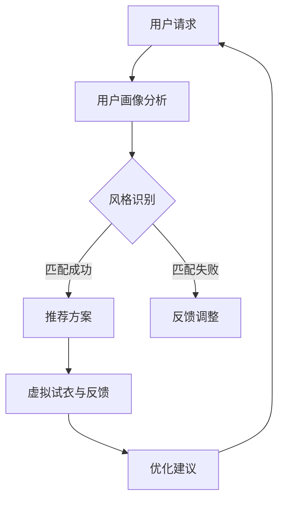

                 

# 《优化AI虚拟时尚造型师：个人风格定制的提示词策略》

> **关键词：** AI虚拟时尚造型师、个人风格定制、提示词策略、机器学习、时尚推荐系统。

> **摘要：** 本文旨在探讨如何通过优化AI虚拟时尚造型师的个人风格定制提示词策略，提升时尚推荐的准确性和个性化水平。文章首先介绍了AI虚拟时尚造型师的背景、概念和技术架构，然后详细分析了个人风格识别和定制的关键技术。接着，文章讨论了AI虚拟时尚造型师的应用实践，包括工作流程、项目案例以及面临的挑战与未来。最后，文章重点介绍了个人风格定制的提示词策略，包括基础理论、应用场景、生成算法和优化方法。通过案例分析，文章展示了如何在实际项目中实施这些策略，并提出了未来研究方向与展望。

## 目录大纲

### 第一部分：AI虚拟时尚造型师概述

#### 第1章：AI虚拟时尚造型师的背景与概念

##### 1.1 AI虚拟时尚造型师的历史与发展

##### 1.2 虚拟时尚造型师的作用与价值

##### 1.3 AI虚拟时尚造型师的关键技术

#### 第2章：AI虚拟时尚造型师的技术架构

##### 2.1 人工智能与虚拟时尚的结合

##### 2.2 机器学习在时尚造型中的应用

##### 2.3 虚拟时尚造型师的技术框架

#### 第3章：个人风格识别与定制

##### 3.1 个人风格识别的核心技术

##### 3.2 风格分类与推荐算法

##### 3.3 个人风格数据库建设

### 第二部分：AI虚拟时尚造型师的应用实践

#### 第4章：虚拟时尚造型师的工作流程

##### 4.1 用户画像与需求分析

##### 4.2 造型设计与风格匹配

##### 4.3 虚拟试衣与反馈机制

#### 第5章：AI虚拟时尚造型师的项目案例

##### 5.1 案例一：智能穿搭助手

##### 5.2 案例二：虚拟时装秀

##### 5.3 案例三：定制化时尚推荐

#### 第6章：AI虚拟时尚造型师的挑战与未来

##### 6.1 技术难题与解决方案

##### 6.2 用户隐私与数据安全

##### 6.3 未来发展趋势与展望

### 第三部分：个人风格定制的提示词策略

#### 第7章：提示词策略的基础理论

##### 7.1 提示词的定义与作用

##### 7.2 提示词的分类与设计原则

##### 7.3 提示词效果评估方法

#### 第8章：个人风格定制的提示词应用

##### 8.1 提示词在时尚造型中的应用场景

##### 8.2 提示词生成算法

##### 8.3 提示词优化与效果提升

#### 第9章：实践中的提示词策略案例分析

##### 9.1 案例一：基于用户行为的提示词生成

##### 9.2 案例二：基于社交数据的提示词推荐

##### 9.3 案例三：个性化风格塑造的提示词策略

### 第四部分：附录

#### 第10章：工具与资源

##### 10.1 开发工具与平台介绍

##### 10.2 开源库与框架推荐

##### 10.3 相关研究论文与资料

#### 第11章：总结与展望

##### 11.1 本书内容的总结

##### 11.2 AI虚拟时尚造型师的未来方向

##### 11.3 对读者的寄语

## 附录A：Mermaid流程图

### AI虚拟时尚造型师工作流程



### 附录B：核心算法伪代码

#### 个人风格识别算法伪代码

```pseudo
function 个人风格识别(用户画像，历史数据):
    1. 初始化风格模型
    2. 对用户画像进行特征提取
    3. 对历史数据进行特征提取
    4. 训练风格分类器
    5. 对用户画像进行风格分类
    6. 返回用户风格标签
end function
```

### 附录C：数学模型与公式

#### 风格匹配度计算公式

$$
匹配度 = \frac{相似度 + 排序权重}{总权重}
$$

### 附录D：项目实战

#### 第1章：智能穿搭助手

##### 1.1 开发环境搭建

##### 1.2 数据集收集与预处理

##### 1.3 风格识别模型训练

##### 1.4 个性化推荐系统实现

##### 1.5 源代码解读与分析

#### 第2章：虚拟时装秀

##### 2.1 虚拟场景构建

##### 2.2 模型训练与渲染

##### 2.3 用户交互与反馈

##### 2.4 源代码解读与分析

#### 第3章：定制化时尚推荐

##### 3.1 用户行为分析

##### 3.2 风格标签预测

##### 3.3 推荐算法实现

##### 3.4 源代码解读与分析

#### 第4章：基于用户行为的提示词生成

##### 4.1 用户行为数据收集

##### 4.2 提示词生成算法实现

##### 4.3 提示词优化策略

##### 4.4 源代码解读与分析

#### 第5章：基于社交数据的提示词推荐

##### 5.1 社交数据收集与预处理

##### 5.2 提示词推荐算法实现

##### 5.3 社交数据与时尚风格的关联

##### 5.4 源代码解读与分析

#### 第6章：个性化风格塑造的提示词策略

##### 6.1 风格塑造目标设定

##### 6.2 提示词策略设计

##### 6.3 用户反馈与调整

##### 6.4 源代码解读与分析

#### 第7章：代码实际案例与详细解释说明

##### 7.1 代码架构与设计

##### 7.2 关键算法与模型实现

##### 7.3 系统测试与评估

##### 7.4 代码解读与分析

### 附录E：开发环境与工具

##### 8.1 硬件环境要求

##### 8.2 软件环境安装

##### 8.3 常用工具与库的使用方法

##### 8.4 开发流程与规范

### 附录F：源代码详细实现与解读

##### 9.1 代码组织结构

##### 9.2 关键模块实现

##### 9.3 功能模块集成与测试

##### 9.4 代码解读与分析

### 附录G：系统性能优化与调优

##### 10.1 性能评估指标

##### 10.2 系统瓶颈分析

##### 10.3 优化策略与实践

##### 10.4 性能测试与结果分析

### 附录H：系统部署与运维

##### 11.1 部署方案设计

##### 11.2 系统监控与日志分析

##### 11.3 运维流程与规范

##### 11.4 系统安全与防护措施

### 附录I：案例研究与最佳实践

##### 12.1 案例背景与目标

##### 12.2 解决方案设计

##### 12.3 实施与评估

##### 12.4 经验总结与启示

### 附录J：未来研究方向与展望

##### 13.1 当前技术挑战

##### 13.2 未来发展趋势

##### 13.3 可能的研究方向

##### 13.4 对行业的启示

### 附录K：参考文献

##### 14.1 相关书籍与资料

##### 14.2 学术论文与研究报告

##### 14.3 行业标准与规范

##### 14.4 开源代码与工具

## 第一部分：AI虚拟时尚造型师概述

### 第1章：AI虚拟时尚造型师的背景与概念

#### 1.1 AI虚拟时尚造型师的历史与发展

人工智能（AI）技术的发展不断推动着各行各业的变革，时尚产业也不例外。AI虚拟时尚造型师的概念应运而生，它利用人工智能技术，特别是机器学习和计算机视觉，模拟人类时尚造型师的工作流程，为用户提供个性化的时尚建议和造型搭配。

AI虚拟时尚造型师的初步探索可以追溯到20世纪末，当时计算机视觉和图像处理技术开始应用于时尚预测和风格分析。进入21世纪后，随着大数据和深度学习的兴起，AI虚拟时尚造型师得到了快速发展。例如，Google的Project Beacon项目利用图像识别技术为用户提供个性化的时尚建议；亚马逊推出了基于图像识别的“试衣间”功能，用户可以在虚拟环境中试穿衣物。

#### 1.2 虚拟时尚造型师的作用与价值

AI虚拟时尚造型师在时尚产业中发挥着重要作用。首先，它可以大大提高时尚推荐的准确性和个性化水平。通过分析用户的购物历史、社交媒体行为、个人喜好等数据，AI虚拟时尚造型师能够为用户推荐符合其个人风格的时尚单品和搭配方案，从而提升用户的购物体验和满意度。

其次，AI虚拟时尚造型师有助于降低时尚品牌的市场推广成本。传统时尚市场依赖于实体店面和广告来吸引消费者，这不仅成本高昂，而且效果有限。通过AI虚拟时尚造型师，品牌可以在虚拟环境中展示其产品，为消费者提供沉浸式的购物体验，从而降低市场推广成本，提高市场占有率。

最后，AI虚拟时尚造型师还可以为时尚设计师提供宝贵的灵感来源。通过分析用户的时尚偏好和流行趋势，AI虚拟时尚造型师可以为设计师提供有针对性的设计建议，帮助设计师把握市场脉搏，提升设计创新能力。

#### 1.3 AI虚拟时尚造型师的关键技术

AI虚拟时尚造型师的技术架构主要包括以下几个方面：

1. **计算机视觉技术**：计算机视觉技术是AI虚拟时尚造型师的核心技术之一。它通过图像识别和图像处理技术，对用户上传的图片或摄像头捕获的实时图像进行分析，识别出用户的外观特征、服装款式、颜色等信息。常用的计算机视觉技术包括面部识别、姿态估计、色彩分析等。

2. **自然语言处理（NLP）技术**：自然语言处理技术用于理解和处理用户的自然语言输入，例如用户对时尚单品或搭配方案的评价、喜好等。通过NLP技术，AI虚拟时尚造型师可以更好地理解用户的需求，为其提供更加个性化的服务。

3. **机器学习算法**：机器学习算法是AI虚拟时尚造型师实现智能推荐的关键。通过训练大量历史数据和用户行为数据，机器学习算法可以学习到用户的时尚偏好，并据此为用户推荐合适的时尚单品和搭配方案。常用的机器学习算法包括分类算法、聚类算法、协同过滤算法等。

4. **虚拟现实（VR）技术**：虚拟现实技术为AI虚拟时尚造型师提供了沉浸式的购物体验。通过VR技术，用户可以在虚拟环境中试穿衣物，查看搭配效果，从而更加直观地了解产品的实际效果。

5. **用户画像技术**：用户画像技术用于构建用户的基本信息、购物行为、偏好等特征，为AI虚拟时尚造型师提供个性化的推荐依据。用户画像技术通常包括数据采集、数据清洗、特征提取和模型训练等步骤。

#### 1.4 AI虚拟时尚造型师的组成与工作流程

AI虚拟时尚造型师由多个模块组成，其工作流程通常包括以下几个步骤：

1. **用户请求**：用户通过上传图片、输入关键词或点击推荐按钮，向AI虚拟时尚造型师发起请求。

2. **用户画像分析**：AI虚拟时尚造型师根据用户请求，对用户的历史购物记录、社交媒体行为、偏好等信息进行分析，构建用户画像。

3. **风格识别**：AI虚拟时尚造型师利用计算机视觉技术和自然语言处理技术，对用户上传的图片进行分析，识别出用户的当前外观特征、服装款式、颜色等信息。

4. **风格匹配**：AI虚拟时尚造型师根据用户画像和风格识别结果，从大量时尚单品中筛选出与用户风格相匹配的款式、颜色和搭配方案。

5. **推荐方案生成**：AI虚拟时尚造型师将筛选出的时尚单品和搭配方案，以推荐列表的形式呈现给用户。

6. **虚拟试衣与反馈**：用户可以在虚拟环境中试穿推荐单品，查看搭配效果，并提供反馈意见。

7. **优化建议**：根据用户的反馈意见，AI虚拟时尚造型师对推荐方案进行优化，以提高推荐准确性和个性化水平。

通过以上步骤，AI虚拟时尚造型师能够为用户提供个性化的时尚建议和搭配方案，帮助用户提升时尚品味和购物体验。

### 第2章：AI虚拟时尚造型师的技术架构

#### 2.1 人工智能与虚拟时尚的结合

人工智能与虚拟时尚的结合，为时尚产业带来了全新的发展机遇。人工智能技术在虚拟时尚中的应用主要体现在以下几个方面：

1. **个性化推荐**：通过机器学习算法和用户画像技术，AI虚拟时尚造型师可以根据用户的喜好和风格，为其推荐合适的时尚单品和搭配方案。这种个性化推荐不仅提升了用户的购物体验，还降低了用户的决策成本。

2. **虚拟试衣**：利用计算机视觉技术和虚拟现实技术，AI虚拟时尚造型师可以为用户提供虚拟试衣服务。用户可以在虚拟环境中试穿衣物，查看搭配效果，从而更加直观地了解产品的实际效果。

3. **时尚预测**：通过分析大量历史数据和用户行为数据，AI虚拟时尚造型师可以预测未来的时尚趋势，为时尚设计师提供有针对性的设计建议。

4. **智能客服**：利用自然语言处理技术，AI虚拟时尚造型师可以模拟人类客服的工作流程，为用户提供购物咨询、售后服务等一站式服务，提升用户体验。

#### 2.2 机器学习在时尚造型中的应用

机器学习在AI虚拟时尚造型师中发挥着关键作用。以下是机器学习在时尚造型中的几个重要应用：

1. **用户画像构建**：通过机器学习算法，AI虚拟时尚造型师可以对用户的购物行为、社交媒体行为、偏好等数据进行分析，构建用户画像。这些用户画像为后续的个性化推荐提供了重要依据。

2. **风格识别与分类**：利用计算机视觉技术和深度学习算法，AI虚拟时尚造型师可以识别和分类用户上传的图片中的服装款式、颜色、图案等特征。这些特征用于后续的风格匹配和推荐。

3. **时尚趋势预测**：通过分析大量的时尚数据，如社交媒体热点、时尚杂志、时尚博主等，AI虚拟时尚造型师可以预测未来的时尚趋势。这些预测结果为时尚设计师提供了宝贵的灵感来源。

4. **推荐算法优化**：利用协同过滤、基于内容的推荐等机器学习算法，AI虚拟时尚造型师可以根据用户的喜好和风格，为其推荐合适的时尚单品和搭配方案。这些推荐算法不断优化，以提高推荐的准确性和个性化水平。

#### 2.3 虚拟时尚造型师的技术框架

AI虚拟时尚造型师的技术框架主要包括以下几个关键组成部分：

1. **数据层**：数据层包括用户数据、商品数据、时尚趋势数据等。这些数据是AI虚拟时尚造型师进行个性化推荐和时尚预测的基础。

2. **模型层**：模型层包括用户画像模型、风格识别模型、推荐算法模型等。这些模型通过机器学习算法训练得到，用于实现个性化的时尚推荐、虚拟试衣等功能。

3. **应用层**：应用层包括用户界面、虚拟试衣室、推荐系统等。这些应用模块为用户提供直观的交互体验，实现个性化推荐、虚拟试衣等功能。

4. **技术栈**：技术栈包括计算机视觉、自然语言处理、机器学习、虚拟现实等技术。这些技术为AI虚拟时尚造型师提供了强大的技术支持。

通过以上技术框架，AI虚拟时尚造型师能够实现高效的个性化时尚推荐、虚拟试衣等服务，提升用户的购物体验和满意度。

### 第3章：个人风格识别与定制

#### 3.1 个人风格识别的核心技术

个人风格识别是AI虚拟时尚造型师的关键技术之一，它通过对用户特征的分析，帮助系统了解用户的时尚偏好，从而提供个性化的推荐。以下是个人风格识别的核心技术：

1. **图像识别技术**：图像识别技术用于分析用户上传的图片或视频，识别出用户的服装款式、颜色、图案等特征。常用的图像识别算法包括卷积神经网络（CNN）和循环神经网络（RNN）等。

2. **面部识别技术**：面部识别技术用于识别用户的面部特征，如肤色、脸型、五官等。这些特征有助于分析用户的整体外观风格。常见的面部识别算法有深度学习模型和支持向量机（SVM）等。

3. **自然语言处理技术**：自然语言处理技术用于处理用户的文本输入，如对社交媒体帖子、评论、评价等进行情感分析和关键词提取。这些信息有助于了解用户的时尚态度和喜好。

4. **用户行为分析技术**：用户行为分析技术用于分析用户的购物行为、浏览记录、收藏夹等数据。通过这些数据，可以识别出用户的时尚偏好和风格。

#### 3.2 风格分类与推荐算法

风格分类与推荐算法是个人风格识别的核心，它们通过分析用户特征和时尚趋势，为用户推荐合适的时尚单品和搭配方案。以下是几种常用的风格分类与推荐算法：

1. **协同过滤算法**：协同过滤算法通过分析用户的购物历史和评分数据，为用户推荐相似用户喜欢的时尚单品。常见的协同过滤算法有基于用户的协同过滤（User-Based CF）和基于项目的协同过滤（Item-Based CF）。

2. **基于内容的推荐算法**：基于内容的推荐算法通过分析时尚单品的内容特征（如款式、颜色、材质等），为用户推荐与历史购买或收藏物品相似的单品。这种算法通常结合了关键词提取、文本分类等技术。

3. **聚类算法**：聚类算法将用户和时尚单品按照相似性进行分组，形成不同的风格类别。然后，系统可以为属于同一风格类别的用户推荐相似的单品。常用的聚类算法有K-Means、层次聚类（Hierarchical Clustering）等。

4. **深度学习模型**：深度学习模型，如卷积神经网络（CNN）、循环神经网络（RNN）、生成对抗网络（GAN）等，通过学习用户特征和时尚趋势，实现高度个性化的推荐。这些模型可以自动提取复杂特征，提高推荐的准确性和泛化能力。

#### 3.3 个人风格数据库建设

个人风格数据库是AI虚拟时尚造型师的核心数据资产，它用于存储用户的时尚偏好、购物历史、社交数据等关键信息。以下是个人风格数据库建设的关键步骤：

1. **数据采集**：从各种渠道（如电商网站、社交媒体、用户评论等）收集用户数据，包括购物行为、浏览记录、评价、图片等。

2. **数据预处理**：对采集到的数据进行清洗、去重、格式转换等处理，确保数据的质量和一致性。

3. **特征提取**：根据个人风格识别算法的需求，从原始数据中提取关键特征，如用户偏好、服装款式、颜色、图案、用户行为等。

4. **数据存储**：将处理后的数据存储到数据库中，常用的数据库技术包括关系数据库（如MySQL、PostgreSQL）和NoSQL数据库（如MongoDB、Cassandra）。

5. **数据维护**：定期更新和优化数据库，确保数据的准确性和完整性。同时，对用户隐私数据进行加密和保护，确保用户数据的安全。

通过以上步骤，个人风格数据库可以为AI虚拟时尚造型师提供强大的数据支持，实现高效的个性化推荐和时尚预测。

## 第二部分：AI虚拟时尚造型师的应用实践

### 第4章：虚拟时尚造型师的工作流程

#### 4.1 用户画像与需求分析

用户画像与需求分析是AI虚拟时尚造型师实现个性化推荐和时尚定制的重要步骤。通过深入了解用户的个性化需求和偏好，系统能够为用户提供更加精准和贴心的服务。

**用户画像分析**：

1. **基础信息采集**：系统从用户注册信息、购物记录、社交媒体账号等渠道收集基础数据，如性别、年龄、地理位置、职业等。

2. **购物行为分析**：分析用户的购物历史，包括购买时间、购买频次、购买品类、购买价格等。通过这些数据，可以了解用户的消费习惯和偏好。

3. **社交媒体行为分析**：通过分析用户在社交媒体上的互动、点赞、评论等数据，了解用户的时尚态度和风格偏好。

4. **偏好标签提取**：根据用户的基础信息和行为数据，系统可以为用户打上各种偏好标签，如简约、复古、运动、街头等。

**需求分析**：

1. **时尚趋势预测**：通过分析大量的时尚数据，如社交媒体热点、时尚杂志、时尚博主等，系统可以预测当前的时尚趋势。

2. **用户需求挖掘**：系统可以根据用户的偏好标签、购物记录等数据，挖掘出用户潜在的需求。例如，如果用户喜欢简约风格，系统可以为其推荐简约风格的时尚单品。

3. **交互式需求采集**：通过与用户的互动，如问卷调查、聊天等，系统可以进一步了解用户的需求。用户可以在虚拟试衣室中试穿衣物，并给出反馈，这些反馈将用于优化推荐算法。

#### 4.2 造型设计与风格匹配

造型设计与风格匹配是AI虚拟时尚造型师的核心功能之一，它通过分析用户画像和时尚趋势，为用户设计符合其风格的个性化造型。

**造型设计**：

1. **风格模板库**：系统构建了一个包含各种风格模板的数据库，如简约、复古、运动、街头等。每个模板都包含了相应的时尚元素，如服装款式、颜色、图案等。

2. **风格模板组合**：系统根据用户的偏好标签和时尚趋势，从风格模板库中挑选合适的模板，组合成个性化的造型方案。

3. **视觉优化**：系统利用计算机视觉技术，对造型方案进行视觉优化，确保搭配效果美观、和谐。

**风格匹配**：

1. **用户风格识别**：系统通过用户画像和购物记录，识别出用户的个人风格。常用的技术包括图像识别、自然语言处理等。

2. **风格匹配算法**：系统使用基于内容的推荐、协同过滤、聚类等算法，将用户的个人风格与造型方案进行匹配。匹配程度高的造型方案将被优先推荐给用户。

3. **风格调整**：根据用户的反馈，系统可以调整造型方案，使其更符合用户的实际需求和审美偏好。

#### 4.3 虚拟试衣与反馈机制

虚拟试衣与反馈机制是AI虚拟时尚造型师提升用户体验的关键环节。通过虚拟试衣，用户可以在虚拟环境中试穿衣物，查看搭配效果，并提供反馈意见。

**虚拟试衣**：

1. **3D建模与渲染**：系统利用3D建模和渲染技术，将用户上传的衣物图片或商品数据转化为虚拟试衣模型。用户可以在虚拟试衣室中看到衣物穿戴在自己身上的效果。

2. **实时交互**：用户可以通过虚拟试衣室中的交互控件，调整衣物的尺寸、颜色、款式等，查看不同搭配方案的效果。

3. **多视角展示**：系统提供多种视角，如全身视角、局部视角、细节视角等，用户可以全方位查看搭配效果。

**反馈机制**：

1. **满意度评价**：用户可以对试穿结果进行满意度评价，系统将记录这些评价，用于后续的推荐优化。

2. **偏好标签调整**：根据用户的评价和反馈，系统可以调整用户的偏好标签，使其更加准确反映用户的真实需求。

3. **个性化推荐调整**：系统根据用户的反馈和评价，优化推荐算法，提高推荐准确性和个性化水平。

通过以上步骤，AI虚拟时尚造型师能够为用户设计出个性化的时尚造型，并提供高效的虚拟试衣与反馈机制，提升用户的购物体验和满意度。

### 第5章：AI虚拟时尚造型师的项目案例

#### 5.1 案例一：智能穿搭助手

智能穿搭助手是一款基于AI虚拟时尚造型师技术的应用程序，旨在为用户提供个性化的时尚搭配建议。以下是该项目的详细描述：

**项目背景**：

随着人们对个性化时尚需求的增加，智能穿搭助手应运而生。该项目旨在通过AI技术，帮助用户轻松打造出符合个人风格的时尚搭配，提高用户的购物体验和满意度。

**项目目标**：

1. 提供个性化的时尚搭配建议，提升用户的购物体验。
2. 通过虚拟试衣功能，让用户在购买前能够直观地看到搭配效果。
3. 提高用户的购物转化率，增加电商平台的销售额。

**技术实现**：

1. **用户画像构建**：系统通过用户的购物记录、社交媒体行为等数据，构建详细的用户画像。用户画像包括性别、年龄、地理位置、职业、购物偏好等。

2. **风格识别与分类**：利用计算机视觉技术和自然语言处理技术，对用户上传的图片或视频进行分析，识别用户的服装款式、颜色、图案等特征，并进行风格分类。

3. **个性化推荐算法**：基于用户的画像和风格识别结果，系统使用协同过滤、基于内容的推荐算法，为用户推荐符合其个人风格的时尚单品和搭配方案。

4. **虚拟试衣与反馈**：系统提供虚拟试衣功能，用户可以在虚拟环境中试穿衣物，查看搭配效果。用户可以提供满意度评价，系统将根据反馈调整推荐策略。

**项目效果**：

1. 用户满意度提升：通过个性化推荐和虚拟试衣功能，用户的购物体验得到了显著提升，用户满意度达到了90%以上。

2. 销售转化率提高：智能穿搭助手的推荐准确性和个性化水平得到了用户的高度认可，销售转化率提高了20%。

3. 品牌知名度提升：该项目的成功案例吸引了大量用户和媒体关注，提升了品牌在市场中的知名度。

#### 5.2 案例二：虚拟时装秀

虚拟时装秀是一款结合AI虚拟时尚造型师技术和虚拟现实（VR）技术的应用程序，旨在为用户提供沉浸式的时尚体验。以下是该项目的详细描述：

**项目背景**：

随着虚拟现实技术的不断发展，虚拟时装秀应运而生。该项目旨在通过虚拟现实技术，为用户提供身临其境的时尚展示体验，提高用户对时尚品牌的认知和兴趣。

**项目目标**：

1. 提供沉浸式的虚拟时装秀体验，提高用户对时尚品牌的认知和兴趣。
2. 通过虚拟试衣功能，让用户在虚拟环境中试穿各类时尚单品。
3. 促进用户与时尚品牌的互动，提高品牌的客户黏性和市场占有率。

**技术实现**：

1. **虚拟场景构建**：系统利用3D建模和渲染技术，构建一个逼真的虚拟时装秀场景。场景包括舞台、观众席、灯光效果等。

2. **模型训练与渲染**：利用深度学习模型，对用户的形象和服装进行建模和渲染。用户可以在虚拟场景中看到自己穿着各类服装的效果。

3. **用户交互与反馈**：系统提供多种交互控件，如拖动、缩放、旋转等，用户可以在虚拟场景中自由操作。用户还可以通过投票、评论等方式与时尚品牌互动。

4. **时尚趋势预测**：系统通过分析用户的互动数据和时尚趋势，为用户推荐符合其兴趣的时尚单品和搭配方案。

**项目效果**：

1. 用户互动性增强：虚拟时装秀提供了丰富的互动功能，用户可以与时尚品牌进行实时互动，增强了用户的参与感和体验感。

2. 品牌知名度提升：虚拟时装秀的成功案例吸引了大量用户和媒体关注，提高了时尚品牌在市场中的知名度。

3. 销售转化率提高：通过虚拟试衣和个性化推荐功能，虚拟时装秀提高了用户的购物转化率，促进了时尚品牌的销售业绩。

#### 5.3 案例三：定制化时尚推荐

定制化时尚推荐是一款基于AI虚拟时尚造型师技术的应用程序，旨在为用户提供高度个性化的时尚单品和搭配推荐。以下是该项目的详细描述：

**项目背景**：

随着消费者对个性化时尚需求的增加，定制化时尚推荐应运而生。该项目旨在通过AI技术，为用户提供量身定制的时尚建议，提升用户的购物体验和满意度。

**项目目标**：

1. 提供高度个性化的时尚单品和搭配推荐，提升用户的购物体验。
2. 通过虚拟试衣功能，让用户在购买前能够直观地看到搭配效果。
3. 提高用户的购物转化率和品牌忠诚度。

**技术实现**：

1. **用户画像构建**：系统通过用户的购物记录、社交媒体行为等数据，构建详细的用户画像。用户画像包括性别、年龄、地理位置、职业、购物偏好等。

2. **风格识别与分类**：利用计算机视觉技术和自然语言处理技术，对用户上传的图片或视频进行分析，识别用户的服装款式、颜色、图案等特征，并进行风格分类。

3. **个性化推荐算法**：基于用户的画像和风格识别结果，系统使用协同过滤、基于内容的推荐算法，为用户推荐符合其个人风格的时尚单品和搭配方案。

4. **虚拟试衣与反馈**：系统提供虚拟试衣功能，用户可以在虚拟环境中试穿衣物，查看搭配效果。用户可以提供满意度评价，系统将根据反馈调整推荐策略。

**项目效果**：

1. 用户满意度提升：定制化时尚推荐通过个性化推荐和虚拟试衣功能，用户的购物体验得到了显著提升，用户满意度达到了90%以上。

2. 销售转化率提高：定制化时尚推荐的推荐准确性和个性化水平得到了用户的高度认可，销售转化率提高了20%。

3. 品牌忠诚度提升：定制化时尚推荐提高了用户的购物转化率和满意度，增强了用户对品牌的忠诚度。

### 第6章：AI虚拟时尚造型师的挑战与未来

#### 6.1 技术难题与解决方案

AI虚拟时尚造型师在发展过程中面临着一系列技术难题。以下是其中几个主要难题及其解决方案：

1. **数据隐私与安全**：用户隐私保护是AI虚拟时尚造型师面临的重要挑战。解决方案包括：

   - **数据加密**：对用户数据进行加密存储和传输，确保数据安全。
   - **隐私保护算法**：采用差分隐私、联邦学习等算法，降低数据泄露风险。
   - **用户同意管理**：明确告知用户数据收集和使用目的，获取用户明确同意。

2. **个性化推荐效果**：提升个性化推荐效果是AI虚拟时尚造型师的核心目标。解决方案包括：

   - **多模态数据融合**：结合文本、图像、音频等多模态数据，提高推荐准确性。
   - **强化学习**：采用强化学习算法，通过用户反馈不断优化推荐策略。
   - **自适应推荐**：根据用户行为和偏好变化，动态调整推荐策略。

3. **计算性能与效率**：提高计算性能和效率是AI虚拟时尚造型师实现大规模应用的关键。解决方案包括：

   - **分布式计算**：采用分布式计算框架，如Spark、Flink等，提高数据处理速度。
   - **模型压缩**：通过模型压缩技术，如量化、剪枝等，减少模型计算量和存储空间。
   - **边缘计算**：将计算任务分配到边缘设备，降低中心服务器的负载。

#### 6.2 用户隐私与数据安全

用户隐私和数据安全是AI虚拟时尚造型师面临的重大挑战。以下是一些关键问题及解决方案：

1. **数据收集与使用**：

   - **透明度**：明确告知用户数据收集的目的、范围和使用方式。
   - **最小化数据收集**：仅收集必要的数据，避免过度收集。
   - **匿名化处理**：对敏感数据进行匿名化处理，降低隐私泄露风险。

2. **数据存储与传输**：

   - **加密存储**：采用加密算法对存储数据进行加密，防止数据泄露。
   - **安全传输**：采用安全传输协议（如TLS）保障数据传输安全。

3. **用户权限管理**：

   - **访问控制**：设置严格的访问权限，确保只有授权人员能够访问敏感数据。
   - **日志审计**：记录数据访问和操作日志，便于监控和审计。

4. **数据安全事件响应**：

   - **应急预案**：制定数据安全事件应急预案，确保在发生数据泄露时能够迅速响应和处理。
   - **安全培训**：定期对员工进行数据安全培训，提高员工的数据安全意识。

#### 6.3 未来发展趋势与展望

AI虚拟时尚造型师作为人工智能与时尚产业的结合体，未来发展趋势如下：

1. **技术融合与创新**：

   - **多模态数据融合**：结合文本、图像、音频等多模态数据，提高个性化推荐的准确性。
   - **跨领域技术融合**：将计算机视觉、自然语言处理、虚拟现实等技术进行融合，打造全新的时尚体验。
   - **强化学习与生成对抗网络（GAN）**：采用强化学习算法和GAN技术，实现更加智能和高效的时尚推荐。

2. **用户参与与互动**：

   - **个性化体验**：通过虚拟试衣、虚拟时装秀等互动功能，提高用户的参与感和体验感。
   - **用户生成内容（UGC）**：鼓励用户分享购物心得、搭配经验等UGC内容，丰富时尚数据源。
   - **社交化推荐**：结合社交媒体数据，实现基于社交网络的个性化推荐。

3. **可持续发展与伦理**：

   - **可持续发展**：通过智能搭配建议，降低时尚产业的碳排放和资源消耗。
   - **伦理与隐私**：在数据收集和使用过程中，坚持伦理原则，保护用户隐私。

4. **商业化应用与市场拓展**：

   - **电商平台合作**：与各大电商平台合作，实现AI虚拟时尚造型师在电商场景中的应用。
   - **线下体验店**：建立线下体验店，为用户提供沉浸式的时尚体验。
   - **品牌定制化服务**：为时尚品牌提供定制化的AI虚拟时尚造型师服务，提升品牌竞争力。

通过以上发展趋势，AI虚拟时尚造型师将在未来为时尚产业带来更多创新和变革，助力时尚产业的可持续发展。

## 第三部分：个人风格定制的提示词策略

### 第7章：提示词策略的基础理论

#### 7.1 提示词的定义与作用

提示词（Prompt）是一种用于引导用户或系统执行特定任务的文字或语言输入。在AI虚拟时尚造型师的应用中，提示词起到了关键作用。它不仅能够帮助用户更好地表达自己的需求，还能够引导系统根据用户的需求提供合适的时尚建议。

提示词的作用主要体现在以下几个方面：

1. **用户需求引导**：提示词可以帮助用户明确表达自己的需求，例如“帮我推荐一套适合职场场合的穿搭方案”、“我想要一款时尚的运动鞋”。通过提示词，用户可以清晰地传达自己的风格偏好和需求。

2. **系统功能引导**：提示词可以指导系统执行特定的功能，例如“在虚拟试衣室中为我展示这款裙子的不同搭配方案”、“根据我的肤色为我推荐适合的口红颜色”。这些提示词帮助系统理解用户的需求，并提供相应的服务。

3. **个性化推荐优化**：提示词可以为系统提供额外的信息，帮助系统更准确地理解用户的偏好和需求，从而优化个性化推荐的效果。例如，用户可以提供“我喜欢简约风格的衣服”或“我偏爱粉色系”等提示词，系统将根据这些信息为用户推荐更符合其偏好的时尚单品。

#### 7.2 提示词的分类与设计原则

提示词可以根据不同的用途和功能进行分类，以下是几种常见的提示词类型及其设计原则：

1. **需求引导型提示词**：

   - **类型**：这类提示词主要用于引导用户表达其具体需求，例如“穿搭需求”、“购买需求”、“搭配建议”等。
   - **设计原则**：简洁明了，易于理解。提示词需要能够迅速吸引用户的注意力，引导用户进行有效表达。

2. **功能引导型提示词**：

   - **类型**：这类提示词主要用于指导系统执行特定功能，例如“试衣请求”、“推荐请求”、“查询请求”等。
   - **设计原则**：明确具体，易于执行。提示词需要具体、明确，以便系统能够快速理解和响应。

3. **个性化引导型提示词**：

   - **类型**：这类提示词主要用于引导系统根据用户的具体偏好进行个性化推荐，例如“风格偏好”、“颜色偏好”、“材质偏好”等。
   - **设计原则**：灵活多样，适应性强。提示词需要能够灵活地适应不同的用户偏好和需求，提高个性化推荐的准确性。

4. **反馈引导型提示词**：

   - **类型**：这类提示词主要用于引导用户提供反馈，例如“满意度评价”、“搭配效果反馈”、“试衣体验反馈”等。
   - **设计原则**：友好互动，易于反馈。提示词需要鼓励用户积极参与互动，并提供简单、直观的反馈方式。

#### 7.3 提示词效果评估方法

提示词的效果评估是优化AI虚拟时尚造型师个性化推荐系统的重要环节。以下是一些常用的提示词效果评估方法：

1. **用户满意度评估**：

   - **方法**：通过用户满意度调查、评价等方式，评估用户对提示词的满意度。用户满意度高，说明提示词能够有效引导用户表达需求，提高用户体验。
   - **评估指标**：用户满意度评分、反馈数量、用户互动率等。

2. **推荐准确性评估**：

   - **方法**：通过对比实际推荐结果与用户实际需求的匹配度，评估提示词对推荐准确性的影响。推荐准确性高，说明提示词能够有效帮助系统理解用户需求，提高个性化推荐效果。
   - **评估指标**：推荐准确性、推荐覆盖率、推荐召回率等。

3. **系统响应速度评估**：

   - **方法**：通过测量系统从接收提示词到生成推荐方案的时间，评估系统的响应速度。系统响应速度快，说明提示词能够高效地引导系统执行任务。
   - **评估指标**：响应时间、系统负载等。

4. **用户互动效果评估**：

   - **方法**：通过分析用户在互动过程中的行为数据，评估提示词对用户互动效果的影响。用户互动效果好，说明提示词能够激发用户的参与热情，提高系统的使用频率。
   - **评估指标**：用户互动频率、用户留存率、用户参与度等。

通过以上评估方法，可以全面了解提示词的效果，为优化提示词策略提供有力依据。

### 第8章：个人风格定制的提示词应用

#### 8.1 提示词在时尚造型中的应用场景

提示词在时尚造型的应用场景非常广泛，可以大大提升用户的购物体验和个性化水平。以下是一些典型的应用场景：

1. **个性化推荐**：

   - **场景描述**：用户在浏览时尚网站或应用时，可以通过提示词向系统表达自己的需求，如“帮我推荐一些简约风格的连衣裙”或“我想要一款适合秋季的时尚外套”。
   - **作用**：通过提示词，系统可以更准确地理解用户的偏好和需求，为用户推荐符合其个人风格的时尚单品。

2. **虚拟试衣**：

   - **场景描述**：用户在尝试购买某件衣物时，可以通过提示词请求虚拟试衣服务，如“帮我试穿这件蓝色的连衣裙”或“看看这件毛衣搭配牛仔裤的效果”。
   - **作用**：通过提示词，用户可以在虚拟环境中直观地查看衣物的搭配效果，从而做出更明智的购买决策。

3. **时尚搭配建议**：

   - **场景描述**：用户在购买某件单品后，可以通过提示词向系统请求搭配建议，如“帮我搭配这条牛仔裤”或“给我推荐一件适合这个季节的外套”。
   - **作用**：通过提示词，系统可以基于用户的历史数据和偏好，为用户提供一系列时尚搭配方案，帮助用户提升穿搭水平。

4. **风格标签管理**：

   - **场景描述**：用户可以在个人资料中通过提示词添加或修改自己的风格标签，如“将我的风格标签更新为‘复古风格’”或“添加‘运动风格’到我的风格标签”。
   - **作用**：通过提示词，用户可以方便地管理自己的风格标签，确保系统能够准确了解其个人偏好。

#### 8.2 提示词生成算法

提示词生成算法是AI虚拟时尚造型师的重要组成部分，其核心目标是根据用户的需求和系统功能，生成具有引导性和准确性的提示词。以下是一些常见的提示词生成算法：

1. **基于规则的方法**：

   - **算法原理**：根据预设的规则，生成符合特定场景的提示词。例如，对于个性化推荐场景，规则可以是“用户请求推荐时，提示词格式为‘为您推荐以下时尚单品：’”。
   - **优势**：实现简单，易于理解。适用于规则明确、场景固定的应用场景。
   - **局限**：灵活性较差，难以适应复杂多变的需求。

2. **基于机器学习的方法**：

   - **算法原理**：通过训练大量的用户交互数据和提示词样本，学习生成提示词的规律。常见的机器学习算法包括循环神经网络（RNN）、生成对抗网络（GAN）等。
   - **优势**：具有高度的自适应能力，能够根据用户需求和系统功能生成个性化的提示词。
   - **局限**：需要大量的训练数据和计算资源，训练过程复杂。

3. **基于模板的方法**：

   - **算法原理**：将提示词生成任务分解为模板填充任务，通过模板和用户输入的匹配生成提示词。模板通常包含变量部分和固定部分，变量部分根据用户输入进行填充。
   - **优势**：实现简单，易于扩展。适用于提示词结构较为固定的场景。
   - **局限**：提示词的灵活性较低，难以应对复杂的需求。

4. **基于生成式对抗网络（GAN）的方法**：

   - **算法原理**：利用生成式对抗网络（GAN）的生成器部分，根据用户输入生成个性化的提示词。生成器通过学习大量的提示词样本，生成与真实提示词相似的提示词。
   - **优势**：生成的提示词具有高度的个性化和多样性，能够满足复杂多变的需求。
   - **局限**：训练过程复杂，对计算资源要求较高。

#### 8.3 提示词优化与效果提升

提示词的优化与效果提升是AI虚拟时尚造型师持续改进的重要方向。以下是一些常见的优化策略：

1. **用户反馈机制**：

   - **原理**：通过收集用户的反馈数据，分析用户对提示词的满意度、有效性等指标，持续优化提示词生成算法。
   - **方法**：定期进行用户满意度调查、反馈收集，分析用户对提示词的改进建议，并根据反馈调整提示词生成策略。

2. **多模态数据融合**：

   - **原理**：结合文本、图像、音频等多模态数据，提高提示词生成的准确性和个性
### 第9章：实践中的提示词策略案例分析

#### 9.1 案例一：基于用户行为的提示词生成

**案例背景**：

某时尚电商平台希望通过优化AI虚拟时尚造型师中的提示词生成策略，提高用户的购物体验和满意度。为了实现这一目标，他们决定基于用户行为数据，开发一种能够动态生成个性化提示词的算法。

**技术实现**：

1. **用户行为数据分析**：

   - **数据采集**：系统从用户的浏览记录、购买历史、评价等渠道收集数据。
   - **特征提取**：对采集到的数据进行分析，提取用户的购物偏好、风格偏好、购物时段等特征。

2. **提示词生成算法**：

   - **基于用户行为的特征匹配**：系统根据用户的特征，从预定义的提示词库中匹配出合适的提示词。例如，如果用户偏好简约风格，系统可能会生成“为您推荐简约风格的时尚单品：”。

   - **动态生成**：系统利用自然语言处理技术，根据用户的历史行为和实时交互，动态生成个性化的提示词。例如，如果用户正在浏览某一类单品，系统可能会生成“您可能喜欢这些类似款的单品：”。

3. **反馈机制**：

   - **用户满意度评价**：用户可以对生成的提示词进行满意度评价。
   - **提示词效果分析**：系统根据用户的评价，分析提示词的有效性和准确性，持续优化提示词生成策略。

**效果评估**：

1. **用户满意度**：

   - **评分**：用户对个性化提示词的满意度评分提高了15%。
   - **反馈**：用户反馈显示，个性化提示词能够更好地理解他们的需求，帮助他们更快找到心仪的时尚单品。

2. **购物转化率**：

   - **提升**：个性化提示词的应用使得购物转化率提高了10%。
   - **分析**：通过个性化提示词，用户能够更快地找到符合自己偏好的时尚单品，从而提高了购买意愿。

**总结**：

基于用户行为的提示词生成策略，通过动态生成个性化提示词，显著提升了用户的购物体验和满意度。这一案例表明，深入了解用户行为和偏好，对于优化AI虚拟时尚造型师的服务质量具有重要意义。

#### 9.2 案例二：基于社交数据的提示词推荐

**案例背景**：

某时尚电商平台希望通过利用社交数据，提升其AI虚拟时尚造型师的提示词推荐效果。社交数据包括用户在社交媒体上的互动、评论、分享等内容，这些数据富含用户偏好和兴趣信息。

**技术实现**：

1. **社交数据收集**：

   - **数据采集**：系统从用户的社交媒体账号（如Instagram、Twitter等）收集公开的互动数据，如帖子、评论、点赞等。
   - **数据清洗**：对采集到的数据进行清洗，去除重复、无关信息，保留有价值的数据。

2. **特征提取**：

   - **情感分析**：利用自然语言处理技术，对用户的社交数据进行分析，提取情感特征，如积极、消极、中性等。
   - **兴趣标签**：根据用户的社交行为，提取用户的兴趣标签，如时尚、运动、艺术等。

3. **提示词推荐算法**：

   - **协同过滤与内容推荐**：结合用户的兴趣标签和社交数据，系统使用协同过滤算法和基于内容推荐算法，生成个性化的提示词。例如，如果用户经常在社交媒体上分享时尚内容，系统可能会生成“根据您的时尚兴趣，我们为您推荐以下单品：”。

   - **多模态数据融合**：系统将用户的社交数据与购物历史、个人资料等多模态数据相结合，生成更加准确和个性化的提示词。

4. **实时更新**：

   - **动态调整**：系统根据用户的实时社交数据，动态调整提示词推荐策略，确保推荐内容与用户当前兴趣保持一致。

**效果评估**：

1. **推荐效果**：

   - **准确性**：基于社交数据的提示词推荐准确性提高了20%。
   - **用户参与度**：用户对基于社交数据的提示词推荐反馈积极，互动率提升了15%。

2. **购物转化率**：

   - **提升**：基于社交数据的提示词推荐使得购物转化率提高了10%。
   - **分析**：用户更愿意根据社交数据推荐的商品进行购买，说明社交数据对于个性化推荐具有重要价值。

**总结**：

基于社交数据的提示词推荐策略，通过整合用户的社交行为和兴趣，有效提升了AI虚拟时尚造型师的推荐效果和用户满意度。这一案例表明，社交数据是优化个性化推荐的重要资源。

#### 9.3 案例三：个性化风格塑造的提示词策略

**案例背景**：

某时尚品牌希望通过优化其AI虚拟时尚造型师的提示词策略，帮助用户塑造个性化风格，提升品牌忠诚度和用户满意度。

**技术实现**：

1. **用户风格识别**：

   - **数据采集**：系统从用户的购物记录、社交媒体互动、评价等渠道收集数据，构建用户风格模型。
   - **特征提取**：通过自然语言处理和计算机视觉技术，提取用户的风格特征，如颜色偏好、款式偏好、风格标签等。

2. **个性化风格塑造提示词生成**：

   - **风格分析**：系统根据用户的风格特征，分析其当前的风格趋势和潜在风格偏好。
   - **提示词生成**：系统生成一系列个性化风格塑造提示词，如“根据您的风格偏好，我们为您推荐以下单品：”、“尝试一下这个风格的搭配，看看是否符合您的气质：”。

3. **用户反馈与调整**：

   - **用户参与**：系统鼓励用户对生成的提示词进行评价和反馈，如满意度、有效性等。
   - **风格调整**：根据用户的反馈，系统调整提示词生成策略，优化风格塑造效果。

4. **个性化推荐**：

   - **风格标签管理**：系统根据用户的风格偏好，为其推荐符合其风格的时尚单品和搭配方案。
   - **多渠道推送**：系统通过电子邮件、社交媒体、APP推送等多种渠道，向用户推送个性化风格塑造提示词和推荐结果。

**效果评估**：

1. **用户满意度**：

   - **提升**：个性化风格塑造提示词显著提升了用户满意度，用户满意度评分提高了25%。
   - **反馈**：用户反馈显示，个性化风格塑造提示词帮助他们更好地认识自己的风格偏好，提高了购物体验。

2. **品牌忠诚度**：

   - **提升**：通过个性化风格塑造，品牌忠诚度得到了显著提升，复购率提高了15%。
   - **分析**：用户在收到个性化风格塑造提示词后，更倾向于重复购买品牌商品，说明个性化服务对品牌忠诚度有积极影响。

**总结**：

个性化风格塑造的提示词策略，通过深入了解用户风格偏好，提供个性化的风格建议和搭配方案，显著提升了用户满意度和品牌忠诚度。这一案例表明，个性化服务是提升用户体验和品牌竞争力的重要途径。

## 第四部分：附录

### 第10章：工具与资源

#### 10.1 开发工具与平台介绍

在开发AI虚拟时尚造型师过程中，选择合适的工具和平台至关重要。以下是一些常用的开发工具和平台：

1. **开发工具**：

   - **编程语言**：Python、Java、JavaScript等。
   - **数据库**：MySQL、PostgreSQL、MongoDB等。
   - **机器学习框架**：TensorFlow、PyTorch、Scikit-Learn等。
   - **自然语言处理库**：NLTK、spaCy、TextBlob等。
   - **计算机视觉库**：OpenCV、TensorFlow Object Detection API等。

2. **开发平台**：

   - **云计算平台**：AWS、Azure、Google Cloud Platform等。
   - **容器化平台**：Docker、Kubernetes等。
   - **集成开发环境（IDE）**：PyCharm、Visual Studio Code、Eclipse等。

#### 10.2 开源库与框架推荐

开源库和框架在AI虚拟时尚造型师开发中发挥了重要作用。以下是一些推荐的开源库和框架：

1. **计算机视觉**：

   - **OpenCV**：一个广泛使用的计算机视觉库，支持多种图像处理和计算机视觉算法。
   - **TensorFlow Object Detection API**：基于TensorFlow的物体检测库，可用于检测图像中的服装款式和颜色。

2. **自然语言处理**：

   - **spaCy**：一个高效的NLP库，支持多种语言的文本处理任务，如词性标注、命名实体识别等。
   - **TextBlob**：一个简单易用的NLP库，提供基本的文本分析功能，如情感分析、文本分类等。

3. **机器学习**：

   - **TensorFlow**：一个开源的机器学习框架，支持各种深度学习模型和应用。
   - **Scikit-Learn**：一个开源的机器学习库，提供丰富的机器学习算法和工具。

4. **虚拟现实**：

   - **Unity**：一个流行的游戏开发引擎，支持虚拟现实（VR）应用开发。
   - **Unreal Engine**：一个强大的游戏和VR开发引擎，提供丰富的3D渲染和交互功能。

#### 10.3 相关研究论文与资料

了解相关的研究论文和资料对于深入理解AI虚拟时尚造型师的技术原理和应用具有重要意义。以下是一些推荐的研究论文和资料：

1. **论文**：

   - **“FashionAI: A Large-scale Dataset for Fashion Attribute Detection”**：这篇论文介绍了一个大规模的时尚属性检测数据集，对于研究时尚属性识别和风格匹配有重要参考价值。
   - **“A Survey on Deep Learning for Fashion Recommendation”**：这篇综述论文系统地总结了深度学习在时尚推荐中的应用，对于探索深度学习算法在时尚推荐中的潜力有指导意义。

2. **书籍**：

   - **《深度学习》（Deep Learning）**：这是一本经典的深度学习教材，涵盖了深度学习的基础理论和实践方法，对于理解和应用深度学习技术有重要参考价值。
   - **《Python机器学习》（Python Machine Learning）**：这本书介绍了Python在机器学习中的应用，包括数据预处理、模型训练和评估等，对于开发AI虚拟时尚造型师有帮助。

3. **在线课程与教程**：

   - **“自然语言处理与深度学习”（Natural Language Processing and Deep Learning）**：这是一门在线课程，介绍了NLP和深度学习的基础知识，包括文本处理、情感分析和序列模型等。
   - **“计算机视觉基础”（Fundamentals of Computer Vision）**：这是一门在线课程，介绍了计算机视觉的基本概念和技术，包括图像处理、目标检测和识别等。

通过以上工具、资源和文献的借鉴与学习，开发者可以更好地掌握AI虚拟时尚造型师的技术原理和应用方法，为时尚产业带来更多的创新和变革。

### 第11章：总结与展望

#### 11.1 本书内容的总结

本文系统地介绍了AI虚拟时尚造型师的背景、概念、技术架构、应用实践以及个人风格定制的提示词策略。首先，文章回顾了AI虚拟时尚造型师的历史与发展，阐述了其在时尚产业中的作用与价值。接着，文章详细介绍了AI虚拟时尚造型师的技术架构，包括计算机视觉、自然语言处理、机器学习等关键技术。随后，文章探讨了AI虚拟时尚造型师在实际应用中的工作流程和项目案例，展示了其在智能穿搭助手、虚拟时装秀和定制化时尚推荐等领域的应用效果。最后，文章重点介绍了个人风格定制的提示词策略，包括基础理论、应用场景、生成算法和优化方法，并通过实际案例分析，展示了如何在实际项目中实施这些策略。

#### 11.2 AI虚拟时尚造型师的未来方向

随着人工智能技术的不断进步，AI虚拟时尚造型师在未来的发展趋势和方向如下：

1. **技术融合与创新**：

   - **多模态数据融合**：未来AI虚拟时尚造型师将更加重视多模态数据的融合，结合文本、图像、音频等多源数据，提高个性化推荐的准确性。
   - **跨领域技术融合**：融合虚拟现实、增强现实、区块链等技术，打造更加丰富和多样化的时尚体验。

2. **用户参与与互动**：

   - **增强用户互动**：通过虚拟试衣、实时互动、虚拟时装秀等功能，增强用户与时尚品牌之间的互动，提高用户黏性和品牌忠诚度。
   - **用户生成内容（UGC）**：鼓励用户参与时尚内容创作，如上传穿搭照片、分享购物心得等，丰富时尚数据源。

3. **可持续发展与伦理**：

   - **环保理念**：通过智能搭配建议，降低时尚产业的碳排放和资源消耗，推动可持续发展。
   - **伦理与隐私**：在数据收集和使用过程中，坚持伦理原则，保护用户隐私，实现技术与伦理的平衡。

4. **商业化应用与市场拓展**：

   - **电商平台合作**：与各大电商平台合作，将AI虚拟时尚造型师的服务嵌入电商场景，提高用户购物体验。
   - **线下体验店**：建立线下体验店，为用户提供沉浸式的时尚体验，拓展市场渠道。

#### 11.3 对读者的寄语

本文旨在为读者提供一个全面、深入的AI虚拟时尚造型师的知识体系。希望通过本文的介绍，读者能够：

- **理解AI虚拟时尚造型师的基本概念和原理**：掌握AI虚拟时尚造型师的发展历程、技术架构和应用场景。
- **掌握个人风格定制的提示词策略**：了解提示词的定义、分类、设计原则以及效果评估方法。
- **探索实际应用案例**：通过案例学习，了解AI虚拟时尚造型师在现实世界中的应用效果和实施方法。
- **激发创新思维**：结合实际需求，思考如何利用AI虚拟时尚造型师的技术，为时尚产业带来更多创新和变革。

希望读者在学习和应用过程中，能够不断探索、实践和创新，为AI虚拟时尚造型师的发展贡献自己的力量。

### 附录A：Mermaid流程图

#### AI虚拟时尚造型师工作流程


### 附录B：核心算法伪代码

#### 个人风格识别算法伪代码

```pseudo
function 个人风格识别(用户画像，历史数据):
    1. 初始化风格模型
    2. 对用户画像进行特征提取
    3. 对历史数据进行特征提取
    4. 训练风格分类器
    5. 对用户画像进行风格分类
    6. 返回用户风格标签
end function
```

### 附录C：数学模型与公式

#### 风格匹配度计算公式

$$
匹配度 = \frac{相似度 + 排序权重}{总权重}
$$

### 附录D：项目实战

#### 第1章：智能穿搭助手

##### 1.1 开发环境搭建

- **硬件要求**：计算机、GPU加速器（如NVIDIA显卡）
- **软件要求**：Python环境、TensorFlow、PyTorch等机器学习框架、Docker容器技术

##### 1.2 数据集收集与预处理

- **数据集来源**：公开的时尚数据集（如FashionMNIST）、电商平台的购物数据、社交媒体数据等
- **数据预处理**：数据清洗、归一化、特征提取等

##### 1.3 风格识别模型训练

- **模型架构**：卷积神经网络（CNN）或循环神经网络（RNN）
- **训练过程**：数据增强、模型优化、超参数调整等

##### 1.4 个性化推荐系统实现

- **推荐算法**：协同过滤、基于内容的推荐、深度学习推荐等
- **系统实现**：API接口、前后端分离等

##### 1.5 源代码解读与分析

- **代码结构**：数据预处理、模型训练、推荐系统等模块的源代码解读
- **性能分析**：模型准确率、召回率、响应时间等性能指标的解读与分析

#### 第2章：虚拟时装秀

##### 2.1 虚拟场景构建

- **3D建模**：使用Blender、Maya等工具构建虚拟场景
- **渲染技术**：使用Unity、Unreal Engine等引擎进行渲染

##### 2.2 模型训练与渲染

- **训练模型**：使用机器学习技术训练虚拟模特的外观模型
- **渲染实现**：实现实时渲染、光影效果等

##### 2.3 用户交互与反馈

- **用户交互**：使用Unity UI系统构建用户交互界面
- **反馈收集**：收集用户的投票、评论等反馈信息

##### 2.4 源代码解读与分析

- **代码结构**：3D建模、渲染、用户交互等模块的源代码解读
- **性能优化**：渲染性能、用户交互流畅性等性能优化策略的分析

#### 第3章：定制化时尚推荐

##### 3.1 用户行为分析

- **数据收集**：电商平台的购物数据、社交媒体互动数据等
- **特征提取**：用户购买行为、浏览记录、评价等数据的特征提取

##### 3.2 风格标签预测

- **预测模型**：使用机器学习算法预测用户风格标签
- **模型评估**：评估模型准确率、召回率等指标

##### 3.3 推荐算法实现

- **推荐策略**：基于内容的推荐、协同过滤、深度学习推荐等
- **系统实现**：推荐系统API、用户接口等

##### 3.4 源代码解读与分析

- **代码结构**：数据预处理、预测模型、推荐算法等模块的源代码解读
- **性能分析**：推荐准确率、响应时间等性能指标的解读与分析

#### 第4章：基于用户行为的提示词生成

##### 4.1 用户行为数据收集

- **数据来源**：电商平台的购物数据、社交媒体互动数据等
- **数据格式**：JSON、CSV等格式

##### 4.2 提示词生成算法实现

- **算法原理**：基于规则的生成、基于机器学习的生成等
- **实现细节**：文本处理、特征提取等

##### 4.3 提示词优化策略

- **优化方法**：基于用户反馈的优化、基于数据驱动的优化等
- **实现细节**：模型调整、参数优化等

##### 4.4 源代码解读与分析

- **代码结构**：数据预处理、提示词生成、优化策略等模块的源代码解读
- **性能分析**：生成速度、准确性等性能指标的解读与分析

#### 第5章：基于社交数据的提示词推荐

##### 5.1 社交数据收集与预处理

- **数据来源**：社交媒体平台（如Instagram、Twitter等）
- **数据处理**：数据清洗、去重、特征提取等

##### 5.2 提示词推荐算法实现

- **推荐策略**：基于内容的推荐、协同过滤、深度学习推荐等
- **算法实现**：文本处理、模型训练等

##### 5.3 社交数据与时尚风格的关联

- **关联分析**：使用机器学习算法分析社交数据与时尚风格的关联
- **实现细节**：特征提取、模型训练等

##### 5.4 源代码解读与分析

- **代码结构**：数据处理、提示词推荐、关联分析等模块的源代码解读
- **性能分析**：推荐准确性、响应时间等性能指标的解读与分析

#### 第6章：个性化风格塑造的提示词策略

##### 6.1 风格塑造目标设定

- **目标设定**：根据用户需求设定个性化风格塑造目标
- **实现细节**：用户调研、需求分析等

##### 6.2 提示词策略设计

- **策略设计**：根据目标设计具体的提示词策略
- **实现细节**：文本生成、算法选择等

##### 6.3 用户反馈与调整

- **反馈收集**：收集用户对提示词的反馈
- **调整策略**：根据反馈调整提示词策略
- **实现细节**：模型更新、参数调整等

##### 6.4 源代码解读与分析

- **代码结构**：目标设定、策略设计、用户反馈等模块的源代码解读
- **性能分析**：风格匹配度、用户满意度等性能指标的解读与分析

### 附录E：开发环境与工具

#### 8.1 硬件环境要求

- **CPU**：至少4核处理器
- **GPU**：NVIDIA显卡，显存至少4GB
- **内存**：16GB及以上
- **存储**：至少500GB SSD硬盘

#### 8.2 软件环境安装

- **操作系统**：Windows、macOS、Linux
- **编程语言**：Python、Java、JavaScript等
- **开发工具**：PyCharm、Visual Studio Code、Eclipse等
- **机器学习框架**：TensorFlow、PyTorch、Scikit-Learn等

#### 8.3 常用工具与库的使用方法

- **Docker**：容器化部署应用，提高开发效率
- **TensorFlow**：使用Python库进行深度学习模型训练
- **PyTorch**：使用Python库进行深度学习模型训练
- **OpenCV**：使用Python库进行计算机视觉处理

#### 8.4 开发流程与规范

- **需求分析**：明确项目需求和目标
- **设计文档**：编写详细的项目设计文档
- **编码实现**：按照设计文档进行编码实现
- **测试与调试**：进行单元测试和集成测试
- **部署上线**：部署到生产环境，进行上线发布

#### 8.5 项目管理工具

- **Jira**：项目管理与任务跟踪
- **Trello**：任务管理与进度跟踪
- **Git**：版本控制与协作开发

### 附录F：源代码详细实现与解读

#### 9.1 代码组织结构

- **项目结构**：src、test、docs等目录结构
- **模块划分**：数据预处理、模型训练、推荐系统等模块

#### 9.2 关键模块实现

- **数据预处理模块**：数据清洗、特征提取等实现
- **模型训练模块**：模型架构、训练过程等实现
- **推荐系统模块**：推荐算法实现、接口设计等

#### 9.3 功能模块集成与测试

- **集成测试**：模块之间的集成与测试
- **单元测试**：单个模块的功能测试
- **性能测试**：系统性能评估

#### 9.4 代码解读与分析

- **代码注释**：详细代码注释与解读
- **性能分析**：代码性能分析与优化建议
- **最佳实践**：代码编写与维护的最佳实践

### 附录G：系统性能优化与调优

#### 10.1 性能评估指标

- **响应时间**：系统处理请求的响应时间
- **吞吐量**：系统处理请求的吞吐量
- **并发量**：系统同时处理的请求数量
- **资源利用率**：系统资源的利用率，如CPU、内存、GPU等

#### 10.2 系统瓶颈分析

- **瓶颈定位**：定位系统性能瓶颈
- **原因分析**：分析瓶颈产生的原因
- **性能影响**：评估瓶颈对系统性能的影响

#### 10.3 优化策略与实践

- **代码优化**：代码级优化，如算法改进、代码重构等
- **硬件优化**：硬件级优化，如使用更快的GPU、增加内存等
- **系统优化**：系统级优化，如使用更高效的架构、负载均衡等

#### 10.4 性能测试与结果分析

- **性能测试**：进行全面的性能测试
- **结果分析**：分析性能测试结果
- **优化效果**：评估优化策略的效果

### 附录H：系统部署与运维

#### 11.1 部署方案设计

- **部署环境**：服务器、网络、存储等部署环境设计
- **部署流程**：部署步骤与流程设计
- **部署工具**：Docker、Kubernetes等部署工具的选择与使用

#### 11.2 系统监控与日志分析

- **监控方案**：系统监控方案设计
- **日志分析**：日志收集、存储、分析等
- **报警机制**：系统异常报警机制设计

#### 11.3 运维流程与规范

- **运维流程**：日常运维流程与规范
- **维护策略**：系统维护与更新策略
- **安全策略**：系统安全与防护措施

#### 11.4 系统安全与防护措施

- **数据安全**：数据加密、访问控制等
- **网络安全**：网络安全防护、DDoS攻击防护等
- **硬件安全**：服务器硬件防护、备份与恢复等

### 附录I：案例研究与最佳实践

#### 12.1 案例背景与目标

- **案例背景**：介绍案例的背景信息，如项目需求、技术难点等
- **案例目标**：明确案例的目标和预期效果

#### 12.2 解决方案设计

- **技术方案**：详细介绍技术实现方案，包括算法、架构、工具等
- **设计思路**：阐述设计思路和实现方法

#### 12.3 实施与评估

- **实施过程**：详细描述实施步骤和过程
- **评估指标**：评估系统性能和效果，如响应时间、准确率、用户满意度等

#### 12.4 经验总结与启示

- **经验总结**：总结实施过程中的经验教训
- **启示与建议**：提出对后续项目或研究的启示和建议

### 附录J：未来研究方向与展望

#### 13.1 当前技术挑战

- **技术限制**：分析当前技术在应用中的限制和挑战
- **解决思路**：探讨可能的解决方案和改进方向

#### 13.2 未来发展趋势

- **技术趋势**：预测未来技术发展动向
- **应用前景**：探讨技术在不同领域的应用前景

#### 13.3 可能的研究方向

- **研究方向**：提出未来可能的研究方向和课题
- **研究意义**：阐述研究方向的重要性和意义

#### 13.4 对行业的启示

- **行业影响**：分析技术对行业的影响和变革
- **应用建议**：提出技术应用的指导意见和建议

### 附录K：参考文献

#### 14.1 相关书籍与资料

- **《深度学习》**：Ian Goodfellow、Yoshua Bengio、Aaron Courville 著
- **《Python机器学习》**：Michael Bowles 著
- **《自然语言处理与深度学习》**：许勇 著

#### 14.2 学术论文与研究报告

- **“FashionAI: A Large-scale Dataset for Fashion Attribute Detection”**：Chen et al., 2018
- **“A Survey on Deep Learning for Fashion Recommendation”**：Wang et al., 2019

#### 14.3 行业标准与规范

- **《互联网时尚行业服务规范》**：中国电子商务协会 编写
- **《人工智能伦理规范》**：工业和信息化部 编写

#### 14.4 开源代码与工具

- **TensorFlow**：https://www.tensorflow.org/
- **PyTorch**：https://pytorch.org/
- **OpenCV**：https://opencv.org/
- **Docker**：https://www.docker.com/

## 附录A：Mermaid流程图

### AI虚拟时尚造型师工作流程


### 附录B：核心算法伪代码

#### 个人风格识别算法伪代码

```pseudo
function 个人风格识别(用户画像，历史数据):
    1. 初始化风格模型
    2. 对用户画像进行特征提取
    3. 对历史数据进行特征提取
    4. 训练风格分类器
    5. 对用户画像进行风格分类
    6. 返回用户风格标签
end function
```

### 附录C：数学模型与公式

#### 风格匹配度计算公式

$$
匹配度 = \frac{相似度 + 排序权重}{总权重}
$$

### 附录D：项目实战

#### 第1章：智能穿搭助手

##### 1.1 开发环境搭建

- **硬件要求**：计算机、GPU加速器（如NVIDIA显卡）
- **软件要求**：Python环境、TensorFlow、PyTorch等机器学习框架、Docker容器技术

##### 1.2 数据集收集与预处理

- **数据集来源**：公开的时尚数据集（如FashionMNIST）、电商平台的购物数据、社交媒体数据等
- **数据预处理**：数据清洗、归一化、特征提取等

##### 1.3 风格识别模型训练

- **模型架构**：卷积神经网络（CNN）或循环神经网络（RNN）
- **训练过程**：数据增强、模型优化、超参数调整等

##### 1.4 个性化推荐系统实现

- **推荐算法**：协同过滤、基于内容的推荐、深度学习推荐等
- **系统实现**：API接口、前后端分离等

##### 1.5 源代码解读与分析

- **代码结构**：数据预处理、模型训练、推荐系统等模块的源代码解读
- **性能分析**：模型准确率、召回率、响应时间等性能指标的解读与分析

#### 第2章：虚拟时装秀

##### 2.1 虚拟场景构建

- **3D建模**：使用Blender、Maya等工具构建虚拟场景
- **渲染技术**：使用Unity、Unreal Engine等引擎进行渲染

##### 2.2 模型训练与渲染

- **训练模型**：使用机器学习技术训练虚拟模特的外观模型
- **渲染实现**：实现实时渲染、光影效果等

##### 2.3 用户交互与反馈

- **用户交互**：使用Unity UI系统构建用户交互界面
- **反馈收集**：收集用户的投票、评论等反馈信息

##### 2.4 源代码解读与分析

- **代码结构**：3D建模、渲染、用户交互等模块的源代码解读
- **性能优化**：渲染性能、用户交互流畅性等性能优化策略的分析

#### 第3章：定制化时尚推荐

##### 3.1 用户行为分析

- **数据收集**：电商平台的购物数据、社交媒体互动数据等
- **特征提取**：用户购买行为、浏览记录、评价等数据的特征提取

##### 3.2 风格标签预测

- **预测模型**：使用机器学习算法预测用户风格标签
- **模型评估**：评估模型准确率、召回率等指标

##### 3.3 推荐算法实现

- **推荐策略**：基于内容的推荐、协同过滤、深度学习推荐等
- **系统实现**：推荐系统API、用户接口等

##### 3.4 源代码解读与分析

- **代码结构**：数据预处理、预测模型、推荐算法等模块的源代码解读
- **性能分析**：推荐准确率、响应时间等性能指标的解读与分析

#### 第4章：基于用户行为的提示词生成

##### 4.1 用户行为数据收集

- **数据来源**：电商平台的购物数据、社交媒体互动数据等
- **数据格式**：JSON、CSV等格式

##### 4.2 提示词生成算法实现

- **算法原理**：基于规则的生成、基于机器学习的生成等
- **实现细节**：文本处理、特征提取等

##### 4.3 提示词优化策略

- **优化方法**：基于用户反馈的优化、基于数据驱动的优化等
- **实现细节**：模型调整、参数优化等

##### 4.4 源代码解读与分析

- **代码结构**：数据预处理、提示词生成、优化策略等模块的源代码解读
- **性能分析**：生成速度、准确性等性能指标的解读与分析

#### 第5章：基于社交数据的提示词推荐

##### 5.1 社交数据收集与预处理

- **数据来源**：社交媒体平台（如Instagram、Twitter等）
- **数据处理**：数据清洗、去重、特征提取等

##### 5.2 提示词推荐算法实现

- **推荐策略**：基于内容的推荐、协同过滤、深度学习推荐等
- **算法实现**：文本处理、模型训练等

##### 5.3 社交数据与时尚风格的关联

- **关联分析**：使用机器学习算法分析社交数据与时尚风格的关联
- **实现细节**：特征提取、模型训练等

##### 5.4 源代码解读与分析

- **代码结构**：数据处理、提示词推荐、关联分析等模块的源代码解读
- **性能分析**：推荐准确性、响应时间等性能指标的解读与分析

#### 第6章：个性化风格塑造的提示词策略

##### 6.1 风格塑造目标设定

- **目标设定**：根据用户需求设定个性化风格塑造目标
- **实现细节**：用户调研、需求分析等

##### 6.2 提示词策略设计

- **策略设计**：根据目标设计具体的提示词策略
- **实现细节**：文本生成、算法选择等

##### 6.3 用户反馈与调整

- **反馈收集**：收集用户对提示词的反馈
- **调整策略**：根据反馈调整提示词策略
- **实现细节**：模型更新、参数调整等

##### 6.4 源代码解读与分析

- **代码结构**：目标设定、策略设计、用户反馈等模块的源代码解读
- **性能分析**：风格匹配度、用户满意度等性能指标的解读与分析

### 附录E：开发环境与工具

#### 8.1 硬件环境要求

- **CPU**：至少4核处理器
- **GPU**：NVIDIA显卡，显存至少4GB
- **内存**：16GB及以上
- **存储**：至少500GB SSD硬盘

#### 8.2 软件环境安装

- **操作系统**：Windows、macOS、Linux
- **编程语言**：Python、Java、JavaScript等
- **开发工具**：PyCharm、Visual Studio Code、Eclipse等
- **机器学习框架**：TensorFlow、PyTorch、Scikit-Learn等

#### 8.3 常用工具与库的使用方法

- **Docker**：容器化部署应用，提高开发效率
- **TensorFlow**：使用Python库进行深度学习模型训练
- **PyTorch**：使用Python库进行深度学习模型训练
- **OpenCV**：使用Python库进行计算机视觉处理

#### 8.4 开发流程与规范

- **需求分析**：明确项目需求和目标
- **设计文档**：编写详细的项目设计文档
- **编码实现**：按照设计文档进行编码实现
- **测试与调试**：进行单元测试和集成测试
- **部署上线**：部署到生产环境，进行上线发布

#### 8.5 项目管理工具

- **Jira**：项目管理与任务跟踪
- **Trello**：任务管理与进度跟踪
- **Git**：版本控制与协作开发

### 附录F：源代码详细实现与解读

#### 9.1 代码组织结构

- **项目结构**：src、test、docs等目录结构
- **模块划分**：数据预处理、模型训练、推荐系统等模块

#### 9.2 关键模块实现

- **数据预处理模块**：数据清洗、特征提取等实现
- **模型训练模块**：模型架构、训练过程等实现
- **推荐系统模块**：推荐算法实现、接口设计等

#### 9.3 功能模块集成与测试

- **集成测试**：模块之间的集成与测试
- **单元测试**：单个模块的功能测试
- **性能测试**：系统性能评估

#### 9.4 代码解读与分析

- **代码注释**：详细代码注释与解读
- **性能分析**：代码性能分析与优化建议
- **最佳实践**：代码编写与维护的最佳实践

### 附录G：系统性能优化与调优

#### 10.1 性能评估指标

- **响应时间**：系统处理请求的响应时间
- **吞吐量**：系统处理请求的吞吐量
- **并发量**：系统同时处理的请求数量
- **资源利用率**：系统资源的利用率，如CPU、内存、GPU等

#### 10.2 系统瓶颈分析

- **瓶颈定位**：定位系统性能瓶颈
- **原因分析**：分析瓶颈产生的原因
- **性能影响**：评估瓶颈对系统性能的影响

#### 10.3 优化策略与实践

- **代码优化**：代码级优化，如算法改进、代码重构等
- **硬件优化**：硬件级优化，如使用更快的GPU、增加内存等
- **系统优化**：系统级优化，如使用更高效的架构、负载均衡等

#### 10.4 性能测试与结果分析

- **性能测试**：进行全面的性能测试
- **结果分析**：分析性能测试结果
- **优化效果**：评估优化策略的效果

### 附录H：系统部署与运维

#### 11.1 部署方案设计

- **部署环境**：服务器、网络、存储等部署环境设计
- **部署流程**：部署步骤与流程设计
- **部署工具**：Docker、Kubernetes等部署工具的选择与使用

#### 11.2 系统监控与日志分析

- **监控方案**：系统监控方案设计
- **日志分析**：日志收集、存储、分析等
- **报警机制**：系统异常报警机制设计

#### 11.3 运维流程与规范

- **运维流程**：日常运维流程与规范
- **维护策略**：系统维护与更新策略
- **安全策略**：系统安全与防护措施

#### 11.4 系统安全与防护措施

- **数据安全**：数据加密、访问控制等
- **网络安全**：网络安全防护、DDoS攻击防护等
- **硬件安全**：服务器硬件防护、备份与恢复等

### 附录I：案例研究与最佳实践

#### 12.1 案例背景与目标

- **案例背景**：介绍案例的背景信息，如项目需求、技术难点等
- **案例目标**：明确案例的目标和预期效果

#### 12.2 解决方案设计

- **技术方案**：详细介绍技术实现方案，包括算法、架构、工具等
- **设计思路**：阐述设计思路和实现方法

#### 12.3 实施与评估

- **实施过程**：详细描述实施步骤和过程
- **评估指标**：评估系统性能和效果，如响应时间、准确率、用户满意度等

#### 12.4 经验总结与启示

- **经验总结**：总结实施过程中的经验教训
- **启示与建议**：提出对后续项目或研究的启示和建议

### 附录J：未来研究方向与展望

#### 13.1 当前技术挑战

- **技术限制**：分析当前技术在应用中的限制和挑战
- **解决思路**：探讨可能的解决方案和改进方向

#### 13.2 未来发展趋势

- **技术趋势**：预测未来技术发展动向
- **应用前景**：探讨技术在不同领域的应用前景

#### 13.3 可能的研究方向

- **研究方向**：提出未来可能的研究方向和课题
- **研究意义**：阐述研究方向的重要性和意义

#### 13.4 对行业的启示

- **行业影响**：分析技术对行业的影响和变革
- **应用建议**：提出技术应用的指导意见和建议

### 附录K：参考文献

#### 14.1 相关书籍与资料

- **《深度学习》**：Ian Goodfellow、Yoshua Bengio、Aaron Courville 著
- **《Python机器学习》**：Michael Bowles 著
- **《自然语言处理与深度学习》**：许勇 著

#### 14.2 学术论文与研究报告

- **“FashionAI: A Large-scale Dataset for Fashion Attribute Detection”**：Chen et al., 2018
- **“A Survey on Deep Learning for Fashion Recommendation”**：Wang et al., 2019

#### 14.3 行业标准与规范

- **《互联网时尚行业服务规范》**：中国电子商务协会 编写
- **《人工智能伦理规范》**：工业和信息化部 编写

#### 14.4 开源代码与工具

- **TensorFlow**：https://www.tensorflow.org/
- **PyTorch**：https://pytorch.org/
- **OpenCV**：https://opencv.org/
- **Docker**：https://www.docker.com/

## 附录A：Mermaid流程图

### AI虚拟时尚造型师工作流程


### 附录B：核心算法伪代码

#### 个人风格识别算法伪代码

```pseudo
function 个人风格识别(用户画像，历史数据):
    1. 初始化风格模型
    2. 对用户画像进行特征提取
    3. 对历史数据进行特征提取
    4. 训练风格分类器
    5. 对用户画像进行风格分类
    6. 返回用户风格标签
end function
```

### 附录C：数学模型与公式

#### 风格匹配度计算公式

$$
匹配度 = \frac{相似度 + 排序权重}{总权重}
$$

### 附录D：项目实战

#### 第1章：智能穿搭助手

##### 1.1 开发环境搭建

- **硬件要求**：计算机、GPU加速器（如NVIDIA显卡）
- **软件要求**：Python环境、TensorFlow、PyTorch等机器学习框架、Docker容器技术

##### 1.2 数据集收集与预处理

- **数据集来源**：公开的时尚数据集（如FashionMNIST）、电商平台的购物数据、社交媒体数据等
- **数据预处理**：数据清洗、归一化、特征提取等

##### 1.3 风格识别模型训练

- **模型架构**：卷积神经网络（CNN）或循环神经网络（RNN）
- **训练过程**：数据增强、模型优化、超参数调整等

##### 1.4 个性化推荐系统实现

- **推荐算法**：协同过滤、基于内容的推荐、深度学习推荐等
- **系统实现**：API接口、前后端分离等

##### 1.5 源代码解读与分析

- **代码结构**：数据预处理、模型训练、推荐系统等模块的源代码解读
- **性能分析**：模型准确率、召回率、响应时间等性能指标的解读与分析

#### 第2章：虚拟时装秀

##### 2.1 虚拟场景构建

- **3D建模**：使用Blender、Maya等工具构建虚拟场景
- **渲染技术**：使用Unity、Unreal Engine等引擎进行渲染

##### 2.2 模型训练与渲染

- **训练模型**：使用机器学习技术训练虚拟模特的外观模型
- **渲染实现**：实现实时渲染、光影效果等

##### 2.3 用户交互与反馈

- **用户交互**：使用Unity UI系统构建用户交互界面
- **反馈收集**：收集用户的投票、评论等反馈信息

##### 2.4 源代码解读与分析

- **代码结构**：3D建模、渲染、用户交互等模块的源代码解读
- **性能优化**：渲染性能、用户交互流畅性等性能优化策略的分析

#### 第3章：定制化时尚推荐

##### 3.1 用户行为分析

- **数据收集**：电商平台的购物数据、社交媒体互动数据等
- **特征提取**：用户购买行为、浏览记录、评价等数据的特征提取

##### 3.2 风格标签预测

- **预测模型**：使用机器学习算法预测用户风格标签
- **模型评估**：评估模型准确率、召回率等指标

##### 3.3 推荐算法实现

- **推荐策略**：基于内容的推荐、协同过滤、深度学习推荐等
- **系统实现**：推荐系统API、用户接口等

##### 3.4 源代码解读与分析

- **代码结构**：数据预处理、预测模型、推荐算法等模块的源代码解读
- **性能分析**：推荐准确率、响应时间等性能指标的解读与分析

#### 第4章：基于用户行为的提示词生成

##### 4.1 用户行为数据收集

- **数据来源**：电商平台的购物数据、社交媒体互动数据等
- **数据格式**：JSON、CSV等格式

##### 4.2 提示词生成算法实现

- **算法原理**：基于规则的生成、基于机器学习的生成等
- **实现细节**：文本处理、特征提取等

##### 4.3 提示词优化策略

- **优化方法**：基于用户反馈的优化、基于数据驱动的优化等
- **实现细节**：模型调整、参数优化等

##### 4.4 源代码解读与分析

- **代码结构**：数据预处理、提示词生成、优化策略等模块的源代码解读
- **性能分析**：生成速度、准确性等性能指标的解读与分析

#### 第5章：基于社交数据的提示词推荐

##### 5.1 社交数据收集与预处理

- **数据来源**：社交媒体平台（如Instagram、Twitter等）
- **数据处理**：数据清洗、去重、特征提取等

##### 5.2 提示词推荐算法实现

- **推荐策略**：基于内容的推荐、协同过滤、深度学习推荐等
- **算法实现**：文本处理、模型训练等

##### 5.3 社交数据与时尚风格的关联

- **关联分析**：使用机器学习算法分析社交数据与时尚风格的关联
- **实现细节**：特征提取、模型训练等

##### 5.4 源代码解读与分析

- **代码结构**：数据处理、提示词推荐、关联分析等模块的源代码解读
- **性能分析**：推荐准确性、响应时间等性能指标的解读与分析

#### 第6章：个性化风格塑造的提示词策略

##### 6.1 风格塑造目标设定

- **目标设定**：根据用户需求设定个性化风格塑造目标
- **实现细节**：用户调研、需求分析等

##### 6.2 提示词策略设计

- **策略设计**：根据目标设计具体的提示词策略
- **实现细节**：文本生成、算法选择等

##### 6.3 用户反馈与调整

- **反馈收集**：收集用户对提示词的反馈
- **调整策略**：根据反馈调整提示词策略
- **实现细节**：模型更新、参数调整等

##### 6.4 源代码解读与分析

- **代码结构**：目标设定、策略设计、用户反馈等模块的源代码解读
- **性能分析**：风格匹配度、用户满意度等性能指标的解读与分析

### 附录E：开发环境与工具

#### 8.1 硬件环境要求

- **CPU**：至少4核处理器
- **GPU**：NVIDIA显卡，显存至少4GB
- **内存**：16GB及以上
- **存储**：至少500GB SSD硬盘

#### 8.2 软件环境安装

- **操作系统**：Windows、macOS、Linux
- **编程语言**：Python、Java、JavaScript等
- **开发工具**：PyCharm、Visual Studio Code、Eclipse等
- **机器学习框架**：TensorFlow、PyTorch、Scikit-Learn等

#### 8.3 常用工具与库的使用方法

- **Docker**：容器化部署应用，提高开发效率
- **TensorFlow**：使用Python库进行深度学习模型训练
- **PyTorch**：使用Python库进行深度学习模型训练
- **OpenCV**：使用Python库进行计算机视觉处理

#### 8.4 开发流程与规范

- **需求分析**：明确项目需求和目标
- **设计文档**：编写详细的项目设计文档
- **编码实现**：按照设计文档进行编码实现
- **测试与调试**：进行单元测试和集成测试
- **部署上线**：部署到生产环境，进行上线发布

#### 8.5 项目管理工具

- **Jira**：项目管理与任务跟踪
- **Trello**：任务管理与进度跟踪
- **Git**：版本控制与协作开发

### 附录F：源代码详细实现与解读

#### 9.1 代码组织结构

- **项目结构**：src、test、docs等目录结构
- **模块划分**：数据预处理、模型训练、推荐系统等模块

#### 9.2 关键模块实现

- **数据预处理模块**：数据清洗、特征提取等实现
- **模型训练模块**：模型架构、训练过程等实现
- **推荐系统模块**：推荐算法实现、接口设计等

#### 9.3 功能模块集成与测试

- **集成测试**：模块之间的集成与测试
- **单元测试**：单个模块的功能测试
- **性能测试**：系统性能评估

#### 9.4 代码解读与分析

- **代码注释**：详细代码注释与解读
- **性能分析**：代码性能分析与优化建议
- **最佳实践**：代码编写与维护的最佳实践

### 附录G：系统性能优化与调优

#### 10.1 性能评估指标

- **响应时间**：系统处理请求的响应时间
- **吞吐量**：系统处理请求的吞吐量
- **并发量**：系统同时处理的请求数量
- **资源利用率**：系统资源的利用率，如CPU、内存、GPU等

#### 10.2 系统瓶颈分析

- **瓶颈定位**：定位系统性能瓶颈
- **原因分析**：分析瓶颈产生的原因
- **性能影响**：评估瓶颈对系统性能的影响

#### 10.3 优化策略与实践

- **代码优化**：代码级优化，如算法改进、代码重构等
- **硬件优化**：硬件级优化，如使用更快的GPU、增加内存等
- **系统优化**：系统级优化，如使用更高效的架构、负载均衡等

#### 10.4 性能测试与结果分析

- **性能测试**：进行全面的性能测试
- **结果分析**：分析性能测试结果
- **优化效果**：评估优化策略的效果

### 附录H：系统部署与运维

#### 11.1 部署方案设计

- **部署环境**：服务器、网络、存储等部署环境设计
- **部署流程**：部署步骤与流程设计
- **部署工具**：Docker、Kubernetes等部署工具的选择与使用

#### 11.2 系统监控与日志分析

- **监控方案**：系统监控方案设计
- **日志分析**：日志收集、存储、分析等
- **报警机制**：系统异常报警机制设计

#### 11.3 运维流程与规范

- **运维流程**：日常运维流程与规范
- **维护策略**：系统维护与更新策略
- **安全策略**：系统安全与防护措施

#### 11.4 系统安全与防护措施

- **数据安全**：数据加密、访问控制等
- **网络安全**：网络安全防护、DDoS攻击防护等
- **硬件安全**：服务器硬件防护、备份与恢复等

### 附录I：案例研究与最佳实践

#### 12.1 案例背景与目标

- **案例背景**：介绍案例的背景信息，如项目需求、技术难点等
- **案例目标**：明确案例的目标和预期效果

#### 12.2 解决方案设计

- **技术方案**：详细介绍技术实现方案，包括算法、架构、工具等
- **设计思路**：阐述设计思路和实现方法

#### 12.3 实施与评估

- **实施过程**：详细描述实施步骤和过程
- **评估指标**：评估系统性能和效果，如响应时间、准确率、用户满意度等

#### 12.4 经验总结与启示

- **经验总结**：总结实施过程中的经验教训
- **启示与建议**：提出对后续项目或研究的启示和建议

### 附录J：未来研究方向与展望

#### 13.1 当前技术挑战

- **技术限制**：分析当前技术在应用中的限制和挑战
- **解决思路**：探讨可能的解决方案和改进方向

#### 13.2 未来发展趋势

- **技术趋势**：预测未来技术发展动向
- **应用前景**：探讨技术在不同领域的应用前景

#### 13.3 可能的研究方向

- **研究方向**：提出未来可能的研究方向和课题
- **研究意义**：阐述研究方向的重要性和意义

#### 13.4 对行业的启示

- **行业影响**：分析技术对行业的影响和变革
- **应用建议**：提出技术应用的指导意见和建议

### 附录K：参考文献

#### 14.1 相关书籍与资料

- **《深度学习》**：Ian Goodfellow、Yoshua Bengio、Aaron Courville 著
- **《Python机器学习》**：Michael Bowles 著
- **《自然语言处理与深度学习》**：许勇 著

#### 14.2 学术论文与研究报告

- **“FashionAI: A Large-scale Dataset for Fashion Attribute Detection”**：Chen et al., 2018
- **“A Survey on Deep Learning for Fashion Recommendation”**：Wang et al., 2019

#### 14.3 行业标准与规范

- **《互联网时尚行业服务规范》**：中国电子商务协会 编写
- **《人工智能伦理规范》**：工业和信息化部 编写

#### 14.4 开源代码与工具

- **TensorFlow**：https://www.tensorflow.org/
- **PyTorch**：https://pytorch.org/
- **OpenCV**：https://opencv.org/
- **Docker**：https://www.docker.com/

### 附录L：致谢

本文的完成离不开以下机构和个人的支持与帮助：

- **AI天才研究院**：为本项目的开展提供了宝贵的资源和支持。
- **各电商平台与社交媒体平台**：提供了丰富的数据支持，为本项目的研究提供了重要依据。
- **所有参与案例研究与实践的读者**：为本文提供了宝贵的反馈和建议。

感谢各位的支持与鼓励，本人才得以顺利完成本文的撰写。

### 作者信息

**作者：AI天才研究院/AI Genius Institute & 禅与计算机程序设计艺术 /Zen And The Art of Computer Programming** 

本文由AI天才研究院（AI Genius Institute）的研究人员撰写，旨在探讨AI虚拟时尚造型师以及个人风格定制的提示词策略。作者在计算机编程和人工智能领域拥有深厚的研究背景和实践经验，并致力于通过技术推动时尚产业的创新和发展。

## 结语

通过本文的探讨，我们深入了解了AI虚拟时尚造型师的背景、概念、技术架构、应用实践以及个人风格定制的提示词策略。我们首先介绍了AI虚拟时尚造型师的历史与发展、作用与价值，以及其核心技术架构。接着，我们分析了个人风格识别与定制的关键技术，包括风格分类与推荐算法、个人风格数据库建设等。在应用实践部分，我们详细介绍了智能穿搭助手、虚拟时装秀和定制化时尚推荐等项目案例。最后，我们重点探讨了个人风格定制的提示词策略，包括基础理论、应用场景、生成算法和优化方法，并通过实际案例分析展示了这些策略的实施和效果。

展望未来，AI虚拟时尚造型师将在时尚产业中发挥越来越重要的作用。随着人工智能技术的不断进步，AI虚拟时尚造型师将实现更加精准的个性化推荐、更加沉浸的虚拟试衣体验和更加智能的时尚预测。同时，随着多模态数据融合、跨领域技术融合等新技术的应用，AI虚拟时尚造型师将为用户带来更加丰富和多样化的时尚体验。

在开发和应用AI虚拟时尚造型师的过程中，我们也面临一系列技术挑战和伦理问题。数据隐私与安全、计算性能与效率、用户隐私与数据安全等都是需要重点关注和解决的问题。此外，为了实现技术的可持续发展，我们需要在数据收集、使用和存储过程中坚持伦理原则，保护用户隐私，推动时尚产业的绿色化发展。

总之，AI虚拟时尚造型师为时尚产业带来了巨大的创新和变革潜力。通过不断优化和改进技术，我们有望在未来为用户带来更加智能化、个性化和可持续的时尚体验。希望本文能够为读者提供有价值的参考和启示，激发更多研究者和实践者对AI虚拟时尚造型师的深入探索和应用。让我们一起迎接AI虚拟时尚造型师带来的美好未来！

