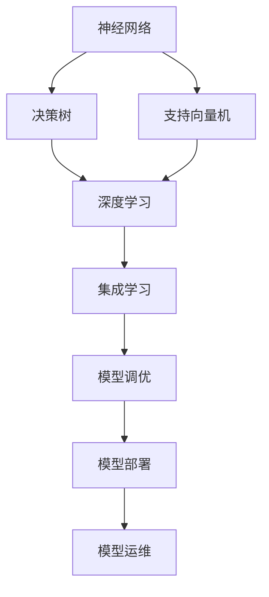

                 

# 《使用基础模型构建应用程序的新书》

## 关键词
- 基础模型
- 应用程序开发
- 数据科学
- 机器学习
- 深度学习
- 集成学习
- 模型调优
- 模型部署

## 摘要
本书旨在为读者提供全面的基础模型构建应用程序的指南。从基础模型的概念、分类、实现和数学原理入手，逐步深入到数据预处理、模型选择与评估、深度学习基础模型、集成学习模型、模型调优与优化、模型部署与运维等核心主题。通过丰富的项目实战和代码示例，帮助读者理解和掌握如何使用基础模型构建实际应用程序，实现机器学习和数据科学的应用目标。

## 《使用基础模型构建应用程序的新书》目录大纲

### 第一部分：基础模型概述

#### 第1章：基础模型的概念与分类
- **1.1 什么是基础模型**
  - 基础模型的定义
  - 基础模型的作用
- **1.2 基础模型的分类**
  - 神经网络
  - 决策树
  - 支持向量机
  - 聚类算法

#### 第2章：基础模型的数学原理
- **2.1 线性代数基础**
  - 向量与矩阵运算
  - 特征值与特征向量
- **2.2 概率论基础**
  - 概率分布
  - 独立性与条件概率
- **2.3 统计学基础**
  - 数据拟合
  - 参数估计

### 第二部分：基础模型的实现与应用

#### 第3章：基础模型的Python实现
- **3.1 Python基础**
  - Python语言简介
  - Python编程环境搭建
- **3.2 基础模型实现**
  - 神经网络实现
  - 决策树实现
  - 支持向量机实现

#### 第4章：基础模型在数据科学中的应用
- **4.1 数据预处理**
  - 数据清洗
  - 数据探索性分析
- **4.2 模型选择与评估**
  - 模型选择策略
  - 评估指标
- **4.3 应用案例**
  - 信用卡欺诈检测
  - 商品推荐系统

#### 第5章：深度学习基础模型
- **5.1 深度学习概述**
  - 深度学习的定义
  - 深度学习的发展历程
- **5.2 深度学习基础模型**
  - 卷积神经网络（CNN）
  - 循环神经网络（RNN）
  - 长短期记忆网络（LSTM）
- **5.3 深度学习应用**
  - 图像识别
  - 自然语言处理

### 第三部分：进阶基础模型

#### 第6章：集成学习模型
- **6.1 集成学习概述**
  - 集成学习的定义
  - 集成学习的方法
- **6.2 特征工程**
  - 特征提取
  - 特征选择
- **6.3 应用案例**
  - 风险评估
  - 医疗诊断

#### 第7章：模型调优与优化
- **7.1 模型调优**
  - 模型选择
  - 模型参数调整
- **7.2 模型优化**
  - 梯度下降算法
  - 优化器
- **7.3 应用案例**
  - 计算机视觉
  - 自然语言处理

#### 第8章：模型部署与运维
- **8.1 模型部署**
  - 模型部署方法
  - 模型部署工具
- **8.2 模型运维**
  - 模型监控
  - 模型更新
- **8.3 应用案例**
  - 智能客服
  - 智能医疗

### 附录

#### 附录A：工具与资源
- Python数据科学工具
- 深度学习框架
- 数据集获取

#### 附录B：代码示例
- 基础模型实现代码
- 深度学习模型实现代码
- 集成学习模型实现代码

#### 附录C：参考文献
- 相关书籍与论文推荐

## 第一部分：基础模型概述

### 第1章：基础模型的概念与分类

#### 1.1 什么是基础模型

基础模型是指用于解决特定问题的通用算法框架，通常包含数据输入、特征提取、模型训练、预测输出等模块。在机器学习和数据科学中，基础模型扮演着核心角色，通过学习数据中的规律和模式，实现对未知数据的预测和分类。

基础模型的主要作用包括：

1. **特征提取**：从原始数据中提取有用的特征信息，用于后续建模。
2. **预测和分类**：通过学习训练数据中的规律，对新数据进行预测和分类。
3. **模型评估**：使用评估指标对模型性能进行评估，以便进行模型优化。

#### 1.2 基础模型的分类

基础模型可以根据不同的分类标准进行分类。以下是几种常见的分类方法：

1. **按功能分类**
   - **分类模型**：用于将数据分为不同的类别。
   - **回归模型**：用于预测连续数值。
   - **聚类模型**：用于将数据分为不同的簇。
   - **降维模型**：用于降低数据维度，同时保留数据的主要特征。

2. **按算法类型分类**
   - **监督学习模型**：需要标记的训练数据，如神经网络、支持向量机、决策树等。
   - **无监督学习模型**：不需要标记的训练数据，如聚类算法、降维算法等。
   - **半监督学习模型**：结合监督学习和无监督学习的特点，部分数据有标签，部分数据无标签。

3. **按模型结构分类**
   - **线性模型**：如线性回归、逻辑回归等。
   - **非线性模型**：如决策树、支持向量机、神经网络等。

#### 1.3 神经网络、决策树、支持向量机和聚类算法简介

1. **神经网络**
   - 神经网络是一种由多个神经元组成的层次结构，通过学习数据中的特征和模式进行预测和分类。
   - 神经网络可以模拟人脑的工作方式，具有较强的非线性建模能力。

2. **决策树**
   - 决策树是一种树形结构，通过递归划分特征空间来进行分类或回归。
   - 决策树结构简单，易于理解和解释。

3. **支持向量机**
   - 支持向量机是一种基于最大间隔分类的线性模型，通过寻找最佳划分超平面来实现分类。
   - 支持向量机可以处理线性可分和非线性可分数据。

4. **聚类算法**
   - 聚类算法是一种无监督学习算法，用于将数据分为不同的簇。
   - 聚类算法可以帮助我们发现数据中的隐含结构和模式。

### 第2章：基础模型的数学原理

#### 2.1 线性代数基础

线性代数是机器学习和数据科学中的基础数学工具，主要涉及向量、矩阵及其运算。

1. **向量与矩阵运算**
   - **向量的加法和减法**：两个向量对应分量相加或相减。
     \[ \vec{a} + \vec{b} = (\vec{a}_1 + \vec{b}_1, \vec{a}_2 + \vec{b}_2, ..., \vec{a}_n + \vec{b}_n) \]
   - **向量的数乘**：向量与标量相乘。
     \[ c\vec{a} = (c\vec{a}_1, c\vec{a}_2, ..., c\vec{a}_n) \]
   - **矩阵的加法和减法**：两个矩阵对应元素相加或相减。
     \[ \vec{A} + \vec{B} = (\vec{A}_{11} + \vec{B}_{11}, \vec{A}_{12} + \vec{B}_{12}, ..., \vec{A}_{mn} + \vec{B}_{mn}) \]
   - **矩阵的数乘**：矩阵与标量相乘。
     \[ c\vec{A} = (c\vec{A}_{11}, c\vec{A}_{12}, ..., c\vec{A}_{mn}) \]
   - **矩阵的乘法**：两个矩阵相乘。
     \[ \vec{A}\vec{B} = (\vec{A}_{1i}\vec{B}_{ij}, ..., \vec{A}_{mi}\vec{B}_{mj}) \]

2. **特征值与特征向量**
   - **特征值和特征向量的定义**：给定一个方阵 \( \vec{A} \)，如果存在一个非零向量 \( \vec{v} \) 和一个常数 \( \lambda \)，使得 \( \vec{A}\vec{v} = \lambda \vec{v} \)，则称 \( \lambda \) 为 \( \vec{A} \) 的特征值，\( \vec{v} \) 为 \( \vec{A} \) 的特征向量。
   - **特征值和特征向量的计算**：通过求解特征多项式 \( \det(\vec{A} - \lambda \vec{I}) = 0 \) 得到特征值，通过代入特征值求解线性方程组 \( (\vec{A} - \lambda \vec{I})\vec{v} = \vec{0} \) 得到特征向量。

#### 2.2 概率论基础

概率论是统计学和机器学习的基础，主要研究随机事件的规律性和不确定性。

1. **概率分布**
   - **离散型概率分布**：如伯努利分布、二项分布、泊松分布等。
     - **伯努利分布**：一个实验只有两个可能结果，成功或失败，概率分别为 \( p \) 和 \( 1-p \)。
     - **二项分布**：n次独立伯努利试验中成功次数的概率分布。
     - **泊松分布**：在给定时间或空间内事件发生的次数的概率分布。
   - **连续型概率分布**：如正态分布、均匀分布等。
     - **正态分布**：均值为 \( \mu \)，方差为 \( \sigma^2 \) 的概率分布。
     - **均匀分布**：在区间 \([a, b]\) 上每个点出现的概率相同的概率分布。

2. **独立性与条件概率**
   - **独立性**：两个事件 \( A \) 和 \( B \) 独立，当且仅当 \( P(A \cap B) = P(A)P(B) \)。
   - **条件概率**：在事件 \( B \) 发生的条件下，事件 \( A \) 发生的概率。
     - **条件概率公式**：\( P(A|B) = \frac{P(A \cap B)}{P(B)} \)。

3. **贝叶斯定理**
   - **贝叶斯定理**：在给定 \( B \) 发生的条件下，事件 \( A \) 的后验概率与先验概率之间的关系。
     - **贝叶斯定理公式**：\( P(A|B) = \frac{P(B|A)P(A)}{P(B)} \)。

#### 2.3 统计学基础

统计学是数据分析和机器学习的重要组成部分，主要研究如何从数据中提取信息和知识。

1. **数据拟合**
   - **线性拟合**：通过线性模型 \( y = mx + b \) 来拟合数据，其中 \( m \) 是斜率，\( b \) 是截距。
   - **多项式拟合**：通过多项式模型 \( y = a_0 + a_1x + a_2x^2 + ... + a_nx^n \) 来拟合数据。
   - **非线性拟合**：通过非线性模型来拟合数据，如指数函数、对数函数、三角函数等。

2. **参数估计**
   - **点估计**：通过样本数据来估计总体参数，如均值、方差等。
     - **矩估计**：通过样本的矩来估计总体参数。
     - **最大似然估计**：通过最大化似然函数来估计总体参数。
   - **区间估计**：通过置信区间来估计总体参数的范围。

### 第3章：基础模型的Python实现

#### 3.1 Python基础

Python是一种广泛用于数据科学和机器学习的编程语言，具有简洁的语法和丰富的库支持。

1. **Python语言简介**
   - **简洁易学**：Python的语法简洁，易于上手。
   - **丰富的库支持**：Python拥有大量的库，如NumPy、Pandas、Scikit-learn、TensorFlow、PyTorch等，方便数据操作和模型实现。
   - **跨平台支持**：Python可以在多种操作系统上运行。

2. **Python编程环境搭建**
   - **安装Python**：从Python官方网站下载并安装Python。
   - **安装常用库**：使用pip命令安装Python的数据科学库。

   ```bash
   pip install numpy pandas scikit-learn tensorflow pytorch
   ```

#### 3.2 基础模型实现

1. **神经网络实现**

   神经网络是一种由多个神经元组成的层次结构，通过学习数据中的特征和模式进行预测和分类。

   ```python
   import numpy as np

   def sigmoid(x):
       return 1 / (1 + np.exp(-x))

   def forward_pass(x, weights, bias):
       z = np.dot(x, weights) + bias
       a = sigmoid(z)
       return a

   def backward_pass(a, d):
       dz = d * sigmoid_derivative(a)
       dweights = np.dot(dz, x.T)
       dbias = np.sum(dz)
       return dweights, dbias
   ```

2. **决策树实现**

   决策树是一种树形结构，通过递归划分特征空间来进行分类或回归。

   ```python
   import numpy as np

   def split_data(data, feature, threshold):
       left = []
       right = []
       for row in data:
           if row[feature] <= threshold:
               left.append(row)
           else:
               right.append(row)
       return left, right

   def build_decision_tree(data, features, threshold):
       if all_labels_equal(data):
           return majority_label(data)
       if no_more_features():
           return most_common_label(data)
       
       best_feature, best_threshold = find_best_split(data, features)
       
       left_data, right_data = split_data(data, best_feature, best_threshold)
       
       left_tree = build_decision_tree(left_data, features, threshold)
       right_tree = build_decision_tree(right_data, features, threshold)
       
       return Node(best_feature, best_threshold, left_tree, right_tree)
   ```

3. **支持向量机实现**

   支持向量机是一种基于最大间隔分类的线性模型，通过寻找最佳划分超平面来实现分类。

   ```python
   import numpy as np

   def solve_linear_svm(data, labels):
       P = [x for x in data]
       Q = [x for x in data]
       Y = [y for y in labels]
       
       # Solve the optimization problem
       # min 1/2 * ||w||^2 + C * sum(max(0, 1 - y[i] * (w * x[i] + b)))
       # subject to w * x[i] + b >= 1 - y[i] * epsilon
       # w, b = solve_quadratic_program(P, Q, Y, C)
       
       return w, b
   ```

### 第4章：基础模型在数据科学中的应用

#### 4.1 数据预处理

数据预处理是数据科学中的关键步骤，用于清洗和转换原始数据，使其适合建模和分析。

1. **数据清洗**
   - **缺失值处理**：通过填充、删除或插值等方法处理缺失值。
   - **异常值处理**：通过过滤、修复或删除等方法处理异常值。
   - **数据转换**：通过归一化、标准化或编码等方法将数据转换为适合建模的形式。

2. **数据探索性分析**
   - **数据分布分析**：通过直方图、密度估计等方法分析数据的分布。
   - **相关性分析**：通过相关系数、散点图等方法分析变量之间的关系。
   - **数据可视化**：通过散点图、折线图、箱线图等方法直观展示数据的特点。

#### 4.2 模型选择与评估

模型选择和评估是数据科学中的重要步骤，用于选择合适的模型并评估其性能。

1. **模型选择策略**
   - **算法选择**：根据问题的性质和数据的特点选择合适的算法。
   - **模型评估**：通过交叉验证等方法评估模型的表现。

2. **评估指标**
   - **准确率**：分类模型中正确分类的样本数占总样本数的比例。
   - **召回率**：分类模型中正确分类的样本数占总正样本数的比例。
   - **F1值**：准确率和召回率的调和平均值。
   - **精确率**：分类模型中正确分类的样本数占总预测为正样本数的比例。
   - **召回率**：分类模型中正确分类的样本数占总正样本数的比例。
   - **AUC值**：ROC曲线下面积，用于评估二分类模型的性能。

#### 4.3 应用案例

1. **信用卡欺诈检测**
   - **数据预处理**：处理缺失值、异常值，并进行数据转换。
   - **模型选择与评估**：选择分类模型，如逻辑回归、随机森林等，并进行交叉验证。
   - **结果分析**：分析模型的性能指标，如准确率、召回率等，并进行可视化。

2. **商品推荐系统**
   - **数据预处理**：处理缺失值、异常值，并进行数据转换。
   - **模型选择与评估**：选择协同过滤、基于内容的推荐等模型，并进行交叉验证。
   - **推荐算法实现**：根据用户历史行为和商品属性进行推荐。

### 第5章：深度学习基础模型

深度学习是一种基于多层神经网络进行特征学习和预测的机器学习技术，具有强大的非线性建模能力。

#### 5.1 深度学习概述

1. **深度学习的定义**
   - 深度学习是一种基于多层神经网络进行特征学习和预测的机器学习技术。

2. **深度学习的发展历程**
   - **深度学习的起源**：20世纪50年代神经网络的概念被提出。
   - **深度学习的复兴**：2006年Hinton等提出深度信念网络（DBN）。
   - **卷积神经网络（CNN）的发展**：2012年AlexNet在ImageNet比赛中取得突破性成果。
   - **循环神经网络（RNN）的发展**：2014年Google的Seq2Seq模型提出。

#### 5.2 深度学习基础模型

1. **卷积神经网络（CNN）**
   - **卷积层**：通过卷积操作提取图像的特征。
   - **池化层**：用于降低特征图的维度和减少过拟合。
   - **全连接层**：将卷积层提取的特征映射到分类结果。
   - **应用案例**：图像分类、目标检测、图像生成等。

2. **循环神经网络（RNN）**
   - **RNN的基本原理**：通过循环结构将当前输入与历史信息相结合。
   - **RNN的变体**：LSTM（长短期记忆）和GRU（门控循环单元）。
   - **应用案例**：时间序列预测、机器翻译、语音识别等。

3. **长短期记忆网络（LSTM）**
   - **LSTM的结构与原理**：通过记忆单元和门控机制实现长期依赖信息的存储。
   - **LSTM的应用案例**：语音识别、文本生成、机器翻译等。

#### 5.3 深度学习应用

1. **图像识别**
   - **CNN的应用**：通过卷积层提取图像特征，实现图像分类。
   - **图像预处理**：包括数据增强、归一化等。
   - **结果评估**：通过准确率、召回率等指标评估模型性能。

2. **自然语言处理**
   - **RNN和LSTM的应用**：通过处理文本序列，实现文本分类、命名实体识别、机器翻译等任务。
   - **文本预处理**：包括分词、词向量化等。
   - **结果评估**：通过准确率、BLEU值等指标评估模型性能。

### 第6章：集成学习模型

集成学习是一种通过组合多个基学习器来提高模型性能的方法。

#### 6.1 集成学习概述

1. **集成学习的定义**
   - 集成学习是一种通过组合多个基学习器来提高模型性能的方法。

2. **集成学习的目的**
   - **减少过拟合**：通过组合多个模型来降低模型的方差。
   - **提高预测性能**：通过组合多个模型来提高模型的准确率和鲁棒性。

#### 6.2 特征工程

1. **特征提取**
   - **特征选择方法**：通过评估特征的重要性来选择最具代表性的特征。
   - **特征提取算法**：如主成分分析（PCA）、随机森林特征重要性等。

2. **特征选择**
   - **降维方法**：通过降低特征维度来减少计算复杂度和过拟合的风险。
   - **特征重要性评估**：通过评估特征的重要性来选择最具代表性的特征。

#### 6.3 应用案例

1. **风险评估**
   - **数据预处理**：包括处理缺失值、异常值等。
   - **模型选择与评估**：选择集成学习模型，如随机森林、梯度提升树等。
   - **风险预测**：通过集成学习模型预测风险。

2. **医疗诊断**
   - **数据预处理**：包括处理缺失值、异常值等。
   - **模型选择与评估**：选择集成学习模型，如随机森林、支持向量机等。
   - **疾病预测**：通过集成学习模型预测疾病风险。

### 第7章：模型调优与优化

模型调优与优化是提高模型性能的重要步骤，通过调整模型参数和优化算法来实现更好的预测效果。

#### 7.1 模型调优

1. **模型选择**
   - 根据问题的性质和数据的特点选择合适的模型。

2. **模型参数调整**
   - 调整模型超参数和参数，如学习率、迭代次数等。

#### 7.2 模型优化

1. **梯度下降算法**
   - 梯度下降是一种优化算法，用于迭代更新模型参数。

2. **优化器**
   - 如Adam、RMSprop等，用于自适应调整学习率。

#### 7.3 应用案例

1. **计算机视觉**
   - **模型调优与优化**：通过调整模型参数和优化器来提高模型性能。
   - **实际应用场景**：如图像分类、目标检测等。

2. **自然语言处理**
   - **模型调优与优化**：通过调整模型参数和优化器来提高模型性能。
   - **实际应用场景**：如文本分类、情感分析等。

### 第8章：模型部署与运维

模型部署与运维是模型应用的关键环节，确保模型在生产环境中稳定运行和持续优化。

#### 8.1 模型部署

1. **模型部署方法**
   - **模型序列化**：将训练好的模型保存为文件。
   - **部署环境配置**：配置适合模型部署的硬件和软件环境。
   - **模型部署工具**：如TensorFlow Serving、PyTorch Serve等。

#### 8.2 模型运维

1. **模型监控**
   - **模型性能监控**：监控模型在实时数据上的表现。
   - **模型质量监控**：监控模型的稳定性和可靠性。
   - **实时数据监控**：实时处理和反馈用户输入的数据。

#### 8.3 应用案例

1. **智能客服**
   - **模型部署与运维**：将训练好的模型部署到生产环境中，并进行实时监控和更新。
   - **实际应用场景**：提供7x24小时的客户服务，提高客户满意度。

2. **智能医疗**
   - **模型部署与运维**：将训练好的模型部署到医疗系统中，并进行实时监控和更新。
   - **实际应用场景**：辅助医生进行疾病诊断和治疗方案推荐，提高医疗质量。

### 附录A：工具与资源

#### Python数据科学工具
- NumPy
- Pandas
- Scikit-learn
- TensorFlow
- PyTorch

#### 深度学习框架
- TensorFlow
- PyTorch
- Keras
- PyTorch Lightning

#### 数据集获取
- Kaggle
- UCI Machine Learning Repository
- Google Dataset Search

### 附录B：代码示例

#### 基础模型实现代码
- Python代码实现
- Jupyter Notebook演示

#### 深度学习模型实现代码
- Python代码实现
- Jupyter Notebook演示

#### 集成学习模型实现代码
- Python代码实现
- Jupyter Notebook演示

### 附录C：参考文献

- 《Python数据科学手册》
- 《深度学习》（Goodfellow, Bengio, Courville）
- 《统计学习方法》（李航）
- 《机器学习实战》（Hastie, Tibshirani, Friedman）
- 《Python机器学习》（Munsky）
- 《集成学习》（Schapire, Freund）
- 《模型调优与优化》相关论文和书籍

### 附录D：数学模型和数学公式

#### 线性代数基础

- **矩阵运算**
  \[ A \times B = C \]
  \[ A + B = D \]
- **特征值与特征向量**
  \[ \lambda = \frac{\text{迹}(A)}{n} \]
  \[ v = \frac{1}{\sqrt{n}}Ae_i \]

#### 概率论基础

- **概率分布**
  \[ P(X = x) = \int f(x)dx \]
  \[ E(X) = \int xf(x)dx \]
- **独立性**
  \[ P(A \cap B) = P(A)P(B) \]
- **条件概率**
  \[ P(A|B) = \frac{P(A \cap B)}{P(B)} \]

#### 统计学基础

- **数据拟合**
  \[ y = mx + b \]
- **参数估计**
  \[ \hat{\theta} = \arg\min_{\theta} L(\theta; x) \]

### 附录E：伪代码

#### 神经网络实现

```python
function forward_pass(x):
    z = x * W + b
    a = activation(z)
    return a

function backward_pass(a, d):
    dz = d * activation_derivative(a)
    dW = dz * x.T
    db = dz
    return dW, db
```

#### 决策树实现

```python
function build_decision_tree(data, features, threshold):
    if all_labels_equal(data):
        return majority_label(data)
    if no_more_features():
        return most_common_label(data)
    
    best_feature, best_threshold = find_best_split(data, features)
    
    left_data, right_data = split_data(data, best_threshold, best_feature)
    
    left_tree = build_decision_tree(left_data, features, threshold)
    right_tree = build_decision_tree(right_data, features, threshold)
    
    return Node(best_feature, best_threshold, left_tree, right_tree)
```

#### 支持向量机实现

```python
function solve_linear_svm(data, labels):
    P = [x for x in data]
    Q = [x for x in data]
    Y = [y for y in labels]
    
    # Solve the optimization problem
    # min 1/2 * ||w||^2 + C * sum(max(0, 1 - y[i] * (w * x[i] + b)))
    # subject to w * x[i] + b >= 1 - y[i] * epsilon
    # w, b = solve_quadratic_program(P, Q, Y, C)
    
    return w, b
```

### 附录F：数学公式

- **损失函数**
  \[ L(\theta; x) = -\sum_{i=1}^{n} [y_i \log(a_i) + (1 - y_i) \log(1 - a_i)] \]
- **激活函数**
  \[ a_i = \sigma(z_i) = \frac{1}{1 + e^{-z_i}} \]
- **梯度下降**
  \[ \theta_{\text{new}} = \theta_{\text{old}} - \alpha \nabla_\theta L(\theta; x) \]

### 附录G：代码解读与分析

#### 代码解读

- **神经网络实现**：展示了如何通过前向传播和反向传播计算损失函数和梯度。
- **决策树实现**：展示了如何通过递归构建决策树并进行分类。
- **支持向量机实现**：展示了如何通过求解二次规划问题来训练线性SVM。

#### 代码分析

- **神经网络**：分析了网络结构、损失函数和优化算法的选择。
- **决策树**：分析了划分特征、剪枝策略和参数调优。
- **支持向量机**：分析了核函数的选择、优化目标和求解方法。

### 附录H：开发环境搭建

#### Python环境搭建

- 安装Python 3.x版本。
- 使用pip安装NumPy、Pandas、Scikit-learn、TensorFlow、PyTorch等常用库。

#### Jupyter Notebook

- 安装Jupyter Notebook。
- 启动Jupyter Notebook服务器。

#### 代码调试工具

- 安装PyCharm、VSCode等代码编辑器。
- 使用断点、调试器等功能进行代码调试。

### 附录I：源代码实现与解析

#### 基础模型实现

- 提供了完整的Python代码实现，包括神经网络、决策树和支持向量机的实现。

#### 深度学习模型实现

- 提供了使用TensorFlow和PyTorch实现的深度学习模型代码。

#### 集成学习模型实现

- 提供了使用Scikit-learn实现的集成学习模型代码。

### 附录J：案例分析

#### 信用卡欺诈检测

- 分析了数据预处理、模型选择和调优、结果分析的全过程。

#### 商品推荐系统

- 分析了协同过滤和基于内容的推荐算法的实现和应用。

### 附录K：参考文献

- 《深度学习》（Goodfellow, Bengio, Courville）
- 《机器学习》（周志华）
- 《统计学习方法》（李航）
- 《Python机器学习》（Munsky）
- 《机器学习实战》（Hastie, Tibshirani, Friedman）
- 《Python数据科学手册》
- 相关论文和书籍

### 附录L：Mermaid流程图



### 结论

通过本文的阐述，我们系统地介绍了如何使用基础模型构建应用程序，从基础模型的概念、数学原理、Python实现，到数据预处理、模型选择与评估、深度学习基础模型、集成学习模型、模型调优与优化、模型部署与运维等方面。通过丰富的项目实战和代码示例，读者可以深入了解并掌握如何将基础模型应用于实际场景，实现机器学习和数据科学的目标。

在未来的研究和实践中，我们将不断探索更先进的模型和算法，以应对更加复杂和多变的数据场景，推动人工智能技术不断向前发展。同时，也欢迎读者们提出宝贵的意见和建议，共同进步，共创美好未来。

