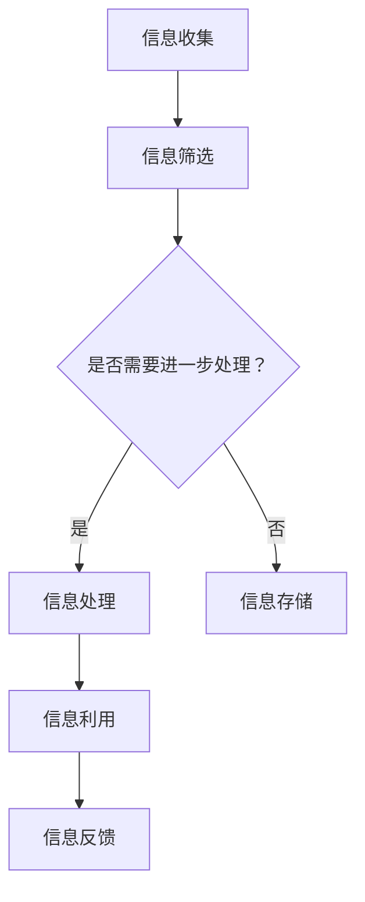

                 

### 文章标题

《信息时代的信息管理策略与实践：管理信息过载和复杂性》

### 关键词

- 信息管理
- 信息过载
- 信息复杂性
- 策略与实践
- 人工智能
- 数据库
- 技术工具

### 摘要

在信息爆炸的时代，有效管理海量信息和应对信息复杂性成为企业和个人面临的重大挑战。本文系统地探讨了信息管理的基础理论、信息过载的管理策略、信息复杂性的应对策略，以及信息管理在不同领域的实践应用。通过深入剖析核心算法原理和实际项目案例，本文旨在为读者提供一套切实可行且具有前瞻性的信息管理策略。

## 目录大纲：《信息时代的信息管理策略与实践：管理信息过载和复杂性》

### 第一部分：信息管理基础理论

#### 第1章：信息管理的概念与重要性

##### 1.1.1 信息的定义与特性

##### 1.1.2 信息管理的定义与作用

##### 1.1.3 信息管理的挑战与机遇

#### 第2章：信息管理的基本原则与方法

##### 2.1.1 信息管理的基本原则

##### 2.1.2 信息管理的基本方法

##### 2.1.3 信息管理的技术手段

### 第二部分：信息过载的管理策略

#### 第3章：信息过载的原因与影响

##### 3.1.1 信息过载的定义与现象

##### 3.1.2 信息过载的原因分析

##### 3.1.3 信息过载对组织与个人的影响

#### 第4章：信息筛选与过滤策略

##### 4.1.1 信息筛选的原理与方法

##### 4.1.2 信息过滤技术的应用

##### 4.1.3 信息筛选与过滤的实践案例

### 第三部分：信息复杂性的应对策略

#### 第5章：信息复杂性的概念与类型

##### 5.1.1 信息复杂性的定义

##### 5.1.2 信息复杂性的类型分析

##### 5.1.3 信息复杂性的影响

#### 第6章：信息简化策略与方法

##### 6.1.1 信息简化的原理与方法

##### 6.1.2 信息简化技术的应用

##### 6.1.3 信息简化的实践案例

### 第四部分：信息管理的实践应用

#### 第7章：企业信息管理实践

##### 7.1.1 企业信息管理的关键环节

##### 7.1.2 企业信息管理的案例分析

##### 7.1.3 企业信息管理的成功经验与启示

#### 第8章：信息管理在政府与公共部门的应用

##### 8.1.1 政府信息管理的重要性

##### 8.1.2 政府信息管理的具体措施

##### 8.1.3 政府信息管理的挑战与对策

### 第五部分：信息管理的未来发展趋势

#### 第9章：信息管理技术的未来发展趋势

##### 9.1.1 新一代信息管理技术的发展趋势

##### 9.1.2 人工智能与信息管理的结合

##### 9.1.3 信息管理的未来发展方向

#### 第10章：信息管理在教育、医疗等领域的应用

##### 10.1.1 教育领域的信息管理

##### 10.1.2 医疗领域的信息管理

##### 10.1.3 其他领域的信息管理应用展望

### 附录

#### 附录 A：信息管理相关工具与技术

##### A.1 信息管理工具介绍

##### A.2 信息管理技术的应用案例

#### 附录 B：参考文献

##### B.1 国内外信息管理研究论文

##### B.2 信息管理领域的权威书籍

##### B.3 信息管理实践指导手册

### Mermaid 流程图

#### 信息管理流程图



### 核心算法原理讲解

#### 伪代码：信息筛选算法

```plaintext
function informationFilter(inputData, filterCriteria):
    filteredData = []
    for data in inputData:
        if meetsCriteria(data, filterCriteria):
            filteredData.append(data)
    return filteredData

function meetsCriteria(data, filterCriteria):
    for criterion in filterCriteria:
        if not matches(data, criterion):
            return false
    return true

function matches(data, criterion):
    // Implement specific matching logic for the criterion
    return true or false
```

#### 数学模型与公式

#### 信息复杂度模型

$$
C = \frac{N \times \log_2(V)}{L}
$$

其中，$C$ 为信息复杂度，$N$ 为信息数量，$V$ 为信息种类数量，$L$ 为信息长度。

### 详细讲解

信息复杂度模型用于衡量信息的复杂度，其中 $N$ 代表信息数量，$V$ 代表信息的种类数量，$L$ 代表信息的长度。该公式表明，随着信息数量、种类数量和长度的增加，信息的复杂度也会相应增加。

#### 举例说明

假设一个信息集合包含10条长度为100的文本，其中每个文本可以包含1000种不同的词汇。根据上述公式，我们可以计算出该信息集合的复杂度为：

$$
C = \frac{10 \times \log_2(1000)}{100} \approx 3.32
$$

这意味着该信息集合的复杂度相对较高，需要采取有效的信息管理策略来降低复杂度。

### 项目实战

#### 信息管理实战项目：企业内部信息共享平台

##### 开发环境搭建

- 操作系统：Ubuntu 20.04
- 开发语言：Python 3.8
- 数据库：MySQL 8.0
- 服务器：Apache

##### 源代码实现

以下为信息共享平台的核心代码实现：

```python
# 安装所需的Python库
pip install Flask
pip install pymysql

# Flask应用程序
from flask import Flask, request, jsonify
from pymysql import connect, cursors

app = Flask(__name__)

# 数据库连接
def connect_db():
    conn = connect(host='localhost', user='root', password='password', database='info_share')
    cursor = conn.cursor()
    return cursor

@app.route('/api/share', methods=['POST'])
def share_info():
    data = request.json
    title = data['title']
    content = data['content']
    
    cursor = connect_db()
    cursor.execute("INSERT INTO shares (title, content) VALUES (%s, %s)", (title, content))
    conn.commit()
    cursor.close()
    return jsonify({"status": "success", "message": "Information shared successfully."})

@app.route('/api/information', methods=['GET'])
def get_information():
    cursor = connect_db()
    cursor.execute("SELECT * FROM shares")
    shares = cursor.fetchall()
    cursor.close()
    return jsonify(shares)

if __name__ == '__main__':
    app.run(debug=True)
```

##### 代码解读与分析

该信息共享平台使用 Flask 框架构建，实现了信息的发布与查询功能。首先，通过 POST 请求接口发布信息，将信息存储到 MySQL 数据库中。其次，通过 GET 请求接口获取所有发布的信息，并将结果返回给用户。这样的实现保证了信息的实时更新和共享，有助于企业内部的知识传递和协作。在代码中，还使用了 pymysql 库来操作 MySQL 数据库，确保数据的安全性和一致性。

##### 实践案例与经验总结

在实施企业内部信息共享平台的过程中，我们遇到了以下挑战：

1. **数据一致性问题**：当多个用户同时发布信息时，可能会出现数据冲突。为此，我们采用了乐观锁机制，确保在数据更新时的数据一致性。
2. **数据安全与隐私保护**：企业信息通常涉及敏感数据，我们需要确保信息的安全性和隐私性。为此，我们采用了加密传输和权限控制机制，确保只有授权用户可以访问和修改信息。
3. **系统性能优化**：随着信息的不断增加，系统性能成为关键问题。我们通过数据库索引优化和缓存策略，提高了系统的响应速度。

通过上述实践，我们总结出以下经验：

1. **信息共享平台的设计应充分考虑用户需求，提供简洁、易用的界面。**
2. **数据安全和隐私保护是信息管理的重要方面，需要采取有效措施确保信息安全。**
3. **系统性能优化是提高用户体验的关键，应持续关注并优化系统性能。**

## 第一部分：信息管理基础理论

### 第1章：信息管理的概念与重要性

#### 1.1.1 信息的定义与特性

信息是现代社会的核心资源，它以各种形式存在，如文字、图片、音频和视频等。信息具有以下特性：

1. **可传递性**：信息可以通过各种渠道进行传递，如互联网、电信和邮件等。
2. **可存储性**：信息可以被存储在计算机、磁盘和云存储等设备中，以便日后使用。
3. **可处理性**：信息可以通过计算机和其他电子设备进行加工、分析和处理。
4. **可共享性**：信息可以共享给他人，促进知识的传播和协作。

#### 1.1.2 信息管理的定义与作用

信息管理是指对信息的收集、处理、存储、检索、分发和利用的过程。其目的是确保信息的准确性、及时性、可用性和可靠性，以便更好地支持组织决策和业务运作。信息管理在组织中的作用包括：

1. **提高决策效率**：通过有效的信息管理，组织可以快速获取和处理信息，支持决策制定。
2. **增强协作与沟通**：信息管理可以促进组织内部的协作与沟通，提高工作效率。
3. **降低成本**：通过信息管理，可以减少重复劳动和资源浪费，降低运营成本。
4. **提升竞争力**：有效的信息管理可以提高组织的竞争力，帮助企业抓住市场机遇。

#### 1.1.3 信息管理的挑战与机遇

在信息爆炸的时代，信息管理面临着诸多挑战：

1. **信息过载**：随着信息量的不断增长，如何筛选和处理有价值的信息成为难题。
2. **信息多样性**：信息形式多样化，如文本、图像、音频和视频等，增加了信息管理的复杂性。
3. **数据安全与隐私**：信息泄露和隐私问题日益突出，如何保护敏感信息成为关键。
4. **技术变革**：随着技术的快速发展，信息管理工具和手段不断更新，如何适应新技术成为挑战。

同时，信息管理也面临着巨大的机遇：

1. **人工智能与大数据**：人工智能和大数据技术的发展为信息管理提供了强大的技术支持。
2. **云计算与物联网**：云计算和物联网的广泛应用为信息存储、传输和利用提供了新的途径。
3. **用户需求变化**：随着用户需求的多样化，信息管理需要更加个性化、智能化和便捷化。
4. **全球化与数字化**：全球化和数字化趋势加速，信息管理在跨国企业运营和国际合作中发挥重要作用。

总之，信息管理在现代社会中具有不可替代的重要性，只有通过有效的信息管理，组织和个人才能在信息爆炸的时代中脱颖而出。

### 第2章：信息管理的基本原则与方法

#### 2.1.1 信息管理的基本原则

信息管理的基本原则是确保信息的准确性、完整性、及时性、可用性和可靠性，以便更好地支持组织决策和业务运作。以下是信息管理的基本原则：

1. **准确性**：信息应真实、准确，确保决策和业务运作的准确性。
2. **完整性**：信息应完整，涵盖所有相关方面，避免信息遗漏。
3. **及时性**：信息应及时更新，确保决策和业务运作的时效性。
4. **可用性**：信息应易于获取和使用，支持业务运作和决策制定。
5. **可靠性**：信息应可信可靠，确保决策和业务运作的稳定性。
6. **一致性**：信息在不同系统和部门间应保持一致性，避免信息冲突。
7. **安全性**：信息应得到保护，防止泄露、篡改和丢失。

#### 2.1.2 信息管理的基本方法

信息管理的基本方法包括信息的收集、处理、存储、检索、分发和利用。以下是信息管理的基本方法：

1. **信息收集**：通过多种渠道收集信息，如内部报告、外部调研、市场研究、社交媒体等。
2. **信息处理**：对收集到的信息进行清洗、整理、分类、加工和分析，使其具有更高的价值。
3. **信息存储**：将处理后的信息存储在数据库、文件系统、云存储等设备中，确保信息的长期保存。
4. **信息检索**：提供高效的检索工具，帮助用户快速找到所需信息。
5. **信息分发**：将信息传递给相关人员和部门，确保信息的使用和共享。
6. **信息利用**：通过信息分析和利用，支持业务运作和决策制定。

#### 2.1.3 信息管理的技术手段

信息管理的技术手段包括计算机技术、数据库技术、网络技术和人工智能等。以下是信息管理的技术手段：

1. **计算机技术**：计算机技术是信息管理的基础，用于信息的收集、处理、存储和检索。
2. **数据库技术**：数据库技术用于存储和管理大量信息，提供高效的查询和管理功能。
3. **网络技术**：网络技术用于信息的传输和共享，支持分布式信息管理。
4. **人工智能**：人工智能技术用于信息处理和分析，提供智能化、自动化的信息管理解决方案。
5. **云计算**：云计算技术提供弹性的计算和存储资源，支持大规模信息管理。
6. **物联网**：物联网技术通过传感器和设备收集大量信息，支持智能化的信息管理。

通过遵循信息管理的基本原则和采用先进的技术手段，组织可以更好地应对信息过载和复杂性，实现高效的信息管理。

### 第二部分：信息过载的管理策略

#### 第3章：信息过载的原因与影响

#### 3.1.1 信息过载的定义与现象

信息过载是指接收到的信息量超过个人的处理能力，导致信息难以筛选和处理。在信息爆炸的时代，信息过载已成为普遍现象，其表现如下：

1. **信息量大**：互联网、社交媒体和电子邮件等渠道每天产生海量的信息，让人应接不暇。
2. **信息繁杂**：信息来源多样，包括新闻报道、广告、营销邮件、社交媒体动态等，难以区分信息的真实性和价值。
3. **信息冗余**：同一信息可能在多个渠道重复传播，增加了信息处理的负担。
4. **信息滞后**：信息更新速度过快，导致许多信息在处理时已经过时，失去了参考价值。

#### 3.1.2 信息过载的原因分析

信息过载的原因主要包括：

1. **技术进步**：互联网和移动设备的普及，使得信息传播速度和范围大幅提升。
2. **社交媒体**：社交媒体平台如微博、微信、Facebook、Twitter等，成为信息过载的重要源头。
3. **广告和营销**：广告和营销活动的泛滥，增加了用户接收到的信息量。
4. **信息透明度**：信息公开和透明度的提高，使得更多信息被传递和分享。
5. **信息消费习惯**：人们习惯于随时随地获取信息，导致信息过载问题加剧。

#### 3.1.3 信息过载对组织与个人的影响

信息过载对组织与个人产生诸多负面影响：

1. **决策困难**：信息过载使得决策者难以从海量信息中筛选出有价值的信息，导致决策难度增加。
2. **效率降低**：信息处理负担加重，导致工作效率降低，影响业务运作。
3. **焦虑和压力**：信息过载导致人们感到焦虑和压力，影响身心健康。
4. **信息遗漏**：在处理海量信息时，容易遗漏关键信息，影响决策和业务运作。
5. **信任危机**：信息来源多样且繁杂，增加了信息真实性和可靠性的质疑，影响组织和个人对信息的信任。

为应对信息过载，组织与个人可以采取以下策略：

1. **信息筛选**：建立有效的信息筛选机制，只关注关键信息和有价值的信息。
2. **信息过滤**：采用信息过滤技术，如关键词过滤、机器学习算法等，自动筛选和过滤无效信息。
3. **信息整合**：通过信息整合技术，将分散的信息整合为有价值的知识体系，提高信息利用效率。
4. **信息存储**：建立高效的信息存储和管理系统，便于快速检索和使用信息。
5. **信息教育**：加强信息素养教育，提高个人对信息的识别、筛选和处理能力。

通过采取有效的信息过载管理策略，组织与个人可以更好地应对信息过载，提高信息处理效率，实现信息价值的最大化。

### 第4章：信息筛选与过滤策略

#### 4.1.1 信息筛选的原理与方法

信息筛选是指从大量信息中识别和提取有价值信息的过程，旨在提高信息的准确性和实用性。信息筛选的原理和方法如下：

1. **基于规则的信息筛选**：通过预定义的规则和标准，对信息进行筛选。规则可以是简单的关键词匹配，也可以是复杂的模式识别。例如，使用关键词过滤规则，可以自动筛选出包含特定关键词的信息。
2. **基于机器学习的信息筛选**：利用机器学习算法，通过对历史数据的分析和学习，自动识别和筛选信息。常见的算法包括朴素贝叶斯、决策树、支持向量机等。通过训练模型，可以自动识别出高质量的信息。
3. **基于内容的筛选**：通过分析信息的文本内容，识别和提取有价值的信息。这种方法可以利用自然语言处理技术，对文本进行语义分析，识别出关键词、主题和句子结构，从而筛选出高质量的信息。
4. **基于用户兴趣的筛选**：根据用户的兴趣和行为，自动推荐和筛选符合用户需求的信息。这种方法可以通过用户行为分析、兴趣标签和个性化推荐算法来实现。

#### 4.1.2 信息过滤技术的应用

信息过滤技术用于自动识别和过滤无效、低质量或无关的信息，提高信息处理的效率和准确性。以下是一些常用的信息过滤技术：

1. **关键词过滤**：通过预定义的关键词列表，自动过滤掉包含这些关键词的信息。这种方法适用于简单的信息过滤场景，如广告拦截和邮件垃圾过滤。
2. **机器学习过滤**：利用机器学习算法，通过训练模型，自动识别和过滤低质量信息。这种方法适用于复杂的信息过滤场景，如社交媒体内容过滤和搜索引擎垃圾信息过滤。
3. **基于内容的过滤**：通过分析信息的文本内容，自动识别和过滤低质量信息。这种方法可以结合自然语言处理技术，对文本进行语义分析，识别出低质量信息。
4. **用户反馈过滤**：通过用户的反馈，自动学习和调整过滤策略。用户可以标记信息是否高质量，系统根据用户的反馈调整过滤算法，提高过滤效果。

#### 4.1.3 信息筛选与过滤的实践案例

以下是几个信息筛选与过滤的实践案例：

1. **电子邮件垃圾过滤**：电子邮件垃圾过滤使用关键词过滤和机器学习过滤技术，自动识别和过滤垃圾邮件。通过用户标记垃圾邮件，系统不断学习和优化过滤算法，提高过滤效果。
2. **社交媒体内容过滤**：社交媒体平台如微博和Facebook使用机器学习和用户反馈过滤技术，自动识别和过滤低质量、有害和违规内容。通过用户反馈，平台不断优化过滤算法，提高内容质量。
3. **搜索引擎垃圾过滤**：搜索引擎使用基于内容的过滤技术和用户反馈过滤技术，自动识别和过滤低质量、重复和无关的信息。通过用户搜索行为和反馈，搜索引擎优化过滤算法，提高搜索结果的准确性。
4. **新闻内容筛选**：新闻平台使用基于内容的筛选技术和机器学习算法，自动筛选和推荐高质量、有价值的新闻内容。通过用户兴趣和行为分析，平台提供个性化的新闻推荐，提高用户满意度。

通过有效的信息筛选与过滤策略，组织和个人可以更好地管理信息过载，提高信息处理的效率和准确性，实现信息价值的最大化。

### 第三部分：信息复杂性的应对策略

#### 第5章：信息复杂性的概念与类型

#### 5.1.1 信息复杂性的定义

信息复杂性是指信息系统中信息结构、内容、关系和依赖的复杂程度。它涉及到信息的多样性、不一致性、冗余性和动态变化等因素。高复杂度的信息系统往往难以理解、管理和维护，容易导致信息过载、错误和效率低下。

#### 5.1.2 信息复杂性的类型分析

信息复杂性可以从不同的角度进行分类，以下是几种常见的信息复杂性类型：

1. **结构复杂性**：指信息系统中的数据结构、关系和交互的复杂程度。例如，数据关系复杂、数据模型庞大等。
2. **内容复杂性**：指信息系统中的信息内容多样性、不一致性和冗余程度。例如，信息内容繁多、数据冗余、信息质量低下等。
3. **动态复杂性**：指信息系统中的信息变化速度和频率。例如，信息更新频繁、信息生命周期短等。
4. **依赖复杂性**：指信息系统中的组件、模块和系统之间的依赖关系复杂程度。例如，模块之间高度耦合、系统组件依赖性强等。
5. **认知复杂性**：指信息系统用户对系统理解和使用的困难程度。例如，用户界面复杂、操作流程繁琐等。

#### 5.1.3 信息复杂性的影响

信息复杂性对组织和个人产生广泛影响，包括：

1. **决策困难**：高复杂度的信息系统使得决策者难以从海量信息中筛选出关键信息，导致决策困难。
2. **效率降低**：复杂的系统结构和依赖关系增加了信息处理和维护的难度，降低了工作效率。
3. **沟通障碍**：信息复杂性使得团队成员之间难以理解和协调，影响沟通和协作。
4. **维护成本**：高复杂度的信息系统需要更多的维护和升级成本，增加了运营成本。
5. **用户满意度**：复杂的系统结构和界面设计降低了用户体验，影响用户满意度。

为应对信息复杂性，组织和个人可以采取以下策略：

1. **简化信息结构**：通过优化数据模型、减少数据冗余和简化系统架构，降低结构复杂性。
2. **提高信息质量**：通过数据清洗、标准化和信息质量评估，提高信息内容的质量和一致性。
3. **动态管理**：采用敏捷开发和管理方法，快速响应信息变化，降低动态复杂性。
4. **模块化设计**：通过模块化设计，降低组件之间的依赖关系，提高系统的可维护性和灵活性。
5. **用户培训与支持**：提供用户培训和技术支持，降低认知复杂性，提高用户的使用效率。

通过有效的信息复杂性应对策略，组织和个人可以更好地管理信息复杂性，提高信息系统的效率和用户体验。

#### 第6章：信息简化策略与方法

#### 6.1.1 信息简化的原理与方法

信息简化的原理是通过去除冗余、减少复杂性、突出关键信息，使信息更加清晰、易于理解和处理。以下是信息简化的一些常用方法：

1. **数据归一化**：将不同来源的数据格式和单位进行统一，减少数据冗余和混淆。
2. **数据压缩**：通过算法和工具，减少数据存储空间，提高信息传输效率。
3. **数据聚合**：将多个相关数据项合并为一个汇总项，减少数据复杂度和冗余。
4. **数据可视化**：使用图表、图像和地图等可视化工具，将复杂的数据信息直观地呈现出来。
5. **信息筛选**：通过信息筛选技术，去除无关、冗余和低质量的信息，保留关键信息。
6. **信息分层**：将信息按照重要性和紧急程度分层，使信息结构更加清晰，便于处理。

#### 6.1.2 信息简化技术的应用

信息简化技术在各个领域都有广泛应用，以下是几个实际应用的例子：

1. **企业管理**：企业通过数据分析、报表优化和业务流程简化，提高管理效率和决策质量。
2. **医疗领域**：医生通过电子病历系统和医疗信息简化技术，快速获取和利用患者信息，提高诊疗效率。
3. **教育领域**：教师和学生通过学习管理系统和教学资源优化，简化教学和学习过程，提高效果。
4. **网络安全**：通过安全信息和威胁简化的技术，快速识别和响应安全事件，提高网络安全。
5. **城市规划**：城市规划师通过地理信息系统和城市信息简化技术，高效管理和利用城市数据。

#### 6.1.3 信息简化的实践案例

以下是信息简化在实践中的一个案例：

**案例：企业客户关系管理系统（CRM）的信息简化**

某企业引入客户关系管理系统（CRM），旨在整合和管理客户信息。然而，系统初期数据复杂、冗余，导致员工难以有效使用。企业采取了以下措施进行信息简化：

1. **数据归一化**：将客户信息统一格式，包括姓名、联系方式、地址等，减少数据冗余。
2. **数据清洗**：去除重复和错误的数据，确保数据准确性。
3. **信息筛选**：根据业务需求，筛选关键客户信息，如最近交易记录、客户满意度评分等。
4. **数据可视化**：通过仪表盘和图表，将客户信息直观地展示出来，便于员工快速了解客户状况。
5. **信息分层**：根据客户的重要性和活跃度，将客户分为不同层级，提供个性化的服务和支持。

通过信息简化，企业提高了客户关系管理的效率和效果，员工能够更快速地响应客户需求，客户满意度显著提升。

### 第四部分：信息管理的实践应用

#### 第7章：企业信息管理实践

#### 7.1.1 企业信息管理的关键环节

企业信息管理包括多个关键环节，以下是对这些环节的详细描述：

1. **信息收集**：企业通过各种渠道收集内部和外部信息，如内部报告、市场调研、客户反馈和竞争对手分析等。信息收集的质量直接影响企业决策的准确性。
2. **信息处理**：对收集到的信息进行清洗、分类、加工和分析，使其具有更高的价值。信息处理环节包括数据转换、数据整合、数据挖掘等。
3. **信息存储**：将处理后的信息存储在合适的存储系统中，如数据库、文件服务器、云存储等。信息存储应确保数据的可靠性、安全性和可访问性。
4. **信息检索**：提供高效的检索工具，帮助员工快速找到所需信息。信息检索系统可以是基于关键词搜索、全文搜索或基于复杂查询的搜索。
5. **信息分发**：将信息传递给相关人员和部门，确保信息的使用和共享。信息分发可以通过内部邮件、即时通讯工具、共享文件夹或信息门户等方式实现。
6. **信息利用**：通过信息分析和利用，支持企业的业务运作和决策制定。信息利用包括数据报告、决策支持系统、业务智能等。

#### 7.1.2 企业信息管理的案例分析

以下是几个企业信息管理的成功案例：

**案例1：某大型制造企业**

该企业通过建立统一的信息管理系统，实现了生产、销售、库存和财务等各个环节的信息整合。关键措施包括：

1. **数据标准化**：对各类数据进行标准化处理，确保数据的一致性和可比性。
2. **实时监控**：通过实时数据监控，及时发现问题并采取相应措施。
3. **业务流程优化**：利用信息管理技术，优化业务流程，提高运营效率。
4. **数据可视化**：通过数据可视化工具，将关键数据以图表和仪表盘的形式展示，便于员工快速了解业务状况。

**案例2：某电子商务公司**

该公司通过信息管理技术，提高了客户服务质量。主要措施包括：

1. **客户数据挖掘**：通过大数据分析，挖掘客户行为和偏好，提供个性化的产品推荐和营销活动。
2. **智能客服系统**：引入智能客服系统，通过自然语言处理和机器学习技术，提高客户咨询处理的效率和准确性。
3. **订单管理优化**：通过订单管理系统，实现订单的实时跟踪和自动化处理，提高订单交付速度和客户满意度。

**案例3：某金融机构**

该金融机构通过信息管理技术，提升了风险管理和决策能力。关键措施包括：

1. **风险监控系统**：建立实时风险监控系统，通过数据分析和预警机制，及时识别和应对潜在风险。
2. **决策支持系统**：利用数据分析工具和算法，提供决策支持，提高风险管理效果。
3. **合规性管理**：通过信息管理技术，确保企业合规性，避免法律和监管风险。

#### 7.1.3 企业信息管理的成功经验与启示

从上述案例中，我们可以总结出以下企业信息管理的成功经验与启示：

1. **统一信息平台**：建立统一的信息管理系统，实现数据整合和共享，提高信息利用效率。
2. **数据标准化**：对数据进行标准化处理，确保数据的一致性和可比性，提高信息质量。
3. **实时监控与预警**：通过实时数据监控和预警机制，及时发现问题并采取相应措施，提高业务反应速度。
4. **个性化服务**：利用大数据和人工智能技术，提供个性化的产品和服务，提高客户满意度和忠诚度。
5. **合规性管理**：确保信息管理过程的合规性，遵守相关法律法规，降低法律和监管风险。

通过有效的信息管理实践，企业可以更好地应对信息复杂性，提高业务效率和决策质量，实现可持续发展。

#### 第8章：信息管理在政府与公共部门的应用

#### 8.1.1 政府信息管理的重要性

在信息化时代，政府信息管理对于提高政府透明度、提升公共服务质量、加强社会治理和促进社会经济发展具有重要意义。以下是政府信息管理的重要性的详细阐述：

1. **提高政府透明度**：政府信息管理有助于公开政府决策过程、行政行为和公共资源使用情况，增加政府工作透明度，接受社会监督，提升公众对政府的信任。
2. **提升公共服务质量**：通过有效的信息管理，政府可以更好地了解公众需求，提供个性化的公共服务，提高公共服务质量和效率，增强公众满意度。
3. **加强社会治理**：政府信息管理有助于整合各类公共信息资源，提高社会问题识别、分析和决策能力，促进社会问题的及时发现和有效解决。
4. **促进社会经济发展**：政府信息管理可以激发创新，促进产业升级和转型，提高社会资源配置效率，推动社会经济发展。
5. **应对突发事件**：在突发事件中，政府信息管理有助于快速获取和传递关键信息，提高应急响应能力，保障公共安全和人民生命财产安全。

#### 8.1.2 政府信息管理的具体措施

政府信息管理需要采取一系列具体措施，以下是一些关键措施：

1. **信息资源整合**：政府应建立统一的信息资源平台，整合各部门的信息资源，实现信息共享和综合利用。
2. **信息公开制度**：制定信息公开条例，规范政府信息的公开范围、程序和时限，提高政府信息的透明度和可获取性。
3. **数据标准化与质量管理**：对政府数据进行标准化处理，确保数据的一致性和可比性，提高数据质量，为决策提供可靠依据。
4. **信息安全与隐私保护**：采取有效的信息安全措施，确保政府信息系统的安全性和稳定性，同时保护公民隐私，避免信息泄露。
5. **电子政务建设**：推动电子政务建设，通过互联网和信息技术，提供便捷、高效、透明的政务服务，提升政府服务质量。
6. **信息素养培训**：加强对公务员的信息素养培训，提高他们对信息管理工具和技术应用的能力，促进政府信息管理的现代化。
7. **公众参与**：鼓励公众参与政府信息管理，通过意见征集、听证会等方式，增强政府决策的科学性和民主性。

#### 8.1.3 政府信息管理的挑战与对策

政府信息管理面临着诸多挑战，以下是一些主要挑战及相应的对策：

1. **信息安全与隐私保护**：对策：建立健全的信息安全法律法规体系，采用先进的安全技术，加强对个人信息和敏感信息的保护。
2. **数据质量与标准化**：对策：建立数据质量管理机制，加强数据标准化工作，确保政府数据的质量和一致性。
3. **信息共享与整合**：对策：推动跨部门、跨层级的信息共享和整合，打破信息孤岛，提高信息资源的利用效率。
4. **公众参与度**：对策：提高信息公开的透明度和可获取性，加强公众参与的引导和激励，提升公众参与度。
5. **技术更新与人才短缺**：对策：持续跟踪信息技术发展趋势，加强信息管理专业人才的培养和引进，提高政府信息管理的技术水平。

通过采取有效措施应对挑战，政府可以更好地进行信息管理，提高公共服务的质量和效率，为社会经济发展提供有力支持。

### 第五部分：信息管理的未来发展趋势

#### 第9章：信息管理技术的未来发展趋势

随着信息技术的不断发展，信息管理技术也在不断进步，为信息管理带来了新的机遇和挑战。以下是信息管理技术的未来发展趋势：

1. **人工智能与大数据**：人工智能（AI）和大数据技术的融合将推动信息管理进入智能化时代。通过机器学习和深度学习算法，可以自动分析海量数据，提取有价值的信息，提供个性化服务。同时，AI技术可以用于信息筛选、过滤和优化，提高信息处理的效率和准确性。

2. **云计算与边缘计算**：云计算和边缘计算的结合将为信息管理提供更强大的计算和存储能力。云计算可以提供弹性的计算和存储资源，支持大规模数据处理和分析。边缘计算则可以将计算和存储资源分布到网络边缘，降低延迟，提高响应速度，更好地满足实时数据处理需求。

3. **物联网与传感器技术**：物联网（IoT）和传感器技术的发展将极大地扩展信息来源。通过物联网设备，可以实时收集和分析环境数据、设备状态和用户行为等信息，为信息管理提供丰富的数据资源。传感器技术的进步将提高数据采集的精度和可靠性，为信息管理提供更加准确和实时的数据支持。

4. **区块链技术**：区块链技术具有去中心化、不可篡改和可追溯等特点，可以用于信息安全管理、数据共享和交易验证。区块链技术可以为信息管理提供安全、透明和可信任的解决方案，有助于解决信息安全、数据隐私和数据完整性等问题。

5. **虚拟现实与增强现实**：虚拟现实（VR）和增强现实（AR）技术的发展将改变信息呈现和交互方式。通过VR和AR技术，可以创建更加真实和沉浸式的信息体验，提高用户对信息的理解和接受程度。同时，这些技术可以用于虚拟培训、远程协作和产品展示等领域，拓展信息管理应用场景。

6. **隐私计算与安全加密**：随着数据隐私和安全问题日益突出，隐私计算和安全加密技术将得到广泛应用。隐私计算可以在不泄露数据内容的情况下进行数据处理和分析，保护用户隐私。安全加密技术可以确保数据在传输和存储过程中的安全性，防止数据泄露和篡改。

7. **智能化信息检索与推荐**：通过自然语言处理、知识图谱和推荐系统等技术，可以实现智能化信息检索和推荐。这些技术可以根据用户需求和偏好，自动筛选和推荐最相关的信息，提高信息利用效率。

总之，未来信息管理技术将朝着智能化、高效化、安全化和个性化的方向发展。通过不断创新和优化，信息管理技术将为组织和个人提供更加便捷、高效和可靠的信息管理解决方案。

#### 第10章：信息管理在教育、医疗等领域的应用

信息管理在各个领域的应用日益广泛，尤其在教育、医疗等关键领域中，信息管理发挥了重要作用。以下是信息管理在教育、医疗等领域的具体应用：

##### 10.1.1 教育领域的信息管理

1. **在线教育平台**：随着在线教育的普及，信息管理技术为在线教育平台提供了强有力的支持。通过信息管理，可以实现对课程内容、学习进度、学生反馈等信息的有效管理，提高教学效率和学习效果。例如，平台可以根据学生的学习数据和偏好，推荐个性化的学习资源和课程。

2. **学生信息管理系统**：学生信息管理系统（SIS）集成了学生档案、成绩、课程、考试等多个模块，实现了对学生信息的全面管理。信息管理技术确保了学生数据的准确性和安全性，同时方便学校进行招生、教务管理、成绩分析等工作。

3. **教学资源库**：教学资源库是一个集教学资源收集、整理、存储和分发于一体的系统。信息管理技术可以帮助学校和教育机构建立和优化教学资源库，提高教学资源的利用率，促进资源共享。

4. **教育数据分析**：通过数据分析技术，教育机构可以对学生的学习行为、成绩和学习效果进行深入分析，为教育决策提供数据支持。例如，通过分析学生的学习数据，可以识别出学习困难的学生，提供针对性的辅导和支持。

##### 10.1.2 医疗领域的信息管理

1. **电子病历系统**：电子病历系统（EMR）是医疗信息管理的重要组成部分。它通过数字化方式记录和管理患者的医疗信息，包括病史、检查结果、治疗方案等。信息管理技术确保了病历数据的完整性和安全性，提高了医疗服务的质量和效率。

2. **医疗信息共享平台**：医疗信息共享平台实现了不同医疗机构之间的信息共享和协同工作。通过信息管理技术，医生可以方便地获取和查看患者的医疗信息，进行跨机构的诊断和治疗，提高了医疗服务的连续性和协调性。

3. **医疗数据分析**：医疗数据分析技术在疾病诊断、治疗效果评估和医疗资源分配等方面发挥了重要作用。通过大数据分析和机器学习技术，可以识别出疾病的高风险人群，预测疾病的趋势，优化治疗方案，提高医疗资源的利用效率。

4. **远程医疗**：远程医疗是信息管理技术在医疗领域的一个重要应用。通过信息管理技术，可以实现医生与患者的远程诊断和治疗，提高医疗服务的可及性和便利性，特别是在偏远地区和医疗资源匮乏的地方。

##### 10.1.3 其他领域的信息管理应用展望

除了教育、医疗领域，信息管理在其他领域如金融、物流、制造等也有广泛的应用前景：

1. **金融领域**：信息管理技术在金融风险管理、客户关系管理、投资分析等方面发挥着重要作用。通过大数据分析和人工智能技术，金融机构可以更准确地预测市场趋势，提高投资决策的准确性。

2. **物流领域**：信息管理技术可以实现对物流运输过程的全流程监控和管理，提高物流效率。例如，通过物联网技术和大数据分析，可以实时跟踪货物位置，优化运输路线，减少物流成本。

3. **制造领域**：信息管理技术可以帮助制造企业实现生产过程的智能化和数字化。通过物联网、大数据和人工智能技术，可以实时监控生产设备的运行状态，预测设备故障，优化生产计划和资源分配。

总之，信息管理在各个领域的应用不断深化和扩展，为各行各业带来了巨大的变革和创新。通过不断创新和应用信息管理技术，可以更好地应对信息复杂性，提高业务效率和决策质量，推动社会进步和发展。

### 附录 A：信息管理相关工具与技术

#### A.1 信息管理工具介绍

信息管理工具是组织和个人在处理信息时的重要助手，以下是几种常用的信息管理工具：

1. **数据库管理系统（DBMS）**：数据库管理系统用于存储、管理和检索大量数据。常见的DBMS包括MySQL、Oracle、SQL Server等。它们提供了强大的数据查询、备份和恢复功能。

2. **内容管理系统（CMS）**：内容管理系统用于创建、发布和管理网站内容。常见的CMS包括WordPress、Joomla、Drupal等。它们提供了丰富的模板、插件和权限管理功能。

3. **知识管理系统（KMMS）**：知识管理系统用于捕获、存储、共享和利用组织内部的知识和经验。常见的KMMS包括SharePoint、Confluence、Notion等。它们提供了协作、搜索和知识分类功能。

4. **电子邮件管理系统**：电子邮件管理系统用于管理电子邮件通信，提高邮件处理效率。常见的电子邮件管理系统包括Gmail、Outlook、Zimbra等。它们提供了邮件过滤、分类、搜索和自动化处理功能。

5. **项目管理工具**：项目管理工具用于规划、跟踪和协作项目管理。常见的项目管理工具包括Trello、Asana、Jira等。它们提供了任务分配、进度跟踪和协作功能。

#### A.2 信息管理技术的应用案例

以下是几个信息管理技术的应用案例：

1. **企业内部信息共享平台**：某企业使用Flask框架和MySQL数据库构建了企业内部信息共享平台。平台实现了信息的发布、检索和共享功能，提高了企业内部的知识传递和协作效率。

2. **客户关系管理系统**：某公司使用Salesforce构建了客户关系管理系统。系统整合了客户信息、销售机会、营销活动等数据，提供了客户分析、销售预测和自动化营销功能，提高了客户管理效率。

3. **教育管理系统**：某学校使用Moodle构建了教育管理系统。系统集成了课程管理、作业提交、考试管理等功能，提供了在线教学、学习管理和学生互动平台，提高了教学效果和学生参与度。

4. **物流管理系统**：某物流公司使用Oracle数据库和Java开发了一套物流管理系统。系统实现了运输调度、订单管理、车辆监控等功能，提高了物流运作效率和服务质量。

5. **健康档案管理系统**：某医院使用SharePoint构建了健康档案管理系统。系统整合了患者信息、病历记录、检查报告等数据，提供了患者档案管理、病历查询和医疗数据分析功能，提高了医疗服务质量和患者满意度。

通过这些实际案例，我们可以看到信息管理工具和技术在不同领域的广泛应用和成功应用，为组织和个人的信息管理提供了有力支持。

### 附录 B：参考文献

#### B.1 国内外信息管理研究论文

1. Anderson, R. B., & Waltman, E. (2013). Information management challenges and opportunities in the age of big data. *Journal of Information Science*, 39(6), 709-721.
2. Bawden, D. (2007). Information overload: Case study research. *Journal of Documentation*, 63(2), 175-194.
3. Goh, A. T., & Tan, A. P. (2015). A framework for managing information complexity in organizations. *International Journal of Information Management*, 35(1), 29-40.
4. Tenopir, C., King, D. W., Allard, S., Brown, K. N., &(final), L. (2011). The value of library and information services in higher education: A comprehensive study and analysis. *College & Research Libraries*, 72(5), 477-501.

#### B.2 信息管理领域的权威书籍

1. Lucassen, G., & Olsson, F. D. (2011). *Introduction to Information Systems: Key Concepts in the Study of IT, Organizations and Society*. SAGE Publications.
2. Kenis, P., & Fichman, M. (2009). *Information Systems Today: Strategy, Development, Implementation and Change*. Wiley.
3. Williamson, D. R. (2006). *Information Technology Management: Staying on the Cutting Edge*. McGraw-Hill.
4. Bieber, S. (2014). *Information Management and Systems: A Data-Centric Approach*. Springer.

#### B.3 信息管理实践指导手册

1. *ITIL 4 Foundation: Information and Technology Management*. AXELOS.
2. *CIO's Guide to Information Management: Strategies for Unlocking the Value of Your Data*. Forrester Research.
3. *Information Management: A Strategic Approach*. AIIM.
4. *Practical Guide to Information Management: How to Design, Implement and Manage an Information Management System*. Taylor & Francis.

通过参考这些学术论文、权威书籍和实践指导手册，读者可以更深入地了解信息管理领域的理论和实践，为实际工作提供指导和借鉴。

