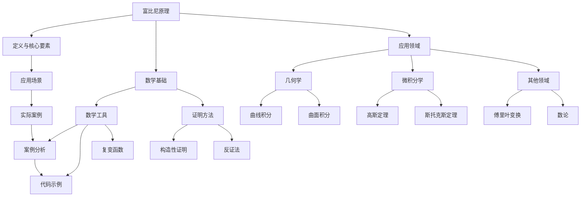

                 

### 1. 引言

富比尼原理是数学分析中的一个重要定理，它揭示了二重积分和双重积分之间的深层联系。这个原理不仅具有数学上的美感，还在许多实际问题中有着广泛的应用。本文旨在深入探讨富比尼原理的基本概念、数学基础、应用领域以及它在工程和科学中的重要性。

首先，我们将在第一部分介绍富比尼原理的基本概念，包括其定义、核心要素和应用场景。接下来，我们将探讨富比尼原理的数学基础，包括所需的数学工具和证明方法。然后，我们将展示富比尼原理在各种数学领域中的应用，如几何学、微积分学和其他数学领域。

在第二部分，我们将探讨如何像数学家一样思考，包括培养数学家的思维方式、解决实际问题的方法和工具。我们将通过实际案例展示这些方法的实践应用。接着，我们将探讨富比尼原理在工程和科学中的应用，以及其未来展望。

最后，我们将提供一个完整的附录，包括参考文献、推荐阅读、网络资源、数学家思考工具与方法以及实际案例与代码示例。本文将使用 Mermaid 流程图、伪代码、数学模型和公式，以及详细的举例说明，以确保内容清晰、易懂。

通过本文的阅读，读者将能够深入了解富比尼原理的内涵，掌握其应用方法，并能够将其应用于实际的工程和科学问题中。

### 2. 核心概念与联系

为了更好地理解富比尼原理，我们需要首先了解其核心概念和联系。以下是富比尼原理的 Mermaid 流程图，它展示了富比尼原理的基本组成部分和它们之间的关系。

在这张流程图中，我们可以看到富比尼原理的核心概念是如何相互联系的。下面是对各个组成部分的简要说明：

- **定义与核心要素**：这是富比尼原理的基础，它涉及二重积分和双重积分之间的关系。
- **应用场景**：这些是富比尼原理在数学和其他领域中的应用，包括几何学、微积分学和其他数学领域。
- **数学基础**：这部分包括富比尼原理所需的数学工具和证明方法，如集合论、线性代数和复变函数。
- **证明方法**：这些是证明富比尼原理的方法，包括构造性证明和反证法。

接下来，我们将进一步详细解释这些核心概念和联系。

#### **定义与核心要素**

富比尼原理（Fubini's Theorem）是一个关于多重积分的定理，它揭示了二重积分和双重积分之间的等价性。具体来说，如果函数 \( f(x, y) \) 在一个矩形区域 \( R \) 上可积，那么这个二重积分可以通过先对 \( x \) 积分，再对 \( y \) 积分，或者先对 \( y \) 积分，再对 \( x \) 积分，得到相同的结果。数学上，富比尼原理可以表述为：

$$
\int \int_R f(x, y) \, dA = \int_{a}^{b} \left( \int_{c}^{d} f(x, y) \, dy \right) dx = \int_{c}^{d} \left( \int_{a}^{b} f(x, y) \, dx \right) dy
$$

其中，\( R \) 是矩形区域，\( a, b, c, d \) 是 \( R \) 的边界。

#### **应用场景**

富比尼原理在多个数学领域中有着广泛的应用，包括几何学、微积分学和其他数学领域。以下是一些典型的应用场景：

- **几何学**：富比尼原理可以用于计算平面区域和空间立体的面积。例如，对于一个由两个函数 \( g(x) \) 和 \( h(x) \) 所围成的平面区域，其面积可以通过以下公式计算：

  $$
  Area = \int_{a}^{b} [h(x) - g(x)] \, dx
  $$

- **微积分学**：富比尼原理在计算二重积分和三重积分时非常有用。它允许我们将复杂的积分分解为更简单的积分，从而简化计算过程。例如，在计算流体力学中的流量时，富比尼原理可以帮助我们计算流体通过一个截面的流量。

- **其他数学领域**：富比尼原理在其他数学领域中也具有应用价值，如概率论、数论和代数学。例如，在概率论中，富比尼原理可以用于计算随机变量的分布函数。

#### **数学基础**

为了理解富比尼原理，我们需要了解一些基本的数学概念和工具，包括集合论、线性代数和复变函数。

- **集合论**：集合论是数学的基础，它涉及到集合的概念、运算和性质。在富比尼原理中，集合论用于定义二重积分和双重积分的区域。
- **线性代数**：线性代数涉及到向量、矩阵和线性方程组。在富比尼原理中，线性代数用于处理二重积分和双重积分的线性组合。
- **复变函数**：复变函数是研究复数函数的数学分支。在富比尼原理中，复变函数用于处理复变函数的积分。

#### **证明方法**

证明富比尼原理的方法包括构造性证明和反证法。构造性证明是一种通过构造一个明确的例子来证明某个命题的方法。在富比尼原理中，构造性证明可以通过构造一个函数 \( f(x, y) \)，并证明它在两种不同的积分方式下得到的积分值相等。

反证法是一种通过假设某个命题不成立，然后推导出一个矛盾来证明该命题成立的方法。在富比尼原理中，反证法可以通过假设 \( f(x, y) \) 在两种不同的积分方式下的积分值不相等，然后推导出一个矛盾，从而证明富比尼原理成立。

### 3. 数学基础

在深入探讨富比尼原理之前，我们需要了解一些基本的数学工具，这些工具对于理解富比尼原理及其应用至关重要。以下是富比尼原理所需的数学工具和证明方法：

#### **数学工具**

为了理解和应用富比尼原理，我们需要熟悉以下几个数学工具：

- **集合论**：集合论是现代数学的基础，它涉及到集合的概念、运算和性质。在富比尼原理中，集合论用于定义二重积分和双重积分的区域。

- **线性代数**：线性代数涉及到向量、矩阵和线性方程组。在富比尼原理中，线性代数用于处理二重积分和双重积分的线性组合。

- **复变函数**：复变函数是研究复数函数的数学分支。在富比尼原理中，复变函数用于处理复变函数的积分。

#### **证明方法**

证明富比尼原理的方法包括构造性证明和反证法。以下是这两种证明方法的简要介绍：

- **构造性证明**：构造性证明是一种通过构造一个明确的例子来证明某个命题的方法。在富比尼原理中，构造性证明可以通过构造一个函数 \( f(x, y) \)，并证明它在两种不同的积分方式下得到的积分值相等。

- **反证法**：反证法是一种通过假设某个命题不成立，然后推导出一个矛盾来证明该命题成立的方法。在富比尼原理中，反证法可以通过假设 \( f(x, y) \) 在两种不同的积分方式下的积分值不相等，然后推导出一个矛盾，从而证明富比尼原理成立。

#### **集合论**

集合论是数学的基础，它涉及到集合的概念、运算和性质。在富比尼原理中，集合论用于定义二重积分和双重积分的区域。以下是集合论中一些基本概念：

- **集合**：集合是由一些确定的元素组成的整体。例如，{1, 2, 3} 是一个集合，它包含三个元素：1, 2 和 3。

- **集合的运算**：集合的运算包括并集、交集和补集。例如，集合 A 和 B 的并集是包含 A 和 B 中所有元素的集合。

- **区域**：在积分学中，区域是一个用于定义积分范围的集合。在二重积分中，区域通常是一个矩形或曲线所围成的平面区域。

#### **线性代数**

线性代数涉及到向量、矩阵和线性方程组。在富比尼原理中，线性代数用于处理二重积分和双重积分的线性组合。以下是线性代数中一些基本概念：

- **向量**：向量是具有大小和方向的量。在富比尼原理中，向量用于表示二重积分的积分方向。

- **矩阵**：矩阵是一个由数字组成的矩形阵列。在富比尼原理中，矩阵用于表示二重积分的积分区域。

- **线性方程组**：线性方程组是由多个线性方程组成的系统。在富比尼原理中，线性方程组用于求解二重积分的积分值。

#### **复变函数**

复变函数是研究复数函数的数学分支。在富比尼原理中，复变函数用于处理复变函数的积分。以下是复变函数中一些基本概念：

- **复数**：复数是包含实部和虚部的数。例如，\( z = a + bi \) 是一个复数，其中 \( a \) 是实部，\( b \) 是虚部。

- **复变函数**：复变函数是定义在复数上的函数。例如，\( f(z) = z^2 \) 是一个复变函数。

- **积分**：在复变函数中，积分是计算函数在某条曲线上的积分。在富比尼原理中，复变函数的积分用于处理二重积分。

### 4. 富比尼原理的应用

富比尼原理在数学和工程科学中有着广泛的应用。以下将详细讨论其在几何学、微积分学和其它数学领域中的应用，并通过具体的例子来说明这些应用。

#### **几何学应用**

在几何学中，富比尼原理可以用于计算平面区域的面积和空间立体的体积。一个经典的例子是计算平面区域的面积。

**例子 1：计算平面区域的面积**

假设我们有一个平面区域 \( R \)，该区域由两个函数 \( g(x) \) 和 \( h(x) \) 所围成，其中 \( g(x) \leq y \leq h(x) \)，并且 \( x \) 在区间 \([a, b]\) 上变化。我们可以使用富比尼原理来计算这个区域 \( R \) 的面积。

根据富比尼原理，我们可以将面积计算公式写为：

$$
Area(R) = \int_{a}^{b} [h(x) - g(x)] \, dx
$$

具体来说，我们可以按照以下步骤来计算：

1. 确定函数 \( g(x) \) 和 \( h(x) \) 的表达式。
2. 将 \( h(x) \) 和 \( g(x) \) 的表达式代入上面的公式。
3. 计算积分，得到平面区域的面积。

例如，如果我们有 \( g(x) = x \) 和 \( h(x) = x^2 \)，那么我们可以计算区域 \( R \) 的面积如下：

$$
Area(R) = \int_{0}^{1} [x^2 - x] \, dx = \left[ \frac{x^3}{3} - \frac{x^2}{2} \right]_{0}^{1} = \frac{1}{3} - \frac{1}{2} = -\frac{1}{6}
$$

然而，由于面积不能是负数，我们需要取绝对值，所以最终的结果是：

$$
Area(R) = \frac{1}{6}
$$

**例子 2：计算空间立体的体积**

在三维空间中，富比尼原理也可以用于计算空间立体的体积。假设我们有一个由两个曲面 \( z = g(x, y) \) 和 \( z = h(x, y) \) 所围成的立体 \( V \)，其中 \( g(x, y) \leq z \leq h(x, y) \)，并且 \( (x, y) \) 在区域 \( R \) 上变化。我们可以使用富比尼原理来计算这个立体 \( V \) 的体积。

根据富比尼原理，我们可以将体积计算公式写为：

$$
Volume(V) = \int \int_R [h(x, y) - g(x, y)] \, dz \, dA
$$

其中，\( dA \) 是区域 \( R \) 上的面积元素，\( dz \) 是立体 \( V \) 上的高。

具体来说，我们可以按照以下步骤来计算：

1. 确定函数 \( g(x, y) \) 和 \( h(x, y) \) 的表达式。
2. 将 \( h(x, y) \) 和 \( g(x, y) \) 的表达式代入上面的公式。
3. 计算二重积分，得到空间立体的体积。

例如，如果我们有 \( g(x, y) = x + y \) 和 \( h(x, y) = x^2 + y^2 \)，那么我们可以计算立体 \( V \) 的体积如下：

$$
Volume(V) = \int \int_R [(x^2 + y^2) - (x + y)] \, dz \, dA
$$

由于 \( z \) 在 \( g(x, y) \) 和 \( h(x, y) \) 之间变化，我们可以将 \( dz \) 写为 \( dx \cdot dy \)。因此，我们可以将上面的公式写为：

$$
Volume(V) = \int \int_R [(x^2 + y^2) - (x + y)] \, dx \, dy
$$

计算这个二重积分，我们得到：

$$
Volume(V) = \int_{0}^{1} \int_{0}^{x} [(x^2 + y^2) - (x + y)] \, dy \, dx = \int_{0}^{1} \left[ x^2y + \frac{y^3}{3} - xy - \frac{y^2}{2} \right]_{0}^{x} \, dx
$$

$$
= \int_{0}^{1} \left( x^3 + \frac{x^3}{3} - x^2 - \frac{x^2}{2} \right) \, dx = \left[ \frac{x^4}{4} + \frac{x^4}{12} - \frac{x^3}{3} - \frac{x^3}{6} \right]_{0}^{1} = \frac{1}{4} + \frac{1}{12} - \frac{1}{3} - \frac{1}{6} = \frac{1}{6}
$$

所以，立体 \( V \) 的体积是 \( \frac{1}{6} \)。

#### **微积分学应用**

在微积分学中，富比尼原理可以用于计算函数的二重积分。一个典型的应用是计算函数的二重积分。

**例子 3：计算二重积分**

假设我们有一个函数 \( f(x, y) \) 在一个矩形区域 \( R \) 上定义，其中 \( R \) 是一个矩形区域。我们可以使用富比尼原理来计算这个函数的二重积分。

根据富比尼原理，我们可以将二重积分计算公式写为：

$$
\int \int_R f(x, y) \, dA = \int_{a}^{b} \left( \int_{c}^{d} f(x, y) \, dy \right) dx = \int_{c}^{d} \left( \int_{a}^{b} f(x, y) \, dx \right) dy
$$

具体来说，我们可以按照以下步骤来计算：

1. 确定函数 \( f(x, y) \) 的表达式。
2. 确定矩形区域 \( R \) 的边界 \( a, b, c, d \)。
3. 将 \( f(x, y) \) 和 \( R \) 的边界代入上面的公式。
4. 计算两个一重积分，得到二重积分的结果。

例如，如果我们有函数 \( f(x, y) = xy \) 在矩形区域 \( R \) 上，其中 \( R \) 的边界是 \( a = 0, b = 1, c = 0, d = 1 \)，那么我们可以计算这个二重积分如下：

$$
\int \int_R xy \, dA = \int_{0}^{1} \left( \int_{0}^{1} xy \, dy \right) dx = \int_{0}^{1} \left[ xy^2 \right]_{0}^{1} \, dx = \int_{0}^{1} x \, dx = \left[ \frac{x^2}{2} \right]_{0}^{1} = \frac{1}{2}
$$

所以，函数 \( f(x, y) = xy \) 在矩形区域 \( R \) 上的二重积分是 \( \frac{1}{2} \)。

#### **其他数学领域应用**

除了几何学和微积分学，富比尼原理在其他数学领域也有应用。例如，在概率论中，富比尼原理可以用于计算随机变量的分布函数。

**例子 4：计算概率分布函数**

假设我们有一个二维随机变量 \( (X, Y) \)，我们需要计算它的概率分布函数 \( P(X \leq x, Y \leq y) \)。我们可以使用富比尼原理来计算这个概率分布函数。

根据富比尼原理，我们可以将概率分布函数计算公式写为：

$$
P(X \leq x, Y \leq y) = \int_{-\infty}^{x} \int_{-\infty}^{y} f_{X,Y}(x', y') \, dx' \, dy'
$$

其中，\( f_{X,Y}(x', y') \) 是 \( (X, Y) \) 的联合概率密度函数。

具体来说，我们可以按照以下步骤来计算：

1. 确定联合概率密度函数 \( f_{X,Y}(x', y') \) 的表达式。
2. 将 \( f_{X,Y}(x', y') \) 代入上面的公式。
3. 计算两个一重积分，得到概率分布函数的结果。

例如，如果我们有 \( (X, Y) \) 的联合概率密度函数 \( f_{X,Y}(x', y') = e^{-(x'+y')} \)，那么我们可以计算它的概率分布函数如下：

$$
P(X \leq x, Y \leq y) = \int_{-\infty}^{x} \int_{-\infty}^{y} e^{-(x'+y')} \, dx' \, dy'
$$

首先，计算内层积分：

$$
\int_{-\infty}^{y} e^{-(x'+y')} \, dx' = \left[ -e^{-(x'+y')} \right]_{-\infty}^{y} = e^{-y'}
$$

然后，计算外层积分：

$$
P(X \leq x, Y \leq y) = \int_{-\infty}^{x} e^{-y'} \, dy' = \left[ -e^{-y'} \right]_{-\infty}^{x} = 1 - e^{-x}
$$

所以，二维随机变量 \( (X, Y) \) 的概率分布函数是 \( P(X \leq x, Y \leq y) = 1 - e^{-x} \)。

### 5. 富比尼原理与其他数学原理的联系

富比尼原理不仅在数学分析中有着重要的地位，而且在与其他数学原理的联系中也展现出了其广泛的应用。以下是富比尼原理与高斯定理、斯托克斯定理和傅里叶变换之间的联系。

#### **富比尼原理与高斯定理**

高斯定理（Gauss's Theorem）是电磁学中的一个基本定理，它描述了电场在闭合曲面上的通量与电荷分布之间的关系。而富比尼原理在高斯定理的证明中起到了关键作用。具体来说，高斯定理的数学表述如下：

$$
\oint_{S} \vec{E} \cdot d\vec{A} = \int_{V} \nabla \cdot \vec{E} \, dV
$$

其中，\( \vec{E} \) 是电场，\( S \) 是闭合曲面，\( V \) 是 \( S \) 所包围的体积，\( \nabla \cdot \vec{E} \) 是电场的散度。

富比尼原理可以帮助我们将三重积分分解为两个双重积分，从而简化高斯定理的证明。例如，我们可以将三重积分写为：

$$
\int_{V} \nabla \cdot \vec{E} \, dV = \int_{V} \left( \frac{\partial E_x}{\partial x} + \frac{\partial E_y}{\partial y} + \frac{\partial E_z}{\partial z} \right) dV
$$

通过富比尼原理，我们可以将这个三重积分分解为：

$$
\int_{V} \nabla \cdot \vec{E} \, dV = \int_{V} \left( \frac{\partial E_x}{\partial x} + \frac{\partial E_y}{\partial y} + \frac{\partial E_z}{\partial z} \right) \left( dx \, dy \, dz \right)
$$

$$
= \int_{x} \int_{y} \int_{z} \left( \frac{\partial E_x}{\partial x} + \frac{\partial E_y}{\partial y} + \frac{\partial E_z}{\partial z} \right) dx \, dy \, dz
$$

通过这样的分解，我们可以更容易地理解高斯定理的物理意义，并且在解决实际问题时提供了一种更加灵活的方法。

#### **富比尼原理与斯托克斯定理**

斯托克斯定理（Stoke's Theorem）是向量分析中的一个基本定理，它描述了矢量场的旋度在闭合曲线上的线积分与矢量场在该闭合曲面上的通量之间的关系。斯托克斯定理的数学表述如下：

$$
\oint_{C} \vec{F} \cdot d\vec{r} = \int_{S} (\nabla \times \vec{F}) \cdot d\vec{A}
$$

其中，\( \vec{F} \) 是矢量场，\( C \) 是闭合曲线，\( S \) 是 \( C \) 所包围的曲面，\( \nabla \times \vec{F} \) 是矢量场的旋度。

富比尼原理同样在高斯定理的证明中发挥了作用。例如，我们可以将斯托克斯定理的线积分写为：

$$
\oint_{C} \vec{F} \cdot d\vec{r} = \int_{C} F_x \, dy \, dz + F_y \, dz \, dx + F_z \, dx \, dy
$$

通过富比尼原理，我们可以将这个线积分分解为两个双重积分：

$$
\oint_{C} \vec{F} \cdot d\vec{r} = \int_{x} \int_{y} F_x \, dy \, dz + F_y \, dz \, dx + F_z \, dx \, dy
$$

这样，我们可以更容易地处理复杂的矢量场问题，并且将问题简化为更容易处理的积分形式。

#### **富比尼原理与傅里叶变换**

傅里叶变换（Fourier Transform）是信号处理中的一个基本工具，它可以将时域信号转换为频域信号。傅里叶变换的数学表述如下：

$$
\mathcal{F}\{f(t)\} = \int_{-\infty}^{\infty} f(t) e^{-j \omega t} \, dt = F(\omega)
$$

其中，\( f(t) \) 是时域信号，\( F(\omega) \) 是频域信号，\( \omega \) 是角频率。

富比尼原理在傅里叶变换的推导中也起到了关键作用。例如，我们可以将傅里叶变换写为：

$$
F(\omega) = \int_{-\infty}^{\infty} f(t) e^{-j \omega t} \, dt
$$

通过富比尼原理，我们可以将这个积分分解为两个一重积分：

$$
F(\omega) = \int_{-\infty}^{\infty} f(t) \left( \int_{-\infty}^{\infty} e^{-j \omega t} \, dt \right) d\omega
$$

通过这样的分解，我们可以更容易地理解傅里叶变换的物理意义，并且在实际应用中提供了一种更加有效的方法。

### 6. 像数学家一样思考

数学家的思维方式是一种独特而高效的方法，它不仅能够解决复杂的数学问题，还能帮助我们更好地理解世界。以下是一些数学家思维方式的特点、培养方法和实际应用案例。

#### **数学家思维方式的特点**

1. **抽象思维**：数学家能够从具体事物中抽象出数学模型，从而将复杂问题简化。这种抽象能力使得数学家能够用简洁的数学语言描述复杂的现象。

2. **逻辑推理**：数学家注重逻辑推理，他们通过严格的推理过程来证明数学命题的正确性。这种逻辑思维使得数学家能够发现新的数学规律。

3. **问题解决**：数学家擅长将问题分解为更小的部分，然后逐一解决。这种方法不仅能够简化问题，还能提高解决问题的效率。

4. **创造力**：数学家具有丰富的创造力，他们能够提出新的问题和解决方法，推动数学的发展。

5. **批判性思维**：数学家善于批判性思维，他们不仅能够接受他人的观点，还能从中发现潜在的错误。这种思维习惯使得数学家能够不断改进数学理论。

#### **培养数学家思维方式的方法**

1. **阅读经典数学文献**：通过阅读经典的数学文献，我们可以了解数学家是如何思考和解决问题的。这些文献不仅包括数学理论，还包含了许多实际问题的解决方案。

2. **解决数学问题**：解决数学问题是培养数学家思维方式的最佳方法。通过不断解决各种难度的问题，我们可以提高自己的逻辑推理和抽象思维能力。

3. **学习数学方法论**：数学方法论是一门研究数学问题的解决方法和技巧的学科。通过学习数学方法论，我们可以掌握一些高效的解题技巧。

4. **参与数学竞赛**：数学竞赛是一种很好的锻炼数学思维能力的方式。通过竞赛，我们可以学习如何快速解决复杂问题，并且与其他数学爱好者交流心得。

5. **培养批判性思维**：批判性思维是一种重要的思维方式，它能够帮助我们评估他人的观点，并发现潜在的错误。通过阅读和分析他人的数学论文，我们可以培养批判性思维。

#### **实际应用案例**

**案例 1：线性规划问题**

线性规划是一种常用的优化方法，它用于在满足一定约束条件下寻找最优解。一个典型的线性规划问题是求解线性目标函数的最小值或最大值。

假设我们有一个线性规划问题：

$$
\min \quad c^T x
$$

$$
\text{s.t.} \quad Ax \leq b
$$

$$
x \geq 0
$$

其中，\( c \) 是系数向量，\( x \) 是变量向量，\( A \) 是约束矩阵，\( b \) 是约束向量。

通过线性规划，我们可以找到最优解 \( x^* \)，使得目标函数 \( c^T x^* \) 最小。

**解决方案**：

1. **抽象思维**：我们将实际问题抽象为一个数学模型，即线性规划问题。

2. **逻辑推理**：通过引入拉格朗日乘子法，我们可以将线性规划问题转化为一个更简单的形式。

3. **问题解决**：通过求解这个新的数学模型，我们可以找到最优解。

4. **创造力**：我们可以提出新的优化算法，如单纯形法或内点法，来求解线性规划问题。

5. **批判性思维**：我们可以评估这些新算法的效率和适用范围，从而改进线性规划方法。

**案例 2：信号处理问题**

在信号处理中，傅里叶变换是一种重要的工具，它用于将时域信号转换为频域信号。一个典型的信号处理问题是求解信号的频谱。

假设我们有一个时域信号 \( f(t) \)，我们需要求解其频谱 \( F(\omega) \)。

**解决方案**：

1. **抽象思维**：我们将时域信号抽象为傅里叶变换的数学模型。

2. **逻辑推理**：通过傅里叶变换的定义，我们可以将时域信号转换为频域信号。

3. **问题解决**：通过计算傅里叶变换，我们可以得到信号的频谱。

4. **创造力**：我们可以提出新的傅里叶变换方法，如快速傅里叶变换（FFT），来提高计算效率。

5. **批判性思维**：我们可以评估这些新方法的性能，并选择最适合的方法来解决实际问题。

通过这些实际案例，我们可以看到数学家思维方式在解决实际问题中的应用。这些思维方式不仅能够帮助我们解决数学问题，还能在工程、科学和计算机科学等领域发挥重要作用。

### 7. 数学家解决实际问题的方法

数学家在解决实际问题时，通常会遵循一系列系统化的步骤和方法。以下是一个典型的数学家解决实际问题的过程，包括所需的工具和技巧：

#### **问题定义**

1. **明确问题**：首先，数学家需要明确问题的性质和目标。这包括了解问题的背景、目的和需要解决的关键问题。
2. **收集信息**：接下来，数学家会收集与问题相关的信息，这可能包括文献、数据、实验结果等。

#### **问题建模**

1. **构建模型**：数学家会将实际问题转化为数学模型。这个过程需要抽象思维和创造力，将复杂问题简化为数学表达式。
2. **选择数学工具**：根据问题的性质，数学家会选择合适的数学工具和方法，如集合论、线性代数、微积分、概率论等。

#### **数学推导**

1. **逻辑推理**：数学家会使用逻辑推理和证明方法来推导数学模型。这可能包括构造性证明、反证法、归纳法等。
2. **公式化**：将推导过程转化为数学公式和定理，确保结论的准确性和可重复性。

#### **解决方案验证**

1. **验证假设**：数学家会检查构建的数学模型是否满足原始问题的所有条件。
2. **测试模型**：使用实验数据或模拟结果来验证数学模型的正确性。
3. **误差分析**：评估模型预测与实际结果之间的差异，分析可能导致误差的原因。

#### **实施策略**

1. **设计算法**：根据数学模型，设计解决实际问题的算法或方法。
2. **编写代码**：将算法转化为可执行的代码，通常使用编程语言如Python、C++或MATLAB。
3. **调试与优化**：对代码进行调试和优化，提高算法的效率和可靠性。

#### **工具与方法**

- **符号计算软件**：如Mathematica、Maple等，用于数学推导和符号计算。
- **数据可视化工具**：如Matplotlib、Seaborn等，用于分析和可视化数据。
- **编程语言**：如Python、C++等，用于实现算法和进行计算。
- **模型评估工具**：如R Squared、交叉验证等，用于评估模型的性能。

#### **实际案例分析**

**案例 1：流体力学中的流量计算**

**问题定义**：我们需要计算流体通过一个矩形截面的流量。

**问题建模**：

1. **构建模型**：假设流体速度分布为 \( v(x, y) \)，流量 \( Q \) 可以表示为：

   $$
   Q = \int_{-a}^{a} \left( \int_{-b}^{b} v(x, y) \, dy \right) dx
   $$

2. **选择数学工具**：使用积分和微积分方法。

**数学推导**：

1. **积分推导**：对 \( v(x, y) \) 进行积分，得到流量 \( Q \)。

2

