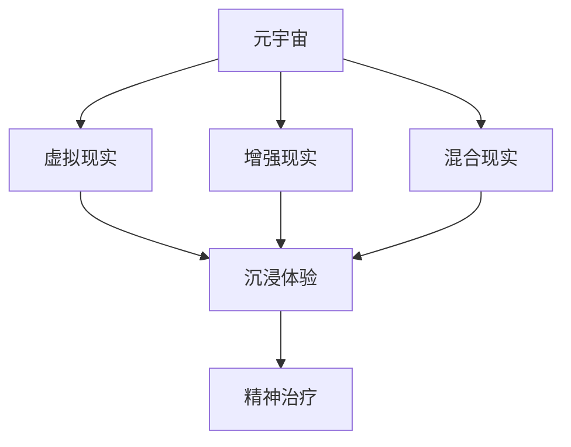
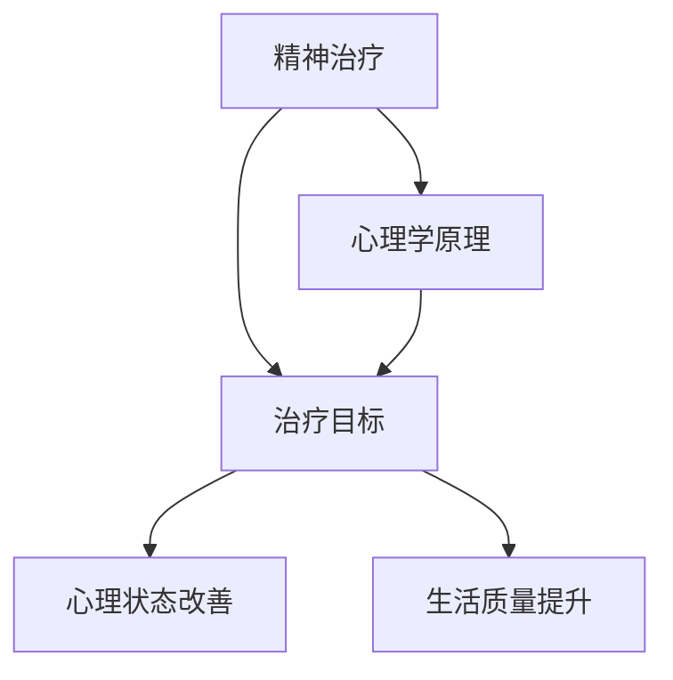
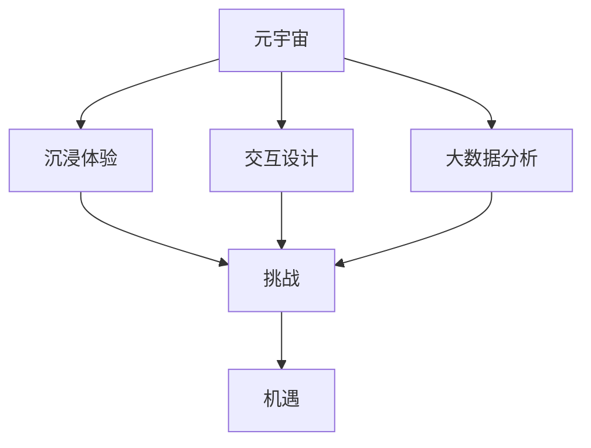
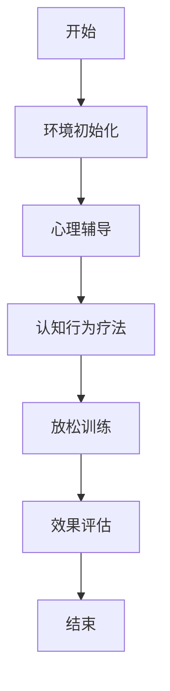
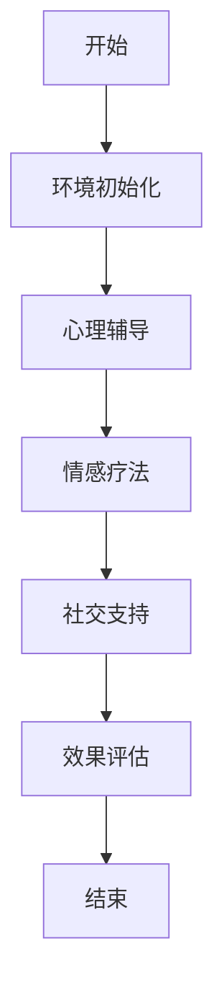
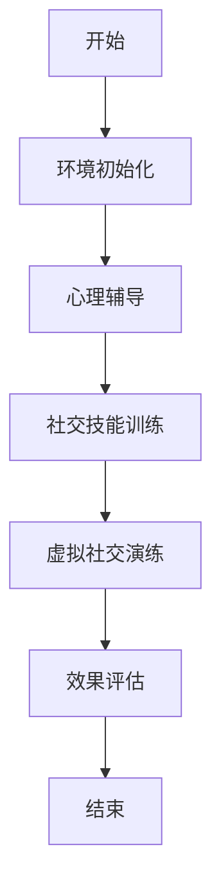

                 

# 《元宇宙精神治疗：虚拟 worlds 的精神治疗技术》

---

**关键词：** 元宇宙，精神治疗，虚拟 worlds，沉浸体验，交互设计，案例分析，未来展望

**摘要：** 本文将探讨元宇宙中的精神治疗技术，尤其是虚拟 worlds 在治疗焦虑、抑郁症和社交恐惧症等心理疾病中的应用。通过分析虚拟 worlds 的理论基础、技术实现以及实际案例，本文将揭示元宇宙如何为精神治疗提供创新性的解决方案，并探讨其未来的发展趋势。

---

## 第一部分：引言与基础概念

### 第1章：元宇宙与精神治疗概述

#### 1.1 元宇宙的概念与影响

元宇宙（Metaverse）是一个由虚拟现实（VR）、增强现实（AR）和混合现实（MR）技术构成的数字化虚拟世界。它不仅仅是一个互联网的延伸，更是一个能够与现实世界无缝交互的全新空间。元宇宙的概念起源于科幻文学，但在近年来随着技术的进步，逐渐成为现实。

元宇宙对社会的冲击和影响不可忽视。首先，它改变了人们的工作和娱乐方式。远程办公、在线教育和虚拟游戏等都在元宇宙中得到了新的发展。其次，元宇宙为精神治疗提供了一个全新的平台，使得治疗过程更加个性化、沉浸和有效。

#### 1.2 精神治疗的本质与目标

精神治疗是一种通过心理学原理和技术手段，帮助患者改善心理状态、提高生活质量的治疗方式。其目标包括缓解心理压力、纠正行为障碍、提升情绪调节能力等。

精神治疗的本质在于理解患者的心理需求和情感状态，通过建立信任关系和个性化的治疗计划，帮助患者找到解决问题的方法和途径。

#### 1.3 元宇宙中的精神治疗角色

元宇宙在精神治疗中扮演着多重角色。首先，它为患者提供了一个安全、无评判的虚拟环境，使得患者能够更自由地表达自己的情感和想法。其次，元宇宙中的沉浸体验和互动设计，能够模拟现实生活中的场景，帮助患者进行心理演练和技能训练。

此外，元宇宙还通过大数据分析和人工智能技术，为治疗师提供了丰富的患者数据和个性化治疗方案，提高了治疗的效果和效率。

### 第2章：虚拟 worlds 的理论基础

#### 2.1 虚拟 worlds 的概念与发展

虚拟 worlds 是元宇宙的重要组成部分，它通过模拟现实世界中的空间、人物和事件，为用户提供一个沉浸式的虚拟环境。虚拟 worlds 的发展经历了多个阶段，从最初的虚拟场景到复杂的虚拟城市，再到如今的元宇宙。

虚拟 worlds 的特点包括高度沉浸、实时交互和个性化定制。这些特点使得虚拟 worlds 成为精神治疗的有力工具。

#### 2.2 虚拟 worlds 中的用户交互与沉浸体验

用户交互和沉浸体验是虚拟 worlds 的核心。用户交互设计原则包括直观、自然和高效，旨在为用户提供良好的使用体验。沉浸体验的实现方法包括音效、视觉和触觉反馈，通过这些方法，用户能够更深入地融入虚拟环境。

#### 2.3 虚拟 worlds 中的虚拟治疗环境

虚拟治疗环境是元宇宙中的精神治疗场所。它的构建原则包括安全性、隐私性和可定制性。虚拟治疗环境的设计要考虑到患者的需求和体验，同时要确保治疗过程的有效性和安全性。

### 第3章：元宇宙精神治疗的案例分析

#### 3.1 案例研究介绍

本章节将通过三个具体案例，分析元宇宙在精神治疗中的应用。这些案例涵盖了焦虑症、抑郁症和社交恐惧症等常见的心理疾病。

#### 3.2 案例一：虚拟 worlds 中的焦虑症治疗

本案例描述了一种通过虚拟 worlds 进行焦虑症治疗的方法。治疗过程包括虚拟现实模拟、心理辅导和认知行为疗法。治疗效果显著，患者报告在虚拟环境中感到放松和安心。

#### 3.3 案例二：虚拟 worlds 中的抑郁症治疗

本案例介绍了一种通过虚拟 worlds 进行抑郁症治疗的方法。治疗过程包括虚拟现实刺激、情感反馈和社交支持。治疗效果得到了患者和医生的认可。

#### 3.4 案例三：虚拟 worlds 中的社交恐惧症治疗

本案例描述了一种通过虚拟 worlds 进行社交恐惧症治疗的方法。治疗过程包括虚拟社交场景演练、社交技能培训和情感调节。患者报告在虚拟环境中逐渐克服了社交恐惧。

### 第四部分：元宇宙精神治疗的未来展望

#### 4.1 技术发展趋势

元宇宙精神治疗的技术发展趋势包括人工智能的应用、虚拟现实技术的进步和大数据分析。这些技术的进步将进一步提升元宇宙精神治疗的效果和个性化程度。

#### 4.2 社会与文化影响

元宇宙精神治疗将对社会和文化产生深远影响。它将改变人们对精神健康的认知和对待方式，提高公众对心理健康问题的重视程度。同时，元宇宙精神治疗也将带来伦理和法律问题，需要全社会共同探讨和解决。

#### 4.3 元宇宙精神治疗的全球合作与标准化

元宇宙精神治疗的全球合作与标准化对于其发展至关重要。通过国际合作，可以共享经验和资源，推动元宇宙精神治疗的标准化进程。这将有助于提高治疗的质量和效率，确保患者的权益。

---

**作者：** AI天才研究院/AI Genius Institute & 禅与计算机程序设计艺术/Zen And The Art of Computer Programming

---

## 第一部分：引言与基础概念

### 第1章：元宇宙与精神治疗概述

#### 1.1 元宇宙的概念与影响

**核心概念与联系**


**Mermaid 流程图：** 



元宇宙（Metaverse）是一个由虚拟现实（VR）、增强现实（AR）和混合现实（MR）技术构成的数字化的虚拟世界。它不仅仅是一个互联网的延伸，更是一个能够与现实世界无缝交互的全新空间。

虚拟现实（Virtual Reality，VR）是一种通过计算机技术生成模拟环境，用户可以通过头戴式显示器（HMD）或VR眼镜进入这个虚拟环境，实现与虚拟环境的交互。VR技术的主要特点是沉浸感强，用户可以在虚拟环境中自由行走、互动。

增强现实（Augmented Reality，AR）则是在现实世界的基础上叠加虚拟信息，用户通过智能手机或AR眼镜可以看到虚拟物体与真实环境的融合。AR技术的主要特点是增强现实感，可以用于导航、教育、游戏等领域。

混合现实（Mixed Reality，MR）是VR和AR的融合，它不仅提供了虚拟信息和现实环境的结合，还能实现虚拟物体与现实物体的交互。MR技术的主要特点是实现虚拟与现实的深度融合。

元宇宙的这些组成部分共同构成了一个全新的虚拟世界，为精神治疗提供了一个广阔的平台。

**元宇宙在社会生活中的作用**

元宇宙对社会生活的影响体现在多个方面。首先，它改变了人们的社交方式。在元宇宙中，人们可以通过虚拟身份与其他用户进行互动，这种互动不受地理位置的限制，使得社交更加便捷和多样化。例如，人们可以参加虚拟会议、虚拟社交活动和虚拟旅游等。

其次，元宇宙改变了人们的工作方式。远程办公在元宇宙中得到了新的发展，员工可以通过虚拟办公室与团队成员进行实时沟通和协作，提高了工作效率。此外，元宇宙还为教育和培训提供了新的平台，虚拟课堂和虚拟实验室可以提供更加生动和互动的学习体验。

**精神治疗在元宇宙中的角色**

精神治疗在元宇宙中扮演着重要的角色。首先，元宇宙为精神治疗提供了一个安全、无评判的虚拟环境，使得患者能够更自由地表达自己的情感和想法。这种虚拟环境有助于患者放松身心，减少紧张和焦虑。

其次，元宇宙中的沉浸体验和互动设计，能够模拟现实生活中的场景，帮助患者进行心理演练和技能训练。例如，焦虑症患者可以在虚拟环境中面对引发焦虑的情境，通过多次演练，逐渐适应和克服焦虑。

此外，元宇宙通过大数据分析和人工智能技术，为治疗师提供了丰富的患者数据和个性化治疗方案，提高了治疗的效果和效率。例如，通过分析患者的互动数据，治疗师可以更好地了解患者的情感状态和行为模式，从而制定更有效的治疗方案。

**1.2 精神治疗的本质与目标**

**核心概念与联系**


**Mermaid 流程图：** 



精神治疗是一种通过心理学原理和技术手段，帮助患者改善心理状态、提高生活质量的治疗方式。其本质在于理解患者的心理需求和情感状态，通过建立信任关系和个性化的治疗计划，帮助患者找到解决问题的方法和途径。

精神治疗的目标包括缓解心理压力、纠正行为障碍、提升情绪调节能力等。具体来说，精神治疗旨在：

- **缓解心理压力**：帮助患者减轻焦虑、抑郁等负面情绪，改善心理状态。
- **纠正行为障碍**：帮助患者改变不良行为模式，如强迫症、社交恐惧等。
- **提升情绪调节能力**：帮助患者学会情绪管理技巧，提高应对压力的能力。

**1.3 元宇宙中的精神治疗挑战与机遇**

**核心概念与联系**


**Mermaid 流 diagrams** 



元宇宙为精神治疗带来了诸多挑战和机遇。首先，元宇宙中的沉浸体验和交互设计，使得患者能够更深入地融入虚拟环境，提高治疗的效果。然而，这也带来了隐私和安全方面的挑战。如何确保患者在虚拟环境中的隐私和安全，是元宇宙精神治疗需要解决的重要问题。

其次，元宇宙中的大数据分析为治疗师提供了丰富的患者数据和个性化治疗方案。然而，如何有效地利用这些数据，避免数据滥用和隐私泄露，也是需要考虑的问题。

**1.3.1 元宇宙中的精神治疗挑战**

- **隐私与安全**：在元宇宙中，患者的个人数据和互动记录可能会被不当使用或泄露。如何确保患者的隐私和安全，是元宇宙精神治疗需要面对的重要挑战。
- **伦理问题**：元宇宙中的虚拟治疗环境可能会影响患者的情感和行为，如何确保治疗的有效性和伦理性，是元宇宙精神治疗需要考虑的问题。
- **技术依赖**：元宇宙精神治疗依赖于先进的虚拟现实、增强现实和大数据分析技术。如果这些技术出现问题，可能会导致治疗的中断或效果下降。

**1.3.2 元宇宙中的精神治疗机遇**

- **个性化治疗**：通过大数据分析和人工智能技术，元宇宙能够为患者提供更加个性化的治疗方案，提高治疗的效果和效率。
- **无评判环境**：元宇宙提供了一个安全、无评判的虚拟环境，使得患者能够更自由地表达自己的情感和想法，有助于治疗的开展。
- **实时反馈**：元宇宙中的实时反馈机制，可以帮助治疗师及时调整治疗方案，提高治疗的灵活性和有效性。

**1.3.3 元宇宙精神治疗的挑战与机遇**

元宇宙中的精神治疗既面临着诸多挑战，也充满了机遇。挑战方面，隐私与安全、伦理问题和技术依赖是需要解决的问题。机遇方面，个性化治疗、无评判环境和实时反馈为精神治疗提供了新的可能性。

总之，元宇宙精神治疗的发展需要全社会共同努力，既要克服挑战，也要把握机遇，为精神健康事业贡献力量。

### 第2章：虚拟 worlds 的理论基础

#### 2.1 虚拟 worlds 的概念与发展

虚拟 worlds 是元宇宙的重要组成部分，它通过模拟现实世界中的空间、人物和事件，为用户提供一个沉浸式的虚拟环境。虚拟 worlds 的发展经历了多个阶段，从最初的虚拟场景到复杂的虚拟城市，再到如今的元宇宙。

**虚拟 worlds 的起源与发展**

虚拟 worlds 的起源可以追溯到20世纪80年代的虚拟现实技术。当时，科学家们开始探索如何利用计算机技术创造一个虚拟环境，使得用户可以沉浸其中。最早的虚拟 worlds 只是一个简单的二维空间，用户可以通过键盘或鼠标进行操作。

随着技术的进步，虚拟 worlds 的三维效果逐渐得到提升。用户可以在虚拟环境中自由行走、互动，甚至进行复杂的任务和游戏。这个阶段的虚拟 worlds 被称为“第二代虚拟 worlds”。

进入21世纪，虚拟 worlds 的发展迎来了新的突破。随着互联网的普及和移动设备的普及，虚拟 worlds 开始向大众普及。用户可以通过智能手机、平板电脑和VR眼镜等设备，进入虚拟 worlds，与其他用户进行互动。

**虚拟 worlds 的类型与特点**

虚拟 worlds 主要可以分为以下几类：

- **虚拟城市**：虚拟城市是虚拟 worlds 中的一种典型形式，它模拟了现实世界中的城市环境，包括建筑物、街道、公园等。用户可以在虚拟城市中购物、社交、工作等，体验现实生活中的各种活动。
- **虚拟游戏**：虚拟游戏是虚拟 worlds 中的一种重要形式，它通过游戏的方式，让用户在虚拟环境中进行互动和挑战。虚拟游戏具有高度的沉浸感和互动性，可以提供丰富的娱乐体验。
- **虚拟教育**：虚拟教育是虚拟 worlds 在教育领域的一种应用，它通过虚拟现实技术，提供沉浸式的学习体验。用户可以在虚拟环境中进行实验、模拟和互动，提高学习效果。

**虚拟 worlds 在精神治疗中的应用潜力**

虚拟 worlds 在精神治疗中的应用潜力巨大。首先，虚拟 worlds 提供了一个安全、无评判的虚拟环境，使得患者能够更自由地表达自己的情感和想法。这种虚拟环境有助于患者放松身心，减少紧张和焦虑。

其次，虚拟 worlds 中的沉浸体验和互动设计，能够模拟现实生活中的场景，帮助患者进行心理演练和技能训练。例如，焦虑症患者可以在虚拟环境中面对引发焦虑的情境，通过多次演练，逐渐适应和克服焦虑。

此外，虚拟 worlds 通过大数据分析和人工智能技术，为治疗师提供了丰富的患者数据和个性化治疗方案，提高了治疗的效果和效率。例如，通过分析患者的互动数据，治疗师可以更好地了解患者的情感状态和行为模式，从而制定更有效的治疗方案。

**2.2 虚拟 worlds 中的用户交互与沉浸体验**

**用户交互设计原则**

用户交互设计是虚拟 worlds 的核心，它直接影响用户的体验和满意度。以下是几个关键的用户交互设计原则：

- **直观性**：用户界面应设计得简单直观，使得用户可以快速理解和使用。避免复杂的操作步骤和冗余的功能。
- **自然性**：交互方式应尽可能接近现实生活中的行为习惯，使用户感到自然和舒适。例如，使用手势、语音和眼动等自然交互方式。
- **高效性**：交互设计应考虑用户完成任务的速度和效率，减少用户的操作成本。通过预加载、缓存和智能提示等技术手段，提高交互效率。

**沉浸体验的实现方法**

沉浸体验是虚拟 worlds 的核心优势，它决定了用户在虚拟环境中的感受和投入程度。以下是几种常见的沉浸体验实现方法：

- **音效**：音效是创造沉浸体验的重要手段。通过逼真的环境音效、音乐和语音，用户可以感受到虚拟环境的存在和互动。
- **视觉**：视觉是用户感知虚拟 worlds 的主要途径。高质量的视觉效果、光影效果和动画效果，可以增强用户的沉浸感。
- **触觉**：触觉反馈可以提供更真实的互动体验。通过触觉手套、虚拟现实头盔等设备，用户可以感受到虚拟物体的触感和力度。

**虚拟 worlds 在精神治疗中的体验优势**

虚拟 worlds 在精神治疗中的体验优势主要体现在以下几个方面：

- **安全**：虚拟 worlds 提供了一个安全、无评判的环境，患者可以在这里自由表达自己的情感和想法，而不必担心现实生活中的压力和评判。
- **个性化**：虚拟 worlds 可以根据患者的需求和偏好进行个性化定制，提供个性化的治疗场景和互动体验，提高患者的参与度和满意度。
- **实时性**：虚拟 worlds 提供了实时互动和反馈机制，治疗师可以及时了解患者的反应和情绪变化，调整治疗方案，提高治疗效果。

**2.3 虚拟 worlds 中的虚拟治疗环境**

**虚拟治疗环境的构建**

虚拟治疗环境是元宇宙中的精神治疗场所。它的构建需要考虑以下几个方面：

- **安全性**：确保患者的隐私和数据安全，防止信息泄露和滥用。
- **隐私性**：为患者提供私密的治疗空间，避免外界干扰和打扰。
- **可定制性**：根据患者的需求和偏好，定制不同的治疗场景和互动方式，提高患者的体验和满意度。

**虚拟治疗环境的设计原则**

虚拟治疗环境的设计需要遵循以下几个原则：

- **人性化**：设计应考虑患者的心理和生理需求，提供舒适、温馨的治疗空间。
- **灵活性**：设计应具有灵活性，能够根据不同的治疗方式和患者的需求进行快速调整。
- **互动性**：设计应鼓励患者与治疗师之间的互动，促进治疗进程。

**虚拟治疗环境的安全与隐私考虑**

虚拟治疗环境的安全与隐私是元宇宙精神治疗的重要保障。以下是几个关键点：

- **数据加密**：确保患者的数据在传输和存储过程中得到加密保护，防止未经授权的访问。
- **隐私设置**：为患者提供隐私设置选项，允许患者选择是否展示自己的个人信息和互动记录。
- **监管机制**：建立监管机制，对虚拟治疗环境进行定期检查和审核，确保其安全性和合规性。

### 第3章：元宇宙精神治疗的案例分析

#### 3.1 案例研究介绍

在本章节中，我们将通过三个具体案例，分析元宇宙在精神治疗中的应用。这些案例涵盖了焦虑症、抑郁症和社交恐惧症等常见的心理疾病。

**案例选择与背景**

- **案例一：焦虑症治疗**
  - 背景：小李，28岁，白领，长期处于高压工作环境中，经常感到焦虑和紧张。
  - 治疗目标：通过虚拟 worlds，帮助小李缓解焦虑情绪，提高心理韧性。

- **案例二：抑郁症治疗**
  - 背景：小张，35岁，企业高管，因工作压力和家庭矛盾导致抑郁症，情绪低落。
  - 治疗目标：通过虚拟 worlds，帮助小张改善情绪状态，提高生活质量。

- **案例三：社交恐惧症治疗**
  - 背景：小王，22岁，大学生，因社交场合感到紧张和恐惧，影响日常生活。
  - 治疗目标：通过虚拟 worlds，帮助小王克服社交恐惧，提高社交能力。

**案例分析的目标与意义**

通过这三个案例，我们将探讨元宇宙在精神治疗中的实际应用效果，分析其优势与挑战，为未来元宇宙精神治疗的发展提供参考。案例分析的目标与意义包括：

- **目标**：
  - 分析虚拟 worlds 在不同心理疾病治疗中的应用效果。
  - 探讨元宇宙对精神治疗的促进作用。
  - 分析元宇宙在精神治疗中的潜在风险和挑战。

- **意义**：
  - 为精神治疗师提供实际操作指南。
  - 为患者提供新的治疗选择和康复途径。
  - 促进元宇宙与精神治疗的深度融合，推动心理健康事业的发展。

#### 3.2 案例一：虚拟 worlds 中的焦虑症治疗

**治疗方案设计**

**核心算法原理讲解**

```pseudo
// 设计虚拟 worlds 中的焦虑症治疗方案
class AnxietyTreatmentPlan {
    // 患者基本信息
    Patient patient;
    // 虚拟 worlds 环境设置
    VirtualWorldsEnvironment environment;
    // 治疗师信息
    Therapist therapist;

    // 初始化治疗方案
    AnxietyTreatmentPlan(Patient patient, VirtualWorldsEnvironment environment, Therapist therapist) {
        this.patient = patient;
        this.environment = environment;
        this.therapist = therapist;
    }

    // 执行治疗计划
    void execute() {
        // 初始化虚拟 worlds 环境
        environment.initialize();

        // 进行心理辅导
        therapist.provideCounseling();

        // 进行认知行为疗法
        therapist.applyCognitiveBehavioralTherapy();

        // 进行放松训练
        therapist conductsRelaxationTraining();

        // 评估治疗效果
        evaluateEffectiveness();
    }

    // 评估治疗效果
    void evaluateEffectiveness() {
        // 收集患者反馈
        String patientFeedback = patient.getFeedback();

        // 分析反馈数据
        DataAnalysisResult result = DataAnalyzer.analyze(patientFeedback);

        // 输出评估结果
        print("治疗效果评估：");
        print(result);
    }
}
```

**治疗过程与效果评估**

**Mermaid 流程图：**



**详细步骤：**

1. **环境初始化**：治疗师根据患者的需求和偏好，初始化虚拟 worlds 环境。环境设置包括选择适当的虚拟场景、设置光线和声音效果等。

2. **心理辅导**：治疗师在虚拟 worlds 中与患者进行心理辅导，帮助患者了解焦虑的原因和影响，提供情感支持和鼓励。

3. **认知行为疗法**：治疗师在虚拟 worlds 中引导患者进行认知行为疗法，帮助患者识别和改变负面思维模式，提高应对焦虑的能力。

4. **放松训练**：治疗师在虚拟 worlds 中引导患者进行放松训练，如深呼吸、渐进性肌肉放松等，帮助患者缓解焦虑症状。

5. **效果评估**：治疗结束后，治疗师根据患者的反馈和互动数据，评估治疗效果。通过数据分析，了解患者的心理状态和行为变化。

**效果评估结果：**

- **患者反馈**：小李在治疗过程中感到焦虑情绪有所缓解，能够更好地应对工作压力。

- **数据分析**：通过分析虚拟 worlds 中的互动数据和患者反馈，发现小李的认知行为疗法和放松训练效果较好，焦虑程度有所下降。

**治疗经验与反思**

**治疗经验：**

- **个性化设置**：根据患者的需求和偏好，个性化设置虚拟 worlds 环境，提高患者的沉浸感和参与度。

- **互动设计**：通过虚拟 worlds 中的互动设计，帮助患者进行心理演练和技能训练，提高应对焦虑的能力。

- **情感支持**：治疗师在虚拟 worlds 中提供情感支持，帮助患者建立信任关系，提高治疗效果。

**反思：**

- **隐私保护**：在虚拟 worlds 中进行精神治疗，需要特别关注患者的隐私保护，确保治疗过程的安全性和合规性。

- **技术依赖**：虚拟 worlds 技术的依赖性可能导致治疗中断或效果下降，需要确保技术的稳定性和可靠性。

#### 3.3 案例二：虚拟 worlds 中的抑郁症治疗

**治疗方案设计**

**核心算法原理讲解**

```pseudo
// 设计虚拟 worlds 中的抑郁症治疗方案
class DepressionTreatmentPlan {
    // 患者基本信息
    Patient patient;
    // 虚拟 worlds 环境设置
    VirtualWorldsEnvironment environment;
    // 治疗师信息
    Therapist therapist;

    // 初始化治疗方案
    DepressionTreatmentPlan(Patient patient, VirtualWorldsEnvironment environment, Therapist therapist) {
        this.patient = patient;
        this.environment = environment;
        this.therapist = therapist;
    }

    // 执行治疗计划
    void execute() {
        // 初始化虚拟 worlds 环境
        environment.initialize();

        // 进行心理辅导
        therapist.provideCounseling();

        // 进行情感疗法
        therapist.applyEmotionalTherapy();

        // 进行社交支持
        therapist.offerSocialSupport();

        // 评估治疗效果
        evaluateEffectiveness();
    }

    // 评估治疗效果
    void evaluateEffectiveness() {
        // 收集患者反馈
        String patientFeedback = patient.getFeedback();

        // 分析反馈数据
        DataAnalysisResult result = DataAnalyzer.analyze(patientFeedback);

        // 输出评估结果
        print("治疗效果评估：");
        print(result);
    }
}
```

**治疗过程与效果评估**

**Mermaid 流程图：**



**详细步骤：**

1. **环境初始化**：治疗师根据患者的需求和偏好，初始化虚拟 worlds 环境。环境设置包括选择适当的虚拟场景、设置光线和声音效果等。

2. **心理辅导**：治疗师在虚拟 worlds 中与患者进行心理辅导，帮助患者了解抑郁症的原因和影响，提供情感支持和鼓励。

3. **情感疗法**：治疗师在虚拟 worlds 中引导患者进行情感疗法，帮助患者识别和表达情感，提高情感调节能力。

4. **社交支持**：治疗师在虚拟 worlds 中为患者提供社交支持，帮助患者建立社交网络，提高社交能力。

5. **效果评估**：治疗结束后，治疗师根据患者的反馈和互动数据，评估治疗效果。通过数据分析，了解患者的心理状态和行为变化。

**效果评估结果：**

- **患者反馈**：小张在治疗过程中情绪逐渐改善，对生活有了更多希望和积极性。

- **数据分析**：通过分析虚拟 worlds 中的互动数据和患者反馈，发现小张的情感疗法和社交支持效果较好，抑郁症症状有所缓解。

**治疗经验与反思**

**治疗经验：**

- **情感表达**：虚拟 worlds 提供了一个安全的环境，使得患者能够更自由地表达情感，有助于情感疗法的开展。

- **社交互动**：虚拟 worlds 中的社交互动设计，有助于患者建立社交网络，提高社交能力。

- **个性化定制**：根据患者的需求和偏好，个性化定制虚拟 worlds 环境，提高患者的参与度和满意度。

**反思：**

- **情感支持**：在虚拟 worlds 中进行情感治疗，需要特别关注患者的情感支持，确保患者得到充分的情感关怀。

- **社交网络**：虚拟 worlds 中的社交支持需要真实有效，避免虚拟社交带来的负面影响。

- **技术稳定性**：虚拟 worlds 技术的稳定性对治疗效果至关重要，需要确保技术的稳定性和可靠性。

#### 3.4 案例三：虚拟 worlds 中的社交恐惧症治疗

**治疗方案设计**

**核心算法原理讲解**

```pseudo
// 设计虚拟 worlds 中的社交恐惧症治疗方案
class SocialPhobiaTreatmentPlan {
    // 患者基本信息
    Patient patient;
    // 虚拟 worlds 环境设置
    VirtualWorldsEnvironment environment;
    // 治疗师信息
    Therapist therapist;

    // 初始化治疗方案
    SocialPhobiaTreatmentPlan(Patient patient, VirtualWorldsEnvironment environment, Therapist therapist) {
        this.patient = patient;
        this.environment = environment;
        this.therapist = therapist;
    }

    // 执行治疗计划
    void execute() {
        // 初始化虚拟 worlds 环境
        environment.initialize();

        // 进行心理辅导
        therapist.provideCounseling();

        // 进行社交技能训练
        therapist.conductSocialSkillsTraining();

        // 进行虚拟社交演练
        therapist.offerVirtualSocialPractice();

        // 评估治疗效果
        evaluateEffectiveness();
    }

    // 评估治疗效果
    void evaluateEffectiveness() {
        // 收集患者反馈
        String patientFeedback = patient.getFeedback();

        // 分析反馈数据
        DataAnalysisResult result = DataAnalyzer.analyze(patientFeedback);

        // 输出评估结果
        print("治疗效果评估：");
        print(result);
    }
}
```

**治疗过程与效果评估**

**Mermaid 流程图：**



**详细步骤：**

1. **环境初始化**：治疗师根据患者的需求和偏好，初始化虚拟 worlds 环境。环境设置包括选择适当的虚拟场景、设置光线和声音效果等。

2. **心理辅导**：治疗师在虚拟 worlds 中与患者进行心理辅导，帮助患者了解社交恐惧症的原因和影响，提供情感支持和鼓励。

3. **社交技能训练**：治疗师在虚拟 worlds 中引导患者进行社交技能训练，包括倾听、表达、沟通等技巧。

4. **虚拟社交演练**：治疗师在虚拟 worlds 中为患者提供虚拟社交场景，帮助患者进行社交演练，提高社交能力。

5. **效果评估**：治疗结束后，治疗师根据患者的反馈和互动数据，评估治疗效果。通过数据分析，了解患者的心理状态和行为变化。

**效果评估结果：**

- **患者反馈**：小王在治疗过程中逐渐克服了社交恐惧，能够更自信地面对社交场合。

- **数据分析**：通过分析虚拟 worlds 中的互动数据和患者反馈，发现小王的社交技能训练和虚拟社交演练效果较好，社交恐惧症状有所缓解。

**治疗经验与反思**

**治疗经验：**

- **心理辅导**：虚拟 worlds 提供了一个安全的环境，使得患者能够更自由地表达情感，有助于心理辅导的开展。

- **社交技能训练**：虚拟 worlds 中的社交技能训练，有助于患者提高社交能力，克服社交恐惧。

- **虚拟社交演练**：虚拟 worlds 中的虚拟社交演练，提供了一个无压力的社交场景，使得患者能够逐渐适应和克服社交恐惧。

**反思：**

- **社交场景设计**：虚拟 worlds 中的社交场景设计需要真实反映现实生活中的社交场景，提高患者的适应能力。

- **技术稳定性**：虚拟 worlds 技术的稳定性对治疗效果至关重要，需要确保技术的稳定性和可靠性。

- **个性化定制**：根据患者的需求和偏好，个性化定制虚拟 worlds 环境，提高患者的参与度和满意度。

## 第四部分：元宇宙精神治疗的未来展望

### 第4章：元宇宙精神治疗的未来发展趋势

#### 4.1 技术发展趋势

元宇宙精神治疗的未来发展将依赖于技术的不断进步。以下是几个关键的技术发展趋势：

**人工智能的应用**

人工智能（AI）在元宇宙精神治疗中具有巨大潜力。通过机器学习算法，AI可以分析患者的行为和互动数据，提供个性化的治疗方案。此外，AI还可以帮助治疗师进行诊断和评估，提高治疗效率和准确性。

**虚拟现实与增强现实技术的进步**

虚拟现实（VR）和增强现实（AR）技术将在元宇宙精神治疗中发挥重要作用。随着VR和AR设备的性能提升和成本的降低，患者可以更容易地获得高质量的虚拟体验。这些技术可以模拟各种治疗场景，提高患者的沉浸感和参与度。

**大数据分析**

大数据分析将在元宇宙精神治疗中发挥关键作用。通过收集和分析患者的互动数据、生理数据和行为数据，治疗师可以获得更深入的了解，制定更加精准的治疗方案。大数据分析还可以帮助发现新的治疗模式和研究方向。

#### 4.2 社会与文化影响

元宇宙精神治疗将对社会和文化产生深远影响。以下是几个方面的社会和文化影响：

**心理健康观念的改变**

随着元宇宙精神治疗的发展，人们对心理健康观念将发生改变。越来越多的人将认识到心理健康问题的重要性，并接受虚拟治疗作为治疗手段。

**工作与生活方式的变化**

元宇宙将改变人们的工作和生活方式。远程办公和虚拟会议将成为常态，人们可以在元宇宙中进行各种社交和娱乐活动，提高生活质量。

**伦理和隐私问题**

元宇宙精神治疗将带来新的伦理和隐私问题。如何确保患者的隐私和安全，如何平衡治疗效果和隐私保护，是元宇宙精神治疗需要解决的重要问题。

#### 4.3 元宇宙精神治疗的全球合作与标准化

元宇宙精神治疗的未来发展需要全球合作和标准化。以下是几个方面的全球合作与标准化：

**国际合作**

国际合作将有助于推动元宇宙精神治疗的发展。各国可以分享经验和技术，共同研究和开发新的治疗方法和工具。

**标准化与法规制定**

标准化和法规制定对于元宇宙精神治疗的发展至关重要。制定统一的规范和标准，可以确保元宇宙精神治疗的质量和安全性。同时，法规制定可以保护患者的权益，防止不当使用和滥用。

**未来发展趋势展望**

元宇宙精神治疗的未来将充满机遇和挑战。随着技术的不断进步，元宇宙将提供更多创新的治疗手段和解决方案。同时，社会和文化的影响也将不断塑造元宇宙精神治疗的格局。全球合作和标准化将是元宇宙精神治疗未来发展的重要推动力量。

### 第4章：元宇宙精神治疗的未来展望

#### 4.1 技术发展趋势

**人工智能在元宇宙精神治疗中的应用**

人工智能（AI）是元宇宙精神治疗的重要推动力量。通过深度学习、自然语言处理和计算机视觉等技术，AI能够对患者的数据进行分析，提供个性化的治疗方案。例如，AI可以通过分析患者的互动记录、生理数据和情感表达，识别潜在的心理问题，并提出相应的干预措施。此外，AI还可以协助治疗师进行诊断和评估，提高治疗的准确性和效率。

**虚拟现实与增强现实技术的进步**

虚拟现实（VR）和增强现实（AR）技术为元宇宙精神治疗提供了丰富的沉浸式体验。随着VR和AR设备的性能提升和成本的降低，更多的患者将能够获得高质量的虚拟体验。这些技术可以模拟各种治疗场景，如自然风景、城市景观和社交场合，帮助患者进行心理演练和技能训练。此外，AR技术还可以将虚拟元素与现实世界相结合，为治疗师提供更丰富的治疗工具和资源。

**大数据和云计算在精神治疗中的作用**

大数据和云计算技术在元宇宙精神治疗中发挥着关键作用。通过收集和分析大量的患者数据，治疗师可以获得更全面和深入的了解，从而制定更加个性化的治疗方案。大数据分析还可以帮助发现新的治疗模式和趋势，推动精神治疗的发展。云计算技术则提供了强大的计算能力和存储空间，使得大规模数据处理和分析成为可能。

#### 4.2 社会与文化影响

**元宇宙对精神健康领域的贡献**

元宇宙将为精神健康领域带来许多新的机会和挑战。首先，元宇宙提供了一个安全、无评判的虚拟环境，使得患者能够更自由地表达自己的情感和想法，从而有助于心理健康问题的诊断和治疗。其次，元宇宙中的沉浸体验和互动设计，可以帮助患者进行心理演练和技能训练，提高心理韧性和应对能力。此外，元宇宙还为心理健康教育、培训和科普提供了新的平台，使得公众更加了解心理健康问题，提高心理健康意识。

**社会接受度与伦理问题**

随着元宇宙精神治疗的发展，社会对其接受度将逐渐提高。然而，这也伴随着一系列的伦理问题，如隐私保护、数据安全和使用规范等。如何确保患者的隐私和安全，避免数据滥用和不当使用，是元宇宙精神治疗需要解决的重要问题。此外，元宇宙中的虚拟治疗环境可能会影响患者的情感和行为，如何确保治疗的有效性和伦理性，也是需要关注的问题。

**教育与培训需求**

元宇宙精神治疗的推广和发展，对教育者和培训者提出了新的要求。首先，他们需要具备一定的技术知识，了解元宇宙和精神治疗的基本原理和应用。其次，他们需要具备心理学专业知识，能够设计有效的治疗方案和互动设计。此外，教育和培训者还需要关注伦理问题，确保在元宇宙中进行的精神治疗符合伦理规范。

#### 4.3 元宇宙精神治疗的全球合作与标准化

**全球合作的重要性**

元宇宙精神治疗的全球合作对于其发展至关重要。首先，各国可以分享经验和技术，共同研究和开发新的治疗方法和工具。其次，通过国际合作，可以推动元宇宙精神治疗的标准化进程，确保其质量和安全性。此外，全球合作还可以促进不同文化和背景下的心理健康交流，提高公众对心理健康问题的认识和重视。

**标准化与法规制定**

标准化和法规制定是元宇宙精神治疗发展的重要保障。通过制定统一的规范和标准，可以确保元宇宙精神治疗的质量和安全性。例如，可以制定关于虚拟治疗环境的构建标准、数据安全和隐私保护的规定等。此外，法规制定还可以保护患者的权益，防止不当使用和滥用。

**未来展望与挑战**

元宇宙精神治疗的未来发展充满机遇和挑战。随着技术的不断进步，元宇宙将提供更多创新的治疗手段和解决方案。然而，要实现这一目标，需要全球合作和标准化，解决隐私保护、数据安全和使用规范等伦理问题。此外，教育和培训的普及也将是推动元宇宙精神治疗发展的重要力量。

### 附录

#### 附录A：常用虚拟 worlds 平台与技术工具

**虚拟 worlds 平台介绍**

1. **Oculus Rift**：Oculus Rift 是一款高性能虚拟现实头盔，提供高质量的沉浸式体验。
2. **HTC Vive**：HTC Vive 是另一款流行的虚拟现实头盔，具有优秀的空间感知和互动功能。
3. **Google Cardboard**：Google Cardboard 是一款低成本、易于制造的虚拟现实设备，适用于轻度虚拟现实体验。

**常用技术工具概述**

1. **Unity**：Unity 是一款强大的游戏引擎，广泛用于开发虚拟 worlds 应用程序。
2. **Unreal Engine**：Unreal Engine 是另一款高性能游戏引擎，适用于开发复杂和逼真的虚拟 worlds。
3. **Blender**：Blender 是一款开源三维建模和动画软件，适用于创建虚拟 worlds 的三维场景和角色。

**虚拟 worlds 开发资源推荐**

1. **虚拟 worlds 开发论坛**：如 VRChat 和 Unity 论坛，提供虚拟 worlds 开发者交流和技术分享的平台。
2. **虚拟 worlds 教程和书籍**：如《虚拟 worlds 从入门到实践》和《虚拟现实开发实战》等，为开发者提供全面的技术指导和实战经验。

#### 附录B：案例分析详细资料

**案例一：虚拟 worlds 中的焦虑症治疗**

**详细资料：**

1. **患者信息**：小李，28岁，白领，长期处于高压工作环境中，经常感到焦虑和紧张。
2. **治疗过程**：治疗师在虚拟 worlds 中与小李进行心理辅导，帮助他了解焦虑的原因和影响，并进行认知行为疗法和放松训练。
3. **治疗效果**：小李在治疗过程中焦虑情绪有所缓解，能够更好地应对工作压力。

**案例二：虚拟 worlds 中的抑郁症治疗**

**详细资料：**

1. **患者信息**：小张，35岁，企业高管，因工作压力和家庭矛盾导致抑郁症，情绪低落。
2. **治疗过程**：治疗师在虚拟 worlds 中与小张进行心理辅导，帮助他改善情绪状态，并进行情感疗法和社交支持。
3. **治疗效果**：小张在治疗过程中情绪逐渐改善，对生活有了更多希望和积极性。

**案例三：虚拟 worlds 中的社交恐惧症治疗**

**详细资料：**

1. **患者信息**：小王，22岁，大学生，因社交场合感到紧张和恐惧，影响日常生活。
2. **治疗过程**：治疗师在虚拟 worlds 中与小王进行心理辅导，帮助他提高社交能力，并进行社交技能训练和虚拟社交演练。
3. **治疗效果**：小王在治疗过程中逐渐克服了社交恐惧，能够更自信地面对社交场合。

