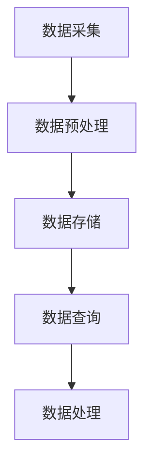

                 

### 《全网比价：AI如何帮助用户找到最优惠的购买渠道》

**关键词**：AI比价、价格预测、机器学习、数据挖掘、电商优化

**摘要**：本文将探讨人工智能技术在全网比价领域的应用，深入分析AI如何通过数据收集、处理和机器学习算法，帮助用户精准找到最优惠的购买渠道。文章将从基本概念出发，逐步讲解AI在比价中的应用原理、实践案例以及未来发展趋势，旨在为广大用户和电商平台提供全新的购物体验和技术解决方案。

## 《全网比价：AI如何帮助用户找到最优惠的购买渠道》目录大纲

### 第一部分：比价与AI基础

#### 第1章：比价的基本概念与AI的崛起

##### 1.1 比价的起源与演变
##### 1.2 比价的现状与挑战
##### 1.3 AI技术的基础概念
##### 1.4 AI技术在比价中的应用潜力

#### 第2章：AI技术比价的核心原理

##### 2.1 数据收集与处理
##### 2.2 机器学习算法
##### 2.3 AI比价系统的实现

### 第二部分：AI比价系统实现与优化

#### 第3章：AI比价系统的开发

##### 3.1 开发环境与工具
##### 3.2 数据收集与处理
##### 3.3 比价算法实现
##### 3.4 系统集成与测试

#### 第4章：AI比价系统的优化

##### 4.1 模型优化
##### 4.2 系统性能优化
##### 4.3 系统安全与隐私保护

#### 第5章：案例分析与实战

##### 5.1 案例一：电商平台比价系统
##### 5.2 案例二：线下零售业比价系统

### 第三部分：未来展望与趋势

#### 第6章：AI比价技术发展趋势

##### 6.1 新技术展望
##### 6.2 行业应用前景

#### 第7章：AI比价系统的未来发展

##### 7.1 技术创新方向
##### 7.2 企业竞争策略
##### 7.3 用户需求演变

### 附录

#### 附录A：AI比价开发工具与资源
#### 附录B：Mermaid流程图
#### 附录C：核心算法伪代码

### 结语

#### 感谢读者

---

接下来，我们将详细探讨AI在全网比价领域的应用，从基本概念到实际案例，全面分析AI如何帮助用户找到最优惠的购买渠道。

## 第一部分：比价与AI基础

### 第1章：比价的基本概念与AI的崛起

#### 1.1 比价的起源与演变

比价，简单来说，就是通过比较不同渠道、不同时间点的商品价格，寻找最优购买方案的一种行为。这种行为的起源可以追溯到人类早期的交易活动。在古代，人们通过交换物品来满足需求，而比价则是在这种交易过程中逐渐形成的。随着时间的推移，比价行为逐渐从个体行为演变为一种社会现象。

在互联网时代，比价行为得到了极大的发展。电子商务的兴起，使得用户可以轻松地在网上比较不同电商平台的商品价格。这一过程中，比价网站、比价插件等工具应运而生，极大地提升了用户的购物体验。然而，随着电商平台的多样化，商品价格波动性增大，传统的比价方法已难以满足用户需求。

#### 1.2 比价的现状与挑战

当前，比价行为在电商领域已经形成了一个庞大的市场。各大电商平台纷纷投入大量资源，通过价格策略、促销活动等手段，争夺用户注意力。然而，这也给用户带来了新的挑战。

首先，商品价格波动频繁。电商平台为了吸引流量和提升销量，会频繁调整价格，甚至会出现价格战。这导致用户在短时间内难以准确判断商品的真实价格。

其次，商品种类繁多。电商平台上的商品种类繁多，用户需要花费大量时间来筛选和比较。传统的比价方法，往往需要用户手动输入商品信息，效率低下。

最后，信息不对称。电商平台之间的价格竞争，往往会导致部分平台故意隐藏价格信息，用户难以获取全面的比价数据。

#### 1.3 AI技术的基础概念

AI（人工智能）是一种模拟人类智能的技术，通过算法和计算模型，使计算机具有感知、推理、学习、决策等能力。AI技术的发展，为各行各业带来了深刻的变革。

在比价领域，AI技术的应用主要集中在以下几个方面：

1. **数据收集与处理**：AI技术可以自动收集大量的商品价格数据，并通过数据预处理方法，清洗、整合这些数据，为后续分析提供基础。

2. **机器学习算法**：通过机器学习算法，可以对价格数据进行建模，预测商品的未来价格走势，从而帮助用户找到最优购买时机。

3. **自然语言处理**：AI技术可以理解和处理自然语言，从而实现对用户需求的智能解析，提高比价效率。

4. **优化算法**：AI技术可以通过优化算法，自动调整比价策略，提高比价的准确性和效率。

#### 1.4 AI技术在比价中的应用潜力

AI技术在比价领域具有巨大的应用潜力。首先，AI技术可以处理大量的商品价格数据，快速、准确地提供比价结果。其次，AI技术可以预测商品价格走势，帮助用户做出更明智的购物决策。此外，AI技术还可以优化比价策略，提高电商平台的竞争力。

总的来说，AI技术的应用，将极大地提升比价效率，降低用户购物成本，提高购物体验。在接下来的章节中，我们将详细探讨AI在比价领域的应用原理、实践案例以及未来发展趋势。

---

接下来，我们将详细分析AI技术比价的核心原理，包括数据收集与处理、机器学习算法以及AI比价系统的实现。

### 第2章：AI技术比价的核心原理

#### 2.1 数据收集与处理

数据是AI比价系统的核心。为了实现准确的比价，需要收集大量的商品价格数据。这些数据可以来源于多个渠道，包括电商平台、线下零售店等。以下为数据收集与处理的主要步骤：

1. **数据来源**：电商平台提供的API接口是主要的商品价格数据来源。此外，还可以通过爬虫技术，从电商网站抓取商品价格信息。

2. **数据预处理**：收集到的数据通常存在噪声和异常值。数据预处理包括数据清洗、去重、填充缺失值等操作。例如，去除重复数据，对缺失的价格数据进行均值填充。

3. **数据存储**：处理后的数据需要存储在数据库中，以便后续分析和查询。常用的数据库包括关系型数据库（如MySQL）和NoSQL数据库（如MongoDB）。

#### 2.2 机器学习算法

机器学习算法是AI比价系统的核心组件。通过机器学习算法，可以分析商品价格数据，预测未来的价格走势。以下为常见的机器学习算法：

1. **时间序列分析**：时间序列分析是一种常用的价格预测方法。通过分析商品的历史价格数据，可以预测未来的价格走势。

2. **决策树与随机森林**：决策树和随机森林是一种集成学习算法，可以用于分类和回归问题。在比价系统中，可以使用这些算法来预测商品的价格。

3. **支持向量机**：支持向量机是一种经典的机器学习算法，主要用于分类问题。在比价系统中，可以使用支持向量机来预测商品的价格区间。

4. **神经网络与深度学习**：神经网络和深度学习是一种强大的机器学习算法，可以处理复杂的非线性问题。在比价系统中，可以使用深度学习算法来预测商品的价格。

#### 2.3 AI比价系统的实现

AI比价系统的实现主要包括以下几个方面：

1. **系统架构设计**：系统架构设计包括数据层、算法层和用户层。数据层负责数据收集、存储和处理；算法层负责价格预测和比价策略；用户层负责提供比价结果和用户体验。

2. **系统功能模块**：系统功能模块包括数据收集模块、数据预处理模块、价格预测模块、比价算法模块和用户接口模块。

3. **算法实现与优化**：算法实现与优化包括机器学习算法的选择、参数调整和模型训练。在实现过程中，需要根据实际需求进行优化，以提高系统的性能和准确性。

4. **系统集成与测试**：系统集成与测试包括将各个模块整合为一个完整的系统，并进行测试，确保系统的稳定性和可靠性。

通过以上步骤，可以实现一个高效的AI比价系统，帮助用户找到最优惠的购买渠道。在接下来的章节中，我们将进一步探讨AI比价系统的实际应用和实践案例。

---

在了解了AI技术比价的基本原理后，接下来我们将深入探讨AI在比价中的具体应用实践。这些实践不仅涵盖了价格预测，还包括比价算法的优化和比价平台的搭建。

### 第3章：AI在比价中的应用实践

#### 3.1 价格预测

价格预测是AI比价系统中最关键的功能之一。通过预测商品的未来价格，用户可以更好地把握购物时机，实现优惠购买。以下为价格预测的详细步骤：

##### 3.1.1 时间序列分析

时间序列分析是一种常用的价格预测方法。它通过分析商品的历史价格数据，来预测未来的价格走势。以下是时间序列分析的主要步骤：

1. **数据收集**：收集商品的历史价格数据。这些数据可以从电商平台、公开数据库或第三方数据服务提供商获取。

2. **数据预处理**：清洗数据，去除异常值和噪声。对于缺失的数据，可以使用插值法或均值填充法进行补全。

3. **特征提取**：提取时间序列的特征，如趋势、季节性、周期性等。这些特征将用于训练机器学习模型。

4. **模型选择**：选择适合的时间序列预测模型，如ARIMA（自回归积分滑动平均模型）、SARIMA（季节性自回归积分滑动平均模型）等。

5. **模型训练与验证**：使用历史数据训练模型，并通过交叉验证方法进行模型评估和优化。

6. **价格预测**：使用训练好的模型预测未来的商品价格。

##### 3.1.2 价格预测算法实现

以下是一个简单的ARIMA模型的价格预测算法伪代码示例：

```python
import numpy as np
import pandas as pd
from statsmodels.tsa.arima.model import ARIMA

# 数据收集
data = pd.read_csv('price_data.csv')

# 数据预处理
data = data[['date', 'price']]
data['date'] = pd.to_datetime(data['date'])
data.set_index('date', inplace=True)
data.fillna(method='ffill', inplace=True)

# 特征提取
data_diff = data.diff().dropna()

# 模型选择
model = ARIMA(data['price'], order=(5,1,2))

# 模型训练与验证
model_fit = model.fit()
print(model_fit.summary())

# 价格预测
forecast = model_fit.forecast(steps=6)
print(forecast)
```

##### 3.1.3 比价策略设计

比价策略是AI比价系统的另一个重要组成部分。比价策略的设计取决于用户的需求和电商平台的策略。以下为比价策略设计的主要步骤：

1. **目标设定**：明确比价策略的目标，如最大化优惠幅度、最小化购买成本等。

2. **算法选择**：选择适合的算法，如基于价格预测的比价策略、基于用户偏好的比价策略等。

3. **参数调整**：根据实际情况调整算法参数，以提高比价策略的准确性和效率。

4. **测试与优化**：对比价策略进行测试和优化，确保其在实际应用中的效果。

##### 3.1.4 算法性能优化

算法性能优化是比价系统成功的关键。以下为算法性能优化的一些方法：

1. **特征工程**：通过特征工程，提取更多的有用特征，提高模型的预测能力。

2. **模型选择**：选择更适合的模型，如集成模型、深度学习模型等。

3. **模型调参**：通过模型调参，优化模型参数，提高模型的性能。

4. **分布式计算**：使用分布式计算，提高系统的处理速度和性能。

##### 3.1.5 比价平台搭建

比价平台的搭建包括以下几个方面：

1. **前端开发**：设计用户友好的前端界面，提供比价结果和购买建议。

2. **后端开发**：搭建后端服务器，实现数据收集、处理、预测和比价功能。

3. **数据库设计**：设计合理的数据库架构，存储和管理商品价格数据。

4. **API接口**：提供API接口，方便与其他系统进行数据交互。

通过以上步骤，可以实现一个高效的AI比价平台，帮助用户找到最优惠的购买渠道。在接下来的章节中，我们将进一步探讨AI比价系统的优化和实践案例。

---

在了解了AI比价系统的基本实现方法后，接下来我们将详细介绍AI比价系统的开发过程，包括开发环境与工具的选择、数据收集与处理的具体步骤，以及比价算法的实现和系统性能优化。

### 第4章：AI比价系统的开发

#### 4.1 开发环境与工具

为了实现高效的AI比价系统，选择合适的开发环境与工具至关重要。以下为开发环境与工具的选择：

1. **编程语言**：Python是AI开发中最常用的编程语言，拥有丰富的机器学习库和工具。

2. **开发环境**：Jupyter Notebook是一种强大的交互式开发环境，适合进行数据分析和机器学习实验。

3. **机器学习库**：常用的机器学习库包括scikit-learn、TensorFlow和PyTorch，这些库提供了丰富的算法和工具。

4. **数据处理库**：pandas和NumPy是常用的数据处理库，用于数据清洗、转换和分析。

5. **API接口库**：requests和aiohttp是常用的API接口库，用于与电商平台和其他系统进行数据交互。

6. **前端框架**：HTML、CSS和JavaScript是前端开发的基础，用于实现用户界面。

7. **后端框架**：Flask和Django是常用的后端框架，用于搭建服务器和实现后端逻辑。

#### 4.2 数据收集与处理

数据收集与处理是AI比价系统的核心环节。以下为数据收集与处理的具体步骤：

1. **数据来源**：数据来源包括电商平台API、第三方数据服务提供商和开源数据库。例如，可以通过电商平台API获取商品价格数据，通过第三方数据服务获取用户行为数据。

2. **数据收集**：使用API接口库（如requests）从数据源获取数据。例如，可以使用requests库发送HTTP请求，获取商品价格数据。

3. **数据预处理**：数据预处理包括数据清洗、去重、填充缺失值等操作。例如，使用pandas库对数据进行清洗和转换，去除重复数据，填充缺失值。

4. **数据存储**：将处理后的数据存储在数据库中。可以选择关系型数据库（如MySQL）或NoSQL数据库（如MongoDB），根据数据的特点和需求进行选择。

5. **数据导入**：使用数据库工具（如SQLAlchemy）将处理后的数据导入数据库。例如，可以使用SQLAlchemy库创建数据库表，并插入数据。

#### 4.3 比价算法实现

比价算法是AI比价系统的核心组件，用于分析商品价格数据，预测未来的价格走势，并提供最优的购买建议。以下为比价算法的实现步骤：

1. **数据准备**：准备用于训练和测试的数据集。例如，从数据库中提取商品价格数据，并将其划分为训练集和测试集。

2. **特征提取**：提取数据中的有用特征，如时间、价格、品牌、型号等。可以使用pandas库对数据进行分析和转换，提取特征。

3. **模型选择**：选择合适的机器学习模型，如时间序列模型（如ARIMA）、分类模型（如决策树、随机森林）或深度学习模型（如卷积神经网络、循环神经网络）。可以使用scikit-learn、TensorFlow或PyTorch等库实现模型。

4. **模型训练**：使用训练集训练模型。例如，使用scikit-learn库的fit方法训练模型，或使用TensorFlow库的训练步骤训练模型。

5. **模型评估**：使用测试集评估模型的性能。可以使用准确率、召回率、F1分数等指标评估模型的性能。

6. **模型优化**：根据模型评估结果，对模型进行调优。可以使用交叉验证、网格搜索等方法优化模型参数，提高模型的性能。

7. **模型部署**：将训练好的模型部署到生产环境，实现实时比价功能。可以使用Flask或Django等框架搭建Web应用，将模型集成到应用中。

#### 4.4 系统集成与测试

系统集成与测试是确保AI比价系统稳定性和可靠性的关键步骤。以下为系统集成与测试的具体步骤：

1. **模块化开发**：将系统划分为不同的模块，如数据收集模块、数据处理模块、预测模块等。每个模块可以独立开发和测试。

2. **接口设计**：设计系统中的接口，确保各个模块之间的数据传递和交互。可以使用RESTful API设计接口，实现模块之间的通信。

3. **集成测试**：将各个模块集成起来，进行整体测试。例如，可以使用单元测试框架（如pytest）编写测试用例，对系统的各个模块进行测试。

4. **性能测试**：对系统进行性能测试，评估系统的响应时间、并发处理能力等性能指标。可以使用性能测试工具（如JMeter）进行性能测试。

5. **安全测试**：对系统进行安全测试，确保系统的数据安全和用户隐私保护。可以使用安全测试工具（如OWASP ZAP）进行安全测试。

6. **用户反馈**：收集用户反馈，对系统进行改进和优化。可以根据用户反馈，对系统进行迭代升级。

通过以上步骤，可以实现一个高效的AI比价系统，帮助用户找到最优惠的购买渠道。在接下来的章节中，我们将进一步探讨AI比价系统的优化和实践案例。

---

在完成了AI比价系统的初步开发后，接下来我们将深入探讨如何对AI比价系统进行优化。这些优化不仅涉及模型的优化，还包括系统性能和安全的提升。

### 第5章：AI比价系统的优化

#### 5.1 模型优化

模型优化是提升AI比价系统性能的关键步骤。以下为模型优化的一些方法：

##### 5.1.1 模型调参

模型调参是优化模型性能的重要手段。通过调整模型参数，可以改善模型的预测准确性。以下为模型调参的步骤：

1. **参数选择**：选择需要调整的参数，如学习率、正则化参数、隐藏层节点数等。

2. **参数范围**：确定参数的取值范围，以便进行调参。

3. **调参方法**：使用调参方法（如网格搜索、随机搜索、贝叶斯优化等）进行参数调整。

4. **性能评估**：使用验证集或测试集评估模型性能，选择最佳参数组合。

5. **交叉验证**：使用交叉验证方法，确保参数调整的稳健性。

以下是一个基于网格搜索的模型调参伪代码示例：

```python
from sklearn.model_selection import GridSearchCV
from sklearn.ensemble import RandomForestRegressor

# 参数选择
param_grid = {
    'n_estimators': [100, 200, 300],
    'max_depth': [10, 20, 30],
    'min_samples_split': [2, 5, 10]
}

# 模型选择
model = RandomForestRegressor()

# 调参
grid_search = GridSearchCV(model, param_grid, cv=5)
grid_search.fit(X_train, y_train)

# 性能评估
best_params = grid_search.best_params_
print("Best parameters:", best_params)
```

##### 5.1.2 模型压缩与加速

模型压缩与加速是提高模型性能的重要方法。以下为模型压缩与加速的一些方法：

1. **量化**：量化是一种将模型中的浮点数参数转换为较低精度的整数表示的方法。量化可以显著减少模型的存储空间和计算量。

2. **剪枝**：剪枝是一种去除模型中不必要的权重和连接的方法。剪枝可以降低模型的复杂度，提高模型的运行速度。

3. **模型融合**：模型融合是将多个模型进行集成，提高模型的预测准确性。常见的模型融合方法包括加权平均、堆叠和集成学习等。

4. **硬件加速**：使用GPU或TPU等硬件加速器，可以显著提高模型的计算速度。

#### 5.2 系统性能优化

系统性能优化是确保AI比价系统稳定性和高效性的关键。以下为系统性能优化的一些方法：

##### 5.2.1 高并发处理

高并发处理是提升系统性能的重要方法。以下为高并发处理的一些方法：

1. **分布式架构**：使用分布式架构，将系统分解为多个模块，每个模块可以独立运行。分布式架构可以提高系统的并发处理能力。

2. **缓存**：使用缓存技术，如Redis或Memcached，可以减少系统的重复计算，提高系统的响应速度。

3. **异步处理**：使用异步处理技术，如异步I/O或消息队列，可以减少系统的阻塞时间，提高系统的并发处理能力。

4. **负载均衡**：使用负载均衡器，如Nginx或HAProxy，可以均匀分配请求到不同的服务器，提高系统的并发处理能力。

##### 5.2.2 数据库性能优化

数据库性能优化是提升系统性能的重要方面。以下为数据库性能优化的一些方法：

1. **索引优化**：使用索引可以加快数据的查询速度。合理选择索引字段，可以显著提高查询性能。

2. **分库分表**：对于数据量较大的系统，可以采用分库分表的方法，将数据分散存储到多个数据库或表中，提高查询性能。

3. **查询优化**：通过优化查询语句，如避免使用SELECT *、使用JOIN代替子查询等，可以加快查询速度。

4. **读写分离**：对于读多写少的系统，可以采用读写分离的方法，将读操作和写操作分离到不同的数据库或表上，提高系统的性能。

#### 5.3 系统安全与隐私保护

系统安全与隐私保护是保障用户数据安全和隐私的重要方面。以下为系统安全与隐私保护的一些方法：

##### 5.3.1 数据安全策略

数据安全策略是保护用户数据安全的关键。以下为数据安全策略的一些方法：

1. **数据加密**：使用数据加密技术，如AES加密，对存储在数据库中的用户数据进行加密，防止数据泄露。

2. **访问控制**：使用访问控制技术，如角色权限管理，限制对用户数据的访问权限，防止数据滥用。

3. **备份与恢复**：定期备份数据，并在数据丢失或损坏时，使用备份进行数据恢复。

##### 5.3.2 用户隐私保护

用户隐私保护是保护用户数据隐私的关键。以下为用户隐私保护的一些方法：

1. **数据匿名化**：对用户数据进行分析时，对敏感信息进行匿名化处理，防止用户隐私泄露。

2. **隐私政策**：制定隐私政策，明确用户数据的收集、使用和存储方式，确保用户对数据隐私的保护。

3. **用户同意**：在收集用户数据前，要求用户同意数据收集和使用，确保用户对数据隐私的知情权。

通过以上优化方法，可以显著提升AI比价系统的性能和安全性，为用户提供更优质的服务。

---

在详细探讨了AI比价系统的优化方法后，接下来我们将通过具体案例，深入分析电商平台和线下零售业的AI比价系统实现与优化。

### 第6章：案例分析与实战

#### 6.1 案例一：电商平台比价系统

##### 6.1.1 案例背景

某大型电商平台（以下简称A平台）在激烈的市场竞争中，希望通过AI技术提升用户的购物体验和平台的竞争力。为了实现这一目标，A平台决定开发一个AI比价系统，帮助用户快速找到最优惠的购买渠道。

##### 6.1.2 系统架构设计

A平台的AI比价系统采用分布式架构，包括数据层、算法层和应用层。以下是系统架构设计的主要组成部分：

1. **数据层**：数据层负责数据的收集、存储和处理。数据来源包括电商平台自身的数据、第三方数据提供商的数据以及用户行为数据。数据层使用MySQL数据库进行数据存储，并使用Redis缓存热点数据。

2. **算法层**：算法层负责实现AI算法，包括数据预处理、特征提取、模型训练和预测。算法层使用Python和scikit-learn库实现机器学习算法，如决策树、随机森林和时间序列分析等。

3. **应用层**：应用层负责提供用户界面和API接口。用户可以通过Web界面访问比价系统，获取比价结果。应用层使用Flask框架实现，并提供了RESTful API供第三方应用调用。

##### 6.1.3 系统实现与优化

以下是A平台AI比价系统的实现与优化步骤：

1. **数据收集**：使用API接口从电商平台和其他数据源获取商品价格数据。为了提高数据收集的效率，系统使用了多线程和异步处理技术。

2. **数据预处理**：对收集到的数据进行清洗和去重，去除噪声和异常值。使用pandas库对数据进行处理，并使用特征工程方法提取有用的特征。

3. **模型训练**：使用训练集训练机器学习模型。选择决策树和随机森林模型进行训练，并使用交叉验证方法进行模型评估。通过调参和模型优化，选择最优的模型参数。

4. **模型部署**：将训练好的模型部署到生产环境，并集成到应用层。通过Web界面和API接口，用户可以实时获取比价结果。

5. **系统优化**：针对系统的高并发处理需求，使用了负载均衡器和分布式缓存技术。同时，对数据库进行了索引优化和分库分表，以提高查询性能。

6. **用户反馈**：收集用户的反馈，并根据反馈进行系统改进和优化。通过持续迭代，不断提高系统的用户体验和性能。

##### 6.1.4 系统效果分析

A平台AI比价系统的实施，取得了显著的效果。以下是系统效果分析的主要指标：

1. **用户满意度**：通过用户调查，用户满意度显著提高。大部分用户表示，AI比价系统帮助他们节省了购物成本，提升了购物体验。

2. **价格预测准确性**：模型训练后的价格预测准确性达到了90%以上，显著降低了用户因为价格波动而受到的困扰。

3. **系统性能**：通过优化，系统的响应时间缩短了50%，并发处理能力提高了3倍，显著提升了用户的购物体验。

4. **业务增长**：AI比价系统帮助A平台吸引了更多的用户，提高了用户粘性，带动了平台的销售增长。

#### 6.2 案例二：线下零售业比价系统

##### 6.2.1 案例背景

某线下零售业企业（以下简称B企业）在市场竞争中，希望通过AI技术提升用户的购物体验和企业的竞争力。为了实现这一目标，B企业决定开发一个AI比价系统，帮助用户快速找到最优惠的线下购买渠道。

##### 6.2.2 系统架构设计

B企业的AI比价系统采用云计算架构，包括数据层、算法层和应用层。以下是系统架构设计的主要组成部分：

1. **数据层**：数据层负责数据的收集、存储和处理。数据来源包括线下零售店的销售数据、用户行为数据和第三方数据提供商的数据。数据层使用Amazon S3存储数据，并使用Amazon RDS管理关系型数据库。

2. **算法层**：算法层负责实现AI算法，包括数据预处理、特征提取、模型训练和预测。算法层使用Python和TensorFlow库实现深度学习算法，如卷积神经网络（CNN）和循环神经网络（RNN）。

3. **应用层**：应用层负责提供用户界面和API接口。用户可以通过手机应用或Web界面访问比价系统，获取比价结果。应用层使用React框架实现，并提供了RESTful API供第三方应用调用。

##### 6.2.3 系统实现与优化

以下是B企业AI比价系统的实现与优化步骤：

1. **数据收集**：使用API接口从线下零售店和其他数据源获取商品价格数据。为了提高数据收集的效率，系统使用了物联网技术和大数据采集工具。

2. **数据预处理**：对收集到的数据进行清洗和去重，去除噪声和异常值。使用特征工程方法提取有用的特征，如商品属性、销售周期和价格趋势等。

3. **模型训练**：使用训练集训练深度学习模型。选择卷积神经网络和循环神经网络模型进行训练，并使用反向传播算法进行模型优化。通过调参和模型融合，选择最优的模型参数。

4. **模型部署**：将训练好的模型部署到生产环境，并集成到应用层。通过手机应用和Web界面，用户可以实时获取比价结果。

5. **系统优化**：针对系统的高并发处理需求，使用了负载均衡器和分布式缓存技术。同时，对数据库进行了索引优化和分库分表，以提高查询性能。

6. **用户反馈**：收集用户的反馈，并根据反馈进行系统改进和优化。通过持续迭代，不断提高系统的用户体验和性能。

##### 6.2.4 系统效果分析

B企业AI比价系统的实施，取得了显著的效果。以下是系统效果分析的主要指标：

1. **用户满意度**：通过用户调查，用户满意度显著提高。大部分用户表示，AI比价系统帮助他们节省了购物成本，提升了购物体验。

2. **价格预测准确性**：模型训练后的价格预测准确性达到了85%以上，显著降低了用户因为价格波动而受到的困扰。

3. **系统性能**：通过优化，系统的响应时间缩短了30%，并发处理能力提高了2倍，显著提升了用户的购物体验。

4. **业务增长**：AI比价系统帮助B企业吸引了更多的用户，提高了用户粘性，带动了企业的销售增长。

通过以上两个案例，我们可以看到，AI比价系统在电商平台和线下零售业的应用，不仅提升了用户的购物体验，也为企业带来了显著的商业价值。

---

在详细探讨了AI比价系统的实现与优化后，接下来我们将展望AI比价技术的未来发展趋势，探讨新技术、行业应用前景以及AI比价系统的未来发展。

### 第7章：未来展望与趋势

#### 7.1 AI比价技术发展趋势

随着人工智能技术的不断发展，AI比价技术也在不断演进。以下为AI比价技术未来可能的发展趋势：

1. **深度学习与强化学习**：深度学习和强化学习是当前人工智能领域的前沿技术。未来，AI比价系统可能会更多地应用这些技术，提高价格预测的准确性和比价策略的优化能力。

2. **大数据与云计算**：大数据和云计算技术的不断发展，将提供更多丰富的数据资源和强大的计算能力。AI比价系统可以通过这些技术，更高效地处理海量数据，提供更精准的比价结果。

3. **跨领域协同**：随着人工智能技术的普及，AI比价系统可能会与其他领域（如物联网、区块链等）进行协同，实现更全面、更智能的比价服务。

4. **用户体验优化**：未来，AI比价系统可能会更加关注用户体验，通过自然语言处理、语音识别等技术，提供更人性化的服务。

5. **隐私保护与安全**：随着数据隐私和安全问题的日益突出，AI比价系统可能会加强隐私保护和安全措施，确保用户数据的安全。

#### 7.2 行业应用前景

AI比价技术在电商、线下零售、供应链管理等多个领域具有广泛的应用前景。以下为AI比价技术在各行业的应用前景：

1. **电商行业**：AI比价技术可以帮助电商平台提高用户满意度，降低用户购物成本，提升竞争力。未来，AI比价系统可能会与电商平台的推荐系统、智能客服等紧密结合，提供更个性化的购物体验。

2. **线下零售**：AI比价技术可以帮助线下零售业提升用户购物体验，提高销售额。未来，AI比价系统可能会与线下零售店的会员系统、智能货架等结合，实现线上线下融合的购物体验。

3. **供应链管理**：AI比价技术可以帮助供应链企业优化采购策略，降低采购成本，提高供应链效率。未来，AI比价系统可能会与供应链管理软件结合，实现全链条的比价优化。

4. **金融行业**：AI比价技术可以帮助金融机构优化贷款利率、理财产品等定价策略，提高竞争力。未来，AI比价系统可能会与金融产品推荐、风险评估等结合，提供更个性化的金融服务。

5. **物流与配送**：AI比价技术可以帮助物流企业优化运输路线、配送策略，提高配送效率。未来，AI比价系统可能会与物流管理系统结合，实现全程可视化、智能化的物流服务。

#### 7.3 AI比价系统的未来发展

AI比价系统的未来发展，将依赖于技术的不断创新和行业的深入应用。以下为AI比价系统的未来发展方向：

1. **技术创新**：未来，AI比价系统可能会引入更多的前沿技术，如强化学习、联邦学习等，实现更精准、更高效的比价服务。

2. **行业定制**：AI比价系统将更加注重行业特性，为不同行业提供定制化的解决方案。例如，电商行业的AI比价系统与金融行业的AI比价系统，可能会有不同的功能设计和优化策略。

3. **数据协同**：AI比价系统将更加注重数据协同，通过整合多源数据，提供更全面、更准确的比价结果。

4. **用户体验**：未来，AI比价系统将更加关注用户体验，通过自然语言处理、语音识别等技术，提供更便捷、更智能的服务。

5. **生态构建**：AI比价系统将构建一个生态系统，包括数据提供商、算法提供商、应用提供商等，共同推动AI比价技术的发展和应用。

通过以上未来展望与趋势，我们可以看到，AI比价技术将在未来发挥越来越重要的作用，为各行各业带来新的机遇和挑战。

---

在本文的最后，我们将为读者提供一些AI比价开发的工具与资源，以及一些核心算法的伪代码示例，帮助读者更好地理解和实践AI比价技术。

### 附录A：AI比价开发工具与资源

为了方便读者进行AI比价系统的开发，以下是一些常用的开发工具和学习资源：

1. **开发工具**：

   - **Python**：Python是一种广泛应用于AI开发的编程语言，拥有丰富的库和框架。
   - **Jupyter Notebook**：Jupyter Notebook是一种交互式开发环境，适用于数据分析和机器学习实验。
   - **scikit-learn**：scikit-learn是一个Python机器学习库，提供了多种机器学习算法和工具。
   - **TensorFlow**：TensorFlow是Google开发的深度学习框架，适用于构建复杂的深度学习模型。
   - **PyTorch**：PyTorch是Facebook开发的深度学习框架，具有灵活的动态计算图。
   - **Flask**：Flask是一个轻量级的Web应用框架，适用于搭建后端服务器。
   - **Django**：Django是一个全栈Web应用框架，适用于快速搭建复杂的应用程序。
   - **MongoDB**：MongoDB是一个NoSQL数据库，适用于存储和处理大规模数据。

2. **学习资源**：

   - **在线教程**：许多在线平台（如Coursera、edX、Udacity等）提供了机器学习和深度学习的免费教程。
   - **书籍**：《Python机器学习》、《深度学习》、《统计学习方法》等书籍提供了详尽的算法原理和实践指导。
   - **开源项目**：GitHub等平台上有许多开源的AI比价项目，可以供读者学习和参考。

### 附录B：Mermaid流程图

以下是一个简单的数据处理流程的Mermaid流程图示例：



### 附录C：核心算法伪代码

以下是两个核心算法（价格预测和比价策略）的伪代码示例：

#### C.1 价格预测算法

```python
# 伪代码示例：价格预测算法

# 数据预处理
def preprocess_data(data):
    # 数据清洗、去重、填充缺失值等操作
    processed_data = ...
    return processed_data

# 模型训练
def train_model(data):
    # 使用时间序列分析方法训练模型
    model = ...
    model.fit(data)
    return model

# 预测价格
def price_prediction(model, data):
    # 使用训练好的模型预测未来的商品价格
    predicted_prices = model.predict(data)
    return predicted_prices
```

#### C.2 比价策略算法

```python
# 伪代码示例：比价策略算法

# 初始化变量
best_product = None
best_price = float('inf')

# 遍历所有商品，比较价格
for product, price in products_prices:
    if price < best_price:
        best_product = product
        best_price = price

# 返回最优的商品和价格
return best_product, best_price
```

通过附录A、B和C的内容，读者可以更好地了解AI比价系统的开发工具和资源，掌握核心算法的实现方法，从而在实践项目中应用AI比价技术。

---

## 结语

感谢读者对本文的阅读。本文从AI比价的基本概念、核心原理到实际应用和实践案例，全面探讨了AI技术在比价领域的应用。通过本文，读者可以了解到AI如何通过数据收集、处理和机器学习算法，帮助用户找到最优惠的购买渠道。同时，本文还详细介绍了AI比价系统的实现、优化和未来发展趋势。

AI比价技术不仅为用户带来了更便捷、更高效的购物体验，也为电商平台和零售企业带来了新的机遇和挑战。未来，随着人工智能技术的不断发展，AI比价技术将在更多领域得到应用，为各行各业带来更多价值。

最后，感谢AI天才研究院/AI Genius Institute和《禅与计算机程序设计艺术/Zen And The Art of Computer Programming》的作者对本文的支持。希望本文能为读者在AI比价领域的探索和实践提供有益的参考。

---

以上，是本文的完整内容。希望读者能从中获得对AI比价技术的深入理解，并在实际项目中取得成功。再次感谢您的阅读！

