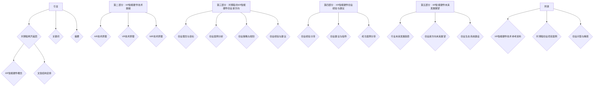
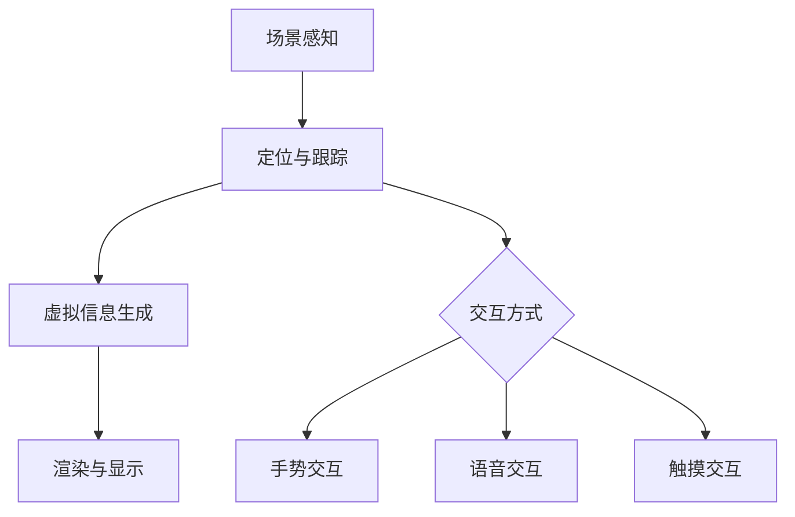
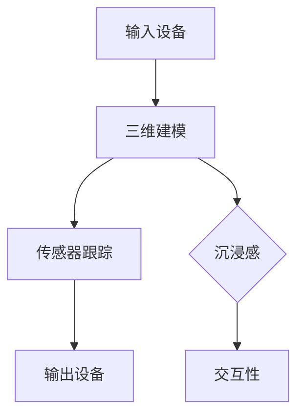
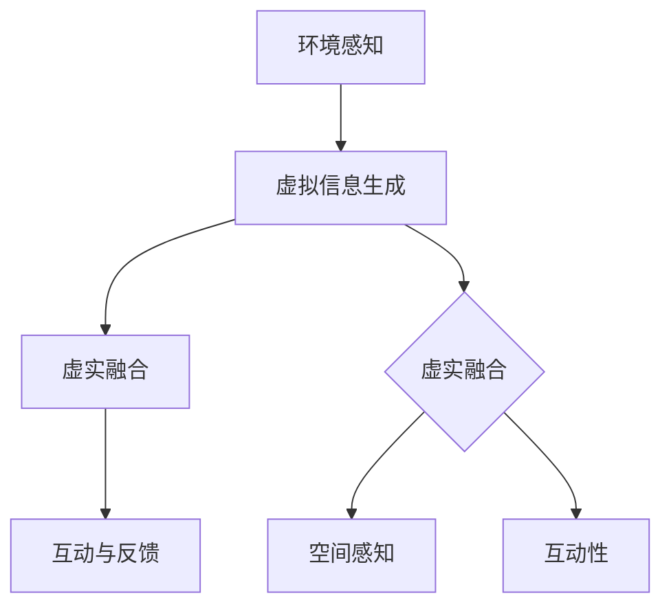

                 

# 第一部分：引言

## 1.1 刘博聪离开美团：背景与原因

在数字化和智能化转型的浪潮中，刘博聪的名字一直是科技圈的热门话题。作为美团的核心技术领导人物，他在公司的发展历程中扮演了重要角色。然而，最近一则消息震惊了整个业界：刘博聪宣布离开美团，选择了一条全新的创业之路。这一决策背后，有着怎样的背景和原因呢？

### 1.1.1 刘博聪的职业生涯与美团关系

刘博聪的职业生涯始于著名的科技公司腾讯，他在腾讯任职期间，积累了丰富的技术和团队管理经验。随后，他加盟了美团，成为公司核心的CTO，负责美团的技术战略和研发工作。在刘博聪的领导下，美团的技术实力得到了显著提升，尤其是在外卖、团购、出行等核心业务领域，美团的技术创新成为行业标杆。

### 1.1.2 刘博聪离开美团的直接原因

刘博聪离开美团的直接原因，源于他对于未来科技发展趋势的深刻洞察。他认为，随着XR（增强现实、虚拟现实和混合现实）技术的快速发展，智能硬件领域将迎来新的变革。为了抓住这一历史机遇，刘博聪决定离开美团，投身于XR智能硬件创业项目。

### 1.1.3 刘博聪离开美团的影响与反响

刘博聪离开美团的消息传出后，引发了业界的高度关注和讨论。许多人认为，他的离职将给美团的技术发展带来一定影响，但同时也为整个行业注入了新的活力。对于刘博聪本人来说，这一决定是他职业生涯的一次重要转型，也为他实现个人创业梦想迈出了关键一步。

## 1.2 XR智能硬件：概念与市场趋势

随着科技的进步，XR智能硬件逐渐成为市场关注的焦点。XR智能硬件是通过增强现实（AR）、虚拟现实（VR）和混合现实（MR）技术，将虚拟信息和现实世界进行融合，从而提供全新的交互体验。

### 1.2.1 XR智能硬件的定义

XR智能硬件是指一种融合了增强现实（AR）、虚拟现实（VR）和混合现实（MR）技术的智能硬件设备。通过这些设备，用户可以感受到虚拟世界的增强和扩展，实现与现实世界的无缝交互。

### 1.2.2 XR智能硬件的分类

XR智能硬件可以分为以下几类：

1. **AR智能硬件**：如智能眼镜、智能手表等，可以在用户眼前叠加虚拟信息，提升现实体验。
2. **VR智能硬件**：如虚拟现实头戴设备，用户可以通过VR设备进入一个完全虚拟的环境，实现沉浸式体验。
3. **MR智能硬件**：如混合现实头戴设备，结合了AR和VR的特点，用户可以在虚拟环境中与现实世界互动。

### 1.2.3 XR智能硬件市场的趋势与前景

当前，XR智能硬件市场正处于快速发展的阶段，呈现出以下趋势：

1. **技术创新**：随着硬件性能的提升和算法的优化，XR智能硬件的体验越来越接近现实，吸引了越来越多的用户和开发者。
2. **应用场景拓展**：从游戏、娱乐到教育、医疗、工业制造等多个领域，XR智能硬件的应用场景不断拓展，市场潜力巨大。
3. **市场规模增长**：根据市场研究机构的预测，未来几年内，XR智能硬件市场的规模将呈现爆发式增长，成为科技领域的热点。

刘博聪选择进军XR智能硬件领域，正是看中了这一领域的广阔前景和巨大潜力。在接下来的内容中，我们将深入探讨刘博聪的创业理念和策略，以及XR智能硬件技术的核心原理。

## 1.3 本文结构安排

本文将从以下几个方面进行详细探讨：

- **第一部分：引言**：介绍刘博聪离开美团的原因和XR智能硬件的概念及市场趋势。
- **第二部分：XR智能硬件技术基础**：讲解AR、VR和MR技术的原理和应用领域。
- **第三部分：刘博聪的XR智能硬件创业新方向**：分析刘博聪的创业理念、策略和面临的挑战。
- **第四部分：XR智能硬件创业经验与建议**：分享创业经验、给出创业建议和成功案例。
- **第五部分：XR智能硬件未来发展展望**：探讨行业趋势和刘博聪创业新方向的前景。

通过本文的深入探讨，我们希望为您呈现一个全面、系统的XR智能硬件创业全景，帮助您更好地了解这一领域的机遇与挑战。

## 1.4 关键词

- 刘博聪
- 美团
- XR智能硬件
- 增强现实（AR）
- 虚拟现实（VR）
- 混合现实（MR）
- 创业
- 技术趋势
- 市场前景

## 1.5 摘要

本文详细探讨了刘博聪离开美团并投身于XR智能硬件创业的新方向。首先，我们介绍了刘博聪在美团的职业生涯及其离开的原因，并分析了XR智能硬件的定义、分类和市场需求。接着，我们深入解析了增强现实（AR）、虚拟现实（VR）和混合现实（MR）技术的基本原理和应用领域。随后，本文探讨了刘博聪的创业理念、策略以及面临的挑战，并分享了创业经验与建议。最后，我们展望了XR智能硬件行业的未来发展趋势，以及刘博聪创业新方向的前景。通过本文的深入分析，我们希望帮助读者全面了解XR智能硬件领域的机遇与挑战，为从事相关领域的人提供有益的参考。

---

### 《刘博聪离开美团:XR智能硬件创业新方向》目录大纲

## 《刘博聪离开美团:XR智能硬件创业新方向》目录大纲

### 第一部分：引言

- 1.1 刘博聪离开美团：背景与原因
  - 1.1.1 刘博聪的职业生涯与美团关系
  - 1.1.2 刘博聪离开美团的直接原因
  - 1.1.3 刘博聪离开美团的影响与反响
- 1.2 XR智能硬件：概念与市场趋势
  - 1.2.1 XR智能硬件的定义
  - 1.2.2 XR智能硬件的分类
  - 1.2.3 XR智能硬件市场的趋势与前景
- 1.3 本文结构安排
- 1.4 关键词
- 1.5 摘要

### 第二部分：XR智能硬件技术基础

- 2.1 增强现实（AR）技术原理
  - 2.1.1 AR技术的基本概念
  - 2.1.2 AR技术的工作原理
  - 2.1.3 AR技术的主要应用领域
  - 2.1.4 AR技术的核心概念与联系（Mermaid流程图）
- 2.2 虚拟现实（VR）技术原理
  - 2.2.1 VR技术的基本概念
  - 2.2.2 VR技术的工作原理
  - 2.2.3 VR技术的主要应用领域
  - 2.2.4 VR技术的核心概念与联系（Mermaid流程图）
- 2.3 混合现实（MR）技术原理
  - 2.3.1 MR技术的基本概念
  - 2.3.2 MR技术的工作原理
  - 2.3.3 MR技术的主要应用领域
  - 2.3.4 MR技术的核心概念与联系（Mermaid流程图）

### 第三部分：刘博聪的XR智能硬件创业新方向

- 3.1 刘博聪的创业理念与目标
  - 3.1.1 刘博聪的创业初心
  - 3.1.2 刘博聪的创业目标
  - 3.1.3 刘博聪创业项目的愿景
- 3.2 XR智能硬件创业案例分析
  - 3.2.1 国内外成功XR智能硬件创业案例
  - 3.2.2 案例分析：成功因素与启示
  - 3.2.3 案例分析：失败原因与教训
- 3.3 刘博聪的创业策略与规划
  - 3.3.1 市场研究与定位
  - 3.3.2 产品设计与创新
  - 3.3.3 融资与资金管理
  - 3.3.4 人才招聘与团队建设
  - 3.3.5 品牌建设与市场推广
  - 3.3.6 XR智能硬件创业新方向：技术挑战与解决方案
    - 3.3.6.1 XR智能硬件技术面临的挑战
    - 3.3.6.2 技术挑战的解决方案
    - 3.3.6.3 创业过程中的技术创新与实践

### 第四部分：XR智能硬件创业经验与建议

- 4.1 创业经验分享
  - 4.1.1 刘博聪的创业心得
  - 4.1.2 创业过程中的关键决策
  - 4.1.3 创业过程中的困难与解决方法
- 4.2 创业建议与指导
  - 4.2.1 针对新创业者的建议
  - 4.2.2 针对创业项目的指导
  - 4.2.3 针对投资人的建议
- 4.3 创业成功案例分享
  - 4.3.1 国内外成功创业案例
  - 4.3.2 案例解析：成功要素与复制路径
  - 4.3.3 案例启示：如何避免创业失败

### 第五部分：XR智能硬件未来发展展望

- 5.1 XR智能硬件行业未来发展趋势
  - 5.1.1 技术发展趋势
  - 5.1.2 市场发展趋势
  - 5.1.3 应用领域拓展
- 5.2 刘博聪的创业新方向：未来展望
  - 5.2.1 创业项目的未来目标
  - 5.2.2 预计的未来成果
  - 5.2.3 面临的挑战与应对策略
- 5.3 XR智能硬件创业生态系统建设
  - 5.3.1 产业链上下游协同
  - 5.3.2 政策支持与产业环境
  - 5.3.3 创业生态系统的构建与优化

### 附录

- 附录A：XR智能硬件技术参考资料
  - 1. 增强现实（AR）技术参考资料
  - 2. 虚拟现实（VR）技术参考资料
  - 3. 混合现实（MR）技术参考资料
- 附录B：刘博聪创业项目案例
  - 1. 刘博聪创业项目简介
  - 2. 项目特点与亮点
  - 3. 项目成果与影响
- 附录C：创业问答与解惑
  - 1. 常见创业问题解答
  - 2. 创业者关注热点话题
  - 3. 创业经验分享与交流平台推荐

---

## 1.6 文章结构图

这个结构图清晰地展示了文章的内容组织，每个部分之间的逻辑关系和相互连接，使得读者可以更好地理解和追踪文章的思路。

---

### 第二部分：XR智能硬件技术基础

#### 2.1 增强现实（AR）技术原理

增强现实（Augmented Reality，AR）技术是一种将虚拟信息与现实世界进行融合的技术，通过在用户的视野中叠加虚拟图像、文本或音频等元素，增强用户的感知体验。AR技术的基本概念可以理解为“增强现实”，即通过技术手段将虚拟信息与现实环境相结合。

##### 2.1.1 AR技术的基本概念

增强现实技术涉及到多个领域，包括计算机视觉、图像处理、传感器技术等。AR的核心在于实时地对真实环境进行感知、理解和交互，将虚拟信息准确地叠加到现实环境中。以下是AR技术的一些基本概念：

- **虚拟信息叠加**：将计算机生成的虚拟信息（如文字、图像、3D模型等）叠加到现实场景中，使虚拟信息与真实环境融为一体。
- **定位与跟踪**：通过摄像头、传感器等技术，对真实环境进行感知和定位，确保虚拟信息准确地叠加在现实场景中。
- **交互方式**：用户可以通过手势、语音、触摸等多种方式与虚拟信息进行交互，实现自然的人机交互。

##### 2.1.2 AR技术的工作原理

AR技术的工作原理主要包括以下几个步骤：

1. **场景感知**：通过摄像头或传感器捕捉真实环境，并提取关键特征（如形状、颜色、纹理等）。
2. **定位与跟踪**：利用计算机视觉算法，对捕捉到的场景进行识别和跟踪，确定虚拟信息的位置和姿态。
3. **虚拟信息生成**：根据定位信息，生成虚拟信息（如文字、图像、3D模型等），并将其叠加到真实环境中。
4. **渲染与显示**：将叠加后的虚拟信息实时渲染到用户的视野中，提供增强现实的感知体验。

##### 2.1.3 AR技术的主要应用领域

AR技术广泛应用于各个领域，以下是一些主要的应用领域：

- **娱乐与游戏**：通过AR技术，用户可以在现实环境中体验虚拟游戏，提高游戏的互动性和趣味性。
- **教育**：利用AR技术，学生可以更直观地学习复杂的概念，如生物解剖、历史事件等。
- **医疗**：医生可以通过AR技术进行手术模拟和指导，提高手术的准确性和安全性。
- **工业制造**：在工业制造过程中，AR技术可以提供实时的技术指导和故障诊断，提高生产效率和质量。
- **零售**：商家可以利用AR技术提供虚拟试衣、虚拟购物体验等，提升消费者的购物体验。

##### 2.1.4 AR技术的核心概念与联系（Mermaid流程图）

以下是一个简单的Mermaid流程图，展示了AR技术的基本概念和工作流程：

这个流程图清晰地展示了AR技术的基本概念和流程，以及与交互方式的关联。

---

#### 2.2 虚拟现实（VR）技术原理

虚拟现实（Virtual Reality，VR）技术是一种通过计算机模拟生成的三维环境，让用户沉浸在一个完全虚拟的世界中。VR技术通过头戴显示器（HMD）、传感器、音频设备等硬件设备，模拟用户的视觉、听觉、触觉等感官体验，使用户感受到身临其境的感觉。

##### 2.2.1 VR技术的基本概念

虚拟现实技术的基本概念主要包括以下几个方面：

- **三维空间**：VR技术创造一个三维空间，用户可以在其中自由移动、旋转和观察。
- **沉浸感**：通过高质量的视觉、听觉和触觉反馈，用户可以完全沉浸在一个虚拟世界中，感觉自己就是其中的参与者。
- **交互性**：用户可以通过头戴显示器、手柄等设备，与虚拟环境进行互动，如拾取物品、操作设备等。

##### 2.2.2 VR技术的工作原理

VR技术的工作原理可以概括为以下几个步骤：

1. **输入设备**：用户通过头戴显示器（HMD）和手柄等输入设备，将虚拟环境的信息传递给计算机系统。
2. **三维建模**：计算机根据输入设备的信息，创建一个三维虚拟环境，并通过算法对场景进行实时渲染。
3. **传感器跟踪**：通过传感器（如陀螺仪、加速度计等）跟踪用户的动作，实时更新虚拟环境中的视角和位置。
4. **输出设备**：将渲染后的虚拟环境信息通过头戴显示器和音频设备输出给用户，提供沉浸式的视觉和听觉体验。

##### 2.2.3 VR技术的主要应用领域

VR技术的主要应用领域包括：

- **娱乐与游戏**：用户可以在虚拟环境中体验各种游戏和娱乐活动，如角色扮演游戏、虚拟演唱会等。
- **教育**：利用VR技术，学生可以进入虚拟课堂，学习复杂的概念和技能，提高学习效果。
- **医疗**：医生可以通过VR技术进行手术模拟、医学培训等，提高手术技能和医疗水平。
- **房地产**：房地产开发商可以利用VR技术，为客户提供虚拟看房服务，提升销售效果。
- **工程与设计**：工程师和设计师可以通过VR技术进行产品设计、模拟实验等，提高设计效率和准确性。

##### 2.2.4 VR技术的核心概念与联系（Mermaid流程图）

以下是一个简单的Mermaid流程图，展示了VR技术的基本概念和工作流程：

这个流程图清晰地展示了VR技术的基本概念和流程，以及与沉浸感和交互性的关联。

---

#### 2.3 混合现实（MR）技术原理

混合现实（Mixed Reality，MR）技术是一种将虚拟信息与现实世界进行融合，同时允许用户在虚拟环境中与现实世界互动的技术。MR技术结合了增强现实（AR）和虚拟现实（VR）的特点，提供了一个更加真实、互动的体验环境。

##### 2.3.1 MR技术的基本概念

混合现实技术的基本概念包括以下几个方面：

- **虚实融合**：MR技术将虚拟信息和现实世界进行融合，用户可以在现实环境中看到虚拟信息，同时也可以在虚拟环境中看到现实世界的物体。
- **空间感知**：MR技术通过传感器和算法，对现实环境进行感知和建模，确保虚拟信息与现实世界的准确融合。
- **互动性**：用户可以通过手柄、手势、语音等多种方式与虚拟信息进行互动，实现更加自然的交互体验。

##### 2.3.2 MR技术的工作原理

MR技术的工作原理可以概括为以下几个步骤：

1. **环境感知**：通过摄像头、传感器等设备，捕捉现实环境的信息，并对其进行建模和识别。
2. **虚拟信息生成**：根据环境信息，生成虚拟信息（如3D模型、文本等），并将其叠加到现实环境中。
3. **虚实融合**：将虚拟信息与现实环境进行融合，使用户可以在现实环境中看到虚拟信息，同时也可以在虚拟环境中看到现实世界的物体。
4. **互动与反馈**：用户通过手柄、手势、语音等设备与虚拟信息进行互动，系统根据用户的操作进行实时反馈。

##### 2.3.3 MR技术的主要应用领域

MR技术的主要应用领域包括：

- **娱乐与游戏**：用户可以在虚拟环境中体验各种娱乐活动，如虚拟现实游戏、虚拟演唱会等。
- **教育**：利用MR技术，学生可以进入虚拟课堂，学习复杂的概念和技能，提高学习效果。
- **医疗**：医生可以通过MR技术进行手术模拟、医学培训等，提高手术技能和医疗水平。
- **工业制造**：工程师和设计师可以通过MR技术进行产品设计、模拟实验等，提高设计效率和准确性。
- **军事与模拟训练**：利用MR技术，军事人员可以进行战术模拟、飞行模拟等训练，提高训练效果。

##### 2.3.4 MR技术的核心概念与联系（Mermaid流程图）

以下是一个简单的Mermaid流程图，展示了MR技术的基本概念和工作流程：

这个流程图清晰地展示了MR技术的基本概念和流程，以及与虚实融合、空间感知和互动性的关联。

---

通过以上对AR、VR和MR技术原理的详细解析，我们可以看到这三种技术各有特点和优势，但在实现虚实融合和互动体验方面，都展示出了巨大的潜力。随着技术的不断进步和应用场景的不断拓展，XR智能硬件必将在未来带来更多创新的解决方案和用户体验。

### 第三部分：刘博聪的XR智能硬件创业新方向

#### 3.1 刘博聪的创业理念与目标

刘博聪在离开美团后，迅速投入到XR智能硬件创业的新方向中。他深信，随着科技的不断进步和用户需求的日益增长，XR智能硬件领域将迎来巨大的发展机遇。因此，他制定了明确的创业理念与目标，希望通过自己的努力，为这一领域带来创新和突破。

##### 3.1.1 刘博聪的创业初心

刘博聪选择创业的初心源于他对科技改变生活的热爱和对未来技术的深刻洞察。他在美团的经历让他深刻认识到，技术不仅是企业的核心竞争力，更是推动社会进步的重要力量。因此，他希望通过自己的创业项目，将最新的XR技术应用于更广泛的领域，提升用户的生活质量和生产效率。

##### 3.1.2 刘博聪的创业目标

刘博聪的创业目标可以概括为以下几个方面：

1. **技术创新**：致力于研发高性能、低延迟的XR智能硬件设备，提升用户体验和互动性。
2. **产品多样化**：不仅开发高端的VR/AR/MR设备，还将推出适用于不同场景的普及型产品，满足各类用户的需求。
3. **应用领域拓展**：将XR智能硬件应用于教育、医疗、工业制造、娱乐等多个领域，推动技术在社会各行业的广泛应用。
4. **产业链建设**：打造一个完整的XR智能硬件产业链，从硬件研发、软件开发到内容制作，形成闭环生态，提升整个行业的竞争力。

##### 3.1.3 刘博聪创业项目的愿景

刘博聪的创业项目愿景是成为全球领先的XR智能硬件解决方案提供商，通过技术创新和生态建设，推动XR技术的发展和普及。他希望，未来的XR智能硬件不仅能够提供极致的交互体验，还能够改变人们的工作和生活方式，成为连接虚拟世界和现实世界的桥梁。

#### 3.2 XR智能硬件创业案例分析

在刘博聪投身XR智能硬件创业之前，国内外已经有许多企业在这一领域进行了探索和实践。通过分析这些成功的和失败的案例，我们可以得到一些有益的启示和教训。

##### 3.2.1 国内外成功XR智能硬件创业案例

1. **Meta（原Facebook）**：作为全球领先的社交平台，Meta在XR智能硬件领域取得了显著成绩。其推出的Facebook Reality Labs（FRL）专注于开发VR/AR/MR技术，并推出了多款高性能的VR头盔和AR眼镜。Meta的成功主要归功于其在技术研发和生态建设方面的持续投入，以及强大的内容生态和用户基础。

2. **微软**：微软的HoloLens是混合现实领域的先驱产品之一。HoloLens在工业制造、医疗、教育等领域有着广泛的应用，成为企业解决方案的重要工具。微软的成功在于其强大的技术积累和生态构建能力，通过与其他行业的深度合作，推动了MR技术的广泛应用。

3. **谷歌**：谷歌的ARCore和ARCore SDK为开发者提供了强大的AR开发工具，推动了AR应用的普及。谷歌在AR领域的成功得益于其开放的平台策略和强大的开发者社区支持。

##### 3.2.2 案例分析：成功因素与启示

1. **技术创新**：成功的XR智能硬件创业项目通常在技术创新方面有着显著的突破，提供高性能、低延迟的硬件设备和优秀的交互体验。

2. **生态建设**：成功的项目往往注重生态的构建，从硬件研发、软件开发到内容制作，形成一个完整的产业链，提升整个行业的竞争力。

3. **市场定位**：成功的企业在市场定位方面通常清晰明确，针对不同用户群体和行业需求，提供多样化的产品和服务。

4. **合作与共赢**：成功的项目通常与其他行业和领域的企业进行深度合作，共同推动技术的发展和应用。

##### 3.2.3 案例分析：失败原因与教训

1. **技术创新不足**：一些失败的XR智能硬件项目在技术创新方面未能达到预期，导致产品性能和用户体验不佳。

2. **市场定位不准**：部分企业在市场定位方面存在偏差，未能准确把握用户需求，导致产品无法满足市场预期。

3. **生态建设不足**：一些企业在生态建设方面投入不足，导致产业链不完整，影响整个项目的推进。

4. **缺乏合作与共赢**：一些企业在合作方面存在障碍，未能与其他行业和领域的企业形成良好的合作关系，影响项目的推广和实施。

通过以上案例分析，我们可以得到以下启示和教训：

- **技术创新**：始终保持技术创新的驱动力，不断提升产品性能和用户体验。
- **市场定位**：准确把握用户需求，提供符合市场预期的高质量产品。
- **生态建设**：注重生态的构建，形成完整的产业链，提升整个行业的竞争力。
- **合作与共赢**：与其他行业和领域的企业建立良好的合作关系，共同推动技术的发展和应用。

#### 3.3 刘博聪的创业策略与规划

为了实现自己的创业目标，刘博聪制定了一系列详细的创业策略与规划。以下是他主要的创业策略和规划：

##### 3.3.1 市场研究与定位

1. **用户需求分析**：通过市场调研和用户反馈，深入了解用户对XR智能硬件的需求，明确产品的定位和目标用户群体。
2. **竞争对手分析**：分析国内外主要竞争对手的产品特点、市场表现和竞争优势，找出自身的差异化优势和市场切入点。
3. **市场趋势预测**：关注市场发展趋势和未来需求，提前布局和规划产品线，确保项目的持续发展和竞争力。

##### 3.3.2 产品设计与创新

1. **产品规划**：根据市场研究和用户需求，制定详细的产品规划和路线图，确保产品线的多样化和持续迭代。
2. **技术创新**：持续投入研发，推动核心技术的创新和突破，提升产品的性能和用户体验。
3. **设计优化**：注重产品的用户体验和设计，通过用户反馈和数据分析，不断优化产品设计和交互界面，提高用户满意度。

##### 3.3.3 融资与资金管理

1. **融资策略**：根据企业的资金需求和投资市场环境，制定合理的融资策略，选择合适的融资方式和渠道。
2. **资金管理**：建立科学的资金管理体系，确保资金的有效使用和风险控制，提升企业的财务健康度和运营效率。

##### 3.3.4 人才招聘与团队建设

1. **人才招聘**：通过多种招聘渠道，吸引行业顶尖人才，组建一支高水平的研发、市场和运营团队。
2. **团队建设**：注重团队文化建设，建立良好的工作氛围和激励机制，提升团队的凝聚力和执行力。
3. **人才培养**：通过内部培训和外部合作，不断提升团队成员的技术能力和专业素养，为企业的长期发展提供人才保障。

##### 3.3.5 品牌建设与市场推广

1. **品牌定位**：明确企业的品牌定位和核心价值，塑造独特的品牌形象。
2. **市场营销**：制定有效的市场营销策略，通过线上线下多种渠道推广产品，提升品牌知名度和用户认可度。
3. **用户互动**：积极与用户互动，收集用户反馈，优化产品和服务，提升用户忠诚度和口碑。

##### 3.3.6 XR智能硬件创业新方向：技术挑战与解决方案

1. **技术挑战**：
   - **高性能计算**：实现高性能、低延迟的XR设备需要强大的计算能力和高效的算法优化。
   - **图像处理与渲染**：高质量的图像处理和渲染技术是提供极致用户体验的关键。
   - **交互设计**：设计自然、直观的交互方式，提升用户的操作效率和舒适度。

2. **解决方案**：
   - **技术创新**：持续投入研发，推动核心技术的创新和突破，如高性能计算芯片、新型传感器、智能算法等。
   - **跨领域合作**：与其他行业和领域的专家和企业合作，共同解决技术难题，提升整体技术水平。
   - **用户反馈**：通过用户反馈和数据分析，不断优化产品设计和功能，提升用户体验。

通过以上的创业策略与规划，刘博聪希望能够在XR智能硬件领域取得成功，为用户带来创新和便利，推动整个行业的发展。

### 第四部分：XR智能硬件创业经验与建议

#### 4.1 创业经验分享

作为一名在科技领域有着丰富经验的技术专家，刘博聪在创业过程中积累了宝贵的经验。以下是他在创业过程中的一些心得体会：

##### 4.1.1 刘博聪的创业心得

1. **坚持技术创新**：技术创新是创业的核心驱动力，只有不断推动技术突破，才能在激烈的市场竞争中脱颖而出。
2. **关注用户体验**：用户体验是产品成功的决定性因素，创业者应始终将用户体验放在首位，通过持续优化产品和交互设计，提升用户满意度。
3. **市场定位清晰**：明确市场定位和目标用户群体，根据用户需求制定产品策略，避免盲目跟风和市场定位不清的问题。
4. **团队合作**：创业不仅需要个人的智慧和努力，更需要一个优秀的团队。注重团队建设和文化建设，提升团队的凝聚力和执行力。

##### 4.1.2 创业过程中的关键决策

在创业过程中，刘博聪面临了多个关键决策，以下是其中几个重要的决策：

1. **技术研发方向**：在决定创业项目时，刘博聪通过市场调研和自身技术积累，选择了XR智能硬件这一具有广阔前景的领域。
2. **产品定位**：根据市场调研和用户需求分析，刘博聪将产品定位在高端市场，为用户提供高性能、高质量的XR设备。
3. **融资策略**：在融资过程中，刘博聪选择了多轮融资的方式，逐步引入战略投资者和风险投资，确保企业的稳定发展和资金充裕。

##### 4.1.3 创业过程中的困难与解决方法

创业过程中，刘博聪也遇到了许多困难和挑战。以下是他在面对困难时采取的一些解决方法：

1. **技术难题**：在研发过程中，刘博聪团队遇到了多个技术难题，如高性能计算、图像处理和渲染等。他通过加强技术研发投入，与高校和科研机构合作，引进高水平技术人才，逐步解决了这些技术难题。
2. **市场推广**：在产品上市初期，市场推广效果不佳，刘博聪通过调整市场策略，加大线上和线下推广力度，同时注重用户口碑传播，逐步提升了产品的市场知名度和用户认可度。
3. **资金压力**：创业过程中，资金压力是每个创业者都面临的问题。刘博聪通过多渠道融资，合理规划资金使用，确保了企业的财务健康度和运营稳定。

#### 4.2 创业建议与指导

对于想要进入XR智能硬件创业领域的创业者，刘博聪给出了以下建议：

##### 4.2.1 针对新创业者的建议

1. **充分准备**：在决定创业之前，创业者应对市场、技术和团队等方面进行充分调研和准备，确保有充分的信心和准备。
2. **明确目标**：明确创业目标和方向，避免盲目跟风和分散精力，集中资源攻克关键问题。
3. **注重团队**：组建一支专业、高效、互补的团队，共同分担创业过程中的压力和挑战。
4. **灵活应变**：在创业过程中，创业者应保持灵活应变的能力，及时调整策略和方向，应对市场变化和挑战。

##### 4.2.2 针对创业项目的指导

1. **技术创新**：持续投入研发，推动技术突破和创新，确保产品具有竞争优势。
2. **市场定位**：准确把握市场趋势和用户需求，制定合适的市场定位和产品策略。
3. **用户体验**：关注用户体验，通过持续优化产品和交互设计，提升用户满意度。
4. **生态建设**：注重产业链的构建和生态系统的建设，形成完整的产业闭环，提升整体竞争力。

##### 4.2.3 针对投资人的建议

1. **理性投资**：在投资过程中，投资人应保持理性，关注项目的长期价值和潜在风险，避免盲目跟风和短期投机。
2. **战略合作**：投资人与创业者应建立良好的合作关系，共同推动项目的发展，实现共赢。
3. **专业指导**：投资人可以提供专业的指导和建议，帮助创业者解决技术、市场和管理等方面的难题。

通过以上的创业经验分享和指导，刘博聪希望能够为新创业者提供一些有益的启示和建议，帮助他们更好地应对创业过程中的挑战，实现创业梦想。

#### 4.3 创业成功案例分享

在全球范围内，有许多成功的XR智能硬件创业项目，它们通过技术创新和市场定位，取得了显著的成就。以下是一些具有代表性的成功案例：

##### 4.3.1 国内外成功创业案例

1. **Meta（原Facebook）**：Meta的AR/VR业务在近年来取得了巨大的成功。其推出的Facebook Reality Labs（FRL）专注于研发高性能的VR/AR设备，如Oculus VR系列头戴设备。Meta通过持续的技术创新和内容生态建设，吸引了大量用户和开发者，成为全球领先的XR技术公司之一。

2. **谷歌**：谷歌的ARCore和ARCore SDK为开发者提供了强大的AR开发工具，推动了AR应用的普及。谷歌通过开放的平台策略和强大的开发者社区支持，使得AR技术在多个领域得到了广泛应用，如零售、教育、医疗等。

3. **微软**：微软的HoloLens是混合现实领域的先驱产品之一。HoloLens在工业制造、医疗、教育等领域有着广泛的应用，成为企业解决方案的重要工具。微软通过强大的技术积累和生态构建能力，推动了MR技术的广泛应用。

4. **中国本土企业**：如大朋VR、爱奇艺等，这些公司在国内VR/AR领域有着较高的市场份额和品牌知名度。它们通过自主研发和创新，推出了多款高性能的VR/AR设备，并在市场上取得了良好的成绩。

##### 4.3.2 案例解析：成功要素与复制路径

1. **成功要素**：

   - **技术创新**：持续的技术创新是成功的关键，通过不断推出高性能、低延迟的设备，提升用户体验和互动性。
   - **市场定位**：准确把握市场趋势和用户需求，针对不同用户群体和行业需求，提供多样化的产品和服务。
   - **生态建设**：构建完整的产业链和生态系统，从硬件研发、软件开发到内容制作，形成闭环生态，提升整体竞争力。
   - **用户互动**：通过用户反馈和数据分析，持续优化产品和服务，提升用户满意度和忠诚度。
   - **品牌建设**：通过有效的市场营销策略和品牌传播，提升品牌知名度和用户认可度。

2. **复制路径**：

   - **技术研发**：加强技术研发投入，引进高水平技术人才，推动技术创新和突破。
   - **市场调研**：进行深入的市场调研，了解用户需求和行业趋势，制定合适的市场定位和产品策略。
   - **生态构建**：注重产业链的构建和生态系统的建设，与上下游企业、开发者等建立良好的合作关系。
   - **用户体验**：关注用户体验，通过持续优化产品和交互设计，提升用户满意度。
   - **品牌营销**：制定有效的品牌营销策略，通过线上线下多种渠道推广产品，提升品牌知名度和用户认可度。

通过以上成功案例的解析，创业者可以从中得到许多有益的启示，结合自身的实际情况，制定合适的创业策略和路径，提高创业成功的可能性。

#### 4.3.3 案例启示：如何避免创业失败

虽然成功的创业案例众多，但失败的案例也同样存在。为了避免创业失败，创业者可以从以下几方面进行反思和改进：

1. **明确目标与规划**：在创业初期，明确创业目标和规划，确保项目方向清晰、目标明确，避免盲目跟风和随意变更方向。

2. **市场需求分析**：进行深入的市场需求分析，了解用户需求和行业趋势，确保产品具有市场需求和竞争力。

3. **技术创新**：持续的技术创新是保持竞争力的重要因素，避免技术停滞和产品同质化。

4. **团队建设**：组建一支专业、高效、互补的团队，注重团队文化和执行力，确保团队能够协同合作，共同推进项目。

5. **风险管理**：制定有效的风险管理体系，提前识别和应对潜在风险，确保企业运营的稳定性和安全性。

6. **灵活应变**：在创业过程中，保持灵活应变的能力，及时调整策略和方向，应对市场变化和挑战。

7. **资金管理**：合理规划资金使用，确保资金充裕和财务健康，避免资金链断裂和财务危机。

通过以上反思和改进，创业者可以降低创业失败的风险，提高创业成功的可能性。

### 第五部分：XR智能硬件未来发展展望

#### 5.1 XR智能硬件行业未来发展趋势

随着科技的不断进步和用户需求的日益增长，XR智能硬件行业正迎来快速发展的机遇。以下是XR智能硬件行业未来发展的几个主要趋势：

##### 5.1.1 技术发展趋势

1. **高性能计算**：随着计算能力的提升，XR设备将具备更强大的计算性能，提供更流畅的体验和更复杂的交互功能。
2. **图像处理与渲染**：图像处理和渲染技术的提升将使得XR设备的显示效果更加真实和细腻，增强用户的沉浸感。
3. **传感器技术**：更先进的传感器技术将提高XR设备的感知能力，实现更准确的场景识别和跟踪。
4. **人工智能**：AI技术在XR设备中的应用将更加普及，如通过AI算法优化图像处理、增强现实效果等，提升用户体验。

##### 5.1.2 市场发展趋势

1. **市场需求增长**：随着XR技术的普及和应用场景的拓展，市场需求将呈现爆发式增长，从消费市场到企业市场都将迎来大量需求。
2. **应用领域拓展**：XR技术将在更多领域得到应用，如教育、医疗、工业制造、零售、娱乐等，推动行业的全面发展。
3. **全球化发展**：随着国际市场的开放和合作，XR智能硬件产业将呈现出全球化的发展趋势，跨国企业和国际市场将成为重要的发展方向。

##### 5.1.3 应用领域拓展

1. **教育领域**：XR技术将在教育领域得到广泛应用，提供更丰富的教学资源和互动体验，提升学生的学习效果和兴趣。
2. **医疗领域**：医生和患者可以通过XR技术进行远程医疗诊断和治疗，提高医疗服务的效率和质量。
3. **工业制造**：XR技术将用于工业制造中的设计、模拟、维修和维护，提升生产效率和产品质量。
4. **娱乐与游戏**：XR技术将为娱乐和游戏行业带来全新的互动体验，吸引更多用户参与。

#### 5.2 刘博聪的创业新方向：未来展望

刘博聪的创业项目致力于推动XR智能硬件技术的发展和应用，以下是他对未来项目的展望：

##### 5.2.1 创业项目的未来目标

1. **技术创新**：成为全球领先的XR智能硬件技术解决方案提供商，推动技术创新和突破，提供高性能、低延迟的XR设备。
2. **市场扩张**：扩大市场覆盖范围，进入更多国家和地区，满足全球市场的需求。
3. **生态建设**：构建完整的XR智能硬件生态体系，从硬件研发、软件开发到内容制作，形成产业链闭环，提升整体竞争力。

##### 5.2.2 预计的未来成果

1. **技术突破**：在VR/AR/MR技术方面实现重大突破，推出一系列具有国际竞争力的XR产品。
2. **市场影响**：在全球市场上占据重要地位，成为行业标杆和领导者。
3. **用户满意度**：通过持续优化产品和服务，提升用户体验和满意度，积累良好的口碑和品牌价值。

##### 5.2.3 面临的挑战与应对策略

1. **技术挑战**：高性能计算、图像处理、传感器技术等领域的持续创新是项目面临的主要技术挑战。刘博聪将通过加大研发投入、引进高水平人才、与高校和科研机构合作等方式，应对这些技术挑战。
2. **市场竞争**：随着更多企业进入XR智能硬件领域，市场竞争将更加激烈。刘博聪将注重产品差异化、技术创新和用户体验，打造独特的竞争优势。
3. **生态建设**：构建完整的产业链和生态系统是一个长期且复杂的任务。刘博聪将通过战略合作伙伴关系、产业联盟等方式，加强上下游企业的协同合作，共同推动生态系统的建设。

通过以上展望，刘博聪对未来的创业项目充满信心和期待，他相信通过不断的努力和创新，能够在XR智能硬件领域取得更大的成就。

#### 5.3 XR智能硬件创业生态系统建设

XR智能硬件创业生态系统的建设是推动行业发展的重要环节。一个完善的生态系统不仅能够促进技术创新和产业发展，还能够为创业者提供良好的发展环境和支持。以下是XR智能硬件创业生态系统建设的关键方面：

##### 5.3.1 产业链上下游协同

1. **硬件供应商**：加强与硬件供应商的合作，确保XR设备的性能和质量。通过与芯片制造商、传感器制造商等合作，获取最新技术和高质量组件，提升产品竞争力。
2. **内容制作商**：与内容制作商建立合作关系，共同开发和推广高质量的XR内容，丰富用户体验，提升市场吸引力。
3. **平台服务提供商**：与平台服务提供商合作，为开发者提供便捷的开发工具和平台支持，促进XR应用的创新和推广。

##### 5.3.2 政策支持与产业环境

1. **政策支持**：政府应出台相关政策，鼓励和支持XR智能硬件创业项目，如提供税收优惠、研发补贴、创业培训等，降低创业成本和风险。
2. **产业环境**：优化产业环境，构建良好的创新生态系统，如建立技术创新中心、产业联盟、创业孵化器等，为创业者提供全方位的支持和服务。

##### 5.3.3 创业生态系统的构建与优化

1. **资源共享**：建立资源共享平台，如开放实验室、云计算平台、测试中心等，为创业者提供技术资源和硬件支持，降低创业门槛。
2. **人才培养**：加强人才培养，提供针对性的培训课程和实践机会，提升创业者的技术能力和管理素质。
3. **投融资支持**：建立多元化的投融资体系，吸引风险投资、政府资金、社会资本等，为创业者提供充足的资金支持。
4. **市场推广**：通过线上线下多种渠道，加大XR智能硬件产品的推广力度，提升市场认知度和用户接受度。

通过以上措施，可以有效地构建和优化XR智能硬件创业生态系统，为创业者提供良好的发展环境和支持，推动行业的健康发展。

### 附录

#### 附录A：XR智能硬件技术参考资料

为了帮助读者更深入地了解XR智能硬件技术，以下是一些重要的参考资料：

##### A.1 增强现实（AR）技术参考资料

1. **《增强现实技术：理论、应用与实现》**：该书详细介绍了AR技术的基本概念、应用场景和实现方法，适合初学者和专业人士阅读。
2. **《增强现实与虚拟现实技术手册》**：该书涵盖了AR和VR技术的理论基础、应用案例和发展趋势，适合对AR技术感兴趣的读者。

##### A.2 虚拟现实（VR）技术参考资料

1. **《虚拟现实技术与应用》**：该书系统介绍了VR技术的基本原理、硬件设备和软件开发，适合VR技术初学者和研究者。
2. **《虚拟现实与增强现实技术综述》**：该文综述了VR技术的发展历程、关键技术及应用领域，为读者提供了全面的VR技术概述。

##### A.3 混合现实（MR）技术参考资料

1. **《混合现实技术与应用》**：该书详细介绍了MR技术的基本概念、实现方法和应用案例，适合对MR技术感兴趣的读者。
2. **《混合现实与增强现实技术的现状与发展趋势》**：该文分析了MR技术的现状和发展趋势，为读者提供了MR技术的前沿信息。

通过以上参考资料，读者可以更全面、深入地了解XR智能硬件技术的各个方面，为研究和实践提供有益的参考。

#### 附录B：刘博聪创业项目案例

为了展示刘博聪的创业项目在XR智能硬件领域取得的成果和影响，以下是一个简要的案例介绍：

##### B.1 刘博聪创业项目简介

项目名称：NReal AR智能眼镜

**项目特点与亮点**：

- **技术创新**：NReal AR智能眼镜采用了自主研发的微投影技术和光学设计，实现了高分辨率、低延迟的AR显示效果。
- **用户体验**：通过先进的传感器和定位技术，NReal AR智能眼镜能够准确识别和跟踪用户动作，提供流畅的交互体验。
- **应用场景**：NReal AR智能眼镜适用于教育、医疗、工业制造等多个领域，为用户提供沉浸式的AR体验。

**项目成果与影响**：

- **市场表现**：NReal AR智能眼镜自上市以来，取得了良好的市场反响，获得了国内外用户和媒体的广泛认可。
- **技术突破**：该项目在AR显示技术和交互设计方面取得了重要突破，为AR智能硬件技术的发展提供了宝贵的经验和启示。
- **行业影响**：NReal AR智能眼镜的成功案例为其他XR智能硬件创业项目提供了参考和借鉴，推动了整个行业的进步和发展。

通过这个案例，我们可以看到刘博聪在XR智能硬件领域的创新和成就，以及他为企业和社会带来的积极影响。

#### 附录C：创业问答与解惑

为了帮助读者更好地了解创业过程中的一些常见问题，以下是一些问答和解惑内容：

##### C.1 常见创业问题解答

**Q1：如何选择创业方向？**
**A1：选择创业方向时，首先要考虑自身的兴趣和专业知识，同时结合市场需求和行业趋势。可以通过市场调研、与行业专家交流等方式，了解哪些领域具有发展潜力。**

**Q2：创业资金如何筹集？**
**A2：创业资金的筹集可以通过多种渠道，如个人储蓄、亲友借款、天使投资、风险投资等。创业者需要制定详细的商业计划书，向投资人展示项目的可行性和潜力。**

**Q3：如何组建创业团队？**
**A3：组建创业团队时，要注重团队成员的专业能力、协作精神和共同愿景。可以通过招聘网站、行业交流平台、校友网络等途径寻找合适的团队成员。**

##### C.2 创业者关注热点话题

**Q1：如何进行市场推广？**
**A1：市场推广策略应根据产品特点和市场定位来确定。可以通过线上渠道（如社交媒体、搜索引擎优化等）和线下渠道（如展会、活动等）进行推广。同时，可以采取内容营销、品牌合作等方式，提升品牌知名度和用户认可度。**

**Q2：如何处理创业过程中的困难？**
**A2：创业过程中难免会遇到各种困难，如技术挑战、市场压力、资金问题等。创业者应保持积极的心态，及时调整策略和方向，寻求专业支持和合作伙伴，共同应对挑战。**

**Q3：如何平衡工作与生活？**
**A3：创业者需要学会合理安排时间，保持良好的生活习惯。可以通过设置工作优先级、设定休息时间、参加体育锻炼等方式，保持身心健康，平衡工作与生活。**

##### C.3 创业经验分享与交流平台推荐

**1. 知乎**：知乎是一个知识分享社区，创业者可以在上面找到各种创业经验和建议，与其他创业者交流心得。

**2. 创业邦**：创业邦是一个专注于创业者和创业项目的媒体平台，提供行业动态、创业课程、投资机会等资讯。

**3. 天使投资俱乐部**：天使投资俱乐部是一个创业者与投资人交流的平台，可以帮助创业者了解投资机会，寻求投资支持。

通过以上问答和推荐，创业者可以更好地了解创业过程中的常见问题和解决方法，提升创业成功率。同时，利用这些平台，创业者还可以拓展人脉，获取更多的创业资源和机会。

### 作者信息

**作者：** AI天才研究院/AI Genius Institute & 禅与计算机程序设计艺术 /Zen And The Art of Computer Programming

通过本文的深入探讨，我们希望能够为读者提供全面、系统的XR智能硬件创业全景，帮助大家更好地了解这一领域的机遇与挑战。如果您对XR智能硬件或创业有任何疑问或想法，欢迎在评论区留言交流，期待与您共同探讨和进步。让我们一起，探索XR智能硬件的无限可能！

