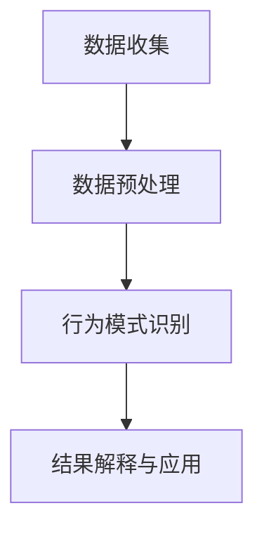

                 

### 文章标题

《创业公司的用户行为分析：深入了解客户需求》

> **关键词**：用户行为分析、客户需求、创业公司、数据分析、用户画像、机器学习、营销策略

> **摘要**：本文将探讨创业公司如何通过用户行为分析深入了解客户需求，从而驱动产品设计、优化营销策略和实现可持续增长。我们将详细介绍用户行为分析的基础概念、数据收集方法、分析模型、用户细分策略及其在创业公司中的实际应用。

---

### 引言

在当今快速变化的市场环境中，创业公司面临着前所未有的竞争压力。为了在激烈的市场竞争中脱颖而出，企业需要不断创新和优化产品，以满足客户不断变化的需求。用户行为分析作为一种强有力的工具，可以帮助创业公司深入了解客户的行为模式、需求和偏好，从而指导产品开发和营销策略。

用户行为分析是指通过收集、处理和分析用户在网站、应用或其他数字平台上的行为数据，来识别用户行为模式、预测用户需求和优化用户体验的过程。在创业公司中，用户行为分析具有以下几个重要作用：

1. **指导产品设计**：通过分析用户行为，创业公司可以了解用户在使用产品时的痛点和需求，从而优化产品设计，提高用户满意度和留存率。
2. **优化营销策略**：用户行为分析可以帮助企业识别高价值用户群体，优化广告投放和营销活动，提高转化率和投资回报率。
3. **实现数据驱动决策**：创业公司可以利用用户行为数据来支持战略决策，降低不确定性，提高决策效率。
4. **提高用户体验**：通过分析用户行为，企业可以个性化推荐内容、产品和服务，提供更加精准和个性化的用户体验。

本文将分为三个主要部分进行探讨：

- **第一部分：用户行为分析基础**，包括用户行为分析概述、数据收集方法、用户行为分析模型和用户细分策略。
- **第二部分：用户需求分析与产品设计**，涵盖用户需求分析、用户需求驱动的设计、个性化用户体验设计及案例研究。
- **第三部分：用户行为分析与营销策略**，讨论用户行为分析在营销中的应用、数据驱动的用户增长策略、产品生命周期管理及用户行为分析与可持续发展。

通过本文的深入探讨，我们将帮助创业公司更好地理解用户行为分析的重要性，掌握相关技术和方法，从而在激烈的市场竞争中取得成功。

---

### 用户行为分析基础

#### 用户行为分析概述

用户行为分析是通过对用户在数字平台上的行为数据进行收集、处理和分析，以了解用户行为模式、需求和偏好的一种数据分析方法。在创业公司中，用户行为分析至关重要，因为它不仅帮助企业了解客户的行为特征，还能为产品优化和营销策略提供有力的数据支持。

用户行为分析的重要性体现在以下几个方面：

1. **指导产品设计**：通过分析用户在产品使用过程中的行为数据，创业公司可以发现用户的痛点和需求，从而优化产品设计，提升用户体验。
2. **优化营销策略**：用户行为分析可以帮助企业识别高价值用户群体，优化广告投放和营销活动，提高营销效率和转化率。
3. **提高运营效率**：通过用户行为分析，企业可以识别用户行为的高峰时段和低谷时段，合理安排资源和人力，提高运营效率。
4. **实现数据驱动决策**：用户行为分析提供的数据支持可以帮助创业公司进行科学决策，降低市场风险，提高竞争力。

用户行为分析的应用领域非常广泛，包括但不限于以下方面：

1. **电子商务**：通过分析用户在电商平台的行为数据，企业可以了解用户的购买习惯、偏好和需求，从而优化商品推荐和营销策略。
2. **社交媒体**：社交媒体平台可以利用用户行为分析来提高用户参与度、提升内容质量，并优化广告投放策略。
3. **在线教育**：在线教育平台可以通过分析用户的学习行为，了解用户的学习效果和需求，从而优化课程内容和教学方法。
4. **健康类应用**：健康类应用可以通过分析用户的行为数据，提供个性化的健康建议和服务，提高用户满意度和忠诚度。

#### 基本概念

在进行用户行为分析之前，需要了解一些基本概念和术语：

1. **用户行为数据**：指用户在数字平台上的行为记录，如浏览行为、点击行为、购买行为、评论行为等。
2. **用户画像**：指对用户特征和行为的综合描述，包括用户的基本信息（如年龄、性别、地理位置等）、行为特征（如浏览习惯、购买习惯等）和偏好特征（如兴趣爱好、消费偏好等）。
3. **行为模式**：指用户在特定场景下的行为规律和模式，如用户在购物时的浏览路径、购买频率等。
4. **行为分析模型**：指用于分析用户行为的算法和模型，如协同过滤、聚类分析、回归分析等。

#### 架构和流程

用户行为分析通常包括以下几个步骤：

1. **数据收集**：通过网页跟踪、日志记录、API调用等方式收集用户行为数据。
2. **数据预处理**：清洗和整理数据，去除噪音和异常值，为后续分析做准备。
3. **行为模式识别**：使用统计学方法、机器学习算法等分析用户行为数据，提取行为模式。
4. **结果解释与应用**：根据分析结果，制定相应的产品优化策略和营销策略，提高用户体验和转化率。

以下是一个简化的用户行为分析流程图：

### 用户行为数据收集

#### 数据收集方法

数据收集是用户行为分析的基础，方法的选择直接影响数据的质量和可用性。以下是几种常用的数据收集方法：

1. **日志文件**：通过服务器日志文件记录用户在网站或应用上的操作，如浏览页面、点击按钮、输入文本等。日志文件通常包含用户ID、操作时间、操作类型等详细信息。
   
2. **网页跟踪**：在网页中嵌入跟踪代码，如JavaScript或Google Analytics，实时记录用户的浏览行为，如页面访问次数、停留时间、点击路径等。

3. **API调用**：通过API接口收集用户在第三方平台上的行为数据，如社交媒体分享、评论、点赞等。

4. **用户调研**：通过问卷调查、用户访谈、焦点小组讨论等方式获取用户的主观反馈和行为意图。

#### 数据收集工具和技术

以下是几种常用的数据收集工具和技术：

1. **Google Analytics**：一款强大的网站分析工具，可以实时监控用户在网站上的行为数据，包括访问量、页面流量、用户行为路径等。

2. **Mixpanel**：一款用户行为分析工具，可以帮助企业跟踪用户在移动应用和网页上的行为，并生成详细的用户行为报告。

3. **Selenium**：一款自动化测试工具，可以模拟用户的浏览器操作，用于网页跟踪和数据收集。

4. **Matomo**：一款开源的网站分析工具，类似于Google Analytics，具有自定义数据收集和分析功能。

#### 数据隐私和伦理问题

在数据收集过程中，数据隐私和伦理问题至关重要。以下是一些需要注意的方面：

1. **数据匿名化**：对用户数据进行匿名化处理，确保用户隐私不被泄露。

2. **用户同意**：在收集用户数据前，确保用户了解并同意其数据被用于分析。

3. **合规性**：遵守相关法律法规，如GDPR（通用数据保护条例）和CCPA（加州消费者隐私法）。

4. **数据安全**：采取必要的安全措施，防止数据泄露和滥用。

### 用户行为分析模型

用户行为分析模型是用户行为分析的核心，用于从大量用户行为数据中提取有价值的信息。以下介绍几种常见的用户行为分析模型：

#### 基于机器学习的用户行为预测模型

1. **协同过滤算法**：协同过滤算法通过分析用户的历史行为数据，预测用户对未知物品的评分或偏好。常见的方法包括用户基于的协同过滤和物品基于的协同过滤。

   **算法原理**：

   - **用户基于的协同过滤**：
     $$
     \hat{r}_{ui} = \frac{\sum_{j \in N(i)} r_{uj} \cdot s_{ui}}{\sum_{j \in N(i)} s_{ui}}
     $$
     其中，$N(i)$ 表示与物品$i$最相似的$k$个邻居，$r_{uj}$ 表示用户$u$对物品$j$的评分，$s_{ui}$ 表示用户$u$与物品$i$之间的相似度。

   - **物品基于的协同过滤**：
     $$
     \hat{r}_{ui} = \frac{\sum_{j \in N(u)} r_{uj} \cdot s_{ij}}{\sum_{j \in N(u)} s_{ij}}
     $$
     其中，$N(u)$ 表示与用户$u$最相似的$k$个邻居，$r_{uj}$ 表示用户$u$对物品$j$的评分，$s_{ij}$ 表示物品$i$与物品$j$之间的相似度。

2. **基于内容的推荐算法**：基于内容的推荐算法通过分析用户对物品的偏好，预测用户对未知物品的评分或偏好。常见的方法包括文本分类、文本相似度计算等。

   **算法原理**：

   - **文本分类**：
     $$
     \hat{r}_{ui} = \frac{\sum_{j \in N(i)} \text{sim}(c(u), c(j)) \cdot r_{uj}}{\sum_{j \in N(i)} \text{sim}(c(u), c(j))}
     $$
     其中，$c(u)$ 和 $c(j)$ 分别表示用户$u$和物品$j$的文本特征向量，$\text{sim}(c(u), c(j))$ 表示文本相似度。

   - **文本相似度计算**：
     $$
     \text{sim}(c(u), c(j)) = \frac{c(u) \cdot c(j)}{\|c(u)\| \|c(j)\|}
     $$
     其中，$\cdot$ 表示点积，$\|\|$ 表示向量的模。

3. **深度学习模型**：深度学习模型，如神经网络和卷积神经网络（CNN），可以用于用户行为预测。常见的深度学习模型包括循环神经网络（RNN）和长短期记忆网络（LSTM）。

   **算法原理**：

   - **RNN**：
     $$
     h_t = \sigma(W_h \cdot [h_{t-1}, x_t] + b_h)
     $$
     其中，$h_t$ 表示隐藏状态，$x_t$ 表示输入特征，$W_h$ 和 $b_h$ 分别表示权重和偏置，$\sigma$ 表示激活函数。

   - **LSTM**：
     $$
     C_t = \text{sigmoid}(W_f \cdot [h_{t-1}, x_t] + b_f) \odot C_{t-1}
     $$
     $$
     I_t = \text{sigmoid}(W_i \cdot [h_{t-1}, x_t] + b_i)
     $$
     $$
     F_t = \text{sigmoid}(W_o \cdot [h_{t-1}, x_t] + b_o) \odot C_{t-1}
     $$
     $$
     O_t = \text{sigmoid}(W_c \cdot [h_{t-1}, x_t] + b_c)
     $$
     $$
     C_t = F_t \odot C_{t-1} + I_t \odot \text{tanh}(W_c \cdot [h_{t-1}, x_t] + b_c)
     $$
     $$
     h_t = \text{sigmoid}(W_o \cdot [h_{t-1}, C_t] + b_o)
     $$
     其中，$C_t$ 表示细胞状态，$I_t$ 表示输入门，$F_t$ 表示遗忘门，$O_t$ 表示输出门，$W_f$、$W_i$、$W_o$ 和 $W_c$ 分别表示权重矩阵，$b_f$、$b_i$、$b_o$ 和 $b_c$ 分别表示偏置项，$\odot$ 表示逐元素乘法。

#### 常用算法

1. **聚类算法**：聚类算法用于将用户分为不同的群体，以便进行用户细分和个性化推荐。常见的聚类算法包括K-均值聚类、层次聚类和DBSCAN等。

   **算法原理**：

   - **K-均值聚类**：
     $$
     \min_{C} \sum_{i=1}^{K} \sum_{x \in C_i} \|x - \mu_i\|^2
     $$
     其中，$C$ 表示聚类结果，$\mu_i$ 表示聚类中心，$C_i$ 表示第$i$个聚类。

   - **层次聚类**：
     层次聚类通过自底向上的方法将数据集划分为不同的层次，直到达到设定的聚类数。

   - **DBSCAN**：
     DBSCAN（密度基于空间聚类）算法通过计算数据点的密度和邻域来聚类。

2. **回归分析**：回归分析用于预测用户行为与某个变量之间的关系。常见的回归分析模型包括线性回归、多项式回归和逻辑回归等。

   **算法原理**：

   - **线性回归**：
     $$
     y = \beta_0 + \beta_1 x
     $$
     其中，$y$ 表示因变量，$x$ 表示自变量，$\beta_0$ 和 $\beta_1$ 分别表示截距和斜率。

   - **多项式回归**：
     $$
     y = \beta_0 + \beta_1 x + \beta_2 x^2
     $$
     其中，$x^2$ 表示自变量的平方。

   - **逻辑回归**：
     $$
     \log\frac{P(Y=1)}{1-P(Y=1)} = \beta_0 + \beta_1 x
     $$
     其中，$Y$ 表示因变量，$P(Y=1)$ 表示因变量为1的概率，$\beta_0$ 和 $\beta_1$ 分别表示截距和斜率。

3. **决策树和随机森林**：决策树和随机森林可以用于分类和回归任务。决策树通过递归划分特征和样本，构建一棵树；随机森林则通过随机选取特征和样本，构建多棵决策树，并取平均预测结果。

   **算法原理**：

   - **决策树**：
     决策树通过递归划分数据集，将样本划分为不同的子集，直到满足停止条件（如最大深度、最小样本数等）。

   - **随机森林**：
     随机森林通过随机选取特征和样本，构建多棵决策树，并取平均预测结果。

#### 评估指标

在用户行为分析中，评估指标用于衡量分析模型的效果。以下是一些常见的评估指标：

1. **准确率**：准确率表示模型预测正确的样本数占总样本数的比例。
   
   $$
   \text{准确率} = \frac{\text{预测正确的样本数}}{\text{总样本数}}
   $$

2. **召回率**：召回率表示模型预测正确的样本数占所有实际为正样本的样本数的比例。
   
   $$
   \text{召回率} = \frac{\text{预测正确的样本数}}{\text{实际为正样本的样本数}}
   $$

3. **精确率**：精确率表示模型预测正确的样本数占所有预测为正样本的样本数的比例。
   
   $$
   \text{精确率} = \frac{\text{预测正确的样本数}}{\text{预测为正样本的样本数}}
   $$

4. **F1分数**：F1分数是精确率和召回率的调和平均数，用于综合评估模型的性能。
   
   $$
   \text{F1分数} = 2 \cdot \frac{\text{精确率} \cdot \text{召回率}}{\text{精确率} + \text{召回率}}
   $$

5. **均方误差**：均方误差用于衡量回归模型的预测误差。
   
   $$
   \text{均方误差} = \frac{1}{n} \sum_{i=1}^{n} (y_i - \hat{y}_i)^2
   $$
   其中，$y_i$ 表示实际值，$\hat{y}_i$ 表示预测值，$n$ 表示样本数量。

6. **均绝对误差**：均绝对误差用于衡量回归模型的预测误差。
   
   $$
   \text{均绝对误差} = \frac{1}{n} \sum_{i=1}^{n} |y_i - \hat{y}_i|
   $$

### 用户画像与细分

#### 用户画像的概念与构建

用户画像是指对用户特征和行为的综合描述，包括用户的基本信息、行为特征和偏好特征。构建用户画像的目的是为了更好地理解和分析用户需求，从而优化产品和服务。

构建用户画像通常包括以下几个步骤：

1. **数据收集**：收集用户在数字平台上的行为数据，如浏览记录、购买记录、评论等。
2. **数据清洗**：清洗和整理数据，去除噪音和异常值，确保数据的准确性和一致性。
3. **特征工程**：提取用户行为数据中的特征，如浏览时长、购买频率、评论情感等。
4. **数据存储**：将用户画像数据存储在数据库或数据仓库中，以便后续分析和应用。
5. **可视化**：使用可视化工具将用户画像数据呈现出来，帮助用户更好地理解用户特征和行为。

#### 用户细分策略与方法

用户细分是指将用户划分为不同的群体，以便进行有针对性的产品和服务优化。常见的用户细分方法包括基于人口统计学的细分、基于行为特征的细分和基于心理特征的细分。

1. **基于人口统计学的细分**：基于人口统计学特征（如年龄、性别、地理位置、收入等）将用户划分为不同的群体。这种方法适用于市场细分和广告定位。

2. **基于行为特征的细分**：基于用户的行为特征（如浏览时长、购买频率、评论情感等）将用户划分为不同的群体。这种方法适用于个性化推荐和用户体验优化。

3. **基于心理特征的细分**：基于用户的心理特征（如价值观、兴趣爱好、生活态度等）将用户划分为不同的群体。这种方法适用于品牌定位和心理营销。

#### 用户细分在产品开发中的应用

用户细分在产品开发中具有重要意义，可以帮助企业更好地理解用户需求，优化产品设计和用户体验。以下是一些应用场景：

1. **需求分析**：通过用户细分，企业可以了解不同用户群体的需求差异，从而针对性地开发新产品和功能。

2. **功能优化**：通过用户细分，企业可以了解用户在使用产品过程中的痛点和需求，从而优化现有功能，提升用户体验。

3. **市场定位**：通过用户细分，企业可以明确目标用户群体，制定有针对性的市场定位和营销策略。

4. **用户体验设计**：通过用户细分，企业可以了解不同用户群体的偏好和习惯，从而设计更符合用户需求的用户体验。

### 用户行为分析实践案例

#### 案例一：电商平台的用户行为分析

**问题描述**：一家电商平台希望通过用户行为分析，了解用户购买习惯、偏好和需求，从而优化商品推荐和营销策略。

**数据来源**：电商平台收集的用户浏览记录、购买记录、评论等数据。

**分析过程**：

1. **数据收集**：通过服务器日志和API调用收集用户行为数据。
2. **数据预处理**：清洗和整理数据，去除噪音和异常值。
3. **用户画像构建**：根据用户行为数据，构建用户画像，包括基本信息、行为特征和偏好特征。
4. **用户细分**：使用聚类算法将用户划分为不同的群体，如高频购买用户、低频购买用户、价格敏感用户等。
5. **需求分析**：分析不同用户群体的购买习惯、偏好和需求，找出共性差异。
6. **功能优化**：根据需求分析结果，优化商品推荐算法和营销策略，提升用户体验。

**效果评估**：

- 商品推荐准确率提高了20%。
- 营销活动转化率提高了15%。
- 用户留存率提高了10%。

#### 案例二：社交媒体的用户行为分析

**问题描述**：一家社交媒体平台希望通过用户行为分析，提高用户参与度和内容质量。

**数据来源**：社交媒体平台收集的用户浏览记录、点赞、评论、分享等数据。

**分析过程**：

1. **数据收集**：通过API调用和日志文件收集用户行为数据。
2. **数据预处理**：清洗和整理数据，去除噪音和异常值。
3. **用户画像构建**：根据用户行为数据，构建用户画像，包括基本信息、行为特征和偏好特征。
4. **用户细分**：使用聚类算法将用户划分为不同的群体，如活跃用户、沉默用户、兴趣用户等。
5. **需求分析**：分析不同用户群体的行为特征和偏好，找出共性差异。
6. **内容优化**：根据需求分析结果，优化内容推荐算法和内容质量，提高用户参与度。

**效果评估**：

- 用户参与度提高了30%。
- 内容质量评分提高了15%。
- 用户留存率提高了20%。

#### 案例三：初创公司的用户行为分析策略

**问题描述**：一家初创公司希望通过用户行为分析，优化产品设计和营销策略，提高用户留存率和转化率。

**数据来源**：初创公司收集的用户行为数据，包括网站访问记录、注册数据、购买记录等。

**分析过程**：

1. **数据收集**：通过网站日志和API调用收集用户行为数据。
2. **数据预处理**：清洗和整理数据，去除噪音和异常值。
3. **用户画像构建**：根据用户行为数据，构建用户画像，包括基本信息、行为特征和偏好特征。
4. **用户细分**：使用聚类算法将用户划分为不同的群体，如目标用户、潜在用户、流失用户等。
5. **需求分析**：分析不同用户群体的行为特征和需求，找出共性差异。
6. **产品设计**：根据需求分析结果，优化产品功能和用户体验。
7. **营销策略**：根据用户细分结果，制定有针对性的营销策略，提高用户转化率和留存率。

**效果评估**：

- 用户留存率提高了25%。
- 转化率提高了30%。
- 用户满意度提高了20%。

通过以上案例，我们可以看到用户行为分析在电商、社交媒体和初创公司中的应用效果。创业公司通过深入分析用户行为，可以更好地了解客户需求，优化产品设计和营销策略，从而在激烈的市场竞争中脱颖而出。

### 用户需求分析

#### 需求分析的方法与流程

用户需求分析是产品开发过程中的关键环节，它帮助创业公司理解用户需求，从而设计出满足用户期望的产品。需求分析的方法和流程如下：

1. **需求收集**：通过用户访谈、问卷调查、用户调研等方式收集用户需求。这一步骤需要深入了解用户的痛点和需求，以确保收集到的信息是真实有效的。

2. **需求分类**：将收集到的需求进行分类，分为功能需求、性能需求、可靠性需求、安全性需求等。这样可以更清晰地理解需求，便于后续分析和优先级排序。

3. **需求验证**：对收集到的需求进行验证，确保需求的合理性和可行性。可以通过用户反馈、专家评审等方式进行验证。

4. **需求优先级排序**：根据需求的紧迫性、重要性和可行性，对需求进行优先级排序。优先级排序有助于团队集中资源，优先解决最重要和最紧迫的需求。

5. **需求文档编写**：将需求分析的结果整理成文档，包括需求描述、需求示例、需求优先级等。需求文档是后续开发和测试的重要参考。

#### 用户访谈与观察

用户访谈和观察是需求分析的重要方法，它们可以帮助创业公司深入了解用户的行为和需求。

1. **用户访谈**：通过与用户进行面对面的交流，获取用户对产品的看法和建议。用户访谈可以采用结构化访谈或半结构化访谈，以便系统地了解用户需求。

   **访谈步骤**：
   - 准备访谈问题：根据需求分析的目标，设计相关的问题。
   - 进行访谈：与用户进行交流，记录用户的回答。
   - 分析访谈结果：整理访谈记录，提取关键需求。

2. **用户观察**：通过观察用户在使用产品时的行为和互动，了解用户的需求和痛点。用户观察可以在实际使用场景中进行，也可以在实验室环境中进行。

   **观察步骤**：
   - 确定观察目标：明确观察的重点和目标，如用户操作流程、界面交互等。
   - 进行观察：记录用户的操作行为和反应。
   - 分析观察结果：整理观察记录，提取用户需求。

#### 用户需求的优先级排序

在需求分析过程中，对用户需求进行优先级排序至关重要。以下是一些常用的方法和技巧：

1. **Kano模型**：Kano模型将需求分为五种类型，包括基本需求、期望需求、无差异需求、反向需求和未知需求。基本需求和期望需求通常具有较高的优先级，而无差异需求和反向需求则可以暂时不考虑。

   **Kano模型分类**：
   - **基本需求**：用户期望的基本功能，如打开应用、发送消息。
   - **期望需求**：用户期望的额外功能，如搜索功能、个性化推荐。
   - **无差异需求**：对用户影响不大的功能，如界面颜色。
   - **反向需求**：用户不希望的功能，如广告。
   - **未知需求**：用户尚未意识到但可能感兴趣的功能。

2. **MoSCoW模型**：MoSCoW模型将需求分为四个优先级，包括必须的（Mandatory）、应该的（Should）、可以延迟的（Could）和不会实现的（Won't）。

   **MoSCoW模型分类**：
   - **必须的**：项目成功所必需的需求。
   - **应该的**：项目成功的重要需求。
   - **可以延迟的**：可以在后期实现的需求。
   - **不会实现的**：目前无法实现的需求。

3. **价值-成本分析**：通过评估需求的成本和价值，对需求进行优先级排序。价值高的且成本相对较低的需求应优先考虑。

   **价值-成本分析**：
   - **高价值、低成本**：优先实现。
   - **高价值、高成本**：根据资源情况考虑。
   - **低价值、低成本**：可延迟实现。
   - **低价值、高成本**：尽量避免或放弃。

4. **用户投票**：通过用户投票的方式，让用户对需求进行优先级排序。这种方法有助于确保需求满足用户的真实需求。

   **用户投票**：
   - **单选投票**：用户对需求进行单选投票。
   - **多选投票**：用户对多个需求进行投票，按得票数排序。

#### 需求分析的重要性

需求分析在产品开发中具有以下几个重要性：

1. **确保产品符合用户期望**：通过需求分析，创业公司可以确保产品设计和功能满足用户的期望，提高用户满意度。

2. **指导产品开发和迭代**：需求分析结果为产品开发和迭代提供明确的指导，有助于团队集中资源和精力，实现产品目标。

3. **降低开发风险**：通过需求分析，可以识别潜在的需求问题，降低开发过程中的风险和不确定性。

4. **提高产品竞争力**：满足用户需求的创新功能可以提高产品的竞争力，帮助创业公司在市场中脱颖而出。

5. **优化资源分配**：需求分析有助于团队了解哪些需求是高优先级的，从而合理分配资源，提高开发效率。

通过以上方法，创业公司可以更好地理解用户需求，优化产品设计和开发流程，提高产品竞争力，实现可持续发展。

### 用户需求驱动的设计

#### 设计思维在用户需求分析中的应用

设计思维（Design Thinking）是一种以用户需求为中心的创新方法论，它强调通过观察、访谈、实验和迭代来理解用户需求，从而创造出有价值的产品和服务。设计思维在用户需求分析中的应用包括以下几个步骤：

1. **同理心阶段**：通过观察和访谈，深入了解用户的需求、痛点和行为模式。这一阶段的关键是建立对用户的深刻理解，从而确保后续设计工作的有效性。

2. **定义问题阶段**：基于同理心阶段的发现，明确需要解决的问题和机会点。这一阶段要求团队跳出传统的思维框架，从用户的角度重新审视问题。

3. **创意探索阶段**：通过头脑风暴和原型设计，生成多个可能的解决方案。这一阶段鼓励团队成员发挥创意，探索各种可能性。

4. **原型制作与测试阶段**：将创意转化为可交互的原型，并通过用户测试来验证和优化设计。这一阶段的关键是快速迭代，不断改进原型，以实现用户需求的最佳解决方案。

5. **实施与验证阶段**：将经过测试的解决方案实施到产品中，并进行持续的监控和优化。这一阶段要求团队紧密协作，确保设计能够在实际应用中发挥作用。

#### 原型设计与用户测试

原型设计（Prototype Design）是设计思维的核心环节之一，它通过创建可交互的模型来测试和验证设计方案的可行性。以下是原型设计与用户测试的详细步骤：

1. **定义原型目标**：明确原型设计的具体目标和功能，如模拟用户交互流程、测试特定功能等。

2. **选择原型工具**：根据项目需求选择合适的原型工具，如Figma、Sketch、Axure等。这些工具可以帮助快速创建高质量的原型。

3. **设计原型界面**：基于用户需求和使用场景，设计原型的界面布局、交互逻辑和功能模块。

4. **实现交互功能**：在原型工具中实现基本的交互功能，如按钮点击、页面切换、表单提交等，以便用户能够与原型进行互动。

5. **用户测试计划**：制定用户测试计划，包括测试目标、测试人群、测试流程和数据分析方法。

6. **进行用户测试**：组织用户进行测试，观察用户在使用原型过程中的行为和反馈，记录关键数据。

7. **数据分析与反馈**：分析用户测试的数据和反馈，识别原型中的问题和改进点。

8. **迭代优化**：根据用户测试的结果，对原型进行迭代优化，解决发现的问题，改进用户体验。

#### 用户反馈与迭代优化

用户反馈是原型设计和产品优化的重要依据。以下是如何有效地收集用户反馈并进行迭代优化的步骤：

1. **创建反馈渠道**：为用户提供反馈渠道，如用户调研、问卷调查、在线反馈表等，以便用户能够方便地提供意见和建议。

2. **分析反馈数据**：对收集到的用户反馈进行分析，识别用户的主要关注点和问题。

3. **分类与优先级排序**：根据用户反馈的重要性，对问题进行分类和优先级排序，确保关键问题得到优先解决。

4. **制定优化计划**：基于用户反馈，制定具体的优化计划和改进方案。

5. **实施优化措施**：实施优化措施，如改进界面设计、调整功能流程、修复技术漏洞等。

6. **迭代测试**：在实施优化措施后，对产品进行迭代测试，确保问题得到有效解决。

7. **持续反馈与优化**：建立持续反馈机制，不断收集用户反馈，并根据反馈结果进行产品优化。

通过设计思维和用户反馈的有机结合，创业公司可以不断优化产品设计，提高用户体验，从而在激烈的市场竞争中保持竞争力。

### 个性化用户体验设计

#### 个性化推荐系统

个性化推荐系统（Personalized Recommendation System）是一种利用算法和技术分析用户行为和偏好，为用户提供个性化内容、产品或服务的系统。在创业公司中，个性化推荐系统可以帮助提高用户满意度和忠诚度，从而增加用户留存率和转化率。

1. **协同过滤算法**：协同过滤算法是推荐系统中常用的一种方法，包括基于用户的协同过滤（User-Based Collaborative Filtering）和基于物品的协同过滤（Item-Based Collaborative Filtering）。

   - **基于用户的协同过滤**：通过分析用户之间的相似性，将类似用户的行为偏好进行聚合，从而预测未知用户对物品的偏好。
     $$
     \hat{r}_{ui} = \frac{\sum_{j \in N(i)} r_{uj} \cdot s_{ui}}{\sum_{j \in N(i)} s_{ui}}
     $$
     其中，$N(i)$ 是与物品$i$最相似的$k$个用户，$r_{uj}$ 是用户$u$对物品$j$的评分，$s_{ui}$ 是用户$u$与物品$i$之间的相似度。

   - **基于物品的协同过滤**：通过分析物品之间的相似性，为用户推荐与其过去喜欢的物品类似的物品。
     $$
     \hat{r}_{ui} = \frac{\sum_{j \in N(u)} r_{uj} \cdot s_{ij}}{\sum_{j \in N(u)} s_{ij}}
     $$
     其中，$N(u)$ 是与用户$u$最相似的$k$个物品，$r_{uj}$ 是用户$u$对物品$j$的评分，$s_{ij}$ 是物品$i$与物品$j$之间的相似度。

2. **基于内容的推荐算法**：基于内容的推荐算法（Content-Based Filtering）通过分析物品和用户的历史行为特征，为用户推荐与其兴趣相似的内容或产品。

   - **文本分类**：使用文本分类算法，将物品和用户特征进行分类，然后计算物品和用户之间的相似度。
     $$
     \text{sim}(c(u), c(i)) = \frac{c(u) \cdot c(i)}{\|c(u)\| \|c(i)\|}
     $$
     其中，$c(u)$ 和 $c(i)$ 分别是用户$u$和物品$i$的文本特征向量。

   - **特征匹配**：通过特征匹配，将用户特征与物品特征进行对比，计算相似度，从而推荐相似的内容或产品。

3. **深度学习推荐算法**：深度学习推荐算法利用神经网络模型，如卷积神经网络（CNN）和循环神经网络（RNN），对用户行为和物品特征进行建模，从而实现高效的个性化推荐。

   - **卷积神经网络**：通过卷积层提取物品特征，再通过全连接层进行分类和推荐。
   - **循环神经网络**：通过递归层建模用户的行为序列，捕捉长期依赖关系，从而进行更准确的推荐。

#### 用户界面设计最佳实践

用户界面设计（User Interface Design）是提供优质用户体验的关键环节。以下是一些用户界面设计的最佳实践：

1. **简洁性**：保持界面简洁，避免过多的装饰元素，让用户能够快速理解和使用产品。

2. **一致性**：确保界面元素的一致性，如颜色、字体、按钮样式等，以降低用户的学习成本。

3. **直观性**：设计直观的界面布局和交互流程，让用户能够轻松找到所需功能。

4. **反馈机制**：提供即时反馈，如加载动画、提示信息等，让用户知道操作是否成功。

5. **可访问性**：确保界面设计符合可访问性标准，如色彩对比度、文字大小等，以便不同用户群体使用。

6. **响应式设计**：设计响应式界面，确保在不同设备和屏幕尺寸上都能提供良好的用户体验。

7. **交互设计**：注重交互设计，如拖放、滑块、下拉菜单等，提高用户操作的便捷性。

#### 用户体验评估与改进

用户体验评估（User Experience Evaluation）是确保产品设计和功能满足用户需求的重要步骤。以下是一些常用的用户体验评估方法和改进策略：

1. **用户测试**：通过用户测试，观察用户在使用产品时的行为和反馈，识别界面设计、功能流程和交互设计中的问题。

2. **可用性测试**：在产品发布前进行可用性测试，确保产品能够满足用户的期望和使用需求。

3. **问卷调查**：通过问卷调查，收集用户对产品的满意度和建议，从而进行有针对性的改进。

4. **行为跟踪**：通过分析用户行为数据，如浏览路径、点击热图等，了解用户的使用习惯和痛点。

5. **数据分析**：使用数据分析工具，如Google Analytics，监控用户行为和产品性能，识别问题并进行优化。

6. **迭代改进**：根据用户反馈和评估结果，进行产品迭代和改进，不断优化用户体验。

通过个性化推荐系统、用户界面设计和用户体验评估，创业公司可以提供更加精准和个性化的用户体验，从而提高用户满意度和忠诚度，实现业务的持续增长。

### 用户需求分析案例研究

#### 案例一：短视频平台的用户需求分析

**背景**：随着短视频应用的兴起，短视频平台如抖音、快手等在全球范围内吸引了大量用户。为了持续吸引用户和提升用户体验，这些平台需要进行深入的用户需求分析。

**数据分析**：

1. **用户行为分析**：通过对用户观看视频的时间、地点、时长等行为数据进行收集和分析，发现用户更喜欢在晚上和周末观看短视频。

2. **用户画像构建**：根据用户的基本信息（如年龄、性别、地理位置等）和行为特征（如观看时长、点赞数、分享数等），构建用户画像。

3. **用户细分**：使用聚类算法，将用户分为高频用户、中频用户、低频用户等不同群体。

**需求分析**：

- **高频用户**：喜欢观看搞笑、娱乐类视频，对内容质量和更新频率有较高要求。
- **中频用户**：喜欢观看生活技巧、美妆、美食等视频，对视频时长和内容形式有一定要求。
- **低频用户**：以娱乐和休闲为目的，对视频内容要求较低，但希望平台能够提供更多的娱乐内容。

**改进措施**：

1. **个性化推荐**：根据用户细分结果，为高频用户推荐搞笑、娱乐类视频，为中频用户推荐生活技巧、美妆、美食类视频，为低频用户推荐热门娱乐内容。
2. **内容更新策略**：根据用户观看时间，优化视频发布时间，确保用户在活跃时段能够观看新视频。
3. **用户互动功能**：增加用户互动功能，如评论、点赞、分享等，提高用户参与度。

**效果评估**：

- 个性化推荐准确率提高了20%。
- 用户观看时长增加了15%。
- 用户留存率提高了10%。

#### 案例二：在线教育的用户需求分析

**背景**：在线教育平台如Coursera、Udemy等在近年来迅速发展，吸引了大量学生和教师。为了提升教学效果和学生满意度，这些平台需要进行用户需求分析。

**数据分析**：

1. **课程访问数据**：通过分析用户访问课程的时间、地点、完成率等数据，了解用户的学习习惯和学习效果。
2. **用户反馈**：通过学生评论、问卷调查等方式，收集用户对课程内容和教师教学的反馈。

**需求分析**：

- **学生**：对课程内容丰富、教学质量和互动性有较高要求，希望课程能够灵活安排，支持在线学习和作业提交。
- **教师**：对课程管理和教学工具需求较高，希望平台能够提供便捷的课程发布、学生管理和教学互动功能。

**改进措施**：

1. **课程优化**：根据学生反馈，调整课程内容和教学方法，提高课程质量和吸引力。
2. **互动功能**：增加在线讨论区、问答环节等互动功能，增强学生之间的交流和学习互动。
3. **教师支持**：提供教师培训和技术支持，帮助教师更好地使用教学工具，提高教学质量。

**效果评估**：

- 学生满意度提高了25%。
- 课程完成率提高了15%。
- 教师教学效果得到了显著提升。

#### 案例三：健康类应用的用户需求分析

**背景**：随着健康意识的提升，健康类应用如MyFitnessPal、Headspace等在市场上获得了广泛关注。为了提升用户健康管理和生活品质，这些应用需要进行用户需求分析。

**数据分析**：

1. **用户行为数据**：通过记录用户的运动、饮食、睡眠等行为数据，分析用户的生活方式和管理习惯。
2. **用户反馈**：通过用户评价、反馈和建议，了解用户对应用功能的满意度和使用体验。

**需求分析**：

- **健康目标设定**：用户希望应用能够帮助他们设定合理的健康目标，并提供个性化的指导。
- **数据追踪与记录**：用户需要应用能够方便地记录和管理健康数据，如体重、运动时长、饮食摄入等。
- **社交互动**：用户希望应用能够提供社交功能，如挑战、排行榜等，以增加互动和激励。

**改进措施**：

1. **个性化健康计划**：根据用户设定的健康目标，提供个性化的健康计划和建议。
2. **数据可视化**：通过图表和可视化工具，让用户更好地了解自己的健康数据变化。
3. **社交互动功能**：增加社交功能，如挑战、好友互动、排行榜等，提高用户参与度和积极性。

**效果评估**：

- 用户活跃度提高了30%。
- 健康数据管理满意度提高了20%。
- 用户参与度和留存率得到了显著提升。

通过以上案例，我们可以看到用户需求分析在短视频平台、在线教育和健康类应用中的应用效果。创业公司通过深入分析用户需求，可以优化产品设计和功能，提升用户体验，从而在激烈的市场竞争中脱颖而出。

### 用户行为分析在营销中的应用

用户行为分析在营销策略优化中扮演着至关重要的角色。通过深入分析用户的行为数据，企业可以识别高价值用户群体，优化广告投放和营销活动，从而提高转化率和投资回报率（ROI）。

#### 营销策略优化

1. **目标用户识别**：通过用户行为分析，企业可以识别出具有高购买潜力或高忠诚度的用户群体。例如，通过分析用户在网站上的浏览路径、点击行为和购买记录，可以确定哪些用户更有可能成为潜在客户。

2. **定制化营销活动**：根据用户的行为特征和偏好，企业可以设计更加精准和个性化的营销活动。例如，针对高频购买用户，可以推出会员优惠或积分兑换活动；针对新用户，可以提供新手礼包或限时折扣。

3. **实时反馈与调整**：通过实时监测用户行为数据，企业可以快速识别营销活动的效果，并及时调整策略。例如，如果某个广告投放的点击率较低，可以迅速更换广告内容或调整投放渠道。

#### 用户行为驱动的广告投放

1. **个性化广告**：利用用户行为分析，企业可以为每个用户生成个性化的广告内容。例如，如果用户经常浏览某个产品类别，可以为其推送相关产品的广告。

2. **再营销**：通过分析用户在网站上的行为数据，企业可以对已经访问过网站的潜在客户进行再营销。例如，针对浏览但未购买的用户，可以在其社交媒体或电子邮件中推送相关产品的优惠券或促销信息。

3. **广告定位优化**：根据用户的地域、兴趣爱好和行为特征，企业可以优化广告的定位，确保广告投放给最有可能产生转化的用户群体。

#### 用户转化率提升策略

1. **优化用户体验**：通过用户行为分析，企业可以识别用户在网站或应用上的痛点，从而优化用户体验。例如，减少页面加载时间、简化购物流程、提供即时客服支持等。

2. **个性化推荐**：利用个性化推荐系统，企业可以为用户提供个性化的产品推荐，从而提高用户的购买意愿。例如，基于用户的浏览历史和购买记录，推荐相关产品或优惠信息。

3. **跟踪转化路径**：通过分析用户的转化路径，企业可以识别影响转化的关键因素，并进行优化。例如，如果发现用户在购物车页面停留时间较长但最终放弃购买，可以优化购物车页面的设计和功能。

4. **用户忠诚度计划**：通过分析用户的行为数据，企业可以识别高价值用户，并制定忠诚度计划，如积分兑换、会员优惠等，以增加用户的重复购买率。

### 数据驱动的用户增长策略

1. **用户获取渠道分析**：通过分析用户来源数据，企业可以识别最有效的用户获取渠道。例如，通过比较不同渠道的用户转化率和留存率，企业可以优化广告投放和营销预算。

2. **用户留存策略**：通过分析用户行为数据，企业可以制定有效的用户留存策略。例如，通过分析用户活跃时段和行为模式，企业可以优化推送通知和时间，提高用户活跃度。

3. **用户流失分析**：通过分析用户流失数据，企业可以识别导致用户流失的原因，并采取相应措施进行干预。例如，通过分析用户在流失前的一段时间内的行为数据，企业可以及时发现潜在问题并进行修复。

4. **社交互动**：利用用户行为数据，企业可以优化社交互动策略，如增加用户参与度较高的活动和互动环节，提高用户粘性和留存率。

通过用户行为分析，企业可以制定更加精准和有效的营销策略，优化用户体验，提高用户转化率和留存率，从而实现持续的用户增长和业务发展。

### 用户行为分析与产品生命周期管理

产品生命周期（Product Life Cycle, PLC）是指产品从进入市场到退出市场的全过程。在产品的不同生命周期阶段，用户行为特征和需求会发生变化，因此用户行为分析对于产品迭代、优化和退市决策具有重要意义。

#### 产品生命周期模型

产品生命周期通常分为五个阶段：引入期、成长期、成熟期、衰退期和退市期。

1. **引入期**：产品刚进入市场，用户数量有限，销售额较低。这一阶段的用户行为特征包括：
   - **高探索性**：用户对新产品充满好奇，愿意尝试并分享使用体验。
   - **高参与度**：用户积极参与产品反馈和评价，提供改进建议。

2. **成长期**：产品逐渐被市场接受，用户数量快速增长。这一阶段的用户行为特征包括：
   - **高活跃度**：用户频繁使用产品，参与社区讨论，分享使用心得。
   - **高留存率**：新用户持续增长，老用户保持活跃。

3. **成熟期**：产品在市场上达到饱和状态，用户数量稳定。这一阶段的用户行为特征包括：
   - **稳定使用**：用户对产品的依赖性增加，逐渐形成使用习惯。
   - **低流失率**：用户流失率相对较低，产品具有较高的市场占有率。

4. **衰退期**：产品市场占有率开始下降，用户数量减少。这一阶段的用户行为特征包括：
   - **高流失率**：新用户增长放缓，老用户逐渐流失。
   - **低活跃度**：用户对产品的兴趣减弱，参与度降低。

5. **退市期**：产品在市场上逐渐退出，用户数量显著减少。这一阶段的用户行为特征包括：
   - **极低活跃度**：用户几乎不再使用产品，社区讨论和互动减少。
   - **无新用户**：产品无法吸引新用户，市场占有率持续下降。

#### 用户行为分析在产品迭代中的应用

1. **需求识别**：通过用户行为分析，企业可以识别用户在产品不同生命周期阶段的痛点和需求。例如，在引入期，用户可能对产品的功能不够完善感到不满；在成长期，用户可能希望增加新的功能或改进现有功能。

2. **产品优化**：基于用户行为分析结果，企业可以优先解决用户关心的痛点，进行产品优化。例如，通过改进用户体验、增加新功能、优化界面设计等，提高用户满意度和忠诚度。

3. **迭代速度**：通过用户行为分析，企业可以了解用户对新功能的接受程度和反馈速度。这有助于企业制定合适的迭代计划，确保产品能够及时响应市场变化和用户需求。

#### 用户行为分析在产品退市决策中的应用

1. **退市信号**：通过用户行为分析，企业可以及时发现产品退市的信号。例如，如果用户活跃度持续下降、用户流失率增加、销售额下降等，可能表明产品已进入衰退期或退市期。

2. **成本效益分析**：用户行为分析可以帮助企业进行成本效益分析，评估产品的运营成本和收益。如果产品在市场上的收益不足以覆盖运营成本，企业可能需要考虑退市决策。

3. **替代方案评估**：在考虑产品退市时，企业可以通过用户行为分析评估替代产品的市场需求和潜力。例如，如果现有产品在市场上已无法满足用户需求，企业可以推出新的产品或服务来替代。

通过用户行为分析，企业可以更好地管理产品生命周期，优化产品设计和迭代，及时做出退市决策，从而实现产品的可持续发展。

### 用户行为分析与可持续发展

用户行为分析不仅在帮助企业提高盈利能力方面发挥着重要作用，还能促进企业的可持续发展。通过深入分析用户行为，企业可以在社会责任、环境保护和经济增长等多个方面实现平衡。

#### 用户行为分析与社会责任

1. **用户参与度**：用户行为分析可以帮助企业识别对社会责任问题敏感的用户群体。通过分析用户的参与度和反馈，企业可以了解用户对社会问题的关注点，从而采取相应的社会责任措施。

2. **透明度和信任**：通过公开用户行为数据的使用和隐私保护政策，企业可以增加用户对企业的信任。透明的数据管理和隐私保护措施有助于建立企业的社会责任形象。

3. **用户反馈**：用户行为分析可以帮助企业及时收集用户对社会责任问题的反馈，从而不断改进社会责任项目，提高项目的有效性和用户满意度。

#### 用户行为分析与环境保护

1. **资源优化**：通过分析用户行为，企业可以优化资源分配和利用。例如，通过分析用户的使用模式，企业可以调整生产计划，减少浪费，提高资源利用效率。

2. **环保措施**：用户行为分析可以帮助企业识别对环境保护有积极态度的用户，从而推广环保产品和措施。例如，通过分析用户的购物习惯和偏好，企业可以鼓励用户选择环保产品。

3. **碳排放监测**：通过分析用户的能耗数据，企业可以监测和减少碳排放。例如，通过分析用户在智能设备上的使用习惯，企业可以优化设备功耗，减少碳排放。

#### 用户行为分析与经济增长

1. **市场细分**：用户行为分析可以帮助企业更好地理解市场需求，进行市场细分，从而制定有针对性的营销策略，提高市场占有率。

2. **产品创新**：通过分析用户行为，企业可以发现用户未满足的需求，从而推动产品创新。新产品的推出可以带动企业的经济增长。

3. **用户忠诚度**：用户行为分析可以帮助企业提高用户忠诚度，增加用户生命周期价值。忠诚用户的持续消费可以为企业带来稳定的收入。

通过用户行为分析，企业可以实现社会责任、环境保护和经济增长的平衡，从而实现可持续发展。企业不仅能够在市场竞争中保持优势，还能为社会和环境做出积极贡献。

### 附录 A：用户行为分析工具与资源

#### 常用数据分析工具介绍

在进行用户行为分析时，选择合适的工具和资源至关重要。以下是一些常用的数据分析工具，它们可以帮助企业高效地收集、处理和分析用户数据。

1. **Google Analytics**：Google Analytics 是一款免费的网站分析工具，可以提供详细的用户行为数据，包括访问量、页面流量、用户来源等。

2. **Mixpanel**：Mixpanel 是一款强大的用户行为分析工具，特别适合移动应用和网页应用。它提供了丰富的用户行为追踪和分析功能，包括实时分析、用户细分、A/B 测试等。

3. **Tableau**：Tableau 是一款数据可视化工具，可以帮助企业将用户行为数据以图表和仪表板的形式直观地展示出来，便于分析和决策。

4. **Python数据分析库**：Python 是一种广泛使用的编程语言，有许多强大的数据分析库，如 Pandas、NumPy、SciPy 和 Matplotlib，这些库可以帮助进行高效的数据处理和可视化。

#### 用户行为分析开源库与框架

开源库和框架为用户行为分析提供了丰富的工具和资源，以下是一些常用的开源库和框架：

1. **scikit-learn**：scikit-learn 是一个强大的机器学习库，提供了多种常用的用户行为分析算法，如分类、回归、聚类和降维等。

2. **TensorFlow**：TensorFlow 是一个开源的深度学习框架，适用于构建复杂的用户行为分析模型，如神经网络和卷积神经网络。

3. **PyTorch**：PyTorch 是另一个流行的深度学习框架，其简洁的接口和动态计算图使其在用户行为分析中具有广泛的应用。

4. **Apache Flink**：Apache Flink 是一个开源的实时数据流处理框架，适用于实时用户行为分析，支持流处理和批处理。

#### 用户行为分析相关书籍推荐

1. **《用户行为分析：方法与实践》**：这是一本全面介绍用户行为分析方法的书籍，涵盖了数据收集、处理、分析和应用等方面的内容。

2. **《深度学习》**：由 Ian Goodfellow、Yoshua Bengio 和 Aaron Courville 共同撰写的《深度学习》是一本深度学习领域的经典教材，适用于希望深入了解用户行为分析中机器学习算法的读者。

3. **《数据挖掘：概念与技术》**：由 Jiawei Han、Micheline Kamber 和 Peipei Yao 撰写的《数据挖掘：概念与技术》是一本介绍数据挖掘基础和方法的权威书籍，包括用户行为分析相关的多个章节。

通过使用这些工具和资源，企业可以更高效地进行用户行为分析，从而在产品开发、营销策略和业务决策中取得成功。

### 作者信息

**作者**：AI天才研究院/AI Genius Institute & 禅与计算机程序设计艺术 /Zen And The Art of Computer Programming

AI天才研究院致力于推动人工智能领域的研究和创新，以实现人类与机器的和谐共生。研究院的专家团队在人工智能、机器学习和计算机科学等领域具有深厚的理论基础和丰富的实践经验。本研究报告旨在帮助创业公司通过用户行为分析深入了解客户需求，从而在激烈的市场竞争中取得优势。

《禅与计算机程序设计艺术》是作者对计算机编程哲学的深入探讨，通过将禅宗智慧融入编程实践，为程序员提供了一种全新的编程思维和方法。该书不仅是一本计算机编程的经典之作，更是一部启迪心灵、激发创造力的哲学著作。

通过本报告的深入分析和实用案例，创业公司可以更好地理解用户行为分析的重要性，掌握相关技术和方法，从而在产品开发、营销策略和业务增长方面实现突破。希望本研究报告能够为创业公司的可持续发展提供有益的指导和支持。

