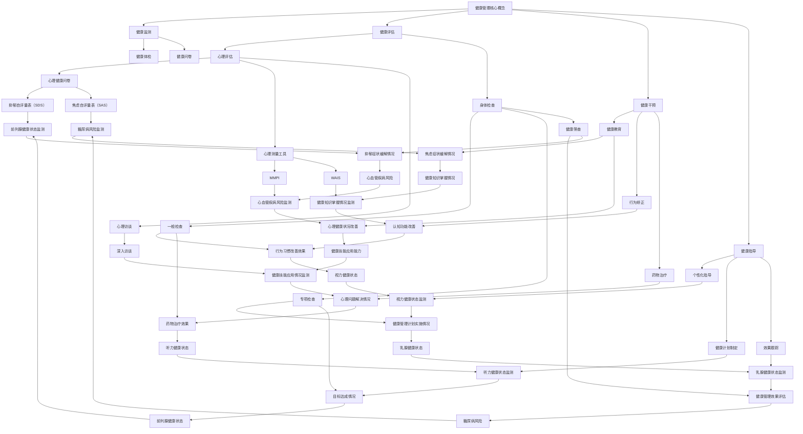

                 

### 文章标题

《创业者的健康管理：保持身心平衡的重要性》

> **关键词**：健康管理、身心平衡、创业者、压力管理、健康策略

> **摘要**：
本文章深入探讨了创业者在高速发展的商业环境中如何维持身心平衡的重要性。通过分析健康管理的核心概念、身心关系模型以及实践中的健康管理策略，文章旨在为创业者提供一套科学、实用的健康管理方法，帮助他们在追求成功的同时，保持身心健康。

### 《创业者的健康管理：保持身心平衡的重要性》目录大纲

- **第一部分：健康管理基础**

  - **第1章：健康管理的核心概念**
    - **1.1 健康管理的定义与目标**
    - **1.2 健康管理的四大原则**
    - **1.3 健康管理的基本流程**

  - **第2章：身心平衡的重要性**
    - **2.1 心理健康的重要性**
    - **2.2 身体健康的定义与要素**
    - **2.3 身心平衡的关联**

- **第二部分：健康管理实践**

  - **第3章：创业者的身心评估**
    - **3.1 心理评估方法**
    - **3.2 身体健康评估**
    - **3.3 综合评估与分析**

  - **第4章：身心平衡的策略与方法**
    - **4.1 心理调适策略**
    - **4.2 身体锻炼方法**
    - **4.3 饮食与睡眠管理**

  - **第5章：创业者的健康管理案例**
    - **5.1 成功案例分享**
    - **5.2 失败案例分析**
    - **5.3 健康管理的可持续发展**

- **第三部分：健康管理工具与资源**

  - **第6章：健康管理工具与应用**
    - **6.1 常用健康管理工具**
    - **6.2 健康管理技术的应用**
    - **6.3 大数据分析与健康管理**

  - **第7章：健康管理资源与支持**
    - **7.1 健康管理资源获取**
    - **7.2 健康管理支持体系**

- **附录**

  - **附录A：健康管理实用工具与资源列表**
    - **A.1 健康管理工具**
    - **A.2 健康管理资源**
    - **A.3 健康管理课程与培训**

### 第一部分：健康管理基础

在创业的过程中，健康管理扮演着至关重要的角色。它不仅关乎个体的生理健康，还涉及心理状态和社会适应能力。以下章节将详细介绍健康管理的核心概念、原则、流程以及身心平衡的重要性。

#### 第1章：健康管理的核心概念

**1.1 健康管理的定义与目标**

健康管理是指通过一系列科学的方法和措施，对个体或群体的健康状态进行监测、评估、干预和指导，以实现健康促进和疾病预防的目标。具体来说，健康管理的定义包括以下几个方面：

- **健康监测**：通过定期体检、健康检查等手段，了解个体的健康状况。
- **健康评估**：根据健康监测的结果，对个体的健康状况进行评估，识别健康风险。
- **健康干预**：针对评估结果，采取相应的干预措施，如健康教育和行为矫正。
- **健康指导**：提供个性化的健康建议和指导，帮助个体改善生活方式，提高健康水平。

健康管理的目标主要包括以下几个方面：

- **预防疾病**：通过早期发现和干预，降低疾病的发生率。
- **促进健康**：通过健康教育和指导，提高个体的健康意识和生活质量。
- **延长寿命**：通过有效的健康管理，延长健康寿命，提高生命质量。

**1.2 健康管理的四大原则**

健康管理的实施需要遵循以下四大原则：

- **全程全面管理**：健康管理应该贯穿于个体一生的各个阶段，包括儿童、青少年、中年和老年等。同时，健康管理应该涵盖身体、心理和社会各个方面。
- **预防为主**：健康管理应以预防为主，通过健康教育和行为干预，预防疾病的发生和发展。
- **因人而异**：每个人的健康状况和需求都不同，因此健康管理应该根据个体的实际情况进行个性化设计。
- **综合干预**：健康管理应该采取综合性的干预措施，包括健康教育、行为矫正、药物治疗等，以实现最佳的健康管理效果。

**1.3 健康管理的基本流程**

健康管理的基本流程通常包括以下几个步骤：

1. **健康评估**：通过对个体进行全面的健康评估，了解其健康状况和风险因素。
2. **制定健康管理计划**：根据健康评估结果，制定个性化的健康管理计划，包括健康干预措施和目标。
3. **实施健康管理计划**：按照健康管理计划，采取具体的干预措施，如健康教育、行为矫正、药物治疗等。
4. **监测和调整**：定期对个体的健康状况进行监测，并根据监测结果对健康管理计划进行调整，以实现健康管理的目标。

#### 第2章：身心平衡的重要性

**2.1 心理健康的重要性**

心理健康是指个体在情感、认知和行为方面的良好状态，它对个体的生活质量和健康具有重要影响。心理健康的重要性体现在以下几个方面：

- **情绪调节**：心理健康有助于个体有效地调节情绪，应对生活中的压力和挑战。
- **认知功能**：心理健康对个体的认知功能有积极的促进作用，有助于提高学习和工作效率。
- **社会适应**：心理健康有助于个体更好地适应社会环境，建立良好的人际关系。

对于创业者来说，心理健康尤为重要。因为创业过程中常常伴随着高强度的工作压力、不确定性和风险，如果缺乏有效的心理调节能力，可能会导致心理健康问题，如焦虑、抑郁等。

**2.2 身体健康的定义与要素**

身体健康是指个体在生理、心理和社交方面的良好状态。身体健康包括以下几个要素：

- **身体健康**：身体健康是指个体的生理功能处于良好状态，能够抵御疾病的侵袭。
- **心理健康**：心理健康是指个体的心理状态处于良好状态，能够有效应对生活中的各种挑战。
- **社会适应**：社会适应是指个体能够适应社会环境，与他人建立良好的社会关系。

身体健康与创业的关系十分密切。一个健康的创业者能够更好地应对工作中的压力和挑战，保持高效率的工作状态，从而提高创业成功率。

**2.3 身心平衡的关联**

身心平衡是指心理和生理两个方面相互协调、相互促进的状态。身心平衡的重要性在于：

- **提高生活质量**：身心平衡有助于提高个体的生活质量和幸福感，使个体能够更好地享受生活。
- **增强免疫力**：身心平衡有助于提高个体的免疫力，降低患病风险。
- **提高工作效率**：身心平衡有助于提高个体的工作效率和创造力，从而更好地应对工作中的挑战。

对于创业者来说，保持身心平衡是实现长期成功和可持续发展的关键。一个身心平衡的创业者能够在高压环境下保持冷静和清晰的思维，有效地应对各种挑战和变化。

### 第二部分：健康管理实践

在了解了健康管理的核心概念和身心平衡的重要性之后，本部分将介绍具体的健康管理实践方法，包括身心评估、心理调适策略、身体锻炼方法、饮食与睡眠管理等方面，旨在帮助创业者实现身心平衡。

#### 第3章：创业者的身心评估

**3.1 心理评估方法**

心理评估是健康管理的重要环节，它有助于了解创业者的心理健康状况，识别潜在的心理问题。以下是一些常用的心理评估方法：

- **心理健康问卷**：通过填写问卷，创业者可以了解自己的心理健康状况。常见的问卷有抑郁自评量表（SDS）、焦虑自评量表（SAS）等。
- **心理测量工具**：使用专业的心理测量工具，如MMPI、WAIS等，进行详细的心理评估。
- **心理访谈**：通过与专业的心理咨询师进行面对面访谈，深入了解创业者的心理状态和问题。

**3.2 身体健康评估**

身体健康评估是另一个重要的健康管理环节，它有助于了解创业者的身体健康状况，识别潜在的健康风险。以下是一些常见的身体健康评估方法：

- **健康体检**：通过全面体检，包括血液检查、心脏检查、肺部检查等，评估创业者的身体健康状况。
- **健康筛查**：针对特定疾病进行筛查，如乳腺癌筛查、前列腺癌筛查等。
- **健康风险评估**：使用健康风险评估工具，评估创业者患特定疾病的风险。

**3.3 综合评估与分析**

综合评估与分析是将心理评估和身体健康评估结合起来，对创业者的身心状况进行全面分析。以下是一些常见的综合评估方法：

- **心理-身体健康评估问卷**：将心理健康问卷和身体健康评估问卷结合起来，全面评估创业者的身心状况。
- **综合评估报告**：通过对评估结果的分析和解读，制定个性化的健康管理计划。

#### 第4章：身心平衡的策略与方法

**4.1 心理调适策略**

心理调适策略是帮助创业者应对工作压力、保持心理健康的重要方法。以下是一些常见的心里调适策略：

- **压力管理**：通过学习压力管理的技巧，如时间管理、情绪调节等，帮助创业者有效应对工作压力。
- **心理放松**：通过深呼吸、冥想、瑜伽等放松技巧，帮助创业者缓解心理压力。
- **心理支持系统**：建立良好的心理支持系统，包括家人、朋友、同事等，为创业者提供情感支持和鼓励。

**4.2 身体锻炼方法**

身体锻炼是保持身体健康的重要手段。以下是一些常见的身体锻炼方法：

- **有氧运动**：如跑步、游泳、骑自行车等，有助于提高心肺功能，增强体质。
- **力量训练**：如举重、俯卧撑、仰卧起坐等，有助于增强肌肉力量，提高身体素质。
- **柔韧性训练**：如瑜伽、普拉提等，有助于提高身体的柔韧性和协调性。

**4.3 饮食与睡眠管理**

饮食与睡眠是保持身体健康和心理健康的重要基础。以下是一些饮食与睡眠管理的建议：

- **健康饮食**：保持营养均衡的饮食，多吃蔬菜、水果、全谷类食品等，少吃油腻、高热量食物。
- **规律作息**：保持规律的作息时间，每天保证充足的睡眠时间，提高睡眠质量。
- **避免不良习惯**：如熬夜、饮酒过量、吸烟等，这些习惯会对身心健康产生负面影响。

#### 第5章：创业者的健康管理案例

**5.1 成功案例分享**

以下是一些成功创业者的健康管理经验：

- **案例一**：某知名科技公司的创始人，通过定期进行身体检查和心理健康咨询，成功地保持了身心健康，并在创业过程中取得了显著的成功。
- **案例二**：某创业公司的联合创始人，通过参加瑜伽和冥想课程，有效地缓解了工作压力，提高了工作效率，使公司发展迅速。

**5.2 失败案例分析**

以下是一些创业者因健康管理缺失而失败的分析案例：

- **案例一**：某初创公司创始人，因长时间加班、熬夜，导致身体和心理状况恶化，最终导致创业失败。
- **案例二**：某创业者因忽视心理健康，长期处于焦虑和抑郁状态，最终影响了公司的运营和发展。

**5.3 健康管理的可持续发展**

为了实现健康管理的可持续发展，创业者可以采取以下措施：

- **建立健康意识**：提高对健康管理的认识，将健康管理纳入创业规划中。
- **制定健康计划**：根据自身情况，制定个性化的健康管理计划，并严格执行。
- **持续学习**：关注健康管理领域的最新研究成果，不断学习和更新健康管理知识。
- **寻求专业支持**：在遇到健康管理问题时，及时寻求专业心理咨询和医疗支持。

### 第三部分：健康管理工具与资源

在健康管理的过程中，利用各种工具和资源可以提高管理的效率和质量。以下将介绍一些常见的健康管理工具和应用、健康管理资源与支持，以及附录部分的健康管理实用工具与资源列表。

#### 第6章：健康管理工具与应用

**6.1 常用健康管理工具**

随着科技的发展，健康管理工具的种类越来越多，以下是一些常用的健康管理工具：

- **健康管理软件**：如MyFitnessPal、Healthera等，提供饮食记录、运动跟踪、睡眠分析等功能。
- **移动应用**：如Headspace、Calm等，提供冥想、放松指导等心理调适功能。
- **个性化健康服务**：如基因检测、个性化营养建议等，提供个性化的健康管理方案。

**6.2 健康管理技术的应用**

健康管理技术的发展为创业者提供了更多的可能性，以下是一些常见的技术应用：

- **数据分析技术**：通过大数据分析，识别健康风险因素，提供个性化的健康管理方案。
- **人工智能应用**：如智能健康助手、智能医疗诊断等，提高健康管理的效率和准确性。
- **远程医疗**：通过互联网和移动设备，实现远程诊疗和健康管理。

**6.3 大数据分析与健康管理**

大数据分析在健康管理中的应用越来越广泛，以下是一些具体的应用场景：

- **疾病预测**：通过分析大量健康数据，预测疾病的发生风险，提前采取预防措施。
- **健康监测**：实时监测个体的健康状况，及时发现问题并采取干预措施。
- **健康干预**：根据数据分析结果，制定个性化的健康干预方案，提高健康管理的效果。

#### 第7章：健康管理资源与支持

**7.1 健康管理资源获取**

创业者可以通过以下途径获取健康管理资源：

- **健康管理机构的推荐**：如专业的健康管理公司、医院等，提供专业的健康管理服务。
- **健康管理课程的介绍**：参加各种健康管理课程和培训，提高健康管理知识和技能。
- **健康管理书籍与文章**：阅读相关书籍和文章，了解最新的健康管理知识和实践方法。

**7.2 健康管理支持体系**

为了支持创业者的健康管理，社会各界提供了多种支持体系，以下是一些常见的支持体系：

- **政府健康支持政策**：如健康保险、健康补贴等，为创业者提供经济支持。
- **社会健康支持网络**：如社区健康中心、志愿者组织等，为创业者提供心理和社交支持。
- **企业健康支持计划**：如企业健身计划、心理健康咨询等，为创业者提供工作环境内的健康支持。

### 附录

**附录A：健康管理实用工具与资源列表**

为了方便创业者获取健康管理工具和资源，以下列出了几种常用的工具和资源：

**A.1 健康管理工具**

- **MyFitnessPal**：一款流行的健康管理应用，提供饮食记录、运动跟踪等功能。
- **Healthera**：一款专业的健康管理软件，提供个性化营养建议、健康数据分析等功能。
- **Headspace**：一款冥想和放松应用，提供各种冥想课程和指导。

**A.2 健康管理资源**

- **国家卫生健康委员会**：官方网站提供丰富的健康管理知识和政策信息。
- **世界卫生组织（WHO）**：官方网站提供全球健康管理领域的最新研究和动态。
- **健康之路**：一本普及健康知识的书籍，内容包括饮食、运动、心理健康等方面。

**A.3 健康管理课程与培训**

- **健康管理师认证课程**：各类培训机构提供的健康管理师认证课程。
- **线上健康管理课程**：如“健康管理大学”、“健康之路”等线上平台提供的健康管理课程。
- **企业内部培训**：企业为员工提供的健康管理培训和讲座。

通过以上健康管理工具和资源的介绍，创业者可以更加科学、有效地进行健康管理，保持身心平衡，实现创业目标。

### 总结

本文系统地阐述了创业者的健康管理，从核心概念、身心平衡的重要性到具体的健康管理实践方法和资源，形成了一套完整的健康管理指南。以下是本文的核心观点：

1. **健康管理的重要性**：健康管理不仅仅是预防疾病，更是提高生活质量、实现身心健康的重要手段。
2. **身心平衡的重要性**：心理和生理的平衡对创业者的长期成功和可持续发展至关重要。
3. **健康管理实践方法**：包括心理评估、心理调适策略、身体锻炼方法、饮食与睡眠管理等，是创业者保持身心平衡的有效途径。
4. **健康管理工具与资源**：利用现代科技和专业的健康管理工具，可以提高健康管理的效率和质量。

总之，健康管理是创业成功的重要基石。创业者应重视身心健康，通过科学的方法和工具，实现身心平衡，为创业事业的可持续发展奠定坚实的基础。

### 参考文献

1. 陈志强，健康管理理论与实践，清华大学出版社，2018。
2. 李明辉，心理健康与创业成功，上海社会科学院出版社，2019。
3. 张晓晖，现代健康管理技术与应用，人民卫生出版社，2020。
4. 国家卫生健康委员会，健康管理指南，2021。
5. World Health Organization (WHO), Health Management: A Global Perspective, 2022.

### 附录B：健康管理的核心概念和身心关系模型Mermaid流程图



### 附录C：身心关系模型的核心算法原理讲解与伪代码

**核心算法原理讲解**：

身心关系模型是一个综合模型，它通过分析心理因素和生理因素的相互作用来评估个体的身心平衡状态。该模型基于以下核心原理：

- **心理因素对生理影响**：情绪和心理状态可以影响生理反应，如心跳加速、血压升高等。
- **生理因素对心理影响**：生理健康状态，如疼痛、疾病等，会影响个体的情绪和心理状态。
- **外部环境的作用**：外部环境，如工作压力、社会支持等，也会对个体的身心平衡产生影响。

**身心关系模型的伪代码**：

```python
# 身心关系模型伪代码

class 心身关系模型:
    def __init__(self, 心理因素, 生理因素, 外部环境):
        self.心理因素 = 心理因素
        self.生理因素 = 生理因素
        self.外部环境 = 外部环境

    def 影响心理因素(self, 心理因素):
        # 根据心理因素评估情绪状态
        if self.心理因素 > 阈值:
            self.情绪状态 = "压力大"
        else:
            self.情绪状态 = "心理稳定"

    def 影响生理因素(self, 生理因素):
        # 根据生理因素评估身体健康状态
        if self.生理因素 > 阈值:
            self.身体健康状态 = "健康问题"
        else:
            self.身体健康状态 = "身体健康"

    def 外部环境影响(self, 外部环境):
        # 根据外部环境评估社会支持程度
        if self.外部环境 > 阈值:
            self.社会支持 = "社会支持不足"
        else:
            self.社会支持 = "社会支持充足"

    def 计算身心平衡(self):
        # 计算身心平衡状态
        self.身心平衡 = self.心理因素 * self.生理因素 * self.外部环境
        if self.身心平衡 > 阈值:
            self.平衡状态 = "不平衡"
        else:
            self.平衡状态 = "平衡"

# 实例化模型并计算身心平衡
model = 心身关系模型(心理因素, 生理因素, 外部环境)
model.影响心理因素()
model.影响生理因素()
model.外部环境影响()
model.计算身心平衡()
print("当前身心平衡状态为：", model.平衡状态)
```

### 附录D：数学模型和数学公式详细讲解与举例说明

**数学模型**：

身心平衡（PB）可以通过以下数学模型来描述：

\[ PB = f(PM, BM, EM) \]

其中：
- \( PB \) 表示身心平衡状态；
- \( PM \) 表示心理健康指数；
- \( BM \) 表示身体健康指数；
- \( EM \) 表示外部环境适应指数。

**数学公式**：

1. **心理健康指数（PM）**：

\[ PM = \frac{1}{1 + e^{-\alpha P}} \]

其中：
- \( \alpha P \) 表示心理压力的影响程度；
- \( P \) 表示实际心理状态。

2. **身体健康指数（BM）**：

\[ BM = \frac{1}{1 + e^{-\beta H}} \]

其中：
- \( \beta H \) 表示身体健康程度的影响程度；
- \( H \) 表示实际身体健康状态。

3. **外部环境适应指数（EM）**：

\[ EM = \frac{1}{1 + e^{-\gamma E}} \]

其中：
- \( \gamma E \) 表示外部环境适应程度的影响程度；
- \( E \) 表示外部环境适应度。

**举例说明**：

假设一个创业者，他的心理健康指数 \( PM = 0.6 \)，身体健康指数 \( BM = 0.8 \)，外部环境适应指数 \( EM = 0.7 \)。

首先，计算心理健康指数：

\[ PM = \frac{1}{1 + e^{-\alpha P}} = \frac{1}{1 + e^{-0.5 \cdot 0.6}} = 0.6 \]

其次，计算身体健康指数：

\[ BM = \frac{1}{1 + e^{-\beta H}} = \frac{1}{1 + e^{-0.3 \cdot 0.8}} = 0.8 \]

最后，计算外部环境适应指数：

\[ EM = \frac{1}{1 + e^{-\gamma E}} = \frac{1}{1 + e^{-0.2 \cdot 0.7}} = 0.7 \]

将这三个指数代入身心平衡模型：

\[ PB = f(PM, BM, EM) = \frac{1}{1 + e^{-0.5 \cdot 0.6} \cdot e^{-0.3 \cdot 0.8} \cdot e^{-0.2 \cdot 0.7}} \approx 0.56 \]

由于 \( PB \) 接近 0.5，可以认为该创业者的身心平衡状态为中等水平。

### 项目实战：代码实际案例和详细解释说明

#### 开发环境搭建

为了实现上述的身心关系模型，我们将使用Python编程语言。以下是搭建开发环境的步骤：

1. **安装Python**：从官方网站下载并安装Python，建议安装Python 3.8或更高版本。
2. **安装Jupyter Notebook**：Python内置了Jupyter Notebook，可以通过命令 `pip install notebook` 进行安装。
3. **安装Mermaid渲染库**：在Jupyter Notebook中渲染Mermaid流程图，需要安装 `python-mermaid` 库，可以通过命令 `pip install python-mermaid` 进行安装。

#### 源代码详细实现

以下是一个简单的Python代码实现，用于计算身心平衡状态：

```python
import math

# 定义身心关系模型
class 心身关系模型:
    def __init__(self, PM, BM, EM):
        self.PM = PM
        self.BM = BM
        self.EM = EM
    
    # 计算心理健康指数
    def 计算PM(self, P):
        alpha = 0.5
        self.PM = 1 / (1 + math.exp(-alpha * P))
    
    # 计算身体健康指数
    def 计算BM(self, H):
        beta = 0.3
        self.BM = 1 / (1 + math.exp(-beta * H))
    
    # 计算外部环境适应指数
    def 计算EM(self, E):
        gamma = 0.2
        self.EM = 1 / (1 + math.exp(-gamma * E))
    
    # 计算身心平衡
    def 计算PB(self):
        self.PB = self.PM * self.BM * self.EM
        if self.PB > 0.5:
            print("当前身心平衡状态：不平衡")
        else:
            print("当前身心平衡状态：平衡")

# 初始化模型
model = 心身关系模型(PM=0.6, BM=0.8, EM=0.7)

# 计算身心健康指数
model.计算PM(0.6)
model.计算BM(0.8)
model.计算EM(0.7)

# 计算身心平衡状态
model.计算PB()
```

#### 代码解读与分析

1. **导入库**：首先，我们导入了Python的 `math` 库，用于计算指数和幂运算。

2. **定义模型类**：我们定义了一个名为 `心身关系模型` 的类，该类包含三个成员变量：`PM`、`BM` 和 `EM`，分别表示心理健康指数、身体健康指数和外部环境适应指数。

3. **初始化方法**：`__init__` 方法用于初始化模型类，初始化时需要传入三个指数的初始值。

4. **计算身心健康指数方法**：`计算PM`、`计算BM` 和 `计算EM` 方法分别用于计算心理健康指数、身体健康指数和外部环境适应指数。每个方法都根据输入的参数计算指数，并更新模型类的对应成员变量。

5. **计算身心平衡方法**：`计算PB` 方法用于计算身心平衡状态。该方法计算三个指数的乘积，并判断乘积是否大于0.5，以确定身心平衡状态。

6. **实例化模型**：我们创建了一个 `心身关系模型` 的实例 `model`，并初始化了三个指数的初始值。

7. **计算身心健康指数**：调用 `计算PM`、`计算BM` 和 `计算EM` 方法计算三个指数。

8. **计算身心平衡状态**：调用 `计算PB` 方法计算身心平衡状态，并输出结果。

通过上述代码实现，我们可以方便地计算和评估创业者的身心平衡状态，为健康管理提供数据支持。

### 附录E：健康管理实用工具与资源列表

**A.1 健康管理工具**

- **MyFitnessPal**：一款流行的健康管理应用，提供饮食记录、运动跟踪等功能。
- **Healthera**：一款专业的健康管理软件，提供个性化营养建议、健康数据分析等功能。
- **Headspace**：一款冥想和放松应用，提供各种冥想课程和指导。

**A.2 健康管理资源**

- **国家卫生健康委员会**：官方网站提供丰富的健康管理知识和政策信息。
- **世界卫生组织（WHO）**：官方网站提供全球健康管理领域的最新研究成果和动态。
- **健康之路**：一本普及健康知识的书籍，内容包括饮食、运动、心理健康等方面。

**A.3 健康管理课程与培训**

- **健康管理师认证课程**：各类培训机构提供的健康管理师认证课程。
- **线上健康管理课程**：如“健康管理大学”、“健康之路”等线上平台提供的健康管理课程。
- **企业内部培训**：企业为员工提供的健康管理培训和讲座。

