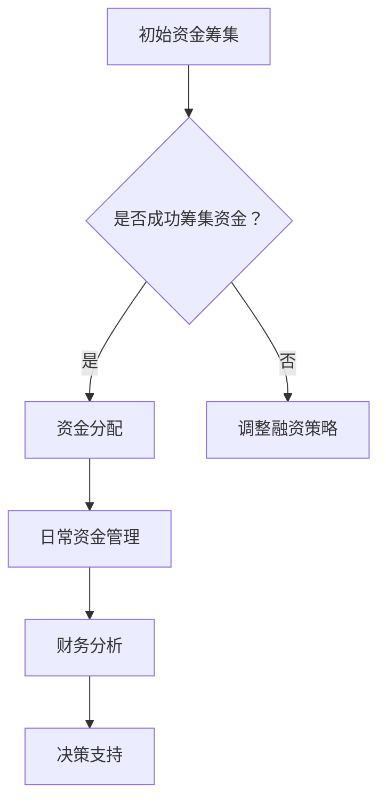

                 

# 《创业者的财务素养与资金管理技巧》

> **关键词**：财务素养、资金管理、创业、资金筹集、成本控制、投资决策、财务风险管理、财务披露

> **摘要**：本文将深入探讨创业者在创业过程中所需具备的财务素养与资金管理技巧。通过详细解读财务报表、分析财务指标、掌握资金管理策略，以及应对财务风险，本文旨在为创业者提供一套全面的财务管理和决策指南，助力创业成功。

## 目录

#### 第一部分：财务素养基础

1. **财务素养概述**
   - **1.1 财务素养的重要性**
   - **1.2 财务报表解读**
   - **1.3 财务指标分析**

2. **资金管理基础**
   - **2.1 资金管理概述**
   - **2.2 资金筹集策略**
   - **2.3 资金运用策略**

#### 第二部分：财务分析与决策

3. **财务分析与决策**
   - **3.1 财务分析工具与方法**
   - **3.2 成本控制与预算管理**
   - **3.3 投资决策分析**

#### 第三部分：财务风险管理

4. **财务风险管理**
   - **4.1 财务风险管理概述**
   - **4.2 财务风险识别与评估**
   - **4.3 财务风险应对策略**

#### 第四部分：财务报告与披露

5. **财务报告与披露**
   - **5.1 财务报告编制**
   - **5.2 财务信息披露**
   - **5.3 财务审计与合规**

#### 第五部分：案例研究与实战

6. **创业者的财务实战案例**
   - **6.1 案例一：初创企业的融资与资金管理**
   - **6.2 案例二：成长型企业的财务管理**
   - **6.3 案例三：上市公司的财务风险管理**

#### 第六部分：财务素养提升与资源指南

7. **财务素养提升与资源指南**
   - **7.1 财务素养提升途径**
   - **7.2 财务资源指南**

#### 附录

8. **附录A：财务术语解释**

9. **附录B：Mermaid 流�程图示例**

10. **附录C：伪代码示例**

11. **附录D：数学模型与公式**

### 财务素养概述

#### 1.1 财务素养的重要性

财务素养是指个人或组织在财务管理和决策方面的知识和能力。对于创业者来说，财务素养的重要性不言而喻。以下将详细探讨财务素养对企业的影响以及创业者需要具备的财务素养。

#### 1.1.1 财务素养对企业的影响

- **提高企业盈利能力**：财务素养可以帮助创业者更好地理解和分析企业的财务状况，从而制定出有效的盈利策略。

- **优化企业资源配置**：通过财务素养，创业者可以更准确地评估企业的资产和负债，从而优化资源配置，提高资金使用效率。

- **降低企业财务风险**：财务素养有助于创业者识别和评估潜在的财务风险，采取相应的风险管理措施，降低企业破产风险。

- **提升企业竞争力**：具备财务素养的创业者能够更准确地把握市场动态，制定出具有竞争力的企业战略。

#### 1.1.2 创业者需要具备的财务素养

- **财务基础知识**：创业者需要掌握基本的财务概念，如资产、负债、收入、利润等，以及财务报表的编制和解读。

- **财务分析能力**：创业者需要具备分析财务报表、计算财务指标的能力，从而准确评估企业的财务状况。

- **资金管理能力**：创业者需要了解如何筹集资金、运用资金，以及如何进行成本控制和预算管理。

- **投资决策能力**：创业者需要掌握投资决策的原则和方法，以便做出正确的投资选择。

- **财务风险管理能力**：创业者需要了解财务风险的概念和类型，掌握财务风险管理的策略和方法。

### 财务报表解读

#### 1.2.1 资产负债表解读

资产负债表是反映企业在一定时期财务状况的重要报表。它主要包括资产、负债和所有者权益三个部分。

- **资产**：资产是企业拥有的具有经济价值的资源，包括流动资产和非流动资产。流动资产主要包括现金、应收账款、存货等，非流动资产主要包括固定资产、无形资产等。

- **负债**：负债是企业承担的债务，包括流动负债和非流动负债。流动负债主要包括应付账款、短期借款等，非流动负债主要包括长期借款、应付债券等。

- **所有者权益**：所有者权益是企业所有者对企业资产净值的拥有权，包括实收资本、资本公积、盈余公积、未分配利润等。

#### 1.2.2 利润表解读

利润表是反映企业在一定时期经营成果的报表。它主要包括收入、费用和利润三个部分。

- **收入**：收入是企业通过销售商品、提供劳务等日常经营活动所取得的收入。

- **费用**：费用是企业为经营活动中所发生的成本和费用。

- **利润**：利润是收入减去费用后的余额。

#### 1.2.3 现金流量表解读

现金流量表是反映企业在一定时期现金流入和流出的报表。它主要包括经营活动、投资活动和筹资活动三个部分。

- **经营活动现金流量**：经营活动现金流量是企业日常经营活动所引起的现金流入和流出。

- **投资活动现金流量**：投资活动现金流量是企业投资活动所引起的现金流入和流出。

- **筹资活动现金流量**：筹资活动现金流量是企业筹资活动所引起的现金流入和流出。

### 财务指标分析

#### 1.3.1 盈利能力分析

盈利能力分析主要通过分析企业的利润率指标来进行。利润率指标包括毛利率、净利润率、营业利润率等。

- **毛利率**：毛利率是销售收入减去销售成本后的余额与销售收入的比率，用于衡量企业的销售盈利能力。

- **净利润率**：净利润率是净利润与销售收入的比率，用于衡量企业的整体盈利能力。

- **营业利润率**：营业利润率是营业利润与销售收入的比率，用于衡量企业主营业务盈利能力。

#### 1.3.2 财务稳定性分析

财务稳定性分析主要通过分析企业的偿债能力指标和资本结构指标来进行。偿债能力指标包括流动比率、速动比率、利息保障倍数等，资本结构指标包括资产负债率、流动比率等。

- **流动比率**：流动比率是流动资产与流动负债的比率，用于衡量企业的短期偿债能力。

- **速动比率**：速动比率是（流动资产 - 存货）与流动负债的比率，用于衡量企业的短期偿债能力。

- **利息保障倍数**：利息保障倍数是息税前利润与利息支出的比率，用于衡量企业的长期偿债能力。

#### 1.3.3 资产运营效率分析

资产运营效率分析主要通过分析企业的资产周转率指标来进行。资产周转率指标包括总资产周转率、流动资产周转率等。

- **总资产周转率**：总资产周转率是销售收入与总资产的比率，用于衡量企业的资产使用效率。

- **流动资产周转率**：流动资产周转率是销售收入与流动资产的比率，用于衡量企业的流动资产使用效率。

#### 第二部分：资金管理基础

### 2.1 资金管理概述

资金管理是企业财务管理的核心内容之一，涉及到资金的筹集、运用和监控等方面。本章节将详细探讨资金管理的概念、重要性以及基本原则。

#### 2.1.1 资金管理的概念

资金管理是指企业通过对资金的筹集、运用和监控，实现资金的高效利用和保值增值的过程。资金管理包括以下主要方面：

- **资金筹集**：企业通过各种渠道筹集所需资金，包括内部筹集和外部筹集。

- **资金运用**：企业将筹集到的资金用于日常经营和投资活动，确保资金的有效运用。

- **资金监控**：企业对资金的流动和使用情况进行监控，确保资金安全、合规和高效。

#### 2.1.2 资金管理的重要性

资金管理在企业发展中具有重要性，主要体现在以下几个方面：

- **确保企业运营资金**：资金管理确保企业拥有足够的运营资金，以维持日常经营活动。

- **提高企业盈利能力**：有效的资金管理有助于企业降低资金成本，提高盈利能力。

- **优化企业资源配置**：资金管理有助于企业合理配置资源，提高资金使用效率。

- **降低财务风险**：通过资金管理，企业可以降低资金短缺、资金过剩等财务风险。

#### 2.1.3 资金管理的基本原则

资金管理需要遵循以下基本原则，以确保资金的有效管理和使用：

- **合理性**：企业应根据实际需求筹集资金，避免过度筹资或不足筹资。

- **安全性**：企业应确保资金的安全，避免资金损失。

- **流动性**：企业应保持资金的流动性，以满足日常经营需求。

- **效益性**：企业应通过有效的资金管理，实现资金的保值增值。

#### 2.2 资金筹集策略

资金筹集是企业资金管理的重要环节，涉及到内部资金筹集和外部资金筹集。本章节将详细探讨资金筹集策略以及外部资金筹集的成本分析。

#### 2.2.1 内部资金筹集

内部资金筹集是指企业通过内部资金来源筹集所需资金。内部资金来源主要包括以下几个方面：

- **留存收益**：企业通过留存净利润来筹集资金。

- **内部融资**：企业通过内部融资渠道，如内部借款、内部集资等来筹集资金。

- **固定资产处置**：企业通过处置固定资产来筹集资金。

#### 2.2.2 外部资金筹集

外部资金筹集是指企业通过外部资金来源筹集所需资金。外部资金来源主要包括以下几个方面：

- **银行贷款**：企业通过向银行申请贷款来筹集资金。

- **发行债券**：企业通过发行债券来筹集资金。

- **股权融资**：企业通过发行股票来筹集资金。

#### 2.2.3 资金筹集成本分析

资金筹集成本是企业筹集资金过程中所需支付的各种费用，包括利息、手续费、发行费用等。资金筹集成本的高低直接影响企业的资金成本和盈利能力。以下为资金筹集成本分析：

- **利率**：利率是资金筹集成本的主要组成部分，直接影响企业的资金成本。

- **手续费**：企业通过银行贷款、发行债券等途径筹集资金时，需要支付一定的手续费。

- **发行费用**：企业通过发行股票等方式筹集资金时，需要支付发行费用。

- **市场风险**：市场风险是指由于市场利率变动等原因导致资金筹集成本变动的风险。

#### 2.3 资金运用策略

资金运用策略是指企业如何将筹集到的资金进行有效运用，以实现企业的经营目标和价值最大化。以下为资金运用策略的几个关键方面：

#### 2.3.1 资金运用原则

资金运用需要遵循以下原则：

- **合理分配**：企业应根据经营需求和资金来源的特点，合理分配资金，确保资金的高效利用。

- **优化投资结构**：企业应优化投资结构，合理安排资金在流动资产、固定资产等不同资产之间的分配。

- **注重资金回收**：企业应注重资金回收，确保资金的安全性和流动性。

#### 2.3.2 资金运用规划

资金运用规划是指企业根据经营计划和资金需求，制定具体的资金运用计划。以下为资金运用规划的关键步骤：

1. **确定资金需求**：企业应根据经营计划和资金需求，确定资金需求总量和需求时间。

2. **编制资金运用计划**：企业应根据资金需求，编制具体的资金运用计划，包括资金分配、使用时间、使用方式等。

3. **审批资金运用计划**：企业将资金运用计划提交给管理层审批，确保资金运用计划的合理性和可行性。

#### 2.3.3 资金运用监控与调整

资金运用监控与调整是指企业对资金运用过程进行监控和调整，以确保资金运用计划的实施和调整。以下为资金运用监控与调整的关键方面：

1. **监控资金运用情况**：企业应定期监控资金运用情况，包括资金使用进度、资金使用效果等。

2. **调整资金运用计划**：根据资金运用监控情况，企业应适时调整资金运用计划，确保资金运用计划的实施和优化。

3. **风险控制**：企业应建立风险控制机制，对资金运用过程中的风险进行识别、评估和控制，确保资金运用安全。

### 第三部分：财务分析与决策

#### 3.1 财务分析工具与方法

财务分析是企业管理和决策的重要环节，通过分析企业的财务状况，企业可以更好地了解自身运营状况，为制定发展战略提供数据支持。以下介绍几种常见的财务分析工具与方法。

#### 3.1.1 杜邦分析

杜邦分析是一种常用的财务分析方法，通过将财务指标分解为多个层次，帮助企业深入理解财务状况。杜邦分析主要包括以下几个层次：

1. **盈利能力分析**：通过计算资产回报率（ROA）、股东权益回报率（ROE）等指标，分析企业的盈利能力。

2. **运营效率分析**：通过计算总资产周转率（TAT）、应收账款周转率（AR）、存货周转率（Inventory Turnover）等指标，分析企业的运营效率。

3. **财务杠杆分析**：通过计算财务杠杆倍数（D/E Ratio）、利息保障倍数（Interest Coverage Ratio）等指标，分析企业的财务杠杆状况。

#### 3.1.2 价值链分析

价值链分析是一种用于分析企业竞争优势和资源配置的方法。通过识别企业的价值链活动，企业可以更好地理解其竞争优势，并优化资源配置。以下为价值链分析的主要步骤：

1. **识别价值链活动**：识别企业的所有价值链活动，包括原料采购、生产加工、销售和服务等。

2. **分析价值链活动**：对每个价值链活动进行深入分析，识别其成本和利润贡献。

3. **优化价值链活动**：根据分析结果，优化价值链活动，降低成本，提高利润。

#### 3.1.3 财务比率分析

财务比率分析是一种通过计算和分析企业财务指标之间的关系，评估企业财务状况的方法。以下为几种常见的财务比率：

1. **盈利能力比率**：包括毛利率（Gross Margin）、净利润率（Net Profit Margin）、营业利润率（Operating Margin）等。

2. **流动性比率**：包括流动比率（Current Ratio）、速动比率（Quick Ratio）等。

3. **偿债能力比率**：包括资产负债率（Debt-to-Equity Ratio）、利息保障倍数（Interest Coverage Ratio）等。

4. **资产运营效率比率**：包括总资产周转率（Total Asset Turnover）、流动资产周转率（Current Asset Turnover）等。

#### 3.2 成本控制与预算管理

成本控制与预算管理是企业财务管理的重要组成部分，通过有效的成本控制和预算管理，企业可以降低成本、提高效益，确保企业目标的实现。

#### 3.2.1 成本控制的概念

成本控制是指企业通过制定和执行成本控制策略，降低成本支出，提高成本效益的过程。以下为成本控制的主要目标：

1. **降低成本支出**：通过优化生产流程、提高生产效率等手段，降低成本支出。

2. **提高成本效益**：通过有效的成本控制，提高企业的盈利能力和市场竞争力。

3. **确保成本透明**：通过建立健全的成本核算体系，确保成本信息的准确和透明。

#### 3.2.2 成本控制方法

成本控制方法主要包括以下几种：

1. **标准成本法**：通过制定标准成本，将实际成本与标准成本进行比较，找出差异，进行成本控制。

2. **目标成本法**：通过设定目标成本，将成本控制在目标范围内，实现成本控制。

3. **作业成本法**：通过将成本分配到作业活动中，找出成本动因，进行成本控制。

4. **预算控制法**：通过制定预算，对实际支出进行监控和控制，实现成本控制。

#### 3.2.3 预算管理

预算管理是指企业通过制定、执行和监控预算，实现成本控制和资源配置的过程。以下为预算管理的主要步骤：

1. **制定预算**：根据企业战略和经营计划，制定预算方案，包括收入预算、成本预算、资金预算等。

2. **审批预算**：将预算方案提交给管理层审批，确保预算的合理性和可行性。

3. **执行预算**：根据批准的预算，实施预算计划，确保预算的执行。

4. **监控预算**：定期监控预算执行情况，分析预算执行中的问题，及时进行调整。

5. **评价预算**：对预算执行结果进行评价，总结经验教训，为下一期预算制定提供参考。

#### 3.3 投资决策分析

投资决策是企业财务管理的重要环节，通过科学合理的投资决策，企业可以优化资源配置，实现可持续发展。以下为投资决策分析的方法和步骤。

#### 3.3.1 投资决策原则

投资决策需要遵循以下原则：

1. **效益最大化原则**：投资决策应以实现企业经济效益最大化为目标。

2. **风险可控原则**：投资决策应充分考虑风险因素，确保投资风险在可控范围内。

3. **科学决策原则**：投资决策应基于充分的数据分析，采用科学合理的决策方法。

4. **长期发展原则**：投资决策应着眼于企业的长期发展，考虑企业的战略目标和可持续发展。

#### 3.3.2 投资项目评估方法

投资项目评估方法主要包括以下几种：

1. **净现值法（NPV）**：净现值法是将未来现金流量折现到现值，与初始投资进行比较，判断投资项目的可行性。

   $$ 
   \text{NPV} = \sum_{t=0}^{n} \frac{\text{CF}_t}{(1 + \text{r})^t} - \text{C}_0 
   $$

   其中，\( \text{CF}_t \) 为第 \( t \) 年的现金流量，\( \text{r} \) 为折现率，\( \text{C}_0 \) 为初始投资。

2. **内部收益率法（IRR）**：内部收益率法是使净现值等于零的折现率，用于评估投资项目的盈利能力。

   $$ 
   \text{IRR} = \text{r} \quad \text{such that} \quad \sum_{t=0}^{n} \frac{\text{CF}_t}{(1 + \text{r})^t} = 0 
   $$

3. **回收期法**：回收期法是计算投资项目的回收期，即从投资开始到收回全部投资所需的时间。回收期越短，投资风险越低。

4. **盈利指数法（PI）**：盈利指数法是未来现金净流量现值与原始投资现值的比率，用于评估投资项目的经济效益。

   $$ 
   \text{PI} = \frac{\sum_{t=0}^{n} \frac{\text{CF}_t}{(1 + \text{r})^t}}{\text{C}_0} 
   $$

#### 3.3.3 投资决策案例分析

以下为投资决策案例分析：

**案例背景**：某企业拟投资一个新项目，项目期为5年，预计初始投资为100万元，每年现金净流量为25万元，折现率为10%。

**投资决策分析**：

1. **净现值法**：

   $$
   \text{NPV} = \sum_{t=0}^{4} \frac{25}{(1 + 0.1)^t} - 100 = 25 \times \left(1 - \frac{1}{(1 + 0.1)^5}\right) - 100 \approx 25 \times \left(1 - 0.6217\right) - 100 = 6.425 - 100 = -93.575
   $$

   由于净现值为负，该项目不符合投资标准。

2. **内部收益率法**：

   $$
   \text{IRR} = 10\% \quad \text{such that} \quad 25 \times \left(1 - \frac{1}{(1 + \text{IRR})^5}\right) - 100 = 0 
   $$

   通过试错法或数学计算，求得内部收益率为14.9%。

   由于内部收益率高于折现率，该项目具有投资价值。

3. **回收期法**：

   项目回收期 = 初始投资 / 每年现金净流量 = 100 / 25 = 4年

   由于回收期小于项目期，该项目可以接受。

4. **盈利指数法**：

   $$
   \text{PI} = \frac{25 \times \left(1 - \frac{1}{(1 + 0.1)^5}\right)}{100} = \frac{6.425}{100} = 0.06425
   $$

   由于盈利指数小于1，该项目不符合投资标准。

**投资决策结论**：根据以上分析，该项目不符合净现值法、盈利指数法，但符合回收期法。综合考虑，内部收益率法更为可靠，因此该项目具有投资价值。企业应进一步深入研究该项目，确保投资决策的科学性和可行性。

### 第四部分：财务风险管理

#### 4.1 财务风险管理概述

财务风险管理是指企业在财务活动中，通过识别、评估、监控和应对各种财务风险，确保企业财务稳健发展的过程。以下将详细探讨财务风险管理的概念、类型和重要性。

#### 4.1.1 财务风险的概念

财务风险是指企业在财务活动中可能面临的各种风险，包括市场风险、信用风险、流动性风险、操作风险等。财务风险可能对企业的财务状况、盈利能力和生存发展产生重大影响。

#### 4.1.2 财务风险类型

财务风险主要包括以下几种类型：

- **市场风险**：市场风险是指由于市场波动导致的资产价格波动、利率变化、汇率波动等风险。

- **信用风险**：信用风险是指企业因交易对手违约、信用评级下降等原因导致的信用损失风险。

- **流动性风险**：流动性风险是指企业无法及时偿还债务或满足短期资金需求的风险。

- **操作风险**：操作风险是指由于内部操作失误、系统故障、人员错误等原因导致的财务风险。

#### 4.1.3 财务风险管理重要性

财务风险管理在企业发展中具有重要性，主要体现在以下几个方面：

- **降低财务风险**：通过财务风险管理，企业可以识别、评估和应对各种财务风险，降低财务风险的发生概率和损失程度。

- **提高财务稳健性**：财务风险管理有助于企业保持财务稳健性，确保企业的持续发展。

- **提升企业竞争力**：具备良好财务风险管理能力的企业能够在市场竞争中立于不败之地。

- **保护股东利益**：财务风险管理有助于保护企业股东的利益，降低企业破产风险。

#### 4.2 财务风险识别与评估

财务风险识别与评估是财务风险管理的基础，通过识别和评估财务风险，企业可以了解风险状况，为风险应对提供依据。以下将详细探讨财务风险识别与评估的方法和工具。

#### 4.2.1 财务风险识别方法

财务风险识别方法主要包括以下几种：

- **历史数据分析法**：通过对企业历史财务数据进行分析，识别可能存在的财务风险。

- **专家判断法**：邀请财务专家对企业财务风险进行判断和识别。

- **现场调查法**：通过现场调查，了解企业财务风险的实际情况。

- **财务比率分析法**：通过分析企业财务比率，识别潜在的财务风险。

#### 4.2.2 财务风险评估指标

财务风险评估指标包括定量指标和定性指标，用于评估财务风险的程度。以下为几种常见的财务风险评估指标：

- **风险指标**：包括市场风险指标、信用风险指标、流动性风险指标、操作风险指标等。

- **财务指标**：包括盈利能力指标、偿债能力指标、资产运营效率指标等。

- **非财务指标**：包括企业管理水平、员工素质、企业文化等。

#### 4.2.3 财务风险案例解析

以下为财务风险案例解析：

**案例背景**：某企业主要业务为房地产投资，近年来房地产市场波动较大，企业面临较大的市场风险。

**财务风险识别与评估**：

1. **市场风险识别**：

   - **历史数据分析**：通过对企业历史财务数据进行分析，发现企业近三年房地产投资收益波动较大，存在市场风险。

   - **专家判断**：邀请财务专家对企业市场风险进行评估，专家认为房地产市场波动较大，企业面临的市场风险较高。

   - **现场调查**：通过现场调查，发现企业房地产项目主要集中在一线城市，受房地产市场调控政策影响较大。

2. **市场风险评估**：

   - **风险指标**：计算市场风险指标，如市场波动率、房地产投资回报率等，发现企业市场风险较高。

   - **财务指标**：分析企业盈利能力指标、偿债能力指标、资产运营效率指标等，发现企业盈利能力波动较大，偿债能力较低。

   - **非财务指标**：考虑企业管理水平、员工素质、企业文化等因素，发现企业对市场风险的应对能力不足。

**财务风险应对策略**：

1. **风险规避策略**：

   - **调整投资结构**：企业可以适当调整投资结构，减少房地产投资比例，降低市场风险。

   - **多元化经营**：企业可以开展多元化经营，分散市场风险。

2. **风险转移策略**：

   - **购买保险**：企业可以购买保险，将市场风险转移给保险公司。

   - **签订长期合同**：企业可以与交易对手签订长期合同，降低信用风险。

3. **风险接受策略**：

   - **建立风险准备金**：企业可以建立风险准备金，应对可能的市场风险。

   - **加强内部控制**：企业可以加强内部控制，提高风险管理水平。

4. **风险组合策略**：

   - **优化投资组合**：企业可以优化投资组合，降低投资组合的整体风险。

   - **风险分散**：企业可以通过投资分散，降低单一市场的风险。

### 第五部分：财务报告与披露

#### 5.1 财务报告编制

财务报告是企业财务状况、经营成果和现金流量的重要体现，对于投资者、债权人等利益相关者具有重要意义。以下将详细探讨财务报告的编制内容、流程和准则。

#### 5.1.1 财务报告内容

财务报告主要包括以下几个部分：

- **资产负债表**：资产负债表是反映企业在某一特定时点的财务状况的报表，包括资产、负债和所有者权益三个部分。

- **利润表**：利润表是反映企业在一定时期内经营成果的报表，包括收入、费用和利润三个部分。

- **现金流量表**：现金流量表是反映企业在一定时期内现金流入和流出的报表，包括经营活动、投资活动和筹资活动三个部分。

- **所有者权益变动表**：所有者权益变动表是反映企业在一定时期内所有者权益变动情况的报表。

- **附注**：附注是对财务报告相关内容的详细解释和补充。

#### 5.1.2 财务报告编制流程

财务报告编制流程主要包括以下几个步骤：

1. **收集和整理财务数据**：收集企业各业务部门的财务数据，整理为统一的格式。

2. **编制财务报表**：根据财务数据编制资产负债表、利润表、现金流量表等财务报表。

3. **编制附注**：根据财务报表数据和相关政策，编制附注内容。

4. **审核和批准**：将编制完成的财务报告提交给管理层审核，并经过批准。

5. **对外披露**：将批准的财务报告对外披露，供投资者、债权人等利益相关者查阅。

#### 5.1.3 财务报告准则

财务报告准则是指企业编制财务报告应遵循的标准和规范。以下为几种常见的财务报告准则：

- **国际财务报告准则（IFRS）**：国际财务报告准则是由国际会计准则理事会（IASB）制定的财务报告准则，适用于全球范围内的大部分国家和地区。

- **美国通用会计原则（GAAP）**：美国通用会计原则是由美国财务会计准则委员会（FASB）制定的财务报告准则，适用于美国企业。

- **中国企业会计准则（CAS）**：中国企业会计准则是中国财政部制定的财务报告准则，适用于中国企业。

#### 5.2 财务信息披露

财务信息披露是企业向投资者、债权人等利益相关者公开财务信息的过程，有助于提高企业透明度和市场信任度。以下将详细探讨财务信息披露的重要性、内容和方式。

#### 5.2.1 信息披露的重要性

财务信息披露的重要性主要体现在以下几个方面：

- **提高企业透明度**：财务信息披露有助于提高企业透明度，让投资者、债权人等利益相关者了解企业财务状况。

- **增强市场信任度**：财务信息披露有助于增强市场信任度，提高企业在资本市场上的竞争力。

- **规范企业行为**：财务信息披露有助于规范企业行为，防止财务造假等不正当行为。

- **促进资本市场发展**：财务信息披露是资本市场发展的重要基础，有助于提高市场效率和公平性。

#### 5.2.2 信息披露内容

财务信息披露主要包括以下几个部分：

- **财务报告**：披露企业的财务报告，包括资产负债表、利润表、现金流量表等。

- **重要事项**：披露企业发生的重大事项，如股权变动、重大合同、诉讼等。

- **会计政策**：披露企业的会计政策和会计估计，包括收入确认、成本计算、资产减值等。

- **风险管理**：披露企业的风险管理政策，包括市场风险、信用风险、操作风险等。

#### 5.2.3 信息披露方式

财务信息披露可以通过以下几种方式：

- **公告**：通过证券交易所、企业网站等渠道发布公告，向投资者、债权人等利益相关者披露财务信息。

- **报告**：编制年度报告、季度报告等，向投资者、债权人等利益相关者提供详细的财务信息。

- **投资者关系**：与投资者、债权人等利益相关者建立良好的沟通机制，及时回答他们的疑问。

### 第六部分：创业者的财务实战案例

#### 6.1 案例一：初创企业的融资与资金管理

**案例背景**：某初创企业（以下简称A公司）成立于2018年，主要从事人工智能技术的研究与应用。公司初期资金主要来自创始人的自有资金和天使投资，但在业务拓展过程中，资金需求不断增大。

**融资策略**：

1. **天使投资**：A公司在初期通过寻找天使投资者，获得了500万元的天使投资，用于技术研发和团队建设。

2. **风险投资**：随着业务的发展，A公司于2020年获得了1000万元的风险投资，用于扩大业务规模和市场推广。

3. **政府资助**：A公司积极申请政府科技创新资金和税收优惠，获得了200万元的政府资助。

**资金管理方法**：

1. **资金分配**：A公司根据业务需求，将资金分为技术研发、市场推广、运营费用等几个方面，确保资金的高效利用。

2. **成本控制**：A公司通过优化生产流程、降低运营成本等方式，实现了成本的有效控制。

3. **预算管理**：A公司制定了详细的预算计划，对每笔资金的用途和效果进行监控，确保预算的执行。

**案例分析与启示**：

1. **多元化融资**：初创企业应充分利用各种融资渠道，包括天使投资、风险投资、政府资助等，降低融资成本。

2. **合理分配资金**：初创企业应根据业务需求，合理分配资金，确保资金的高效利用。

3. **强化成本控制**：初创企业应注重成本控制，提高资金使用效率。

#### 6.2 案例二：成长型企业的财务管理

**案例背景**：某成长型企业（以下简称B公司）成立于2015年，主要从事物联网技术的研究与应用。公司经过几年的发展，业务规模不断扩大，资金需求日益增加。

**财务管理策略**：

1. **资金筹集策略**：

   - **内部资金筹集**：B公司通过留存收益、内部融资等方式筹集资金，用于技术研发和业务拓展。

   - **外部资金筹集**：B公司通过发行债券、向银行贷款等方式筹集资金，满足业务拓展的需求。

2. **资金运用策略**：

   - **技术研发**：B公司投入大量资金用于技术研发，提高产品竞争力。

   - **市场推广**：B公司加大市场推广力度，提高品牌知名度。

   - **运营费用**：B公司优化运营费用，降低成本。

**成本控制与预算管理**：

1. **成本控制**：

   - **优化生产流程**：B公司通过优化生产流程，降低生产成本。

   - **采购管理**：B公司通过采购管理，降低采购成本。

   - **运营费用控制**：B公司制定严格的运营费用预算，对运营费用进行严格控制。

2. **预算管理**：

   - **编制预算**：B公司根据业务需求，编制详细的预算计划，确保预算的执行。

   - **监控预算执行**：B公司定期监控预算执行情况，分析预算执行中的问题，及时进行调整。

**案例分析与启示**：

1. **多元化资金筹集**：成长型企业应充分利用各种资金筹集渠道，降低融资成本。

2. **合理运用资金**：成长型企业应根据业务需求，合理运用资金，提高资金使用效率。

3. **强化成本控制与预算管理**：成长型企业应注重成本控制，制定严格的预算计划，确保预算的执行。

#### 6.3 案例三：上市公司的财务风险管理

**案例背景**：某上市公司（以下简称C公司）成立于2000年，主要从事电子信息产品的研发、生产和销售。公司经过多年的发展，业务规模不断扩大，但同时也面临较大的财务风险。

**财务风险管理策略**：

1. **风险识别与评估**：

   - **市场风险**：C公司通过市场分析，识别市场风险，如行业竞争加剧、市场需求波动等。

   - **信用风险**：C公司通过客户信用评估，识别信用风险。

   - **流动性风险**：C公司通过资金管理，识别流动性风险。

   - **操作风险**：C公司通过内部控制，识别操作风险。

2. **风险应对策略**：

   - **风险规避策略**：C公司通过调整业务结构、优化投资组合等方式，规避市场风险。

   - **风险转移策略**：C公司通过购买保险、签订长期合同等方式，转移信用风险和流动性风险。

   - **风险接受策略**：C公司通过建立风险准备金、加强内部控制等方式，接受操作风险。

**案例分析与启示**：

1. **全面识别与评估风险**：上市公司应全面识别和评估各种财务风险，确保风险管理的有效性。

2. **多样化风险应对策略**：上市公司应根据风险类型，采取多样化的风险应对策略，降低风险损失。

3. **强化内部控制**：上市公司应加强内部控制，降低操作风险。

### 第七部分：财务素养提升与资源指南

#### 7.1 财务素养提升途径

提升财务素养是企业成功的关键，以下为几种提升财务素养的途径：

1. **财务知识学习**：

   - **阅读财务书籍**：阅读经典的财务书籍，如《财务管理》、《财务报表分析》等，深入了解财务知识。

   - **参加财务培训**：参加专业的财务培训课程，提高财务专业技能。

   - **在线学习**：利用在线学习平台，如网易云课堂、慕课网等，学习财务知识。

2. **实践经验积累**：

   - **实习或工作**：通过实习或工作，了解企业财务运作流程，积累实践经验。

   - **实际操作**：通过实际操作财务报表、预算管理等，提高财务实操能力。

   - **参与财务项目**：参与企业财务项目，了解财务管理在实际中的应用。

3. **行业交流与学习**：

   - **参加行业会议**：参加行业会议、论坛等，与同行交流，了解行业动态。

   - **加入财务社群**：加入财务社群，与同行交流学习，分享经验和见解。

   - **参加专业认证**：参加专业认证考试，如注册会计师（CPA）、注册管理会计师（CMA）等，提升专业水平。

#### 7.2 财务资源指南

以下为几种常见的财务资源指南，有助于提升财务素养：

1. **专业财务机构**：

   - **会计师事务所**：如普华永道（PwC）、德勤（DTT）、安永（EY）等，提供专业的财务咨询和服务。

   - **财务顾问**：提供财务规划和投资建议，帮助企业解决财务问题。

   - **财务培训机构**：提供专业的财务培训课程，帮助企业提升财务素养。

2. **财务管理软件推荐**：

   - **用友**：提供全面的财务软件解决方案，包括财务报表、预算管理、成本控制等。

   - **金蝶**：提供专业的财务软件，支持多语言、多币种、多税率等个性化需求。

   - **SAP**：提供强大的企业资源计划（ERP）系统，支持企业全面财务管理。

3. **财务书籍与文献推荐**：

   - **《财务管理》**：斯蒂芬·罗斯（Stephen A. Ross）著，全面介绍了财务管理的基本理论和实践方法。

   - **《财务报表分析》**：罗伯特·库尔茨（Robert K. Kurthy）著，详细讲解了财务报表分析的方法和应用。

   - **《财务会计学》**：查尔斯·T·霍普、约翰·J·海因茨（Charles T. Horngren、John J. Heintz）著，全面介绍了财务会计的基本理论和实践。

### 附录A：财务术语解释

#### A.1 财务术语列表

- **资产负债表**：反映企业在一定时点的财务状况的报表，包括资产、负债和所有者权益三个部分。

- **利润表**：反映企业在一定时期内经营成果的报表，包括收入、费用和利润三个部分。

- **现金流量表**：反映企业在一定时期内现金流入和流出的报表，包括经营活动、投资活动和筹资活动三个部分。

- **盈利能力**：企业获取利润的能力，通过盈利能力指标（如毛利率、净利润率等）进行衡量。

- **财务稳定性**：企业偿还债务和应对风险的能力，通过偿债能力指标（如流动比率、利息保障倍数等）进行衡量。

- **资产运营效率**：企业运用资产获取收入的能力，通过资产运营效率指标（如总资产周转率、流动资产周转率等）进行衡量。

- **资金筹集**：企业通过各种渠道筹集所需资金的过程。

- **资金运用**：企业将筹集到的资金用于日常经营和投资活动的过程。

- **成本控制**：企业通过制定和执行成本控制策略，降低成本支出，提高成本效益的过程。

- **预算管理**：企业通过制定、执行和监控预算，实现成本控制和资源配置的过程。

- **投资决策**：企业根据投资原则和评估方法，对投资项目进行决策的过程。

- **财务风险管理**：企业通过识别、评估、监控和应对各种财务风险，确保企业财务稳健发展的过程。

- **财务披露**：企业向投资者、债权人等利益相关者公开财务信息的过程。

### 附录B：Mermaid 流程图示例



### 附录C：伪代码示例

```plaintext
# 伪代码：投资决策评估

function evaluate_investment_project(cash_flow, discount_rate):
    net_present_value = 0
    for period in range(1, n_periods+1):
        net_present_value += (cash_flow[period] / (1 + discount_rate)^period)
    if net_present_value > 0:
        return "Accept"
    else:
        return "Reject"

# 示例
cash_flow = [100, 200, 300, 400, 500]
discount_rate = 0.1
result = evaluate_investment_project(cash_flow, discount_rate)
print(result)
```

### 附录D：数学模型与公式

#### 1. 现金流量贴现模型

$$
\text{NPV} = \sum_{t=1}^{n} \frac{\text{CF}_t}{(1 + \text{r})^t}
$$

#### 2. 内部收益率

$$
\text{IRR} = \text{r} \quad \text{such that} \quad \sum_{t=1}^{n} \frac{\text{CF}_t}{(1 + \text{r})^t} = 0
$$

#### 3. 利润表比率分析

$$
\text{Profit Margin} = \frac{\text{Net Income}}{\text{Revenue}}
$$

$$
\text{Asset Turnover} = \frac{\text{Revenue}}{\text{Average Total Assets}}
$$

$$
\text{Leverage Ratio} = \frac{\text{Total Liabilities}}{\text{Total Equity}}
$$

## 附录A：财务术语解释

### A.1 资产负债表

资产负债表是反映企业在特定时点的财务状况的重要报表，包括资产、负债和所有者权益三个部分。资产是企业拥有的具有经济利益的资源，负债是企业承担的债务，所有者权益是企业所有者对企业资产的净拥有权。

### A.2 利润表

利润表是反映企业在一定时期内经营成果的报表，包括收入、费用和利润三个部分。收入是企业通过销售商品、提供劳务等日常经营活动所取得的收入，费用是企业为经营活动中所发生的成本和费用，利润是收入减去费用后的余额。

### A.3 现金流量表

现金流量表是反映企业在一定时期内现金流入和流出的报表，包括经营活动、投资活动和筹资活动三个部分。经营活动现金流量是企业日常经营活动所引起的现金流入和流出，投资活动现金流量是企业投资活动所引起的现金流入和流出，筹资活动现金流量是企业筹资活动所引起的现金流入和流出。

### A.4 财务比率

财务比率是用于分析企业财务状况和经营成果的重要指标，包括盈利能力比率、流动性比率、偿债能力比率和资产运营效率比率等。盈利能力比率包括毛利率、净利润率、营业利润率等，流动性比率包括流动比率、速动比率等，偿债能力比率包括资产负债率、利息保障倍数等，资产运营效率比率包括总资产周转率、流动资产周转率等。

### A.5 成本控制

成本控制是企业通过制定和执行成本控制策略，降低成本支出，提高成本效益的过程。成本控制方法包括标准成本法、目标成本法、作业成本法和预算控制法等。

### A.6 预算管理

预算管理是企业通过制定、执行和监控预算，实现成本控制和资源配置的过程。预算管理包括编制预算、审批预算、执行预算、监控预算和评价预算等环节。

### A.7 投资决策

投资决策是企业根据投资原则和评估方法，对投资项目进行决策的过程。投资决策方法包括净现值法、内部收益率法、回收期法和盈利指数法等。

### A.8 财务风险管理

财务风险管理是企业通过识别、评估、监控和应对各种财务风险，确保企业财务稳健发展的过程。财务风险管理包括市场风险、信用风险、流动性风险和操作风险等。

### A.9 财务披露

财务披露是企业向投资者、债权人等利益相关者公开财务信息的过程。财务披露包括财务报告、重要事项、会计政策和风险管理等内容的披露。

### A.10 财务审计

财务审计是专业机构对企业财务报表的真实性、合法性和合规性进行审查的过程。财务审计包括审计计划、审计实施和审计报告等环节。

### A.11 财务合规

财务合规是企业遵守相关财务法律法规和准则的过程。财务合规有助于提高企业透明度和市场信任度，降低财务风险。

## 附录B：Mermaid 流程图示例


## 附录C：伪代码示例

```plaintext
# 伪代码：投资决策评估

function evaluate_investment_project(cash_flow, discount_rate):
    net_present_value = 0
    for period in range(1, n_periods+1):
        net_present_value += (cash_flow[period] / (1 + discount_rate)^period)
    if net_present_value > 0:
        return "Accept"
    else:
        return "Reject"

# 示例
cash_flow = [100, 200, 300, 400, 500]
discount_rate = 0.1
result = evaluate_investment_project(cash_flow, discount_rate)
print(result)
```

## 附录D：数学模型与公式

### 1. 现金流量贴现模型

$$
\text{NPV} = \sum_{t=1}^{n} \frac{\text{CF}_t}{(1 + \text{r})^t}
$$

### 2. 内部收益率

$$
\text{IRR} = \text{r} \quad \text{such that} \quad \sum_{t=1}^{n} \frac{\text{CF}_t}{(1 + \text{r})^t} = 0
$$

### 3. 利润表比率分析

$$
\text{Profit Margin} = \frac{\text{Net Income}}{\text{Revenue}}
$$

$$
\text{Asset Turnover} = \frac{\text{Revenue}}{\text{Average Total Assets}}
$$

$$
\text{Leverage Ratio} = \frac{\text{Total Liabilities}}{\text{Total Equity}}
$$

## 作者信息

作者：AI天才研究院/AI Genius Institute & 禅与计算机程序设计艺术 /Zen And The Art of Computer Programming

---

### 引言

在创业浪潮中，财务素养与资金管理技巧如同双翼，助力创业者翱翔于竞争激烈的商业天空。本文旨在为广大创业者提供一份全面的财务素养与资金管理指南，帮助他们在创业道路上更加稳健地前行。本文将分为六个主要部分，首先介绍财务素养的基础知识，包括财务报表的解读、财务指标的分析；然后探讨资金管理的基础策略，如资金筹集、资金运用和成本控制；接着深入财务分析与决策的方法，如财务比率分析和投资决策评估；随后介绍财务风险管理的重要性以及如何应对财务风险；最后通过实际案例展示财务管理的实践应用，并提供财务素养提升的途径和资源指南。通过本文，创业者将能够更好地理解和掌握财务知识，从而在创业过程中做出更加明智的决策。

### 第一部分：财务素养基础

#### 1.1 财务素养的重要性

财务素养是指个人或组织在财务管理、财务分析、资金筹集和投资决策等方面的知识、技能和态度。对于创业者来说，财务素养不仅是一种能力，更是一种思维方式，它能够帮助创业者更好地理解和管理企业的财务状况，从而做出更明智的商业决策。

**财务素养对企业的影响**

1. **提升企业的竞争力**：财务素养有助于企业了解市场动态，分析竞争对手，制定出有竞争力的定价策略和营销策略。
   
2. **优化资源配置**：通过财务素养，创业者可以更准确地评估企业的资产和负债，合理配置资源，提高资金使用效率。

3. **降低财务风险**：具备财务素养的创业者能够识别和管理财务风险，如市场风险、信用风险和流动性风险，从而降低企业破产的可能性。

4. **提高企业的盈利能力**：财务素养有助于企业更好地理解成本结构，控制成本，提高盈利水平。

**创业者需要具备的财务素养**

1. **财务基础知识**：包括财务报表的编制和解读、财务比率的计算和分析等。

2. **资金管理能力**：包括资金筹集、资金运用和成本控制等。

3. **投资决策能力**：包括投资原则、投资评估方法等。

4. **财务风险管理能力**：包括识别和应对财务风险的方法和策略。

#### 1.2 财务报表解读

财务报表是企业财务状况和经营成果的集中体现，包括资产负债表、利润表和现金流量表。

**资产负债表解读**

资产负债表是反映企业在某一特定时点的财务状况的报表。它分为资产、负债和所有者权益三个部分。

- **资产**：包括流动资产和非流动资产。流动资产如现金、应收账款和存货；非流动资产如固定资产、无形资产等。

- **负债**：包括流动负债和非流动负债。流动负债如应付账款、短期借款；非流动负债如长期借款、应付债券等。

- **所有者权益**：包括实收资本、资本公积、盈余公积和未分配利润等。

**利润表解读**

利润表是反映企业在一定时期内经营成果的报表。它包括收入、费用和利润三个部分。

- **收入**：包括主营业务收入和其他业务收入。

- **费用**：包括主营业务成本、销售费用、管理费用和财务费用等。

- **利润**：利润是收入减去费用后的余额，包括营业利润、利润总额和净利润。

**现金流量表解读**

现金流量表是反映企业在一定时期内现金流入和流出的报表。它包括经营活动、投资活动和筹资活动三个部分。

- **经营活动现金流量**：包括销售商品、提供劳务收到的现金，支付给职工以及为职工支付的现金等。

- **投资活动现金流量**：包括购买固定资产、无形资产和其他长期资产支付的现金，收回投资收到的现金等。

- **筹资活动现金流量**：包括吸收投资收到的现金，偿还债务支付的现金等。

#### 1.3 财务指标分析

财务指标是评估企业财务状况和经营成果的重要工具。以下是一些关键的财务指标及其分析：

**盈利能力指标**

- **毛利率**：毛利率 = （主营业务收入 - 主营业务成本）/ 主营业务收入。毛利率反映了企业的销售盈利能力。
- **净利润率**：净利润率 = 净利润 / 主营业务收入。净利润率反映了企业的整体盈利能力。

**财务稳定性指标**

- **流动比率**：流动比率 = 流动资产 / 流动负债。流动比率反映了企业的短期偿债能力。
- **速动比率**：速动比率 = （流动资产 - 存货）/ 流动负债。速动比率反映了企业的快速偿债能力。

**资产运营效率指标**

- **总资产周转率**：总资产周转率 = 主营业务收入 / 平均总资产。总资产周转率反映了企业总资产的利用效率。
- **流动资产周转率**：流动资产周转率 = 主营业务收入 / 平均流动资产。流动资产周转率反映了企业流动资产的利用效率。

**偿债能力指标**

- **利息保障倍数**：利息保障倍数 = 息税前利润 / 利息支出。利息保障倍数反映了企业偿还利息的能力。

**运营效率指标**

- **存货周转率**：存货周转率 = 主营业务成本 / 平均存货。存货周转率反映了企业存货管理的效率。

通过分析这些财务指标，创业者可以更好地了解企业的财务状况，从而做出更明智的商业决策。

### 第二部分：资金管理基础

#### 2.1 资金管理概述

资金管理是企业财务管理的核心，涉及到资金的筹集、运用、监控和评估。有效的资金管理不仅能够确保企业运营的持续性，还能提高企业的盈利能力和市场竞争力。

**资金管理的概念**

资金管理是指企业通过合理的资金筹集、运用和监控，以实现资金的高效利用、保值增值和风险控制。资金管理包括以下几个方面：

1. **资金筹集**：企业通过各种渠道筹集所需资金，包括内部资金（如留存收益、内部融资）和外部资金（如银行贷款、股权融资）。

2. **资金运用**：企业将筹集到的资金用于日常运营、投资和扩张，确保资金的有效运用。

3. **资金监控**：企业对资金的流动和使用情况进行监控，确保资金的安全、合规和高效。

4. **资金评估**：企业对资金的使用效果进行评估，以优化资金管理策略。

**资金管理的重要性**

1. **确保企业运营资金**：资金管理确保企业拥有足够的运营资金，以维持日常经营活动。

2. **提高企业盈利能力**：有效的资金管理有助于企业降低资金成本，提高盈利能力。

3. **优化企业资源配置**：通过资金管理，企业可以合理配置资源，提高资金使用效率。

4. **降低财务风险**：资金管理有助于企业识别和应对各种财务风险，确保财务稳健。

**资金管理的基本原则**

1. **合理性**：企业应根据实际需求筹集资金，避免过度筹资或不足筹资。

2. **安全性**：企业应确保资金的安全，避免资金损失。

3. **流动性**：企业应保持资金的流动性，以满足日常经营需求。

4. **效益性**：企业应通过有效的资金管理，实现资金的保值增值。

#### 2.2 资金筹集策略

资金筹集是企业获取资金的过程，对于企业的发展至关重要。企业可以通过内部资金和外部资金两种渠道筹集资金。

**内部资金筹集**

1. **留存收益**：企业通过留存净利润来筹集资金，这是最常见的内部资金来源。

2. **内部融资**：企业通过内部集资或借款来筹集资金，如向管理层或股东借款。

**外部资金筹集**

1. **银行贷款**：企业通过向银行申请贷款来筹集资金，这是最常见的外部资金来源。

2. **股权融资**：企业通过发行股票来筹集资金，如向股东或公众发行股票。

3. **债务融资**：企业通过发行债券或借款来筹集资金。

**资金筹集成本分析**

资金筹集成本是企业筹集资金过程中所需支付的各种费用，包括利息、手续费和发行费用等。资金筹集成本的高低直接影响企业的资金成本和盈利能力。

1. **利率**：利率是资金筹集成本的主要组成部分，直接影响企业的资金成本。

2. **手续费**：企业通过银行贷款、发行债券等途径筹集资金时，需要支付一定的手续费。

3. **发行费用**：企业通过发行股票等方式筹集资金时，需要支付发行费用。

4. **市场风险**：市场风险是指由于市场利率变动等原因导致资金筹集成本变动的风险。

#### 2.3 资金运用策略

资金运用是企业将筹集到的资金用于日常运营和投资活动的过程。有效的资金运用策略能够提高企业的运营效率和盈利能力。

**资金运用原则**

1. **合理分配**：企业应根据经营需求和资金来源的特点，合理分配资金，确保资金的高效利用。

2. **优化投资结构**：企业应优化投资结构，合理安排资金在流动资产、固定资产等不同资产之间的分配。

3. **注重资金回收**：企业应注重资金回收，确保资金的安全性和流动性。

**资金运用规划**

资金运用规划是企业根据经营计划和资金需求，制定具体的资金运用计划的过程。以下为资金运用规划的关键步骤：

1. **确定资金需求**：企业应根据经营计划和资金需求，确定资金需求总量和需求时间。

2. **编制资金运用计划**：企业应根据资金需求，编制具体的资金运用计划，包括资金分配、使用时间、使用方式等。

3. **审批资金运用计划**：企业将资金运用计划提交给管理层审批，确保资金运用计划的合理性和可行性。

**资金运用监控与调整**

资金运用监控与调整是企业对资金运用过程进行监控和调整的过程。以下为资金运用监控与调整的关键方面：

1. **监控资金运用情况**：企业应定期监控资金运用情况，包括资金使用进度、资金使用效果等。

2. **调整资金运用计划**：根据资金运用监控情况，企业应适时调整资金运用计划，确保资金运用计划的实施和优化。

3. **风险控制**：企业应建立风险控制机制，对资金运用过程中的风险进行识别、评估和控制，确保资金运用安全。

#### 2.4 成本控制与预算管理

成本控制与预算管理是资金管理的重要组成部分，通过有效的成本控制和预算管理，企业可以降低成本、提高效益，确保企业目标的实现。

**成本控制的概念**

成本控制是指企业通过制定和执行成本控制策略，降低成本支出，提高成本效益的过程。成本控制的目标包括：

1. **降低成本支出**：通过优化生产流程、提高生产效率等手段，降低成本支出。

2. **提高成本效益**：通过有效的成本控制，提高企业的盈利能力和市场竞争力。

3. **确保成本透明**：通过建立健全的成本核算体系，确保成本信息的准确和透明。

**成本控制方法**

1. **标准成本法**：通过制定标准成本，将实际成本与标准成本进行比较，找出差异，进行成本控制。

2. **目标成本法**：通过设定目标成本，将成本控制在目标范围内，实现成本控制。

3. **作业成本法**：通过将成本分配到作业活动中，找出成本动因，进行成本控制。

4. **预算控制法**：通过制定预算，对实际支出进行监控和控制，实现成本控制。

**预算管理**

预算管理是指企业通过制定、执行和监控预算，实现成本控制和资源配置的过程。预算管理包括以下几个关键步骤：

1. **制定预算**：根据企业战略和经营计划，制定预算方案，包括收入预算、成本预算、资金预算等。

2. **审批预算**：将预算方案提交给管理层审批，确保预算的合理性和可行性。

3. **执行预算**：根据批准的预算，实施预算计划，确保预算的执行。

4. **监控预算**：定期监控预算执行情况，分析预算执行中的问题，及时进行调整。

5. **评价预算**：对预算执行结果进行评价，总结经验教训，为下一期预算制定提供参考。

#### 2.5 投资决策分析

投资决策是企业资金管理的重要环节，通过科学合理的投资决策，企业可以优化资源配置，实现可持续发展。

**投资决策原则**

1. **效益最大化原则**：投资决策应以实现企业经济效益最大化为目标。

2. **风险可控原则**：投资决策应充分考虑风险因素，确保投资风险在可控范围内。

3. **科学决策原则**：投资决策应基于充分的数据分析，采用科学合理的决策方法。

4. **长期发展原则**：投资决策应着眼于企业的长期发展，考虑企业的战略目标和可持续发展。

**投资项目评估方法**

1. **净现值法（NPV）**：净现值法是将未来现金流量折现到现值，与初始投资进行比较，判断投资项目的可行性。

   $$
   \text{NPV} = \sum_{t=0}^{n} \frac{\text{CF}_t}{(1 + \text{r})^t} - \text{C}_0
   $$

   其中，\( \text{CF}_t \) 为第 \( t \) 年的现金流量，\( \text{r} \) 为折现率，\( \text{C}_0 \) 为初始投资。

2. **内部收益率法（IRR）**：内部收益率法是使净现值等于零的折现率，用于评估投资项目的盈利能力。

   $$
   \text{IRR} = \text{r} \quad \text{such that} \quad \sum_{t=0}^{n} \frac{\text{CF}_t}{(1 + \text{r})^t} = 0
   $$

3. **回收期法**：回收期法是计算投资项目的回收期，即从投资开始到收回全部投资所需的时间。回收期越短，投资风险越低。

4. **盈利指数法（PI）**：盈利指数法是未来现金净流量现值与原始投资现值的比率，用于评估投资项目的经济效益。

   $$
   \text{PI} = \frac{\sum_{t=0}^{n} \frac{\text{CF}_t}{(1 + \text{r})^t}}{\text{C}_0}
   $$

**投资决策案例分析**

以下为一个投资决策案例分析：

**案例背景**：某企业拟投资一个新项目，项目期为5年，预计初始投资为100万元，每年现金净流量为25万元，折现率为10%。

**投资决策分析**：

1. **净现值法**：

   $$
   \text{NPV} = \sum_{t=0}^{4} \frac{25}{(1 + 0.1)^t} - 100 = 25 \times \left(1 - \frac{1}{(1 + 0.1)^5}\right) - 100 \approx 25 \times \left(1 - 0.6217\right) - 100 = 6.425 - 100 = -93.575
   $$

   由于净现值为负，该项目不符合投资标准。

2. **内部收益率法**：

   $$
   \text{IRR} = 10\% \quad \text{such that} \quad 25 \times \left(1 - \frac{1}{(1 + \text{IRR})^5}\right) - 100 = 0
   $$

   通过试错法或数学计算，求得内部收益率为14.9%。

   由于内部收益率高于折现率，该项目具有投资价值。

3. **回收期法**：

   项目回收期 = 初始投资 / 每年现金净流量 = 100 / 25 = 4年

   由于回收期小于项目期，该项目可以接受。

4. **盈利指数法**：

   $$
   \text{PI} = \frac{25 \times \left(1 - \frac{1}{(1 + 0.1)^5}\right)}{100} = \frac{6.425}{100} = 0.06425
   $$

   由于盈利指数小于1，该项目不符合投资标准。

**投资决策结论**：根据以上分析，该项目不符合净现值法、盈利指数法，但符合回收期法。综合考虑，内部收益率法更为可靠，因此该项目具有投资价值。企业应进一步深入研究该项目，确保投资决策的科学性和可行性。

### 第三部分：财务风险管理与案例分析

#### 3.1 财务风险管理概述

财务风险管理是指企业通过识别、评估、监控和应对各种财务风险，确保企业财务稳健发展的过程。财务风险包括市场风险、信用风险、流动性风险和操作风险等。

**财务风险的概念**

财务风险是指企业在财务活动中可能面临的各种风险，包括市场风险、信用风险、流动性风险和操作风险。

**财务风险类型**

1. **市场风险**：由于市场波动导致的资产价格波动、利率变化、汇率波动等风险。

2. **信用风险**：由于交易对手违约、信用评级下降等原因导致的信用损失风险。

3. **流动性风险**：企业无法及时偿还债务或满足短期资金需求的风险。

4. **操作风险**：由于内部操作失误、系统故障、人员错误等原因导致的财务风险。

**财务风险管理的重要性**

1. **降低财务风险**：通过财务风险管理，企业可以识别、评估和应对各种财务风险，降低财务风险的发生概率和损失程度。

2. **提高财务稳健性**：财务风险管理有助于企业保持财务稳健性，确保企业的持续发展。

3. **提升企业竞争力**：具备良好财务风险管理能力的企业能够在市场竞争中立于不败之地。

4. **保护股东利益**：财务风险管理有助于保护企业股东的利益，降低企业破产风险。

#### 3.2 财务风险识别与评估

财务风险识别与评估是财务风险管理的基础，通过识别和评估财务风险，企业可以了解风险状况，为风险应对提供依据。

**财务风险识别方法**

1. **历史数据分析法**：通过对企业历史财务数据进行分析，识别可能存在的财务风险。

2. **专家判断法**：邀请财务专家对企业财务风险进行判断和识别。

3. **现场调查法**：通过现场调查，了解企业财务风险的实际情况。

4. **财务比率分析法**：通过分析企业财务比率，识别潜在的财务风险。

**财务风险评估指标**

1. **市场风险指标**：包括市场波动率、房地产投资回报率等。

2. **信用风险指标**：包括客户违约率、信用评级下降等。

3. **流动性风险指标**：包括现金周转率、短期债务比率等。

4. **操作风险指标**：包括内部操作失误率、系统故障次数等。

**财务风险案例解析**

以下为财务风险案例解析：

**案例背景**：某企业主要业务为房地产投资，近年来房地产市场波动较大，企业面临较大的市场风险。

**财务风险识别与评估**：

1. **市场风险识别**：

   - **历史数据分析**：通过对企业历史财务数据进行分析，发现企业近三年房地产投资收益波动较大，存在市场风险。

   - **专家判断**：邀请财务专家对企业市场风险进行评估，专家认为房地产市场波动较大，企业面临的市场风险较高。

   - **现场调查**：通过现场调查，发现企业房地产项目主要集中在一线城市，受房地产市场调控政策影响较大。

2. **市场风险评估**：

   - **风险指标**：计算市场风险指标，如市场波动率、房地产投资回报率等，发现企业市场风险较高。

   - **财务指标**：分析企业盈利能力指标、偿债能力指标、资产运营效率指标等，发现企业盈利能力波动较大，偿债能力较低。

   - **非财务指标**：考虑企业管理水平、员工素质、企业文化等因素，发现企业对市场风险的应对能力不足。

**财务风险应对策略**

1. **风险规避策略**：

   - **调整投资结构**：企业可以适当调整投资结构，减少房地产投资比例，降低市场风险。

   - **多元化经营**：企业可以开展多元化经营，分散市场风险。

2. **风险转移策略**：

   - **购买保险**：企业可以购买保险，将市场风险转移给保险公司。

   - **签订长期合同**：企业可以与交易对手签订长期合同，降低信用风险。

3. **风险接受策略**：

   - **建立风险准备金**：企业可以建立风险准备金，应对可能的市场风险。

   - **加强内部控制**：企业可以加强内部控制，提高风险管理水平。

4. **风险组合策略**：

   - **优化投资组合**：企业可以优化投资组合，降低投资组合的整体风险。

   - **风险分散**：企业可以通过投资分散，降低单一市场的风险。

### 第四部分：财务报告与披露

#### 4.1 财务报告编制

财务报告是企业财务状况、经营成果和现金流量的重要体现，对于投资者、债权人等利益相关者具有重要意义。以下将详细探讨财务报告的编制内容、流程和准则。

**财务报告编制内容**

财务报告主要包括以下几个部分：

1. **资产负债表**：反映企业在某一特定时点的财务状况，包括资产、负债和所有者权益。

2. **利润表**：反映企业在一定时期内经营成果，包括收入、费用和利润。

3. **现金流量表**：反映企业在一定时期内现金流入和流出，包括经营活动、投资活动和筹资活动。

4. **所有者权益变动表**：反映企业在一定时期内所有者权益的变动情况。

5. **附注**：对财务报告相关内容的详细解释和补充。

**财务报告编制流程**

财务报告编制流程主要包括以下几个步骤：

1. **收集和整理财务数据**：收集企业各业务部门的财务数据，整理为统一的格式。

2. **编制财务报表**：根据财务数据编制资产负债表、利润表、现金流量表等财务报表。

3. **编制附注**：根据财务报表数据和相关政策，编制附注内容。

4. **审核和批准**：将编制完成的财务报告提交给管理层审核，并经过批准。

5. **对外披露**：将批准的财务报告对外披露，供投资者、债权人等利益相关者查阅。

**财务报告准则**

财务报告准则是指企业编制财务报告应遵循的标准和规范。以下为几种常见的财务报告准则：

1. **国际财务报告准则（IFRS）**：国际财务报告准则是由国际会计准则理事会（IASB）制定的财务报告准则，适用于全球范围内的大部分国家和地区。

2. **美国通用会计原则（GAAP）**：美国通用会计原则是由美国财务会计准则委员会（FASB）制定的财务报告准则，适用于美国企业。

3. **中国企业会计准则（CAS）**：中国企业会计准则是中国财政部制定的财务报告准则，适用于中国企业。

#### 4.2 财务信息披露

财务信息披露是企业向投资者、债权人等利益相关者公开财务信息的过程，有助于提高企业透明度和市场信任度。以下将详细探讨财务信息披露的重要性、内容和方式。

**财务信息披露的重要性**

1. **提高企业透明度**：财务信息披露有助于提高企业透明度，让投资者、债权人等利益相关者了解企业财务状况。

2. **增强市场信任度**：财务信息披露有助于增强市场信任度，提高企业在资本市场上的竞争力。

3. **规范企业行为**：财务信息披露有助于规范企业行为，防止财务造假等不正当行为。

4. **促进资本市场发展**：财务信息披露是资本市场发展的重要基础，有助于提高市场效率和公平性。

**财务信息披露内容**

财务信息披露主要包括以下几个部分：

1. **财务报告**：披露企业的财务报告，包括资产负债表、利润表、现金流量表等。

2. **重要事项**：披露企业发生的重大事项，如股权变动、重大合同、诉讼等。

3. **会计政策**：披露企业的会计政策和会计估计，包括收入确认、成本计算、资产减值等。

4. **风险管理**：披露企业的风险管理政策，包括市场风险、信用风险、流动性风险、操作风险等。

**财务信息披露方式**

财务信息披露可以通过以下几种方式：

1. **公告**：通过证券交易所、企业网站等渠道发布公告，向投资者、债权人等利益相关者披露财务信息。

2. **报告**：编制年度报告、季度报告等，向投资者、债权人等利益相关者提供详细的财务信息。

3. **投资者关系**：与投资者、债权人等利益相关者建立良好的沟通机制，及时回答他们的疑问。

### 第五部分：案例研究与实战

#### 5.1 案例一：初创企业的融资与资金管理

**案例背景**：某初创企业（以下简称A公司）成立于2018年，主要从事人工智能技术的研究与应用。公司初期资金主要来自创始人的自有资金和天使投资，但在业务拓展过程中，资金需求不断增大。

**融资策略**：

1. **天使投资**：A公司在初期通过寻找天使投资者，获得了500万元的天使投资，用于技术研发和团队建设。

2. **风险投资**：随着业务的发展，A公司于2020年获得了1000万元的风险投资，用于扩大业务规模和市场推广。

3. **政府资助**：A公司积极申请政府科技创新资金和税收优惠，获得了200万元的政府资助。

**资金管理方法**：

1. **资金分配**：A公司根据业务需求，将资金分为技术研发、市场推广、运营费用等几个方面，确保资金的高效利用。

2. **成本控制**：A公司通过优化生产流程、降低运营成本等方式，实现了成本的有效控制。

3. **预算管理**：A公司制定了详细的预算计划，对每笔资金的用途和效果进行监控，确保预算的执行。

**案例分析与启示**：

1. **多元化融资**：初创企业应充分利用各种融资渠道，包括天使投资、风险投资、政府资助等，降低融资成本。

2. **合理分配资金**：初创企业应根据业务需求，合理分配资金，确保资金的高效利用。

3. **强化成本控制**：初创企业应注重成本控制，提高资金使用效率。

#### 5.2 案例二：成长型企业的财务管理

**案例背景**：某成长型企业（以下简称B公司）成立于2015年，主要从事物联网技术的研究与应用。公司经过几年的发展，业务规模不断扩大，资金需求日益增加。

**财务管理策略**：

1. **资金筹集策略**：

   - **内部资金筹集**：B公司通过留存收益、内部融资等方式筹集资金，用于技术研发和业务拓展。

   - **外部资金筹集**：B公司通过发行债券、向银行贷款等方式筹集资金，满足业务拓展的需求。

2. **资金运用策略**：

   - **技术研发**：B公司投入大量资金用于技术研发，提高产品竞争力。

   - **市场推广**：B公司加大市场推广力度，提高品牌知名度。

   - **运营费用**：B公司优化运营费用，降低成本。

**成本控制与预算管理**：

1. **成本控制**：

   - **优化生产流程**：B公司通过优化生产流程，降低生产成本。

   - **采购管理**：B公司通过采购管理，降低采购成本。

   - **运营费用控制**：B公司制定严格的运营费用预算，对运营费用进行严格控制。

2. **预算管理**：

   - **编制预算**：B公司根据业务需求，编制详细的预算计划，确保预算的执行。

   - **监控预算执行**：B公司定期监控预算执行情况，分析预算执行中的问题，及时进行调整。

**案例分析与启示**：

1. **多元化资金筹集**：成长型企业应充分利用各种资金筹集渠道，降低融资成本。

2. **合理运用资金**：成长型企业应根据业务需求，合理运用资金，提高资金使用效率。

3. **强化成本控制与预算管理**：成长型企业应注重成本控制，制定严格的预算计划，确保预算的执行。

#### 5.3 案例三：上市公司的财务风险管理

**案例背景**：某上市公司（以下简称C公司）成立于2000年，主要从事电子信息产品的研发、生产和销售。公司经过多年的发展，业务规模不断扩大，但同时也面临较大的财务风险。

**财务风险管理策略**：

1. **风险识别与评估**：

   - **市场风险**：C公司通过市场分析，识别市场风险，如行业竞争加剧、市场需求波动等。

   - **信用风险**：C公司通过客户信用评估，识别信用风险。

   - **流动性风险**：C公司通过资金管理，识别流动性风险。

   - **操作风险**：C公司通过内部控制，识别操作风险。

2. **风险应对策略**：

   - **风险规避策略**：C公司通过调整业务结构、优化投资组合等方式，规避市场风险。

   - **风险转移策略**：C公司通过购买保险、签订长期合同等方式，转移信用风险和流动性风险。

   - **风险接受策略**：C公司通过建立风险准备金、加强内部控制等方式，接受操作风险。

**案例分析与启示**：

1. **全面识别与评估风险**：上市公司应全面识别和评估各种财务风险，确保风险管理的有效性。

2. **多样化风险应对策略**：上市公司应根据风险类型，采取多样化的风险应对策略，降低风险损失。

3. **强化内部控制**：上市公司应加强内部控制，降低操作风险。

### 第六部分：财务素养提升与资源指南

#### 6.1 财务素养提升途径

提升财务素养是企业成功的关键，以下为几种提升财务素养的途径：

1. **财务知识学习**：

   - **阅读财务书籍**：阅读经典的财务书籍，如《财务管理》、《财务报表分析》等，深入了解财务知识。

   - **参加财务培训**：参加专业的财务培训课程，提高财务专业技能。

   - **在线学习**：利用在线学习平台，如网易云课堂、慕课网等，学习财务知识。

2. **实践经验积累**：

   - **实习或工作**：通过实习或工作，了解企业财务运作流程，积累实践经验。

   - **实际操作**：通过实际操作财务报表、预算管理等，提高财务实操能力。

   - **参与财务项目**：参与企业财务项目，了解财务管理在实际中的应用。

3. **行业交流与学习**：

   - **参加行业会议**：参加行业会议、论坛等，与同行交流，了解行业动态。

   - **加入财务社群**：加入财务社群，与同行交流学习，分享经验和见解。

   - **参加专业认证**：参加专业认证考试，如注册会计师（CPA）、注册管理会计师（CMA）等，提升专业水平。

#### 6.2 财务资源指南

以下为几种常见的财务资源指南，有助于提升财务素养：

1. **专业财务机构**：

   - **会计师事务所**：如普华永道（PwC）、德勤（DTT）、安永（EY）等，提供专业的财务咨询和服务。

   - **财务顾问**：提供财务规划和投资建议，帮助企业解决财务问题。

   - **财务培训机构**：提供专业的财务培训课程，帮助企业提升财务素养。

2. **财务管理软件推荐**：

   - **用友**：提供全面的财务软件解决方案，包括财务报表、预算管理、成本控制等。

   - **金蝶**：提供专业的财务软件，支持多语言、多币种、多税率等个性化需求。

   - **SAP**：提供强大的企业资源计划（ERP）系统，支持企业全面财务管理。

3. **财务书籍与文献推荐**：

   - **《财务管理》**：斯蒂芬·罗斯（Stephen A. Ross）著，全面介绍了财务管理的基本理论和实践方法。

   - **《财务报表分析》**：罗伯特·库尔茨（Robert K. Kurthy）著，详细讲解了财务报表分析的方法和应用。

   - **《财务会计学》**：查尔斯·T·霍普、约翰·J·海因茨（Charles T. Horngren、John J. Heintz）著，全面介绍了财务会计的基本理论和实践。

### 附录A：财务术语解释

#### A.1 财务术语列表

- **资产负债表**：反映企业在特定时点的财务状况的重要报表，包括资产、负债和所有者权益三个部分。

- **利润表**：反映企业在一定时期内经营成果的重要报表，包括收入、费用和利润三个部分。

- **现金流量表**：反映企业在一定时期内现金流入和流出的报表，包括经营活动、投资活动和筹资活动三个部分。

- **盈利能力**：企业获取利润的能力，通过盈利能力指标（如毛利率、净利润率等）进行衡量。

- **财务稳定性**：企业偿还债务和应对风险的能力，通过偿债能力指标（如流动比率、利息保障倍数等）进行衡量。

- **资产运营效率**：企业运用资产获取收入的能力，通过资产运营效率指标（如总资产周转率、流动资产周转率等）进行衡量。

- **资金筹集**：企业通过各种渠道筹集所需资金的过程。

- **资金运用**：企业将筹集到的资金用于日常经营和投资活动的过程。

- **成本控制**：企业通过制定和执行成本控制策略，降低成本支出，提高成本效益的过程。

- **预算管理**：企业通过制定、执行和监控预算，实现成本控制和资源配置的过程。

- **投资决策**：企业根据投资原则和评估方法，对投资项目进行决策的过程。

- **财务风险管理**：企业通过识别、评估、监控和应对各种财务风险，确保企业财务稳健发展的过程。

- **财务披露**：企业向投资者、债权人等利益相关者公开财务信息的过程。

- **财务审计**：专业机构对企业财务报表的真实性、合法性和合规性进行审查的过程。

- **财务合规**：企业遵守相关财务法律法规和准则的过程。

### 附录B：Mermaid 流程图示例


### 附录C：伪代码示例

```plaintext
# 伪代码：投资决策评估

function evaluate_investment_project(cash_flow, discount_rate):
    net_present_value = 0
    for period in range(1, n_periods+1):
        net_present_value += (cash_flow[period] / (1 + discount_rate)^period)
    if net_present_value > 0:
        return "Accept"
    else:
        return "Reject"

# 示例
cash_flow = [100, 200, 300, 400, 500]
discount_rate = 0.1
result = evaluate_investment_project(cash_flow, discount_rate)
print(result)
```

### 附录D：数学模型与公式

#### 1. 现金流量贴现模型

$$
\text{NPV} = \sum_{t=1}^{n} \frac{\text{CF}_t}{(1 + \text{r})^t}
$$

#### 2. 内部收益率

$$
\text{IRR} = \text{r} \quad \text{such that} \quad \sum_{t=1}^{n} \frac{\text{CF}_t}{(1 + \text{r})^t} = 0
$$

#### 3. 利润表比率分析

$$
\text{Profit Margin} = \frac{\text{Net Income}}{\text{Revenue}}
$$

$$
\text{Asset Turnover} = \frac{\text{Revenue}}{\text{Average Total Assets}}
$$

$$
\text{Leverage Ratio} = \frac{\text{Total Liabilities}}{\text{Total Equity}}
$$

## 作者信息

作者：AI天才研究院/AI Genius Institute & 禅与计算机程序设计艺术 /Zen And The Art of Computer Programming

---

### 总结

在创业的道路上，财务素养和资金管理技巧是创业者必备的利器。通过本文的深入探讨，我们了解了财务素养的重要性，掌握了财务报表的解读、财务指标的分析、资金管理的策略、财务分析与决策的方法，以及财务风险管理的技巧。每一个环节都关乎企业的生死存亡，都需要创业者用心去学习和实践。

对于初创企业，要善于多元化融资，合理分配资金，注重成本控制；成长型企业要充分利用各种资金筹集渠道，优化资源配置，强化成本控制和预算管理；上市公司则需要全面识别和评估财务风险，采取多样化风险应对策略。通过实际案例的解析，我们看到了财务管理在实际应用中的重要性，也获得了宝贵的经验和启示。

提升财务素养，不仅要通过阅读书籍、参加培训、在线学习等途径不断学习专业知识，还要通过实践积累经验，积极参与财务项目，与同行交流学习。同时，利用专业财务机构、财务管理软件和丰富的财务资源，可以大大提升财务管理的效率和效果。

创业者的财务素养与资金管理技巧，不仅关系到企业的短期利益，更关系到企业的长期发展和核心竞争力。只有不断提升财务素养，掌握资金管理的核心技巧，才能在激烈的市场竞争中立于不败之地，带领企业走向成功。

最后，感谢读者对本文的关注，希望本文能为您的创业之路提供有益的指导。在未来的创业征途中，愿每一位创业者都能成为财务管理的专家，用智慧与勇气开创属于自己的一片天空。

### 未来的展望

随着全球经济的不断发展和技术的飞速进步，创业环境变得更加复杂和多元。未来的创业者不仅需要具备传统的商业思维和财务素养，还需要紧跟科技发展的步伐，掌握新兴技术和创新方法。

首先，人工智能、大数据、区块链等前沿技术的应用，将为企业带来新的商业模式和机遇。创业者应关注这些技术如何变革传统行业，并积极探索将其应用到企业运营中，以提升效率、降低成本、增强竞争力。

其次，创业者的财务管理能力需要与时俱进。随着金融市场环境的变化，创业者应学会运用金融工具和衍生品进行风险管理和资产配置，以应对市场波动和不确定性。

此外，全球化的趋势要求创业者具备国际视野和跨文化沟通能力。创业者应了解不同国家和地区的市场特点、法律环境和文化差异，以更好地拓展国际市场，实现企业的全球化发展。

最后，创业者需要具备持续学习和创新能力。在快速变化的市场中，唯有不断学习、适应和创新，才能在竞争中保持领先地位。创业者应积极培养团队成员的创新能力，推动企业文化的建设，形成持续创新的能力。

总之，未来的创业之路充满机遇与挑战。创业者需要不断提升自己的财务素养和资金管理技巧，紧跟科技发展的步伐，积极拓展国际市场，培养创新能力，才能在激烈的市场竞争中脱颖而出，实现企业的可持续发展。让我们携手并进，共同迎接未来更加辉煌的挑战与机遇。

