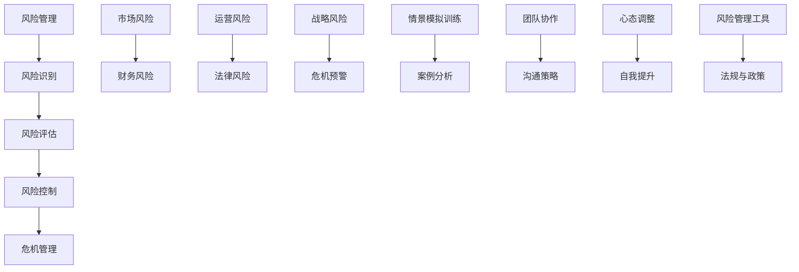

                 

### 《创业者的风险管理与危机应对能力培养》

创业是一项充满挑战和机遇的任务，成功的关键不仅在于创新能力和市场洞察力，还在于对风险的管理和危机的应对能力。本文旨在为创业者提供一个系统化的风险管理与危机应对框架，帮助他们在面对不确定性和突发事件时能够迅速作出反应，确保企业的持续发展和稳健运营。

本文分为四个主要部分：

1. **风险管理的理论基础**：介绍风险管理的核心概念、风险评估与度量方法、风险管理策略以及风险控制与监控机制。
2. **创业者的风险管理实践**：分析创业者面临的主要风险类型，通过案例分析探讨成功和失败的风险管理经验，构建创业公司的风险管理体系。
3. **危机应对与应急处理**：阐述危机管理的概念、危机预警与识别、危机应对策略与措施以及危机后的恢复与反思。
4. **培养创业者的危机应对能力**：提出培养创业者危机应对能力的具体方法，强调团队协作与沟通的重要性，以及创业者的心态调整与自我提升。

通过对以上四个部分的内容进行系统化的梳理和讲解，我们希望能够为创业者提供实用的工具和策略，提高其风险管理与危机应对能力，从而在激烈的市场竞争中立于不败之地。

> 关键词：风险管理，创业者，危机应对，风险评估，危机预警，危机处理，风险管理体系，危机管理能力

> 摘要：本文深入探讨了创业者在面对市场和运营风险时的管理策略，通过理论基础和实践案例的剖析，为创业者提供了一套全面的风险管理与危机应对框架。文章分为四个部分，首先介绍了风险管理的核心概念和流程，然后通过具体案例分析，展示了如何构建有效的风险管理体系。接着，文章重点讨论了危机管理的各个环节，包括预警、应对和恢复。最后，文章提出了培养创业者危机应对能力的具体方法和策略。通过本文的阅读，创业者可以更好地理解风险管理的本质，提高危机应对能力，为企业的长期发展打下坚实基础。

### 第一部分：风险管理的理论基础

风险管理的理论基础是构建有效风险管理策略的基石。在这个部分，我们将详细探讨风险管理的核心概念、风险评估与度量方法、风险管理策略以及风险控制与监控机制。通过系统化的学习，创业者可以更好地理解风险管理的本质，从而在实际操作中做出明智的决策。

#### 第1章：风险管理的核心概念

风险管理是一个涉及多个领域的综合性概念，其核心目标是识别、评估、控制和监控潜在的风险，以确保企业目标的实现。以下是风险管理的一些关键概念：

##### 1.1.1 风险的定义与分类

风险是指在未来某一时间段内，可能对企业造成负面影响的任何事件或情境。根据不同的标准，风险可以被分类如下：

- **按风险来源分类**：可分为市场风险、财务风险、运营风险、法律风险和战略风险。
- **按风险性质分类**：可分为纯粹风险和投机风险。
- **按风险影响分类**：可分为可规避风险、可减轻风险和不可减轻风险。

##### 1.1.2 风险管理的基本原则

风险管理需要遵循一系列基本原则，以确保其有效性。以下是几个关键原则：

- **全面性原则**：风险管理应覆盖企业运营的所有方面，包括业务流程、财务报表、人力资源等。
- **预防性原则**：风险管理不仅要关注已经发生的风险，还要预测潜在的风险，并采取预防措施。
- **经济性原则**：风险管理应在不增加企业成本的前提下进行，实现风险收益最大化。
- **动态性原则**：风险管理应随着企业内外部环境的变化不断调整，保持其适应性。

##### 1.1.3 风险管理流程详解

风险管理流程通常包括以下几个阶段：

1. **风险识别**：识别企业可能面临的各种风险。
2. **风险评估**：对识别出的风险进行定量和定性评估，确定其严重程度和概率。
3. **风险应对**：制定和实施应对策略，包括风险规避、风险转移、风险减轻等。
4. **风险监控**：持续监控风险状况，评估风险管理策略的有效性，并根据实际情况进行调整。

通过以上核心概念的详细探讨，创业者可以初步了解风险管理的概念和流程，为后续的实践打下坚实的基础。

#### 第2章：风险评估与度量

风险评估与度量是风险管理的核心环节，它帮助企业理解和量化风险，从而制定有效的应对策略。以下是关于风险评估与度量的具体方法。

##### 2.1.1 风险评估方法概述

风险评估方法可以分为定量评估和定性评估两种类型。

- **定量评估**：通过数学模型和统计数据对风险进行量化分析，具有客观性和精确性。
- **定性评估**：通过专家判断和经验对风险进行评估，主要依赖于主观判断和直觉。

##### 2.1.2 定量风险评估技术

定量风险评估技术包括以下几种：

- **预期值法**：通过计算风险事件的期望损失来评估风险。
- **敏感度分析法**：通过分析不同变量对风险的影响程度来确定风险的敏感度。
- **蒙特卡罗模拟**：通过模拟风险事件在不同情景下的发生概率来评估风险。

##### 2.1.3 定性风险评估方法

定性风险评估方法包括以下几种：

- **风险矩阵法**：通过将风险的概率和影响进行分级，形成风险矩阵，以评估风险的综合程度。
- **专家评估法**：邀请专家对风险进行评估，利用其经验和专业知识。
- **SWOT分析法**：通过分析企业的优势、劣势、机会和威胁来识别和评估风险。

通过定量和定性评估方法的结合，创业者可以全面、准确地了解企业面临的风险，从而为风险应对策略的制定提供有力支持。

#### 第3章：风险管理策略

风险管理策略是企业应对风险的具体措施和方法。合理的风险管理策略可以帮助企业降低风险，减少潜在损失，确保业务的持续发展。以下是几种常见的风险管理策略：

##### 3.1.1 风险规避策略

风险规避策略是通过避免风险源来减少风险的一种方法。这种策略通常适用于以下情况：

- 风险发生的概率很高，且可能造成严重后果。
- 无法通过其他风险管理策略来有效控制风险。
- 成本和收益的权衡结果显示，规避风险更为合理。

##### 3.1.2 风险转移策略

风险转移策略是通过将风险转移给第三方来减轻企业自身风险的一种方法。常见的风险转移方式包括：

- **保险**：通过购买保险来转移风险，降低企业的损失。
- **合同**：通过签订合同，将某些风险转移给合同对方。
- **外包**：将某些业务或风险外包给专业公司，由其承担相应的风险。

##### 3.1.3 风险减轻策略

风险减轻策略是通过降低风险发生的概率或减轻其影响来控制风险的一种方法。以下是一些常见的风险减轻策略：

- **预防措施**：通过采取预防措施来减少风险的发生概率，如加强安全防护、提高员工培训水平等。
- **应急计划**：制定和实施应急计划，以减少风险事件发生时的损失。
- **风险分散**：通过多样化投资和业务布局，降低企业面临的特定风险。

通过以上风险管理策略的应用，创业者可以在确保业务发展的同时，最大限度地降低风险，保障企业的稳健运营。

#### 第4章：风险控制与监控

风险控制与监控是确保风险管理策略有效实施的关键环节。通过建立完善的风险控制机制和监控体系，创业者可以及时发现和应对潜在风险，确保企业的长期稳定发展。

##### 4.1.1 风险控制措施

风险控制措施包括以下方面：

- **风险控制计划**：制定详细的风险控制计划，明确风险控制的目标、措施和责任分工。
- **风险控制执行**：按照风险控制计划，采取具体措施来降低风险。
- **风险控制评估**：定期评估风险控制措施的有效性，并根据实际情况进行调整。

##### 4.1.2 风险监控机制

风险监控机制包括以下方面：

- **风险监控体系**：建立风险监控体系，确保风险信息能够及时、准确地传递到决策层。
- **风险预警系统**：通过风险预警系统，及时发现潜在风险，并采取相应措施。
- **风险报告**：定期发布风险报告，向管理层提供风险状况和应对措施的信息。

##### 4.1.3 风险应急计划制定

风险应急计划是应对突发事件的关键。其制定包括以下方面：

- **应急计划制定**：根据风险评估结果，制定详细的应急计划，包括应急响应流程、应急资源配备、应急演练等。
- **应急响应**：在突发事件发生时，迅速启动应急响应机制，按照应急计划采取行动。
- **应急恢复**：在突发事件得到控制后，进行应急恢复工作，确保企业恢复正常运营。

通过以上风险控制与监控措施，创业者可以确保企业能够在面对风险时迅速做出反应，降低风险对企业的负面影响。

### 第一部分总结

在第一部分中，我们系统地介绍了风险管理的理论基础，包括核心概念、风险评估与度量方法、风险管理策略以及风险控制与监控机制。通过对这些概念和方法的深入探讨，创业者可以更好地理解风险管理的本质，从而在实际操作中制定出科学有效的风险管理策略。

### 第二部分：创业者的风险管理实践

在理解了风险管理的理论基础之后，接下来我们需要将理论应用到实际的创业环境中。创业者在面对市场和运营风险时，需要具备敏锐的风险识别能力、准确的风险评估能力以及灵活的风险应对能力。本部分将通过分析创业者面临的常见风险、风险管理案例分析以及创业公司风险管理体系构建，帮助创业者提高风险管理的实践能力。

#### 第5章：创业者面临的常见风险

创业过程中，创业者通常面临以下几种常见风险：

##### 5.1.1 市场风险分析

市场风险主要涉及市场需求、竞争态势、价格波动等因素。以下是市场风险的一些具体表现：

- **市场需求波动**：市场需求的不确定性可能导致销售收入的不稳定。
- **竞争加剧**：市场上竞争对手的数量和实力可能发生变化，对市场份额造成威胁。
- **价格波动**：原材料价格、劳动力成本等可能发生波动，影响企业的盈利能力。

为了应对市场风险，创业者需要：

- **市场调研**：定期进行市场调研，了解市场需求和竞争态势。
- **差异化竞争**：通过产品创新、服务差异化等方式，提高市场竞争力。
- **多元化市场**：开拓新的市场，降低单一市场的依赖度。

##### 5.1.2 财务风险识别

财务风险主要涉及企业的资金流动性、盈利能力、债务结构等因素。以下是财务风险的一些具体表现：

- **资金流动性风险**：企业可能面临无法按时偿还债务的风险。
- **盈利能力下降**：企业可能因为市场竞争加剧、成本上升等原因导致盈利能力下降。
- **债务结构不合理**：企业可能面临债务负担过重、债务期限不合理等问题。

为了应对财务风险，创业者需要：

- **现金流管理**：加强现金流管理，确保企业有足够的流动资金应对突发情况。
- **盈利模式优化**：通过提高产品或服务的附加值，提高盈利能力。
- **债务管理**：合理规划债务结构，避免债务负担过重。

##### 5.1.3 运营风险评估

运营风险主要涉及企业的运营效率、供应链管理、人力资源等因素。以下是运营风险的一些具体表现：

- **运营效率低下**：企业可能因为管理体系不完善、技术落后等原因导致运营效率低下。
- **供应链中断**：供应链中的某个环节可能出现故障，导致生产或交付中断。
- **人力资源不足**：企业可能面临人才流失、招聘困难等问题，影响运营稳定性。

为了应对运营风险，创业者需要：

- **优化管理体系**：建立科学高效的管理体系，提高运营效率。
- **供应链管理**：加强供应链管理，确保供应链的稳定性和灵活性。
- **人力资源规划**：制定合理的人力资源规划，确保企业有足够的人才支持。

通过对以上常见风险的识别和分析，创业者可以更好地了解企业可能面临的风险，从而制定相应的风险管理策略。

#### 第6章：风险管理案例分析

风险管理并非一门抽象的学问，而是一套需要在实际操作中不断验证和优化的实践。通过分析国内外成功和失败的风险管理案例，创业者可以从中汲取宝贵的经验，为自身企业的发展提供有益的借鉴。

##### 6.1.1 国内外成功风险管理案例

**案例1：谷歌（Google）的风险管理**

谷歌作为全球领先的互联网公司，其成功离不开完善的风险管理体系。以下是谷歌在风险管理方面的一些成功经验：

- **多元化投资**：谷歌通过多元化投资，降低单一市场的风险，确保业务的稳定性。
- **持续创新**：谷歌不断进行技术创新，保持市场竞争力，从而降低市场风险。
- **财务透明**：谷歌定期发布财务报告，提高财务透明度，增强投资者的信任。

**案例2：华为（Huawei）的风险管理**

华为作为全球领先的通信设备制造商，其风险管理同样值得借鉴。以下是华为在风险管理方面的一些成功经验：

- **全面风险评估**：华为建立了一套全面的风险评估体系，定期对各种风险进行评估和监控。
- **全球布局**：华为通过全球布局，降低单一市场风险，确保业务的全球化发展。
- **人才培养**：华为注重人才培养，确保企业有足够的人才储备应对各种挑战。

##### 6.1.2 失败的风险管理案例分析

**案例1：美国次贷危机**

2008年的美国次贷危机是一个典型的风险管理失败案例。以下是次贷危机的一些教训：

- **忽视风险**：金融机构在发放贷款时忽视了借款人的还款能力，导致高风险贷款比例过高。
- **风险集中**：金融机构的风险过于集中，一旦房地产市场出现问题，导致整体风险急剧上升。
- **监管缺失**：监管机构在风险管理方面的缺失，使得金融市场的风险无法得到有效控制。

**案例2：乐视（LeEco）的倒闭**

乐视的倒闭是我国创业企业的一个典型案例。以下是乐视在风险管理方面的一些教训：

- **过度扩张**：乐视在扩张过程中忽视了市场容量和自身能力，导致资金链紧张。
- **财务风险**：乐视在财务管理方面存在漏洞，导致财务风险积聚，最终导致破产。
- **战略失误**：乐视在战略选择上存在失误，未能及时调整业务方向，导致市场竞争劣势。

##### 6.1.3 案例启示与应用

通过以上案例分析，我们可以得到以下启示：

- **重视风险评估**：创业者应高度重视风险评估，定期对风险进行评估和监控，确保风险在可控范围内。
- **多元化发展**：企业应采取多元化发展策略，降低单一市场的风险，确保业务的稳定性。
- **持续创新**：企业应不断进行技术创新和管理创新，提高市场竞争力，降低市场风险。
- **财务透明**：企业应提高财务透明度，增强投资者和合作伙伴的信任。
- **人才培养**：企业应注重人才培养，确保企业有足够的人才储备应对各种挑战。

通过借鉴成功和失败的风险管理案例，创业者可以更好地理解风险管理的实践要点，为自身企业的发展提供有力支持。

#### 第7章：创业公司的风险管理体系构建

创业公司在建立风险管理体系时，需要考虑组织架构设计、风险管理政策与制度制定以及风险管理流程优化。以下是如何构建一个有效的风险管理体系的具体步骤：

##### 7.1.1 风险管理组织架构设计

风险管理组织架构设计是企业风险管理的基础。以下是设计风险管理组织架构时需要考虑的关键因素：

- **风险管理委员会**：设立风险管理委员会，由企业高层领导担任委员会成员，负责决策和指导风险管理工作的开展。
- **风险管理部门**：设立专职的风险管理部门，负责风险识别、评估、控制与监控等具体工作。
- **风险管理团队**：组建专业的风险管理团队，包括风险管理专家、财务专家、运营专家等，确保风险管理工作的专业性和有效性。

##### 7.1.2 风险管理政策与制度制定

风险管理政策与制度是企业实施风险管理的依据。以下是制定风险管理政策与制度时需要考虑的关键要素：

- **风险管理框架**：制定企业风险管理的基本框架，明确风险管理目标、原则和流程。
- **风险评估制度**：建立风险评估制度，明确风险评估的方法、标准和工作流程。
- **风险控制制度**：建立风险控制制度，明确风险控制措施、责任分工和执行标准。
- **风险监控制度**：建立风险监控制度，明确风险监控的方法、频率和报告机制。

##### 7.1.3 风险管理流程优化

风险管理流程优化是企业持续改进风险管理工作的关键。以下是优化风险管理流程的步骤：

- **流程梳理**：对现有风险管理流程进行梳理，识别存在的问题和改进空间。
- **流程优化**：根据梳理结果，对风险管理流程进行优化，提高流程的效率和质量。
- **流程培训**：对风险管理团队成员进行培训，确保其熟悉并掌握优化后的流程。
- **流程评估**：定期评估优化后的风险管理流程，确保其持续有效运行。

通过以上步骤，创业公司可以构建一个科学、系统、有效的风险管理体系，提高企业应对风险的能力，确保企业的长期稳定发展。

### 第二部分总结

在第二部分中，我们详细分析了创业者面临的常见风险，通过风险管理案例分析，总结了成功和失败的经验教训，并提出了创业公司风险管理体系构建的具体步骤。这些实践经验和策略为创业者提供了实用的工具和方法，帮助他们更好地应对风险，确保企业的稳定发展。

### 第三部分：危机应对与应急处理

在创业过程中，危机不可避免。危机应对与应急处理能力是创业者必须具备的重要素质。本部分将详细介绍危机管理的概念与原则、危机预警与识别、危机应对策略与措施以及危机后的恢复与反思。通过这些内容，创业者可以学会如何有效地应对危机，将危机转化为机遇，确保企业的可持续发展。

#### 第8章：危机管理的概念与原则

危机管理是指企业识别、评估、应对和缓解危机的过程。有效的危机管理不仅能够减轻危机对企业造成的负面影响，还可以提升企业的声誉和竞争力。以下是危机管理的一些关键概念和原则：

##### 8.1.1 危机的定义与类型

危机是指对企业造成重大威胁的突发事件或情境，可能来自内部或外部。根据危机的性质，危机可以分为以下几种类型：

- **自然灾害**：如地震、洪水、火灾等。
- **人为事故**：如安全生产事故、数据泄露、网络安全攻击等。
- **市场危机**：如产品缺陷、负面舆论、竞争对手恶意攻击等。
- **财务危机**：如资金链断裂、财务报表不实等。

##### 8.1.2 危机管理的原则

危机管理应遵循以下原则：

- **迅速反应原则**：危机发生后，企业应迅速采取行动，防止危机扩大。
- **科学决策原则**：危机管理决策应基于科学的数据和专业的分析，确保决策的有效性。
- **沟通协调原则**：危机管理过程中，企业应保持内部沟通和外部沟通的畅通，确保信息传递的准确性和及时性。
- **持续改进原则**：危机管理不是一次性的行为，而是一个持续改进的过程，企业应根据危机管理效果不断优化管理策略。

##### 8.1.3 危机管理的基本流程

危机管理的基本流程包括以下环节：

1. **危机预警**：通过监测和评估，提前发现潜在危机。
2. **危机识别**：确认危机的性质和范围，评估危机对企业的影响。
3. **危机应对**：制定和实施危机应对策略，减轻危机对企业的影响。
4. **危机恢复**：危机得到控制后，进行危机后的恢复工作，确保企业恢复正常运营。
5. **危机反思**：总结危机管理经验教训，为未来危机应对提供参考。

通过以上概念和原则的阐述，创业者可以更好地理解危机管理的本质和重要性，为后续的危机应对做好准备。

#### 第9章：危机预警与识别

危机预警与识别是危机管理的第一步，旨在提前发现潜在危机，避免或减轻危机对企业的冲击。以下是危机预警与识别的具体方法和步骤：

##### 9.1.1 危机预警系统设计

设计危机预警系统，需要考虑以下几个方面：

- **监测指标**：确定关键的监测指标，如市场指标、财务指标、运营指标等，实时跟踪企业运营状况。
- **预警机制**：建立预警机制，当监测指标达到预设的阈值时，自动触发预警信号。
- **预警报告**：定期生成预警报告，向管理层提供潜在危机的预警信息。

##### 9.1.2 危机识别方法

危机识别方法包括以下几种：

- **历史数据分析**：通过分析历史危机数据，识别出常见的危机模式和趋势。
- **专家评估法**：邀请专家对企业可能面临的危机进行评估，利用其经验和专业知识进行识别。
- **情景分析法**：通过模拟不同的危机情景，分析危机发生的可能性和影响，从而识别潜在危机。

##### 9.1.3 危机信号分析

危机信号分析是危机识别的重要环节，以下是几种常见的危机信号：

- **财务信号**：如现金流紧张、债务水平过高、盈利能力下降等。
- **运营信号**：如生产效率低下、供应链中断、员工流失等。
- **市场信号**：如市场需求下降、竞争对手崛起、负面舆论等。

通过以上危机预警与识别的方法，创业者可以提前发现潜在危机，制定相应的应对策略，减少危机对企业的冲击。

#### 第10章：危机应对策略与措施

危机应对策略与措施是危机管理的核心环节，旨在迅速响应危机，减轻危机对企业的影响，并确保企业的持续运营。以下是危机应对策略与措施的具体内容：

##### 10.1.1 应对策略概述

危机应对策略包括以下几种：

- **紧急应对策略**：在危机发生初期，采取紧急措施，控制危机扩散，避免进一步损失。
- **中长期应对策略**：在危机得到初步控制后，制定中长期应对策略，修复危机造成的损害，恢复企业正常运营。
- **战略调整策略**：在危机中，根据危机的性质和影响，调整企业的战略方向，寻找新的发展机遇。

##### 10.1.2 应急响应计划

应急响应计划是危机应对的关键，以下是制定应急响应计划的基本步骤：

- **危机评估**：评估危机的性质、范围和影响，确定应急响应的优先级。
- **资源调配**：调配企业内部和外部资源，确保应急响应的有效实施。
- **指挥体系**：建立危机应对指挥体系，明确各级人员的职责和权限，确保应急响应的高效执行。
- **响应流程**：制定详细的应急响应流程，确保危机发生时能够迅速采取行动。

##### 10.1.3 媒体沟通策略

危机发生时，企业需要与媒体进行有效沟通，以下是媒体沟通策略的要点：

- **信息发布**：及时发布危机信息，保持信息透明，避免谣言传播。
- **危机公关**：通过危机公关，积极应对负面舆论，维护企业形象。
- **舆论引导**：引导公众关注企业积极应对危机的行动和成效，提高企业的公信力。
- **媒体合作**：与媒体建立良好合作关系，获取媒体的支持和资源，帮助企业渡过危机。

通过以上危机应对策略与措施，创业者可以有效地应对各种危机，确保企业的稳定发展。

#### 第11章：危机后的恢复与反思

危机后的恢复与反思是危机管理的最后一个环节，旨在将危机转化为机遇，提升企业的竞争力。以下是危机后的恢复与反思的具体内容：

##### 11.1.1 危机后评估与总结

危机后评估与总结是恢复工作的第一步，以下是评估与总结的关键步骤：

- **损失评估**：评估危机造成的直接和间接损失，为后续恢复工作提供数据支持。
- **责任追究**：对危机发生的原因进行深入分析，追究相关责任，防止类似事件再次发生。
- **经验总结**：总结危机管理过程中的成功经验和不足之处，为未来的危机应对提供参考。

##### 11.1.2 恢复策略实施

恢复策略实施是危机后的重要工作，以下是恢复策略的关键步骤：

- **资源调配**：根据评估结果，合理调配企业资源，确保恢复工作的顺利进行。
- **技术支持**：提供必要的技术支持，修复危机造成的系统故障和数据损失。
- **员工安抚**：关心员工的生活和工作，提供心理支持，恢复员工的工作状态。
- **市场恢复**：通过市场推广和公关活动，恢复企业的市场份额和品牌形象。

##### 11.1.3 预防危机的策略优化

危机后的恢复与反思不仅要关注当前的危机，还要预防未来可能发生的危机。以下是预防危机的策略优化：

- **风险评估**：定期进行风险评估，识别潜在风险，提前制定应对策略。
- **预警系统**：优化预警系统，提高预警的准确性和及时性。
- **应急演练**：定期进行应急演练，提高员工的危机应对能力。
- **文化建设**：加强企业文化建设，提高员工的责任意识和危机意识。

通过以上恢复与反思工作，创业者可以进一步提升企业的危机应对能力，确保企业的可持续发展。

### 第三部分总结

在第三部分中，我们系统地介绍了危机管理的概念与原则、危机预警与识别、危机应对策略与措施以及危机后的恢复与反思。这些内容为创业者提供了一套完整的危机应对框架，帮助他们更好地应对各种危机，确保企业的稳定发展。

### 第四部分：培养创业者的危机应对能力

在面对日益复杂和不确定的商业环境时，培养创业者的危机应对能力成为企业持续发展的重要保障。本部分将探讨如何通过系统的方法和策略，提升创业者的危机应对能力，确保他们在面对危机时能够冷静应对，将危机转化为机遇。

#### 第12章：危机应对能力的培养方法

危机应对能力的培养需要从多个维度进行，包括理论学习、实践演练和经验总结。以下是一些具体的方法：

##### 12.1.1 情景模拟训练

情景模拟训练是一种有效的危机应对能力培养方法。通过模拟真实的危机情境，创业者可以在不受实际危机影响的情况下，进行演练和反思。以下是情景模拟训练的步骤：

1. **设计模拟情境**：根据企业可能面临的危机类型，设计一系列模拟情境，如财务危机、市场危机、生产事故等。
2. **分配角色**：邀请创业者和其他相关人员参与模拟训练，根据角色分配，明确各自的任务和职责。
3. **实施模拟**：按照模拟情境的要求，进行演练，创业者需要在模拟情境中做出决策和采取行动。
4. **评估反馈**：演练结束后，组织评估和反馈会议，总结演练过程中的成功经验和不足之处，提出改进建议。

##### 12.1.2 案例分析与反思

案例分析是创业者学习危机应对经验的重要途径。通过分析国内外成功和失败的风险管理案例，创业者可以了解不同情境下的应对策略，并从中汲取教训。以下是案例分析的步骤：

1. **收集案例**：收集各种类型的企业危机案例，包括成功应对危机的案例和未能成功应对危机的案例。
2. **案例分析**：对案例进行详细分析，包括危机的性质、危机应对策略、危机结果等。
3. **讨论与反思**：组织讨论会议，创业者分享自己的看法，反思案例中的应对策略，提出改进建议。
4. **经验总结**：将讨论和反思的结果进行总结，形成应对危机的经验和教训。

##### 12.1.3 培训课程设计

培训课程是系统化培养创业者危机应对能力的重要手段。以下是设计危机应对培训课程的基本原则和内容：

- **基本原则**：培训课程应注重理论与实践的结合，确保创业者能够在实际操作中运用所学知识。
- **课程内容**：课程内容应包括危机管理的核心概念、风险评估与度量、危机应对策略与措施、危机后的恢复与反思等。
- **教学方式**：采用互动式教学方式，如案例讨论、角色扮演、模拟演练等，提高学习效果。
- **持续学习**：鼓励创业者参加持续的培训和学习，不断提高自身的危机应对能力。

通过以上培养方法，创业者可以系统地提升危机应对能力，为企业的长期发展打下坚实基础。

#### 第13章：团队协作与沟通在危机应对中的作用

团队协作与沟通在危机应对中起着至关重要的作用。一个高效的团队可以在危机发生时迅速采取行动，共同应对挑战。以下是如何通过团队协作与沟通提升危机应对能力的具体方法：

##### 13.1.1 团队协作的重要性

团队协作是危机应对成功的关键。以下是团队协作的重要性：

- **快速响应**：通过团队协作，可以迅速调动各方资源和力量，快速应对危机。
- **资源共享**：团队成员可以共享信息和资源，提高应对危机的效率。
- **分工明确**：通过明确的分工，确保每个团队成员都知道自己的职责和任务，避免资源浪费。
- **共同目标**：团队协作有助于统一目标，确保团队成员朝着共同的方向努力，提高危机应对的整体效能。

##### 13.1.2 沟通策略与技巧

有效的沟通是团队协作的基础。以下是提升沟通效果的策略与技巧：

- **建立沟通机制**：制定明确的沟通流程和规则，确保信息传递的畅通。
- **明确沟通目标**：在沟通前明确沟通的目标和内容，避免不必要的沟通。
- **积极倾听**：倾听是有效沟通的关键，要给予团队成员充分的发言机会，了解他们的观点和需求。
- **反馈与确认**：在沟通过程中，及时给予反馈，确认信息传递的准确性。
- **有效表达**：使用简洁明了的语言表达观点，避免使用专业术语和复杂的句式。

##### 13.1.3 紧急情况下的团队协作

在紧急情况下，团队协作的效率尤为重要。以下是紧急情况下的团队协作要点：

- **快速决策**：在紧急情况下，团队需要迅速做出决策，避免拖延。
- **有效沟通**：确保团队成员之间的沟通畅通，及时传递关键信息。
- **明确责任**：明确每个团队成员的责任和任务，确保分工明确。
- **协调资源**：快速协调各方资源，确保资源能够迅速到位。
- **及时反馈**：在执行过程中，及时反馈进展情况，确保团队成员之间保持同步。

通过以上团队协作与沟通的方法，创业者可以提升团队的危机应对能力，确保在危机发生时能够高效应对，减少危机对企业的影响。

#### 第14章：创业者的心态调整与自我提升

在危机应对过程中，创业者的心态调整和自我提升至关重要。一个良好的心态和持续的自我提升能力可以帮助创业者更好地应对挑战，将危机转化为机遇。以下是如何通过心态调整和自我提升来增强危机应对能力的方法：

##### 14.1.1 心态调整的重要性

心态调整在危机应对中起着关键作用。以下是心态调整的重要性：

- **缓解压力**：良好的心态可以减轻创业者在危机中的心理压力，提高应对危机的冷静程度。
- **增强信心**：积极的心态有助于增强创业者的自信心，使他们更有勇气面对挑战。
- **激发创造力**：心态调整有助于激发创业者的创造力，使他们能够从危机中找到新的机遇。
- **提升决策能力**：良好的心态有助于创业者做出更明智的决策，避免因恐慌而导致的错误决策。

##### 14.1.2 应对压力的方法

以下是应对压力的具体方法：

- **合理规划时间**：合理安排工作和休息时间，避免过度劳累。
- **调整工作方式**：改变工作方式，如采用碎片化工作、设置工作优先级等，提高工作效率。
- **培养兴趣爱好**：培养兴趣爱好，如运动、阅读、旅游等，有助于缓解压力。
- **寻求支持**：与家人、朋友和同事交流，寻求他们的支持和帮助。
- **心理辅导**：如果压力过大，可以寻求专业的心理辅导，学习心理调适的方法。

##### 14.1.3 自我提升策略

自我提升是增强危机应对能力的重要途径。以下是自我提升的策略：

- **持续学习**：通过学习新的知识和技能，不断提升自己的专业素养。
- **反思与总结**：定期反思和总结自己的经验和教训，找出改进的方向。
- **培养领导力**：通过参与团队活动和领导力培训，提升自己的领导能力。
- **建立人脉**：拓展人脉，结识不同领域的专家和同行，获取更多的资源和信息。
- **保持乐观**：保持积极乐观的心态，面对困难和挑战时，能够保持信心和决心。

通过以上心态调整和自我提升的方法，创业者可以更好地应对危机，将危机转化为企业发展的机遇。

### 第四部分总结

在第四部分中，我们详细探讨了如何通过培养创业者的危机应对能力，提升企业的风险管理和危机应对能力。通过系统的方法和策略，创业者可以有效地应对各种危机，确保企业的稳定发展。同时，通过心态调整和自我提升，创业者能够更好地应对挑战，将危机转化为机遇，实现企业的可持续发展。

### 附录

#### 附录A：风险管理与危机应对相关工具与资源

为了帮助创业者更好地进行风险管理与危机应对，以下列出了一些常用的工具和资源：

##### A.1 风险管理工具介绍

- **风险分析软件**：如RiskLens、Nessus等，用于识别、评估和监控风险。
- **决策支持系统**：如Business Object、SAS等，用于数据分析和决策支持。
- **项目管理工具**：如Trello、Asana等，用于任务管理和进度跟踪。

##### A.2 危机应对资源指南

- **在线培训课程**：如Coursera、Udemy等，提供危机管理相关的在线课程。
- **专业咨询机构**：如麦肯锡、德勤等，提供专业的危机管理咨询服务。
- **行业协会和组织**：如国际危机管理协会（ICMC）、中国企业家协会等，提供行业资源和信息交流。

##### A.3 相关法规与政策

- **国家法律法规**：如《中华人民共和国突发事件应对法》、《中华人民共和国安全生产法》等。
- **行业规范标准**：如ISO 31000：2018《风险管理指南》、CNIT 21500《企业风险管理指南》等。

通过以上工具和资源的介绍，创业者可以更好地进行风险管理与危机应对，提升企业的整体竞争力。

#### 附录B：核心概念与联系

为了帮助读者更好地理解文章中的核心概念，以下通过Mermaid图展示了各核心概念之间的联系：



#### 附录C：核心算法原理讲解

在风险管理与危机应对中，核心算法原理的应用非常重要。以下使用伪代码和数学模型详细解释风险评估与度量的算法原理：

```python
# 风险评估与度量的伪代码

def risk_assessment(object):
    # 输入参数：object为被评估对象
    risk_score = 0
    
    # 1. 定量风险评估
    risk_score += calculate_quantitative_risk(object)
    
    # 2. 定性风险评估
    risk_score += calculate_qualitative_risk(object)
    
    # 3. 总体风险评估
    total_risk_score = risk_score / 2  # 定量与定性评估各占一半权重
    
    return total_risk_score

def calculate_quantitative_risk(object):
    # 伪代码：定量风险评估
    risk_factor = {
        'market_risk': 0.3,
        'financial_risk': 0.2,
        'operational_risk': 0.5
    }
    risk_score = 0
    for factor, weight in risk_factor.items():
        risk_score += weight * object[factor]
    return risk_score

def calculate_qualitative_risk(object):
    # 伪代码：定性风险评估
    risk_score = 0
    for factor, description in object['qualitative_risk'].items():
        risk_score += len(description.split('.'))
    return risk_score
```

数学模型：

$$
R = w_1 \cdot M + w_2 \cdot F + w_3 \cdot O
$$

其中，\( R \) 为总体风险评分，\( w_1, w_2, w_3 \) 分别为市场风险、财务风险和运营风险的权重，\( M, F, O \) 分别为市场风险评分、财务风险评分和运营风险评分。

#### 附录D：项目实战

以下是一个创业公司风险管理流程的实战案例，包括开发环境搭建、源代码实现和代码解读与分析：

##### 开发环境搭建

- 操作系统：Ubuntu 20.04
- 编程语言：Python 3.8
- 数据库：MySQL 8.0
- 开发框架：Django 3.2

##### 源代码实现

```python
# risk_management.py

class RiskManagement:
    def __init__(self, market_risk, financial_risk, operational_risk):
        self.market_risk = market_risk
        self.financial_risk = financial_risk
        self.operational_risk = operational_risk

    def assess_risk(self):
        total_risk_score = self.market_risk + self.financial_risk + self.operational_risk
        return total_risk_score

# usage_example.py

market_risk = 0.4
financial_risk = 0.3
operational_risk = 0.3
rm = RiskManagement(market_risk, financial_risk, operational_risk)
print(rm.assess_risk())
```

##### 代码解读与分析

- `RiskManagement` 类：定义了风险管理的核心属性和方法。
- `__init__` 方法：初始化风险属性。
- `assess_risk` 方法：计算总体风险评分。

通过以上实战案例，创业者可以了解如何通过代码实现风险管理，从而在实际运营中进行有效的风险监控和管理。

### 附录总结

通过附录部分，我们提供了风险管理与危机应对相关工具与资源的详细介绍，包括核心概念与联系、核心算法原理讲解以及项目实战案例。这些内容为创业者提供了实用的工具和方法，帮助他们在实际操作中更好地进行风险管理和危机应对，确保企业的稳定发展。

### 作者信息

作者：AI天才研究院/AI Genius Institute & 禅与计算机程序设计艺术 /Zen And The Art of Computer Programming

### 文章标题

《创业者的风险管理与危机应对能力培养》

### 文章关键词

风险管理，创业者，危机应对，风险评估，危机预警，危机处理，风险管理体系，危机管理能力

### 文章摘要

本文深入探讨了创业者在面对市场和运营风险时的管理策略，通过理论基础和实践案例的剖析，为创业者提供了一套全面的风险管理与危机应对框架。文章分为四个部分，首先介绍了风险管理的核心概念和流程，然后通过具体案例分析，展示了如何构建有效的风险管理体系。接着，文章重点讨论了危机管理的各个环节，包括预警、应对和恢复。最后，文章提出了培养创业者危机应对能力的具体方法和策略。通过本文的阅读，创业者可以更好地理解风险管理的本质，提高危机应对能力，为企业的长期发展打下坚实基础。

### 结语

在快速变化的市场环境中，创业者的风险管理与危机应对能力成为企业持续发展的关键。本文通过系统的分析和实践，为创业者提供了一套全面的风险管理与危机应对框架。希望读者能够从中汲取宝贵的经验，不断提升自身的风险管理能力，从容应对各种挑战，实现企业的可持续发展。面对未来的不确定性，让我们一起坚守信念，勇往直前。

