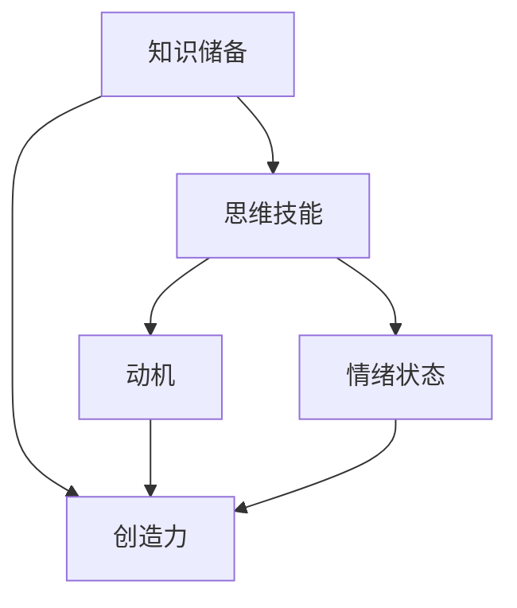
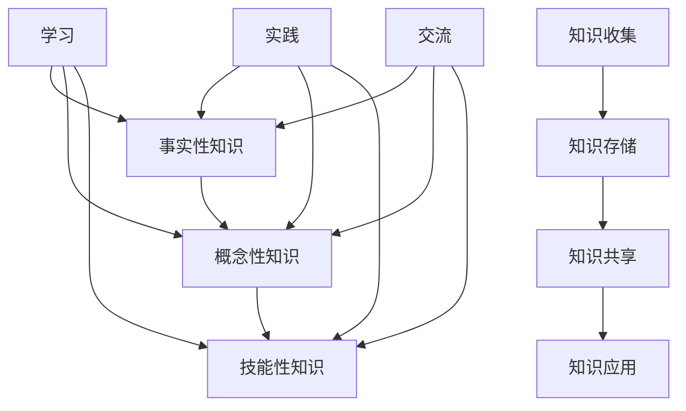
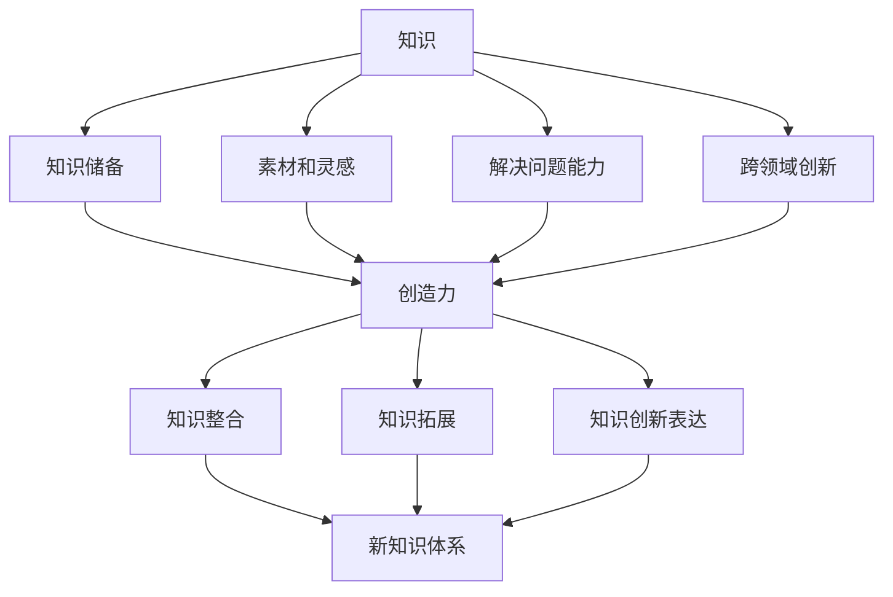

                 

# 创造力与知识：突破性思维的基础

> **关键词：** 创造力、知识、突破性思维、创新、问题解决、组织管理、发展趋势
>
> **摘要：** 本文从创造力与知识的关系出发，探讨了突破性思维的基础。通过深入分析创造力与知识的定义、关联，以及创造力培养与知识管理的策略，本文旨在为读者提供一个全面理解突破性思维的框架，并探讨其在创新项目、问题解决和组织管理中的应用。同时，本文还分析了创造力与知识的发展趋势，为未来研究提供参考。

----------------------------------------------------------------

## 第一部分：创造力与知识概述

### 1.1 创造力与知识的定义

#### 1.1.1 创造力的内涵

创造力是指个体在面对新问题或挑战时，能够产生新颖、独特且有价值的思想、方案或成果的能力。它不仅涉及个体思维的灵活性和开放性，还涉及创新意识的培养和持续学习的能力。创造力是人类智力的重要组成部分，对于个人成长、社会进步和经济发展具有重要意义。

**定义**：创造力（Creativity）是指个体或团队在面对问题时，通过创造性思维，产生新颖、独特且具有实际应用价值的思想、方案或成果的能力。

#### 1.1.2 知识的多维度解读

知识是一种结构化的信息，它可以通过学习、实践和经验积累获得。知识不仅包括事实性信息，如科学定律、历史事件，还包括概念、理论、方法和技能等。从不同角度对知识进行解读，有助于我们更好地理解其在创造力中的作用。

**知识分类：**
1. **事实性知识**：关于客观存在的事实，如科学定律、历史事件等。
2. **概念性知识**：关于概念、理论和方法，如数学概念、经济学原理等。
3. **技能性知识**：关于实际操作技能和方法，如编程技术、工程设计等。

**知识来源：**
1. **经验**：通过实践和经验积累获得的知识。
2. **学习**：通过阅读、上课、研究等学习过程获得的知识。
3. **交流**：通过与他人交流和合作，分享和吸收他人的知识。

### 1.2 创造力与知识的关联

创造力与知识之间存在紧密的关联。一方面，创造力需要知识作为基础和支撑；另一方面，创造力可以促进知识的创新和发展。

#### 1.2.1 创造力在知识构建中的作用

创造力在知识构建中起着关键作用。它使得个体能够从不同的角度看待问题，发现新的知识结构和关联。具体体现在以下几个方面：

1. **拓展知识边界**：创造力可以帮助我们打破传统思维模式，探索未知的领域，从而拓展知识的边界。
2. **整合多领域知识**：创造力能够整合不同领域、不同学科的知识，形成新的知识体系。
3. **创新知识表达**：创造力使得个体能够以新颖、独特的方式表达知识，使得知识更加生动、直观。

#### 1.2.2 知识在创造力发展中的价值

知识在创造力发展中具有基础性和支撑性的作用。具体体现在以下几个方面：

1. **提供基础支持**：知识是创造力的基础，没有扎实的知识积累，创造力将无从谈起。
2. **激发创新思维**：丰富的知识储备可以激发创新思维，帮助我们找到解决问题的新方法。
3. **促进实践应用**：知识可以帮助我们将创新思维转化为具体的行动，实现创新成果。

### 1.3 突破性思维的基础

突破性思维是指在面对复杂问题时，能够跳出传统思维框架，从全新的角度思考和解决问题的能力。它是一种高级的思维能力，对于推动创新和社会进步具有重要意义。

#### 1.3.1 突破性思维的界定

**定义**：突破性思维（Breakthrough Thinking）是指在面对复杂问题时，能够打破传统思维定势，从全新的角度思考和解决问题的能力。

突破性思维具有以下几个特点：

1. **创新性**：突破性思维强调创新，追求新颖、独特的解决方案。
2. **前瞻性**：突破性思维具有前瞻性，能够预见未来的发展趋势和潜在问题。
3. **系统性**：突破性思维强调系统思考，综合考虑问题的各个方面。

#### 1.3.2 影响突破性思维的因素

突破性思维受到多种因素的影响，包括个人因素、环境因素等。

**个人因素：**
1. **知识储备**：丰富的知识储备是突破性思维的基础。
2. **思维模式**：开放、灵活的思维模式有助于突破性思维的发挥。
3. **情绪状态**：积极的情绪状态有助于激发突破性思维。

**环境因素：**
1. **文化氛围**：鼓励创新、包容失败的文化氛围有助于突破性思维的发挥。
2. **教育资源**：优质的教育资源可以为突破性思维提供支持。
3. **社会支持**：社会支持和认可可以激励个体发挥突破性思维。

## 第二部分：创造力培养与知识管理

### 2.1 创造力培养策略

创造力是一种可以通过训练和培养得到提高的能力。以下是一些常见的创造力培养策略：

#### 2.1.1 创造力培养的基本原则

**原则 1：鼓励多样性**：鼓励个体在思考问题时采用多种角度和方法，从而激发创造力。

**原则 2：培养开放性思维**：培养个体开放、包容、敢于尝试的心态，从而有利于创造力的发挥。

**原则 3：提供丰富的知识储备**：通过学习、实践和交流，不断积累知识，为创造力提供基础支持。

#### 2.1.2 创造力培养的具体方法

**方法 1：头脑风暴**：通过头脑风暴，鼓励个体在短时间内产生大量想法，从而激发创造力。

**方法 2：思维导图**：通过思维导图，将个体的思考过程可视化，有助于发现新的关联和思路。

**方法 3：跨界学习**：通过学习不同领域的知识，拓宽视野，激发创造力。

**方法 4：项目实践**：通过实际项目，将创造力应用于实际问题，提高创造力。

### 2.2 知识管理策略

知识管理是指通过系统的方法，对知识进行收集、整理、存储、共享和应用的过程。以下是一些常见的知识管理策略：

#### 2.2.1 知识管理的内涵

**定义**：知识管理（Knowledge Management）是指通过系统的方法，对知识进行收集、整理、存储、共享和应用的过程。

知识管理的目标包括：

1. **提高知识共享效率**：通过知识管理，实现知识的有效共享，提高组织整体的知识水平。
2. **促进知识创新**：通过知识管理，激发个体的创造力，推动知识的创新和发展。
3. **提升组织竞争力**：通过知识管理，提升组织的知识管理水平，增强组织的竞争力。

#### 2.2.2 知识管理的方法与工具

**方法 1：知识地图**：通过知识地图，对组织内的知识进行可视化，便于知识的查找和应用。

**方法 2：知识库**：通过建立知识库，对组织内的知识进行系统化存储和管理。

**方法 3：知识共享平台**：通过知识共享平台，实现知识的在线交流和协作。

**方法 4：知识培训**：通过知识培训，提高个体对知识的掌握和应用能力。

**工具 1：文档管理系统**：如 SharePoint、Confluence 等，用于文档的收集、整理和存储。

**工具 2：项目管理工具**：如 Jira、Trello 等，用于项目的进度跟踪和管理。

**工具 3：协作工具**：如 Slack、Teams 等，用于团队协作和知识共享。

### 2.3 创造力与知识管理的整合

创造力与知识管理之间存在密切的关联，二者可以相互促进。以下是一些整合创造力与知识管理的实践路径：

#### 2.3.1 整合创造力和知识管理的意义

**意义 1：提高创新能力**：通过整合创造力和知识管理，可以提高组织的创新能力，推动知识创新和应用。

**意义 2：提升知识管理水平**：通过整合创造力和知识管理，可以提升组织的知识管理水平，实现知识的有效管理和应用。

**意义 3：促进组织发展**：通过整合创造力和知识管理，可以促进组织的发展，增强组织的核心竞争力和创新能力。

#### 2.3.2 整合创造力和知识管理的实践路径

**路径 1：建立知识共享文化**：通过建立知识共享文化，鼓励个体主动分享知识，促进知识的交流和创新。

**路径 2：开展知识管理培训**：通过开展知识管理培训，提高个体对知识管理的认识和应用能力。

**路径 3：设计创新激励机制**：通过设计创新激励机制，鼓励个体发挥创造力，推动知识的创新和应用。

**路径 4：实施知识管理工具**：通过实施知识管理工具，实现知识的有效收集、整理、存储、共享和应用。

## 第三部分：突破性思维的实践应用

### 3.1 突破性思维在创新项目中的应用

突破性思维在创新项目中的应用具有重要意义。以下是一些具体的实践方法和技巧：

#### 3.1.1 创新项目的定义

**定义**：创新项目（Innovation Project）是指以创新为目标，通过创造性思维和实践，实现新产品、新技术、新服务或新业务的过程。

#### 3.1.2 突破性思维在创新项目中的运用

**运用 1：头脑风暴**：在项目启动阶段，通过头脑风暴，激发团队成员的创新思维，产生大量创意。

**运用 2：跨界合作**：通过跨界合作，将不同领域的知识和方法引入项目，实现创新突破。

**运用 3：快速原型**：通过快速原型，快速验证和迭代项目方案，提高创新效率。

**运用 4：用户反馈**：通过用户反馈，不断调整和优化项目方案，实现用户价值最大化。

### 3.2 突破性思维在问题解决中的应用

突破性思维在问题解决中发挥着关键作用。以下是一些具体的实践方法和技巧：

#### 3.2.1 问题解决的框架

**框架 1：定义问题**：明确问题本质，找出关键问题。

**框架 2：分析问题**：分析问题的原因、影响和解决方案。

**框架 3：设计方案**：制定解决问题的方案，并进行评估和优化。

**框架 4：实施方案**：实施解决方案，并进行监控和调整。

#### 3.2.2 突破性思维在问题解决中的策略

**策略 1：跳出思维定势**：通过跳出思维定势，寻找全新的解决方案。

**策略 2：整合多领域知识**：通过整合多领域知识，提出创新的解决方案。

**策略 3：使用类比思维**：通过类比思维，借鉴其他领域的经验和解决方案。

**策略 4：使用逆向思维**：通过逆向思维，从反向思考问题，找到新的解决方案。

### 3.3 突破性思维在组织管理中的应用

突破性思维在组织管理中具有重要意义。以下是一些具体的实践方法和技巧：

#### 3.3.1 组织管理的挑战

**挑战 1：传统思维模式**：组织内部往往存在固有的思维模式，影响创新和变革。

**挑战 2：信息孤岛**：组织内部信息孤岛现象严重，影响知识共享和协同工作。

**挑战 3：管理僵化**：组织管理方式过于僵化，难以适应快速变化的市场环境。

#### 3.3.2 突破性思维在组织管理中的实践

**实践 1：建立创新文化**：通过建立创新文化，鼓励员工敢于创新、敢于尝试。

**实践 2：开展创新培训**：通过开展创新培训，提高员工的创新意识和能力。

**实践 3：实施敏捷管理**：通过实施敏捷管理，提高组织对市场变化的适应能力。

**实践 4：构建知识共享平台**：通过构建知识共享平台，实现知识的有效收集、整理、存储、共享和应用。

## 第四部分：创造力与知识的发展趋势

### 4.1 创造力与知识的发展趋势

创造力与知识的发展受到多种因素的影响，包括科技进步、经济发展、社会变革等。以下是一些当前创造力与知识的发展趋势：

#### 4.1.1 当前创造力与知识的发展状况

**趋势 1：全球创新竞争加剧**：随着全球化的发展，各国在创新领域展开激烈竞争，创造力成为国家核心竞争力之一。

**趋势 2：知识经济加速发展**：知识经济时代，知识成为经济增长的关键因素，知识管理受到广泛关注。

**趋势 3：人工智能的兴起**：人工智能技术的发展，为创造力与知识的创新提供了新的工具和方法。

#### 4.1.2 未来创造力与知识的发展方向

**方向 1：创造力培养的个性化**：随着教育个性化的发展，创造力培养将更加注重个体差异，实现个性化培养。

**方向 2：知识管理的智能化**：人工智能技术将深度应用于知识管理领域，实现知识的自动化获取、整理、共享和应用。

**方向 3：跨界融合的创新**：随着各领域的交叉融合，跨界创新将成为未来创造力与知识发展的重要方向。

### 4.2 创造力与知识的国际比较

创造力与知识的发展在不同国家和地区存在差异，以下是一些主要国家的创造力与知识发展概况：

#### 4.2.1 主要国家创造力与知识发展概况

**美国**：美国在创造力与知识发展方面具有领先优势，得益于其开放的创新文化和强大的科技实力。

**欧洲**：欧洲国家在知识管理方面取得显著成果，注重知识创新和知识产权保护。

**中国**：中国在创造力与知识发展方面取得了长足进步，但仍面临一些挑战，如创新能力不足、知识储备有限等。

#### 4.2.2 我国创造力与知识发展的优势与挑战

**优势**：
1. **政策支持**：我国政府高度重视创造力与知识发展，出台了一系列支持政策。
2. **人口红利**：我国拥有庞大的人口基数，为创造力与知识发展提供了丰富的资源。

**挑战**：
1. **创新能力不足**：我国在创新能力方面仍需提升，特别是在核心技术的自主创新方面。
2. **知识储备有限**：我国在知识储备方面相对不足，需要加大知识积累和知识创新力度。

### 4.3 创造力与知识的社会影响

创造力与知识的发展对社会具有深远的影响。以下是一些社会影响：

#### 4.3.1 创造力与知识对社会发展的推动作用

**推动作用 1：经济增长**：创造力与知识的发展能够推动经济增长，提高国家竞争力。

**推动作用 2：科技创新**：创造力与知识的发展为科技创新提供了基础和动力。

**推动作用 3：社会进步**：创造力与知识的发展有助于社会进步，提高人民生活质量。

#### 4.3.2 创造力与知识对社会变革的影响

**影响 1：产业变革**：创造力与知识的发展推动了产业变革，促进了新兴产业的发展。

**影响 2：教育变革**：创造力与知识的发展对教育产生了深刻影响，推动了教育改革和创新。

**影响 3：文化变革**：创造力与知识的发展推动了文化变革，促进了文化的多样性和创新。

## 附录

### 附录 A：创造力与知识相关工具与资源

#### A.1 创造力培养工具

**工具 1：头脑风暴工具**：如 BrainstormIt!、MindMeister 等，用于头脑风暴和创意生成。

**工具 2：思维导图工具**：如 XMind、MindManager 等，用于思维导图制作和知识梳理。

**工具 3：创意评估工具**：如 Creativity Assessment Test、Creative Behavior Scale 等，用于评估个体创造力水平。

#### A.2 知识管理工具

**工具 1：文档管理系统**：如 SharePoint、Confluence 等，用于文档的收集、整理和存储。

**工具 2：知识库系统**：如 Wiki、DokuWiki 等，用于知识的系统化存储和管理。

**工具 3：知识共享平台**：如 LinkedIn、Slack 等，用于知识的在线交流和协作。

#### A.3 突破性思维辅助工具

**工具 1：思维游戏**：如 Lateral Thinking Puzzles、NLP Techniques 等，用于锻炼思维灵活性和创新思维。

**工具 2：创意生成工具**：如 Ideacity、IDEAforge 等，用于创意生成和方案设计。

**工具 3：项目管理工具**：如 Jira、Trello 等，用于项目的进度跟踪和管理。

### 附录 B：创造力与知识研究文献

#### B.1 创造力研究文献

**文献 1：Runco, M. A. (2002). Creativity. Annual Review of Psychology, 53, 425-449.**

**文献 2：Zhou, Z., & Mo, Y. (2015). The role of creativity in knowledge creation and innovation. Journal of Knowledge Management, 19(3), 479-497.**

**文献 3：Amabile, T. M. (1988). A model of creativity and innovation in organizations. In J. P. Sternglanz & R. F. Davis (Eds.), Research in Organizational Behavior (Vol. 10, pp. 123-167). JAI Press.**

#### B.2 知识管理研究文献

**文献 1：Nonaka, I., & Takeuchi, H. (1995). The knowledge-creating company: How Japanese companies create the dynamics of innovation. Oxford University Press.**

**文献 2：Davenport, T. H., & Prusak, L. (1998). Working knowledge: How organizations manage what they know. Harvard Business Press.**

**文献 3：Wang, Y., & Strong, D. (2008). The role of knowledge management in innovation: A study of technology firms in China. Journal of Knowledge Management, 12(4), 13-26.**

#### B.3 突破性思维研究文献

**文献 1：Kao, S. R., & Wu, Y. T. (2013). The role of lateral thinking in problem-solving creativity. Thinking & Reasoning, 19(2), 175-192.**

**文献 2：Runco, M. A., & Pritzl, J. F. (2007). An overview of research on creativity. In R. J. Sternberg (Ed.), The Cambridge Handbook of Creativity (pp. 3-15). Cambridge University Press.**

**文献 3：Torrance, E. P. (2005). Creativity: Myths and facts. Prentice Hall.**

**作者：**
AI天才研究院/AI Genius Institute & 禅与计算机程序设计艺术 /Zen And The Art of Computer Programming**文章标题**：创造力与知识：突破性思维的基础

**文章关键词**：创造力、知识、突破性思维、创新、问题解决、组织管理、发展趋势

**文章摘要**：
本文从创造力与知识的关系出发，探讨了突破性思维的基础。通过深入分析创造力与知识的定义、关联，以及创造力培养与知识管理的策略，本文旨在为读者提供一个全面理解突破性思维的框架，并探讨其在创新项目、问题解决和组织管理中的应用。同时，本文还分析了创造力与知识的发展趋势，为未来研究提供参考。

### 第一部分：创造力与知识概述

#### 1.1 创造力与知识的定义

创造力（Creativity）是人们在面对新情况或问题时，能够产生新颖、独特且具有实用价值想法、方案或成果的能力。创造力不仅依赖于个体的思维能力和知识储备，还受到心理、社会和文化等多方面因素的影响。知识的定义则更为广泛，它不仅仅指事实性的信息，还涵盖概念、理论、方法和技能等。知识是人们通过学习、实践和体验获得的信息，是人类社会发展的重要基础。

创造力与知识的关系密切。创造力依赖于知识作为基础，知识则为创造力提供了丰富的素材和资源。同时，创造力也可以促进知识的创新和发展。一个具有强大创造力的人能够从不同的角度看待问题，发现新的知识结构和关联，从而推动知识的创新。

#### 1.2 创造力与知识的关联

创造力与知识之间存在密切的关联。首先，创造力依赖于知识。个体的创造力水平与其所掌握的知识量密切相关。一个人所掌握的知识越丰富，其创造力的潜力也就越大。例如，一个计算机科学家可能因为对计算机科学领域的广泛了解，能够在该领域产生许多创新性的成果。

其次，知识可以激发创造力。丰富的知识储备不仅为创造力提供了素材和灵感，还可以帮助个体跳出传统的思维模式，发现新的解决问题的方法。例如，一个设计工程师在解决一个复杂的问题时，可能需要调用多个学科的知识，如物理学、数学和工程学等，从而找到创新的解决方案。

此外，创造力也可以促进知识的创新和发展。一个具有强大创造力的人能够从新的角度看待知识，发现新的知识结构和关联，从而推动知识的创新。例如，爱因斯坦的相对论就是对经典物理学知识进行重新解释和创新的成果。

#### 1.3 突破性思维的基础

突破性思维（Breakthrough Thinking）是指在面对复杂问题时，能够打破传统思维定势，从全新的角度思考和解决问题的能力。突破性思维是创造力的一种表现形式，它对于推动创新和社会进步具有重要意义。

突破性思维的基础包括以下几个方面：

1. **广泛的知识储备**：突破性思维需要个体具备广泛的知识储备，这包括跨学科的知识和跨领域的经验。只有拥有丰富的知识储备，个体才能在面对问题时，从多个角度进行思考，从而产生突破性的解决方案。

2. **灵活的思维模式**：突破性思维要求个体具备灵活的思维模式，能够跳出传统的思维框架，从新的角度看待问题。这需要个体具备开放、包容和敢于尝试的心态，敢于面对未知的挑战。

3. **创新意识**：突破性思维需要个体具备强烈的创新意识，敢于质疑传统观念，勇于尝试新的方法和思路。创新意识是突破性思维的核心驱动力。

4. **持续的学习能力**：突破性思维要求个体具备持续的学习能力，不断更新和扩展自己的知识体系。只有不断学习，个体才能跟上时代的步伐，保持思维的活力和创造力。

5. **团队合作能力**：突破性思维往往需要团队合作。个体在团队合作中，可以借鉴他人的经验和观点，碰撞出新的火花，从而产生突破性的思维。

### 1.1 创造力的内涵

创造力是一个多维度的概念，它不仅仅指个体产生新颖想法的能力，还包括将这些想法转化为实际成果的过程。为了深入理解创造力的内涵，我们需要从以下几个方面进行分析：

**1.1.1 创造力的本质**

创造力的本质在于创新，即通过独特的视角和方法，发现或创造出新的事物、想法或解决方案。这种创新可以是在科学、艺术、技术或商业等领域，只要它带来了新的价值或提供了新的视角，就可以被视为创造力的体现。

**1.1.2 创造力的构成要素**

创造力由多个构成要素组成，这些要素相互作用，共同促进创造力的产生和发展。以下是几个关键要素：

- **知识**：知识是创造力的基础，它包括事实性知识、概念性知识和技能性知识。广泛的知识储备可以帮助个体在面对问题时，能够调用相关的知识，从而产生新的想法。
- **思维技能**：包括发散性思维、聚合性思维、逆向思维、联想思维等。这些思维技能可以帮助个体突破传统的思维模式，从新的角度看待问题。
- **动机**：动机是激发个体创造力的重要因素。内在动机（如兴趣、好奇心和成就感）和外在动机（如奖励和竞争）都可以推动个体产生创新的成果。
- **情绪状态**：情绪状态对创造力有着重要影响。积极、乐观的情绪状态可以激发创造力，而消极、焦虑的情绪状态则可能抑制创造力。

**1.1.3 创造力的特点**

创造力具有以下几个显著特点：

- **新颖性**：创造力产生的成果具有新颖性，即它们是独特的、前所未有的。
- **实用性**：创造力不仅要产生新颖的想法，还要确保这些想法具有实际应用价值。
- **灵活性**：创造力要求个体能够灵活应对各种问题，不拘泥于传统的解决方案。
- **可持续性**：创造力是一种可持续的能力，它需要通过不断的实践和训练来维持和发展。

#### 1.1.4 创造力的作用

创造力在个人和社会层面都发挥着重要作用。在个人层面，创造力有助于提升个人的竞争力、满足感和社会地位。例如，在职业生涯中，一个具有强大创造力的工程师可能因为能够提出创新的解决方案，而获得晋升或奖项。在社会层面，创造力是推动科技进步、文化繁荣和经济发展的重要动力。

- **推动科技创新**：创造力在科学研究和技术开发中起到关键作用。新的科学理论和技术创新往往源自于科学家的创造性思维。
- **促进文化创新**：创造力在文学、艺术、音乐等文化领域也发挥着重要作用。例如，作家通过创造性的写作，可以创造出引人入胜的故事和深刻的主题。
- **激发商业创新**：在商业领域，创造力是推动产品创新和市场拓展的关键。一个具有强大创造力的企业家，可以推出新颖的产品和服务，满足消费者的需求。

为了更好地理解创造力，我们可以通过一个简单的Mermaid流程图来展示创造力的核心概念和架构：

在这个流程图中，知识储备、思维技能、动机和情绪状态都是创造力的关键要素，它们相互作用，共同推动创造力的产生。创造力作为一种能力，不仅需要这些要素的支持，还需要通过不断的实践和训练来提升。

### 1.1.2 知识的多维度解读

知识是一个广泛且复杂的概念，它在不同的领域和情境中有不同的表现形式和作用。为了全面理解知识的内涵，我们需要从多个维度对其进行解读。

**1.1.2.1 知识的类型**

知识可以按照其内容和形式进行分类，主要包括以下几种类型：

- **事实性知识**：这是关于客观事实的知识，如历史事件、科学定律、地理知识等。事实性知识是人们通过观察、实验和调查等手段获得的。
- **概念性知识**：这是关于概念、理论和原则的知识，如经济学原理、生物学概念等。概念性知识是对事实性知识的抽象和总结，它提供了对世界的理解框架。
- **技能性知识**：这是关于操作技能和实践方法的知识，如编程技能、烹饪技巧、医疗技术等。技能性知识是通过实际操作和经验积累获得的。

**1.1.2.2 知识的来源**

知识可以通过多种途径获得，包括：

- **学习**：通过学校教育、自学、在线课程等正规学习途径获取知识。
- **实践**：通过实际操作和经验积累获得知识，如工程师通过项目实践获得技术经验。
- **交流**：通过与他人交流和合作获取知识，如团队讨论、研讨会等。

**1.1.2.3 知识的管理**

知识的管理是指通过系统的方法和工具，对知识进行收集、整理、存储、共享和应用的过程。有效的知识管理能够提高知识的利用效率，促进创新和竞争力的提升。知识管理的主要内容包括：

- **知识收集**：通过建立知识库、文档管理系统等工具，收集和整理组织内外部的知识资源。
- **知识存储**：将知识以电子文档、数据库等形式进行存储，确保知识的可访问性和持久性。
- **知识共享**：通过知识共享平台、内部网络、会议等形式，实现知识的有效传播和共享。
- **知识应用**：将知识应用于实际工作，如通过知识管理工具支持项目开发、决策制定等。

为了更好地理解知识的多维度特征，我们可以通过一个Mermaid流程图来展示知识的分类、来源和管理过程：

在这个流程图中，知识的多维度特征和来源渠道被清晰地展示出来。知识的管理过程则通过知识收集、存储、共享和应用四个环节，确保知识的有效利用和传递。

### 1.2 创造力与知识的关联

创造力与知识的关联是理解创新过程中关键要素相互作用的重要部分。创造力依赖于知识，而知识则可以激发和引导创造力的发挥。以下是从几个方面分析创造力与知识之间的紧密联系。

#### 1.2.1 创造力在知识构建中的作用

创造力在知识构建中起着至关重要的作用。它不仅帮助个体发现新的知识，还能促进知识的整合和拓展。以下是几个方面：

**1. 促进知识整合**：创造力能够将不同领域的知识进行整合，形成新的知识体系。例如，一个软件工程师可能将计算机科学、心理学和设计学的知识结合起来，创造出新的用户界面设计方法。

**2. 拓展知识边界**：创造力能够突破现有的知识边界，探索未知的领域。例如，物理学家在研究宇宙时，可能会提出全新的理论，从而拓展人类对宇宙的认识。

**3. 创新知识表达**：创造力使得个体能够以新颖、独特的方式表达知识。例如，通过艺术作品、科技发明和文学作品等，创造者能够将抽象的知识转化为可感知和体验的形式。

#### 1.2.2 知识在创造力发展中的价值

知识是创造力发展的基础，为创造力的发挥提供了丰富的素材和资源。以下是知识在创造力发展中的几个重要作用：

**1. 提供素材和灵感**：丰富的知识储备为创造力提供了丰富的素材和灵感。例如，一个音乐家在创作音乐时，可以从音乐史、文学、自然界的声音等多种知识中获取灵感。

**2. 提高解决问题的能力**：知识能够提高个体在解决问题时的能力，使创造力能够更有效地应用于实际问题。例如，一个医生在诊断病情时，需要调用医学知识、患者病史和临床经验等多种知识，以找到最佳的治疗方案。

**3. 促进跨领域创新**：知识的多学科交叉融合，能够促进跨领域的创新。例如，生物技术与计算机科学的结合，产生了生物信息学这一新的学科领域，推动了科技的发展。

为了更好地理解创造力与知识之间的关联，我们可以通过一个Mermaid流程图来展示两者之间的互动关系：

在这个流程图中，创造力与知识之间的相互作用被清晰地展示出来。创造力通过整合、拓展和创新知识，形成了新的知识体系；而知识则为创造力的发挥提供了基础和素材。这种互动关系不仅推动了知识的发展，也促进了创造力的提升。

### 1.3 突破性思维的基础

突破性思维（Breakthrough Thinking）是一种能够在复杂和困难情境中找到全新解决方案的思维模式。它不同于传统的线性思维，强调从全新的视角和角度去思考问题，以实现创新和突破。为了深入理解突破性思维的基础，我们需要探讨以下几个方面：

#### 1.3.1 突破性思维的界定

**定义**：突破性思维是指在面对复杂和挑战性的问题时，能够跳出传统思维定势，从全新的视角和角度去思考和解决问题的能力。它不仅要求思维的创新性，还强调解决方案的实际可操作性和价值。

突破性思维具有以下几个关键特征：

1. **创新性**：突破性思维强调产生新颖、独特的想法和解决方案。这种创新不仅体现在解决问题的方式上，还包括提出全新的问题和挑战。
2. **系统性**：突破性思维强调从整体和系统的角度去看待问题，综合考虑问题的各个方面和潜在的影响。
3. **前瞻性**：突破性思维具有前瞻性，能够预见未来的发展趋势和潜在的问题，从而提前做好准备。

#### 1.3.2 影响突破性思维的因素

突破性思维的发挥受到多种因素的影响，包括个人因素、环境因素等。以下是几个关键因素：

1. **知识储备**：丰富的知识储备是突破性思维的基础。一个人所掌握的知识越丰富，其思维的广度和深度也就越大，从而能够从不同的角度去看待问题，找到创新的解决方案。
2. **思维模式**：开放、灵活的思维模式有助于突破性思维的发挥。一个具有批判性思维和系统思维的人，更能够跳出传统的思维框架，发现新的视角和解决方案。
3. **情绪状态**：积极的情绪状态有助于激发突破性思维。乐观、好奇心和自信心等积极的情绪，可以激发人的创造力和创新思维，而消极的情绪则可能抑制创造力。
4. **文化氛围**：鼓励创新、包容失败的文化氛围有助于突破性思维的发挥。在这样的环境中，个体敢于尝试和冒险，从而产生创新的思维。
5. **社会支持**：社会支持和认可可以激励个体发挥突破性思维。例如，团队的支持、领导的鼓励和公众的认可，都可以增强个体的创新动力。

#### 1.3.3 突破性思维的实践应用

突破性思维在多个领域都有广泛的应用，以下是一些具体的实践应用：

1. **科学研究**：科学家在研究复杂问题时，需要运用突破性思维来提出新的假设、实验方法和理论框架。
2. **商业创新**：企业家在产品开发和市场拓展过程中，需要运用突破性思维来发现新的商业模式、市场机会和消费者需求。
3. **教育改革**：教育工作者在课程设计和教学方法上，需要运用突破性思维来创造新的教学方法和教育模式。
4. **社会问题解决**：政策制定者和社区领导者需要运用突破性思维来应对复杂的社会问题和挑战。

总之，突破性思维是一种重要的思维能力，它不仅能够推动个人和组织的创新，还能够促进社会的发展和进步。通过理解突破性思维的基础和影响因素，我们可以更好地培养和发挥这种思维模式，为解决复杂问题提供新的思路和方法。

### 1.3.1 突破性思维的界定

突破性思维是一种在复杂和困难情境中寻找创新解决方案的思维方式。它不仅涉及思维的深度和广度，还强调解决方案的实际应用价值和前瞻性。为了更深入地理解突破性思维的界定，我们可以从以下几个方面进行分析。

**定义与特征**

1. **创新性**：突破性思维的核心特征是创新性。它强调从全新的角度和视角出发，打破传统的思维定势，产生新颖、独特的想法和解决方案。这种创新不仅仅是表面上的变化，而是深层次的、结构性的转变。

2. **系统性**：突破性思维强调从系统的角度看待问题，综合考虑问题的各个方面及其相互关系。它不仅仅关注问题的某一层面，而是从整体上进行思考和设计，以确保解决方案的全面性和可操作性。

3. **前瞻性**：突破性思维具有前瞻性，能够预见未来的发展趋势和潜在的问题。它不仅仅解决当前的问题，还考虑问题的长期影响和未来的发展方向。

**定义与作用**

突破性思维的界定不仅仅在于其特征，还在于其在实际应用中的作用。以下是突破性思维在几个关键领域的应用：

1. **科学研究**：在科学研究中，突破性思维能够帮助科学家从新的角度提出假设、设计实验和构建理论模型。例如，爱因斯坦的相对论就是通过突破性思维，从全新的视角解释了重力现象。

2. **商业创新**：在商业领域，突破性思维能够帮助企业发现新的市场机会、开发新产品和创造新的商业模式。例如，苹果公司通过突破性思维，推出了iPod和iPhone等颠覆性的产品。

3. **问题解决**：在问题解决过程中，突破性思维能够帮助个体跳出传统的思维框架，找到创新的解决方案。例如，在医疗领域，突破性思维可以帮助医生发现新的治疗方法或诊断手段。

**界定与影响因素**

突破性思维的界定还涉及到其影响因素。以下是一些关键因素：

1. **知识储备**：丰富的知识储备是突破性思维的基础。一个人所掌握的知识越丰富，其思维的广度和深度也就越大，从而能够从不同的角度去看待问题，找到创新的解决方案。

2. **思维模式**：开放、灵活的思维模式有助于突破性思维的发挥。一个具有批判性思维和系统思维的人，更能够跳出传统的思维框架，发现新的视角和解决方案。

3. **情绪状态**：积极的情绪状态有助于激发突破性思维。乐观、好奇心和自信心等积极的情绪，可以激发人的创造力和创新思维，而消极的情绪则可能抑制创造力。

4. **文化氛围**：鼓励创新、包容失败的文化氛围有助于突破性思维的发挥。在这样的环境中，个体敢于尝试和冒险，从而产生创新的思维。

5. **社会支持**：社会支持和认可可以激励个体发挥突破性思维。例如，团队的支持、领导的鼓励和公众的认可，都可以增强个体的创新动力。

总之，突破性思维是一种重要的思维能力，它不仅能够推动个人和组织的创新，还能够促进社会的发展和进步。通过理解突破性思维的界定和影响因素，我们可以更好地培养和发挥这种思维模式，为解决复杂问题提供新的思路和方法。

### 1.3.2 影响突破性思维的因素

突破性思维是一种能够帮助个体在复杂情境中找到创新解决方案的思维方式。然而，突破性思维的发挥不仅依赖于个人的天赋和努力，还受到多种因素的影响。以下是一些关键因素，它们共同作用于突破性思维的发挥。

#### 知识储备

知识是突破性思维的基础。一个人所掌握的知识越丰富，其思维的广度和深度也就越大，从而能够从不同的角度去看待问题，找到创新的解决方案。以下是知识在突破性思维中的作用：

1. **跨学科知识**：跨学科知识可以帮助个体将不同领域的知识进行整合，形成新的视角和思维方式。例如，一个具备计算机科学、心理学和设计学知识的工程师，可能会创造出更符合用户需求的产品。

2. **专业知识**：专业知识是解决特定领域问题的关键。一个在某一领域拥有深厚知识的专家，往往能够发现常规方法无法解决的难题，并提出创新的解决方案。

3. **历史知识**：了解历史可以帮助个体从过去的经验中吸取教训，避免重复错误，同时也能够为当前的问题提供新的解决思路。

#### 思维模式

思维模式是影响突破性思维的重要因素。一个具有开放、灵活的思维模式的人，更能够跳出传统的思维框架，发现新的视角和解决方案。以下是几种有助于突破性思维的思维模式：

1. **批判性思维**：批判性思维要求个体对现有的观点和解决方案进行质疑和评估，从而发现潜在的改进空间。这种思维方式有助于个体在问题解决过程中不断追求创新。

2. **系统思维**：系统思维强调从整体和系统的角度去看待问题，综合考虑问题的各个方面及其相互关系。这种思维方式有助于个体发现问题的根本原因，并提出全局性的解决方案。

3. **逆向思维**：逆向思维是一种从相反方向思考问题的方法。通过逆向思维，个体可以打破常规的思维定势，发现新的解决方案。

#### 情绪状态

情绪状态对突破性思维的发挥具有重要影响。积极的情绪状态，如乐观、好奇心和自信，可以激发个体的创造力和创新思维，而消极的情绪状态，如焦虑和恐惧，则可能抑制创造力。以下是情绪状态在突破性思维中的作用：

1. **乐观**：乐观的心态可以激发个体的创造力和积极性，使个体更有动力去尝试新的方法和思路。

2. **好奇心**：好奇心是推动个体探索未知领域和发现新知识的关键。一个充满好奇心的人，往往能够发现更多的问题和解决方案。

3. **自信**：自信的心态有助于个体在面对挑战时保持冷静和坚定，从而更有可能找到创新的解决方案。

#### 文化氛围

文化氛围对突破性思维的发挥也具有重要影响。鼓励创新、包容失败的文化氛围可以激励个体发挥突破性思维，而压抑创新、注重结果的文化氛围则可能抑制创造力。以下是文化氛围在突破性思维中的作用：

1. **鼓励创新**：在鼓励创新的文化氛围中，个体敢于尝试新的方法和思路，从而更可能产生创新的思维。

2. **包容失败**：包容失败的文化氛围可以减少个体在尝试新思路时的恐惧和风险，从而鼓励个体勇于创新。

3. **合作与交流**：在合作与交流的文化氛围中，个体可以借助他人的经验和观点，共同探讨问题的解决方案，从而提高创新的效率和质量。

#### 社会支持

社会支持也是影响突破性思维的重要因素。社会支持和认可可以增强个体的创新动力，提高个体的自信心和积极性。以下是社会支持在突破性思维中的作用：

1. **团队支持**：团队的支持可以提供资源和帮助，使个体在创新过程中更有动力和信心。

2. **领导鼓励**：领导的鼓励和认可可以激励个体发挥突破性思维，推动创新项目的进展。

3. **公众认可**：公众的认可和赞赏可以增强个体的自信心，激发个体的创新热情。

总之，突破性思维的发挥受到多种因素的影响，包括知识储备、思维模式、情绪状态、文化氛围和社会支持等。通过理解和应对这些因素，我们可以更好地培养和发挥突破性思维，推动创新和社会进步。

### 2.1 创造力培养策略

创造力是一种可以通过训练和培养得到提高的能力。为了培养和提升创造力，我们需要采取一系列有针对性的策略和方法。以下是一些常见的创造力培养策略：

#### 2.1.1 创造力培养的基本原则

**原则 1：鼓励多样性**：鼓励个体在思考问题时采用多种角度和方法，从而激发创造力。多样性可以来自不同的学科、文化背景、经验和观点，这些都能够帮助我们打破传统的思维框架，发现新的思路和解决方案。

**原则 2：培养开放性思维**：开放性思维是一种能够接受新观念、新方法和新挑战的思维方式。它要求我们保持好奇心和求知欲，不断探索未知领域，从而激发创造力。

**原则 3：提供丰富的知识储备**：丰富的知识储备是创造力的基础。通过学习不同领域的知识，我们可以拓宽视野，积累素材，为创造力提供支持。

#### 2.1.2 创造力培养的具体方法

**方法 1：头脑风暴**：头脑风暴是一种常用的创造力培养方法。通过在短时间内产生大量想法，个体可以激发大脑的创造潜力，从而找到创新的解决方案。

**方法 2：思维导图**：思维导图是一种将思考过程可视化的工具。通过绘制思维导图，个体可以更清晰地展示思考过程，发现新的关联和思路。

**方法 3：跨界学习**：跨界学习是一种通过学习不同领域的知识来激发创造力的方法。通过跨界学习，个体可以打破学科界限，将不同领域的知识进行整合，从而产生新的创意。

**方法 4：项目实践**：通过实际项目，个体可以将创造力应用于实际问题，从而提高创造力。在实际项目中，个体需要面对各种挑战，这有助于激发创造力和创新能力。

**方法 5：创新思维训练**：创新思维训练是一种通过特定训练方法来提高创造力水平的方法。例如，逆向思维训练、发散性思维训练和联想思维训练等，这些训练方法可以帮助个体打破思维定势，提高创造力。

#### 2.1.3 创造力培养的实际案例

**案例 1：谷歌的“20% 时间项目”**：谷歌的“20% 时间项目”是一种鼓励员工在日常工作之外的20% 时间内自由探索和创新的项目。这种做法不仅激发了员工的创造力，还产生了许多谷歌的经典产品，如 Gmail 和 AdSense 等。

**案例 2：3M 的“15% 时间创新”**：3M 公司鼓励员工将其工作时间的15% 用于个人兴趣和创新项目。这种做法激发了员工的创造力，推动了公司许多创新产品的诞生，如 Post-it 纸。

**案例 3：IBM 的“创新实验室”**：IBM 设立了多个创新实验室，为员工提供实验设备和资金支持，鼓励他们进行创新实验和项目开发。这种做法不仅提高了员工的创造力，还推动了公司的技术创新。

通过这些具体的策略和方法，我们可以有效地培养和提升创造力。在个人和团队层面，创造力的提升不仅能够提高工作效率和质量，还能够推动创新和进步。

### 2.2 知识管理策略

知识管理是指通过系统的方法和工具，对知识进行收集、整理、存储、共享和应用的过程。有效的知识管理能够提高组织的知识共享效率，促进知识的创新和应用。以下是一些常见的知识管理策略：

#### 2.2.1 知识管理的内涵

知识管理不仅涉及对知识的获取和存储，还包括知识的共享和应用。以下是知识管理的主要内涵：

1. **知识收集**：通过建立知识库、文档管理系统等工具，对组织内外部的知识资源进行收集和整理。
2. **知识存储**：将收集到的知识以电子文档、数据库等形式进行存储，确保知识的可访问性和持久性。
3. **知识共享**：通过知识共享平台、内部网络、会议等形式，实现知识的有效传播和共享。
4. **知识应用**：将知识应用于实际工作，如通过知识管理工具支持项目开发、决策制定等。

#### 2.2.2 知识管理的方法与工具

**方法 1：知识地图**：知识地图是一种将组织内的知识进行可视化表示的工具。通过知识地图，个体可以清晰地了解组织内的知识结构和关联，从而提高知识的利用效率。

**方法 2：知识库**：知识库是一种对知识进行系统化存储和管理的方法。通过知识库，组织可以方便地查找和获取所需的知识，提高知识共享的效率。

**方法 3：知识共享平台**：知识共享平台是一种通过互联网和社交媒体等技术，实现知识在线交流和协作的工具。通过知识共享平台，组织可以方便地共享知识、交流和协作。

**方法 4：知识培训**：知识培训是一种通过培训课程、研讨会等形式，提高个体对知识的掌握和应用能力的方法。通过知识培训，组织可以确保员工具备必要的知识，从而提高整体的知识水平。

**工具 1：文档管理系统**：如 SharePoint、Confluence 等，用于文档的收集、整理和存储。

**工具 2：知识库系统**：如 Wiki、DokuWiki 等，用于知识的系统化存储和管理。

**工具 3：知识共享平台**：如 LinkedIn、Slack 等，用于知识的在线交流和协作。

#### 2.2.3 知识管理在组织中的应用

知识管理在组织中的应用具有重要意义。以下是一些具体的实践方法：

**方法 1：建立知识共享文化**：通过建立知识共享文化，鼓励员工主动分享知识，促进知识的流动和共享。

**方法 2：实施知识管理培训**：通过实施知识管理培训，提高员工对知识管理的认识和应用能力。

**方法 3：设计知识激励机制**：通过设计知识激励机制，鼓励员工积极分享知识，提高知识共享的积极性。

**方法 4：构建知识共享平台**：通过构建知识共享平台，实现知识的在线交流和协作，提高知识的共享效率。

通过有效的知识管理策略，组织可以确保知识的有效收集、整理、存储、共享和应用，从而提高组织的知识管理水平，推动组织的创新和进步。

### 2.3 创造力与知识管理的整合

创造力与知识管理之间存在紧密的关联，二者可以相互促进。整合创造力与知识管理，可以提升组织的创新能力，推动知识的创新和应用。以下是一些整合创造力和知识管理的实践路径：

#### 2.3.1 整合创造力和知识管理的意义

整合创造力和知识管理的意义主要体现在以下几个方面：

1. **提高创新能力**：通过整合创造力和知识管理，组织可以更有效地激发员工的创造力，推动知识的创新和应用，从而提高组织的创新能力。

2. **提升知识管理水平**：通过整合创造力和知识管理，组织可以更系统地收集、整理、存储和共享知识，提高知识管理水平，确保知识的有效利用。

3. **促进知识创新**：创造力可以促进知识的创新和发展，而知识管理则为知识的创新提供了基础和支持。通过整合二者，组织可以更好地实现知识的创新。

4. **增强组织竞争力**：整合创造力和知识管理，可以提升组织的知识储备和创新能力，从而增强组织的竞争力，推动组织的可持续发展。

#### 2.3.2 整合创造力和知识管理的实践路径

为了实现创造力和知识管理的整合，组织可以采取以下实践路径：

1. **建立知识共享文化**：通过建立知识共享文化，鼓励员工主动分享知识，促进知识的流动和共享。知识共享文化可以为创造力的发挥提供良好的氛围和支持。

2. **开展知识管理培训**：通过开展知识管理培训，提高员工对知识管理的认识和应用能力。培训内容可以包括知识管理的基本原理、方法和工具等。

3. **设计创新激励机制**：通过设计创新激励机制，鼓励员工积极分享知识，提高知识共享的积极性。激励机制可以包括物质奖励、荣誉表彰等。

4. **构建知识共享平台**：通过构建知识共享平台，实现知识的在线交流和协作，提高知识的共享效率。知识共享平台可以为员工提供一个便捷的知识获取和分享工具。

5. **开展跨界合作**：通过开展跨界合作，将不同领域的知识和创造力进行整合，推动知识的创新和应用。跨界合作可以激发员工的创造力，促进知识的创新。

6. **实施知识创新项目**：通过实施知识创新项目，鼓励员工在创新过程中应用知识，从而实现知识的创新。知识创新项目可以是跨部门的、跨领域的，也可以是针对特定问题的。

通过以上实践路径，组织可以有效地整合创造力和知识管理，提升组织的创新能力，推动知识的创新和应用。

### 3.1 突破性思维在创新项目中的应用

突破性思维在创新项目中具有重要作用，它能够帮助团队突破传统的思维框架，发现创新的解决方案。以下是从定义、实际案例和策略三个方面，探讨突破性思维在创新项目中的应用。

#### 3.1.1 创新项目的定义

创新项目（Innovation Project）是指以创新为目标，通过创造性思维和实践，实现新产品、新技术、新服务或新业务的过程。创新项目通常涉及跨学科、跨领域的合作，需要团队成员具备较强的创新意识和能力。

#### 3.1.2 突破性思维在创新项目中的实际案例

**案例 1：谷歌的自动驾驶汽车项目**

谷歌的自动驾驶汽车项目是一个典型的突破性思维应用案例。在项目初期，团队面临着许多技术和法律上的挑战，如车辆的安全性、道路的复杂性、自动驾驶的准确性等。为了解决这些问题，团队采用了突破性思维，从多个角度进行思考和实验：

1. **跨界合作**：团队与多个领域的专家合作，如计算机科学、机械工程、人工智能等，通过整合不同领域的知识，找到创新的解决方案。
2. **逆向思维**：团队从问题的反面思考，如假设车辆完全失控，如何确保乘客的安全，从而设计出更加安全的自动驾驶系统。
3. **用户中心**：团队始终将用户的需求和体验放在首位，通过不断收集用户反馈，优化自动驾驶系统的性能和用户体验。

通过突破性思维的应用，谷歌的自动驾驶汽车项目取得了显著成果，成为自动驾驶领域的领导者。

**案例 2：苹果的iPhone项目**

苹果的iPhone项目也是一个突破性思维的典范。在iPhone发布之前，智能手机市场主要被功能手机和早期智能手机占据。苹果团队通过突破性思维，提出了以下创新点：

1. **用户体验**：苹果团队从用户的角度出发，重新设计了手机的用户界面和交互方式，使得iPhone的操作更加直观和便捷。
2. **软硬件结合**：苹果团队将硬件和软件紧密结合，开发出高度集成的操作系统，使得iPhone具有出色的性能和用户体验。
3. **创新设计**：苹果团队通过创新的设计，使得iPhone在外观和功能上都具有独特性，从而吸引了大量用户。

通过突破性思维的应用，苹果的iPhone项目不仅成功颠覆了智能手机市场，还推动了整个手机行业的创新和发展。

#### 3.1.3 突破性思维在创新项目中的策略

为了在创新项目中有效应用突破性思维，团队可以采取以下策略：

1. **头脑风暴**：通过头脑风暴，鼓励团队成员提出各种创新的想法，从而激发突破性思维。
2. **跨界合作**：与不同领域的专家和团队进行合作，整合多领域的知识，提高创新的广度和深度。
3. **用户反馈**：重视用户反馈，通过用户反馈不断优化和改进产品，确保创新项目能够满足用户需求。
4. **快速原型**：通过快速原型，快速验证和迭代项目方案，提高创新效率。
5. **风险评估**：对创新项目进行风险评估，识别潜在的风险和挑战，并提前制定应对策略。

通过以上策略，团队可以有效地应用突破性思维，推动创新项目的成功。

### 3.2 突破性思维在问题解决中的应用

突破性思维在问题解决中具有重要作用，它可以帮助我们跳出传统思维框架，从全新的角度寻找解决方案。以下从定义、实际案例和策略三个方面，探讨突破性思维在问题解决中的应用。

#### 3.2.1 问题解决的框架

问题解决是一个系统化的过程，通常包括以下几个步骤：

1. **定义问题**：明确问题的性质、范围和目标，确保问题被准确界定。
2. **分析问题**：对问题进行深入分析，理解问题的原因、影响因素和潜在解决方案。
3. **设计方案**：根据分析结果，制定解决问题的方案，并进行评估和优化。
4. **实施方案**：执行解决问题的方案，并进行监控和调整。
5. **评估结果**：对解决方案的实施效果进行评估，确保问题得到有效解决。

#### 3.2.2 突破性思维在问题解决中的实际案例

**案例 1：NASA 的阿波罗登月计划**

NASA 的阿波罗登月计划是一个突破性思维在问题解决中的经典案例。在计划执行过程中，团队面临了许多前所未有的技术挑战，如火箭发动机故障、通信中断、太空食物储备不足等。为了解决这些问题，团队采用了突破性思维：

1. **快速原型**：通过快速原型，团队能够快速验证和迭代解决方案，确保问题得到及时解决。
2. **跨学科合作**：团队与多个领域的专家合作，如航天工程、电子工程、生物医学等，通过整合多领域的知识，找到创新的解决方案。
3. **用户中心**：团队始终将宇航员的需求和体验放在首位，通过不断收集宇航员反馈，优化解决方案。

最终，阿波罗登月计划成功实现，人类首次登月。这一成就展示了突破性思维在问题解决中的重要作用。

**案例 2：可口可乐的配方创新**

可口可乐公司面临的一个问题是，如何在全球市场推出新产品，同时保持品牌的一致性和吸引力。为了解决这个问题，公司采用了突破性思维：

1. **市场调研**：通过市场调研，了解不同地区消费者的需求和偏好，从而制定创新策略。
2. **跨界合作**：与不同领域的合作伙伴合作，如设计师、艺术家等，为新产品提供独特的创意和设计。
3. **用户体验**：关注消费者的使用体验，通过用户体验测试，优化产品设计和口感。

通过突破性思维的应用，可口可乐公司在全球推出了多个成功的创新产品，如零度可口可乐和可口可乐香草口味。

#### 3.2.3 突破性思维在问题解决中的策略

为了在问题解决中有效应用突破性思维，可以采取以下策略：

1. **头脑风暴**：通过头脑风暴，鼓励团队成员提出各种创新的想法，从而激发突破性思维。
2. **跨界合作**：与不同领域的专家和团队进行合作，整合多领域的知识，提高创新的广度和深度。
3. **用户反馈**：重视用户反馈，通过用户反馈不断优化和改进解决方案，确保问题得到有效解决。
4. **快速原型**：通过快速原型，快速验证和迭代解决方案，提高问题解决的效率。
5. **风险评估**：对解决方案进行风险评估，识别潜在的风险和挑战，并提前制定应对策略。

通过以上策略，团队可以有效地应用突破性思维，提高问题解决的效率和质量。

### 3.3 突破性思维在组织管理中的应用

突破性思维在组织管理中具有重要作用，它可以帮助组织突破传统管理模式，实现创新和变革。以下从挑战、应用和策略三个方面，探讨突破性思维在组织管理中的应用。

#### 3.3.1 组织管理的挑战

在组织管理中，突破性思维面临着以下几大挑战：

1. **传统思维模式**：许多组织在长期发展中形成了固有的思维模式和管理习惯，这限制了组织的创新和变革。突破性思维需要打破这些传统思维模式，推动组织的创新。

2. **信息孤岛**：在大型组织中，信息孤岛现象严重，不同部门之间的信息交流不畅，影响了组织整体的效率和创新能力。突破性思维需要建立有效的信息共享机制，促进知识的流动和共享。

3. **管理僵化**：许多组织的管理体系过于僵化，难以适应快速变化的市场环境。突破性思维要求组织具有灵活性，能够快速响应市场变化。

4. **资源分配**：在资源有限的情况下，如何合理分配资源以支持突破性思维的发挥，是组织管理面临的挑战之一。

#### 3.3.2 突破性思维在组织管理中的实际应用

突破性思维在组织管理中的应用可以体现在以下几个方面：

1. **战略规划**：在制定组织战略规划时，突破性思维可以帮助组织从新的角度审视市场环境，发现新的机遇和挑战，从而制定更具前瞻性的战略。

2. **组织设计**：通过突破性思维，组织可以重新设计组织结构和管理流程，以适应市场变化和业务需求。例如，采用跨部门团队、扁平化组织结构等，提高组织的灵活性和创新能力。

3. **决策制定**：在决策过程中，突破性思维可以帮助组织跳出传统思维框架，从新的角度分析问题和制定决策。例如，通过情景分析、模拟决策等方法，提高决策的科学性和有效性。

4. **员工激励**：通过突破性思维，组织可以设计创新的激励机制，激发员工的积极性和创造力。例如，实施员工股票期权、创新奖励等，鼓励员工发挥突破性思维。

#### 3.3.3 突破性思维在组织管理中的策略

为了在组织管理中有效应用突破性思维，可以采取以下策略：

1. **建立创新文化**：通过建立创新文化，鼓励员工敢于创新、敢于尝试，形成一种积极向上的创新氛围。

2. **开展创新培训**：通过开展创新培训，提高员工的创新意识和能力，帮助他们掌握突破性思维的方法和技巧。

3. **设计创新激励机制**：通过设计创新激励机制，鼓励员工积极发挥突破性思维，推动组织的创新和发展。

4. **建立信息共享平台**：通过建立信息共享平台，促进组织内部的知识流动和共享，提高组织的创新能力。

5. **实施敏捷管理**：通过实施敏捷管理，提高组织对市场变化的适应能力，推动组织的创新和变革。

通过以上策略，组织可以有效地应用突破性思维，实现创新和变革，提高组织的竞争力和可持续发展能力。

### 4.1 创造力与知识的发展趋势

创造力与知识的发展是一个不断演进的过程，受到科技进步、社会变革和经济发展等多种因素的影响。以下从当前的发展状况和未来发展方向两个方面，探讨创造力与知识的发展趋势。

#### 4.1.1 当前的发展状况

1. **全球创新竞争加剧**：随着全球化的发展，各国在科技创新和知识管理方面展开激烈竞争。创新已成为国家核心竞争力之一，各国纷纷加大在科研、教育和产业领域的投入，以提升创新能力。

2. **知识经济加速发展**：知识经济时代，知识成为经济增长的关键因素。知识产业、高技术产业和信息技术产业蓬勃发展，知识创造、传播和应用成为推动经济发展的主要动力。

3. **人工智能的兴起**：人工智能技术的发展，为创造力与知识的创新提供了新的工具和方法。通过大数据、机器学习和深度学习等技术，人工智能能够辅助人类进行知识挖掘、知识管理和知识创新。

4. **开放共享文化的兴起**：开放共享文化在全球范围内逐渐兴起，鼓励知识共享和创新合作。开放获取期刊、开源软件和共享知识平台等，促进了知识的全球流动和共享。

#### 4.1.2 未来发展方向

1. **创造力培养的个性化**：随着教育个性化的发展，创造力培养将更加注重个体差异，实现个性化培养。通过个性化学习、定制化培训等方式，培养具有创新能力和创业精神的人才。

2. **知识管理的智能化**：人工智能技术将深度应用于知识管理领域，实现知识的自动化获取、整理、共享和应用。通过自然语言处理、知识图谱等技术，构建智能知识管理系统，提高知识管理水平。

3. **跨界融合的创新**：随着各领域的交叉融合，跨界创新将成为未来创造力与知识发展的重要方向。通过整合不同领域的知识和技术，创造新的商业模式和价值。

4. **知识共享的全球化**：随着全球化的深入发展，知识共享将更加便捷和高效。通过互联网和社交媒体等工具，实现全球范围内的知识共享和协作，推动全球知识创新。

5. **可持续发展理念的融合**：在可持续发展理念的引导下，创造力与知识的发展将更加注重环保、公平和社会责任。通过创新和知识的应用，推动可持续发展目标的实现。

总之，创造力与知识的发展趋势表明，创新和知识将成为推动社会进步和经济发展的核心动力。通过不断探索和创新，我们可以更好地应对未来的挑战，实现可持续发展和共同繁荣。

### 4.2 创造力与知识的国际比较

创造力与知识的发展在不同国家和地区存在显著差异，以下对一些主要国家的创造力与知识发展状况进行简要比较。

#### 4.2.1 美国的创造力与知识发展

**优势**：

- **创新文化**：美国拥有鼓励创新和冒险的文化氛围，创业精神和创新能力在全球范围内处于领先地位。
- **教育资源**：美国拥有世界一流的大学和研究机构，为科技创新提供了强大的智力支持。
- **资金支持**：政府和企业对科技创新的投入巨大，为创造力与知识的发展提供了充足的资金支持。

**挑战**：

- **知识产权保护**：虽然美国在知识产权保护方面取得了显著成果，但一些领域的知识产权滥用和侵权问题仍然存在。
- **社会不平等**：社会不平等问题对创造力与知识的发展产生一定影响，特别是对低收入和少数族裔群体的创新能力产生限制。

#### 4.2.2 欧洲的创造力与知识发展

**优势**：

- **科研实力**：欧洲国家在科研领域具有强大的实力，尤其是在生命科学、物理学和材料科学等领域。
- **知识管理**：欧洲国家在知识管理方面取得了显著成果，注重知识创新和知识产权保护。
- **国际合作**：欧洲国家之间在科研和创新领域具有较强的合作，推动了知识的流动和共享。

**挑战**：

- **经济发展**：欧洲国家面临经济增长放缓和产业转型压力，这可能会影响创造力与知识的发展。
- **人才流动**：欧洲国家面临人才流失问题，特别是高水平研究人员和工程师的流失。

#### 4.2.3 中国的创造力与知识发展

**优势**：

- **政策支持**：中国政府高度重视科技创新和知识发展，出台了一系列支持政策和措施。
- **人口红利**：中国拥有庞大的人口基数，为创造力与知识发展提供了丰富的资源和市场。
- **教育改革**：中国正在进行教育改革，以培养具有创新能力和创业精神的人才。

**挑战**：

- **创新能力**：中国在创新能力方面仍需提升，特别是在核心技术和原创性研究方面。
- **知识产权保护**：虽然中国加强了知识产权保护，但一些领域的侵权和滥用问题仍然存在。
- **知识储备**：中国在知识储备方面相对不足，需要加大知识积累和知识创新力度。

总之，不同国家在创造力与知识发展方面具有各自的优势和挑战。通过借鉴国际经验，结合本国实际情况，我们可以更好地推动创造力与知识的发展，实现社会的进步和繁荣。

### 4.3 创造力与知识的社会影响

创造力与知识的发展对社会具有深远的影响。它们不仅推动了经济和社会的进步，还改变了人们的思维方式和生活习惯。以下从推动社会发展、促进文化变革和产业变革等方面，探讨创造力与知识的社会影响。

#### 4.3.1 推动社会发展

创造力与知识的发展对社会发展起到了重要的推动作用：

1. **经济增长**：创造力与知识的发展能够促进经济增长。通过科技创新和知识应用，新兴产业不断涌现，传统产业得到改造和提升，从而推动经济持续增长。

2. **社会进步**：创造力与知识的发展有助于社会进步。知识普及和创新能力提升，使得社会更加公平、包容和可持续。例如，教育改革和技术创新有助于缩小城乡差距、促进社会公平。

3. **就业机会**：创造力与知识的发展创造了大量的就业机会。随着新兴产业的发展，新兴职业和岗位不断涌现，为人们提供了更多就业选择。

4. **国际合作**：创造力与知识的发展推动了国际合作的深化。通过知识共享和科技创新，各国能够更好地应对全球性挑战，实现共同发展。

#### 4.3.2 促进文化变革

创造力与知识的发展促进了文化的多样性和创新：

1. **文化多样性**：创造力与知识的发展使得文化交流和传播更加便捷，促进了文化多样性的发展。人们可以通过各种渠道了解和学习不同文化，从而丰富自己的文化视野。

2. **文化创新**：创造力与知识的发展激发了文化的创新。在文学、艺术、音乐等领域，新的艺术形式和作品不断涌现，推动了文化的创新和发展。

3. **文化交流**：创造力与知识的发展促进了文化交流和互动。通过互联网和社交媒体等工具，人们可以方便地分享和交流文化成果，推动文化交流的深化。

4. **文化传承**：创造力与知识的发展有助于文化遗产的保护和传承。通过数字化技术和创新手段，文化遗产得以保存和传播，为后代留下了宝贵的文化遗产。

#### 4.3.3 产业变革

创造力与知识的发展引发了产业的变革：

1. **产业升级**：创造力与知识的发展推动了产业的升级和转型。传统产业通过技术创新和知识应用，实现了智能化和绿色化，提升了产业竞争力。

2. **新兴产业**：创造力与知识的发展催生了新兴产业的产生。例如，信息技术、生物技术和新能源技术等新兴产业，成为经济增长的重要引擎。

3. **商业模式**：创造力与知识的发展改变了传统的商业模式。通过创新和知识的应用，新的商业模式不断涌现，如共享经济、电子商务和智能物流等，推动了商业模式的创新。

4. **产业链重构**：创造力与知识的发展引发了产业链的重构。通过跨界合作和创新，产业链上下游企业实现了更加紧密的协作，形成了新的产业链生态。

总之，创造力与知识的发展对社会具有深远的影响。通过推动社会发展、促进文化变革和产业变革，创造力与知识为社会的进步和繁荣提供了强大的动力。

### 附录 A：创造力与知识相关工具与资源

在创造力与知识的发展过程中，有许多工具和资源可以帮助个体和组织更好地进行创新和知识管理。以下列举了一些常用的工具和资源，包括创造力培养工具、知识管理工具和突破性思维辅助工具。

#### A.1 创造力培养工具

**1. 头脑风暴工具：**
- **BrainstormIt!**：这是一个用于头脑风暴的在线工具，可以记录、组织和管理创意。
- **MindMeister**：这是一个思维导图工具，可以帮助个体以图形化的方式组织和展示创意。

**2. 创意评估工具：**
- **Creativity Assessment Test**：这是一个在线测试工具，用于评估个体的创造力水平。
- **Creative Behavior Scale**：这是一个评估创造力行为的量表，可以帮助个体了解自己的创造力倾向。

#### A.2 知识管理工具

**1. 文档管理系统：**
- **SharePoint**：这是一个由微软开发的文档管理系统，用于文档的收集、整理和共享。
- **Confluence**：这是一个由Atlassian开发的文档和协作工具，适用于团队的知识管理和协作。

**2. 知识库系统：**
- **Wiki**：Wiki是一种多人协作的写作工具，适用于创建和维护知识库。
- **DokuWiki**：这是一个轻量级的Wiki软件，适合中小型团队的知识管理。

**3. 知识共享平台：**
- **LinkedIn**：LinkedIn不仅可以作为职业社交平台，还可以用于知识共享和交流。
- **Slack**：Slack是一个团队协作工具，可以用于知识共享、团队沟通和协作。

#### A.3 突破性思维辅助工具

**1. 思维游戏：**
- **Lateral Thinking Puzzles**：这些思维游戏旨在锻炼个体的逆向思维和创造性思维。
- **NLP Techniques**：这些神经语言程序学技巧可以帮助个体进行深层次的思考和创新。

**2. 创意生成工具：**
- **Ideacity**：这是一个创意生成工具，可以帮助个体产生新的创意和想法。
- **IDEAforge**：这是一个在线创意生成平台，提供各种创意生成工具和资源。

**3. 项目管理工具：**
- **Jira**：这是一个由Atlassian开发的敏捷项目管理工具，适用于项目的进度跟踪和管理。
- **Trello**：Trello是一个基于看板的项目管理工具，适合团队协作和任务管理。

通过这些工具和资源的帮助，个体和组织可以更好地进行创造力培养、知识管理和突破性思维的实践，从而提高创新能力和知识管理水平。

### 附录 B：创造力与知识研究文献

在创造力与知识领域，有许多重要的研究文献为我们提供了深刻的见解和理论支持。以下列举了一些关键的研究文献，包括创造力研究、知识管理和突破性思维研究的经典著作。

#### B.1 创造力研究文献

**1. Mihaly Csikszentmihalyi（1988） - 《创造力心理学》**

《创造力心理学》是米哈伊·契克森米哈伊的经典著作，详细探讨了创造力的心理过程和影响因素。书中提出“心流”概念，即个体在完全投入和沉浸于某项任务时的心理状态，这一状态被认为对创造力的提升至关重要。

**2. Robert J. Sternberg（1999） - 《创造力三要素理论》**

罗伯特·斯滕伯格提出了创造力三要素理论，即智力、知识技能和创造力特质。他认为，创造力不仅仅依赖于智力，还依赖于知识技能和特定的创造力特质，如好奇心、冒险精神和批判性思维。

**3. Sir Ken Robinson（2001） - 《学校的谋杀者》**

肯·罗宾逊的《学校的谋杀者》是一本关于教育系统如何抑制创造力的批评性著作。他认为，学校教育往往过于注重标准化和标准化测试，从而忽视了培养个体创造力的机会。

#### B.2 知识管理研究文献

**1. Ikujiro Nonaka & Hirotaka Takeuchi（1995） - 《知识创造的螺旋》**

非aka和竹内弘高提出了知识创造的螺旋模型，详细阐述了知识从隐性到显性，再到显性到隐性循环的过程。这一模型对知识管理实践具有重要的指导意义。

**2. Thomas H. Davenport & Lawrence Prusak（1998） - 《知识管理：企业如何管理知识财富》**

Davenport和Prusak的《知识管理：企业如何管理知识财富》是知识管理领域的经典著作。书中探讨了知识管理的基本原则、方法和工具，为企业提供了知识管理的实践指南。

**3. John Seely Brown & Paul Duguid（2000） - 《知识的组织》**

Seely Brown和Duguid的《知识的组织》讨论了知识如何在组织中被创造、共享和应用。书中提出了“社会记忆”和“实践社区”等概念，强调了社会因素在知识管理中的重要性。

#### B.3 突破性思维研究文献

**1. Edward de Bono（1967） - 《创造性思维的艺术》**

爱德华·德·波诺的《创造性思维的艺术》是一本关于创造性思维的经典著作。书中提出了许多创新思维技巧，如六顶思考帽、水平思考法等，帮助个体跳出传统思维框架。

**2. William J. Diggins（1987） - 《思维的革命：超越逻辑和直觉》**

Diggins的《思维的革命：超越逻辑和直觉》探讨了如何通过非线性思维和系统性思维实现突破性思维。书中提出了一些新颖的思维策略，如情境思维、模式识别等。

**3.otsuchi，Y.（2006） - 《突破性思维的技巧》**

Otsuchi的《突破性思维的技巧》是一本关于突破性思维方法的实用指南。书中介绍了各种突破性思维的技巧和策略，帮助读者在复杂和困难情境中找到创新的解决方案。

这些文献为我们提供了丰富的理论和实践知识，对于理解和应用创造力与知识管理具有重要意义。通过阅读和研究这些文献，我们可以更好地培养和发挥创造力，提高知识管理水平，实现突破性思维。

## 总结与展望

本文从创造力与知识的关系出发，探讨了突破性思维的基础。通过对创造力与知识的定义、关联以及创造力培养与知识管理策略的深入分析，我们理解了创造力与知识在创新、问题解决和组织管理中的重要作用。同时，通过分析创造力与知识的发展趋势和国际比较，我们展望了未来创造力与知识的发展方向。

创造力与知识是相互促进的关系。创造力依赖于知识作为基础，而知识则可以激发和引导创造力的发挥。在创新项目中，突破性思维能够帮助我们打破传统思维框架，发现创新的解决方案。在问题解决中，突破性思维可以帮助我们跳出思维定势，从全新的角度寻找解决方案。在组织管理中，突破性思维可以推动组织实现创新和变革，提高组织的竞争力和可持续发展能力。

未来，创造力与知识的发展将受到科技进步、社会变革和经济发展等多重因素的影响。个性化创造力培养、智能化知识管理、跨界融合的创新等将成为未来创造力与知识发展的关键方向。同时，全球范围内的创新竞争和文化交流将推动创造力与知识的发展，实现全球知识共享和协同创新。

为了更好地培养和发挥创造力，我们需要采取一系列策略和方法。首先，通过多样化学习和跨界合作，丰富知识储备和思维模式。其次，建立创新文化和激励机制，鼓励个体和组织积极发挥创造力。此外，利用现代科技和工具，如人工智能、大数据等，提高知识管理的效率和质量。

总之，创造力与知识是推动社会进步和经济发展的重要力量。通过深入研究和实践，我们可以更好地培养和发挥创造力，提高知识管理水平，实现突破性思维，为未来的发展奠定坚实的基础。让我们共同努力，创造一个更加创新、更加美好的未来。

