                 

### 《创造更美好的明天：人类计算的积极作用》

> **关键词：**计算技术、社会进步、可持续发展、隐私保护、安全与伦理

> **摘要：**本文从多角度探讨了计算技术在推动人类社会进步、促进可持续发展以及保障安全与伦理方面的积极作用。文章首先回顾了计算技术的历史发展及其对社会各领域的深远影响，然后分析了计算技术在教育、医疗等关键领域的应用现状和未来趋势。在此基础上，文章探讨了计算技术在隐私保护、安全与伦理方面的挑战及其应对策略。最后，文章展望了计算技术的未来发展，提出了构建美好未来的思考与建议。

---

### 《创造更美好的明天：人类计算的积极作用》目录大纲

#### 第一部分：计算的积极影响

1. **计算技术的发展及其对人类社会的贡献**
    1.1 计算技术的发展历程
    1.2 计算技术对社会的影响
    1.3 计算技术在现代生活中的应用

2. **计算技术在教育领域的应用**
    2.1 计算技术在教育改革中的作用
    2.2 线上教育与虚拟课堂
    2.3 计算技术在个性化学习中的应用

3. **计算技术在医疗健康领域的应用**
    3.1 计算技术在疾病诊断中的应用
    3.2 个性化医疗与精准医疗
    3.3 医疗大数据分析与智慧医疗

#### 第二部分：计算的潜在挑战与应对策略

4. **计算隐私保护**
    4.1 隐私保护的背景与挑战
    4.2 隐私保护技术与方法
    4.3 隐私保护政策的制定与实施

5. **计算安全与伦理**
    5.1 计算安全的重要性
    5.2 常见的计算安全威胁
    5.3 伦理问题与计算技术的责任

6. **计算资源分配与可持续发展**
    6.1 计算资源的需求与供应
    6.2 资源分配优化算法
    6.3 可持续发展中的计算挑战

#### 第三部分：计算的积极未来

7. **计算与人类文明进步**
    7.1 计算技术对人类文明的影响
    7.2 未来的计算技术趋势
    7.3 人类与计算的未来合作

8. **计算技术在可持续发展和全球挑战中的应用**
    8.1 计算技术在环境保护中的应用
    8.2 计算技术在应对全球挑战中的角色
    8.3 可持续发展的计算技术实践

9. **未来展望**
    9.1 计算技术的未来发展趋势
    9.2 人类与计算的未来关系
    9.3 构建一个更美好的明天

#### 附录

* 计算技术相关资源与工具
    A.1 计算技术书籍推荐
    A.2 计算技术在线学习资源
    A.3 计算技术开源项目
    A.4 计算技术社区与论坛

---

### 第一部分：计算的积极影响

#### 第1章：计算技术的发展及其对人类社会的贡献

## 1.1 计算技术的发展历程

计算技术的发展历程可以分为几个关键阶段，从最初的计算机诞生到现代的量子计算和人工智能，这一过程中产生了许多重要的事件和技术突破。

### 1.1.1 计算技术的起源

计算技术的起源可以追溯到17世纪，当时发明了机械计算机，如法国数学家布莱兹·帕斯卡（Blaise Pascal）发明的加法机。19世纪，查尔斯·巴贝奇（Charles Babbage）提出了差分机和分析机，这些机械计算机的设计预示了现代计算机的雏形。

### 1.1.2 计算机硬件的发展

20世纪是计算机硬件发展的重要时期。1946年，第一台电子计算机ENIAC在美国诞生，标志着计算机硬件的电子化。随后，集成电路和微处理器的发明使得计算机的体积大大减小，性能显著提高，计算机开始进入商业和科研领域。

### 1.1.3 软件技术的进步

软件技术的进步同样重要。20世纪50年代，高级编程语言的发明，如FORTRAN和COBOL，极大地提高了程序设计的效率。20世纪80年代，Windows操作系统的推出和互联网的普及，使得计算机开始进入家庭和办公室，成为人们日常生活的一部分。

## 1.2 计算技术对社会的影响

计算技术对社会产生了深远的影响，涵盖了经济、教育、医疗等多个领域。

### 1.2.1 经济发展

计算技术推动了经济的发展，提高了生产效率和创新能力。例如，电子商务的兴起改变了传统的商业模式，促进了全球贸易的发展。大数据和人工智能技术的应用，也为企业和政府提供了更高效的决策支持。

### 1.2.2 教育变革

计算技术改变了教育的面貌，使学习变得更加个性化和灵活。在线教育平台的兴起，使得教育资源的获取变得更加容易，促进了教育公平。虚拟课堂和远程教育，为学生提供了更多的学习机会。

### 1.2.3 医疗健康改善

计算技术在医疗健康领域的应用，提高了疾病诊断的准确性和治疗效果。医学影像分析、电子病历系统和人工智能辅助诊断，为医生提供了有力的工具。个性化医疗和精准医疗，使得医疗更加精细化，为患者提供了更好的治疗体验。

## 1.3 计算技术在现代生活中的应用

计算技术已经深入到现代生活的各个方面，从智能家居到电子商务，从社交媒体到在线娱乐，计算技术无处不在。

### 1.3.1 智能家居

智能家居是计算技术在家庭领域的应用之一。智能门锁、智能灯光、智能恒温器等设备，通过计算技术实现了对家庭环境的自动化控制，提高了居住的舒适度和安全性。

### 1.3.2 电子商务

电子商务是计算技术对商业模式的改变之一。在线购物平台如亚马逊、阿里巴巴等，通过计算技术实现了商品的快速搜索、推荐和交易，改变了人们的购物习惯。

### 1.3.3 社交媒体与在线娱乐

社交媒体和在线娱乐是计算技术在社交和娱乐领域的应用。社交媒体平台如Facebook、Twitter等，通过计算技术实现了信息的快速传播和用户的个性化体验。在线娱乐平台如Netflix、Spotify等，通过计算技术提供了丰富的内容和个性化的推荐。

---

### 第2章：计算技术在教育领域的应用

#### 2.1 计算技术在教育改革中的作用

计算技术在教育领域的应用，推动了教育改革的深入进行，为教育的个性化、多样化和创新提供了强有力的支持。

#### 2.1.1 个性化学习与自适应教育系统

个性化学习是教育改革的重要方向之一。计算技术通过大数据分析和人工智能算法，为学生提供了个性化的学习路径和学习资源。自适应教育系统可以根据学生的学习进度和能力，自动调整教学内容和难度，从而实现真正意义上的个性化教育。

**核心概念与联系：**个性化学习与自适应教育系统的实现，依赖于大数据分析和机器学习技术的支持。以下是一个简化的 Mermaid 流程图，展示了这一过程：

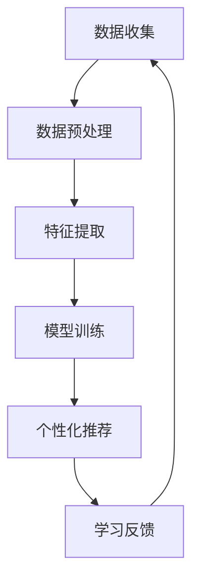

#### 2.1.2 课堂互动与学习分析

计算技术不仅促进了个性化学习，还增强了课堂互动和学习分析。在线教育平台和虚拟课堂，使得教师和学生能够实时互动，共享资源和讨论问题。同时，通过学习分析工具，教师可以了解学生的学习状态和需求，及时调整教学策略。

**核心算法原理讲解：**学习分析中常用的算法包括聚类分析、关联规则挖掘和分类算法等。以下是一个简化的伪代码，用于描述聚类分析在课堂互动中的应用：

```python
# 聚类分析伪代码
def kmeans_clustering(data, K):
    # 初始化K个聚类中心
    centroids = initialize_centroids(data, K)
    
    while not converged:
        # 分配数据到最近的聚类中心
        clusters = assign_data_to_clusters(data, centroids)
        
        # 更新聚类中心
        centroids = update_centroids(clusters)
        
        # 判断是否收敛
        if check_convergence(centroids):
            break
            
    return clusters
```

#### 2.1.3 教育资源的数字化与共享

教育资源的数字化与共享，是计算技术在教育领域应用的另一个重要方面。通过云计算和区块链技术，教育机构可以将课程、教材、课件等资源数字化并共享给全球用户，提高了教育资源的可及性和共享性。

**核心概念与联系：**教育资源的数字化与共享，依赖于云计算和区块链技术的支持。以下是一个简化的 Mermaid 流程图，展示了这一过程：

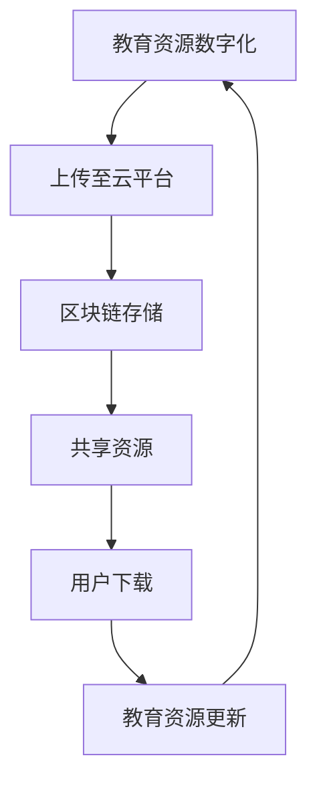

---

#### 2.2 线上教育与虚拟课堂

线上教育和虚拟课堂是计算技术在教育领域应用的重要成果之一，它们不仅改变了传统的教育模式，还为教育创新提供了新的可能性。

#### 2.2.1 线上教育平台的发展

线上教育平台的兴起，为学习者提供了灵活的学习时间和地点，打破了传统教育的地域限制。平台如Coursera、edX和Udacity等，通过整合全球优质教育资源，提供了丰富的在线课程和学习路径。这些平台利用大数据分析和人工智能技术，为学习者提供个性化的学习体验。

**核心概念与联系：**线上教育平台的发展，依赖于大数据分析和人工智能技术的支持。以下是一个简化的 Mermaid 流程图，展示了这一过程：

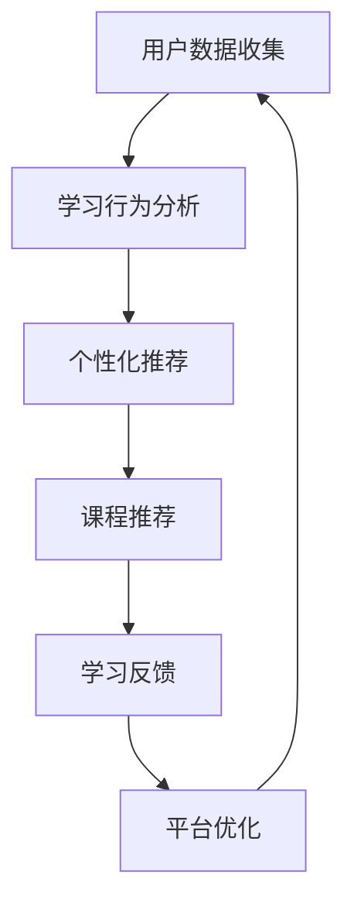

#### 2.2.2 虚拟课堂的实现与挑战

虚拟课堂的实现，通过虚拟现实（VR）和增强现实（AR）技术，为学生提供沉浸式的学习体验。虚拟课堂可以模拟真实课堂环境，使学生在虚拟环境中进行互动和学习。然而，虚拟课堂的实现也面临着技术、成本和接受度等方面的挑战。

**核心算法原理讲解：**虚拟课堂的实现，依赖于计算机图形学和虚拟现实技术。以下是一个简化的伪代码，用于描述虚拟课堂环境中的图像渲染过程：

```python
# 虚拟课堂渲染伪代码
def render_scene(camera, scene):
    # 初始化渲染环境
    render_context = initialize_context()
    
    # 渲染场景
    render_context.render(scene, camera)
    
    # 输出渲染结果
    output_image = render_context.capture_output()
    
    return output_image
```

#### 2.2.3 远程教育与国际化教育

远程教育和国际化教育是线上教育和虚拟课堂的重要应用方向。通过远程教育，学生可以跨地域学习，打破了传统教育的地理限制。国际化教育则通过跨文化课程和在线交流，促进了不同国家和地区之间的教育合作与交流。

**核心概念与联系：**远程教育和国际化教育，依赖于互联网和云计算技术。以下是一个简化的 Mermaid 流程图，展示了这一过程：

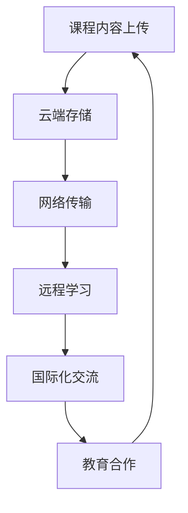

---

#### 2.3 计算技术在个性化学习中的应用

个性化学习是教育改革的重要方向之一，计算技术通过大数据分析和人工智能算法，为学生提供了个性化的学习路径和学习资源。以下将详细探讨计算技术在个性化学习中的应用。

#### 2.3.1 学习数据收集与处理

个性化学习的基础是收集和学习者的学习数据。这些数据包括学习行为数据（如学习时间、学习内容、学习路径等）、学习效果数据（如考试成绩、学习进度等）和学习偏好数据（如学习风格、兴趣爱好等）。计算技术通过数据采集工具和在线学习平台，收集了大量的学习数据。

**核心算法原理讲解：**学习数据处理通常涉及数据清洗、特征提取和数据挖掘等步骤。以下是一个简化的伪代码，用于描述特征提取的过程：

```python
# 特征提取伪代码
def extract_features(data):
    # 数据清洗
    cleaned_data = clean_data(data)
    
    # 特征提取
    features = []
    for record in cleaned_data:
        feature_vector = extract_feature_vector(record)
        features.append(feature_vector)
    
    return features
```

**数学模型和公式：**特征提取过程通常涉及到线性变换、降维和分类等数学模型。以下是一个简化的线性变换模型：

$$
\text{新特征} = W \cdot \text{原特征} + b
$$

其中，$W$ 是权重矩阵，$b$ 是偏置项。

#### 2.3.2 个性化学习路径规划

个性化学习路径规划是计算技术在个性化学习中的重要应用。通过分析学习者的特征数据和学习效果，系统能够为学习者推荐适合的学习路径和学习资源。

**核心算法原理讲解：**个性化学习路径规划通常使用推荐算法和路径规划算法。以下是一个简化的推荐算法伪代码：

```python
# 推荐算法伪代码
def recommend_learning_path(features, learning_resources):
    # 计算特征相似度
    similarity_scores = calculate_similarity(features, learning_resources)
    
    # 排序学习资源
    sorted_resources = sort_resources_by_similarity(similarity_scores)
    
    # 推荐学习路径
    recommended_path = select_top_resources(sorted_resources)
    
    return recommended_path
```

#### 2.3.3 学习效果评估与反馈

个性化学习不仅需要提供合适的学习路径和学习资源，还需要对学习效果进行评估和反馈。通过学习分析工具，教师和系统能够了解学生的学习状态和需求，及时调整教学策略和学习资源。

**核心算法原理讲解：**学习效果评估通常使用评估指标和反馈机制。以下是一个简化的评估指标伪代码：

```python
# 学习效果评估伪代码
def evaluate_learning_effect(learning_data, expected_outcome):
    # 计算评估指标
    metrics = calculate_evaluation_metrics(learning_data, expected_outcome)
    
    # 反馈学习效果
    feedback = generate_feedback(metrics)
    
    return feedback
```

**数学模型和公式：**评估指标通常包括准确率、召回率、F1分数等。以下是一个简化的准确率计算公式：

$$
\text{准确率} = \frac{\text{正确预测数}}{\text{总预测数}}
$$

#### 2.3.4 个性化学习案例分析

为了更好地理解计算技术在个性化学习中的应用，以下是一个个性化学习案例的详细解释。

**案例背景：**某在线教育平台为一名初中生提供个性化学习服务。该学生的学习数据包括学习行为、学习效果和学习偏好。

**案例步骤：**
1. **数据收集与预处理：**平台收集了该学生的学习数据，包括学习时间、学习内容、考试成绩和学习偏好。首先，对数据进行清洗，去除异常值和噪声。
2. **特征提取：**通过特征提取算法，将原始数据转换为特征向量，以便进行后续分析。
3. **个性化推荐：**利用推荐算法，为该学生推荐适合的学习路径和学习资源。推荐算法会考虑学生的学习行为、学习效果和学习偏好。
4. **学习效果评估与反馈：**在学习过程中，平台会收集学生的学习效果数据，如考试成绩和作业完成情况。通过评估指标，评估学生的学习效果，并根据评估结果提供反馈。
5. **调整与优化：**根据反馈，平台会调整学习路径和学习资源，以更好地满足学生的学习需求。

**案例结果：**通过个性化学习服务，该学生的学习效果得到了显著提高，学习兴趣也得到了增强。

---

### 第3章：计算技术在医疗健康领域的应用

#### 3.1 计算技术在疾病诊断中的应用

计算技术在疾病诊断中的应用，极大地提高了诊断的准确性和效率。以下将详细探讨计算技术在疾病诊断中的几个关键应用。

#### 3.1.1 医学影像分析

医学影像分析是计算技术在疾病诊断中的重要应用之一。通过计算机视觉和深度学习技术，医学影像分析系统能够自动识别和诊断病变区域，从而辅助医生进行诊断。

**核心概念与联系：**医学影像分析依赖于图像处理、计算机视觉和深度学习技术。以下是一个简化的 Mermaid 流程图，展示了医学影像分析的过程：

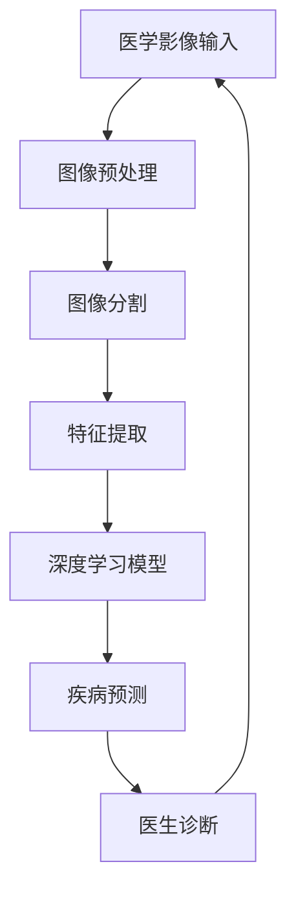

**核心算法原理讲解：**医学影像分析通常使用卷积神经网络（CNN）等深度学习模型。以下是一个简化的CNN算法伪代码：

```python
# CNN算法伪代码
class ConvolutionalNeuralNetwork:
    def __init__(self, input_shape, num_classes):
        # 初始化网络结构
        self.conv_layers = []
        self.fc_layers = []
        self.optimizer = None
        
    def forward_pass(self, inputs):
        # 前向传播
        for layer in self.conv_layers:
            inputs = layer.forward(inputs)
        for layer in self.fc_layers:
            inputs = layer.forward(inputs)
        return inputs
    
    def backward_pass(self, inputs, labels):
        # 反向传播
        for layer in reversed(self.fc_layers):
            layer.backward(inputs, labels)
        for layer in reversed(self.conv_layers):
            layer.backward(inputs, labels)
```

**数学模型和公式：**深度学习模型通常涉及反向传播算法、损失函数和优化器等。以下是一个简化的反向传播算法公式：

$$
\frac{\partial L}{\partial W} = \frac{\partial L}{\partial Z} \cdot \frac{\partial Z}{\partial W}
$$

其中，$L$ 是损失函数，$W$ 是权重矩阵，$Z$ 是中间变量。

#### 3.1.2 电子病历系统

电子病历系统（Electronic Health Records, EHR）是计算技术在医疗健康领域的另一个重要应用。通过电子病历系统，医生可以记录、存储和管理患者的健康信息，从而提高医疗服务的效率和准确性。

**核心概念与联系：**电子病历系统的实现，依赖于数据库技术、数据存储和检索算法等。以下是一个简化的 Mermaid 流程图，展示了电子病历系统的数据管理过程：

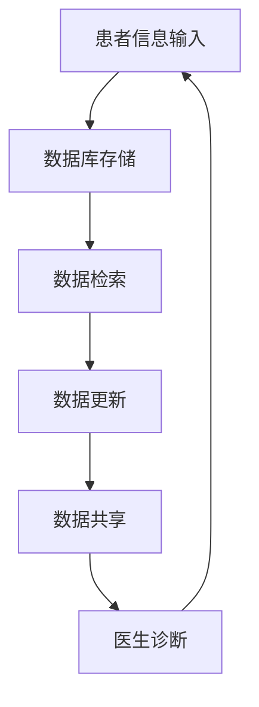

**核心算法原理讲解：**电子病历系统的数据管理通常涉及数据库查询和索引算法。以下是一个简化的数据库查询伪代码：

```python
# 数据库查询伪代码
def query_database(query):
    # 连接数据库
    connection = connect_to_database()
    
    # 执行查询
    results = connection.execute(query)
    
    # 关闭数据库连接
    connection.close()
    
    return results
```

#### 3.1.3 人工智能辅助诊断

人工智能辅助诊断系统利用计算技术和大数据分析，为医生提供辅助诊断工具。这些系统可以分析大量医学数据，发现潜在的疾病模式和趋势，从而提高诊断的准确性和效率。

**核心概念与联系：**人工智能辅助诊断依赖于机器学习和数据挖掘技术。以下是一个简化的 Mermaid 流程图，展示了人工智能辅助诊断的过程：

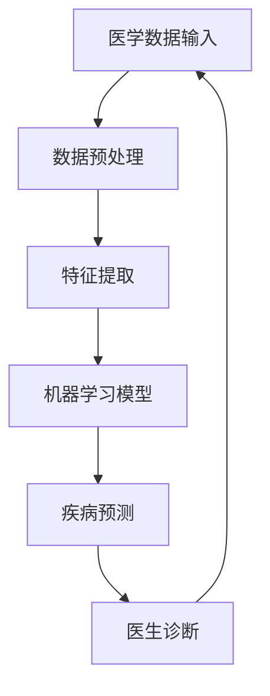

**核心算法原理讲解：**人工智能辅助诊断通常使用分类算法和回归算法。以下是一个简化的分类算法伪代码：

```python
# 分类算法伪代码
def classify(data, model):
    # 预测类别
    predicted_categories = model.predict(data)
    
    # 返回预测结果
    return predicted_categories
```

**数学模型和公式：**分类算法通常涉及损失函数、梯度下降和优化器等。以下是一个简化的梯度下降算法公式：

$$
W_{\text{new}} = W_{\text{old}} - \alpha \cdot \frac{\partial L}{\partial W}
$$`

其中，$W_{\text{new}}$ 和 $W_{\text{old}}$ 分别是新的权重和旧的权重，$\alpha$ 是学习率，$L$ 是损失函数。

---

#### 3.2 个性化医疗与精准医疗

个性化医疗（Personalized Medicine）和精准医疗（Precision Medicine）是医疗健康领域的重要发展趋势。计算技术在个性化医疗和精准医疗中发挥了关键作用，以下将详细探讨这两个概念及其应用。

#### 3.2.1 个性化医疗的概念与原则

个性化医疗是指根据患者的遗传信息、生活方式、环境因素等个体差异，制定个性化的治疗方案。个性化医疗的核心原则包括：

1. **个体化诊断：**通过基因检测、生物标志物检测等手段，对患者进行精确诊断。
2. **个体化治疗：**根据患者的个体差异，制定个性化的治疗方案，包括药物、手术、康复等。
3. **个体化预防：**通过生活方式干预、疫苗接种等手段，降低疾病风险。

**核心概念与联系：**个性化医疗的实现，依赖于基因组学、生物信息学和计算生物学等领域的支持。以下是一个简化的 Mermaid 流程图，展示了个性化医疗的过程：

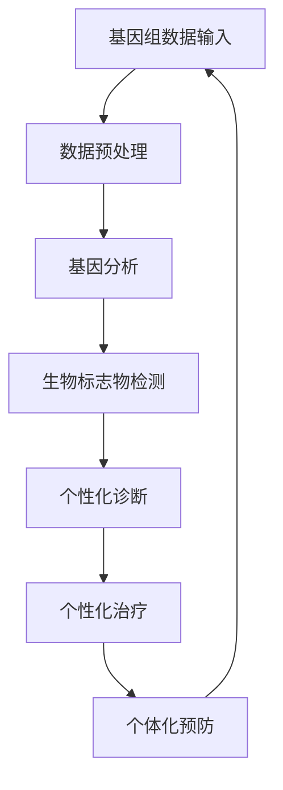

**核心算法原理讲解：**个性化医疗中的基因组数据分析通常涉及序列比对、基因注释和功能预测等算法。以下是一个简化的序列比对算法伪代码：

```python
# 序列比对算法伪代码
def sequence_alignment(seq1, seq2):
    # 初始化比对矩阵
    matrix = initialize_matrix(seq1, seq2)
    
    # 比对过程
    for i in range(len(seq1)):
        for j in range(len(seq2)):
            matrix[i][j] = calculate_score(seq1[i], seq2[j])
    
    # 查找最优路径
    optimal_path = find_optimal_path(matrix)
    
    return optimal_path
```

**数学模型和公式：**序列比对算法通常涉及动态规划算法、比对矩阵和比对得分等。以下是一个简化的动态规划算法公式：

$$
\text{score}(i, j) = \max(\text{score}(i-1, j-1) + \text{match_score}, \text{score}(i-1, j) + \text{gap_score}, \text{score}(i, j-1) + \text{gap_score})
$$

其中，$i$ 和 $j$ 分别表示序列1和序列2的索引位置，$\text{match_score}$ 是匹配得分，$\text{gap_score}$ 是gap得分。

#### 3.2.2 精准医疗的实施策略

精准医疗是指通过基因组学、分子生物学等手段，对疾病进行分类和分型，制定精确的诊断和治疗方案。精准医疗的实施策略包括：

1. **基因组学分析：**通过基因组测序和基因注释，了解患者的基因变异和突变。
2. **分子生物学检测：**通过分子生物学方法，检测肿瘤标志物、代谢产物等分子信息。
3. **多学科协作：**整合基因组学、分子生物学、临床医学等学科，制定个性化的治疗方案。

**核心概念与联系：**精准医疗的实现，依赖于基因组学、分子生物学和计算生物学等领域的支持。以下是一个简化的 Mermaid 流程图，展示了精准医疗的过程：

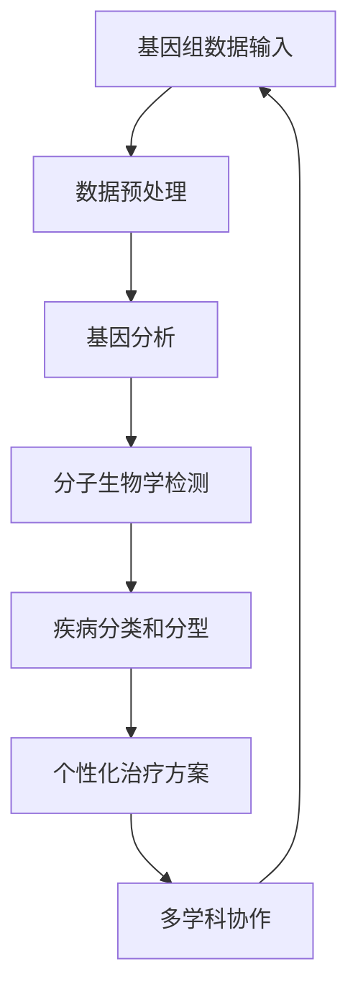

**核心算法原理讲解：**精准医疗中的基因组数据分析通常涉及序列比对、基因注释和功能预测等算法。以下是一个简化的基因注释算法伪代码：

```python
# 基因注释算法伪代码
def gene_annotation(seq):
    # 初始化注释结果
    annotations = []
    
    # 查找基因区域
    gene_regions = find_gene_regions(seq)
    
    # 对基因区域进行注释
    for region in gene_regions:
        annotation = annotate_region(region)
        annotations.append(annotation)
    
    return annotations
```

**数学模型和公式：**基因注释算法通常涉及序列比对、基因数据库和注释规则等。以下是一个简化的序列比对算法公式：

$$
\text{score}(i, j) = \max(\text{score}(i-1, j-1) + \text{match_score}, \text{score}(i-1, j) + \text{gap_score}, \text{score}(i, j-1) + \text{gap_score})
$$

其中，$i$ 和 $j$ 分别表示序列1和序列2的索引位置，$\text{match_score}$ 是匹配得分，$\text{gap_score}$ 是gap得分。

#### 3.2.3 个性化医疗的未来展望

个性化医疗和精准医疗是医疗健康领域的重要发展趋势。随着计算技术和生物技术的不断进步，个性化医疗和精准医疗将得到更广泛的应用。

1. **基因组学数据共享：**通过基因组学数据共享平台，实现全球范围内的基因组数据共享，促进个性化医疗的发展。
2. **多学科协作：**整合基因组学、分子生物学、临床医学等学科，实现真正的个性化医疗和精准医疗。
3. **人工智能应用：**利用人工智能技术，对大量医学数据进行分析和挖掘，提高个性化医疗和精准医疗的准确性和效率。

**核心概念与联系：**个性化医疗和精准医疗的实现，依赖于基因组学、分子生物学、计算生物学和人工智能等领域的支持。以下是一个简化的 Mermaid 流程图，展示了个性化医疗和精准医疗的未来发展：

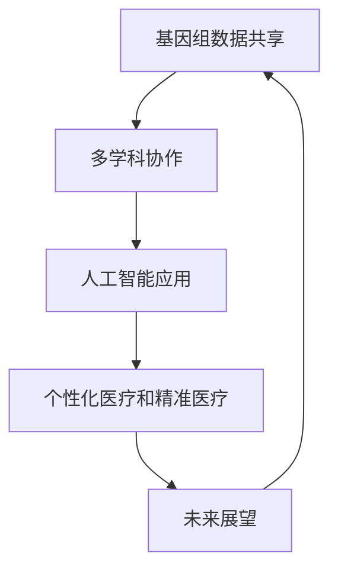

---

#### 3.3 医疗大数据分析与智慧医疗

医疗大数据分析是计算技术在医疗健康领域的重要应用，它利用大数据技术和人工智能算法，对海量医疗数据进行分析和挖掘，为医疗决策提供支持。智慧医疗（Smart Healthcare）则是指利用计算技术和信息技术，提升医疗服务的效率和质量。以下将详细探讨医疗大数据分析和智慧医疗的应用。

#### 3.3.1 医疗大数据的应用领域

医疗大数据的应用涉及多个领域，包括疾病预测、流行病监测、药物研发、医疗资源管理等。

1. **疾病预测：**通过分析患者的病历、基因数据、生活习惯等，预测患者患病的风险，从而提前采取预防措施。
2. **流行病监测：**利用大数据技术，实时监测和分析疾病的发生、传播和流行趋势，为公共卫生决策提供支持。
3. **药物研发：**通过分析药物与基因、疾病的关联性，加快药物研发进程，提高药物的安全性和有效性。
4. **医疗资源管理：**通过分析医疗资源的使用情况，优化医疗资源配置，提高医疗服务的效率和质量。

**核心概念与联系：**医疗大数据分析依赖于数据采集、数据存储、数据分析和数据可视化等技术。以下是一个简化的 Mermaid 流程图，展示了医疗大数据分析的过程：

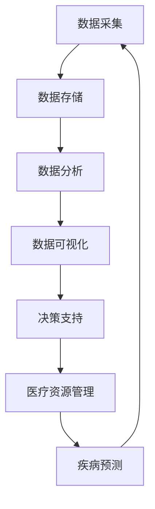

**核心算法原理讲解：**医疗大数据分析中常用的算法包括聚类分析、关联规则挖掘、分类算法和预测算法等。以下是一个简化的聚类分析算法伪代码：

```python
# 聚类分析算法伪代码
def kmeans_clustering(data, K):
    # 初始化K个聚类中心
    centroids = initialize_centroids(data, K)
    
    while not converged:
        # 分配数据到最近的聚类中心
        clusters = assign_data_to_clusters(data, centroids)
        
        # 更新聚类中心
        centroids = update_centroids(clusters)
        
        # 判断是否收敛
        if check_convergence(centroids):
            break
            
    return clusters
```

**数学模型和公式：**聚类分析算法通常涉及距离度量、聚类中心和收敛条件等。以下是一个简化的距离度量公式：

$$
d(i, j) = \sqrt{\sum_{k=1}^{n} (x_{ik} - x_{jk})^2}
$$

其中，$i$ 和 $j$ 分别表示数据点 $i$ 和 $j$，$x_{ik}$ 和 $x_{jk}$ 分别表示数据点 $i$ 和 $j$ 在第 $k$ 个特征上的取值，$n$ 表示特征的数量。

#### 3.3.2 智慧医疗系统的构建

智慧医疗系统是指利用计算技术和信息技术，实现医疗服务的智能化。智慧医疗系统的构建通常包括以下几个关键步骤：

1. **数据采集与整合：**通过传感器、电子病历系统、健康监测设备等，采集患者的健康数据，并进行整合和处理。
2. **数据分析与挖掘：**利用大数据技术和人工智能算法，对医疗数据进行分析和挖掘，提取有价值的信息。
3. **决策支持与优化：**基于分析结果，为医生和医疗机构提供决策支持，优化医疗服务的流程和资源配置。
4. **患者管理与服务：**利用智能设备和服务平台，为患者提供个性化的健康管理服务，提高患者的就医体验。

**核心概念与联系：**智慧医疗系统的构建，依赖于物联网、云计算、大数据分析和人工智能等技术的支持。以下是一个简化的 Mermaid 流程图，展示了智慧医疗系统的构建过程：

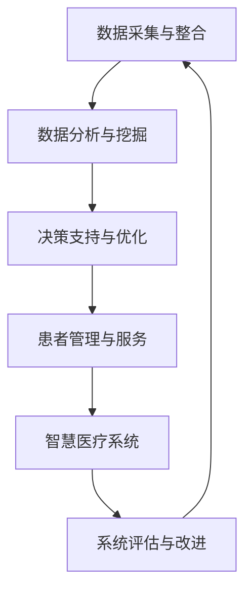

**核心算法原理讲解：**智慧医疗系统中的数据分析与挖掘，通常涉及机器学习、深度学习和知识图谱等技术。以下是一个简化的机器学习算法伪代码：

```python
# 机器学习算法伪代码
class MachineLearningAlgorithm:
    def __init__(self, model):
        self.model = model
        
    def train(self, training_data):
        # 训练模型
        self.model.train(training_data)
        
    def predict(self, input_data):
        # 预测结果
        return self.model.predict(input_data)
```

**数学模型和公式：**机器学习算法通常涉及损失函数、优化算法和模型评估等。以下是一个简化的损失函数公式：

$$
L(\theta) = -\frac{1}{m} \sum_{i=1}^{m} [y^{(i)} \cdot \log(h_{\theta}(x^{(i)})) + (1 - y^{(i)}) \cdot \log(1 - h_{\theta}(x^{(i)}))]
$$

其中，$L(\theta)$ 是损失函数，$\theta$ 是模型参数，$m$ 是训练数据集的大小，$y^{(i)}$ 是实际标签，$h_{\theta}(x^{(i)}$ 是模型的预测值。

---

### 第4章：计算隐私保护

#### 4.1 隐私保护的背景与挑战

隐私保护是计算技术发展中的一个重要议题，随着大数据和云计算的广泛应用，隐私保护的重要性日益凸显。以下将详细探讨隐私保护的背景与挑战。

#### 4.1.1 隐私保护的必要性

隐私保护是指保护个人隐私数据不被未经授权的第三方访问、使用和泄露。在计算技术广泛应用的时代，个人隐私数据的泄露和滥用问题日益严重，隐私保护变得至关重要。以下是一些隐私保护的必要性：

1. **保护个人隐私：**个人隐私数据包括姓名、地址、电话号码、电子邮箱、健康状况等敏感信息，泄露这些信息可能导致个人隐私受到侵犯，甚至造成经济损失。
2. **维护社会稳定：**隐私保护是维护社会稳定的重要保障，如果个人隐私数据被滥用，可能导致社会矛盾加剧，影响社会和谐。
3. **遵守法律法规：**许多国家和地区已经制定了相关的隐私保护法律法规，如《通用数据保护条例》（GDPR）和《加州消费者隐私法》（CCPA），企业必须遵守这些法律法规，保护用户隐私。

#### 4.1.2 隐私保护的挑战

隐私保护面临着许多挑战，以下是一些主要挑战：

1. **数据量庞大：**随着大数据技术的发展，个人隐私数据量呈现爆炸式增长，给隐私保护带来了巨大挑战。
2. **数据多样性：**个人隐私数据类型繁多，包括结构化数据、非结构化数据和半结构化数据，如何有效地保护这些数据成为一大难题。
3. **技术发展迅速：**隐私保护技术不断发展，但攻击手段也日益先进，如何在不断变化的技术环境中保持隐私保护的有效性，是一个巨大的挑战。
4. **隐私泄露风险：**云计算、物联网等新技术的应用，增加了隐私泄露的风险。例如，云计算平台可能成为黑客攻击的目标，物联网设备可能被恶意软件控制，从而泄露个人隐私数据。
5. **隐私与便利的平衡：**在现实生活中，隐私保护与用户便利性之间存在一定的矛盾。例如，为了提供个性化的服务，企业可能需要收集用户的隐私数据，但用户又担心自己的隐私数据被滥用。

#### 4.1.3 隐私保护的重要性

隐私保护在计算技术发展中的重要性不可忽视，以下是一些方面：

1. **维护用户信任：**隐私保护有助于维护用户对企业和服务的信任，如果用户认为自己的隐私数据无法得到有效保护，他们将不愿意使用相关服务。
2. **促进技术发展：**隐私保护是计算技术健康发展的基石，只有在保障用户隐私的前提下，技术才能持续发展。
3. **社会责任：**企业和政府有责任保护用户的隐私，这是其社会责任的体现。隐私保护也是构建和谐社会的重要方面。

---

#### 4.2 隐私保护技术与方法

隐私保护技术在计算技术领域中扮演着至关重要的角色，旨在确保个人隐私数据在收集、存储、处理和传输过程中的安全性和隐私性。以下将详细探讨隐私保护技术的核心方法和应用。

#### 4.2.1 加密技术与隐私计算

加密技术是隐私保护的基础，通过将数据加密，只有拥有正确密钥的用户才能解密和访问数据。以下是几种常见的加密技术：

1. **对称加密：**对称加密算法（如AES、DES）使用相同的密钥进行加密和解密。对称加密算法速度快，但密钥管理复杂。
2. **非对称加密：**非对称加密算法（如RSA、ECC）使用一对密钥，公钥用于加密，私钥用于解密。非对称加密算法安全性高，但计算复杂度大。

**核心算法原理讲解：**对称加密和非对称加密算法的原理如下：

对称加密算法：

```latex
\text{加密过程：} \quad C = E_{K}(M)
\text{解密过程：} \quad M = D_{K}(C)
```

其中，$C$ 是加密后的数据，$M$ 是原始数据，$K$ 是密钥。

非对称加密算法：

```latex
\text{加密过程：} \quad C = E_{K_{\text{public}}}(M)
\text{解密过程：} \quad M = D_{K_{\text{private}}}(C)
```

其中，$K_{\text{public}}$ 是公钥，$K_{\text{private}}$ 是私钥。

**应用示例：**在电子邮件通信中，发送方使用接收方的公钥对邮件进行加密，只有接收方使用自己的私钥才能解密邮件内容。

#### 4.2.2 隐私计算框架

隐私计算框架是一种基于加密技术的新型计算模式，允许在数据加密的状态下进行数据处理和分析。以下是一些常见的隐私计算框架：

1. **安全多方计算（Secure Multi-Party Computation, MPC）：**安全多方计算允许两个或多个参与方在不需要共享原始数据的情况下，共同计算出一个结果。通过 MPC，参与方可以共享计算结果，而不会泄露各自的原始数据。
2. **同态加密（Homomorphic Encryption, HE）：**同态加密是一种允许在加密数据上执行计算，而不需要解密数据的加密技术。通过同态加密，可以在加密数据上直接执行数学运算，如加法、乘法等。

**核心算法原理讲解：**同态加密的基本原理如下：

```latex
\text{加密过程：} \quad C = HE Encrypt(M)
\text{计算过程：} \quad R = HE Compute(C, f())
\text{解密过程：} \quad M = HE Decrypt(R)
```

其中，$M$ 是原始数据，$C$ 是加密后的数据，$R$ 是计算结果，$f()$ 是计算函数。

**应用示例：**在金融领域，同态加密可以用于加密客户交易数据，同时允许金融机构在加密数据上进行风险分析和欺诈检测。

#### 4.2.3 隐私保护算法与工具

隐私保护算法和工具是实现隐私计算的关键，以下介绍几种常见的隐私保护算法和工具：

1. **差分隐私（Differential Privacy）：**差分隐私是一种保护隐私的机制，通过在数据中引入噪声，确保单个数据点的隐私，同时保持数据分析的有效性。常见的差分隐私算法包括拉普拉斯机制和指数机制。
2. **数据匿名化（Data Anonymization）：**数据匿名化是一种将原始数据转换为匿名数据的方法，以保护个人隐私。常见的匿名化技术包括k-匿名、l-多样性匿名和t-隐私。
3. **联邦学习（Federated Learning）：**联邦学习是一种分布式学习框架，允许多个参与方共同训练一个模型，而无需共享原始数据。联邦学习通过加密和差分隐私技术，确保参与方的数据隐私。

**核心算法原理讲解：**差分隐私的基本原理如下：

```latex
\text{隐私预算：} \quad \epsilon
\text{隐私保护机制：} \quad \hat{L}(x, \epsilon) = L(x) + \epsilon N
```

其中，$\epsilon$ 是隐私预算，$N$ 是噪声，$L(x)$ 是原始损失函数。

**应用示例：**在健康医疗领域，差分隐私可以用于保护患者隐私，同时允许研究人员分析匿名化后的健康数据。

#### 4.2.4 隐私保护技术的挑战与未来方向

隐私保护技术在实践中面临着诸多挑战，以下是一些主要挑战：

1. **性能瓶颈：**加密和解密操作通常比普通计算操作慢得多，导致隐私保护技术可能增加计算成本和延迟。
2. **安全性：**尽管现有的隐私保护技术已经取得了一定进展，但仍然存在潜在的安全漏洞和攻击手段。
3. **用户接受度：**用户可能对隐私保护技术的隐私保护效果和便利性存在疑虑，影响其接受度和使用意愿。
4. **法律法规：**隐私保护技术的法律法规尚不完善，需要进一步明确隐私保护的标准和责任。

未来的隐私保护技术将朝着以下方向发展：

1. **性能优化：**通过硬件加速和优化算法，提高隐私保护技术的性能和效率。
2. **安全性提升：**研究新的加密算法和隐私保护机制，提高系统的安全性和抗攻击能力。
3. **用户参与：**鼓励用户参与隐私保护决策，提高隐私保护技术的透明度和信任度。
4. **跨领域合作：**推动隐私保护技术在不同领域的应用和合作，实现全面的隐私保护。

---

#### 4.3 隐私保护政策的制定与实施

隐私保护政策是确保个人隐私数据安全的重要手段，它涉及法律法规、行业标准和组织策略等多个层面。以下将详细探讨隐私保护政策的制定与实施。

#### 4.3.1 全球隐私保护政策概述

全球范围内，许多国家和地区已经制定了相关的隐私保护法律法规，以保护个人隐私数据。以下是一些主要国家的隐私保护政策：

1. **欧盟：**欧盟在2018年通过了《通用数据保护条例》（GDPR），该条例对个人数据的收集、处理、存储和传输等方面做出了详细规定，对违反规定的企业设置了高额罚款。
2. **美国：**美国虽然没有统一的隐私保护法律，但各州有不同的隐私保护法规，如《加州消费者隐私法》（CCPA）。此外，联邦政府也在推动制定全面的隐私保护法案。
3. **中国：**中国在2017年通过了《中华人民共和国网络安全法》，该法对网络数据的安全保护做出了规定。此外，中国还在推进《个人信息保护法》的立法工作。
4. **其他国家和地区：**许多国家和地区，如加拿大、澳大利亚、巴西等，也制定了各自的隐私保护法律法规，以保护个人隐私数据。

**核心概念与联系：**全球隐私保护政策的制定，涉及数据主权、隐私保护标准、跨境数据流动等多个方面。以下是一个简化的 Mermaid 流程图，展示了全球隐私保护政策的制定过程：

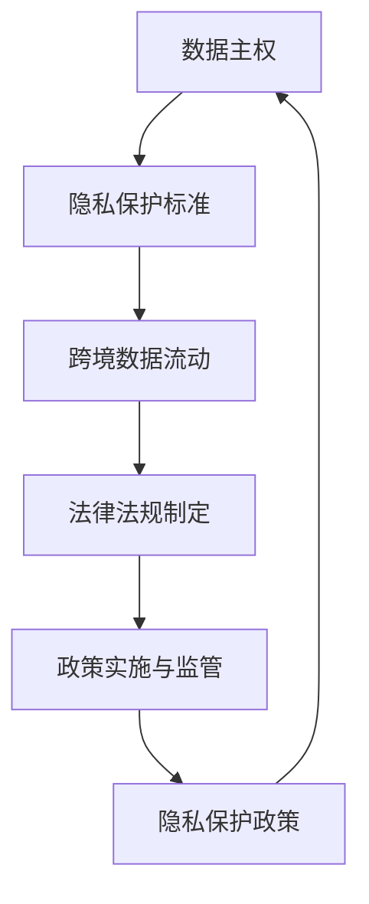

#### 4.3.2 我国隐私保护政策的现状与趋势

我国在隐私保护政策方面取得了显著进展，以下是我国隐私保护政策的现状与趋势：

1. **法律法规：**我国已经制定了《中华人民共和国网络安全法》和《中华人民共和国个人信息保护法》，为个人隐私数据提供了法律保护。此外，我国还在推进《数据安全法》的立法工作。
2. **政策文件：**我国政府发布了多项政策文件，如《关于进一步规范大数据收集使用管理的通知》和《信息安全技术个人信息安全规范》，对大数据的收集、存储、处理和传输等方面提出了要求。
3. **行业标准：**我国制定了多项隐私保护相关行业标准，如《信息安全技术个人信息保护规范》和《信息技术个人信息保护指南》，为企业和机构提供了技术指导。
4. **执法监管：**我国加大了对违法收集、处理和传输个人隐私数据的执法力度，对违反法律法规的企业和个人进行了处罚。

**核心概念与联系：**我国隐私保护政策的实施，涉及法律法规的制定与执行、行业标准的制定与推广、执法监管等多个方面。以下是一个简化的 Mermaid 流程图，展示了我国隐私保护政策的实施过程：

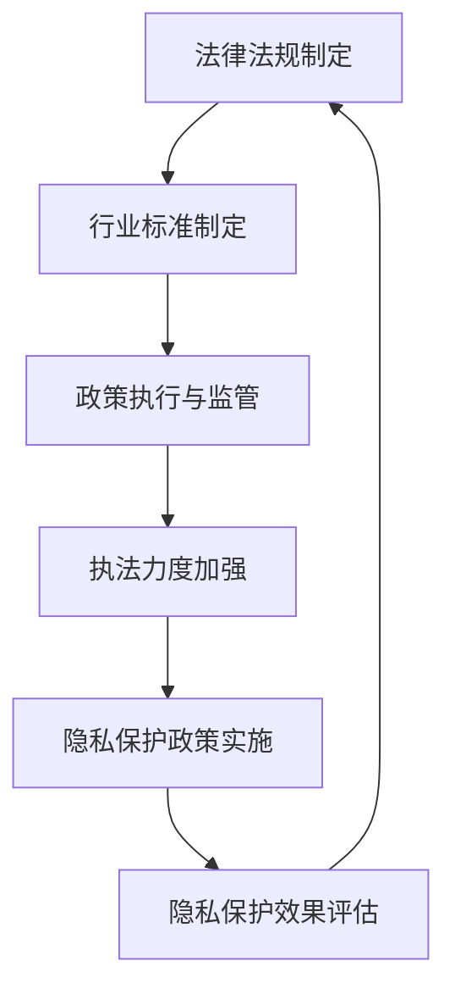

#### 4.3.3 隐私保护政策的实施与效果评估

隐私保护政策的实施与效果评估是确保政策有效性的关键环节。以下将探讨隐私保护政策的实施与效果评估。

1. **实施过程：**隐私保护政策的实施涉及政策宣传、教育培训、技术改造和监管执法等多个环节。政策制定部门需要制定详细的实施方案，明确各环节的责任和任务，确保政策得到有效执行。
2. **效果评估：**效果评估是衡量隐私保护政策有效性的重要手段。评估过程应包括以下几个方面：
    - **合规性评估：**评估企业和机构是否按照法律法规和政策要求收集、处理和传输个人隐私数据。
    - **安全性评估：**评估个人隐私数据在收集、存储、处理和传输过程中的安全性，包括数据加密、访问控制、备份与恢复等方面。
    - **用户满意度评估：**评估用户对隐私保护政策的满意度和信任度，通过问卷调查、用户反馈等方式收集用户意见。
    - **执法效果评估：**评估执法部门对违反隐私保护法律法规行为的查处情况，包括案件数量、处罚力度和效果等。

**核心概念与联系：**隐私保护政策的实施与效果评估，涉及合规性评估、安全性评估、用户满意度评估和执法效果评估等多个方面。以下是一个简化的 Mermaid 流程图，展示了隐私保护政策的实施与效果评估过程：

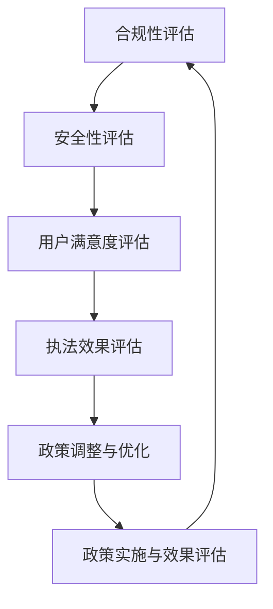

#### 4.3.4 隐私保护政策的实施效果与挑战

隐私保护政策的实施取得了一定的成效，但仍然面临诸多挑战。以下将探讨隐私保护政策的实施效果与挑战。

1. **实施效果：**
    - **法律法规的普及：**隐私保护法律法规的制定和实施，提高了企业和机构对隐私保护的重视程度，促使其加强隐私保护措施。
    - **数据安全性的提升：**隐私保护政策的实施，促进了数据加密、访问控制、备份与恢复等安全技术的应用，提高了个人隐私数据的安全性。
    - **用户隐私意识的增强：**隐私保护政策的宣传和推广，提高了用户的隐私保护意识，用户对隐私保护的需求也日益增强。

2. **挑战：**
    - **政策执行的复杂性：**隐私保护政策的实施涉及多个环节，包括法律法规的制定、行业标准的制定、技术改造和监管执法等，政策执行的复杂性较大。
    - **技术发展的滞后性：**隐私保护技术的发展滞后于隐私保护政策的要求，现有的隐私保护技术难以满足日益复杂的隐私保护需求。
    - **跨部门协作的困难：**隐私保护政策的实施需要跨部门协作，但由于部门之间的利益冲突和协调难度，跨部门协作效果不理想。

**核心概念与联系：**隐私保护政策的实施效果与挑战，涉及法律法规的普及、数据安全性的提升、用户隐私意识的增强、政策执行的复杂性、技术发展的滞后性和跨部门协作的困难等多个方面。以下是一个简化的 Mermaid 流程图，展示了隐私保护政策的实施效果与挑战：

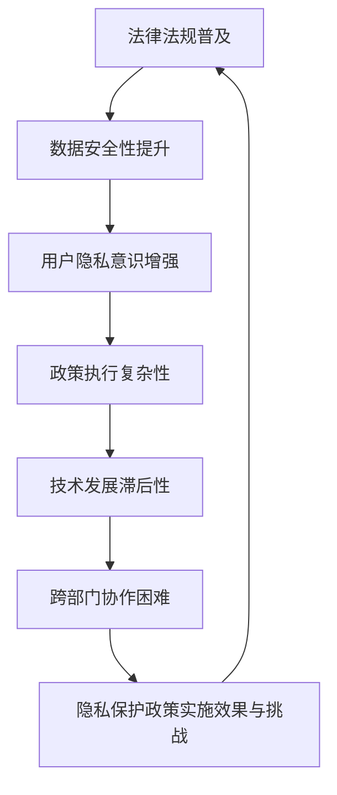

---

#### 4.4.1 计算安全的重要性

计算安全在当今数字化社会中至关重要，它直接关系到个人隐私、企业利益和社会稳定。以下将详细探讨计算安全的重要性，并解释其核心概念与联系。

##### 核心概念与联系

计算安全涉及保护计算机系统、网络和数据免受各种威胁和攻击。以下是一个简化的 Mermaid 流�程图，展示了计算安全的核心概念：

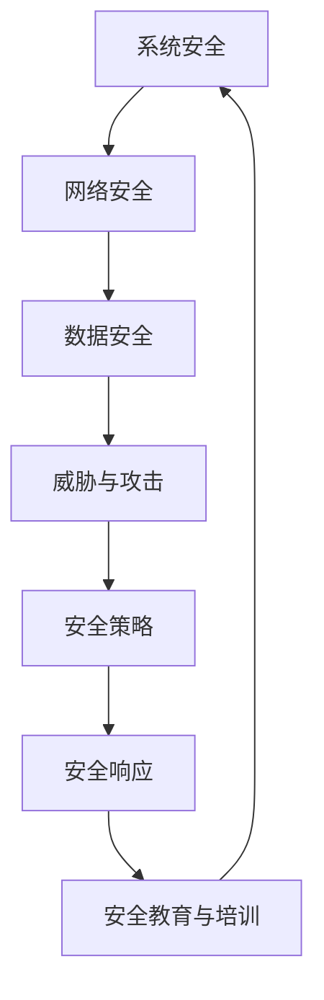

##### 计算安全的重要性

1. **保护个人隐私：**随着个人信息在数字世界中的广泛应用，计算安全是保护个人隐私的重要保障。如果个人隐私数据被泄露或滥用，可能导致严重的后果，如身份盗窃、经济损失等。

2. **维护企业利益：**企业依赖计算机系统进行日常运营和数据处理，计算安全能够防止企业机密数据被窃取或破坏，确保企业的正常运作和竞争优势。

3. **保障社会稳定：**计算安全对于维护社会稳定具有重要作用。网络攻击和系统故障可能引发社会恐慌、经济动荡，甚至对国家安全构成威胁。

4. **提高用户信任：**计算安全能够增强用户对数字服务的信任度，促进数字经济的健康发展。

##### 核心算法原理讲解

计算安全的核心在于防范和应对各种威胁和攻击。以下是一个简化的威胁防御算法伪代码：

```python
# 威胁防御算法伪代码
def threat_defense(system):
    # 检测恶意软件
    if detect_malware(system):
        remove_malware(system)
    
    # 更新系统安全策略
    update_security_policy(system)
    
    # 执行安全审计
    perform_security_audits(system)
    
    # 提醒用户安全意识
    remind_user_awareness()
    
    return system
```

##### 数学模型和公式

计算安全中的数学模型和公式通常用于评估系统的安全性和确定安全策略。以下是一个简化的安全风险评估公式：

$$
\text{风险} = \text{威胁可能性} \times \text{资产价值} \times \text{漏洞利用可能性}
$$`

其中，威胁可能性是指威胁发生的概率，资产价值是指系统中的重要数据或资源的价值，漏洞利用可能性是指攻击者利用漏洞成功的概率。

---

### 5.2 常见的计算安全威胁

计算安全威胁是指可能危害计算机系统、网络和数据安全的各种攻击手段。以下将详细探讨常见的计算安全威胁，包括黑客攻击、网络犯罪、恶意软件等。

#### 5.2.1 黑客攻击

黑客攻击是指未经授权的个体或组织试图非法访问、控制或破坏计算机系统、网络和数据的行为。以下是一些常见的黑客攻击类型：

1. **暴力破解（Brute Force Attack）：**攻击者通过不断尝试不同的用户名和密码组合，试图破解系统或应用程序的登录凭证。

2. **钓鱼攻击（Phishing Attack）：**攻击者通过伪造的电子邮件、网站或短信，欺骗用户提供敏感信息，如用户名、密码和信用卡号码。

3. **中间人攻击（Man-in-the-Middle Attack, MITM）：**攻击者拦截并篡改两个通信实体之间的数据传输，从而窃取或篡改敏感信息。

4. **拒绝服务攻击（Denial of Service, DoS）：**攻击者通过发送大量无效请求，使系统或网络过载，导致其无法正常服务。

5. **分布式拒绝服务攻击（Distributed Denial of Service, DDOS）：**攻击者利用多个受感染设备（僵尸网络）同时攻击目标，使其网络服务瘫痪。

**核心概念与联系：**黑客攻击涉及网络通信、加密技术、用户行为等多个方面。以下是一个简化的 Mermaid 流程图，展示了黑客攻击的基本过程：

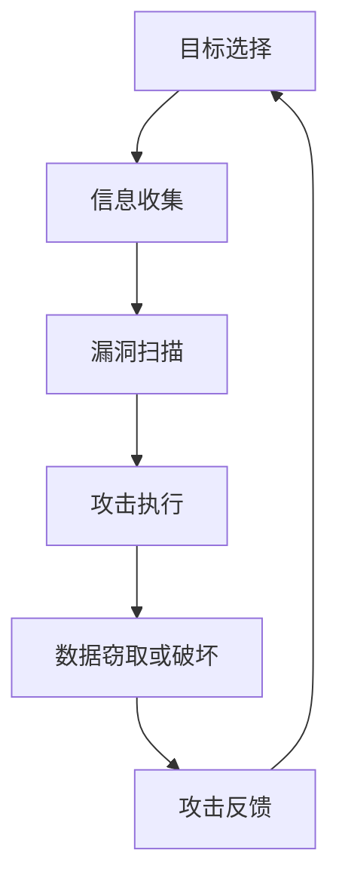

**核心算法原理讲解：**黑客攻击通常涉及密码破解、网络嗅探、漏洞利用等技术。以下是一个简化的密码破解算法伪代码：

```python
# 密码破解算法伪代码
def brute_force crackers(password, charset, length):
    for i in range(charset**length):
        candidate = generate_password(i, charset)
        if verify_password(password, candidate):
            return candidate
    return None
```

**数学模型和公式：**密码破解中常用的数学模型包括密码空间、破解时间和破解成功率等。以下是一个简化的破解时间公式：

$$
\text{破解时间} = \text{密码空间} \times \text{尝试次数}
$$

#### 5.2.2 网络犯罪

网络犯罪是指利用计算机技术和网络进行非法活动的行为，包括诈骗、盗窃、欺诈等。以下是一些常见的网络犯罪类型：

1. **网络诈骗（Online Fraud）：**攻击者通过虚假广告、假冒网站等手段骗取受害者的钱财。

2. **网络盗窃（Cyber Theft）：**攻击者非法获取他人的财务信息，如信用卡号码、银行账户信息等，进行盗窃。

3. **网络欺诈（Online Fraud）：**攻击者通过虚假身份或虚假信息，骗取他人的信任和财产。

4. **勒索软件攻击（Ransomware Attack）：**攻击者通过加密受害者的计算机数据，要求支付赎金以解密。

5. **网络钓鱼攻击（Phishing Attack）：**与上述黑客攻击中的钓鱼攻击相同，攻击者通过伪造的电子邮件或网站，欺骗用户提供敏感信息。

**核心概念与联系：**网络犯罪涉及网络通信、用户行为、法律监管等多个方面。以下是一个简化的 Mermaid 流程图，展示了网络犯罪的基本过程：

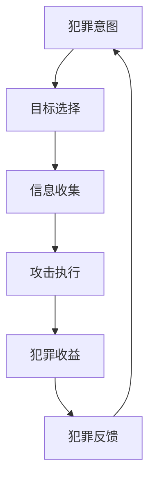

**核心算法原理讲解：**网络犯罪中的关键步骤通常涉及网络扫描、漏洞利用、数据加密等技术。以下是一个简化的网络扫描算法伪代码：

```python
# 网络扫描算法伪代码
def network_scan(target):
    open_ports = []
    for port in range(1, 65536):
        if is_port_open(target, port):
            open_ports.append(port)
    return open_ports
```

**数学模型和公式：**网络犯罪中的数学模型通常涉及犯罪成功率、犯罪成本和犯罪收益等。以下是一个简化的犯罪成功率公式：

$$
\text{犯罪成功率} = \frac{\text{成功犯罪次数}}{\text{尝试犯罪次数}}
$$

#### 5.2.3 恶意软件

恶意软件是指故意设计的、旨在破坏、窃取或干扰计算机系统、网络和数据的行为。以下是一些常见的恶意软件类型：

1. **病毒（Virus）：**病毒是一种能够自我复制并感染其他程序的恶意软件，通过修改其他程序来传播自身。

2. **蠕虫（Worm）：**蠕虫是一种独立运行的恶意软件，能够在网络中自我复制并传播，不需要感染其他程序。

3. **木马（Trojan）：**木马是一种伪装成正常程序的恶意软件，通常通过诱骗用户安装，然后在后台执行恶意操作。

4. **间谍软件（Spyware）：**间谍软件是一种监视用户行为并收集敏感信息的恶意软件，通常不易被用户察觉。

5. **广告软件（Adware）：**广告软件是一种在用户不知情的情况下，显示广告或修改浏览器设置等行为的软件。

**核心概念与联系：**恶意软件涉及编程技术、网络通信、操作系统安全等多个方面。以下是一个简化的 Mermaid 流程图，展示了恶意软件的基本传播过程：

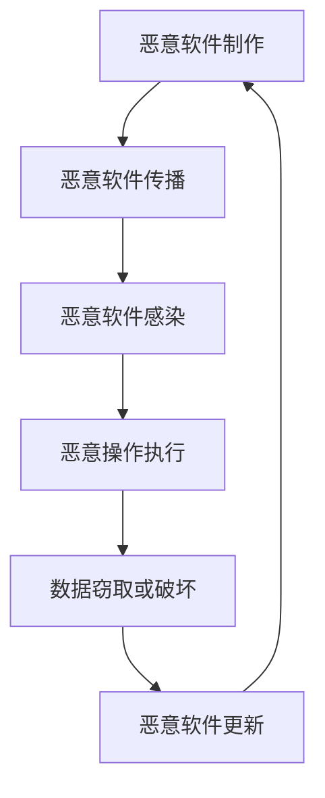

**核心算法原理讲解：**恶意软件的关键步骤通常涉及病毒代码编写、网络扫描、漏洞利用等技术。以下是一个简化的恶意软件传播算法伪代码：

```python
# 恶意软件传播算法伪代码
def spread_malware(target):
    # 扫描网络，寻找漏洞
    vulnerabilities = scan_network(target)
    
    # 利用漏洞传播恶意软件
    for vuln in vulnerabilities:
        exploit_vulnerability(target, vuln)
        
    return vulnerabilities
```

**数学模型和公式：**恶意软件中的数学模型通常涉及传播速度、感染率和清除率等。以下是一个简化的传播速度公式：

$$
\text{传播速度} = \frac{\text{新感染数}}{\text{总感染数}}
$$

---

#### 5.3 伦理问题与计算技术的责任

伦理问题在计算技术领域中扮演着至关重要的角色，随着人工智能、大数据和物联网等技术的发展，伦理问题日益突出。以下将详细探讨伦理问题在计算技术中的应用，以及计算技术在伦理问题中的责任。

##### 伦理问题在计算技术中的应用

1. **算法偏见：**算法偏见是指人工智能系统在决策过程中对某些群体或个体存在歧视或不公平的现象。例如，招聘算法可能对某些性别或种族的候选人存在偏见，导致不公平的招聘结果。

2. **隐私泄露：**计算技术在收集、存储和处理个人数据时，可能导致个人隐私泄露。例如，社交媒体平台可能通过用户数据分析，向广告商出售用户个人信息，导致用户隐私被侵犯。

3. **人工智能伦理：**人工智能在医疗、金融等领域的应用，引发了一系列伦理问题。例如，人工智能在诊断和治疗过程中，如何确保患者的隐私和数据安全，如何防止人工智能系统出现错误或滥用。

4. **数据安全：**计算技术在处理大量数据时，可能面临数据泄露、数据丢失和数据滥用的风险。例如，医疗数据泄露可能导致患者隐私被侵犯，金融数据泄露可能导致经济损失。

##### 核心概念与联系

伦理问题在计算技术中的应用，涉及算法设计、数据管理、用户隐私保护等多个方面。以下是一个简化的 Mermaid 流程图，展示了伦理问题在计算技术中的应用：

```mermaid
graph TD
A[算法设计] --> B[数据管理]
B --> C[用户隐私保护]
C --> D[人工智能伦理]
D --> E[数据安全]
E --> F[伦理问题应用]
F --> A
```

##### 计算技术在伦理问题中的责任

1. **保障用户隐私：**计算技术企业有责任保护用户的隐私，确保用户数据在收集、存储和处理过程中得到充分保护。例如，通过数据加密、访问控制和隐私计算等手段，确保用户隐私不被泄露。

2. **消除算法偏见：**计算技术企业有责任消除算法偏见，确保人工智能系统在决策过程中公平、公正。例如，通过数据清洗、算法优化和多样性训练等手段，减少算法偏见。

3. **数据安全与合规：**计算技术企业有责任确保数据安全，遵守相关法律法规，如《通用数据保护条例》（GDPR）和《加州消费者隐私法》（CCPA）。例如，通过数据备份、安全审计和合规审查等手段，确保数据安全。

4. **伦理审查与监督：**计算技术企业应建立伦理审查机制，对人工智能系统进行伦理评估，确保其在实际应用中符合伦理标准。例如，通过建立伦理委员会、伦理审查流程等，确保人工智能系统在医疗、金融等关键领域的应用符合伦理要求。

##### 核心算法原理讲解

计算技术在伦理问题中的应用，涉及数据清洗、算法优化和伦理审查等算法原理。以下是一个简化的数据清洗算法伪代码：

```python
# 数据清洗算法伪代码
def data_cleaning(data):
    # 删除重复数据
    unique_data = remove_duplicates(data)
    
    # 处理缺失值
    filled_data = fill_missing_values(unique_data)
    
    # 标准化数据
    normalized_data = normalize_data(filled_data)
    
    return normalized_data
```

**数学模型和公式：**数据清洗和算法优化的过程中，常用的数学模型和公式包括缺失值填充、数据标准化和多样性计算等。以下是一个简化的缺失值填充公式：

$$
\text{填充值} = \frac{\text{最大值} + \text{最小值}}{2}
$$

---

### 6.1 计算资源的需求与供应

计算资源的需求与供应是计算技术领域中的重要问题，直接影响计算服务的性能和成本。以下将详细探讨计算资源的需求、供应和分配问题。

#### 6.1.1 计算资源的种类与需求

计算资源主要包括计算能力、存储空间和网络带宽等。以下是一些常见的计算资源种类和需求：

1. **计算能力：**计算能力是指计算机系统处理数据和执行计算任务的能力。计算能力的需求取决于应用的复杂度和处理速度要求。例如，高性能计算（HPC）和人工智能（AI）应用通常需要强大的计算能力。

2. **存储空间：**存储空间是指用于存储数据和文件的容量。存储空间的需求取决于数据量、数据类型和访问频率。例如，大数据分析和数据仓库应用通常需要大量的存储空间。

3. **网络带宽：**网络带宽是指数据在网络中传输的速度。网络带宽的需求取决于数据传输量、数据传输速度和延迟要求。例如，视频流媒体和远程桌面应用通常需要高带宽网络。

#### 6.1.2 计算资源的供应与分配

计算资源的供应与分配是确保计算服务高效运行的关键。以下将探讨计算资源的供应、分配策略和资源管理方法：

1. **资源供应：**计算资源的供应包括硬件资源（如服务器、存储设备、网络设备等）和软件资源（如操作系统、数据库、应用软件等）。资源供应的来源可以是自有设备、云计算平台和数据中心等。

2. **资源分配策略：**资源分配策略是决定如何将有限的计算资源分配给不同任务和应用的方法。常见的资源分配策略包括静态分配、动态分配和智能分配等。

    - **静态分配：**静态分配是指在任务运行前，预先分配计算资源，任务运行过程中资源分配保持不变。静态分配的优点是简单易行，但可能无法充分利用资源。

    - **动态分配：**动态分配是指在任务运行过程中，根据任务需求和资源可用性，实时调整计算资源的分配。动态分配的优点是资源利用率高，但实现复杂度较大。

    - **智能分配：**智能分配是利用人工智能和机器学习算法，根据历史数据和实时反馈，自动调整计算资源的分配。智能分配的优点是资源利用率高，但需要大量的数据支持和复杂的算法设计。

3. **资源管理方法：**资源管理方法是指如何高效地管理和调度计算资源的方法。常见的资源管理方法包括调度算法、负载均衡和资源优化等。

    - **调度算法：**调度算法是决定任务执行顺序和资源分配的方法。常见的调度算法包括轮转调度、优先级调度和短作业优先调度等。

    - **负载均衡：**负载均衡是将计算任务分配到多个计算节点上，以平衡各节点的负载，提高系统性能和可用性。常见的负载均衡方法包括基于流量、基于性能和基于用户等。

    - **资源优化：**资源优化是通过对计算资源的合理配置和调度，提高资源利用率和系统性能。资源优化的方法包括资源预留、资源调度和资源回收等。

#### 6.1.3 资源需求预测与优化

资源需求预测与优化是确保计算资源供需平衡的重要手段。以下将探讨资源需求预测的方法和优化策略：

1. **资源需求预测方法：**资源需求预测是预测未来一段时间内计算资源的需求量。常见的资源需求预测方法包括时间序列分析、回归分析和机器学习等。

    - **时间序列分析：**时间序列分析是利用历史数据，分析时间序列的变化趋势，预测未来资源需求。常见的时间序列分析方法包括移动平均、指数平滑和自回归等。

    - **回归分析：**回归分析是通过建立历史数据与未来资源需求之间的数学模型，预测未来资源需求。常见的回归分析方法包括线性回归、多项式回归和逻辑回归等。

    - **机器学习：**机器学习是通过训练模型，根据历史数据预测未来资源需求。常见的机器学习方法包括决策树、支持向量机和神经网络等。

2. **资源优化策略：**资源优化策略是通过对计算资源的合理配置和调度，提高资源利用率和系统性能。常见的资源优化策略包括资源预留、资源调度和资源回收等。

    - **资源预留：**资源预留是在任务运行前，预留一定数量的计算资源，以确保任务能够在预定时间内完成。资源预留的优点是能够确保任务性能，但可能造成资源浪费。

    - **资源调度：**资源调度是在任务运行过程中，根据任务需求和资源可用性，实时调整计算资源的分配。资源调度的优点是能够充分利用资源，但需要复杂的算法和实时监控。

    - **资源回收：**资源回收是在任务完成后，回收已分配的计算资源，以供其他任务使用。资源回收的优点是能够提高资源利用率，但可能影响任务性能。

---

#### 6.2 资源分配优化算法

资源分配优化算法是确保计算资源高效利用的关键技术，通过优化计算资源的分配策略，提高系统的性能和效率。以下将详细探讨资源分配优化算法，包括常见的算法类型、原理和应用场景。

##### 常见的资源分配优化算法类型

资源分配优化算法可以分为以下几类：

1. **贪心算法（Greedy Algorithm）：**贪心算法通过在每一步选择最优解，逐步构建最终的最优解。贪心算法的优点是简单高效，但可能无法保证全局最优。

2. **动态规划（Dynamic Programming）：**动态规划通过将问题分解为子问题，并利用子问题的最优解构建全局最优解。动态规划算法的优点是能够保证全局最优，但计算复杂度较高。

3. **线性规划（Linear Programming）：**线性规划是解决线性约束优化问题的一种数学方法，通过建立线性目标函数和约束条件，求解最优解。线性规划算法适用于资源分配和调度等问题。

4. **整数规划（Integer Programming）：**整数规划是解决包含整数变量的问题的一种数学方法，通过建立整数目标函数和约束条件，求解最优解。整数规划算法适用于资源分配和调度等问题。

5. **随机优化算法（Random Optimization Algorithm）：**随机优化算法利用随机搜索方法，寻找最优解。常见的随机优化算法包括遗传算法、粒子群优化和模拟退火等。

##### 资源分配优化算法的原理

资源分配优化算法的基本原理是通过数学建模和优化方法，找到资源分配的最优方案。以下是一个简化的资源分配优化算法原理：

1. **建立数学模型：**根据问题的需求，建立目标函数和约束条件，描述资源的分配问题。

2. **选择优化方法：**根据问题的特点和需求，选择合适的优化方法，如贪心算法、动态规划、线性规划或整数规划。

3. **求解最优解：**利用优化方法求解最优解，找到资源分配的最优方案。

4. **验证和调整：**验证最优解的合理性，根据实际情况进行调整，以获得更优的分配方案。

##### 资源分配优化算法的应用场景

资源分配优化算法广泛应用于各种计算场景，以下是一些常见应用场景：

1. **云计算资源分配：**在云计算环境中，资源分配优化算法用于优化虚拟机的分配和调度，提高云计算平台的资源利用率和性能。

2. **数据中心资源管理：**在数据中心，资源分配优化算法用于优化服务器、存储和网络资源的分配，提高数据中心的运行效率和可靠性。

3. **物联网资源分配：**在物联网环境中，资源分配优化算法用于优化设备资源的分配和调度，提高物联网系统的响应速度和稳定性。

4. **移动边缘计算资源分配：**在移动边缘计算环境中，资源分配优化算法用于优化边缘节点的资源分配和任务调度，提高边缘计算的效率和用户体验。

##### 核心算法原理讲解

以下是一个简化的贪心算法用于资源分配的伪代码：

```python
# 贪心算法伪代码
def greedy_resource_allocation(available_resources, tasks):
    sorted_tasks = sort_tasks_by_priority(tasks)
    allocated_resources = []
    
    for task in sorted_tasks:
        if can_allocate_resource(available_resources, task):
            allocate_resource(available_resources, task)
            allocated_resources.append(task)
            
    return allocated_resources
```

**数学模型和公式：**资源分配优化算法中常用的数学模型和公式包括目标函数、约束条件和优化算法等。以下是一个简化的线性规划公式：

$$
\text{maximize} \quad \text{C} \cdot \text{X}
$$

subject to

$$
\text{A} \cdot \text{X} \leq \text{B}
$$

其中，$\text{C}$ 是目标函数系数矩阵，$\text{X}$ 是决策变量矩阵，$\text{A}$ 和 $\text{B}$ 分别是约束条件系数矩阵和常数项矩阵。

---

#### 6.3 可持续发展中的计算挑战

在可持续发展的背景下，计算技术面临着一系列挑战，包括能源消耗、环境影响和资源优化等。以下将详细探讨这些挑战，并提出相应的应对策略。

##### 能源消耗

计算技术的快速发展导致了巨大的能源消耗，特别是在数据中心、云计算和移动设备等领域。以下是一些主要挑战：

1. **数据中心能源消耗：**数据中心是计算技术的主要能源消耗者，服务器、存储设备和网络设备的能耗巨大。随着数据中心规模的扩大，能源消耗问题日益严峻。

2. **移动设备能源消耗：**移动设备的普及和性能提升也导致了能源消耗的增加。智能手机、平板电脑和笔记本电脑等设备需要不断充电，对能源供应和可持续发展构成了挑战。

3. **能源效率：**提高计算技术的能源效率是应对能源消耗挑战的关键。通过优化硬件设计和算法，可以降低能耗，提高能源利用效率。

**核心概念与联系：**能源消耗与能源效率的关系如下：

$$
\text{能源效率} = \frac{\text{有用能量}}{\text{总能量}}
$$

**核心算法原理讲解：**提高能源效率的算法包括能效优化算法、动态电压和频率调节（DVFS）等。以下是一个简化的能效优化算法伪代码：

```python
# 能效优化算法伪代码
def energy_efficient_allocation(tasks, resources):
    sorted_tasks = sort_tasks_by_energy_efficiency(tasks)
    allocated_tasks = []
    
    for task in sorted_tasks:
        if can_allocate_resource(resources, task):
            allocate_resource(resources, task)
            allocated_tasks.append(task)
            
    return allocated_tasks
```

**数学模型和公式：**能源效率优化的数学模型涉及目标函数和约束条件。以下是一个简化的目标函数：

$$
\text{maximize} \quad \frac{\sum_{i=1}^{n} \text{efficiency}_i \cdot \text{output}_i}{\sum_{i=1}^{n} \text{energy}_i}
$$

subject to

$$
\text{A} \cdot \text{X} \leq \text{B}
$$

其中，$\text{efficiency}_i$ 是任务 $i$ 的能源效率，$\text{output}_i$ 是任务 $i$ 的输出，$\text{energy}_i$ 是任务 $i$ 的能耗。

##### 环境影响

计算技术对环境的影响主要体现在温室气体排放、水资源消耗和电子废弃物等方面。以下是一些主要挑战：

1. **温室气体排放：**计算技术的能源消耗主要来自化石燃料，导致大量的二氧化碳等温室气体排放，加剧全球气候变化。

2. **水资源消耗：**数据中心的冷却系统和大规模的数据传输设施需要大量的水资源，对水资源紧张的地区构成了挑战。

3. **电子废弃物：**计算设备的快速更新和更换导致了大量的电子废弃物，这些废弃物含有有害物质，对环境和人体健康构成威胁。

**核心概念与联系：**计算技术对环境的影响可以通过以下指标衡量：

- **碳足迹（Carbon Footprint）：**计算技术的碳足迹是指其直接和间接产生的二氧化碳排放总量。
- **水足迹（Water Footprint）：**计算技术的水足迹是指其消耗的水资源总量。

**核心算法原理讲解：**减少计算技术环境影响的方法包括绿色计算、节能减排和循环利用等。以下是一个简化的绿色计算算法伪代码：

```python
# 绿色计算算法伪代码
def green_computing(algorithms, resources):
    sorted_algorithms = sort_algorithms_by_energy_consumption(algorithms)
    selected_algorithms = []
    
    for algorithm in sorted_algorithms:
        if can_allocate_resource(resources, algorithm):
            allocate_resource(resources, algorithm)
            selected_algorithms.append(algorithm)
            
    return selected_algorithms
```

**数学模型和公式：**减少环境影响的目标函数可以包括碳排放量、水资源消耗和废弃物产生等。以下是一个简化的目标函数：

$$
\text{minimize} \quad \sum_{i=1}^{n} \text{carbon\_emission}_i + \sum_{i=1}^{n} \text{water\_consumption}_i + \sum_{i=1}^{n} \text{waste\_production}_i
$$

subject to

$$
\text{A} \cdot \text{X} \leq \text{B}
$$

其中，$\text{carbon\_emission}_i$ 是算法 $i$ 的碳排放量，$\text{water\_consumption}_i$ 是算法 $i$ 的水资源消耗，$\text{waste\_production}_i$ 是算法 $i$ 的废弃物产生量。

##### 资源优化

资源优化是确保计算技术可持续发展的重要手段，包括硬件资源、能源资源和人力资源的优化。以下是一些主要挑战：

1. **硬件资源优化：**计算硬件的能效和可靠性直接影响计算服务的质量和成本。如何优化硬件设计、选择合适硬件和合理分配硬件资源是资源优化的重要方面。

2. **能源资源优化：**能源资源的优化包括减少能源消耗、提高能源利用效率和开发可再生能源。如何平衡能源消耗和环境影响，同时提高计算效率是能源资源优化的重要问题。

3. **人力资源优化：**人力资源的优化包括人才招聘、培训和团队管理。如何吸引和留住优秀人才，提高团队效率和创新能力是人力资源优化的重要方面。

**核心概念与联系：**资源优化的目标是通过优化资源分配和管理，提高计算技术的可持续性和经济效益。以下是一个简化的资源优化流程图：

```mermaid
graph TD
A[资源需求分析] --> B[资源评估]
B --> C[资源分配策略]
C --> D[资源优化实施]
D --> E[资源效果评估]
E --> F[资源调整与改进]
F --> A
```

**核心算法原理讲解：**资源优化的方法包括优化算法、机器学习和人工智能等。以下是一个简化的优化算法伪代码：

```python
# 优化算法伪代码
def optimize_resources(resources, objectives):
    sorted_resources = sort_resources_by_objectives(resources, objectives)
    optimized_resources = []
    
    for resource in sorted_resources:
        if can_allocate_resource(resource, objectives):
            allocate_resource(resource, objectives)
            optimized_resources.append(resource)
            
    return optimized_resources
```

**数学模型和公式：**资源优化的数学模型涉及目标函数、约束条件和优化算法。以下是一个简化的目标函数：

$$
\text{maximize} \quad \sum_{i=1}^{n} \text{performance}_i - \sum_{i=1}^{n} \text{cost}_i
$$

subject to

$$
\text{A} \cdot \text{X} \leq \text{B}
$$

其中，$\text{performance}_i$ 是资源 $i$ 的性能，$\text{cost}_i$ 是资源 $i$ 的成本。

---

### 第7章：计算与人类文明进步

#### 7.1 计算技术对人类文明的影响

计算技术的快速发展对人类文明产生了深远的影响，从经济、文化、社会等多个方面改变了我们的生活方式。以下将详细探讨计算技术对人类文明的影响。

#### 7.1.1 文化的传承与创新

计算技术在文化传承和创新中发挥着重要作用。通过网络和计算技术，人类文化得以快速传播和共享。以下是一些具体的影响：

1. **文化数字化：**计算技术使得大量的文化遗产、文学作品、音乐和电影等数字化，使这些文化财富得以永久保存和传播。数字博物馆和电子图书馆等平台，为人们提供了丰富的文化资源。

2. **虚拟现实与增强现实：**虚拟现实（VR）和增强现实（AR）技术为文化遗产保护提供了新的手段。通过VR和AR技术，人们可以沉浸式地体验历史遗迹和文化场景，促进文化传承。

3. **人工智能创作：**人工智能（AI）技术的应用，为文化创作提供了新的可能性。AI可以生成音乐、绘画和文学作品，为艺术家提供了创新的灵感。

**核心概念与联系：**计算技术在文化传承与创新中的应用，涉及数字化、虚拟现实、增强现实和人工智能等概念。以下是一个简化的 Mermaid 流程图，展示了计算技术在文化传承与创新中的应用：

```mermaid
graph TD
A[文化数字化] --> B[虚拟现实]
B --> C[增强现实]
C --> D[人工智能创作]
D --> E[文化传承与创新]
E --> F[文化传承与创新]
F --> A
```

#### 7.1.2 社交方式的变革

计算技术改变了人们的社交方式，从面对面的交流到在线社交，社交方式变得更加多样化和灵活。以下是一些具体的影响：

1. **社交媒体：**社交媒体平台如Facebook、Twitter和微信等，使人们可以轻松地与全球的朋友和家人保持联系。社交媒体不仅改变了人们的社交方式，还影响了社会舆论和政治选举。

2. **在线社交网络：**在线社交网络如LinkedIn和GitHub等，为人们提供了专业交流和合作的机会，促进了知识共享和职业发展。

3. **虚拟社交：**虚拟社交平台如虚拟现实社交平台和在线游戏，为人们提供了新的社交体验，使人们可以在虚拟世界中建立社交关系。

**核心概念与联系：**计算技术在社交方式的变革中，涉及社交媒体、在线社交网络和虚拟社交等概念。以下是一个简化的 Mermaid 流程图，展示了计算技术在社交方式变革中的应用：

```mermaid
graph TD
A[社交媒体] --> B[在线社交网络]
B --> C[虚拟社交]
C --> D[社交方式变革]
D --> E[社交方式变革]
E --> F[社交方式变革]
F --> A
```

#### 7.1.3 人类文明的进步与计算技术

计算技术的快速发展推动了人类文明的进步，以下是一些具体的影响：

1. **科技创新：**计算技术为科技创新提供了强大的支持。例如，人工智能、大数据和物联网等技术的应用，推动了医学、农业、制造业等领域的进步。

2. **教育改革：**计算技术在教育领域的应用，促进了教育改革和普及。在线教育、虚拟课堂和个性化学习等新模式，使教育资源更加丰富和便捷。

3. **医疗健康：**计算技术在医疗健康领域的应用，提高了疾病诊断和治疗效果。医学影像分析、电子病历系统和人工智能辅助诊断等技术的应用，为医疗健康领域带来了革命性的变化。

**核心概念与联系：**计算技术在人类文明进步中的应用，涉及科技创新、教育改革和医疗健康等领域。以下是一个简化的 Mermaid 流程图，展示了计算技术在人类文明进步中的应用：

```mermaid
graph TD
A[科技创新] --> B[教育改革]
B --> C[医疗健康]
C --> D[人类文明进步]
D --> E[人类文明进步]
E --> F[人类文明进步]
F --> A
```

---

#### 7.2 未来的计算技术趋势

未来，计算技术将继续快速发展，推动人类文明的进步。以下将探讨计算技术的未来趋势，包括量子计算、人工智能和超级计算等领域。

##### 7.2.1 量子计算与量子信息

量子计算是计算技术的下一个重大突破，它利用量子位（qubit）进行计算，具有传统计算机无法比拟的计算能力。以下是一些量子计算的趋势：

1. **量子硬件的突破：**未来，量子硬件的稳定性和可靠性将得到显著提升，使得量子计算机能够在实际应用中发挥作用。

2. **量子算法的发展：**量子算法的开发和应用将使量子计算机在特定领域（如密码破解、优化问题和材料科学）具有巨大优势。

3. **量子互联网：**量子互联网将利用量子通信和量子计算技术，实现高速、安全的通信网络，为未来的智慧城市和全球信息共享提供支持。

**核心概念与联系：**量子计算与量子信息涉及量子位、量子算法和量子通信等概念。以下是一个简化的 Mermaid 流程图，展示了量子计算与量子信息的发展趋势：

```mermaid
graph TD
A[量子硬件突破] --> B[量子算法发展]
B --> C[量子互联网]
C --> D[计算技术趋势]
D --> E[计算技术趋势]
E --> F[计算技术趋势]
F --> A
```

##### 7.2.2 人工智能与智能计算

人工智能（AI）是当前计算技术的热点领域，未来，人工智能将继续快速发展，推动智能计算和智能系统的应用。以下是一些人工智能的趋势：

1. **深度学习与神经网络：**深度学习在图像识别、自然语言处理和机器翻译等领域取得了显著成果，未来将继续发展，推动智能计算的应用。

2. **强化学习与自适应系统：**强化学习在游戏、机器人控制和自动化领域具有广泛的应用前景，未来将推动自适应系统的研发和应用。

3. **人工智能伦理与公平性：**随着人工智能的广泛应用，伦理和公平性问题日益突出，未来需要制定相关规范和标准，确保人工智能的发展符合伦理和公平原则。

**核心概念与联系：**人工智能与智能计算涉及深度学习、神经网络、强化学习和人工智能伦理等概念。以下是一个简化的 Mermaid 流�程图，展示了人工智能与智能计算的发展趋势：

```mermaid
graph TD
A[深度学习与神经网络] --> B[强化学习与自适应系统]
B --> C[人工智能伦理与公平性]
C --> D[计算技术趋势]
D --> E[计算技术趋势]
E --> F[计算技术趋势]
F --> A
```

##### 7.2.3 超级计算与大数据

超级计算和大数据技术将继续推动科学研究和产业应用的发展。以下是一些超级计算和大数据的趋势：

1. **高性能计算：**高性能计算（HPC）在科学计算、工程设计和金融分析等领域具有广泛应用，未来将发展更高性能的超级计算机，以满足更复杂的应用需求。

2. **大数据分析：**大数据分析技术在医疗健康、金融和制造业等领域具有巨大潜力，未来将开发更高效、更智能的大数据分析方法，提高数据分析的准确性和效率。

3. **云计算与边缘计算：**云计算和边缘计算技术的结合，将实现更灵活、更高效的计算资源分配和数据处理，为实时应用提供支持。

**核心概念与联系：**超级计算与大数据涉及高性能计算、大数据分析、云计算和边缘计算等概念。以下是一个简化的 Mermaid 流程图，展示了超级计算与大数据的发展趋势：

```mermaid
graph TD
A[高性能计算] --> B[大数据分析]
B --> C[云计算与边缘计算]
C --> D[计算技术趋势]
D --> E[计算技术趋势]
E --> F[计算技术趋势]
F --> A
```

---

#### 7.3 人类与计算的未来合作

随着计算技术的不断发展，人类与计算之间的合作模式将发生深刻变革，未来人类与计算将实现更加紧密和高效的协作。以下将探讨人类与计算在未来合作中的几个关键方面。

##### 7.3.1 人类与计算的合作模式

未来的计算技术将赋予人类更强大的计算能力和智能助手，人类与计算的合作模式将变得更加多样和智能化。以下是一些可能的人类与计算的合作模式：

1. **协同工作：**人类与计算将实现实时协同工作，通过云计算、大数据分析和人工智能等技术，共同解决复杂问题。例如，在工程设计、科学研究等领域，人类与计算可以共同优化设计方案、分析数据并提供建议。

2. **人机交互：**未来的计算技术将提供更加自然和直观的人机交互界面，如虚拟现实（VR）和增强现实（AR）技术，使人类可以更轻松地与计算系统进行互动。人机交互的升级将提升工作效率和用户体验。

3. **智能助理：**人工智能助手将成为人类的得力助手，帮助人类处理日常事务、提供决策支持和信息检索。智能助理可以根据人类的需求和偏好，自动完成复杂的任务，提高生活质量。

**核心概念与联系：**人类与计算的合作模式涉及协同工作、人机交互和智能助理等概念。以下是一个简化的 Mermaid 流程图，展示了人类与计算的合作模式：

```mermaid
graph TD
A[协同工作] --> B[人机交互]
B --> C[智能助理]
C --> D[人类与计算合作]
D --> E[人类与计算合作]
E --> F[人类与计算合作]
F --> A
```

##### 7.3.2 人机融合与智能共生

随着计算技术的不断进步，人类与计算之间的界限将变得更加模糊，人机融合和智能共生将成为未来发展的趋势。以下是人机融合与智能共生的几个关键方面：

1. **生物计算：**生物计算技术将结合生物和计算技术，通过生物电子学和生物工程学等手段，使人类器官和神经系统与计算系统实现融合。例如，脑机接口（Brain-Computer Interface, BCI）技术将实现大脑与计算机的直接连接，使人类能够通过思维控制计算机。

2. **智能增强：**智能增强技术将利用计算技术提高人类的认知能力和工作效率。例如，智能眼镜和智能手表等设备将提供实时信息查询、导航和健康监测等功能，使人类能够更高效地完成任务。

3. **智能共生：**智能共生是指人类与智能系统共同生活和工作，形成一种共生关系。智能系统将不仅仅是工具，而是成为人类生活和工作的伙伴，为人类提供全方位的支持。

**核心概念与联系：**人机融合与智能共生涉及生物计算、智能增强和智能共生等概念。以下是一个简化的 Mermaid 流程图，展示了人机融合与智能共生的发展趋势：

```mermaid
graph TD
A[生物计算] --> B[智能增强]
B --> C[智能共生]
C --> D[人机融合与智能共生]
D --> E[人机融合与智能共生]
E --> F[人机融合与智能共生]
F --> A
```

##### 7.3.3 计算技术在解决全球挑战中的应用

计算技术在解决全球挑战中发挥着关键作用，未来将进一步加强在各个领域的应用。以下是一些计算技术在解决全球挑战中的应用：

1. **环境保护：**计算技术将在环境保护中发挥重要作用，通过智能监测、大数据分析和人工智能技术，实现环境问题的预测和治理。例如，通过卫星遥感技术和人工智能算法，可以实时监测全球气候变化，为环境保护提供科学依据。

2. **公共卫生：**计算技术在公共卫生领域具有巨大潜力，通过大数据分析、人工智能和区块链技术，可以实时监测传染病传播、优化疫苗分配和提升医疗服务。例如，在新冠疫情中，计算技术为疫情监测、病毒分析和疫苗研发提供了重要支持。

3. **全球治理：**计算技术将在全球治理中发挥重要作用，通过智能城市、物联网和区块链技术，实现全球治理的智能化和高效化。例如，通过智能交通系统和智慧城市建设，可以优化城市资源分配，提高城市居民的生活质量。

**核心概念与联系：**计算技术在解决全球挑战中的应用涉及环境保护、公共卫生和全球治理等领域。以下是一个简化的 Mermaid 流程图，展示了计算技术在解决全球挑战中的应用：

```mermaid
graph TD
A[环境保护] --> B[公共卫生]
B --> C[全球治理]
C --> D[计算技术解决全球挑战]
D --> E[计算技术解决全球挑战]
E --> F[计算技术解决全球挑战]
F --> A
```

---

### 8.1 计算技术在环境保护中的应用

计算技术在环境保护中的应用日益广泛，通过智能监测、大数据分析和人工智能等技术，为环境保护提供了有力的支持。以下将详细探讨计算技术在环境保护中的具体应用。

#### 8.1.1 智能环境监测系统

智能环境监测系统是计算技术在环境保护中的重要应用，通过传感器网络、数据处理和实时分析，实现对环境参数的实时监测和预警。以下是一些具体的应用：

1. **空气质量监测：**智能环境监测系统可以实时监测空气质量参数，如PM2.5、PM10、二氧化氮（NO2）和臭氧（O3）等，为公众提供实时的空气质量信息，帮助人们采取相应的防护措施。

2. **水质监测：**智能环境监测系统可以对水体中的污染物进行实时监测，如重金属、有机污染物和化学需氧量（COD）等，为水资源管理和保护提供科学依据。

3. **土壤监测：**智能环境监测系统可以对土壤中的污染物质进行监测，如重金属、农药残留和有机污染物等，为农业生产和生态环境修复提供支持。

**核心概念与联系：**智能环境监测系统涉及传感器网络、数据处理和实时分析等概念。以下是一个简化的 Mermaid 流程图，展示了智能环境监测系统的构建过程：

```mermaid
graph TD
A[传感器网络] --> B[数据处理]
B --> C[实时分析]
C --> D[空气质量监测]
D --> E[水质监测]
E --> F[土壤监测]
F --> G[智能环境监测系统]
G --> A
```

**核心算法原理讲解：**智能环境监测系统中的数据处理和实时分析通常涉及数据预处理、特征提取和模型训练等算法。以下是一个简化的特征提取算法伪代码：

```python
# 特征提取算法伪代码
def extract_features(data):
    # 数据预处理
    cleaned_data = preprocess_data(data)
    
    # 特征提取
    features = []
    for record in cleaned_data:
        feature_vector = extract_feature_vector(record)
        features.append(feature_vector)
    
    return features
```

**数学模型和公式：**特征提取过程中常用的数学模型和公式包括线性变换、降维和分类等。以下是一个简化的线性变换模型：

$$
\text{新特征} = W \cdot \text{原特征} + b
$$

其中，$W$ 是权重矩阵，$b$ 是偏置项。

#### 8.1.2 环境污染预测与治理

计算技术在环境污染预测与治理中发挥着关键作用，通过大数据分析和人工智能技术，实现对环境污染的预测和治理。以下是一些具体的应用：

1. **污染源识别与监测：**利用大数据分析和人工智能技术，可以识别和监测污染源，如工业排放、交通污染和生活污水等。通过对污染物排放数据的实时分析和预测，可以及时发现和处理污染源。

2. **环境治理方案优化：**通过大数据分析和人工智能技术，可以对环境治理方案进行优化，提高治理效果。例如，在废水处理和固废处理中，通过优化工艺参数和设备配置，提高处理效率和资源利用率。

3. **环境风险评估：**利用大数据分析和人工智能技术，可以对环境风险进行评估，预测环境污染事件的发生概率和影响范围。这有助于制定科学的环境治理策略和应急预案。

**核心概念与联系：**环境污染预测与治理涉及大数据分析、人工智能技术和环境风险评估等概念。以下是一个简化的 Mermaid 流程图，展示了环境污染预测与治理的过程：

```mermaid
graph TD
A[污染源识别与监测] --> B[环境治理方案优化]
B --> C[环境风险评估]
C --> D[环境污染预测与治理]
D --> E[环境污染预测与治理]
E --> F[环境污染预测与治理]
F --> A
```

**核心算法原理讲解：**环境污染预测与治理中的关键算法包括数据挖掘、机器学习和模型预测等。以下是一个简化的机器学习算法伪代码：

```python
# 机器学习算法伪代码
class MachineLearningAlgorithm:
    def __init__(self, model):
        self.model = model
        
    def train(self, training_data):
        # 训练模型
        self.model.train(training_data)
        
    def predict(self, input_data):
        # 预测结果
        return self.model.predict(input_data)
```

**数学模型和公式：**机器学习算法中常用的数学模型和公式包括损失函数、优化算法和模型评估等。以下是一个简化的损失函数公式：

$$
L(\theta) = -\frac{1}{m} \sum_{i=1}^{m} [y^{(i)} \cdot \log(h_{\theta}(x^{(i)})) + (1 - y^{(i)}) \cdot \log(1 - h_{\theta}(x^{(i)}))]
$$

其中，$L(\theta)$ 是损失函数，$\theta$ 是模型参数，$m$ 是训练数据集的大小，$y^{(i)}$ 是实际标签，$h_{\theta}(x^{(i)})$ 是模型的预测值。

#### 8.1.3 环境友好型能源开发

环境友好型能源开发是计算技术在环境保护中的另一个重要应用领域，通过大数据分析和人工智能技术，推动可再生能源和清洁能源的开发和应用。以下是一些具体的应用：

1. **可再生能源预测与调度：**利用大数据分析和人工智能技术，可以对太阳能、风能等可再生能源进行预测和调度，提高能源利用效率和稳定性。例如，通过预测太阳能和风能的输出功率，可以优化光伏发电和风力发电的调度，减少能源浪费。

2. **清洁能源技术优化：**利用大数据分析和人工智能技术，可以对清洁能源技术（如燃料电池、太阳能热水器等）进行优化，提高能源转换效率和降低成本。例如，通过优化燃料电池的工作参数，可以提高燃料电池的发电效率和可靠性。

3. **智能电网建设：**智能电网是利用计算技术和信息技术构建的现代化电网系统，通过智能调度、实时监测和自适应控制，提高电网的稳定性和灵活性。智能电网的建设有助于实现清洁能源的大规模应用和电网与能源互联网的融合。

**核心概念与联系：**环境友好型能源开发涉及可再生能源预测与调度、清洁能源技术优化和智能电网建设等概念。以下是一个简化的 Mermaid 流程图，展示了环境友好型能源开发的过程：

```mermaid
graph TD
A[可再生能源预测与调度] --> B[清洁能源技术优化]
B --> C[智能电网建设]
C --> D[环境友好型能源开发]
D --> E[环境友好型能源开发]
E --> F[环境友好型能源开发]
F --> A
```

**核心算法原理讲解：**环境友好型能源开发中的关键算法包括数据预测、优化算法和智能控制等。以下是一个简化的优化算法伪代码：

```python
# 优化算法伪代码
def optimize_energy_system(parameters):
    # 初始化参数
    initial_parameters = initialize_parameters()
    
    # 优化过程
    while not converged:
        # 计算能量损失
        loss = calculate_loss(initial_parameters)
        
        # 更新参数
        updated_parameters = update_parameters(initial_parameters, loss)
        
        # 判断是否收敛
        if check_convergence(updated_parameters):
            break
            
    return updated_parameters
```

**数学模型和公式：**优化算法中常用的数学模型和公式包括目标函数、优化算法和约束条件等。以下是一个简化的目标函数公式：

$$
\text{maximize} \quad \sum_{i=1}^{n} \text{performance}_i - \sum_{i=1}^{n} \text{cost}_i
$$

subject to

$$
\text{A} \cdot \text{X} \leq \text{B}
$$

其中，$\text{performance}_i$ 是性能指标，$\text{cost}_i$ 是成本指标，$\text{A}$ 和 $\text{X}$ 分别是约束条件系数矩阵和决策变量矩阵。

---

### 8.2 计算技术在应对全球挑战中的角色

计算技术在全球应对各种挑战中发挥着关键作用，通过大数据分析、人工智能和物联网等技术的应用，计算技术为解决环境、健康、经济等全球性问题提供了有力支持。以下将详细探讨计算技术在应对全球挑战中的具体应用。

#### 8.2.1 全球气候变化与计算技术

全球气候变化是当前最紧迫的全球挑战之一，计算技术在应对气候变化中发挥着重要作用。以下是一些计算技术在应对全球气候变化中的应用：

1. **气候模型与预测：**计算技术可以帮助构建和运行气候模型，通过模拟全球气候系统，预测未来气候变化的趋势。这些模型可以用于政策制定和资源分配，帮助各国制定有效的气候变化应对策略。

2. **碳足迹计算与减排：**计算技术可以用于计算各国的碳足迹，评估各行业的碳排放量，并制定减排计划。通过大数据分析和人工智能算法，可以优化能源结构，提高能源效率，减少温室气体排放。

3. **环境监测与治理：**计算技术可以实时监测气候变化对环境的影响，如冰川融化、海平面上升和生态系统变化等。通过智能监测系统和大数据分析，可以及时预警环境问题，并采取相应的治理措施。

**核心概念与联系：**计算技术在应对全球气候变化中的应用涉及气候模型、碳足迹计算、环境监测和治理等概念。以下是一个简化的 Mermaid 流程图，展示了计算技术在应对全球气候变化中的应用：

```mermaid
graph TD
A[气候模型与预测] --> B[碳足迹计算与减排]
B --> C[环境监测与治理]
C --> D[全球气候变化与计算技术]
D --> E[全球气候变化与计算技术]
E --> F[全球气候变化与计算技术]
F --> A
```

**核心算法原理讲解：**计算技术中的核心算法包括气候模型、机器学习和数据挖掘等。以下是一个简化的机器学习算法伪代码：

```python
# 机器学习算法伪代码
class MachineLearningAlgorithm:
    def __init__(self, model):
        self.model = model
        
    def train(self, training_data):
        # 训练模型
        self.model.train(training_data)
        
    def predict(self, input_data):
        # 预测结果
        return self.model.predict(input_data)
```

**数学模型和公式：**机器学习算法中的核心数学模型包括损失函数、优化算法和模型评估等。以下是一个简化的损失函数公式：

$$
L(\theta) = -\frac{1}{m} \sum_{i=1}^{m} [y^{(i)} \cdot \log(h_{\theta}(x^{(i)})) + (1 - y^{(i)}) \cdot \log(1 - h_{\theta}(x^{(i)}))]
$$

其中，$L(\theta)$ 是损失函数，$\theta$ 是模型参数，$m$ 是训练数据集的大小，$y^{(i)}$ 是实际标签，$h_{\theta}(x^{(i)})$ 是模型的预测值。

#### 8.2.2 全球公共卫生危机与计算技术

全球公共卫生危机（如新冠疫情）对全球健康和安全构成了严重威胁，计算技术在应对公共卫生危机中发挥了关键作用。以下是一些计算技术在公共卫生危机中的应用：

1. **疫情监测与预测：**计算技术可以实时监测疫情数据，通过大数据分析和人工智能算法，预测疫情的发展趋势和传播范围。这有助于政府和公共卫生部门及时采取应对措施，防止疫情扩散。

2. **疫苗研发与分发：**计算技术可以加速疫苗研发，通过模拟病毒结构和免疫反应，设计更有效的疫苗。此外，计算技术还可以优化疫苗的分发策略，确保疫苗在第一时间到达需要的人群。

3. **疫情防控策略优化：**计算技术可以用于模拟不同疫情防控策略的效果，帮助政府和公共卫生部门制定科学、有效的防控策略。例如，通过优化隔离策略、检测策略和疫苗接种策略，提高疫情防控的效率。

**核心概念与联系：**计算技术在应对全球公共卫生危机中的应用涉及疫情监测与预测、疫苗研发与分发、疫情防控策略优化等概念。以下是一个简化的 Mermaid 流程图，展示了计算技术在应对全球公共卫生危机中的应用：

```mermaid
graph TD
A[疫情监测与预测] --> B[疫苗研发与分发]
B --> C[疫情防控策略优化]
C --> D[全球公共卫生危机与计算技术]
D --> E[全球公共卫生危机与计算技术]
E --> F[全球公共卫生危机与计算技术]
F --> A
```

**核心算法原理讲解：**计算技术中的核心算法包括大数据分析、人工智能和模拟优化等。以下是一个简化的模拟优化算法伪代码：

```python
# 模拟优化算法伪代码
def simulate_optimization(strategy, parameters):
    # 初始化模拟环境
    simulation_env = initialize_simulation_env()
    
    # 模拟过程
    while not converged:
        # 应用策略
        apply_strategy(simulation_env, strategy)
        
        # 收集数据
        data = collect_data(simulation_env)
        
        # 更新策略
        strategy = update_strategy(data, parameters)
        
        # 判断是否收敛
        if check_convergence(strategy):
            break
            
    return simulation_env
```

**数学模型和公式：**模拟优化算法中的核心数学模型包括目标函数、优化算法和模拟过程等。以下是一个简化的目标函数公式：

$$
\text{maximize} \quad \sum_{i=1}^{n} \text{performance}_i - \sum_{i=1}^{n} \text{cost}_i
$$

subject to

$$
\text{A} \cdot \text{X} \leq \text{B}
$$

其中，$\text{performance}_i$ 是性能指标，$\text{cost}_i$ 是成本指标，$\text{A}$ 和 $\text{X}$ 分别是约束条件系数矩阵和决策变量矩阵。

#### 8.2.3 全球经济发展与计算技术

计算技术在推动全球经济发展中发挥着重要作用，通过大数据分析、人工智能和物联网等技术的应用，计算技术为各行业提供了创新和增长的动力。以下是一些计算技术在全球经济发展中的应用：

1. **金融科技：**计算技术在金融领域中的应用，如大数据分析、区块链和人工智能等，为金融行业的创新和发展提供了支持。例如，通过大数据分析，金融机构可以更好地理解客户需求，提供个性化的金融产品和服务。

2. **供应链管理：**计算技术可以优化供应链管理，提高供应链的效率和透明度。通过物联网和大数据分析，企业可以实时监控供应链的各个环节，优化库存管理、物流配送和供应链金融。

3. **智能城市：**计算技术在智能城市建设中的应用，如物联网、大数据分析和人工智能等，可以提高城市管理效率、提升居民生活质量。例如，通过智能交通系统和智慧能源管理，可以减少交通拥堵、降低能源消耗。

**核心概念与联系：**计算技术在全球经济发展中的应用涉及金融科技、供应链管理和智能城市等概念。以下是一个简化的 Mermaid 流程图，展示了计算技术在全球经济发展中的应用：

```mermaid
graph TD
A[金融科技] --> B[供应链管理]
B --> C[智能城市]
C --> D[全球经济发展与计算技术]
D --> E[全球经济发展与计算技术]
E --> F[全球经济发展与计算技术]
F --> A
```

**核心算法原理讲解：**计算技术中的核心算法包括大数据分析、人工智能和物联网等。以下是一个简化的大数据分析算法伪代码：

```python
# 大数据分析算法伪代码
def data_analysis(data):
    # 数据预处理
    cleaned_data = preprocess_data(data)
    
    # 特征提取
    features = extract_features(cleaned_data)
    
    # 模型训练
    model = train_model(features)
    
    # 预测
    predictions = model.predict(new_data)
    
    return predictions
```

**数学模型和公式：**大数据分析算法中的核心数学模型包括特征提取、模型训练和预测等。以下是一个简化的特征提取模型：

$$
\text{新特征} = W \cdot \text{原特征} + b
$$

其中，$W$ 是权重矩阵，$b$ 是偏置项。

---

### 8.3 可持续发展的计算技术实践

在可持续发展的背景下，计算技术作为推动力，为环境保护、经济和社会进步提供了重要支持。以下将探讨计算技术在可持续发展中的具体实践，包括绿色数据中心、能源效率优化和可再生能源应用等方面。

#### 8.3.1 绿色数据中心的建设与运营

绿色数据中心是可持续发展计算技术实践的重要方向之一，通过优化能源消耗和降低碳排放，实现数据中心的环境友好型运营。以下是一些关键实践：

1. **能源效率优化：**绿色数据中心通过采用高效的硬件设备、优化能源管理和引入可再生能源，降低能源消耗。例如，使用高性能节能服务器、采用动态电源管理技术、优化冷却系统等。

2. **能效监测与控制：**通过部署能效监测系统，实时监控数据中心的能耗情况，并根据实时数据调整能源消耗。例如，使用温度传感器和能源管理系统，实现制冷系统的优化控制。

3. **废弃物管理：**绿色数据中心注重废弃物管理，通过分类回收、减少电子废弃物等手段，降低环境负担。例如，建立废弃物回收体系，对废弃设备进行拆解和再利用。

**核心概念与联系：**绿色数据中心的建设与运营涉及能源效率优化、能效监测与控制和废弃物管理等概念。以下是一个简化的 Mermaid 流程图，展示了绿色数据中心的建设与运营过程：

```mermaid
graph TD
A[能源效率优化] --> B[能效监测与控制]
B --> C[废弃物管理]
C --> D[绿色数据中心建设与运营]
D --> E[绿色数据中心建设与运营]
E --> F[绿色数据中心建设与运营]
F --> A
```

**核心算法原理讲解：**绿色数据中心中的核心算法包括能源效率优化算法、能效监测与控制算法和废弃物管理算法等。以下是一个简化的能源效率优化算法伪代码：

```python
# 能源效率优化算法伪代码
def optimize_energy_usage(center):
    # 初始化能源效率优化参数
    initial_params = initialize_params(center)
    
    # 优化过程
    while not converged:
        # 计算当前能源消耗
        current_energy_usage = calculate_energy_usage(center)
        
        # 更新能源效率优化参数
        updated_params = update_params(initial_params, current_energy_usage)
        
        # 判断是否收敛
        if check_convergence(updated_params):
            break
            
    return updated_params
```

**数学模型和公式：**能源效率优化算法中的核心数学模型包括目标函数、优化算法和约束条件等。以下是一个简化的目标函数公式：

$$
\text{maximize} \quad \frac{\text{有效性能}}{\text{能源消耗}}
$$

subject to

$$
\text{A} \cdot \text{X} \leq \text{B}
$$

其中，$\text{有效性能}$ 是数据中心的性能指标，$\text{能源消耗}$ 是数据中心的能耗指标，$\text{A}$ 和 $\text{X}$ 分别是约束条件系数矩阵和决策变量矩阵。

#### 8.3.2 能源效率优化与节能减排

能源效率优化和节能减排是计算技术在可持续发展中的重要实践，通过降低能源消耗和减少碳排放，实现环境保护和可持续发展。以下是一些关键实践：

1. **能效评估与优化：**通过能效评估，识别数据中心的能源消耗瓶颈和优化机会，制定相应的节能措施。例如，对服务器、冷却系统、电源设备等进行能效评估和优化。

2. **节能技术引入：**采用节能技术，如高效服务器、节能电源、智能冷却系统等，降低能源消耗。例如，使用高效节能的固态硬盘（SSD）替代传统硬盘（HDD），降低功耗。

3. **节能管理：**通过节能管理系统，实时监测和优化数据中心的能源消耗。例如，使用动态电源管理（DPM）技术，根据负载情况调整服务器和设备的功耗。

**核心概念与联系：**能源效率优化与节能减排涉及能效评估、节能技术引入和节能管理等概念。以下是一个简化的 Mermaid 流程图，展示了能源效率优化与节能减排的过程：

```mermaid
graph TD
A[能效评估与优化] --> B[节能技术引入]
B --> C[节能管理]
C --> D[能源效率优化与节能减排]
D --> E[能源效率优化与节能减排]
E --> F[能源效率优化与节能减排]
F --> A
```

**核心算法原理讲解：**能源效率优化与节能减排中的核心算法包括能效评估算法、节能技术优化算法和节能管理算法等。以下是一个简化的节能技术优化算法伪代码：

```python
# 节能技术优化算法伪代码
def optimize_energy_saving(center):
    # 初始化节能技术优化参数
    initial_params = initialize_params(center)
    
    # 优化过程
    while not converged:
        # 计算当前能源消耗
        current_energy_usage = calculate_energy_usage(center)
        
        # 更新节能技术优化参数
        updated_params = update_params(initial_params, current_energy_usage)
        
        # 判断是否收敛
        if check_convergence(updated_params):
            break
            
    return updated_params
```

**数学模型和公式：**节能技术优化算法中的核心数学模型包括目标函数、优化算法和约束条件等。以下是一个简化的目标函数公式：

$$
\text{maximize} \quad \frac{\text{有效性能}}{\text{能源消耗}}
$$

subject to

$$
\text{A} \cdot \text{X} \leq \text{B}
$$

其中，$\text{有效性能}$ 是数据中心的性能指标，$\text{能源消耗}$ 是数据中心的能耗指标，$\text{A}$ 和 $\text{X}$ 分别是约束条件系数矩阵和决策变量矩阵。

#### 8.3.3 可持续发展的计算技术实践案例

以下是一些可持续发展的计算技术实践案例，展示了计算技术在环境保护和可持续发展中的应用：

1. **亚马逊云计算数据中心：**亚马逊云计算（AWS）在全球范围内建设了多个绿色数据中心，采用可再生能源、高效冷却系统和智能能源管理技术，实现了低能耗和零碳排放。

2. **谷歌数据中心：**谷歌在其数据中心采用了先进的能源效率优化技术，如高效服务器、智能冷却系统和太阳能发电设施，实现了高能源效率和可持续发展。

3. **绿色计算联盟：**绿色计算联盟（Green Grid）是一家全球性的组织，致力于推动计算技术的可持续发展。联盟成员通过共享最佳实践和技术创新，推广绿色计算技术，提高能源效率。

**核心概念与联系：**可持续发展的计算技术实践案例涉及能源效率优化、可再生能源应用和绿色计算联盟等概念。以下是一个简化的 Mermaid 流程图，展示了可持续发展的计算技术实践案例：

```mermaid
graph TD
A[亚马逊云计算数据中心] --> B[谷歌数据中心]
B --> C[绿色计算联盟]
C --> D[可持续发展的计算技术实践案例]
D --> E[可持续发展的计算技术实践案例]
E --> F[可持续发展的计算技术实践案例]
F --> A
```

**核心算法原理讲解：**可持续发展的计算技术实践案例中的核心算法包括能源效率优化算法、可再生能源应用算法和绿色计算联盟协作算法等。以下是一个简化的能源效率优化算法伪代码：

```python
# 能源效率优化算法伪代码
def optimize_energy_usage(center):
    # 初始化能源效率优化参数
    initial_params = initialize_params(center)
    
    # 优化过程
    while not converged:
        # 计算当前能源消耗
        current_energy_usage = calculate_energy_usage(center)
        
        # 更新能源效率优化参数
        updated_params = update_params(initial_params, current_energy_usage)
        
        # 判断是否收敛
        if check_convergence(updated_params):
            break
            
    return updated_params
```

**数学模型和公式：**可持续发展的计算技术实践案例中的核心数学模型包括目标函数、优化算法和约束条件等。以下是一个简化的目标函数公式：

$$
\text{maximize} \quad \frac{\text{有效性能}}{\text{能源消耗}}
$$

subject to

$$
\text{A} \cdot \text{X} \leq \text{B}
$$

其中，$\text{有效性能}$ 是数据中心的性能指标，$\text{能源消耗}$ 是数据中心的能耗指标，$\text{A}$ 和 $\text{X}$ 分别是约束条件系数矩阵和决策变量矩阵。

---

### 9.1 计算技术的未来发展趋势

随着科技的不断进步，计算技术正迎来新的发展趋势，这些趋势不仅会改变计算技术本身，还会深刻影响社会、经济和人类生活的方方面面。以下将探讨计算技术的未来发展趋势，包括新型计算架构、智能计算和量子计算等。

#### 9.1.1 新的计算架构与硬件创新

新型计算架构与硬件创新是计算技术未来发展的重要方向之一。以下是一些关键趋势：

1. **异构计算：**异构计算是指利用不同类型的处理器（如CPU、GPU、FPGA等）协同工作，以实现更高效和灵活的计算。随着深度学习和人工智能等领域的兴起，异构计算将变得更加重要。

2. **边缘计算：**边缘计算将计算任务从云端转移到网络边缘，使数据处理更加接近数据源，从而降低延迟、提高响应速度。随着物联网和5G技术的发展，边缘计算将得到广泛应用。

3. **存储技术：**新型存储技术（如非易失性存储器（NVM）、存储级内存（Storage-Class Memory, SCM）等）将显著提高数据存储和处理速度，降低功耗。

4. **量子计算：**量子计算利用量子位（qubit）进行计算，具有超越传统计算机的潜力。虽然量子计算目前还处于初级阶段，但未来几年将有望取得重要突破。

**核心概念与联系：**新型计算架构与硬件创新涉及异构计算、边缘计算、存储技术和量子计算等概念。以下是一个简化的 Mermaid 流程图，展示了新型计算架构与硬件创新的发展趋势：

```mermaid
graph TD
A[异构计算] --> B[边缘计算]
B --> C[存储技术]
C --> D[量子计算]
D --> E[新型计算架构与硬件创新]
E --> F[新型计算架构与硬件创新]
F --> A
```

**核心算法原理讲解：**新型计算架构中的核心算法包括并行算法、分布式算法和量子算法等。以下是一个简化的并行算法伪代码：

```python
# 并行算法伪代码
def parallel_algorithm(data, num_processors):
    # 数据划分
    partitioned_data = partition_data(data, num_processors)
    
    # 并行计算
    results = []
    for processor in range(num_processors):
        result = process_data(partitioned_data[processor])
        results.append(result)
    
    # 结果合并
    final_result = merge_results(results)
    
    return final_result
```

**数学模型和公式：**并行算法中的核心数学模型包括并行计算模型、通信开销和负载均衡等。以下是一个简化的并行计算模型公式：

$$
\text{总时间} = \text{计算时间} + \text{通信时间}
$$

其中，$\text{计算时间}$ 是处理单元完成计算任务所需的时间，$\text{通信时间}$ 是处理单元之间传输数据所需的时间。

#### 9.1.2 新的计算模型与算法

新的计算模型与算法是计算技术未来发展的另一大趋势，这些模型和算法将推动计算技术向更智能、更高效的方向发展。以下是一些关键趋势：

1. **深度学习与强化学习：**深度学习和强化学习在人工智能领域取得了巨大成功，未来将继续发展，并在更多领域得到应用。例如，深度学习可以用于图像识别、自然语言处理和自动驾驶等领域，而强化学习可以用于游戏、机器人控制和智能推荐系统等领域。

2. **联邦学习：**联邦学习是一种分布式学习框架，允许多个参与方共同训练一个模型，而无需共享原始数据。联邦学习可以保护用户隐私，同时提高模型的泛化能力。

3. **图计算：**图计算是一种用于处理和解析图结构数据的计算模型，可以用于社交网络分析、推荐系统和交通流量预测等领域。图计算算法将变得更加高效和灵活。

**核心概念与联系：**新的计算模型与算法涉及深度学习、强化学习、联邦学习和图计算等概念。以下是一个简化的 Mermaid 流程图，展示了新的计算模型与算法的发展趋势：

```mermaid
graph TD
A[深度学习] --> B[强化学习]
B --> C[联邦学习]
C --> D[图计算]
D --> E[新的计算模型与算法]
E --> F[新的计算模型与算法]
F --> A
```

**核心算法原理讲解：**新的计算模型与算法中的核心算法包括深度学习算法、强化学习算法和图计算算法等。以下是一个简化的深度学习算法伪代码：

```python
# 深度学习算法伪代码
class NeuralNetwork:
    def __init__(self, layers):
        self.layers = layers
        
    def forward(self, inputs):
        for layer in self.layers:
            inputs = layer.forward(inputs)
        return inputs
    
    def backward(self, inputs, outputs):
        for layer in reversed(self.layers):
            layer.backward(inputs, outputs)
```

**数学模型和公式：**新的计算模型与算法中的核心数学模型包括神经网络、梯度下降和优化算法等。以下是一个简化的神经网络公式：

$$
\text{输出} = \text{激活函数}(\text{权重} \cdot \text{输入} + \text{偏置})
$$

其中，$\text{激活函数}$ 是用于引入非线性性的函数，如ReLU、Sigmoid和Tanh等。

#### 9.1.3 新的计算应用场景与领域

新的计算应用场景与领域是计算技术未来发展的重要方向，这些应用场景和领域将推动计算技术向更多领域扩展。以下是一些关键趋势：

1. **智慧城市：**计算技术将在智慧城市建设中发挥关键作用，通过物联网、大数据分析和人工智能等技术的应用，实现城市资源的优化管理和智能服务。

2. **医疗健康：**计算技术在医疗健康领域的应用将不断深入，通过医学影像分析、电子病历系统和人工智能辅助诊断等技术的应用，提高疾病诊断和治疗效果。

3. **金融服务：**计算技术在金融服务领域的应用将变得更加智能和高效，通过大数据分析和人工智能技术的应用，实现个性化金融产品和服务、风险管理等。

4. **自动驾驶：**自动驾驶技术是计算技术的重要应用领域，通过深度学习、强化学习和传感器融合等技术的应用，实现自动驾驶汽车的安全和高效运行。

**核心概念与联系：**新的计算应用场景与领域涉及智慧城市、医疗健康、金融服务和自动驾驶等概念。以下是一个简化的 Mermaid 流程图，展示了新的计算应用场景与领域：

```mermaid
graph TD
A[智慧城市] --> B[医疗健康]
B --> C[金融服务]
C --> D[自动驾驶]
D --> E[新的计算应用场景与领域]
E --> F[新的计算应用场景与领域]
F --> A
```

**核心算法原理讲解：**新的计算应用场景与领域中的核心算法包括物联网数据处理算法、大数据分析算法、人工智能算法和自动驾驶算法等。以下是一个简化的物联网数据处理算法伪代码：

```python
# 物联网数据处理算法伪代码
def process_iot_data(data):
    # 数据预处理
    cleaned_data = preprocess_data(data)
    
    # 特征提取
    features = extract_features(cleaned_data)
    
    # 模型训练
    model = train_model(features)
    
    # 预测
    predictions = model.predict(new_data)
    
    return predictions
```

**数学模型和公式：**新的计算应用场景与领域中的核心数学模型包括机器学习模型、数据挖掘模型和预测模型等。以下是一个简化的机器学习模型公式：

$$
\text{预测结果} = \text{模型}(\text{输入数据})
$$

其中，$\text{模型}$ 是用于预测的机器学习模型，$\text{输入数据}$ 是需要进行预测的数据。

---

### 9.2 人类与计算的未来关系

随着计算技术的快速发展，人类与计算之间的关系将发生深刻变革，未来人类与计算将实现更加紧密和高效的协作。以下将探讨人类与计算的未来关系，包括人机融合、智能共生和社会影响等方面。

#### 9.2.1 人机融合与智能共生

人机融合与智能共生是未来人类与计算关系的重要趋势。以下是人机融合与智能共生的几个关键方面：

1. **生物计算与脑机接口：**生物计算结合生物学和计算技术，通过生物电子学和神经工程技术，实现人类大脑与计算机的直接连接。脑机接口（BCI）技术将使人类可以通过思维控制计算机，提高人机交互的自然性和效率。

2. **智能增强与个性化服务：**计算技术将通过智能增强设备（如智能眼镜、智能手表等）为人类提供个性化服务，提高人类的工作效率和舒适度。智能增强技术将使人类能够在复杂的计算环境中更加高效地完成任务。

3. **人机协作与智能系统：**未来，人类与计算将实现更加紧密的协作，智能系统将成为人类的得力助手。通过人工智能和机器学习技术，智能系统可以理解人类的需求，提供个性化的建议和解决方案。

**核心概念与联系：**人机融合与智能共生涉及生物计算、脑机接口、智能增强和人机协作等概念。以下是一个简化的 Mermaid 流程图，展示了人机融合与智能共生的发展趋势：

```mermaid
graph TD
A[生物计算] --> B[脑机接口]
B --> C[智能增强]
C --> D[人机协作]
D --> E[人机融合与智能共生]
E --> F[人机融合与智能共生]
F --> A
```

#### 9.2.2 人类价值观与计算技术的融合

随着计算技术的广泛应用，人类价值观与计算技术的融合将成为一个重要趋势。以下是人类价值观与计算技术融合的几个关键方面：

1. **伦理与道德：**计算技术在医疗、金融和社会治理等领域的应用，引发了伦理和道德问题。如何确保计算技术的应用符合人类价值观，尊重个人隐私和公平性，将成为一个重要挑战。

2. **社会责任：**企业和政府在推动计算技术发展的同时，应承担社会责任，确保计算技术的应用不会加剧社会不平等，促进可持续发展。

3. **文化多样性：**计算技术在全球范围内的应用，应尊重和包容不同文化，促进文化多样性和文化交流。

**核心概念与联系：**人类价值观与计算技术融合涉及伦理与道德、社会责任和文化多样性等概念。以下是一个简化的 Mermaid 流程图，展示了人类价值观与计算技术融合的发展趋势：

```mermaid
graph TD
A[伦理与道德] --> B[社会责任]
B --> C[文化多样性]
C --> D[人类价值观与计算技术融合]
D --> E[人类价值观与计算技术融合]
E --> F[人类价值观与计算技术融合]
F --> A
```

#### 9.2.3 人类与计算的未来合作

未来，人类与计算将在更加紧密和智能的层面上合作，共同推动社会的进步和发展。以下是人类与计算未来合作的几个关键方面：

1. **创新与合作：**计算技术将为人类提供更强大的计算能力和工具，促进科技创新和跨学科合作。人类与计算的合作将推动科学、工程、艺术等领域的创新。

2. **教育与学习：**计算技术将改变教育模式和教学方法，提供个性化、灵活的学习体验。人类与计算的合作将推动教育技术的创新和发展。

3. **全球合作与发展：**计算技术将打破地域和语言的障碍，促进全球合作与发展。人类与计算的合作将推动全球问题的解决，如气候变化、贫困和社会不平等等。

**核心概念与联系：**人类与计算的未来合作涉及创新与合作、教育与学习、全球合作与发展等概念。以下是一个简化的 Mermaid 流程图，展示了人类与计算的未来合作：

```mermaid
graph TD
A[创新与合作] --> B[教育与学习]
B --> C[全球合作与发展]
C --> D[人类与计算的未来合作]
D --> E[人类与计算的未来合作]
E --> F[人类与计算的未来合作]
F --> A
```

---

### 9.3 构建一个更美好的明天

展望未来，计算技术将继续推动人类社会的进步，为人类创造一个更加美好、可持续和智能的世界。以下是一些具体的思考和建议，以构建一个更美好的明天。

#### 9.3.1 可持续发展的计算战略

实现可持续发展是构建美好未来的关键。以下是一些可持续发展计算战略的建议：

1. **绿色计算：**推动绿色计算技术的研发和应用，降低计算技术的能源消耗和碳排放。例如，通过采用高效硬件、优化能源管理和引入可再生能源，建设绿色数据中心。

2. **节能减排：**推广节能减排技术，提高计算设备的能源效率。例如，采用节能服务器、智能电源管理系统和高效冷却技术，降低能源消耗。

3. **循环经济：**倡导计算设备的循环利用，减少电子废弃物的产生。例如，建立电子废弃物的回收和再制造体系，延长计算设备的使用寿命。

#### 9.3.2 人类与计算的未来规划

人类与计算的未来规划是实现美好未来的关键。以下是一些未来规划的建议：

1. **智能城市建设：**推动智能城市建设，提高城市管理效率和生活质量。通过物联网、大数据分析和人工智能等技术的应用，实现智慧交通、智能能源管理和智慧公共服务。

2. **教育创新：**推动教育创新，提供个性化、灵活的学习体验。通过在线教育、虚拟课堂和人工智能辅助教育等技术的应用，打破教育壁垒，促进教育公平。

3. **医疗健康：**推动医疗健康技术的创新和应用，提高疾病诊断和治疗效果。通过医学影像分析、电子病历系统和人工智能辅助诊断等技术的应用，实现个性化医疗和精准医疗。

#### 9.3.3 共同构建美好未来的行动纲领

共同构建美好未来需要全球合作和社会各界的共同努力。以下是一些行动纲领的建议：

1. **全球合作：**加强国际间的合作，共同应对全球性挑战，如气候变化、贫困和疾病等。通过跨国合作，实现技术共享和资源优化。

2. **科技创新：**鼓励科技创新，推动技术进步和产业发展。政府、企业和科研机构应加强合作，共同投资和研发关键技术。

3. **人才培养：**重视人才培养，提高社会各界的计算素养。通过教育改革和培训项目，培养更多的计算专业人才，为构建美好未来提供人才保障。

4. **伦理道德：**强化伦理道德教育，确保计算技术的应用符合人类价值观和社会伦理。建立伦理审查机制，规范计算技术的应用，保障个人隐私和社会公平。

**总结：**通过绿色计算战略、智能规划行动纲领和全球合作，我们可以共同构建一个更加美好、可持续和智能的未来，实现人类与计算和谐共生。让我们携手努力，迎接计算技术带来的美好未来。


### 附录A：计算技术相关资源与工具

计算技术作为现代科技的核心，拥有丰富的资源与工具，为研究和应用提供了强大的支持。以下列出了一些重要的计算技术相关资源与工具，包括书籍推荐、在线学习资源、开源项目和社区论坛。

#### A.1 计算技术书籍推荐

**1. 《计算概论》**

作者：刘海洋、李明

简介：本书系统地介绍了计算机科学的基本概念、原理和算法，包括数据结构、算法分析、程序设计等。适合初学者系统学习计算技术。

**2. 《计算机组成原理》**

作者：唐杰、李国杰

简介：本书详细讲解了计算机硬件的基本组成和工作原理，包括CPU、内存、输入输出设备等。适合计算机硬件设计和开发人员阅读。

**3. 《深度学习》**

作者：Ian Goodfellow、Yoshua Bengio、Aaron Courville

简介：本书是深度学习领域的经典教材，全面介绍了深度学习的理论基础、算法和应用。适合对深度学习感兴趣的研究人员和开发者。

#### A.2 计算技术在线学习资源

**1. Coursera**

网址：https://www.coursera.org/

简介：Coursera是一个在线学习平台，提供来自全球顶尖大学和企业的免费和付费课程。涵盖计算机科学、人工智能、数据科学等多个领域。

**2. edX**

网址：https://www.edx.org/

简介：edX是一个开放教育资源平台，提供来自哈佛大学、麻省理工学院等顶级学府的课程。内容涵盖计算机科学、统计学、人工智能等。

**3. Udacity**

网址：https://www.udacity.com/

简介：Udacity专注于提供技术技能培训，包括计算机科学、机器学习、自动驾驶等领域。提供免费的课程和专业的认证。

#### A.3 计算技术开源项目

**1. TensorFlow**

网址：https://www.tensorflow.org/

简介：TensorFlow是谷歌开发的开源机器学习库，用于构建和训练深度学习模型。广泛应用于图像识别、自然语言处理等领域。

**2. PyTorch**

网址：https://pytorch.org/

简介：PyTorch是Facebook开发的开源深度学习框架，具有灵活的动态

