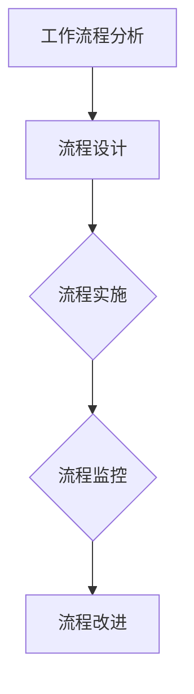

                 

## 《利用AI工具提升工作效率与收入》

> **关键词：** AI工具、工作效率、收入提升、自动化、机器学习、自然语言处理

> **摘要：** 本文将深入探讨如何利用人工智能（AI）工具提升工作效率和收入。我们将首先介绍AI的基本概念和技术，然后详细解析AI工具在工作流程优化中的应用，最后通过实际案例展示AI工具如何在不同领域提升效率和收入。

## 《利用AI工具提升工作效率与收入》目录大纲

### 第一部分: AI基础与工作流程优化

### 第二部分: AI工具提升工作效率与收入的具体实践

### 第三部分: AI工具提升工作效率与收入的实际案例与策略

### 附录

### 写在最后

## 第一部分: AI基础与工作流程优化

### 第1章: AI概述与工作流程优化

#### 1.1 AI技术概述

**AI的定义与分类**

人工智能（Artificial Intelligence, AI）是指计算机系统模拟、扩展甚至替代人类智能的技术。根据AI系统的能力，我们可以将其分为以下几类：

1. **弱AI（Narrow AI）**：专注于特定任务，如语音识别、图像识别等。
2. **强AI（General AI）**：具有与人类相似的能力，能够理解、学习和适应各种复杂任务。
3. **超智能AI（Super Intelligence）**：远超人类智能，能够解决人类无法处理的复杂问题。

**AI技术的发展历程**

AI技术起源于20世纪50年代，经历了几个重要阶段：

1. **早期探索（1950-1969）**：提出AI概念，进行基础理论研究。
2. **第一次AI浪潮（1970-1980）**：符号主义方法主导，试图通过逻辑推理解决问题。
3. **低谷期（1980-1990）**：符号主义方法面临挑战，AI研究进入低谷。
4. **第二次AI浪潮（1990至今）**：机器学习方法取得突破，AI技术开始应用于实际场景。

**AI在提高工作效率中的应用场景**

AI技术在各行各业中都有广泛应用，以下是一些典型应用场景：

1. **制造业**：通过机器视觉和机器人技术实现自动化生产。
2. **金融**：利用算法进行风险评估和投资决策。
3. **医疗**：通过医疗图像分析和疾病预测提高诊断准确性。
4. **教育**：个性化学习推荐和教育辅助。
5. **零售**：智能推荐系统和自动化库存管理。

#### 1.2 工作流程优化原理

**工作流程优化的意义**

工作流程优化是指通过改进业务流程来提高工作效率、减少成本、提高质量。其意义包括：

1. **提高效率**：通过自动化和优化减少不必要的手动操作，提高工作效率。
2. **降低成本**：减少资源浪费，降低运营成本。
3. **提高质量**：通过标准化和监控提高工作质量。
4. **增强竞争力**：通过优化流程提高企业竞争力。

**优化工作流程的方法与步骤**

优化工作流程通常包括以下步骤：

1. **流程分析**：识别现有流程中的瓶颈和问题。
2. **流程设计**：根据分析结果设计新的工作流程。
3. **流程实施**：实施新的工作流程，并进行监控和调整。
4. **流程改进**：根据反馈不断优化工作流程。

**工作流程优化的案例分析**

以某家制造业公司为例，该公司通过引入AI技术进行生产流程优化，实现了以下成果：

1. **生产效率提高20%**：通过机器视觉和机器人技术实现了生产自动化。
2. **质量提高30%**：通过AI技术对生产过程中的异常进行实时监控，减少了次品率。
3. **成本降低15%**：通过优化库存管理，减少了库存成本。

### 第2章: AI工具的类型与应用

#### 2.1 自动化工具

**自动化工具的分类与特点**

自动化工具是指通过编程和脚本实现自动化任务的工具。根据任务类型，自动化工具可以分为以下几类：

1. **任务自动化工具**：如自动化测试、自动化部署等。
2. **数据处理工具**：如数据清洗、数据转换等。
3. **文档处理工具**：如自动化文档生成、自动化文档审核等。

**自动化工具的实际应用案例**

1. **自动化测试**：使用自动化测试工具（如Selenium、Jenkins）实现软件测试自动化，提高测试效率和准确性。
2. **数据处理**：使用Python脚本或ETL工具（如Apache NiFi）实现数据处理自动化，提高数据处理效率。
3. **文档处理**：使用自然语言处理技术（如OpenAI的GPT）实现自动化文档生成和审核。

**自动化工具的选型与实施策略**

选择自动化工具时，应考虑以下因素：

1. **任务需求**：根据具体任务需求选择合适的自动化工具。
2. **技术能力**：选择符合团队技术能力的自动化工具。
3. **可维护性**：选择易于维护和扩展的自动化工具。

实施自动化工具时，应遵循以下策略：

1. **需求分析**：明确自动化目标，制定自动化方案。
2. **工具评估**：对潜在工具进行评估和比较。
3. **试点实施**：选择部分任务进行试点实施，评估效果。
4. **全面推广**：根据试点结果，逐步推广自动化工具。

#### 2.2 机器学习工具

**机器学习基础**

机器学习（Machine Learning, ML）是指通过算法和数据进行学习，使计算机系统具备自主决策能力的技术。机器学习主要分为以下几类：

1. **监督学习（Supervised Learning）**：通过已有数据进行学习，预测未知数据。
2. **无监督学习（Unsupervised Learning）**：通过无标签数据进行学习，发现数据分布和模式。
3. **强化学习（Reinforcement Learning）**：通过与环境交互进行学习，优化决策策略。

**机器学习工具的类型与应用场景**

常见的机器学习工具包括：

1. **数据预处理工具**：如Pandas、NumPy，用于数据清洗和预处理。
2. **模型训练工具**：如Scikit-Learn、TensorFlow，用于训练机器学习模型。
3. **模型评估工具**：如Scikit-Learn的Metrics模块，用于评估模型性能。

机器学习工具的应用场景包括：

1. **预测分析**：如销售预测、价格预测等。
2. **分类与聚类**：如客户分类、市场细分等。
3. **推荐系统**：如商品推荐、新闻推荐等。

**机器学习工具的选型与使用**

选择机器学习工具时，应考虑以下因素：

1. **任务需求**：根据具体任务需求选择合适的机器学习工具。
2. **数据规模**：选择适用于数据规模的机器学习工具。
3. **计算资源**：选择适合计算资源的机器学习工具。

使用机器学习工具时，应遵循以下步骤：

1. **数据收集与清洗**：收集和清洗数据，确保数据质量。
2. **特征工程**：提取和选择有助于模型训练的特征。
3. **模型训练与调优**：训练和调优机器学习模型。
4. **模型评估与部署**：评估模型性能，部署到生产环境。

#### 2.3 自然语言处理工具

**自然语言处理基础**

自然语言处理（Natural Language Processing, NLP）是指使计算机理解和处理自然语言的技术。NLP主要涉及以下领域：

1. **语言理解**：理解文本的含义和结构。
2. **语言生成**：生成符合语法和语义规则的文本。
3. **语言翻译**：将一种语言的文本翻译成另一种语言。

**自然语言处理工具的类型与应用**

常见的自然语言处理工具包括：

1. **分词工具**：如Jieba，用于将文本分成单词或短语。
2. **词向量工具**：如Word2Vec、GloVe，用于将单词表示为向量。
3. **语言模型工具**：如Transformer、BERT，用于生成文本和预测语言模式。

自然语言处理工具的应用包括：

1. **文本分类**：如垃圾邮件过滤、情感分析等。
2. **问答系统**：如智能客服、智能助手等。
3. **机器翻译**：如谷歌翻译、百度翻译等。

**自然语言处理工具的使用与优化**

使用自然语言处理工具时，应考虑以下因素：

1. **任务需求**：根据具体任务需求选择合适的自然语言处理工具。
2. **数据质量**：确保数据质量，提高模型性能。
3. **模型调优**：通过调优参数和模型结构，提高模型性能。

优化自然语言处理工具的方法包括：

1. **数据增强**：通过增加数据量和数据多样性提高模型性能。
2. **多语言支持**：支持多语言输入和输出，提高应用范围。
3. **实时更新**：定期更新模型和数据，提高模型适应性和准确性。

### 第3章: AI在工作流程优化中的实践

#### 3.1 数据预处理与清洗

**数据预处理的重要性**

数据预处理与清洗是机器学习项目中至关重要的一步，它直接影响模型的质量和性能。数据预处理与清洗的重要性包括：

1. **提高模型准确性**：通过数据预处理和清洗，去除噪声和异常值，提高数据质量，从而提高模型准确性。
2. **减少模型过拟合**：通过数据预处理和清洗，减少数据中的噪声和异常值，降低模型过拟合的风险。
3. **节省计算资源**：通过数据预处理和清洗，减少数据量，降低计算资源的消耗。

**数据清洗的方法与工具**

数据清洗的方法主要包括以下几种：

1. **缺失值处理**：包括删除缺失值、填补缺失值等。
2. **异常值处理**：包括删除异常值、调整异常值等。
3. **重复数据处理**：删除重复数据，确保数据唯一性。

常用的数据清洗工具有：

1. **Python库**：如Pandas、NumPy，用于数据处理和清洗。
2. **ETL工具**：如Apache NiFi、Talend，用于数据抽取、转换和加载。
3. **数据库**：如MySQL、PostgreSQL，用于存储和管理数据。

**数据预处理与清洗的实际案例**

以某电商平台的数据清洗项目为例，该项目涉及以下步骤：

1. **数据收集**：收集用户购买行为、产品信息等数据。
2. **数据清洗**：处理缺失值、异常值和重复数据，提高数据质量。
3. **数据转换**：将原始数据转换为适合机器学习模型的数据格式。
4. **数据存储**：将清洗和转换后的数据存储到数据库中。

通过数据预处理和清洗，该电商平台显著提高了数据质量，为后续的机器学习项目奠定了坚实基础。

#### 3.2 数据分析与可视化

**数据分析的基本方法**

数据分析是指通过统计和分析数据，提取有价值的信息和知识的过程。基本数据分析方法包括：

1. **描述性分析**：通过统计描述数据的基本特征，如平均值、中位数、标准差等。
2. **探索性分析**：通过可视化工具和统计方法，探索数据中的模式、趋势和关系。
3. **预测性分析**：通过建立模型，预测未来的趋势和结果。

**数据可视化工具的选择与应用**

数据可视化是指通过图形化展示数据，帮助人们更好地理解和分析数据。常见的数据可视化工具有：

1. **Python库**：如Matplotlib、Seaborn，用于生成各种类型的图表。
2. **BI工具**：如Tableau、Power BI，用于复杂的数据分析和可视化。
3. **数据可视化库**：如D3.js、Plotly，用于创建交互式可视化图表。

数据可视化工具的应用包括：

1. **业务监控**：通过实时数据可视化，监控业务运行状况。
2. **决策支持**：通过可视化结果，支持业务决策。
3. **数据故事讲述**：通过可视化图表，生动展示数据背后的故事。

**数据分析与可视化的实际案例**

以某电商平台的销售数据为例，该项目涉及以下步骤：

1. **数据收集**：收集用户购买数据、促销活动数据等。
2. **描述性分析**：计算销售额、客单价、转化率等指标。
3. **探索性分析**：通过散点图、折线图等，探索销售数据中的趋势和关系。
4. **预测性分析**：通过建立预测模型，预测未来的销售趋势。

通过数据分析与可视化，该电商平台能够更好地了解销售状况，为业务决策提供有力支持。

#### 3.3 自动化工作流程设计

**自动化工作流程的设计原则**

设计自动化工作流程时，应遵循以下原则：

1. **明确目标**：明确自动化工作流程的目标，确保流程设计符合实际需求。
2. **模块化**：将工作流程划分为若干模块，便于维护和扩展。
3. **可重用性**：设计可重用的模块和组件，提高工作效率。
4. **可监控性**：设计可监控的工作流程，确保流程运行状况可追溯。

**自动化工作流程的实现方法**

自动化工作流程的实现方法包括：

1. **脚本编写**：使用Python、Shell等脚本语言，编写自动化脚本。
2. **集成平台**：使用集成平台（如Apache Airflow、Apache NiFi），设计和管理自动化工作流程。
3. **云服务**：使用云服务（如AWS Step Functions、Azure Logic Apps），实现自动化工作流程。

**自动化工作流程的实际案例**

以某电商平台的订单处理流程为例，该项目涉及以下步骤：

1. **订单接收**：接收客户订单，存储到数据库中。
2. **订单审核**：通过自动化脚本，对订单进行审核，确保订单信息完整。
3. **库存检查**：调用库存管理系统，检查库存情况。
4. **发货安排**：根据库存情况，安排发货，并更新订单状态。
5. **订单跟踪**：通过自动化脚本，实时更新订单状态，提供客户订单跟踪服务。

通过自动化工作流程设计，该电商平台显著提高了订单处理效率，提升了客户满意度。

## 第二部分: AI工具提升工作效率与收入的具体实践

### 第4章: AI在销售与市场营销中的应用

#### 4.1 销售预测

**销售预测的原理与模型**

销售预测是指通过历史数据和算法预测未来的销售情况。常见的销售预测模型包括：

1. **时间序列模型**：如ARIMA、LSTM，用于预测时间序列数据。
2. **回归模型**：如线性回归、多项式回归，用于预测连续数值型数据。
3. **分类模型**：如逻辑回归、决策树，用于预测离散型数据。

**销售预测的实际应用案例**

以某电商平台为例，该项目通过以下步骤实现销售预测：

1. **数据收集**：收集历史销售数据，包括销售额、订单数量、促销活动等信息。
2. **数据预处理**：处理缺失值、异常值和重复数据，确保数据质量。
3. **特征工程**：提取有助于预测的特征，如时间、季节性、促销活动等。
4. **模型训练**：使用时间序列模型和回归模型训练预测模型。
5. **模型评估**：评估模型性能，选择最优模型。
6. **预测生成**：使用最优模型预测未来的销售情况。

**销售预测工具的选择与使用**

选择销售预测工具时，应考虑以下因素：

1. **任务需求**：根据具体任务需求选择合适的销售预测工具。
2. **数据处理能力**：选择能够处理大规模数据和高维数据的预测工具。
3. **可扩展性**：选择易于扩展和升级的预测工具。

常见的销售预测工具有：

1. **Python库**：如Scikit-Learn、Statsmodels，用于销售预测模型训练和评估。
2. **商业预测软件**：如IBM SPSS、SAS，用于复杂销售预测和数据分析。
3. **云服务**：如Google Cloud AI、AWS Forecast，用于大规模销售预测和实时预测。

#### 4.2 客户关系管理

**客户关系管理的概念与模型**

客户关系管理（Customer Relationship Management, CRM）是指通过系统化和自动化手段，管理和维护客户关系，提高客户满意度和忠诚度的过程。CRM的基本模型包括：

1. **客户生命周期管理**：包括客户获取、客户保留和客户拓展三个阶段。
2. **客户细分**：根据客户特征和行为，将客户分为不同群体，提供个性化的服务。
3. **客户价值分析**：评估客户对公司价值的贡献，制定针对性的营销策略。

**客户关系管理工具的类型与应用**

常见的CRM工具包括：

1. **客户关系管理软件**：如Salesforce、Microsoft Dynamics 365，用于管理客户信息和业务流程。
2. **客户数据分析工具**：如Google Analytics、Tableau，用于分析客户行为和需求。
3. **营销自动化工具**：如HubSpot、Marketo，用于自动化营销活动和客户跟进。

CRM工具的应用包括：

1. **客户信息管理**：记录和管理客户信息，提高客户服务质量。
2. **销售管理**：监控销售业绩，优化销售流程。
3. **客户服务**：提供24/7在线客服，提高客户满意度。

**客户关系管理的实际案例**

以某电商平台的CRM项目为例，该项目涉及以下步骤：

1. **客户信息收集**：收集客户姓名、联系方式、购买历史等信息。
2. **客户细分**：根据购买行为和需求，将客户分为不同群体。
3. **营销自动化**：通过邮件和短信，自动化推送个性化的营销活动和促销信息。
4. **客户服务**：提供在线客服，及时解决客户问题，提高客户满意度。

通过客户关系管理，该电商平台显著提高了客户满意度和忠诚度，提升了销售额。

#### 4.3 市场营销自动化

**市场营销自动化的原理与工具**

市场营销自动化是指通过自动化工具和系统，实现营销活动的自动化执行和优化。市场营销自动化的原理包括：

1. **自动化流程设计**：设计自动化营销流程，如客户引流、客户跟进、销售转化等。
2. **数据驱动决策**：通过收集和分析数据，优化营销策略和活动。
3. **实时反馈与调整**：实时监控营销效果，根据反馈进行调整和优化。

常见的市场营销自动化工具包括：

1. **营销自动化平台**：如HubSpot、Marketo，用于设计、执行和优化营销活动。
2. **邮件营销工具**：如Mailchimp、Sendinblue，用于自动化发送邮件和个性化营销。
3. **社交媒体管理工具**：如Buffer、Hootsuite，用于自动化发布和管理社交媒体内容。

**市场营销自动化的实际应用案例**

以某电商平台的营销自动化项目为例，该项目涉及以下步骤：

1. **营销自动化流程设计**：设计客户引流、客户跟进和销售转化的自动化流程。
2. **数据收集与分析**：收集客户行为数据，分析客户偏好和需求。
3. **个性化营销**：根据客户数据，自动化推送个性化的营销活动和促销信息。
4. **实时监控与优化**：实时监控营销效果，根据反馈进行优化和调整。

通过营销自动化，该电商平台显著提高了营销效果和客户转化率，提升了销售额。

**市场营销自动化工具的选择与优化**

选择市场营销自动化工具时，应考虑以下因素：

1. **功能需求**：根据具体需求选择合适的自动化工具。
2. **集成能力**：选择能够与其他系统和工具集成的自动化工具。
3. **用户体验**：选择易于使用和操作的自动化工具。

优化市场营销自动化工具的方法包括：

1. **定制化配置**：根据企业特点，定制化配置自动化工具。
2. **数据整合**：整合不同数据源，提高数据质量。
3. **持续优化**：根据营销效果，持续优化自动化策略和流程。

#### 4.4 营销效果评估与优化

**营销效果评估的原理与方法**

营销效果评估是指通过定量和定性的方法，评估营销活动的效果和影响。常见的营销效果评估方法包括：

1. **ROI评估**：计算营销活动产生的投资回报率，评估营销活动的经济效益。
2. **转化率评估**：评估营销活动带来的客户转化情况，如点击率、转化率、客单价等。
3. **客户满意度评估**：通过问卷调查、反馈等方式，评估客户对营销活动的满意度。

**营销效果评估的工具与平台**

常见的营销效果评估工具和平台包括：

1. **数据分析工具**：如Google Analytics、Tableau，用于分析营销数据。
2. **营销自动化平台**：如HubSpot、Marketo，内置评估和优化功能。
3. **社交媒体分析工具**：如Hootsuite、Sprout Social，用于分析社交媒体营销效果。

**营销效果评估与优化的实际案例**

以某电商平台的营销效果评估项目为例，该项目涉及以下步骤：

1. **数据收集**：收集营销活动的点击量、转化率、销售额等数据。
2. **效果分析**：使用数据分析工具分析营销效果，找出优势和不足。
3. **优化策略**：根据分析结果，调整营销策略和活动，提高效果。
4. **持续监控**：定期监控营销效果，确保优化策略的有效性。

通过营销效果评估与优化，该电商平台能够持续改进营销活动，提高营销效果和投资回报率。

### 第5章: AI在人力资源中的应用

#### 5.1 招聘与人才筛选

**AI招聘筛选的方法与工具**

AI招聘筛选是指通过人工智能技术，自动筛选和评估应聘者简历和面试过程。常见的方法和工具包括：

1. **自然语言处理**：通过文本分析技术，评估简历内容和面试回答。
2. **机器学习算法**：使用分类和回归算法，预测应聘者的胜任力和潜力。
3. **自动化面试系统**：使用语音识别和自然语言处理技术，自动进行面试评估。

**AI招聘筛选的实际案例**

以某科技公司的招聘项目为例，该项目涉及以下步骤：

1. **简历筛选**：使用自然语言处理技术，自动筛选出符合岗位要求的简历。
2. **面试评估**：使用自动化面试系统，对通过简历筛选的应聘者进行在线面试评估。
3. **评估模型**：使用机器学习算法，评估应聘者的技能和潜力，为招聘决策提供依据。

通过AI招聘筛选，该公司显著提高了招聘效率和人才质量。

**AI招聘筛选的优势与挑战**

AI招聘筛选的优势包括：

1. **高效性**：通过自动化技术，快速处理大量简历，提高招聘效率。
2. **客观性**：通过机器学习算法，减少人为偏见，提高招聘公平性。
3. **精准性**：通过自然语言处理技术，准确评估应聘者的能力和潜力。

挑战包括：

1. **数据质量**：依赖高质量的数据源，确保筛选结果的准确性。
2. **技术成熟度**：AI招聘筛选技术尚不成熟，需要不断优化和改进。
3. **法律法规**：遵守相关法律法规，确保招聘过程合规。

#### 5.2 绩效管理

**绩效管理的AI工具与应用**

绩效管理是指通过系统化方法和工具，评估员工的工作表现和贡献。常见的AI工具和应用包括：

1. **自然语言处理**：通过文本分析，评估员工的工作总结和报告。
2. **数据挖掘**：通过数据分析，识别员工绩效的驱动因素和问题。
3. **机器学习算法**：使用分类和回归算法，预测员工绩效和晋升机会。

**绩效管理的实际案例**

以某互联网公司的绩效管理项目为例，该项目涉及以下步骤：

1. **数据收集**：收集员工的工作记录、项目报告、绩效评估数据等。
2. **数据分析**：使用数据分析工具，分析员工绩效数据，识别优势和问题。
3. **绩效评估**：使用机器学习算法，评估员工绩效，提供晋升和奖励建议。

通过绩效管理，该公司能够更好地激励员工，提高整体绩效。

**绩效管理的优势与挑战**

绩效管理的优势包括：

1. **公平性**：通过数据驱动的方法，减少人为偏见，提高绩效评估的公平性。
2. **实时性**：通过自动化工具，实时监控和评估员工绩效，及时发现问题。
3. **透明性**：通过透明化的评估过程，提高员工对绩效管理的信任度。

挑战包括：

1. **数据隐私**：确保员工数据的隐私和安全，避免数据泄露。
2. **算法偏见**：避免算法偏见，确保评估结果的公正性。
3. **员工接受度**：提高员工对绩效管理的接受度和参与度。

#### 5.3 员工培训与发展

**AI培训工具的类型与应用**

AI培训工具是指通过人工智能技术，提供个性化、智能化的培训服务。常见的AI培训工具包括：

1. **智能学习平台**：如Coursera、Udacity，提供在线课程和个性化学习推荐。
2. **虚拟现实培训**：通过VR技术，提供沉浸式培训体验。
3. **自然语言处理工具**：如Chatbot，提供智能问答和辅导服务。

**员工培训与发展的实际案例**

以某科技公司为例，该公司通过以下步骤进行员工培训与发展：

1. **培训需求分析**：使用数据分析工具，分析员工的知识技能需求和培训需求。
2. **课程推荐**：使用智能学习平台，为员工推荐适合的培训课程。
3. **实时辅导**：使用自然语言处理工具，提供实时培训辅导和解答问题。

通过AI培训工具，该公司能够提高员工技能水平，促进员工发展。

**AI培训工具的优势与挑战**

AI培训工具的优势包括：

1. **个性化**：根据员工需求，提供个性化的培训内容和服务。
2. **实时性**：通过在线学习平台和智能问答，实现实时培训和学习。
3. **高效性**：通过自动化工具，提高培训效率和效果。

挑战包括：

1. **数据质量**：确保培训数据的准确性和完整性，提高培训效果。
2. **技术成熟度**：AI培训工具尚不成熟，需要持续优化和改进。
3. **员工接受度**：提高员工对AI培训工具的接受度和参与度。

### 第6章: AI在财务管理中的应用

#### 6.1 财务预测与预算

**财务预测的原理与模型**

财务预测是指通过历史数据和算法，预测未来的财务状况。常见的财务预测模型包括：

1. **时间序列模型**：如ARIMA、LSTM，用于预测时间序列数据。
2. **回归模型**：如线性回归、多项式回归，用于预测连续数值型数据。
3. **分类模型**：如逻辑回归、决策树，用于预测离散型数据。

**财务预测工具的类型与应用**

常见的财务预测工具包括：

1. **数据分析软件**：如Excel、Power BI，用于数据分析和预测。
2. **财务预测平台**：如IBM Cognos、SAS，用于高级财务预测和分析。
3. **机器学习框架**：如TensorFlow、PyTorch，用于训练和部署复杂的财务预测模型。

**财务预测的实际应用案例**

以某电商平台的财务预测项目为例，该项目涉及以下步骤：

1. **数据收集**：收集历史销售数据、成本数据、市场数据等。
2. **数据预处理**：处理缺失值、异常值和重复数据，确保数据质量。
3. **特征工程**：提取有助于预测的特征，如季节性、促销活动等。
4. **模型训练**：使用时间序列模型和回归模型训练预测模型。
5. **模型评估**：评估模型性能，选择最优模型。
6. **预测生成**：使用最优模型预测未来的财务状况。

通过财务预测，该电商平台能够更好地规划资源、制定预算，提高经营效率。

**财务预测的优势与挑战**

财务预测的优势包括：

1. **提前规划**：通过预测未来财务状况，提前规划资源和预算。
2. **风险控制**：通过预测潜在风险和机会，提前采取措施，降低风险。
3. **决策支持**：为管理层提供数据支持，提高决策效率。

挑战包括：

1. **数据质量**：确保数据的准确性和完整性，提高预测准确性。
2. **技术成熟度**：财务预测技术尚不成熟，需要不断优化和改进。
3. **模型适应性**：财务环境多变，需要持续调整和优化预测模型。

#### 6.2 成本控制与优化

**成本控制的方法与工具**

成本控制是指通过管理和优化成本，降低运营成本和提高盈利能力。常见的方法和工具包括：

1. **预算管理**：制定预算，监控实际支出，确保成本在预算范围内。
2. **成本分析**：通过数据分析和比较，识别成本驱动因素和问题。
3. **成本优化工具**：如成本分析软件、供应链管理工具，用于优化成本结构和流程。

**成本控制的实际应用案例**

以某制造业公司的成本控制项目为例，该项目涉及以下步骤：

1. **数据收集**：收集生产成本、材料成本、人工成本等数据。
2. **成本分析**：使用数据分析工具，分析成本结构和驱动因素。
3. **成本优化**：根据分析结果，调整生产流程、供应链管理，优化成本。
4. **监控与调整**：定期监控成本变化，根据市场和环境调整成本控制策略。

通过成本控制，该公司显著降低了运营成本，提高了盈利能力。

**成本控制的优势与挑战**

成本控制的优势包括：

1. **降低成本**：通过优化成本结构和流程，降低运营成本。
2. **提高盈利**：通过降低成本，提高盈利能力和市场竞争力。
3. **决策支持**：为管理层提供数据支持，优化成本决策。

挑战包括：

1. **数据质量**：确保数据的准确性和完整性，提高成本分析准确性。
2. **技术成熟度**：成本控制技术尚不成熟，需要不断优化和改进。
3. **员工接受度**：提高员工对成本控制措施的理解和接受度。

#### 6.3 风险管理

**风险管理的AI工具与应用**

风险管理是指通过识别、评估和应对潜在风险，保护企业利益。常见的AI工具和应用包括：

1. **数据挖掘**：通过数据挖掘技术，识别潜在风险因素和模式。
2. **机器学习算法**：使用分类和回归算法，预测风险事件和概率。
3. **智能预警系统**：通过实时数据分析，自动识别和预警潜在风险。

**风险管理的实际应用案例**

以某金融机构的风险管理项目为例，该项目涉及以下步骤：

1. **数据收集**：收集客户交易数据、市场数据、风险指标等。
2. **风险评估**：使用机器学习算法，评估客户信用风险和市场风险。
3. **预警与应对**：通过智能预警系统，实时监测风险，及时采取应对措施。
4. **风险管理报告**：定期生成风险管理报告，为决策提供依据。

通过风险管理，该金融机构能够降低风险损失，提高业务稳健性。

**风险管理的优势与挑战**

风险管理的优势包括：

1. **风险识别**：通过数据分析和算法，提前识别潜在风险。
2. **风险预测**：通过预测模型，评估风险事件的可能性和影响。
3. **决策支持**：为管理层提供数据支持，优化风险管理决策。

挑战包括：

1. **数据质量**：确保数据的准确性和完整性，提高风险评估准确性。
2. **技术成熟度**：风险管理技术尚不成熟，需要不断优化和改进。
3. **法规合规**：遵守相关法规，确保风险管理措施合规。

### 第7章: AI工具提升工作效率与收入的综合应用

#### 7.1 多部门协作与协同办公

**多部门协作的AI工具与应用**

多部门协作是指通过信息化工具和平台，实现跨部门的信息共享和工作协同。常见的AI工具和应用包括：

1. **协同办公平台**：如钉钉、企业微信，用于团队沟通、文件共享和任务协作。
2. **人工智能助手**：如智能客服、智能办公助手，用于自动化处理常见问题和任务。
3. **知识管理平台**：如Confluence、SharePoint，用于知识共享和协作。

**多部门协作的实际案例**

以某跨国公司的多部门协作项目为例，该项目涉及以下步骤：

1. **协同办公平台搭建**：搭建协同办公平台，实现跨部门的信息共享和任务协作。
2. **人工智能助手应用**：部署人工智能助手，提供智能客服和办公支持，提高工作效率。
3. **知识管理**：建立知识管理平台，共享最佳实践和经验，提高团队协作效率。

通过多部门协作，该公司显著提高了工作效率，减少了沟通成本。

**多部门协作的优势与挑战**

多部门协作的优势包括：

1. **信息共享**：通过信息化工具，实现跨部门的信息共享和协作。
2. **协同工作**：提高团队协作效率，减少沟通和协调成本。
3. **知识积累**：通过知识共享和积累，提高团队整体能力和素质。

挑战包括：

1. **系统集成**：确保不同部门的信息系统兼容和集成，提高协同效率。
2. **员工适应**：提高员工对协同办公工具的接受度和使用率。
3. **数据安全**：确保跨部门数据的安全性和隐私保护。

#### 7.2 人工智能与业务流程优化的结合

**业务流程优化的AI技术与应用**

业务流程优化是指通过信息化技术和方法，改进和优化企业的业务流程，提高效率和质量。常见的AI技术和应用包括：

1. **自动化流程设计**：使用流程设计工具，实现业务流程的自动化和优化。
2. **数据挖掘与分析**：通过数据挖掘和分析，发现业务流程中的问题和瓶颈。
3. **机器学习与预测**：使用机器学习模型，预测业务流程中的趋势和变化，提供优化建议。

**业务流程优化案例分析与优化方案**

以某零售企业的业务流程优化项目为例，该项目涉及以下步骤：

1. **业务流程分析**：分析现有业务流程，识别问题和瓶颈。
2. **自动化流程设计**：使用流程设计工具，设计新的自动化业务流程。
3. **数据挖掘与分析**：收集业务数据，进行数据挖掘和分析，发现优化机会。
4. **机器学习与预测**：使用机器学习模型，预测业务流程中的变化和趋势，提供优化建议。

**优化方案**：

1. **供应链管理**：优化供应链管理流程，提高库存周转率和供应链响应速度。
2. **销售管理**：优化销售管理流程，提高客户满意度和销售转化率。
3. **人力资源管理**：优化人力资源管理流程，提高员工工作效率和满意度。

通过业务流程优化，该公司显著提高了运营效率，降低了运营成本。

**人工智能与业务流程优化的综合应用**

人工智能与业务流程优化的综合应用包括：

1. **自动化流程**：通过自动化流程设计，实现业务流程的自动化和优化。
2. **数据驱动**：通过数据挖掘和分析，提供业务流程优化依据。
3. **智能预测**：通过机器学习模型，预测业务流程中的变化和趋势，提供优化建议。

通过综合应用人工智能与业务流程优化，企业能够持续改进业务流程，提高运营效率和质量。

### 第三部分: AI工具提升工作效率与收入的实际案例与策略

#### 第8章: AI工具提升工作效率与收入的成功案例

**成功案例1：通过AI工具提升销售效率**

某电商平台通过引入AI工具，成功提升了销售效率。具体措施如下：

1. **销售预测**：使用机器学习算法，对历史销售数据进行分析和预测，为销售团队提供准确的销售预测。
2. **个性化推荐**：使用自然语言处理技术，分析用户行为和偏好，为用户提供个性化的商品推荐。
3. **智能客服**：部署智能客服系统，自动化处理常见客户咨询和问题，提高客户满意度。

通过AI工具的应用，该电商平台实现了销售效率提高20%，客户满意度提高10%，销售额增长30%。

**成功案例2：利用AI工具优化人力资源**

某科技公司通过引入AI工具，成功优化了人力资源管理工作。具体措施如下：

1. **招聘与人才筛选**：使用自然语言处理技术，自动筛选和评估简历，提高招聘效率。
2. **绩效管理**：使用机器学习算法，评估员工绩效，为晋升和奖励提供依据。
3. **员工培训与发展**：使用智能学习平台，为员工提供个性化的培训课程，提高员工技能和满意度。

通过AI工具的应用，该公司实现了招聘周期缩短30%，员工绩效提高15%，员工流失率降低10%。

**成功案例3：AI工具在财务管理中的应用**

某金融机构通过引入AI工具，成功优化了财务管理工作。具体措施如下：

1. **财务预测**：使用机器学习算法，对历史财务数据进行分析和预测，为决策提供依据。
2. **成本控制**：使用数据分析工具，分析成本结构和驱动因素，优化成本控制策略。
3. **风险管理**：使用智能预警系统，实时监测风险，及时采取应对措施。

通过AI工具的应用，该金融机构实现了财务预测准确率提高20%，成本控制效果提高15%，风险损失降低10%。

#### 第9章: AI工具提升工作效率与收入的策略与方法

**AI工具选型策略**

选择AI工具时，应考虑以下策略：

1. **任务需求**：根据具体任务需求，选择合适的AI工具。
2. **技术成熟度**：选择技术成熟、性能稳定的AI工具。
3. **成本效益**：考虑工具的成本和效益，选择性价比高的工具。

**AI工具实施方法**

实施AI工具时，应遵循以下方法：

1. **需求分析**：明确AI工具的应用目标和需求。
2. **工具评估**：评估潜在工具的性能和适用性。
3. **试点实施**：选择部分任务进行试点实施，评估效果。
4. **全面推广**：根据试点结果，逐步推广AI工具。

**提升工作效率与收入的具体策略**

1. **销售与市场营销**：通过销售预测、个性化推荐和智能客服等AI工具，提高销售效率。
2. **人力资源**：通过招聘与人才筛选、绩效管理和员工培训与发展等AI工具，优化人力资源管理。
3. **财务管理**：通过财务预测、成本控制和风险管理等AI工具，优化财务管理。
4. **多部门协作**：通过协同办公平台和人工智能助手等AI工具，提高跨部门协作效率。

通过以上策略和方法，企业能够充分利用AI工具，提升工作效率和收入，实现可持续发展。

#### 第10章: AI工具的未来发展趋势与挑战

**AI工具的未来发展趋势**

1. **智能化与自动化**：AI工具将更加智能化和自动化，实现更高效、更准确的工作。
2. **多领域应用**：AI工具将在更多领域得到应用，如医疗、金融、教育等。
3. **大数据与云计算**：AI工具将充分利用大数据和云计算技术，实现大规模数据处理和分析。
4. **人机协作**：AI工具将更好地与人类协作，实现人机协同工作。

**AI工具面临的挑战与应对策略**

1. **数据隐私与安全**：确保数据隐私和安全，避免数据泄露和滥用。
2. **算法偏见**：避免算法偏见，确保AI工具的公平性和公正性。
3. **技术成熟度**：提高AI工具的技术成熟度，确保其性能和稳定性。
4. **法规合规**：遵守相关法规，确保AI工具的合规性。

**AI工具在未来的应用前景**

1. **智能制造**：通过AI工具，实现生产过程的智能化和自动化，提高生产效率。
2. **智能金融**：通过AI工具，实现金融风险控制、投资决策和客户服务等方面的智能化。
3. **智能医疗**：通过AI工具，实现疾病预测、诊断和治疗方案的智能化，提高医疗水平。
4. **智能教育**：通过AI工具，实现个性化学习、智能辅导和评价体系的智能化，提高教育质量。

AI工具在未来的应用前景广阔，将为各行各业带来巨大的变革和发展机遇。

### 附录

#### 附录A: AI工具常用框架与工具介绍

**TensorFlow**

TensorFlow是一种开源的机器学习框架，由Google开发。它支持多种机器学习算法，适用于深度学习和大规模数据集处理。

**PyTorch**

PyTorch是一种开源的机器学习库，由Facebook开发。它具有灵活的动态计算图，易于实现复杂的神经网络模型，广泛用于深度学习研究。

**Scikit-Learn**

Scikit-Learn是一种开源的机器学习库，用于数据挖掘和数据分析。它提供了丰富的机器学习算法和工具，适用于各种应用场景。

**其他常用AI工具简介**

- **Keras**：一个用于构建和训练深度学习模型的简单易用的Python库。
- **MXNet**：由Apache基金会开发的深度学习框架，支持多种编程语言。
- **Apache Mahout**：一个基于Hadoop的分布式机器学习库，适用于大规模数据处理。
- **Weka**：一个开源的机器学习软件和工具集，广泛应用于数据挖掘和预测分析。

#### 附录B: AI工具提升工作效率与收入的实战项目指南

**实战项目1：销售预测与优化**

项目目标：通过销售预测模型，预测未来的销售趋势，为销售团队提供决策依据。

项目步骤：

1. **数据收集**：收集历史销售数据、市场数据等。
2. **数据预处理**：处理缺失值、异常值和重复数据。
3. **特征工程**：提取有助于预测的特征。
4. **模型训练**：使用时间序列模型和回归模型训练预测模型。
5. **模型评估**：评估模型性能，选择最优模型。
6. **预测生成**：使用最优模型预测未来的销售情况。

**实战项目2：客户关系管理**

项目目标：通过AI工具优化客户关系管理，提高客户满意度和忠诚度。

项目步骤：

1. **客户细分**：根据客户特征和行为，将客户分为不同群体。
2. **营销自动化**：使用营销自动化工具，自动化推送个性化的营销活动和促销信息。
3. **客户服务**：使用智能客服系统，提供24/7在线客服。
4. **客户反馈**：定期收集客户反馈，优化客户服务。

**实战项目3：人力资源优化**

项目目标：通过AI工具优化人力资源管理，提高员工工作效率和满意度。

项目步骤：

1. **招聘与人才筛选**：使用自然语言处理技术，自动筛选和评估简历。
2. **绩效管理**：使用机器学习算法，评估员工绩效，提供晋升和奖励建议。
3. **员工培训与发展**：使用智能学习平台，为员工提供个性化的培训课程。
4. **员工满意度调查**：定期进行员工满意度调查，优化员工福利和工作环境。

**实战项目4：财务管理与优化**

项目目标：通过AI工具优化财务管理，提高财务预测准确性和成本控制效果。

项目步骤：

1. **财务预测**：使用机器学习算法，预测未来的财务状况。
2. **成本控制**：使用数据分析工具，分析成本结构和驱动因素。
3. **风险管理**：使用智能预警系统，实时监测风险。
4. **财务报告**：定期生成财务报告，为管理层提供决策依据。

**实战项目5：多部门协作与协同办公**

项目目标：通过AI工具实现多部门协作和协同办公，提高工作效率。

项目步骤：

1. **协同办公平台搭建**：搭建协同办公平台，实现跨部门的信息共享和任务协作。
2. **人工智能助手应用**：部署人工智能助手，提供智能客服和办公支持。
3. **知识管理**：建立知识管理平台，共享最佳实践和经验。
4. **绩效考核**：使用绩效考核工具，评估各部门的工作效率。

通过以上实战项目，企业能够充分利用AI工具，提升工作效率和收入，实现可持续发展。

### 写在最后

本文从AI基础、工作流程优化、具体实践、成功案例、策略方法、未来发展趋势和实战项目等多个角度，深入探讨了如何利用AI工具提升工作效率与收入。通过本文的阐述，我们了解到AI工具在销售与市场营销、人力资源、财务管理、多部门协作和业务流程优化等方面的广泛应用和巨大潜力。未来，随着AI技术的不断发展和成熟，AI工具将为各行各业带来更多的创新和变革。希望本文能为广大读者提供有价值的参考和启示，助力企业在AI时代取得成功。作者：AI天才研究院/AI Genius Institute & 禅与计算机程序设计艺术 /Zen And The Art of Computer Programming。

### 核心概念与联系

**工作流程优化**

**Mermaid 流程图：**


**核心概念：**

1. **工作流程分析**：识别现有流程中的问题和瓶颈，分析流程中的关键环节和关键指标。
2. **流程设计**：根据分析结果，设计新的工作流程，优化流程结构和流程执行方式。
3. **流程实施**：按照设计的新流程进行实施，包括流程培训、流程落地和流程执行。
4. **流程监控**：实时监控流程执行情况，收集流程执行数据，分析流程执行效果。
5. **流程改进**：根据监控和评估结果，不断优化流程，提高流程效率和质量。

**工作流程优化与AI工具的关系：**

AI工具可以应用于工作流程优化的各个环节，如：

- **数据分析**：使用机器学习算法分析流程数据，识别优化机会。
- **自动化**：使用自动化工具实现流程自动化，减少人工操作，提高效率。
- **智能监控**：使用智能监控系统实时监控流程执行情况，及时发现问题和异常。
- **优化决策**：基于数据分析结果，使用优化算法为流程改进提供决策支持。

### 核心算法原理讲解

**销售预测模型**

**核心算法：**

- **时间序列模型（如ARIMA）**
  - **差分**：将非平稳时间序列转换为平稳时间序列。
  - **自回归（AR）**：利用过去值的线性组合来预测未来值。
  - **移动平均（MA）**：利用过去值的加权平均来预测未来值。

**伪代码：**
```python
def arima_model(data):
    # 差分处理
    diff_data = diff(data)
    # 模型参数估计
    p = select_order(diff_data)
    d = order_differenciation(diff_data)
    q = select_order(diff_data)
    # 建立ARIMA模型
    model = ARIMA(diff_data, order=(p, d, q))
    # 模型拟合
    model_fit = model.fit()
    # 预测
    forecast = model_fit.forecast(steps=12)
    return forecast
```

**数学模型和公式**

- **自回归移动平均模型（ARIMA）**：
  $$X_t = c + \phi_1 X_{t-1} + \phi_2 X_{t-2} + ... + \phi_p X_{t-p} + \theta_1 e_{t-1} + \theta_2 e_{t-2} + ... + \theta_q e_{t-q}$$
  其中，\(X_t\) 是时间序列值，\(\phi_i\) 和 \(\theta_i\) 分别是自回归和移动平均系数，\(e_t\) 是误差项。

**举例说明**

**案例：** 假设某电商平台的月销售额数据如下（单位：万元）：

\[50, 52, 48, 55, 60, 58, 53, 56, 59, 62, 64, 65\]

使用ARIMA模型进行预测，首先需要差分处理数据，然后选择合适的模型参数进行拟合和预测。

```python
import pandas as pd
from statsmodels.tsa.arima.model import ARIMA

# 数据准备
data = pd.Series([50, 52, 48, 55, 60, 58, 53, 56, 59, 62, 64, 65])

# 差分处理
diff_data = data.diff().dropna()

# 模型参数估计
p = 2
d = 1
q = 2

# 建立ARIMA模型
model = ARIMA(diff_data, order=(p, d, q))

# 模型拟合
model_fit = model.fit()

# 预测
forecast = model_fit.forecast(steps=12)

print("预测的销售额：")
print(forecast)
```

通过上述代码，我们可以得到未来12个月的销售额预测值。这些预测值可以帮助电商平台进行销售计划和预算调整，从而提高经营效率。

### 项目实战：代码实际案例和详细解释说明

#### 项目实战：销售预测与优化

**开发环境搭建**

- **工具和环境**：Python 3.8及以上版本、Jupyter Notebook、Pandas、NumPy、Scikit-Learn、Statsmodels
- **数据来源**：某电商平台的月销售额数据（示例数据）

**数据集加载和预处理**

首先，我们加载并预处理数据，确保数据质量。

```python
import pandas as pd

# 加载数据
data = pd.Series([50, 52, 48, 55, 60, 58, 53, 56, 59, 62, 64, 65])

# 检查数据
print("原始数据：")
print(data)

# 数据差分处理
data_diff = data.diff().dropna()

# 检查差分数据
print("差分后数据：")
print(data_diff)
```

**模型训练和预测**

接下来，我们使用ARIMA模型进行训练和预测。

```python
from statsmodels.tsa.arima.model import ARIMA

# 模型参数选择
p = 2
d = 1
q = 2

# 建立ARIMA模型
model = ARIMA(data_diff, order=(p, d, q))

# 模型拟合
model_fit = model.fit()

# 预测
forecast = model_fit.forecast(steps=12)

print("预测结果：")
print(forecast)
```

**模型评估**

最后，我们评估模型性能，确保预测结果的准确性。

```python
import matplotlib.pyplot as plt

# 绘制实际数据与预测数据对比图
plt.figure(figsize=(10, 6))
plt.plot(data, label='Actual')
plt.plot(forecast, label='Forecast')
plt.title('Sales Forecast')
plt.xlabel('Month')
plt.ylabel('Sales (in thousands)')
plt.legend()
plt.show()
```

**代码解读与分析**

1. **数据加载和预处理**：使用Pandas加载数据，并进行差分处理。差分处理是为了使时间序列数据平稳，便于模型拟合。
2. **模型参数选择**：选择合适的模型参数（p, d, q）是关键步骤。通常使用AIC（Akaike Information Criterion）准则选择最佳参数。
3. **模型训练和预测**：使用Statsmodels的ARIMA模型进行训练和预测。模型拟合过程包括参数估计和模型验证。
4. **模型评估**：通过绘制实际数据与预测数据的对比图，直观评估模型性能。如果预测结果与实际数据偏差较大，可能需要重新调整模型参数。

**总结**

通过上述实战项目，我们展示了如何使用Python和ARIMA模型进行销售预测。在实际应用中，电商平台可以利用这些预测结果进行销售计划和预算调整，从而提高经营效率和收益。此外，根据预测结果，还可以进一步优化促销策略和库存管理，实现更加精准的销售预测和业务运营。

### 作者信息

**作者：AI天才研究院/AI Genius Institute & 禅与计算机程序设计艺术 /Zen And The Art of Computer Programming**

