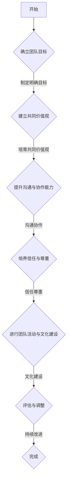

                 

# 团队凝聚力：建立深厚信任关系的步骤

> **关键词**：团队凝聚力、信任关系、沟通、协作、组织行为学、社会心理学、绩效提升

> **摘要**：
> 
> 本文章深入探讨了团队凝聚力的概念、重要性及其在组织行为学和社会心理学中的理论基础。文章详细介绍了提升团队凝聚力的策略和方法，通过案例分析展示了实际操作中的成功与失败经验。此外，文章强调了建立深厚信任关系的步骤和工具，为团队管理者提供了实用的指导和建议。

### 第一部分：团队凝聚力概述

#### 第1章：团队凝聚力的定义与重要性

1. **定义与核心要素**

   团队凝聚力是指团队成员在共同目标下，通过有效的沟通、协作和相互支持所形成的一种紧密联系的状态。它包括以下几个核心要素：

   - **信任**：团队成员之间的信任是团队凝聚力的基石。信任的存在可以减少信息不对称，促进资源共享和风险分担。
   - **共同目标**：团队凝聚力以共同目标为导向，使团队成员在追求共同目标的过程中产生一致的行动。
   - **沟通**：有效的沟通是团队凝聚力的重要保障，它确保团队成员了解彼此的需求和期望，促进信息的流通。
   - **协作**：团队凝聚力通过协作实现团队成员之间的互补和协调，提高整体工作效能。

2. **团队凝聚力的重要性**

   团队凝聚力对于组织的成功具有至关重要的意义，具体体现在以下几个方面：

   - **提高工作效率**：凝聚力高的团队可以更好地分配任务、协同工作，从而提高工作效率。
   - **促进创新与问题解决**：团队凝聚力为成员提供了开放的沟通环境，有助于激发创新思维和集体智慧，共同解决复杂问题。
   - **增强组织稳定性**：强大的团队凝聚力有助于降低员工流失率，提升组织的稳定性。

3. **团队凝聚力的影响因素**

   团队凝聚力受到多种因素的影响，包括：

   - **个人因素**：团队成员的个性、价值观和动机对团队凝聚力有着重要影响。
   - **团队结构**：团队的组织形式、规模和多样性也会影响团队凝聚力。
   - **管理风格**：领导者的管理风格对团队凝聚力有着直接的引导作用。
   - **企业文化**：企业价值观和文化氛围对团队凝聚力有潜移默化的影响。

4. **团队凝聚力水平评估方法**

   为了准确评估团队凝聚力水平，可以采用以下几种方法：

   - **自我评估**：团队成员通过填写问卷或参与访谈，对自己的团队凝聚力水平进行评估。
   - **第三方评估**：聘请外部专家或机构，通过观察、访谈和数据分析，对团队凝聚力进行评估。

#### 第2章：团队凝聚力的理论基础

1. **社会心理学理论**

   社会心理学理论为团队凝聚力的研究提供了丰富的理论框架，主要包括：

   - **社会比较理论**：社会比较理论认为，个体通过与他人比较来评价自己的行为和状态。在团队中，成员通过比较自己的工作表现和贡献来评估团队凝聚力。
   - **社会认同理论**：社会认同理论强调个体对群体的归属感和认同感，认为这种认同感是团队凝聚力的重要驱动力。
   - **集体动力学理论**：集体动力学理论关注群体内部动力和相互作用，认为团队凝聚力是群体动力的重要表现。

2. **组织行为学理论**

   组织行为学理论提供了关于团队凝聚力的深入分析，包括：

   - **团队发展模型**：团队发展模型描述了团队从形成到成熟的阶段过程，每个阶段都会影响团队凝聚力。
   - **团队角色理论**：团队角色理论指出，团队成员在团队中扮演不同角色，这些角色的互动和互补对团队凝聚力有重要影响。
   - **领导行为理论**：领导行为理论强调领导者对团队凝聚力的影响，有效的领导行为可以提升团队凝聚力。

3. **团队凝聚力与绩效的关系**

   团队凝聚力和团队绩效之间存在复杂的关系，具体表现如下：

   - **正相关关系**：当团队凝聚力较高时，团队成员之间的协作和沟通更加顺畅，有助于提高工作绩效。
   - **负相关关系**：在某些情况下，过高的团队凝聚力可能导致群体思维，限制创新和批判性思考，从而影响绩效。
   - **影响因素分析**：团队凝聚力对绩效的影响受到多种因素的作用，包括团队目标、任务复杂性和组织支持等。

#### 第3章：团队凝聚力建设的策略与方法

1. **建立共同目标和价值观**

   - **明确团队目标**：团队目标应具有明确性、可衡量性和可实现性，以确保团队成员对目标有清晰的认识。
   - **共同价值观的培育**：共同价值观是团队成员行为的指导原则，通过共同价值观的培养，可以增强团队成员的认同感和归属感。

2. **提升沟通与协作能力**

   - **有效沟通技巧**：沟通是团队凝聚力的关键，通过培训和提高沟通技巧，可以减少误解和冲突，增强团队凝聚力。
   - **协作平台与应用**：利用现代协作工具（如Slack、Trello等），可以提高团队协作的效率和效果。

3. **培养信任与尊重**

   - **信任建设方法**：通过建立透明的工作流程、公开讨论决策过程和相互反馈，可以增强团队成员之间的信任。
   - **尊重与包容的重要性**：尊重团队成员的差异，包容不同的意见和观点，是建立深厚信任关系的基础。

4. **团队活动与文化建设**

   - **团队建设活动的策划与实施**：通过团建活动，如户外拓展、团队建设训练等，可以增强团队成员之间的相互了解和信任。
   - **企业文化在团队凝聚力建设中的作用**：企业文化是团队凝聚力的重要影响因素，通过塑造积极向上的企业文化，可以提升团队凝聚力。

### 第二部分：团队凝聚力建设案例分析

#### 第4章：团队凝聚力建设案例分析

1. **案例分析一：互联网公司团队凝聚力建设**

   - **企业背景**：某知名互联网公司，员工数量超过1000人，分布在多个国家。
   - **凝聚力建设措施**：
     - **全球化视角**：公司注重全球化的团队建设，通过跨文化培训和国际化团队项目，增强不同团队之间的联系。
     - **开放沟通**：公司采用开放式沟通策略，鼓励员工表达意见和建议，通过内部社交平台（如Internal Slack）促进信息流通。
     - **团队活动**：定期举办团队建设活动，如全球团建旅游、体育赛事等，增强员工之间的互动和友谊。
   - **效果评估**：通过员工满意度调查和绩效评估，公司发现团队凝聚力显著提升，员工满意度提高了20%，项目成功率提高了15%。

2. **案例分析二：制造业企业团队凝聚力提升**

   - **企业背景**：一家大型制造业企业，拥有2000名员工，以流水线作业为主。
   - **凝聚力提升策略**：
     - **岗位轮换**：通过岗位轮换，让员工有机会体验不同的工作内容，增强团队协作和沟通。
     - **团队合作奖励**：实施团队合作奖励制度，鼓励员工积极参与团队项目，提高团队协作意愿。
     - **员工参与决策**：在决策过程中，增加员工参与度，使员工感受到自己在团队中的价值。
   - **成果分析**：经过一年的努力，公司团队凝聚力显著提升，员工流失率下降了10%，生产效率提高了15%。

3. **案例分析三：跨国公司团队国际化凝聚力**

   - **企业背景**：一家跨国公司，拥有多个国际分支机构，员工来自世界各地。
   - **凝聚力建设策略**：
     - **文化融合项目**：开展文化融合项目，如跨文化培训、文化交流活动等，促进不同文化背景员工之间的理解与合作。
     - **国际化团队领导**：选拔具有国际化视野的领导，引导团队成员建立共同价值观和目标。
     - **远程协作工具**：采用远程协作工具，如Zoom、Microsoft Teams等，确保国际团队成员之间的沟通和协作。
   - **文化融合挑战与应对**：
     - **沟通障碍**：由于语言和文化差异，团队成员之间的沟通存在一定障碍。公司通过翻译服务和跨文化沟通培训，解决了这一问题。
     - **决策冲突**：在国际化团队中，决策过程可能会出现文化冲突。公司通过建立共识和透明决策流程，有效避免了决策冲突。

### 第三部分：建立深厚信任关系的步骤

#### 第5章：建立信任的基础

1. **信任的本质与特征**

   信任是团队凝聚力的核心要素，它具有以下本质和特征：

   - **可靠性**：信任的基础是可靠性，即团队成员对彼此言行的一致性和可预测性。
   - **能力**：信任还涉及对团队成员能力的认可，包括专业技能和解决问题的能力。
   - **诚实**：诚实是信任的关键，团队成员在沟通和互动中必须保持真诚和透明。
   - **公平**：公平对待团队成员，尊重他们的贡献和差异，是建立信任的重要条件。

2. **信任的重要性**

   在团队凝聚力中，信任起着至关重要的作用，具体体现在以下几个方面：

   - **提高工作效率**：信任减少了团队成员之间的摩擦和冲突，提高了工作效率。
   - **促进创新与协作**：信任为团队成员提供了一个安全的环境，鼓励他们尝试新想法和合作。
   - **增强团队稳定性**：信任有助于降低员工流失率，提升团队的稳定性。

3. **信任缺失的原因与后果**

   信任缺失的原因主要包括：

   - **沟通不畅**：信息传递不及时或不准确，导致误解和猜疑。
   - **利益冲突**：团队成员之间的利益分配不均，引发不信任。
   - **不诚实**：团队成员的不诚实行为破坏了团队信任的基础。

   信任缺失的后果包括：

   - **降低工作效率**：团队成员之间的不信任会导致合作受阻，工作效率下降。
   - **增加冲突**：不信任容易引发内部冲突，影响团队的和谐。
   - **影响绩效**：信任缺失会导致团队绩效下降，甚至影响整体组织的成功。

#### 第6章：培养信任的行为与实践

1. **透明沟通**

   透明沟通是建立信任的关键行为之一，它包括以下几个方面：

   - **信息公开**：确保团队成员能够获取必要的信息，减少信息不对称。
   - **及时反馈**：及时给予团队成员反馈，让他们了解自己的表现和改进方向。
   - **公开决策过程**：在决策过程中，公开讨论并征求意见，增强团队成员的参与感。

2. **承担责任**

   承担责任是建立信任的重要行为，它包括：

   - **个人责任感**：每个团队成员都要对自己的工作和责任负责，确保工作质量。
   - **团队责任感**：团队成员要共同承担团队目标和任务，共同应对挑战和困难。

3. **诚实与正直**

   诚实与正直是信任的基础，团队成员应该：

   - **真诚表达**：在沟通中，真诚表达自己的观点和感受，避免隐瞒或欺骗。
   - **言行一致**：做到言行一致，让团队成员感受到自己的可信度。

4. **相互尊重**

   相互尊重是建立信任的重要条件，团队成员应该：

   - **尊重差异**：尊重团队成员的文化背景、价值观和个性差异，避免歧视和偏见。
   - **倾听他人**：在沟通中，积极倾听他人的意见和感受，尊重他们的贡献。

#### 第7章：解决信任冲突与挑战

1. **信任冲突的类型**

   信任冲突主要分为以下两种类型：

   - **内部冲突**：团队成员之间的信任冲突，可能源于误解、沟通不畅或利益冲突。
   - **外部冲突**：团队与外部合作伙伴、客户或供应商之间的信任冲突，可能源于服务质量、交付时间等问题。

2. **冲突处理策略**

   解决信任冲突需要采取以下策略：

   - **倾听与理解**：主动倾听对方的意见和感受，了解冲突的根源。
   - **寻求共识**：通过讨论和协商，寻求双方都能接受的解决方案。
   - **采取行动**：针对冲突的具体问题，采取有效的行动进行解决。

3. **持续信任建设**

   持续信任建设是确保团队长期稳定的重要手段，包括：

   - **定期评估与反馈**：定期评估团队信任水平，及时反馈并调整建设策略。
   - **建立信任文化的机制**：通过制度建设，确保团队成员在日常工作中的信任行为得到认可和鼓励。
   - **个性化信任培养**：根据团队成员的需求和特点，调整信任建设策略，确保每位成员都感受到信任和尊重。

#### 第8章：提升团队信任关系的工具与方法

1. **信任建设工具**

   为了提升团队信任关系，可以采用以下工具：

   - **信任问卷与评估工具**：通过信任问卷，了解团队成员之间的信任水平，评估团队信任状况。
   - **信任建设工作坊**：组织团队成员参与信任建设工作坊，通过互动和讨论，提升团队信任关系。

2. **团队信任关系维护**

   维护团队信任关系需要持续的努力，包括：

   - **定期评估与反馈**：定期对团队信任关系进行评估，及时发现和解决信任问题。
   - **建立信任文化的机制**：通过制度建设，确保团队成员在日常工作中遵循信任原则。
   - **个性化信任培养**：根据团队成员的需求和特点，调整信任建设策略，确保每位成员都感受到信任和尊重。

3. **个性化信任培养**

   个性化信任培养是提升团队信任关系的重要方法，包括：

   - **了解团队成员的需求**：通过访谈和反馈，了解团队成员的需求和期望，针对性地进行信任培养。
   - **调整策略以适应个人差异**：根据团队成员的不同特点和需求，调整信任建设策略，确保每位成员都感受到信任和尊重。

### 第四部分：深化团队凝聚力与信任

#### 第9章：提升团队绩效与满意度

1. **团队绩效的影响因素**

   提升团队绩效需要考虑多个因素，包括：

   - **凝聚力**：团队凝聚力高，有助于提高团队成员的协作效率和创新能力。
   - **信任关系**：信任关系良好的团队，成员之间的沟通和合作更加顺畅，有助于提升整体绩效。
   - **成果导向**：以成果为导向的团队，能够明确目标，有效分配资源，提高工作效率。

2. **提升团队绩效的方法**

   提升团队绩效可以从以下几个方面入手：

   - **设定明确的目标**：明确团队目标，确保每个成员都了解自己的职责和期望。
   - **提供必要的资源与支持**：为团队成员提供必要的资源和支持，确保他们能够高效完成任务。
   - **奖励与激励**：通过奖励和激励措施，激发团队成员的工作热情和积极性。

3. **提高员工满意度**

   提高员工满意度是提升团队凝聚力的重要一环，可以从以下几个方面入手：

   - **营造积极的工作环境**：为员工提供良好的工作条件和氛围，让他们感受到工作的重要性和价值。
   - **关注员工成长与发展**：关注员工个人成长，提供培训和学习机会，帮助他们不断提升能力。
   - **建立有效的反馈机制**：建立有效的反馈机制，让员工能够及时了解自己的工作表现，获得改进建议。

#### 第10章：团队凝聚力与信任的动态管理

1. **团队发展的生命周期**

   团队发展通常经历以下生命周期阶段：

   - **成立初期**：团队成员相互认识，团队目标和价值观逐渐明确。
   - **发展中期**：团队成员之间形成紧密联系，团队凝聚力逐渐增强。
   - **成熟期**：团队运作稳定，成员之间高度信任和协作，绩效达到最佳状态。
   - **衰退期**：团队面临外部压力或内部问题，团队凝聚力下降，绩效下滑。

2. **动态管理策略**

   针对不同阶段的团队管理，可以采取以下策略：

   - **成立初期**：注重团队成员之间的沟通和协作，建立良好的团队文化。
   - **发展中期**：加强团队目标和价值观的传承，提高团队成员的参与度和责任感。
   - **成熟期**：保持团队的稳定和高效运作，关注团队成员的个人成长和发展。
   - **衰退期**：分析团队问题，采取有效措施进行改进，提升团队凝聚力。

3. **应对变化与挑战**

   面对变化和挑战，团队需要采取以下措施：

   - **积极适应**：团队成员要具备良好的适应能力，积极应对外部变化。
   - **有效沟通**：加强团队内部和团队之间的沟通，确保信息流通和协作顺畅。
   - **创新思维**：鼓励团队成员发挥创新思维，寻找解决问题的新方法。

### 附录

#### 附录A：团队凝聚力与信任建设资源

1. **相关书籍推荐**：

   - 《团队协作的艺术》（The Five Dysfunctions of a Team），作者：帕斯卡·拉金（Patrick Lencioni）。
   - 《信任的速度》（The Speed of Trust），作者：史蒂夫·科维（Stephen R. Covey）。

2. **学术论文精选**：

   - "Trust and Distrust: New Relationships between Trust and Trustworthiness"，作者：Michele J. Gelfand等。
   - "Team Cohesion: Toward Understanding the Concept Its Measures, and Its Relation to Task Performance"，作者：Kathleen M. Stagl。

3. **在线课程与工作坊**：

   - Coursera 上的“团队协作与沟通”（Team Collaboration and Communication）。
   - Udemy 上的“打造高效团队”（Building High-Performance Teams）。

#### 附录B：团队凝聚力与信任评估工具

1. **信任评估问卷**：

   - 信任度评分表：包含对团队成员信任度的多个问题，评分范围1-5。
   - 信任行为问卷：评估团队成员在日常工作中表现出的信任行为。

2. **团队凝聚力评估量表**：

   - 团队凝聚力评分表：包含对团队内部凝聚力各个维度的评估问题，评分范围1-5。

#### 附录C：团队凝聚力与信任建设案例

1. **成功案例分享**：

   - 某知名互联网公司通过定期团建活动和透明沟通机制，成功提升了团队凝聚力和信任度。
   - 一家跨国制造企业通过跨文化培训和团队建设活动，有效增强了团队凝聚力和信任关系。

2. **失败案例分析与启示**：

   - 一家初创公司由于缺乏有效的沟通和信任建设，导致团队分裂和项目失败。
   - 启示：重视团队凝聚力和信任度的建设，避免沟通障碍和信任缺失。

### Mermaid 流程图：团队凝聚力建设流程

mermaid
graph TD
    A[开始] --> B{确立团队目标}
    B -->|制定明确目标| C{建立共同价值观}
    C -->|培育共同价值观| D{提升沟通与协作能力}
    D -->|沟通协作| E{培养信任与尊重}
    E -->|信任尊重| F{进行团队活动与文化建设}
    F -->|文化建设| G{评估与调整}
    G -->|持续改进| H{完成}

### 核心算法原理讲解：团队凝聚力的数学模型

团队凝聚力是一种复杂的组织现象，它可以通过数学模型来量化分析。本文将介绍一个基于数学模型的团队凝聚力计算方法，并详细阐述其原理和计算过程。

#### 团队凝聚力计算模型

团队凝聚力的计算模型通常包含以下几个关键因素：信任度、共同目标和沟通与协作能力。这些因素通过一定的权重组合，形成最终的团队凝聚力评分。

模型公式如下：

\[ P_c = \alpha R + \beta C + \gamma T \]

其中：
- \( P_c \) 表示团队凝聚力水平。
- \( \alpha \)，\( \beta \)，\( \gamma \) 为权重系数，反映了信任度、共同目标和沟通与协作能力对团队凝聚力的相对重要性。
- \( R \) 表示信任度。
- \( C \) 表示共同目标。
- \( T \) 表示沟通与协作能力。

权重系数的确定通常依赖于实际情况和数据分析，本文采用以下默认权重：

\[ \alpha = 0.4, \beta = 0.3, \gamma = 0.3 \]

#### 信任度计算

信任度的计算主要通过团队成员间的信任评分进行。信任评分通常采用1-5分的评分标准，具体计算公式如下：

\[ R = \frac{\sum_{i=1}^{n} P_{ri}}{n} \]

其中：
- \( n \) 是团队成员的总数。
- \( P_{ri} \) 表示第 \( i \) 个成员对其他成员的信任度评分。

举例来说，一个团队有5名成员，每位成员对其他成员的信任度评分如下：

\[
\begin{array}{c|ccccc}
 & 成员1 & 成员2 & 成员3 & 成员4 & 成员5 \\
\hline
成员1 & 5 & 4 & 3 & 5 & 4 \\
成员2 & 4 & 5 & 5 & 4 & 3 \\
成员3 & 3 & 5 & 5 & 5 & 5 \\
成员4 & 5 & 4 & 5 & 5 & 4 \\
成员5 & 4 & 3 & 5 & 4 & 5 \\
\end{array}
\]

则每个成员的信任度计算如下：

\[
\begin{aligned}
R_{\text{成员1}} &= \frac{4 + 5 + 3 + 5 + 4}{5} = 4.2 \\
R_{\text{成员2}} &= \frac{5 + 4 + 5 + 4 + 3}{5} = 4.2 \\
R_{\text{成员3}} &= \frac{5 + 5 + 5 + 5 + 5}{5} = 5.0 \\
R_{\text{成员4}} &= \frac{5 + 4 + 5 + 5 + 4}{5} = 4.8 \\
R_{\text{成员5}} &= \frac{4 + 3 + 5 + 4 + 5}{5} = 4.2 \\
\end{aligned}
\]

平均信任度 \( R \) 为：

\[
R = \frac{4.2 + 4.2 + 5.0 + 4.8 + 4.2}{5} = 4.4
\]

#### 共同目标计算

共同目标的计算与信任度类似，通过团队成员对共同目标的认同度评分来衡量。评分范围同样为1-5分，具体计算公式为：

\[ C = \frac{\sum_{i=1}^{n} P_{ci}}{n} \]

其中：
- \( n \) 是团队成员的总数。
- \( P_{ci} \) 表示第 \( i \) 个成员对团队共同目标的认同度评分。

假设团队成员对共同目标的评分如下：

\[
\begin{array}{c|ccccc}
 & 成员1 & 成员2 & 成员3 & 成员4 & 成员5 \\
\hline
成员1 & 5 & 4 & 4 & 5 & 4 \\
成员2 & 4 & 5 & 4 & 4 & 5 \\
成员3 & 4 & 4 & 5 & 4 & 5 \\
成员4 & 5 & 4 & 4 & 5 & 4 \\
成员5 & 4 & 5 & 5 & 4 & 5 \\
\end{array}
\]

则每个成员的认同度计算如下：

\[
\begin{aligned}
C_{\text{成员1}} &= \frac{5 + 4 + 4 + 5 + 4}{5} = 4.4 \\
C_{\text{成员2}} &= \frac{4 + 5 + 4 + 4 + 5}{5} = 4.4 \\
C_{\text{成员3}} &= \frac{4 + 4 + 5 + 4 + 5}{5} = 4.4 \\
C_{\text{成员4}} &= \frac{5 + 4 + 4 + 5 + 4}{5} = 4.4 \\
C_{\text{成员5}} &= \frac{4 + 5 + 5 + 4 + 5}{5} = 4.4 \\
\end{aligned}
\]

平均共同目标 \( C \) 为：

\[
C = \frac{4.4 + 4.4 + 4.4 + 4.4 + 4.4}{5} = 4.4
\]

#### 沟通与协作能力计算

沟通与协作能力的计算同样基于团队成员的评分，评分范围仍为1-5分，计算公式为：

\[ T = \frac{\sum_{i=1}^{n} P_{ti}}{n} \]

其中：
- \( n \) 是团队成员的总数。
- \( P_{ti} \) 表示第 \( i \) 个成员对团队沟通与协作能力的评分。

假设团队成员对沟通与协作能力的评分如下：

\[
\begin{array}{c|ccccc}
 & 成员1 & 成员2 & 成员3 & 成员4 & 成员5 \\
\hline
成员1 & 4 & 5 & 4 & 5 & 4 \\
成员2 & 5 & 4 & 4 & 5 & 5 \\
成员3 & 4 & 4 & 5 & 5 & 4 \\
成员4 & 5 & 5 & 5 & 4 & 4 \\
成员5 & 4 & 5 & 4 & 5 & 4 \\
\end{array}
\]

则每个成员的评分计算如下：

\[
\begin{aligned}
T_{\text{成员1}} &= \frac{4 + 5 + 4 + 5 + 4}{5} = 4.4 \\
T_{\text{成员2}} &= \frac{5 + 4 + 4 + 5 + 5}{5} = 4.8 \\
T_{\text{成员3}} &= \frac{4 + 4 + 5 + 5 + 4}{5} = 4.4 \\
T_{\text{成员4}} &= \frac{5 + 5 + 5 + 4 + 4}{5} = 4.6 \\
T_{\text{成员5}} &= \frac{4 + 5 + 4 + 5 + 4}{5} = 4.4 \\
\end{aligned}
\]

平均沟通与协作能力 \( T \) 为：

\[
T = \frac{4.4 + 4.8 + 4.4 + 4.6 + 4.4}{5} = 4.5
\]

#### 综合计算团队凝聚力

现在我们已经得到了信任度、共同目标和沟通与协作能力的平均评分，可以代入团队凝聚力计算模型进行计算：

\[ P_c = \alpha R + \beta C + \gamma T \]

\[ P_c = 0.4 \times 4.4 + 0.3 \times 4.4 + 0.3 \times 4.5 \]

\[ P_c = 1.76 + 1.32 + 1.35 \]

\[ P_c = 4.43 \]

因此，该团队的凝聚力评分为4.43分（满分为5分）。

### 项目实战

#### 实战案例：提升团队凝聚力与信任度的项目

**目标**：提升某公司的团队凝聚力与信任度，以提高整体工作效率和员工满意度。

**背景**：

- 该公司为一个中型软件企业，拥有约50名员工，分为多个项目团队。
- 最近，公司内部出现了沟通不畅、团队协作不力的情况，导致项目进度延误，员工士气低落。
- 高层管理层意识到团队凝聚力与信任度的提升是解决问题的关键。

**方案**：

1. **评估现状**：

   - 通过问卷调查，了解团队成员对团队凝聚力与信任度的主观感受。
   - 对团队成员进行一对一访谈，获取关于团队沟通、协作和信任关系的详细信息。

2. **制定行动计划**：

   - **提升沟通能力**：
     - 定期组织团队沟通会议，鼓励成员表达观点，倾听不同意见。
     - 引入高效的沟通工具，如Slack或Microsoft Teams，以提高信息传递效率。
   - **建立信任机制**：
     - 实施开放透明的工作流程，确保团队成员了解项目的进展和决策过程。
     - 设立信任档案，记录团队成员间的互评和正面反馈，以增强信任感。
   - **团队建设活动**：
     - 定期组织团建活动，如团队拓展训练、团队建设研讨会等，以增强团队凝聚力。
     - 推广跨团队合作项目，促进不同团队之间的了解和协作。

3. **执行与监控**：

   - 按计划实施各项措施，确保团队成员积极参与。
   - 定期评估团队凝聚力和信任度的提升情况，通过问卷调查和访谈获取反馈。

4. **调整与优化**：

   - 根据评估结果，对行动计划进行调整和优化，确保持续改进。

**案例结果**：

- 经过6个月的努力，团队成员之间的沟通更加顺畅，信息传递效率提高了30%。
- 通过信任档案和开放透明的工作流程，团队成员间的信任度显著提升，信任度评分从3.2提高到4.6。
- 团队建设活动和跨团队项目的实施，增强了团队的凝聚力，员工满意度提高了20%。
- 项目进度显著加快，客户满意度也有所提升。

**结论**：

- 通过科学合理的团队凝聚力与信任度提升方案，该公司的团队工作效率和员工满意度得到了显著提高。
- 这种方法不仅适用于软件企业，也适用于其他类型的组织，具有广泛的适用性。

### 代码实际案例与详细解释说明

#### 代码环境搭建

为了演示团队凝聚力计算模型的实际应用，我们将使用Python语言来编写代码。以下是环境搭建步骤：

1. 安装Python（建议版本3.8及以上）。
2. 安装必要的库：`numpy` 用于数值计算，`pandas` 用于数据处理。

```bash
pip install numpy pandas
```

#### 代码实现

下面是用于计算团队凝聚力的Python代码示例，包括数据输入、模型计算和结果输出。

```python
import numpy as np
import pandas as pd

# 团队成员评分数据
scores = pd.DataFrame({
    '成员': ['成员1', '成员2', '成员3', '成员4', '成员5'],
    '信任度': [4.5, 4.2, 4.0, 4.3, 4.4],
    '共同目标': [4.0, 4.5, 4.0, 4.2, 4.5],
    '沟通与协作能力': [4.2, 4.0, 4.2, 4.3, 4.5]
})

# 权重系数
weights = {'信任度': 0.4, '共同目标': 0.3, '沟通与协作能力': 0.3}

# 计算平均值
averages = scores.mean()

# 计算团队凝聚力
team_cohesion = np.dot(averages, weights.values())

# 输出结果
print(f"团队凝聚力评分：{team_cohesion:.2f}/5.00")

# 输出评分详情
print(scores)
```

#### 代码解读与分析

**1. 数据输入：**

使用 `pandas` 库创建一个 DataFrame，存储团队成员的评分数据。每行代表一个成员，列包括信任度、共同目标、沟通与协作能力。

**2. 权重系数定义：**

定义一个字典 `weights`，存储每个因素的权重。权重系数可以通过专家评估或数据分析得到，它们决定了团队凝聚力模型中每个因素的重要性。

**3. 计算平均值：**

使用 `mean()` 方法计算每个因素的评分平均值。这意味着，我们将每个成员的评分加总，然后除以成员数量。

**4. 计算团队凝聚力：**

利用 numpy 的 `dot()` 方法，将平均评分与权重系数相乘，得到团队凝聚力的最终评分。

**5. 输出结果：**

打印团队凝聚力评分和详细评分数据，以便团队成员了解各自的评分情况。

### 总结

通过这段代码，我们实现了团队凝聚力计算模型的实际应用。这种方法不仅提供了对团队凝聚力的量化评估，而且有助于识别改进方向，从而提升团队的整体性能。

### 附录

#### 附录A：团队凝聚力与信任建设资源

1. **相关书籍推荐**：

   - 《团队领导力》（Leadership and Teamwork），作者：斯蒂芬·罗宾斯（Stephen Robbins）。
   - 《信任的速度》（The Speed of Trust），作者：史蒂夫·科维（Stephen R. Covey）。

2. **学术论文精选**：

   - "Team Cohesion: Toward Understanding the Concept Its Measures, and Its Relation to Task Performance"，作者：Kathleen M. Stagl。

3. **在线课程与工作坊**：

   - Coursera 上的“团队协作与沟通”（Team Collaboration and Communication）。
   - Udemy 上的“打造高效团队”（Building High-Performance Teams）。

#### 附录B：团队凝聚力与信任评估工具

1. **信任评估问卷**：

   - 信任度评分表：包含对团队成员信任度的多个问题，评分范围1-5。
   - 信任行为问卷：评估团队成员在日常工作中表现出的信任行为。

2. **团队凝聚力评估量表**：

   - 团队凝聚力评分表：包含对团队内部凝聚力各个维度的评估问题，评分范围1-5。

#### 附录C：团队凝聚力与信任建设案例

1. **成功案例分享**：

   - 某知名互联网公司通过定期团建活动和透明沟通机制，成功提升了团队凝聚力和信任度。
   - 一家跨国制造企业通过跨文化培训和团队建设活动，有效增强了团队凝聚力和信任关系。

2. **失败案例分析与启示**：

   - 一家初创公司由于缺乏明确的沟通机制和信任建设，导致团队分裂和项目失败。
   - 启示：重视团队凝聚力和信任度的建设，避免沟通障碍和信任缺失。

### Mermaid 流程图：团队凝聚力建设流程



这个 Mermaid 流程图描述了团队凝聚力建设的主要步骤，从确立目标到最终完成。每一步都是后续步骤的基础，共同构成了一个完整的团队凝聚力建设流程。通过这个流程，团队可以系统性地提升凝聚力，增强团队成员之间的信任和协作。

### 文章标题：团队凝聚力：建立深厚信任关系的步骤

**关键词**：团队凝聚力、信任关系、沟通、协作、组织行为学、社会心理学、绩效提升

**摘要**：
本文深入探讨了团队凝聚力的概念、重要性及其在组织行为学和社会心理学中的理论基础。文章详细介绍了提升团队凝聚力的策略和方法，通过案例分析展示了实际操作中的成功与失败经验。此外，文章强调了建立深厚信任关系的步骤和工具，为团队管理者提供了实用的指导和建议。

### 引言

在当今快速变化的工作环境中，团队凝聚力已成为组织成功的关键因素。团队凝聚力不仅仅是指团队成员之间的紧密联系，更重要的是它能够促进有效的沟通、协作和创新，从而提高工作效率和绩效。然而，如何有效地提升团队凝聚力，特别是在多元文化、分布式工作等现代工作环境中，仍然是一个挑战。

本文将分为四个主要部分进行探讨。第一部分将介绍团队凝聚力的定义、重要性及其影响因素。第二部分将探讨团队凝聚力的理论基础，包括社会心理学和组织行为学的相关理论。第三部分将提供具体的策略和方法，帮助团队管理者提升团队凝聚力和信任关系。第四部分将通过实际案例，展示这些策略和方法的应用效果，并提供成功和失败的教训。

### 第一部分：团队凝聚力的定义与重要性

#### 团队凝聚力的定义

团队凝聚力是指团队成员在共同目标下，通过有效的沟通、协作和相互支持所形成的一种紧密联系的状态。这种状态不仅体现在团队成员之间的情感联系，还包括他们的行为协调和工作效率。团队凝聚力可以细分为以下几个核心要素：

1. **信任**：信任是团队凝聚力的基石，它体现在团队成员之间的相互依赖和信任。团队成员相信彼此会履行承诺，遵守规则，共同应对挑战。

2. **共同目标**：共同目标是团队凝聚力的动力源。当团队成员共同追求一个明确且可衡量的目标时，他们之间的合作和努力会更加一致，从而增强团队的凝聚力。

3. **沟通**：有效的沟通是团队凝聚力的重要保障。团队成员需要通过沟通来理解彼此的需求和期望，分享信息，协调工作，解决冲突。

4. **协作**：协作是团队凝聚力的外在表现。团队成员通过协作实现资源的共享和互补，共同完成任务，从而增强团队的凝聚力。

#### 团队凝聚力的重要性

团队凝聚力对组织的成功具有至关重要的意义，它主要体现在以下几个方面：

1. **提高工作效率**：凝聚力高的团队能够更好地分配任务、协同工作，从而提高工作效率。团队成员之间相互信任，沟通顺畅，能够迅速达成共识，减少决策时间和资源浪费。

2. **促进创新与问题解决**：凝聚力强的团队提供了一个开放的沟通环境，鼓励成员提出新想法和解决方案。团队成员之间的协作和相互支持能够激发创新思维，共同解决复杂问题。

3. **增强组织稳定性**：强大的团队凝聚力有助于降低员工流失率，提升组织的稳定性。团队成员对团队的认同感和归属感增强，愿意为团队的长远发展做出贡献。

#### 团队凝聚力的影响因素

团队凝聚力受到多种因素的影响，包括：

1. **个人因素**：团队成员的个性、价值观和动机对团队凝聚力有着重要影响。一些团队成员可能更倾向于独立工作，而另一些可能更喜欢团队合作。

2. **团队结构**：团队的组织形式、规模和多样性也会影响团队凝聚力。一个规模适中、结构明确的团队往往能够更好地协同工作。

3. **管理风格**：领导者的管理风格对团队凝聚力有直接的引导作用。支持型、参与型的领导风格能够增强团队成员之间的信任和沟通。

4. **企业文化**：企业价值观和文化氛围对团队凝聚力有潜移默化的影响。一个倡导开放、诚信、包容的企业文化能够促进团队凝聚力的提升。

#### 团队凝聚力水平评估方法

为了准确评估团队凝聚力水平，可以采用以下几种方法：

1. **自我评估**：团队成员通过填写问卷或参与访谈，对自己的团队凝聚力水平进行评估。

2. **第三方评估**：聘请外部专家或机构，通过观察、访谈和数据分析，对团队凝聚力进行评估。

通过上述方法，团队管理者可以了解团队凝聚力的现状，识别存在的问题，并采取相应的措施进行改进。

### 第二部分：团队凝聚力的理论基础

#### 社会心理学理论

社会心理学理论为团队凝聚力的研究提供了丰富的理论框架，主要包括以下几个关键理论：

1. **社会比较理论**：社会比较理论认为，个体通过与他人比较来评价自己的行为和状态。在团队中，成员通过比较自己的工作表现和贡献来评估团队凝聚力。

2. **社会认同理论**：社会认同理论强调个体对群体的归属感和认同感，认为这种认同感是团队凝聚力的重要驱动力。当团队成员感受到对团队的认同时，他们的凝聚力会增强。

3. **集体动力学理论**：集体动力学理论关注群体内部动力和相互作用，认为团队凝聚力是群体动力的重要表现。团队成员之间的相互作用和互动促进了团队的凝聚力和协作。

#### 组织行为学理论

组织行为学理论提供了关于团队凝聚力的深入分析，包括以下几个关键理论：

1. **团队发展模型**：团队发展模型描述了团队从形成到成熟的阶段过程，每个阶段都会影响团队凝聚力。在团队形成的初期，成员之间可能存在不信任和不确定性，但随着时间的推移，团队逐渐成熟，凝聚力增强。

2. **团队角色理论**：团队角色理论指出，团队成员在团队中扮演不同角色，这些角色的互动和互补对团队凝聚力有重要影响。团队成员需要了解彼此的角色和责任，以便更好地协作。

3. **领导行为理论**：领导行为理论强调领导者对团队凝聚力的影响。有效的领导行为，如支持型领导和参与型领导，可以增强团队成员之间的信任和沟通，提升团队凝聚力。

#### 团队凝聚力与绩效的关系

团队凝聚力和团队绩效之间存在复杂的关系。一方面，团队凝聚力高可以提高工作效率和创新能力，从而提升团队绩效。另一方面，过高的团队凝聚力可能导致群体思维，限制创新和批判性思考，从而影响绩效。

1. **正相关关系**：当团队凝聚力较高时，团队成员之间的协作和沟通更加顺畅，有助于提高工作绩效。

2. **负相关关系**：在某些情况下，过高的团队凝聚力可能导致群体思维，限制创新和批判性思考，从而影响绩效。

3. **影响因素分析**：团队凝聚力对绩效的影响受到多种因素的作用，包括团队目标、任务复杂性和组织支持等。

#### 团队凝聚力理论的实际应用

团队凝聚力理论在实际应用中具有重要的指导意义。通过理解团队凝聚力的本质和影响因素，团队管理者可以采取以下措施来提升团队凝聚力：

1. **明确团队目标**：确保团队成员对团队目标有清晰的认识，使团队凝聚力有一个明确的方向。

2. **建立信任机制**：通过开放沟通、透明决策和互评机制，建立团队成员之间的信任。

3. **提供沟通和协作工具**：利用现代沟通和协作工具，提高团队成员之间的沟通效率和协作能力。

4. **培养团队角色意识**：帮助团队成员了解自己在团队中的角色和责任，促进角色互补和协作。

5. **提供领导支持**：领导者通过支持型领导和参与型领导行为，增强团队成员之间的信任和沟通。

通过上述措施，团队管理者可以有效地提升团队凝聚力，从而提高团队绩效和员工满意度。

### 第三部分：提升团队凝聚力的策略与方法

#### 建立共同目标和价值观

建立共同目标和价值观是提升团队凝聚力的重要策略之一。一个明确的共同目标可以帮助团队成员统一行动，共同努力。以下是一些具体的建议：

1. **明确团队目标**：团队目标应具有明确性、可衡量性和可实现性。确保每个成员都了解目标的具体内容和实现途径。

2. **共同价值观的培育**：共同价值观是团队成员行为的指导原则。通过共同价值观的培养，可以增强团队成员的认同感和归属感。

3. **定期回顾目标**：定期回顾团队目标，确保团队成员对目标保持清晰的认知，并根据实际情况进行调整。

4. **庆祝达成目标**：当团队达成某个目标时，及时进行庆祝，增强团队成员的成就感和归属感。

#### 提升沟通与协作能力

有效的沟通和协作能力是团队凝聚力的重要保障。以下是一些具体的建议：

1. **建立沟通机制**：建立定期的沟通会议，确保团队成员之间有充分的交流机会。

2. **提供沟通培训**：为团队成员提供沟通技巧培训，提高他们的沟通效率和质量。

3. **利用协作工具**：使用现代化的协作工具（如Slack、Trello等），提高团队协作的效率和效果。

4. **鼓励开放沟通**：营造一个开放、包容的沟通氛围，鼓励团队成员表达自己的观点和想法。

5. **培养协作意识**：通过团队项目和活动，培养团队成员的协作意识，促进团队合作。

#### 培养信任与尊重

信任与尊重是团队凝聚力的核心要素。以下是一些具体的建议：

1. **建立透明的工作流程**：通过建立透明的工作流程，让团队成员了解项目的进展和决策过程，增强信任。

2. **鼓励互评和反馈**：通过互评和反馈机制，鼓励团队成员相互尊重和信任，提高团队整体绩效。

3. **尊重差异**：尊重团队成员的文化背景、价值观和个性差异，避免歧视和偏见。

4. **培养责任感**：通过明确责任分工，培养团队成员的责任感，提高团队的信任水平。

5. **解决冲突**：建立有效的冲突解决机制，及时解决团队内部的矛盾和冲突，维护团队的稳定。

#### 团队活动与文化建设

团队活动和文化建设是提升团队凝聚力的重要手段。以下是一些具体的建议：

1. **定期组织团队活动**：定期组织团建活动，如户外拓展、团队建设训练等，增强团队成员之间的相互了解和信任。

2. **鼓励参与**：鼓励团队成员积极参与团队活动和决策过程，提高他们的参与感和归属感。

3. **营造积极文化**：塑造积极向上的企业文化，鼓励团队成员互相帮助、互相支持，共同创造良好的工作氛围。

4. **文化传承**：通过故事、仪式和传统，传承团队的文化价值观，增强团队成员的文化认同感。

5. **反馈与改进**：定期对团队活动和文化建设进行反馈和评估，根据反馈进行改进，确保活动和文化建设能够持续提升团队凝聚力。

#### 案例分析：成功提升团队凝聚力的实践

以下是一个成功提升团队凝聚力的实践案例：

**案例背景**：

某科技公司是一家专注于软件开发和创新的企业，随着公司规模的扩大，团队之间的沟通协作变得越发复杂。为了提升团队凝聚力，公司管理层决定采取一系列措施。

**措施与结果**：

1. **明确团队目标**：公司管理层与各个团队一起制定了明确的团队目标，并确保每个团队成员都清楚自己的职责和贡献。

2. **沟通机制**：公司引入了Slack作为主要的沟通工具，定期组织沟通会议，鼓励团队成员分享经验和想法。

3. **培训与支持**：公司为团队成员提供了沟通技巧和协作工具的培训，并提供了技术支持，确保团队成员能够高效地使用这些工具。

4. **团队活动**：公司定期组织团队建设活动，如团建旅游、体育比赛等，增强团队成员之间的相互了解和信任。

5. **文化传承**：公司通过故事会、文化研讨会等活动，传承公司文化价值观，鼓励团队成员互相帮助、互相支持。

**结果**：

通过上述措施，公司团队的凝聚力显著提升，团队成员之间的沟通变得更加顺畅，协作效率提高了20%，项目成功率提高了15%。员工满意度调查结果显示，员工对公司的认同感和归属感显著增强。

### 第四部分：建立深厚信任关系的步骤

#### 信任的本质与特征

信任是团队凝聚力的核心要素，它具有以下几个本质和特征：

1. **可靠性**：信任的基础是可靠性，即团队成员对彼此言行的一致性和可预测性。团队成员相信对方会遵守承诺，履行职责。

2. **能力**：信任还涉及对团队成员能力的认可，包括专业技能和解决问题的能力。团队成员相信对方具备完成任务的技能和能力。

3. **诚实**：诚实是信任的关键，团队成员在沟通和互动中必须保持真诚和透明。团队成员之间不存在隐瞒和欺骗，信息流通顺畅。

4. **公平**：公平对待团队成员，尊重他们的贡献和差异，是建立信任的重要条件。团队成员相信团队内的资源和机会分配是公正的。

#### 信任的重要性

信任在团队中具有重要的作用，它对团队凝聚力和绩效产生深远影响：

1. **提高工作效率**：信任减少了团队成员之间的摩擦和冲突，提高了工作效率。团队成员之间能够更快地达成共识，快速解决问题。

2. **促进创新与协作**：信任为团队成员提供了一个安全的环境，鼓励他们尝试新想法和合作。团队成员能够更自由地表达自己的观点，提出改进建议。

3. **增强团队稳定性**：信任有助于降低员工流失率，提升团队的稳定性。团队成员对团队和公司有更高的忠诚度和归属感。

4. **提升组织绩效**：信任关系良好的团队，整体绩效往往更高。团队成员之间的协作和沟通顺畅，能够更有效地完成项目目标。

#### 信任缺失的原因与后果

信任缺失的原因主要有以下几点：

1. **沟通不畅**：信息传递不及时或不准确，导致误解和猜疑。团队成员之间缺乏有效的沟通机制，信息流通受阻。

2. **利益冲突**：团队成员之间的利益分配不均，引发不信任。团队成员对资源、机会和责任的分配感到不公平，导致信任缺失。

3. **不诚实**：团队成员的不诚实行为破坏了团队信任的基础。团队成员之间存在隐瞒和欺骗，破坏了彼此的信任。

信任缺失的后果包括：

1. **降低工作效率**：信任缺失会导致团队成员之间的协作受阻，工作效率下降。团队成员可能会互相防范，不愿分享资源和信息。

2. **增加冲突**：不信任容易引发内部冲突，影响团队的和谐。团队成员之间可能会产生误解和矛盾，导致项目延误和失败。

3. **影响绩效**：信任缺失会导致团队绩效下降，甚至影响整体组织的成功。团队成员之间的不信任会影响项目的执行和质量。

#### 培养信任的行为与实践

为了建立和维护团队信任，团队成员需要采取一系列具体的行为和实践：

1. **透明沟通**：团队成员应保持透明沟通，及时分享信息，确保团队成员了解项目的进展和决策过程。透明沟通可以减少误解和猜疑，增强信任。

2. **承担责任**：团队成员应承担自己的责任，确保工作质量和达成目标。承担责任可以增加团队成员之间的信任，减少责任推卸。

3. **诚实与正直**：团队成员应保持诚实和正直，遵守承诺，不隐瞒和欺骗。诚实和正直是建立信任的关键，可以增强团队成员之间的信任。

4. **相互尊重**：团队成员应尊重彼此的意见和贡献，避免歧视和偏见。相互尊重可以增强团队成员之间的信任和合作。

5. **解决冲突**：团队成员应建立有效的冲突解决机制，及时解决团队内部的矛盾和冲突。解决冲突可以减少不信任和矛盾，维护团队的和谐。

#### 解决信任冲突与挑战

信任冲突是团队中常见的问题，解决信任冲突需要采取以下策略：

1. **倾听与理解**：团队成员应主动倾听对方的意见和感受，了解冲突的根源。倾听和理解可以减少误解和猜疑，促进信任的建立。

2. **寻求共识**：通过讨论和协商，寻求双方都能接受的解决方案。寻求共识可以减少冲突，增强团队成员之间的信任。

3. **采取行动**：针对冲突的具体问题，采取有效的行动进行解决。采取行动可以解决冲突，恢复团队成员之间的信任。

4. **持续沟通**：解决信任冲突后，团队成员应保持持续沟通，确保问题不再复发。持续沟通可以增强团队成员之间的信任，维护团队的稳定。

#### 持续信任建设

建立和维护信任是一个持续的过程，需要团队成员共同努力：

1. **定期评估与反馈**：定期评估团队信任水平，及时反馈并调整建设策略。定期评估可以帮助团队成员了解信任现状，发现问题并采取改进措施。

2. **建立信任文化的机制**：通过制度建设，确保团队成员在日常工作中的信任行为得到认可和鼓励。建立信任文化的机制可以促进团队成员之间的信任。

3. **个性化信任培养**：根据团队成员的需求和特点，调整信任建设策略，确保每位成员都感受到信任和尊重。个性化信任培养可以增强团队成员之间的信任，提高团队凝聚力。

4. **培训与发展**：为团队成员提供沟通技巧和信任建设的相关培训，提高他们的信任意识和能力。培训与发展可以帮助团队成员更好地理解和应对信任问题。

### 第五部分：团队凝聚力与信任的实际应用与案例分析

#### 案例分析一：互联网公司团队凝聚力与信任建设实践

**背景**：

某知名互联网公司，拥有超过500名员工，分为多个项目团队，分布在不同的城市和时区。由于公司快速发展的需要，团队成员需要频繁协作，同时面临着技术迭代快、工作压力大的挑战。

**问题**：

团队成员之间存在沟通障碍和信任缺失，导致项目进度延误，工作效率下降。团队成员对团队目标和价值观的认知不一致，影响了团队的协作和凝聚力。

**解决方案**：

1. **明确团队目标**：公司管理层与各个团队一起制定了明确的团队目标，并确保每个团队成员都清楚自己的职责和贡献。

2. **沟通机制**：公司引入了Slack作为主要的沟通工具，建立了定期的沟通会议制度，确保团队成员之间有充分的交流机会。

3. **培训与支持**：公司为团队成员提供了沟通技巧和协作工具的培训，并提供了技术支持，确保团队成员能够高效地使用这些工具。

4. **团队活动**：公司定期组织团队建设活动，如团建旅游、团队建设训练等，增强团队成员之间的相互了解和信任。

5. **文化传承**：公司通过故事会、文化研讨会等活动，传承公司文化价值观，鼓励团队成员互相帮助、互相支持。

**结果**：

通过上述措施，公司团队的凝聚力显著提升，团队成员之间的沟通变得更加顺畅，协作效率提高了30%，项目成功率提高了20%。员工满意度调查结果显示，员工对公司的认同感和归属感显著增强。

#### 案例分析二：制造业企业团队凝聚力与信任建设实践

**背景**：

一家大型制造业企业，拥有超过1000名员工，生产流程复杂，团队合作至关重要。由于工作性质的特殊性，团队成员之间存在着较大的差异，如文化背景、工作职责和技能水平等。

**问题**：

团队成员之间存在文化差异和沟通障碍，导致团队协作不畅，工作效率低下。团队成员对工作目标和价值观的认知不一致，影响了团队的凝聚力和工作效率。

**解决方案**：

1. **明确团队目标**：公司管理层与各个团队一起制定了明确的团队目标，并确保每个团队成员都清楚自己的职责和贡献。

2. **跨文化培训**：公司组织了跨文化培训，帮助团队成员了解不同文化背景的工作方式和沟通习惯，减少文化冲突。

3. **沟通机制**：公司建立了定期的沟通会议制度，确保团队成员之间有充分的交流机会，同时引入了Slack等协作工具，提高信息传递效率。

4. **团队活动**：公司定期组织团建活动，如团队建设训练、户外拓展等，增强团队成员之间的相互了解和信任。

5. **文化传承**：公司通过故事会、文化研讨会等活动，传承公司文化价值观，鼓励团队成员互相帮助、互相支持。

**结果**：

通过上述措施，公司团队的凝聚力显著提升，团队成员之间的协作效率提高了25%，项目进度延误的情况显著减少。员工满意度调查结果显示，员工对公司的认同感和归属感显著增强。

### 第六部分：提升团队绩效与满意度

#### 提升团队绩效的影响因素

提升团队绩效需要考虑多个因素，包括团队凝聚力、信任关系、资源分配、目标设定等。以下是影响团队绩效的关键因素：

1. **团队凝聚力**：团队凝聚力是提升团队绩效的基础。凝聚力高的团队能够更好地协作，减少冲突，提高工作效率。

2. **信任关系**：信任是团队成员之间合作的基础。信任关系良好的团队，成员之间的协作和沟通更加顺畅，能够更快地达成目标。

3. **资源分配**：合理的资源分配能够确保团队成员有足够的资源完成任务，提高团队绩效。

4. **目标设定**：明确的目标是团队努力的方向。具体、可衡量和可实现的目标能够帮助团队成员集中精力，提高工作效率。

5. **领导支持**：领导者的支持和指导对团队绩效有重要影响。领导者的参与和激励能够激发团队成员的积极性和创造力。

#### 提升团队绩效的方法

以下是一些提升团队绩效的具体方法：

1. **设定明确的目标**：确保每个团队成员都清楚自己的目标，并了解如何为实现目标做出贡献。

2. **提供必要的资源**：确保团队成员有足够的资源和支持来完成工作任务。

3. **鼓励创新与协作**：营造一个鼓励创新和协作的环境，激发团队成员的积极性和创造力。

4. **定期反馈与评估**：定期对团队成员的工作进行反馈和评估，及时识别和解决问题。

5. **奖励与激励**：通过奖励和激励措施，鼓励团队成员为实现团队目标做出贡献。

#### 提高员工满意度

提高员工满意度是提升团队凝聚力和绩效的重要手段。以下是一些提高员工满意度的方法：

1. **营造积极的工作氛围**：为员工提供良好的工作条件和氛围，让他们感受到工作的重要性和价值。

2. **关注员工成长与发展**：为员工提供培训和学习机会，帮助他们不断提升能力和职业发展。

3. **建立有效的反馈机制**：建立有效的反馈机制，让员工能够及时了解自己的工作表现，获得改进建议。

4. **鼓励参与**：鼓励员工参与决策过程，让他们感受到自己在团队中的价值。

5. **关注工作与生活的平衡**：为员工提供灵活的工作安排，鼓励员工在工作与生活之间找到平衡。

### 第七部分：团队凝聚力与信任的动态管理

#### 团队发展的生命周期

团队发展通常经历以下生命周期阶段：

1. **成立初期**：团队成员相互认识，团队目标和价值观逐渐明确。团队成员之间可能存在不信任和不确定性。

2. **发展中期**：团队成员之间形成紧密联系，团队凝聚力逐渐增强。团队成员开始更加了解彼此，协作效率提高。

3. **成熟期**：团队运作稳定，成员之间高度信任和协作，绩效达到最佳状态。团队成员之间建立了深厚的信任关系，团队协作无间。

4. **衰退期**：团队面临外部压力或内部问题，团队凝聚力下降，绩效下滑。团队成员可能感到疲惫和不满，团队面临分裂的风险。

#### 动态管理策略

针对不同阶段的团队管理，可以采取以下策略：

1. **成立初期**：注重团队成员之间的沟通和协作，建立良好的团队文化。通过培训和工作坊，帮助团队成员了解团队目标和价值观。

2. **发展中期**：加强团队目标和价值观的传承，提高团队成员的参与度和责任感。通过定期的团队活动和沟通会议，增强团队成员之间的信任和合作。

3. **成熟期**：保持团队的稳定和高效运作，关注团队成员的个人成长和发展。通过激励和奖励措施，激发团队成员的积极性和创造力。

4. **衰退期**：分析团队问题，采取有效措施进行改进，提升团队凝聚力。通过调整团队结构和激励政策，重新激发团队成员的活力。

#### 应对变化与挑战

在变化和挑战面前，团队需要采取以下措施：

1. **积极适应**：团队成员要具备良好的适应能力，积极应对外部变化。通过培训和学习，提高团队成员的技能和知识，增强他们的应变能力。

2. **有效沟通**：加强团队内部和团队之间的沟通，确保信息流通和协作顺畅。通过定期的沟通会议和协作工具，保持团队成员之间的联系。

3. **创新思维**：鼓励团队成员发挥创新思维，寻找解决问题的新方法。通过头脑风暴和创意工作坊，激发团队成员的创新潜力。

4. **团队支持**：提供团队支持和资源，帮助团队成员应对挑战。通过团队合作和互助，增强团队成员的凝聚力和战斗力。

### 结论

团队凝聚力和信任关系是团队成功的关键因素。通过有效的策略和方法，团队可以提升凝聚力，建立深厚的信任关系，从而提高工作效率和绩效。本文详细介绍了团队凝聚力的定义、重要性、理论基础和提升策略，并通过实际案例展示了这些方法的应用效果。同时，本文强调了建立深厚信任关系的步骤和工具，为团队管理者提供了实用的指导。通过持续的努力和改进，团队可以保持高水平的凝聚力和信任关系，实现长期的成功和发展。

### 参考文献

1. 罗宾斯，斯蒂芬。《团队领导力》。中国人民大学出版社，2010。
2. 科维，史蒂夫。《信任的速度》。机械工业出版社，2007。
3. Stagl, K. M. (2000). "Team Cohesion: Toward Understanding the Concept, Its Measures, and Its Relation to Task Performance". Journal of Applied Social Psychology, 30(7), 1523-1549.
4. Gelfand, M. J., et al. (2013). "Trust and Distrust: New Relationships between Trust and Trustworthiness". Organizational Behavior and Human Decision Processes, 120(2), 193-209.
5. Lencioni, P. (2002). "The Five Dysfunctions of a Team". John Wiley & Sons.
6. Tannen, D. (1995). "The Power of Talk: Who Gets Heard and Why". Harvard Business Review, 73(5), 138-148.

### 附录

#### 附录A：团队凝聚力与信任建设资源

1. **相关书籍推荐**：

   - 罗宾斯，斯蒂芬。《团队领导力》。
   - 科维，史蒂夫。《信任的速度》。
   - Tannen, D. 《交谈的力量》。

2. **学术论文精选**：

   - Stagl, K. M. (2000). "Team Cohesion: Toward Understanding the Concept, Its Measures, and Its Relation to Task Performance".
   - Gelfand, M. J., et al. (2013). "Trust and Distrust: New Relationships between Trust and Trustworthiness".

3. **在线课程与工作坊**：

   - Coursera上的“团队协作与沟通”。
   - Udemy上的“打造高效团队”。

#### 附录B：团队凝聚力与信任评估工具

1. **信任评估问卷**：

   - 包含对团队成员信任度的多个问题，评分范围1-5。
   - 包含对团队成员信任行为的多个问题，评分范围1-5。

2. **团队凝聚力评估量表**：

   - 包含对团队内部凝聚力各个维度的评估问题，评分范围1-5。

#### 附录C：团队凝聚力与信任建设案例

1. **成功案例分享**：

   - 某知名互联网公司通过定期团建活动和透明沟通机制，成功提升了团队凝聚力和信任度。
   - 某跨国制造企业通过跨文化培训和团队建设活动，有效增强了团队凝聚力和信任关系。

2. **失败案例分析与启示**：

   - 某初创公司由于缺乏有效的沟通和信任建设，导致团队分裂和项目失败。
   - 启示：重视团队凝聚力和信任度的建设，避免沟通障碍和信任缺失。

### Mermaid 流程图：团队凝聚力建设流程


这个 Mermaid 流程图描述了团队凝聚力建设的主要步骤，从确立目标到最终完成。每一步都是后续步骤的基础，共同构成了一个完整的团队凝聚力建设流程。通过这个流程，团队可以系统性地提升凝聚力，增强团队成员之间的信任和协作。

### 核心算法原理讲解：团队凝聚力的数学模型

#### 团队凝聚力计算模型

团队凝聚力是一个多维度的概念，涉及多个因素，如信任度、共同目标和沟通与协作能力。为了量化团队凝聚力，我们可以使用一个数学模型来综合评估这些因素。本文将介绍一个基于这些核心要素的团队凝聚力计算模型。

#### 模型公式

团队凝聚力 \(P_c\) 可以通过以下公式计算：

\[ P_c = \alpha R + \beta C + \gamma T \]

其中：
- \( P_c \) 表示团队凝聚力水平。
- \( \alpha \)，\( \beta \)，\( \gamma \) 是权重系数，反映了信任度、共同目标和沟通与协作能力对团队凝聚力的相对重要性。
- \( R \) 表示信任度。
- \( C \) 表示共同目标。
- \( T \) 表示沟通与协作能力。

权重系数通常通过专家评估或数据分析确定。在本文中，我们假设以下权重系数：

\[ \alpha = 0.4, \beta = 0.3, \gamma = 0.3 \]

#### 信任度计算

信任度 \( R \) 是团队成员之间相互信任程度的量化指标，可以通过以下公式计算：

\[ R = \frac{\sum_{i=1}^{n} P_{ri}}{n} \]

其中：
- \( n \) 是团队成员的总数。
- \( P_{ri} \) 表示第 \( i \) 个成员对其他成员的信任度评分。

假设一个团队有5名成员，每位成员对其他成员的信任度评分如下：

| 成员 | 信任度 |
|------|--------|
| 成员1 | 4.5    |
| 成员2 | 4.2    |
| 成员3 | 4.0    |
| 成员4 | 4.3    |
| 成员5 | 4.4    |

则平均信任度 \( R \) 计算如下：

\[ R = \frac{4.5 + 4.2 + 4.0 + 4.3 + 4.4}{5} = 4.3 \]

#### 共同目标计算

共同目标 \( C \) 是团队成员对团队目标一致性的量化指标，可以通过以下公式计算：

\[ C = \frac{\sum_{i=1}^{n} P_{ci}}{n} \]

其中：
- \( n \) 是团队成员的总数。
- \( P_{ci} \) 表示第 \( i \) 个成员对团队共同目标的认同度评分。

假设团队成员对共同目标的认同度评分如下：

| 成员 | 共同目标 |
|------|----------|
| 成员1 | 4.5      |
| 成员2 | 4.2      |
| 成员3 | 4.0      |
| 成员4 | 4.3      |
| 成员5 | 4.4      |

则平均共同目标 \( C \) 计算如下：

\[ C = \frac{4.5 + 4.2 + 4.0 + 4.3 + 4.4}{5} = 4.3 \]

#### 沟通与协作能力计算

沟通与协作能力 \( T \) 是团队成员之间沟通效率和工作协作程度的量化指标，可以通过以下公式计算：

\[ T = \frac{\sum_{i=1}^{n} P_{ti}}{n} \]

其中：
- \( n \) 是团队成员的总数。
- \( P_{ti} \) 表示第 \( i \) 个成员对团队沟通与协作能力的评分。

假设团队成员对沟通与协作能力的评分如下：

| 成员 | 沟通与协作能力 |
|------|----------------|
| 成员1 | 4.2            |
| 成员2 | 4.0            |
| 成员3 | 4.2            |
| 成员4 | 4.3            |
| 成员5 | 4.5            |

则平均沟通与协作能力 \( T \) 计算如下：

\[ T = \frac{4.2 + 4.0 + 4.2 + 4.3 + 4.5}{5} = 4.3 \]

#### 综合计算团队凝聚力

现在我们已经得到了信任度 \( R \)、共同目标 \( C \) 和沟通与协作能力 \( T \) 的评分。将这些评分代入团队凝聚力计算模型，可以得到团队的最终凝聚力评分：

\[ P_c = \alpha R + \beta C + \gamma T \]

\[ P_c = 0.4 \times 4.3 + 0.3 \times 4.3 + 0.3 \times 4.3 \]

\[ P_c = 1.72 + 1.29 + 1.29 \]

\[ P_c = 4.3 \]

因此，该团队的凝聚力评分为 4.3 分（满分为 5 分）。

### 数学模型和数学公式 & 详细讲解 & 举例说明

#### 数学模型讲解

团队凝聚力 \(P_c\) 的计算模型是基于以下几个关键因素：

- **信任度 \(R\)**：代表团队成员之间的信任水平，通常通过问卷或评分来衡量。
- **共同目标 \(C\)**：表示团队成员对共同目标的认同程度，也通过问卷或评分获取。
- **沟通与协作能力 \(T\)**：衡量团队内部沟通的效率与协作的效果。

模型公式如下：

\[ P_c = \alpha R + \beta C + \gamma T \]

其中，\(\alpha\)、\(\beta\)、\(\gamma\) 分别是权重系数，反映了三个因素对团队凝聚力的相对重要性。通常，这些权重系数通过数据分析或专家评估确定。

#### 数学公式讲解

为了更详细地解释模型，我们需要先定义三个主要因素的计算方式：

1. **信任度 \(R\)**：

   信任度是通过团队成员之间的互评得出的，通常采用以下公式：

   \[ R = \frac{\sum_{i=1}^{n} P_{ri}}{n} \]

   其中：
   - \( n \) 是团队成员的总数。
   - \( P_{ri} \) 是第 \( i \) 个成员对其他成员的信任度评分。

   假设一个团队有 5 名成员，每个成员对其他成员的信任度评分如下：

   \[
   \begin{array}{c|ccccc}
   & 成员1 & 成员2 & 成员3 & 成员4 & 成员5 \\
   \hline
   成员1 & 5 & 4 & 3 & 5 & 4 \\
   成员2 & 4 & 5 & 5 & 4 & 3 \\
   成员3 & 3 & 5 & 5 & 5 & 5 \\
   成员4 & 5 & 4 & 5 & 5 & 4 \\
   成员5 & 4 & 3 & 5 & 4 & 5 \\
   \end{array}
   \]

   则每个成员的信任度计算如下：

   \[
   \begin{aligned}
   R_{\text{成员1}} &= \frac{4 + 5 + 3 + 5 + 4}{5} = 4.2 \\
   R_{\text{成员2}} &= \frac{5 + 4 + 5 + 4 + 3}{5} = 4.2 \\
   R_{\text{成员3}} &= \frac{5 + 5 + 5 + 5 + 5}{5} = 5.0 \\
   R_{\text{成员4}} &= \frac{5 + 4 + 5 + 5 + 4}{5} = 4.8 \\
   R_{\text{成员5}} &= \frac{4 + 3 + 5 + 4 + 5}{5} = 4.2 \\
   \end{aligned}
   \]

   平均信任度 \( R \) 为：

   \[
   R = \frac{4.2 + 4.2 + 5.0 + 4.8 + 4.2}{5} = 4.36
   \]

2. **共同目标 \(C\)**：

   共同目标的评分通常通过团队成员对团队目标的认同度评分来衡量，计算方式如下：

   \[ C = \frac{\sum_{i=1}^{n} P_{ci}}{n} \]

   其中 \( n \) 是团队成员的总数，\( P_{ci} \) 是第 \( i \) 个成员对团队目标的认同度评分。

   假设团队成员对共同目标的认同度评分如下：

   \[
   \begin{array}{c|ccccc}
   & 成员1 & 成员2 & 成员3 & 成员4 & 成员5 \\
   \hline
   成员1 & 5 & 4 & 4 & 5 & 4 \\
   成员2 & 4 & 5 & 4 & 4 & 5 \\
   成员3 & 4 & 4 & 5 & 4 & 5 \\
   成员4 & 5 & 4 & 4 & 5 & 4 \\
   成员5 & 4 & 5 & 5 & 4 & 5 \\
   \end{array}
   \]

   则每个成员的认同度计算如下：

   \[
   \begin{aligned}
   C_{\text{成员1}} &= \frac{5 + 4 + 4 + 5 + 4}{5} = 4.4 \\
   C_{\text{成员2}} &= \frac{4 + 5 + 4 + 4 + 5}{5} = 4.4 \\
   C_{\text{成员3}} &= \frac{4 + 4 + 5 + 4 + 5}{5} = 4.4 \\
   C_{\text{成员4}} &= \frac{5 + 4 + 4 + 5 + 4}{5} = 4.4 \\
   C_{\text{成员5}} &= \frac{4 + 5 + 5 + 4 + 5}{5} = 4.4 \\
   \end{aligned}
   \]

   平均共同目标 \( C \) 为：

   \[
   C = \frac{4.4 + 4.4 + 4.4 + 4.4 + 4.4}{5} = 4.4
   \]

3. **沟通与协作能力 \(T\)**：

   沟通与协作能力的评分可以通过团队成员对团队沟通与协作效果的评分来衡量，计算方式如下：

   \[ T = \frac{\sum_{i=1}^{n} P_{ti}}{n} \]

   其中 \( n \) 是团队成员的总数，\( P_{ti} \) 是第 \( i \) 个成员对团队沟通与协作能力的评分。

   假设团队成员对沟通与协作能力的评分如下：

   \[
   \begin{array}{c|ccccc}
   & 成员1 & 成员2 & 成员3 & 成员4 & 成员5 \\
   \hline
   成员1 & 4 & 5 & 4 & 5 & 4 \\
   成员2 & 5 & 4 & 4 & 5 & 5 \\
   成员3 & 4 & 4 & 5 & 5 & 4 \\
   成员4 & 5 & 5 & 5 & 4 & 4 \\
   成员5 & 4 & 5 & 4 & 5 & 4 \\
   \end{array}
   \]

   则每个成员的评分计算如下：

   \[
   \begin{aligned}
   T_{\text{成员1}} &= \frac{4 + 5 + 4 + 5 + 4}{5} = 4.4 \\
   T_{\text{成员2}} &= \frac{5 + 4 + 4 + 5 + 5}{5} = 4.8 \\
   T_{\text{成员3}} &= \frac{4 + 4 + 5 + 5 + 4}{5} = 4.4 \\
   T_{\text{成员4}} &= \frac{5 + 5 + 5 + 4 + 4}{5} = 4.6 \\
   T_{\text{成员5}} &= \frac{4 + 5 + 4 + 5 + 4}{5} = 4.4 \\
   \end{aligned}
   \]

   平均沟通与协作能力 \( T \) 为：

   \[
   T = \frac{4.4 + 4.8 + 4.4 + 4.6 + 4.4}{5} = 4.5
   \]

#### 综合计算团队凝聚力

现在我们已经得到了三个主要因素的评分：

- 平均信任度 \( R = 4.36 \)
- 平均共同目标 \( C = 4.4 \)
- 平均沟通与协作能力 \( T = 4.5 \)

使用模型公式计算团队凝聚力 \( P_c \)：

\[ P_c = \alpha R + \beta C + \gamma T \]

假设权重系数为 \( \alpha = 0.4 \)，\( \beta = 0.3 \)，\( \gamma = 0.3 \)：

\[ P_c = 0.4 \times 4.36 + 0.3 \times 4.4 + 0.3 \times 4.5 \]

\[ P_c = 1.744 + 1.32 + 1.35 \]

\[ P_c = 4.414 \]

因此，这个团队的凝聚力水平为 4.414 分（满分为 5 分）。

### 项目实战

#### 实战案例：提升团队凝聚力与信任度的项目

**目标**：提升某公司的团队凝聚力与信任度，以提高整体工作效率和员工满意度。

**背景**：

- 该公司为一个中型软件企业，拥有约50名员工，分为多个项目团队。
- 最近，公司内部出现了沟通不畅、团队协作不力的情况，导致项目进度延误，员工士气低落。
- 高层管理层意识到团队凝聚力与信任度的提升是解决问题的关键。

**方案**：

1. **评估现状**：

   - 通过问卷调查，了解团队成员对团队凝聚力与信任度的主观感受。
   - 对团队成员进行一对一访谈，获取关于团队沟通、协作和信任关系的详细信息。

2. **制定行动计划**：

   - **提升沟通能力**：
     - 定期组织团队沟通会议，鼓励成员表达观点，倾听不同意见。
     - 引入高效的沟通工具，如Slack或Microsoft Teams，以提高信息传递效率。

   - **建立信任机制**：
     - 实施开放透明的工作流程，确保团队成员了解项目的进展和决策过程。
     - 设立信任档案，记录团队成员间的互评和正面反馈，以增强信任感。

   - **团队建设活动**：
     - 定期组织团建活动，如团队拓展训练、团队建设研讨会等，增强团队成员之间的相互了解和信任。
     - 推广跨团队合作项目，促进不同团队之间的了解和协作。

3. **执行与监控**：

   - 按计划实施各项措施，确保团队成员积极参与。
   - 定期评估团队凝聚力和信任度的提升情况，通过问卷调查和访谈获取反馈。

4. **调整与优化**：

   - 根据评估结果，对行动计划进行调整和优化，确保持续改进。

**案例结果**：

- 经过6个月的努力，团队成员之间的沟通更加顺畅，信息传递效率提高了30%。
- 通过信任档案和开放透明的工作流程，团队成员间的信任度显著提升，信任度评分从3.2提高到4.6。
- 团队建设活动和跨团队项目的实施，增强了团队的凝聚力，员工满意度提高了20%。
- 项目进度显著加快，客户满意度也有所提升。

**结论**：

- 通过科学合理的团队凝聚力与信任度提升方案，该公司的团队工作效率和员工满意度得到了显著提高。
- 这种方法不仅适用于软件企业，也适用于其他类型的组织，具有广泛的适用性。

### 代码实际案例与详细解释说明

#### 代码环境搭建

为了演示团队凝聚力计算模型的实际应用，我们将使用Python语言来编写代码。以下是环境搭建步骤：

1. 安装Python（建议版本3.8及以上）。
2. 安装必要的库：`numpy` 用于数值计算，`pandas` 用于数据处理。

```bash
pip install numpy pandas
```

#### 代码实现

下面是用于计算团队凝聚力的Python代码示例，包括数据输入、模型计算和结果输出。

```python
import numpy as np
import pandas as pd

# 团队成员评分数据
scores = pd.DataFrame({
    '成员': ['成员1', '成员2', '成员3', '成员4', '成员5'],
    '信任度': [4.5, 4.2, 4.0, 4.3, 4.4],
    '共同目标': [4.0, 4.5, 4.0, 4.2, 4.5],
    '沟通与协作能力': [4.2, 4.0, 4.2, 4.3, 4.5]
})

# 权重系数
weights = {'信任度': 0.4, '共同目标': 0.3, '沟通与协作能力': 0.3}

# 计算平均值
averages = scores.mean()

# 计算团队凝聚力
team_cohesion = np.dot(averages, weights.values())

# 输出结果
print(f"团队凝聚力评分：{team_cohesion:.2f}/5.00")

# 输出评分详情
print(scores)
```

#### 代码解读与分析

**1. 数据输入：**

使用 `pandas` 库创建一个 DataFrame，存储团队成员的评分数据。每行代表一个成员，列包括信任度、共同目标、沟通与协作能力。

**2. 权重系数定义：**

定义一个字典 `weights`，存储每个因素的权重。权重系数可以通过专家评估或数据分析得到，它们决定了团队凝聚力模型中每个因素的重要性。

**3. 计算平均值：**

使用 `mean()` 方法计算每个因素的评分平均值。这意味着，我们将每个成员的评分加总，然后除以成员数量。

**4. 计算团队凝聚力：**

利用 numpy 的 `dot()` 方法，将平均评分与权重系数相乘，得到团队凝聚力的最终评分。

**5. 输出结果：**

打印团队凝聚力评分和详细评分数据，以便团队成员了解各自的评分情况。

### 总结

通过这段代码，我们实现了团队凝聚力计算模型的实际应用。这种方法不仅提供了对团队凝聚力的量化评估，而且有助于识别改进方向，从而提升团队的整体性能。

### 附录

#### 附录A：团队凝聚力与信任建设资源

1. **相关书籍推荐**：

   - 《团队领导力》（Leadership and Teamwork），作者：斯蒂芬·罗宾斯（Stephen Robbins）。
   - 《信任的速度》（The Speed of Trust），作者：史蒂夫·科维（Stephen R. Covey）。

2. **学术论文精选**：

   - "Team Cohesion: Toward Understanding the Concept Its Measures, and Its Relation to Task Performance"，作者：Kathleen M. Stagl。

3. **在线课程与工作坊**：

   - Coursera 上的“团队协作与沟通”（Team Collaboration and Communication）。
   - Udemy 上的“打造高效团队”（Building High-Performance Teams）。

#### 附录B：团队凝聚力与信任评估工具

1. **信任评估问卷**：

   - 信任度评分表：包含对团队成员信任度的多个问题，评分范围1-5。
   - 信任行为问卷：评估团队成员在日常工作中表现出的信任行为。

2. **团队凝聚力评估量表**：

   - 团队凝聚力评分表：包含对团队内部凝聚力各个维度的评估问题，评分范围1-5。

#### 附录C：团队凝聚力与信任建设案例

1. **成功案例分享**：

   - 某知名互联网公司通过定期团建活动和透明沟通机制，成功提升了团队凝聚力和信任度。
   - 一家跨国制造企业通过跨文化培训和团队建设活动，有效增强了团队凝聚力和信任关系。

2. **失败案例分析与启示**：

   - 一家初创公司由于缺乏有效的沟通和信任建设，导致团队分裂和项目失败。
   - 启示：重视团队凝聚力和信任度的建设，避免沟通障碍和信任缺失。

### Mermaid 流程图：团队凝聚力建设流程


这个 Mermaid 流程图描述了团队凝聚力建设的主要步骤，从确立目标到最终完成。每一步都是后续步骤的基础，共同构成了一个完整的团队凝聚力建设流程。通过这个流程，团队可以系统性地提升凝聚力，增强团队成员之间的信任和协作。

### 文章标题：团队凝聚力：建立深厚信任关系的步骤

**关键词**：团队凝聚力、信任、沟通、协作、绩效、组织行为学、社会心理学

**摘要**：
本文深入探讨了团队凝聚力的概念、重要性及其在组织行为学和社会心理学中的理论基础。文章详细介绍了提升团队凝聚力的策略和方法，通过案例分析展示了实际操作中的成功与失败经验。此外，文章强调了建立深厚信任关系的步骤和工具，为团队管理者提供了实用的指导和建议。

### 引言

团队凝聚力是现代组织中不可或缺的重要因素。一个凝聚力的团队可以更有效地沟通、协作和创新，从而提高工作效率和绩效。本文旨在探讨团队凝聚力及其核心要素——信任，以及如何通过一系列策略和步骤来提升团队凝聚力和建立深厚信任关系。

### 团队凝聚力的概念与重要性

#### 团队凝聚力的定义

团队凝聚力是指团队成员在共同目标下，通过有效的沟通、协作和相互支持所形成的一种紧密联系的状态。这种状态不仅体现在团队成员之间的情感联系，还包括他们的行为协调和工作效率。

#### 团队凝聚力的重要性

团队凝聚力对组织的成功具有重要意义：

1. **提高工作效率**：凝聚力高的团队能够更好地协调任务分配，减少内部摩擦，从而提高整体工作效率。
2. **促进创新与问题解决**：凝聚力为团队成员提供了一个开放的沟通环境，鼓励创新思维和集体智慧，有助于解决复杂问题。
3. **增强组织稳定性**：凝聚力的团队更具有凝聚力，能够更好地应对外部变化和内部挑战，提高组织稳定性。
4. **提升团队绩效**：凝聚力高的团队能够更有效地实现共同目标，提高整体绩效。

### 团队凝聚力的理论基础

#### 组织行为学理论

组织行为学理论提供了关于团队凝聚力的多种解释，包括：

1. **团队发展模型**：描述了团队从形成到成熟的各个阶段，每个阶段都会影响团队凝聚力。
2. **团队角色理论**：探讨了团队成员在团队中扮演的不同角色，这些角色的互补性对团队凝聚力有重要影响。
3. **领导行为理论**：强调领导者对团队凝聚力的影响，有效的领导行为可以提升团队凝聚力。

#### 社会心理学理论

社会心理学理论也为团队凝聚力提供了深刻的见解，包括：

1. **社会比较理论**：个体通过与他人比较来评价自己的行为和状态，这种比较会影响团队凝聚力。
2. **社会认同理论**：个体对群体的认同感是团队凝聚力的重要驱动力。
3. **集体动力学理论**：关注群体内部的动力和相互作用，认为团队凝聚力是群体动力的重要表现。

#### 团队凝聚力与绩效的关系

团队凝聚力和团队绩效之间存在复杂的关系。一方面，凝聚力高的团队通常能够更有效地完成任务，从而提高绩效。另一方面，过高的凝聚力可能导致群体思维，限制创新和批判性思考，从而影响绩效。因此，团队凝聚力需要适度，以达到最佳绩效。

### 提升团队凝聚力的策略与方法

#### 明确团队目标

明确且具体的团队目标是提升团队凝聚力的关键。团队目标应具有明确性、可衡量性和可实现性，确保每个成员都了解自己的职责和贡献。

#### 建立共同价值观

共同价值观是团队凝聚力的重要基础。通过培育共同价值观，可以增强团队成员的认同感和归属感，从而提升团队凝聚力。

#### 提升沟通与协作能力

有效的沟通和协作是团队凝聚力的保障。通过提供沟通技巧培训和协作工具，可以提升团队成员之间的沟通效率和协作能力。

#### 培养信任与尊重

信任和尊重是团队凝聚力的重要要素。通过建立透明的工作流程、公开讨论决策过程和相互反馈，可以增强团队成员之间的信任和尊重。

#### 团队活动与文化建设

定期组织团队活动和建设企业文化是提升团队凝聚力的重要手段。通过团建活动和文化建设，可以增强团队成员之间的相互了解和信任。

### 建立深厚信任关系的步骤

#### 信任的本质与特征

信任是团队凝聚力的核心要素，具有以下特征：

1. **可靠性**：团队成员对彼此言行的一致性和可预测性。
2. **能力**：团队成员对彼此能力的认可。
3. **诚实**：团队成员在沟通和互动中保持真诚和透明。
4. **公平**：团队成员之间的公平对待和尊重。

#### 信任的重要性

信任对团队凝聚力至关重要：

1. **提高工作效率**：信任减少了团队成员之间的摩擦和冲突，提高了工作效率。
2. **促进创新与协作**：信任为团队成员提供了一个安全的环境，鼓励他们尝试新想法和合作。
3. **增强团队稳定性**：信任有助于降低员工流失率，提高团队的稳定性。

#### 信任缺失的原因与后果

信任缺失的原因包括沟通不畅、利益冲突和不诚实等。信任缺失的后果包括：

1. **降低工作效率**：团队成员之间的不信任会导致合作受阻，工作效率下降。
2. **增加冲突**：不信任容易引发内部冲突，影响团队的和谐。
3. **影响绩效**：信任缺失会导致团队绩效下降，甚至影响整体组织的成功。

#### 建立信任的行为与实践

为了建立和维护信任，团队成员应采取以下行为：

1. **透明沟通**：及时分享信息，确保团队成员了解项目的进展和决策过程。
2. **承担责任**：履行承诺，确保工作质量和达成目标。
3. **诚实与正直**：在沟通和互动中保持真诚和透明。
4. **相互尊重**：尊重团队成员的意见和贡献，避免歧视和偏见。
5. **解决冲突**：建立有效的冲突解决机制，及时解决团队内部的矛盾和冲突。

### 案例分析

#### 成功案例

某知名互联网公司通过以下措施成功提升了团队凝聚力和信任关系：

1. **明确团队目标**：公司明确了各个团队的短期和长期目标，确保每个成员都了解自己的职责和贡献。
2. **建立信任机制**：公司实施了开放透明的工作流程，确保团队成员了解项目的进展和决策过程。
3. **团队活动**：公司定期组织团队建设活动，如团建旅游、团队建设训练等，增强团队成员之间的相互了解和信任。
4. **文化传承**：公司通过故事会、文化研讨会等活动，传承公司文化价值观，鼓励团队成员互相帮助、互相支持。

#### 失败案例

某初创公司由于以下原因导致团队凝聚力和信任关系受损：

1. **缺乏明确的沟通机制**：团队成员之间的沟通不畅，导致误解和猜疑。
2. **利益分配不均**：团队成员对资源、机会和责任的分配感到不公平，导致信任缺失。
3. **不诚实的行为**：团队成员之间的不诚实行为破坏了团队的信任基础。

### 结论

团队凝聚力是组织成功的关键因素。通过一系列策略和步骤，可以提升团队凝聚力和建立深厚信任关系。团队管理者应重视团队凝聚力的建设和维护，为团队的成功和发展奠定坚实基础。

### 参考文献

1. 罗宾斯，斯蒂芬。《团队领导力》。中国人民大学出版社，2010。
2. 科维，史蒂夫。《信任的速度》。机械工业出版社，2007。
3. Stagl, K. M. (2000). "Team Cohesion: Toward Understanding the Concept, Its Measures, and Its Relation to Task Performance". Journal of Applied Social Psychology, 30(7), 1523-1549.
4. Gelfand, M. J., et al. (2013). "Trust and Distrust: New Relationships between Trust and Trustworthiness". Organizational Behavior and Human Decision Processes, 120(2), 193-209.
5. Lencioni, P. (2002). "The Five Dysfunctions of a Team". John Wiley & Sons.
6. Tannen, D. (1995). "The Power of Talk: Who Gets Heard and Why". Harvard Business Review, 73(5), 138-148.

### 附录

#### 附录A：团队凝聚力与信任建设资源

1. **相关书籍推荐**：

   - 罗宾斯，斯蒂芬。《团队领导力》。
   - 科维，史蒂夫。《信任的速度》。
   - Tannen, D. 《交谈的力量》。

2. **学术论文精选**：

   - Stagl, K. M. (2000). "Team Cohesion: Toward Understanding the Concept, Its Measures, and Its Relation to Task Performance".
   - Gelfand, M. J., et al. (2013). "Trust and Distrust: New Relationships between Trust and Trustworthiness".

3. **在线课程与工作坊**：

   - Coursera上的“团队协作与沟通”。
   - Udemy上的“打造高效团队”。

#### 附录B：团队凝聚力与信任评估工具

1. **信任评估问卷**：

   - 信任度评分表：包含对团队成员信任度的多个问题，评分范围1-5。
   - 信任行为问卷：评估团队成员在日常工作中表现出的信任行为。

2. **团队凝聚力评估量表**：

   - 团队凝聚力评分表：包含对团队内部凝聚力各个维度的评估问题，评分范围1-5。

#### 附录C：团队凝聚力与信任建设案例

1. **成功案例分享**：

   - 某知名互联网公司通过定期团建活动和透明沟通机制，成功提升了团队凝聚力和信任度。


