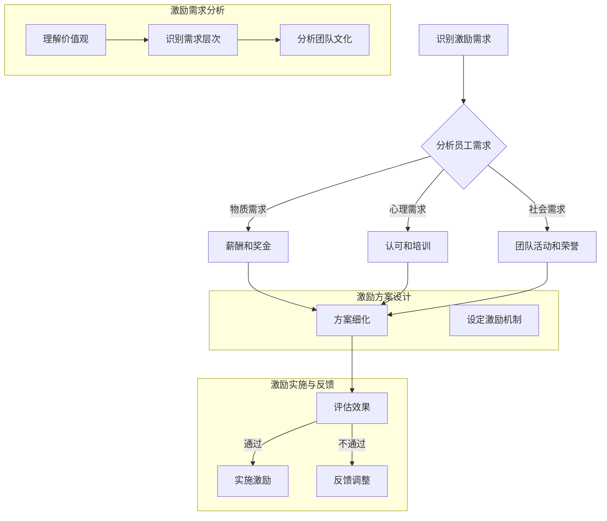

                 

### 《团队激励的心理学：激发内在动力》

在信息技术迅猛发展的今天，企业中的团队已成为创新与进步的核心力量。然而，如何激发团队的内在动力，使其在竞争激烈的市场中保持高效和创造力，成为每一个领导者和管理者亟待解决的问题。本文将以《团队激励的心理学：激发内在动力》为题，探讨团队激励在心理学领域的应用，旨在为IT行业的管理者提供一套科学、系统的团队激励方法。

关键词：团队激励、心理学、内在动力、IT行业、激励机制

摘要：本文首先介绍团队激励的定义与意义，接着分析团队激励的基础理论，包括自我决定理论、目标设置理论、双因素理论等。在此基础上，探讨个体心理学、社会心理学和认知心理学在团队激励中的应用。随后，文章将深入实践方法，包括制定激励机制、提升团队凝聚力和激发团队内在动力。最后，通过案例分析展示团队激励的实际应用，并讨论不同类型团队的激励策略及跨文化团队的激励方法。本文旨在为IT行业管理者提供实用的团队激励策略，以提升团队绩效和竞争力。

## 《团队激励的心理学：激发内在动力》目录大纲

### 第一部分：团队激励的基础理论

#### 第1章：团队激励概述

- 团队激励的定义与意义
- 团队激励的基本原理
- 团队激励的类型与方式

#### 第2章：团队激励的核心概念

- 自我决定理论
- 目标设置理论
- 双因素理论

#### 第3章：团队激励的心理学原理

- 个体心理学理论
- 社会心理学理论
- 认知心理学理论

### 第二部分：团队激励的实践方法

#### 第4章：制定有效的激励机制

- 设定激励目标
- 设计激励方案
- 实施激励机制

#### 第5章：提升团队凝聚力

- 增强团队信任
- 建立团队文化
- 提升团队协作

#### 第6章：激发团队内在动力

- 自我激励策略
- 团队成员激励策略
- 持续激发团队动力

#### 第7章：团队激励案例分析

- 案例一：某大型企业团队激励实践
- 案例二：某初创团队如何激发内在动力
- 案例三：跨国团队激励策略探讨

### 第三部分：团队激励的心理学应用

#### 第8章：不同类型团队的激励策略

- 创新型团队激励策略
- 稳定型团队激励策略
- 高风险团队激励策略

#### 第9章：跨文化团队激励

- 跨文化团队沟通与激励
- 跨文化团队激励机制设计
- 跨文化团队激励案例分析

#### 第10章：团队激励的心理学研究进展

- 团队激励心理学的研究方法
- 团队激励心理学的新发现
- 未来研究方向

### 附录

#### 附录A：常用激励工具与应用

- 常见激励工具简介
- 激励工具的应用实例

#### 附录B：团队激励调查问卷

- 调查问卷设计与分析
- 调查问卷案例分享

#### 附录C：团队激励的心理学流程图

- 团队激励流程图
- 流程图说明与解读

### 结语

本文通过对团队激励的心理学理论、实践方法和应用案例的深入探讨，旨在为IT行业的管理者提供一套系统的团队激励策略。希望通过本文的研究，能够帮助管理者更好地理解团队激励的心理学原理，并在实际工作中有效地应用这些策略，从而激发团队的内在动力，提升团队绩效和竞争力。在未来的发展中，团队激励的心理学研究将继续深入，为企业管理提供更加科学和有效的指导。

## 第一部分：团队激励的基础理论

### 第1章：团队激励概述

#### 团队激励的定义与意义

团队激励是指通过一系列的措施和方法，激发团队成员的工作热情、创造力和团队合作精神，从而提高团队的整体绩效和达成组织目标的过程。在IT行业中，团队激励尤为重要，因为IT行业的竞争日益激烈，技术更新迭代速度极快，只有通过激发团队的内在动力，才能保持团队的竞争力。

团队激励的意义主要体现在以下几个方面：

1. **提升工作效率**：有效的激励措施能够激发团队成员的工作积极性，提高工作效率，减少工作中的拖延和懈怠现象。
2. **增强团队合作精神**：团队激励可以促进团队成员之间的沟通与合作，减少摩擦和冲突，形成良好的团队氛围。
3. **激发创新思维**：激励措施能够激发团队成员的创新思维，推动团队在技术、产品和业务模式上的创新，从而保持竞争优势。
4. **提升员工满意度**：通过激励措施，可以提高员工的满意度和归属感，减少员工流失率，为企业的长期发展打下坚实基础。

#### 团队激励的基本原理

团队激励的基本原理可以从以下几个方面进行阐述：

1. **需求理论**：根据马斯洛的需求层次理论，不同层次的员工有不同的需求，管理者需要根据员工的需求层次来制定相应的激励措施。
2. **期望理论**：根据弗鲁姆的期望理论，员工的行为是由其期望结果决定的，管理者需要设定明确的激励机制，使员工相信通过努力可以实现预期的奖励。
3. **公平理论**：根据亚当斯的公平理论，员工会比较自己的投入和回报与他人的投入和回报，管理者需要确保激励机制的公平性，以避免不公平感导致的消极情绪。

#### 团队激励的类型与方式

团队激励的类型和方式多种多样，常见的有以下几种：

1. **物质激励**：包括奖金、提成、股权激励等，通过提供经济上的回报来激励员工。
2. **精神激励**：包括表扬、荣誉、培训等，通过满足员工的心理需求来激发其工作热情。
3. **目标激励**：通过设定明确的团队目标和个人目标，激发员工的积极性和成就感。
4. **参与激励**：鼓励员工参与决策过程，提高其责任感和参与感。
5. **竞争激励**：通过团队间的竞争，激发员工的竞争意识和进取心。

#### 团队激励的核心概念

团队激励的核心概念包括以下几个方面：

1. **自我决定理论**：自我决定理论强调个体在行为中的自我决定性，管理者需要尊重员工的选择权，提供支持和资源，让员工能够自主地完成工作任务。
2. **目标设置理论**：目标设置理论认为明确的、有挑战性的目标能够激发员工的工作动力，管理者需要帮助员工设定合适的个人和团队目标。
3. **双因素理论**：赫兹伯格的双因素理论将工作激励因素分为保健因素和激励因素，管理者需要同时关注这两个方面，以提升员工的工作满意度。

#### 团队激励的心理学原理

团队激励的心理学原理主要涉及以下几个方面：

1. **个体心理学理论**：个体心理学理论强调个体行为的自主性和积极性，管理者需要理解员工的心理需求，提供个性化激励。
2. **社会心理学理论**：社会心理学理论关注个体在群体中的行为，管理者需要营造积极向上的团队氛围，促进团队合作。
3. **认知心理学理论**：认知心理学理论关注个体如何理解和处理信息，管理者需要提供清晰的目标和反馈，帮助员工形成积极的认知。

通过以上对团队激励概述的讨论，我们可以看出团队激励在IT行业中的重要性。在接下来的章节中，我们将进一步探讨团队激励的核心概念和心理学原理，为实际应用提供理论支持。

### 第2章：团队激励的核心概念

#### 自我决定理论

自我决定理论是由心理学家德西和瑞安提出的，该理论强调个体在行为中的自我决定性和自主性。自我决定理论认为，个体的行为主要受到内在动机的驱动，而不是外在的奖惩。自我决定的行为是指个体能够自主选择和决定自己的行为，这种自由选择和自我决定的过程能够提高个体的内在动机和工作满意度。

在团队激励中，自我决定理论的应用主要体现在以下几个方面：

1. **尊重员工的自主性**：管理者需要尊重员工的自主性，让员工能够自由选择自己的工作内容和方式。这样可以提高员工的工作积极性和责任感。
2. **提供支持和资源**：管理者需要为员工提供充足的支持和资源，帮助员工实现自我决定的行为。例如，提供培训机会、技术支持等。
3. **设定有意义的目标**：有意义的目标能够激发员工的内在动机，使员工愿意付出努力去实现这些目标。管理者需要帮助员工设定既具挑战性又具有实际可行性的目标。

#### 目标设置理论

目标设置理论是心理学家洛克和莱瑟姆提出的，该理论认为明确的、有挑战性的目标能够显著提高个体的工作绩效。目标设置理论的核心观点是，目标对行为具有指导作用，能够激励个体付出更多的努力去实现目标。

在团队激励中，目标设置理论的应用主要体现在以下几个方面：

1. **设定明确的团队目标**：管理者需要为团队设定明确的、具体的、有挑战性的目标。这些目标应当是可量化的，以便于评估和反馈。
2. **设定个人目标**：在团队目标的基础上，管理者需要帮助团队成员设定个人目标。个人目标应当与团队目标相一致，并且应当具有个人化的挑战性。
3. **持续反馈和调整**：管理者需要定期对团队和个人的目标进行反馈和调整，以确保目标的实现和团队的整体绩效。

#### 双因素理论

双因素理论，又称为“保健—激励”理论，是由心理学家赫兹伯格提出的。赫兹伯格将影响员工工作满意度的因素分为两类：保健因素和激励因素。

1. **保健因素**：保健因素是指那些与员工不满意直接相关的因素，如工作条件、薪酬、晋升机会等。这些因素如果得不到满足，会导致员工的不满意，但它们并不能直接提高员工的工作满意度。
2. **激励因素**：激励因素是指那些能够激发员工工作热情和创造力的因素，如工作成就、认可、责任等。这些因素如果得到满足，能够显著提高员工的工作满意度。

在团队激励中，双因素理论的应用主要体现在以下几个方面：

1. **关注保健因素**：管理者需要确保团队的基本工作条件得到满足，如提供合理的薪酬、良好的工作环境和晋升机会等。
2. **重视激励因素**：管理者需要关注员工的内在需求，通过设定有意义的目标、提供认可和奖励等方式来激发员工的工作热情和创造力。

通过以上对自我决定理论、目标设置理论和双因素理论的介绍，我们可以看到这些理论在团队激励中的重要性。在接下来的章节中，我们将进一步探讨团队激励的心理学原理，以便更好地理解和应用这些理论。

### 第3章：团队激励的心理学原理

#### 个体心理学理论

个体心理学理论是由奥地利心理学家阿尔弗雷德·阿德勒提出的，该理论主要关注个体的内心世界和心理需求。阿德勒认为，个体的行为主要受到其心理动机和信念的影响，这些动机和信念决定了个体如何感知和应对外部环境。

在团队激励中，个体心理学理论的应用主要体现在以下几个方面：

1. **理解员工心理需求**：管理者需要了解员工的个性和心理需求，如安全感、成就感、自我实现等。通过了解这些需求，管理者可以更好地设计激励措施，满足员工的心理需求。
2. **提供个性化激励**：管理者需要根据员工的心理需求提供个性化的激励措施。例如，对于追求安全感的员工，可以提供稳定的职业发展路径和良好的工作环境；对于追求成就感的员工，可以提供具有挑战性的项目和奖励。
3. **培养积极信念**：管理者需要帮助员工建立积极的信念，如相信自己能够胜任工作、相信团队的支持和合作等。积极的信念能够增强员工的自信心和工作动力。

#### 社会心理学理论

社会心理学理论主要研究个体在群体中的行为和心理过程。社会心理学理论认为，个体在群体中的行为不仅受到个体内在因素的影响，还受到群体规范、社会认同和群体压力的影响。

在团队激励中，社会心理学理论的应用主要体现在以下几个方面：

1. **建立积极的团队氛围**：管理者需要营造一个积极、支持、鼓励的团队氛围，使员工感到被尊重和认同。这样可以增强员工的归属感和工作积极性。
2. **促进团队合作**：管理者需要通过团队活动和项目合作，增强员工之间的互动和协作。团队合作能够激发员工的集体荣誉感和责任心，从而提高团队的整体绩效。
3. **利用社会认同效应**：管理者可以通过树立榜样和成功案例，激发员工的社会认同感。当员工看到自己的同事或团队取得了成功时，他们也会受到鼓舞，努力追求卓越。

#### 认知心理学理论

认知心理学理论关注个体如何感知、理解和处理信息。认知心理学理论认为，个体的行为和决策是由其认知过程决定的，这些认知过程包括注意、记忆、思维和决策等。

在团队激励中，认知心理学理论的应用主要体现在以下几个方面：

1. **设定清晰的目标和指导**：管理者需要为团队和个体设定清晰、具体的任务目标和指导，使员工知道自己的工作方向和目标。这样可以减少员工的信息加工负担，提高工作效率。
2. **提供及时的反馈和反馈机制**：管理者需要建立有效的反馈机制，及时给予员工工作反馈。通过反馈，员工可以了解自己的工作表现和改进方向，从而调整自己的行为。
3. **利用认知激励策略**：管理者可以利用认知激励策略，如明确的目标、积极的反馈和挑战性的任务等，激发员工的认知需求和动机。这样可以增强员工对工作的投入和兴趣。

通过以上对个体心理学理论、社会心理学理论和认知心理学理论的介绍，我们可以看到这些理论在团队激励中的应用价值。在接下来的章节中，我们将深入探讨团队激励的实践方法，帮助管理者更好地应用这些心理学原理，提升团队绩效。

### 第二部分：团队激励的实践方法

#### 第4章：制定有效的激励机制

激励机制是团队管理中至关重要的一环，有效的激励机制能够激发团队成员的工作热情和创造力，提高团队的整体绩效。在这一章节中，我们将探讨如何制定有效的激励机制，包括设定激励目标、设计激励方案和实施激励机制。

#### 设定激励目标

设定激励目标是制定激励机制的第一步，明确的目标能够为团队和个体提供清晰的指引，提高工作的目的性和效率。在设定激励目标时，应遵循以下几个原则：

1. **明确具体**：目标应当是明确的、具体的，而不是模糊和抽象的。例如，而不是“提高销售额”，而是“在下一季度内，将销售额提高10%”。
2. **可衡量**：目标应当是可衡量的，以便于评估和反馈。例如，可以使用具体的数字或指标来衡量目标的完成情况。
3. **具有挑战性**：目标应当具有一定程度的挑战性，以激发团队成员的努力和进取心。但同时也应确保目标具有可行性，避免过高的难度导致成员的挫败感。
4. **与团队和组织目标一致**：个人和团队的目标应与组织的整体目标相一致，确保激励机制能够推动团队和组织的发展。

#### 设计激励方案

设计激励方案是激励机制的实现环节，激励方案的设计应当与设定的激励目标相匹配，并考虑到团队成员的多样化需求。以下是几种常见的激励方案设计方法：

1. **物质激励**：物质激励包括奖金、提成、股权激励等，这类激励能够直接提高员工的经济收入。在设计物质激励方案时，应考虑到公平性和透明性，确保所有团队成员都能够公平地参与到激励中。
2. **精神激励**：精神激励包括表扬、荣誉、培训等，这类激励能够满足员工的心理需求，提升工作满意度和归属感。精神激励可以与物质激励相结合，形成综合性的激励方案。
3. **职业发展激励**：职业发展激励包括提供职业晋升机会、培训机会等，这类激励能够帮助员工实现职业成长，提升其职业满意度和忠诚度。
4. **工作环境激励**：改善工作环境，提供舒适的工作条件，如办公设备、休息区域等，也能够激励员工的工作积极性和满意度。

#### 实施激励机制

实施激励机制是确保激励方案能够有效执行的关键环节。以下是实施激励机制时需要注意的几个方面：

1. **透明化**：确保激励机制的透明化，使团队成员了解激励方案的具体内容和操作流程。透明化能够增加激励的公正性和可信度，减少不必要的猜疑和误解。
2. **及时反馈**：及时给予团队成员工作反馈，对于完成目标优秀的成员给予及时的奖励和认可，对于未完成目标的成员提供改进建议和帮助。及时反馈能够强化激励机制的效果，提高员工的工作动力。
3. **持续优化**：激励机制应当根据团队的实际表现和市场环境的变化进行持续的优化和调整。例如，可以定期评估激励方案的执行效果，根据评估结果调整奖励标准和方案内容。
4. **文化融入**：将激励机制融入团队文化中，使团队成员能够自然而然地接受和遵循激励措施。例如，通过团队文化建设活动，增强团队成员对激励机制的理解和认同。

通过以上对制定有效激励机制的探讨，我们可以看到，有效的激励机制应当是明确具体的、具有挑战性的、与团队和组织目标一致的，并且能够满足团队成员的多样化需求。在实施过程中，需要注重透明化、及时反馈和持续优化，以充分发挥激励机制的作用，激发团队的内在动力，提高团队的整体绩效。

### 第5章：提升团队凝聚力

团队凝聚力是团队管理中至关重要的一个因素，它关系到团队的整体协作效率和工作氛围。提升团队凝聚力不仅能够增强团队的合作精神，还能提高团队的整体绩效。在这一章节中，我们将探讨提升团队凝聚力的几种实践方法，包括增强团队信任、建立团队文化和提升团队协作。

#### 增强团队信任

信任是团队凝聚力的基础，没有信任，团队就无法有效协作。以下是几种增强团队信任的方法：

1. **建立开放沟通**：鼓励团队成员之间的开放沟通，让每个成员都有机会表达自己的想法和意见。通过沟通，团队成员能够更好地理解彼此，减少误解和猜疑。
2. **共同经历**：通过团队活动或项目合作，让团队成员共同经历一些挑战和困难，这样能够增强团队成员之间的情感联系和信任感。
3. **透明化决策**：在团队决策过程中保持透明化，让团队成员了解决策的背景和理由，这样能够增强他们对决策的认同感和信任度。
4. **相互支持**：在团队成员遇到困难时，提供支持和帮助，这样能够增强团队成员之间的信任和依赖。

#### 建立团队文化

团队文化是团队凝聚力的另一个重要因素，良好的团队文化能够营造积极的团队氛围，增强团队成员的归属感。以下是几种建立团队文化的方法：

1. **共同价值观**：明确团队的共同价值观，并确保每个成员都认同和践行这些价值观。共同的价值观能够帮助团队成员在工作和生活中保持一致的行为和态度。
2. **团队使命和愿景**：为团队设定明确的使命和愿景，让团队成员了解团队的目标和方向。这能够激发团队成员的工作热情和责任感，增强团队的凝聚力。
3. **团队仪式**：通过定期的团队仪式，如团队建设活动、庆祝活动等，增强团队成员之间的联系和感情。这些仪式能够成为团队文化的一部分，进一步巩固团队的凝聚力。
4. **奖励和认可**：通过奖励和认可，鼓励团队成员践行团队价值观，并表彰那些为团队做出贡献的成员。这能够增强团队成员的归属感和团队荣誉感。

#### 提升团队协作

高效的团队协作能够显著提升团队的工作效率和绩效。以下是几种提升团队协作的方法：

1. **明确角色和责任**：每个团队成员都应明确自己的角色和责任，这样能够避免工作重叠和责任不清的情况，提高团队的协作效率。
2. **分工合作**：根据团队成员的能力和特长，合理分配任务，确保每个人都能在擅长的领域发挥最大的作用。分工合作能够提高团队的工作效率和绩效。
3. **定期沟通和会议**：定期组织团队沟通和会议，让团队成员能够及时了解项目的进展和遇到的问题。通过沟通，团队成员能够相互支持和协作，共同解决问题。
4. **共享资源和信息**：建立共享的资源和信息平台，让团队成员能够方便地获取和分享知识和信息。共享资源和信息能够增强团队的协作能力，提高工作效率。

通过以上对提升团队凝聚力的探讨，我们可以看到，增强团队信任、建立团队文化和提升团队协作是提升团队凝聚力的关键。在实践过程中，需要根据团队的实际情况，灵活运用这些方法，逐步提升团队的凝聚力和协作效率。

### 第6章：激发团队内在动力

在团队管理中，激发团队成员的内在动力是提升团队绩效和创新能力的关键。内在动力是指来自个人内心的驱动力量，这种动力能够使团队成员自愿、自发地投入到工作中，持续地追求卓越。在这一章节中，我们将探讨如何通过自我激励策略、团队成员激励策略和持续激发团队动力，有效地激发团队的内在动力。

#### 自我激励策略

自我激励是指团队成员通过自我驱动和自我调节来提升工作表现和实现个人目标。以下是一些自我激励的策略：

1. **设定个人目标**：团队成员应根据自己的能力和兴趣设定短期和长期的个人目标。明确的个人目标能够提供清晰的方向和动力，使团队成员保持专注和努力。
2. **自我反馈和反思**：定期对个人工作表现进行自我反馈和反思，识别自身的优点和不足，并制定改进计划。自我反馈和反思能够帮助团队成员不断进步，增强自我激励能力。
3. **自我奖励**：当个人达成某个目标或完成某项任务时，可以给自己设定一些小奖励，如休息时间、娱乐活动等。自我奖励能够增强团队成员的成就感和满足感，进一步激发内在动力。

#### 团队成员激励策略

团队成员激励是指通过管理者的激励措施来激发团队成员的内在动力。以下是一些有效的团队成员激励策略：

1. **认可和表扬**：及时认可和表扬团队成员的成就和贡献，让他们感受到自己的价值和重要性。认可和表扬可以是口头的、书面的，甚至可以是公共场合的，这样能够增强团队成员的自信心和动力。
2. **提供发展机会**：为团队成员提供职业发展机会和培训，让他们能够在工作中不断学习和成长。发展机会能够激发团队成员的学习热情和进取心，从而提升团队的内在动力。
3. **挑战性任务**：分配具有挑战性的任务给团队成员，鼓励他们克服困难，实现突破。挑战性任务能够激发团队成员的成就动机，提高团队的整体竞争力。
4. **团队竞赛**：组织团队竞赛，鼓励团队成员积极参与，竞争优秀成绩。团队竞赛能够增强团队成员的竞争意识和团队精神，激发他们的内在动力。

#### 持续激发团队动力

持续激发团队动力需要管理者在长期的管理实践中不断探索和创新。以下是一些持续激发团队动力的方法：

1. **建立积极的工作环境**：营造一个积极、支持、开放的工作环境，让团队成员感到舒适和安心。积极的工作环境能够增强团队成员的工作满意度和内在动力。
2. **鼓励创新和尝试**：鼓励团队成员创新和尝试新方法、新思路，对失败的尝试给予理解和包容。创新和尝试能够激发团队成员的创造力和探索精神，提高团队的整体活力。
3. **建立激励机制**：建立长期有效的激励机制，如绩效奖金、股权激励等，激励团队成员长期保持高绩效。长期激励机制能够增强团队成员的稳定性和忠诚度，持续激发内在动力。
4. **定期沟通和反馈**：定期与团队成员进行沟通，了解他们的需求和困惑，及时给予反馈和支持。定期沟通和反馈能够增强团队成员的归属感和信任感，持续激发内在动力。

通过以上对自我激励策略、团队成员激励策略和持续激发团队动力的探讨，我们可以看到，激发团队内在动力需要从多个方面入手，包括设定个人目标、认可和表扬、提供发展机会、建立积极的工作环境等。管理者需要根据团队的实际情况，灵活运用这些策略，持续激发团队的内在动力，提升团队的整体绩效和创新能力。

### 第7章：团队激励案例分析

在本章中，我们将通过实际案例来探讨团队激励在不同情境中的应用，以帮助读者更好地理解和运用团队激励的理论和方法。

#### 案例一：某大型企业团队激励实践

某大型互联网公司在快速发展的过程中，面临激烈的行业竞争和快速的技术迭代。为了保持团队的竞争力，公司实施了一系列的团队激励措施。

**1. 激励目标设定**

公司首先明确了团队的长期和短期目标，包括提升用户满意度、增加市场份额、提高研发效率等。这些目标既具有挑战性又具有可实现性，能够激发团队成员的积极性和动力。

**2. 设计激励方案**

公司设计了一套综合性的激励方案，包括物质激励和精神激励。物质激励方面，公司提供了丰厚的绩效奖金、股权激励和年终奖；精神激励方面，公司设置了优秀员工评选、公开表彰和培训机会。

**3. 实施激励机制**

公司通过透明的沟通机制和及时的反馈机制来确保激励方案的执行。每个季度，公司都会对团队成员的工作表现进行评估，并根据评估结果发放奖金和奖励。此外，公司还定期组织团队建设活动和培训，增强团队成员的凝聚力和归属感。

**4. 激励效果**

通过一系列的激励措施，公司的团队凝聚力显著提升，团队成员的工作积极性也大幅增加。公司的市场份额稳步提升，研发效率提高，员工流失率明显下降，整体绩效得到显著改善。

**案例总结**：该大型企业的案例表明，通过明确的激励目标、综合的激励方案和透明的执行机制，能够有效地激发团队的内在动力，提升团队的整体绩效。

#### 案例二：某初创团队如何激发内在动力

某初创公司成立于竞争激烈的科技行业，团队成员大多是年轻的毕业生，对工作充满热情但经验不足。为了激发团队的内在动力，公司采取了一系列创新的激励措施。

**1. 自我激励策略**

公司鼓励团队成员设定个人发展目标，并提供资源和支持，如培训课程和项目指导。团队成员可以自主选择感兴趣的项目，通过自我学习和实践提升自己的技能。

**2. 团队成员激励策略**

公司定期组织团队建设活动和社交活动，增强团队成员之间的互动和信任。此外，公司设置了“创新奖”，鼓励团队成员提出新的创意和解决方案。

**3. 持续动力激发**

公司通过定期的团队会议和公开表彰，让团队成员了解公司的发展动态和团队成绩。公司还设置了股票期权计划，让团队成员共享公司的成功和成长。

**4. 激励效果**

通过自我激励策略和团队成员激励策略，初创团队的成员在工作中表现出强烈的自我驱动和团队合作精神。团队成员的技能和知识水平显著提升，公司成功推出了几款创新产品，市场反响热烈。

**案例总结**：该初创公司的案例说明，通过鼓励自我激励和团队成员激励，以及持续的动力激发措施，能够在资源有限的情况下有效提升团队绩效和创新能力。

#### 案例三：跨国团队激励策略探讨

某跨国公司在全球范围内运营，团队成员来自不同的文化和背景。为了激发跨国团队的内在动力，公司制定了一系列跨文化激励策略。

**1. 跨文化沟通与激励**

公司设立了跨文化培训课程，帮助团队成员理解和尊重不同的文化差异。公司还设置了国际团队成员交流项目，促进团队成员之间的互动和合作。

**2. 跨文化激励机制设计**

公司设计了一套多元文化的激励方案，包括国际项目参与机会、跨文化团队合作奖励和国际化发展机会。这些激励措施能够吸引和留住具有国际视野的团队成员。

**3. 跨文化团队激励案例分析**

公司通过成功案例的分享，如国际项目成功的经验，激励团队成员学习先进的管理和技术经验。此外，公司还设立了跨文化创新奖，表彰在国际项目中做出突出贡献的团队成员。

**4. 激励效果**

通过跨文化沟通与激励、跨文化激励机制设计和案例分析，跨国团队的协作效率显著提高，团队成员的归属感和认同感增强，公司在国际市场上的竞争力也得到了提升。

**案例总结**：该跨国公司的案例展示了如何通过跨文化激励策略，克服文化差异带来的挑战，激发跨国团队的内在动力，提升团队的全球竞争力。

通过以上案例的分析，我们可以看到，团队激励在不同的情境下可以采取多种策略和措施，关键在于理解团队成员的需求和动机，设计符合团队实际情况的激励方案，并确保激励方案的透明化和执行效果。这些案例为其他团队提供了宝贵的经验和借鉴。

### 第8章：不同类型团队的激励策略

在IT行业中，团队类型多种多样，包括研发团队、运维团队、销售团队等。每种团队由于其工作性质和任务目标的不同，对激励策略的需求也各有特点。在这一章节中，我们将探讨针对不同类型团队的激励策略。

#### 创新型团队激励策略

创新型团队通常负责新产品开发和技术研究，他们的工作需要高度的创造性和创新能力。以下是一些适用于创新型团队的激励策略：

1. **挑战性任务**：为创新型团队设置具有挑战性的任务和项目，鼓励他们进行创新和探索。挑战性任务能够激发团队成员的成就动机，提高创新动力。
2. **自主权**：给予创新型团队较大的自主权，让他们自主决定工作内容和方式。自主权能够提高团队成员的工作积极性和责任感，促进创新思维的发展。
3. **资源支持**：为创新型团队提供充足的资源和工具支持，如先进的研发设备、技术培训等。资源支持能够提升团队的工作效率，增强创新能力。
4. **跨领域合作**：鼓励创新型团队与其他团队进行跨领域合作，通过多角度的视角和思维碰撞，激发创新灵感。

#### 稳定型团队激励策略

稳定型团队通常负责日常运营和维护，他们的工作需要高度的稳定性和执行力。以下是一些适用于稳定型团队的激励策略：

1. **绩效奖励**：为稳定型团队设定明确的绩效指标，根据绩效表现进行奖励。绩效奖励能够激励团队成员提高工作质量和效率，保持稳定的工作状态。
2. **工作环境优化**：改善稳定型团队的工作环境，提供舒适的工作条件和设施，如良好的办公环境、健康饮食等。良好的工作环境能够提升团队成员的工作满意度和稳定性。
3. **职业发展机会**：为稳定型团队成员提供职业发展机会，如晋升通道、专业培训等。职业发展机会能够激发团队成员的长期工作动力，增强团队稳定性。
4. **团队文化建设**：通过团队文化建设，增强稳定型团队的凝聚力和归属感。团队文化应强调团队合作、稳定性和执行力，以提升团队的整体绩效。

#### 高风险团队激励策略

高风险团队通常负责重要项目和紧急任务，他们的工作具有较大的不确定性和风险。以下是一些适用于高风险团队的激励策略：

1. **风险激励**：为高风险团队设置风险激励措施，如高额奖金、股权激励等。风险激励能够鼓励团队成员在面对挑战和风险时保持积极和乐观的态度。
2. **团队协作**：强调高风险团队的合作精神和团队协作，通过团队间的互助和支持，提高整体应对风险的能力。
3. **应急培训**：为高风险团队提供应急培训，提升团队成员的应急处理能力和风险管理能力。应急培训能够增强团队在面对突发情况时的应对能力和信心。
4. **心理支持**：为高风险团队提供心理支持服务，如心理咨询、压力管理培训等。心理支持能够帮助团队成员缓解工作压力，保持良好的心理状态。

通过以上对不同类型团队的激励策略的探讨，我们可以看到，针对不同类型的团队，需要设计符合其特点的激励策略。创新型团队需要挑战性和自主权，稳定型团队需要绩效奖励和职业发展，高风险团队需要风险激励和心理支持。管理者需要根据团队的实际情况，灵活运用这些策略，以激发团队的内在动力，提升团队的整体绩效。

### 第9章：跨文化团队激励

在全球化背景下，越来越多的企业在全球范围内开展业务，跨国团队的组建成为常态。跨国团队的成员来自不同的文化背景，如何有效地激励这样的团队是一个具有挑战性的课题。在这一章节中，我们将探讨跨文化团队的激励方法，包括跨文化团队沟通与激励、跨文化激励机制设计及跨文化团队激励案例分析。

#### 跨文化团队沟通与激励

跨文化团队的沟通与激励需要充分考虑文化差异，以避免误解和冲突，增强团队凝聚力。以下是一些关键点：

1. **文化差异培训**：为跨国团队的成员提供文化差异培训，帮助他们了解和尊重不同文化的价值观、行为方式和沟通习惯。文化差异培训能够增强团队成员之间的理解和信任，促进有效沟通。
2. **建立共同目标**：为跨国团队设定共同的团队目标，使团队成员认识到自己为整体团队的目标而工作。共同的目标能够增强团队的凝聚力，提高团队成员的投入度和积极性。
3. **开放性沟通**：鼓励跨国团队成员之间的开放性沟通，创建一个安全、包容的沟通环境，使成员能够自由表达观点和想法。开放性沟通能够促进团队成员之间的互动和合作，增强团队凝聚力。
4. **文化融合活动**：定期组织文化融合活动，如团队建设游戏、国际美食节等，促进团队成员之间的交流和互动。文化融合活动能够增强团队成员之间的友谊和信任，提高团队的整体士气。

#### 跨文化激励机制设计

设计跨文化激励机制时，需要考虑到不同文化背景下团队成员的期望和需求。以下是一些跨文化激励机制的设计方法：

1. **多元文化奖励**：根据不同文化背景，设计多元化的奖励方案，如物质奖励、荣誉奖励、职业发展机会等。多元文化奖励能够满足不同文化背景团队成员的多样化需求，提高激励效果。
2. **认可和表扬**：通过公开认可和表扬团队成员的成就和贡献，增强他们的自尊心和荣誉感。认可和表扬应注重文化差异，避免使用可能引起误解或冒犯的语言和行为。
3. **跨文化团队项目**：鼓励跨国团队成员参与跨文化团队项目，通过共同完成任务，增强团队协作精神和跨文化沟通能力。跨文化团队项目能够促进团队成员之间的相互理解和尊重，提高团队的凝聚力和创新能力。
4. **文化适应培训**：为跨国团队成员提供文化适应培训，帮助他们更好地适应新的文化环境。文化适应培训能够提高团队成员的文化敏感度和适应性，减少文化冲突和误解。

#### 跨文化团队激励案例分析

以下是一个跨国团队的激励案例分析，该团队由来自不同国家的成员组成，负责跨国项目的开发和管理。

**案例背景**：
某跨国软件公司在全球范围内招募了多名来自不同国家的软件工程师，组成了一支跨国开发团队，负责一个重要跨国项目的开发工作。团队成员分别来自美国、中国、印度和欧洲其他国家，文化差异显著。

**激励措施**：

1. **文化差异培训**：公司为团队成员提供了文化差异培训，帮助他们了解和尊重彼此的文化习惯和沟通方式。培训内容包括文化价值观、沟通风格、时间观念等。

2. **共同目标设定**：团队在项目开始前，共同设定了项目的总体目标和具体目标，并明确了每个成员在项目中的角色和职责。共同的目标设定增强了团队成员的投入感和团队凝聚力。

3. **开放性沟通**：公司建立了开放的沟通渠道，如跨国视频会议、即时通讯工具等，确保团队成员能够随时交流和分享信息。公司鼓励团队成员在沟通中尊重彼此的观点，积极参与团队讨论。

4. **多元文化奖励**：公司根据团队成员的表现和贡献，设立了多元化的奖励机制，包括项目奖金、国际旅行奖励、职业发展机会等。奖励方案充分考虑了不同文化背景团队成员的需求。

**激励效果**：

通过一系列的跨文化激励措施，该跨国团队的凝聚力和合作精神显著提升。团队成员之间的沟通更加顺畅，项目进度和质量得到了保证，最终项目成功完成，并获得了客户的高度评价。

**案例总结**：该案例表明，通过文化差异培训、共同目标设定、开放性沟通和多元文化奖励等跨文化激励措施，可以有效提升跨国团队的凝聚力和工作效率。跨文化团队的激励需要充分考虑文化差异，设计符合团队成员需求的激励方案，以实现团队的最佳绩效。

### 第10章：团队激励的心理学研究进展

随着心理学研究的不断深入，团队激励领域也取得了显著的进展。在这一章节中，我们将探讨团队激励心理学的研究方法、新发现及未来的研究方向。

#### 研究方法

团队激励的心理学研究通常采用以下几种方法：

1. **实验研究**：通过实验室设置，控制变量，观察和记录团队激励措施对团队成员行为和绩效的影响。实验研究能够提供因果关系的有力证据，但可能缺乏现实环境的复杂性。
2. **现场观察**：在自然工作环境中观察团队的行为和互动，记录团队成员的激励反应和绩效变化。现场观察能够捕捉到实际工作中的复杂动态，但受主观因素的影响较大。
3. **问卷调查**：通过设计问卷，收集团队成员对激励措施的感受和评价，以及工作绩效和满意度等信息。问卷调查能够提供大规模的数据，但可能存在主观偏差。
4. **案例研究**：对特定团队或组织的激励实践进行深入分析，了解其激励策略的实施过程和效果。案例研究能够提供丰富的实际经验，但结果可能难以推广。

#### 新发现

心理学研究在团队激励领域取得了以下新发现：

1. **激励的多样性**：研究表明，不同类型的激励措施对不同类型的员工和团队有不同的效果。例如，物质激励可能对一些员工效果显著，而精神激励对另一些员工效果更好。
2. **文化影响**：不同文化背景下，团队激励措施的效果存在显著差异。在某些文化中，物质激励更受欢迎，而在其他文化中，精神激励和职业发展机会可能更有效。
3. **自主性作用**：越来越多的研究指出，自我决定性在激励中的作用至关重要。给予团队成员更多的自主性和决策权，能够显著提高他们的工作满意度和绩效。
4. **心理资本**：心理资本，即个体的心理韧性和乐观态度，对团队激励具有积极影响。提升团队成员的心理资本，有助于增强团队的凝聚力和创新能力。

#### 未来研究方向

团队激励的心理学研究在未来的发展中可能关注以下几个方向：

1. **个性化激励**：进一步探讨如何根据员工的个性、需求和价值观设计个性化的激励措施，以最大化激励效果。
2. **跨文化比较研究**：深入探讨不同文化背景下团队激励的最佳实践，为跨国企业制定有效的激励策略提供理论支持。
3. **长期效果研究**：研究团队激励措施在长期时间框架下的效果，了解激励措施对团队绩效和员工发展的持续影响。
4. **技术工具应用**：探索利用大数据、人工智能等新兴技术，分析团队激励的动态过程和效果，为实时调整和优化激励措施提供数据支持。

通过以上对团队激励心理学研究方法的探讨、新发现的介绍及未来研究方向的展望，我们可以看到，团队激励心理学研究在不断拓展和深化，为团队管理提供了更加科学和有效的指导。

### 附录

#### 附录A：常用激励工具与应用

激励工具在团队管理中扮演着重要的角色，能够有效提升员工的工作动力和团队的整体绩效。以下介绍几种常用的激励工具及其应用实例：

1. **目标管理工具**：目标管理工具帮助团队成员设定明确的目标，并进行跟踪和评估。常用的工具包括KPI（关键绩效指标）和OKR（目标与关键结果）。应用实例：某公司的研发团队使用OKR工具，将公司的战略目标分解为可执行的个人和团队目标，并定期进行评估和反馈。

2. **绩效评估工具**：绩效评估工具用于评估员工的工作表现，并提供反馈和改进建议。常用的工具包括360度评估、行为观察评估等。应用实例：某企业的销售团队采用360度评估工具，结合客户反馈和同事评价，全面评估销售人员的业绩和潜力。

3. **奖励和认可系统**：奖励和认可系统通过物质奖励和精神奖励来激励员工。常用的工具包括奖金、提成、荣誉奖项等。应用实例：某公司的市场部门设立“月度销售冠军”奖项，每月对业绩最高的销售人员进行奖励，提升团队的整体销售业绩。

4. **学习和发展工具**：学习和发展工具帮助员工提升技能和知识，增强职业发展机会。常用的工具包括在线课程、导师计划、内部培训等。应用实例：某IT公司的技术部门定期组织技术培训，邀请业内专家进行讲座，帮助员工提升技术能力。

5. **反馈和沟通工具**：反馈和沟通工具用于促进团队成员之间的沟通和反馈，提升团队协作和问题解决能力。常用的工具包括定期会议、一对一沟通、在线协作平台等。应用实例：某企业的项目管理团队每周举行一次项目进度会议，确保团队成员能够及时了解项目进展和需求。

通过以上激励工具的应用实例，我们可以看到，这些工具在提升员工动力和团队绩效方面具有显著的效果。管理者应根据团队的特点和需求，选择合适的激励工具，以实现最佳激励效果。

#### 附录B：团队激励调查问卷

设计团队激励调查问卷是了解员工激励需求和评估激励效果的重要方法。以下是一个简化的团队激励调查问卷模板，包括问题和分析部分：

**调查问卷**

1. **基本信息**
   - 性别：
   - 年龄：
   - 职位：
   - 工作年限：

2. **团队激励感受**
   - 您认为目前团队的激励机制是否有效？ 
     - 非常有效
     - 较为有效
     - 一般
     - 较为无效
     - 完全无效

3. **激励需求**
   - 您认为哪些激励措施对您最有吸引力？
     - 薪酬和奖金
     - 荣誉和认可
     - 职业发展机会
     - 工作环境改善
     - 其他（请说明）：

4. **激励效果**
   - 您认为目前的激励机制对您的工作效率和满意度有何影响？
     - 极大提升
     - 有所提升
     - 无明显影响
     - 有所降低
     - 极大降低

5. **建议和反馈**
   - 您对团队激励机制有何建议和反馈？

**分析部分**

1. **总体满意度分析**
   - 统计每个问题的回答比例，分析员工对激励机制的整体满意度。

2. **需求类型分析**
   - 根据回答结果，分析员工对不同激励措施的需求类型，识别最受欢迎和最不被看重的激励措施。

3. **效果评估**
   - 结合工作绩效和员工满意度数据，评估激励机制的实际效果，找出改进空间。

4. **建议和反馈处理**
   - 分析员工提出的建议和反馈，制定相应的改进措施，并在未来调查中跟踪效果。

通过团队激励调查问卷的设计和分析，管理者可以深入了解员工的激励需求和满意度，为改进激励机制提供科学依据。

#### 附录C：团队激励的心理学流程图

为了更好地理解和应用团队激励的心理学原理，以下是团队激励的心理学流程图，该流程图概述了从激励需求识别到激励机制设计的全过程。

**流程图说明与解读**：

- **激励需求分析**：首先需要识别员工的激励需求，包括物质需求、心理需求和社会需求。分析员工的价值观、需求层次和团队文化，以全面了解员工的激励需求。
- **激励机制设计**：根据需求分析的结果，设计具体的激励机制，包括物质激励、心理激励和社会激励。方案细化阶段对激励机制进行具体化，确保激励措施符合员工的期望和需求。
- **激励实施与反馈**：实施激励机制，并通过持续的评估和反馈机制，确保激励措施的有效性。评估阶段收集员工反馈，根据反馈调整激励方案，以持续优化激励机制。

通过这一流程图，管理者可以系统地理解和应用团队激励的心理学原理，从而设计出符合团队需求的激励机制，提升团队绩效和员工满意度。

### 结语

本文通过对团队激励的心理学理论、实践方法和应用案例的深入探讨，为IT行业的管理者提供了一套系统的团队激励策略。首先，我们介绍了团队激励的定义与意义，阐述了激励在提升工作效率、增强团队合作精神和激发创新思维方面的作用。接着，我们分析了自我决定理论、目标设置理论、双因素理论等核心概念，并探讨了个体心理学、社会心理学和认知心理学在团队激励中的应用。

在实践方法部分，我们探讨了如何制定有效的激励机制、提升团队凝聚力、激发团队内在动力，并通过实际案例展示了这些策略在不同情境下的应用效果。我们还针对创新型团队、稳定型团队和高风险团队提出了针对性的激励策略，并探讨了跨文化团队的激励方法，以帮助企业在全球化背景下实现有效的团队管理。

本文的附录部分提供了常用激励工具、团队激励调查问卷模板和团队激励的心理学流程图，这些工具和资源能够帮助管理者更好地理解和应用团队激励的理论和方法。

在未来的工作中，团队激励的心理学研究将继续深入，涉及个性化激励、文化差异影响、长期激励效果等方面。管理者应持续关注这些研究方向，根据团队的实际情况和员工需求，灵活运用各种激励策略，以实现团队的高效运作和持续发展。通过不断的实践和创新，团队激励将在提升团队绩效、增强企业竞争力方面发挥更加重要的作用。作者：AI天才研究院/AI Genius Institute & 禅与计算机程序设计艺术 /Zen And The Art of Computer Programming

