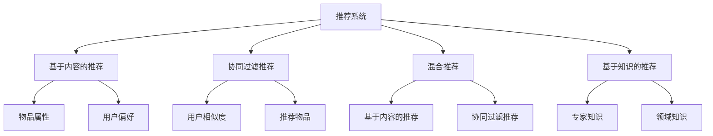

                 

### 第1章：推荐系统概述

推荐系统是一种基于算法的技术，旨在为用户推荐其可能感兴趣的信息或商品。这一章将介绍推荐系统的基本概念、功能、分类以及其发展历程。

#### 1.1 推荐系统的基本概念

**定义**：推荐系统是一种信息过滤技术，通过收集用户的历史行为和偏好，利用算法和统计技术向用户提供个性化的推荐结果。

**功能**：推荐系统的主要功能是发现用户与物品之间的关联，并根据这些关联为用户提供个性化的推荐。具体包括以下几个方面：
- **发现关联**：通过分析用户行为数据，挖掘用户与物品之间的潜在关系。
- **个性化推荐**：根据用户的历史行为和偏好，为用户推荐其可能感兴趣的物品。
- **推荐结果评估**：评估推荐结果的准确性、相关性和用户满意度。

#### 1.2 推荐系统的类型与挑战

**类型**：推荐系统根据不同的划分标准可以分为多种类型，以下是常见的几种分类方法：
- **基于内容的推荐**：根据物品的属性和用户的历史偏好进行推荐。
- **协同过滤推荐**：基于用户行为数据，通过计算用户之间的相似度来推荐物品。
- **混合推荐**：结合基于内容的推荐和协同过滤推荐，以提高推荐准确性。
- **基于知识的推荐**：利用专家知识和领域知识进行推荐。

**挑战**：推荐系统在实际应用中面临许多挑战，主要包括：
- **数据稀疏性**：用户行为数据通常非常稀疏，难以准确预测用户兴趣。
- **实时性**：推荐系统需要快速响应用户行为，提供实时的推荐结果。
- **多样性**：确保推荐结果的多样性，避免用户产生疲劳感。
- **可解释性**：用户希望了解推荐结果的原因，提高推荐系统的可解释性。

#### 1.3 推荐系统的发展历程

**早期阶段**：
- **基于规则的推荐**：通过设定一系列规则，根据用户的行为和偏好进行推荐。
- **基于内容的推荐**：利用物品的属性和用户的历史偏好进行推荐。

**发展阶段**：
- **协同过滤推荐**：通过计算用户之间的相似度，推荐用户喜欢的物品。
- **混合推荐**：结合基于内容的推荐和协同过滤推荐，以提高推荐准确性。
- **基于知识的推荐**：利用专家知识和领域知识进行推荐。

**当前趋势**：
- **深度学习推荐**：利用深度学习模型，提高推荐系统的准确性和效率。
- **多模态融合推荐**：整合多种数据类型（如文本、图像、音频等），提供更个性化的推荐。
- **联邦学习推荐**：在保护用户隐私的同时，实现大规模数据的协同训练。

### 1.4 本章小结

本章介绍了推荐系统的基本概念、类型与发展历程，以及面临的挑战。通过本章的学习，读者可以了解推荐系统的基础知识和应用现状，为进一步学习和实践打下基础。

### Mermaid 流程图



### 核心算法原理讲解

#### 基于内容的推荐算法

**原理**：基于内容的推荐算法通过分析物品的属性和用户的历史偏好，找到相似度高的物品进行推荐。

**伪代码**：

```python
def content_based_recommender(items, user_profile):
    similar_items = []
    for item in items:
        similarity = calculate_similarity(item, user_profile)
        if similarity > threshold:
            similar_items.append(item)
    return similar_items
```

**数学模型**：

$$
\text{similarity}(i, u) = \frac{\text{Jaccard Similarity}(I_i, U_u)}{|\text{I_i} \cup \text{U_u}|}
$$

其中，$I_i$ 和 $U_u$ 分别表示物品 $i$ 和用户 $u$ 的特征集合。

#### 协同过滤推荐算法

**原理**：协同过滤推荐算法通过计算用户之间的相似度，找到相似用户喜欢的物品进行推荐。

**伪代码**：

```python
def collaborative_filtering_recommender(users, items, ratings):
    user_similarity = calculate_similarity(users)
    recommendations = []
    for user in users:
        for item in items:
            if user_similarity[user][item] > threshold:
                recommendations.append(item)
    return recommendations
```

**数学模型**：

$$
\text{similarity}(u_i, u_j) = \frac{\text{Pearson Correlation Coefficient}(\text{R_i}, \text{R_j})}{\sqrt{\text{var}(\text{R_i}) \cdot \text{var}(\text{R_j})}}
$$

其中，$R_i$ 和 $R_j$ 分别表示用户 $u_i$ 和 $u_j$ 的评分向量。

### 项目实战

#### 开发环境搭建

- **Python**：Python 是推荐系统开发的主要语言，支持丰富的库和工具。
- **Scikit-learn**：Scikit-learn 是 Python 的标准机器学习库，提供多种推荐算法和评估指标。
- **Pandas**：Pandas 是 Python 的数据操作库，用于数据预处理和统计分析。

#### 源代码详细实现

以下是一个简单的基于内容的推荐系统实现：

```python
import pandas as pd
from sklearn.feature_extraction.text import TfidfVectorizer
from sklearn.metrics.pairwise import cosine_similarity

# 加载数据
items = pd.read_csv('items.csv')
user_preferences = pd.read_csv('user_preferences.csv')

# 提取物品和用户偏好
item_texts = items['text']
user_texts = user_preferences['text']

# 创建TF-IDF向量器
vectorizer = TfidfVectorizer()

# 将文本转换为向量
item_vectors = vectorizer.fit_transform(item_texts)
user_vectors = vectorizer.transform(user_texts)

# 计算相似度
similarity_matrix = cosine_similarity(user_vectors, item_vectors)

# 根据相似度推荐
recommendations = similarity_matrix.argsort()[0][-10:][::-1]
print(recommendations)
```

#### 代码解读与分析

- **数据加载**：使用 Pandas 加载物品和用户偏好数据。
- **文本预处理**：使用 TF-IDF 向量器将文本转换为向量。
- **相似度计算**：使用余弦相似度计算用户偏好和物品之间的相似度。
- **推荐生成**：根据相似度矩阵，生成推荐列表。

### 核心内容

- **核心概念与联系**：推荐系统的定义、功能、类型与发展历程。
- **核心算法原理讲解**：基于内容的推荐算法和协同过滤推荐算法。
- **项目实战**：开发环境搭建、源代码详细实现和代码解读。

通过本章的学习，读者可以了解推荐系统的基本概念、算法原理和项目实践，为后续章节的学习打下基础。

### 参考文献

1. Herlocker, J., Konstan, J. A., Borchers, J., & Riedewald, M. (2007). Exploring Social Web Sites: A Recommender System Perspective. IEEE Transactions on Knowledge and Data Engineering, 19(3), 382-397.
2. Movva, H., & Ratkay, F. (2009). A Survey of Collaborative Filtering Methods. IEEE Computer, 38(12), 58-68.
3. Lang, K. J. (2009). Introduction to Information Retrieval.

