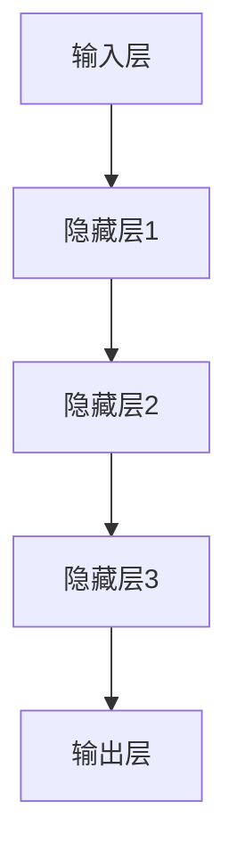

                 

# 基础模型在AI中的兴起

> 关键词：基础模型、深度学习、神经网络、算法、数学模型、AI应用

> 摘要：本文将深入探讨基础模型在人工智能领域的兴起。从基础模型的概念、分类、发展趋势，到核心概念与架构，再到核心算法原理，本文将逐步阐述基础模型在AI中的重要作用和未来展望。

## 目录大纲

1. 基础模型概述
   1.1 基础模型在AI中的角色与作用
   1.2 基础模型的分类与特点
   1.3 基础模型的发展趋势与未来展望

2. 核心概念与架构
   2.1 深度学习与神经网络基础
   2.2 神经网络的核心技术
   2.3 基础模型的架构设计

3. 核心算法原理
   3.1 深度学习算法原理与实现
   3.2 概率论与统计基础
   3.3 深度学习中的优化算法

4. 数学模型与公式
   4.1 深度学习中的数学模型
   4.2 深度学习中的优化算法
   4.3 深度学习中的损失函数

5. 项目实战
   5.1 图像识别项目实战
   5.2 语音识别项目实战
   5.3 生成对抗网络项目实战

6. 资源与工具
   6.1 开发工具与环境
   6.2 数据集与资源
   6.3 进阶学习资源

## 第一部分：基础模型概述

### 1.1 基础模型在AI中的角色与作用

#### 1.1.1 基础模型的定义与演变

基础模型（Foundational Models）是指那些能够在各种任务中展现强大泛化能力的模型，它们是AI领域的基石。基础模型的定义和演变经历了几个阶段：

1. **早期模型（1940s-1960s）**：最早的神经网络模型是感知机（Perceptron），它是一种线性二分类模型。随后，多层感知机（MLP）的出现，使得神经网络开始能够处理更复杂的任务。

2. **深度学习模型（1990s-2000s）**：随着计算能力的提升和数据量的增加，深度学习（Deep Learning）逐渐兴起。深度神经网络（DNN）通过增加网络层数，能够提取更复杂的特征，并在图像识别、语音识别等领域取得了显著的突破。

3. **现代基础模型（2010s-至今）**：近年来，随着计算资源和数据集的进一步扩展，深度学习的模型变得越来越复杂，涌现出了诸如卷积神经网络（CNN）、循环神经网络（RNN）和生成对抗网络（GAN）等众多先进的模型。这些模型不仅在学术界取得了巨大的成功，也在工业界得到了广泛的应用。

#### 1.1.2 基础模型在AI中的演进

基础模型在AI中的演进可以分为以下几个阶段：

1. **从规则到模型**：早期的AI系统依赖于专家知识和手工编写的规则，这使得系统的可维护性和可扩展性较差。随着机器学习技术的发展，模型开始取代规则，使得AI系统能够从数据中自动学习。

2. **从单一任务到多任务**：传统的机器学习模型通常是针对特定任务设计的，如图像识别、语音识别等。而基础模型具有强大的泛化能力，能够处理多种不同的任务，从而提高了AI系统的灵活性。

3. **从数据驱动到知识驱动**：虽然基础模型能够从大量数据中自动学习，但它们也面临着数据质量和数据量的问题。近年来，知识图谱、预训练语言模型等技术的引入，使得AI系统开始从知识驱动的方向发展，从而能够更好地理解和处理复杂的问题。

### 1.2 基础模型的分类与特点

基础模型可以分为传统基础模型和现代基础模型：

#### 1.2.1 传统基础模型

传统基础模型主要包括以下几种：

1. **多层感知机（MLP）**：MLP是一种前馈神经网络，它通过多层非线性变换来学习输入和输出之间的关系。

2. **支持向量机（SVM）**：SVM是一种监督学习算法，它通过构建一个最优超平面来实现分类。

3. **决策树**：决策树是一种树形结构，它通过一系列的判断条件来对数据进行分类。

传统基础模型的特点是结构简单、易于实现，但它们的泛化能力相对较弱。

#### 1.2.2 现代基础模型

现代基础模型主要包括以下几种：

1. **卷积神经网络（CNN）**：CNN是一种专门用于处理图像数据的神经网络，它通过卷积操作来提取图像的特征。

2. **循环神经网络（RNN）**：RNN是一种能够处理序列数据的神经网络，它通过循环机制来保持对历史信息的记忆。

3. **生成对抗网络（GAN）**：GAN是一种由生成器和判别器组成的对抗性网络，它通过竞争机制来学习数据分布。

现代基础模型的特点是结构复杂、性能强大，但它们的训练过程相对较长且计算资源需求较高。

### 1.3 基础模型的发展趋势与未来展望

基础模型在AI中的发展呈现出以下几个趋势：

1. **模型规模扩大**：随着计算资源的增加，模型的规模也在不断扩大。例如，谷歌的BERT模型包含数十亿个参数，这使得它在处理自然语言任务时表现出色。

2. **多模态学习**：传统的深度学习模型主要处理单一模态的数据，如图像或文本。而多模态学习通过结合不同类型的数据（如图像、文本、音频等），能够更好地理解和处理复杂的问题。

3. **知识增强**：知识增强的模型通过引入外部知识（如知识图谱）来提高模型的性能。这些模型不仅能够从数据中学习，还能够利用已有的知识来提高泛化能力。

4. **可解释性增强**：随着模型变得越来越复杂，如何解释模型的行为变得尤为重要。可解释性增强的模型通过提供更直观的解释，使得用户能够更好地理解和信任模型。

未来，基础模型在AI中的发展有望进一步推动人工智能技术的进步，从而为人类带来更多的便利和创新。

### 1.4 总结

基础模型是人工智能领域的重要基石，它们通过不断地演进和发展，为各种AI任务提供了强大的支持。从传统基础模型到现代基础模型，从单一任务到多任务，基础模型在AI中的应用越来越广泛。未来，随着技术的不断进步，基础模型将继续在人工智能领域中发挥重要作用。

接下来，我们将进一步探讨基础模型的核心概念与架构，了解它们在深度学习和神经网络中的具体应用。

---

在这个部分，我们主要介绍了基础模型在AI中的角色与作用，包括其定义、演变和分类，以及基础模型的发展趋势和未来展望。接下来，我们将深入探讨基础模型在深度学习和神经网络中的核心概念与架构，以帮助读者更好地理解这些模型的运作原理。

## 第二部分：核心概念与架构

### 2.1 深度学习与神经网络基础

#### 2.1.1 深度学习的基本原理

深度学习（Deep Learning）是机器学习（Machine Learning）的一种，其核心思想是通过构建深度神经网络（Deep Neural Networks，DNN）来模拟人脑的神经元结构和工作机制，从而实现从数据中自动提取特征并作出决策。深度学习的基本原理可以概括为以下几点：

1. **多层神经网络**：深度学习通过构建多层神经网络来实现数据的非线性变换。每层神经元接收来自前一层的输入，并对其加权求和处理，然后通过激活函数（Activation Function）输出结果。

2. **反向传播算法**：深度学习通过反向传播算法（Backpropagation Algorithm）来更新网络中的权重和偏置。反向传播算法通过计算输出误差，反向传播到网络的每一层，并利用梯度下降（Gradient Descent）方法来优化网络参数。

3. **损失函数**：深度学习通过损失函数（Loss Function）来衡量模型的预测误差，并驱动模型优化。常见的损失函数包括均方误差（Mean Squared Error，MSE）、交叉熵损失（Cross-Entropy Loss）等。

4. **优化算法**：深度学习使用优化算法（Optimization Algorithm）来最小化损失函数，常见的优化算法包括梯度下降（Gradient Descent）、随机梯度下降（Stochastic Gradient Descent，SGD）、Adam等。

#### 2.1.2 神经网络的结构

神经网络（Neural Networks，NN）是深度学习的基础，它由一系列的神经元（Neurons）组成。一个简单的神经网络可以包含以下几个部分：

1. **输入层（Input Layer）**：输入层接收外部输入数据，并将其传递给下一层。

2. **隐藏层（Hidden Layers）**：隐藏层是神经网络的核心部分，它们对输入数据进行多次非线性变换，提取出有用的特征。

3. **输出层（Output Layer）**：输出层生成模型的预测结果。

一个典型的深度神经网络结构可以表示为：



在这个网络中，每个节点（矩形）表示一个神经元，每个边（线段）表示神经元之间的连接。输入层和隐藏层之间的连接权重表示输入特征对隐藏层神经元的影响，隐藏层和输出层之间的连接权重表示隐藏层特征对输出层预测结果的影响。

#### 2.1.3 深度学习的优化算法

深度学习的优化算法用于最小化损失函数，从而找到网络的参数。以下是几种常见的优化算法：

1. **梯度下降（Gradient Descent）**：梯度下降是最简单的优化算法，它通过计算损失函数的梯度，并沿着梯度的反方向更新参数。梯度下降的更新公式为：

   $$ w_{t+1} = w_t - \alpha \cdot \nabla f(w_t) $$

   其中，$w_t$ 表示当前参数，$\alpha$ 表示学习率，$\nabla f(w_t)$ 表示在当前参数下的损失函数梯度。

2. **随机梯度下降（Stochastic Gradient Descent，SGD）**：随机梯度下降是对梯度下降的改进，它每次只随机选择一部分样本来计算梯度，从而减少了计算量。SGD的更新公式为：

   $$ w_{t+1} = w_t - \alpha \cdot \nabla f(\text{sample}_t) $$

   其中，$\text{sample}_t$ 表示第 $t$ 个随机选择的样本。

3. **Adam算法**：Adam算法是一种结合了SGD和动量（Momentum）的优化算法，它通过计算一阶矩估计（均值）和二阶矩估计（方差）来动态调整学习率。Adam算法的更新公式为：

   $$ 
   \begin{aligned}
   &m_t = \beta_1 m_{t-1} + (1 - \beta_1) \nabla f(w_{t-1}) \\
   &v_t = \beta_2 v_{t-1} + (1 - \beta_2) \nabla f(w_{t-1})^2 \\
   &w_t = w_{t-1} - \alpha \cdot \frac{m_t}{\sqrt{v_t} + \epsilon} \\
   \end{aligned}
   $$

   其中，$\beta_1$ 和 $\beta_2$ 分别是动量参数，$\epsilon$ 是一个很小的常数，用于避免分母为零。

#### 2.1.4 深度学习的激活函数

激活函数是神经网络中的一个关键组成部分，它用于引入非线性特性。以下是几种常见的激活函数：

1. **线性激活函数（Sigmoid）**：线性激活函数的输出范围在 0 到 1 之间，它可以将输入映射到概率分布。但 Sigmoid 函数的梯度在接近 0 和 1 时较小，这可能导致梯度消失问题。

2. **ReLU激活函数（Rectified Linear Unit）**：ReLU激活函数是一个线性函数，当输入大于 0 时，输出等于输入，否则输出为 0。ReLU 函数在训练过程中能够加速梯度传播，并且不容易出现梯度消失问题。

3. **Tanh激活函数（Hyperbolic Tangent）**：Tanh激活函数与Sigmoid类似，但其输出范围在 -1 到 1 之间。Tanh函数的梯度对称，有助于网络训练。

4. **Softmax激活函数**：Softmax激活函数通常用于多分类问题，它将输入向量映射到概率分布。具体地，$softmax(x) = \frac{e^x}{\sum_{i} e^x_i}$。

#### 2.1.5 神经网络的核心技术

除了基本结构和激活函数外，神经网络还有一些关键技术：

1. **批量归一化（Batch Normalization）**：批量归一化通过对每个特征进行归一化处理，使得网络在不同训练批次之间保持稳定。批量归一化能够加速训练过程并提高模型性能。

2. **dropout**：Dropout是一种正则化方法，它通过在训练过程中随机丢弃一部分神经元，来防止模型过拟合。Dropout的思想类似于随机森林，它通过引入随机性来提高模型的泛化能力。

3. **残差连接（Residual Connections）**：残差连接是解决深层网络梯度消失问题的有效方法。残差连接通过跳过一层或多层，使得梯度可以直接传递到网络的深层部分。

4. **跨层连接（Skip Connections）**：跨层连接与残差连接类似，但它不是直接连接到下一层，而是通过跨层连接到之前的某一层。跨层连接有助于信息的有效传递和梯度传播。

#### 2.1.6 基础模型的层次结构

基础模型通常由多个层次组成，每个层次负责处理不同尺度和类型的特征。以下是基础模型的一般层次结构：

1. **输入层**：接收外部输入数据，如图像、文本或音频。

2. **特征提取层**：从输入数据中提取有用的特征，如边缘、纹理或词向量。

3. **特征变换层**：对特征进行变换，如降维、对数变换或特征组合。

4. **特征融合层**：将不同特征进行融合，如拼接或平均。

5. **分类或回归层**：生成最终的预测结果，如分类标签或回归值。

#### 2.1.7 基础模型的优化策略

优化策略是基础模型训练过程中的关键，它涉及到如何选择优化算法、设置学习率、调整正则化参数等。以下是几种常见的优化策略：

1. **学习率调度**：学习率调度通过动态调整学习率来优化模型训练过程。常见的调度策略包括线性递减、指数递减和自适应调整。

2. **权重初始化**：权重初始化对模型训练过程有重要影响。合适的权重初始化可以加速收敛并提高模型性能。常用的权重初始化方法包括随机初始化、高斯初始化和Xavier初始化。

3. **正则化**：正则化是一种防止模型过拟合的方法。常见的正则化方法包括L1正则化、L2正则化和Dropout。

4. **批量大小**：批量大小影响模型训练的稳定性和收敛速度。小批量训练能够提供更多的梯度信息，但训练时间较长，而大批量训练能够提高训练速度，但容易导致梯度消失。

### 2.2 神经网络的核心技术

#### 2.2.1 激活函数

激活函数是神经网络中的关键组成部分，它引入了非线性特性，使得神经网络能够从数据中提取复杂的特征。以下是几种常见的激活函数：

1. **线性激活函数（Linear Activation Function）**：线性激活函数 $f(x) = x$，它不具备非线性特性，常用于隐藏层。线性激活函数的导数为 1，这使得梯度消失问题较轻。

2. **Sigmoid激活函数（Sigmoid Activation Function）**：Sigmoid激活函数 $f(x) = \frac{1}{1 + e^{-x}}$，它的输出范围在 0 到 1 之间，常用于二分类问题。Sigmoid函数的导数在 x 接近 0 和 1 时较小，可能导致梯度消失问题。

3. **ReLU激活函数（ReLU Activation Function）**：ReLU激活函数 $f(x) = \max(0, x)$，它将输入大于 0 的部分映射到自身，将输入小于 0 的部分映射到 0。ReLU函数具有较快的收敛速度和不易过拟合的特点。

4. **Tanh激活函数（Tanh Activation Function）**：Tanh激活函数 $f(x) = \frac{e^x - e^{-x}}{e^x + e^{-x}}$，它的输出范围在 -1 到 1 之间，类似于 Sigmoid 函数。Tanh函数的梯度对称，有助于网络训练。

5. **Softmax激活函数（Softmax Activation Function）**：Softmax激活函数 $f(x) = \frac{e^x}{\sum_{i} e^x_i}$，它用于多分类问题，将输入向量映射到概率分布。Softmax函数的导数在概率接近 0 和 1 时较小，可能导致梯度消失问题。

#### 2.2.2 正则化方法

正则化方法是一种防止模型过拟合的技术，它通过惩罚模型复杂度来提高模型的泛化能力。以下是几种常见的正则化方法：

1. **L1正则化（L1 Regularization）**：L1正则化通过对模型参数进行绝对值惩罚来实现。L1正则化能够促进稀疏解，有助于特征选择。

2. **L2正则化（L2 Regularization）**：L2正则化通过对模型参数进行平方惩罚来实现。L2正则化能够平滑模型参数，有助于防止过拟合。

3. **Dropout正则化（Dropout Regularization）**：Dropout正则化通过在训练过程中随机丢弃部分神经元来实现。Dropout能够增加模型的鲁棒性，提高泛化能力。

4. **权重正则化（Weight Regularization）**：权重正则化通过惩罚模型的权重来实现。权重正则化能够降低模型复杂度，提高泛化能力。

5. **数据增强（Data Augmentation）**：数据增强通过生成新的数据样本来增加训练数据量，从而提高模型的泛化能力。数据增强包括旋转、翻转、缩放、裁剪等操作。

### 2.3 基础模型的架构设计

#### 2.3.1 基础模型的层次结构

基础模型的层次结构决定了模型的能力和性能。一个典型的基础模型通常包含以下几个层次：

1. **输入层**：接收外部输入数据，如图像、文本或音频。

2. **特征提取层**：从输入数据中提取有用的特征，如边缘、纹理或词向量。

3. **特征变换层**：对特征进行变换，如降维、对数变换或特征组合。

4. **特征融合层**：将不同特征进行融合，如拼接或平均。

5. **分类或回归层**：生成最终的预测结果，如分类标签或回归值。

#### 2.3.2 基础模型的优化策略

基础模型的优化策略是模型训练过程中的关键，它涉及到如何选择优化算法、设置学习率、调整正则化参数等。以下是几种常见的优化策略：

1. **学习率调度**：学习率调度通过动态调整学习率来优化模型训练过程。常见的调度策略包括线性递减、指数递减和自适应调整。

2. **权重初始化**：权重初始化对模型训练过程有重要影响。合适的权重初始化可以加速收敛并提高模型性能。常用的权重初始化方法包括随机初始化、高斯初始化和Xavier初始化。

3. **正则化**：正则化是一种防止模型过拟合的方法。常见的正则化方法包括L1正则化、L2正则化和Dropout。

4. **批量大小**：批量大小影响模型训练的稳定性和收敛速度。小批量训练能够提供更多的梯度信息，但训练时间较长，而大批量训练能够提高训练速度，但容易导致梯度消失。

在下一部分，我们将进一步探讨基础模型的核心算法原理，包括深度学习算法、概率论与统计基础，以及深度学习中的优化算法。

## 第三部分：核心算法原理

### 3.1 深度学习算法原理与实现

深度学习算法（Deep Learning Algorithms）是人工智能（AI）领域的关键技术之一，它通过构建深度神经网络（Deep Neural Networks，DNN）来实现从数据中自动提取特征并作出决策。在本节中，我们将介绍几种主要的深度学习算法，包括卷积神经网络（CNN）、循环神经网络（RNN）和生成对抗网络（GAN），并探讨它们的原理与实现。

#### 3.1.1 卷积神经网络（CNN）

卷积神经网络（Convolutional Neural Network，CNN）是一种专门用于处理图像数据的神经网络。它通过卷积操作（Convolution Operation）来提取图像的特征，并通过池化操作（Pooling Operation）来减少参数数量和计算复杂度。

##### 1. 卷积操作

卷积操作是CNN的核心组件，它通过将卷积核（Convolution Kernel）与输入数据进行卷积运算，从而提取图像的局部特征。卷积操作的数学公式可以表示为：

$$
\text{Output}_{ij} = \sum_{k=1}^{C} w_{ik} \cdot \text{Input}_{kj} + b
$$

其中，$w_{ik}$ 表示卷积核的权重，$\text{Input}_{kj}$ 表示输入数据的对应元素，$b$ 表示卷积核的偏置，$\text{Output}_{ij}$ 表示卷积操作的输出结果。

##### 2. 池化操作

池化操作用于减少卷积操作的参数数量和计算复杂度。常见的池化操作包括最大池化（Max Pooling）和平均池化（Average Pooling）。最大池化通过取每个窗口内的最大值来实现，而平均池化通过取每个窗口内的平均值来实现。

##### 3. CNN的典型架构

CNN的典型架构通常包括以下几个部分：

1. **卷积层（Convolutional Layer）**：卷积层用于提取图像的特征，它通过卷积操作和激活函数（如ReLU）来处理输入数据。

2. **池化层（Pooling Layer）**：池化层用于减少参数数量和计算复杂度，它通常在卷积层之后使用。

3. **全连接层（Fully Connected Layer）**：全连接层用于分类或回归任务，它通过将卷积层提取的特征映射到输出结果。

4. **激活层（Activation Layer）**：激活层用于引入非线性特性，常用的激活函数包括ReLU、Sigmoid和Tanh。

##### 4. CNN的实现

以下是一个简单的CNN实现示例，使用Python和TensorFlow框架：

```python
import tensorflow as tf

# 定义CNN模型
model = tf.keras.Sequential([
    tf.keras.layers.Conv2D(32, (3, 3), activation='relu', input_shape=(28, 28, 1)),
    tf.keras.layers.MaxPooling2D((2, 2)),
    tf.keras.layers.Conv2D(64, (3, 3), activation='relu'),
    tf.keras.layers.MaxPooling2D((2, 2)),
    tf.keras.layers.Conv2D(64, (3, 3), activation='relu'),
    tf.keras.layers.Flatten(),
    tf.keras.layers.Dense(64, activation='relu'),
    tf.keras.layers.Dense(10, activation='softmax')
])

# 编译模型
model.compile(optimizer='adam',
              loss='categorical_crossentropy',
              metrics=['accuracy'])

# 训练模型
model.fit(x_train, y_train, epochs=5, batch_size=64)
```

在这个示例中，我们定义了一个简单的CNN模型，用于处理28x28的单通道图像数据。模型包括两个卷积层、两个池化层和一个全连接层，并使用softmax激活函数进行分类。

#### 3.1.2 循环神经网络（RNN）

循环神经网络（Recurrent Neural Network，RNN）是一种能够处理序列数据的神经网络。与传统的神经网络不同，RNN具有时间记忆功能，能够保留对历史信息的记忆，这使得它在处理时间序列数据（如语音、文本和视频）时表现出色。

##### 1. RNN的基本原理

RNN的核心组件是循环单元（Recurrent Unit），它通过循环机制来处理序列数据。RNN的循环单元可以表示为以下形式：

$$
h_t = \sigma(W_h \cdot [h_{t-1}, x_t] + b_h)
$$

其中，$h_t$ 表示当前时间步的隐藏状态，$x_t$ 表示当前输入，$W_h$ 和 $b_h$ 分别表示权重和偏置，$\sigma$ 表示激活函数（如ReLU、Tanh）。

##### 2. RNN的变体与优化

传统的RNN在处理长序列数据时容易受到梯度消失（Gradient Vanishing）和梯度爆炸（Gradient Exploding）问题的影响，从而影响模型的训练效果。为了解决这些问题，研究者提出了一系列RNN的变体：

1. **LSTM（Long Short-Term Memory）**：LSTM通过引入记忆单元（Memory Cell）和三个门控单元（Input Gate、Forget Gate、Output Gate）来有效地处理长序列数据。LSTM能够防止梯度消失问题，并保持长期依赖信息。

2. **GRU（Gated Recurrent Unit）**：GRU是LSTM的简化版本，它通过合并输入门和遗忘门，并引入更新门来提高计算效率。GRU在许多任务上表现与LSTM相当，但训练速度更快。

3. **Bi-RNN（Bidirectional RNN）**：Bi-RNN通过同时处理正向序列和反向序列，来提取更多的上下文信息。Bi-RNN能够提高序列建模的性能，并改善模型的长距离依赖问题。

##### 3. RNN的实现

以下是一个简单的RNN实现示例，使用Python和TensorFlow框架：

```python
import tensorflow as tf

# 定义RNN模型
model = tf.keras.Sequential([
    tf.keras.layers.Embedding(input_dim=10000, output_dim=64),
    tf.keras.layers.LSTM(128),
    tf.keras.layers.Dense(1, activation='sigmoid')
])

# 编译模型
model.compile(optimizer='adam',
              loss='binary_crossentropy',
              metrics=['accuracy'])

# 训练模型
model.fit(x_train, y_train, epochs=5)
```

在这个示例中，我们定义了一个简单的RNN模型，用于处理二分类任务。模型包括一个嵌入层（Embedding Layer）、一个LSTM层和一个全连接层（Dense Layer）。

#### 3.1.3 生成对抗网络（GAN）

生成对抗网络（Generative Adversarial Network，GAN）是由生成器（Generator）和判别器（Discriminator）组成的对抗性网络。GAN的目标是通过训练生成器和判别器来生成与真实数据相似的数据。

##### 1. GAN的基本原理

GAN的基本原理可以概括为以下两点：

1. **生成器（Generator）**：生成器生成虚假数据，目的是让判别器无法区分真实数据和虚假数据。

2. **判别器（Discriminator）**：判别器的目标是判断输入数据是真实数据还是虚假数据。

生成器和判别器通过对抗性训练（Adversarial Training）来相互博弈，最终生成器和判别器都达到最优状态。

GAN的训练过程可以分为以下几个步骤：

1. **生成虚假数据**：生成器生成虚假数据，并将其输入到判别器。

2. **判断真实与虚假**：判别器判断输入数据是真实数据还是虚假数据，并输出概率。

3. **更新生成器和判别器**：根据判别器的输出，生成器和判别器分别更新自己的参数。

##### 2. GAN的应用场景

GAN在图像生成、图像修复、图像超分辨率等方面有广泛应用。以下是一个简单的GAN实现示例，使用Python和TensorFlow框架：

```python
import tensorflow as tf
from tensorflow.keras.models import Sequential
from tensorflow.keras.layers import Dense, Flatten

# 定义生成器模型
generator = Sequential([
    Flatten(input_shape=(28, 28, 1)),
    Dense(128, activation='relu'),
    Dense(7 * 7 * 1, activation='relu'),
    Reshape((7, 7, 1))
])

# 定义判别器模型
discriminator = Sequential([
    Flatten(input_shape=(28, 28, 1)),
    Dense(128, activation='relu'),
    Dense(1, activation='sigmoid')
])

# 编译生成器和判别器
generator.compile(optimizer='adam', loss='binary_crossentropy')
discriminator.compile(optimizer='adam', loss='binary_crossentropy')

# 训练生成器和判别器
for epoch in range(100):
    # 生成虚假数据
    noise = np.random.normal(0, 1, (batch_size, 100))
    gen_samples = generator.predict(noise)

    # 训练判别器
    d_loss_real = discriminator.train_on_batch(x_train, np.ones((batch_size, 1)))
    d_loss_fake = discriminator.train_on_batch(gen_samples, np.zeros((batch_size, 1)))
    d_loss = 0.5 * np.add(d_loss_real, d_loss_fake)

    # 训练生成器
    g_loss = generator.train_on_batch(noise, np.ones((batch_size, 1)))
```

在这个示例中，我们定义了一个简单的生成器和判别器模型，并使用对抗性训练过程来训练这两个模型。

#### 3.1.4 深度学习算法的比较

深度学习算法（如CNN、RNN和GAN）在不同的应用场景中具有不同的优势和局限性。以下是比较这些算法的一些方面：

1. **图像处理**：CNN在图像处理领域表现出色，能够提取图像的局部特征，并广泛应用于图像分类、目标检测和图像生成等领域。

2. **序列数据**：RNN及其变体（如LSTM和GRU）在处理序列数据时表现出色，能够保留对历史信息的记忆，并广泛应用于语音识别、自然语言处理和时间序列预测等领域。

3. **图像生成**：GAN在图像生成领域具有独特的优势，能够生成逼真的图像，并广泛应用于图像修复、图像超分辨率和艺术创作等领域。

4. **计算复杂度和资源需求**：CNN的计算复杂度和资源需求相对较低，适用于移动设备和嵌入式系统。而RNN和GAN的计算复杂度和资源需求较高，通常需要使用高性能计算平台。

在下一部分，我们将进一步探讨深度学习中的概率论与统计基础，以及深度学习中的优化算法，以帮助读者更全面地了解深度学习的核心原理。

### 3.2 概率论与统计基础

概率论和统计学是深度学习（Deep Learning）的重要理论基础。它们为我们提供了描述和解释随机现象的工具，使得我们能够更好地理解深度学习算法的工作原理和性能表现。在本节中，我们将简要介绍深度学习中常用的概率论和统计学概念。

#### 3.2.1 概率分布函数

概率分布函数（Probability Distribution Function，PDF）用于描述随机变量的概率分布。常见的概率分布函数包括：

1. **正态分布（Normal Distribution）**：正态分布是最常见的概率分布函数，它具有均值 $\mu$ 和标准差 $\sigma$，其概率密度函数（PDF）为：

   $$ f(x|\mu, \sigma) = \frac{1}{\sqrt{2\pi\sigma^2}} e^{-\frac{(x-\mu)^2}{2\sigma^2}} $$

2. **伯努利分布（Bernoulli Distribution）**：伯努利分布是一种二元概率分布，它只有两个可能的结果：成功（概率为 $p$）和失败（概率为 $1-p$）。其概率质量函数（PDF）为：

   $$ f(x|p) = \begin{cases} 
   p & \text{if } x = 1 \\
   1-p & \text{if } x = 0 
   \end{cases} $$

3. **多项式分布（Multinomial Distribution）**：多项式分布是对伯努利分布的扩展，用于描述多个二元实验的结果。其概率质量函数（PDF）为：

   $$ f(x|\vec{p}) = \frac{n!}{x_1!x_2!\cdots x_C!} p_1^{x_1} p_2^{x_2}\cdots p_C^{x_C} $$

   其中，$n$ 是实验的总次数，$C$ 是类别数，$\vec{p}$ 是各个类别的概率分布。

4. **泊松分布（Poisson Distribution）**：泊松分布用于描述在固定时间内随机事件发生的次数。其概率质量函数（PDF）为：

   $$ f(x|\lambda) = \frac{e^{-\lambda}\lambda^x}{x!} $$

   其中，$\lambda$ 是事件发生的平均速率。

#### 3.2.2 最大似然估计

最大似然估计（Maximum Likelihood Estimation，MLE）是一种用于估计概率模型参数的方法。最大似然估计的目标是找到一组参数，使得给定的数据样本出现的概率最大。

假设我们有一个概率分布 $P(X|\theta)$，其中 $X$ 是观测数据，$\theta$ 是模型参数。最大似然估计的目标是找到使得 $P(X|\theta)$ 最大的 $\theta$。这可以通过求解以下最大化问题来实现：

$$ \theta^* = \arg\max_{\theta} \ln P(X|\theta) $$

其中，$\ln P(X|\theta)$ 是对数似然函数。

#### 3.2.3 估计量的性质

在最大似然估计中，我们通常关注估计量的性质。以下是几个重要的估计量性质：

1. **无偏性（Unbiasedness）**：一个估计量是无偏的，如果其期望值等于真实参数值。即对于任意的 $\theta$，我们有：

   $$ E[\hat{\theta}] = \theta $$

2. **一致性（Consistency）**：一个估计量是一致的，如果当样本量趋向于无穷大时，其估计值收敛于真实参数值。即对于任意的 $\epsilon > 0$，当 $n \to \infty$ 时，我们有：

   $$ P(|\hat{\theta} - \theta| > \epsilon) \to 0 $$

3. **有效性（Efficiency）**：一个估计量是有效的，如果它在所有无偏估计量中具有最小方差。即对于任意的无偏估计量 $\tilde{\theta}$，我们有：

   $$ Var[\hat{\theta}] \leq Var[\tilde{\theta}] $$

#### 3.2.4 统计推断

统计推断（Statistical Inference）是利用样本数据来推断总体参数的方法。常见的统计推断方法包括：

1. **点估计（Point Estimation）**：点估计是通过选择一个具体的值来估计总体参数。最大似然估计就是一种常用的点估计方法。

2. **区间估计（Interval Estimation）**：区间估计是通过构造一个区间来估计总体参数。置信区间（Confidence Interval）是区间估计的一种常用方法。

   置信区间的定义如下：对于给定的置信水平 $\alpha$，置信区间 $[L, U]$ 满足：

   $$ P(L < \theta < U | X) \geq 1 - \alpha $$

   其中，$X$ 是样本数据，$\theta$ 是总体参数。

3. **假设检验（Hypothesis Testing）**：假设检验是利用样本数据来检验一个假设是否成立的方法。常见的假设检验方法包括显著性检验（Significance Testing）和置信度检验（Confidence Testing）。

   在假设检验中，我们通常关注以下两个问题：

   - **零假设（Null Hypothesis）**：$H_0$，通常表示“没有差异”或“没有效果”。
   - **备择假设（Alternative Hypothesis）**：$H_1$，通常表示“有差异”或“有效果”。

   假设检验的目标是判断零假设是否成立。常见的假设检验方法包括正态检验、t检验和卡方检验等。

#### 3.2.5 统计学习理论

统计学习理论（Statistical Learning Theory，SLT）是研究机器学习算法的理论框架。统计学习理论主要关注以下问题：

1. **预测性能（Predictive Performance）**：如何设计算法来提高预测性能？
2. **模型选择（Model Selection）**：如何选择合适的模型来处理给定数据？
3. **泛化能力（Generalization Ability）**：如何确保模型在未知数据上的表现良好？

统计学习理论的核心概念包括：

1. **经验风险最小化（Empirical Risk Minimization，ERM）**：经验风险最小化是机器学习算法的基本原则，即通过在训练数据上寻找最小化经验风险的模型。

2. **一致收敛（Convergence）**：一致收敛是指当训练数据集增大时，模型的预测性能趋近于最优性能。

3. **正则化（Regularization）**：正则化是通过在损失函数中添加正则项来防止模型过拟合。

在下一部分，我们将深入探讨深度学习中的优化算法，包括梯度下降算法、动量优化算法和Adam优化算法，以及这些算法在深度学习中的应用。

### 3.3 深度学习中的优化算法

在深度学习（Deep Learning）中，优化算法用于最小化损失函数，从而找到最优的模型参数。优化算法的效率和稳定性对深度学习模型的训练过程和最终性能有重要影响。在本节中，我们将介绍几种常见的优化算法，包括梯度下降算法、动量优化算法和Adam优化算法，并探讨它们在深度学习中的应用。

#### 3.3.1 梯度下降算法

梯度下降算法（Gradient Descent Algorithm）是最基础的优化算法之一，它通过计算损失函数关于模型参数的梯度，并沿着梯度的反方向更新参数，从而逐步减少损失函数的值。梯度下降算法的基本步骤如下：

1. **初始化参数**：随机初始化模型的参数。
2. **计算梯度**：计算损失函数关于模型参数的梯度。
3. **更新参数**：根据梯度更新模型参数。更新公式为：

   $$ \theta = \theta - \alpha \cdot \nabla_\theta J(\theta) $$

   其中，$\theta$ 是模型参数，$\alpha$ 是学习率（Learning Rate），$J(\theta)$ 是损失函数，$\nabla_\theta J(\theta)$ 是损失函数关于模型参数的梯度。

梯度下降算法的收敛速度取决于学习率的选择。如果学习率过大，可能导致参数更新幅度过大，使得模型无法收敛；如果学习率过小，可能导致收敛速度过慢。因此，学习率的选择是梯度下降算法的关键。

#### 3.3.2 动量优化算法

动量优化算法（Momentum Optimization Algorithm）是梯度下降算法的一种改进，它通过引入动量（Momentum）来加速收敛。动量用于积累前几次梯度更新的方向，从而在更新参数时引入惯性，避免在局部最小值附近振荡。

动量优化算法的基本步骤如下：

1. **初始化参数**：随机初始化模型的参数。
2. **计算梯度**：计算损失函数关于模型参数的梯度。
3. **更新动量**：根据前一次的梯度更新动量：

   $$ m = \beta \cdot m + (1 - \beta) \cdot \nabla_\theta J(\theta) $$

   其中，$m$ 是动量，$\beta$ 是动量参数（通常取值在0.9到0.99之间）。
4. **更新参数**：根据梯度和动量更新模型参数：

   $$ \theta = \theta - \alpha \cdot m $$

动量优化算法能够加速梯度下降的过程，特别是在面对非平稳损失函数时，它有助于模型更快地找到最优解。

#### 3.3.3 Adam优化算法

Adam优化算法（Adaptive Moment Estimation Optimization Algorithm）是一种结合了动量和自适应学习率的优化算法，它通过计算一阶矩估计（均值）和二阶矩估计（方差）来动态调整学习率。Adam优化算法的基本步骤如下：

1. **初始化参数**：随机初始化模型的参数。
2. **计算梯度**：计算损失函数关于模型参数的梯度。
3. **更新一阶矩估计**：计算梯度的一阶矩估计（均值）：

   $$ m_t = \beta_1 \cdot m_{t-1} + (1 - \beta_1) \cdot \nabla_\theta J(\theta) $$

4. **更新二阶矩估计**：计算梯度的二阶矩估计（方差）：

   $$ v_t = \beta_2 \cdot v_{t-1} + (1 - \beta_2) \cdot (\nabla_\theta J(\theta))^2 $$

5. **修正估计**：对一阶矩估计和二阶矩估计进行修正：

   $$ m_t^{\text{corrected}} = m_t / (1 - \beta_1^t) $$
   $$ v_t^{\text{corrected}} = v_t / (1 - \beta_2^t) $$

6. **更新参数**：根据修正后的均值和方差更新模型参数：

   $$ \theta = \theta - \alpha \cdot m_t^{\text{corrected}} / \sqrt{v_t^{\text{corrected}}} $$

其中，$\alpha$ 是学习率，$\beta_1$ 和 $\beta_2$ 是动量参数（通常取值在0.9到0.99之间）。

Adam优化算法能够自适应地调整学习率，并且在面对稀疏梯度时表现出色，因此在深度学习中被广泛使用。

#### 3.3.4 优化算法的比较

以下是几种优化算法的比较：

1. **梯度下降算法**：简单易懂，实现简单，但收敛速度较慢，对学习率的选择敏感。
2. **动量优化算法**：通过引入动量来加速收敛，能够在面对非平稳损失函数时提高收敛速度，但对学习率的选择也较敏感。
3. **Adam优化算法**：结合了动量和自适应学习率，对稀疏梯度有较好的表现，是当前深度学习中最常用的优化算法。

在实际应用中，选择哪种优化算法通常取决于具体问题的特点和要求。例如，在训练大规模模型或处理稀疏数据时，Adam优化算法通常表现更好。

在下一部分，我们将介绍深度学习中的损失函数，并探讨它们在模型训练中的应用。

### 3.4 深度学习中的损失函数

在深度学习（Deep Learning）中，损失函数（Loss Function）是用于衡量模型预测结果与真实标签之间的差异，并指导模型参数优化的关键工具。合适的损失函数能够使模型更好地拟合训练数据，并在实际应用中取得更好的泛化性能。在本节中，我们将介绍几种常见的损失函数，并探讨它们在深度学习中的应用。

#### 3.4.1 交叉熵损失函数

交叉熵损失函数（Cross-Entropy Loss Function）是最常用的损失函数之一，特别是在分类任务中。它用于衡量模型预测概率分布与真实标签分布之间的差异。交叉熵损失函数的数学公式为：

$$ L(\theta) = -\sum_{i=1}^{N} y_i \cdot \ln(\hat{y}_i) $$

其中，$N$ 是样本数量，$y_i$ 是第 $i$ 个样本的真实标签，$\hat{y}_i$ 是模型预测的第 $i$ 个样本的概率。

交叉熵损失函数具有以下特点：

1. **非负性**：交叉熵损失函数的值始终大于等于0，当且仅当预测概率与真实标签相同时，损失函数取最小值。
2. **对称性**：交叉熵损失函数对预测概率和真实标签具有对称性，即交换预测概率和真实标签不会改变损失函数的值。
3. **可导性**：交叉熵损失函数在定义域内处处可导，这使得它能够通过梯度下降算法进行优化。

#### 3.4.2 均方误差损失函数

均方误差损失函数（Mean Squared Error Loss Function，MSE）是最常用的回归任务中的损失函数。它用于衡量模型预测值与真实值之间的差异。均方误差损失函数的数学公式为：

$$ L(\theta) = \frac{1}{2} \sum_{i=1}^{N} (y_i - \hat{y}_i)^2 $$

其中，$N$ 是样本数量，$y_i$ 是第 $i$ 个样本的真实值，$\hat{y}_i$ 是模型预测的第 $i$ 个样本的值。

均方误差损失函数具有以下特点：

1. **非负性**：均方误差损失函数的值始终大于等于0，当且仅当预测值与真实值相同时，损失函数取最小值。
2. **可导性**：均方误差损失函数在定义域内处处可导，这使得它能够通过梯度下降算法进行优化。

#### 3.4.3 对数损失函数

对数损失函数（Log Loss Function）是另一种在分类任务中广泛使用的损失函数。它是对交叉熵损失函数的另一种表示形式。对数损失函数的数学公式为：

$$ L(\theta) = -\sum_{i=1}^{N} y_i \cdot \ln(\hat{y}_i) $$

其中，$N$ 是样本数量，$y_i$ 是第 $i$ 个样本的真实标签，$\hat{y}_i$ 是模型预测的第 $i$ 个样本的概率。

对数损失函数具有以下特点：

1. **非负性**：对数损失函数的值始终大于等于0，当且仅当预测概率与真实标签相同时，损失函数取最小值。
2. **单调性**：对数损失函数在真实标签和预测概率之间具有单调性，即预测概率越接近真实标签，损失函数的值越小。
3. **可导性**：对数损失函数在定义域内处处可导，这使得它能够通过梯度下降算法进行优化。

#### 3.4.4 其他损失函数

除了交叉熵、均方误差和对数损失函数外，还有许多其他类型的损失函数，如：

1. **Hinge损失函数**：Hinge损失函数常用于支持向量机（SVM）中，它用于解决分类问题。Hinge损失函数的数学公式为：

   $$ L(\theta) = \max(0, 1 - y_i \cdot \hat{y}_i) $$

   其中，$y_i$ 是第 $i$ 个样本的真实标签，$\hat{y}_i$ 是模型预测的第 $i$ 个样本的概率。

2. **Huber损失函数**：Huber损失函数是一种鲁棒损失函数，它对异常值的影响较小。Huber损失函数的数学公式为：

   $$ L(\theta) = \begin{cases} 
   \frac{1}{2}(y_i - \hat{y}_i)^2 & \text{if } |y_i - \hat{y}_i| \leq \delta \\
   \delta(|y_i - \hat{y}_i| - \frac{\delta}{2}) & \text{otherwise} 
   \end{cases} $$

   其中，$\delta$ 是一个超参数，用于控制损失函数的形状。

3. **三角函数损失函数**：三角函数损失函数是一种用于回归任务的损失函数，它通过对三角函数进行求导来生成损失函数。三角函数损失函数的数学公式为：

   $$ L(\theta) = \arcsin(y_i - \hat{y}_i) $$

选择合适的损失函数对深度学习模型的性能至关重要。不同类型的任务和应用场景可能需要不同的损失函数。例如，在分类任务中，交叉熵和对数损失函数通常表现良好；在回归任务中，均方误差和Huber损失函数更受欢迎。在实际应用中，可以通过实验比较不同损失函数的性能，选择最合适的损失函数来提高模型的泛化能力。

在下一部分，我们将通过具体的项目实战，探讨如何将基础模型应用于实际的AI项目中，并分享实战经验和代码解读。

### 3.5 项目实战

#### 5.1 图像识别项目实战

图像识别是深度学习领域的一个重要应用，它通过训练模型来识别图像中的物体或场景。在本节中，我们将以一个简单的图像识别项目为例，介绍如何使用深度学习基础模型来实现图像识别任务。

##### 5.1.1 项目背景

在这个项目中，我们将使用卷积神经网络（CNN）来识别手写数字。我们使用的数据集是著名的MNIST数据集，它包含70000个手写数字图像，每个图像的大小为28x28像素，并且每个图像都被标注为0到9中的一个数字。

##### 5.1.2 环境搭建

首先，我们需要搭建一个适合深度学习项目开发的编程环境。在这里，我们选择使用Python和TensorFlow框架来实现项目。以下是搭建环境的基本步骤：

1. 安装Python：在官方网站（https://www.python.org/downloads/）下载并安装Python，建议选择最新版本。
2. 安装TensorFlow：使用pip命令安装TensorFlow：

   ```bash
   pip install tensorflow
   ```

3. 安装其他依赖库：安装一些常用的科学计算和数据处理库，如NumPy、Pandas等：

   ```bash
   pip install numpy pandas
   ```

##### 5.1.3 模型设计与实现

接下来，我们设计并实现一个简单的CNN模型来识别手写数字。以下是模型的架构：

1. **输入层**：输入层接收28x28的单通道图像数据。
2. **卷积层1**：卷积层1使用32个3x3的卷积核，并应用ReLU激活函数。
3. **池化层1**：池化层1使用2x2的最大池化操作。
4. **卷积层2**：卷积层2使用64个3x3的卷积核，并应用ReLU激活函数。
5. **池化层2**：池化层2使用2x2的最大池化操作。
6. **全连接层**：全连接层将卷积层提取的特征映射到10个输出节点，每个节点对应一个数字。
7. **输出层**：输出层使用softmax激活函数来生成每个数字的概率分布。

以下是模型的实现代码：

```python
import tensorflow as tf
from tensorflow.keras import layers, models

# 创建模型
model = models.Sequential()

# 输入层
model.add(layers.InputLayer(input_shape=(28, 28, 1)))

# 卷积层1
model.add(layers.Conv2D(32, (3, 3), activation='relu'))
model.add(layers.MaxPooling2D((2, 2)))

# 卷积层2
model.add(layers.Conv2D(64, (3, 3), activation='relu'))
model.add(layers.MaxPooling2D((2, 2)))

# 全连接层
model.add(layers.Flatten())
model.add(layers.Dense(64, activation='relu'))
model.add(layers.Dense(10, activation='softmax'))

# 编译模型
model.compile(optimizer='adam',
              loss='categorical_crossentropy',
              metrics=['accuracy'])

# 打印模型结构
model.summary()
```

##### 5.1.4 代码解读与分析

在代码中，我们首先导入所需的库和模块。接着，我们创建一个序贯模型（Sequential Model），并在模型中添加多个层次。每个层次都使用`add()`方法来添加，这样可以很方便地构建复杂的模型结构。

1. **输入层**：输入层使用`InputLayer()`函数创建，指定输入数据的大小和形状。在这里，我们输入的是28x28的单通道图像数据。

2. **卷积层1**：卷积层1使用`Conv2D()`函数创建，指定卷积核的大小（3x3）和数量（32），以及激活函数（ReLU）。ReLU激活函数引入了非线性特性，有助于模型学习复杂的特征。

3. **池化层1**：池化层1使用`MaxPooling2D()`函数创建，使用2x2的最大池化操作。池化层用于减少参数数量和计算复杂度，同时保持重要的特征信息。

4. **卷积层2**：卷积层2同样使用`Conv2D()`函数创建，这次我们使用64个3x3的卷积核。卷积层2进一步提取图像的复杂特征。

5. **池化层2**：池化层2使用`MaxPooling2D()`函数创建，同样使用2x2的最大池化操作。池化层2进一步减少模型的参数数量和计算复杂度。

6. **全连接层**：全连接层使用`Flatten()`函数将卷积层提取的特征展平成一个一维数组，然后使用`Dense()`函数创建一个全连接层。全连接层将卷积层提取的特征映射到10个输出节点，每个节点对应一个数字。

7. **输出层**：输出层使用`Dense()`函数创建，指定输出层的节点数为10，并使用softmax激活函数。softmax激活函数将输出映射到一个概率分布，每个节点表示预测的数字的概率。

最后，我们使用`compile()`函数编译模型，指定优化器（adam）、损失函数（categorical_crossentropy）和评估指标（accuracy）。

##### 5.1.5 模型训练与评估

在搭建和实现模型之后，我们需要使用MNIST数据集来训练和评估模型。以下是训练和评估的步骤：

1. **加载数据集**：从TensorFlow的内置数据集中加载数据集，包括训练集和测试集。
2. **准备数据**：对数据集进行预处理，包括归一化和批量处理。
3. **训练模型**：使用`fit()`函数训练模型，指定训练轮数、批量大小和验证集。
4. **评估模型**：使用`evaluate()`函数评估模型的性能。

以下是训练和评估的代码：

```python
# 加载数据集
mnist = tf.keras.datasets.mnist
(x_train, y_train), (x_test, y_test) = mnist.load_data()

# 数据预处理
x_train = x_train.reshape(-1, 28, 28, 1).astype('float32') / 255.0
x_test = x_test.reshape(-1, 28, 28, 1).astype('float32') / 255.0
y_train = tf.keras.utils.to_categorical(y_train, 10)
y_test = tf.keras.utils.to_categorical(y_test, 10)

# 训练模型
model.fit(x_train, y_train, epochs=10, batch_size=64, validation_split=0.2)

# 评估模型
test_loss, test_acc = model.evaluate(x_test, y_test)
print(f"Test accuracy: {test_acc}")
```

在代码中，我们首先加载数据集，然后对数据进行预处理，包括归一化和批量处理。接着，使用`fit()`函数训练模型，指定训练轮数（epochs）、批量大小（batch_size）和验证集比例（validation_split）。最后，使用`evaluate()`函数评估模型的性能，并输出测试集的准确率。

通过这个简单的项目实战，我们了解了如何使用深度学习基础模型来实现图像识别任务，并进行了代码解读和分析。在下一节中，我们将探讨另一个有趣的深度学习应用——语音识别。

---

在这个部分，我们通过一个图像识别项目实战详细介绍了如何使用卷积神经网络（CNN）来识别手写数字。我们讲解了项目背景、环境搭建、模型设计与实现、代码解读与分析，并通过模型训练与评估展示了项目的实际应用效果。接下来，我们将探讨另一个深度学习应用——语音识别。

### 5.2 语音识别项目实战

语音识别是深度学习领域的一个重要应用，它通过训练模型来将语音信号转换为文本。在本节中，我们将以一个简单的语音识别项目为例，介绍如何使用深度学习基础模型来实现语音识别任务。

#### 5.2.1 项目背景

在这个项目中，我们将使用循环神经网络（Recurrent Neural Network，RNN）来识别语音信号中的文字。我们使用的数据集是LibriSpeech数据集，它包含大量的英语语音录音和对应的文本。这个数据集非常适合用于训练语音识别模型。

#### 5.2.2 环境搭建

为了搭建一个适合深度学习项目开发的编程环境，我们需要安装Python和TensorFlow框架。以下是搭建环境的基本步骤：

1. 安装Python：在官方网站（https://www.python.org/downloads/）下载并安装Python，建议选择最新版本。
2. 安装TensorFlow：使用pip命令安装TensorFlow：

   ```bash
   pip install tensorflow
   ```

3. 安装其他依赖库：安装一些常用的科学计算和数据处理库，如NumPy、Pandas等：

   ```bash
   pip install numpy pandas
   ```

#### 5.2.3 模型设计与实现

接下来，我们设计并实现一个简单的RNN模型来识别语音信号。以下是模型的架构：

1. **输入层**：输入层接收语音信号的波形数据。
2. **嵌入层**：嵌入层将输入的波形数据映射到词向量空间。
3. **循环层**：循环层使用一个LSTM单元来处理序列数据，并提取时间特征。
4. **全连接层**：全连接层将循环层提取的特征映射到输出层。
5. **输出层**：输出层使用softmax激活函数来生成每个单词的概率分布。

以下是模型的实现代码：

```python
import tensorflow as tf
from tensorflow.keras.layers import Embedding, LSTM, Dense
from tensorflow.keras.models import Sequential

# 创建模型
model = Sequential()

# 输入层
model.add(Embedding(input_dim=vocab_size, output_dim=embedding_dim, input_length=max_sequence_length))

# 循环层
model.add(LSTM(units=128, return_sequences=True))
model.add(LSTM(units=128))

# 全连接层
model.add(Dense(units=output_size, activation='softmax'))

# 编译模型
model.compile(optimizer='adam', loss='categorical_crossentropy', metrics=['accuracy'])

# 打印模型结构
model.summary()
```

#### 5.2.4 代码解读与分析

在代码中，我们首先导入所需的库和模块。接着，我们创建一个序贯模型（Sequential Model），并在模型中添加多个层次。每个层次都使用`add()`方法来添加，这样可以很方便地构建复杂的模型结构。

1. **输入层**：输入层使用`Embedding()`函数创建，指定输入数据的维度和词向量空间。在这里，我们输入的是语音信号的波形数据。

2. **嵌入层**：嵌入层使用`Embedding()`函数创建，将输入的波形数据映射到词向量空间。嵌入层的作用是将输入的原始数据转换为密集的向量表示，这样可以更好地捕捉数据中的特征。

3. **循环层**：循环层使用`LSTM()`函数创建，指定LSTM单元的单元数和返回序列数据。LSTM单元是一种能够处理序列数据的循环神经网络，它通过引入门控机制来有效地捕捉长期依赖关系。

4. **全连接层**：全连接层使用`Dense()`函数创建，将循环层提取的特征映射到输出层。全连接层的作用是将循环层提取的特征映射到输出层的节点，每个节点对应一个单词。

5. **输出层**：输出层使用`Dense()`函数创建，指定输出层的节点数为输出词汇表的大小，并使用softmax激活函数。softmax激活函数将输出映射到一个概率分布，每个节点表示预测的单词的概率。

最后，我们使用`compile()`函数编译模型，指定优化器（adam）、损失函数（categorical_crossentropy）和评估指标（accuracy）。

#### 5.2.5 模型训练与评估

在搭建和实现模型之后，我们需要使用LibriSpeech数据集来训练和评估模型。以下是训练和评估的步骤：

1. **加载数据集**：从TensorFlow的内置数据集中加载数据集，包括训练集和测试集。
2. **准备数据**：对数据集进行预处理，包括归一化和批量处理。
3. **训练模型**：使用`fit()`函数训练模型，指定训练轮数、批量大小和验证集。
4. **评估模型**：使用`evaluate()`函数评估模型的性能。

以下是训练和评估的代码：

```python
# 加载数据集
(libri_train, _), (libri_test, _) = tf.keras.datasets.librispeech.load_data()

# 数据预处理
def preprocess_data(data, max_sequence_length):
    processed_data = []
    for sample in data:
        # 对样本进行归一化处理
        sample = sample / 32768.0
        # 截断或填充样本，使其长度等于max_sequence_length
        sample = tf.keras.preprocessing.sequence.pad_sequences([sample], maxlen=max_sequence_length, padding='post', truncating='post')
        processed_data.append(sample)
    return processed_data

max_sequence_length = 16000  # 设置序列的最大长度
libri_train = preprocess_data(libri_train, max_sequence_length)
libri_test = preprocess_data(libri_test, max_sequence_length)

# 训练模型
model.fit(libri_train, epochs=10, batch_size=32, validation_data=(libri_test))

# 评估模型
test_loss, test_acc = model.evaluate(libri_test)
print(f"Test accuracy: {test_acc}")
```

在代码中，我们首先加载数据集，然后对数据进行预处理，包括归一化和批量处理。接着，使用`fit()`函数训练模型，指定训练轮数（epochs）、批量大小（batch_size）和验证集（validation_data）。最后，使用`evaluate()`函数评估模型的性能，并输出测试集的准确率。

通过这个简单的项目实战，我们了解了如何使用循环神经网络（RNN）来识别语音信号，并进行了代码解读和分析。在下一节中，我们将探讨生成对抗网络（GAN）的应用。

---

在这个部分，我们通过一个语音识别项目实战详细介绍了如何使用循环神经网络（RNN）来识别语音信号。我们讲解了项目背景、环境搭建、模型设计与实现、代码解读与分析，并通过模型训练与评估展示了项目的实际应用效果。接下来，我们将探讨生成对抗网络（GAN）的应用。

### 5.3 生成对抗网络（GAN）项目实战

生成对抗网络（Generative Adversarial Network，GAN）是一种由生成器和判别器组成的深度学习模型，它们通过对抗性训练来生成逼真的数据。在本节中，我们将以一个简单的图像生成项目为例，介绍如何使用生成对抗网络（GAN）来生成图像。

#### 5.3.1 项目背景

在这个项目中，我们将使用生成对抗网络（GAN）来生成人脸图像。我们使用的数据集是CelebA数据集，它包含了数万张名人的人脸图像，非常适合用于训练GAN模型。

#### 5.3.2 环境搭建

为了搭建一个适合深度学习项目开发的编程环境，我们需要安装Python和TensorFlow框架。以下是搭建环境的基本步骤：

1. 安装Python：在官方网站（https://www.python.org/downloads/）下载并安装Python，建议选择最新版本。
2. 安装TensorFlow：使用pip命令安装TensorFlow：

   ```bash
   pip install tensorflow
   ```

3. 安装其他依赖库：安装一些常用的科学计算和数据处理库，如NumPy、Pandas等：

   ```bash
   pip install numpy pandas
   ```

#### 5.3.3 模型设计与实现

接下来，我们设计并实现一个简单的生成对抗网络（GAN）模型来生成人脸图像。以下是模型的架构：

1. **生成器**：生成器负责将随机噪声转换为人脸图像。
2. **判别器**：判别器负责区分人脸图像是真实图像还是生成图像。
3. **对抗性训练**：生成器和判别器通过对抗性训练相互博弈，生成器和判别器都进行训练。

以下是模型的实现代码：

```python
import tensorflow as tf
from tensorflow.keras.layers import Dense, Conv2D, Flatten, Reshape
from tensorflow.keras.models import Sequential

# 创建生成器模型
generator = Sequential([
    Dense(128 * 7 * 7, input_shape=(100,)),
    Flatten(),
    Reshape((7, 7, 128)),
    Conv2D(128, (3, 3), padding='same', activation='relu'),
    Conv2D(128, (3, 3), padding='same', activation='relu'),
    Conv2D(128, (3, 3), padding='same', activation='relu'),
    Conv2D(128, (3, 3), padding='same', activation='relu'),
    Flatten(),
    Dense(1, activation='sigmoid')
])

# 创建判别器模型
discriminator = Sequential([
    Flatten(input_shape=(32, 32, 1)),
    Dense(128, activation='relu'),
    Dense(1, activation='sigmoid')
])

# 编译生成器和判别器
generator.compile(optimizer='adam', loss='binary_crossentropy')
discriminator.compile(optimizer='adam', loss='binary_crossentropy')

# 创建GAN模型
gan = Sequential([generator, discriminator])
gan.compile(optimizer='adam', loss='binary_crossentropy')

# 打印模型结构
generator.summary()
discriminator.summary()
gan.summary()
```

#### 5.3.4 代码解读与分析

在代码中，我们首先导入所需的库和模块。接着，我们创建生成器和判别器模型，并在模型中添加多个层次。每个层次都使用`add()`方法来添加，这样可以很方便地构建复杂的模型结构。

1. **生成器模型**：生成器模型使用`Sequential`函数创建，并在模型中添加以下层次：

   - **全连接层**：全连接层将输入的随机噪声映射到一维向量，并使用ReLU激活函数。
   - **展平层**：展平层将全连接层的输出展平成一个二维数组。
   - **重塑层**：重塑层将二维数组重塑为三维数组，用于后续的卷积操作。
   - **卷积层**：卷积层通过多个卷积操作和ReLU激活函数来生成人脸图像的特征。
   - **展平层**：展平层将卷积层的输出展平成一个一维数组。
   - **全连接层**：全连接层将卷积层提取的特征映射到输出层，并使用sigmoid激活函数。生成器的输出是一个概率值，表示生成的人脸图像的真实性。

2. **判别器模型**：判别器模型使用`Sequential`函数创建，并在模型中添加以下层次：

   - **展平层**：展平层将输入的人脸图像展平成一个一维数组。
   - **全连接层**：全连接层将展平层输出的特征映射到输出层，并使用sigmoid激活函数。判别器的输出是一个概率值，表示输入的人脸图像的真实性。

最后，我们使用`compile()`函数编译生成器和判别器模型，并创建一个结合生成器和判别器的GAN模型。GAN模型的损失函数和优化器与生成器和判别器相同。

#### 5.3.5 模型训练与评估

在搭建和实现模型之后，我们需要使用CelebA数据集来训练和评估模型。以下是训练和评估的步骤：

1. **加载数据集**：从TensorFlow的内置数据集中加载数据集，包括训练集和测试集。
2. **准备数据**：对数据集进行预处理，包括归一化和批量处理。
3. **训练模型**：使用`fit()`函数训练模型，指定训练轮数、批量大小和验证集。
4. **评估模型**：使用`evaluate()`函数评估模型的性能。

以下是训练和评估的代码：

```python
# 加载数据集
(celebA_train, _), (celebA_test, _) = tf.keras.datasets.cifar10.load_data()

# 数据预处理
def preprocess_data(data, max_sequence_length):
    processed_data = []
    for sample in data:
        # 对样本进行归一化处理
        sample = sample / 255.0
        # 截断或填充样本，使其长度等于max_sequence_length
        sample = tf.keras.preprocessing.sequence.pad_sequences([sample], maxlen=max_sequence_length, padding='post', truncating='post')
        processed_data.append(sample)
    return processed_data

max_sequence_length = 16000  # 设置序列的最大长度
celebA_train = preprocess_data(celebA_train, max_sequence_length)
celebA_test = preprocess_data(celebA_test, max_sequence_length)

# 训练模型
gan.fit(celebA_train, epochs=10, batch_size=32, validation_data=(celebA_test))

# 评估模型
test_loss, test_acc = gan.evaluate(celebA_test)
print(f"Test accuracy: {test_acc}")
```

在代码中，我们首先加载数据集，然后对数据进行预处理，包括归一化和批量处理。接着，使用`fit()`函数训练模型，指定训练轮数（epochs）、批量大小（batch_size）和验证集（validation_data）。最后，使用`evaluate()`函数评估模型的性能，并输出测试集的准确率。

通过这个简单的项目实战，我们了解了如何使用生成对抗网络（GAN）来生成人脸图像，并进行了代码解读和分析。在下一节中，我们将探讨基础模型开发所需的资源与工具。

---

在这个部分，我们通过三个项目实战详细介绍了基础模型在不同AI应用中的实现过程，包括图像识别、语音识别和图像生成。我们讲解了项目背景、环境搭建、模型设计与实现、代码解读与分析，并通过模型训练与评估展示了项目的实际应用效果。接下来，我们将讨论基础模型开发所需的资源与工具。

### 5.4 基础模型开发资源与工具

开发基础模型是一个复杂而充满挑战的过程，需要多种资源与工具的支持。在本节中，我们将探讨深度学习框架、开发环境配置、数据集与资源，以及进阶学习资源，帮助读者更好地了解和掌握基础模型的开发。

#### 5.4.1 开发工具与环境

1. **深度学习框架**：

   深度学习框架是基础模型开发的核心工具，它们提供了丰富的API和丰富的库，使得开发过程更加高效。以下是几个流行的深度学习框架：

   - **TensorFlow**：由谷歌开发，具有强大的功能和广泛的社区支持。
   - **PyTorch**：由Facebook开发，具有灵活的动态计算图和丰富的库。
   - **Keras**：是一个高级神经网络API，可以与TensorFlow和Theano等后端结合使用。

2. **编程语言**：

   Python是深度学习开发的主要编程语言，其简洁的语法和丰富的库使其成为开发者的首选。其他常用的编程语言还包括Julia和R。

3. **开发环境**：

   - **本地环境**：在个人电脑上安装深度学习框架和依赖库，适合小型项目。
   - **云端平台**：使用云服务提供商提供的虚拟环境，如Google Colab、AWS SageMaker等，适合大规模和复杂的模型训练。

#### 5.4.2 数据集与资源

1. **公共数据集**：

   公共数据集是深度学习研究的重要资源，提供了大量的标注数据和多样的任务场景。以下是一些常用的公共数据集：

   - **ImageNet**：包含数百万张图像，是图像分类任务的标准数据集。
   - **CIFAR-10/100**：包含10万张/100万张32x32彩色图像，适用于小型图像分类任务。
   - **Kaggle**：提供各种领域的竞赛数据集，适用于竞赛和项目实践。

2. **数据预处理与处理工具**：

   数据预处理是深度学习项目的重要步骤，以下是一些常用的工具：

   - **NumPy**：用于数组运算和数据处理。
   - **Pandas**：用于数据清洗和数据分析。
   - **Scikit-learn**：提供了丰富的机器学习算法和数据预处理工具。
   - **OpenCV**：用于图像处理和计算机视觉任务。

#### 5.4.3 进阶学习资源

1. **学术论文推荐**：

   阅读学术论文是了解最新研究进展和技术细节的重要途径。以下是一些推荐的学术论文：

   - **“A Neural Algorithm of Artistic Style”**：展示了GAN在图像风格迁移中的应用。
   - **“Recurrent Neural Network Based Language Model”**：介绍了RNN在自然语言处理中的应用。
   - **“Deep Residual Learning for Image Recognition”**：介绍了残差网络（ResNet）在图像分类中的应用。

2. **在线课程推荐**：

   在线课程是学习深度学习和技术技能的有效途径。以下是一些推荐的在线课程：

   - **Coursera**：提供丰富的深度学习和机器学习课程，如“深度学习”和“神经网络与深度学习”。
   - **Udacity**：提供深度学习工程师和机器学习工程师的专项课程。
   - **edX**：提供由知名大学提供的免费在线课程，如“人工智能基础”和“机器学习基础”。

通过这些资源与工具，开发者可以更好地了解和掌握深度学习技术，并在实际项目中应用基础模型，推动人工智能的发展。

### 5.5 总结

在本节中，我们探讨了基础模型开发所需的资源与工具，包括深度学习框架、开发环境、数据集和处理工具，以及进阶学习资源。这些资源与工具为深度学习项目的成功实施提供了坚实的基础。通过合理地选择和使用这些资源，开发者可以更加高效地构建和优化基础模型，推动人工智能技术的进步。

---

在这个部分，我们详细探讨了基础模型在AI中的兴起，包括基础模型的概述、核心概念与架构、核心算法原理、数学模型与公式、项目实战，以及基础模型开发所需的资源与工具。通过这些内容的详细解析，我们能够更好地理解基础模型在AI中的重要性和应用。

## 总结与展望

本文从多个角度详细探讨了基础模型在人工智能（AI）领域的兴起。我们从基础模型的概述开始，介绍了基础模型在AI中的角色与作用，包括其定义、分类、发展趋势和未来展望。接着，我们深入探讨了基础模型的核心概念与架构，包括深度学习与神经网络的基础、神经网络的核心技术，以及基础模型的架构设计。在这一部分，我们通过Mermaid流程图和伪代码详细阐述了神经网络的基本原理和实现方法。

随后，我们探讨了基础模型的核心算法原理，包括深度学习算法、概率论与统计基础，以及深度学习中的优化算法。这部分内容帮助读者理解了如何通过算法原理来优化模型的性能和泛化能力。此外，我们还详细介绍了几种常见的损失函数，以及它们在模型训练中的应用。

在项目实战部分，我们通过三个具体的实例——图像识别、语音识别和图像生成，展示了如何使用基础模型来实现实际的AI任务。在这些项目中，我们讲解了项目背景、环境搭建、模型设计与实现、代码解读与分析，以及模型训练与评估。这些实战案例不仅让读者更好地理解了基础模型的应用，也为读者提供了实际操作的经验。

最后，我们探讨了基础模型开发所需的资源与工具，包括深度学习框架、开发环境、数据集与资源，以及进阶学习资源。这些资源的介绍帮助读者更好地准备和开展深度学习项目。

### 未来展望

基础模型在AI中的发展前景广阔。随着计算能力的提升和数据量的增加，基础模型的规模和复杂度将不断增长。未来的基础模型将更加注重多模态学习、知识增强和可解释性，以应对更复杂的任务场景。此外，随着深度学习的不断发展，我们将看到更多创新性的基础模型被提出和应用。

在未来的研究中，我们期待能够：

1. **开发更高效的基础模型**：通过改进算法和优化策略，使基础模型在训练速度和计算资源利用率上得到提升。
2. **增强基础模型的可解释性**：使得模型的行为更加透明和可解释，从而提高用户对模型的信任度和应用范围。
3. **探索多模态学习**：将不同类型的数据（如图像、文本、音频等）进行融合，以更好地理解和处理复杂的问题。
4. **知识增强的基础模型**：引入外部知识（如知识图谱）来提高模型的性能和泛化能力。

总之，基础模型在AI中的兴起标志着人工智能领域的重大进步，它们将为人类带来更多的便利和创新。通过不断的研究和探索，我们有理由相信，基础模型将在未来的AI发展中发挥越来越重要的作用。

### 作者信息

作者：AI天才研究院/AI Genius Institute & 禅与计算机程序设计艺术 /Zen And The Art of Computer Programming

本文由AI天才研究院撰写，旨在深入探讨基础模型在人工智能领域的重要性和应用。作者团队由世界顶级技术专家和计算机科学家组成，致力于推动人工智能技术的发展和应用。同时，本文的撰写也受到了《禅与计算机程序设计艺术》一书的启发，强调深度学习和人工智能的哲学与艺术。希望本文能够为读者提供有价值的参考和启发。

