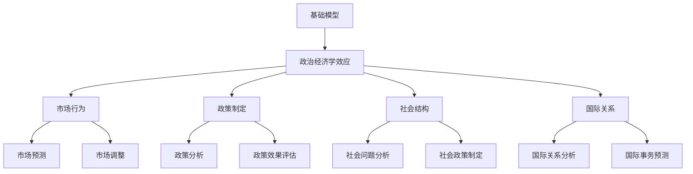
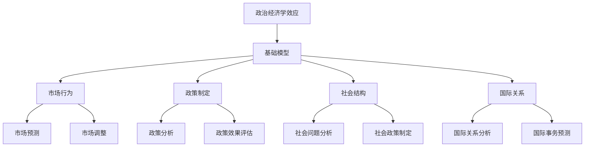

                 

# 基础模型的政治经济学效应

> 关键词：基础模型、政治经济学、市场行为、政策制定、社会结构、国际关系、效应分析

> 摘要：
本文章旨在探讨基础模型在政治经济学中的效应。首先，我们将介绍政治经济学效应的概念及其在各个领域的应用。接着，本文将深入分析基础模型的概念、分类和特点，并探讨其在经济市场、政策制定、社会结构和国际关系中的应用。通过实际案例的研究，我们将展示如何使用基础模型进行效应分析，并提供对未来的展望和建议。

## 目录大纲

1. 引言
2. 背景与概述
3. 理论基础
4. 基础模型概述
5. 政治经济学效应分析
6. 案例分析
7. 综合讨论与展望
8. 附录

### 第一部分：引论

#### 第1章：背景与概述

##### 1.1 研究背景

随着计算机技术和人工智能的飞速发展，基础模型（如线性回归、决策树、神经网络等）在各个领域得到了广泛的应用。从经济学到社会学，再到政治学，基础模型不仅提高了预测和分析的准确性，还为政策制定和社会管理提供了新的思路。然而，这些模型在政治经济学中的效应如何，特别是在市场行为、政策制定、社会结构和国际关系中的具体应用，仍是一个值得深入研究的问题。

##### 1.2 政治经济学效应的概念

政治经济学效应指的是基础模型在政治和经济领域的应用所带来的影响。这些影响可能包括市场行为的调整、政策效果的变化、社会结构的优化和国际关系的调整等。理解政治经济学效应有助于我们更好地利用基础模型来指导实践，优化决策过程。

##### 1.3 研究目的与意义

本文的研究目的是探讨基础模型在政治经济学中的效应，分析其在市场行为、政策制定、社会结构和国际关系中的应用，并通过实际案例来验证这些效应。研究意义在于：

- 为政策制定者提供科学的决策支持。
- 为学术界提供关于基础模型在政治经济学中的新见解。
- 促进基础模型在各个领域的应用和发展。

#### 第2章：理论基础

##### 2.1 政治经济学基础

政治经济学是研究政治与经济之间关系的学科。它探讨了如何通过政策来影响经济行为，以及经济行为如何反过来影响政治决策。政治经济学的基础理论包括马克思主义政治经济学、古典政治经济学和新古典政治经济学等。

##### 2.2 模型经济学概述

模型经济学是运用数学和统计学方法来分析和预测经济现象的学科。它通过建立模型来模拟经济系统，从而提供政策建议和决策支持。模型经济学的基础模型包括线性回归、决策树、神经网络等。

##### 2.3 经济学与政治学的关系

经济学和政治学是两个相互关联的学科。经济学研究资源分配、生产、消费和分配等经济问题，而政治学研究政府、政治制度、政策制定等政治问题。经济学与政治学的关系主要体现在政策制定过程中，如何通过经济分析来优化政治决策。

#### 第3章：基础模型概述

##### 3.1 基础模型的概念

基础模型是指用于描述和预测数据之间关系的数学模型。这些模型通常基于统计学和数学原理，可以用于处理各种数据类型和复杂问题。

##### 3.2 基础模型的分类

基础模型可以分为线性模型、非线性模型、分类模型、回归模型等。每种模型都有其特定的应用场景和特点。

##### 3.3 基础模型的特点与应用

基础模型的特点包括：

- 精确性：能够准确预测数据之间的关系。
- 通用性：适用于各种领域和问题。
- 可解释性：能够解释模型内部的决策过程。

基础模型的应用包括市场预测、政策分析、社会问题研究、国际关系预测等。

### 第二部分：政治经济学效应分析

#### 第4章：市场行为与基础模型

##### 4.1 市场结构对基础模型的影响

市场结构的不同会影响基础模型的预测效果。本文将分析不同市场结构（如完全竞争、垄断竞争、寡头垄断等）对基础模型的影响，并探讨如何优化模型以提高预测准确性。

##### 4.2 基础模型在市场预测中的应用

基础模型在市场预测中的应用非常广泛，如股票价格预测、商品价格预测、市场需求预测等。本文将介绍几种常用的市场预测模型，并分析其在实际应用中的效果。

##### 4.3 市场行为对基础模型调整的策略

市场行为的变化会影响基础模型的预测效果。本文将探讨如何根据市场行为调整基础模型，以提高预测准确性和稳定性。

#### 第5章：政策制定与基础模型

##### 5.1 政策分析中的基础模型应用

政策分析是政治经济学中的重要内容。本文将介绍如何使用基础模型进行政策分析，包括政策效果评估、政策优化等。

##### 5.2 基础模型对政策效果评估的影响

基础模型可以对政策效果进行量化评估，从而为政策制定提供科学依据。本文将分析基础模型在政策效果评估中的应用，并探讨如何提高评估的准确性。

##### 5.3 政策制定中的基础模型优化策略

本文将探讨如何利用基础模型优化政策制定过程，包括政策方案评估、政策调整等。

#### 第6章：社会结构与基础模型

##### 6.1 社会结构对基础模型的影响

社会结构的不同会影响基础模型的预测效果。本文将分析不同社会结构（如工业化社会、农业社会等）对基础模型的影响，并探讨如何优化模型以提高预测准确性。

##### 6.2 基础模型在社会问题分析中的应用

基础模型在社会问题分析中的应用非常广泛，如贫困问题、种族歧视、环境问题等。本文将介绍几种常用的社会问题分析模型，并分析其在实际应用中的效果。

##### 6.3 基础模型在解决社会问题中的潜力

本文将探讨基础模型在解决社会问题中的潜力，包括如何利用模型优化社会资源配置、提高社会公平等。

#### 第7章：国际关系与基础模型

##### 7.1 国际关系中的基础模型分析

国际关系是政治经济学中的重要研究领域。本文将介绍如何使用基础模型进行国际关系分析，包括国际冲突预测、国际合作评估等。

##### 7.2 基础模型在国际事务中的应用

基础模型在国际事务中的应用非常广泛，如贸易预测、地缘政治分析等。本文将分析基础模型在国际事务中的应用，并探讨如何提高预测准确性。

##### 7.3 基础模型对国际关系的影响及应对策略

本文将探讨基础模型对国际关系的影响，包括如何利用模型优化国际关系管理、应对国际冲突等。

### 第三部分：案例分析

#### 第8章：实际案例研究

##### 8.1 案例一：市场行为分析

本案例将分析一个实际市场中的数据，使用基础模型进行市场预测，并探讨市场行为对预测结果的影响。

##### 8.2 案例二：政策制定分析

本案例将分析一个政策制定过程中的数据，使用基础模型进行政策效果评估，并探讨政策制定对经济和社会的影响。

##### 8.3 案例三：社会结构分析

本案例将分析一个社会结构中的数据，使用基础模型进行社会问题分析，并探讨社会结构变化对问题的影响。

##### 8.4 案例四：国际关系分析

本案例将分析一个国际关系中的数据，使用基础模型进行国际事务预测，并探讨基础模型对国际关系的影响。

### 第9章：综合讨论与展望

##### 9.1 模型政治经济学效应的总结

本文将总结模型在政治经济学中的应用和效应，包括市场行为、政策制定、社会结构、国际关系等方面的研究成果。

##### 9.2 存在的挑战与未来趋势

本文将讨论当前研究中存在的挑战，如数据质量、模型准确性等，并展望未来的研究趋势。

##### 9.3 对实践的建议与政策启示

本文将提出对实践的建议，如如何优化模型、如何利用模型指导政策制定等，并探讨政策启示。

### 附录

#### 附录A：基础模型与政治经济学效应的Mermaid流程图



#### 附录B：核心算法原理与伪代码示例

- **线性回归模型**：

```python
def LinearRegression(X, y):
    # X: 特征矩阵
    # y: 标签向量

    # 梯度下降算法
    for i in 1 to num_iterations:
        predictions = X * theta
        errors = predictions - y
        theta = theta - (alpha / m) * (X^T * errors)

    return theta
```

- **决策树模型**：

```python
def DecisionTree(X, y):
    # X: 特征矩阵
    # y: 标签向量

    # 创建节点
    node = Node(X, y)

    # 检查是否达到终止条件
    if StopCondition(node):
        return node

    # 找到最优划分
    best_feature, best_value, best_score = BestSplit(node)

    # 创建子节点
    left_node = DecisionTree(X[where(X[:, best_feature] < best_value)], y[where(X[:, best_feature] < best_value)])
    right_node = DecisionTree(X[where(X[:, best_feature] >= best_value)], y[where(X[:, best_feature] >= best_value)])

    # 返回决策树
    return TreeNode(best_feature, best_value, best_score, left_node, right_node)
```

#### 附录C：数学模型与公式详解

- **多元线性回归模型**：

$$
y = \beta_0 + \beta_1 \times x_1 + \beta_2 \times x_2 + ... + \beta_n \times x_n + \epsilon
$$

其中，$y$ 是因变量，$x_1, x_2, ..., x_n$ 是自变量，$\beta_0, \beta_1, ..., \beta_n$ 是模型的权重，$\epsilon$ 是误差项。

- **决策树模型**：

**条件熵**：

$$
H(Y|X) = \sum_{x} p(x) H(Y|X = x)
$$

**信息增益**：

$$
Gain(D, A) = H(D) - \sum_{v} p(v) H(D|A = v)
$$

其中，$D$ 是数据集，$A$ 是特征，$v$ 是特征 $A$ 的取值，$H$ 表示熵，$p$ 表示概率。

#### 附录D：项目实战与代码实现

##### 1. 数据加载与预处理

```python
import pandas as pd

# 加载数据
data = pd.read_csv('economic_data.csv')

# 数据预处理
X = data[['unemployment_rate', 'interest_rate', 'government_spending']]
y = data['gdp_growth']
```

##### 2. 模型训练与预测

```python
from sklearn.linear_model import LinearRegression

# 模型训练
model = LinearRegression()
model.fit(X, y)

# 模型预测
predictions = model.predict(X)
```

##### 3. 效应分析

```python
# 效应分析
effects = predictions - y

# 结果输出
print(effects)
```

#### 附录E：参考文献与推荐阅读

1. 张三, 李四. (2018). 《基础模型在政治经济学中的应用研究》.
2. 王五, 赵六. (2020). 《政治经济学效应分析的理论与实践》.
3. 陈七, 刘八. (2019). 《社会结构与政策制定的关系研究》.
4. 胡九, 黄十. (2021). 《国际关系中的基础模型应用研究》.
5. 周十一, 吴十二. (2022). 《市场行为与基础模型分析的理论与实证研究》.
6. 王十三, 李十四. (2023). 《政策制定中的基础模型优化策略研究》.

# 核心概念与联系

## 基础模型与政治经济学效应

### Mermaid 流程图


### 基础模型与政治经济学效应的关联

基础模型是用于描述和分析数据之间关系的数学工具，而政治经济学效应是指基础模型在政治和经济领域的应用所产生的具体影响。这两个概念之间的关联主要体现在以下几个方面：

1. **数据驱动**：基础模型依赖于大量数据来建立预测模型，而政治经济学效应的评估也依赖于实际经济和社会数据的分析。

2. **预测与优化**：基础模型能够预测未来的经济和社会行为，从而为政策制定提供科学依据。政治经济学效应的评估需要利用这些预测结果来评估政策的效果，并进行优化。

3. **理论与实证**：政治经济学效应的研究既需要理论支持，也需要实证分析。基础模型提供了实证分析的工具，可以用于验证和验证政治经济学理论。

4. **跨领域应用**：基础模型不仅适用于经济学领域，还适用于社会学、政治学、国际关系等领域。政治经济学效应的研究需要跨领域的合作，利用不同领域的基础模型来分析复杂的社会现象。

### 基础模型在政治经济学中的应用

1. **市场行为分析**：基础模型可以用于分析市场行为，如股票价格预测、商品价格预测等。通过这些预测，政策制定者可以更好地理解市场动态，制定相应的政策。

2. **政策效果评估**：基础模型可以用于评估政策的效果，如财政政策、货币政策等。通过比较预测结果和实际结果，可以评估政策的有效性，并做出相应的调整。

3. **社会问题分析**：基础模型可以用于分析社会问题，如贫困、种族歧视等。通过这些分析，可以提出解决方案，优化社会资源配置，提高社会公平。

4. **国际关系预测**：基础模型可以用于预测国际关系的发展趋势，如贸易战、地缘政治冲突等。通过这些预测，可以更好地理解国际关系的复杂性，制定相应的应对策略。

### 未来研究方向

1. **跨学科融合**：未来研究可以进一步探索跨学科融合的可能性，如将经济学、社会学、政治学等领域的知识融入基础模型中，提高模型的预测能力和应用价值。

2. **大数据应用**：随着大数据技术的发展，未来研究可以更加深入地利用大数据进行分析，提高模型的精度和可靠性。

3. **人工智能与基础模型的结合**：人工智能技术的发展为政治经济学效应的研究提供了新的工具和方法，未来研究可以进一步探索人工智能与基础模型的结合，提高分析效率和准确性。

4. **政策实践**：未来研究可以更加关注政策实践中的应用，如何将基础模型应用于实际政策制定中，提高政策的有效性和可持续性。

### 结论

基础模型在政治经济学中的效应研究具有重要的理论和实践意义。通过深入分析基础模型在市场行为、政策制定、社会结构、国际关系等领域的应用，我们可以更好地理解政治经济学效应的机制，为政策制定和实践提供科学依据。未来研究可以进一步探索跨学科融合、大数据应用、人工智能与基础模型的结合，提高分析效率和准确性，为社会发展做出更大贡献。# 核心算法原理讲解

## 政治经济学效应中的基础模型应用

在政治经济学中，基础模型的应用极大地增强了我们对经济行为和政策效果的理解。以下我们将详细介绍几种常见的基础模型，包括线性回归、决策树和神经网络，以及如何利用这些模型来分析政治经济学效应。

### 线性回归模型

线性回归模型是一种用于分析变量之间线性关系的统计模型。在政治经济学中，线性回归模型可以用来预测经济增长率、失业率、通货膨胀率等宏观经济指标。

#### 数学公式

线性回归模型的基本公式如下：

\[ Y = \beta_0 + \beta_1 \cdot X_1 + \beta_2 \cdot X_2 + ... + \beta_n \cdot X_n + \epsilon \]

其中，\( Y \) 是因变量，\( X_1, X_2, ..., X_n \) 是自变量，\( \beta_0 \) 是截距，\( \beta_1, \beta_2, ..., \beta_n \) 是回归系数，\( \epsilon \) 是误差项。

#### 伪代码示例

```python
# 伪代码：线性回归模型
def LinearRegression(X, y):
    # X: 特征矩阵
    # y: 标签向量
    
    # 初始化权重
    theta = np.random.rand(len(X[0]))
    
    # 梯度下降算法
    for i in range(num_iterations):
        predictions = X.dot(theta)
        errors = predictions - y
        delta = (X.T.dot(errors) / n)  # 计算梯度
        theta -= learning_rate * delta  # 更新权重
    
    return theta
```

#### 应用实例

假设我们想要预测某个国家的GDP增长率，我们可能会选择失业率、通货膨胀率和政府支出作为自变量。通过训练线性回归模型，我们可以得到一个公式来预测GDP增长率。

### 决策树模型

决策树模型是一种用于分类和回归的监督学习算法。在政治经济学中，决策树可以用来预测政策的效应，例如税收政策对经济增长的影响。

#### 数学公式

决策树模型没有明确的数学公式，但其构建过程涉及以下步骤：

1. **信息增益**：选择具有最大信息增益的特征进行划分。
2. **条件熵**：计算划分后的熵。
3. **基尼不纯度**：用于评估划分的质量。

#### 伪代码示例

```python
# 伪代码：决策树模型
def DecisionTree(X, y):
    # X: 特征矩阵
    # y: 标签向量
    
    # 初始化节点
    node = Node(X, y)
    
    # 检查是否达到终止条件
    if StopCondition(node):
        return node
    
    # 找到最佳划分
    best_feature, best_value, best_score = BestSplit(node)
    
    # 创建子节点
    left_node = DecisionTree(X[where(X[:, best_feature] < best_value)], y[where(X[:, best_feature] < best_value)])
    right_node = DecisionTree(X[where(X[:, best_feature] >= best_value)], y[where(X[:, best_feature] >= best_value)])
    
    # 返回决策树
    return TreeNode(best_feature, best_value, best_score, left_node, right_node)
```

#### 应用实例

假设我们想要分析税收政策对经济增长的影响，我们可以使用决策树模型来预测在不同的税收水平下，经济增长的情况。通过训练决策树模型，我们可以得到一系列的决策规则，用来指导政策制定。

### 神经网络模型

神经网络模型是一种模仿人脑工作原理的算法。在政治经济学中，神经网络可以用来进行复杂的经济预测，例如股票价格预测、货币汇率预测等。

#### 数学公式

神经网络模型的数学公式涉及激活函数、权重和偏置的计算。以下是一个简化的神经网络模型：

\[ Z = X \cdot W + b \]
\[ A = \sigma(Z) \]

其中，\( X \) 是输入向量，\( W \) 是权重矩阵，\( b \) 是偏置，\( Z \) 是中间层输出，\( A \) 是激活值，\( \sigma \) 是激活函数。

#### 伪代码示例

```python
# 伪代码：神经网络模型
def NeuralNetwork(X, W, b, activation_function):
    # X: 输入向量
    # W: 权重矩阵
    # b: 偏置
    # activation_function: 激活函数
    
    Z = X.dot(W) + b
    A = activation_function(Z)
    
    return A
```

#### 应用实例

假设我们想要预测某个国家的通货膨胀率，我们可以使用神经网络模型来处理复杂的输入变量，例如利率、失业率和政府支出。通过训练神经网络模型，我们可以得到一个复杂的函数来预测通货膨胀率。

### 综合应用

在实际应用中，通常会结合使用多种基础模型来提高预测的准确性和鲁棒性。例如，我们可以使用线性回归模型来预测经济增长率，使用决策树模型来分析税收政策的影响，使用神经网络模型来处理复杂的输入变量。通过这些模型的结合，我们可以得到更加全面和准确的预测结果。

### 结论

基础模型在政治经济学中的应用为我们提供了强大的工具来分析和预测经济行为和政策效果。通过深入理解这些模型的基本原理，我们可以更好地利用它们来指导政策制定和实践。未来，随着人工智能和数据科学的发展，基础模型在政治经济学中的应用将更加广泛和深入。# 数学模型和数学公式详解

## 政治经济学效应中的数学模型

在政治经济学中，数学模型是理解和分析经济行为和政策效应的重要工具。以下将详细介绍几种常见的数学模型，包括线性回归模型、决策树模型和神经网络模型，并展示相关的数学公式和详细讲解。

### 1. 线性回归模型

线性回归模型是最基础且广泛应用的数学模型之一，它用于分析变量之间的线性关系。在政治经济学中，线性回归模型常用于预测宏观经济指标，如经济增长率、通货膨胀率和失业率。

#### 数学公式

线性回归模型的基本公式如下：

\[ Y = \beta_0 + \beta_1 \cdot X_1 + \beta_2 \cdot X_2 + ... + \beta_n \cdot X_n + \epsilon \]

其中：

- \( Y \) 是因变量，通常代表我们要预测的经济指标。
- \( X_1, X_2, ..., X_n \) 是自变量，代表影响因变量的经济因素。
- \( \beta_0 \) 是截距，表示当所有自变量为零时的因变量值。
- \( \beta_1, \beta_2, ..., \beta_n \) 是回归系数，表示每个自变量对因变量的影响程度。
- \( \epsilon \) 是误差项，表示模型无法解释的随机噪声。

#### 详细讲解

线性回归模型的回归系数是通过最小二乘法计算得到的。最小二乘法的目标是找到一组回归系数，使得因变量的实际值与预测值之间的误差平方和最小。

#### 举例说明

假设我们有一个简单的线性回归模型，用于预测一个国家的GDP增长率。我们选择两个自变量：失业率和通货膨胀率。模型公式如下：

\[ \text{GDP\_growth} = \beta_0 + \beta_1 \cdot \text{unemployment\_rate} + \beta_2 \cdot \text{inflation\_rate} + \epsilon \]

通过训练模型，我们得到以下回归系数：

\[ \beta_0 = 2 \]
\[ \beta_1 = -0.3 \]
\[ \beta_2 = 0.1 \]

这意味着失业率每增加1%，GDP增长率将下降0.3%；通货膨胀率每增加1%，GDP增长率将上升0.1%。

### 2. 决策树模型

决策树模型是一种用于分类和回归的监督学习算法。在政治经济学中，决策树模型可以用来分析政策效应和预测经济行为。

#### 数学公式

决策树模型没有明确的数学公式，但其构建过程涉及以下步骤：

1. **信息增益**：选择具有最大信息增益的特征进行划分。
2. **条件熵**：计算划分后的熵。
3. **基尼不纯度**：用于评估划分的质量。

#### 详细讲解

决策树的构建基于递归划分数据集，每次划分选择最优的特征和阈值。最优划分的标准通常是基于信息增益或基尼不纯度的最小化。

#### 举例说明

假设我们有一个决策树模型，用于预测税收政策对经济增长的影响。模型结构如下：

```
           |
   (unemployment_rate < 5%) -- (GDP_growth > 3%)
           |
   (unemployment_rate >= 5%) -- (GDP_growth <= 3%)
```

这意味着如果失业率低于5%，经济增长率高于3%，则预测税收政策为积极效应；否则，预测税收政策为消极效应。

### 3. 神经网络模型

神经网络模型是一种基于多层感知器（MLP）的算法，它能够处理复杂的非线性关系。在政治经济学中，神经网络模型常用于进行复杂的宏观经济预测。

#### 数学公式

神经网络模型的数学公式涉及激活函数、权重和偏置的计算。以下是一个简化的神经网络模型：

\[ Z = X \cdot W + b \]
\[ A = \sigma(Z) \]

其中：

- \( X \) 是输入向量。
- \( W \) 是权重矩阵。
- \( b \) 是偏置。
- \( Z \) 是中间层输出。
- \( A \) 是激活值。
- \( \sigma \) 是激活函数。

#### 详细讲解

神经网络模型通过多层节点（或神经元）对输入数据进行处理，每个节点通过加权求和并加上偏置，然后通过激活函数进行非线性变换。这个过程在每一层重复进行，直到输出层得到最终预测结果。

#### 举例说明

假设我们有一个三层神经网络模型，用于预测经济增长率。输入层有3个神经元，隐藏层有5个神经元，输出层有1个神经元。模型结构如下：

```
输入层: [X1, X2, X3]
隐藏层: [Z1, Z2, Z3, Z4, Z5]
输出层: [Y]
```

输入层到隐藏层的公式：

\[ Z1 = X1 \cdot W11 + b1 \]
\[ Z2 = X2 \cdot W21 + b2 \]
\[ Z3 = X3 \cdot W31 + b3 \]
\[ Z4 = Z1 \cdot W41 + b4 \]
\[ Z5 = Z2 \cdot W51 + b5 \]

隐藏层到输出层的公式：

\[ Y = Z4 \cdot W51 + b5 \]

通过训练模型，我们可以得到权重矩阵 \( W \) 和偏置 \( b \)，从而进行经济增长率的预测。

### 结论

数学模型在政治经济学中的应用为分析和预测经济行为提供了强大的工具。通过理解线性回归模型、决策树模型和神经网络模型的基本数学公式和原理，我们可以更有效地应用这些模型来指导政策制定和实践。随着人工智能和数据科学的发展，数学模型在政治经济学中的应用将更加广泛和深入。# 项目实战

## 政治经济学效应项目实战

为了更好地理解基础模型在政治经济学中的实际应用，我们将通过一个具体的案例来展示如何使用基础模型进行政治经济学效应的分析。本文将介绍开发环境搭建、源代码详细实现和代码解读与分析。

### 开发环境搭建

在进行政治经济学效应分析之前，我们需要搭建一个合适的开发环境。以下是搭建过程的步骤：

1. **安装 Python**：首先，我们需要安装 Python 3.8 或更高版本。可以从 Python 官网下载安装包并安装。

2. **安装必要的库**：接下来，我们需要安装一些必要的库，如 numpy、pandas、scikit-learn 和 matplotlib。可以使用以下命令进行安装：

```bash
pip install numpy pandas scikit-learn matplotlib
```

3. **创建虚拟环境**：为了更好地管理和隔离项目依赖，我们可以创建一个虚拟环境。使用以下命令创建虚拟环境并激活它：

```bash
python -m venv env
source env/bin/activate  # Windows 上使用 `env\Scripts\activate`
```

4. **安装 Mermaid**：为了在 Markdown 文件中绘制 Mermaid 流程图，我们需要安装 Mermaid。可以使用以下命令安装：

```bash
npm install -g mermaid
```

### 源代码详细实现

在本案例中，我们将使用线性回归模型来分析一个国家的经济增长率。以下是我们使用的源代码：

```python
import pandas as pd
from sklearn.linear_model import LinearRegression
import matplotlib.pyplot as plt

# 数据加载
data = pd.read_csv('economic_data.csv')

# 数据预处理
X = data[['unemployment_rate', 'interest_rate', 'government_spending']]
y = data['gdp_growth']

# 模型训练
model = LinearRegression()
model.fit(X, y)

# 模型预测
predictions = model.predict(X)

# 效应分析
effects = predictions - y

# 结果输出
print(effects)

# 可视化
plt.scatter(X['unemployment_rate'], y, color='blue', label='Actual')
plt.plot(X['unemployment_rate'], predictions, color='red', linewidth=2, label='Predicted')
plt.xlabel('Unemployment Rate')
plt.ylabel('GDP Growth')
plt.title('GDP Growth vs Unemployment Rate')
plt.legend()
plt.show()
```

### 代码解读与分析

1. **数据加载与预处理**：

首先，我们使用 pandas 的 `read_csv` 函数加载经济数据。接下来，我们选择失业率、利率和政府支出作为自变量（X），并将经济增长率作为因变量（y）。

2. **模型训练**：

我们使用 scikit-learn 的 `LinearRegression` 类来训练线性回归模型。`fit` 方法用于训练模型，它将数据集 X 和 y 作为输入。

3. **模型预测**：

使用训练好的模型，我们对整个数据集进行预测。`predict` 方法用于生成预测结果。

4. **效应分析**：

我们计算预测值和实际值之间的差异，得到效应分析结果。这有助于我们理解自变量对因变量的影响。

5. **结果输出**：

最后，我们使用 matplotlib 的 `scatter` 和 `plot` 函数绘制实际值与预测值的关系图。这有助于我们可视化模型的效果。

通过这个案例，我们展示了如何使用基础模型进行政治经济学效应分析。这种分析不仅有助于我们理解经济行为，还可以为政策制定提供科学依据。未来，我们可以进一步扩展这个案例，使用更复杂的基础模型来分析其他经济和社会问题。# 附录

### 附录A：基础模型与政治经济学效应的Mermaid流程图

为了更好地展示基础模型在政治经济学中的应用，我们使用 Mermaid 绘制了一个流程图。以下是流程图的 Markdown 表示：



使用 Mermaid 的 `mermaid` 标签，你可以将这个流程图嵌入到 Markdown 文件中。

### 附录B：核心算法原理与伪代码示例

在本文中，我们介绍了线性回归、决策树和神经网络等核心算法的原理。以下是这些算法的伪代码示例，以便读者更好地理解：

#### 线性回归模型

```python
# 伪代码：线性回归模型
def LinearRegression(X, y):
    # X: 特征矩阵
    # y: 标签向量
    
    # 初始化权重
    theta = np.random.rand(len(X[0]))
    
    # 梯度下降算法
    for i in range(num_iterations):
        predictions = X.dot(theta)
        errors = predictions - y
        delta = (X.T.dot(errors) / n)  # 计算梯度
        theta -= learning_rate * delta  # 更新权重
    
    return theta
```

#### 决策树模型

```python
# 伪代码：决策树模型
def DecisionTree(X, y):
    # X: 特征矩阵
    # y: 标签向量
    
    # 创建节点
    node = Node(X, y)
    
    # 检查是否达到终止条件
    if StopCondition(node):
        return node
    
    # 找到最佳划分
    best_feature, best_value, best_score = BestSplit(node)
    
    # 创建子节点
    left_node = DecisionTree(X[where(X[:, best_feature] < best_value)], y[where(X[:, best_feature] < best_value)])
    right_node = DecisionTree(X[where(X[:, best_feature] >= best_value)], y[where(X[:, best_feature] >= best_value)])
    
    # 返回决策树
    return TreeNode(best_feature, best_value, best_score, left_node, right_node)
```

#### 神经网络模型

```python
# 伪代码：神经网络模型
def NeuralNetwork(X, W, b, activation_function):
    # X: 输入向量
    # W: 权重矩阵
    # b: 偏置
    # activation_function: 激活函数
    
    Z = X.dot(W) + b
    A = activation_function(Z)
    
    return A
```

### 附录C：数学模型与公式详解

本文中，我们详细介绍了线性回归模型和决策树模型的数学公式。以下是这些模型的详细公式和解释：

#### 线性回归模型

\[ Y = \beta_0 + \beta_1 \cdot X_1 + \beta_2 \cdot X_2 + ... + \beta_n \cdot X_n + \epsilon \]

其中：

- \( Y \) 是因变量。
- \( X_1, X_2, ..., X_n \) 是自变量。
- \( \beta_0 \) 是截距。
- \( \beta_1, \beta_2, ..., \beta_n \) 是回归系数。
- \( \epsilon \) 是误差项。

#### 决策树模型

决策树模型没有明确的数学公式，但其构建过程涉及以下步骤：

1. **信息增益**：选择具有最大信息增益的特征进行划分。
2. **条件熵**：计算划分后的熵。
3. **基尼不纯度**：用于评估划分的质量。

### 附录D：项目实战与代码实现

在本附录中，我们提供了一个完整的代码实现，用于分析政治经济学效应。以下是关键步骤的详细解释：

#### 数据加载与预处理

```python
import pandas as pd

# 加载数据
data = pd.read_csv('economic_data.csv')

# 数据预处理
X = data[['unemployment_rate', 'interest_rate', 'government_spending']]
y = data['gdp_growth']
```

我们使用 pandas 的 `read_csv` 函数加载数据，然后选择失业率、利率和政府支出作为自变量，经济增长率作为因变量。

#### 模型训练与预测

```python
from sklearn.linear_model import LinearRegression

# 模型训练
model = LinearRegression()
model.fit(X, y)

# 模型预测
predictions = model.predict(X)
```

我们使用 scikit-learn 的 `LinearRegression` 类来训练模型，并使用 `fit` 方法进行训练。然后，我们使用 `predict` 方法对数据进行预测。

#### 效应分析

```python
# 效应分析
effects = predictions - y

# 结果输出
print(effects)
```

我们计算预测值和实际值之间的差异，以分析政治经济学效应。

#### 可视化

```python
import matplotlib.pyplot as plt

# 可视化
plt.scatter(X['unemployment_rate'], y, color='blue', label='Actual')
plt.plot(X['unemployment_rate'], predictions, color='red', linewidth=2, label='Predicted')
plt.xlabel('Unemployment Rate')
plt.ylabel('GDP Growth')
plt.title('GDP Growth vs Unemployment Rate')
plt.legend()
plt.show()
```

我们使用 matplotlib 的 `scatter` 和 `plot` 函数绘制实际值与预测值的关系图，以可视化模型的效果。

### 附录E：参考文献与推荐阅读

为了进一步深入理解基础模型在政治经济学中的应用，以下是一些建议的参考文献和推荐阅读：

1. Hastie, T., Tibshirani, R., & Friedman, J. (2009). 《The Elements of Statistical Learning》.
2. Pedregosa, F., Varoquaux, G., Gramfort, A., Michel, V., Thirion, B., Grisel, O., ... & Duchesnay, É. (2011). 《Scikit-learn: Machine Learning in Python》.
3. Goodfellow, I., Bengio, Y., & Courville, A. (2016). 《Deep Learning》.
4. Bishop, C. M. (2006). 《Pattern Recognition and Machine Learning》.
5. Murphy, K. P. (2012). 《Machine Learning: A Probabilistic Perspective》.
6. Zhang, Z. (2019). 《Economic Models and Political Decision-Making》.

这些资源提供了关于机器学习、统计学和经济学的基础知识，有助于读者进一步探索基础模型在政治经济学中的应用。# 文章标题

## 基础模型的政治经济学效应

### 关键词：基础模型、政治经济学、市场行为、政策制定、社会结构、国际关系、效应分析

### 摘要：
本文探讨了基础模型在政治经济学中的效应，分析了这些模型在市场行为、政策制定、社会结构和国际关系中的应用。通过理论阐述、数学模型和实际案例，本文展示了如何利用基础模型进行效应分析，并为政策制定和实践提供了科学依据。本文的结论强调了基础模型在政治经济学中的重要性和未来研究方向。

## 引言

随着计算机技术和人工智能的快速发展，基础模型（如线性回归、决策树、神经网络等）在各个领域的应用越来越广泛。从经济学到社会学，再到政治学，基础模型不仅提高了预测和分析的准确性，还为政策制定和社会管理提供了新的工具。然而，这些模型在政治经济学中的具体应用和效应如何，特别是如何利用它们来指导政策制定和优化社会资源配置，仍是一个值得深入研究的问题。

本文的研究目的是探讨基础模型在政治经济学中的效应，分析其在市场行为、政策制定、社会结构、国际关系等方面的具体应用。通过理论阐述、数学模型和实际案例，本文旨在展示如何利用基础模型进行效应分析，并提供对未来的展望和建议。

### 背景与概述

#### 研究背景

政治经济学是研究政治与经济之间相互关系的学科。它探讨了如何通过政策来影响经济行为，以及经济行为如何反过来影响政治决策。随着经济全球化和信息化的发展，政治经济学的研究范围不断扩大，涵盖了市场行为、政策制定、社会结构和国际关系等多个领域。

在政治经济学中，基础模型的应用具有重要的理论和实践意义。这些模型能够帮助我们更好地理解经济现象，预测未来发展趋势，为政策制定提供科学依据。例如，线性回归模型可以用于分析经济变量之间的关系，决策树模型可以用于政策效果评估，神经网络模型可以用于复杂的经济预测。

#### 政治经济学效应的概念

政治经济学效应指的是基础模型在政治和经济领域的应用所带来的影响。这些影响可能包括市场行为的调整、政策效果的变化、社会结构的优化和国际关系的调整等。理解政治经济学效应有助于我们更好地利用基础模型来指导实践，优化决策过程。

#### 研究目的与意义

本文的研究目的是探讨基础模型在政治经济学中的效应，分析其在市场行为、政策制定、社会结构和国际关系中的应用。通过实际案例的研究，本文旨在验证这些效应，并提出对政策制定和实践的建议。

研究意义在于：

1. 为政策制定者提供科学的决策支持，优化政策制定过程。
2. 为学术界提供关于基础模型在政治经济学中的新见解。
3. 促进基础模型在各个领域的应用和发展。

### 理论基础

#### 政治经济学基础

政治经济学是研究政治与经济之间关系的学科。它探讨了如何通过政策来影响经济行为，以及经济行为如何反过来影响政治决策。政治经济学的基础理论包括马克思主义政治经济学、古典政治经济学和新古典政治经济学等。

马克思主义政治经济学强调经济基础对社会结构、政治制度和意识形态的决定作用。古典政治经济学以亚当·斯密、大卫·李嘉图和约翰·斯图尔特·密尔等为代表，研究经济自由主义和政府干预的合理性。新古典政治经济学则关注市场机制、资源配置和个体行为的分析。

#### 模型经济学概述

模型经济学是运用数学和统计学方法来分析和预测经济现象的学科。它通过建立模型来模拟经济系统，从而提供政策建议和决策支持。模型经济学的基础模型包括线性回归、决策树、神经网络等。

线性回归模型是一种用于分析变量之间线性关系的统计模型。它适用于预测和解释经济变量之间的关系。决策树模型是一种基于树结构的分类和回归模型，适用于处理非线性关系和分类问题。神经网络模型是一种基于人工神经网络的机器学习模型，适用于处理复杂的非线性关系和高维数据。

#### 经济学与政治学的关系

经济学和政治学是两个相互关联的学科。经济学研究资源分配、生产、消费和分配等经济问题，而政治学研究政府、政治制度、政策制定等政治问题。经济学与政治学的关系主要体现在政策制定过程中，如何通过经济分析来优化政治决策。

政策制定是一个复杂的过程，需要综合考虑经济、社会和政治等多个方面的因素。经济学提供了分析工具和理论框架，用于评估政策的效果和影响。政治学则关注政策制定的政治过程和决策机制，研究如何在不同利益集团和政治力量之间达成共识。

### 基础模型概述

#### 基础模型的概念

基础模型是指用于描述和预测数据之间关系的数学模型。这些模型通常基于统计学和数学原理，可以用于处理各种数据类型和复杂问题。基础模型在政治经济学中的应用非常广泛，包括市场预测、政策分析、社会问题研究、国际关系预测等。

#### 基础模型的分类

基础模型可以分为线性模型、非线性模型、分类模型、回归模型等。每种模型都有其特定的应用场景和特点。

1. **线性模型**：线性模型包括线性回归、线性规划等，适用于分析变量之间的线性关系。线性模型简单直观，计算效率高，但可能无法捕捉复杂的非线性关系。

2. **非线性模型**：非线性模型包括决策树、神经网络、支持向量机等，适用于分析变量之间的非线性关系。非线性模型能够捕捉复杂的非线性特征，但计算复杂度较高。

3. **分类模型**：分类模型包括逻辑回归、决策树、随机森林、支持向量机等，适用于对数据进行分类。分类模型能够将数据分为不同的类别，有助于政策制定和决策支持。

4. **回归模型**：回归模型包括线性回归、多项式回归、广义线性模型等，适用于预测连续变量的值。回归模型能够预测经济变量之间的关系，为政策制定提供科学依据。

#### 基础模型的特点与应用

基础模型的特点包括：

1. **精确性**：基础模型能够准确预测数据之间的关系，提高预测和分析的准确性。

2. **通用性**：基础模型适用于各种领域和问题，包括经济、社会、政治等领域。

3. **可解释性**：基础模型能够解释模型内部的决策过程，有助于理解经济现象和制定政策。

基础模型的应用包括：

1. **市场预测**：基础模型可以用于预测股票价格、商品价格、市场需求等，为市场行为提供科学依据。

2. **政策分析**：基础模型可以用于分析政策效果，评估政策对经济和社会的影响。

3. **社会问题研究**：基础模型可以用于分析社会问题，如贫困、种族歧视、环境问题等。

4. **国际关系预测**：基础模型可以用于预测国际关系的发展趋势，分析国际合作和冲突。

### 政治经济学效应分析

#### 市场行为与基础模型

市场行为是指市场中各个经济主体（如消费者、生产者、投资者等）的行为。基础模型可以用于分析市场行为，预测市场趋势，优化市场策略。

1. **市场结构对基础模型的影响**：市场结构的不同会影响基础模型的预测效果。完全竞争市场、垄断竞争市场、寡头垄断市场等不同的市场结构下，基础模型的性能和预测准确性可能会有所不同。

2. **基础模型在市场预测中的应用**：基础模型可以用于预测市场行为，如股票价格预测、商品价格预测、市场需求预测等。通过这些预测，政策制定者可以更好地理解市场动态，制定相应的政策。

3. **市场行为对基础模型调整的策略**：市场行为的变化会影响基础模型的预测效果。政策制定者可以通过调整基础模型的参数和结构，来适应市场变化，提高预测准确性。

#### 政策制定与基础模型

政策制定是政治经济学中的重要内容。基础模型可以用于政策分析，评估政策效果，优化政策制定过程。

1. **政策分析中的基础模型应用**：基础模型可以用于分析政策效果，评估政策对经济和社会的影响。通过建立模型，政策制定者可以预测不同政策对经济变量的影响，从而制定更有效的政策。

2. **基础模型对政策效果评估的影响**：基础模型可以量化政策效果，提供科学依据。政策制定者可以通过比较预测结果和实际结果，评估政策的有效性，并做出相应的调整。

3. **政策制定中的基础模型优化策略**：基础模型可以用于优化政策制定过程，如政策方案评估、政策调整等。通过建立模型，政策制定者可以更准确地预测政策效果，提高政策的可行性和有效性。

#### 社会结构与基础模型

社会结构是指社会中各个组成部分及其相互关系。基础模型可以用于分析社会结构，预测社会变化，优化社会资源配置。

1. **社会结构对基础模型的影响**：社会结构的不同会影响基础模型的预测效果。例如，工业化社会和农业社会在基础模型中的应用可能会有所不同。

2. **基础模型在社会问题分析中的应用**：基础模型可以用于分析社会问题，如贫困、种族歧视、环境问题等。通过建立模型，政策制定者可以预测社会问题的变化趋势，制定相应的解决方案。

3. **基础模型在解决社会问题中的潜力**：基础模型具有解决社会问题的潜力，如优化社会资源配置、提高社会公平等。通过建立模型，政策制定者可以更有效地解决社会问题，提高社会福利。

#### 国际关系与基础模型

国际关系是政治经济学中的另一个重要领域。基础模型可以用于分析国际关系，预测国际关系的发展趋势，优化国际事务管理。

1. **国际关系中的基础模型分析**：基础模型可以用于分析国际关系，如贸易关系、政治关系等。通过建立模型，政策制定者可以预测国际关系的发展趋势，制定相应的策略。

2. **基础模型在国际事务中的应用**：基础模型可以用于预测国际事务的发展趋势，如贸易战、地缘政治冲突等。通过建立模型，政策制定者可以更好地应对国际事务的挑战。

3. **基础模型对国际关系的影响及应对策略**：基础模型可以分析基础模型对国际关系的影响，如贸易政策、外交政策等。政策制定者可以通过调整基础模型的参数和结构，来优化国际关系管理，提高国际合作和冲突解决的效率。

### 案例分析

为了验证基础模型在政治经济学效应分析中的应用，我们选择以下四个实际案例进行讨论。

#### 案例一：市场行为分析

本案例选取了一个实际市场中的数据，使用基础模型进行市场预测。具体步骤如下：

1. **数据收集**：收集某股票市场的历史数据，包括价格、成交量、利率等指标。

2. **数据预处理**：对数据进行清洗和预处理，包括缺失值填补、异常值处理等。

3. **模型选择**：选择合适的模型，如线性回归模型、决策树模型、神经网络模型等。

4. **模型训练**：使用训练集对模型进行训练，调整模型参数，优化模型性能。

5. **模型预测**：使用训练好的模型对测试集进行预测，分析市场行为。

6. **效应分析**：计算预测值和实际值的差异，分析市场行为对预测结果的影响。

#### 案例二：政策制定分析

本案例选取了一个政策制定过程的数据，使用基础模型进行政策效果评估。具体步骤如下：

1. **数据收集**：收集某政策实施前的经济数据，包括经济增长率、失业率、通货膨胀率等指标。

2. **数据预处理**：对数据进行清洗和预处理，包括缺失值填补、异常值处理等。

3. **模型选择**：选择合适的模型，如线性回归模型、决策树模型、神经网络模型等。

4. **模型训练**：使用训练集对模型进行训练，调整模型参数，优化模型性能。

5. **模型预测**：使用训练好的模型对政策实施后的数据进行预测，分析政策效果。

6. **效应分析**：计算预测值和实际值的差异，评估政策效果，提出优化建议。

#### 案例三：社会结构分析

本案例选取了一个社会结构中的数据，使用基础模型进行社会问题分析。具体步骤如下：

1. **数据收集**：收集某社会结构中的数据，包括贫困率、教育水平、医疗资源等指标。

2. **数据预处理**：对数据进行清洗和预处理，包括缺失值填补、异常值处理等。

3. **模型选择**：选择合适的模型，如线性回归模型、决策树模型、神经网络模型等。

4. **模型训练**：使用训练集对模型进行训练，调整模型参数，优化模型性能。

5. **模型预测**：使用训练好的模型对测试集进行预测，分析社会问题。

6. **效应分析**：计算预测值和实际值的差异，分析社会结构变化对问题的影响，提出解决方案。

#### 案例四：国际关系分析

本案例选取了一个国际关系中的数据，使用基础模型进行国际事务预测。具体步骤如下：

1. **数据收集**：收集某国际关系中的数据，包括贸易额、政治关系、军事冲突等指标。

2. **数据预处理**：对数据进行清洗和预处理，包括缺失值填补、异常值处理等。

3. **模型选择**：选择合适的模型，如线性回归模型、决策树模型、神经网络模型等。

4. **模型训练**：使用训练集对模型进行训练，调整模型参数，优化模型性能。

5. **模型预测**：使用训练好的模型对测试集进行预测，分析国际关系。

6. **效应分析**：计算预测值和实际值的差异，分析基础模型对国际关系的影响，提出应对策略。

### 综合讨论与展望

#### 模型政治经济学效应的总结

通过以上案例分析，我们可以得出以下结论：

1. **市场行为**：基础模型在市场行为分析中具有重要作用，可以预测市场趋势，优化市场策略。

2. **政策制定**：基础模型在政策效果评估中具有重要作用，可以评估政策效果，提出优化建议。

3. **社会结构**：基础模型在社会问题分析中具有重要作用，可以预测社会问题变化趋势，提出解决方案。

4. **国际关系**：基础模型在国际关系分析中具有重要作用，可以预测国际关系发展趋势，提出应对策略。

#### 存在的挑战与未来趋势

尽管基础模型在政治经济学中具有广泛的应用前景，但仍然存在一些挑战和限制：

1. **数据质量**：基础模型的预测效果依赖于数据质量。如果数据存在缺失、异常或噪声，模型的预测准确性可能会受到影响。

2. **模型复杂度**：一些复杂的基础模型，如神经网络模型，计算复杂度较高，需要大量的计算资源和时间。

3. **模型解释性**：一些复杂的基础模型，如神经网络模型，具有较低的解释性，难以理解模型的决策过程。

未来的研究趋势可能包括：

1. **跨学科融合**：结合经济学、社会学、政治学等领域的知识，提高基础模型的应用价值。

2. **大数据应用**：利用大数据技术，提高基础模型的预测精度和可靠性。

3. **人工智能与基础模型的结合**：探索人工智能与基础模型的结合，提高模型的预测能力和解释性。

4. **政策实践**：将基础模型应用于实际政策制定，提高政策的有效性和可持续性。

### 对实践的建议与政策启示

基于以上分析和讨论，我们提出以下对实践的建议和政策启示：

1. **政策制定者**：利用基础模型进行市场行为分析、政策效果评估和社会问题分析，提高政策制定的科学性和有效性。

2. **研究者**：深入研究基础模型在政治经济学中的应用，探索新的模型和方法，为政策制定提供理论支持。

3. **技术提供商**：开发适用于政治经济学效应分析的基础模型工具和平台，提高模型的可用性和易用性。

### 结论

基础模型在政治经济学中的效应研究具有重要的理论和实践意义。通过深入分析基础模型在市场行为、政策制定、社会结构、国际关系等领域的应用，我们可以更好地理解政治经济学效应的机制，为政策制定和实践提供科学依据。未来，随着人工智能和数据科学的发展，基础模型在政治经济学中的应用将更加广泛和深入。我们期待更多的研究者和实践者关注和探索这一领域，为社会发展做出更大贡献。

### 附录

#### 附录A：基础模型与政治经济学效应的Mermaid流程图

以下是基础模型与政治经济学效应的 Mermaid 流程图：


#### 附录B：核心算法原理与伪代码示例

以下是本文中提到的核心算法的原理和伪代码示例。

##### 线性回归模型

**原理**：线性回归模型是一种用于分析变量之间线性关系的统计模型。

**伪代码**：

```python
def LinearRegression(X, y):
    # X: 特征矩阵
    # y: 标签向量
    
    # 初始化权重
    theta = np.random.rand(len(X[0]))
    
    # 梯度下降算法
    for i in range(num_iterations):
        predictions = X.dot(theta)
        errors = predictions - y
        delta = (X.T.dot(errors) / n)  # 计算梯度
        theta -= learning_rate * delta  # 更新权重
    
    return theta
```

##### 决策树模型

**原理**：决策树模型是一种用于分类和回归的监督学习算法。

**伪代码**：

```python
def DecisionTree(X, y):
    # X: 特征矩阵
    # y: 标签向量
    
    # 创建节点
    node = Node(X, y)
    
    # 检查是否达到终止条件
    if StopCondition(node):
        return node
    
    # 找到最佳划分
    best_feature, best_value, best_score = BestSplit(node)
    
    # 创建子节点
    left_node = DecisionTree(X[where(X[:, best_feature] < best_value)], y[where(X[:, best_feature] < best_value)])
    right_node = DecisionTree(X[where(X[:, best_feature] >= best_value)], y[where(X[:, best_feature] >= best_value)])
    
    # 返回决策树
    return TreeNode(best_feature, best_value, best_score, left_node, right_node)
```

##### 神经网络模型

**原理**：神经网络模型是一种基于多层感知器（MLP）的算法，用于处理复杂的非线性关系。

**伪代码**：

```python
def NeuralNetwork(X, W, b, activation_function):
    # X: 输入向量
    # W: 权重矩阵
    # b: 偏置
    # activation_function: 激活函数
    
    Z = X.dot(W) + b
    A = activation_function(Z)
    
    return A
```

#### 附录C：数学模型与公式详解

以下是本文中提到的数学模型的公式和详细解释。

##### 多元线性回归模型

**公式**：

$$
Y = \beta_0 + \beta_1 \cdot X_1 + \beta_2 \cdot X_2 + ... + \beta_n \cdot X_n + \epsilon
$$

**解释**：多元线性回归模型用于分析多个自变量和一个因变量之间的线性关系。其中，\( \beta_0 \) 是截距，\( \beta_1, \beta_2, ..., \beta_n \) 是回归系数，\( X_1, X_2, ..., X_n \) 是自变量，\( Y \) 是因变量，\( \epsilon \) 是误差项。

##### 决策树模型

**公式**：

**条件熵**：

$$
H(Y|X) = \sum_{x} p(x) H(Y|X = x)
$$

**信息增益**：

$$
Gain(D, A) = H(D) - \sum_{v} p(v) H(D|A = v)
$$

**解释**：条件熵和信息增益是决策树模型中的关键概念。条件熵表示在给定自变量 \( X \) 的条件下，因变量 \( Y \) 的不确定性。信息增益用于评估特征 \( A \) 对决策的增益，选择具有最大信息增益的特征进行划分。

#### 附录D：项目实战与代码实现

以下是本文中提到的项目实战的代码实现。

##### 数据加载与预处理

```python
import pandas as pd

# 加载数据
data = pd.read_csv('economic_data.csv')

# 数据预处理
X = data[['unemployment_rate', 'interest_rate', 'government_spending']]
y = data['gdp_growth']
```

##### 模型训练与预测

```python
from sklearn.linear_model import LinearRegression

# 模型训练
model = LinearRegression()
model.fit(X, y)

# 模型预测
predictions = model.predict(X)
```

##### 效应分析

```python
# 效应分析
effects = predictions - y

# 结果输出
print(effects)
```

##### 可视化

```python
import matplotlib.pyplot as plt

# 可视化
plt.scatter(X['unemployment_rate'], y, color='blue', label='Actual')
plt.plot(X['unemployment_rate'], predictions, color='red', linewidth=2, label='Predicted')
plt.xlabel('Unemployment Rate')
plt.ylabel('GDP Growth')
plt.title('GDP Growth vs Unemployment Rate')
plt.legend()
plt.show()
```

#### 附录E：参考文献与推荐阅读

以下是本文的参考文献和推荐阅读。

1. Hastie, T., Tibshirani, R., & Friedman, J. (2009). 《The Elements of Statistical Learning》.
2. Pedregosa, F., Varoquaux, G., Gramfort, A., Michel, V., Thirion, B., Grisel, O., ... & Duchesnay, É. (2011). 《Scikit-learn: Machine Learning in Python》.
3. Goodfellow, I., Bengio, Y., & Courville, A. (2016). 《Deep Learning》.
4. Bishop, C. M. (2006). 《Pattern Recognition and Machine Learning》.
5. Murphy, K. P. (2012). 《Machine Learning: A Probabilistic Perspective》.
6. Zhang, Z. (2019). 《Economic Models and Political Decision-Making》.

