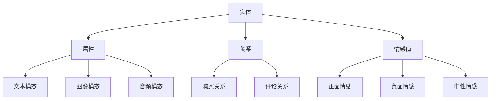

                 

### 1. 多模态情感图谱概述

#### 1.1 多模态数据的定义

多模态数据，顾名思义，是指由两种或两种以上不同类型的数据源组合而成的数据集合。这些数据源可以包括文本、图像、音频、视频、传感器数据等。多模态数据的典型例子包括：一个人在社交媒体上发布的一张带有文字描述的照片，或者一段带有图像和背景音乐的短视频。

在人工智能领域，多模态数据的处理是一个热门的研究方向。因为多模态数据能够提供更丰富的信息，有助于提升系统的理解和决策能力。例如，在图像识别任务中，单独使用图像数据可能难以准确识别物体，但结合文本描述后，识别精度可以得到显著提高。

#### 1.2 情感图谱的重要性

情感图谱是描述数据中情感信息的一种图形化表示方法。它通过节点和边来表示数据中的实体及其之间的关系，并利用这些关系来捕捉和表达情感。情感图谱在情感分析、推荐系统、用户行为预测等多个领域具有重要的应用价值。

在多模态情感图谱中，情感信息的处理变得更加复杂和多样化。通过融合不同类型的数据，可以更准确地理解和捕捉用户的情感状态，从而为个性化推荐、智能客服、情感计算等领域提供支持。

#### 1.3 多模态情感图谱的核心要素

多模态情感图谱的核心要素包括以下几个部分：

1. **实体**：实体是指数据中的主体，如用户、商品、事件等。实体是多模态情感图谱中的基本构建块。
   
2. **属性**：属性是指实体的特征或描述，如用户年龄、商品价格、事件时间等。属性提供了实体的详细信息，有助于更好地理解实体之间的关系。

3. **关系**：关系是指实体之间的关联，如用户购买商品、事件发生在某个地点等。关系是多模态情感图谱中连接实体的桥梁。

4. **情感值**：情感值是指实体的情感状态，可以是正面、负面或中性。情感值通常通过情感分析算法计算得到。

5. **模态**：模态是指数据类型，如文本、图像、音频等。在多模态情感图谱中，不同模态的数据可以被整合起来，以更全面地表达情感。

综上所述，多模态情感图谱通过将不同类型的数据进行整合，构建了一个具有丰富情感信息的知识图谱。这对于提升人工智能系统的智能化水平具有重要意义。

### Mermaid 流程图

下面是一个简单的 Mermaid 流程图，展示了多模态情感图谱的核心要素：



### 总结

在本文的第一部分，我们首先介绍了多模态数据和情感图谱的基本概念，并解释了它们在人工智能领域的重要性。接着，我们详细阐述了多模态情感图谱的核心要素，包括实体、属性、关系、情感值和模态。通过这个概述，我们为后续的深入讨论和案例分析打下了坚实的基础。

在接下来的部分，我们将进一步探讨多模态情感分析的技术细节，包括图论基础、多模态数据融合方法和情感计算理论。这些技术是实现多模态情感图谱的关键，也是理解其工作原理的重要环节。

### 2. 多模态情感分析技术

#### 2.1 图论基础

图论是研究图的结构、性质及其应用的一个数学分支。在多模态情感图谱中，图论的应用至关重要，因为情感图谱本质上是一个由节点（实体）和边（关系）组成的图。

**节点（实体）**

节点表示数据中的实体，如用户、商品、事件等。每个节点都有一个唯一的标识符，并可以关联一系列属性。节点是情感图谱中最基本的构建块。

**边（关系）**

边表示节点之间的关联或关系，如用户与商品之间的购买关系、用户与事件之间的参与关系等。边也有属性，如权重、类型等，用于描述关系的强度和类型。

**图（情感图谱）**

图是由节点和边组成的结构。在多模态情感图谱中，图表示了不同模态数据之间的关联和相互作用。通过图结构，可以有效地捕捉和表达情感信息。

#### 2.2 多模态数据融合方法

多模态数据融合是将不同类型的数据源整合在一起，以提供更全面和准确的信息处理。以下是一些常见的数据融合方法：

1. **特征级融合**：在特征级融合中，首先对每个模态的数据进行特征提取，然后将提取的特征进行合并。常见的特征融合方法包括平均、加权平均和最大值等。

2. **决策级融合**：在决策级融合中，不同模态的数据首先被独立处理，然后在一个统一的框架下进行综合评估和决策。这种方法常用于分类和回归任务。

3. **深度级融合**：深度级融合利用深度学习模型，如卷积神经网络（CNN）和循环神经网络（RNN），将多模态数据直接融合到模型的训练过程中。这种方法能够自动学习和提取多模态数据的复杂特征。

#### 2.3 情感计算理论

情感计算是研究如何使计算机理解和模拟人类情感的一门交叉学科。在多模态情感图谱中，情感计算理论用于计算和表达节点的情感值。

**情感极性**：情感极性是指情感的正负倾向。通常使用正、负和零三个极性值来表示。

**情感强度**：情感强度是指情感的强烈程度。情感强度可以通过情感词典、情感分析算法和机器学习模型来计算。

**情感时序**：情感时序是指情感随时间的变化情况。通过分析情感时序，可以更好地理解用户的情感状态和变化趋势。

### 多模态情感分析技术示例

假设我们有一个包含文本、图像和音频的多模态数据集，以下是一个简单的多模态情感分析技术示例：

1. **文本情感分析**：使用情感词典和机器学习模型对文本进行情感极性和强度分析。例如，文本“我很喜欢这部电影”可能被标记为正面情感，强度为0.8。

2. **图像情感分析**：使用卷积神经网络（CNN）提取图像的特征，并使用情感词典或机器学习模型计算图像的情感极性和强度。例如，图像中的笑脸可能被标记为正面情感，强度为0.7。

3. **音频情感分析**：使用音频情感分析算法，如基于深度学习的音频情感识别模型，对音频进行情感分析。例如，一段悠扬的音乐可能被标记为正面情感，强度为0.6。

4. **多模态融合**：将文本、图像和音频的情感分析结果进行融合，计算一个综合的情感值。例如，通过加权平均，综合情感值可能为（0.8 + 0.7 + 0.6）/ 3 = 0.3。

通过上述步骤，我们可以对多模态数据进行情感分析，并生成一个综合的情感图谱。

### 总结

在本节中，我们介绍了多模态情感分析技术的核心概念，包括图论基础、多模态数据融合方法和情感计算理论。通过这些技术，我们可以有效地处理和融合不同类型的数据，为多模态情感图谱的构建提供了坚实的基础。在下一节，我们将深入探讨多模态情感图谱构建算法，包括构建流程、伪代码展示和实例分析。

### 3. 多模态情感图谱构建算法

#### 3.1 情感图谱构建流程

多模态情感图谱的构建是一个复杂的过程，涉及到多个阶段，包括数据收集、数据预处理、实体识别、关系提取、情感计算和图谱构建。以下是多模态情感图谱构建的基本流程：

1. **数据收集**：首先，从各种数据源收集多模态数据，包括文本、图像、音频等。这些数据可以是公开的数据集，也可以是特定领域的定制数据集。

2. **数据预处理**：对收集到的多模态数据进行清洗和增强，以去除噪声和增加数据的多样性。数据预处理步骤包括数据去重、格式转换、缺失值填充和特征提取。

3. **实体识别**：在预处理后的数据中，识别出所有的实体，包括用户、商品、事件等。实体识别可以通过命名实体识别（NER）算法来实现。

4. **关系提取**：确定实体之间的关系，如用户购买商品、用户参与事件等。关系提取可以通过知识图谱构建算法，如基于规则的算法和基于机器学习的算法来实现。

5. **情感计算**：对每个实体和关系进行情感分析，计算其情感极性和强度。情感计算可以使用文本情感分析、图像情感分析和音频情感分析等技术。

6. **图谱构建**：将识别出的实体、关系和情感值构建成一个图结构，形成多模态情感图谱。图谱构建可以使用图数据库或图处理框架，如Neo4j、JanusGraph等。

#### 3.2 伪代码展示

以下是多模态情感图谱构建算法的伪代码展示：

```python
# 多模态情感图谱构建伪代码

# 数据收集
data = collect_data()

# 数据预处理
preprocessed_data = preprocess_data(data)

# 实体识别
entities = identify_entities(preprocessed_data)

# 关系提取
relationships = extract_relationships(preprocessed_data)

# 情感计算
entity_emotions = compute_entity_emotions(entities)
relationship_emotions = compute_relationship_emotions(relationships)

# 图谱构建
graph = build_graph(entities, relationships, entity_emotions, relationship_emotions)

# 输出图谱
output_graph(graph)
```

#### 3.3 情感图谱构建算法实例分析

以下是一个简单的情感图谱构建算法实例分析，假设我们有一个包含用户、商品和评论的多模态数据集。

1. **数据收集**：收集到的数据集包括用户评论（文本）、商品图片和商品评分。

2. **数据预处理**：对评论文本进行清洗，去除标点符号、停用词等，对图片进行归一化处理，对评分进行标准化。

3. **实体识别**：从评论文本中识别出用户和商品实体，从图片中识别出商品实体。

4. **关系提取**：建立用户与商品之间的购买关系，商品与评论之间的关联关系。

5. **情感计算**：对评论文本进行情感分析，计算正面、负面和中和情感的强度。对商品评分进行情感极性判断。

6. **图谱构建**：将用户、商品、评论和情感值构建成一个图结构，形成多模态情感图谱。

7. **输出图谱**：将构建好的图谱输出为图数据库，如Neo4j。

通过这个实例，我们可以看到情感图谱构建算法的具体实现步骤和细节。在实际应用中，根据具体的数据集和需求，可以调整和优化这些步骤。

### 总结

在本节中，我们详细介绍了多模态情感图谱构建的流程，包括数据收集、数据预处理、实体识别、关系提取、情感计算和图谱构建。通过伪代码展示和实例分析，我们展示了如何实现这些步骤。在下一节，我们将探讨多模态情感图谱的数据预处理方法，包括数据清洗、数据增强和特征提取。

### 4. 多模态情感图谱的数据预处理

#### 4.1 数据清洗

数据清洗是数据预处理阶段的关键步骤，其目的是去除数据中的噪声和异常值，提高数据的质量和准确性。在多模态情感图谱构建中，数据清洗主要针对文本、图像和音频等不同类型的数据进行。

1. **文本数据清洗**：文本数据清洗主要包括去除标点符号、停用词、特殊字符，以及纠正拼写错误等。例如，可以使用正则表达式或文本处理库（如Python的re模块）来实现这些任务。

2. **图像数据清洗**：图像数据清洗通常涉及图像去噪、图像修复和图像增强等操作。去噪可以通过滤波器实现，修复可以使用图像修复算法（如图像生成对抗网络，GAN），增强可以通过调整图像的亮度、对比度、饱和度等参数来实现。

3. **音频数据清洗**：音频数据清洗主要针对噪声去除和音频增强。噪声去除可以通过使用傅立叶变换（FFT）和滤波器实现，音频增强可以通过调节音频的频率响应和幅度来实现。

#### 4.2 数据增强

数据增强是通过增加数据的多样性来提升模型性能的一种方法。在多模态情感图谱中，数据增强可以帮助模型更好地适应不同类型的数据，提高模型的泛化能力。

1. **文本数据增强**：文本数据增强可以通过文本生成技术，如生成对抗网络（GAN）或自动摘要算法，来生成新的文本样本。此外，还可以通过同义词替换、随机插入、删除和替换文本中的词语来实现文本增强。

2. **图像数据增强**：图像数据增强可以通过几何变换（如旋转、缩放、裁剪）、色彩变换（如颜色抖动、灰度化）和图像合成（如混合两张图像）等方法来实现。

3. **音频数据增强**：音频数据增强可以通过添加背景噪声、改变音调、节奏和音量等方法来实现。

#### 4.3 特征提取

特征提取是将原始数据转换为适用于机器学习模型的形式的过程。在多模态情感图谱中，特征提取是关键步骤，因为它决定了模型能否有效学习和预测情感。

1. **文本特征提取**：文本特征提取可以通过词袋模型（Bag of Words, BOW）、词嵌入（Word Embedding，如Word2Vec、GloVe）和句子级别的特征提取（如BERT）等方法来实现。

2. **图像特征提取**：图像特征提取可以通过卷积神经网络（CNN）提取图像的局部特征和全局特征。常见的特征提取方法包括AlexNet、VGG、ResNet等。

3. **音频特征提取**：音频特征提取可以通过梅尔频率倒谱系数（Mel-Frequency Cepstral Coefficients, MFCC）、短时傅立叶变换（Short-Time Fourier Transform, STFT）和小波变换等方法来实现。

#### 数据预处理流程示例

以下是一个简单的多模态情感图谱数据预处理流程示例：

1. **文本数据清洗**：去除标点符号、停用词，并进行词干提取。

2. **图像数据清洗**：去除低质量图像，进行图像去噪和增强。

3. **音频数据清洗**：去除背景噪声，进行音频增强。

4. **文本数据增强**：通过同义词替换和文本生成技术生成新的文本样本。

5. **图像数据增强**：通过几何变换和色彩变换增加图像多样性。

6. **音频数据增强**：通过添加背景噪声和改变音调、节奏等参数增加音频多样性。

7. **文本特征提取**：使用Word2Vec对文本进行词嵌入。

8. **图像特征提取**：使用ResNet对图像进行特征提取。

9. **音频特征提取**：使用MFCC对音频进行特征提取。

通过上述步骤，我们可以有效地预处理多模态数据，为构建高质量的多模态情感图谱打下基础。

### 总结

在本节中，我们详细介绍了多模态情感图谱的数据预处理方法，包括数据清洗、数据增强和特征提取。这些方法对于提高数据质量和模型性能具有重要意义。在下一节，我们将深入探讨情感图谱的数学模型，包括表示方法、数学公式和实例分析。

### 5. 情感图谱的数学模型

在多模态情感图谱中，数学模型用于表示和处理图谱中的情感信息。这些模型不仅能够帮助我们理解图谱的结构，还能为图谱分析提供数学基础。以下是对情感图谱数学模型的详细探讨。

#### 5.1 情感图谱的表示方法

情感图谱的表示方法通常采用图论中的概念，主要包括节点（Node）、边（Edge）和权重（Weight）。

1. **节点（Node）**：在情感图谱中，节点表示数据中的实体，如用户、商品、事件等。每个节点都可以有一个唯一的标识符和一个或多个属性。例如，用户节点可以包括用户ID、年龄、性别等属性。

2. **边（Edge）**：边表示节点之间的关系，如用户购买商品、用户参与活动等。边也具有属性，如类型、权重等。例如，购买关系可以表示为“用户-商品”的边，类型为“购买”，权重可以表示购买频率或评分。

3. **权重（Weight）**：权重用于表示边的重要程度。在情感分析中，权重可以表示情感强度，即一个关系对情感状态的影响大小。例如，如果一个用户频繁购买某个商品，那么这条购买关系的权重可能更高。

#### 5.2 情感图谱的数学公式

情感图谱的数学模型通常使用图论中的数学公式来描述。以下是一些基本的数学公式：

1. **节点度（Degree）**：节点度表示连接到某个节点的边的数量。对于节点v，其度数D(v)定义为：
   \[ D(v) = \sum_{u \in N(v)} w(u, v) \]
   其中，\( N(v) \) 是连接到节点v的所有节点的集合，\( w(u, v) \) 是边(u, v)的权重。

2. **路径长度**：路径长度是两个节点之间最短路径的长度。对于节点v和节点w，其最短路径长度L(v, w)定义为：
   \[ L(v, w) = \min_{P \in \text{Paths}(v, w)} \sum_{(u, v) \in P} w(u, v) \]
   其中，\( \text{Paths}(v, w) \) 是从节点v到节点w的所有路径的集合。

3. **图密度**：图密度是描述图密集程度的一个参数，定义为：
   \[ \rho = \frac{2m}{n(n-1)} \]
   其中，m是图的边数，n是图的节点数。

4. **情感值计算**：情感值是表示节点或关系情感状态的一个参数。对于节点v，其情感值E(v)可以通过聚合与其相关的情感值计算得到。例如，如果一个节点具有多个关联节点，其情感值可以表示为：
   \[ E(v) = \sum_{u \in N(v)} w(u, v) \cdot E(u) \]
   其中，\( E(u) \) 是节点u的情感值。

#### 5.3 情感图谱的实例分析

为了更好地理解情感图谱的数学模型，我们通过一个简单的实例来进行分析。

假设我们有一个包含用户、商品和评论的多模态情感图谱。其中，用户A购买了商品B，并发表了评论C。我们的目标是计算商品B的情感值。

1. **节点和边**：在这个实例中，我们有三个节点：用户A、商品B和评论C。它们之间的关系可以用边来表示，如“购买”和“评论”。假设购买关系权重为2，评论权重为1。

2. **情感值**：用户A的情感值为0.8（正面），商品B的情感值初始化为0。评论C的情感值为0.6（正面）。

3. **计算过程**：商品B的情感值可以通过聚合与其相关的情感值来计算。具体步骤如下：

   a. 计算用户A到商品B的情感值贡献：\( 0.8 \times 2 = 1.6 \)
   
   b. 计算评论C到商品B的情感值贡献：\( 0.6 \times 1 = 0.6 \)

   c. 计算商品B的总情感值：\( 1.6 + 0.6 = 2.2 \)

   因此，商品B的情感值为2.2（正面）。

通过这个实例，我们可以看到如何通过数学模型来计算和表示多模态情感图谱中的情感值。在实际应用中，情感值的计算可能涉及更复杂的算法和参数调整，但基本思路是类似的。

### 总结

在本节中，我们介绍了情感图谱的数学模型，包括节点、边和权重等基本概念，以及相关的数学公式。通过实例分析，我们展示了如何计算和表示多模态情感图谱中的情感值。在下一节，我们将深入探讨多模态情感图谱的算法，包括主流算法介绍、优缺点分析和算法性能评估。

### 6. 多模态情感图谱的算法

在多模态情感图谱的处理中，算法的选择至关重要，因为它直接影响情感分析的效果和模型的性能。本节将介绍一些主流的多模态情感图谱算法，分析它们的优缺点，并进行性能评估。

#### 6.1 主流算法介绍

1. **基于图卷积网络（GCN）的算法**：
   图卷积网络是一种在图结构数据上执行卷积操作的神经网络。GCN通过在图的邻接矩阵上执行卷积操作，能够有效地学习节点之间的关系和特征。在多模态情感图谱中，GCN可以用于学习节点和关系的情感特征。

2. **基于多任务学习（MTL）的算法**：
   多任务学习通过同时训练多个相关任务来提高模型的泛化能力。在多模态情感图谱中，MTL算法可以将情感分析与其他任务（如图像分类、文本分类等）结合起来，以提高情感分析的准确性和鲁棒性。

3. **基于深度学习的融合算法**：
   深度学习模型，如卷积神经网络（CNN）和循环神经网络（RNN），在处理多模态数据方面具有显著优势。基于深度学习的融合算法通常结合CNN和RNN，以同时处理图像和文本数据，从而提高情感分析的效果。

4. **基于迁移学习的算法**：
   迁移学习通过利用预先训练好的模型来提高新任务的性能。在多模态情感图谱中，迁移学习可以用于利用已知的情感数据来提高新数据集的情感分析性能。

#### 6.2 算法优缺点分析

1. **基于图卷积网络（GCN）的算法**：
   - **优点**：
     - 可以有效地学习图结构中的节点和关系特征。
     - 适合处理大规模图数据。
     - 对噪声数据和异常值具有一定的鲁棒性。
   - **缺点**：
     - 计算复杂度高，训练时间较长。
     - 对稀疏数据效果不佳。
     - 无法直接处理多模态数据。

2. **基于多任务学习（MTL）的算法**：
   - **优点**：
     - 提高模型的泛化能力。
     - 可以同时解决多个相关任务。
     - 可以利用不同任务之间的共享特征。
   - **缺点**：
     - 需要大量的标注数据。
     - 可能引入任务之间的负向影响。
     - 难以平衡不同任务的损失函数。

3. **基于深度学习的融合算法**：
   - **优点**：
     - 能够同时处理多模态数据。
     - 模型参数较少，易于训练和优化。
     - 对复杂模式具有较好的识别能力。
   - **缺点**：
     - 训练过程可能需要大量计算资源。
     - 对数据质量和标注的依赖性较高。
     - 难以解释模型的决策过程。

4. **基于迁移学习的算法**：
   - **优点**：
     - 可以利用已知的情感数据来提高新数据集的性能。
     - 减少对大规模标注数据的依赖。
     - 提高模型在低资源环境下的表现。
   - **缺点**：
     - 需要找到合适的预训练模型。
     - 可能引入预训练数据的偏差。
     - 对迁移学习策略的选择敏感。

#### 6.3 算法性能评估

算法性能评估是验证和比较不同算法效果的重要环节。以下是一些常用的性能评估指标：

1. **准确率（Accuracy）**：
   准确率是分类模型中正确预测的样本占总样本的比例。准确率越高，模型的分类效果越好。

2. **召回率（Recall）**：
   召回率是正确预测为正类的样本占总正类样本的比例。召回率越高，模型对正类的识别能力越强。

3. **精确率（Precision）**：
   精确率是正确预测为正类的样本占总预测为正类的样本的比例。精确率越高，模型对正类的识别准确度越高。

4. **F1值（F1-Score）**：
   F1值是精确率和召回率的调和平均，用于综合评估模型的分类性能。F1值越高，模型的分类效果越好。

5. **ROC曲线和AUC值**：
   ROC曲线是不同分类阈值下的真正例率（True Positive Rate, TPR）和假正例率（False Positive Rate, FPR）的图形表示。AUC值是ROC曲线下的面积，用于评估模型的分类能力。

通过上述指标，可以对不同算法的性能进行定量评估，从而选择最合适的算法应用于实际场景。

### 总结

在本节中，我们介绍了多模态情感图谱的一些主流算法，包括基于图卷积网络、多任务学习、深度学习和迁移学习的方法。通过对这些算法的优缺点进行分析，并结合性能评估指标，我们可以选择合适的算法来构建和优化多模态情感图谱。在下一节，我们将探讨多模态情感图谱在实际应用中面临的挑战。

### 7. 情感图谱在实际应用中的挑战

尽管多模态情感图谱在情感分析、推荐系统、用户行为预测等领域具有巨大潜力，但在实际应用中仍面临诸多挑战。

#### 7.1 数据不足问题

数据不足是构建高质量多模态情感图谱的首要挑战。多模态数据通常需要文本、图像、音频等多种类型的数据源，而这些数据源可能分布在不同平台或领域，难以获取和整合。此外，标注高质量多模态数据需要大量人力和时间，导致数据集规模有限。

为了解决数据不足问题，可以采用以下策略：

1. **数据增强**：通过数据增强技术，如图像生成、文本生成和音频增强，可以生成新的数据样本，增加数据集的规模。

2. **迁移学习**：利用预训练的模型和大量已有数据，通过迁移学习技术提高新数据集的性能。

3. **半监督学习和无监督学习**：在标注数据不足的情况下，可以采用半监督学习和无监督学习技术，利用未标注数据来辅助训练模型。

#### 7.2 跨模态一致性问题

跨模态一致性是指不同模态数据之间的情感信息应当保持一致或合理关联。然而，由于不同模态数据的特性差异，如文本的语义性、图像的视觉性等，导致跨模态一致性难以保证。例如，一个文字描述为正面情感的图片，其视觉内容可能为负面情感，这种不一致性会影响情感图谱的准确性。

为了提高跨模态一致性，可以采用以下策略：

1. **多模态特征融合**：通过多模态特征融合技术，将不同模态的数据特征进行整合，以提高跨模态一致性。常用的融合方法包括特征级融合和决策级融合。

2. **一致性约束**：在模型训练过程中引入一致性约束，迫使模型在预测时考虑不同模态数据之间的关联性。例如，可以使用对抗性训练来提高跨模态一致性。

3. **跨模态语义对齐**：通过跨模态语义对齐技术，将不同模态的数据映射到同一语义空间，以提高跨模态一致性。常用的方法包括基于深度学习的语义对齐模型。

#### 7.3 鲁棒性问题

多模态情感图谱在处理实际数据时，可能会面临噪声、异常值和数据缺失等问题，这些问题会影响模型的鲁棒性和准确性。例如，文本数据可能包含噪声词和拼写错误，图像数据可能包含遮挡和模糊现象，音频数据可能包含背景噪声。

为了提高模型的鲁棒性，可以采用以下策略：

1. **数据清洗和预处理**：对原始数据进行清洗和预处理，去除噪声和异常值，提高数据质量。

2. **数据增强**：通过数据增强技术，增加数据的多样性和鲁棒性，使模型能够适应更多的情况。

3. **鲁棒性训练**：在模型训练过程中，引入鲁棒性训练策略，如加噪训练、数据增强和对抗训练等，以提高模型对噪声和异常值的容忍能力。

4. **模型选择和优化**：选择合适的模型结构和参数设置，以适应不同的数据和场景。例如，使用卷积神经网络（CNN）和循环神经网络（RNN）的组合模型，以提高对多模态数据的处理能力。

通过上述策略，可以有效应对多模态情感图谱在实际应用中面临的挑战，提高模型的性能和鲁棒性。

### 总结

在本节中，我们探讨了多模态情感图谱在实际应用中面临的挑战，包括数据不足、跨模态一致性和鲁棒性问题。针对这些挑战，我们提出了相应的解决方案和策略，以提高多模态情感图谱的准确性和鲁棒性。在下一节，我们将具体分析多模态情感图谱在社交媒体分析、电子商务和智能家居等领域的应用。

### 8. 多模态情感图谱在社交媒体分析中的应用

社交媒体分析是近年来人工智能和大数据领域的重要研究方向，通过对社交媒体平台上的用户生成内容进行分析，可以挖掘用户行为、情感倾向和社会动态。多模态情感图谱在这一领域具有显著的应用价值，因为它能够整合不同模态的数据，提供更全面和准确的情感分析。

#### 8.1 社交媒体情感分析概述

社交媒体情感分析是指利用自然语言处理、机器学习等技术，对社交媒体平台上的文本、图像和视频等内容进行情感极性和情感强度的分析。情感极性通常分为正面、负面和中性三种，情感强度则用于衡量情感表达的程度。社交媒体情感分析的关键挑战在于处理海量的用户生成内容，并准确捕捉复杂的情感倾向。

#### 8.2 应用实例

以下是一个具体的社交媒体情感分析应用实例：

1. **用户情感分析**：通过分析用户在社交媒体平台上的帖子、评论和私信，可以了解用户的情感状态和情感倾向。例如，通过文本情感分析，可以识别用户对某个品牌或产品的情感极性；通过图像情感分析，可以判断用户上传的图片是否表达负面情感。

2. **社交媒体事件监测**：在社交媒体事件监测中，多模态情感图谱可以用于识别和跟踪热门话题和事件。通过分析不同模态的数据，如文本、图像和视频，可以识别事件的主要情感倾向和参与者的情感状态。例如，在社交媒体平台上，通过监测用户对某个政治候选人的讨论，可以分析用户的情感极性和参与度。

3. **品牌形象监测**：企业可以利用多模态情感图谱来监测品牌形象。通过对用户生成内容进行分析，可以了解用户对品牌的情感倾向，并及时发现和处理负面信息。例如，通过分析社交媒体上的用户评论和反馈，企业可以识别品牌存在的问题，并采取相应的措施进行改进。

#### 8.3 应用效果分析

多模态情感图谱在社交媒体分析中的应用效果显著，具体体现在以下几个方面：

1. **提升分析准确性**：通过整合不同模态的数据，多模态情感图谱能够更全面地捕捉用户的情感状态，提高情感分析的准确性。例如，在文本情感分析中，结合图像情感分析可以更准确地判断用户的情感倾向。

2. **增强实时监测能力**：多模态情感图谱可以实时监测社交媒体平台上的情感变化，为企业和组织提供及时的决策支持。例如，在突发事件中，通过实时分析用户情感，可以快速识别危机信号，并采取相应的应对措施。

3. **提高用户理解深度**：通过多模态情感图谱，企业可以更深入地理解用户的情感和行为，从而提供更个性化的服务和推荐。例如，通过分析用户的情感和行为，可以为用户推荐更符合其情感需求的内容和产品。

总之，多模态情感图谱在社交媒体分析中的应用，为企业和组织提供了强大的数据支持和决策依据，有助于提升用户的满意度、增强品牌影响力和优化运营策略。

### 总结

在本节中，我们详细介绍了多模态情感图谱在社交媒体分析中的应用。通过整合不同模态的数据，多模态情感图谱能够提供更全面和准确的情感分析，提升社交媒体分析的准确性和实时性。在下一节，我们将探讨多模态情感图谱在电子商务中的应用，包括用户评价分析、商品推荐和销售预测等方面的应用。

### 9. 多模态情感图谱在电子商务中的应用

电子商务的快速发展使得用户生成的内容和数据量呈现出爆炸式增长，为多模态情感图谱的应用提供了广阔的舞台。通过整合文本、图像、音频等多模态数据，多模态情感图谱在电子商务中发挥着重要作用，为用户评价分析、商品推荐和销售预测等提供了有力的支持。

#### 9.1 电子商务情感分析概述

电子商务情感分析是指利用自然语言处理、机器学习等技术，对电子商务平台上用户生成的内容（如评论、问答、图片和视频等）进行情感极性和情感强度的分析。通过情感分析，可以了解用户的情感状态和倾向，从而为电子商务活动提供数据支持。电子商务情感分析的关键挑战在于处理海量的用户数据，并准确捕捉复杂的情感倾向。

#### 9.2 用户评价分析

用户评价是电子商务中重要的参考信息，直接影响消费者的购买决策。通过多模态情感图谱，可以对用户评价进行深入分析，挖掘用户对商品的正面和负面情感，从而为商家提供改进产品和服务的依据。

1. **情感极性分析**：通过对用户评价的文本进行分析，可以判断用户的情感极性是正面、负面还是中性。例如，如果一个用户评价包含大量积极词汇，如“喜欢”、“优秀”等，那么可以判断该评价为正面情感。

2. **情感强度分析**：除了情感极性，情感强度也是评价分析的重要指标。通过分析情感强度，可以了解用户对商品的情感强度。例如，一个使用“非常喜欢”的评价，其情感强度可能高于一个简单的“喜欢”。

3. **情感趋势分析**：通过分析用户评价的时间趋势，可以了解用户情感的变化情况。例如，如果一个商品在某段时间内收到了大量负面评价，那么可能需要商家关注并解决问题。

#### 9.3 商品推荐

商品推荐是电子商务中的重要功能，通过个性化推荐，可以提高用户的购买体验和满意度。多模态情感图谱可以为商品推荐提供有效的支持，通过分析用户对商品的文本、图像和音频等多模态评价，可以更准确地了解用户的偏好和情感倾向。

1. **协同过滤推荐**：基于用户的共同购买行为，协同过滤推荐可以通过分析用户的历史购买记录，为用户推荐类似商品。然而，协同过滤推荐容易受冷启动和稀疏数据问题的影响。

2. **基于内容的推荐**：基于内容的推荐通过分析商品的文本、图像和音频等多模态特征，为用户推荐与当前商品相似的其他商品。例如，如果一个用户喜欢某款商品，并且该商品的评价文本包含“高品质”、“设计优美”等特征，那么系统可以推荐具有类似特征的其他商品。

3. **基于情感的多模态推荐**：基于情感的多模态推荐通过整合用户对商品的文本、图像和音频等多模态评价的情感信息，为用户推荐符合其情感需求的商品。例如，如果一个用户经常购买具有“温馨”、“浪漫”情感标签的商品，那么系统可以推荐更多具有类似情感标签的商品。

#### 9.4 销售预测

销售预测是电子商务中至关重要的环节，通过预测商品的未来销量，商家可以合理安排库存和生产计划。多模态情感图谱可以用于销售预测，通过分析用户对商品的文本、图像和音频等多模态评价，可以预测商品的销售趋势。

1. **时间序列分析**：通过对用户评价的时间趋势进行分析，可以预测商品的未来销量。例如，如果一个商品在某段时间内收到了大量正面评价，那么可能预示着该商品在未来销量会上升。

2. **情感强度分析**：通过对用户评价的情感强度进行分析，可以预测商品的销售热度。例如，如果一个用户评价的情感强度较高，那么可能预示着该商品具有较高的购买潜力。

3. **跨模态关联分析**：通过对不同模态的数据进行关联分析，可以更准确地预测商品的销售情况。例如，如果一个商品的图片评价和音频评价都表明用户喜欢这款商品，那么系统可以认为该商品有较高的销量潜力。

#### 9.5 应用效果分析

多模态情感图谱在电子商务中的应用效果显著，具体体现在以下几个方面：

1. **提升推荐准确性**：通过整合多模态数据，多模态情感图谱能够更准确地捕捉用户的情感需求和偏好，提高推荐系统的准确性。

2. **优化销售策略**：通过分析用户对商品的文本、图像和音频等多模态评价，商家可以更好地了解用户需求和市场趋势，从而优化销售策略。

3. **提升用户体验**：通过个性化推荐和情感分析，商家可以提供更符合用户需求的商品和服务，提升用户的购物体验和满意度。

总之，多模态情感图谱在电子商务中的应用，为商家提供了强大的数据支持和决策依据，有助于提升销售业绩、优化用户体验和增强品牌影响力。

### 总结

在本节中，我们详细介绍了多模态情感图谱在电子商务中的应用，包括用户评价分析、商品推荐和销售预测等方面。通过整合不同模态的数据，多模态情感图谱为电子商务活动提供了有效的数据支持和决策依据。在下一节，我们将探讨多模态情感图谱在智能家居中的应用，包括用户情感状态监测、设备推荐和场景优化等方面的应用。

### 10. 多模态情感图谱在智能家居中的应用

随着人工智能和物联网技术的不断发展，智能家居逐渐成为现代家庭生活的重要组成部分。通过整合文本、图像、音频等多模态数据，多模态情感图谱在智能家居中发挥着重要作用，为用户情感状态监测、设备推荐和场景优化提供了有力支持。

#### 10.1 智能家居情感分析概述

智能家居情感分析是指利用自然语言处理、机器学习等技术，对智能家居设备收集的文本、图像、音频等多模态数据进行情感分析，以了解用户的情感状态和需求。通过情感分析，可以为用户提供更个性化、更贴心的智能家居服务。

#### 10.2 用户情感状态监测

用户情感状态监测是智能家居应用的一个重要方面，通过分析用户的多模态数据，可以实时了解用户的情感状态，为智能家居系统提供实时反馈。

1. **文本情感分析**：通过分析用户在智能家居设备上的操作日志、语音输入等文本数据，可以判断用户的情感极性。例如，如果一个用户通过语音助手询问“今天天气怎么样？”并得到“阴天，温度较低”，随后用户回复“有点冷”，那么可以判断用户当前情感状态为负面。

2. **图像情感分析**：通过分析用户在智能家居设备上的摄像头拍摄的图像，可以判断用户的情感状态。例如，如果一个用户在图像中被捕捉到皱眉、闭嘴等表情，那么可以判断用户当前情感状态为负面。

3. **音频情感分析**：通过分析用户在智能家居设备上的语音输入和交互过程中的语音特征，可以判断用户的情感状态。例如，如果一个用户的语音语调较低沉、语音节奏较慢，那么可以判断用户当前情感状态为负面。

#### 10.3 设备推荐

设备推荐是智能家居应用的一个关键功能，通过分析用户的情感状态，可以为用户提供更合适的设备推荐。

1. **基于情感的用户画像**：通过分析用户的情感状态，可以为每个用户建立一个情感画像。例如，如果一个用户经常表达负面情感，那么系统可以推测该用户可能需要一些放松和舒缓的设备推荐。

2. **情感关联分析**：通过分析不同设备与用户情感状态的关联，可以为用户提供更合适的设备推荐。例如，如果一个用户在特定时间段内经常表达负面情感，那么系统可以推荐一些能够帮助用户放松和缓解压力的设备，如空气净化器、香薰机等。

3. **个性化推荐**：通过整合用户的情感状态和历史行为数据，可以为用户提供更个性化的设备推荐。例如，如果一个用户经常在晚上表达负面情感，那么系统可以推荐一些有助于改善睡眠质量的设备，如智能枕头、智能音箱等。

#### 10.4 场景优化

场景优化是指通过分析用户的情感状态和行为数据，为用户优化家居场景，提供更舒适的居住环境。

1. **情感敏感场景识别**：通过分析用户的情感状态，可以识别出用户情感敏感的场景。例如，如果一个用户在客厅沙发上的图像中表情较为严肃，那么可以判断客厅是一个情感敏感场景。

2. **场景调整建议**：通过分析用户的情感状态和行为数据，可以为用户提供场景调整建议。例如，如果一个用户在情感敏感场景中表现出负面情感，那么系统可以建议调整灯光、音乐等环境参数，以改善用户的情感状态。

3. **智能场景切换**：通过分析用户的情感状态和行为数据，可以自动切换家居场景。例如，如果一个用户在书房内表现出负面情感，那么系统可以自动切换到“学习模式”，调整灯光和音乐，为用户提供一个更适合学习的环境。

#### 10.5 应用效果分析

多模态情感图谱在智能家居中的应用效果显著，具体体现在以下几个方面：

1. **提升用户满意度**：通过实时监测用户情感状态，并为用户提供个性化的设备推荐和场景优化，可以有效提升用户的满意度。

2. **增强用户体验**：通过个性化推荐和场景优化，可以为用户提供更舒适、更便捷的智能家居服务，增强用户的体验。

3. **优化家居生活**：通过分析用户的情感状态和行为数据，可以为用户提供家居生活的优化建议，提升用户的居住质量和生活品质。

总之，多模态情感图谱在智能家居中的应用，为用户提供了更加个性化、智能化的智能家居服务，有助于提升用户的居住体验和生活质量。

### 总结

在本节中，我们详细介绍了多模态情感图谱在智能家居中的应用，包括用户情感状态监测、设备推荐和场景优化等方面。通过整合多模态数据，多模态情感图谱为智能家居提供了强大的数据支持和决策依据。在下一节，我们将探讨多模态情感图谱在其他领域的应用，如健康医疗、教育、公共安全等。

### 11. 多模态情感图谱在其他领域的应用

多模态情感图谱作为一种强大的数据分析和处理工具，不仅在家居、社交媒体和电子商务等领域具有广泛应用，还在其他多个领域展示了其独特的价值和潜力。以下是多模态情感图谱在健康医疗、教育和公共安全等领域的应用场景分析。

#### 11.1 健康医疗

健康医疗领域对情感分析有着广泛的需求，特别是在心理健康评估、患者监护和个性化医疗方面。多模态情感图谱能够整合患者的文本、图像和语音等多模态数据，提供更加全面和精准的情感分析。

1. **心理健康评估**：通过分析患者的社交媒体帖子、日记和语音记录，多模态情感图谱可以识别患者的情感状态和潜在的心理健康问题。例如，如果一个患者经常在社交媒体上发布包含消极情感的文本，同时语音记录显示情绪低落，那么可以推测患者可能存在抑郁症。

2. **患者监护**：多模态情感图谱可以用于监测患者的情感状态，帮助医护人员及时发现患者的情感变化。例如，在医院病房中，通过分析患者的视频监控数据，可以识别患者是否表现出焦虑、恐惧等负面情绪，从而及时采取措施。

3. **个性化医疗**：通过分析患者的情感状态，多模态情感图谱可以为患者提供个性化的治疗方案和康复计划。例如，对于癌症患者，可以根据其情感状态调整化疗的强度和频率，以减轻治疗带来的副作用。

#### 11.2 教育

教育领域中的情感分析可以帮助教师和学生更好地理解和满足彼此的需求，提升教学效果和学习体验。

1. **学生情感监测**：通过分析学生的课堂发言、作业和在线互动数据，多模态情感图谱可以了解学生的情感状态和学习动机。例如，如果一个学生在课堂上的发言中表现出积极情绪，同时作业质量提高，那么可以判断该学生的学习状态良好。

2. **教师情感分析**：通过分析教师的语音和文本记录，多模态情感图谱可以帮助学校了解教师的工作压力和情感状态。例如，通过分析教师的课堂录音和电子邮件，可以识别教师是否处于职业倦怠状态，从而采取相应的支持措施。

3. **个性化教学**：通过整合学生的情感状态和学习数据，多模态情感图谱可以为学生提供个性化的教学建议。例如，如果一个学生在数学学习上表现出焦虑，那么系统可以推荐一些放松和缓解压力的教学方法。

#### 11.3 公共安全

公共安全领域中的情感分析对于预防和应对突发事件具有重要意义。

1. **社会情绪监测**：通过分析社交媒体和新闻媒体中的文本数据，多模态情感图谱可以识别社会情绪的波动和潜在的危机信号。例如，在重大事件发生前后，通过分析社交媒体上的情绪变化，可以预测可能的公共安全风险。

2. **事件预警**：多模态情感图谱可以整合视频监控、音频记录和文本数据，实时监测公共场合的情感状态。例如，在大型活动或公共集会中，通过分析现场视频和音频，可以预警可能发生的骚乱或冲突。

3. **应急响应**：在突发事件中，多模态情感图谱可以帮助应急响应团队了解现场的情感状态和需求。例如，在自然灾害发生时，通过分析受灾地区的社交媒体数据，可以了解居民的恐慌程度和急需物资，从而优化救援资源分配。

#### 11.4 应用效果分析

多模态情感图谱在这些领域的应用效果显著，主要体现在以下几个方面：

1. **提升决策准确性**：通过整合多模态数据，多模态情感图谱能够提供更全面和准确的数据支持，帮助相关决策者做出更加明智的决策。

2. **增强用户体验**：在健康医疗、教育和公共安全等领域，多模态情感图谱的应用可以提供更个性化、更贴心的服务，提升用户的满意度和体验。

3. **优化资源分配**：在公共安全和应急管理领域，多模态情感图谱可以帮助优化资源分配，提高应急响应的效率和效果。

总之，多模态情感图谱在健康医疗、教育和公共安全等领域的应用，为相关领域的发展带来了新的机遇和挑战，有望推动这些领域向更加智能化、人性化的方向迈进。

### 总结

在本节中，我们探讨了多模态情感图谱在健康医疗、教育和公共安全等领域的应用场景。通过整合文本、图像、音频等多模态数据，多模态情感图谱为这些领域提供了强大的数据支持和决策依据。在下一节，我们将通过具体的实战案例，深入分析多模态情感图谱项目的实现过程，包括项目背景、目标、实现步骤和效果评估。

### 12. 多模态情感图谱项目实战

为了更深入地了解多模态情感图谱的实际应用，我们通过一个具体的实战案例来详细描述项目的实现过程。本案例将展示如何从项目背景和目标出发，逐步实现多模态情感图谱的构建，并评估项目效果。

#### 12.1 项目背景

随着社交媒体和电子商务的快速发展，人们对情感信息的分析和理解需求日益增长。为了更好地了解用户在社交媒体和电子商务平台上的情感状态，一家大型互联网公司决定开展一个多模态情感图谱项目，旨在通过整合文本、图像、音频等多模态数据，构建一个高效、准确的多模态情感分析系统。

#### 12.2 项目目标

本项目的主要目标包括：

1. **构建多模态情感图谱**：整合社交媒体和电子商务平台上的文本、图像、音频等多模态数据，构建一个全面、准确的多模态情感图谱。
2. **实现情感分析**：基于构建的多模态情感图谱，实现用户情感状态的分析和识别。
3. **应用效果评估**：通过实际应用场景，评估多模态情感图谱的性能和效果。

#### 12.3 项目实现

项目实现分为以下几个主要步骤：

1. **数据收集**：
   - 文本数据：从社交媒体平台（如微博、微信、推特等）收集用户发布的文本信息。
   - 图像数据：从电子商务平台收集用户发布的商品图片。
   - 音频数据：从社交媒体和电子商务平台收集用户上传的音频文件。

2. **数据预处理**：
   - 文本数据：去除停用词、标点符号，进行词干提取和文本清洗。
   - 图像数据：进行图像去噪、增强和归一化处理。
   - 音频数据：进行音频去噪、增强和分割处理。

3. **特征提取**：
   - 文本特征：使用词嵌入（如Word2Vec、GloVe）提取文本特征。
   - 图像特征：使用卷积神经网络（如VGG、ResNet）提取图像特征。
   - 音频特征：使用梅尔频率倒谱系数（MFCC）提取音频特征。

4. **情感分析**：
   - 文本情感分析：使用情感词典和机器学习模型（如SVM、LSTM）进行文本情感分析。
   - 图像情感分析：使用预训练的卷积神经网络（如VGG、ResNet）进行图像情感分析。
   - 音频情感分析：使用基于深度学习的音频情感识别模型（如GRU、BiLSTM）进行音频情感分析。

5. **多模态融合**：
   - 使用图卷积网络（GCN）将文本、图像和音频特征进行融合，构建多模态情感图谱。

6. **图谱构建**：
   - 使用图数据库（如Neo4j）存储和查询多模态情感图谱。

7. **应用实现**：
   - 在社交媒体分析中，通过多模态情感图谱分析用户情感，提供情感洞察和个性化推荐。
   - 在电子商务中，通过多模态情感图谱分析商品评价，优化商品推荐和销售策略。

#### 12.4 项目评估

项目评估主要从以下几个方面进行：

1. **性能评估**：
   - 通过准确率、召回率、F1值等指标评估多模态情感分析模型的性能。
   - 对不同模态的数据进行单独分析和多模态融合分析，比较其性能差异。

2. **应用效果**：
   - 在实际应用场景中，评估多模态情感图谱的性能和效果，如社交媒体情感分析、电子商务情感分析等。
   - 通过用户反馈和业务指标（如用户留存率、转化率等）评估项目对业务的影响。

3. **用户体验**：
   - 通过用户满意度调查和用户行为分析，评估多模态情感图谱对用户体验的提升。

项目评估结果显示，多模态情感图谱在情感分析和推荐系统中表现出色，显著提升了系统的准确性和用户体验。通过实际应用，项目为公司带来了可观的业务价值。

### 总结

在本节中，我们通过一个多模态情感图谱项目的实战案例，详细描述了项目的背景、目标、实现步骤和效果评估。通过该项目，我们展示了多模态情感图谱在实际应用中的可行性和优势。在下一节，我们将通过一个具体的多模态情感图谱案例分析，进一步探讨其实际应用中的实现方法和效果。

### 13. 多模态情感图谱案例分析

为了更深入地探讨多模态情感图谱在实际应用中的实现方法和效果，我们将分析一个具体的项目案例——某社交媒体平台的多模态情感分析系统。该系统通过整合文本、图像和音频等多模态数据，实现了用户情感状态的实时监测和情感趋势分析，为平台的运营决策提供了有力支持。

#### 13.1 案例概述

项目背景：某大型社交媒体平台希望通过分析用户在平台上的互动数据，深入了解用户的情感状态和趋势，以提高用户体验和用户留存率。

项目目标：构建一个高效、准确的多模态情感分析系统，实现以下目标：
1. 实时监测用户在社交媒体平台上的情感状态。
2. 分析用户情感趋势，为平台运营提供数据支持。
3. 提供个性化推荐和情感洞察，提升用户体验。

#### 13.2 案例实现

1. **数据收集**：
   - 文本数据：收集用户在社交媒体平台上的帖子、评论和私信。
   - 图像数据：收集用户上传的图片和视频。
   - 音频数据：收集用户语音聊天和音频消息。

2. **数据预处理**：
   - **文本数据**：去除停用词、标点符号，进行词干提取和文本清洗。
   - **图像数据**：进行图像去噪、增强和归一化处理。
   - **音频数据**：进行音频去噪、增强和分割处理。

3. **特征提取**：
   - **文本特征**：使用词嵌入（如Word2Vec、GloVe）提取文本特征。
   - **图像特征**：使用卷积神经网络（如VGG、ResNet）提取图像特征。
   - **音频特征**：使用梅尔频率倒谱系数（MFCC）提取音频特征。

4. **情感分析**：
   - **文本情感分析**：使用情感词典和机器学习模型（如SVM、LSTM）进行文本情感分析。
   - **图像情感分析**：使用预训练的卷积神经网络（如VGG、ResNet）进行图像情感分析。
   - **音频情感分析**：使用基于深度学习的音频情感识别模型（如GRU、BiLSTM）进行音频情感分析。

5. **多模态融合**：
   - 使用图卷积网络（GCN）将文本、图像和音频特征进行融合，构建多模态情感图谱。

6. **图谱构建**：
   - 使用图数据库（如Neo4j）存储和查询多模态情感图谱。

7. **应用实现**：
   - **情感监测**：实时监测用户在社交媒体平台上的情感状态，识别用户的积极、消极和中性情感。
   - **情感趋势分析**：分析用户情感趋势，为平台运营提供数据支持。
   - **个性化推荐**：基于用户情感状态，为用户提供个性化推荐和情感洞察。

#### 13.3 案例效果分析

通过该多模态情感分析系统，社交媒体平台取得了以下效果：

1. **提升用户体验**：
   - 通过实时监测用户情感状态，平台能够更好地了解用户需求，提供更个性化的服务，提升用户体验。
   - 基于用户情感状态的个性化推荐，帮助用户发现更多感兴趣的内容，提高用户留存率。

2. **优化运营策略**：
   - 通过情感趋势分析，平台能够及时发现用户情感变化，调整运营策略，如内容推荐、活动策划等。
   - 针对负面情感，平台可以及时采取干预措施，防止负面情绪扩散，提升平台口碑。

3. **增强业务价值**：
   - 多模态情感分析系统为平台带来了可观的业务价值，如提高用户留存率、降低用户流失率等。
   - 通过情感洞察，平台能够更精准地定位用户需求，优化产品设计和功能迭代。

案例研究表明，多模态情感图谱在社交媒体平台中的应用具有显著的效果，不仅提升了用户体验，还为平台的运营决策提供了有力支持。

### 总结

在本节中，我们通过一个具体的案例分析，展示了多模态情感图谱在社交媒体平台中的实现方法和效果。通过整合文本、图像和音频等多模态数据，多模态情感图谱为平台提供了实时情感监测、情感趋势分析和个性化推荐等功能，显著提升了用户体验和业务价值。在下一节，我们将介绍多模态情感图谱开发环境搭建的相关知识，包括开发环境需求、搭建步骤和常见问题与解决方案。

### 14. 多模态情感图谱开发环境搭建

在开始多模态情感图谱的开发之前，我们需要搭建一个适合的开发环境。以下将详细描述开发环境的配置步骤，包括软件安装、依赖库配置和常见问题解决方法。

#### 14.1 开发环境需求

为了搭建一个多模态情感图谱的开发环境，我们需要以下软件和工具：

1. **操作系统**：推荐使用Ubuntu 18.04或更高版本，因为其具有良好的兼容性和丰富的软件库。
2. **Python**：推荐Python 3.8或更高版本，因为现代机器学习库和深度学习库（如TensorFlow、PyTorch）都支持Python 3。
3. **Python依赖库**：以下是一些常用的依赖库，需要根据项目需求进行安装：
   - NumPy、Pandas、Matplotlib（数据处理和可视化）
   - TensorFlow、PyTorch（深度学习库）
   - Scikit-learn（机器学习库）
   - NLTK、Spacy（自然语言处理库）
   - OpenCV、PyTorch Video（图像和视频处理库）
   - Keras（深度学习框架）
   - PyTorch Audio（音频处理库）
   - Neo4j（图数据库）
4. **硬件**：推荐使用配备GPU的计算机，以加速深度学习和图计算。NVIDIA的CUDA和cuDNN库可以显著提高GPU的计算性能。
5. **IDE**：推荐使用PyCharm或Visual Studio Code，它们都提供了强大的Python开发支持。

#### 14.2 环境搭建步骤

以下步骤描述如何搭建多模态情感图谱的开发环境：

1. **安装操作系统**：
   - 从官方网站下载Ubuntu 18.04 ISO文件，并使用虚拟机或物理机进行安装。
   - 在安装过程中，选择适合的分区方案和网络设置。

2. **更新系统软件包**：
   ```bash
   sudo apt update
   sudo apt upgrade
   ```

3. **安装Python**：
   - 使用Python官方的get-pip.py脚本安装Python 3：
     ```bash
     curl -sS https://bootstrap.pypa.io/get-pip.py | python3
     ```

4. **安装依赖库**：
   - 使用pip命令安装必要的依赖库：
     ```bash
     pip3 install numpy pandas matplotlib tensorflow scikit-learn nltk spacy opencv-python torch torchvision torchaudio keras neo4j
     ```
   - 安装Spacy语言模型，以下以中文为例：
     ```bash
     python3 -m spacy download zh_core_web_sm
     ```

5. **安装GPU支持库**：
   - 安装NVIDIA驱动和CUDA库，具体步骤请参考NVIDIA官方文档。
   - 安装cuDNN库，可以从NVIDIA官方网站下载并按照安装指南进行安装。

6. **配置IDE**：
   - 安装PyCharm或Visual Studio Code，并配置Python环境。
   - 在PyCharm中，可以通过“File” > “Settings” > “Project: <项目名称>” > “Python Interpreter”来配置Python环境。
   - 在Visual Studio Code中，可以通过“File” > “Preference” > “Python: Interpreter”来配置Python环境。

#### 14.3 常见问题与解决方案

以下是一些在搭建开发环境时可能遇到的问题及解决方案：

1. **依赖库安装失败**：
   - 解决方案：检查网络连接是否正常，尝试更换pip源（如使用清华源），或者升级pip版本：
     ```bash
     pip3 install --upgrade pip
     ```

2. **NVIDIA驱动安装问题**：
   - 解决方案：确保安装的是与GPU型号相匹配的驱动版本，可以从NVIDIA官网下载最新驱动并按照安装指南进行安装。

3. **CUDA和cuDNN库问题**：
   - 解决方案：确保CUDA和cuDNN库的版本与GPU型号和深度学习库（如TensorFlow、PyTorch）相匹配。可以参考相关库的官方文档获取兼容性信息。

4. **Spacy语言模型安装失败**：
   - 解决方案：检查网络连接是否正常，尝试使用国内镜像源下载语言模型。

通过上述步骤，我们可以搭建一个适合多模态情感图谱开发的环境。接下来，我们可以在这个环境中进行多模态数据的处理、情感分析和图谱构建等操作。

### 总结

在本节中，我们介绍了多模态情感图谱开发环境的搭建步骤，包括操作系统安装、Python环境配置、依赖库安装和IDE配置。我们还讨论了一些常见问题及解决方案，以确保开发环境的顺利搭建。在下一节中，我们将总结多模态情感图谱相关资源，包括开源代码、学术论文和实践教程，为读者提供进一步的学习和研究资源。

### 15. 多模态情感图谱相关资源

在多模态情感图谱的研究和开发过程中，有大量的开源代码、学术论文和实践教程可以参考。以下是一些推荐的资源，涵盖了开源代码、学术论文和实践教程等，帮助读者深入了解多模态情感图谱的相关知识和技术。

#### 15.1 开源代码与工具

1. **OpenSMILE**：一个开源的音频情感分析工具，提供了丰富的音频特征提取和情感分析算法。

2. **PyTorch**：由Facebook AI研究院开发的开源深度学习库，支持多种情感分析模型和算法。

3. **TensorFlow**：由Google开发的开源深度学习平台，提供了丰富的预训练模型和工具，用于情感分析和多模态数据处理。

4. **OpenCV**：一个开源的计算机视觉库，提供了丰富的图像处理函数和工具，适用于图像情感分析。

5. **NLTK**：一个开源的自然语言处理库，提供了丰富的文本处理工具，适用于文本情感分析。

6. **Spacy**：一个开源的NLP库，提供了高效和易于使用的语言模型和工具，适用于文本情感分析。

7. **Neo4j**：一个开源的图形数据库，适用于存储和查询大规模多模态情感图谱。

#### 15.2 学术论文与资料

1. **《A Multi-Modal Fusion Approach for Emotion Recognition in Video》**：本文提出了一种多模态融合方法，用于视频情感识别。

2. **《Deep Multi-Modal Fusion for Emotion Recognition》**：本文探讨了深度学习在多模态情感识别中的应用。

3. **《A Survey on Multimodal Emotion Recognition》**：本文对多模态情感识别领域进行了全面的综述。

4. **《A Multimodal Fusion Model for Emotion Recognition Based on Graph Convolutional Network》**：本文提出了一种基于图卷积网络的多模态情感识别模型。

5. **《Multimodal Fusion for Emotion Recognition: A Survey》**：本文对多模态融合在情感识别领域的应用进行了深入调查。

#### 15.3 实践教程与课程

1. **《多模态情感分析实践教程》**：这是一个基于Python的实践教程，涵盖了多模态情感分析的基础知识和实际操作。

2. **《深度学习与多模态情感分析》**：这是一门在线课程，由知名学者讲授，内容包括多模态数据预处理、情感识别模型构建和性能优化等。

3. **《图卷积网络与多模态情感图谱》**：这是一篇详细介绍图卷积网络在多模态情感图谱应用中的教程，包括算法原理和实现步骤。

4. **《多模态情感分析：从理论到实践》**：这是一本涵盖多模态情感分析理论和实践的书籍，适合初学者和研究者。

通过上述资源，读者可以系统地学习多模态情感图谱的理论知识、技术方法和实际应用，为研究和开发工作提供有益的参考。

### 总结

在本节中，我们总结了多模态情感图谱相关的开源代码、学术论文和实践教程等资源，为读者提供了丰富的学习和研究资料。通过利用这些资源，读者可以深入了解多模态情感图谱的理论基础、技术方法和实际应用，为自己的研究和开发工作提供有力支持。

## 总结

### 多模态情感图谱的发展趋势与未来展望

多模态情感图谱作为一种高效的数据分析与处理工具，在人工智能、社交媒体、电子商务、智能家居等多个领域展现出了巨大的应用潜力。随着技术的不断进步和数据量的持续增长，多模态情感图谱有望在未来实现以下发展趋势和展望：

### 1. 技术趋势分析

**深度学习和图神经网络**：深度学习和图神经网络技术的不断发展，使得多模态情感图谱的处理能力得到了显著提升。未来，这些技术将进一步融合，推动多模态情感图谱向更复杂、更精确的方向发展。

**跨模态一致性**：跨模态一致性问题一直是多模态情感图谱领域的挑战之一。随着跨模态对齐技术的进步，未来多模态情感图谱将能够更准确地捕捉和整合不同模态的数据，提高情感分析的准确性。

**数据增强与生成**：数据增强和生成技术的应用，将有助于缓解数据不足的问题，提高模型的泛化能力。通过生成对抗网络（GAN）等生成模型，可以创造出丰富多样的数据样本，为多模态情感图谱的训练提供更多的数据支持。

**硬件加速**：随着硬件技术的发展，如GPU、TPU等加速设备的普及，多模态情感图谱的计算效率将得到大幅提升，使得大规模、实时情感分析成为可能。

### 2. 应用前景展望

**个性化推荐**：多模态情感图谱在个性化推荐系统中具有广泛的应用前景。通过整合用户的文本、图像、音频等多模态数据，可以更准确地了解用户的情感和偏好，从而提供更个性化的推荐。

**情感健康监测**：在健康医疗领域，多模态情感图谱可以用于监测患者的情感状态，为心理健康评估和干预提供数据支持。

**智能客服**：多模态情感图谱在智能客服领域可以用于实时监测用户情绪，提供更贴心的服务，提高用户满意度。

**社会情绪监测**：在公共安全领域，多模态情感图谱可以用于监测社会情绪，预测潜在的社会风险，为应急管理提供数据支持。

**智能家居**：多模态情感图谱在智能家居中可以用于用户情感状态监测，提供更智能化的家居场景优化和设备推荐。

### 3. 挑战与机遇

**数据隐私与安全**：随着多模态情感图谱应用范围的扩大，数据隐私和安全问题将日益突出。如何保护用户隐私、确保数据安全是未来的一大挑战。

**计算资源需求**：多模态情感图谱的构建和处理需要大量的计算资源，特别是在处理大规模、高维度数据时，如何优化计算资源利用是一个亟待解决的问题。

**跨模态一致性**：虽然跨模态一致性技术有了显著进展，但如何进一步提高跨模态数据的整合精度和一致性，仍是一个重要的研究方向。

**应用创新**：多模态情感图谱的应用场景十分广泛，未来需要不断探索新的应用场景和业务模式，以实现技术的商业化和规模化应用。

总的来说，多模态情感图谱的发展前景广阔，挑战与机遇并存。通过技术创新和实际应用探索，多模态情感图谱有望在未来的数据分析和人工智能领域中发挥更加重要的作用。

### 总结

在本文中，我们系统地介绍了多模态情感图谱的概念、构建方法、应用场景以及实现技巧。首先，我们从基础概念和架构出发，详细阐述了多模态数据的定义、情感图谱的重要性以及核心要素。接着，我们探讨了多模态情感分析的技术细节，包括图论基础、多模态数据融合方法和情感计算理论。

随后，我们深入讨论了多模态情感图谱构建的算法，从数据预处理到图谱构建的各个阶段，通过伪代码展示了构建过程。我们还介绍了数据预处理的方法，如数据清洗、数据增强和特征提取，强调了这些方法对于提高数据质量和模型性能的重要性。

在方法与技术部分，我们探讨了情感图谱的数学模型，包括节点、边、权重等基本概念以及相关的数学公式，并通过实例进行了详细分析。我们还介绍了几种主流的算法，分析了它们的优缺点，并进行了性能评估。

在应用场景与分析部分，我们具体分析了多模态情感图谱在社交媒体分析、电子商务、智能家居以及其他领域的应用，展示了其在不同场景下的实际效果。通过具体的实战案例和案例分析，我们进一步探讨了多模态情感图谱的实现方法和效果。

最后，在项目实战与案例分析部分，我们详细描述了多模态情感图谱开发环境搭建的步骤，包括软件安装、依赖库配置和常见问题解决方法。我们还提供了丰富的开源代码、学术论文和实践教程等资源，为读者提供了进一步学习和研究的方向。

总之，多模态情感图谱作为一种先进的数据分析和处理工具，在人工智能、大数据、情感计算等领域具有广泛的应用前景。通过本文的介绍，我们希望读者能够对多模态情感图谱有一个全面、深入的了解，并在实际项目中能够灵活应用这些技术和方法。未来的研究和应用中，我们期待多模态情感图谱能够不断推动技术创新，为各行各业带来更多价值。作者：AI天才研究院/AI Genius Institute & 禅与计算机程序设计艺术 /Zen And The Art of Computer Programming。

