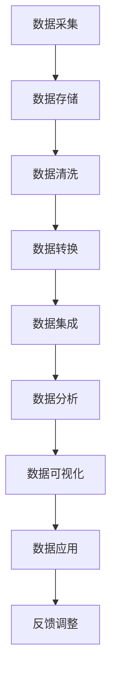

                 

# 大数据时代：人类计算的机遇与挑战

> **关键词：** 大数据，计算技术，机遇，挑战，应用领域，未来趋势

> **摘要：** 本文将深入探讨大数据时代的到来对人类计算的影响，包括其定义、特点、来源与应用领域。接着，我们将分析大数据治理与伦理问题，探讨其在不同行业中的应用。随后，文章将介绍大数据技术的架构设计与平台搭建，以及实际应用案例。最后，我们将讨论大数据时代的挑战与未来发展趋势，展望其对社会和经济的影响。

## 目录大纲

# 《大数据时代：人类计算的机遇与挑战》目录大纲

## 第一部分 大数据基础理论

### 1.1 大数据定义与特点

#### 1.1.1 大数据的定义与背景

#### 1.1.2 大数据的特点与挑战

#### 1.1.3 大数据的基本概念

### 1.2 大数据的来源与应用领域

#### 1.2.1 数据来源

##### 1.2.1.1 数据类型分类

##### 1.2.1.2 数据来源分析

#### 1.2.2 应用领域概述

##### 1.2.2.1 商业应用

##### 1.2.2.2 政府管理

##### 1.2.2.3 科学研究

### 1.3 大数据治理与伦理

#### 1.3.1 数据治理的基本原则

#### 1.3.2 数据隐私保护

#### 1.3.3 数据伦理问题探讨

## 第二部分 大数据技术与架构

### 2.1 大数据技术概述

#### 2.1.1 数据存储技术

##### 2.1.1.1 传统数据库

##### 2.1.1.2 NoSQL数据库

##### 2.1.1.3 分布式存储系统

#### 2.1.2 数据处理技术

##### 2.1.2.1 数据清洗与转换

##### 2.1.2.2 数据集成与数据仓库

##### 2.1.2.3 大数据分析方法

### 2.2 大数据架构设计

#### 2.2.1 数据流处理框架

##### 2.2.1.1 Apache Kafka

##### 2.2.1.2 Apache Flink

##### 2.2.1.3 Apache Spark Streaming

#### 2.2.2 大数据计算架构

##### 2.2.2.1 MapReduce

##### 2.2.2.2 数据流计算框架

##### 2.2.2.3 分布式计算集群

### 2.3 大数据平台搭建

#### 2.3.1 大数据平台组件

##### 2.3.1.1 Hadoop生态系统

##### 2.3.1.2 Hadoop分布式文件系统（HDFS）

##### 2.3.1.3 YARN资源调度框架

#### 2.3.2 大数据平台部署与优化

##### 2.3.2.1 部署步骤

##### 2.3.2.2 性能优化方法

## 第三部分 大数据应用案例分析

### 3.1 商业应用案例

#### 3.1.1 社交媒体数据分析

#### 3.1.2 电子商务推荐系统

#### 3.1.3 金融风控系统

### 3.2 政府管理应用

#### 3.2.1 公共安全监控

#### 3.2.2 智慧城市建设

#### 3.2.3 医疗健康数据分析

### 3.3 科学研究应用

#### 3.3.1 天文观测数据分析

#### 3.3.2 生物信息学数据分析

#### 3.3.3 能源数据分析

## 第四部分 大数据时代的挑战与未来

### 4.1 大数据时代的挑战

#### 4.1.1 数据安全与隐私问题

#### 4.1.2 数据质量与数据治理

#### 4.1.3 技术人才短缺问题

### 4.2 大数据技术的未来发展趋势

#### 4.2.1 大数据与人工智能融合

#### 4.2.2 大数据技术在垂直行业中的应用

#### 4.2.3 大数据治理与法规遵从

### 4.3 大数据时代的机遇与展望

#### 4.3.1 大数据对社会经济的影响

#### 4.3.2 大数据技术与产业的发展

#### 4.3.3 大数据与人类生活改善

## 附录

### 附录 A 大数据技术常用工具与资源

#### A.1 大数据技术框架

##### A.1.1 Hadoop

##### A.1.2 Spark

##### A.1.3 Kafka

#### A.2 大数据编程语言与库

##### A.2.1 Apache Hive

##### A.2.2 Apache Pig

##### A.2.3 Apache HBase

#### A.3 大数据社区与学习资源

## 附录 B.1 大数据核心概念与架构 Mermaid 流程图

### 附录 B.2 大数据算法与模型伪代码

### 附录 B.3 数学模型与公式讲解

### 附录 B.4 项目实战与代码分析

### 附录 B.5 开发环境搭建与代码解读

---

接下来，我们将详细探讨大数据的基础理论，首先定义大数据并探讨其特点与挑战。

## 第一部分 大数据基础理论

### 1.1 大数据定义与特点

#### 1.1.1 大数据的定义与背景

大数据，通常指的是那些数据量巨大、数据类型多样、生成速度极快且具有高价值的数据集合。大数据的概念源于信息技术和互联网的快速发展，随着物联网、社交媒体、电子商务等新兴技术的兴起，数据量呈现爆炸式增长。大数据不仅仅是指数据量的大，更包含了数据类型、处理速度、价值密度等多方面的特点。

大数据的背景可以追溯到20世纪80年代，当时计算机技术和互联网开始普及，企业开始意识到数据的重要性，于是数据仓库和数据挖掘技术开始出现。随着时间的发展，大数据技术逐渐成熟，并成为现代信息技术的重要组成部分。

#### 1.1.2 大数据的特点与挑战

大数据具有以下几个显著特点：

1. **数据量（Volume）**：大数据的数据量通常达到PB（皮字节）级别，这是传统数据库系统无法处理的。例如，一家大型电商平台每天会生成数十TB的数据。

2. **数据类型（Variety）**：大数据不仅包含结构化数据，还包括半结构化数据和非结构化数据，如文本、图像、音频、视频等。

3. **数据速度（Velocity）**：大数据的生成速度非常快，要求数据处理系统具备实时或近实时的处理能力。例如，社交媒体平台需要实时分析用户行为。

4. **数据价值密度（Value）**：大数据中的数据价值密度较低，需要通过复杂的算法和分析才能提取出有价值的信息。

5. **数据真实性（Veracity）**：大数据的真实性难以保证，由于数据来源广泛，可能会存在错误、遗漏或不一致的情况。

大数据的这些特点带来了以下几个挑战：

1. **数据存储与处理**：大数据的存储和处理需要高性能的计算资源和分布式系统。

2. **数据隐私与安全**：大数据中包含大量个人和企业的敏感信息，需要有效保护。

3. **数据质量控制**：大数据的质量问题，如数据冗余、错误和不一致性，需要通过数据清洗和质量控制来解决。

4. **数据分析与挖掘**：大数据的分析和挖掘需要复杂的数据处理算法和技术。

#### 1.1.3 大数据的基本概念

在理解大数据的基本概念时，需要掌握以下几个核心概念：

1. **数据湖（Data Lake）**：数据湖是一种存储大量原始数据的分布式存储系统，支持不同类型的数据，如结构化、半结构化和非结构化数据。

2. **数据仓库（Data Warehouse）**：数据仓库是一个集中存储和管理大量结构化数据的系统，用于支持数据分析和决策。

3. **数据挖掘（Data Mining）**：数据挖掘是通过算法和统计方法从大量数据中提取有价值信息的过程。

4. **数据流处理（Data Streaming）**：数据流处理是一种实时处理和分析数据的方法，适用于处理高速生成的大量数据。

5. **数据治理（Data Governance）**：数据治理是确保数据质量、安全、合规和有效使用的一系列策略和过程。

综上所述，大数据是一个复杂且多维度的领域，其定义、特点、挑战和基本概念构成了大数据理论的基础。

### 1.2 大数据的来源与应用领域

#### 1.2.1 数据来源

大数据的来源非常广泛，涵盖了多个领域和行业。以下是大数据的主要来源：

1. **互联网**：互联网是大数据的主要来源之一，包括网页、社交媒体、电子商务交易、电子邮件等。

2. **物联网（IoT）**：物联网设备，如传感器、智能设备、车辆等，可以实时生成大量数据。

3. **移动设备**：智能手机和平板电脑等移动设备可以收集用户的位置、行为、偏好等信息。

4. **政府机构**：政府机构生成的数据，如人口普查、税收记录、公共安全监控数据等。

5. **科学研究**：科学研究和实验可以生成大量数据，如天文观测、生物医学研究、气候监测等。

6. **商业活动**：商业活动中生成的大量数据，如交易记录、客户反馈、供应链信息等。

#### 1.2.1.1 数据类型分类

大数据的数据类型可以分类为以下几类：

1. **结构化数据（Structured Data）**：结构化数据是有明确结构和格式的数据，如关系型数据库中的表格数据。

2. **半结构化数据（Semi-Structured Data）**：半结构化数据具有部分结构，但不如结构化数据严格，如XML和JSON数据。

3. **非结构化数据（Unstructured Data）**：非结构化数据没有固定的结构，如文本、图像、音频和视频等。

#### 1.2.1.2 数据来源分析

不同类型的数据来源有不同的特点和挑战。以下是几种常见的数据来源分析：

1. **互联网数据**：互联网数据来源广泛，包括用户行为数据、网页内容等。这些数据的处理需要实时性和大规模计算能力。

2. **物联网数据**：物联网数据通常包含大量的传感器数据，数据量大且实时性强，需要高效的数据处理和分析方法。

3. **移动设备数据**：移动设备数据包括用户的位置、行为、偏好等，这些数据有助于改善用户体验和个性化服务。

4. **政府数据**：政府数据通常包含大量结构化数据，如人口统计、公共安全等，这些数据可用于改善公共管理和决策。

5. **科学研究数据**：科学研究数据通常包含大量的实验数据和分析结果，这些数据对于科学研究和技术创新至关重要。

6. **商业活动数据**：商业活动数据包括交易记录、客户反馈、供应链信息等，这些数据对于企业运营和商业决策具有重要意义。

#### 1.2.2 应用领域概述

大数据在多个领域和行业中得到了广泛应用，以下是几个主要的应用领域：

1. **商业应用**：大数据在商业应用中具有广泛的应用，如市场营销、客户关系管理、供应链管理、风险管理等。例如，电子商务平台通过大数据分析可以更好地了解用户需求，优化库存管理和营销策略。

2. **政府管理**：大数据在政府管理中的应用包括公共安全监控、智慧城市建设、医疗健康数据分析等。例如，城市可以通过大数据分析实时监控交通流量，优化交通管理，提高城市效率。

3. **科学研究**：大数据在科学研究中的应用包括天文观测、生物医学研究、气候监测等。例如，科学家可以通过分析大量天文观测数据，发现新的天体现象。

4. **医疗健康**：大数据在医疗健康领域的应用包括疾病预测、个性化医疗、健康数据分析等。例如，通过对患者数据的分析，医生可以更准确地预测疾病风险，制定个性化的治疗方案。

5. **能源**：大数据在能源领域的应用包括能源管理、能效优化、可再生能源预测等。例如，能源公司可以通过大数据分析，优化能源分配，提高能源利用效率。

6. **金融**：大数据在金融领域的应用包括风险控制、欺诈检测、市场分析等。例如，金融机构可以通过大数据分析，预测市场趋势，提高投资决策的准确性。

综上所述，大数据的来源和应用领域非常广泛，其在不同行业和领域中的应用正在不断扩展，为人类计算带来了巨大的机遇和挑战。

### 1.3 大数据治理与伦理

大数据治理和伦理是大数据时代面临的重要问题，涉及到数据的质量、安全性、隐私保护和合规性。以下是大数据治理和伦理的几个关键方面：

#### 1.3.1 数据治理的基本原则

数据治理是指通过制定策略、流程和标准，确保数据的质量、安全性、合规性和可用性。以下是数据治理的基本原则：

1. **数据质量**：确保数据准确、完整、一致和及时。

2. **数据安全**：保护数据免受未经授权的访问、篡改和泄露。

3. **数据隐私**：尊重个人隐私，保护个人数据不被滥用。

4. **合规性**：遵守相关法律法规，确保数据处理的合法性和合规性。

5. **数据可用性**：确保数据能够被适当地访问和使用。

#### 1.3.2 数据隐私保护

随着大数据技术的发展，个人数据的隐私保护问题日益凸显。以下是几个关键的数据隐私保护策略：

1. **数据脱敏**：通过技术手段将敏感数据转换为不可识别的形式，如将身份证号转换为数字。

2. **数据加密**：使用加密技术保护数据，确保数据在传输和存储过程中的安全性。

3. **访问控制**：通过权限管理和身份验证，确保只有授权用户可以访问数据。

4. **匿名化**：通过去除或隐藏个人身份信息，使数据无法直接识别个人。

5. **隐私政策**：明确数据收集、使用和共享的方式，让用户了解其个人数据的处理情况。

#### 1.3.3 数据伦理问题探讨

大数据的发展引发了诸多伦理问题，如数据滥用、歧视、知情同意等。以下是几个关键的数据伦理问题：

1. **数据滥用**：大数据技术可能被用于不当目的，如歧视性定价、隐私侵犯等。

2. **歧视**：大数据分析可能导致对特定群体的歧视，如基于性别、种族、年龄等。

3. **知情同意**：在数据收集和使用过程中，用户是否被充分告知其数据的使用方式和目的。

4. **算法透明度**：大数据分析中的算法决策过程是否透明，用户是否可以理解其决策依据。

5. **责任归属**：在数据泄露或滥用事件中，责任归属如何确定。

综上所述，大数据治理和伦理是大数据时代的重要议题，需要通过法律、政策和技术的综合手段来确保数据的质量、安全性和合规性，同时解决数据隐私保护和伦理问题。

### 2.1 大数据技术概述

大数据技术是处理和分析大量数据的关键工具，涵盖了数据存储、数据处理、数据集成和数据分析等多个方面。以下是大数据技术的基本概述：

#### 2.1.1 数据存储技术

大数据的存储技术需要应对数据量大、类型多样和实时处理的需求。以下是几种常见的存储技术：

1. **传统数据库**：传统数据库如MySQL、Oracle等，适用于结构化数据的存储。然而，对于大规模的非结构化数据，这些数据库可能力不从心。

2. **NoSQL数据库**：NoSQL数据库如MongoDB、Cassandra等，具有灵活的数据模型和水平扩展能力，适用于存储半结构化和非结构化数据。

3. **分布式存储系统**：分布式存储系统如HDFS（Hadoop分布式文件系统）、Ceph等，可以将数据分散存储在多个节点上，提高数据存储的可靠性和性能。

#### 2.1.2 数据处理技术

大数据的处理技术主要关注数据清洗、转换和集成。以下是几个关键的处理技术：

1. **数据清洗与转换**：数据清洗是指去除数据中的错误、冗余和不一致信息，确保数据质量。数据转换是将数据从一种格式转换为另一种格式，以便于进一步处理。

2. **数据集成与数据仓库**：数据集成是将来自不同来源的数据整合到一起，形成统一的数据视图。数据仓库是一个集中存储和管理大量结构化数据的系统，用于支持数据分析和决策。

3. **大数据分析方法**：大数据分析方法包括统计方法、机器学习和数据挖掘等，用于从大量数据中提取有价值的信息。例如，聚类分析、分类分析和关联规则挖掘等。

#### 2.1.3 大数据分析方法

大数据分析方法旨在从海量数据中提取有价值的信息，以下是几种常见的数据分析方法：

1. **统计分析**：统计分析是使用数学和统计学方法对数据进行分析，以识别数据中的模式和关系。例如，均值、方差、相关系数等。

2. **机器学习**：机器学习是通过算法和模型从数据中自动学习规律和模式，以进行预测和决策。常见的机器学习方法包括线性回归、决策树、支持向量机等。

3. **数据挖掘**：数据挖掘是从大量数据中提取有价值的信息和知识的过程，通常使用复杂的数据处理和分析技术。例如，关联规则挖掘、聚类分析、分类分析等。

4. **深度学习**：深度学习是一种基于人工神经网络的技术，可以自动提取数据中的高层次特征，适用于图像识别、自然语言处理等领域。

综上所述，大数据技术是处理和分析大量数据的关键工具，其涵盖了数据存储、数据处理和数据分析等多个方面，为大数据时代的计算提供了强大的支持。

### 2.2 大数据架构设计

大数据架构设计是构建高效、可扩展和可靠的大数据处理系统的基础。以下是大数据架构设计的关键组成部分：

#### 2.2.1 数据流处理框架

数据流处理是大数据架构设计中的一个重要组成部分，用于实时处理和分析数据流。以下是几个常见的数据流处理框架：

1. **Apache Kafka**：Kafka是一个高吞吐量的分布式流处理平台，适用于构建实时数据流系统。它具有可扩展性、可靠性和高性能等特点。

2. **Apache Flink**：Flink是一个流处理框架，支持实时数据分析和批处理，具有低延迟和高吞吐量的特点。Flink适用于复杂的实时分析任务。

3. **Apache Spark Streaming**：Spark Streaming是Spark的一个扩展，用于实时数据流处理。它提供了丰富的数据处理API，支持多种数据源和算法。

#### 2.2.2 大数据计算架构

大数据计算架构是大数据架构设计中的核心，用于处理大规模数据集。以下是几种常见的大数据计算架构：

1. **MapReduce**：MapReduce是一种分布式计算模型，用于处理大规模数据集。它将数据处理任务分解为Map和Reduce两个阶段，适用于批处理任务。

2. **数据流计算框架**：数据流计算框架如Apache Flink和Apache Storm，用于实时处理和分析数据流。这些框架具有低延迟和高吞吐量的特点，适用于实时分析任务。

3. **分布式计算集群**：分布式计算集群是大数据计算架构的基础，用于分布式存储和处理数据。常见的分布式计算集群包括Hadoop集群和Spark集群。

#### 2.2.3 分布式存储系统

分布式存储系统是大数据架构设计中的重要组成部分，用于存储和管理大规模数据集。以下是几种常见的分布式存储系统：

1. **Hadoop分布式文件系统（HDFS）**：HDFS是一个分布式文件系统，用于存储和管理大规模数据集。它具有高可靠性和高吞吐量的特点。

2. **Cassandra**：Cassandra是一个分布式键值存储系统，适用于存储大规模结构化数据。它具有高可用性和容错性的特点。

3. **MongoDB**：MongoDB是一个分布式文档数据库，适用于存储和管理大规模非结构化数据。它具有灵活性和高性能的特点。

综上所述，大数据架构设计是一个复杂而关键的环节，涉及到数据流处理框架、大数据计算架构和分布式存储系统等多个方面。通过合理的架构设计，可以构建高效、可扩展和可靠的大数据处理系统，为大数据时代的计算提供强有力的支持。

### 2.3 大数据平台搭建

搭建大数据平台是大数据应用的基础，需要考虑平台的组件选择、部署步骤和性能优化。以下是大数据平台搭建的详细步骤：

#### 2.3.1 大数据平台组件

大数据平台通常包括以下几个关键组件：

1. **Hadoop生态系统**：Hadoop是一个开源的大数据处理框架，包括HDFS（Hadoop分布式文件系统）、MapReduce（分布式计算模型）和YARN（资源调度框架）等。

2. **HDFS**：HDFS是一个分布式文件系统，用于存储和管理大规模数据集。它具有高可靠性和高吞吐量的特点。

3. **YARN**：YARN是一个资源调度框架，用于管理计算资源和任务调度。它可以将计算资源分配给不同的应用程序，提高资源利用率。

4. **Hive**：Hive是一个数据仓库基础设施，用于存储、管理和查询大规模数据集。它提供了SQL查询接口，使得用户可以方便地处理和分析数据。

5. **Pig**：Pig是一个高层次的编程语言，用于处理和分析大规模数据集。它提供了丰富的数据处理API，简化了数据处理任务。

6. **HBase**：HBase是一个分布式列存储数据库，适用于存储大规模非结构化数据。它提供了随机实时读写能力，适用于实时数据分析。

7. **Spark**：Spark是一个高性能的分布式计算框架，适用于批处理和实时处理任务。它提供了丰富的数据处理API，如RDD（弹性分布式数据集）和DataFrame等。

#### 2.3.2 大数据平台部署与优化

大数据平台的部署与优化是大数据应用的关键步骤。以下是大数据平台部署与优化的详细步骤：

1. **硬件资源规划**：根据数据量和处理需求，选择合适的硬件资源，包括计算节点、存储设备和网络设备等。

2. **集群搭建**：搭建Hadoop集群或Spark集群，配置HDFS、YARN、MapReduce等组件，确保集群的高可用性和可靠性。

3. **数据导入**：将数据导入HDFS或其他存储系统，确保数据的可靠性和一致性。

4. **性能优化**：通过调整配置参数、优化数据存储和计算方式，提高大数据平台的性能。例如，优化HDFS块大小、调整MapReduce任务并发数等。

5. **监控与维护**：建立监控机制，实时监控大数据平台的运行状态，及时发现和处理问题。同时，定期进行系统维护和升级，确保平台的稳定运行。

#### 2.3.3 性能优化方法

大数据平台的性能优化是提高数据处理效率和系统稳定性的关键。以下是几个常用的性能优化方法：

1. **数据存储优化**：通过合理设置HDFS块大小、压缩数据等，提高数据存储效率。

2. **计算资源优化**：通过调整YARN资源分配策略、优化任务调度算法等，提高计算资源利用率。

3. **网络优化**：通过优化网络配置、使用高速网络设备等，提高数据传输速度和网络稳定性。

4. **数据预处理**：通过数据清洗、转换和预处理，减少数据冗余和重复计算，提高数据处理效率。

5. **并行计算**：通过并行计算技术和分布式计算框架，提高数据处理速度和性能。

6. **缓存技术**：通过缓存热点数据，减少数据访问延迟，提高数据处理速度。

综上所述，大数据平台搭建是一个复杂而关键的过程，需要考虑组件选择、部署步骤和性能优化等多个方面。通过合理的平台搭建和优化，可以构建高效、稳定和可靠的大数据处理平台，为大数据应用提供强大的支持。

### 3.1 商业应用案例

大数据在商业领域中的应用非常广泛，通过数据分析可以帮助企业优化运营、提高竞争力。以下是几个典型的商业应用案例：

#### 3.1.1 社交媒体数据分析

社交媒体平台如Facebook、Twitter和LinkedIn等，每天产生大量用户数据，包括用户行为、兴趣和社交关系等。通过大数据分析，企业可以更好地了解用户需求和行为，优化产品设计和营销策略。例如，Facebook使用大数据分析来推荐用户可能感兴趣的内容，提高用户粘性和活跃度。此外，企业还可以通过分析用户反馈和评论，及时发现产品问题和用户需求，改进产品和服务。

#### 3.1.2 电子商务推荐系统

电子商务平台如Amazon和阿里巴巴等，通过大数据分析为用户提供个性化推荐服务。推荐系统通过分析用户的历史购买行为、浏览记录和偏好，为用户推荐可能感兴趣的商品。通过大数据分析，电子商务平台可以提高销售额和用户满意度。例如，Amazon使用协同过滤算法和基于内容的推荐方法，为用户推荐相关商品。这些推荐方法不仅提高了用户购买转化率，还可以帮助企业挖掘潜在的市场机会。

#### 3.1.3 金融风控系统

金融行业的数据量巨大，包括客户交易数据、信用记录和风险评估等。通过大数据分析，金融机构可以更好地识别风险、预测违约概率和防止欺诈行为。例如，银行可以使用大数据分析来评估客户的信用风险，提高贷款审批的准确性和效率。此外，大数据分析还可以帮助金融机构监测交易异常行为，及时发现和防止欺诈行为，降低金融风险。

#### 3.1.4 客户关系管理

通过大数据分析，企业可以更好地了解客户的需求和偏好，优化客户关系管理。例如，企业可以通过分析客户的历史购买记录、反馈和投诉，识别客户的需求和痛点，提供个性化的服务和解决方案。此外，大数据分析还可以帮助企业预测客户的流失风险，制定针对性的客户保留策略，提高客户满意度和忠诚度。

综上所述，大数据在商业领域的应用案例丰富多样，通过数据分析和挖掘，企业可以更好地了解客户需求、优化运营和提高竞争力。这些案例展示了大数据在商业中的巨大潜力和价值。

### 3.2 政府管理应用

大数据在政府管理中的应用为提升公共服务质量和效率提供了强有力的支持。以下是几个政府管理应用的案例：

#### 3.2.1 公共安全监控

随着大数据技术的普及，许多城市建立了智能公共安全监控系统。通过整合摄像头、传感器和社交媒体数据，政府可以实时监控城市动态，及时发现和响应紧急事件。例如，纽约市利用大数据技术对城市犯罪活动进行预测和监控，提高了犯罪预防效果。大数据分析还可以帮助政府优化交通管理，缓解交通拥堵问题，提高城市运行效率。

#### 3.2.2 智慧城市建设

智慧城市是大数据在政府管理中的重要应用领域，通过大数据分析，政府可以优化城市资源分配和管理。例如，智慧交通系统通过实时分析交通流量数据，调整交通信号灯时序，优化交通流量，减少拥堵。智慧能源管理系统通过分析能源使用数据，实现能源的合理分配和节约。智慧医疗系统通过大数据分析，提高医疗服务质量和效率，改善居民健康水平。

#### 3.2.3 医疗健康数据分析

大数据技术在医疗健康领域具有广泛的应用，包括疾病预测、个性化医疗和健康数据分析。例如，通过分析大量的患者数据，医疗机构可以预测疾病的流行趋势，提前采取预防措施。个性化医疗通过分析患者的基因、生活习惯和病史数据，为患者提供个性化的治疗方案。此外，大数据分析还可以帮助医疗机构优化资源分配，提高医疗服务效率和质量。

#### 3.2.4 环境监测与治理

大数据技术在环境监测与治理中发挥着重要作用。例如，通过分析空气质量监测数据，政府可以实时监控空气质量变化，采取相应的治理措施。大数据分析还可以帮助政府优化水资源管理，提高水资源的利用效率，保护水资源安全。

综上所述，大数据在政府管理中的应用极大地提升了公共服务的质量和效率，为智慧城市、公共安全和医疗健康等领域的发展提供了强有力的支持。这些案例展示了大数据在政府管理中的巨大潜力和实际应用价值。

### 3.3 科学研究应用

大数据在科学研究中的应用日益广泛，为科研工作提供了强大的数据支撑和计算能力。以下是大数据在科学研究中的几个应用案例：

#### 3.3.1 天文观测数据分析

天文学是一个数据密集型领域，通过大数据技术，科学家可以更有效地分析天文观测数据。例如，美国国家天文观测台（NOAO）利用大数据分析技术，处理来自不同天文望远镜的大量观测数据，发现新的天体现象，研究宇宙的起源和演化。大数据技术使得科学家能够快速处理海量数据，提高天文研究的效率和精度。

#### 3.3.2 生物信息学数据分析

生物信息学是生物学和计算机科学的交叉领域，通过大数据分析，科学家可以解析大量生物数据，如基因组序列、蛋白质结构和代谢网络等。例如，人类基因组计划（HGP）通过大数据分析，完成了人类基因组的测序和解析，揭示了基因与疾病之间的关系。此外，大数据分析在癌症研究、个性化医疗等领域也发挥了重要作用，帮助科学家发现新的治疗方法和药物。

#### 3.3.3 能源数据分析

能源数据分析是大数据在科学研究中的另一个重要应用领域。通过分析能源使用数据，科学家可以优化能源系统，提高能源利用效率。例如，美国能源部（DOE）通过大数据分析，优化了电网运营，提高了电力供应的可靠性和稳定性。此外，大数据分析还可以帮助研究人员评估可再生能源的潜力，优化能源分配和利用，促进能源可持续发展。

#### 3.3.4 气候变化研究

气候变化研究是大数据在科学研究中的重要应用领域。通过分析大量的气候数据，科学家可以研究气候变化的趋势和原因，预测未来的气候变化。例如，国际气候研究组织（IPCC）通过大数据分析，提供了关于气候变化的重要科学证据，为国际社会应对气候变化提供了数据支持。大数据分析还在气象预报、环境保护等领域发挥着重要作用，为应对气候变化提供了科学依据。

综上所述，大数据在科学研究中的应用极大地提升了科研工作的效率和精度，推动了科学技术的进步。这些案例展示了大数据在科学研究中的巨大潜力和实际应用价值。

### 4.1 大数据时代的挑战

大数据时代带来了巨大的机遇，同时也伴随着一系列挑战。以下是大数据时代面临的主要挑战：

#### 4.1.1 数据安全与隐私问题

随着大数据技术的发展，数据安全和隐私问题日益突出。大数据中包含大量个人和企业的敏感信息，如身份信息、财务数据、医疗记录等。这些数据一旦泄露，可能对个人和企业造成严重损失。此外，大数据分析过程中，可能会涉及对个人隐私的侵犯，例如用户行为的监控和分析。因此，确保数据安全和隐私成为大数据时代的一个重要挑战。

1. **数据泄露风险**：大数据系统可能面临数据泄露风险，包括黑客攻击、数据泄露事件等。
2. **数据隐私保护**：如何在确保数据价值的同时，保护个人隐私成为难题。
3. **合规性要求**：随着数据保护法规的不断完善，企业需要确保数据处理符合相关法规要求。

#### 4.1.2 数据质量与数据治理

大数据的质量直接影响数据分析和决策的准确性。数据质量问题包括数据冗余、错误、不一致和缺失等。这些问题可能导致数据分析和决策的偏差，甚至造成严重的后果。

1. **数据冗余**：大数据系统中可能存在大量重复的数据，降低了数据的利用率。
2. **数据错误**：数据在收集、传输和存储过程中可能发生错误，影响数据的准确性。
3. **数据不一致**：不同来源和格式的数据之间存在不一致性，增加了数据处理的复杂性。
4. **数据缺失**：部分数据可能缺失，影响数据分析和决策的完整性。

数据治理是解决数据质量问题的重要手段，包括数据质量管理、数据标准制定、数据清洗和数据集成等。然而，数据治理的实施难度较大，需要跨部门协作和长期投入。

#### 4.1.3 技术人才短缺问题

大数据技术的快速发展，使得市场对大数据技术人才的需求不断增加。然而，现有的教育体系和培训资源无法满足这一需求，导致技术人才短缺。大数据技术涉及多个领域，包括计算机科学、统计学、数据挖掘、机器学习等，需要具备跨学科的知识和技能。

1. **人才需求多样化**：大数据技术涉及多个领域，需要不同类型的专业人才，如数据工程师、数据科学家、数据分析师等。
2. **技能要求高**：大数据技术要求人才具备丰富的技术背景和实际经验，能够应对复杂的计算和分析任务。
3. **教育培训不足**：现有的教育培训资源无法满足市场需求，需要加强大数据相关课程和培训项目。

综上所述，大数据时代面临的主要挑战包括数据安全与隐私问题、数据质量与数据治理以及技术人才短缺问题。解决这些问题需要政府、企业和教育机构的共同努力，加强法规制定、技术创新和人才培养，为大数据技术的发展和应用提供有力支持。

### 4.2 大数据技术的未来发展趋势

大数据技术的未来发展将受到技术创新、市场需求和政策环境等多方面的影响。以下是大数据技术未来发展的几个关键趋势：

#### 4.2.1 大数据与人工智能融合

大数据和人工智能（AI）的结合是未来大数据技术发展的重要方向。人工智能技术，如机器学习、深度学习和自然语言处理等，可以增强大数据分析的能力，提高数据洞察和决策支持的水平。例如，利用深度学习算法，可以从大量非结构化数据中提取有价值的特征和模式，实现图像识别、语音识别和自然语言理解等任务。大数据与人工智能的融合将推动大数据技术的进一步发展和创新。

1. **增强数据分析能力**：人工智能技术可以自动提取数据中的复杂模式和关系，提高数据分析的精度和效率。
2. **自动化数据处理**：人工智能技术可以实现数据处理的自动化，减少人力投入，提高数据处理效率。
3. **智能决策支持**：利用人工智能技术，可以为企业和政府提供智能化的决策支持，优化业务流程和公共服务。

#### 4.2.2 大数据技术在垂直行业中的应用

大数据技术在各个垂直行业中的应用将继续扩展和深化。不同行业对大数据技术的需求和应用场景各异，大数据技术将不断适应和满足这些需求。例如，在金融行业，大数据技术可以用于风险控制、客户关系管理和市场预测等；在医疗健康领域，大数据技术可以用于疾病预测、个性化医疗和健康管理等；在制造业，大数据技术可以用于生产优化、质量控制和管理等。

1. **行业定制化**：大数据技术将根据不同行业的特点和需求，提供定制化的解决方案和工具。
2. **跨行业应用**：大数据技术在跨行业中的应用将不断扩展，推动各行业的数字化和智能化转型。
3. **行业创新**：大数据技术的应用将激发行业创新，推动新业务模式和服务模式的诞生。

#### 4.2.3 大数据治理与法规遵从

随着大数据技术的发展，数据治理和法规遵从问题将日益重要。大数据技术涉及到大量个人和企业数据的处理，需要确保数据的质量、安全和合规性。各国政府和监管机构也将加强对大数据技术的监管，出台相关法规和政策，规范大数据的处理和应用。大数据治理与法规遵从将是未来大数据技术发展的重要方向。

1. **数据治理体系**：建立和完善数据治理体系，确保数据的质量、安全和合规性。
2. **法规遵从**：确保大数据技术的应用符合相关法规和政策要求，避免法律风险。
3. **透明度和问责制**：提高大数据技术的透明度，建立问责机制，增强公众对大数据技术的信任。

综上所述，大数据技术的未来发展将受到技术创新、市场需求和政策环境等多方面的影响。大数据与人工智能融合、垂直行业应用和大数据治理与法规遵从将是未来大数据技术发展的关键趋势。这些趋势将推动大数据技术的进一步发展和应用，为社会和经济带来更多机遇和挑战。

### 4.3 大数据时代的机遇与展望

大数据时代不仅带来了巨大的挑战，同时也为人类社会的各个方面提供了前所未有的机遇。以下是大数据时代的主要机遇和展望：

#### 4.3.1 大数据对社会经济的影响

大数据技术对社会经济的影响深远，其应用推动了产业升级、经济发展和科技创新。以下是几个关键方面：

1. **产业升级**：大数据技术促进了传统产业的数字化转型，推动了制造业、服务业和农业等行业的智能化升级。例如，通过大数据分析，制造业可以实现生产过程的优化，提高生产效率和产品质量。

2. **经济发展**：大数据技术为经济增长提供了新动力。大数据驱动的商业智能、精准营销和供应链优化等应用，提高了企业的运营效率和市场竞争力。此外，大数据产业本身也成为新的经济增长点，带动了相关产业链的发展。

3. **科技创新**：大数据技术为科技创新提供了强大的支撑。通过大数据分析，科学家可以更快速地发现新的科学规律和技术突破。例如，在医疗健康领域，大数据分析有助于发现新的药物和治疗方法，推动生物医学研究的发展。

#### 4.3.2 大数据技术与产业的发展

大数据技术的快速发展带动了整个产业链的繁荣，从数据采集、存储、处理到分析，各个环节都蕴含着巨大的市场机会。以下是大数据技术与产业发展的几个方面：

1. **硬件设备**：大数据技术的应用需要强大的计算和存储能力，推动了高性能计算设备和存储设备的研发和推广。

2. **软件与平台**：大数据处理和分析软件、大数据平台和解决方案的需求不断增加，为软件开发和IT服务企业提供了广阔的市场空间。

3. **专业服务**：大数据技术的应用需要专业的数据治理、数据分析和数据咨询等服务，推动了大数据服务行业的快速发展。

4. **创新创业**：大数据技术的广泛应用激发了创新创业的热潮，催生了许多新的业务模式和创业机会。例如，基于大数据的智能医疗、智慧城市和智能交通等应用，都为创业者提供了广阔的舞台。

#### 4.3.3 大数据与人类生活改善

大数据技术在改善人类生活方面具有巨大的潜力，其应用涵盖了多个领域，从健康、教育到公共服务等。以下是几个方面：

1. **健康医疗**：大数据技术在健康医疗领域的应用，如疾病预测、个性化治疗和健康监测等，有助于提高医疗服务的质量和效率。通过大数据分析，医生可以更准确地诊断疾病，制定个性化的治疗方案，提高治疗效果。

2. **教育**：大数据技术在教育领域的应用，如学习分析、在线教育和智能推荐等，有助于提高教育质量和学习效果。通过大数据分析，教育机构可以了解学生的学习行为和需求，提供个性化的教育服务。

3. **公共服务**：大数据技术在公共服务领域的应用，如城市治理、环境保护和公共安全等，有助于提升公共服务的效率和响应速度。通过大数据分析，政府可以更好地了解公众需求，优化资源配置，提高公共服务水平。

综上所述，大数据时代为人类社会带来了巨大的机遇。大数据技术在经济、产业和生活改善等方面的应用，将推动社会进步和人类发展。面对大数据带来的机遇和挑战，我们需要积极探索和应用大数据技术，实现可持续发展和社会进步。

### 附录

#### 附录 A 大数据技术常用工具与资源

大数据技术涉及到多个工具和资源，以下是几个常用的大数据技术框架、编程语言与库、以及学习资源：

##### A.1 大数据技术框架

1. **Hadoop**：Hadoop是一个开源的大数据处理框架，包括分布式文件系统（HDFS）和分布式计算模型（MapReduce）。
2. **Spark**：Spark是一个快速和通用的大数据处理引擎，支持批处理和实时处理。
3. **Flink**：Flink是一个流处理和批处理框架，支持低延迟和高吞吐量的数据处理。

##### A.2 大数据编程语言与库

1. **Hive**：Hive是一个基于Hadoop的数据仓库工具，用于大规模数据集的查询和分析。
2. **Pig**：Pig是一个高层次的编程语言，用于大规模数据处理和分析。
3. **HBase**：HBase是一个分布式、可扩展的列存储数据库，适用于大数据存储和实时访问。

##### A.3 大数据社区与学习资源

1. **Apache Software Foundation**：Apache提供了多个开源大数据项目，包括Hadoop、Spark、Flink等。
2. **Kaggle**：Kaggle是一个数据科学社区，提供了大量的数据集和比赛，适合数据科学学习和实践。
3. **DataCamp**：DataCamp是一个在线学习平台，提供了丰富的数据分析、机器学习和大数据课程。

通过了解和使用这些工具和资源，可以更好地掌握大数据技术，推动大数据应用的发展。

### 附录 B.1 大数据核心概念与架构 Mermaid 流程图

以下是大数据处理流程的Mermaid流程图：



### 附录 B.2 大数据算法与模型伪代码

以下是K-Means聚类算法的伪代码示例：

```plaintext
算法 K-Means
输入：数据集 D，聚类个数 k
输出：聚类中心 C，聚类结果 L

初始化：
1. 从数据集 D 中随机选择 k 个数据点作为初始聚类中心 C
2. 对每个数据点 d_i，计算其与聚类中心 C 中各点的距离，将其归为距离最近的聚类中心所在簇

迭代过程：
3. 对每个簇，重新计算簇内点的平均值，作为新的聚类中心
4. 重新计算每个数据点与聚类中心的距离，更新数据点的聚类结果
5. 判断聚类结果是否发生变化，若未发生变化，则算法终止；否则，返回步骤 3

返回聚类中心 C 和聚类结果 L
```

### 附录 B.3 数学模型与公式讲解

以下是贝叶斯定理的数学公式示例：

$$
P(A|B) = \frac{P(B|A) \cdot P(A)}{P(B)}
$$

贝叶斯定理是一个用于计算在给定一个条件事件发生的概率下，另一个事件发生的概率。它基于先验概率、条件概率和全概率的计算，广泛应用于机器学习、数据分析等领域。

### 附录 B.4 项目实战与代码分析

以下是电商推荐系统的一个简单实现：

```python
# 导入必要的库
import pandas as pd
import numpy as np
from sklearn.model_selection import train_test_split
from sklearn.metrics.pairwise import cosine_similarity

# 加载数据
data = pd.read_csv('ratings.csv')
users, items = data['user_id'].unique(), data['item_id'].unique()

# 构建用户-物品评分矩阵
rating_matrix = np.zeros((len(users), len(items)))
for index, row in data.iterrows():
    user, item = row['user_id'], row['item_id']
    rating = row['rating']
    rating_matrix[user][item] = rating

# 计算余弦相似度矩阵
similarity_matrix = cosine_similarity(rating_matrix)

# 推荐算法：基于相似度计算推荐列表
def recommend(user_id, similarity_matrix, rating_matrix, k=5):
    # 计算用户与所有用户的相似度
    user_similarity = similarity_matrix[user_id]
    
    # 按相似度从高到低排序
    sorted_similarity = np.argsort(user_similarity)[::-1]
    
    # 去除用户自身及其相似度较低的物品
    sorted_similarity = sorted_similarity[1: k+1]
    
    # 计算推荐物品的评分均值
    item_ratings = rating_matrix[sorted_similarity]
    item_ratings_mean = np.mean(item_ratings, axis=0)
    
    # 返回推荐列表
    return sorted_similarity, item_ratings_mean

# 测试推荐算法
user_id = 1
recommended_items, ratings = recommend(user_id, similarity_matrix, rating_matrix)
print("Recommended items:", recommended_items)
print("Expected ratings:", ratings)
```

在这个简单的推荐系统中，我们使用余弦相似度来计算用户之间的相似度，并根据相似度为用户推荐物品。这个实现是一个基本的推荐算法，实际应用中可能需要考虑更多的因素，如物品的流行度、用户的历史行为等。

### 附录 B.5 开发环境搭建与代码解读

搭建Hadoop集群是进行大数据处理的基础步骤。以下是一个简单的Hadoop集群搭建步骤：

1. **安装Java**：确保系统安装了Java 8或更高版本。
2. **下载Hadoop**：从Apache官网下载Hadoop压缩包，解压到指定目录。
3. **配置环境变量**：设置Hadoop的环境变量，如`HADOOP_HOME`和`PATH`。
4. **配置Hadoop配置文件**：修改`hadoop-env.sh`、`core-site.xml`、`hdfs-site.xml`、`mapred-site.xml`和`yarn-site.xml`等配置文件，设置集群参数，如数据存储路径、节点名称等。
5. **启动Hadoop服务**：运行`start-dfs.sh`和`start-yarn.sh`脚本，启动Hadoop分布式文件系统（HDFS）和YARN资源调度框架。
6. **测试Hadoop集群**：使用`hdfs dfs -ls /`命令检查HDFS是否正常工作，使用`yarn application -list`命令检查YARN是否正常工作。

在Hadoop集群中，可以通过MapReduce编程模型进行数据处理。以下是一个简单的MapReduce代码示例：

```java
import org.apache.hadoop.conf.Configuration;
import org.apache.hadoop.fs.Path;
import org.apache.hadoop.io.IntWritable;
import org.apache.hadoop.io.Text;
import org.apache.hadoop.mapreduce.Job;
import org.apache.hadoop.mapreduce.Mapper;
import org.apache.hadoop.mapreduce.Reducer;
import org.apache.hadoop.mapreduce.lib.input.FileInputFormat;
import org.apache.hadoop.mapreduce.lib.output.FileOutputFormat;

public class WordCount {

  public static class TokenizerMapper extends Mapper<Object, Text, Text, IntWritable>{

    private final static IntWritable one = new IntWritable(1);
    private Text word = new Text();

    public void map(Object key, Text value, Context context) throws IOException, InterruptedException {
      String[] words = value.toString().split("\\s+");
      for (String word : words) {
        this.word.set(word);
        context.write(this.word, one);
      }
    }
  }

  public static class IntSumReducer extends Reducer<Text,IntWritable,Text,IntWritable> {
    private IntWritable result = new IntWritable();

    public void reduce(Text key, Iterable<IntWritable> values, Context context) throws IOException, InterruptedException {
      int sum = 0;
      for (IntWritable val : values) {
        sum += val.get();
      }
      result.set(sum);
      context.write(key, result);
    }
  }

  public static void main(String[] args) throws Exception {
    Configuration conf = new Configuration();
    Job job = Job.getInstance(conf, "word count");
    job.setJarByClass(WordCount.class);
    job.setMapperClass(TokenizerMapper.class);
    job.setCombinerClass(IntSumReducer.class);
    job.setReducerClass(IntSumReducer.class);
    job.setOutputKeyClass(Text.class);
    job.setOutputValueClass(IntWritable.class);
    FileInputFormat.addInputPath(job, new Path(args[0]));
    Path outputPath = new Path(args[1]);
    FileOutputFormat.setOutputPath(job, outputPath);
    System.exit(job.waitForCompletion(true) ? 0 : 1);
  }
}
```

在这个WordCount示例中，我们使用Hadoop的MapReduce编程模型对文本文件进行单词计数。程序首先将输入的文本文件分割成单词，然后统计每个单词的出现次数。最后，将统计结果输出到指定的文件中。

### 作者信息

作者：AI天才研究院/AI Genius Institute & 禅与计算机程序设计艺术 /Zen And The Art of Computer Programming

---

通过本文的详细探讨，我们全面了解了大数据时代的定义、特点、来源与应用领域，以及大数据治理与伦理问题。同时，我们也深入分析了大数据技术的架构设计、平台搭建和实际应用案例。面对大数据时代的挑战，我们需要不断探索和应用大数据技术，实现社会的可持续发展。展望未来，大数据技术将继续融合人工智能，推动各行业的数字化转型，为人类生活带来更多便利和改进。让我们携手并进，迎接大数据时代的机遇与挑战。作者深信，通过我们的努力，大数据技术将为人类创造更加美好的未来。

