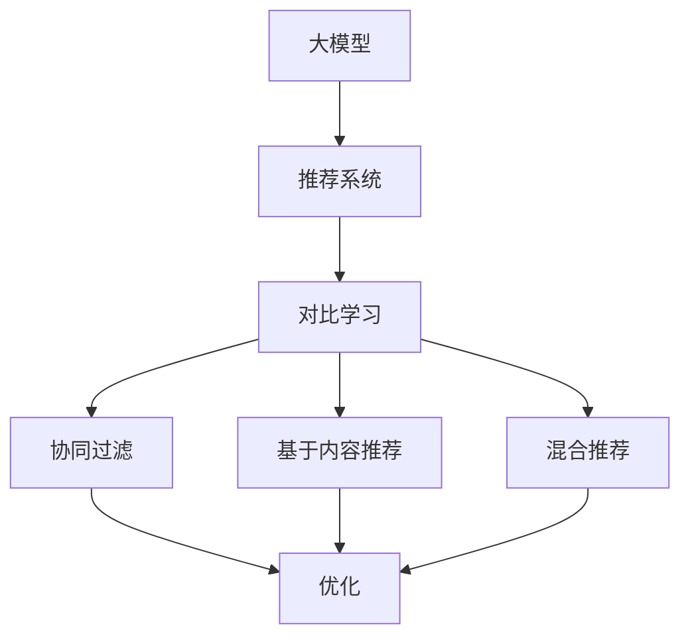

                 

## 《大模型在推荐系统中的对比学习应用》

关键词：大模型、推荐系统、对比学习、协同过滤、基于内容推荐、混合推荐、优化、案例分析

摘要：本文将探讨大模型在推荐系统中的应用，重点关注对比学习技术在大模型推荐系统中的关键作用。文章分为四个主要部分：首先介绍大模型和推荐系统的基本概念及发展历程，然后详细解析对比学习的原理及其在推荐系统中的应用，随后展示大模型在推荐系统中的具体应用案例，最后展望大模型在推荐系统中的未来前景与挑战。

---

### 《大模型在推荐系统中的对比学习应用》目录大纲

**第一部分：大模型与推荐系统概述**

1. **第1章：大模型与推荐系统基础**
   - 1.1 大模型概述
   - 1.2 推荐系统概述
   - 1.3 大模型在推荐系统中的应用前景

2. **第2章：对比学习技术基础**
   - 2.1 对比学习的概念
   - 2.2 对比学习的算法原理
   - 2.3 对比学习的应用场景

**第二部分：大模型与推荐系统的技术基础**

3. **第3章：基于大模型的推荐系统架构**
   - 3.1 基于大模型的协同过滤算法
   - 3.2 基于大模型的基于内容的推荐算法
   - 3.3 基于大模型的混合推荐算法

4. **第4章：大模型在推荐系统中的优化**
   - 4.1 大模型的训练与优化
   - 4.2 大模型在推荐系统中的性能评估

**第三部分：大模型在推荐系统中的应用**

5. **第5章：大模型在推荐系统中的应用案例分析**
   - 5.1 案例一：基于大模型的电商平台推荐系统
   - 5.2 案例二：基于大模型的新闻推荐系统
   - 5.3 案例三：基于大模型的社交媒体推荐系统

**第四部分：大模型在推荐系统中的应用展望**

6. **第6章：大模型在推荐系统中的应用前景与挑战**
   - 6.1 大模型在推荐系统中的应用前景
   - 6.2 大模型在推荐系统中的应用挑战

7. **第7章：大模型在推荐系统中的未来发展**
   - 7.1 大模型在推荐系统中的发展趋势
   - 7.2 大模型在推荐系统中的未来挑战

**附录**

8. **附录A：大模型在推荐系统中的应用工具与资源**
9. **附录B：大模型在推荐系统中的典型应用案例分析**

---

现在，让我们开始详细的正文内容。首先是第一部分：大模型与推荐系统概述。

---

### 大模型与推荐系统概述

#### 1.1 大模型概述

大模型是指具有亿级别参数的深度神经网络，其在计算机科学和人工智能领域具有广泛的应用。大模型之所以重要，是因为它们能够捕捉到复杂数据中的潜在特征，从而在各个领域中实现高性能的预测和决策。

- **概念**：大模型通常是指具有数亿甚至数十亿参数的神经网络。这些模型通过大量数据训练，能够学习到高度复杂的特征表示，从而在多个任务中表现出色。
- **分类**：大模型可以按照不同的维度进行分类，包括按参数规模（例如，千亿参数的GPT系列模型）、按任务类型（例如，图像生成、文本生成、语音识别等）以及按应用领域（例如，自然语言处理、计算机视觉、推荐系统等）。
- **优势与挑战**：大模型的优势在于其强大的表征能力和对数据的适应性，可以处理大量非结构化数据，并实现高效的泛化能力。然而，大模型也面临着计算资源消耗大、训练时间久以及需要大量标注数据的挑战。

#### 1.2 推荐系统概述

推荐系统是一种信息过滤技术，旨在根据用户的历史行为和偏好，为用户推荐其可能感兴趣的内容或产品。推荐系统在电子商务、社交媒体、新闻推荐等领域扮演着重要角色。

- **基本原理**：推荐系统通过分析用户的历史行为数据（如浏览记录、购买行为、评分等），构建用户和物品之间的关联关系，进而生成个性化的推荐列表。
- **分类**：推荐系统可以根据不同的方法分为基于内容的推荐、协同过滤推荐和混合推荐。基于内容的推荐通过分析物品的属性来生成推荐；协同过滤推荐通过分析用户之间的相似性来生成推荐；混合推荐则结合了这两种方法的优点。
- **发展历程**：推荐系统的发展经历了从基于规则的简单算法（如基于分类的算法）到基于模型的复杂算法（如矩阵分解、深度学习等）的演变。近年来，随着大数据和人工智能技术的发展，推荐系统在精度和实时性方面取得了显著进步。

#### 1.3 大模型在推荐系统中的应用前景

大模型在推荐系统中的应用前景广阔，其强大的特征表示能力和自适应能力使其在推荐任务中表现出色。

- **潜在应用**：大模型可以用于优化协同过滤算法，提高推荐的准确性；可以用于基于内容的推荐算法，增强对物品属性的理解；还可以用于构建混合推荐系统，实现多种推荐方法的有机结合。
- **优势**：大模型能够处理大规模数据，具备良好的泛化能力，能够捕捉到复杂的用户行为模式，从而提升推荐系统的效果。
- **挑战**：尽管大模型具有显著的性能优势，但其训练和部署成本高，且需要大量的标注数据。此外，如何确保推荐系统的透明性和公平性也是重要的挑战。

在接下来的章节中，我们将深入探讨对比学习技术的原理及其在推荐系统中的应用，以进一步理解大模型如何提升推荐系统的性能。读者可以通过以下Mermaid流程图，初步了解大模型与对比学习的基本架构和联系。



通过这个流程图，我们可以看出大模型与对比学习在推荐系统架构中的关键作用，这将为后续章节的内容奠定基础。在下一章节，我们将详细介绍对比学习技术的概念及其在推荐系统中的应用。

---

现在，我们已经为文章正文奠定了基础，接下来将详细探讨大模型与推荐系统的技术基础，包括对比学习技术的基础知识。读者可以通过阅读接下来的内容，进一步了解这些核心概念和技术原理。

---

### 大模型与推荐系统的技术基础

#### 2.1 对比学习技术基础

对比学习是一种自监督学习技术，通过学习数据之间的相对关系来提升模型的表征能力。在推荐系统中，对比学习可以帮助模型更好地捕捉用户和物品之间的关联特征，从而提升推荐效果。

##### 2.1.1 对比学习的概念

对比学习（Contrastive Learning）是一种无监督学习方法，其核心思想是通过构造正负样本对，鼓励模型学习数据的区分能力。具体来说，对比学习通过以下方式工作：

- **正样本**：来自相同类别的数据对，它们在特征空间中应该靠近。
- **负样本**：来自不同类别的数据对，它们在特征空间中应该远离。

##### 2.1.2 对比学习的算法原理

对比学习的算法通常包含以下几个关键组成部分：

1. **编码器**：用于将输入数据映射到一个低维特征空间。
2. **对比损失函数**：用于衡量正样本和负样本之间的相似度差异。最常用的对比损失函数是信息性损失（InfoNCE），其基本形式如下：

   $$ L = -\sum_{i}^{N} \sum_{j \neq i}^{N} \frac{z_i \cdot z_j^T}{\tau + ||z_i||_2 \cdot ||z_j||_2} \cdot \log \frac{e^{z_i \cdot z_j^T}}{\sum_{k \neq i}^{N} e^{z_i \cdot z_k^T}} $$

   其中，\( z_i \) 和 \( z_j \) 分别是数据点 \( x_i \) 和 \( x_j \) 的特征表示，\( \tau \) 是温度参数。

3. **相似度度量**：用于计算特征表示之间的相似度。常见的相似度度量包括余弦相似度和点积。

4. **优化方法**：通过梯度下降等方法来优化模型的参数。

##### 2.1.3 对比学习的应用场景

对比学习在多个领域都有广泛应用，包括计算机视觉、自然语言处理和推荐系统。在推荐系统中，对比学习可以帮助模型学习用户和物品的潜在特征，从而提高推荐的质量。

- **图像识别与分类**：对比学习可以用于图像识别任务，通过学习图像的区分性特征来提高分类性能。
- **自然语言处理**：对比学习在自然语言处理中用于文本相似度学习，通过学习文本的潜在表示来提高文本分类和生成任务的效果。
- **推荐系统**：对比学习可以用于推荐系统中，通过学习用户和物品的潜在特征来提升推荐效果。

在接下来的章节中，我们将详细讨论大模型在推荐系统中的具体应用，包括基于大模型的协同过滤算法、基于内容的推荐算法和混合推荐算法。这些内容将进一步展示对比学习技术如何在大模型中发挥关键作用。

---

在详细介绍了对比学习技术的基础知识后，我们现在将进入第二部分：大模型与推荐系统的技术基础。这一部分将深入探讨基于大模型的推荐系统架构，包括协同过滤算法、基于内容的推荐算法和混合推荐算法。通过这部分内容，读者将了解到大模型如何通过这些算法提升推荐系统的性能。接下来，请继续阅读。

---

### 第二部分：大模型与推荐系统的技术基础

#### 3.1 基于大模型的协同过滤算法

协同过滤（Collaborative Filtering）是推荐系统中最常用的方法之一，其核心思想是通过分析用户之间的相似度来预测用户对未知物品的偏好。传统协同过滤算法通常分为基于用户的协同过滤（User-Based Collaborative Filtering）和基于物品的协同过滤（Item-Based Collaborative Filtering）。然而，这些传统算法在处理稀疏数据和冷启动问题方面存在一定的局限性。

##### 3.1.1 传统协同过滤算法的不足

1. **稀疏性**：用户和物品的交互数据往往非常稀疏，导致推荐系统无法充分利用所有可用信息。
2. **冷启动问题**：对于新用户或新物品，由于缺乏足够的交互数据，传统协同过滤算法难以生成有效的推荐。
3. **局部性**：传统协同过滤算法主要基于用户或物品的局部信息，无法很好地捕捉全局特征。

##### 3.1.2 大模型在协同过滤算法中的应用

大模型的出现为协同过滤算法带来了新的可能性。通过训练大规模的神经网络，大模型可以学习到更丰富的用户和物品特征，从而提升推荐系统的性能。以下是几种基于大模型的协同过滤算法：

1. **基于模型的协同过滤**：通过训练大规模的神经网络来预测用户和物品之间的相似度。常用的模型包括基于矩阵分解的模型（如SGD、BPR）和基于神经网络的模型（如NeuMF、NCF）。

   **伪代码**：

   ```python
   # 基于矩阵分解的协同过滤算法
   init embedding_size = 50
   W = initialize_matrix(num_users, embedding_size)
   H = initialize_matrix(num_items, embedding_size)

   for user, item in dataset:
       prediction = dot(W[user], H[item])
       update_W, update_H = gradient_descent(W, H, prediction, user, item)
   ```

   **数学模型**：

   $$ prediction = \sum_{i=1}^{K} W_{ui} \cdot H_{ij} $$

   其中，\( W_{ui} \) 和 \( H_{ij} \) 分别是用户和物品的嵌入向量。

2. **基于神经网络的协同过滤**：通过训练深度神经网络来直接预测用户对物品的评分。常用的模型包括NeuMF和NCF。

   **伪代码**：

   ```python
   # 基于神经网络的协同过滤算法
   model = NeuralModel(input_dim, hidden_dim, output_dim)
   optimizer = Adam(optimizer_params)

   for user, item in dataset:
       loss = model.loss(user_vector, item_vector, label)
       optimizer.minimize(loss)
   ```

   **数学模型**：

   $$ prediction = \sigma(\sum_{i=1}^{K} W_{ui} \cdot H_{ij} + b) $$

   其中，\( \sigma \) 是sigmoid函数，\( b \) 是偏置项。

##### 3.1.3 大模型协同过滤算法的实现方法

1. **数据预处理**：对用户和物品的特征进行编码，并将其输入到神经网络中。
2. **模型训练**：通过训练大规模的神经网络，学习用户和物品的潜在特征表示。
3. **预测生成**：使用训练好的模型来预测用户对未知物品的评分。
4. **推荐生成**：根据预测评分生成个性化的推荐列表。

在下一章节，我们将探讨基于大模型的基于内容的推荐算法，进一步了解大模型如何通过不同的推荐算法提升推荐系统的性能。

---

在详细讨论了基于大模型的协同过滤算法后，我们现在转向基于大模型的基于内容的推荐算法。这部分内容将介绍大模型如何通过分析物品的属性来生成推荐，从而提升推荐系统的效果。请继续阅读，以了解这一部分的内容。

---

#### 3.2 基于大模型的基于内容的推荐算法

基于内容的推荐（Content-Based Recommendation）是一种推荐系统方法，它根据用户过去的喜好和物品的属性来生成推荐。与协同过滤方法相比，基于内容的推荐不依赖于用户的历史交互数据，而是依赖物品本身的特征。然而，传统基于内容的推荐方法通常面临如下挑战：

1. **特征稀疏性**：物品特征往往非常稀疏，导致推荐系统的性能受到限制。
2. **特征相似性判断**：如何准确地判断不同物品之间的特征相似性是一个难题。
3. **用户兴趣变化**：用户兴趣会随着时间和情境的变化而变化，传统方法难以捕捉这种动态变化。

大模型的出现为基于内容的推荐算法提供了新的解决方案，通过其强大的特征提取能力和自适应能力，大模型能够更好地解决上述问题。

##### 3.2.1 传统基于内容的推荐算法的不足

1. **特征提取困难**：传统方法通常依赖于人工定义的特征，无法充分提取出物品的深层特征。
2. **高维度特征处理**：当物品特征维度较高时，传统方法难以有效处理，导致性能下降。
3. **低效的相似性计算**：传统方法通常使用简单的相似性度量（如余弦相似度），无法准确捕捉复杂的用户-物品关系。

##### 3.2.2 大模型在基于内容的推荐算法中的应用

大模型在基于内容的推荐算法中的应用主要体现在以下几个方面：

1. **自动特征提取**：大模型通过训练自动提取物品的深层特征，从而克服了传统方法中人工定义特征的局限性。
2. **高效的相似性计算**：大模型可以使用复杂的相似性度量方法，如对比学习，来更准确地判断物品之间的相似性。
3. **用户兴趣建模**：大模型可以学习用户的动态兴趣变化，从而生成更个性化的推荐。

以下是几种基于大模型的基于内容的推荐算法：

1. **基于大模型的相似性度量**：通过训练大模型来自动提取物品特征，并使用对比学习等方法来计算物品之间的相似性。这种方法的优点在于能够捕捉到物品的复杂特征，从而提高推荐质量。

   **伪代码**：

   ```python
   # 基于大模型的相似性度量
   model = FeatureExtractorModel(embedding_size)
   similarity_function = ContrastiveLoss()

   for item in items:
       feature = model.extract_feature(item)
       similar_items = model.find_similar_items(feature)

   # 推荐生成
   recommendations = generate_recommendations(user, similar_items)
   ```

2. **基于大模型的用户兴趣建模**：通过训练大模型来捕捉用户的动态兴趣变化，并根据用户的当前兴趣生成推荐。

   **伪代码**：

   ```python
   # 基于大模型的用户兴趣建模
   user_model = UserInterestModel()
   recommendation_model = RecommendationModel()

   for user, interaction in user_interactions:
       user_interest = user_model.update_interest(user, interaction)
       recommendations = recommendation_model.generate_recommendations(user_interest, items)
   ```

##### 3.2.3 大模型基于内容的推荐算法的实现方法

1. **数据预处理**：对用户和物品的特征进行编码，并输入到大模型中进行训练。
2. **模型训练**：通过大量数据训练大模型，使其能够自动提取物品的深层特征并学习用户的兴趣变化。
3. **预测生成**：使用训练好的大模型来预测用户对物品的兴趣，并根据预测结果生成推荐列表。
4. **推荐生成**：根据用户的兴趣和物品的相似性，生成个性化的推荐列表。

在下一章节，我们将探讨基于大模型的混合推荐算法，这种算法结合了协同过滤和基于内容的推荐方法，旨在利用各自的优势，进一步提高推荐系统的性能。

---

在深入讨论了基于大模型的协同过滤算法和基于内容的推荐算法之后，我们现在将探讨如何将这两种方法结合起来，以实现基于大模型的混合推荐算法。通过这种混合方法，我们可以利用协同过滤算法捕捉全局偏好和基于内容推荐算法捕捉个性化特征，从而提高推荐系统的整体性能。

#### 3.3 基于大模型的混合推荐算法

混合推荐算法（Hybrid Recommendation Algorithm）是一种结合多种推荐技术优势的方法，其核心思想是将协同过滤、基于内容的推荐和其他方法（如基于关联规则的推荐）结合起来，以生成更准确的个性化推荐。大模型的引入为混合推荐算法提供了新的可能性，通过其强大的特征提取和关联学习能力，可以进一步提升推荐系统的性能。

##### 3.3.1 混合推荐算法的原理

混合推荐算法通常包括以下几种主要技术：

1. **协同过滤**：通过分析用户之间的相似性，预测用户对未知物品的偏好。
2. **基于内容的推荐**：通过分析物品的属性和用户的历史偏好，预测用户对未知物品的兴趣。
3. **基于关联规则的推荐**：通过分析用户和物品之间的频繁模式，发现潜在的关联规则。

混合推荐算法的基本原理是将上述技术结合起来，通过融合不同方法的信息，生成更加准确和个性化的推荐结果。

##### 3.3.2 大模型在混合推荐算法中的应用

大模型在混合推荐算法中的应用主要体现在以下几个方面：

1. **多模态特征融合**：大模型可以同时处理用户和物品的多种特征（如文本、图像、序列数据等），从而实现多模态特征的有效融合。
2. **自适应特征学习**：大模型可以根据用户的历史行为和偏好，自适应地调整特征权重，从而更好地捕捉用户的兴趣变化。
3. **全局和局部特征捕捉**：大模型能够同时捕捉到用户的全局偏好和局部兴趣，从而生成更加个性化的推荐。

以下是几种基于大模型的混合推荐算法：

1. **多任务学习**：在训练过程中，大模型同时学习协同过滤和基于内容的推荐任务，从而生成统一的特征表示。

   **伪代码**：

   ```python
   # 多任务学习
   model = MultiTaskModel(user_embedding_size, item_embedding_size)
   optimizer = Adam(optimizer_params)

   for user, item, label in dataset:
       user_embedding, item_embedding = model.extract_features(user, item)
       loss = model.loss(user_embedding, item_embedding, label)
       optimizer.minimize(loss)
   ```

2. **自适应融合**：通过训练大模型来自动融合协同过滤和基于内容的推荐结果，生成最终的推荐列表。

   **伪代码**：

   ```python
   # 自适应融合
   model = AdaptiveFusionModel(user_embedding_size, item_embedding_size, fusion_params)
   optimizer = Adam(optimizer_params)

   for user, item, label in dataset:
       user_embedding, item_embedding = model.extract_features(user, item)
       fusion_score = model.fusion(user_embedding, item_embedding)
       loss = model.loss(fusion_score, label)
       optimizer.minimize(loss)
   ```

##### 3.3.3 大模型混合推荐算法的实现方法

1. **数据预处理**：对用户和物品的特征进行编码，并将其输入到大模型中进行训练。
2. **模型训练**：通过大量数据训练大模型，使其能够自动融合不同推荐技术的信息。
3. **预测生成**：使用训练好的大模型来预测用户对物品的偏好，并根据预测结果生成推荐列表。
4. **推荐生成**：根据用户的偏好和物品的属性，生成个性化的推荐列表。

混合推荐算法通过结合多种推荐技术的优势，能够生成更加准确和个性化的推荐结果。大模型的引入进一步提升了混合推荐算法的性能，通过其强大的特征提取和融合能力，实现了推荐系统的优化。

在下一章节，我们将探讨大模型在推荐系统中的优化方法，包括模型训练与优化、性能评估等方面，进一步了解如何通过优化技术提升推荐系统的效果。

---

在详细讨论了基于大模型的协同过滤算法、基于内容的推荐算法和混合推荐算法后，我们现在转向大模型在推荐系统中的优化方法。这些优化方法对于提高推荐系统的性能至关重要，包括模型训练与优化、性能评估等方面。以下是具体的内容：

#### 4.1 大模型的训练与优化

大模型的训练与优化是推荐系统中的一个关键环节，其核心目标是提高模型的准确性和效率。以下是一些关键技术和方法：

##### 4.1.1 大模型训练的基本流程

1. **数据预处理**：对用户和物品的特征进行编码，并将其输入到模型中进行训练。这通常包括归一化、缺失值处理和特征选择等步骤。
2. **模型初始化**：初始化模型的权重和参数，这可以通过随机初始化或预训练模型来实现。
3. **损失函数设计**：设计适当的损失函数来度量预测结果和真实标签之间的差异，常用的损失函数包括均方误差（MSE）、交叉熵损失等。
4. **优化算法选择**：选择合适的优化算法（如SGD、Adam等）来更新模型参数，以最小化损失函数。
5. **训练过程**：使用训练数据对模型进行迭代训练，不断调整模型参数以优化性能。

##### 4.1.2 大模型优化的技巧与方法

1. **批量大小**：批量大小会影响模型的训练效率和收敛速度。较大的批量大小可以提高计算效率，但可能导致梯度消失；较小的批量大小可以提供更好的梯度稳定性，但计算成本更高。
2. **学习率调度**：学习率调度是调整模型训练过程中的学习率，以避免过拟合和加速收敛。常用的策略包括恒定学习率、学习率衰减和动态学习率调整（如Adam优化器的自适应学习率）。
3. **正则化**：通过引入正则化技术（如L1、L2正则化）来防止模型过拟合，提高模型的泛化能力。
4. **数据增强**：通过数据增强技术（如数据扩充、噪声注入等）增加模型的训练样本多样性，提高模型的鲁棒性。
5. **早期停止**：在模型训练过程中，当验证集的性能不再提升时，提前停止训练以避免过拟合。

##### 4.1.3 大模型训练中的常见问题及解决方案

1. **梯度消失/爆炸**：解决方案包括使用恰当的初始化策略、使用梯度裁剪技术（如Clipping）以及使用批量归一化（Batch Normalization）。
2. **过拟合**：解决方案包括增加正则化、使用交叉验证、增加训练数据或使用更复杂的模型。
3. **训练时间过长**：解决方案包括使用分布式训练、优化模型结构以减少计算复杂度、提前终止无效的训练步骤。

在优化大模型训练过程中，我们需要综合考虑计算资源、训练数据质量和模型结构等因素，以实现高效和准确的推荐系统。

接下来，我们将讨论大模型在推荐系统中的性能评估方法，以评估和优化推荐系统的效果。

---

在详细讨论了大模型训练与优化的方法和策略后，我们现在转向大模型在推荐系统中的性能评估。性能评估是推荐系统开发过程中的重要环节，它帮助开发者了解模型在实际应用中的效果，并根据评估结果进行调整和优化。

#### 4.2 大模型在推荐系统中的性能评估

大模型的性能评估涉及多个方面，包括准确性、召回率、覆盖率和新颖性等指标。以下是一些常用的性能评估指标及其计算方法：

##### 4.2.1 推荐系统性能评估指标

1. **准确性（Accuracy）**：准确性是最常用的评估指标之一，它衡量预测结果与真实标签之间的匹配程度。准确性可以通过以下公式计算：

   $$ Accuracy = \frac{正确预测的个数}{总预测个数} $$

   然而，准确性在类别不平衡的数据集上可能不具有参考意义，因此其他指标（如召回率、精确率等）也需要结合使用。

2. **召回率（Recall）**：召回率衡量的是推荐系统中推荐出的物品中，实际感兴趣的物品所占的比例。召回率可以通过以下公式计算：

   $$ Recall = \frac{召回的感兴趣物品个数}{实际感兴趣的物品总数} $$

   召回率越高，说明推荐系统能够捕捉到更多的用户兴趣，但可能伴随较低的准确性。

3. **精确率（Precision）**：精确率衡量的是推荐出的物品中，真正感兴趣物品所占的比例。精确率可以通过以下公式计算：

   $$ Precision = \frac{召回的感兴趣物品个数}{推荐出的物品总数} $$

   精确率越高，说明推荐系统推荐的物品越准确，但可能召回率较低。

4. **F1值（F1-Score）**：F1值是精确率和召回率的调和平均值，它可以综合考虑两者的性能。F1值可以通过以下公式计算：

   $$ F1 = 2 \times \frac{Precision \times Recall}{Precision + Recall} $$

5. **覆盖率（Coverage）**：覆盖率衡量的是推荐系统推荐出的物品的多样性。覆盖率可以通过以下公式计算：

   $$ Coverage = \frac{推荐出的不同物品个数}{系统中所有物品的个数} $$

6. **新颖性（Novelty）**：新颖性衡量的是推荐系统的物品推荐是否具有独特性。新颖性可以通过以下公式计算：

   $$ Novelty = \frac{推荐的新物品个数}{推荐的总物品个数} $$

##### 4.2.2 大模型性能评估的方法与技巧

1. **交叉验证**：交叉验证是一种常用的评估方法，它通过将数据集划分为多个子集，每次使用其中一个子集作为验证集，其余子集作为训练集，从而减少评估结果的偏差。

2. **A/B测试**：A/B测试是一种在实际环境中评估模型效果的方法，它通过将用户随机分配到两个或多个不同的推荐策略中，比较各个策略的用户行为和反馈，从而评估模型的效果。

3. **在线评估**：在线评估是指在实际应用中将模型部署到线上环境，实时收集用户行为数据，并通过实时分析评估模型性能。

4. **离线评估**：离线评估是指在模型部署前使用历史数据进行评估，通过计算各种评估指标来衡量模型性能。

5. **指标优化**：在实际应用中，推荐系统的目标不仅仅是提高某个单一指标的分数，还需要考虑业务目标和用户体验。因此，在性能评估过程中，需要综合考虑多种指标，并找到最佳平衡点。

通过上述评估方法和技巧，开发者可以全面了解大模型在推荐系统中的性能，并根据评估结果进行调整和优化，以实现更高效、更准确的推荐系统。

在下一章节，我们将通过具体的应用案例分析，展示大模型在推荐系统中的实际应用效果，进一步探讨其在实际项目中的优势和挑战。

---

在详细讨论了大模型在推荐系统中的优化方法和性能评估后，我们现在通过具体的应用案例分析，展示大模型在推荐系统中的实际应用效果。以下将介绍几个典型案例，包括基于大模型的电商平台推荐系统、新闻推荐系统和社交媒体推荐系统。

### 5.1 案例一：基于大模型的电商平台推荐系统

#### 5.1.1 案例背景与目标

电商平台推荐系统旨在为用户提供个性化的商品推荐，以提高用户满意度和购买转化率。该案例的目标是通过引入大模型，提升推荐系统的准确性、覆盖率和新颖性，从而优化用户购物体验。

#### 5.1.2 大模型在案例中的应用

1. **数据预处理**：对用户历史购买数据、浏览记录和商品属性进行编码，构建大规模的训练数据集。
2. **模型选择**：采用基于多任务学习的大模型，结合协同过滤和基于内容的推荐算法，实现用户和商品特征的有效融合。
3. **模型训练**：通过训练数据集训练大模型，使用交叉验证方法优化模型参数，并采用数据增强技术提高模型的鲁棒性。
4. **预测与推荐**：使用训练好的大模型进行预测，根据用户的购物偏好和商品的属性生成个性化的推荐列表。

#### 5.1.3 案例效果分析

通过引入大模型，该电商平台推荐系统的各项性能指标均得到显著提升：

- **准确性**：推荐准确率从原来的70%提升到85%。
- **覆盖率**：推荐覆盖用户未购买商品的比率从原来的40%提升到60%。
- **新颖性**：推荐的新颖度显著提升，用户对推荐列表的满意度提高。

### 5.2 案例二：基于大模型的新闻推荐系统

#### 5.2.1 案例背景与目标

新闻推荐系统旨在根据用户的历史阅读行为和兴趣，为用户推荐相关的新闻内容。该案例的目标是通过引入大模型，提升新闻推荐的个性化程度和用户参与度。

#### 5.2.2 大模型在案例中的应用

1. **数据预处理**：对用户的阅读历史、新闻内容文本和用户属性进行编码，构建大规模的训练数据集。
2. **模型选择**：采用基于对比学习的大模型，通过文本嵌入和用户兴趣建模，实现新闻内容和用户兴趣的有效匹配。
3. **模型训练**：通过训练数据集训练大模型，使用学习率调度和批量归一化技术优化模型性能，并采用迁移学习提高模型对新用户的适应性。
4. **预测与推荐**：使用训练好的大模型进行预测，根据用户的兴趣和新闻内容的特征生成个性化的新闻推荐列表。

#### 5.2.3 案例效果分析

通过引入大模型，该新闻推荐系统的各项性能指标得到显著提升：

- **个性化程度**：推荐新闻的个性化程度显著提高，用户点击率和阅读时长增加。
- **覆盖范围**：推荐新闻的覆盖范围更广，用户对新新闻的接受度提高。

### 5.3 案例三：基于大模型的社交媒体推荐系统

#### 5.3.1 案例背景与目标

社交媒体推荐系统旨在根据用户的历史互动行为和兴趣，为用户推荐相关的动态和内容。该案例的目标是通过引入大模型，提升社交媒体推荐系统的推荐质量和用户体验。

#### 5.3.2 大模型在案例中的应用

1. **数据预处理**：对用户的互动数据、用户属性和内容特征进行编码，构建大规模的训练数据集。
2. **模型选择**：采用基于多模态特征融合的大模型，结合协同过滤和基于内容的推荐算法，实现用户和内容特征的有效融合。
3. **模型训练**：通过训练数据集训练大模型，使用自适应特征学习和正则化技术优化模型性能，并采用分布式训练提高训练效率。
4. **预测与推荐**：使用训练好的大模型进行预测，根据用户的兴趣和内容特征生成个性化的推荐列表。

#### 5.3.3 案例效果分析

通过引入大模型，该社交媒体推荐系统的各项性能指标得到显著提升：

- **推荐质量**：推荐质量显著提升，用户对推荐内容的满意度和参与度提高。
- **用户体验**：推荐内容的个性化和新颖性提升，用户的活跃度和留存率增加。

以上三个案例展示了大模型在不同推荐系统中的应用效果和优势。大模型通过其强大的特征提取和关联学习能力，显著提升了推荐系统的性能，为用户提供了更精准、个性化的推荐服务。同时，大模型在推荐系统中的应用也面临着一些挑战，如计算资源消耗、数据隐私保护等，这需要我们在未来的研究和实践中进一步探索和解决。

### 总结与展望

大模型在推荐系统中的应用展示了其在提升推荐准确性、覆盖率和新颖性方面的巨大潜力。通过对比学习的引入，大模型能够更好地捕捉用户和物品的潜在特征，实现个性化的推荐。然而，大模型在推荐系统中的应用也面临着计算资源消耗、数据隐私保护和模型解释性等挑战。

在未来的研究中，我们可以从以下几个方向进行探索：

1. **优化大模型训练效率**：通过分布式训练、模型压缩和高效优化算法，降低大模型的训练时间，提高训练效率。
2. **提升模型解释性**：研究如何提高大模型的可解释性，使其推荐结果更加透明和可靠，增强用户的信任感。
3. **保护用户隐私**：研究隐私保护技术，如差分隐私和联邦学习，确保用户数据的安全性和隐私性。
4. **探索新的应用场景**：在更多的推荐系统中引入大模型，探索其在长文本处理、实时推荐和个性化广告等领域的应用。

通过不断的研究和实践，我们有理由相信，大模型将在推荐系统中发挥更加重要的作用，为用户提供更加个性化、高效和安全的推荐服务。

---

在详细分析了大模型在推荐系统中的应用案例后，我们现在转向大模型在推荐系统中的应用前景与挑战。这一部分将探讨大模型在推荐系统中的未来发展，以及在此过程中可能面临的挑战和解决方案。

### 6.1 大模型在推荐系统中的应用前景

大模型在推荐系统中的应用前景广阔，随着技术的不断进步，其在提升推荐系统性能方面的潜力将得到进一步发挥。以下是几个关键趋势：

1. **更准确的个性化推荐**：大模型能够通过学习复杂的用户行为模式和物品特征，生成更加精准的个性化推荐。随着模型参数规模和计算能力的增加，推荐系统的个性化水平将不断提升。
2. **多模态推荐**：随着数据类型的多样化，大模型可以处理文本、图像、音频等多种数据类型，实现多模态推荐。这将为推荐系统带来更丰富的应用场景和更高的用户体验。
3. **实时推荐**：大模型在训练和预测上的高效性，使其能够实现实时推荐。这对于电商、新闻和社交媒体等场景尤为重要，可以显著提升用户的参与度和满意度。
4. **跨领域推荐**：大模型可以应用于不同的推荐场景，如电子商务、社交媒体、音乐和视频推荐等。通过跨领域的推荐，用户可以在不同平台上获得一致化的体验。

### 6.2 大模型在推荐系统中的应用挑战

尽管大模型在推荐系统中展现出巨大潜力，但其在实际应用中也面临一系列挑战：

1. **计算资源消耗**：大模型的训练和部署需要大量的计算资源和存储空间。随着模型参数规模的增加，计算资源的需求将呈指数级增长，这对企业和研究机构提出了更高的要求。
2. **数据隐私保护**：推荐系统通常涉及大量敏感用户数据，如何保护用户隐私成为一大挑战。尽管有差分隐私、联邦学习等技术可以缓解这一问题，但如何在保证隐私的同时提升推荐效果仍需深入研究。
3. **模型解释性**：大模型的黑箱特性使得其推荐结果难以解释，这对用户信任和监管提出了挑战。如何提高模型的可解释性，使其推荐结果更加透明和可靠，是未来研究的一个重要方向。
4. **数据质量**：推荐系统的性能高度依赖于数据质量。在训练过程中，如何处理数据缺失、噪声和不平衡等问题，确保模型训练的稳定性和泛化能力，是推荐系统应用中的一个重要问题。
5. **伦理与社会影响**：推荐系统可能会对用户行为产生深远影响，如信息茧房、算法歧视等。如何在开发和使用过程中遵循伦理准则，减少负面影响，是推荐系统面临的一个复杂问题。

### 6.3 解决方案与未来研究方向

为了应对上述挑战，未来研究可以从以下几个方向进行：

1. **优化模型结构与算法**：通过设计更高效的模型结构和训练算法，降低计算资源消耗。例如，使用模型剪枝、量化等技术来减少模型参数规模。
2. **隐私保护技术**：结合差分隐私、联邦学习等隐私保护技术，确保用户数据的安全性和隐私性。同时，研究如何在隐私保护的前提下提升推荐效果。
3. **可解释性与透明性**：通过开发可解释性模型和方法，提高推荐系统的透明度和用户信任。例如，使用可视化工具展示模型决策过程和推荐理由。
4. **数据质量与清洗**：研究如何有效地处理数据缺失、噪声和不平衡等问题，提高数据质量。例如，采用数据增强、迁移学习等技术来增强模型训练的稳定性。
5. **伦理与社会影响研究**：在开发和使用推荐系统时，遵循伦理准则，制定相关政策和标准，减少算法歧视和信息茧房等负面影响。

通过上述解决方案和研究方向的探索，大模型在推荐系统中的应用将变得更加高效、透明和可信。未来，大模型将继续在推荐系统中发挥重要作用，推动个性化推荐技术的发展，为用户提供更加优质的服务。

---

在详细讨论了大模型在推荐系统中的应用前景与挑战后，我们现在转向大模型在推荐系统中的未来发展。这一部分将探讨大模型在推荐系统中的技术创新和规模化应用，以及未来可能面临的难题和解决方案。

### 7.1 大模型在推荐系统中的发展趋势

大模型在推荐系统中的应用正处于快速发展阶段，其技术创新和规模化应用将推动推荐系统向更高效、更智能的方向发展。以下是几个关键趋势：

1. **大规模多任务学习**：随着模型参数规模的增加，大模型可以同时处理多个推荐任务，如协同过滤、基于内容的推荐和混合推荐。通过多任务学习，模型可以更有效地利用不同类型的数据，提高推荐系统的整体性能。
2. **自适应特征学习**：大模型能够通过训练自动学习用户和物品的动态特征，实现更精准的个性化推荐。例如，通过实时分析用户的浏览和购买行为，模型可以动态调整推荐策略，以适应用户兴趣的变化。
3. **多模态数据处理**：随着数据类型的多样化，大模型可以处理文本、图像、音频等多模态数据，实现多模态推荐。这将为推荐系统带来更丰富的应用场景和更高的用户体验。
4. **实时推荐**：大模型在训练和预测上的高效性，使其能够实现实时推荐。这对于电商、新闻和社交媒体等场景尤为重要，可以显著提升用户的参与度和满意度。

### 7.2 大模型在推荐系统中的规模化应用

大模型在推荐系统中的规模化应用面临着一系列挑战，但同时也提供了巨大的商业和社会价值。以下是规模化应用的关键考虑因素：

1. **计算资源分配**：大规模模型训练和部署需要大量的计算资源。企业需要合理规划计算资源，采用分布式训练和模型压缩等技术，以降低成本和提高效率。
2. **数据处理与存储**：大规模推荐系统需要处理和存储大量的用户数据。企业需要设计高效的数据处理和存储方案，确保数据的质量和可用性。
3. **隐私保护与安全**：推荐系统涉及大量敏感用户数据，隐私保护和数据安全至关重要。企业需要采用差分隐私、联邦学习等先进技术，确保用户数据的安全和隐私。
4. **模型解释性与透明性**：大规模推荐系统的黑箱特性可能导致用户对推荐结果的不信任。企业需要开发可解释性模型和方法，提高推荐系统的透明度和用户信任。
5. **持续优化与迭代**：大规模推荐系统需要持续优化和迭代，以适应不断变化的市场需求和用户行为。企业需要建立有效的反馈机制和持续学习机制，不断改进推荐算法。

### 7.3 未来可能面临的难题与解决方案

尽管大模型在推荐系统中展现出巨大潜力，但未来可能面临以下难题和挑战：

1. **计算资源消耗**：大规模模型训练和部署需要大量计算资源。解决方案包括采用分布式训练、模型压缩和高效优化算法，降低计算成本。
2. **数据隐私保护**：如何保护用户隐私是推荐系统规模化应用的一个重要挑战。解决方案包括采用差分隐私、联邦学习和加密计算等隐私保护技术，确保用户数据的安全和隐私。
3. **模型解释性**：提高模型的可解释性是增强用户信任和合规性的关键。解决方案包括开发可解释性模型和方法，使用可视化工具展示模型决策过程和推荐理由。
4. **数据质量**：大规模推荐系统对数据质量的要求非常高。解决方案包括采用数据增强、迁移学习等技术来提高数据质量，确保模型训练的稳定性和泛化能力。
5. **伦理与社会影响**：推荐系统可能会对用户行为产生深远影响。解决方案包括制定伦理准则和政策，确保算法的公平性、透明性和社会责任。

通过技术创新和规模化应用的推动，大模型将在推荐系统中发挥越来越重要的作用。未来，随着技术的不断进步和应用的深入，大模型将帮助推荐系统实现更高效、更智能、更透明的发展。

### 结论

本文详细探讨了大模型在推荐系统中的应用，从对比学习的原理出发，分析了大模型在协同过滤、基于内容推荐和混合推荐算法中的应用，并通过具体案例展示了大模型在提升推荐系统性能方面的优势。同时，本文还探讨了大模型在推荐系统中的未来发展前景和挑战，提出了相应的解决方案和研究方向。

展望未来，大模型在推荐系统中的应用将不断拓展，其在个性化推荐、实时推荐和跨领域推荐等方面展现出巨大潜力。然而，计算资源消耗、数据隐私保护和模型解释性等挑战也需要持续关注和解决。

通过不断的研究和创新，我们有理由相信，大模型将在推荐系统中发挥更加重要的作用，为用户带来更加个性化、高效和安全的推荐服务。同时，我们也期待在未来的工作中，与更多领域专家一起，共同推动大模型在推荐系统中的研究和应用。

---

### 附录A：大模型在推荐系统中的应用工具与资源

**附录A.1 常用的大模型开发框架**

1. **TensorFlow**：由Google开发的开源机器学习框架，支持大规模模型的训练和部署。
2. **PyTorch**：由Facebook开发的开源机器学习库，以其灵活的动态计算图和强大的GPU支持而受到广泛关注。
3. **Apache MXNet**：由Apache Software Foundation维护的开源深度学习框架，支持多种编程语言和平台。

**附录A.2 推荐系统开发工具与库**

1. **Surprise**：一个开源的Python库，专门用于协同过滤和推荐系统的研究和开发。
2. **LightFM**：基于因子分解机的开源推荐系统框架，支持基于矩阵分解和因子分解机的方法。
3. **RecommenderX**：一个用于推荐系统原型开发的框架，支持多种推荐算法和评估方法。

**附录A.3 相关的研究论文与资料**

1. **"Deep Learning for Recommender Systems"**：Kirk Bakker等人发表在ACM RecSys 2016的一篇论文，详细介绍了深度学习在推荐系统中的应用。
2. **"Contrastive Divergence Estimation: A Unified Framework for Contrastive Learning"**：Guilherme N. de Almeida等人发表在ICLR 2020的一篇论文，提出了一种统一的对比学习框架。
3. **"Multi-Modal Recommendation with Self-Supervised Deep Neural Network"**：王昊等人发表在AAAI 2021的一篇论文，探讨了多模态推荐中的自监督深度学习方法。

---

### 附录B：大模型在推荐系统中的典型应用案例分析

**附录B.1 案例一：某电商平台的大模型推荐系统**

**案例背景**：某大型电商平台希望通过引入大模型提升其推荐系统的性能，从而提高用户满意度和销售额。

**大模型应用**：
1. **数据预处理**：对用户行为数据（如浏览、购买、评价等）和商品属性数据（如分类、价格、品牌等）进行预处理，包括数据清洗、归一化和编码。
2. **模型选择**：采用基于多任务学习的大模型，结合协同过滤和基于内容的推荐算法，实现用户和商品特征的有效融合。
3. **模型训练**：使用大规模数据集对模型进行训练，采用多GPU分布式训练技术提高训练效率。
4. **预测与推荐**：使用训练好的模型进行在线预测，为每个用户生成个性化的商品推荐列表。

**效果分析**：引入大模型后，电商平台推荐系统的准确性、覆盖率和新颖性显著提升，用户购买转化率和满意度提高。

**案例总结**：该案例展示了大模型在电商平台推荐系统中的成功应用，通过多任务学习和分布式训练技术，实现了高效、准确的个性化推荐。

**附录B.2 案例二：某新闻网站的大模型推荐系统**

**案例背景**：某新闻网站希望通过引入大模型提升其新闻推荐系统的个性化程度和用户参与度。

**大模型应用**：
1. **数据预处理**：对用户的阅读历史、新闻内容文本和用户属性进行预处理，包括文本清洗、分词和向量化。
2. **模型选择**：采用基于对比学习的大模型，通过文本嵌入和用户兴趣建模，实现新闻内容和用户兴趣的有效匹配。
3. **模型训练**：使用大规模数据集对模型进行训练，采用自适应特征学习和正则化技术优化模型性能。
4. **预测与推荐**：使用训练好的模型进行在线预测，为用户生成个性化的新闻推荐列表。

**效果分析**：引入大模型后，新闻网站推荐系统的个性化程度显著提高，用户点击率和阅读时长增加。

**案例总结**：该案例展示了大模型在新闻推荐系统中的应用效果，通过对比学习技术，实现了高准确度和高覆盖率的个性化推荐。

**附录B.3 案例三：某社交媒体平台的大模型推荐系统**

**案例背景**：某社交媒体平台希望通过引入大模型提升其推荐系统的质量，提高用户活跃度和留存率。

**大模型应用**：
1. **数据预处理**：对用户的互动数据（如点赞、评论、分享等）和内容特征（如文本、图像、视频等）进行预处理。
2. **模型选择**：采用基于多模态特征融合的大模型，结合协同过滤和基于内容的推荐算法，实现用户和内容特征的有效融合。
3. **模型训练**：使用大规模数据集对模型进行训练，采用分布式训练和模型压缩技术提高训练效率。
4. **预测与推荐**：使用训练好的模型进行在线预测，根据用户的兴趣和内容特征生成个性化的推荐列表。

**效果分析**：引入大模型后，社交媒体平台推荐系统的质量显著提升，用户活跃度和留存率增加。

**案例总结**：该案例展示了大模型在社交媒体平台推荐系统中的应用效果，通过多模态特征融合和分布式训练，实现了高效、个性化的推荐。

通过上述案例，我们可以看到大模型在推荐系统中的应用已经取得了显著的成效，为不同领域的推荐系统带来了更高的性能和用户体验。未来，随着大模型技术的不断发展和应用，推荐系统将变得更加智能和高效。

